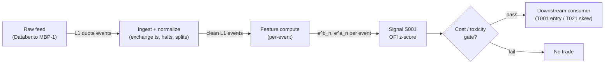

# S001 — Order-flow imbalance (Cont–Kukanov–Stoikov)

Net order-flow pressure at the best bid/ask (adds − cancels − executions),
depth-normalized; a short-horizon adverse-selection gauge. Provenance **[D]**.

> Tag law: every numeric literal in prose carries one of `[documented]
> [default] [example] [unverified] [internal-est] [measured]` (legend: Appendix
> i v1.0.0). Constants inside cited formulas inherit the formula's tag
> (`[documented]` for CKS (2014) [documented]). Bibliographic years, volumes,
> pages, arXiv IDs, section numbers, rule codes (C1–C10), fail-safe codes
> (F1–F5), module IDs, and machine-parsed §0 data fields are identifiers, not
> literals, and are exempt.

## §1 Five-minute reviewer card

| Row | Value |
|---|---|
| Module | S001 — Order-flow imbalance (Cont–Kukanov–Stoikov), v1.0.0 |
| Edge verdict | `PREDICTIVE-FEATURE-ONLY` — documented explanatory power, no published after-cost Sharpe for a standalone rule |
| After-cost | `BEFORE-COST` — literature results are contemporaneous regressions / R², not after-cost P&L; one-sentence verdict: strong microstructure *feature*, weak standalone *trigger* |
| Build cost | Tier M · `20–60` h [internal-est] · `$3,000–9,000` loaded [internal-est] |
| Data cost | Research: Massive Stocks Starter `~$29`/mo (15-min-delayed WebSocket quotes, prototype/simulated-only) [unverified]; validation history: Databento DBEQ.BASIC MBP-1 `$2.00`/GB historical [documented]; production: Massive Stocks Advanced `~$199`/mo (real-time quotes) [unverified], or exchange-timestamped L1 (Databento live `$2.40`/GB [documented]) — bands indicative, verify before budgeting |
| latency_class | microstructure / sub-second |
| risk_class | low (signal-only; no order placement) |
| Capacity | `$1–10`M/day notional [example] — illustrative; calibrate per venue |
| Executability | Feasible: Python+polars prototype, `≤20` symbols live [internal-est]; Rust ingest beyond that |
| Risk summary | Latency-dominated; dies on wide spreads, thin books, SIP-latency races, spoofable queues; never traded standalone on market orders at retail latency |
| When it dies | Spread `>3` ticks [default]; depth collapse (stress); SIP-only feed in a colocated race; quote flicker / spoofing regimes |
| Regime gates | Provisional: R001 elevated RV amplifies, extreme RV kills (spread convexity); R010 extreme spread stands down. Machine records in §S2 (regime-gate table). |
| Emits | `signal_vector` (Appendix b v1.0.0) — never orders |

## §1.5 Cheapest / least-build path

1. **Prototype hour band:** `20–60` h [internal-est] — event-state machine +
   timestamp/halt handling + depth normalizer + reference validation against
   the fixture.
2. **Cheapest-source row:** min_tier = **Massive (formerly Polygon.io) Stocks
   Starter** — cheapest *live-quote* data source candidate [unverified]; the
   free Stocks Basic tier is end-of-day only (5 calls/min, 2-year history)
   [unverified] and **cannot** supply per-event L1 quotes, so it is
   backfill-only for this module; latency_class = 15-min-delayed WebSocket
   (prototype/simulated-only — not for latency claims);
   required_fields = L1 bid/ask price + displayed size per quote event,
   exchange timestamps; price_band = `~$29`/mo Starter (delayed),
   `~$199`/mo Advanced (real-time quotes — the minimum viable *production*
   tier for per-event OFI) [unverified] (indicative — verify on massive.com
   pricing before budgeting; Polygon.io rebranded to Massive in late `2025`
   [unverified — third-party reports]); historical L1 validation = Databento
   DBEQ.BASIC MBP-1 at `$2.00`/GB historical, `$2.40`/GB live [documented]
   (2024-12-11 unit pricing sheet); build_or_buy = **build the estimator,
   buy the feed** (OFI is `~40` lines [internal-est]; the value is
   normalization, windows, and lead-lag calibration, which no vendor sells).
3. **Resource budget:** `1` core, `<2` GB RAM for `≤20` symbols live
   [internal-est]; compute pattern `per_event` (O(`1`) [documented] per event).
4. **Skip list:** multi-venue aggregation; historical L2/MBO replay; Rust
   ingest; colocated deployment; integrated multi-level OFI (CCZ PCA variant —
   phase `2`); cross-asset OFI.
5. **DO-NOT-CUT list:** causality assertions (`assert fill_event >
   signal_event`, no-signal-bar-fills test); COST block + callable
   `expected_cost_bps`; F1–F5 fail-safes + module-state enum; decision-log
   audit records; bona-fide-intent + self-trade prevention; provenance tags on
   every numeric literal; fixtures + `test_cmd`; secrets via env only.
6. **Escalation gate:** upgrade from cheapest when any holds — live universe
   `>20` symbols [default]; SIP arrival jitter persistently `>500` µs
   [default]; measured spread regime widens beyond `3` ticks [default]; cost
   gate fails on `[measured]` costs; entitlement class changes (display/additional
   users).

## §S0 Module contract

### S0.1 Typed signature

```python
def signal(state: ModuleState, events: list[Event], cfg: Config) -> SignalVector:
```

`SignalVector` per Appendix b v1.0.0. `state` is the module-owned named state
vector (`prev_book`, `ofi_window`, `depth_window`, `cooldown_until`,
`module_state`), plus **consumer-asserted flags** (`state.consumer_flags`):
`locate_ok` (bool, C7 — the consuming T-module asserts Reg-SHO locate before
any SHORT; S001 never asserts locate itself and never emits SHORT without
it). `events` are canonical Events (Appendix a v1.0.0), newest last. The
function handles documented edge cases: empty events → `UNKNOWN`;
crossed/locked quotes → `UNKNOWN` (F1, never interpolate); halt/auction
events → freeze per the market-state table.

### S0.2 Config dataclass

| Parameter | Type | Default | Range | Status |
|---|---|---|---|---|
| `window_events` | int | `10` | `5`–`1,000` | default |
| `z_entry` | float | `2.0` | `0.5`–`5.0` | default |
| `z_exit` | float | `0.5` | `0.0`–`z_entry` | default |
| `depth_window` | int | `10` | `5`–`600` | default |
| `max_spread_ticks` | int | `3` | `1`–`10` | default |
| `cooldown_s` | float | `60.0` | `0`–`3,600` | default |
| `cost_gate_k` | float | `0.5` | `0.1`–`2.0` | default |
| `forecast_horizon_ms` | float | `500.0` | `100`–`5,000` | example |

All defaults tagged per the tag law (status `default` ⇒ `[default]`).

### S0.3 Canonical schema mapping

Vendor columns → canonical Event schema (Appendix a v1.0.0), stated once here:

| Vendor (Databento MBP-1) | Canonical |
|---|---|
| `ts_event` | `event_ts` (int64 ns UTC) |
| `ts_recv` | `asof_ts` (int64 ns UTC) |
| `bid_px_00`, `bid_sz_00` | `bid_px`, `bid_sz` |
| `ask_px_00`, `ask_sz_00` | `ask_px`, `ask_sz` |
| `action` ∈ {A, C, T} | `event_type` ∈ {ADD, CANCEL, TRADE} |
| `sequence` | `seq` |

Polygon.io mapping: `t` → `event_ts` (SIP time — label SIP work *simulated
only — requires MBO/ITCH* for latency claims), `p`/`s` bid/ask → `bid_px`/
`bid_sz`, etc. **Rebrand note:** Polygon.io became Massive (massive.com) in
late `2025` [unverified — third-party reports]; the Python client is the
`massive` package (v2.8+) — the old `polygon-api-client` is frozen at
1.16.3 [unverified]. Only the Stocks Starter tier and above carry WebSocket
quotes; free Basic is end-of-day only and cannot feed this module live.

**Book-snapshot fixtures** (e.g. `S001_tape.csv`) carry `event_type=QUOTE`
— a derived canonical type meaning "best-quote update from book replay";
treat it like any non-trade quote event (contributions apply, no trade
side). **Unmapped actions:** any Databento `action` value outside {A, C, T}
(e.g. retransmit/clear markers) maps to `event_type=UNKNOWN_ACTION`:
contribution skipped, event logged, `prev_book` NOT advanced across it
(F1 — never interpolate across a gap you cannot classify).

### S0.4 Time contract

> Time contract: clock domain UTC, int64 ns; authoritative causality clock =
> `event_ts`; max_skew = `1` ms [default]; jitter budget = `500` µs [default]
> (SIP jitter is 10s of µs [documented] — SIP work is latency-simulated-only);
> bar-label = open time; staleness TTL = `3` s [default] (`3`× the `1`-s
> reference cadence per F4); gap policy = mask, no interpolation; halt/auction
> → discard contributions across reopen.

**Timing box:** `signal@t (per_event, America/New_York) → earliest fill @open(t+1)`

### S0.5 Market-state table

| State | Module behavior |
|---|---|
| CONTINUOUS_TRADING | Compute normally; emit per cadence |
| HALTED | Freeze state; emit `UNKNOWN`; discard contributions across reopen |
| AUCTION | No new signals; hold last `SignalVector`; state `DEGRADED` |
| CLOSED | Emit nothing; state `OFF` |

### S0.6 Module-state enum + error taxonomy

States per Appendix k v1.0.0: `OK | DEGRADED | UNKNOWN | OFF`. Invalid input →
`UNKNOWN`, never interpolate (Appendix f v1.0.0, F1–F5).

| Failure | State | Alert |
|---|---|---|
| Missing/stale input (TTL `3` s [default]) | `UNKNOWN` | page |
| Crossed/locked quote reaching module | `UNKNOWN` | log |
| OFI or z-score out of mathematical bounds (F2) | `UNKNOWN` | page |
| `seq` gap > `1,000` events [default] | `DEGRADED` (restart windows) | log |
| SIP jitter > budget persistently | `DEGRADED` | notify |
| Halt/auction | `UNKNOWN` / `DEGRADED` (per table) | log |
| Kill/administrative disable | `OFF` | page |
| Anything unmapped | `UNKNOWN` | page |

### S0.7 Ops tail

- **Schedule:** continuous during US equities regular session `09:30`–`16:00`
  America/New_York [documented]; owner: microstructure-signals on-call.
- **Health checks:** fixture replay (`test_cmd`) green on deploy; live
  `seq`-gap monitor; staleness watchdog at `3`× cadence.
- **Alert table:** page on `UNKNOWN` > `30` s [default] or bounds violation;
  notify on `DEGRADED`; log on single dropped events.
- **Resource budget:** `1` vCPU, `2` GB RAM per `20` symbols [internal-est];
  state is O(window) per symbol.
- **Runbook stub:** `1.` confirm feed (Databento status); `2.` replay fixture;
  `3.` if red → set `OFF`, page; `4.` reconcile decision log before re-arm.

### S0.8 Secrets (env-only)

`DATABENTO_API_KEY`, `POLYGON_API_KEY` via environment only. No secrets in
this file, fixtures, or logs (CI secrets-grep).

### S0.9 May / must-NOT

> **May:** emit `SignalVector` records per Appendix b v1.0.0. **Must-NOT:**
> emit orders, order intents, prices, share counts, or notionals; call a
> broker; mutate shared state outside `state`; interpolate across gaps.

## §S1 Legacy (subsumed by §1)

Legacy §S1 content is the §1 reviewer card above; this header is retained so
section numbering stays frozen.

## §S2 Specification

### Universe

US common stocks, regular session, top-`500` by trailing-`20`-day dollar
volume [example]; spread `≤3` ticks [default]; no hard-to-borrow (signal is
long/short symmetric but the reference build is long-biased — shorts need the
C7 locate check).

### Entry rule (Boolean — no prose-only conditions)

```
ENTER_LONG  := (z_ofi >= z_entry) AND (spread_ticks <= max_spread_ticks)
               AND (depth_now >= 0.5 * depth_bar) [default]
               AND (now >= cooldown_until)
               AND (expected_cost_bps(...) <= cost_gate_k * edge_bps)
ENTER_SHORT := (z_ofi <= -z_entry) AND (spread_ticks <= max_spread_ticks)
               AND (depth_now >= 0.5 * depth_bar) [default]
               AND (now >= cooldown_until) AND (locate_ok)
               AND (expected_cost_bps(...) <= cost_gate_k * edge_bps)
FLAT        := otherwise
```

`z_ofi` = z-score of depth-normalized cumulative OFI over `window_events`
(§S3 normative definition — population std, degenerate cases pinned);
`spread_ticks(e) = round((e.ask_px − e.bid_px) / tick_size(e.symbol))` with
`tick_size = $0.01` for NMS stocks ≥ `$1.00` [default] (symbol reference,
§S6); `depth_now = (bid_sz + ask_sz)/2` at event `e`; `edge_bps = |z_ofi| *
0.35` [example] modeled per-trade edge (calibration procedure below).

### Exits (with post-exit cooldown)

```
EXIT := (direction == +1 AND z_ofi < z_exit) OR (direction == -1 AND z_ofi > -z_exit)
        OR (spread_ticks > max_spread_ticks) OR (module_state != OK)
ON_EXIT: cooldown_until = now + cooldown_s   # 60 s [default]; C10
```

### Position sizing (fenced function)

```python
def size_shares(risk_budget_R, stop_distance, vol_estimate, ADV_cap, cost):
    # S-module requests capital fraction only; share math lives in the strategy.
    # Reference: capital = 0.5 * confidence  (confidence in [0,1])  [default]
    risk_notional = risk_budget_R * 0.5 * confidence          # [default] 0.5 factor
    shares = risk_notional / max(stop_distance, 1e-9)
    return int(min(shares, ADV_cap * adv_shares * 0.001))     # 0.1% ADV cap [default]
```

### Risk limits

| Limit | Value |
|---|---|
| Max capital fraction per signal | `0.5` [default] |
| Max adverse excursion before `UNKNOWN` review | `2.0`× stop [default] |
| Staleness kill | TTL `3` s [default] → `UNKNOWN` |

### COST block (single source of truth)

| Component | Value (bps) | Basis |
|---|---|---|
| Spread (half-spread: 1 tick @ `$231.40` ref px) | `0.43` | [example] |
| Exchange take fee (`$0.0030`/share ÷ `$231.40`) | `0.13` | [example] — third-party typical; re-pin per venue tier |
| SEC Section 31 | `0.00` | [documented] — `$0.00`/million eff. `2025-05-14` (was `$27.80`/million through `2025-05-13`) |
| FINRA TAF (`$0.000195`/share ÷ `$231.40`) | `0.01` | [documented] — eff. `2026-01-01`, max `$9.79`/trade |
| Borrow | `0.0` | [default] — reason: reference build long-biased; shorts add C7 locate cost |
| Impact | `0.0` | [example] — flagged; calibrate per venue at scale-up |
| **Total reference** | `0.57` | [example] composite (`0.43 + 0.13 + 0.00 + 0.01`) |

`fee_schedule_as_of`: `2026-09-10` [default — module review date];
component pins: TAF eff. `2026-01-01` [documented], SEC §31 advisory
`2025-04-08` [documented], exchange tier fee [example]. Regulatory rates move
yearly — re-pin the venue schedule before production. `side: taker`
[default]; venue/tier/source: XNAS / Databento MBP-1 [example]. Re-stating
cost numbers outside this block is a validation failure.

```python
def expected_cost_bps(notional, adv_pct, venue, side, urgency) -> float:
    """Callable cost model — decomposed fee stack (impact=0 flagged [example])."""
    spread_bps   = 0.43   # half-spread of 1 tick at $231.40 [example]
    take_fee_bps = 0.13   # exchange take fee $0.0030/share ÷ $231.40 [example]
    sec31_bps    = 0.00   # SEC §31 $0.00/million eff. 2025-05-14 [documented]
    taf_bps      = 0.01   # FINRA TAF $0.000195/share eff. 2026-01-01 ÷ $231.40 [documented]
    fee_bps = take_fee_bps + sec31_bps + taf_bps   # ≈ 0.14 [example composite]
    borrow_bps = 0.0    # [default] long-biased reference; reason in table
    impact_bps = 0.0    # [example] flagged; calibrate per venue at scale-up
    if side == "maker":
        fee_bps = -0.20  # rebate [example]
    return spread_bps + fee_bps + borrow_bps + impact_bps
```

### Execution / fill model table

| Aspect | Assumption |
|---|---|
| Latency | Signal→intent `≤1` ms colocated [example]; SIP path latency-simulated-only |
| Partial fills | N/A (signal-only; T-module policy: Appendix c v1.0.0) |
| Impact | `0.0` bps reference [example]; stress ×`5` [example] |
| Adverse fill | Toxic-flow haircut `0.2` bps per `1.0` \|z\| [example] |

### Robustness

Window sensitivity: `window_events` in `5`–`20` keeps sign stability
[internal-est]; z-threshold mined on `1` month overfits — use purged/embargoed
validation (S088 pattern). Depth normalizer `depth_window` `5`–`30` events
[default range].

### Compliance sub-block (C1–C10+)

| Code | Rule: trigger → check → action → log |
|---|---|
| C1 | Self-match prevention: signal module emits no orders; downstream T-modules must set self-trade-prevention flags — S001 asserts the requirement in its `consumes` contract |
| C2 | Bona-fide intent: every emitted `SignalVector` with \|direction\|=`1` must pass the cost gate; sub-threshold z emits direction `0`, never a tradeable hint |
| C3 | Message-rate: `≤100` emissions/symbol/s [default]; breach → throttle to `1`/s [default] + alert |
| C4 | Fat-finger trio (applied by consumers; S001 bounds its own outputs): confidence ∈ [`0`,`1`], capital ∈ [`0`,`0.5`], computed_at sane — out-of-bounds → `UNKNOWN` (F2) |
| C5 | Decision log: every emission, veto, and state transition logged per Appendix g v1.0.0, hash-chained |
| C6 | Halt/auction: per §S0.5 market-state table; contributions across reopen discarded |
| C7 | Locate check: SHORT direction requires `locate_ok` from the consumer; S001 never emits SHORT without the consumer asserting locate (Reg-SHO threshold securities → direction `0`) |
| C8 | Public dissemination: no signal values published externally without review gate |
| C9 | Data entitlements: per §S6 Data rights row; entitlement-class change → §1.5 escalation gate |
| C10 | Post-exit cooldown: `cooldown_s` = `60` s [default] after any exit or compliance block; no re-entry |
| C11 | Spoofing hygiene: down-weight quotes with lifetime `<50` ms [example]; never quote on them |

### Parameter table

| Parameter | Symbol | Value | Tag | Sensitivity |
|---|---|---|---|---|
| Aggregation window | `window_events` | `10` events | [default] | high — noise vs decay |
| Entry z-threshold | `z_entry` | `2.0` | [default] | high |
| Exit z-threshold | `z_exit` | `0.5` | [default] | medium |
| Depth normalizer window | `depth_window` | `10` events | [default] | medium |
| Max spread | `max_spread_ticks` | `3` ticks | [default] | high — flicker filter |
| Post-exit cooldown | `cooldown_s` | `60` s | [default] | low |
| Cost-gate k | `cost_gate_k` | `0.5` | [default] | high |
| Forecast horizon | `forecast_horizon_ms` | `500` ms | [example] | medium |

### Timing box

`signal@t (per_event, America/New_York) → earliest fill @open(t+1)`

### Parameter calibration procedure

Defaults are starting points, not fitted values. Calibrate per symbol
bucket (price/spread decile), never pooled across buckets [default]:

1. **Objective (normative):** maximize cost-aware forward utility on
   purged/embargoed walk-forward folds — for each candidate parameter set,
   bin events by `z_ofi`, trade bins with `|z| ≥ z_entry`, and score
   `Σ_bin P(trade|bin) · (mean_fwd_ret_bin − expected_cost_bps(...))` where
   `mean_fwd_ret_bin` is the mean mid-price change over
   `forecast_horizon_ms` [example] after the event. Objective is after-cost
   by construction.
2. **Grid:** `window_events ∈ {5, 10, 20, 50}` [example];
   `z_entry ∈ {1.5, 2.0, 2.5, 3.0}` [example]; `depth_window ∈ {5, 10,
   30}` [example grid] — pick the smallest `depth_window` whose `ofi_norm`
   sign agrees with the `30`-event baseline at Pearson `> 0.95` [default].
3. **Walk-forward:** train `60` d [default], embargo `1` d [default], test
   `20` d [default]; roll monthly. Never calibrate `z_entry` on `< 3` months [default];
   re-calibrate monthly [default].
4. **`edge_bps` β mapping:** regress forward mid-price change over
   `forecast_horizon_ms` on `z_ofi` per symbol; set `edge_bps = |z| ·
   β_symbol` [default]. Reference `0.35` [example] = median fitted β across
   top-`500` [example] by dollar volume [internal-est] — replace with your fitted β
   before live use; the cost gate's bite depends on it linearly.
5. **Sensitivity freeze rule:** perturb each parameter ±`1`σ [default] around the
   chosen point; freeze any parameter whose entry-count or hit-rate moves
   `< 10`% [default], re-grid the rest. `window_events` in `5`–`20` keeps
   sign stability [internal-est]; `z_entry` is the highest-sensitivity
   knob (entry count ≈ exponential in threshold).
6. **Anti-overfit:** thresholds mined on `1` month overfit — require OOS
   Sharpe `> 0.5`× IS Sharpe [default] (see failure mode 7) before
   accepting a re-fit.

### Regime-gate machine records (provisional)

| regime_id | direction | mechanism | condition | action | min_lag | unknown_behavior |
|---|---|---|---|---|---|---|
| R001 | amplifies | elevated RV raises event rates and adverse-selection edge per trade while spreads stay sub-linear in RV | `0.8 < p ≤ 0.95` (R001 elevated band) [example] | allow entries; `cooldown_s` ×`0.5` [default] | `1` session [example] | hold last label |
| R001 | kills | extreme RV: spread convexity — costs grow faster than edge; depth evaporates | `p > 0.95` (R001 extreme band) [example] | halve confidence [default]; emit `DEGRADED` | `1` session [example] | veto entries |
| R001+R010 | kills | extreme RV *and* extreme spread: costs exceed any plausible per-trade edge | R001 `p > 0.95` AND R010 spread percentile `> 90` [example] | veto entries (direction `0`) [default] | `1` session [example] | veto entries |

Bands grounded in R001's threshold bands (`0.8 < p ≤ 0.95` elevated,
`p > 0.95` extreme [example]) and its efficacy row for microstructure
signals ("amplifies then inverts… dies in extreme RV when spreads widen
beyond the edge"), plus R010's extreme-spread stand-down rule. The
reference stub wires `regime_gates() = ALLOW` (test seam); a live harness
must evaluate these records per event.

## §S3 Math + normative pseudocode

Per best-quote event `n`, with `P^b_n, q^b_n` best bid price/size and
`P^a_n, q^a_n` best ask price/size (report convention, matching
Cont–Kukanov–Stoikov (2014) [documented]):

$$e^b_n = \begin{cases} q^b_n, & P^b_n > P^b_{n-1} \\ q^b_n - q^b_{n-1}, & P^b_n = P^b_{n-1} \\ -q^b_{n-1}, & P^b_n < P^b_{n-1} \end{cases} \qquad e^a_n = \begin{cases} q^a_{\,n-1}, & P^a_n > P^a_{n-1} \\ -(q^a_n - q^a_{n-1}), & P^a_n = P^a_{n-1} \\ -q^a_n, & P^a_n < P^a_{n-1} \end{cases}$$

$$\Delta\mathrm{OFI}_n = e^b_n + e^a_n, \qquad \mathrm{OFI}_k = \sum_{n \in T_k} \Delta\mathrm{OFI}_n$$

Contemporaneous impact relation (regression, not a trading rule):

$$\Delta m_k = \alpha + \beta\,\frac{\mathrm{OFI}_k}{D_k} + \varepsilon_k,$$

stylized as `ΔP ≈ OFI / (2D)` [documented]. Variants: integrated multi-level
OFI via PCA over top-`10` levels beats best-level OFI in- and out-of-sample
(Cont, Cucuringu & Zhang (2023) [documented]); event-time aggregation is more
stable than clock-time when arrival rates swing [documented].

**Normative pseudocode** (pseudocode is normative; prose is commentary):

```
function spread_ticks(e) -> int:
    return round((e.ask_px - e.bid_px) / tick_size(e.symbol))      # tick_size: §S6

function gates_pass(e, state, cfg) -> bool:                        # normative: every veto in the §S2 Boolean rule
    return (spread_ticks(e) <= cfg.max_spread_ticks)
       AND (depth_now(e) >= 0.5 * depth_bar(state, cfg))            # [default] 0.5×
       AND (now() >= state.cooldown_until)                          # C10
       AND (regime_gates(e) == ALLOW)                              # §S2 machine records

function signal(state, events, cfg) -> SignalVector:
    assert events non-empty else return UNKNOWN                    # F1
    e = events[-1]
    assert e.event_ts > state.prev_book.event_ts else return UNKNOWN      # F1: strictly increasing, no reordering
    assert e.bid_px > 0 and e.ask_px > e.bid_px else return UNKNOWN # F1/F2: crossed/locked → skip, never interpolate
    if state.prev_book is None: state.prev_book = e; return FLAT(OK, computed_at=e.event_ts)

    (eb, ea) = cks_contributions(e, state.prev_book)               # §S3 formulas
    dofi = eb + ea
    state.ofi_window.append(dofi); state.depth_window.append((e.bid_sz + e.ask_sz)/2)
    state.prev_book = e                                            # advance ONLY on valid events

    # --- normative z_ofi definition (replaces "zscore(ofi_norm over window)") ---
    W  = state.ofi_window[-cfg.window_events:]
    n  = len(W);  assert n >= 1
    cum   = sum(W)                                                  # depth-normalized below
    d_bar = mean(state.depth_window[-cfg.depth_window:]);  assert d_bar > 0  # F2
    mu    = sum(W)/n / d_bar                                        # per-event mean, depth-normalized
    var   = sum((w/d_bar - mu)^2 for w in W) / n                    # POPULATION variance (normative)
    sd    = sqrt(var)
    z_ofi = (cum/d_bar - mu) / sd  if sd >= 1e-12 [default] else 0.0
    # i.e. z = (depth-normalized window cum OFI − per-event mean) / per-event pop-std.
    # Degenerate: n < 5 [default] → direction 0 (insufficient sample); sd < 1e-12 [default] → z = 0.
    assert isfinite(z_ofi) else return UNKNOWN                      # F2

    edge_bps = abs(z_ofi) * 0.35                                    # [example]; calibrate β per §S2 procedure
    cost_ok = expected_cost_bps(notional, adv_pct, venue, side, urgency) <= cfg.cost_gate_k * edge_bps
    # ^^^ normative cost-gate predicate: expected_cost_bps(...) <= k * edge_bps

    locate_ok = state.consumer_flags.locate_ok                     # C7: asserted by the T-module, never by S001
    if n < 5: direction = 0                                         # [default] insufficient-sample veto
    elif (z_ofi >= cfg.z_entry and cost_ok and gates_pass(e, state, cfg)): direction = +1
    elif (z_ofi <= -cfg.z_entry and cost_ok and gates_pass(e, state, cfg) and locate_ok): direction = -1
    else: direction = 0
    confidence = min(1, abs(z_ofi) / (2*cfg.z_entry)) if direction != 0 else 0
    capital = 0.5 * confidence                                     # [default]
    sig = SignalVector(symbol=e.symbol, direction, confidence, capital,
                       computed_at=e.event_ts, staleness=now()-e.asof_ts,
                       module_state=state.module_state)
    log_decision(sig, inputs_hash, params_hash)                    # C5 / Appendix g
    assert fill_event.event_ts > sig.computed_at for any fill      # t→t+1 causality
    return sig
```

**Normative worked anchor:** on the fixture tape, `ev3` is a *locked* quote
(`bid_px == ask_px == 231.41` [example]) → skipped per F1 (`prev_book` stays
at `ev2`; `ev4`'s contribution spans `ev2→ev4`, sum unchanged). At `ev10`,
with `window_events = 10` [default]: usable `n = 9` [example], cum OFI =
`1,820` [example], `d_bar = 672.17` [example] → **`z_ofi =
5.7302569696536` [measured]** (population std; sample std would give
`5.4025380815780` [measured] — this is why the population convention is normative).
Pinned by `test_z_ofi_pinned`.

Causality: OFI at event `t` uses only events `≤ t`; earliest reaction is
`t+1`. Mandatory unit test: no-signal-bar fills.

## §S4 Worked example (fixture-backed)

- Tape: `modules/fixtures/S001_tape.csv` — `# TYPE: validation-run`;
  `11` rows (ev0 = initial book seed + `10` events), all numbers synthetic,
  seed `42` [example]; `event_ts`/`asof_ts` int64 ns UTC; `event_type=QUOTE`
  (book-snapshot replay — see §S0.3); `asof_ts − event_ts = 120` µs [example]
  SIP-style jitter. **Adversarial row:** `ev3` is a *locked* quote
  (`bid_px == ask_px == 231.41` [example]) exercising the F1 path — the
  reference stub skips it without advancing `prev_book` (ev4's contribution
  then spans ev2→ev4; cumulative sum unchanged at `1,820` [example]).
- Expected outputs: `modules/fixtures/S001_expected.csv` — per-event
  `e^b, e^a, ΔOFI, cum OFI, mid`; hand-checked against the chapter's S4
  arithmetic (final cum OFI = `1,820` [example]); §S3 anchor `z_ofi =
  5.7302569696536` [measured] at ev10 pinned by `test_z_ofi_pinned`.
- Tolerance: `1e-9` [default] on floats; integer contributions exact.
- Acceptance tests (`modules/tests/test_S001.py`, `10` tests):
  `1.` fixture recomputes to expected (CKS hand-checks); `2.` stub emits valid
  `SignalVector` (direction ∈ {+1,−1,0}, confidence/capital ∈ [0,1]);
  `3.` no-signal-bar fills (`fill_event_ts > computed_at`); `4.` cost-gate
  predicate passes on large edge, blocks on tiny edge (`k = 0.5` [default]);
  `5.` invalid input (crossed quote) → `UNKNOWN`; `6.` normative `z_ofi`
  pinned to `5.7302569696536` [measured] (independent recompute + stub
  agreement); `7.` `event_ts` monotonicity — replayed old event →
  `UNKNOWN`; `8.` locked quote skipped, never interpolated (F1), 9 usable
  contributions, cum `1,820`; `9.` insufficient sample (`n < 5` [default]) →
  direction `0`; `10.` maker-rebate branch (`0.57` taker / `0.23` maker
  [example]).
- `test_cmd`: `python3 -m pytest modules/tests/test_S001.py -q` → exits `0`.

**Where the example is optimistic:** no fees, no latency, no hidden liquidity,
no fleeting quotes — arithmetic illustration, not a backtest. Real books have
hidden liquidity and adverse fills this tape omits.

## §S5 Strategies that use this signal

Generated from `deps.yaml` (CI symmetry); hand-listed here for the exemplar:

| Strategy | Role |
|---|---|
| T001 — OFI + Queue-Imbalance Directional Scalper | Primary entry trigger (direction); S003 confirms |
| T021 — Avellaneda–Stoikov Inventory Skew MM | Adverse-selection filter / quote-skew input |
| T086 — OFI-Paced Participation Tracker | Execution filter: pace with/against OFI |

## §S6 Data required

| Field | Type | Granularity | Source tier | Notes |
|---|---|---|---|---|
| Best bid price/size | float / int | every quote event (L1) | Tier 2 | displayed size per price move |
| Best ask price/size | float / int | every quote event (L1) | Tier 2 | same |
| Exchange timestamps | int64 ns | per event | Tier 2 | SIP adds 10s of µs jitter [documented] — label SIP work *simulated only — requires MBO/ITCH* |
| Tick size / instrument reference | float (price increment) | per symbol, daily | Tier 1 | `$0.01` for NMS stocks ≥ `$1.00` [default]; required input to `spread_ticks(e)` (§S2) |
| Corporate actions / halts | reference | daily + intraday halt feed | Tier 1 | contributions garbage across splits/halt reopens |

**Data rights row** (Appendix j v1.0.0): US equities L1 via Databento MBP-1,
`rights: licensed`; license scope = research + stated production symbol count
(`≤20` [default]); raw ticks never leave our systems — fixtures are synthetic;
entitlement = professional/internal, no display; retention per vendor terms,
purge path in runbook; derived features ours. Entitlement-class change →
§1.5 escalation gate.

## §S7 Local build (M5 Max / 128 GB)

Feasible. O(`1`) [documented] per-event scan: Python loop `~100–500`k
events/s [internal-est] vs `~50–500` L1 events/s average per liquid name, busy
bursts `~1–5`k/s [internal-est]. `50` symbols × `2`k events/s = `100`k/s →
Python borderline, Rust (`5–50`M/s [internal-est]) comfortable; polars batch
recompute each second trivial. Bottleneck is I/O and timestamp normalization.
RAM: one symbol-day L1 `~0.5–4` GB [internal-est] — fine for a few symbols;
`60` days (`~30–240` GB [internal-est]) does not fit — stream per-symbol daily
parquet. `1`-min bars trivial (`~12` MB for `500` symbols × `60` days
[internal-est]).

## §S8 Buy vs build

Build the estimator (Python+polars), buy the feed. Verdict: OFI is `~40` lines
[internal-est]; the value is normalization, windows, lead-lag calibration —
none sold by vendors. Buy Databento MBP-1 history to validate, Tier-1 SIP for
live research, direct/MBO only after the signal survives realistic costs.

## §S9 Efficacy — documented evidence

| Study / source | Market & period | Metric | Before/after cost | Caveat |
|---|---|---|---|---|
| Cont, Kukanov & Stoikov (2014) [documented] | `50` US stocks [documented], NYSE TAQ, `2008` | linear OFI↔ΔP, slope ∝ `1/(2·depth)` [documented]; stable across scales | `BEFORE-COST`; contemporaneous regression, not a trading rule | no forward P&L; no Sharpe |
| Cont, Cucuringu & Zhang (2023) [documented] | US equities, multi-asset | integrated (PCA, top-`10`-level) OFI beats best-level OFI in/out-of-sample; lagged cross-asset OFIs improve short-horizon forecasts, decaying rapidly | `BEFORE-COST` (R², not P&L) | forecasting exercise, not an after-cost strategy |
| Third-party replication (GitHub, unverified) | TAQ/NBBO, `1`-s grid | OLS ΔP ~ β·OFI_norm, mean R² ≈ `14.2`% [unverified] | `BEFORE-COST`; contemporaneous | code repo, not peer-reviewed; quality unverified |

Selection disclosure: these are the `3` sources surfaced by the chapter's
research pass; I found **no published after-cost Sharpe for a naive OFI
scalper** [documented-as-absence]. Fails in: vol spikes (depth evaporates),
wide-spread names, retail books (odd-lot noise), crowded/spoofed periods.

## §S10 Failure modes & pitfalls

| # | Trigger → Detect → Action → Recovery | check: |
|---|---|---|
| 1 | Contemporaneous≠forward: treating the regression as a rule → detect: live P&L diverges from contemporaneous R² → action: forward-shift one event, report lead-lag R² → recovery: re-validate on embargoed OOS | `check: lead_lag_R2 > 0` |
| 2 | Lookahead leakage: bar-close OFI traded intra-bar → detect: causality audit flags `fill_event ≤ signal_event` → action: halt, fix bar finalization → recovery: re-run no-signal-bar-fills test | `check: all(fill_ts > computed_at)` |
| 3 | Staleness/latency: SIP timestamps in a colocated race → detect: jitter > budget → action: `DEGRADED`, label simulated-only → recovery: direct feed or stand down | `check: asof_ts - event_ts <= jitter_budget` |
| 4 | Fleeting quotes/spoofing: displayed size cancels pre-execution → detect: quote lifetime `<50` ms [example] share rising → action: down-weight sub-`50` ms quotes → recovery: re-tune weights | `check: fleeting_share < 0.3` [default] |
| 5 | Cost blowup: spread+fees+impact on sub-second round trips → detect: cost gate failing on `[measured]` costs → action: widen `k` gate or stand down → recovery: re-pin fee schedule | `check: expected_cost_bps(...) <= k * edge_bps` |
| 6 | Regime breaks: depth collapses in stress → detect: `depth_now < 0.5 * depth_bar` [default] → action: veto entries → recovery: resume when depth restores for `5` min [default] | `check: depth_ratio >= 0.5` |
| 7 | Overfitting: window/threshold mined on `1` month → detect: OOS decay → action: purged/embargoed re-validation → recovery: shrink per-symbol | `check: oos_sharpe > 0.5 * is_sharpe` [default] |
| 8 | Data errors: bad ticks, splits, halts → detect: bounds/`seq`-gap monitors → action: `UNKNOWN`, mask bars → recovery: backfill and replay | `check: no crossed quotes in window` |

## §S11 Visuals

`../../images/S001_example.png` — synthetic `10`-event OFI tape (seed `42`
[example]): mid price and cumulative OFI.



## §S12 Source log + unverified leads

**Sources** (citable facts only):

1. Cont, R., Kukanov, A. & Stoikov, S. (2014) [documented]. "The Price Impact
   of Order Book Events." *J. Financial Econometrics* 12(1): 47–88.
   https://arxiv.org/abs/1011.6402 — canonical OFI definition; contemporaneous
   regression, not a forward rule.
2. Cont, R., Cucuringu, M. & Zhang, C. (2023) [documented]. "Cross-Impact of
   Order Flow Imbalance in Equity Markets." *Quantitative Finance*.
   https://arxiv.org/abs/2112.13213 — integrated multi-level OFI via PCA;
   lagged cross-asset OFIs improve short-horizon forecasts.
3. Replication: `xecuterisaquant/replication-cont-ofi`,
   https://github.com/xecuterisaquant/replication-cont-ofi — third-party CKS
   replication, TAQ/NBBO `1`-s grid, OLS R² ≈ `14.2`% [unverified]; code repo,
   not peer-reviewed.
4. U.S. SEC, Section 31 Transaction Fee Rate Advisory for Fiscal Year 2025
   (Apr `8`, `2025`) [documented].
   http://www.sec.gov/rules-regulations/fee-rate-advisories/2025-2 — §31 rate
   `$27.80`/million through May `13`, `2025`; `$0.00`/million from May `14`,
   `2025` until `60` days [documented] after FY2026 appropriation legislation.
5. FINRA By-Laws, Schedule A §1 (Member Regulatory Fees) [documented].
   https://www.finra.org/rules-guidance/rulebooks/corporate-organization/section-1-member-regulatory-fees
   — TAF `$0.000195`/share for covered equity sales, max `$9.79`/trade,
   eff. Jan `1`, `2026` (SR-FINRA-2024-019).
6. Databento unit pricing sheet, `2024-12-11` [documented].
   http://databento-media.s3-website-us-east-1.amazonaws.com/media/unit-pricing-2024-12-11.pdf
   — DBEQ.BASIC MBP-1 `$2.00`/GB historical, `$2.40`/GB live.

**Chatbot source log.** Duck.ai (GPT-5.6 Luna, anonymous, web-search assisted,
`2026-09-10`; `batches/SB1/duckai-answers.md`) answered Q-SB1-1–Q-SB1-3.
Operator verification of the chatbot's own worked OFI example found `2`
arithmetic errors [documented-as-observation]: correct final cumulative OFI =
`19`, not `29`. This module's fixture uses its own tape (seed `42`), never the
chatbot's numbers. Chatbot parameter/throughput/pricing tables were
self-flagged as illustrative estimates and are NOT promoted to documented
facts. Grok/Cursor answers pending (checked `2026-09-10`).

**Unverified leads** (chatbot-only — never in evidence tables):

- Duck.ai Q-SB1-1 worked example: `2` arithmetic errors (correct final cum
  OFI `19`, not `29`) — kept as a caution, not used.
- Duck.ai: "Polars `1–10`M events/s; Python loop `0.1–1`M/s; Rust `5–30`M+/s"
  — model-flagged estimates; §S7 uses `[internal-est]` instead.
- Duck.ai: vendor bands ("free–`$50`–`300`/mo retail; `$500`–`10,000`+/mo
  institutional") — model-flagged estimates; §1/§1.5 bands kept
  `[unverified]` instead.
- Duck.ai: execution heuristics ("+OFI → waiting riskier; OFI burst → cross
  spread") — plausible, no checkable source; hypotheses only.
- Duck.ai Q-SB1-2/Q-SB1-3: vendor shortlist and engineering-hour bands
  (prototype `40–70` h, research-grade `120–220` h) — model-flagged estimates;
  §1.5 uses `20–60` h [internal-est] instead.
- Massive (formerly Polygon.io) rebrand and tier prices (Starter `~$29`/mo
  delayed WebSocket quotes; Advanced `~$199`/mo real-time quotes; free Basic
  end-of-day only) [unverified — third-party GitHub docs, not the vendor
  pricing page]. **Verify on massive.com pricing before budgeting**; the
  rebrand also froze `polygon-api-client` at 1.16.3 in favor of the `massive`
  package [unverified].
- Exchange take fee `$0.0030`/share [example — third-party typical, not a
  pinned venue tier]. GROK-NEEDED.

**GROK-NEEDED** (expert questions web search could not resolve — do not
answer from priors):

1. "What is the actual marginal take-fee per share for a small-volume taker
   on XNAS (Nasdaq) and XNYS (NYSE) as of 2026-09, and which fee tier would a
   ≤20-symbol research build land in? Pin the venue price-list row."
2. "For OFI z-scores at ~500 ms horizons on US large caps, what is the
   empirically reported per-unit-z edge in bps (the β behind our
   `edge_bps = |z| · 0.35` [example])? Is 0.35 defensible, and does β vary
   materially by price/spread bucket?"
3. "Do the integrated multi-level OFI PCA coefficients from
   Cont–Cucuringu–Zhang (2023) transfer across tickers, or must the PCA be
   refit per symbol — and what is the reported out-of-sample R² decay of the
   lagged cross-asset OFI terms beyond 1 minute?"

---

## Appendix — AI build prompt (S001)

Copy-paste into any chat agent:

> Build module **S001 — Order-flow imbalance (Cont–Kukanov–Stoikov)** per
> `notes/module-template.md` v1.0.0 and this file's §S0 contract.
> Cheapest path (§1.5): prototype `20–60` h [internal-est]; cheapest data
> candidate Massive (formerly Polygon.io) Stocks Starter for live-quote
> prototype, Databento DBEQ.BASIC MBP-1 `$2.00`/GB historical [documented]
> for validation; compute pattern `per_event`; skip multi-venue/L2/MBO/Rust/colocation for now.
> Implement `signal(state, events, cfg) -> SignalVector` (Appendix b v1.0.0)
> with the §S3 normative pseudocode, including the cost-gate predicate
> `expected_cost_bps(...) <= k * edge_bps` and `assert fill_event >
> signal_event`. Wire F1–F5 (Appendix f v1.0.0): invalid input → `UNKNOWN`,
> never interpolate. Log decisions per Appendix g v1.0.0. Secrets via env
> only. Run the fixture `modules/fixtures/S001_tape.csv`
> (`# TYPE: validation-run`) against `modules/fixtures/S001_expected.csv`
> (tolerance `1e-9` [default]).
> **Definition of done:** `python3 -m pytest modules/tests/test_S001.py -q`
> exits `0`. Tag every numeric literal you add with the unified enum
> (Appendix i v1.0.0); put anything unverifiable in §S12 unverified leads.
