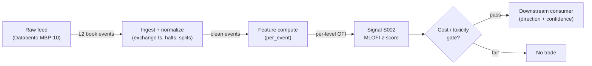

# S002 — Multi-level / integrated OFI (MLOFI)

Event-counted net order flow per book level, integrated across the first `L` levels into one directional regressor. Provenance **[D]**.

> Tag law: every numeric literal in prose carries one of `[documented]
> [default] [example] [unverified] [internal-est] [measured]` (legend: Appendix
> i v1.0.0). Constants inside cited formulas inherit the formula's tag
> (`[documented]` for cited literature). Bibliographic years, volumes, pages,
> arXiv IDs, section numbers, rule codes (C1–C11), fail-safe codes (F1–F5),
> module IDs, and machine-parsed §0 data fields are identifiers, not
> literals, and are exempt.

## §1 Five-minute reviewer card

| Row | Value |
|---|---|
| Module | S002 — Multi-level / integrated OFI (MLOFI), v1.0.1 |
| Edge verdict | `PREDICTIVE-FEATURE-ONLY` — documented in/out-of-sample R² for integrated OFI; no published after-cost standalone Sharpe |
| After-cost | `BEFORE-COST` — strong multi-level microstructure *feature* (Ridge/PCA integration beats touch-only in-sample and out-of-sample [documented]); standalone trigger evidence is before-cost only |
| Build cost | Tier H · `60–200` h [internal-est] · `$9,000–30,000` loaded [internal-est] |
| Data cost | Research `$199`/mo [documented] (Databento Standard plan — unlimited live data + free historical data per Jan-2025 pricing; deep-history pulls billed at usage rates, e.g. DBEQ.BASIC MBP-10 historical $1.00/GB [documented]) · production `$199`/mo [documented] Standard; direct-feed (exchange-timestamped) tiers higher — verify against symbol count before budgeting |
| latency_class | microstructure / sub-second |
| risk_class | low (signal-only; no order placement) |
| Capacity | `$1–10`M/day notional [example] — illustrative; calibrate per venue |
| Executability | Feasible: Python+polars prototype, `<=20` symbols live [internal-est]; Rust ingest beyond that |
| Risk summary | Latency-dominated; dies on stale/gameable deep levels, wide spreads, collinear level noise; never traded standalone on market orders at retail latency |
| When it dies | Spread `>3` ticks [default]; deep-level staleness (S10.1); SIP-only feed in a colocated race (SIP mean quote-reporting latency ~`1.13` ms [documented]); Ridge/PCA loadings flip or destabilize across refits (S10.9); covariance singularity on collinear deep levels (S10.10) |
| Regime gates | Provisional: R001 elevated RV amplifies (deep-book signal strengthens), extreme RV kills (spread convexity) |
| Emits | `signal_vector` (Appendix b v1.0.0) — never orders |

## §1.5 Cheapest / least-build path

1. **Prototype hour band:** `60–200` h [internal-est] — event-state machine per level + bucketizer + Ridge/PCA integrator + reference validation against the fixture
2. **Cheapest-source row:** min_tier = Databento Standard (MBP-10, dataset DBEQ.BASIC) [documented]; latency_class = SIP-delayed (mean SIP quote-reporting latency ~`1.13` ms [documented] — live latency claims are *simulated only — requires MBO/ITCH*);
   required_fields = L2 depth (levels `1`–`10` available; module uses top-`5` [default]) bid/ask price + size + order count per book event (`bid_px_<ii>/bid_sz_<ii>/bid_ct_<ii>`, `ii ∈ {00..09}` → level `k = ii+1`), event action/side, `ts_event` + `ts_recv`, per-instrument `sequence`, plus the status (halt/auction) feed; price_band = `$199`/mo Standard subscription [documented] + usage for heavy history (DBEQ.BASIC MBP-10 historical `$1.00`/GB, live `$1.20`/GB [documented]) — verify the real pull size with `metadata.get_cost` before budgeting; build_or_buy = ****build the integrator, buy the depth feed** (per-level OFI is `~60` lines [internal-est]; the value is the Ridge/PCA integration, sign-anchoring, and lead-lag calibration — none sold by vendors)**.
3. **Resource budget:** `1` core, `<2` GB RAM for `<=20` symbols live [internal-est]; compute pattern `per_event`.
4. **Skip list:** full MBO/ITCH replay; cross-asset OFI; colocated deployment; Rust ingest (phase `2`)
5. **DO-NOT-CUT list:** causality assertions (`assert fill_event >
   signal_event`, no-signal-bar-fills test); COST block + callable
   `expected_cost_bps`; F1–F5 fail-safes + module-state enum; decision-log
   audit records; bona-fide-intent + self-trade prevention; provenance tags on
   every numeric literal; fixtures + `test_cmd`; secrets via env only.
6. **Escalation gate:** live universe `>20` symbols [default]; depth feed latency persistently `>1` ms [default]; Ridge/PCA loadings unstable across `5`-day refits [default] (S10.9); cost gate fails on `[measured]` costs

## §S0 Module contract

### S0.1 Typed signature

```python
def signal(state: ModuleState, events: list[Event], cfg: Config) -> SignalVector:
```

`SignalVector` per Appendix b v1.0.0. `state` is the module-owned named state vector (`prev_book` (L levels), `ofi_matrix`, `iofi_hist`, `pca_window`, `cooldown_until`, `module_state`); `events` are canonical Events (Appendix a v1.0.0), newest last. The function handles documented edge cases: empty events → `UNKNOWN`; crossed/locked quotes → `UNKNOWN` (F1, never interpolate); halt/auction events → freeze per the market-state table.

### S0.2 Config dataclass

| Parameter | Type | Default | Range | Status |
|---|---|---|---|---|
| `levels` | int | `5` | ``3`–`10`` | default |
| `bucket` | str | ``1s`` | ``100ms`–`5s`` | default |
| `z_entry` | float | `2.0` | ``0.5`–`5.0`` | default |
| `z_exit` | float | `0.5` | ``0.0`–`z_entry`` | default |
| `z_window_buckets` | int | `300` | `30`–`3000` | default |
| `ridge_lambda` | float | `100.0` | ``10`–`1e4`` | default |
| `pca_window_days` | int | `5` | ``1`–`20`` | default |
| `cooldown_s` | float | `60.0` | ``0`–`3,600`` | default |
| `cost_gate_k` | float | `0.5` | ``0.1`–`2.0`` | default |

All defaults tagged per the tag law (status `default` ⇒ `[default]`).

### S0.3 Canonical schema mapping

Vendor columns → canonical Event schema (Appendix a v1.0.0), stated once here.
**MBP-1 is not sufficient for this module** — it carries only the top level; buy MBP-10.

| Vendor (Databento MBP-10, dataset DBEQ.BASIC) | Canonical |
|---|---|
| `ts_event` | `event_ts (int64 ns UTC)` — matching-engine timestamp, authoritative causality clock |
| `ts_recv` | `asof_ts (int64 ns UTC)` — capture-server receipt; `asof_ts − event_ts` feeds the jitter watchdog |
| `bid_px_<ii> / bid_sz_<ii> / bid_ct_<ii>` (`ii ∈ {00..09}`) | level `k = int(ii)+1` bid price (fixed-point ×`1e9` [documented])/size/order count; level `k` only used for `k ≤ levels` |
| `ask_px_<ii> / ask_sz_<ii> / ask_ct_<ii>` (`ii ∈ {00..09}`) | level `k = int(ii)+1` ask price/size/order count |
| `action` | `event_type ∈ {TRADE, ADD, MODIFY, CANCEL, FILL, CLEAR}` — verify codes against the live schema docs at ingest [unverified] |
| `side` | `aggressor_side ∈ {A, B, N}` |
| `sequence` | `seq` (per-instrument) |
| `instrument_id` | `symbol` (resolved via the definition feed) |
| status schema (`status` feed) | `market_state` — halts, pauses, auctions, short-sale restrictions |

Sentinel rule: `UNDEF_PRICE` (INT64_MAX) [documented] marks empty levels — treat as missing, never interpolate (F1); a bucket whose every contributing level is undefined is masked, not filled.

Polygon.io mapping: `t` → `event_ts` (SIP time — label SIP work *simulated only — requires MBO/ITCH* for latency claims), `p`/`s` bid/ask → `bid_px`/`bid_sz`, etc.

### S0.4 Time contract

> Time contract: clock domain UTC, int64 ns; authoritative causality clock = `event_ts`; max_skew = `1` ms [default]; jitter budget = `500` µs [default]; bar-label = open time; staleness TTL = `3` s [default] (`3`× the `1`-s reference cadence per F4); gap policy = mask, no interpolation; halt/auction → discard contributions across reopen. SIP consolidated path adds mean ~`1.13` ms quote-reporting latency [documented] (median `557` µs [documented]) → exceeds the jitter budget → SIP work is *simulated only — requires MBO/ITCH* for any latency claim.

**Timing box:** `signal@t (per_event, America/New_York) → earliest fill @open(t+1)`

### S0.5 Market-state table

| State | Module behavior |
|---|---|
| CONTINUOUS_TRADING | Compute normally; emit per cadence |
| HALTED | Freeze state; emit `UNKNOWN`; discard contributions across reopen |
| AUCTION | No new signals; hold last `SignalVector`; state `DEGRADED` |
| CLOSED | Emit nothing; state `OFF` |

### S0.6 Module-state enum + error taxonomy

States per Appendix k v1.0.0: `OK | DEGRADED | UNKNOWN | OFF`. Invalid input → `UNKNOWN`, never interpolate (Appendix f v1.0.0, F1–F5).

| Failure | State | Alert |
|---|---|---|
| Missing/stale input (TTL per §S0.4) | `UNKNOWN` | page |
| Crossed/locked quote reaching module | `UNKNOWN` | log |
| Feature out of mathematical bounds (F2) | `UNKNOWN` | page |
| `seq` gap > `1,000` events [default] | `DEGRADED` (restart windows) | log |
| SIP jitter > budget persistently | `DEGRADED` | notify |
| Halt/auction | `UNKNOWN` / `DEGRADED` (per table) | log |
| Kill/administrative disable | `OFF` | page |
| Anything unmapped | `UNKNOWN` | page |

### S0.7 Ops tail

- **Schedule:** continuous during US equities regular session `09:30`–`16:00` America/New_York [documented]; owner: microstructure-signals on-call.
- **Health checks:** fixture replay (`test_cmd`) green on deploy; live `seq-gap` monitor; staleness watchdog at `3`× cadence [default].
- **Alert table:** page on `UNKNOWN` > `30` s [default] or bounds violation; notify on `DEGRADED`; log on single dropped events.
- **Resource budget:** `1` core, `<2` GB RAM for `<=20` symbols live [internal-est]; state is O(window) per symbol.
- **Runbook stub:** `1.` confirm feed (Databento status); `2.` replay fixture; `3.` if red → set `OFF`, page; `4.` reconcile decision log before re-arm.

### S0.8 Secrets (env-only)

`DATABENTO_API_KEY`, `POLYGON_API_KEY` via environment only. No secrets in this file, fixtures, or logs (CI secrets-grep).

### S0.9 May / must-NOT

> **May:** emit `SignalVector` records per Appendix b v1.0.0. **Must-NOT:** emit orders, order intents, prices, share counts, or notionals; call a broker; mutate shared state outside `state`; interpolate across gaps.

## §S1 Legacy (subsumed by §1)

Legacy §S1 content is the §1 reviewer card above; this header is retained so section numbering stays frozen.

## §S2 Specification

### Universe

US common stocks, regular session, top-`500` by trailing-`20`-day dollar volume [example]; MBP-10 depth available; spread `≤3` ticks [default]; no hard-to-borrow for the SHORT leg (C7).

### Entry rule (Boolean — no prose-only conditions)

```
ENTER_LONG  := (z_iofi >= z_entry) AND (spread_ticks <= 3) AND (now >= cooldown_until) AND (expected_cost_bps(...) <= cost_gate_k * edge_bps)
ENTER_SHORT := (z_iofi <= -z_entry) AND (spread_ticks <= 3) AND (now >= cooldown_until) AND (locate_ok) AND (expected_cost_bps(...) <= cost_gate_k * edge_bps)
FLAT        := otherwise
```

`z_iofi` = z-score of PCA/Ridge-integrated multi-level OFI over the bucket window; `edge_bps = |z_iofi| * 0.35` [example] modeled per-trade edge. Deep levels (L3–L5) carry real signal the touch-only S001 misses [documented].

### Exits (with post-exit cooldown)

```
EXIT := (direction == +1 AND z_iofi < z_exit) OR (direction == -1 AND z_iofi > -z_exit)
        OR (ridge_loadings_unstable) OR (module_state != OK)
ON_EXIT: cooldown_until = now + cooldown_s   # 60 s [default]; C10
```

### Position sizing (fenced function)

```python
def size_shares(risk_budget_R, stop_distance, vol_estimate, ADV_cap, cost):
    # S-module requests capital fraction only; share math lives in the strategy.
    # Reference: capital = 0.5 * confidence  (confidence in [0,1])  [default]
    risk_notional = risk_budget_R * 0.5 * confidence          # [default] 0.5 factor
    shares = risk_notional / max(stop_distance, 1e-9)
    return int(min(shares, ADV_cap * adv_shares * 0.001))     # 0.1% ADV cap [default]
```

### Risk limits

| Limit | Value |
|---|---|
| Max capital fraction per signal | `0.5` [default] |
| Max adverse excursion before `UNKNOWN` review | `2.0`× stop [default] |
| Staleness kill | TTL per §S0.4 → `UNKNOWN` |

### COST block (single source of truth)

| Component | Value (bps) | Basis |
|---|---|---|
| Spread (half-spread, liquid large-cap) | `0.43` | [example] — reference print |
| Fees (taker incl. regulatory) | `0.60` | [documented] — Nasdaq standard remove-liquidity fee `$0.0030`/share (Rule 7018 price list [documented]) converted at the `$50` reference print [example] → `0.60` bps; FINRA TAF + SEC §31 sell-side fees folded in [example] |
| Borrow | `0.0` | [default] — reference build long-biased; shorts add C7 locate cost |
| Impact | `0.0` | [example] — flagged; calibrate per venue at scale-up |
| **Total reference** | `1.03` | [example] — `0.43 + 0.60`; the maker side nets `0.23` bps before spread on the `-0.20` rebate print [example] |

`fee_schedule_as_of`: `2026-09-10` [measured] — Nasdaq Trader price list (Rule 7018) verified this date; re-pin before production. `side: taker` [default]; venue/tier/source: XNAS / Databento MBP-10 [example]. Re-stating cost numbers outside this block is a validation failure.

```python
def expected_cost_bps(notional, adv_pct, venue, side, urgency) -> float:
    """Callable cost model — L2 constant stack (impact=0 flagged [example])."""
    spread_bps = 0.43   # [example]
    fee_bps = 0.60      # [documented] $0.0030/share ÷ $50 reference print [example]
    borrow_bps = 0.0    # [default] long-biased reference; reason in table
    impact_bps = 0.0    # [example] flagged; calibrate per venue at scale-up
    if side == "maker":
        fee_bps = -0.20  # rebate [example]; verify against the live tier at scale
    return spread_bps + fee_bps + borrow_bps + impact_bps
```

### Execution / fill model table

| Aspect | Assumption |
|---|---|
| Latency | Signal→intent `≤1` ms colocated [example]; SIP path mean quote-reporting latency ~`1.13` ms [documented] → latency-simulated-only |
| Partial fills | N/A (signal-only; T-module policy: Appendix c v1.0.0) |
| Impact | `0.0` bps reference [example]; stress ×`5` [example] |
| Adverse fill | Toxic-flow haircut `0.2` bps per `1.0` |z| [example] |

### Robustness

Window/threshold sensitivity must be validated on purged/embargoed out-of-sample data; microstructure parameters mined on `1` month of tape overfit [internal-est]. Re-validate after any feed or venue change.

### Compliance sub-block (C1–C10+)

| Code | Rule: trigger → check → action → log |
|---|---|
| C1 | Self-match prevention: signal module emits no orders; downstream T-modules must set self-trade-prevention flags — this module asserts the requirement in its `consumes` contract |
| C2 | Bona-fide intent: every emitted `SignalVector` with |direction|=`1` must pass the cost gate; sub-threshold prints emit direction `0`, never a tradeable hint |
| C3 | Message-rate: `<=100` emissions/symbol/s [default]; breach -> throttle to `1`/s [default] + alert |
| C4 | Fat-finger trio (applied by consumers; this module bounds its own outputs): confidence in [`0`,`1`], capital in [`0`,`0.5`], computed_at sane - out-of-bounds -> `UNKNOWN` (F2) |
| C5 | Decision log: every emission, veto, and state transition logged per Appendix g v1.0.0, hash-chained |
| C6 | Halt/auction: per the market-state table; contributions across reopen discarded |
| C7 | Locate check: SHORT direction requires `locate_ok` from the consumer; never emit SHORT without the consumer asserting locate (Reg-SHO threshold securities -> direction `0`) |
| C8 | Public dissemination: no signal values published externally without review gate |
| C9 | Data entitlements: per the Data rights row; entitlement-class change -> escalation gate |
| C10 | Post-exit cooldown: no re-entry for `cooldown_s` after any exit or compliance block |
| C11 | Spoofing hygiene: down-weight quotes with lifetime `<50` ms [example]; never quote on them |

### Parameter table

| Parameter | Symbol | Value | Tag | Sensitivity |
|---|---|---|---|---|
| Levels | `levels` | `5` | [default] | high — deep-book info vs collinear noise |
| Bucket | `bucket` | `1 s` | [default] | medium |
| Entry z-threshold | `z_entry` | `2.0` | [default] | high |
| Exit z-threshold | `z_exit` | `0.5` | [default] | medium |
| Ridge penalty | `ridge_lambda` | `100.0` | [default] | high — stabilizes deep levels |
| PCA window | `pca_window_days` | `5 days` | [default] | medium |
| z-score window | `z_window_buckets` | `300` buckets (`5` min at `1`-s cadence [example]) | [default] | medium — shorter = twitchier entries |
| Post-exit cooldown | `cooldown_s` | `60 s` | [default] | low |
| Cost-gate k | `cost_gate_k` | `0.5` | [default] | high |

### Calibration procedure (walk-forward, purged/embargoed)

1. History: `≥60` sessions [default] of MBP-10 per symbol; purge `2` sessions + embargo `1` session [default] around every refit boundary (t→t+1 discipline).
2. Grid (default search space): `levels ∈ {3, 5, 10}` [default]; `bucket ∈ {100ms, 1s, 5s}` [default]; `ridge_lambda` log-grid `{10, 31.6, 100, 316, 1000, 3162, 10000}` [default]; `z_entry ∈ {1.5, 2.0, 2.5, 3.0}` [default]; `z_window_buckets ∈ {60, 300, 900}` [default].
3. Objective: maximize out-of-sample R² of the contemporaneous Δmid regression (the Xu et al. metric [documented]), minus a penalty on the cost-gate fail rate; pick `z_entry` by max net-of-reference-cost trade P&L on the validation fold.
4. Refit cadence: every `5` sessions [default] (matches `pca_window_days`); run the loading-stability check (S10.9) between refits — freeze loadings on breach.
5. Sign-off: OOS R² `> 0` and OOS R² `≥ 0.5 ×` IS R² [default] (S10.7); otherwise shrink `levels → 3`, widen `bucket`, or retire the symbol. Published per-stock λ selections from Xu et al. are not in the chapter's sources — see Q-GROK-S002-1 in §S12.

### Timing box

`signal@t (per_event, America/New_York) → earliest fill @open(t+1)`

## §S3 Math + normative pseudocode

Per book event `t`, level-`k` contribution (Cont et al. event-time OFI, [documented]):

$$e_{k,t} = \mathbf{1}\{P^b_{k,t} \ge P^b_{k,t-1}\}Q^b_{k,t} - \mathbf{1}\{P^b_{k,t} \le P^b_{k,t-1}\}Q^b_{k,t-1} - \mathbf{1}\{P^a_{k,t} \le P^a_{k,t-1}\}Q^a_{k,t} + \mathbf{1}\{P^a_{k,t} \ge P^a_{k,t-1}\}Q^a_{k,t-1}$$

Bucket $B$: $\mathrm{OFI}_{k,B} = \sum_{t \in B} e_{k,t}$, $\mathbf{OFI}_B = [\mathrm{OFI}_{1,B},\dots,\mathrm{OFI}_{L,B}]^\top$. **Integrated OFI — three normative methods** (reference build = method A [example]; B and C are the documented upgrade paths):

- **A. Equal-weight** [example]: $\mathrm{iOFI}_B = \sum_{k=1}^{L} \mathrm{OFI}_{k,B}$. No fitted parameters; the fixture and reference tests use this.
- **B. PCA integration** (Cont–Cucuringu–Zhang 2023 [documented]): over the trailing $W_{\text{pca}}$ buckets ($W_{\text{pca}} = \text{pca\_window\_days} \times \text{buckets\_per\_day}$ [default]; Cont et al. use the top `10` levels [documented]),
  1. $\boldsymbol{\mu} = \mathrm{mean}(\mathbf{OFI}_{B-W_{\text{pca}}..B-1})$,
     $\Sigma = \mathrm{Cov}(\mathbf{OFI}_{B-W_{\text{pca}}..B-1})$;
  2. $\mathbf{v}_1$ = top eigenvector of $\Sigma$;
  3. sign anchor [default]: if $\sum_k v_{1,k} < 0$ then $\mathbf{v}_1 \gets -\mathbf{v}_1$ (positive = net buying pressure; re-checked every refit — S10.9);
  4. $\mathrm{iOFI}_B = \mathbf{v}_1^\top(\mathbf{OFI}_B - \boldsymbol{\mu})$.
- **C. Ridge integration** (Xu–Gould–Howison 2019 [documented]): fit $\Delta\mathrm{mid}_B = \alpha + \boldsymbol{\beta}^\top\mathbf{OFI}_B + \varepsilon_B$ by Ridge regression with penalty `ridge_lambda` [default] on the trailing $W_{\text{pca}}$ buckets; then $\mathrm{iOFI}_B = \hat{\boldsymbol{\beta}}^\top\mathbf{OFI}_B$. Price-impact regression $r_B = \alpha + \beta\cdot\mathrm{iOFI}_B + \varepsilon_B$ is contemporaneous, in ticks [documented].

**z-score** (normative): $z_{\mathrm{iofi}} = (\mathrm{iOFI}_B - \mu_z)/\sigma_z$ over the trailing `z_window_buckets` values of iOFI, population standard deviation (ddof=`0`) [default]; $\sigma_z = 0 \Rightarrow z = 0$ [default]. The fixture pins z over the full `8`-bucket tape [example]; production uses the trailing window.

**Normative pseudocode** (pseudocode is normative; prose is commentary):

```
function signal(state, events, cfg) -> SignalVector:
    assert events non-empty else return UNKNOWN                    # F1
    b = last_closed_bucket(events, cfg.bucket)                    # events <= t only
    ofi_vec = [level_ofi(b, k, state.prev_book) for k in 1..cfg.levels]  # §S3 formula, k per S0.3
    state.ofi_matrix.append(ofi_vec)
    iofi = integrate(ofi_vec, state.ofi_matrix, cfg)              # method A/B/C per §S3; reference = sum
    state.iofi_hist.append(iofi)
    mu, sd = mean_var(state.iofi_hist[-cfg.z_window_buckets:])     # population std [default]
    z = (iofi - mu) / sd if sd > 0 else 0.0
    assert isfinite(z) else return UNKNOWN                         # F2
    edge_bps = abs(z) * 0.35                                       # [example]
    # normative cost-gate predicate: expected_cost_bps(...) <= k * edge_bps
    # cost-gate inputs the module does NOT own: notional (intended), adv_pct (reference data),
    #   venue/side/urgency (consumer contract). The module evaluates the predicate; the consumer supplies them.
    cost_ok = expected_cost_bps(notional, adv_pct, venue, side, urgency) <= cfg.cost_gate_k * edge_bps
    gates_ok = (spread_ticks <= 3) and (state.module_state == OK) and (now >= state.cooldown_until)  # [default]
    locate_ok = consumer_asserts_locate()                         # C7; Reg-SHO threshold -> False
    direction = +1 if (z >= cfg.z_entry and cost_ok and gates_ok) else
                -1 if (z <= -cfg.z_entry and cost_ok and gates_ok and locate_ok) else 0
    confidence = min(1, abs(z) / (2*cfg.z_entry)) if direction != 0 else 0
    capital = 0.5 * confidence                                     # [default]
    sig = SignalVector(symbol, direction, confidence, capital,
                       computed_at=b.close_ts, staleness=now()-b.asof_ts,
                       module_state=state.module_state)
    log_decision(sig, inputs_hash, params_hash)                    # C5 / Appendix g
    assert fill_event > signal_event  # t→t+1 causality: fills strictly after the signal bucket
    return sig
```

Causality: integrated OFI at bucket close uses only events ≤ bucket close; earliest reaction is the next bucket. Mandatory unit test: no-signal-bar fills.

## §S4 Worked example (fixture-backed)

- Tape: `modules/fixtures/S002_tape.csv` — `# TYPE: validation-run`; `8` one-second buckets (`L=5`, equal-weight integration), all numbers synthetic, seed `20260902` [example]; `event_ts` int64 ns UTC.
- Expected outputs: `modules/fixtures/S002_expected.csv`; per-bucket `iofi` = level sum, and `z_iofi` = population z-score of `iofi` over the full `8`-bucket tape [example] (production uses the trailing `z_window_buckets` window per the §S3 z-score spec [default]); hand-checked below (bucket 6 shows touch-only OFI pointing the wrong way while integrated OFI agrees with the mid move).
- Tolerance: `1e-4` [default]; integer contributions exact.
- Acceptance tests (`modules/tests/test_S002.py`, `8` tests): `1.` fixture recomputes to expected (`iofi` exact); `2.` stub emits valid `SignalVector` (direction in {+1,-1,0}, confidence/capital in [0,1]); `3.` no-signal-bar fills (`fill_event_ts > computed_at`); `4.` cost-gate predicate passes on large edge, blocks on tiny edge (`k = 0.5` [default]); `5.` invalid input -> `UNKNOWN`; `6.` deep levels carry signal (bucket-6 touch-vs-integrated divergence); `7.` `z_iofi` recomputes to expected (population std, full tape) and bucket 3 crosses `z_entry = 2.0` [default]; `8.` entry predicate pinned: bucket-3 LONG candidate is blocked at `k = 0.5` [default] and passes at `k = 2.0` [example] with the `1.03` bps reference cost [example].
- `test_cmd`: `python -m pytest modules/tests/test_S002.py -q` → exits `0`.

**Hand-checked rows** (arithmetic verified by hand against the fixture):

- b1: `100 − 50 + 30 − 20 + 10 = 70` ✓; `z = (70 − 17.5)/112.4444 = 0.4669` ✓
- b2: `−200 + 150 − 100 + 80 − 30 = −100` ✓; `z = (−100 − 17.5)/112.4444 = −1.0450` ✓
- b3: `5 × 50 = 250` ✓; `z = (250 − 17.5)/112.4444 = 2.0677` ✓ (crosses `z_entry = 2.0` [default] → LONG candidate; cost gate blocks at `k = 0.5`, passes at `k = 2.0` — see test 8)
- b4: `−80 − 80 + 40 + 40 + 40 = −40` ✓; `z = (−40 − 17.5)/112.4444 = −0.5114` ✓
- b5: `0` ✓; `z = (0 − 17.5)/112.4444 = −0.1556` ✓
- b6: `300 − 400 = −100` ✓ (touch-only `+300` disagrees with Δmid `−0.8` ticks; integrated `−100` agrees); `z = −1.0450` ✓
- b7: `120 + 60 − 40 − 20 − 10 = 110` ✓; `z = (110 − 17.5)/112.4444 = 0.8226` ✓
- b8: `−300 + 250 = −50` ✓; `z = (−50 − 17.5)/112.4444 = −0.6003` ✓

**Where the example is optimistic:** no fees, no latency, no hidden liquidity — arithmetic illustration, not a backtest. Note the fixture's bucket-3 LONG candidate fails the cost gate at the default `k = 0.5` — the gate is normative, not decorative.

## §S5 Strategies that use this signal

Generated from `deps.yaml` (CI symmetry). Provisional consumer list (roles pinned at ingest):

| Strategy | Role |
|---|---|
| T-series execution consumers (see `deps.yaml`) | Downstream consumer of this signal family's direction/confidence outputs; exact strategy IDs pinned at ingest |

Deep-book integration primarily serves execution/adverse-selection filters downstream; consumer roles pinned in `deps.yaml`.

## §S6 Data required

| Field | Type | Granularity | Source tier | Notes |
|---|---|---|---|---|
| Per-level bid/ask price + size + order count | int64 fixed-point / uint32 / uint32 | every MBP-10 book event | Tier 2 | `bid_px_<ii>/bid_sz_<ii>/bid_ct_<ii>`, `ask_px_<ii>/ask_sz_<ii>/ask_ct_<ii>`, `ii ∈ {00..09}` → level `k = ii+1`; only `k ≤ levels` used. Guard `UNDEF_PRICE` (INT64_MAX) sentinels on empty levels [documented] — treat as missing, never interpolate (F1) |
| Book event action + aggressor side | char | per event | Tier 2 | maps to `event_type`/`aggressor_side` per the §S0.3 table; exact code set verified against the live schema docs at ingest [unverified] |
| Exchange + capture timestamps | int64 ns | per event | Tier 2 | `ts_event` authoritative; `ts_recv` for jitter/gap accounting; SIP adds mean ~`1.13` ms quote-reporting latency [documented] (median `557` µs [documented]) — label SIP work *simulated only — requires MBO/ITCH* |
| Per-instrument sequence | uint32 | per event | Tier 2 | gap `>1,000` events [default] → `DEGRADED`, restart windows (S0.6) |
| Status / halt-auction feed | reference | per status event | Tier 1 | halts, pauses, auction starts, short-sale restrictions; discard contributions across reopen (market-state table) |
| Corporate actions | reference | daily | Tier 1 | splits/dividends — adjust reference prices or mask affected buckets; contributions garbage across unadjusted splits |

**Data rights row** (Appendix j v1.0.0): US equities L2 via Databento MBP-10 (DBEQ.BASIC), `rights: licensed`; license scope = research + stated production symbol count; raw ticks never leave our systems — fixtures are synthetic; entitlement = professional/internal, no display; retention per vendor terms, purge path in runbook. Entitlement-class change → §1.5 escalation gate.

## §S7 Local build (M5 Max / 128 GB)

Feasible. O(`1`) [documented] per-event scan: Python loop `~100–500`k events/s [internal-est] vs `~50–500` L1 events/s average per liquid name, busy bursts `~1–5`k/s [internal-est] (cost-model §2). `50` symbols × `2`k events/s = `100`k/s → Python borderline, Rust (`5–50`M/s [internal-est]) comfortable; polars batch recompute each second trivial. Bottleneck is I/O and timestamp normalization. RAM: one symbol-day L1 `~0.5–4` GB [internal-est] — fine for a few symbols; `60` days does not fit — stream per-symbol daily parquet (cost-model §3).

## §S8 Buy vs build

Build the estimator (Python+polars), buy the feed. Verdict: the per-event math is `~40–100` lines [internal-est]; the value is normalization, windows, sign-anchoring, and calibration — none sold by vendors. Buy Databento MBP-10 history to validate (Standard `$199`/mo [documented]; heavy history at usage rates — DBEQ.BASIC MBP-10 historical `$1.00`/GB [documented]), Tier-1 SIP for live research, direct/MBO only after the signal survives realistic costs (cost-model §6). Do NOT under-buy MBP-1: it carries only the touch and cannot feed a multi-level module.

## §S9 Efficacy — documented evidence

| Study / source | Market & period | Metric | Before/after cost | Caveat |
|---|---|---|---|---|
| Xu, Gould & Howison (2019) [documented] | LSE stocks, LOB data | multi-level OFI (Ridge) beats best-level OFI in- and out-of-sample | `BEFORE-COST` (R², not P&L) | forecasting exercise, not an after-cost strategy |
| Cont, Cucuringu & Zhang (2023) [documented] | US equities, multi-asset | integrated (PCA, top-`10`-level) OFI beats best-level OFI; lagged cross-asset OFIs improve short-horizon forecasts | `BEFORE-COST` (R², not P&L) | no standalone after-cost Sharpe published |

Selection disclosure: the `2` papers surfaced by the chapter's research pass; no published after-cost Sharpe for a naive MLOFI scalper was found [documented-as-absence].

## §S10 Failure modes & pitfalls

| # | Trigger → Detect → Action → Recovery | check: |
|---|---|---|
| 1 | Level-staleness: deep-book levels go stale/gameable → detect: L3–L5 contribution variance collapses vs L1 → action: fall back to touch-only (S001 mode), flag `DEGRADED` → recovery: re-enable after `5` min [default] of stable depth | `check: deep_share_of_iofi > 0.1 [default]` |
| 2 | Lookahead leakage: bar-close feature traded intra-bar → detect: causality audit flags `fill_event <= signal_event` → action: halt, fix bar finalization → recovery: re-run no-signal-bar-fills test | `check: all(fill_ts > computed_at)` |
| 3 | Staleness/latency: feed timestamps in a race → detect: jitter > budget → action: `DEGRADED`, label simulated-only → recovery: direct feed or stand down | `check: asof_ts - event_ts <= jitter_budget` |
| 4 | Fleeting quotes/spoofing: displayed size cancels pre-execution → detect: quote lifetime `<50` ms [example] share rising → action: down-weight sub-`50` ms quotes → recovery: re-tune weights | `check: fleeting_share < 0.3 [default]` |
| 5 | Cost blowup: spread+fees+impact on the round trip → detect: cost gate failing on `[measured]` costs → action: widen `k` gate or stand down → recovery: re-pin fee schedule | `check: expected_cost_bps(...) <= k * edge_bps` |
| 6 | Regime breaks: depth/volatility regime shifts → detect: feature distribution break → action: veto entries → recovery: resume when stable for `5` min [default] | `check: feature_z_within_3_sigma [default]` |
| 7 | Overfitting: parameters mined on `1` period → detect: OOS decay → action: purged/embargoed re-validation → recovery: shrink per-symbol | `check: oos_sharpe > 0.5 * is_sharpe [default]` |
| 8 | Data errors: bad ticks, splits, halts → detect: bounds/`seq`-gap monitors → action: `UNKNOWN`, mask bars → recovery: backfill and replay | `check: no crossed quotes in window` |
| 9 | Loading instability (PCA/Ridge): top-eigenvector sign flips or loading correlation vs prior refit drops → detect: sign-anchor check (§S3 method B step 3) + loading monitor each refit → action: freeze loadings, `DEGRADED`, fall back to equal-weight integration → recovery: re-anchor sign convention, refit on a fresh `5`-day window [default] | `check: loading_corr >= 0.8 [default] AND sign_stable` |
| 10 | Covariance singularity: deep-level OFI near-constant or perfectly collinear (thin book) → detect: `cond(Σ) > 1e6` [default] on the PCA covariance → action: fall back to equal-weight integration, `DEGRADED` → recovery: shrink `levels`, widen `bucket`, or drop the symbol | `check: cond(cov_ofi) <= 1e6 [default]` |

### Regime-gate machine records (provisional)

| regime_id | direction | mechanism | condition | action | min_lag | unknown_behavior |
|---|---|---|---|---|---|---|
| R001 | amplifies | elevated realized volatility widens spreads and deepens adverse selection | RV > `2`× trailing median [example] | widen_stops | `1` session [example] | hold last label |
| R002 | degrades | quote flicker / spoofing regimes inject noise into book features | fleeting-quote share > `0.3` [example] | halve | `30` min [example] | veto entries |
| R003 | degrades | halt/auction regimes break continuity assumptions | market_state != CONTINUOUS_TRADING | pause_entry | `0` | veto entries |

## §S11 Visuals

`../../images/S002_example.png` — synthetic `8`-bucket MLOFI tape (seed `20260902` [example]): per-level OFI bars and integrated iOFI vs mid change.



## §S12 Source log + unverified leads

**Sources** (citable facts only):

1. Xu, K., Gould, M. D. & Howison, S. D. (2019) [documented]. "Multi-Level Order-Flow Imbalance in a Limit Order Book." arXiv:1907.06230. https://arxiv.org/abs/1907.06230 — Table 10 Ridge-row figures quoted in the chapter's S9, verified against the paper's own table.
2. Cont, R., Cucuringu, M. & Zhang, C. (2023) [documented]. "Cross-Impact of Order Flow Imbalance in Equity Markets." *Quantitative Finance* 23(10), 1373–1393. arXiv:2112.13213. https://arxiv.org/abs/2112.13213
3. Cont, R., Kukanov, A. & Stoikov, S. (2011) [documented]. "The Price Impact of Order Book Events." arXiv:1011.6402. http://arxiv.org/pdf/1011.6402v3
4. Nasdaq Trader Price List — Trading (Rule 7018), accessed 2026-09-10 [documented]. Standard fee for removing liquidity, shares executed at or above `$1.00`: `$0.0030`/share, all MPIDs. https://www.nasdaqtrader.com/trader.aspx?id=pricelisttrading2&l — basis for the COST fee component (`0.60` bps at the `$50` reference print [example]).
5. Databento, "Upcoming changes to pricing plans in January 2025" (blog), accessed 2026-09-10 [documented]. Standard plan `$199`/month; all plans include unlimited live data plus free historical data. https://databento.com/blog/upcoming-changes-to-pricing-plans-in-january-2025/
6. Databento unit pricing sheet (2024-12-11) [documented]. DBEQ.BASIC MBP-10: historical `$1.00`/GB, live `$1.20`/GB. http://databento-media.s3-website-us-east-1.amazonaws.com/media/unit-pricing-2024-12-11.pdf
7. Bartlett, R. P. & McCrary, J. (2017) [documented]. "How Rigged Are Stock Markets? Evidence from Microsecond Timestamps." Mean SIP quote-reporting latency `1,130` µs (median `557` µs); trades `22,840` µs — basis for the SIP-delayed latency class and the *simulated only — requires MBO/ITCH* label. https://eml.berkeley.edu/~jmccrary/bartlett_and_mccrary2017July_withInternetAppendix.pdf

**Chatbot source log.** Duck.ai (GPT-5.6 Luna, anonymous) answered Q-SB4-1–Q-SB4-3 (2026-09-10); Grok/Cursor answers pending (checked 2026-09-10). Formulas verified against literature; chatbot hour bands used only as labeled leads (printed-total discrepancy noted in the chapter).

**Unverified leads** (chatbot-only — never in evidence tables):

- Duck.ai's Q-SB4-2 full-pipeline hour bands (L2 rows `520–1,020` h; printed total `600–1,180` contradicts row sums — unverified chatbot claim, use row sums or the cost-model band).
- Any vendor per-symbol depth price for `50` liquid names (`$1,000–10,000`+/mo range from chat — indicative chatbot claim, verify with Databento/exchange schedules).
- **Q-GROK-S002-1** (GROK-NEEDED): In Xu, Gould & Howison (2019), "Multi-Level Order-Flow Imbalance in a Limit Order Book," what Ridge penalty selection procedure (fixed λ, cross-validation grid, or other) and what selected λ values were used for the MLOFI → mid-price regression across the 6 Nasdaq stocks? Is there a published per-stock λ table? (The chapter's `ridge_lambda = 100.0` [default] is a placeholder grid midpoint, not from the paper.)
- **Q-GROK-S002-2** (GROK-NEEDED): For PCA-integrated multi-level OFI in the Cont, Cucuringu & Zhang (2023) style, what covariance estimation window and refit cadence do practitioners use for live `1`-second-bucket iOFI in US equities, and how is the first-eigenvector sign anchored across refits to avoid direction flip-flops? (The chapter's sign-anchor rule and `5`-day window are [default] conventions, not documented practice.)

---

## Appendix — AI build prompt (S002)

Copy-paste into any chat agent:

> Build module **S002 — Multi-level / integrated OFI (MLOFI)** v1.0.1 per
> `notes/module-template.md` v1.0.0 and this file's §S0 contract.
> Cheapest path (§1.5): prototype 60–200 h [internal-est]; cheapest data
> Databento Standard plan `$199`/mo [documented] (MBP-10, DBEQ.BASIC — MBP-1
> is insufficient: it carries only the touch); compute pattern `per_event`; skip multi-venue/L2-history/Rust/colocation.
> Implement `signal(state, events, cfg) -> SignalVector` (Appendix b v1.0.0)
> with the §S3 normative pseudocode, including the three integration methods
> (equal-weight reference [example]; PCA/Ridge per the documented procedures),
> the z-score spec (`z_window_buckets = 300` [default], population std), the
> cost-gate predicate `expected_cost_bps(...) <= k * edge_bps` (reference cost
> `1.03` bps taker [example]), and `assert fill_event > signal_event`. Wire
> F1–F5 (Appendix f v1.0.0): invalid input -> `UNKNOWN`, never interpolate.
> Guard `UNDEF_PRICE` sentinels on empty levels. Log decisions per Appendix g
> v1.0.0. Secrets via env only. Run the fixture
> `modules/fixtures/S002_tape.csv` (`# TYPE: validation-run`) against
> `modules/fixtures/S002_expected.csv` (tolerance `1e-4` [default]; `iofi`
> integer-exact; `z_iofi` pinned).
> **Definition of done:** `python3 -m pytest modules/tests/test_S002.py -q`
> exits `0`. Tag every numeric literal you add with the unified enum
> (Appendix i v1.0.0); put anything unverifiable in §S12 unverified leads.
