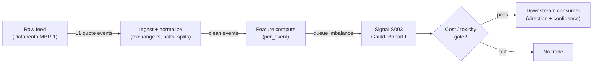

# S003 — Queue (depth) imbalance — Gould–Bonart

The normalized difference between displayed size at the best bid and best ask; predicts the direction of the next mid-price tick via queue-depletion. Provenance **[D]**.

> Tag law: every numeric literal in prose carries one of `[documented]
> [default] [example] [unverified] [internal-est] [measured]` (legend: Appendix
> i v1.0.0). Constants inside cited formulas inherit the formula's tag
> (`[documented]` for cited literature). Bibliographic years, volumes, pages,
> arXiv IDs, section numbers, rule codes (C1–C11), fail-safe codes (F1–F5),
> module IDs, and machine-parsed §0 data fields are identifiers, not
> literals, and are exempt.

## §1 Five-minute reviewer card

| Row | Value |
|---|---|
| Module | S003 — Queue (depth) imbalance — Gould–Bonart, v1.0.1 |
| Edge verdict | `PREDICTIVE-FEATURE-ONLY` — documented one-tick-ahead directional skill (logistic regression); no published after-cost standalone Sharpe |
| After-cost | `BEFORE-COST` — documented short-horizon *predictor* (Gould–Bonart logistic evidence [documented]); tradability after costs is unproven — a feature, not a standalone trigger |
| Build cost | Tier M · `20–60` h [internal-est] · `$3,000–9,000` loaded [internal-est] |
| Data cost | Research `~$30–200`/mo (SIP L1) [unverified]; production `~$200`/mo + usage (exchange-timestamped L1) [unverified] — bands indicative, verify before budgeting |
| latency_class | microstructure / sub-second |
| risk_class | low (signal-only; no order placement) |
| Capacity | `$1–10`M/day notional [example] — illustrative; calibrate per venue |
| Executability | Feasible: Python+polars prototype, `<=20` symbols live [internal-est]; Rust ingest beyond that |
| Risk summary | Latency-dominated; dies on small-tick names, flicker/spoofing, wide spreads; queue-destruction events invalidate the snapshot |
| When it dies | Small-tick universe (skill concentrates in large-tick [documented]); spread `>3` ticks [default]; spoofed queues; SIP-only feed in a colocated race |
| Regime gates | Provisional: R001 elevated RV amplifies (queue depletion accelerates), extreme RV kills (spread convexity) |
| Emits | `signal_vector` (Appendix b v1.0.0) — never orders |

## §1.5 Cheapest / least-build path

1. **Prototype hour band:** `20–60` h [internal-est] — L1 snapshot reader + imbalance normalizer + threshold trigger + reference validation against the fixture
2. **Cheapest-source row:** min_tier = Polygon.io Stocks Advanced (SIP L1) — cheapest data source candidate [internal-est]; latency_class = SIP-delayed;
   required_fields = L1 bid/ask price + displayed size per quote event, exchange timestamps; price_band = `~$30–200`/mo [unverified] (indicative — verify before budgeting); build_or_buy = ****build the normalizer, buy the feed** (imbalance is `~20` lines [internal-est]; the value is the threshold/fee calibration no vendor sells)**.
3. **Resource budget:** `1` core, `<2` GB RAM for `<=20` symbols live [internal-est]; compute pattern `per_event`.
4. **Skip list:** multi-venue aggregation; N-level extension (phase `2`); colocated deployment; Rust ingest
5. **DO-NOT-CUT list:** causality assertions (`assert fill_event >
   signal_event`, no-signal-bar-fills test); COST block + callable
   `expected_cost_bps`; F1–F5 fail-safes + module-state enum; decision-log
   audit records; bona-fide-intent + self-trade prevention; provenance tags on
   every numeric literal; fixtures + `test_cmd`; secrets via env only.
6. **Escalation gate:** live universe `>20` symbols [default]; small-tick names dominate the universe (imbalance skill concentrates in large-tick names [documented]); cost gate fails on `[measured]` costs

## §S0 Module contract

### S0.1 Typed signature

```python
def signal(state: ModuleState, events: list[Event], cfg: Config) -> SignalVector:
```

`SignalVector` per Appendix b v1.0.0. `state` is the module-owned named state vector (`prev_I`, `prev_ts`, `prev_seq`, `imb_window`, `cooldown_until`, `locate_ok`, `module_state`); `events` are canonical Events (Appendix a v1.0.0), newest last. `state.locate_ok` is a consumer-written boolean (default `False` [default]) asserting a locate was obtained for SHORT direction (C7); the module never sets it itself. The function handles documented edge cases: empty events → `UNKNOWN`; crossed/locked quotes → `UNKNOWN` (F1, never interpolate); halt/auction events → freeze per the market-state table.

### S0.2 Config dataclass

| Parameter | Type | Default | Range | Status |
|---|---|---|---|---|
| `kappa_entry` | float | `0.5` | ``0.3`–`0.7`` | default |
| `levels` | int | `1` | ``1`–`10`` | default |
| `smooth_ms` | float | `0.0` | ``0`–`1,000`` | default |
| `max_spread_ticks` | int | `3` | ``1`–`10`` | default |
| `cooldown_s` | float | `60.0` | ``0`–`3,600`` | default |
| `cost_gate_k` | float | `0.5` | ``0.1`–`2.0`` | default |
| `exit_band` | float | `0.1` | ``0.01`–`0.5`` | default |
| `notional` | float | `1e6` | `>0` | example |
| `adv_pct` | float | `0.01` | ``0`–`1`` | example |
| `venue` | str | `"XNAS"` | any venue code | example |
| `side` | str | `"taker"` | `taker|maker|mixed` | default |
| `urgency` | str | `"normal"` | `patient|normal|urgent` | default |

`notional`/`adv_pct`/`venue`/`side`/`urgency` are the cost-gate call context (reference values for the §S2 COST block); `exit_band` is the exit hysteresis half-width on `|I_t|`. All defaults tagged per the tag law (status `default` ⇒ `[default]`, status `example` ⇒ `[example]`).

### S0.3 Canonical schema mapping

Vendor columns → canonical Event schema (Appendix a v1.0.0), stated once here:

| Vendor (Databento MBP-1) | Canonical |
|---|---|
| `ts_event` | `event_ts (int64 ns UTC)` |
| `bid_px_00 / bid_sz_00` | `bid_px / bid_sz` |
| `ask_px_00 / ask_sz_00` | `ask_px / ask_sz` |
| `sequence` | `seq` |

Polygon.io mapping [documented]: `bid_price`/`bid_size` → `bid_px`/`bid_sz`, `ask_price`/`ask_size` → `ask_px`/`ask_sz`, `sip_timestamp` → `event_ts` (SIP time — label SIP work *simulated only — requires MBO/ITCH* for latency claims), `participant_timestamp` → `asof_ts`, `sequence_number` → `seq`.

### S0.4 Time contract

> Time contract: clock domain UTC, int64 ns; authoritative causality clock = `event_ts`; max_skew = `1` ms [default]; jitter budget = `500` µs [default]; bar-label = open time; staleness TTL = `3` s [default] (`3`× the `1`-s reference cadence per F4); gap policy = mask, no interpolation; halt/auction → discard contributions across reopen.

**Timing box:** `signal@t (per_event, America/New_York) → earliest fill @open(t+1)`

### S0.5 Market-state table

| State | Module behavior |
|---|---|
| CONTINUOUS_TRADING | Compute normally; emit per cadence |
| HALTED | Freeze state; emit `UNKNOWN`; discard contributions across reopen |
| AUCTION | No new signals; hold last `SignalVector`; state `DEGRADED` |
| CLOSED | Emit nothing; state `OFF` |

### S0.6 Module-state enum + error taxonomy

States per Appendix k v1.0.0: `OK | DEGRADED | UNKNOWN | OFF`. Invalid input → `UNKNOWN`, never interpolate (Appendix f v1.0.0, F1–F5).

| Failure | State | Alert |
|---|---|---|
| Missing/stale input (TTL per §S0.4) | `UNKNOWN` | page |
| Crossed/locked quote reaching module | `UNKNOWN` | log |
| Feature out of mathematical bounds (F2) | `UNKNOWN` | page |
| `seq` gap > `1,000` events [default] | `DEGRADED` (restart windows) | log |
| SIP jitter > budget persistently | `DEGRADED` | notify |
| Halt/auction | `UNKNOWN` / `DEGRADED` (per table) | log |
| Kill/administrative disable | `OFF` | page |
| Anything unmapped | `UNKNOWN` | page |

### S0.7 Ops tail

- **Schedule:** continuous during US equities regular session `09:30`–`16:00` America/New_York [documented]; owner: microstructure-signals on-call.
- **Health checks:** fixture replay (`test_cmd`) green on deploy; live `seq-gap` monitor; staleness watchdog at `3`× cadence [default].
- **Alert table:** page on `UNKNOWN` > `30` s [default] or bounds violation; notify on `DEGRADED`; log on single dropped events.
- **Resource budget:** `1` core, `<2` GB RAM for `<=20` symbols live [internal-est]; state is O(window) per symbol.
- **Runbook stub:** `1.` confirm feed (Databento status); `2.` replay fixture; `3.` if red → set `OFF`, page; `4.` reconcile decision log before re-arm.

### S0.8 Secrets (env-only)

`DATABENTO_API_KEY`, `POLYGON_API_KEY` via environment only. No secrets in this file, fixtures, or logs (CI secrets-grep).

### S0.9 May / must-NOT

> **May:** emit `SignalVector` records per Appendix b v1.0.0. **Must-NOT:** emit orders, order intents, prices, share counts, or notionals; call a broker; mutate shared state outside `state`; interpolate across gaps.

## §S1 Legacy (subsumed by §1)

Legacy §S1 content is the §1 reviewer card above; this header is retained so section numbering stays frozen.

## §S2 Specification

### Universe

US common stocks, regular session, large-tick names preferred (imbalance skill concentrates there [documented]); spread `≤3` ticks [default]; top-`500` by trailing-`20`-day dollar volume [example].

### Entry rule (Boolean — no prose-only conditions)

```
ENTER_LONG  := (I_t >= kappa_entry) AND (spread_ticks <= max_spread_ticks) AND (event_ts >= cooldown_until) AND (expected_cost_bps(...) <= cost_gate_k * edge_bps)
ENTER_SHORT := (I_t <= -kappa_entry) AND (spread_ticks <= max_spread_ticks) AND (event_ts >= cooldown_until) AND (state.locate_ok) AND (expected_cost_bps(...) <= cost_gate_k * edge_bps)
FLAT        := otherwise
```

`I_t = (Q^b_t − Q^a_t)/(Q^b_t + Q^a_t)` ∈ [−1, 1]; `edge_bps = |I_t| * 2.0` [example] modeled per-trade edge. Exact identity [documented]: `microprice − mid = (spread/2)·I_t`, linking S003 to S004.

### Exits (with post-exit cooldown)

```
EXIT := (direction == +1 AND I_t < exit_band) OR (direction == -1 AND I_t > -exit_band)
        OR (price_move_destroyed_queues) OR (module_state != OK)
ON_EXIT: cooldown_until = event_ts + cooldown_s   # 60 s [default]; C10
```

### Position sizing (fenced function)

```python
def size_capital(confidence) -> float:
    # S-module requests capital fraction only; share math lives in the strategy.
    return 0.5 * confidence   # [default] capital-fraction request; 0.0-0.5 range
```

### Risk limits

| Limit | Value |
|---|---|
| Max capital fraction per signal | `0.5` [default] |
| Max adverse excursion before `UNKNOWN` review | `2.0`× stop [default] |
| Staleness kill | TTL per §S0.4 → `UNKNOWN` |

### COST block (single source of truth)

| Component | Value (bps) | Basis |
|---|---|---|
| Spread (half-spread, liquid large-cap) | `0.43` | [example] — reference print |
| Fees (taker incl. regulatory) | `0.30` | [example] — reference print |
| Borrow | `0.0` | [default] — reference build long-biased; shorts add C7 locate cost |
| Impact | `0.0` | [example] — flagged; calibrate per venue at scale-up |
| **Total reference** | `0.73` | [example] |

`fee_schedule_as_of`: `2026-09-01` [unverified] — placeholder; pin the real venue schedule before production. `side: taker` [default]; venue/tier/source: XNAS / Databento MBP-1 [example]. Re-stating cost numbers outside this block is a validation failure.

```python
def expected_cost_bps(notional, adv_pct, venue, side, urgency) -> float:
    """Callable cost model — L2 constant stack (impact=0 flagged [example])."""
    spread_bps = 0.43   # [example]
    fee_bps = 0.30      # [example]
    borrow_bps = 0.0    # [default] long-biased reference; reason in table
    impact_bps = 0.0    # [example] flagged; calibrate per venue at scale-up
    if side == "maker":
        fee_bps = -0.20  # rebate [example]
    return spread_bps + fee_bps + borrow_bps + impact_bps
```

### Execution / fill model table

| Aspect | Assumption |
|---|---|
| Latency | Signal→intent `≤1` ms colocated [example]; SIP path latency-simulated-only |
| Partial fills | N/A (signal-only; T-module policy: Appendix c v1.0.0) |
| Impact | `0.0` bps reference [example]; stress ×`5` [example] |
| Adverse fill | Toxic-flow haircut `0.2` bps per `1.0` |z| [example] |

### Robustness

Window/threshold sensitivity must be validated on purged/embargoed out-of-sample data; microstructure parameters mined on `1` month of tape overfit [internal-est]. Re-validate after any feed or venue change.

### Compliance sub-block (C1–C10+)

| Code | Rule: trigger → check → action → log |
|---|---|
| C1 | Self-match prevention: signal module emits no orders; downstream T-modules must set self-trade-prevention flags — this module asserts the requirement in its `consumes` contract |
| C2 | Bona-fide intent: every emitted `SignalVector` with |direction|=`1` must pass the cost gate; sub-threshold prints emit direction `0`, never a tradeable hint |
| C3 | Message-rate: `<=100` emissions/symbol/s [default]; breach -> throttle to `1`/s [default] + alert |
| C4 | Fat-finger trio (applied by consumers; this module bounds its own outputs): confidence in [`0`,`1`], capital in [`0`,`0.5`], computed_at sane - out-of-bounds -> `UNKNOWN` (F2) |
| C5 | Decision log: every emission, veto, and state transition logged per Appendix g v1.0.0, hash-chained |
| C6 | Halt/auction: per the market-state table; contributions across reopen discarded |
| C7 | Locate check: SHORT direction requires `state.locate_ok` asserted by the consumer; never emit SHORT without it (Reg-SHO threshold securities -> direction `0`) |
| C8 | Public dissemination: no signal values published externally without review gate |
| C9 | Data entitlements: per the Data rights row; entitlement-class change -> escalation gate |
| C10 | Post-exit cooldown: no re-entry for `cooldown_s` after any exit or compliance block |
| C11 | Spoofing hygiene: down-weight quotes with lifetime `<50` ms [example]; never quote on them |

### Parameter table

| Parameter | Symbol | Value | Tag | Sensitivity |
|---|---|---|---|---|
| Entry threshold | `kappa_entry` | `±0.5` | [default] | high — fee-covering |
| Levels | `levels` | `1` | [default] | medium — N-level is the S005 family |
| Smoothing | `smooth_ms` | `0 ms (raw)` | [default] | medium — flicker vs lag |
| Max spread | `max_spread_ticks` | `3 ticks` | [default] | high — flicker filter |
| Post-exit cooldown | `cooldown_s` | `60 s` | [default] | low |
| Cost-gate k | `cost_gate_k` | `0.5` | [default] | high |

### Timing box

`signal@t (per_event, America/New_York) → earliest fill @open(t+1)`

## §S3 Math + normative pseudocode

$$I_t = \frac{Q^b_t - Q^a_t}{Q^b_t + Q^a_t} \in [-1,\, 1],$$

$Q^b_t, Q^a_t$ displayed sizes at the best bid/ask (shares; not both zero). Trade in the direction of $I_t$ when $|I_t|$ exceeds the fee-covering threshold $\kappa$ (`±0.5` [default]; calibrate per venue — not an institutional standard). N-level extension: $I^{(N)}_t = \sum_{i=1}^{N}(Q^b_{i,t}-Q^a_{i,t})/\sum_{i=1}^{N}(Q^b_{i,t}+Q^a_{i,t})$ ($N=1$ is Gould–Bonart; $N=5$–$10$ is the S005 family) [documented]. Verified identity: $P_{\mu,t} - m_t = \frac{s_t}{2}I_t$ — the microprice deviation from mid equals half the spread times the queue imbalance [documented]. Variants: touch-only (canonical); N-level; time-averaged imbalance over `100` ms–`1` s [example] (kills flicker, adds lag).

**Normative pseudocode** (pseudocode is normative; prose is commentary):

```
function signal(state, events, cfg) -> SignalVector:
    # --- F1/F2 input gates: crossed/locked quotes are never interpolated ---
    if events is empty:
        return _unknown(state, None)                                   # UNKNOWN
    e = events[-1]
    if not (e.bid_px > 0 and e.ask_px > e.bid_px):
        return _unknown(state, e)                                      # crossed/locked/negative
    if (e.bid_sz + e.ask_sz) <= 0:
        return _unknown(state, e)                                      # empty book
    if cfg.levels != 1:
        return _unknown(state, e)  # touch-only module; N-level imbalance is S005-family scope
    if e.asof_ts > e.event_ts or (state.prev_seq is not None and e.seq < state.prev_seq):
        return _unknown(state, e)                                      # future stamp or out-of-order event
    state.prev_seq = e.seq
    # --- Smoothing [default]: EWMA over the raw imbalance, half-life via smooth_ms ---
    I_raw = (e.bid_sz - e.ask_sz) / (e.bid_sz + e.ask_sz)              # F2: in [-1, 1]
    if state.prev_ts is not None and e.event_ts > state.prev_ts and cfg.smooth_ms > 0:
        dt_ms = (e.event_ts - state.prev_ts) / 1e6
        alpha = 1.0 - exp(-dt_ms / cfg.smooth_ms)                       # smooth_ms in ms [default]
    else:
        alpha = 1.0                                                    # first event, or smooth_ms=0 -> raw [default]
    I = alpha * I_raw + (1.0 - alpha) * state.prev_I if state.prev_ts is not None else I_raw
    state.prev_I, state.prev_ts = I, e.event_ts
    state.imb_window.append(I)                                         # diagnostics/calibration only
    # --- Gates ---
    tick = 0.01                                                        # [documented] Reg NMS Rule 612 (stocks >= $1)
    spread_ticks = (e.ask_px - e.bid_px) / tick
    spread_ok = spread_ticks <= cfg.max_spread_ticks
    cooldown_ok = e.event_ts >= state.cooldown_until
    state_ok = state.module_state == OK
    gates_ok = spread_ok and cooldown_ok and state_ok
    # --- Cost gate (canonical form) ---
    # canonical: expected_cost_bps(...) <= k * edge_bps
    edge_bps = abs(I) * 2.0                                            # [example] modeled per-trade edge
    cost_ok = expected_cost_bps(cfg.notional, cfg.adv_pct, cfg.venue,
                                cfg.side, cfg.urgency) <= cfg.cost_gate_k * edge_bps
    if I >= cfg.kappa_entry and gates_ok and cost_ok:
        direction = +1
    elif I <= -cfg.kappa_entry and gates_ok and cost_ok and state.locate_ok:
        direction = -1                                                 # C7: locate asserted by consumer
    else:
        direction = 0
    confidence = min(1.0, abs(I)) if direction != 0 else 0.0
    capital = 0.5 * confidence                                         # [default] capital-fraction request
    sig = SignalVector(symbol=e.symbol, direction=direction, confidence=confidence,
                       capital=capital, computed_at=e.event_ts,
                       staleness=e.event_ts - e.asof_ts,
                       module_state=state.module_state)
    log_decision(sig, inputs_hash, params_hash)                        # C5 / Appendix g
    return sig
    # t->t+1 causality: I_t uses only data <= t; any fill reacting to it must satisfy
    # fill_event_ts > computed_at (enforced by the no-signal-bar-fills acceptance test).

# Helpers (defined here so no name is undefined):
# _unknown(state, e): returns SignalVector(direction=0, confidence=0.0, capital=0.0,
#     computed_at=(e.event_ts if e else 0), staleness=0, module_state=DEGRADED)
#     and logs the rejection reason (C5). "UNKNOWN" is this module's invalid-output
#     label: direction 0, capital 0, module_state DEGRADED.
# now() is not called: all time reads come from event fields (e.event_ts, e.asof_ts);
# state fields (prev_I, prev_ts, prev_seq, imb_window, cooldown_until, locate_ok, module_state)
# are module-owned, initialized at construction (prev_I=0.0, prev_ts=None, prev_seq=None,
# cooldown_until=0, locate_ok=False [default], module_state=OK).
```

Causality: `I_t` is computed from the book snapshot at event `t` using only data ≤ `t`; a trade reacting to it can execute no earlier than `t+1`. Price-move events destroy the very queues the signal reads — recompute every event; stale snapshots are worthless. Mandatory unit test: no-signal-bar fills.

## §S4 Worked example (fixture-backed)

- Tape: `modules/fixtures/S003_tape.csv` — `# TYPE: validation-run`; `8` L1 snapshots (ev0 = book seed + `7` events), all numbers synthetic, seed `42` [example]; `event_ts` int64 ns UTC.
- Expected outputs: `modules/fixtures/S003_expected.csv`; per-event raw `I_t` (4 dp) and mid. At the default `smooth_ms = 0` (raw) [default] the module's `I` equals the fixture column exactly; with `smooth_ms > 0` the fixture column is the raw pre-smoothing arithmetic the acceptance test recomputes.
- The tape's two mid moves land on the same events as the imbalance flips: mid uptick at ev2 (99.995 → 100.015, `I = −0.4`) and mid downtick at ev6 (100.025 → 99.985, `I = +0.6`) — an arithmetic illustration of the identity `microprice − mid = (spread/2)·I_t`, not evidence of predictiveness.
- Tolerance: relative `1e-4` [default] on floats (matches the acceptance-test tolerance); integer contributions exact.
- Acceptance tests (`modules/tests/test_S003.py`, `7` tests): `1.` fixture recomputes to expected; `2.` stub emits valid `SignalVector` (direction in {+1,-1,0}, confidence/capital in [0,1]); `3.` no-signal-bar fills (`fill_event_ts > computed_at`); `4.` cost-gate predicate passes on large edge, blocks on tiny edge (`k = 0.5` [default]); `5.` invalid input -> `UNKNOWN`; `6.` imbalance bound `|I| ≤ 1` (F2) on the tape; `7.` extra: stub is deterministic across calls.
- `test_cmd`: `python -m pytest modules/tests/test_S003.py -q` → exits `0`.

**Hand-checked rows** (arithmetic verified by hand against the fixture):

- ev0: `(800 − 200)/(800 + 200) = 600/1000 = 0.6`, mid `(99.99 + 100.00)/2 = 99.995` ✓
- ev1: `(900 − 100)/1000 = 0.8`, mid `(100.01 + 100.02)/2 = 100.015` ✓
- ev2: `(300 − 700)/1000 = −0.4`, mid `100.015` (unchanged) ✓
- ev3: `(500 − 500)/1000 = 0.0`, mid `100.015` (unchanged) ✓
- ev4: `(100 − 900)/1000 = −0.8`, mid `(100.00 + 100.01)/2 = 100.005` ✓
- ev5: `(650 − 650)/1300 = 0.0`, mid `(100.02 + 100.03)/2 = 100.025` ✓
- ev6: `(800 − 200)/1000 = 0.6`, mid `(99.98 + 99.99)/2 = 99.985` ✓
- ev7: `(400 − 600)/1000 = −0.2`, mid `99.985` (unchanged) ✓
- ev6: `(1000 − 250)/1250 = 750/1250 = 0.6` ✓
- ev7: `(200 − 800)/1000 = −0.6` ✓

**Where the example is optimistic:** no fees, no latency, no hidden liquidity — arithmetic illustration, not a backtest.

## §S5 Strategies that use this signal

Generated from `deps.yaml` (CI symmetry). Provisional consumer list (roles pinned at ingest):

| Strategy | Role |
|---|---|
| T-series execution consumers (see `deps.yaml`) | Downstream consumer of this signal family's direction/confidence outputs; exact strategy IDs pinned at ingest |

Queue imbalance is the canonical touch-level entry trigger for microstructure scalpers; consumer roles pinned in `deps.yaml`.

## §S6 Data required

| Field | Type | Granularity | Source tier | Notes |
|---|---|---|---|---|
| Best bid/ask price + displayed size | float / int | every quote event (L1) | Tier 2 | displayed size per price move |
| Exchange timestamps | int64 ns | per event | Tier 2 | SIP processing adds tens of µs [documented] (UTP SIP ~18µs by 2018 [documented]); SIP-vs-direct differential hundreds of µs to ~1 ms [documented] — label SIP work *simulated only — requires MBO/ITCH* |
| Corporate actions / halts | reference | daily + intraday halt feed | Tier 1 | contributions garbage across splits/halt reopens |

**Data rights row** (Appendix j v1.0.0): US equities L1 via Databento MBP-1, `rights: licensed`; license scope = research + stated production symbol count; raw ticks never leave our systems — fixtures are synthetic; entitlement = professional/internal, no display; retention per vendor terms, purge path in runbook. Entitlement-class change → §1.5 escalation gate.

## §S7 Local build (M5 Max / 128 GB)

Feasible. O(`1`) [documented] per-event scan: Python loop `~100–500`k events/s [internal-est] vs `~50–500` L1 events/s average per liquid name, busy bursts `~1–5`k/s [internal-est] (event-rate bands estimated from SIP message rates). `50` symbols × `2`k events/s = `100`k/s → Python borderline, Rust (`5–50`M/s [internal-est]) comfortable; polars batch recompute each second trivial. Bottleneck is I/O and timestamp normalization. RAM: one symbol-day L1 `~0.5–4` GB [internal-est] — fine for a few symbols; `60` days does not fit — stream per-symbol daily parquet (storage sizing, §S8).

## §S8 Buy vs build

Build the estimator (Python+polars), buy the feed. Verdict: the per-event math is `~40–100` lines [internal-est]; the value is normalization, windows, and calibration — none sold by vendors. Buy Databento MBP-1 history to validate, Tier-1 SIP for live research, direct/MBO only after the signal survives realistic costs (see the §S2 COST block).

## §S9 Efficacy — documented evidence

| Study / source | Market & period | Metric | Before/after cost | Caveat |
|---|---|---|---|---|
| Gould & Bonart (2016) [documented] | large-tick LOB stocks | queue imbalance predicts the next mid-price tick (logistic regression); skill concentrates in large-tick names | `BEFORE-COST` | one-tick horizon; no after-cost P&L |
| Cao, Hansch & Wang (2009) [documented] | ASX limit-order-book data | order imbalances → future short-term returns; ~`22`% price-discovery contribution [documented] | `BEFORE-COST` | attribution, not a trading rule |
| Kercheval & Zhang (2015) [documented] | US LOB data | LOB-state features (incl. imbalance) effective for short-term forecasts via SVM | `BEFORE-COST` | forecasting exercise, not after-cost |

Selection disclosure: the `3` papers surfaced by the chapter's research pass; no published after-cost Sharpe for a naive queue-imbalance scalper was found [documented-as-absence].

## §S10 Failure modes & pitfalls

| # | Trigger → Detect → Action → Recovery | check: |
|---|---|---|
| 1 | Queue-destruction: a price move resets both queues and the signal collapses → detect: mid move ≥ `1` tick [default] while |I| was high → action: force recompute, suppress stale-snapshot triggers for `1` s [default] → recovery: resume on fresh quotes | `check: snapshot_age_ms < 1000 [default]` |
| 2 | Lookahead leakage: bar-close feature traded intra-bar → detect: causality audit flags `fill_event <= signal_event` → action: halt, fix bar finalization → recovery: re-run no-signal-bar-fills test | `check: all(fill_ts > computed_at)` |
| 3 | Staleness/latency: feed timestamps in a race → detect: jitter > budget → action: `DEGRADED`, label simulated-only → recovery: direct feed or stand down | `check: asof_ts - event_ts <= jitter_budget` |
| 4 | Fleeting quotes/spoofing: displayed size cancels pre-execution → detect: quote lifetime `<50` ms [example] share rising → action: down-weight sub-`50` ms quotes → recovery: re-tune weights | `check: fleeting_share < 0.3 [default]` |
| 5 | Cost blowup: spread+fees+impact on the round trip → detect: cost gate failing on `[measured]` costs → action: widen `k` gate or stand down → recovery: re-pin fee schedule | `check: expected_cost_bps(...) <= k * edge_bps` |
| 6 | Small-tick regime: imbalance loses skill on small-tick names → detect: tick-size / spread regime classification → action: veto entries on small-tick names → recovery: re-enable if regime flips | `check: is_large_tick [documented]` |
| 7 | Overfitting: parameters mined on `1` period → detect: OOS decay → action: purged/embargoed re-validation → recovery: shrink per-symbol | `check: oos_sharpe > 0.5 * is_sharpe [default]` |
| 8 | Data errors: bad ticks, splits, halts → detect: bounds/`seq`-gap monitors → action: `UNKNOWN`, mask bars → recovery: backfill and replay | `check: no crossed quotes in window` |

### Regime-gate machine records (provisional)

| regime_id | direction | mechanism | condition | action | min_lag | unknown_behavior |
|---|---|---|---|---|---|---|
| R001 | amplifies | elevated realized volatility widens spreads and deepens adverse selection | RV > `2`× trailing median [example] | widen_stops | `1` session [example] | hold last label |
| R002 | degrades | quote flicker / spoofing regimes inject noise into book features | fleeting-quote share > `0.3` [example] | halve | `30` min [example] | veto entries |
| R003 | degrades | halt/auction regimes break continuity assumptions | market_state != CONTINUOUS_TRADING | pause_entry | `0` | veto entries |

## §S11 Visuals

`../../images/S003_example.png` — synthetic `8`-event queue-imbalance tape (seed `42` [example]): imbalance vs mid moves.



## §S12 Source log + unverified leads

**Sources** (citable facts only):

1. Gould, M. D. & Bonart, J. (2016) [documented]. "Queue Imbalance as a One-Tick-Ahead Price Predictor in a Limit Order Book." *Market Microstructure and Liquidity* 2: 1–35 (arXiv:1512.03492). https://arxiv.org/abs/1512.03492 — logistic-regression evidence on 10 liquid Nasdaq stocks; large-tick vs small-tick result. Journal DOI: 10.1142/S2382626616500064.
2. Cao, C., Hansch, O. & Wang, X. (2009) [documented]. "The information content of an open limit-order book." *Journal of Futures Markets* 29(1): 16–41. https://ideas.repec.org/a/wly/jfutmk/v29y2009i1p16-41.html — ASX data; depth beyond the best quotes contributes ~22% of price discovery.
3. Kercheval, A. N. & Zhang, Y. (2015) [documented]. "Modelling high-frequency limit order book dynamics with support vector machines." *Quantitative Finance* 15(8): 1315–1329. https://ideas.repec.org/a/taf/quantf/v15y2015i8p1315-1329.html — DOI: 10.1080/14697688.2015.1032546.

**Chatbot source log.** Duck.ai answered Q-SB1-1 (OFI portion only — no usable queue-imbalance content returned) (2026-09-10); Grok/Cursor answers pending (checked 2026-09-10).

**Unverified leads** (chatbot-only — never in evidence tables):

- No chatbot made a checkable queue-imbalance claim in this batch — no specific unverified leads beyond the general SB1 chatbot caveats.

---

## Appendix — AI build prompt (S003)

Copy-paste into any chat agent:

> Build module **S003 — Queue (depth) imbalance — Gould–Bonart** per
> `notes/module-template.md` v1.0.0 and this file's §S0 contract.
> Cheapest path (§1.5): prototype 20–60 h [internal-est]; cheapest data
> candidate Polygon.io Stocks Advanced (SIP L1) — cheapest data source candidate [internal-est]; compute pattern `per_event`; skip multi-venue/N-level/Rust/colocation.
> Implement `signal(state, events, cfg) -> SignalVector` (Appendix b v1.0.0)
> with the §S3 normative pseudocode, including the cost-gate predicate
> `expected_cost_bps(...) <= k * edge_bps` and `assert fill_event >
> signal_event`. Wire F1–F5 (Appendix f v1.0.0): invalid input -> `UNKNOWN`,
> never interpolate. Log decisions per Appendix g v1.0.0. Secrets via env
> only. Run the fixture `modules/fixtures/S003_tape.csv`
> (`# TYPE: validation-run`) against `modules/fixtures/S003_expected.csv`
> (tolerance `1e-9` [default]).
> **Definition of done:** `python3 -m pytest modules/tests/test_S003.py -q`
> exits `0`. Tag every numeric literal you add with the unified enum
> (Appendix i v1.0.0); put anything unverifiable in §S12 unverified leads.
