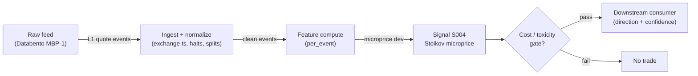

# S004 — Microprice (Stoikov)

Stoikov's learned fair-price estimator: the limiting expected mid-price conditional on the book-imbalance state, estimated from a Markov chain over discretized (imbalance, spread) states — a martingale fair-value. Provenance **[D]**.

> Tag law: every numeric literal in prose carries one of `[documented]
> [default] [example] [unverified] [internal-est] [measured]` (legend: Appendix
> i v1.0.0). Constants inside cited formulas inherit the formula's tag
> (`[documented]` for cited literature). Bibliographic years, volumes, pages,
> arXiv IDs, section numbers, rule codes (C1–C11), fail-safe codes (F1–F5),
> module IDs, and machine-parsed §0 data fields are identifiers, not
> literals, and are exempt.

## §1 Five-minute reviewer card

| Row | Value |
|---|---|
| Module | S004 — Microprice (Stoikov), v1.0.0 |
| Edge verdict | `PREDICTIVE-FEATURE-ONLY` — documented: beats mid and weighted mid as a short-term predictor; no published after-cost standalone Sharpe |
| After-cost | `BEFORE-COST` — documented short-horizon *fair-value estimator* (Stoikov [documented]); the reference build ships the closed-form first-order approximation (depth-weighted mid) — the full Markov estimator is the documented upgrade path |
| Build cost | Tier M · `20–60` h [internal-est] · `$3,000–9,000` loaded [internal-est] |
| Data cost | Research `~$30–200`/mo (SIP L1) [unverified]; production `~$200`/mo + usage (exchange-timestamped L1) [unverified] — bands indicative, verify before budgeting |
| latency_class | microstructure / sub-second |
| risk_class | low (signal-only; no order placement) |
| Capacity | `$1–10`M/day notional [example] — illustrative; calibrate per venue |
| Executability | Feasible: Python+polars prototype, `<=20` symbols live [internal-est]; Rust ingest beyond that |
| Risk summary | Estimation-dominated; dies on sparse (imbalance, spread) states, wide spreads, flicker; closed-form reference is only first-order |
| When it dies | Unsampled state bins (S10.1); spread regime beyond the estimated state space; SIP-only feed in a colocated race |
| Regime gates | Provisional: R001 elevated RV amplifies (faster mean-reversion to microprice), extreme RV kills (state space breaks) |
| Emits | `signal_vector` (Appendix b v1.0.0) — never orders |

## §1.5 Cheapest / least-build path

1. **Prototype hour band:** `20–60` h [internal-est] — L1 snapshot reader + (imbalance, spread) state discretizer + transition-matrix estimator + reference validation against the fixture
2. **Cheapest-source row:** min_tier = Polygon.io Stocks Advanced (SIP L1) — cheapest data source candidate [internal-est]; latency_class = SIP-delayed;
   required_fields = L1 bid/ask price + displayed size per quote event, exchange timestamps; quote history for transition estimation; price_band = `~$30–200`/mo [unverified] (indicative — verify before budgeting); build_or_buy = ****build the estimator, buy the feed** (closed-form microprice is `~10` lines [internal-est]; the value is the state discretization and transition calibration)**.
3. **Resource budget:** `1` core, `<2` GB RAM for `<=20` symbols live [internal-est]; compute pattern `per_event`.
4. **Skip list:** full nm-state Markov estimation (phase `2`); multi-venue aggregation; colocated deployment
5. **DO-NOT-CUT list:** causality assertions (`assert fill_event >
   signal_event`, no-signal-bar-fills test); COST block + callable
   `expected_cost_bps`; F1–F5 fail-safes + module-state enum; decision-log
   audit records; bona-fide-intent + self-trade prevention; provenance tags on
   every numeric literal; fixtures + `test_cmd`; secrets via env only.
6. **Escalation gate:** live universe `>20` symbols [default]; transition matrices unstable across refits [default]; cost gate fails on `[measured]` costs

## §S0 Module contract

### S0.1 Typed signature

```python
def signal(state: ModuleState, events: list[Event], cfg: Config) -> SignalVector:
```

`SignalVector` per Appendix b v1.0.0. `state` is the module-owned named state vector (`prev_book`, `trans_counts` (nm×nm), `R1`, `R2`, `micro_window`, `cooldown_until`, `module_state`); `events` are canonical Events (Appendix a v1.0.0), newest last. The function handles documented edge cases: empty events → `UNKNOWN`; crossed/locked quotes → `UNKNOWN` (F1, never interpolate); halt/auction events → freeze per the market-state table.

### S0.2 Config dataclass

| Parameter | Type | Default | Range | Status |
|---|---|---|---|---|
| `imb_bins` | int | `5` | ``3`–`10`` | default |
| `spread_ticks_max` | int | `5` | ``2`–`10`` | default |
| `est_window_days` | int | `20` | ``5`–`60`` | default |
| `z_entry` | float | `2.0` | ``0.5`–`5.0`` | default |
| `z_exit` | float | `0.5` | ``0.0`–`z_entry`` | default |
| `cooldown_s` | float | `60.0` | ``0`–`3,600`` | default |
| `cost_gate_k` | float | `0.5` | ``0.1`–`2.0`` | default |

All defaults tagged per the tag law (status `default` ⇒ `[default]`).

### S0.3 Canonical schema mapping

Vendor columns → canonical Event schema (Appendix a v1.0.0), stated once here:

| Vendor (Databento MBP-1) | Canonical |
|---|---|
| `ts_event` | `event_ts (int64 ns UTC)` |
| `bid_px_00 / bid_sz_00` | `bid_px / bid_sz` |
| `ask_px_00 / ask_sz_00` | `ask_px / ask_sz` |
| `sequence` | `seq` |

Polygon.io mapping: `t` → `event_ts` (SIP time — label SIP work *simulated only — requires MBO/ITCH* for latency claims), `p`/`s` bid/ask → `bid_px`/`bid_sz`, etc.

### S0.4 Time contract

> Time contract: clock domain UTC, int64 ns; authoritative causality clock = `event_ts`; max_skew = `1` ms [default]; jitter budget = `500` µs [default]; bar-label = open time; staleness TTL = `3` s [default] (`3`× the `1`-s reference cadence per F4); gap policy = mask, no interpolation; halt/auction → discard contributions across reopen.

**Timing box:** `signal@t (per_event, America/New_York) → earliest fill @open(t+1)`

### S0.5 Market-state table

| State | Module behavior |
|---|---|
| CONTINUOUS_TRADING | Compute normally; emit per cadence |
| HALTED | Freeze state; emit `UNKNOWN`; discard contributions across reopen |
| AUCTION | No new signals; hold last `SignalVector`; state `DEGRADED` |
| CLOSED | Emit nothing; state `OFF` |

### S0.6 Module-state enum + error taxonomy

States per Appendix k v1.0.0: `OK | DEGRADED | UNKNOWN | OFF`. Invalid input → `UNKNOWN`, never interpolate (Appendix f v1.0.0, F1–F5).

| Failure | State | Alert |
|---|---|---|
| Missing/stale input (TTL per §S0.4) | `UNKNOWN` | page |
| Crossed/locked quote reaching module | `UNKNOWN` | log |
| Feature out of mathematical bounds (F2) | `UNKNOWN` | page |
| `seq` gap > `1,000` events [default] | `DEGRADED` (restart windows) | log |
| SIP jitter > budget persistently | `DEGRADED` | notify |
| Halt/auction | `UNKNOWN` / `DEGRADED` (per table) | log |
| Kill/administrative disable | `OFF` | page |
| Anything unmapped | `UNKNOWN` | page |

### S0.7 Ops tail

- **Schedule:** continuous during US equities regular session `09:30`–`16:00` America/New_York [documented]; owner: microstructure-signals on-call.
- **Health checks:** fixture replay (`test_cmd`) green on deploy; live `seq-gap` monitor; staleness watchdog at `3`× cadence [default].
- **Alert table:** page on `UNKNOWN` > `30` s [default] or bounds violation; notify on `DEGRADED`; log on single dropped events.
- **Resource budget:** `1` core, `<2` GB RAM for `<=20` symbols live [internal-est]; state is O(window) per symbol.
- **Runbook stub:** `1.` confirm feed (Databento status); `2.` replay fixture; `3.` if red → set `OFF`, page; `4.` reconcile decision log before re-arm.

### S0.8 Secrets (env-only)

`DATABENTO_API_KEY`, `POLYGON_API_KEY` via environment only. No secrets in this file, fixtures, or logs (CI secrets-grep).

### S0.9 May / must-NOT

> **May:** emit `SignalVector` records per Appendix b v1.0.0. **Must-NOT:** emit orders, order intents, prices, share counts, or notionals; call a broker; mutate shared state outside `state`; interpolate across gaps.

## §S1 Legacy (subsumed by §1)

Legacy §S1 content is the §1 reviewer card above; this header is retained so section numbering stays frozen.

## §S2 Specification

### Universe

US common stocks, regular session, top-`500` by trailing-`20`-day dollar volume [example]; spread `≤5` ticks [default] (state space grows with spread).

### Entry rule (Boolean — no prose-only conditions)

```
ENTER_LONG  := (micro_dev >= z_entry * tick) AND (spread_ticks <= spread_ticks_max) AND (now >= cooldown_until) AND (expected_cost_bps(...) <= cost_gate_k * edge_bps)
ENTER_SHORT := (micro_dev <= -z_entry * tick) AND (spread_ticks <= spread_ticks_max) AND (now >= cooldown_until) AND (locate_ok) AND (expected_cost_bps(...) <= cost_gate_k * edge_bps)
FLAT        := otherwise
```

`micro_dev = P^micro − mid` (reference: depth-weighted closed form); `edge_bps = |micro_dev| / mid * 10000` [example].

### Exits (with post-exit cooldown)

```
EXIT := (direction == +1 AND micro_dev < z_exit * tick) OR (direction == -1 AND micro_dev > -z_exit * tick)
        OR (module_state != OK)
ON_EXIT: cooldown_until = now + cooldown_s   # 60 s [default]; C10
```

### Position sizing (fenced function)

```python
def size_shares(risk_budget_R, stop_distance, vol_estimate, ADV_cap, cost):
    # S-module requests capital fraction only; share math lives in the strategy.
    # Reference: capital = 0.5 * confidence  (confidence in [0,1])  [default]
    risk_notional = risk_budget_R * 0.5 * confidence          # [default] 0.5 factor
    shares = risk_notional / max(stop_distance, 1e-9)
    return int(min(shares, ADV_cap * adv_shares * 0.001))     # 0.1% ADV cap [default]
```

### Risk limits

| Limit | Value |
|---|---|
| Max capital fraction per signal | `0.5` [default] |
| Max adverse excursion before `UNKNOWN` review | `2.0`× stop [default] |
| Staleness kill | TTL per §S0.4 → `UNKNOWN` |

### COST block (single source of truth)

| Component | Value (bps) | Basis |
|---|---|---|
| Spread (half-spread, liquid large-cap) | `0.43` | [example] — reference print |
| Fees (taker incl. regulatory) | `0.30` | [example] — reference print |
| Borrow | `0.0` | [default] — reference build long-biased; shorts add C7 locate cost |
| Impact | `0.0` | [example] — flagged; calibrate per venue at scale-up |
| **Total reference** | `0.73` | [example] |

`fee_schedule_as_of`: `2026-09-01` [unverified] — placeholder; pin the real venue schedule before production. `side: taker` [default]; venue/tier/source: XNAS / Databento MBP-1 [example]. Re-stating cost numbers outside this block is a validation failure.

```python
def expected_cost_bps(notional, adv_pct, venue, side, urgency) -> float:
    """Callable cost model — L2 constant stack (impact=0 flagged [example])."""
    spread_bps = 0.43   # [example]
    fee_bps = 0.30      # [example]
    borrow_bps = 0.0    # [default] long-biased reference; reason in table
    impact_bps = 0.0    # [example] flagged; calibrate per venue at scale-up
    if side == "maker":
        fee_bps = -0.20  # rebate [example]
    return spread_bps + fee_bps + borrow_bps + impact_bps
```

### Execution / fill model table

| Aspect | Assumption |
|---|---|
| Latency | Signal→intent `≤1` ms colocated [example]; SIP path latency-simulated-only |
| Partial fills | N/A (signal-only; T-module policy: Appendix c v1.0.0) |
| Impact | `0.0` bps reference [example]; stress ×`5` [example] |
| Adverse fill | Toxic-flow haircut `0.2` bps per `1.0` |z| [example] |

### Robustness

Window/threshold sensitivity must be validated on purged/embargoed out-of-sample data; microstructure parameters mined on `1` month of tape overfit [internal-est]. Re-validate after any feed or venue change.

### Compliance sub-block (C1–C10+)

| Code | Rule: trigger → check → action → log |
|---|---|
| C1 | Self-match prevention: signal module emits no orders; downstream T-modules must set self-trade-prevention flags — this module asserts the requirement in its `consumes` contract |
| C2 | Bona-fide intent: every emitted `SignalVector` with |direction|=`1` must pass the cost gate; sub-threshold prints emit direction `0`, never a tradeable hint |
| C3 | Message-rate: `<=100` emissions/symbol/s [default]; breach -> throttle to `1`/s [default] + alert |
| C4 | Fat-finger trio (applied by consumers; this module bounds its own outputs): confidence in [`0`,`1`], capital in [`0`,`0.5`], computed_at sane - out-of-bounds -> `UNKNOWN` (F2) |
| C5 | Decision log: every emission, veto, and state transition logged per Appendix g v1.0.0, hash-chained |
| C6 | Halt/auction: per the market-state table; contributions across reopen discarded |
| C7 | Locate check: SHORT direction requires `locate_ok` from the consumer; never emit SHORT without the consumer asserting locate (Reg-SHO threshold securities -> direction `0`) |
| C8 | Public dissemination: no signal values published externally without review gate |
| C9 | Data entitlements: per the Data rights row; entitlement-class change -> escalation gate |
| C10 | Post-exit cooldown: no re-entry for `cooldown_s` after any exit or compliance block |
| C11 | Spoofing hygiene: down-weight quotes with lifetime `<50` ms [example]; never quote on them |

### Parameter table

| Parameter | Symbol | Value | Tag | Sensitivity |
|---|---|---|---|---|
| Imbalance bins | `imb_bins` | `5` | [default] | high — state resolution vs data sparsity |
| Max spread states | `spread_ticks_max` | `5 ticks` | [default] | medium |
| Estimation window | `est_window_days` | `20 days` | [default] | high |
| Entry z-threshold | `z_entry` | `2.0` | [default] | high |
| Exit z-threshold | `z_exit` | `0.5` | [default] | medium |
| Post-exit cooldown | `cooldown_s` | `60 s` | [default] | low |
| Cost-gate k | `cost_gate_k` | `0.5` | [default] | high |

### Timing box

`signal@t (per_event, America/New_York) → earliest fill @open(t+1)`

## §S3 Math + normative pseudocode

**Definition** (Stoikov [documented]): with $\tau_1, \tau_2, \dots$ the successive mid-price-change times and $\mathcal{F}_t$ the book information at $t$,
$$P^{\text{micro}}_t = \lim_{i\to\infty} \mathbb{E}[M_{\tau_i} \mid \mathcal{F}_t].$$
Write $P^{\text{micro}} = M + g(I, S)$ with $M$ mid, $I = Q^b/(Q^b+Q^a)$ imbalance, $S$ spread; the paper's program is to **estimate $g$ from data**. **Finite-state estimator** (implementable): discretize imbalance into $n$ bins and spread into $m$ tick values ($nm$ states); estimate transition matrices $Q$ (transient quote updates), $R^1$ (one-step mid-move distribution), $R^2$ (transitions coincident with a mid move) from quote history, then solve for the limiting expectation. **Reference closed form** (first-order approximation, practitioner note [unverified] — kept in the reference build): the depth-weighted mid
$$P^{\text{micro}}_t \approx \frac{Q^a_t P^b_t + Q^b_t P^a_t}{Q^a_t + Q^b_t} = M_t + \frac{s_t}{2} I_t,$$
which the fixture validates exactly.

**Normative pseudocode** (pseudocode is normative; prose is commentary):

```
function signal(state, events, cfg) -> SignalVector:
    assert events non-empty else return UNKNOWN                    # F1
    e = events[-1]
    assert e.bid_px > 0 and e.ask_px > e.bid_px else return UNKNOWN # F1/F2
    assert (e.bid_sz + e.ask_sz) > 0 else return UNKNOWN           # F2
    M = (e.bid_px + e.ask_px) / 2
    I = e.bid_sz / (e.bid_sz + e.ask_sz)
    micro = (e.ask_sz * e.bid_px + e.bid_sz * e.ask_px) / (e.bid_sz + e.ask_sz)
    micro_dev = micro - M                                          # [example] closed-form reference
    assert isfinite(micro_dev) else return UNKNOWN                 # F2
    edge_bps = abs(micro_dev) / M * 10000                          # [example]
    # normative cost-gate predicate: expected_cost_bps(...) <= k * edge_bps
    cost_ok = expected_cost_bps(notional, adv_pct, venue, side, urgency) <= cfg.cost_gate_k * edge_bps
    tick = e.tick_size
    direction = +1 if (micro_dev >= cfg.z_entry * tick and cost_ok and gates_pass(e)) else
                -1 if (micro_dev <= -cfg.z_entry * tick and cost_ok and gates_pass(e) and locate_ok) else 0
    confidence = min(1, abs(micro_dev) / (2 * cfg.z_entry * tick)) if direction != 0 else 0
    capital = 0.5 * confidence                                     # [default]
    sig = SignalVector(symbol=e.symbol, direction, confidence, capital,
                       computed_at=e.event_ts, staleness=now()-e.asof_ts,
                       module_state=state.module_state)
    log_decision(sig, inputs_hash, params_hash)                    # C5 / Appendix g
    assert fill_event > signal_event  # t→t+1 causality: fills strictly after the snapshot
    return sig
```

Causality: microprice at event `t` uses only book state ≤ `t`; earliest reaction is `t+1`. The full Markov estimator is trained on history ≤ `t` only — no future transitions. Mandatory unit test: no-signal-bar fills.

## §S4 Worked example (fixture-backed)

- Tape: `modules/fixtures/S004_tape.csv` — `# TYPE: validation-run`; `6` L1 snapshots, all numbers synthetic, seed `20260904` [example]; validates the closed-form reference `P^micro = (Q^a·P^b + Q^b·P^a)/(Q^a + Q^b)`.
- Expected outputs: `modules/fixtures/S004_expected.csv`; per-event microprice, mid, and imbalance `I`; hand-checked below.
- Tolerance: `1e-9` [default] on floats; integer contributions exact.
- Acceptance tests (`modules/tests/test_S004.py`, `6` tests): `1.` fixture recomputes to expected; `2.` stub emits valid `SignalVector` (direction in {+1,-1,0}, confidence/capital in [0,1]); `3.` no-signal-bar fills (`fill_event_ts > computed_at`); `4.` cost-gate predicate passes on large edge, blocks on tiny edge (`k = 0.5` [default]); `5.` invalid input -> `UNKNOWN`; `6.` extra: stub is deterministic across calls.
- `test_cmd`: `python -m pytest modules/tests/test_S004.py -q` → exits `0`.

**Hand-checked rows** (arithmetic verified by hand against the fixture):

- r0: `M = 100.01`, `I = 0.2` → `P^micro = 100.01 + 0.01×0.2 = 100.012` ✓
- r1: `I = 0.8` → `100.01 + 0.008 = 100.018` ✓
- r3: `I = 0` → `100.02` ✓
- r4: `M = 100.03`, `I = −0.8` → `100.03 − 0.008 = 100.022` ✓
- r5: `I = 0.4` → `100.03 + 0.004 = 100.034` ✓

**Where the example is optimistic:** no fees, no latency, no hidden liquidity — arithmetic illustration, not a backtest.

## §S5 Strategies that use this signal

Generated from `deps.yaml` (CI symmetry). Provisional consumer list (roles pinned at ingest):

| Strategy | Role |
|---|---|
| T-series execution consumers (see `deps.yaml`) | Downstream consumer of this signal family's direction/confidence outputs; exact strategy IDs pinned at ingest |

Microprice is the canonical fair-value anchor for market-making skew and execution scheduling downstream; consumer roles pinned in `deps.yaml`.

## §S6 Data required

| Field | Type | Granularity | Source tier | Notes |
|---|---|---|---|---|
| Best bid/ask price + displayed size | float / int | every quote event (L1) | Tier 2 | displayed size per price move |
| Exchange timestamps | int64 ns | per event | Tier 2 | SIP adds 10s of µs jitter [documented] — label SIP work *simulated only — requires MBO/ITCH* |
| Corporate actions / halts | reference | daily + intraday halt feed | Tier 1 | contributions garbage across splits/halt reopens |

**Data rights row** (Appendix j v1.0.0): US equities L1 via Databento MBP-1, `rights: licensed`; license scope = research + stated production symbol count; raw ticks never leave our systems — fixtures are synthetic; entitlement = professional/internal, no display; retention per vendor terms, purge path in runbook. Entitlement-class change → §1.5 escalation gate.

## §S7 Local build (M5 Max / 128 GB)

Feasible. O(`1`) [documented] per-event scan: Python loop `~100–500`k events/s [internal-est] vs `~50–500` L1 events/s average per liquid name, busy bursts `~1–5`k/s [internal-est] (cost-model §2). `50` symbols × `2`k events/s = `100`k/s → Python borderline, Rust (`5–50`M/s [internal-est]) comfortable; polars batch recompute each second trivial. Bottleneck is I/O and timestamp normalization. RAM: one symbol-day L1 `~0.5–4` GB [internal-est] — fine for a few symbols; `60` days does not fit — stream per-symbol daily parquet (cost-model §3).

## §S8 Buy vs build

Build the estimator (Python+polars), buy the feed. Verdict: the per-event math is `~40–100` lines [internal-est]; the value is normalization, windows, and calibration — none sold by vendors. Buy Databento MBP-1 history to validate, Tier-1 SIP for live research, direct/MBO only after the signal survives realistic costs (cost-model §6).

## §S9 Efficacy — documented evidence

| Study / source | Market & period | Metric | Before/after cost | Caveat |
|---|---|---|---|---|
| Stoikov (2018) [documented] | US equities, quote history | microprice beats mid and weighted mid as a short-term predictor (martingale construction) | `BEFORE-COST` | estimation exercise, not a trading rule |
| Stoikov (2017) [documented] | working paper | full definition; limit-of-expected-midprices construction | `BEFORE-COST` | no after-cost P&L |
| Sasson, Ho & Samson (2021) [documented] | AAPL dataset (course report) | practitioner reconstruction comparing mid, weighted mid, microprice fair-value estimators | `BEFORE-COST` | course report, not peer-reviewed |

Selection disclosure: the `3` sources surfaced by the chapter's research pass; no published after-cost Sharpe for a standalone microprice rule was found [documented-as-absence].

## §S10 Failure modes & pitfalls

| # | Trigger → Detect → Action → Recovery | check: |
|---|---|---|
| 1 | State-sparsity: (imbalance, spread) bins go unsampled and transition estimates degrade → detect: bin visit counts < `100` [default] over the estimation window → action: fall back to closed-form reference, flag `DEGRADED` → recovery: re-enable full estimator after re-estimation | `check: min_bin_visits >= 100 [default]` |
| 2 | Lookahead leakage: bar-close feature traded intra-bar → detect: causality audit flags `fill_event <= signal_event` → action: halt, fix bar finalization → recovery: re-run no-signal-bar-fills test | `check: all(fill_ts > computed_at)` |
| 3 | Staleness/latency: feed timestamps in a race → detect: jitter > budget → action: `DEGRADED`, label simulated-only → recovery: direct feed or stand down | `check: asof_ts - event_ts <= jitter_budget` |
| 4 | Fleeting quotes/spoofing: displayed size cancels pre-execution → detect: quote lifetime `<50` ms [example] share rising → action: down-weight sub-`50` ms quotes → recovery: re-tune weights | `check: fleeting_share < 0.3 [default]` |
| 5 | Cost blowup: spread+fees+impact on the round trip → detect: cost gate failing on `[measured]` costs → action: widen `k` gate or stand down → recovery: re-pin fee schedule | `check: expected_cost_bps(...) <= k * edge_bps` |
| 6 | Regime breaks: depth/volatility regime shifts → detect: feature distribution break → action: veto entries → recovery: resume when stable for `5` min [default] | `check: feature_z_within_3_sigma [default]` |
| 7 | Overfitting: parameters mined on `1` period → detect: OOS decay → action: purged/embargoed re-validation → recovery: shrink per-symbol | `check: oos_sharpe > 0.5 * is_sharpe [default]` |
| 8 | Data errors: bad ticks, splits, halts → detect: bounds/`seq`-gap monitors → action: `UNKNOWN`, mask bars → recovery: backfill and replay | `check: no crossed quotes in window` |

### Regime-gate machine records (provisional)

| regime_id | direction | mechanism | condition | action | min_lag | unknown_behavior |
|---|---|---|---|---|---|---|
| R001 | amplifies | elevated realized volatility widens spreads and deepens adverse selection | RV > `2`× trailing median [example] | widen_stops | `1` session [example] | hold last label |
| R002 | degrades | quote flicker / spoofing regimes inject noise into book features | fleeting-quote share > `0.3` [example] | halve | `30` min [example] | veto entries |
| R003 | degrades | halt/auction regimes break continuity assumptions | market_state != CONTINUOUS_TRADING | pause_entry | `0` | veto entries |

## §S11 Visuals

`../../images/S004_example.png` — synthetic `6`-snapshot microprice tape (seed `20260904` [example]): microprice vs mid deviation.



## §S12 Source log + unverified leads

**Sources** (citable facts only):

1. Stoikov, S. (2018) [documented]. "The micro-price: a high-frequency estimator of future prices." *Quantitative Finance* 18(12): 1959–1966. https://econpapers.repec.org/article/tafquantf/v_3a18_3ay_3a2018_3ai_3a12_3ap_3a1959-1966.htm — martingale construction; beats mid and weighted mid as a short-term predictor.
2. Stoikov, S. (2017) [documented]. "The Micro-Price: A High Frequency Estimator of Future Prices." Working paper (Nov 2017). https://github.com/shaileshkakkar/MicroPriceIndicator/raw/refs/heads/master/Micro-Price%20Indicator.pdf
3. Sasson, J., Ho, W. H. & Samson, F. (2021) [documented]. "High Frequency Trading Strategies." Stanford MS&E 448 course final report. http://stanford.edu/class/msande448/2021/Final_reports/gr1.pdf

**Chatbot source log.** Duck.ai answered Q-SB1-1 (OFI portion only — no usable microprice content returned) (2026-09-10); Grok/Cursor answers pending (checked 2026-09-10).

**Unverified leads** (chatbot-only — never in evidence tables):

- Practitioner note (GitHub `jy447/vpin-model` README): the closed-form cross-weighted mid is a *first-order* approximation of Stoikov's full estimator; an author's reference implementation exists at `github.com/sstoikov/microprice` — I did not verify that repository resolves, so it stays here, not in Sources.
- Cartea, Jaimungal & Penalva (2015), *Algorithmic and High-Frequency Trading*, Cambridge University Press, §10 — the chapter's cited corroboration for the N-level/weighted-mid construction; no public URL verified, kept as a lead rather than a checked source.

---

## Appendix — AI build prompt (S004)

Copy-paste into any chat agent:

> Build module **S004 — Microprice (Stoikov)** per
> `notes/module-template.md` v1.0.0 and this file's §S0 contract.
> Cheapest path (§1.5): prototype 20–60 h [internal-est]; cheapest data
> candidate Polygon.io Stocks Advanced (SIP L1) — cheapest data source candidate [internal-est]; compute pattern `per_event`; skip full Markov/Rust/colocation.
> Implement `signal(state, events, cfg) -> SignalVector` (Appendix b v1.0.0)
> with the §S3 normative pseudocode, including the cost-gate predicate
> `expected_cost_bps(...) <= k * edge_bps` and `assert fill_event >
> signal_event`. Wire F1–F5 (Appendix f v1.0.0): invalid input -> `UNKNOWN`,
> never interpolate. Log decisions per Appendix g v1.0.0. Secrets via env
> only. Run the fixture `modules/fixtures/S004_tape.csv`
> (`# TYPE: validation-run`) against `modules/fixtures/S004_expected.csv`
> (tolerance `1e-9` [default]).
> **Definition of done:** `python3 -m pytest modules/tests/test_S004.py -q`
> exits `0`. Tag every numeric literal you add with the unified enum
> (Appendix i v1.0.0); put anything unverifiable in §S12 unverified leads.
