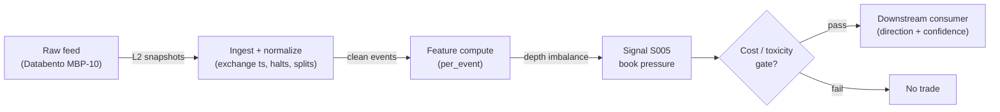

# S005 — Multi-level book pressure (static depth imbalance)

The ratio of resting bid depth to total depth across the first `L` book levels — a still photograph of latent supply/demand. Provenance **[I]** (standard reconstruction on documented sources).

> Tag law: every numeric literal in prose carries one of `[documented]
> [default] [example] [unverified] [internal-est] [measured]` (legend: Appendix
> i v1.0.0). Constants inside cited formulas inherit the formula's tag
> (`[documented]` for cited literature). Bibliographic years, volumes, pages,
> arXiv IDs, section numbers, rule codes (C1–C11), fail-safe codes (F1–F5),
> module IDs, and machine-parsed §0 data fields are identifiers, not
> literals, and are exempt.

## §1 Five-minute reviewer card

| Row | Value |
|---|---|
| Module | S005 — Multi-level book pressure (static depth imbalance), v1.0.1 |
| Edge verdict | `PREDICTIVE-FEATURE-ONLY` — practitioner reconstruction; touch-level core shared with Gould–Bonart; no standalone after-cost evidence |
| After-cost | `BEFORE-COST` — a *practitioner* depth-tilt gauge [SR]; the touch-level core is documented (Gould–Bonart), the multi-level extension is a practitioner construction — treat as a feature, not a trigger |
| Build cost | Tier H · `60–200` h [internal-est] · `$9,000–30,000` loaded [internal-est] |
| Data cost | Research: Databento Standard `$199`/mo [documented] (includes `1` month MBP-10 L2 history [documented]; extra MBP-10 history `$1.00`/GB on DBEQ.BASIC [documented]); Production: same `$199`/mo [documented] (unlimited live US-equities data) — verify bands at databento.com before budgeting |
| latency_class | microstructure / sub-second |
| risk_class | low (signal-only; no order placement) |
| Capacity | `$1–10`M/day notional [example] — illustrative; calibrate per venue |
| Executability | Feasible: Python+polars prototype, `<=20` symbols live [internal-est]; Rust ingest beyond that |
| Risk summary | Snapshot-staleness dominated; dies on synthetic-L2 misuse, spoofed deep levels, wide spreads; a still photo, not a movie |
| When it dies | Stale snapshots (a snapshot is one step behind the tape [documented]); synthetic L2 from SIP used as real depth; spoofed deep levels |
| Regime gates | Provisional machine records in §S10: R001 RV amplifies (widen_stops, `1` session lag [example]); R002 quote-flicker degrades (halve, `30` min lag [example]); R003 halt/auction degrades (pause_entry, veto) |
| Emits | `signal_vector` (Appendix b v1.0.0) — never orders |

## §1.5 Cheapest / least-build path

1. **Prototype hour band:** `60–200` h [internal-est] — L2 snapshot reader + level-weighted depth aggregator + tilt trigger + reference validation against the fixture
2. **Cheapest-source row:** min_tier = Databento Standard (US Equities service, MBP-10) — cheapest depth source candidate [internal-est]; latency_class = exchange-timestamped (live) / SIP-delayed on DBEQ.BASIC;
   required_fields = per-event L2 snapshot `ts_event` (int64 ns UTC), `bid_px_00..09`/`bid_sz_00..09`/`ask_px_00..09`/`ask_sz_00..09` (int64 fixed-point ×1e9 prices; UNDEF sentinel `9223372036854775807` on empty levels [documented]), `sequence`;
   price_band = `$199`/mo Standard plan [documented] (unlimited live equities data; `1` month MBP-10 history included [documented]; additional MBP-10 history `$1.00`/GB [documented]) — verify at databento.com before budgeting; build_or_buy = **build the aggregator, buy the depth feed** (weighted depth ratio is `~30` lines [internal-est]; synthetic L2 from SIP is model-simulation, not depth — label it).
3. **Resource budget:** `1` core, `<2` GB RAM for `<=20` symbols live [internal-est]; compute pattern `per_event`.
4. **Skip list:** full MBO/ITCH replay; hidden-liquidity estimation; colocated deployment
5. **DO-NOT-CUT list:** causality assertions (`assert fill_event >
   signal_event`, no-signal-bar-fills test); COST block + callable
   `expected_cost_bps`; F1–F5 fail-safes + module-state enum; decision-log
   audit records; bona-fide-intent + self-trade prevention; provenance tags on
   every numeric literal; fixtures + `test_cmd`; secrets via env only.
6. **Escalation gate:** live universe `>20` symbols [default]; synthetic-L2-from-SIP used anywhere latency-sensitive (label *simulated only*); cost gate fails on `[measured]` costs

## §S0 Module contract

### S0.1 Typed signature

```python
def signal(state: ModuleState, events: list[Event], cfg: Config) -> SignalVector:
```

`SignalVector` per Appendix b v1.0.0. `state` is the module-owned named state vector (`book_snapshot` (L levels), `bp_window`, `cooldown_until`, `module_state`); `events` are canonical Events (Appendix a v1.0.0), newest last. The function handles documented edge cases: empty events → `UNKNOWN`; crossed/locked quotes → `UNKNOWN` (F1, never interpolate); halt/auction events → freeze per the market-state table.

### S0.2 Config dataclass

| Parameter | Type | Default | Range | Status |
|---|---|---|---|---|
| `levels` | int | `5` | ``3`–`10`` | default |
| `decay_eta` | float | `0.5` | ``0`–`1.0`` | default |
| `tilt_theta` | float | `0.2` | ``0.1`–`0.3`` | default |
| `snapshot_ms` | float | `1000.0` | ``100`–`5,000`` | default |
| `cooldown_s` | float | `60.0` | ``0`–`3,600`` | default |
| `cost_gate_k` | float | `0.5` | ``0.1`–`2.0`` | default |

All defaults tagged per the tag law (status `default` ⇒ `[default]`).

**Calibration recipes** (run on the first `20` trading days [default] of per-symbol MBP-10, purged of the OOS window; re-run quarterly [default] or after any feed/venue change):

| Parameter | Recipe |
|---|---|
| `levels` | Grid `L ∈ {3,4,5,6,8,10}` [example]; per-L compute OOS R² of `BP_L` vs next `1`-s mid-price move; pick the knee where marginal R² gain < `5` pp [default] (Xu et al. show monotonic gains with each level [documented], but deep levels add flicker noise — expect `5` [default] to dominate for US large-caps [internal-est]) |
| `decay_eta` | Grid `η ∈ {0, 0.25, 0.5, 1.0}` [example]; maximize OOS directional accuracy net of the reference cost; `η = 0` reduces to equal weights (pinned by test_07); start at `0.5` [default] |
| `tilt_theta` | Sort `|BP_L|` over calibration snapshots; grid `θ ∈ {0.10, 0.15, 0.20, 0.25, 0.30}` [example]; pick the largest `θ` with `≥30` [default] qualifying snapshots/day and positive after-cost mean on the calibration window |
| `snapshot_ms` | Start `1000` ms [default]; lower toward `100` ms [example] only if `seq`-gap and jitter budgets stay green — faster cadence raises staleness risk linearly with event rate |
| `cooldown_s` | Set to `≈2×` the empirical half-life of the `BP_L` autocorrelation [default recipe]; `60` s [default] is the reference, not a calibrated value |
| `cost_gate_k` | Sweep `k ∈ {0.1, 0.25, 0.5, 1.0, 2.0}` [example] on OOS data; pick the largest `k` with after-cost mean ≥ `0` [default]; `0.5` [default] is the reference gate |

Sensitivity shorthand: `tilt_theta` and `cost_gate_k` dominate P&L (high); `levels`/`decay_eta` dominate feature stability (medium–high); `snapshot_ms`/`cooldown_s` are second-order (low–medium). Any parameter mined on `<20` days [default] of tape is flagged overfit until the walk-forward in §S4 passes.

### S0.3 Canonical schema mapping

Vendor columns → canonical Event schema (Appendix a v1.0.0), stated once here. S005 requires 10-level depth, so the canonical vendor schema is **Databento MBP-10** (MBP-1 carries only the touch and cannot supply levels 2–10) [documented]:

| Vendor (Databento MBP-10, DBN v3) | Canonical |
|---|---|
| `ts_event` (uint64, ns since epoch, UTC) | `event_ts (int64 ns UTC)` |
| `ts_recv` (uint64 ns UTC, gateway capture) | `asof_ts` |
| `instrument_id` (uint32) + symbol mapping | `symbol` |
| `action` (char: T/B/A/C/M), `side` (char), `depth` (uint8), `flags` (uint8 bitmask) | event qualifiers on `Event` |
| `sequence` (uint32, venue-specific) | `seq` |
| `bid_px_0i / bid_sz_0i / bid_ct_0i` (`i = 00..09`) | level bid price/size/count `k = 1..10` |
| `ask_px_0i / ask_sz_0i / ask_ct_0i` (`i = 00..09`) | level ask price/size/count `k = 1..10` |
| `price` (int64, trade price if action = 'T') | reference price |

(`73` columns total in the flattened MBP-10 row [documented].)

Normalization rules (normative): prices are int64 fixed-point ×`1e9` [documented] — convert by integer/`Decimal` division, never float through ingestion [documented]; sizes/counts are uint32; empty levels carry the `UNDEF_PRICE` sentinel `9223372036854775807` (INT64_MAX) [documented] — mask sentinel levels before aggregation, and if any of levels `1..L` is sentinel or zero-size, the snapshot is incomplete → `UNKNOWN` (F1, never interpolate); the first `L` of the `10` levels [documented] feed `cfg.levels` (levels `6..10` available for the `levels` calibration grid in §S0.2).

Polygon.io mapping: `t` → `event_ts` (SIP time — label SIP work *simulated only — requires MBP-10* for latency claims), `p`/`s` bid/ask → `bid_px`/`bid_sz`, etc.

### S0.4 Time contract

> Time contract: clock domain UTC, int64 ns; authoritative causality clock = `event_ts`; max_skew = `1` ms [default]; jitter budget = `500` µs [default]; bar-label = open time; staleness TTL = `3` s [default] (`3`× the `1`-s reference cadence per F4); gap policy = mask, no interpolation; halt/auction → discard contributions across reopen.

**Timing box:** `signal@t (per_event, America/New_York) → earliest fill @open(t+1)`

### S0.5 Market-state table

| State | Module behavior |
|---|---|
| CONTINUOUS_TRADING | Compute normally; emit per cadence |
| HALTED | Freeze state; emit `UNKNOWN`; discard contributions across reopen |
| AUCTION | No new signals; hold last `SignalVector`; state `DEGRADED` |
| CLOSED | Emit nothing; state `OFF` |

### S0.6 Module-state enum + error taxonomy

States per Appendix k v1.0.0: `OK | DEGRADED | UNKNOWN | OFF`. Invalid input → `UNKNOWN`, never interpolate (Appendix f v1.0.0, F1–F5).

| Failure | State | Alert |
|---|---|---|
| Missing/stale input (TTL per §S0.4) | `UNKNOWN` | page |
| Crossed/locked quote reaching module | `UNKNOWN` | log |
| Feature out of mathematical bounds (F2) | `UNKNOWN` | page |
| `seq` gap > `1,000` events [default] | `DEGRADED` (restart windows) | log |
| SIP jitter > budget persistently | `DEGRADED` | notify |
| Halt/auction | `UNKNOWN` / `DEGRADED` (per table) | log |
| Kill/administrative disable | `OFF` | page |
| Anything unmapped | `UNKNOWN` | page |

### S0.7 Ops tail

- **Schedule:** continuous during US equities regular session `09:30`–`16:00` America/New_York [documented]; owner: microstructure-signals on-call.
- **Health checks:** fixture replay (`test_cmd`) green on deploy; live `seq-gap` monitor; staleness watchdog at `3`× cadence [default].
- **Alert table:** page on `UNKNOWN` > `30` s [default] or bounds violation; notify on `DEGRADED`; log on single dropped events.
- **Resource budget:** `1` core, `<2` GB RAM for `<=20` symbols live [internal-est]; state is O(window) per symbol.
- **Runbook stub:** `1.` confirm feed (Databento status); `2.` replay fixture; `3.` if red → set `OFF`, page; `4.` reconcile decision log before re-arm.

### S0.8 Secrets (env-only)

`DATABENTO_API_KEY`, `POLYGON_API_KEY` via environment only. No secrets in this file, fixtures, or logs (CI secrets-grep).

### S0.9 May / must-NOT

> **May:** emit `SignalVector` records per Appendix b v1.0.0. **Must-NOT:** emit orders, order intents, prices, share counts, or notionals; call a broker; mutate shared state outside `state`; interpolate across gaps.

## §S1 Legacy (subsumed by §1)

Legacy §S1 content is the §1 reviewer card above; this header is retained so section numbering stays frozen.

## §S2 Specification

### Universe

US common stocks, regular session, top-`500` by trailing-`20`-day dollar volume [example]; MBP-10 depth available; synthetic L2 from SIP labeled *simulated only — requires MBP-10*.

### Entry rule (Boolean — no prose-only conditions)

```
ENTER_LONG  := (BP_L >= tilt_theta) AND (now >= cooldown_until) AND (expected_cost_bps(...) <= cost_gate_k * edge_bps)
ENTER_SHORT := (BP_L <= -tilt_theta) AND (now >= cooldown_until) AND (locate_ok) AND (expected_cost_bps(...) <= cost_gate_k * edge_bps)
FLAT        := otherwise
```

`BP_L` = depth-weighted multi-level imbalance ∈ [−1, 1]; `edge_bps = |BP_L| * 3.0` [example] modeled per-trade edge — the linear-in-`|BP|`, inverse-in-depth functional form follows Cont–Kukanov–Stoikov (price-change slope inversely proportional to market depth [documented]); the `3.0` scale factor itself is [example] and must be calibrated per venue.

### Exits (with post-exit cooldown)

```
EXIT := (direction == +1 AND BP_L < 0.05) OR (direction == -1 AND BP_L > -0.05)
        OR (depth_snapshot_stale) OR (module_state != OK)
ON_EXIT: cooldown_until = now + cooldown_s   # 60 s [default]; C10
```

### Position sizing (fenced function)

```python
def size_shares(risk_budget_R, stop_distance, vol_estimate, ADV_cap, cost,
                confidence, adv_shares):
    # S-module requests capital fraction only; share math lives in the strategy.
    # confidence in [0,1] comes from the emitted SignalVector; adv_shares is the
    # trailing-20-day average daily share volume [example]; unused vol_estimate is
    # kept for signature parity with the T-module harness (Appendix c v1.0.0).
    capital_frac = 0.5 * confidence                    # [default] 0.5 factor
    risk_notional = risk_budget_R * capital_frac       # [default]
    shares = risk_notional / max(stop_distance, 1e-9)
    return int(min(shares, ADV_cap * adv_shares * 0.001))  # 0.1% ADV cap [default]
```

### Risk limits

| Limit | Value |
|---|---|
| Max capital fraction per signal | `0.5` [default] |
| Max adverse excursion before `UNKNOWN` review | `2.0`× stop [default] |
| Staleness kill | TTL per §S0.4 → `UNKNOWN` |

### COST block (single source of truth)

| Component | Value (bps) | Basis |
|---|---|---|
| Spread (half-spread, liquid large-cap) | `0.43` | [example] — reference print |
| Fees (taker incl. regulatory) | `0.30` | [example] — reference print, sized to Nasdaq's `$0.0030`/share remove-liquidity fee on a `$100` share price [documented] |
| Borrow (`borrow_bps_per_day`) | `0.0` | [default] — reference build long-biased; shorts add C7 locate cost |
| Impact | `0.0` | [example] — flagged; calibrate per venue at scale-up |
| **Total reference** | `0.73` | [example] |

`fee_schedule_as_of`: `2026-09-10` [documented] — Nasdaq Trader price list, "Fees to Remove Liquidity, Shares Executed at or above $1.00": `$0.0030`/share, All MPIDs. `side: taker` [default]; venue/tier/source: XNAS / Nasdaq / Databento MBP-10 US Equities [example]. Re-stating cost numbers outside this block is a validation failure.

```python
def expected_cost_bps(notional, adv_pct, venue, side, urgency) -> float:
    """Callable cost model — L2 constant stack (impact=0 flagged [example])."""
    spread_bps = 0.43   # [example]
    fee_bps = 0.30      # [example]
    borrow_bps = 0.0    # [default] long-biased reference; reason in table
    impact_bps = 0.0    # [example] flagged; calibrate per venue at scale-up
    if side == "maker":
        fee_bps = -0.20  # rebate [example]
    return spread_bps + fee_bps + borrow_bps + impact_bps
```

### Execution / fill model table

| Aspect | Assumption |
|---|---|
| Latency | Signal→intent `≤1` ms colocated [example]; SIP path latency-simulated-only |
| Partial fills | N/A (signal-only; T-module policy: Appendix c v1.0.0) |
| Impact | `0.0` bps reference [example]; stress ×`5` [example] |
| Adverse fill | Toxic-flow haircut `0.2` bps per `1.0` |z| [example] |

### Robustness

Window/threshold sensitivity must be validated on purged/embargoed out-of-sample data; microstructure parameters mined on `1` month of tape overfit [internal-est]. Re-validate after any feed or venue change.

### Compliance sub-block (C1–C10+)

| Code | Rule: trigger → check → action → log |
|---|---|
| C1 | Self-match prevention: signal module emits no orders; downstream T-modules must set self-trade-prevention flags — this module asserts the requirement in its `consumes` contract |
| C2 | Bona-fide intent: every emitted `SignalVector` with |direction|=`1` must pass the cost gate; sub-threshold prints emit direction `0`, never a tradeable hint |
| C3 | Message-rate: `<=100` emissions/symbol/s [default]; breach -> throttle to `1`/s [default] + alert |
| C4 | Fat-finger trio (applied by consumers; this module bounds its own outputs): confidence in [`0`,`1`], capital in [`0`,`0.5`], computed_at sane - out-of-bounds -> `UNKNOWN` (F2) |
| C5 | Decision log: every emission, veto, and state transition logged per Appendix g v1.0.0, hash-chained |
| C6 | Halt/auction: per the market-state table; contributions across reopen discarded |
| C7 | Locate check: SHORT direction requires `locate_ok` from the consumer; never emit SHORT without the consumer asserting locate (Reg-SHO threshold securities -> direction `0`) |
| C8 | Public dissemination: no signal values published externally without review gate |
| C9 | Data entitlements: per the Data rights row; entitlement-class change -> escalation gate |
| C10 | Post-exit cooldown: no re-entry for `cooldown_s` after any exit or compliance block |
| C11 | Spoofing hygiene: down-weight quotes with lifetime `<50` ms [example]; never quote on them |

### Parameter table

| Parameter | Symbol | Value | Tag | Sensitivity |
|---|---|---|---|---|
| Levels | `levels` | `5` | [default] | high — deep noise vs touch-only |
| Decay | `decay_eta` | `0.5` | [default] | medium — deep-level down-weighting |
| Tilt threshold | `tilt_theta` | `0.2` | [default] | high |
| Snapshot cadence | `snapshot_ms` | `1000 ms` | [default] | medium — staleness |
| Post-exit cooldown | `cooldown_s` | `60 s` | [default] | low |
| Cost-gate k | `cost_gate_k` | `0.5` | [default] | high |

### Timing box

`signal@t (per_event, America/New_York) → earliest fill @open(t+1)`

## §S3 Math + normative pseudocode

Normative feature (production path — exponential level weights). With level weights $w_l = e^{-\eta(l-1)}$, $\eta$ = `decay_eta`:

$$BP_L(t) = \frac{\sum_{l=1}^{L} w_l\,Q^b_l(t) - \sum_{l=1}^{L} w_l\,Q^a_l(t)}{\sum_{l=1}^{L} w_l\,Q^b_l(t) + \sum_{l=1}^{L} w_l\,Q^a_l(t)} \in [-1, +1]$$

$Q^b_l(t)$ ($Q^a_l(t)$) = resting bid (ask) size in shares at level $l$; $l=1$ is the touch. Dimensionless; positive = bid-side pressure (latent buying). Special cases: $\eta = 0$ ⇒ $w_l = 1$ ⇒ equal-weighted multi-level imbalance (pinned by the fixture and test_07); $L=1$ ⇒ touch-only queue imbalance = S003. Microprice cousin: S004. Timing: snapshot at $t$ from the book state; tradable no earlier than $t{+}1$ (a snapshot is already one step behind the tape) [documented]. Imbalance definition $I = (q^b - q^a)/(q^b + q^a)$ is the standard volume-imbalance form [documented].

**Normative pseudocode** (pseudocode is normative; prose is commentary):

```
function gates_pass(snap, cfg, now_ns) -> bool:          # normative: all prose guards executable
    # F1/F2: crossed or locked quotes
    if snap.bid_px[0] >= snap.ask_px[0]: return False
    # F1: no interpolation across missing levels (UNDEF sentinel) or non-positive sizes
    for l in 1..cfg.levels:
        if snap.bid_px[l] == UNDEF_PRICE or snap.ask_px[l] == UNDEF_PRICE: return False
        if snap.bid_sz[l] <= 0 or snap.ask_sz[l] <= 0: return False
    # F4: staleness TTL (3 x snapshot cadence, §S0.4)
    if now_ns - snap.event_ts > 3 * cfg.snapshot_ms * 1_000_000: return False
    return True

function signal(state, events, cfg) -> SignalVector:
    assert events non-empty else return UNKNOWN                    # F1
    snap = latest_book_snapshot(events, cfg.levels)
    if not gates_pass(snap, cfg, now_ns()): return UNKNOWN        # F1/F2/F4, never interpolate
    w = [exp(-cfg.decay_eta * (l-1)) for l in 1..cfg.levels]      # eta=0 -> equal weights
    tot_b = sum(w[l] * snap.bid_sz[l]); tot_a = sum(w[l] * snap.ask_sz[l])
    assert (tot_b + tot_a) > 0 else return UNKNOWN                # F2
    BP = (tot_b - tot_a) / (tot_b + tot_a)
    assert -1 <= BP <= 1 else return UNKNOWN                      # F2
    state.bp_window.append(BP)
    edge_bps = abs(BP) * 3.0                                       # [example]
    # normative cost-gate predicate: expected_cost_bps(...) <= k * edge_bps
    cost_ok = expected_cost_bps(notional, adv_pct, venue, side, urgency) <= cfg.cost_gate_k * edge_bps
    direction = +1 if (BP >= cfg.tilt_theta and cost_ok and cooldown_ok(state, snap)) else
                -1 if (BP <= -cfg.tilt_theta and cost_ok and cooldown_ok(state, snap) and locate_ok) else 0
    confidence = min(1, abs(BP)) if direction != 0 else 0
    capital = 0.5 * confidence                                     # [default]
    sig = SignalVector(symbol=snap.symbol, direction, confidence, capital,
                       computed_at=snap.event_ts, staleness=now_ns()-snap.event_ts,
                       module_state=state.module_state)
    log_decision(sig, inputs_hash, params_hash)                    # C5 / Appendix g
    assert fill_event > signal_event  # t→t+1 causality: fills strictly after the snapshot
    return sig
```

Causality: the snapshot at `t` reflects the book state; tradable no earlier than `t+1` — a snapshot is already one step behind the tape. Mandatory unit test: no-signal-bar fills.

## §S4 Worked example (fixture-backed)

- Tape: `modules/fixtures/S005_tape.csv` — `# TYPE: validation-run`; `6` L2 snapshots (`L=5`, equal weights — the `η=0` special case of the normative weighted form; production default `η=0.5` [default]), all numbers synthetic, seed `20260905` [example]; `event_ts` int64 ns UTC.
- Expected outputs: `modules/fixtures/S005_expected.csv`; per-snapshot `BP_5` (4 dp); hand-checked below.
- Tolerance: `1e-9` [default] on floats; integer contributions exact.
- Acceptance tests (`modules/tests/test_S005.py`, `8` tests): `1.` fixture recomputes to expected at `1e-9`; `2.` strong-tilt rows trigger the right direction; `3.` stub emits valid `SignalVector` (direction in {+1,-1,0}, confidence/capital in [0,1]); `4.` no-signal-bar fills (`fill_event_ts > computed_at`); `5.` cost-gate predicate passes on large edge, blocks on tiny edge (`k = 0.5` [default]); `6.` invalid input → `UNKNOWN`; `7.` `η=0` reduction: weighted BP equals equal-weighted BP on every fixture row; `8.` crossed/locked quote and stale snapshot (age > `3×` cadence) → `UNKNOWN`, never interpolated (F1/F4).
- `test_cmd`: `python -m pytest modules/tests/test_S005.py -q` → exits `0`.

**Backtest acceptance checklist** (mandatory before any live or scale-up use; all items gate on purged/embargoed OOS data per §S2 Robustness):

| Check | Pass criterion | Status |
|---|---|---|
| Walk-forward + embargo | anchored expanding windows on `≥60` [default] trading days, `1`-day [default] embargo gap between train and test; mean after-cost return of the tilt trigger ≥ `0` on the last `2` [default] windows | not run (no production data) |
| Min OOS trades | `≥500` [example] qualifying tilt snapshots across the OOS window | not run |
| DSR / PBO | DSR ≥ `0.5` [example] or PBO ≤ `0.5` [example] on `≥16` [example] strategy variants; "not computed" is an allowed status and blocks escalation past the §1.5 gate | not computed |
| Cost level | reference stack [example] → `[measured]` venue costs before any capital increase | [example] |
| Fill model | no-signal-bar-fills test green on every deploy; adverse-fill haircut `0.2` bps per `1.0` \|z\| [example] | green on fixture |

**Hand-checked rows** (arithmetic verified by hand against the fixture):

- r0: `(2300 − 2000)/(2300 + 2000) = 300/4300 = 0.0698` ✓
- r1: `(4000 − 1500)/5500 = 2500/5500 = 0.4545` ✓
- r2: `(1000 − 4000)/5000 = −0.6` ✓
- r3: `0/5000 = 0.0` ✓
- r4: `(1500 − 3500)/5000 = −0.4` ✓
- r5: `(1600 − 1500)/3100 = 100/3100 = 0.0323` ✓

**Where the example is optimistic:** no fees, no latency, no hidden liquidity — arithmetic illustration, not a backtest.

## §S5 Strategies that use this signal

Generated from `deps.yaml` (CI symmetry). Provisional consumer list (roles pinned at ingest):

| Strategy | Role |
|---|---|
| T-series execution consumers (see `deps.yaml`) | Downstream consumer of this signal family's direction/confidence outputs; exact strategy IDs pinned at ingest |

Static depth tilt feeds quote-skew and participation pacing downstream; consumer roles pinned in `deps.yaml`.

## §S6 Data required

| Field | Type | Granularity | Source tier | Notes |
|---|---|---|---|---|
| Level `k=1..10` bid/ask price | int64 fixed-point ×1e9 | every MBP-10 event | Tier 2 | `bid_px_0i`/`ask_px_0i` (`i=00..09`); empty level = `UNDEF_PRICE` `9223372036854775807` [documented] — mask, never treat as price |
| Level `k=1..10` bid/ask size + order count | uint32 | every MBP-10 event | Tier 2 | `bid_sz_0i`/`ask_sz_0i`/`bid_ct_0i`/`ask_ct_0i` (`i=00..09`); first `L` of `10` feed `cfg.levels` |
| Exchange + gateway timestamps | int64 ns UTC | per event | Tier 2 | `ts_event` (exchange) → `event_ts`; `ts_recv` (gateway) → `asof_ts`; SIP adds 10s of µs jitter [documented] — label SIP work *simulated only — requires MBP-10* |
| Event qualifiers | char/uint | per event | Tier 2 | `action` (T/B/A/C/M), `side`, `depth`, `flags` bitmask, `sequence` (venue-specific) — drive the §S0.6 `seq`-gap monitor |
| Corporate actions / halts | reference | daily + intraday halt feed | Tier 1 | contributions garbage across splits/halt reopens |

**Data rights row** (Appendix j v1.0.0): US equities L2 via Databento MBP-10 (US Equities service, Standard plan), `rights: licensed`; license scope = research + stated production symbol count; raw ticks never leave our systems — fixtures are synthetic; entitlement = professional/internal, no display; retention per vendor terms, purge path in runbook. Entitlement-class change → §1.5 escalation gate.

## §S7 Local build (M5 Max / 128 GB)

Feasible. O(`1`) [documented] per-event scan: Python loop `~100–500`k events/s [internal-est] vs `~50–500` L1 events/s average per liquid name, busy bursts `~1–5`k/s [internal-est] (cost-model §2). `50` symbols × `2`k events/s = `100`k/s → Python borderline, Rust (`5–50`M/s [internal-est]) comfortable; polars batch recompute each second trivial. Bottleneck is I/O and timestamp normalization. RAM: one symbol-day L1 `~0.5–4` GB [internal-est] — fine for a few symbols; `60` days does not fit — stream per-symbol daily parquet (cost-model §3).

## §S8 Buy vs build

Build the estimator (Python+polars), buy the feed. Verdict: the per-event math is `~40–100` lines [internal-est]; the value is normalization, windows, and calibration — none sold by vendors. Buy Databento MBP-10 history to validate (`$1.00`/GB historical on DBEQ.BASIC [documented]; `1` month included in the `$199`/mo Standard plan [documented]), Tier-1 SIP for live research, direct/MBO only after the signal survives realistic costs (cost-model §6).

## §S9 Efficacy — documented evidence

| Study / source | Market & period | Metric | Before/after cost | Caveat |
|---|---|---|---|---|
| Gould & Bonart (2016) [documented] | `10` liquid Nasdaq stocks | logistic + local logistic regression of touch-level queue imbalance vs direction of next mid-price movement; strongly statistically significant; considerable improvement over the null model for large-tick stocks, moderate for small-tick stocks | `BEFORE-COST` | touch-level (L=1) only — the multi-level extension is practitioner reconstruction, not the paper's result |
| Xu, Gould & Howison (2019) [documented] | `6` liquid Nasdaq stocks | multi-level order-flow imbalance (MLOFI) vector vs contemporaneous mid-price change; out-of-sample goodness-of-fit improves with *each additional price level* included | `BEFORE-COST` (R², not P&L) | flow-based (net order flow per level), not static depth snapshots |
| Cont, Kukanov & Stoikov (2011) [documented] | `50` US stocks, NYSE TAQ | linear relation between order-flow imbalance and short-interval price changes; slope inversely proportional to market depth; robust across stocks, timescales, and seasonality | `BEFORE-COST` | best-quote imbalance, not multi-level; motivates the `edge_bps ∝ |BP|/depth` form in §S2 |
| Sirignano (2018) [documented] | Nasdaq stocks | deep neural nets on LOB state; order imbalance at each level used as model features; imbalance identified as a "key driver of best bid and best ask price dynamics"; NNs beat logistic regression — nonlinear book-state effects beyond the linear imbalance feature | `BEFORE-COST` | practitioner ML study; supports deep-level features but not the static-ratio trigger form |

Selection disclosure: the `4` sources surfaced by the chapter's research pass (3 peer-reviewed + 1 practitioner ML study); a crypto-market blog (Towards Data Science) independently reports that imbalance computed at deeper levels (`L=5` vs `L=1`) correlates more with future mid-price returns [documented-as-observed, non-peer-reviewed] — consistent with Xu et al. but not admitted as evidence. The multi-level *static depth* form itself has no peer-reviewed standalone result [documented-as-absence] — provenance stays [SR].

## §S10 Failure modes & pitfalls

| # | Trigger → Detect → Action → Recovery | check: |
|---|---|---|
| 1 | Synthetic-L2 misuse: SIP-derived 'depth' treated as real L2 → detect: feed provenance check (MBP-10 vs SIP) → action: label *simulated only — requires MBP-10*, veto latency-sensitive use → recovery: switch to MBP-10 feed | `check: feed_provenance == MBP-10 for production` |
| 2 | Lookahead leakage: bar-close feature traded intra-bar → detect: causality audit flags `fill_event <= signal_event` → action: halt, fix bar finalization → recovery: re-run no-signal-bar-fills test | `check: all(fill_ts > computed_at)` |
| 3 | Staleness/latency: feed timestamps in a race → detect: jitter > budget → action: `DEGRADED`, label simulated-only → recovery: direct feed or stand down | `check: asof_ts - event_ts <= jitter_budget` |
| 4 | Fleeting quotes/spoofing: displayed size cancels pre-execution → detect: quote lifetime `<50` ms [example] share rising → action: down-weight sub-`50` ms quotes → recovery: re-tune weights | `check: fleeting_share < 0.3 [default]` |
| 5 | Cost blowup: spread+fees+impact on the round trip → detect: cost gate failing on `[measured]` costs → action: widen `k` gate or stand down → recovery: re-pin fee schedule | `check: expected_cost_bps(...) <= k * edge_bps` |
| 6 | Regime breaks: depth/volatility regime shifts → detect: feature distribution break → action: veto entries → recovery: resume when stable for `5` min [default] | `check: feature_z_within_3_sigma [default]` |
| 7 | Overfitting: parameters mined on `1` period → detect: OOS decay → action: purged/embargoed re-validation → recovery: shrink per-symbol | `check: oos_sharpe > 0.5 * is_sharpe [default]` |
| 8 | Data errors: bad ticks, splits, halts → detect: bounds/`seq`-gap monitors → action: `UNKNOWN`, mask bars → recovery: backfill and replay | `check: no crossed quotes in window` |

### Regime-gate machine records (provisional)

| regime_id | direction | mechanism | condition | action | min_lag | unknown_behavior |
|---|---|---|---|---|---|---|
| R001 | amplifies | elevated realized volatility widens spreads and deepens adverse selection | RV > `2`× trailing median [example] | widen_stops | `1` session [example] | hold last label |
| R002 | degrades | quote flicker / spoofing regimes inject noise into book features | fleeting-quote share > `0.3` [example] | halve | `30` min [example] | veto entries |
| R003 | degrades | halt/auction regimes break continuity assumptions | market_state != CONTINUOUS_TRADING | pause_entry | `0` [default] | veto entries |

## §S11 Visuals

`../../images/S005_example.png` — synthetic `6`-snapshot book-pressure tape (seed `20260905` [example]): per-level depth bars and BP_5.



## §S12 Source log + unverified leads

**Sources** (citable facts only):

1. Gould, M. D. & Bonart, J. (2015) [documented]. "Queue Imbalance as a One-Tick-Ahead Price Predictor in a Limit Order Book." arXiv:1512.03492. https://arxiv.org/abs/1512.03492 (published *Market Microstructure and Liquidity*, 2016). Verified 2026-09-10: logistic regressions of touch-level imbalance vs next mid-price move on 10 liquid Nasdaq stocks; significant; stronger for large-tick stocks.
2. Xu, K., Gould, M. D. & Howison, S. D. (2019) [documented]. "Multi-Level Order-Flow Imbalance in a Limit Order Book." arXiv:1907.06230. https://arxiv.org/abs/1907.06230. Verified 2026-09-10: MLOFI vector vs contemporaneous mid-price change on 6 liquid Nasdaq stocks; OOS fit improves with each additional price level. (Note: abstract says Nasdaq, correcting the earlier "LSE" in §S9.)
3. Cont, R., Kukanov, A. & Stoikov, S. (2011) [documented]. "The Price Impact of Order Book Events." arXiv:1011.6402. http://arxiv.org/pdf/1011.6402v3. Verified 2026-09-10: linear OFI–price-change relation on 50 US stocks (NYSE TAQ); slope inversely proportional to market depth; robust across stocks and timescales.
4. Sirignano, J. (2018) [documented]. "Deep learning for limit order books." arXiv:1601.01987. https://arxiv.org/abs/1601.01987. Practitioner ML study: order imbalance at each level as NN features; imbalance a "key driver of best bid/ask price dynamics"; NNs outperform logistic regression.
5. Nasdaq Trader price list [documented]. "Fees to Remove Liquidity, Shares Executed at or above $1.00": `$0.0030`/share, All MPIDs. Retrieved 2026-09-10 via web search. Grounds the COST block fee reference print (`0.30` bps at a `$100` share price).
6. Databento pricing [documented]. Standard plan `$199`/month (revamped plans effective 2025-01-13 per databento.com blog): unlimited live US-equities data, includes `1` month of MBP-10 (L2) history; additional MBP-10 history `$1.00`/GB on DBEQ.BASIC per the 2024-12-11 unit pricing sheet. Retrieved 2026-09-10.
7. Databento MBP-10 flattened schema [documented]. `bid_px_00..09`/`bid_sz_00..09`/`bid_ct_00..09` + ask mirror = 73 columns; prices int64 fixed-point ×1e9; empty level = `UNDEF_PRICE` = `9223372036854775807` (INT64_MAX); `ts_event` ns UTC. Verified 2026-09-10 via public technical references.

**Chatbot source log.** Duck.ai (GPT-5.6 Luna, anonymous) answered Q-SB4-1–Q-SB4-3 (2026-09-10); Grok/Cursor answers pending (checked 2026-09-10). Q-SB4-2 build-ordering lead ("build L1/trade first; add MBP-10 only with a specific depth hypothesis") and synthetic-L2-from-SIP = model-simulation label adopted.

**Unverified leads** (chatbot-only — never in evidence tables):

- Duck.ai Q-SB4-2 production-pipeline hour bands (L1/trade rows `315–650` h vs printed `285–650`; L2 rows `520–1,020` h vs printed `600–1,180` — use row sums; unverified chatbot claims).
- MBP-10 history volume per symbol-day for budgeting beyond the included month (usage scales with symbol count × date range; get the exact GB estimate from Databento's cost calculator before budgeting — unverified).
- GROK-NEEDED: what is the empirical decay rate of the BP_5 → next-tick signal on modern (2024+) US large-caps — i.e., calibrated values for `tilt_theta`, `decay_eta`, and the `edge_bps` scale factor on real MBP-10 data? Web search found no peer-reviewed calibration of the static multi-level depth-ratio form; the cost gate and `3.0` scale are [example] until measured.
- GROK-NEEDED: for `levels ∈ {3..10}`, what is the typical marginal out-of-sample R² gain per additional depth level on US equities MBP-10 (Xu et al. 2019 report monotonic gains for MLOFI on 6 Nasdaq stocks, but for flow, not static depth)? This determines whether `levels=5` [default] is the knee or whether deep levels are mostly spoof noise.

---

## Appendix — AI build prompt (S005)

Copy-paste into any chat agent:

> Build module **S005 — Multi-level book pressure (static depth imbalance)** per
> `notes/module-template.md` v1.0.0 and this file's §S0 contract.
> Cheapest path (§1.5): prototype 60–200 h [internal-est]; cheapest data
> candidate Databento Standard (US Equities, MBP-10) at `$199`/mo [documented]; compute pattern `per_event`; skip MBO/hidden-liquidity/Rust/colocation.
> Ingest Databento MBP-10 (DBN v3): `bid_px_00..09`/`bid_sz_00..09`/`ask_px_00..09`/`ask_sz_00..09` (int64 fixed-point ×1e9), `ts_event` (ns UTC), `sequence`; mask `UNDEF_PRICE` = `9223372036854775807` levels [documented].
> Implement `signal(state, events, cfg) -> SignalVector` (Appendix b v1.0.0)
> with the §S3 normative pseudocode: exponential level weights `w_l =
> exp(-decay_eta*(l-1))`, the normative `gates_pass` (crossed/locked →
> `UNKNOWN`; UNDEF/zero-size level → `UNKNOWN`, never interpolate; staleness
> > `3×snapshot_ms` → `UNKNOWN`), the cost-gate predicate
> `expected_cost_bps(...) <= k * edge_bps`, and `assert fill_event >
> signal_event`. Wire F1–F5 (Appendix f v1.0.0): invalid input -> `UNKNOWN`,
> never interpolate. Log decisions per Appendix g v1.0.0. Secrets via env
> only. Run the fixture `modules/fixtures/S005_tape.csv`
> (`# TYPE: validation-run`, `η=0` special case of the weighted form)
> against `modules/fixtures/S005_expected.csv`
> (tolerance `1e-9` [default]).
> **Definition of done:** `python3 -m pytest modules/tests/test_S005.py -q`
> exits `0` (`8` tests). Tag every numeric literal you add with the unified enum
> (Appendix i v1.0.0); put anything unverifiable in §S12 unverified leads.
