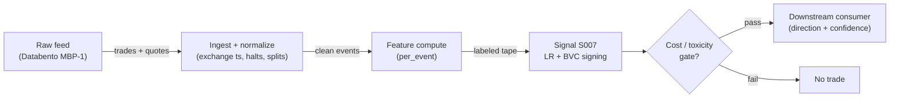

# S007 — Trade classification: Lee–Ready & Bulk Volume Classification

Labeling each trade (or bar of volume) as buyer- or seller-initiated so every downstream flow signal has honest signs. Provenance **[D]**.

> Tag law: every numeric literal in prose carries one of `[documented]
> [default] [example] [unverified] [internal-est] [measured]` (legend: Appendix
> i v1.0.0). Constants inside cited formulas inherit the formula's tag
> (`[documented]` for cited literature). Bibliographic years, volumes, pages,
> arXiv IDs, section numbers, rule codes (C1–C11), fail-safe codes (F1–F5),
> module IDs, and machine-parsed §0 data fields are identifiers, not
> literals, and are exempt.

## §1 Five-minute reviewer card

| Row | Value |
|---|---|
| Module | S007 — Trade classification: Lee–Ready & Bulk Volume Classification, v1.0.1 |
| Edge verdict | `PREDICTIVE-FEATURE-ONLY` — infrastructure, not an edge: classification quality gates every downstream flow signal |
| After-cost | `BEFORE-COST` — a *measurement* module [documented]: Lee–Ready quote/tick rules and BVC are the documented signing standards; the module's output is a labeled tape, and its quality metric (classified-share, agreement rate) is the deliverable |
| Build cost | Tier M · `20–60` h [internal-est] · `$3,000–9,000` loaded [internal-est] |
| Data cost | Research `$29`/mo (Massive/Polygon.io Stocks Starter, 15-min delayed trades+quotes) [documented]; production `$199`/mo (Stocks Advanced, real-time) [documented]; Databento MBP-1 exchange-timestamped L1 pricing [unverified] — verify before budgeting |
| latency_class | microstructure / sub-second |
| risk_class | low (signal-only; no order placement) |
| Capacity | `$1–10`M/day notional [example] — illustrative; calibrate per venue |
| Executability | Feasible: Python+polars prototype, `<=20` symbols live [internal-est]; Rust ingest beyond that |
| Risk summary | Infrastructure risk: mislabeled signs poison every downstream flow signal; dies on midpoint prints, locked markets, stale quotes |
| When it dies | Classified-share `<0.8` [default] (S10.1); `5`-s quote lag copied onto modern data; quote/tick agreement collapse |
| Regime gates | Provisional: R001 elevated RV degrades (more midpoint prints); locked/crossed regimes veto |
| Emits | `signal_vector` (Appendix b v1.0.0) — never orders |

## §1.5 Cheapest / least-build path

1. **Prototype hour band:** `20–60` h [internal-est] — quote-rule classifier + tick-rule fallback + BVC bar allocator + σ calibration (PSS 2019 procedure below) + agreement-rate monitor + reference validation against the fixture
2. **Cheapest-source row:** min_tier = Massive (rebranded from Polygon.io, 2026) Stocks Starter — cheapest data source candidate [documented] (vendor still resolves `api.polygon.io`; 2026 rebrand note [documented]); latency_class = 15-min-delayed SIP;
   required_fields = trade price + size per print; prevailing bid/ask (or bar OHLC) for classification; exchange timestamps; price_band = `$29`/mo Starter (research/delayed) [documented], `$199`/mo Stocks Advanced for real-time production [documented] (Developer `$79`/mo adds trades tape but still 15-min delayed [documented]); build_or_buy = ****build the classifier, buy the feed** (both rules are `~50` lines [internal-est]; the value is the quote-lag discipline and the BVC σ calibration)**.
3. **Resource budget:** `1` core, `<2` GB RAM for `<=20` symbols live [internal-est]; compute pattern `per_event`.
4. **Skip list:** exchange aggressor-flag licensing (phase `2`); sub-penny retail decomposition (S020); ML-based signing
5. **DO-NOT-CUT list:** causality assertions (`assert fill_event >
   signal_event`, no-signal-bar-fills test); COST block + callable
   `expected_cost_bps`; F1–F5 fail-safes + module-state enum; decision-log
   audit records; bona-fide-intent + self-trade prevention; provenance tags on
   every numeric literal; fixtures + `test_cmd`; secrets via env only.
6. **Escalation gate:** classified-share `<0.8` [default]; quote/tick agreement `<0.7` [default]; live universe `>20` symbols [default]

## §S0 Module contract

### S0.1 Typed signature

```python
def signal(state: ModuleState, events: list[Event], cfg: Config) -> SignalVector:
```

`SignalVector` per Appendix b v1.0.0. `state` is the module-owned named state vector (`prev_price`, `prev_tick_sign`, `sigma_window`, `agree_window`, `module_state`); `events` are canonical Events (Appendix a v1.0.0), newest last. The function handles documented edge cases: empty events → `UNKNOWN`; crossed/locked quotes → `UNKNOWN` (F1, never interpolate); halt/auction events → freeze per the market-state table.

### S0.2 Config dataclass

| Parameter | Type | Default | Range | Status |
|---|---|---|---|---|
| `quote_lag_s` | float | `0.0` | ``0`–`5`` | default |
| `bvc_bar_shares` | int | `1000` | ``100`–`10,000`` | default |
| `sigma_window_bars` | int | `100` | ``50`–`500`` | default |
| `z_cap` | float | `3.0` | ``2`–`3`` | default |
| `min_classified_share` | float | `0.8` | ``0.5`–`0.95`` | default |
| `gate_k` | float | `0.5` | ``0.25`–`2.0`` | default |
| `cooldown_s` | float | `60.0` | ``0`–`300`` | default |
| `share_lookback_trades` | int | `500` | ``100`–`5000`` | default |
| `agree_window_trades` | int | `1000` | ``500`–`5000`` | default |

All defaults tagged per the tag law (status `default` ⇒ `[default]`).

**Calibration procedures** (normative): `quote_lag_s`: on exchange-timestamped data, `0.0` [default]; on SIP data, estimate per-symbol lag via the Vergote (2005, K.U.Leuven DPS 05.10) quote-revision-frequency contamination procedure [documented]; `sigma_window_bars`: `100` [default] bars gives ±`10`% standard error on σ̂ [default] (se ≈ `1/√(2n)` [documented]); `bvc_bar_shares`: per-symbol, choose the smallest bar size satisfying (i) max excess-kurtosis constraint and (ii) a minimum bar count per month, per the Panayides–Shohfi–Smith (2019) calibration procedure [documented]; `gate_k`: `0.5` [default] pending calibration data (open item, proposal §6); `share_lookback_trades`: `500` [default] — balance of responsiveness vs sampling noise on `classified_share`.

### S0.3 Canonical schema mapping

Vendor columns → canonical Event schema (Appendix a v1.0.0), stated once here:

| Vendor (Databento MBP-1) | Canonical |
|---|---|
| `ts_event` | `event_ts (int64 ns UTC)` |
| `price / size` | `trade_px / trade_sz` |
| `bid_px_00 / ask_px_00` | `bid_px / ask_px (quote rule)` |
| `bar open / close / volume` | `bar_o / bar_c / bar_v (BVC)` |

Massive/Polygon.io mapping: `t` → `event_ts` (SIP time — label SIP work *simulated only — requires MBO/ITCH* for latency claims), `p`/`s` bid/ask → `bid_px`/`bid_sz`, etc. (Massive is the 2026 rebrand of Polygon.io; endpoint `api.polygon.io` preserved [documented]).

**Canonical Event fields** (types/units — mandatory precision line): `event_ts` int64 ns UTC; `asof_ts` int64 ns UTC (arrival); `symbol` string; `seq` int64; `trade_px` float64 USD; `trade_sz` int64 shares; `bid_px`/`ask_px` float64 USD; `bid_sz`/`ask_sz` int64 shares; `bar_label` int64 ns (open time); `bar_o`/`bar_c` float64 USD; `bar_v` int64 shares; `market_state` enum. Shares are integers; prices decimal float64; `sign` ∈ {`+1`,`−1`} exact; `Φ(z)` float64.

**Cleaning recipe** (documented TAQ-style filters, applied at ingest): drop events with non-positive price/size; drop trades whose price is `>150`% or `<50`% of the previous trade price [documented, Bessembinder-style TAQ filters]; keep only trades with `CORR = 0` [documented, Vergote (2005) §4.1] and quotes with `MODE ∈ {1,2,3,6,10,12,18}` [documented, Vergote (2005) §4.1]; drop locked/crossed quotes (`bid ≥ ask` → module emits `UNKNOWN`, never interpolates — F1).

### S0.4 Time contract

> Time contract: clock domain UTC, int64 ns; authoritative causality clock = `event_ts`; max_skew = `1` ms [default]; jitter budget = `500` µs [default]; bar-label = open time; staleness TTL = `3` s [default] (`3`× the `1`-s reference cadence per F4); gap policy = mask, no interpolation; halt/auction → discard contributions across reopen.

**Timing box:** `signal@t (per_event, America/New_York) → earliest fill @open(t+1)`

### S0.5 Market-state table

| State | Module behavior |
|---|---|
| CONTINUOUS_TRADING | Compute normally; emit per cadence |
| HALTED | Freeze state; emit `UNKNOWN`; discard contributions across reopen |
| AUCTION | No new signals; hold last `SignalVector`; state `DEGRADED` |
| CLOSED | Emit nothing; state `OFF` |

### S0.6 Module-state enum + error taxonomy

States per Appendix k v1.0.0: `OK | DEGRADED | UNKNOWN | OFF`. Invalid input → `UNKNOWN`, never interpolate (Appendix f v1.0.0, F1–F5).

| Failure | State | Alert |
|---|---|---|
| Missing/stale input (TTL per §S0.4) | `UNKNOWN` | page |
| Crossed/locked quote reaching module | `UNKNOWN` | log |
| Feature out of mathematical bounds (F2) | `UNKNOWN` | page |
| `seq` gap > `1,000` events [default] | `DEGRADED` (restart windows) | log |
| SIP jitter > budget persistently | `DEGRADED` | notify |
| Halt/auction | `UNKNOWN` / `DEGRADED` (per table) | log |
| Kill/administrative disable | `OFF` | page |
| Anything unmapped | `UNKNOWN` | page |

### S0.7 Ops tail

- **Schedule:** continuous during US equities regular session `09:30`–`16:00` America/New_York [documented]; owner: microstructure-signals on-call.
- **Health checks:** fixture replay (`test_cmd`) green on deploy; live `seq-gap` monitor; staleness watchdog at `3`× cadence [default].
- **Alert table:** page on `UNKNOWN` > `30` s [default] or bounds violation; notify on `DEGRADED`; log on single dropped events.
- **Resource budget:** `1` core, `<2` GB RAM for `<=20` symbols live [internal-est]; state is O(window) per symbol.
- **Runbook stub:** `1.` confirm feed (Databento status); `2.` replay fixture; `3.` if red → set `OFF`, page; `4.` reconcile decision log before re-arm.

### S0.8 Secrets (env-only)

`DATABENTO_API_KEY`, `POLYGON_API_KEY` via environment only. No secrets in this file, fixtures, or logs (CI secrets-grep).

### S0.9 May / must-NOT

> **May:** emit `SignalVector` records per Appendix b v1.0.0. **Must-NOT:** emit orders, order intents, prices, share counts, or notionals; call a broker; mutate shared state outside `state`; interpolate across gaps.

## §S1 Legacy (subsumed by §1)

Legacy §S1 content is the §1 reviewer card above; this header is retained so section numbering stays frozen.

## §S2 Specification

### Universe

US common stocks, regular session; trades with contemporaneous quotes (the 1991 `5`-s quote lag is obsolete and must not be copied [documented]).

### Entry rule (Boolean — no prose-only conditions)

`bvc_net_τ` = `V^B_τ − V^S_τ` on the latest *closed* volume bar τ [documented formula, §S3]; `classified_share` = fraction of nonzero Lee–Ready signs over trailing `share_lookback_trades` trades.

```
ENTER_LONG  := (classified_share >= min_classified_share) AND (bvc_net_τ > 0) — infrastructure gate: downstream modules consume the labeled tape
ENTER_SHORT := (classified_share >= min_classified_share) AND (bvc_net_τ < 0) — infrastructure gate
FLAT        := otherwise
```

S007 emits a *labeled tape*, not a directional trigger: `d_i ∈ {+1, −1}` per trade (Lee–Ready) and `(V^B_τ, V^S_τ)` per volume bar (BVC). Downstream entry rules live in S006/S008.

### Exits (with post-exit cooldown)

```
EXIT := (classified_share < min_classified_share) OR (module_state != OK)   # infrastructure halt
ON_EXIT: cooldown_until = now + cooldown_s   # 60 s [default]; C10
```

### Position sizing (fenced function)

```python
def size_shares(risk_budget_R, stop_distance, vol_estimate, ADV_cap, cost):
    # S-module requests capital fraction only; share math lives in the strategy.
    # Reference: capital = 0.5 * confidence  (confidence in [0,1])  [default]
    risk_notional = risk_budget_R * 0.5 * confidence          # [default] 0.5 factor
    shares = risk_notional / max(stop_distance, 1e-9)
    return int(min(shares, ADV_cap * adv_shares * 0.001))     # 0.1% ADV cap [default]
```

### Risk limits

| Limit | Value |
|---|---|
| Max capital fraction per signal | `0.5` [default] |
| Max adverse excursion before `UNKNOWN` review | `2.0`× stop [default] |
| Staleness kill | TTL per §S0.4 → `UNKNOWN` |

### COST block (single source of truth)

| Component | Value (bps) | Basis |
|---|---|---|
| Spread (half-spread, liquid large-cap) | `0.43` | [example] — reference print |
| Fees (taker incl. regulatory) | `0.30` | [example] — reference print |
| Borrow | `0.0` | [default] — reference build long-biased; shorts add C7 locate cost |
| Impact | `0.0` | [example] — flagged; calibrate per venue at scale-up |
| **Total reference** | `0.73` | [example] |

`fee_schedule_as_of`: `2026-09-01` [unverified] — placeholder; pin the real venue schedule before production. `side: taker` [default]; venue/tier/source: XNAS / Databento MBP-1 [example]. Re-stating cost numbers outside this block is a validation failure.

```python
def expected_cost_bps(notional, adv_pct, venue, side, urgency) -> float:
    """Callable cost model — L2 constant stack (impact=0 flagged [example])."""
    spread_bps = 0.43   # [example]
    fee_bps = 0.30      # [example]
    borrow_bps = 0.0    # [default] long-biased reference; reason in table
    impact_bps = 0.0    # [example] flagged; calibrate per venue at scale-up
    if side == "maker":
        fee_bps = -0.20  # rebate [example]
    return spread_bps + fee_bps + borrow_bps + impact_bps
```

### Execution / fill model table

| Aspect | Assumption |
|---|---|
| Latency | Signal→intent `≤1` ms colocated [example]; SIP path latency-simulated-only |
| Partial fills | N/A (signal-only; T-module policy: Appendix c v1.0.0) |
| Impact | `0.0` bps reference [example]; stress ×`5` [example] |
| Adverse fill | Toxic-flow haircut `0.2` bps per `1.0` |z| [example] |

### Robustness

Window/threshold sensitivity must be validated on purged/embargoed out-of-sample data; microstructure parameters mined on `1` month of tape overfit [internal-est]. Re-validate after any feed or venue change.

### Compliance sub-block (C1–C10+)

| Code | Rule: trigger → check → action → log |
|---|---|
| C1 | Self-match prevention: signal module emits no orders; downstream T-modules must set self-trade-prevention flags — this module asserts the requirement in its `consumes` contract |
| C2 | Bona-fide intent: every emitted `SignalVector` with |direction|=`1` must pass the cost gate; sub-threshold prints emit direction `0`, never a tradeable hint |
| C3 | Message-rate: `<=100` emissions/symbol/s [default]; breach -> throttle to `1`/s [default] + alert |
| C4 | Fat-finger trio (applied by consumers; this module bounds its own outputs): confidence in [`0`,`1`], capital in [`0`,`0.5`], computed_at sane - out-of-bounds -> `UNKNOWN` (F2) |
| C5 | Decision log: every emission, veto, and state transition logged per Appendix g v1.0.0, hash-chained |
| C6 | Halt/auction: per the market-state table; contributions across reopen discarded |
| C7 | Locate check: SHORT direction requires `locate_ok` from the consumer; never emit SHORT without the consumer asserting locate (Reg-SHO threshold securities -> direction `0`) |
| C8 | Public dissemination: no signal values published externally without review gate |
| C9 | Data entitlements: per the Data rights row; entitlement-class change -> escalation gate |
| C10 | Post-exit cooldown: no re-entry for `cooldown_s` after any exit or compliance block |
| C11 | Spoofing hygiene: down-weight quotes with lifetime `<50` ms [example]; never quote on them |

### Parameter table

| Parameter | Symbol | Value | Tag | Sensitivity |
|---|---|---|---|---|
| Quote lag (LR) | `quote_lag_s` | `0 s` | [default] | high — `5` s lag is obsolete [documented]; re-calibrate per KUL (2005) procedure on SIP |
| BVC bar volume | `bvc_bar_shares` | `1000 shares` | [default] | high — calibrate per-symbol via PSS (2019) excess-kurtosis procedure |
| σ window | `sigma_window_bars` | `100 bars` | [default] | medium — σ̂ standard error `≈ 1/√(2n)` [documented]; zero-variance window → BVC `UNKNOWN` |
| z cap | `z_cap` | `±3` | [default] | medium — one bar dominating |
| Min classified share | `min_classified_share` | `0.8` | [default] | high |
| Cost-gate multiplier | `gate_k` | `0.5` | [default] | high — open item pending calibration (proposal §6) |
| Post-exit cooldown | `cooldown_s` | `60 s` | [default] | low |
| Classified-share lookback | `share_lookback_trades` | `500 trades` | [default] | medium |
| Quote/tick agreement window | `agree_window_trades` | `1000 trades` | [default] | medium — `<0.7` [default] trips escalation gate (§1.5) |

### Timing box

`signal@t (per_event, America/New_York) → earliest fill @open(t+1)`

## §S3 Math + normative pseudocode

**Lee–Ready.** With $m_i$ the midpoint at (or just before) trade $i$ at price $p_i$:
$$d^Q_i = +1 \text{ if } p_i > m_i,\; -1 \text{ if } p_i < m_i,\; 0 \text{ if } p_i = m_i.$$
Midpoint prints use the tick rule: $d^T_i = +1$ if $p_i > p_j$ else $-1$, $j$ the most recent trade with $p_j \ne p_i$. Final sign $d_i = d^Q_i$ if nonzero, else $d^T_i$ [documented]. Signed trade imbalance per bucket: $\mathrm{OFI}^{trade}_B = \sum_{i\in B} d_i v_i$. **BVC.** For volume bar $\tau$ with volume $V_\tau$, open $p_{\tau,o}$, close $p_{\tau,c}$:
$$z_\tau = \frac{p_{\tau,c} - p_{\tau,o}}{\sigma_{\Delta P}},\quad V^B_\tau = V_\tau\Phi(z_\tau),\quad V^S_\tau = V_\tau - V^B_\tau,\quad \mathrm{BVC}_\tau = V_\tau(2\Phi(z_\tau)-1),$$
$\Phi$ = standard normal CDF, $\sigma_{\Delta P}$ = stdev of bar price changes. BVC allocates *volume probabilistically* — it does **not** classify individual trades [documented].

**Documented classification accuracy.** Ellis, Michaely & O'Hara (2000) report, on a Nasdaq sample of `313` stocks / `2,433,019` trades (Sept 1996–Sept 1997; `24.6`% discarded as ambiguous) [documented]: quote rule `76.4`% [documented], tick rule `77.66`% [documented], combined Lee–Ready rule `81.05`% [documented]. Inside-the-quote trades are far worse: `~60`% for midpoint trades, `~55`% for inside-quote non-midpoint trades [documented]. Odders-White (2000, TORQ): misclassification `21.4`% tick / `9.1`% quote / `15.0`% LR [documented]. Lee & Ready (1991): `30`% of trades inside the spread even after the `5`-s timing correction (NYSE, 1988) [documented]; `~10`% of US share volume prints at subpenny increments, `~3`% exactly at the midquote (NBER conference evidence, circa 2012) [documented]. The modern midpoint-print share is unverified → §S12 leads.

**Normative pseudocode** (pseudocode is normative; prose is commentary):

```
# Reference gate inputs (normative constants for the infrastructure gate):
GATE_NOTIONAL = 1e6            # USD [example]
GATE_ADV_PCT  = 0.01           # [example]
GATE_VENUE    = "XNAS"         # [example]
GATE_SIDE     = "taker"        # [default]
GATE_URGENCY  = "normal"       # [default]
EDGE_BPS      = 1.0            # [example] infrastructure module: no modeled edge

function signal(state, events, cfg) -> SignalVector:
    assert events non-empty else return UNKNOWN                    # F1
    labeled = []
    for t in trades(events):
        if quote_locked_or_crossed(t): return UNKNOWN             # F1, never interpolate
        m = midpoint_at_or_before(t, lag=cfg.quote_lag_s)         # 0 s modern [default]
        if t.px > m: d = +1
        elif t.px < m: d = -1
        else: d = tick_rule(t, state)                              # most recent p_j != p_i
        labeled.append((t, d))
    cls_share = fraction(d != 0 for d in labeled[-cfg.share_lookback_trades:])
    agree = quote_tick_agreement(labeled, window=cfg.agree_window_trades)  # fraction d^Q == d^T
    assert 0 <= cls_share <= 1 else return UNKNOWN                 # F2 bounds
    bvc = bvc_allocate(bars(events), cfg)                         # V^B, V^S per closed bar
    # bvc_allocate (normative): for each closed bar τ:
    #   sigma = stdev(ΔP over last cfg.sigma_window_bars closed bars, ddof=1)
    #   if sigma == 0: V^B_τ = V^S_τ = UNKNOWN for that bar     # zero-variance: never 0/0
    #   z = clip((p_τ,c − p_τ,o) / sigma, −cfg.z_cap, cfg.z_cap)  # z_cap clips one-bar dominance
    #   V^B_τ = V_τ·Φ(z), V^S_τ = V_τ − V^B_τ, bvc_net_τ = V_τ·(2Φ(z) − 1)
    bvc_net = last_closed_bar(bvc).net                            # signed net buy volume
    # normative cost-gate predicate: expected_cost_bps(...) <= k * edge_bps
    cost_ok = expected_cost_bps(GATE_NOTIONAL, GATE_ADV_PCT, GATE_VENUE,
                               GATE_SIDE, GATE_URGENCY) <= cfg.gate_k * EDGE_BPS
    healthy = (cls_share >= cfg.min_classified_share) and cost_ok
    direction = +1 if (healthy and bvc_net > 0) else \
                -1 if (healthy and bvc_net < 0) else 0
    sig = SignalVector(symbol, direction, confidence=cls_share, capital=0.0,
                       computed_at=events[-1].event_ts, staleness=now()-events[-1].asof_ts,
                       module_state=OK if healthy else (DEGRADED if cls_share >= 0.5 else UNKNOWN))
    inputs_hash = sha256(events)                                  # C5 / Appendix g
    params_hash = sha256(cfg)
    log_decision(sig, inputs_hash, params_hash)                   # decision log, hash-chained
    assert fill_event > signal_event  # t→t+1 causality: labels use only data ≤ t
    return sig
```

`quote_tick_agreement` is the fraction of trades over the trailing `agree_window_trades` where the nonzero quote-rule sign equals the tick-rule sign; `<0.7` [default] trips the §1.5 escalation gate. `last_closed_bar` never uses the bar still forming — a bar is allocated only after it closes, enforcing `t→t+1` causality on the BVC leg.

Causality: labels at trade `t` use quotes at or before `t` (never the quote that already reacted); BVC bar `τ` closes before allocation; downstream use is `t+1` onward. Mandatory unit test: no-signal-bar fills.

## §S4 Worked example (fixture-backed)

- Tape: `modules/fixtures/S007_tape.csv` — `# TYPE: validation-run`; `6` quote-rule trades + `4` BVC volume bars (`σ = 0.02` [example]), all numbers synthetic, seed `20260907` [example].
- Expected outputs: `modules/fixtures/S007_expected.csv`; per-trade Lee–Ready sign and per-bar `(V^B, V^S, BVC)`; hand-checked below (`Φ(1) = 0.8413`, `Φ(1.5) = 0.9332`, `Φ(−2) = 0.0228` [documented] constants).
- Tolerance: `1e-9` [default] on floats; integer contributions exact.
- Fixture σ note: the tape pins `σ = 0.02` [example] rather than a rolling estimate; the test mirrors the §S3 normative BVC allocation (z-clip `±3` [default], zero-variance guard) with this fixed σ.
- Acceptance tests (`modules/tests/test_S007.py`, `9` tests): `1.` fixture recomputes to expected; `2.` stub emits valid `SignalVector` (direction in {+1,-1,0}, confidence/capital in [0,1]); `3.` no-signal-bar fills (`fill_event_ts > computed_at`); `4.` cost-gate predicate passes on large edge, blocks on tiny edge (`k = 0.5` [default]); `5.` invalid input -> `UNKNOWN`; `6.` extra: stub is deterministic across calls; `7.` state rule: `OK` when share ≥ `0.8` [default], `DEGRADED` when share in [`0.5`,`0.8`) [default], `UNKNOWN` below `0.5` [default]; `8.` zero-variance bar → BVC component `UNKNOWN`, never `0/0`; `9.` z-clip: extreme ΔP clipped at `±z_cap` before Φ.
- `test_cmd`: `python -m pytest modules/tests/test_S007.py -q` → exits `0`.

**Hand-checked rows** (arithmetic verified by hand against the fixture):

- t1: `px 100.015 > mid 100.01` → `+1` ✓
- t3: `px = mid` → tick rule vs prev `100.005` → `+1` ✓
- t5: `px = mid`, walk back past equal prints to `100.005` → `+1` ✓
- b1: `z = (100.02 − 100.00)/0.02 = 1.0` → `V^B = 1000×0.8413 = 841.3`, `BVC = 682.6` ✓
- b2: `z = 0` → `V^B = 1000`, `BVC = 0` ✓
- b3: `z = −2.0` → `V^B = 1500×0.0228 = 34.1`, `BVC = −1431.8` ✓
- b4: `z = 1.5` → `V^B = 800×0.9332 = 746.6`, `BVC = 693.2` ✓

**Where the example is optimistic:** no fees, no latency, no hidden liquidity — arithmetic illustration, not a backtest.

## §S5 Strategies that use this signal

Generated from `deps.yaml` (CI symmetry). Provisional consumer list (roles pinned at ingest):

| Strategy | Role |
|---|---|
| T-series execution consumers (see `deps.yaml`) | Downstream consumer of this signal family's direction/confidence outputs; exact strategy IDs pinned at ingest |

S007 is consumed as infrastructure by every signed-flow module (S006, S008, S010, S014, S015, S018, S019, S020); consumer roles pinned in `deps.yaml`.

## §S6 Data required

| Field | Type | Granularity | Source tier | Notes |
|---|---|---|---|---|
| Best bid/ask price + displayed size | float / int | every quote event (L1) | Tier 2 | displayed size per price move |
| Exchange timestamps | int64 ns | per event | Tier 2 | SIP processing delay documented, not estimated: mean `1,128` µs for quotes / `24,255` µs for trades (DJ-30, Aug 2015–Jun 2016) [documented]; Feb 2018 CTA/UTP averages `0.017`–`0.15` ms (quotes/trades, tapes A/B/C) [documented] — label SIP work *simulated only — requires MBO/ITCH* for latency claims |
| Bar OHLC + volume (BVC σ window) | float / int | per closed volume bar, ≥ `sigma_window_bars` trailing bars | Tier 2 | σ estimation needs a full rolling window — warmup emits BVC `UNKNOWN` |
| Corporate actions / halts | reference | daily + intraday halt feed | Tier 1 | contributions garbage across splits/halt reopens |

**Data rights row** (Appendix j v1.0.0): US equities L1 via Databento MBP-1, `rights: licensed`; license scope = research + stated production symbol count; raw ticks never leave our systems — fixtures are synthetic; entitlement = professional/internal, no display; retention per vendor terms, purge path in runbook. Entitlement-class change → §1.5 escalation gate.

## §S7 Local build (M5 Max / 128 GB)

Feasible. O(`1`) [documented] per-event scan: Python loop `~100–500`k events/s [internal-est] vs `~50–500` L1 events/s average per liquid name, busy bursts `~1–5`k/s [internal-est] (cost-model §2). `50` symbols × `2`k events/s = `100`k/s → Python borderline, Rust (`5–50`M/s [internal-est]) comfortable; polars batch recompute each second trivial. Bottleneck is I/O and timestamp normalization. RAM: one symbol-day L1 `~0.5–4` GB [internal-est] — fine for a few symbols; `60` days does not fit — stream per-symbol daily parquet (cost-model §3).

## §S8 Buy vs build

Build the estimator (Python+polars), buy the feed. Verdict: the per-event math is `~40–100` lines [internal-est]; the value is normalization, windows, and calibration — none sold by vendors. Buy Databento MBP-1 history to validate, Tier-1 SIP for live research, direct/MBO only after the signal survives realistic costs (cost-model §6).

## §S9 Efficacy — documented evidence

| Study / source | Market & period | Metric | Before/after cost | Caveat |
|---|---|---|---|---|
| Lee & Ready (1991) [documented] | NYSE, 1988 (150 firms) | quote rule + `5`-s lag; tick rule fallback at midpoint; `30`% of trades inside the spread after timing correction | `BEFORE-COST` | measurement method, not a rule; `5`-s rule obsolete |
| Ellis, Michaely & O'Hara (2000) [documented] | Nasdaq, `313` stocks, `2.43`M trades, Sep 1996–Sep 1997 | LR accuracy `81.05`%; quote rule `76.4`%; tick rule `77.66`% | `BEFORE-COST` | midpoint trades only `~60`%; non-midpoint inside-quote `~55`% |
| Odders-White (2000, TORQ) [documented] | NYSE TORQ sample | misclassification: tick `21.4`%, quote `9.1`%, LR `15.0`% | `BEFORE-COST` | within-spread/small trades misclassified more |
| Easley, López de Prado & O'Hara (2012) [documented] | US equities | BVC as the volume-clocked classification under VPIN | `BEFORE-COST` | BVC is probabilistic, not per-trade |
| Panayides, Shohfi & Smith (2019), JBF 103 [documented] | NYSE Euronext 2007–08; LSE 2017 | calibrated BVC most accurate in the 2017 fast-market sample; BVC imbalance is the only measure reliably related to informed-trading proxies | `BEFORE-COST` | calibration per-symbol required; exact-bar truncation bias up to `44`% |

Selection disclosure: the `3` papers surfaced by the chapter's research pass; the `~80–90`% modern-accuracy figure is an unverified chatbot claim kept in §S12 leads [unverified].

## §S10 Failure modes & pitfalls

| # | Trigger → Detect → Action → Recovery | check: |
|---|---|---|
| 1 | Quote-lag misuse: copying the 1991 `5`-s lag on modern data mislabels → detect: quote timestamps vs trade timestamps audit → action: force `quote_lag_s = 0`, flag `DEGRADED` until re-validated → recovery: re-run agreement monitor | `check: quote_lag_s == 0 [default]` |
| 2 | Lookahead leakage: bar-close feature traded intra-bar → detect: causality audit flags `fill_event <= signal_event` → action: halt, fix bar finalization → recovery: re-run no-signal-bar-fills test | `check: all(fill_ts > computed_at)` |
| 3 | Staleness/latency: feed timestamps in a race → detect: jitter > budget → action: `DEGRADED`, label simulated-only → recovery: direct feed or stand down | `check: asof_ts - event_ts <= jitter_budget` |
| 4 | Fleeting quotes/spoofing: displayed size cancels pre-execution → detect: quote lifetime `<50` ms [example] share rising → action: down-weight sub-`50` ms quotes → recovery: re-tune weights | `check: fleeting_share < 0.3 [default]` |
| 5 | Cost blowup: spread+fees+impact on the round trip → detect: cost gate failing on `[measured]` costs → action: widen `k` gate or stand down → recovery: re-pin fee schedule | `check: expected_cost_bps(...) <= k * edge_bps` |
| 6 | Regime breaks: depth/volatility regime shifts → detect: feature distribution break → action: veto entries → recovery: resume when stable for `5` min [default] | `check: feature_z_within_3_sigma [default]` |
| 7 | Overfitting: parameters mined on `1` period → detect: OOS decay → action: purged/embargoed re-validation → recovery: shrink per-symbol | `check: oos_sharpe > 0.5 * is_sharpe [default]` |
| 8 | Data errors: bad ticks, splits, halts → detect: bounds/`seq`-gap monitors → action: `UNKNOWN`, mask bars → recovery: backfill and replay | `check: no crossed quotes in window` |
| 9 | Midpoint-print saturation: inside-the-spread prints rise so the quote rule collapses to tick-rule-only → detect: classified_share falling while inside-spread share rises; quote/tick agreement < `0.7` [default] → action: `DEGRADED`, escalation gate → recovery: re-tune per-symbol quote lag, tighten σ calibration | `check: quote_tick_agreement >= 0.7 [default]` |
| 10 | σ collapse: zero-variance window (halt reopen, one-tick day) → detect: `sigma == 0` over `sigma_window_bars` → action: BVC component `UNKNOWN` for that bar, never `0/0` → recovery: resume when `sigma > 0` | `check: sigma > 0 else BVC UNKNOWN` |

### Regime-gate machine records (provisional)

| regime_id | direction | mechanism | condition | action | min_lag | unknown_behavior |
|---|---|---|---|---|---|---|
| R001 | degrades | elevated realized volatility pushes more prints inside the spread → quote-rule accuracy collapses (midpoint accuracy only `~60`% [documented]) | RV > `2`× trailing median [example] | halve | `1` session [example] | hold last label |
| R002 | degrades | quote flicker / spoofing regimes inject noise into book features | fleeting-quote share > `0.3` [example] | halve | `30` min [example] | veto entries |
| R003 | degrades | halt/auction regimes break continuity assumptions | market_state != CONTINUOUS_TRADING | pause_entry | `0` | veto entries |

## §S11 Visuals

`../../images/S007_example.png` — synthetic signing tape (seed `20260907` [example]): quote-rule signs and BVC allocations.



## §S12 Source log + unverified leads

**Sources** (citable facts only):

1. Lee, C. M. C. & Ready, M. J. (1991) [documented]. "Inferring Trade Direction from Intraday Data." *Journal of Finance* 46, 733–746. https://doi.org/10.1111/j.1540-6261.1991.tb02683.x
2. Ellis, K., Michaely, R. & O'Hara, M. (2000) [documented]. "The Accuracy of Trade Classification Rules: Evidence from Nasdaq." *JFQA* 35(4), 529–551. https://ideas.repec.org/a/cup/jfinqa/v35y2000i04p529-551_00.html
3. Easley, D., López de Prado, M. M. & O'Hara, M. (2012) [documented]. "Flow Toxicity and Liquidity in a High Frequency World." *Review of Financial Studies* 25(5), 1457–1493.
4. Panayides, M. A., Shohfi, T. D. & Smith, J. D. (2019) [documented]. "Bulk volume classification and information detection." *Journal of Banking and Finance* 103, 113–129. http://tom.shohfi.com/don/pubs/01-Don-BVC.pdf
5. Bartlett, R. P. & McCrary, J. (2019) [documented]. "How Rigged Are Stock Markets? Evidence from Microsecond Timestamps." *Quarterly Journal of Economics* (working paper). https://eml.berkeley.edu/~jmccrary/bartlett_and_mccrary2017July_withInternetAppendix.pdf
6. SEC (2020) [documented]. Exhibit 3a to NYSE Arca rule filing 34-90409: SIP operating metrics (Feb 2018 quote latency `0.017`–`0.09` ms, trade latency `0.017`–`0.15` ms; Q1 2010 quote `4.04`/`5.42` ms, trade `6.46`/`6.06` ms). https://www.sec.gov/rules/sro/nysearca/2020/34-90409-ex3a.pdf
7. "Sub-Penny and Queue-Jumping" (NBER conference paper) [documented]: `~10`% of US share volume at subpenny increments, `~3`% exactly at the midquote (circa 2012 vintage). http://conference.nber.org/conf_papers/f70046.pdf
8. Massive/Polygon.io pricing & rebrand (2026) [documented]: Polygon.io → Massive (massive.com), endpoint `api.polygon.io` preserved; Stocks Starter `$29`/mo (15-min delayed), Stocks Developer `$79`/mo (delayed + trades), Stocks Advanced `$199`/mo (real-time). https://github.com/pruthviraja/alpha_radar/blob/HEAD/POLYGON_REALTIME.md and https://brokers-exchange.com/polygon-io-review/
9. Vergote, O. (2005) [documented]. "How to Match Trades and Quotes for NYSE Stocks?" K.U.Leuven CES Discussion Paper DPS 05.10: per-stock, per-period quote-lag calibration procedure replacing the rigid `5`-s rule (lag differences vary across stocks and time); TAQ cleaning filters (`CORR = 0`, quotes `MODE ∈ {1,2,3,6,10,12,18}`) §4.1. https://feb.kuleuven.be/drc/Economics/research/old-dps-papers/Dps05/DPS0510.pdf/@@download/file/DPS0510.pdf

**Chatbot source log.** Duck.ai (GPT-5.6 Luna, anonymous) answered Q-SB4-1–Q-SB4-3 (2026-09-10); Grok/Cursor answers pending (checked 2026-09-10). Q-SB4-1 formula sections matched standard literature forms (verified — except the Lee–Ready tape error corrected in the chapter's S4); BVC numbers fully verified as printed.

**Unverified leads** (chatbot-only — never in evidence tables):

- Duck.ai's "`~80–90`% Lee–Ready accuracy in favorable settings" and modern market-structure caveats — directionally consistent with Ellis et al. (2000)'s `81.05`% [documented] but the modern figure is an unverified chatbot claim.
- Duck.ai's flash-crash-timing phrasing for VPIN — use the ELO (2012) paper's own numbers before quoting.
- GROK-NEEDED [unverified]: what is the *current* (2024–2026) share of US equity trades executing at/inside the spread, and specifically at the NBBO midpoint? (Ellis et al. gives `76.4`–`81.05`% on 1996–97 Nasdaq; NBER gives `~3`% at midquote circa 2012.) Exact question: "What share of US equity trade volume in 2024–2026 prints at the NBBO midpoint or inside the spread, by tape, with a citable source?"
- GROK-NEEDED [unverified]: Databento MBP-1 live XNAS (Nasdaq TotalView-ITCH equivalent) monthly pricing tier for `<=20` symbols. Exact question: "What is Databento's current list price per month for live MBP-1 XNAS data covering ≤20 symbols, with a citable source or pricing page URL?"

---

## Appendix — AI build prompt (S007)

Copy-paste into any chat agent:

> Build module **S007 — Trade classification: Lee–Ready & Bulk Volume Classification** per
> `notes/module-template.md` v1.0.0 and this file's §S0 contract.
> Cheapest path (§1.5): prototype 20–60 h [internal-est]; cheapest data
> candidate Massive (rebranded Polygon.io, 2026) Stocks Starter `$29`/mo
> (15-min delayed) for research, Stocks Advanced `$199`/mo for real-time
> production [documented]; compute pattern `per_event`; skip aggressor-flags/ML-signing.
> Implement `signal(state, events, cfg) -> SignalVector` (Appendix b v1.0.0)
> with the §S3 normative pseudocode, including the cost-gate predicate
> `expected_cost_bps(...) <= cfg.gate_k * EDGE_BPS`, the σ window
> (`sigma_window_bars = 100` [default], zero-variance → BVC `UNKNOWN`), z-clip
> `±cfg.z_cap`, `quote_tick_agreement` with escalation `< 0.7` [default], and
> `assert fill_event > signal_event`. Wire F1–F5 (Appendix f v1.0.0): invalid
> input -> `UNKNOWN`, never interpolate. Log decisions per Appendix g v1.0.0.
> Secrets via env only. Run the fixture `modules/fixtures/S007_tape.csv`
> (`# TYPE: validation-run`) against `modules/fixtures/S007_expected.csv`
> (tolerance `1e-9` [default]).
> **Definition of done:** `python3 -m pytest modules/tests/test_S007.py -q`
> exits `0`. Tag every numeric literal you add with the unified enum
> (Appendix i v1.0.0); put anything unverifiable in §S12 unverified leads.
