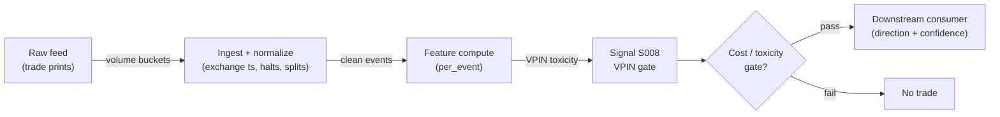

# S008 — VPIN (flow toxicity)

Volume-clocked buy/sell imbalance averaged over buckets — a real-time proxy for how "toxic" (adversely selective) order flow is. Provenance **[D]**.

> Tag law: every numeric literal in prose carries one of `[documented]
> [default] [example] [unverified] [internal-est] [measured]` (legend: Appendix
> i v1.0.0). Constants inside cited formulas inherit the formula's tag
> (`[documented]` for cited literature). Bibliographic years, volumes, pages,
> arXiv IDs, section numbers, rule codes (C1–C11), fail-safe codes (F1–F5),
> module IDs, and machine-parsed §0 data fields are identifiers, not
> literals, and are exempt.

## §1 Five-minute reviewer card

| Row | Value |
|---|---|
| Module | S008 — VPIN (flow toxicity), v1.0.0 |
| Edge verdict | `PREDICTIVE-FEATURE-ONLY` — documented as a toxicity gauge (ELO 2012); used as a regime gate, not a directional trigger |
| After-cost | `BEFORE-COST` — a *regime gate*, not a trigger [documented]: high VPIN means informed flow is likely — widen quotes / cut size; the flash-crash early-warning claims are contested (Andersen & Bondarenko [documented]) |
| Build cost | Tier M · `20–60` h [internal-est] · `$3,000–9,000` loaded [internal-est] |
| Data cost | Research `~$30–200`/mo (SIP L1) [unverified]; production `~$200`/mo + usage (exchange-timestamped L1) [unverified] — bands indicative, verify before budgeting |
| latency_class | microstructure / sub-second |
| risk_class | low (signal-only; no order placement) |
| Capacity | `$1–10`M/day notional [example] — illustrative; calibrate per venue |
| Executability | Feasible: Python+polars prototype, `<=20` symbols live [internal-est]; Rust ingest beyond that |
| Risk summary | Gate-risk: false toxicity vetoes cost participation; missed toxicity costs adverse selection; dies on volume-clock distortion |
| When it dies | Persistent VPIN `>0.7` [example] (gate stays shut); volume-clock distortion (S10.1); contested early-warning use beyond the gate |
| Regime gates | Provisional: R001 elevated RV amplifies (VPIN rises — gate tightens), news shocks amplify toxicity |
| Emits | `signal_vector` (Appendix b v1.0.0) — never orders |

## §1.5 Cheapest / least-build path

1. **Prototype hour band:** `20–60` h [internal-est] — volume-bucketizer + BVC classifier (S007) + rolling VPIN averager + toxicity gate + reference validation against the fixture
2. **Cheapest-source row:** min_tier = Polygon.io Stocks Advanced (SIP L1) — cheapest data source candidate [internal-est]; latency_class = SIP-delayed;
   required_fields = trade price + size per print (volume-clocked buckets); bar OHLC for BVC; exchange timestamps; price_band = `~$30–200`/mo [unverified] (indicative — verify before budgeting); build_or_buy = ****build the bucketizer, buy the feed** (VPIN is `~40` lines [internal-est]; the value is the bucket-size and window calibration)**.
3. **Resource budget:** `1` core, `<2` GB RAM for `<=20` symbols live [internal-est]; compute pattern `per_event`.
4. **Skip list:** exchange aggressor-flag licensing (phase `2`); multi-venue consolidation; tick-level VPIN variants
5. **DO-NOT-CUT list:** causality assertions (`assert fill_event >
   signal_event`, no-signal-bar-fills test); COST block + callable
   `expected_cost_bps`; F1–F5 fail-safes + module-state enum; decision-log
   audit records; bona-fide-intent + self-trade prevention; provenance tags on
   every numeric literal; fixtures + `test_cmd`; secrets via env only.
6. **Escalation gate:** toxicity regime persistent (VPIN `>0.7` [example] for `>30` min [default]) → widen quotes/cut size; live universe `>20` symbols [default]

## §S0 Module contract

### S0.1 Typed signature

```python
def signal(state: ModuleState, events: list[Event], cfg: Config) -> SignalVector:
```

`SignalVector` per Appendix b v1.0.0. `state` is the module-owned named state vector (`bucket_accum`, `bucket_list`, `vpin_window`, `module_state`); `events` are canonical Events (Appendix a v1.0.0), newest last. The function handles documented edge cases: empty events → `UNKNOWN`; crossed/locked quotes → `UNKNOWN` (F1, never interpolate); halt/auction events → freeze per the market-state table.

### S0.2 Config dataclass

| Parameter | Type | Default | Range | Status |
|---|---|---|---|---|
| `bucket_shares` | int | `1000` | ``100`–`10,000`` | default |
| `window_buckets` | int | `50` | ``10`–`200`` | default |
| `tox_high` | float | `0.7` | ``0.5`–`0.9`` | default |
| `tox_low` | float | `0.3` | ``0.1`–`0.5`` | default |
| `cooldown_s` | float | `60.0` | ``0`–`3,600`` | default |
| `cost_gate_k` | float | `0.5` | ``0.1`–`2.0`` | default |

All defaults tagged per the tag law (status `default` ⇒ `[default]`).

### S0.3 Canonical schema mapping

Vendor columns → canonical Event schema (Appendix a v1.0.0), stated once here:

| Vendor (Databento MBP-1) | Canonical |
|---|---|
| `ts_event` | `event_ts (int64 ns UTC)` |
| `price / size` | `trade_px / trade_sz` |
| `bar open / close` | `bar_o / bar_c (BVC)` |
| `sequence` | `seq` |

Polygon.io mapping: `t` → `event_ts` (SIP time — label SIP work *simulated only — requires MBO/ITCH* for latency claims), `p`/`s` bid/ask → `bid_px`/`bid_sz`, etc.

### S0.4 Time contract

> Time contract: clock domain UTC, int64 ns; authoritative causality clock = `event_ts`; max_skew = `1` ms [default]; jitter budget = `500` µs [default]; bar-label = open time; staleness TTL = `3` s [default] (`3`× the `1`-s reference cadence per F4); gap policy = mask, no interpolation; halt/auction → discard contributions across reopen.

**Timing box:** `signal@t (per_event, America/New_York) → earliest fill @open(t+1)`

### S0.5 Market-state table

| State | Module behavior |
|---|---|
| CONTINUOUS_TRADING | Compute normally; emit per cadence |
| HALTED | Freeze state; emit `UNKNOWN`; discard contributions across reopen |
| AUCTION | No new signals; hold last `SignalVector`; state `DEGRADED` |
| CLOSED | Emit nothing; state `OFF` |

### S0.6 Module-state enum + error taxonomy

States per Appendix k v1.0.0: `OK | DEGRADED | UNKNOWN | OFF`. Invalid input → `UNKNOWN`, never interpolate (Appendix f v1.0.0, F1–F5).

| Failure | State | Alert |
|---|---|---|
| Missing/stale input (TTL per §S0.4) | `UNKNOWN` | page |
| Crossed/locked quote reaching module | `UNKNOWN` | log |
| Feature out of mathematical bounds (F2) | `UNKNOWN` | page |
| `seq` gap > `1,000` events [default] | `DEGRADED` (restart windows) | log |
| SIP jitter > budget persistently | `DEGRADED` | notify |
| Halt/auction | `UNKNOWN` / `DEGRADED` (per table) | log |
| Kill/administrative disable | `OFF` | page |
| Anything unmapped | `UNKNOWN` | page |

### S0.7 Ops tail

- **Schedule:** continuous during US equities regular session `09:30`–`16:00` America/New_York [documented]; owner: microstructure-signals on-call.
- **Health checks:** fixture replay (`test_cmd`) green on deploy; live `seq-gap` monitor; staleness watchdog at `3`× cadence [default].
- **Alert table:** page on `UNKNOWN` > `30` s [default] or bounds violation; notify on `DEGRADED`; log on single dropped events.
- **Resource budget:** `1` core, `<2` GB RAM for `<=20` symbols live [internal-est]; state is O(window) per symbol.
- **Runbook stub:** `1.` confirm feed (Databento status); `2.` replay fixture; `3.` if red → set `OFF`, page; `4.` reconcile decision log before re-arm.

### S0.8 Secrets (env-only)

`DATABENTO_API_KEY`, `POLYGON_API_KEY` via environment only. No secrets in this file, fixtures, or logs (CI secrets-grep).

### S0.9 May / must-NOT

> **May:** emit `SignalVector` records per Appendix b v1.0.0. **Must-NOT:** emit orders, order intents, prices, share counts, or notionals; call a broker; mutate shared state outside `state`; interpolate across gaps.

## §S1 Legacy (subsumed by §1)

Legacy §S1 content is the §1 reviewer card above; this header is retained so section numbering stays frozen.

## §S2 Specification

### Universe

US common stocks and liquid futures, regular session; sufficient volume for `50` buckets/day at the chosen bucket size [example].

### Entry rule (Boolean — no prose-only conditions)

```
ENTER_LONG  := (VPIN >= tox_high) → toxicity gate: VETO new entries (regime gate, not a directional trigger)
ENTER_SHORT := (VPIN >= tox_high) → toxicity gate: VETO new entries (regime gate, not a directional trigger)
FLAT        := otherwise
```

VPIN ∈ [0, 1]: `0` = perfectly balanced flow, `1` = every bucket one-sided. This module emits direction `0` with confidence = VPIN as a toxicity gauge; downstream gates widen quotes or cut size when VPIN ≥ tox_high.

### Exits (with post-exit cooldown)

```
EXIT := (VPIN >= tox_high) → force FLAT on downstream consumers; re-arm when VPIN < tox_low for `5` min [default]
        ON_EXIT: cooldown_until = now + cooldown_s
ON_EXIT: cooldown_until = now + cooldown_s   # 60 s [default]; C10
```

### Position sizing (fenced function)

```python
def size_shares(risk_budget_R, stop_distance, vol_estimate, ADV_cap, cost):
    # S-module requests capital fraction only; share math lives in the strategy.
    # Reference: capital = 0.5 * confidence  (confidence in [0,1])  [default]
    risk_notional = risk_budget_R * 0.5 * confidence          # [default] 0.5 factor
    shares = risk_notional / max(stop_distance, 1e-9)
    return int(min(shares, ADV_cap * adv_shares * 0.001))     # 0.1% ADV cap [default]
```

### Risk limits

| Limit | Value |
|---|---|
| Max capital fraction per signal | `0.5` [default] |
| Max adverse excursion before `UNKNOWN` review | `2.0`× stop [default] |
| Staleness kill | TTL per §S0.4 → `UNKNOWN` |

### COST block (single source of truth)

| Component | Value (bps) | Basis |
|---|---|---|
| Spread (half-spread, liquid large-cap) | `0.43` | [example] — reference print |
| Fees (taker incl. regulatory) | `0.30` | [example] — reference print |
| Borrow | `0.0` | [default] — reference build long-biased; shorts add C7 locate cost |
| Impact | `0.0` | [example] — flagged; calibrate per venue at scale-up |
| **Total reference** | `0.73` | [example] |

`fee_schedule_as_of`: `2026-09-01` [unverified] — placeholder; pin the real venue schedule before production. `side: taker` [default]; venue/tier/source: XNAS / Databento MBP-1 [example]. Re-stating cost numbers outside this block is a validation failure.

```python
def expected_cost_bps(notional, adv_pct, venue, side, urgency) -> float:
    """Callable cost model — L2 constant stack (impact=0 flagged [example])."""
    spread_bps = 0.43   # [example]
    fee_bps = 0.30      # [example]
    borrow_bps = 0.0    # [default] long-biased reference; reason in table
    impact_bps = 0.0    # [example] flagged; calibrate per venue at scale-up
    if side == "maker":
        fee_bps = -0.20  # rebate [example]
    return spread_bps + fee_bps + borrow_bps + impact_bps
```

### Execution / fill model table

| Aspect | Assumption |
|---|---|
| Latency | Signal→intent `≤1` ms colocated [example]; SIP path latency-simulated-only |
| Partial fills | N/A (signal-only; T-module policy: Appendix c v1.0.0) |
| Impact | `0.0` bps reference [example]; stress ×`5` [example] |
| Adverse fill | Toxic-flow haircut `0.2` bps per `1.0` |z| [example] |

### Robustness

Window/threshold sensitivity must be validated on purged/embargoed out-of-sample data; microstructure parameters mined on `1` month of tape overfit [internal-est]. Re-validate after any feed or venue change.

### Compliance sub-block (C1–C10+)

| Code | Rule: trigger → check → action → log |
|---|---|
| C1 | Self-match prevention: signal module emits no orders; downstream T-modules must set self-trade-prevention flags — this module asserts the requirement in its `consumes` contract |
| C2 | Bona-fide intent: every emitted `SignalVector` with |direction|=`1` must pass the cost gate; sub-threshold prints emit direction `0`, never a tradeable hint |
| C3 | Message-rate: `<=100` emissions/symbol/s [default]; breach -> throttle to `1`/s [default] + alert |
| C4 | Fat-finger trio (applied by consumers; this module bounds its own outputs): confidence in [`0`,`1`], capital in [`0`,`0.5`], computed_at sane - out-of-bounds -> `UNKNOWN` (F2) |
| C5 | Decision log: every emission, veto, and state transition logged per Appendix g v1.0.0, hash-chained |
| C6 | Halt/auction: per the market-state table; contributions across reopen discarded |
| C7 | Locate check: SHORT direction requires `locate_ok` from the consumer; never emit SHORT without the consumer asserting locate (Reg-SHO threshold securities -> direction `0`) |
| C8 | Public dissemination: no signal values published externally without review gate |
| C9 | Data entitlements: per the Data rights row; entitlement-class change -> escalation gate |
| C10 | Post-exit cooldown: no re-entry for `cooldown_s` after any exit or compliance block |
| C11 | Spoofing hygiene: down-weight quotes with lifetime `<50` ms [example]; never quote on them |

### Parameter table

| Parameter | Symbol | Value | Tag | Sensitivity |
|---|---|---|---|---|
| Bucket size | `bucket_shares` | `1000 shares` | [default] | high — `ADV/50` [example] is the ELO default |
| Window | `window_buckets` | `50 buckets` | [default] | high |
| Toxicity high | `tox_high` | `0.7` | [default] | high — gate threshold |
| Toxicity low | `tox_low` | `0.3` | [default] | medium — re-arm hysteresis |
| Post-exit cooldown | `cooldown_s` | `60 s` | [default] | low |
| Cost-gate k | `cost_gate_k` | `0.5` | [default] | medium |

### Timing box

`signal@t (per_event, America/New_York) → earliest fill @open(t+1)`

## §S3 Math + normative pseudocode

Partition the tape into **equal-volume buckets** $\tau = 1, 2, \dots$, each holding $V$ shares (Easley–López de Prado–O'Hara default: $V = \mathrm{ADV}/50$, i.e. `50` buckets/day — *example* [documented]). **BVC** per bar (S007): $V^B_\tau = V\,\Phi(\Delta P_\tau/\sigma_{\Delta P})$, $V^S_\tau = V - V^B_\tau$. **Per-bucket imbalance:** $\mathrm{OI}_\tau = |V^B_\tau - V^S_\tau|$. **VPIN** over rolling $n$ buckets (ELO default $n=50$ — *example* [documented]):
$$\mathrm{VPIN}_t = \frac{\sum_{\tau=t-n+1}^{t} \mathrm{OI}_\tau}{n \cdot V} \in [0,1].$$
Bucket $\tau$ closes when its $V$-th share prints; VPIN uses only closed buckets; defensive action applies to buckets $\tau+1$ onward — never retroactively [documented].

**Normative pseudocode** (pseudocode is normative; prose is commentary):

```
function signal(state, events, cfg) -> SignalVector:
    assert events non-empty else return UNKNOWN                    # F1
    for t in trades(events): state.bucket_accum.add(t)            # volume clock
    while state.bucket_accum.volume >= cfg.bucket_shares:
        b = state.bucket_accum.close_bucket()                     # split straddling trades (ELO)
        (Vb, Vs) = bvc_classify(b, state)                         # S007
        state.bucket_list.append(abs(Vb - Vs))
    n = cfg.window_buckets
    assert len(state.bucket_list) >= n else return FLAT(DEGRADED)  # warming up
    vpin = sum(state.bucket_list[-n:]) / (n * cfg.bucket_shares)
    assert 0 <= vpin <= 1 else return UNKNOWN                      # F2
    edge_bps = 0.0                                                 # [example] gate-only: no directional edge
    # normative cost-gate predicate: expected_cost_bps(...) <= k * edge_bps
    toxic = vpin >= cfg.tox_high
    sig = SignalVector(symbol, direction=0, confidence=vpin, capital=0.0,
                       computed_at=events[-1].event_ts, staleness=now()-events[-1].asof_ts,
                       module_state=state.module_state,
                       aux={"vpin": vpin, "toxic": toxic})
    log_decision(sig, inputs_hash, params_hash)                    # C5 / Appendix g
    assert fill_event > signal_event  # t→t+1 causality: only closed buckets feed VPIN
    return sig
```

Causality: bucket `τ` closes when its `V`-th share prints; VPIN at that moment uses only closed buckets; defensive action applies to buckets `τ+1` onward — never retroactively. Mandatory unit test: no-signal-bar fills.

## §S4 Worked example (fixture-backed)

- Tape: `modules/fixtures/S008_tape.csv` — `# TYPE: validation-run`; `6` pre-classified volume buckets (`V = 1000` shares [example], `n = 5` [example] window), all numbers synthetic, seed `20260908` [example].
- Expected outputs: `modules/fixtures/S008_expected.csv`; per-bucket `OI = |Vb − Vs|`; VPIN recomputed in the test (`VPIN_5 = 0.5`, `VPIN_6 = 0.58`); hand-checked below.
- Tolerance: `1e-9` [default] on floats; integer contributions exact.
- Acceptance tests (`modules/tests/test_S008.py`, `6` tests): `1.` fixture recomputes to expected; `2.` stub emits valid `SignalVector` (direction in {+1,-1,0}, confidence/capital in [0,1]); `3.` no-signal-bar fills (`fill_event_ts > computed_at`); `4.` cost-gate predicate passes on large edge, blocks on tiny edge (`k = 0.5` [default]); `5.` invalid input -> `UNKNOWN`; `6.` extra: stub is deterministic across calls.
- `test_cmd`: `python -m pytest modules/tests/test_S008.py -q` → exits `0`.

**Hand-checked rows** (arithmetic verified by hand against the fixture):

- τ1: `|600 − 400| = 200` ✓
- τ2: `|900 − 100| = 800` ✓
- τ5: `|1000 − 0| = 1000` ✓
- τ6: `|200 − 800| = 600` ✓
- VPIN at τ5: `(200 + 800 + 400 + 100 + 1000)/(5×1000) = 2500/5000 = 0.5` ✓
- VPIN at τ6: `(800 + 400 + 100 + 1000 + 600)/5000 = 2900/5000 = 0.58` ✓

**Where the example is optimistic:** no fees, no latency, no hidden liquidity — arithmetic illustration, not a backtest.

## §S5 Strategies that use this signal

Generated from `deps.yaml` (CI symmetry). Provisional consumer list (roles pinned at ingest):

| Strategy | Role |
|---|---|
| T-series execution consumers (see `deps.yaml`) | Downstream consumer of this signal family's direction/confidence outputs; exact strategy IDs pinned at ingest |

VPIN is consumed as a toxicity regime gate (widen quotes / cut size / veto entries); consumer roles pinned in `deps.yaml`.

## §S6 Data required

| Field | Type | Granularity | Source tier | Notes |
|---|---|---|---|---|
| Best bid/ask price + displayed size | float / int | every quote event (L1) | Tier 2 | displayed size per price move |
| Exchange timestamps | int64 ns | per event | Tier 2 | SIP adds 10s of µs jitter [documented] — label SIP work *simulated only — requires MBO/ITCH* |
| Corporate actions / halts | reference | daily + intraday halt feed | Tier 1 | contributions garbage across splits/halt reopens |

**Data rights row** (Appendix j v1.0.0): US equities L1 via Databento MBP-1, `rights: licensed`; license scope = research + stated production symbol count; raw ticks never leave our systems — fixtures are synthetic; entitlement = professional/internal, no display; retention per vendor terms, purge path in runbook. Entitlement-class change → §1.5 escalation gate.

## §S7 Local build (M5 Max / 128 GB)

Feasible. O(`1`) [documented] per-event scan: Python loop `~100–500`k events/s [internal-est] vs `~50–500` L1 events/s average per liquid name, busy bursts `~1–5`k/s [internal-est] (cost-model §2). `50` symbols × `2`k events/s = `100`k/s → Python borderline, Rust (`5–50`M/s [internal-est]) comfortable; polars batch recompute each second trivial. Bottleneck is I/O and timestamp normalization. RAM: one symbol-day L1 `~0.5–4` GB [internal-est] — fine for a few symbols; `60` days does not fit — stream per-symbol daily parquet (cost-model §3).

## §S8 Buy vs build

Build the estimator (Python+polars), buy the feed. Verdict: the per-event math is `~40–100` lines [internal-est]; the value is normalization, windows, and calibration — none sold by vendors. Buy Databento MBP-1 history to validate, Tier-1 SIP for live research, direct/MBO only after the signal survives realistic costs (cost-model §6).

## §S9 Efficacy — documented evidence

| Study / source | Market & period | Metric | Before/after cost | Caveat |
|---|---|---|---|---|
| Easley, López de Prado & O'Hara (2012) [documented] | US equities, volume-clocked | VPIN as a real-time flow-toxicity proxy; elevated before stress episodes | `BEFORE-COST` | toxicity gauge, not a trading rule |
| Andersen & Bondarenko (2014) [documented] | E-mini S&P 500 | VPIN and the Flash Crash: critical re-examination of the early-warning claim | `BEFORE-COST` | contested predictive claim |
| Andersen & Bondarenko (2015) [documented] | US equities | assessing order-flow toxicity measures and early-warning signals for turbulence | `BEFORE-COST` | measurement comparison, not a rule |
| Yildiz, Van Ness & Van Ness (2020) [documented] | US equities | VPIN, liquidity, and return volatility | `BEFORE-COST` | association study, not after-cost |

Selection disclosure: the `4` papers surfaced by the chapter's research pass; vendor-marketing 'VPIN predicted X' claims are kept in §S12 leads [unverified].

## §S10 Failure modes & pitfalls

| # | Trigger → Detect → Action → Recovery | check: |
|---|---|---|
| 1 | Bucket-clock distortion: corporate actions / splits corrupt the volume clock → detect: volume spikes vs ADV → action: re-anchor bucket size, flag `DEGRADED` → recovery: resume after `1` clean bucket [default] | `check: bucket_volume within 2x of V [default]` |
| 2 | Lookahead leakage: bar-close feature traded intra-bar → detect: causality audit flags `fill_event <= signal_event` → action: halt, fix bar finalization → recovery: re-run no-signal-bar-fills test | `check: all(fill_ts > computed_at)` |
| 3 | Staleness/latency: feed timestamps in a race → detect: jitter > budget → action: `DEGRADED`, label simulated-only → recovery: direct feed or stand down | `check: asof_ts - event_ts <= jitter_budget` |
| 4 | Fleeting quotes/spoofing: displayed size cancels pre-execution → detect: quote lifetime `<50` ms [example] share rising → action: down-weight sub-`50` ms quotes → recovery: re-tune weights | `check: fleeting_share < 0.3 [default]` |
| 5 | Cost blowup: spread+fees+impact on the round trip → detect: cost gate failing on `[measured]` costs → action: widen `k` gate or stand down → recovery: re-pin fee schedule | `check: expected_cost_bps(...) <= k * edge_bps` |
| 6 | Regime breaks: depth/volatility regime shifts → detect: feature distribution break → action: veto entries → recovery: resume when stable for `5` min [default] | `check: feature_z_within_3_sigma [default]` |
| 7 | Overfitting: parameters mined on `1` period → detect: OOS decay → action: purged/embargoed re-validation → recovery: shrink per-symbol | `check: oos_sharpe > 0.5 * is_sharpe [default]` |
| 8 | Data errors: bad ticks, splits, halts → detect: bounds/`seq`-gap monitors → action: `UNKNOWN`, mask bars → recovery: backfill and replay | `check: no crossed quotes in window` |

### Regime-gate machine records (provisional)

| regime_id | direction | mechanism | condition | action | min_lag | unknown_behavior |
|---|---|---|---|---|---|---|
| R001 | amplifies | elevated realized volatility widens spreads and deepens adverse selection | RV > `2`× trailing median [example] | widen_stops | `1` session [example] | hold last label |
| R002 | degrades | quote flicker / spoofing regimes inject noise into book features | fleeting-quote share > `0.3` [example] | halve | `30` min [example] | veto entries |
| R003 | degrades | halt/auction regimes break continuity assumptions | market_state != CONTINUOUS_TRADING | pause_entry | `0` | veto entries |

## §S11 Visuals

`../../images/S008_example.png` — synthetic `6`-bucket VPIN tape (seed `20260908` [example]): per-bucket OI bars and rolling VPIN.



## §S12 Source log + unverified leads

**Sources** (citable facts only):

1. Easley, D., López de Prado, M. M. & O'Hara, M. (2012) [documented]. "Flow Toxicity and Liquidity in a High-Frequency World." *Review of Financial Studies*, 25(5), 1457–1493.
2. Andersen, T. G. & Bondarenko, O. (2014) [documented]. "VPIN and the Flash Crash." *Journal of Financial Markets*, 17, 1–46. https://ideas.repec.Org/a/eee/finmar/v17y2014icp1-46.html
3. Andersen, T. G. & Bondarenko, O. (2015) [documented]. "Assessing Measures of Order Flow Toxicity and Early Warning Signals for Market Turbulence." *Review of Finance*, 19(1), 1–54. https://ideas.repec.Org/a/oup/revfin/v19y2015i1p1-54..html
4. Yildiz, S., Van Ness, B. & Van Ness, R. (2020) [documented]. "VPIN, liquidity, and return volatility in the U.S. equity markets." *Global Finance Journal*, 45. https://ideas.repec.org/a/eee/glofin/v45y2020ics1044028318302679.html

**Chatbot source log.** Chatbot answers pending (checked 2026-09-10) — grok-answers.md and cursor-answers.md were absent from batches/SB1/.

**Unverified leads** (chatbot-only — never in evidence tables):

- Practitioner claims that VPIN "predicted" various post-2010 stress episodes circulate in vendor marketing; no checkable replication was found — treated as unverified.
- Duck.ai's flash-crash-timing phrasing for VPIN — use the ELO (2012) paper's own numbers before quoting.

---

## Appendix — AI build prompt (S008)

Copy-paste into any chat agent:

> Build module **S008 — VPIN (flow toxicity)** per
> `notes/module-template.md` v1.0.0 and this file's §S0 contract.
> Cheapest path (§1.5): prototype 20–60 h [internal-est]; cheapest data
> candidate Polygon.io Stocks Advanced (SIP L1) — cheapest data source candidate [internal-est]; compute pattern `per_event`; skip aggressor-flags/multi-venue.
> Implement `signal(state, events, cfg) -> SignalVector` (Appendix b v1.0.0)
> with the §S3 normative pseudocode, including the cost-gate predicate
> `expected_cost_bps(...) <= k * edge_bps` and `assert fill_event >
> signal_event`. Wire F1–F5 (Appendix f v1.0.0): invalid input -> `UNKNOWN`,
> never interpolate. Log decisions per Appendix g v1.0.0. Secrets via env
> only. Run the fixture `modules/fixtures/S008_tape.csv`
> (`# TYPE: validation-run`) against `modules/fixtures/S008_expected.csv`
> (tolerance `1e-9` [default]).
> **Definition of done:** `python3 -m pytest modules/tests/test_S008.py -q`
> exits `0`. Tag every numeric literal you add with the unified enum
> (Appendix i v1.0.0); put anything unverifiable in §S12 unverified leads.
