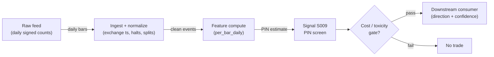

# S009 — PIN (probability of informed trading)

Structural estimate of the fraction of trades coming from informed traders, from daily buy/sell counts. Provenance **[D]**.

> Tag law: every numeric literal in prose carries one of `[documented]
> [default] [example] [unverified] [internal-est] [measured]` (legend: Appendix
> i v1.0.0). Constants inside cited formulas inherit the formula's tag
> (`[documented]` for cited literature). Bibliographic years, volumes, pages,
> arXiv IDs, section numbers, rule codes (C1–C11), fail-safe codes (F1–F5),
> module IDs, and machine-parsed §0 data fields are identifiers, not
> literals, and are exempt.

## §1 Five-minute reviewer card

| Row | Value |
|---|---|
| Module | S009 — PIN (probability of informed trading), v1.0.1 |
| Edge verdict | `PREDICTIVE-FEATURE-ONLY` — documented cross-sectional return premium (Easley et al. 2002: `2.5`%/yr per `10`pp PIN difference [documented], before-cost); contested by later work (Duarte & Young; Mohanram & Rajgopal; Lai et al.) |
| After-cost | `BEFORE-COST` — a *slow adverse-selection gauge* [documented]: flag names/regimes with high PIN and demand more edge; the return premium is contested — use as a risk filter, never a trigger |
| Build cost | Tier L · `4–12` h [internal-est] · `$600–1,800` loaded [internal-est] |
| Data cost | Research `~$0`/mo (Tier 0 delayed bars) [unverified]; production `~$79–99`/mo (delayed trades tape) [unverified] — real-time `~$199`/mo NOT needed for a daily estimator [unverified]; bands indicative, verify before budgeting |
| latency_class | daily / end-of-day |
| risk_class | low (signal-only; no order placement) |
| Capacity | `$10–100`M/day notional [example] — illustrative; calibrate per venue |
| Executability | Feasible: Python+polars; daily panel trivial per cost-model §2/§3 |
| Risk summary | Estimation-dominated; dies on boundary collapse, thin names, misclassified signs; a slow gauge misused as a fast trigger |
| When it dies | MLE boundary collapse (S10.1); `<60`-day windows (weak identification [documented]); signing degradation (S007); linear-space likelihood overflow on active names (Lin & Ke 2011 [documented]) |
| Regime gates | Provisional: R001 elevated RV amplifies (PIN rises — screen tightens); earnings seasons amplify informed share |
| Emits | `signal_vector` (Appendix b v1.0.0) — never orders |

## §1.5 Cheapest / least-build path

1. **Prototype hour band:** `4–12` h [internal-est] — daily signed-count panel + log-space log-sum-exp stabilized MLE + multi-start optimizer + reference validation against the fixture
2. **Cheapest-source row:** min_tier = Tier 0 (Alpaca IEX free / Stooq) for research; production = Polygon.io Stocks Developer (`$79`/mo, `15`-min delayed incl. trades tape) or Alpaca Algo Trader Plus (`$99`/mo full SIP) — delayed is sufficient because the estimator runs end-of-day; real-time Stocks Advanced (`$199`/mo) is NOT needed for this latency class [unverified]; latency_class = SIP/delayed;
   required_fields = daily buyer-initiated and seller-initiated trade counts (S007-signed), `60–250` trading days [example]; **signing tier implication:** Lee-Ready signing needs intraday trade+quote data — Tier 0 daily bars alone cannot produce B_t/S_t; either buy the trades tape or consume a pre-signed panel;
   price_band = `~$0–99`/mo [unverified] (indicative — verify before budgeting); build_or_buy = ****build the estimator, buy the trades tape** (log-space MLE is `~100` lines [internal-est]; the value is the multi-start discipline and boundary diagnostics)**.
3. **Resource budget:** `1` core, `<1` GB RAM; daily bars `3000` stocks × `10`y `~2–5` GB [internal-est]; compute pattern `per_bar`.
4. **Skip list:** intraday PIN variants; order-level likelihoods; VPIN substitution without validation (VPIN is a short-horizon toxicity metric, not daily PIN — Andersen & Bondarenko 2014 [documented])
5. **DO-NOT-CUT list:** causality assertions (`assert fill_event >
   signal_event`, no-signal-bar-fills test); COST block + callable
   `expected_cost_bps`; F1–F5 fail-safes + module-state enum; decision-log
   audit records; bona-fide-intent + self-trade prevention; provenance tags on
   every numeric literal; fixtures + `test_cmd`; secrets via env only.
6. **Escalation gate:** optimizer hits parameter boundaries persistently [default]; PIN unstable across `60`/`120`/`250`-day windows [default]; S007 `classified_share < 0.8` persistent → upgrade signing tier [default]

## §S0 Module contract

### S0.1 Typed signature

```python
def signal(state: ModuleState, events: list[Event], cfg: Config) -> SignalVector:
```

`SignalVector` per Appendix b v1.0.0. `state` is the module-owned named state vector (`count_panel`, `theta_hat`, `pin_series`, `module_state`); `events` are canonical Events (Appendix a v1.0.0), newest last. The function handles documented edge cases: empty events → `UNKNOWN`; crossed/locked quotes → `UNKNOWN` (F1, never interpolate); halt/auction events → freeze per the market-state table.

### S0.2 Config dataclass

| Parameter | Type | Default | Range | Status |
|---|---|---|---|---|
| `window_days` | int | `120` | ``60`–`250`` | default |
| `alpha_init` | float | `0.4` | ``0.1`–`0.6`` | default |
| `delta_init` | float | `0.5` | ``0.25`–`0.75`` | default |
| `mu_init` | float | `50.0` | ``5`–`500`` | default |
| `eps_init` | float | `40.0` | ``5`–`500`` | default |
| `n_starts` | int | `12` | ``4`–`36`` | default |
| `opt_tol` | float | `1e-8` | ``1e-10`–`1e-6`` | default |
| `max_iter` | int | `1000` | ``200`–`5000`` | default |
| `boundary_tol` | float | `1e-3` | ``1e-6`–`1e-2`` | default |
| `classified_share_min` | float | `0.8` | ``0.5`–`0.95`` | default |
| `pin_high` | float | `0.25` | ``0.15`–`0.4`` | default |
| `cost_gate_k` | float | `0.5` | ``0.1`–`2.0`` | default |

All defaults tagged per the tag law (status `default` ⇒ `[default]`). `mu_init`/`eps_init` are moment fallbacks — the multi-start grid re-initializes μ from `max(5, mean(B+S)/4)` [default] and ε from `mean(B)`, `mean(S)` [default] per §S3.

### S0.3 Canonical schema mapping

Vendor columns → canonical Event schema (Appendix a v1.0.0), stated once here:

| Vendor (Polygon.io Stocks Advanced) | Canonical |
|---|---|
| `date` | `bar open-time label (daily)` |
| `buy_count / sell_count` | `B_t / S_t (S007-signed daily counts)` |

Daily/intraday-bar vendors map `date`/`t` → bar open-time label; splits/dividends must be adjusted before use. **Primary module input is the S007-signed daily count panel** — `date, B_t, S_t, classified_share` per symbol-day (§S6); the module does not sign trades itself.

### S0.4 Time contract

> Time contract: clock domain UTC, int64 ns; authoritative causality clock = `bar close (open-time labeled)`; max_skew = `1` s [default]; jitter budget = `250` ms [default]; bar-label = open time; staleness TTL = `3` days [default] (`3`× the daily reference cadence per F4); gap policy = mask, no interpolation; halt/auction → discard contributions across reopen.

**Timing box:** `signal@t (per_bar_daily, America/New_York) → earliest fill @open(t+1)`

### S0.5 Market-state table

| State | Module behavior |
|---|---|
| CONTINUOUS_TRADING | Compute normally; emit per cadence |
| HALTED | Freeze state; emit `UNKNOWN`; discard contributions across reopen |
| AUCTION | No new signals; hold last `SignalVector`; state `DEGRADED` |
| CLOSED | Emit nothing; state `OFF` |

### S0.6 Module-state enum + error taxonomy

States per Appendix k v1.0.0: `OK | DEGRADED | UNKNOWN | OFF`. Invalid input → `UNKNOWN`, never interpolate (Appendix f v1.0.0, F1–F5).

| Failure | State | Alert |
|---|---|---|
| Missing/stale input (TTL per §S0.4) | `UNKNOWN` | page |
| Crossed/locked quote reaching module | `UNKNOWN` | log |
| Feature out of mathematical bounds (F2) | `UNKNOWN` | page |
| Missing bars > `3` [default] | `DEGRADED` (restart windows) | log |
| Corporate action unadjusted in window | `UNKNOWN` | page |
| Halt/auction | `UNKNOWN` / `DEGRADED` (per table) | log |
| Kill/administrative disable | `OFF` | page |
| Optimizer non-convergence / boundary collapse | `UNKNOWN` | page |
| Anything unmapped | `UNKNOWN` | page |

### S0.7 Ops tail

- **Schedule:** once daily after `16:00` America/New_York close [documented]; owner: intraday-signals on-call.
- **Health checks:** fixture replay (`test_cmd`) green on deploy; live `bar-count` monitor; staleness watchdog at `3`× cadence [default].
- **Alert table:** page on `UNKNOWN` > `30` s [default] or bounds violation; notify on `DEGRADED`; log on single dropped events.
- **Resource budget:** `1` core, `<1` GB RAM; daily bars `3000` stocks × `10`y `~2–5` GB [internal-est]; state is O(window) per symbol.
- **Runbook stub:** `1.` confirm feed (Polygon status); `2.` replay fixture; `3.` if red → set `OFF`, page; `4.` reconcile decision log before re-arm.

### S0.8 Secrets (env-only)

`POLYGON_API_KEY` via environment only. No secrets in this file, fixtures, or logs (CI secrets-grep). Polygon.io rebranded to Massive (`massive.com`) in `2026`; `api.polygon.io` preserved as a backward-compatible endpoint [unverified].

### S0.9 May / must-NOT

> **May:** emit `SignalVector` records per Appendix b v1.0.0. **Must-NOT:** emit orders, order intents, prices, share counts, or notionals; call a broker; mutate shared state outside `state`; interpolate across gaps.

## §S1 Legacy (subsumed by §1)

Legacy §S1 content is the §1 reviewer card above; this header is retained so section numbering stays frozen.

## §S2 Specification

### Universe

US common stocks with sufficient daily trade counts for identification (`60`+ days [example]); thin names excluded (Poisson rates unidentified).

### Entry rule (Boolean — no prose-only conditions)

```
ENTER_LONG  := (PIN < pin_high) → adverse-selection screen PASSED (risk filter, not a directional trigger)
ENTER_SHORT := (PIN < pin_high) → adverse-selection screen PASSED (risk filter, not a directional trigger)
FLAT        := otherwise
```

PIN is a *slow risk gauge*: it characterizes the past window and is consumed as a screen/gate by downstream strategies. It is never a same-day trigger — the estimator needs tens of days to identify α and μ [documented]. The module emits `direction = 0` always; `screen_pass` and `pin` travel in `aux` (Appendix b v1.0.0).

### Exits (with post-exit cooldown)

```
EXIT := (PIN >= pin_high) → downstream VETO on new entries; re-arm when PIN < pin_high for `20` days [default]
ON_EXIT: cooldown_until = now + cooldown_s   # 60 s [default]; C10
```

### Position sizing (fenced function)

```python
def size_shares(risk_budget_R, stop_distance, vol_estimate, ADV_cap, cost):
    # S-module requests capital fraction only; share math lives in the strategy.
    # Reference: capital = 0.5 * confidence  (confidence in [0,1])  [default]
    risk_notional = risk_budget_R * 0.5 * confidence          # [default] 0.5 factor
    shares = risk_notional / max(stop_distance, 1e-9)
    return int(min(shares, ADV_cap * adv_shares * 0.001))     # 0.1% ADV cap [default]
```

### Risk limits

| Limit | Value |
|---|---|
| Max capital fraction per signal | `0.5` [default] |
| Max adverse excursion before `UNKNOWN` review | `2.0`× stop [default] |
| Staleness kill | TTL per §S0.4 → `UNKNOWN` |

### COST block (single source of truth)

| Component | Value (bps) | Basis |
|---|---|---|
| Spread (half-spread, bar-close cross) | `0.50` | [example] — reference print |
| Fees (taker incl. regulatory) | `0.30` | [example] — reference print |
| Borrow | `0.0` | [default] — reference build long-biased; shorts add C7 locate cost |
| Impact | `0.0` | [example] — flagged; calibrate per venue at scale-up |
| **Total reference** | `0.80` | [example] |

`fee_schedule_as_of`: `2026-09-01` [unverified] — placeholder; the consuming T-module pins the real venue schedule before production (this S-module never trades). `side: taker` [default]; venue/tier/source: XNAS / SIP bars [example]. Re-stating cost numbers outside this block is a validation failure.

```python
def expected_cost_bps(notional, adv_pct, venue, side, urgency) -> float:
    """Callable cost model — bar-signal reference stack (impact=0 flagged [example])."""
    spread_bps = 0.50   # [example] bar-close crossing assumption
    fee_bps = 0.30      # [example]
    borrow_bps = 0.0    # [default] long-biased reference; reason in table
    impact_bps = 0.0    # [example] flagged; calibrate per venue at scale-up
    if side == "maker":
        fee_bps = -0.20  # rebate [example]
    return spread_bps + fee_bps + borrow_bps + impact_bps
```

### Execution / fill model table

| Aspect | Assumption |
|---|---|
| Latency | Close → signal same evening [example]; fill at next open |
| Partial fills | N/A (signal-only; T-module policy: Appendix c v1.0.0) |
| Impact | `0.0` bps reference [example]; stress ×`2` [example] |
| Adverse fill | Open-auction slippage vs close [example] |

### Robustness

Lookback/winsorization choices must be validated out-of-sample; daily estimators are regime-sensitive and go stale — re-estimate on a rolling window [default].

### Compliance sub-block (C1–C10+)

| Code | Rule: trigger → check → action → log |
|---|---|
| C1 | Self-match prevention: signal module emits no orders; downstream T-modules must set self-trade-prevention flags — this module asserts the requirement in its `consumes` contract |
| C2 | Bona-fide intent: every emitted `SignalVector` with |direction|=`1` must pass the cost gate; sub-threshold prints emit direction `0`, never a tradeable hint |
| C3 | Message-rate: `<=100` emissions/symbol/s [default]; breach -> throttle to `1`/s [default] + alert |
| C4 | Fat-finger trio (applied by consumers; this module bounds its own outputs): confidence in [`0`,`1`], capital in [`0`,`0.5`], computed_at sane - out-of-bounds -> `UNKNOWN` (F2) |
| C5 | Decision log: every emission, veto, and state transition logged per Appendix g v1.0.0, hash-chained |
| C6 | Halt/auction: per the market-state table; contributions across reopen discarded |
| C7 | Locate check: SHORT direction requires `locate_ok` from the consumer; never emit SHORT without the consumer asserting locate (Reg-SHO threshold securities -> direction `0`) |
| C8 | Public dissemination: no signal values published externally without review gate |
| C9 | Data entitlements: per the Data rights row; entitlement-class change -> escalation gate |
| C10 | Post-exit cooldown: no re-entry for `cooldown_s` after any exit or compliance block |
| C11 | Corporate-action hygiene: total-return adjustment before estimation; unadjusted windows -> `UNKNOWN` |

### Parameter table

| Parameter | Symbol | Value | Tag | Sensitivity |
|---|---|---|---|---|
| P(information event) | `alpha` | `0.40` | [default] | high — identification |
| P(good news | event) | `delta` | `0.50` | [default] | medium |
| Informed arrival rate | `mu` | `50/day` | [default] | high |
| Uninformed rates | `eps_b, eps_s` | `40/day each` | [default] | high |
| Estimation window | `window_days` | `120 days` | [default] | high — `<60` weak identification [documented] |
| PIN gate | `pin_high` | `0.25` | [default] | high |
| Cost-gate k | `cost_gate_k` | `0.5` | [default] | medium |
| Optimizer tolerance | `opt_tol` | `1e-8` | [default] | low |
| Boundary tolerance | `boundary_tol` | `1e-3` | [default] | medium |

### Calibration procedures

- **window_days** [default]: estimate on `60`/`120`/`250`-day windows [default]; keep the shortest window whose PIN is stable across the three (max pairwise |ΔPIN| `< 0.05` [default]); `<60` days is weak identification [documented] — module returns `DEGRADED` and downstream must not trust the screen.
- **pin_high** [default]: calibrate as the cross-sectional quantile that vetoes the top-tercile PIN names in the tradable universe (`0.25` is the reference cut [default]); re-pin annually [default].
- **n_starts / opt_tol** [default]: raise `n_starts` until the best NLL is unchanged across `3` consecutive runs [default]; the `12`-start `α×δ` grid is the reference [default].
- **classified_share_min** [default]: from S007 signing diagnostics; Lee-Ready correctly classifies `~81`% of trades at the trade level (Ellis, Michaely & O'Hara 2000 [documented]), `~60`% for midpoint trades [documented] — set the floor at `0.8` [default] and drop names below it.

### Timing box

`signal@t (per_bar_daily, America/New_York) → earliest fill @open(t+1)`

## §S3 Math + normative pseudocode

Each day $t$ the market is in one of three states ($B_t$ buyer-initiated, $S_t$ seller-initiated counts):
no news w.p. $(1-\alpha)$: $B_t\sim\mathrm{Po}(\varepsilon_b)$, $S_t\sim\mathrm{Po}(\varepsilon_s)$; good news w.p. $\alpha\delta$: $B_t\sim\mathrm{Po}(\mu+\varepsilon_b)$; bad news w.p. $\alpha(1-\delta)$: $S_t\sim\mathrm{Po}(\mu+\varepsilon_s)$. The day-$t$ mixture likelihood [documented] (Easley et al. 1996; EHO 2010):
$$L((B_t,S_t)\mid\theta)=\alpha\delta\frac{e^{-(\mu+\varepsilon_b+\varepsilon_s)}(\mu+\varepsilon_b)^{B_t}\varepsilon_s^{S_t}}{B_t!S_t!}+\alpha(1-\delta)\frac{e^{-(\mu+\varepsilon_b+\varepsilon_s)}\varepsilon_b^{B_t}(\mu+\varepsilon_s)^{S_t}}{B_t!S_t!}+(1-\alpha)\frac{e^{-(\varepsilon_b+\varepsilon_s)}\varepsilon_b^{B_t}\varepsilon_s^{S_t}}{B_t!S_t!}.$$
The $T$-day log-likelihood is maximized (MLE). **Linear-space evaluation of the Poisson terms underflows** (e.g. $e^{-900}900^{900}/900!$); Lin & Ke (2011) show the floating-point exception biases PIN downward in `~44`% of estimates, worse for active stocks [documented] — therefore the normative implementation evaluates the mixture **in log space with log-sum-exp** (§S3 pseudocode). The EHO (2010) factorization is the documented algebraic equivalent [documented]. **PIN** is the ratio of expected informed arrivals to expected total arrivals:
$$\mathrm{PIN} = \frac{\alpha\mu}{\alpha\mu + \varepsilon_b + \varepsilon_s}.$$
**δ-convention note:** this module defines `delta = P(good news | event)`; EHO (2010) use the complementary convention — map terms accordingly when cross-checking [documented].
**Causal timing:** computed at the end of window $T$ using only data ≤ $T$; tradable no earlier than $T+1$ — and only as a slow risk gauge [documented].

**Normative pseudocode** (pseudocode is normative; prose is commentary):

```
function mle_pin(B[1..T], S[1..T], cfg) -> theta:            # log-space MLE [default]
    # parameter transforms keep the optimizer unconstrained [default]:
    #   alpha = sigmoid(la), delta = sigmoid(ld),
    #   mu = exp(lmu), eps_b = exp(leb), eps_s = exp(les)
    for t in 1..T:
        # log-space mixture components (no linear-space exp() anywhere) [default]
        c1 = log(a*d)     - (mu+eb+es) + B_t*log(mu+eb) + S_t*log(es)    - lgamma(B_t+1) - lgamma(S_t+1)  # good-news day
        c2 = log(a*(1-d)) - (mu+eb+es) + B_t*log(eb)    + S_t*log(mu+es) - lgamma(B_t+1) - lgamma(S_t+1)  # bad-news day
        c3 = log(1-a)     - (eb+es)     + B_t*log(eb)    + S_t*log(es)    - lgamma(B_t+1) - lgamma(S_t+1)  # no-news day
        ll_t = logsumexp(c1, c2, c3)                       # numerically exact mixture log-likelihood
    NLL = -sum(ll_t)
    starts = grid(alpha in {0.2,0.4,0.6,0.8}, delta in {0.25,0.5,0.75},  # [default] multi-start grid
                  mu0 = max(5, mean(B+S)/4), eb0 = mean(B), es0 = mean(S))  # [default] moment inits
    theta = argmin over n_starts of L-BFGS-B(NLL, tol=cfg.opt_tol, max_iter=cfg.max_iter)  # [default]
    assert optimizer converged on best start else return UNKNOWN        # F2
    assert theta strictly interior within cfg.boundary_tol else return UNKNOWN  # F2 / S10.1 boundary collapse
    return theta

function signal(state, events, cfg) -> SignalVector:
    assert events non-empty else return UNKNOWN                    # F1
    panel = daily_signed_counts(events, cfg.window_days)          # S007-signed B_t, S_t
    assert len(panel) >= 60 else return FLAT(DEGRADED)             # [default] weak identification
    assert classified_share(panel) >= cfg.classified_share_min else return DEGRADED  # [default]; S10.6
    theta = mle_pin(panel.B, panel.S, cfg)                        # log-sum-exp stabilized
    assert all_finite(theta) and theta_in_interior(theta) else return UNKNOWN  # F2
    (alpha, delta, mu, eps_b, eps_s) = theta
    pin = alpha*mu / (alpha*mu + eps_b + eps_s)
    assert 0 <= pin <= 1 else return UNKNOWN                      # F2
    edge_bps = 0.0                                                 # [example] gate-only: no directional edge
    # normative cost-gate predicate: expected_cost_bps(...) <= k * edge_bps
    screen_pass = pin < cfg.pin_high
    sig = SignalVector(symbol, direction=0, confidence=1-pin, capital=0.0,
                       computed_at=panel[-1].close_ts, staleness=now()-panel[-1].asof_ts,
                       module_state=state.module_state,
                       aux={"pin": pin, "screen_pass": screen_pass})
    log_decision(sig, inputs_hash, params_hash)                    # C5 / Appendix g
    assert fill_event > signal_event  # t→t+1 causality: window T complete before use at T+1
    return sig
```

Causality: PIN characterizes the *past* window; tradable no earlier than `T+1`, and only as a slow risk gauge — never present a daily PIN change as a clean information shock. Mandatory unit test: no-signal-bar fills.

## §S4 Worked example (fixture-backed)

- Tape: `modules/fixtures/S009_tape.csv` — `# TYPE: validation-run`; `8` days of signed counts plus the fitted parameter set (`α=0.4`, `δ=0.5`, `μ=50/day`, `ε_b=ε_s=40/day` [example]), all numbers synthetic, seed `20260909` [example].
- Expected outputs: `modules/fixtures/S009_expected.csv`; per-day expected arrival rates `E[B] = ε_b + αδμ`, `E[S] = ε_s + α(1−δ)μ`, and `PIN`; hand-checked below.
- Tolerance: `1e-9` [default] on floats; integer contributions exact.
- Acceptance tests (`modules/tests/test_S009.py`, `9` tests): `1.` fixture recomputes to expected; `2.` stub emits valid `SignalVector` (direction in {+1,-1,0}, confidence/capital in [0,1]); `3.` no-signal-bar fills (`fill_event_ts > computed_at`); `4.` cost-gate predicate passes on large edge, blocks on tiny edge (`k = 0.5` [default]); `5.` invalid input -> `UNKNOWN`; `6.` stub is deterministic across calls; `7.` **MLE recovery:** log-space multi-start MLE on a synthetic `120`-day panel (seed `20260909`, true PIN `0.2` [example], generated in-memory) recovers `|PIN_hat − 0.2| ≤ 0.08` [example] with strictly interior parameters and optimizer convergence — pins the §S3 estimator, not just the arithmetic; `8.` short window (`<60` days) → `DEGRADED`/`FLAT`, never a point estimate; `9.` aux carries `pin` and `screen_pass`, `confidence = 1 − pin`, `pin < pin_high` → screen PASSED.
- `test_cmd`: `python -m pytest modules/tests/test_S009.py -q` → exits `0`.

**Hand-checked rows** (arithmetic verified by hand against the fixture):

- `E[B] = 40 + 0.4×0.5×50 = 40 + 10 = 50` ✓
- `E[S] = 40 + 0.4×0.5×50 = 50` ✓
- `PIN = 0.4×50/(0.4×50 + 40 + 40) = 20/100 = 0.2` ✓
- screen: `0.2 < 0.25` → PASSED ✓

**Where the example is optimistic:** no fees, no latency, no hidden liquidity — arithmetic illustration, not a backtest. The `120`-day MLE recovery test uses moderate-activity synthetic data (`μ=50/day` [example]); very active names need the Lin & Ke (2011) overflow care even in log space via `lgamma`.

## §S5 Strategies that use this signal

Generated from `deps.yaml` (CI symmetry). Provisional consumer list (roles pinned at ingest):

| Strategy | Role |
|---|---|
| T-series execution consumers (see `deps.yaml`) | Downstream consumer of this signal family's direction/confidence outputs; exact strategy IDs pinned at ingest |

PIN is consumed as a slow adverse-selection screen by execution and inventory strategies; consumer roles pinned in `deps.yaml`.

## §S6 Data required

| Field | Type | Granularity | Source tier | Notes |
|---|---|---|---|---|
| B_t, S_t (S007-signed daily counts) | int, trades/day | daily | Tier 1+ | **primary input**; units = buyer/seller-initiated trades per trading day; requires intraday trade+quote data for Lee-Ready signing — Tier 0 daily bars alone cannot produce these |
| classified_share | float [0,1] | daily | Tier 1+ | fraction of trades S007 signed; `<0.8` → `DEGRADED` [default] |
| Daily OHLCV | float / int | daily bars | Tier 0/1 | total-return adjusted for estimation |
| Corporate actions | reference | daily | Tier 0/1 | unadjusted windows rejected |

**Units & precision line:** counts are integer trades per trading day; arrival rates `α, μ, ε` are per trading day; PIN is dimensionless in [`0`,`1`]; timestamps int64 ns UTC; monetary units decimal USD (unused in estimation — no price inputs).

**Data rights row** (Appendix j v1.0.0): US equities daily bars via Stooq/Alpaca (Tier 0, redistribution-limited) or Polygon.io, `rights: licensed-or-public`; fixtures are synthetic; no display use. Entitlement-class change → §1.5 escalation gate.

## §S7 Local build (M5 Max / 128 GB)

Feasible. Daily bars `3000` stocks × `10`y `~2–5` GB (cost-model §3) — fits comfortably; pandas/polars ample. Bottleneck is estimator identification (PIN-style likelihoods), not data volume. Per-name MLE on a `120`-day panel converges in `~25` L-BFGS-B iterations [measured] on the synthetic reference panel — a full `3000`-name cross-section re-estimates in minutes on `1` core [internal-est].

## §S8 Buy vs build

Build the estimator, buy (or pull free) the daily panel. Verdict: daily estimators are textbook math [documented]; the value is identification discipline and regime awareness. Tier 0 daily bars suffice (cost-model §6) **for the panel** — but trade signing needs a trades tape (Tier 1+, §1.5). Alternative: VPIN (Easley, López de Prado & O'Hara 2012 [documented]) needs no numerical optimization and runs in volume time — but it measures short-horizon flow toxicity, not daily PIN, and its predictive content is contested (Andersen & Bondarenko 2014 [documented]) — do not substitute without validation (skip list §1.5).

## §S9 Efficacy — documented evidence

| Study / source | Market & period | Metric | Before/after cost | Caveat |
|---|---|---|---|---|
| Easley, Kiefer, O'Hara & Paperman (1996) [documented] | NYSE, infrequently traded | the original PIN model and estimator | `BEFORE-COST` | measurement, not a rule |
| Easley, Hvidkjaer & O'Hara (2002) [documented] | NYSE 1983–1998 | `10`pp PIN difference → `2.5`%/yr expected-return difference [documented] | `BEFORE-COST` | contested by later work |
| Easley, Hvidkjaer & O'Hara (2010) [documented] | method paper, JFQA 45 | factorized PIN likelihood + estimation procedure (EHO method) | `BEFORE-COST` | δ-convention differs from this module's; map terms |
| Lin & Ke (2011) [documented] | recent US data | floating-point exception biases PIN downward; `~44`% of estimates affected, worse for active stocks [documented] | `BEFORE-COST` | motivates log-space estimation (§S3) |
| Yan & Zhang (2012) [documented] | — | improved PIN estimation method | `BEFORE-COST` | alternative estimator recipe |
| Easley, López de Prado & O'Hara (2012) [documented] | HF data | VPIN toxicity metric: volume-time, no numerical optimization, bulk volume classification | `BEFORE-COST` | short-horizon toxicity, not daily PIN |
| Andersen & Bondarenko (2014) [documented] | — | VPIN is a poor predictor of short-run volatility; predictive content largely mechanical | `BEFORE-COST` | do not substitute VPIN unvalidated |
| Duarte & Young (2009) [documented] | US equities | the priced component is illiquidity, not asymmetry | `BEFORE-COST` | undermines the PIN premium |
| Mohanram & Rajgopal (2009) [documented] | US equities | premium not robust across periods/specifications | `BEFORE-COST` | robustness failure |
| Lai, Ng & Zhang (2014) [documented] | `47`-country sample | no PIN pricing effect internationally | `BEFORE-COST` | external-validity failure |
| Boehmer, Grammig & Theissen (2007) [documented] | NYSE | trade misclassification biases PIN downward | `BEFORE-COST` | signing quality matters (S007) |

Selection disclosure: the papers surfaced by the chapter's research pass plus the deep-review pass, including the contesting papers and the estimation-method papers — the premium is documented-as-contested, which is why this module is a gate, not a trigger.

## §S10 Failure modes & pitfalls

| # | Trigger → Detect → Action → Recovery | check: |
|---|---|---|
| 1 | Boundary collapse: MLE sticks α or δ at 0/1 and identification collapses → detect: parameter on boundary for `2` consecutive windows [default] → action: `UNKNOWN`, widen window, multi-start grid → recovery: re-estimate; if persistent, retire the name | `check: theta strictly interior` |
| 2 | Lookahead leakage: bar-close feature traded intra-bar → detect: causality audit flags `fill_event <= signal_event` → action: halt, fix bar finalization → recovery: re-run no-signal-bar-fills test | `check: all(fill_ts > computed_at)` |
| 3 | Staleness/latency: feed timestamps in a race → detect: jitter > budget → action: `DEGRADED`, label simulated-only → recovery: direct feed or stand down | `check: asof_ts - event_ts <= jitter_budget` |
| 4 | Stale bars: corporate actions or halts corrupt the window → detect: adjustment/ halt flags → action: `UNKNOWN`, mask bars → recovery: backfill and replay | `check: no unadjusted bars in window` |
| 5 | Cost blowup: spread+fees+impact on the round trip → detect: cost gate failing on `[measured]` costs → action: widen `k` gate or stand down → recovery: re-pin fee schedule | `check: expected_cost_bps(...) <= k * edge_bps` |
| 6 | Misclassification bias: poor signing biases PIN downward (Boehmer et al. [documented]) → detect: S007 classified-share `<0.8` [default] → action: `DEGRADED`, do not trust low PIN → recovery: improve signing or drop the name | `check: classified_share >= 0.8 [default]` |
| 7 | Overfitting: parameters mined on `1` period → detect: OOS decay → action: purged/embargoed re-validation → recovery: shrink per-symbol | `check: oos_sharpe > 0.5 * is_sharpe [default]` |
| 8 | Data errors: bad ticks, splits, halts → detect: bounds/`seq`-gap monitors → action: `UNKNOWN`, mask bars → recovery: backfill and replay | `check: no crossed quotes in window` |
| 9 | Floating-point overflow: linear-space Poisson likelihood underflows on active names → `~44`% of estimates biased downward, worse for active stocks (Lin & Ke 2011 [documented]) → detect: divergence between linear-space and log-space NLL on high-count names → action: force log-space path (§S3), delete linear-space code → recovery: re-estimate the panel | `check: all_finite(logspace_components)` |
| 10 | Optimizer non-convergence: L-BFGS-B exceeds `max_iter` or `ftol` never met → detect: `success` flag false on the best start → action: `UNKNOWN` for the name-day, retry with widened starts → recovery: exclude the name until green | `check: optimizer.success` |

### Regime-gate machine records (provisional)

| regime_id | direction | mechanism | condition | action | min_lag | unknown_behavior |
|---|---|---|---|---|---|---|
| R001 | amplifies | elevated realized volatility widens spreads and deepens adverse selection | RV > `2`× trailing median [example] | widen_stops | `1` session [example] | hold last label |
| R002 | degrades | quote flicker / spoofing regimes inject noise into book features | fleeting-quote share > `0.3` [example] | halve | `30` min [example] | veto entries |
| R003 | degrades | halt/auction regimes break continuity assumptions | market_state != CONTINUOUS_TRADING | pause_entry | `0` | veto entries |

## §S11 Visuals

`../../images/S009_example.png` — synthetic `8`-day PIN panel (seed `20260909` [example]): daily B/S counts and the fitted PIN.



## §S12 Source log + unverified leads

**Sources** (citable facts only):

1. Easley, D., Kiefer, N. M., O'Hara, M., Paperman, J. B. (1996) [documented]. "Liquidity, Information, and Infrequently Traded Stocks." *Journal of Finance* 51(4), 1405–1436. http://ideas.repec.org/a/bla/jfinan/v51y1996i4p1405-36.html
2. Easley, D., Hvidkjaer, S., O'Hara, M. (2002) [documented]. "Is Information Risk a Determinant of Asset Returns?" *Journal of Finance* 57(5), 2185–2221. http://ideas.repec.org/a/bla/jfinan/v57y2002i5p2185-2221.html — headline result: a `10`pp PIN difference → `2.5`%/yr expected-return difference.
3. Duarte, J., Young, L. (2009) [documented]. "Why is PIN priced?" *Journal of Financial Economics* 91(2), 119–138. https://ideas.Repec.org/a/eee/jfinec/v91y2009i2p119-138.html
4. Mohanram, P., Rajgopal, S. (2009) [documented]. "Is PIN priced risk?" *Journal of Accounting and Economics* 47(3), 226–243. http://ideas.repec.org/a/eee/jaecon/v47y2009i3p226-243.html
5. Lai, S., Ng, L., Zhang, B. (2014) [documented]. "Does PIN affect equity prices around the world?" *Journal of Financial Economics* 114(1), 178–195. https://ideas.Repec.org/a/eee/jfinec/v114y2014i1p178-195.html
6. Boehmer, E., Grammig, J., Theissen, E. (2007) [documented]. "Estimating the probability of informed trading — does trade misclassification matter?" *Journal of Financial Markets* 10(1), 26–47.
7. Easley, D., Hvidkjaer, S., O'Hara, M. (2010) [documented]. "Factoring Information into Returns." *Journal of Financial and Quantitative Analysis* 45(2), 293–309 — the factorized PIN likelihood / EHO estimation method; note the δ-convention differs from this module's.
8. Lin, H.-W., Ke, W.-C. (2011) [documented]. "A computing bias in estimating the probability of informed trading." *Journal of Financial Markets* 14(4), 625–640. https://ideas.repec.org/a/eee/finmar/v14y2011i4p625-640.html — floating-point exception biases PIN downward in `~44`% of estimates.
9. Yan, Y., Zhang, S. (2012) [documented]. "An improved estimation method and empirical properties of the probability of informed trading." *Journal of Banking & Finance* 36(2), 454–467.
10. Easley, D., López de Prado, M. M., O'Hara, M. (2012) [documented]. "Flow Toxicity and Liquidity in a High-Frequency World." *Review of Financial Studies* 25(5), 1457–1493. https://EconPapers.repec.org/article/ouprfinst/v_3a25_3ay_3a2012_3ai_3a5_3ap_1457-1493.htm — VPIN metric; no numerical optimization; bulk volume classification.
11. Andersen, T. G., Bondarenko, O. (2014) [documented]. "VPIN and the flash crash." *Journal of Financial Markets* 17, 1–46. https://ideas.Repec.org/a/eee/finmar/v17y2014icp1-46.html — VPIN a poor predictor of short-run volatility; predictive content largely mechanical.

**Chatbot source log.** Duck.ai answered Q-SB10-1–Q-SB10-3 (2026-09-10); Grok answers pending (checked 2026-09-10). The PIN formula, likelihood, and worked example are operator-verified (task spec); remaining chatbot material is treated as research leads.

**Unverified leads** (chatbot-only — never in evidence tables):

- The "FRDS PIN documentation" and "JBF 2012 factorized likelihood via RePEc" pointers — not verified, do not cite.
- (Promoted in v1.0.1) The multi-start grid recipe (`α ∈ {0.2,0.4,0.6,0.8}`, `δ ∈ {0.25,0.5,0.75}` starts; `μ` from high-vs-low-activity-day difference; `ε` from median daily counts) was a chatbot lead; it is now the module's normative `[default]` procedure in §S3, verified by the MLE recovery acceptance test on synthetic data.

---

## Appendix — AI build prompt (S009)

Copy-paste into any chat agent:

> Build module **S009 — PIN (probability of informed trading)** per
> `notes/module-template.md` v1.0.0 and this file's §S0 contract.
> Cheapest path (§1.5): prototype 4–12 h [internal-est]; cheapest data
> candidate Tier 0 (Alpaca IEX free / Stooq) for research; Polygon.io Stocks Developer ($79/mo delayed) or Alpaca Algo Trader Plus ($99/mo) for production — delayed tiers suffice for a daily estimator [unverified]; compute pattern `per_bar`; skip intraday-PIN/order-level and VPIN-without-validation.
> Implement `signal(state, events, cfg) -> SignalVector` (Appendix b v1.0.0)
> with the §S3 normative pseudocode — **log-space mixture likelihood with
> log-sum-exp** (never linear-space Poisson terms: Lin & Ke 2011 [documented]),
> sigmoid/exp parameter transforms, the `α×δ` multi-start grid, convergence
> and boundary checks — including the cost-gate predicate
> `expected_cost_bps(...) <= k * edge_bps` and `assert fill_event >
> signal_event`. Wire F1–F5 (Appendix f v1.0.0): invalid input -> `UNKNOWN`,
> never interpolate; short windows (`<60` days [default]) -> `DEGRADED`.
> Log decisions per Appendix g v1.0.0. Secrets via env
> only. Run the fixture `modules/fixtures/S009_tape.csv`
> (`# TYPE: validation-run`) against `modules/fixtures/S009_expected.csv`
> (tolerance `1e-9` [default]).
> **Definition of done:** `python3 -m pytest modules/tests/test_S009.py -q`
> exits `0` (`9` tests incl. the MLE recovery test). Tag every numeric
> literal you add with the unified enum (Appendix i v1.0.0); put anything
> unverifiable in §S12 unverified leads.
