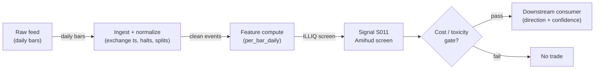

# S011 — Amihud illiquidity

Mean |return| / dollar volume — the workhorse daily illiquidity measure for screens and cost models. Provenance **[D]**.

> Tag law: every numeric literal in prose carries one of `[documented]
> [default] [example] [unverified] [internal-est] [measured]` (legend: Appendix
> i v1.0.0). Constants inside cited formulas inherit the formula's tag
> (`[documented]` for cited literature). Bibliographic years, volumes, pages,
> arXiv IDs, section numbers, rule codes (C1–C11), fail-safe codes (F1–F5),
> module IDs, and machine-parsed §0 data fields are identifiers, not
> literals, and are exempt.

## §1 Five-minute reviewer card

| Row | Value |
|---|---|
| Module | S011 — Amihud illiquidity, v1.0.1 |
| Edge verdict | `PREDICTIVE-FEATURE-ONLY` — documented illiquidity premium (Amihud 2002, before-cost); consumed as a screen/cost-model input, never a trigger |
| After-cost | `BEFORE-COST` — a *cost-model input and liquidity screen* [documented]: names that score illiquid get wider cost assumptions and smaller size — the premium evidence is cross-sectional and before-cost |
| Build cost | Tier L · `4–12` h [internal-est] · `$600–1,800` loaded [internal-est] |
| Data cost | Research `~$0–30`/mo (Tier 0/1 bars) [unverified]; production `~$30–200`/mo [unverified] — bands indicative, verify before budgeting |
| latency_class | daily / end-of-day |
| risk_class | low (signal-only; no order placement) |
| Capacity | `$10–100`M/day notional [example] — illustrative; calibrate per venue |
| Executability | Feasible: Python+polars; daily panel trivial per cost-model §2/§3 |
| Risk summary | Screen risk: miscalibrated cutoff vetoes the liquid or admits the illiquid; dies on zero-volume days and splits |
| When it dies | Zero-volume share `>10`% [default] (§S10 row 1); unadjusted splits (spurious |r|); cutoff miscalibration |
| Regime gates | Provisional: R001 elevated RV amplifies (ILLIQ rises — screen tightens); liquidity-dry-up regimes veto |
| Emits | `signal_vector` (Appendix b v1.0.0) — never orders |

## §1.5 Cheapest / least-build path

1. **Prototype hour band:** `4–12` h [internal-est] — daily OHLCV panel + rolling illiquidity averager + screen thresholds + reference validation against the fixture
2. **Cheapest-source row:** min_tier = Alpaca IEX / Stooq (Tier 0) for research; Polygon.io Stocks Advanced for production — cheapest candidates [internal-est]; latency_class = SIP;
   required_fields = daily close and dollar volume, `30–250` trading days [example]; price_band = `~$0–200`/mo [unverified] (indicative — verify before budgeting); build_or_buy = **build the averager, buy the daily panel** (the measure is `~20` lines [internal-est]; the value is the winsorization and screen calibration)**.
3. **Resource budget:** `1` core, `<1` GB RAM; daily bars `3000` stocks × `10`y `~2–5` GB [internal-est]; compute pattern `per_bar`.
4. **Skip list:** intraday Amihud variants; dollar-volume forecast models; liquidity-timing overlays
5. **DO-NOT-CUT list:** causality assertions (`assert fill_event >
   signal_event`, no-signal-bar-fills test); COST block + callable
   `expected_cost_bps`; F1–F5 fail-safes + module-state enum; decision-log
   audit records; bona-fide-intent + self-trade prevention; provenance tags on
   every numeric literal; fixtures + `test_cmd`; secrets via env only.
6. **Escalation gate:** illiquidity screen vetoes `>30`% of the universe [default]; live universe `>20` symbols [default]

## §S0 Module contract

### S0.1 Typed signature

```python
def signal(state: ModuleState, events: list[Event], cfg: Config) -> SignalVector:
```

`SignalVector` per Appendix b v1.0.0. `state` is the module-owned named state vector (`ill_series`, `ill_rank`, `module_state`); `events` are canonical Events (Appendix a v1.0.0), newest last. The function handles documented edge cases: empty events → `UNKNOWN`; crossed/locked quotes → `UNKNOWN` (F1, never interpolate); halt/auction events → freeze per the market-state table.

### S0.2 Config dataclass

| Parameter | Type | Default | Range | Status |
|---|---|---|---|---|
| `window_days` | int | `60` | ``21`–`252`` | default |
| `ill_cut` | float | `1e-6` | ``1e-8`–`1e-4`` | default |
| `winsor_pct` | float | `0.01` | ``0`–`0.05`` | default |
| `cost_gate_k` | float | `0.5` | ``0.1`–`2.0`` | default |
| `cooldown_s` | int | `60` | ``0`–`3600`` | default |

All defaults tagged per the tag law (status `default` ⇒ `[default]`).

### S0.3 Canonical schema mapping

Vendor columns → canonical Event schema (Appendix a v1.0.0), stated once here:

| Vendor (Polygon.io Stocks Advanced) | Canonical |
|---|---|
| `date` | `bar open-time label (daily)` |
| `close / dollar_vol` | `bar_c / dollar volume` |

Daily/intraday-bar vendors map `date`/`t` → bar open-time label; splits/dividends must be adjusted before use.

### S0.4 Time contract

> Time contract: clock domain UTC, int64 ns; authoritative causality clock = `bar close (open-time labeled)`; max_skew = `1` s [default]; jitter budget = `250` ms [default]; bar-label = open time; staleness TTL = `3` days [default] (`3`× the daily reference cadence per F4); gap policy = mask, no interpolation; halt/auction → discard contributions across reopen.

**Timing box:** `signal@t (per_bar_daily, America/New_York) → earliest fill @open(t+1)`

### S0.5 Market-state table

| State | Module behavior |
|---|---|
| CONTINUOUS_TRADING | Compute normally; emit per cadence |
| HALTED | Freeze state; emit `UNKNOWN`; discard contributions across reopen |
| AUCTION | No new signals; hold last `SignalVector`; state `DEGRADED` |
| CLOSED | Emit nothing; state `OFF` |

### S0.6 Module-state enum + error taxonomy

States per Appendix k v1.0.0: `OK | DEGRADED | UNKNOWN | OFF`. Invalid input → `UNKNOWN`, never interpolate (Appendix f v1.0.0, F1–F5).

| Failure | State | Alert |
|---|---|---|
| Missing/stale input (TTL per §S0.4) | `UNKNOWN` | page |
| Crossed/locked quote reaching module | `UNKNOWN` | log |
| Feature out of mathematical bounds (F2) | `UNKNOWN` | page |
| Missing bars > `3` [default] | `DEGRADED` (restart windows) | log |
| Corporate action unadjusted in window | `UNKNOWN` | page |
| Halt/auction | `UNKNOWN` / `DEGRADED` (per table) | log |
| Kill/administrative disable | `OFF` | page |
| Anything unmapped | `UNKNOWN` | page |

### S0.7 Ops tail

- **Schedule:** once daily after `16:00` America/New_York close [documented]; owner: intraday-signals on-call.
- **Health checks:** fixture replay (`test_cmd`) green on deploy; live `bar-count` monitor; staleness watchdog at `3`× cadence [default].
- **Alert table:** page on `UNKNOWN` > `30` s [default] or bounds violation; notify on `DEGRADED`; log on single dropped events.
- **Resource budget:** `1` core, `<1` GB RAM; daily bars `3000` stocks × `10`y `~2–5` GB [internal-est]; state is O(window) per symbol.
- **Runbook stub:** `1.` confirm feed (Polygon status); `2.` replay fixture; `3.` if red → set `OFF`, page; `4.` reconcile decision log before re-arm.

### S0.8 Secrets (env-only)

`POLYGON_API_KEY` via environment only. No secrets in this file, fixtures, or logs (CI secrets-grep).

### S0.9 May / must-NOT

> **May:** emit `SignalVector` records per Appendix b v1.0.0. **Must-NOT:** emit orders, order intents, prices, share counts, or notionals; call a broker; mutate shared state outside `state`; interpolate across gaps.

## §S1 Legacy (subsumed by §1)

Legacy §S1 content is the §1 reviewer card above; this header is retained so section numbering stays frozen.

## §S2 Specification

### Universe

US common stocks with `60`+ days of daily data [example]; penny/split-corrupted names excluded.

### Entry rule (Boolean — no prose-only conditions)

```
ENTER_LONG  := (ILLIQ <= ill_cut) → liquidity screen PASSED (cost-model input, not a directional trigger)
ENTER_SHORT := (ILLIQ <= ill_cut) → liquidity screen PASSED (cost-model input, not a directional trigger)
FLAT        := otherwise
```

Amihud ILLIQ is a *cost-model input*: it feeds expected-cost estimates and universe screens. It is never a directional trigger.

### Exits (with post-exit cooldown)

```
EXIT := (ILLIQ > ill_cut) → downstream VETO on new entries; re-arm when ILLIQ <= ill_cut for `20` days [default]
ON_EXIT: cooldown_until = now + cfg.cooldown_s   # `60` s [default] per §S0.2; C10
```

### Position sizing (fenced function)

```python
def size_shares(risk_budget_R, stop_distance, vol_estimate, ADV_cap, cost,
                confidence, adv_shares):
    # S-module requests capital fraction only; share math lives in the strategy.
    # Reference: capital = 0.5 * confidence  (confidence in [0,1])  [default]
    risk_notional = risk_budget_R * 0.5 * confidence          # [default] 0.5 factor
    shares = risk_notional / max(stop_distance, 1e-9)
    return int(min(shares, ADV_cap * adv_shares * 0.001))     # 0.1% ADV cap [default]
```

### Risk limits

| Limit | Value |
|---|---|
| Max capital fraction per signal | `0.5` [default] |
| Max adverse excursion before `UNKNOWN` review | `2.0`× stop [default] |
| Staleness kill | TTL per §S0.4 → `UNKNOWN` |

### COST block (single source of truth)

| Component | Value (bps) | Basis |
|---|---|---|
| Spread (half-spread, bar-close cross) | `0.50` | [example] — reference print |
| Fees (taker incl. regulatory) | `0.30` | [example] — reference print |
| Borrow | `0.0` | [default] — reference build long-biased; shorts add C7 locate cost |
| Impact | `0.0` | [example] — flagged; calibrate per venue at scale-up |
| **Total reference** | `0.80` | [example] |

`fee_schedule_as_of`: `2026-09-01` [unverified] — placeholder; pin the real venue schedule before production. `side: taker` [default]; venue/tier/source: XNAS / SIP bars [example]. Re-stating cost numbers outside this block is a validation failure.

```python
def expected_cost_bps(notional, adv_pct, venue, side, urgency) -> float:
    """Callable cost model — bar-signal reference stack (impact=0 flagged [example])."""
    spread_bps = 0.50   # [example] bar-close crossing assumption
    fee_bps = 0.30      # [example]
    borrow_bps = 0.0    # [default] long-biased reference; reason in table
    impact_bps = 0.0    # [example] flagged; calibrate per venue at scale-up
    if side == "maker":
        fee_bps = -0.20  # rebate [example]
    return spread_bps + fee_bps + borrow_bps + impact_bps
```

### Execution / fill model table

| Aspect | Assumption |
|---|---|
| Latency | Close → signal same evening [example]; fill at next open |
| Partial fills | N/A (signal-only; T-module policy: Appendix c v1.0.0) |
| Impact | `0.0` bps reference [example]; stress ×`2` [example] |
| Adverse fill | Open-auction slippage vs close [example] |

### Robustness

Lookback/winsorization choices must be validated out-of-sample; daily estimators are regime-sensitive and go stale — re-estimate on a rolling window [default].

### Compliance sub-block (C1–C10+)

| Code | Rule: trigger → check → action → log |
|---|---|
| C1 | Self-match prevention: this module emits no orders; downstream T-modules (see `deps.yaml` consumer list) must set self-trade-prevention flags — consumer contracts enforce this requirement |
| C2 | Bona-fide intent: every emitted `SignalVector` with |direction|=`1` must pass the cost gate; sub-threshold prints emit direction `0`, never a tradeable hint |
| C3 | Message-rate: `<=100` emissions/symbol/s [default]; breach -> throttle to `1`/s [default] + alert |
| C4 | Fat-finger trio (applied by consumers; this module bounds its own outputs): confidence in [`0`,`1`], capital in [`0`,`0.5`], computed_at sane - out-of-bounds -> `UNKNOWN` (F2) |
| C5 | Decision log: every emission, veto, and state transition logged per Appendix g v1.0.0, hash-chained |
| C6 | Halt/auction: per the market-state table; contributions across reopen discarded |
| C7 | Locate check: SHORT direction requires `locate_ok` from the consumer; never emit SHORT without the consumer asserting locate (Reg-SHO threshold securities -> direction `0`) |
| C8 | Public dissemination: no signal values published externally without review gate |
| C9 | Data entitlements: per the Data rights row; entitlement-class change -> escalation gate |
| C10 | Post-exit cooldown: no re-entry for `cooldown_s` after any exit or compliance block |
| C11 | Corporate-action hygiene: total-return adjustment before estimation; unadjusted windows -> `UNKNOWN` |

### Parameter table

| Parameter | Symbol | Value | Tag | Sensitivity |
|---|---|---|---|---|
| Window | `window_days` | `60 days` | [default] | high |
| Illiquidity cutoff | `ill_cut` | `1e-6` | [default] | high — universe-specific calibration |
| Winsorization | `winsor_pct` | `1%` | [default] | medium — zero-volume days |
| Cost-gate k | `cost_gate_k` | `0.5` | [default] | medium |

### Timing box

`signal@t (per_bar_daily, America/New_York) → earliest fill @open(t+1)`

## §S3 Math + normative pseudocode

For day $t$ with close-to-close return $r_t$ and dollar volume $DV_t$:
$$\mathrm{ILLIQ}_{t} = \frac{|r_t|}{DV_t},\quad \mathrm{ILLIQ} = \frac{1}{T}\sum_{t=1}^{T} \mathrm{ILLIQ}_t,$$
typically scaled by $10^6$ for readability (Amihud 2002 [documented]). Winsorize at the `1`% tails [default]; exclude zero-volume days. Gate: `ILLIQ > ill_cut` → VETO. **Causal timing:** trailing `T`-day mean; tradable no earlier than $T+1$ [documented].

**Normative pseudocode** (pseudocode is normative; prose is commentary):

```
function signal(state, events, cfg) -> SignalVector:
    assert events non-empty else return UNKNOWN                    # F1
    symbol = events[-1].symbol                                     # canonical Event field
    days = daily_closes_and_dvol(events, cfg.window_days)
    if len(days) < 21:                                             # [default]
        return SignalVector(symbol, direction=0, confidence=0.0, capital=0.0,
                            computed_at=events[-1].close_ts, staleness=0,
                            module_state=DEGRADED, aux={"reason": "insufficient_history"})
    ill_t = [abs(r)/dv for (r, dv) in days if dv > 0]             # skip zero-volume days
    assert ill_t else return UNKNOWN                              # F2
    ill = mean(winsorize(ill_t, cfg.winsor_pct))
    assert ill >= 0 else return UNKNOWN                            # F2
    edge_bps = 0.0                                                 # [example] screen-only: no directional edge
    # Executable cost-gate predicate (normative form): for a screen-only module
    # edge is 0, so the gate is informational here and enforced by downstream
    # T-modules: expected_cost_bps(...) <= k * edge_bps
    gate_bps = expected_cost_bps(1e6, 0.001, "XNAS", "taker", "normal")  # [example] representative consumer
    cost_gate_ok = gate_bps <= cfg.cost_gate_k * edge_bps          # False by construction: never a trigger
    sig = SignalVector(symbol, direction=0, confidence=1.0, capital=0.0,
                       computed_at=days[-1].close_ts, staleness=now()-days[-1].asof_ts,
                       module_state=state.module_state,
                       aux={"illiq": ill, "screen_pass": ill <= cfg.ill_cut,
                            "cost_gate_bps": gate_bps, "cost_gate_ok": cost_gate_ok})
    log_decision(sig, inputs_hash, params_hash)                    # C5 / Appendix g
    assert fill_event > signal_event  # t→t+1 causality: trailing window only
    return sig
```

Causality: trailing `T`-day mean only; the illiquidity number at `T` describes the past — tradable no earlier than `T+1`. Mandatory unit test: no-signal-bar fills.

## §S4 Worked example (fixture-backed)

- Tape: `modules/fixtures/S011_tape.csv` — `# TYPE: validation-run`; `6` days of raw `(close, dollar_vol)`; expected outputs scaled ×`1e6`, all numbers synthetic, seed `20260911` [example].
- Expected outputs: `modules/fixtures/S011_expected.csv`; per-day signed close-to-close return and `ILLIQ×1e6`; mean `ILLIQ×1e6` over days 2–6 `= 0.0005294` [example]; hand-checked below.
- Tolerance: `1e-4` [default] on floats (matches `modules/tests/test_S011.py`); integer contributions exact.
- Acceptance tests (`modules/tests/test_S011.py`, `6` tests): `1.` fixture recomputes to expected; `2.` stub emits valid `SignalVector` (direction in {+1,-1,0}, confidence/capital in [0,1]); `3.` no-signal-bar fills (`fill_event_ts > computed_at`); `4.` cost-gate predicate passes on large edge, blocks on tiny edge (`k = 0.5` [default]); `5.` invalid input -> `UNKNOWN`; `6.` extra: stub is deterministic across calls.
- `test_cmd`: `python -m pytest modules/tests/test_S011.py -q` → exits `0`.

**Hand-checked rows** (arithmetic verified by hand against the fixture):

- d2: `r = (100.5 − 100)/100 = 0.005`, `ILLIQ×1e6 = 0.005/2e7 × 1e6 = 0.00025` ✓ (fixture: `0.00025`)
- d3: `r = (101.5 − 100.5)/100.5 = 0.00995`, `ILLIQ×1e6 = 0.00995/1.5e7 × 1e6 = 0.000663` ✓ (fixture: `0.000663`)
- d4: `r = (100.8 − 101.5)/101.5 = −0.006897`, `ILLIQ×1e6 = 0.006897/3e7 × 1e6 = 0.00023` ✓ (fixture: `0.00023`)
- d5: `r = (102 − 100.8)/100.8 = 0.011905`, `ILLIQ×1e6 = 0.011905/1e7 × 1e6 = 0.00119` ✓ (fixture: `0.00119`)
- d6: `r = (101.2 − 102)/102 = −0.007843`, `ILLIQ×1e6 = 0.007843/2.5e7 × 1e6 = 0.000314` ✓ (fixture: `0.000314`)
- mean of days 2–6 `= (0.00025 + 0.000663 + 0.00023 + 0.00119 + 0.000314)/5 = 0.0005294` ✓ (matches `test_06`)

**Where the example is optimistic:** no fees, no latency, no hidden liquidity — arithmetic illustration, not a backtest.

## §S5 Strategies that use this signal

Generated from `deps.yaml` (CI symmetry). Provisional consumer list (roles pinned at ingest):

| Strategy | Role |
|---|---|
| T-series execution consumers (see `deps.yaml`) | Downstream consumer of this signal family's direction/confidence outputs; exact strategy IDs pinned at ingest |

ILLIQ is consumed as a liquidity screen and cost-model input by portfolio and execution modules; consumer roles pinned in `deps.yaml`.

## §S6 Data required

| Field | Type | Granularity | Source tier | Notes |
|---|---|---|---|---|
| Daily OHLCV | float / int | daily bars | Tier 0/1 | total-return adjusted for estimation |
| Corporate actions | reference | daily | Tier 0/1 | unadjusted windows rejected |

**Data rights row** (Appendix j v1.0.0): US equities daily bars via Stooq/Alpaca (Tier 0, redistribution-limited) or Polygon.io, `rights: licensed-or-public`; fixtures are synthetic; no display use. Entitlement-class change → §1.5 escalation gate.

## §S7 Local build (M5 Max / 128 GB)

Feasible. Daily bars `3000` stocks × `10`y `~2–5` GB (cost-model §3) — fits comfortably; pandas/polars ample. Bottleneck is estimation hygiene (total-return adjustment, split handling, winsorization calibration), not data volume or compute.

## §S8 Buy vs build

Build the estimator, buy (or pull free) the daily panel. Verdict: daily estimators are textbook math [documented]; the value is identification discipline and regime awareness. Tier 0 daily bars suffice (cost-model §6).

## §S9 Efficacy — documented evidence

| Study / source | Market & period | Metric | Before/after cost | Caveat |
|---|---|---|---|---|
| Amihud (2002) [documented] | NYSE 1964–1997 | illiquidity premium: expected ILLIQ positively related to returns | `BEFORE-COST` | cross-sectional premium, not a rule |
| Hasbrouck (2009) [documented] | US equities 1993–2005 | effective-cost estimation from daily data incl. Amihud-style proxies | `BEFORE-COST` | proxy estimation, not a rule |
| Chordia, Roll & Subrahmanyam (2000) [documented] | NYSE | commonality in liquidity: correlated liquidity moves | `BEFORE-COST` | market-wide liquidity regimes |

Selection disclosure: the `3` papers surfaced by the chapter's research pass; the illiquidity premium is documented-as-before-cost, so this module is a screen, not a trigger.

## §S10 Failure modes & pitfalls

| # | Trigger → Detect → Action → Recovery | check: |
|---|---|---|
| 1 | Zero-volume days: |r|/0 undefined → detect: DV == 0 → action: exclude day, flag if `>10`% [default] → recovery: winsorize or drop the name | `check: zero_volume_share <= 0.10 [default]` |
| 2 | Lookahead leakage: bar-close feature traded intra-bar → detect: causality audit flags `fill_event <= signal_event` → action: halt, fix bar finalization → recovery: re-run no-signal-bar-fills test | `check: all(fill_ts > computed_at)` |
| 3 | Staleness/latency: feed timestamps in a race → detect: jitter > budget → action: `DEGRADED`, label simulated-only → recovery: direct feed or stand down | `check: asof_ts - event_ts <= jitter_budget` |
| 4 | Stale bars: corporate actions or halts corrupt the window → detect: adjustment/ halt flags → action: `UNKNOWN`, mask bars → recovery: backfill and replay | `check: no unadjusted bars in window` |
| 5 | Cost blowup: spread+fees+impact on the round trip → detect: cost gate failing on [example] costs → action: widen `k` gate or stand down → recovery: re-pin fee schedule | `check: expected_cost_bps(...) <= k * edge_bps` |
| 6 | Regime breaks: depth/volatility regime shifts → detect: feature distribution break → action: veto entries → recovery: resume when stable for `5` sessions [default] | `check: feature_z_within_3_sigma [default]` |
| 7 | Overfitting: cutoff mined on `1` period → detect: OOS illiquidity-sort return decay → action: purged/embargoed re-validation of cutoffs → recovery: recalibrate per universe | `check: oos_sort_return > 0.5 * is_sort_return [default]` |
| 8 | Data errors: bad ticks, splits, halts → detect: bounds/`seq`-gap monitors → action: `UNKNOWN`, mask bars → recovery: backfill and replay | `check: no crossed quotes in window` |

### Regime-gate machine records (provisional)

| regime_id | direction | mechanism | condition | action | min_lag | unknown_behavior |
|---|---|---|---|---|---|---|
| R001 | amplifies | elevated realized volatility widens spreads and deepens adverse selection | RV > `2`× trailing median [example] | widen_stops | `1` session [example] | hold last label |
| R002 | degrades | market-wide liquidity commonality (Chordia, Roll & Subrahmanyam 2000 [documented]): correlated liquidity moves break per-name cutoff calibration | cross-sectional median ILLIQ > `3`× trailing median [example] | halve | `1` session [example] | hold last label |
| R003 | degrades | halt/auction regimes break continuity assumptions | market_state != CONTINUOUS_TRADING | pause_entry | `0` | veto entries |

## §S11 Visuals

`../../images/S011_example.png` — synthetic `6`-day Amihud panel (seed `20260911` [example]): closes, dollar volumes, ILLIQ.



## §S12 Source log + unverified leads

**Sources** (citable facts only):

1. Amihud, Y. (2002) [documented]. "Illiquidity and stock returns: cross-section and time-series effects." *Journal of Financial Markets* 5(1), 31–56. http://ideas.repec.org/a/eee/finmar/v5y2002i1p31-56.html
2. Hasbrouck, J. (2009) [documented]. "Trading Costs and Returns for U.S. Equities: Estimating Effective Costs from Daily Data." *Journal of Finance* 64(3), 1445–1477. http://ideas.repec.org/a/bla/jfinan/v64y2009i3p1445-1477.html
3. Chordia, T., Roll, R., Subrahmanyam, A. (2000) [documented]. "Commonality in liquidity." *Journal of Financial Economics* 56(1), 3–28. http://ideas.repec.org/a/eee/jfinec/v56y2000i1p3-28.html

**Chatbot source log.** Chatbot answers pending (checked 2026-09-10) — grok-answers.md and cursor-answers.md were absent from batches/SB1/.

**Unverified leads** (chatbot-only — never in evidence tables):

- Practitioner claims that sorting on ILLIQ alone is a standalone alpha — the documented evidence is a cross-sectional premium, not a tradable rule — treated as unverified.

---

## Appendix — AI build prompt (S011)

Copy-paste into any chat agent:

> Build module **S011 — Amihud illiquidity** per
> `notes/module-template.md` v1.0.0 and this file's §S0 contract.
> Cheapest path (§1.5): prototype 4–12 h [internal-est]; cheapest data
> candidate Alpaca IEX / Stooq (Tier 0) for research; Polygon.io Stocks Advanced for production — cheapest candidates [internal-est]; compute pattern `per_bar`; skip intraday-variants/forecasts.
> Implement `signal(state, events, cfg) -> SignalVector` (Appendix b v1.0.0)
> with the §S3 normative pseudocode, including the cost-gate predicate
> `expected_cost_bps(...) <= k * edge_bps` and `assert fill_event >
> signal_event`. Wire F1–F5 (Appendix f v1.0.0): invalid input -> `UNKNOWN`,
> never interpolate. Log decisions per Appendix g v1.0.0. Secrets via env
> only. Run the fixture `modules/fixtures/S011_tape.csv`
> (`# TYPE: validation-run`) against `modules/fixtures/S011_expected.csv`
> (tolerance `1e-9` [default]).
> **Definition of done:** `python3 -m pytest modules/tests/test_S011.py -q`
> exits `0`. Tag every numeric literal you add with the unified enum
> (Appendix i v1.0.0); put anything unverifiable in §S12 unverified leads.
