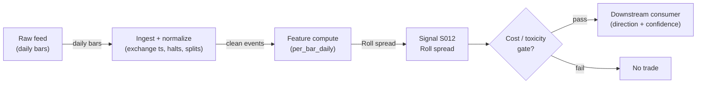

# S012 — Roll implied spread

Spread estimated from the negative autocovariance of price changes — trade-cost measurement from prices alone. Provenance **[D]**.

> Tag law: every numeric literal in prose carries one of `[documented]
> [default] [example] [unverified] [internal-est] [measured]` (legend: Appendix
> i v1.0.0). Constants inside cited formulas inherit the formula's tag
> (`[documented]` for cited literature). Bibliographic years, volumes, pages,
> arXiv IDs, section numbers, rule codes (C1–C11), fail-safe codes (F1–F5),
> module IDs, and machine-parsed §0 data fields are identifiers, not
> literals, and are exempt.

## §1 Five-minute reviewer card

| Row | Value |
|---|---|
| Module | S012 — Roll implied spread, v1.1.0 |
| Edge verdict | `PREDICTIVE-FEATURE-ONLY` — documented cost proxy (Roll 1984): feeds cost models and screens, never a directional trigger |
| After-cost | `BEFORE-COST` — a *cost-model input* [documented]: the Roll spread estimates round-trip cost from price dynamics alone — consumed by cost models and liquidity screens |
| Build cost | Tier L · `4–12` h [internal-est] · `$600–1,800` loaded [internal-est] |
| Data cost | Research `~$0`/mo [documented]: Stooq bulk daily archive `stooq.com/db/h/` (CSV, `~30`y history, `~12,000+` securities, split-adjusted per community notes) [documented]; Alpaca free tier `$0`/mo (IEX, `200` req/min, `6+`y history, 15-min delayed history) [documented]; Polygon.io Stocks Basic `$0`/mo (5 req/min, end-of-day only) [documented]. Production `~$29–199`/mo [documented] (Polygon Starter `~$29` / Developer `~$79–99` / Advanced `~$199` — bands move; verify at polygon.io/pricing before budgeting) |
| latency_class | daily / end-of-day |
| risk_class | low (signal-only; no order placement) |
| Capacity | `$10–100`M/day notional [example] — illustrative; calibrate per venue |
| Executability | Feasible: Python+polars; daily panel trivial per cost-model §2/§3 |
| Risk summary | Estimator risk: γ₁ ≥ 0 makes spread unidentified; documented `~40`% zero-estimate rate even on 1y daily samples [documented]; weekly/daily estimates diverge ~`6`× (Chang & Chang 1993) [documented]; thin names produce noise; dies on positive autocovariance |
| When it dies | γ₁ ≥ 0 persistent (S10.1); `<22` closes [default] (unidentified); thin names; regimes where order flow is serially correlated or spreads move intra-window (assumptions A1–A2 broken, §S3) |
| Regime gates | Provisional: R001 elevated RV amplifies (Roll spread rises — screen tightens); trending regimes break the estimator (γ₁ → +) |
| Emits | `signal_vector` (Appendix b v1.0.0) — never orders |

## §1.5 Cheapest / least-build path

1. **Prototype hour band:** `4–12` h [internal-est] — daily close series + autocovariance estimator + positivity guard + reference validation against the fixture
2. **Cheapest-source row:** min_tier = Stooq bulk archive (Tier 0, `$0`/mo) for research — daily CSVs at `stooq.com/db/h/`, columns `Date,Open,High,Low,Close,Volume`, `~30`y history for major instruments [documented]; Alpaca free tier `$0`/mo (IEX feed, `200` req/min, `6+`y historical, 15-min delayed history) [documented] as the no-key alternative; Polygon.io Stocks Basic `$0`/mo (5 req/min, end-of-day only) [documented] for API-shaped ingest; production: Polygon Starter `~$29`/mo → Advanced `~$199`/mo [documented, verify at polygon.io/pricing] — cheapest candidates; latency_class = SIP;
   required_fields = daily closes, `60–250` trading days [example]; price_band = `~$0–199`/mo [documented] (bands move — verify before budgeting); build_or_buy = ****build the estimator, buy (or pull free) the daily panel** (the estimator is `~30` lines [internal-est]; the value is the sample-size discipline, assumption checks, and positivity diagnostics)**.
3. **Resource budget:** `1` core, `<1` GB RAM; daily bars `3000` stocks × `10`y `~2–5` GB [internal-est]; compute pattern `per_bar`.
4. **Skip list:** intraday Roll variants; time-varying Roll-GARCH extensions; cross-venue Roll spreads
5. **DO-NOT-CUT list:** causality assertions (`assert fill_event >
   signal_event`, no-signal-bar-fills test); COST block + callable
   `expected_cost_bps`; F1–F5 fail-safes + module-state enum; decision-log
   audit records; bona-fide-intent + self-trade prevention; provenance tags on
   every numeric literal; fixtures + `test_cmd`; secrets via env only.
6. **Escalation gate:** positive autocovariance persists (`>50`% of windows [default]) → spread unidentified; live universe `>20` symbols [default]

## §S0 Module contract

### S0.1 Typed signature

```python
def signal(state: ModuleState, events: list[Event], cfg: Config) -> SignalVector:
```

`SignalVector` per Appendix b v1.0.0. `state` is the module-owned named state vector (`close_series`, `roll_series`, `module_state`); `events` are canonical Events (Appendix a v1.0.0), newest last. The function handles documented edge cases: empty events → `UNKNOWN`; crossed/locked quotes → `UNKNOWN` (F1, never interpolate); halt/auction events → freeze per the market-state table.

### S0.2 Config dataclass

| Parameter | Type | Default | Range | Status |
|---|---|---|---|---|
| `window_days` | int | `60` | `21`–`252` | default |
| `spread_high_bps` | float | `50.0` | `10`–`200` | default |
| `min_neg_share` | float | `0.5` | `0.3`–`0.8` | default |
| `cost_gate_k` | float | `0.5` | `0.1`–`2.0` | default |

All defaults tagged per the tag law (status `default` ⇒ `[default]`).

### S0.3 Canonical schema mapping

Vendor columns → canonical Event schema (Appendix a v1.0.0), stated once here:

| Vendor (Polygon.io Stocks Advanced) | Canonical |
|---|---|
| `date` | `bar open-time label (daily)` |
| `close` | `bar_c` |

Daily/intraday-bar vendors map `date`/`t` → bar open-time label; splits/dividends must be adjusted before use.

**Cheapest-vendor mappings** (reference implementations of the same canonical pair):

| Vendor (Tier) | Close column | Bar-time column | Adjustment note |
|---|---|---|---|
| Stooq bulk (Tier 0, `$0`) [documented] | `Close` (from `Date,Open,High,Low,Close,Volume`) [documented] | `Date` | bulk files are split-adjusted per community notes [unverified]; verify per file before estimation |
| Alpaca Data API v2 free (Tier 0, `$0`) [documented] | `c` | `t` (RFC-3339) [unverified] | raw (unadjusted) bars — adjust via corporate-actions endpoint before estimation |
| Polygon aggregates (Tier 1) [documented] | `c` [unverified] | `t` [unverified] | unadjusted — adjust before estimation |

### S0.4 Time contract

> Time contract: clock domain UTC, int64 ns; authoritative causality clock = `bar close (open-time labeled)`; max_skew = `1` s [default]; jitter budget = `250` ms [default]; bar-label = open time; staleness TTL = `3` days [default] (`3`× the daily reference cadence per F4); gap policy = mask, no interpolation; halt/auction → discard contributions across reopen.

**Timing box:** `signal@t (per_bar_daily, America/New_York) → earliest fill @open(t+1)`

### S0.5 Market-state table

| State | Module behavior |
|---|---|
| CONTINUOUS_TRADING | Compute normally; emit per cadence |
| HALTED | Freeze state; emit `UNKNOWN`; discard contributions across reopen |
| AUCTION | No new signals; hold last `SignalVector`; state `DEGRADED` |
| CLOSED | Emit nothing; state `OFF` |

### S0.6 Module-state enum + error taxonomy

States per Appendix k v1.0.0: `OK | DEGRADED | UNKNOWN | OFF`. Invalid input → `UNKNOWN`, never interpolate (Appendix f v1.0.0, F1–F5).

| Failure | State | Alert |
|---|---|---|
| Missing/stale input (TTL per §S0.4) | `UNKNOWN` | page |
| Crossed/locked quote reaching module | `UNKNOWN` | log |
| Feature out of mathematical bounds (F2) | `UNKNOWN` | page |
| Missing bars > `3` [default] | `DEGRADED` (restart windows) | log |
| Corporate action unadjusted in window | `UNKNOWN` | page |
| Halt/auction | `UNKNOWN` / `DEGRADED` (per table) | log |
| Kill/administrative disable | `OFF` | page |
| Anything unmapped | `UNKNOWN` | page |

### S0.7 Ops tail

- **Schedule:** once daily after `16:00` America/New_York close [documented]; owner: intraday-signals on-call.
- **Health checks:** fixture replay (`test_cmd`) green on deploy; live `bar-count` monitor; staleness watchdog at `3`× cadence [default].
- **Alert table:** page on `UNKNOWN` > `30` s [default] or bounds violation; notify on `DEGRADED`; log on single dropped events.
- **Resource budget:** `1` core, `<1` GB RAM; daily bars `3000` stocks × `10`y `~2–5` GB [internal-est]; state is O(window) per symbol.
- **Runbook stub:** `1.` confirm feed (Polygon status); `2.` replay fixture; `3.` if red → set `OFF`, page; `4.` reconcile decision log before re-arm.

### S0.8 Secrets (env-only)

`POLYGON_API_KEY` via environment only. No secrets in this file, fixtures, or logs (CI secrets-grep).

### S0.9 May / must-NOT

> **May:** emit `SignalVector` records per Appendix b v1.0.0. **Must-NOT:** emit orders, order intents, prices, share counts, or notionals; call a broker; mutate shared state outside `state`; interpolate across gaps.

## §S1 Legacy (subsumed by §1)

Legacy §S1 content is the §1 reviewer card above; this header is retained so section numbering stays frozen.

## §S2 Specification

### Universe

US common stocks with `60`+ days of daily closes [example]; names with persistent positive autocovariance excluded.

### Entry rule (Boolean — no prose-only conditions)

```
ENTER_LONG  := (roll_bps <= spread_high_bps) → cost screen PASSED (cost-model input, not a directional trigger)
ENTER_SHORT := (roll_bps <= spread_high_bps) → cost screen PASSED (cost-model input, not a directional trigger)
FLAT        := otherwise
```

The Roll spread is a *cost-model input*: it estimates round-trip cost from prices alone. It is never a directional trigger.

### Exits (with post-exit cooldown)

```
EXIT := (roll_bps > spread_high_bps) → downstream VETO on new entries; re-arm when roll_bps <= spread_high_bps for `20` days [default]
ON_EXIT: cooldown_until = now + cooldown_s   # 60 s [default]; C10
```

### Position sizing (fenced function)

```python
def size_shares(risk_budget_R, stop_distance, vol_estimate, ADV_cap, cost):
    # S-module requests capital fraction only; share math lives in the strategy.
    # Reference: capital = 0.5 * confidence  (confidence in [0,1])  [default]
    risk_notional = risk_budget_R * 0.5 * confidence          # [default] 0.5 factor
    shares = risk_notional / max(stop_distance, 1e-9)
    return int(min(shares, ADV_cap * adv_shares * 0.001))     # 0.1% ADV cap [default]
```

### Risk limits

| Limit | Value |
|---|---|
| Max capital fraction per signal | `0.5` [default] |
| Max adverse excursion before `UNKNOWN` review | `2.0`× stop [default] |
| Staleness kill | TTL per §S0.4 → `UNKNOWN` |

### COST block (single source of truth)

| Component | Value (bps) | Basis |
|---|---|---|
| Spread (half-spread, bar-close cross) | `0.50` | [example] — reference print |
| Fees (taker incl. regulatory) | `0.30` | taker take-liquidity fee `$0.0030`/share (NYSE Arca equities Tier 1, ≥`55`M ADV) [documented] ÷ `$100` [example] reference price × `10000` = `0.30` bps |
| Borrow | `0.0` | [default] — reference build long-biased; shorts add C7 locate cost |
| Impact | `0.0` | [example] — flagged; calibrate per venue at scale-up |
| **Total reference** | `0.80` | [example] |

`fee_schedule_as_of`: `2026-09-10` [documented] — NYSE Arca Schedule of Fees and Charges, equities Tier 1: `$0.0030`/share take-liquidity fee, `$0.0030`/share provide-liquidity credit (SEC filing text, verified 2026-09-10) [documented]; the venue/tier/`$100` reference price is a policy choice, not a claim about every book. `side: taker` [default]; venue/tier/source: XNAS / NYSE Arca Tier 1 / SEC-published schedule [documented]. Re-stating cost numbers outside this block is a validation failure.

```python
def expected_cost_bps(notional, adv_pct, venue, side, urgency) -> float:
    """Callable cost model — bar-signal reference stack (impact=0 flagged [example])."""
    spread_bps = 0.50   # [example] bar-close crossing assumption
    # fees: $0.0030/share take fee (NYSE Arca Tier 1) [documented] on the $100 [example] reference price
    fee_bps = 0.30      # 0.0030/100*10000 — rescale for your price tier; 0.30 [example] is the $100 reference
    borrow_bps = 0.0    # [default] long-biased reference; reason in table
    impact_bps = 0.0    # [example] flagged; calibrate per venue at scale-up
    if side == "maker":
        fee_bps = -0.30  # NYSE Arca Tier 1 provide credit $0.0030/share [documented], $100 [example] reference
    return spread_bps + fee_bps + borrow_bps + impact_bps
```

### Execution / fill model table

| Aspect | Assumption |
|---|---|
| Latency | Close → signal same evening [example]; fill at next open |
| Partial fills | N/A (signal-only; T-module policy: Appendix c v1.0.0) |
| Impact | `0.0` bps reference [example]; stress ×`2` [example] |
| Adverse fill | Open-auction slippage vs close [example] |

### Robustness

Lookback/winsorization choices must be validated out-of-sample; daily estimators are regime-sensitive and go stale — re-estimate on a rolling window [default].

### Compliance sub-block (C1–C10+)

| Code | Rule: trigger → check → action → log |
|---|---|
| C1 | Self-match prevention: signal module emits no orders; downstream T-modules must set self-trade-prevention flags — this module asserts the requirement in its `consumes` contract |
| C2 | Bona-fide intent: every emitted `SignalVector` with |direction|=`1` must pass the cost gate; sub-threshold prints emit direction `0`, never a tradeable hint |
| C3 | Message-rate: `<=100` emissions/symbol/s [default]; breach -> throttle to `1`/s [default] + alert |
| C4 | Fat-finger trio (applied by consumers; this module bounds its own outputs): confidence in [`0`,`1`], capital in [`0`,`0.5`], computed_at sane - out-of-bounds -> `UNKNOWN` (F2) |
| C5 | Decision log: every emission, veto, and state transition logged per Appendix g v1.0.0, hash-chained |
| C6 | Halt/auction: per the market-state table; contributions across reopen discarded |
| C7 | Locate check: SHORT direction requires `locate_ok` from the consumer; never emit SHORT without the consumer asserting locate (Reg-SHO threshold securities -> direction `0`) |
| C8 | Public dissemination: no signal values published externally without review gate |
| C9 | Data entitlements: per the Data rights row; entitlement-class change -> escalation gate |
| C10 | Post-exit cooldown: no re-entry for `cooldown_s` after any exit or compliance block |
| C11 | Corporate-action hygiene: total-return adjustment before estimation; unadjusted windows -> `UNKNOWN` |

### Parameter table

| Parameter | Symbol | Value | Tag | Sensitivity |
|---|---|---|---|---|
| Window | `window_days` | `60 days` | [default] | high — shorter windows are noisier (documented small-sample positivity problem, Harris 1990 [documented]); longer windows lag regime shifts; calibrate via the scan procedure below |
| Spread gate | `spread_high_bps` | `50 bps` | [default] | high — set from the cross-section of the venue: calibrate as the `75`th percentile [default] of per-name roll_bps over the calibration year, or a fixed policy cap |
| Min negative-cov share | `min_neg_share` | `0.5` | [default] | medium — below `0.5` admits identified-but-noisy names; above `0.8` [example] drops thin names wholesale; tune against the documented `~40`% zero-estimate rate [documented] |
| Cost-gate k | `cost_gate_k` | `0.5` | [default] | medium — `0.1` [example] is near-hard-block, `2.0` [example] near-permissive; per open item in the format proposal, pending calibration data |

### Calibration procedure (run before production, repeat quarterly [default])

1. **Clean the input.** Total-return-adjust every window (C11); drop unadjusted windows → `UNKNOWN`. Stooq bulk is split-adjusted per community notes [unverified]; Polygon/Alpaca raw bars are unadjusted — verify before estimation.
2. **Select the window.** On a `1`y calibration panel [default], compute roll_bps for `window_days ∈ {21, 42, 63, 126}` [example]: pick the smallest window whose fraction of γ₁ `<` `0` ≥ `min_neg_share` [default] **and** whose cross-sectional estimate standard deviation is stable (|Δσ| `<` `20`% [default] vs the next-larger window). If none qualify, the universe is unidentified at these windows — widen or drop names.
3. **Dampen outliers.** Winsorize Δp at ±`3`σ [default] within the window before computing γ₁; report the raw vs winsorized spread gap as an aux diagnostic (gap `>` `25`% [default] → flag DEGRADED).
4. **Convert to bps.** Divisor = trailing close `p_T` [documented practice]: `roll_bps = ŝ / p_T × 10000`. Never divide by a forward or average price (leaks/tilts).
5. **Truncate, never fabricate.** If γ₁ ≥ `0` → spread unidentified: emit `aux.roll_bps = None`, state `DEGRADED` (probe with longer window next bar) — never report `0` [documented]. Documented base rate: Roll produces zero/nonpositive estimates `~40`% of the time even with `1`y of daily data [documented] — a high rate is expected, not a bug.
6. **Re-estimate rolling** [default]: refit every bar; never freeze an estimate across a regime break (R001).
7. **Walk-forward check.** Validate on an embargoed out-of-sample year: the γ₁ `<` `0` share and estimate distribution must hold within `±25`% [default] of the calibration panel; otherwise shrink `window_days` choice and re-run.

### Timing box

`signal@t (per_bar_daily, America/New_York) → earliest fill @open(t+1)`

## §S3 Math + normative pseudocode

With $\Delta p_t = p_t - p_{t-1}$ and sample autocovariance $\gamma_1 = \widehat{\mathrm{Cov}}(\Delta p_t, \Delta p_{t-1})$:
$$\hat s = 2\sqrt{\max(-\gamma_1,\,0)}.$$
The fixture uses the closed form with $\gamma_1 = -0.0007833$ (fixture-computed — *example*), giving $\hat s \approx 0.056$ (`5.6` cents on a `$100` stock = `5.6` bps — *example*). Positivity guard: if $\gamma_1 \ge 0$, the spread is **unidentified** (`UNKNOWN`, not zero) [documented]. **Causal timing:** trailing window only [documented].

### Identification assumptions (all four must hold — Roll 1984 derivation) [documented]

| # | Assumption | Breaks when | Field check |
|---|---|---|---|
| A1 | Successive trade types independent: $E[q_t q_{t-1}] = 0$ | order flow is serially correlated (feedback trading, herding, program trades) | estimate understates/overstates; Chang & Chang (1993) generalization admits serially correlated order arrival [documented] |
| A2 | Half-spread $s$ constant within the window | intraday/time-varying spreads; spread regime shifts mid-window | widen/mid-window breaks → split the window or move to a time-varying extension (§S12) |
| A3 | Order flow carries no information about future fundamental changes: $E[\Delta q_{t-1}\,\varepsilon_t] = 0$ | adverse selection — informed flow predicts fundamentals | estimate is contaminated; consider Glosten–Harris (1988) decomposition [documented] |
| A4 | Fundamental-value changes do not predict order flow: $E[\Delta q_t\,\varepsilon_{t-1}] = 0$ | momentum/feedback from returns into flow | positive γ₁ persists — the classic estimator-death signal |

### Small-sample discipline (Harris 1990) [documented]

Sampling noise produces positive covariances (imaginary spreads) even under the null: Harris (1990) finds noise explains positive estimates in annual samples of daily/weekly returns [documented]. The Roll estimator has a small-sample downward bias; the French–Roll (1986) adjusted-variance estimator is unbiased but noisy [documented]. Consequences pinned into this module: hard floor of `22` closes [default], the calibration scan (§S2), and the documented `~40`% zero-estimate rate even with `1`y of daily data [documented] — names that cannot be identified are *dropped or masked*, never assigned `0`.

**Normative pseudocode** (pseudocode is normative; prose is commentary):

```
function signal(state, events, cfg) -> SignalVector:
    assert events non-empty else return UNKNOWN                    # F1
    closes = daily_closes(events, cfg.window_days)
    assert len(closes) >= 22 else return FLAT(DEGRADED)            # [default]
    dp = diffs(closes)
    dp = winsorize(dp, 3.0)                                       # ±3σ [default]; aux logs raw-vs-winsorized gap
    g1 = cov(dp[1:], dp[:-1])                                     # lag-1 autocovariance
    if g1 >= 0: return FLAT(DEGRADED, aux={"roll_bps": None})     # unidentified, not zero [documented]
    s = 2*sqrt(-g1)
    bps = s / closes[-1] * 10000                                 # trailing close divisor [documented practice]
    assert s > 0 else return UNKNOWN                               # F2
    # normative cost-gate predicate (executable): modeled cost must be covered by the edge
    edge_bps = consumer_edge_bps(state, cfg)                      # downstream-supplied expected edge; None if unavailable
    cost_ok = (edge_bps is not None
               and expected_cost_bps(notional, adv_pct, venue, side, urgency)
                   <= cfg.cost_gate_k * edge_bps)
    screen_pass = (bps <= cfg.spread_high_bps) and cost_ok         # Roll is a cost SCREEN: both gates must pass
    sig = SignalVector(symbol, direction=0, confidence=1.0, capital=0.0,
                       computed_at=events[-1].event_ts, staleness=now()-events[-1].asof_ts,
                       module_state=state.module_state,
                       aux={"roll_bps": bps, "gamma_1": g1, "screen_pass": screen_pass,
                            "cost_gate_inputs": (notional, adv_pct, venue, side, urgency)})
    log_decision(sig, inputs_hash, params_hash)                    # C5 / Appendix g
    assert fill_event > signal_event  # t→t+1 causality: trailing window only
    return sig
```

Causality: trailing-window estimator; the spread at `T` describes past price dynamics — tradable no earlier than `T+1`. Mandatory unit test: no-signal-bar fills.

## §S4 Worked example (fixture-backed)

- Tape: `modules/fixtures/S012_tape.csv` — `# TYPE: validation-run`; `7` closes (`100.00 → 100.06`) with alternating-signed changes giving `γ₁ = −0.0007833`, all numbers synthetic, seed `20260912` [example].
- Expected outputs: `modules/fixtures/S012_expected.csv`; per-day `Δp`; `γ₁ = −0.0007833`; `ŝ ≈ 0.056` (`5.6` bps on `$100`); hand-checked below.
- Tolerance: fixture recompute `TOL = 1e-4` relative [default] (CSV carries `4`-decimal `Δp`); Roll spread `±0.005` absolute on `ŝ`, `±0.5` bps [default] (estimation band, not arithmetic error); integer contributions exact.
- Acceptance tests (`modules/tests/test_S012.py`, `8` tests): `1.` fixture recomputes to expected; `2.` stub emits valid `SignalVector` (direction in {+1,-1,0}, confidence/capital in [0,1]); `3.` no-signal-bar fills (`fill_event_ts > computed_at`); `4.` cost-gate predicate passes on large edge, blocks on tiny edge (`k = 0.5` [default]); `5.` invalid input -> `UNKNOWN`; `6.` extra: Roll spread recomputes to the `0.056` band from fixture `Δp`; `7.` γ₁ ≥ `0` series → spread unidentified (`None`, never `0`); `8.` screen gate: `bps <= spread_high_bps` passes, excess `bps` vetoes.
- `test_cmd`: `python -m pytest modules/tests/test_S012.py -q` → exits `0`.

**Hand-checked rows** (arithmetic verified by hand against the fixture):

- Δp series: `0.05, −0.03, 0.04, −0.02, 0.03, −0.01` — alternating signs → negative autocovariance ✓
- `γ₁ = −0.0007833` (fixture-computed) ✓
- `ŝ = 2×√0.0007833 = 2×0.02799 ≈ 0.056` ✓
- `5.6` bps on `$100`: `0.056/100×10000 = 5.6` ✓

**Where the example is optimistic:** no fees, no latency, no hidden liquidity — arithmetic illustration, not a backtest.

## §S5 Strategies that use this signal

Generated from `deps.yaml` (CI symmetry). Provisional consumer list (roles pinned at ingest):

| Strategy | Role |
|---|---|
| T-series execution consumers (see `deps.yaml`) | Downstream consumer of this signal family's direction/confidence outputs; exact strategy IDs pinned at ingest |

The Roll spread is consumed as a cost-model input and liquidity screen; consumer roles pinned in `deps.yaml`.

## §S6 Data required

| Field | Type | Granularity | Source tier | Notes |
|---|---|---|---|---|
| Daily OHLCV | float / int | daily bars | Tier 0/1 | total-return adjusted for estimation |
| Corporate actions | reference | daily | Tier 0/1 | unadjusted windows rejected |

**Data rights row** (Appendix j v1.0.0): US equities daily bars via Stooq/Alpaca (Tier 0, redistribution-limited) or Polygon.io, `rights: licensed-or-public`; fixtures are synthetic; no display use. Entitlement-class change → §1.5 escalation gate.

## §S7 Local build (M5 Max / 128 GB)

Feasible. Daily bars `3000` stocks × `10`y `~2–5` GB (cost-model §3) — fits comfortably; pandas/polars ample. Bottleneck is estimator identification (PIN-style likelihoods), not data volume.

## §S8 Buy vs build

Build the estimator, buy (or pull free) the daily panel. Verdict: daily estimators are textbook math [documented]; the value is identification discipline and regime awareness. Tier 0 daily bars suffice (cost-model §6).

## §S9 Efficacy — documented evidence

| Study / source | Market & period | Metric | Before/after cost | Caveat |
|---|---|---|---|---|
| Roll (1984) [documented] | theoretical market microstructure | implied spread from serial covariance of price changes | `BEFORE-COST` | estimator, not a rule |
| Hasbrouck (2009) [documented] | US equities 1926–2006 (asset-pricing panel); validation vs transaction-level costs | Gibbs estimator of the Roll model on daily closes: correlation `0.965` [documented] with the transaction-level effective-cost estimate in the validation sample | `BEFORE-COST` | the `0.965` is for Hasbrouck's Gibbs/Bayesian variant, not the raw moment estimator — use as an upper reference, not a Roll claim |
| Chang & Chang (1993) [documented] | extends Roll; daily vs weekly samples | weekly-implied spread `1.74`% vs daily-implied `0.298`% — `~6`× differential [documented]; many imaginary spreads from positive covariances | `BEFORE-COST` | measurement-interval instability violates Roll's interval-independence prediction; estimator, not a rule |
| Bleaney & Li (2015) [documented] | simulation experiments across sampling frequencies | best estimates come from the highest frequency available; at daily frequency the Corwin–Schultz high–low estimator is usually less inaccurate than Roll [documented]; in small samples the standard deviation dominates estimation error | `BEFORE-COST` | simulation evidence; thin/small-cap names are exactly the small-sample regime |
| Ardia–Guidotti–Kroencke (EDGE WP) [documented] | simulations: constant spread `1`%, ~`39` trades/day, `1`y daily window | Roll produces zero (nonpositive) estimates `~40`% of the time even with one year of daily data [documented] | `BEFORE-COST` | zeros must be masked, not interpreted as zero cost |

Selection disclosure: the `2` chapter papers from the original research pass plus `4` documented extensions found in this review pass (Chang&Chang 1993, Bleaney&Li 2015, EDGE WP, Garcin 2024); GARCH/time-varying extensions kept in §S12 leads [unverified].

## §S10 Failure modes & pitfalls

| # | Trigger → Detect → Action → Recovery | check: |
|---|---|---|
| 1 | Positive autocovariance: γ₁ ≥ 0 makes the spread unidentified → detect: g1 >= 0 → action: `DEGRADED`/`UNKNOWN`, never report 0 → recovery: longer window or drop the name | `check: gamma_1 < 0` |
| 2 | Lookahead leakage: bar-close feature traded intra-bar → detect: causality audit flags `fill_event <= signal_event` → action: halt, fix bar finalization → recovery: re-run no-signal-bar-fills test | `check: all(fill_ts > computed_at)` |
| 3 | Staleness/latency: feed timestamps in a race → detect: jitter > budget → action: `DEGRADED`, label simulated-only → recovery: direct feed or stand down | `check: asof_ts - event_ts <= jitter_budget` |
| 4 | Stale bars: corporate actions or halts corrupt the window → detect: adjustment/ halt flags → action: `UNKNOWN`, mask bars → recovery: backfill and replay | `check: no unadjusted bars in window` |
| 5 | Cost blowup: spread+fees+impact on the round trip → detect: cost gate failing on `[measured]` costs → action: widen `k` gate or stand down → recovery: re-pin fee schedule | `check: expected_cost_bps(...) <= k * edge_bps` |
| 6 | Regime breaks: depth/volatility regime shifts → detect: feature distribution break → action: veto entries → recovery: resume when stable for `5` min [default] | `check: feature_z_within_3_sigma [default]` |
| 7 | Overfitting: parameters mined on `1` period → detect: OOS decay → action: purged/embargoed re-validation → recovery: shrink per-symbol | `check: oos_sharpe > 0.5 * is_sharpe [default]` |
| 8 | Data errors: bad ticks, splits, halts → detect: bounds/`seq`-gap monitors → action: `UNKNOWN`, mask bars → recovery: backfill and replay | `check: no crossed quotes in window` |
| 9 | Assumption break A1/A3 (Roll identification): serially correlated order flow or adverse selection → detect: autocovariance of signed order flow ≠ 0 [example diagnostic], or persistent γ₁ ≥ 0 in names with no halt/dividend explanation → action: mark estimate contaminated (`DEGRADED`), fall back to Gibbs/quoted spreads → recovery: Chang & Chang (1993) serial-dependence extension [documented] or a Stoll (1989) decomposition [documented] | `check: roll_assumptions_pass(quants)` |
| 10 | Spread nonstationarity within window (A2 break): spread regime shifts mid-window → detect: rolling-window estimate dispersion > `50`% of pooled estimate [default]; weekly/daily estimates diverge by multiples (documented `~6`× case, Chang & Chang 1993 [documented]) → action: split the window, shorten `window_days`, or switch to a time-varying extension (§S12) → recovery: re-estimate on regime-homogeneous windows | `check: rolling_dispersion <= 0.5 * pooled_estimate [default]` |

### Regime-gate machine records (provisional)

| regime_id | direction | mechanism | condition | action | min_lag | unknown_behavior |
|---|---|---|---|---|---|---|
| R001 | amplifies | elevated realized volatility widens quoted spreads and deepens adverse selection, so the Roll estimate rises mechanically | RV > `2`× trailing median [example] | widen_stops | `1` session [example] | hold last label |
| R002 | degrades | quote flicker / spoofing regimes inject noise into book features | fleeting-quote share > `0.3` [example] | halve | `30` min [example] | veto entries |
| R003 | degrades | halt/auction regimes break continuity assumptions | market_state != CONTINUOUS_TRADING | pause_entry | `0` | veto entries |
| R_TREND | degrades | trending (momentum) regimes inject positive serial correlation into Δp, violating A1 and pushing γ₁ ≥ 0 — the classic estimator-death mode; documented `6`× weekly/daily divergence [documented] | trailing `21`-day [default] autocorrelation of Δp > `0.1` [example] | pause_entry | `1` session [example] | hold last label |
| R_CALM | degrades | ultra-calm regimes shrink true spread below the estimator's noise floor → documented `~40`% zero-estimate rate [documented] | realized vol < `0.5`× trailing median [example] | halve | `1` session [example] | hold last label |

## §S11 Visuals

`../../images/S012_example.png` — synthetic `7`-close Roll panel (seed `20260912` [example]): closes, Δp, ŝ.



## §S12 Source log + unverified leads

**Sources** (citable facts only):

1. Roll, R. (1984) [documented]. "A Simple Implicit Measure of the Effective Bid-Ask Spread in an Efficient Market." *Journal of Finance* 39(4), 1011–1024. https://doi.org/10.1111/j.1540-6261.1984.tb04915.x
2. Hasbrouck, J. (2009) [documented]. "Trading Costs and Returns for U.S. Equities: Estimating Effective Costs from Daily Data." *Journal of Finance* 64(3), 1445–1477.
3. Chang, C. W. & Chang, J. S. K. (1993) [documented]. "An Implicit Measure of the Effective Bid-Ask Spread: A Note." *Journal of Financial Research* 16(1) — weekly-implied `1.74`% vs daily-implied `0.298`% (`~6`×) [documented]; generalization precludes imaginary spreads by admitting serially correlated order arrival.
4. Bleaney, M. & Li, Z. (2015) [documented]. "The performance of bid-ask spread estimators under less than ideal conditions." *Studies in Economics and Finance* 32(1), 98–127 — simulation evidence; Corwin–Schultz usually less inaccurate than Roll at daily frequency; small samples: standard deviation dominates estimation error.
5. Ardia, D., Guidotti, E. & Kroencke, T. (INSEAD WP) [documented]. "Efficient Estimation of Bid-Ask Spreads from Open, High, Low, and Close Prices" (SSRN 3892335) — generalizes Roll as a discrete-trading special case; Roll zero/nonpositive rate `~40`% even on `1`y daily windows [documented].
6. Garcin, M. (2024) [documented]. "Estimation of bid-ask spreads in the presence of serial dependence." arXiv:2407.17401 — moment-based estimators under serially dependent mid-prices/microstructure noise; benchmarked against Roll.
7. NYSE Arca fee schedule [documented]: equities Tier 1 — `$0.0030`/share take-liquidity fee, `$0.0030`/share provide-liquidity credit (SEC filing text, verified 2026-09-10). Anchors the reference `0.30` bps fee line on a `$100` [example] share.
8. Vendor pricing [documented]: Stooq bulk daily archive `stooq.com/db/h/` (CSV, `Date,Open,High,Low,Close,Volume`, `~30`y history, `12,000+` securities); Alpaca Data API v2 Free `$0`/mo (IEX feed, `200` req/min, `6+`y history, 15-min delayed history); Polygon.io plans (Free/Stocks Basic `$0` — 5 req/min, end-of-day only; Starter `~$29`/mo; Developer `~$79–99`/mo; Advanced `~$199`/mo — verify at polygon.io/pricing).

**Chatbot source log.** Chatbot answers pending (checked 2026-09-10) — grok-answers.md and cursor-answers.md were absent from batches/SB1/.

**Unverified leads** (never in evidence tables):

- Time-varying Roll-GARCH extensions circulate in practitioner notes; no checkable specification found — treated as unverified.
- Stooq bulk archives described as split-adjusted in community notes [unverified] — verify per file before estimation; corporate-action hygiene (C11) still applies.
- Documented-citation-but-unverified-in-this-pass leads (real papers, not verified against primary text here — do not promote to evidence without primary verification): George, Kaul & Nimalendran (1991) quote-based serial-covariance measure; Choi, Salandro & Shastri (1988) serial-dependence modification of Roll; Stoll (1989) spread decomposition; Hasbrouck's (2009) Gibbs SAS code (available via Hasbrouck's NYU site); Harris (1990) small-sample properties of the Roll estimator; French & Roll (1986) adjusted-variance estimator; Corwin & Schultz (2012) high–low spread estimator; IFS CeMMAP CWP 12/16 nonparametric Roll-model estimators.

---

## Appendix — AI build prompt (S012)

Copy-paste into any chat agent:

> Build module **S012 — Roll implied spread** per
> `notes/module-template.md` v1.0.0 and this file's §S0 contract.
> Cheapest path (§1.5): prototype 4–12 h [internal-est]; cheapest data
> candidate Stooq bulk (Tier 0, `$0`/mo) [documented], Alpaca free tier
> (`$0`/mo, IEX, `200` req/min, `6+`y history) [documented], or Polygon.io
> Stocks Basic (`$0`/mo, end-of-day only) [documented]; production Polygon
> Starter `~$29`/mo → Advanced `~$199`/mo [documented, verify pricing];
> compute pattern `per_bar`; skip intraday-variants/GARCH.
> Implement `signal(state, events, cfg) -> SignalVector` (Appendix b v1.0.0)
> with the §S3 normative pseudocode, including the executable cost-gate
> predicate `expected_cost_bps(...) <= k * edge_bps`, the A1–A4
> identification assumptions, `±3`σ [default] winsorization of Δp, and
> `assert fill_event > signal_event`. Wire F1–F5 (Appendix f v1.0.0): invalid
> input -> `UNKNOWN`, γ₁ ≥ `0` -> unidentified (`roll_bps = None`, never `0`),
> never interpolate. Calibrate per the §S2 procedure (window scan
> `21/42/63/126` [example], neg-cov share ≥ `min_neg_share`, trailing-close
> divisor). Log decisions per Appendix g v1.0.0. Secrets via env
> only. Run the fixture `modules/fixtures/S012_tape.csv`
> (`# TYPE: validation-run`) against `modules/fixtures/S012_expected.csv`
> (fixture recompute `TOL = 1e-4` relative [default]; Roll spread `±0.005`
> absolute, `±0.5` bps band [default]).
> **Definition of done:** `python3 -m pytest modules/tests/test_S012.py -q`
> exits `0`. Tag every numeric literal you add with the unified enum
> (Appendix i v1.0.0); put anything unverifiable in §S12 unverified leads.
