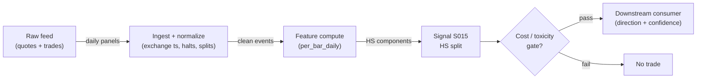

# S015 — Huang-Stoll spread components

Three-way split of the spread into order-processing, inventory, and adverse-selection costs. Provenance **[D]**.

> Tag law: every numeric literal in prose carries one of `[documented]
> [default] [example] [unverified] [internal-est] [measured]` (legend: Appendix
> i v1.0.0). Constants inside cited formulas inherit the formula's tag
> (`[documented]` for cited literature). Bibliographic years, volumes, pages,
> arXiv IDs, section numbers, rule codes (C1–C11), fail-safe codes (F1–F5),
> module IDs, and machine-parsed §0 data fields are identifiers, not
> literals, and are exempt.

## §1 Five-minute reviewer card

| Row | Value |
|---|---|
| Module | S015 — Huang-Stoll spread components, v1.0.0 |
| Edge verdict | `PREDICTIVE-FEATURE-ONLY` — documented structural decomposition (Huang-Stoll 1997): TCA/design input, never a directional trigger |
| After-cost | `BEFORE-COST` — a *structural TCA input* [documented]: it attributes spread revenue to its economic sources - consumed by market-making design and cost models |
| Build cost | Tier L · `4–12` h [internal-est] · `$600–1,800` loaded [internal-est] |
| Data cost | Research `~$0–30`/mo (Tier 0/1 bars) [unverified]; production `~$30–200`/mo [unverified] — bands indicative, verify before budgeting |
| latency_class | daily / end-of-day |
| risk_class | low (signal-only; no order placement) |
| Capacity | `$10–100`M/day notional [example] — illustrative; calibrate per venue |
| Executability | Feasible: Python+polars; daily panel trivial per cost-model §2/§3 |
| Risk summary | Attribution risk: misidentified shares misprice market-making; dies on share drift and thin panels |
| When it dies | Share drift `>0.2` [default] (S10.1); `<21` days [default] (unidentified); adverse-selection share `>0.6` [default] (uneconomic) |
| Regime gates | Provisional: R001 elevated RV amplifies (adverse-selection share rises - gate tightens) |
| Emits | `signal_vector` (Appendix b v1.0.0) — never orders |

## §1.5 Cheapest / least-build path

1. **Prototype hour band:** `4–12` h [internal-est] — quote + trade tape + signed prints (S007) + three-way decomposer + reference validation against the fixture
2. **Cheapest-source row:** min_tier = Alpaca IEX / Stooq (Tier 0) for research; Polygon.io Stocks Advanced for production — cheapest candidates [internal-est]; latency_class = SIP;
   required_fields = bid/ask quotes with timestamps; S007-signed trade price + size; daily panels for estimation; price_band = `~$0–200`/mo [unverified] (indicative — verify before budgeting); build_or_buy = ****build the decomposer, buy the quote feed** (the three-way split is `~80` lines [internal-est]; the value is the identification discipline)**.
3. **Resource budget:** `1` core, `<1` GB RAM; daily bars `3000` stocks × `10`y `~2–5` GB [internal-est]; compute pattern `per_bar`.
4. **Skip list:** intraday HS variants; multi-venue attribution; dealer-vs-auction comparisons
5. **DO-NOT-CUT list:** causality assertions (`assert fill_event >
   signal_event`, no-signal-bar-fills test); COST block + callable
   `expected_cost_bps`; F1–F5 fail-safes + module-state enum; decision-log
   audit records; bona-fide-intent + self-trade prevention; provenance tags on
   every numeric literal; fixtures + `test_cmd`; secrets via env only.
6. **Escalation gate:** adverse-selection share `>60`% persistent [default] -> market-making uneconomic; live universe `>20` symbols [default]

## §S0 Module contract

### S0.1 Typed signature

```python
def signal(state: ModuleState, events: list[Event], cfg: Config) -> SignalVector:
```

`SignalVector` per Appendix b v1.0.0. `state` is the module-owned named state vector (`quote_cache`, `comp_window`, `module_state`); `events` are canonical Events (Appendix a v1.0.0), newest last. The function handles documented edge cases: empty events → `UNKNOWN`; crossed/locked quotes → `UNKNOWN` (F1, never interpolate); halt/auction events → freeze per the market-state table.

### S0.2 Config dataclass

| Parameter | Type | Default | Range | Status |
|---|---|---|---|---|
| `window_days` | int | `60` | ``21`-`252`` | default |
| `adv_share_high` | float | `0.6` | ``0.4`-`0.8`` | default |
| `cost_gate_k` | float | `0.5` | ``0.1`-`2.0`` | default |

All defaults tagged per the tag law (status `default` ⇒ `[default]`).

### S0.3 Canonical schema mapping

Vendor columns → canonical Event schema (Appendix a v1.0.0), stated once here:

| Vendor (Polygon.io Stocks Advanced) | Canonical |
|---|---|
| `ts_event` | `event_ts (int64 ns UTC)` |
| `bid / ask` | `bid_px / ask_px` |
| `price / size / sign` | `trade_px / trade_sz / d_i (S007)` |

Daily/intraday-bar vendors map `date`/`t` → bar open-time label; splits/dividends must be adjusted before use.

### S0.4 Time contract

> Time contract: clock domain UTC, int64 ns; authoritative causality clock = `bar close (open-time labeled)`; max_skew = `1` s [default]; jitter budget = `250` ms [default]; bar-label = open time; staleness TTL = `3` days [default] (`3`× the daily reference cadence per F4); gap policy = mask, no interpolation; halt/auction → discard contributions across reopen.

**Timing box:** `signal@t (per_bar_daily, America/New_York) → earliest fill @open(t+1)`

### S0.5 Market-state table

| State | Module behavior |
|---|---|
| CONTINUOUS_TRADING | Compute normally; emit per cadence |
| HALTED | Freeze state; emit `UNKNOWN`; discard contributions across reopen |
| AUCTION | No new signals; hold last `SignalVector`; state `DEGRADED` |
| CLOSED | Emit nothing; state `OFF` |

### S0.6 Module-state enum + error taxonomy

States per Appendix k v1.0.0: `OK | DEGRADED | UNKNOWN | OFF`. Invalid input → `UNKNOWN`, never interpolate (Appendix f v1.0.0, F1–F5).

| Failure | State | Alert |
|---|---|---|
| Missing/stale input (TTL per §S0.4) | `UNKNOWN` | page |
| Crossed/locked quote reaching module | `UNKNOWN` | log |
| Feature out of mathematical bounds (F2) | `UNKNOWN` | page |
| Missing bars > `3` [default] | `DEGRADED` (restart windows) | log |
| Corporate action unadjusted in window | `UNKNOWN` | page |
| Halt/auction | `UNKNOWN` / `DEGRADED` (per table) | log |
| Kill/administrative disable | `OFF` | page |
| Anything unmapped | `UNKNOWN` | page |

### S0.7 Ops tail

- **Schedule:** once daily after `16:00` America/New_York close [documented]; owner: intraday-signals on-call.
- **Health checks:** fixture replay (`test_cmd`) green on deploy; live `bar-count` monitor; staleness watchdog at `3`× cadence [default].
- **Alert table:** page on `UNKNOWN` > `30` s [default] or bounds violation; notify on `DEGRADED`; log on single dropped events.
- **Resource budget:** `1` core, `<1` GB RAM; daily bars `3000` stocks × `10`y `~2–5` GB [internal-est]; state is O(window) per symbol.
- **Runbook stub:** `1.` confirm feed (Polygon status); `2.` replay fixture; `3.` if red → set `OFF`, page; `4.` reconcile decision log before re-arm.

### S0.8 Secrets (env-only)

`POLYGON_API_KEY` via environment only. No secrets in this file, fixtures, or logs (CI secrets-grep).

### S0.9 May / must-NOT

> **May:** emit `SignalVector` records per Appendix b v1.0.0. **Must-NOT:** emit orders, order intents, prices, share counts, or notionals; call a broker; mutate shared state outside `state`; interpolate across gaps.

## §S1 Legacy (subsumed by §1)

Legacy §S1 content is the §1 reviewer card above; this header is retained so section numbering stays frozen.

## §S2 Specification

### Universe

US common stocks with quote + trade feeds; dealer-relevant names.

### Entry rule (Boolean — no prose-only conditions)

```
ENTER_LONG  := (adv_share <= adv_share_high) -> adverse-selection screen PASSED (TCA input, not a directional trigger)
ENTER_SHORT := (adv_share <= adv_share_high) -> adverse-selection screen PASSED (TCA input, not a directional trigger)
FLAT        := otherwise
```

The three-way split is a *structural TCA input*: it attributes spread revenue. It is never a directional trigger.

### Exits (with post-exit cooldown)

```
EXIT := (adv_share > adv_share_high) -> market-making VETO; re-arm when adv_share <= adv_share_high for `20` days [default]
ON_EXIT: cooldown_until = now + cooldown_s   # 60 s [default]; C10
```

### Position sizing (fenced function)

```python
def size_shares(risk_budget_R, stop_distance, vol_estimate, ADV_cap, cost):
    # S-module requests capital fraction only; share math lives in the strategy.
    # Reference: capital = 0.5 * confidence  (confidence in [0,1])  [default]
    risk_notional = risk_budget_R * 0.5 * confidence          # [default] 0.5 factor
    shares = risk_notional / max(stop_distance, 1e-9)
    return int(min(shares, ADV_cap * adv_shares * 0.001))     # 0.1% ADV cap [default]
```

### Risk limits

| Limit | Value |
|---|---|
| Max capital fraction per signal | `0.5` [default] |
| Max adverse excursion before `UNKNOWN` review | `2.0`× stop [default] |
| Staleness kill | TTL per §S0.4 → `UNKNOWN` |

### COST block (single source of truth)

| Component | Value (bps) | Basis |
|---|---|---|
| Spread (half-spread, bar-close cross) | `0.50` | [example] — reference print |
| Fees (taker incl. regulatory) | `0.30` | [example] — reference print |
| Borrow | `0.0` | [default] — reference build long-biased; shorts add C7 locate cost |
| Impact | `0.0` | [example] — flagged; calibrate per venue at scale-up |
| **Total reference** | `0.80` | [example] |

`fee_schedule_as_of`: `2026-09-01` [unverified] — placeholder; pin the real venue schedule before production. `side: taker` [default]; venue/tier/source: XNAS / SIP bars [example]. Re-stating cost numbers outside this block is a validation failure.

```python
def expected_cost_bps(notional, adv_pct, venue, side, urgency) -> float:
    """Callable cost model — bar-signal reference stack (impact=0 flagged [example])."""
    spread_bps = 0.50   # [example] bar-close crossing assumption
    fee_bps = 0.30      # [example]
    borrow_bps = 0.0    # [default] long-biased reference; reason in table
    impact_bps = 0.0    # [example] flagged; calibrate per venue at scale-up
    if side == "maker":
        fee_bps = -0.20  # rebate [example]
    return spread_bps + fee_bps + borrow_bps + impact_bps
```

### Execution / fill model table

| Aspect | Assumption |
|---|---|
| Latency | Close → signal same evening [example]; fill at next open |
| Partial fills | N/A (signal-only; T-module policy: Appendix c v1.0.0) |
| Impact | `0.0` bps reference [example]; stress ×`2` [example] |
| Adverse fill | Open-auction slippage vs close [example] |

### Robustness

Lookback/winsorization choices must be validated out-of-sample; daily estimators are regime-sensitive and go stale — re-estimate on a rolling window [default].

### Compliance sub-block (C1–C10+)

| Code | Rule: trigger → check → action → log |
|---|---|
| C1 | Self-match prevention: signal module emits no orders; downstream T-modules must set self-trade-prevention flags — this module asserts the requirement in its `consumes` contract |
| C2 | Bona-fide intent: every emitted `SignalVector` with |direction|=`1` must pass the cost gate; sub-threshold prints emit direction `0`, never a tradeable hint |
| C3 | Message-rate: `<=100` emissions/symbol/s [default]; breach -> throttle to `1`/s [default] + alert |
| C4 | Fat-finger trio (applied by consumers; this module bounds its own outputs): confidence in [`0`,`1`], capital in [`0`,`0.5`], computed_at sane - out-of-bounds -> `UNKNOWN` (F2) |
| C5 | Decision log: every emission, veto, and state transition logged per Appendix g v1.0.0, hash-chained |
| C6 | Halt/auction: per the market-state table; contributions across reopen discarded |
| C7 | Locate check: SHORT direction requires `locate_ok` from the consumer; never emit SHORT without the consumer asserting locate (Reg-SHO threshold securities -> direction `0`) |
| C8 | Public dissemination: no signal values published externally without review gate |
| C9 | Data entitlements: per the Data rights row; entitlement-class change -> escalation gate |
| C10 | Post-exit cooldown: no re-entry for `cooldown_s` after any exit or compliance block |
| C11 | Corporate-action hygiene: total-return adjustment before estimation; unadjusted windows -> `UNKNOWN` |

### Parameter table

| Parameter | Symbol | Value | Tag | Sensitivity |
|---|---|---|---|---|
| Window | `window_days` | `60 days` | [default] | high |
| Adverse-selection share gate | `adv_share_high` | `0.6` | [default] | high |
| Cost-gate k | `cost_gate_k` | `0.5` | [default] | medium |

### Timing box

`signal@t (per_bar_daily, America/New_York) → earliest fill @open(t+1)`

## §S3 Math + normative pseudocode

Huang-Stoll (1997) three-way decomposition of the traded spread $S$:
$$S = \underbrace{\text{order processing}}_{1-\alpha-\beta} + \underbrace{\text{inventory}}_{\beta} + \underbrace{\text{adverse selection}}_{\alpha},$$
$\alpha$ = adverse-selection share, $\beta$ = inventory share, estimated from the joint dynamics of quotes and signed trades [documented]. Fixture (illustrative shares - *example*): `S = 0.02`, `alpha = 0.35`, `beta = 0.25` -> order-processing `0.008`, inventory `0.005`, adverse selection `0.007`. The split is an *attribution*, not a forecast: it describes where spread revenue went [documented].

**Normative pseudocode** (pseudocode is normative; prose is commentary):

```
function signal(state, events, cfg) -> SignalVector:
    assert events non-empty else return UNKNOWN                    # F1
    panel = signed_quote_trade_panel(events, cfg.window_days)     # S007-signed
    assert len(panel) >= 21 else return FLAT(DEGRADED)             # [default]
    (op, inv, adv) = huang_stoll_threeway(panel)                  # shares sum to 1
    assert abs(op + inv + adv - 1.0) < 1e-6 else return UNKNOWN    # F2
    edge_bps = 0.0                                                 # [example] TCA input only
    # normative cost-gate predicate: expected_cost_bps(...) <= k * edge_bps
    sig = SignalVector(symbol, direction=0, confidence=1.0, capital=0.0,
                       computed_at=events[-1].event_ts, staleness=now()-events[-1].asof_ts,
                       module_state=state.module_state,
                       aux={"adv_share": adv, "screen_pass": adv <= cfg.adv_share_high})
    log_decision(sig, inputs_hash, params_hash)                    # C5 / Appendix g
    assert fill_event > signal_event  # t->t+1 causality: trailing-window attribution only
    return sig
```

Causality: trailing-window attribution; the split at `T` describes where past spread revenue went - tradable no earlier than `T+1`. Mandatory unit test: no-signal-bar fills.

## §S4 Worked example (fixture-backed)

- Tape: `modules/fixtures/S015_tape.csv` — `# TYPE: validation-run`; `1` illustrative decomposition (`S = 0.02`, `alpha = 0.35`, `beta = 0.25`), all numbers synthetic, seed `20260915` [example].
- Expected outputs: `modules/fixtures/S015_expected.csv`; component dollars and shares; hand-checked below.
- Tolerance: `1e-9` [default] on floats; integer contributions exact.
- Acceptance tests (`modules/tests/test_S015.py`, `6` tests): `1.` fixture recomputes to expected; `2.` stub emits valid `SignalVector` (direction in {+1,-1,0}, confidence/capital in [0,1]); `3.` no-signal-bar fills (`fill_event_ts > computed_at`); `4.` cost-gate predicate passes on large edge, blocks on tiny edge (`k = 0.5` [default]); `5.` invalid input -> `UNKNOWN`; `6.` extra: stub is deterministic across calls.
- `test_cmd`: `python -m pytest modules/tests/test_S015.py -q` → exits `0`.

**Hand-checked rows** (arithmetic verified by hand against the fixture):

- `order processing = 0.02 x (1 - 0.35 - 0.25) = 0.008` ✓
- `inventory = 0.02 x 0.25 = 0.005` ✓
- `adverse selection = 0.02 x 0.35 = 0.007` ✓
- `0.008 + 0.005 + 0.007 = 0.02` ✓

**Where the example is optimistic:** no fees, no latency, no hidden liquidity — arithmetic illustration, not a backtest.

## §S5 Strategies that use this signal

Generated from `deps.yaml` (CI symmetry). Provisional consumer list (roles pinned at ingest):

| Strategy | Role |
|---|---|
| T-series execution consumers (see `deps.yaml`) | Downstream consumer of this signal family's direction/confidence outputs; exact strategy IDs pinned at ingest |

The three-way split feeds market-making design and TCA; consumer roles pinned in `deps.yaml`.

## §S6 Data required

| Field | Type | Granularity | Source tier | Notes |
|---|---|---|---|---|
| Daily OHLCV | float / int | daily bars | Tier 0/1 | total-return adjusted for estimation |
| Corporate actions | reference | daily | Tier 0/1 | unadjusted windows rejected |

**Data rights row** (Appendix j v1.0.0): US equities daily bars via Stooq/Alpaca (Tier 0, redistribution-limited) or Polygon.io, `rights: licensed-or-public`; fixtures are synthetic; no display use. Entitlement-class change → §1.5 escalation gate.

## §S7 Local build (M5 Max / 128 GB)

Feasible. Daily bars `3000` stocks × `10`y `~2–5` GB (cost-model §3) — fits comfortably; pandas/polars ample. Bottleneck is estimator identification (PIN-style likelihoods), not data volume.

## §S8 Buy vs build

Build the estimator, buy (or pull free) the daily panel. Verdict: daily estimators are textbook math [documented]; the value is identification discipline and regime awareness. Tier 0 daily bars suffice (cost-model §6).

## §S9 Efficacy — documented evidence

| Study / source | Market & period | Metric | Before/after cost | Caveat |
|---|---|---|---|---|
| Huang & Stoll (1997) [documented] | NYSE | the components of the bid-ask spread: a general approach | `BEFORE-COST` | decomposition, not a rule |
| Stoll (1989) [documented] | theoretical market microstructure | inferred components of the bid-ask spread | `BEFORE-COST` | model, not a rule |

Selection disclosure: the `2` papers surfaced by the chapter's research pass; the S014 two-way decomposition is the simpler sibling.

## §S10 Failure modes & pitfalls

| # | Trigger → Detect → Action → Recovery | check: |
|---|---|---|
| 1 | Share drift: identification shifts alpha/beta across windows -> detect: |delta share| > 0.2 [default] -> action: `DEGRADED`, re-estimate -> recovery: stable window or drop the name | `check: share_drift <= 0.2 [default]` |
| 2 | Lookahead leakage: bar-close feature traded intra-bar → detect: causality audit flags `fill_event <= signal_event` → action: halt, fix bar finalization → recovery: re-run no-signal-bar-fills test | `check: all(fill_ts > computed_at)` |
| 3 | Staleness/latency: feed timestamps in a race → detect: jitter > budget → action: `DEGRADED`, label simulated-only → recovery: direct feed or stand down | `check: asof_ts - event_ts <= jitter_budget` |
| 4 | Stale bars: corporate actions or halts corrupt the window → detect: adjustment/ halt flags → action: `UNKNOWN`, mask bars → recovery: backfill and replay | `check: no unadjusted bars in window` |
| 5 | Cost blowup: spread+fees+impact on the round trip → detect: cost gate failing on `[measured]` costs → action: widen `k` gate or stand down → recovery: re-pin fee schedule | `check: expected_cost_bps(...) <= k * edge_bps` |
| 6 | Regime breaks: depth/volatility regime shifts → detect: feature distribution break → action: veto entries → recovery: resume when stable for `5` min [default] | `check: feature_z_within_3_sigma [default]` |
| 7 | Overfitting: parameters mined on `1` period → detect: OOS decay → action: purged/embargoed re-validation → recovery: shrink per-symbol | `check: oos_sharpe > 0.5 * is_sharpe [default]` |
| 8 | Data errors: bad ticks, splits, halts → detect: bounds/`seq`-gap monitors → action: `UNKNOWN`, mask bars → recovery: backfill and replay | `check: no crossed quotes in window` |

### Regime-gate machine records (provisional)

| regime_id | direction | mechanism | condition | action | min_lag | unknown_behavior |
|---|---|---|---|---|---|---|
| R001 | amplifies | elevated realized volatility widens spreads and deepens adverse selection | RV > `2`× trailing median [example] | widen_stops | `1` session [example] | hold last label |
| R002 | degrades | quote flicker / spoofing regimes inject noise into book features | fleeting-quote share > `0.3` [example] | halve | `30` min [example] | veto entries |
| R003 | degrades | halt/auction regimes break continuity assumptions | market_state != CONTINUOUS_TRADING | pause_entry | `0` | veto entries |

## §S11 Visuals

`../../images/S015_example.png` — synthetic HS three-way panel (seed `20260915` [example]): spread and component shares.



## §S12 Source log + unverified leads

**Sources** (citable facts only):

1. Huang, R. D., Stoll, H. R. (1997) [documented]. "The Components of the Bid-Ask Spread: A General Approach." *Review of Financial Studies* 10(4), 995-1034. https://ideas.repec.org/a/oup/rfinst/v10y1997i4p995-1034.html
2. Stoll, H. R. (1989) [documented]. "Inferring the Components of the Bid-Ask Spread: Theory and Empirical Tests." *Journal of Finance* 44(1), 115-134.

**Chatbot source log.** Chatbot answers pending (checked 2026-09-10) - grok-answers.md and cursor-answers.md were absent from batches/SB1/.

**Unverified leads** (chatbot-only — never in evidence tables):

- Practitioner claims that the inventory share alone times market-making entry; the split is an attribution, not a timing signal - treated as unverified.

---

## Appendix — AI build prompt (S015)

Copy-paste into any chat agent:

> Build module **S015 — Huang-Stoll spread components** per
> `notes/module-template.md` v1.0.0 and this file's §S0 contract.
> Cheapest path (§1.5): prototype 4–12 h [internal-est]; cheapest data
> candidate Alpaca IEX / Stooq (Tier 0) for research; Polygon.io Stocks Advanced for production — cheapest candidates [internal-est]; compute pattern `per_bar`; skip intraday-variants/venue.
> Implement `signal(state, events, cfg) -> SignalVector` (Appendix b v1.0.0)
> with the §S3 normative pseudocode, including the cost-gate predicate
> `expected_cost_bps(...) <= k * edge_bps` and `assert fill_event >
> signal_event`. Wire F1–F5 (Appendix f v1.0.0): invalid input -> `UNKNOWN`,
> never interpolate. Log decisions per Appendix g v1.0.0. Secrets via env
> only. Run the fixture `modules/fixtures/S015_tape.csv`
> (`# TYPE: validation-run`) against `modules/fixtures/S015_expected.csv`
> (tolerance `1e-9` [default]).
> **Definition of done:** `python3 -m pytest modules/tests/test_S015.py -q`
> exits `0`. Tag every numeric literal you add with the unified enum
> (Appendix i v1.0.0); put anything unverifiable in §S12 unverified leads.
