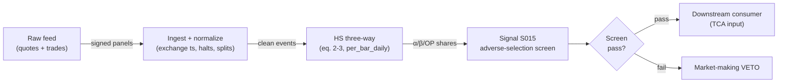

# S015 — Huang-Stoll spread components

Three-way split of the spread into order-processing, inventory, and adverse-selection costs. Provenance **[D]**.

> Tag law: every numeric literal in prose carries one of `[documented]
> [default] [example] [unverified] [internal-est] [measured]` (legend: Appendix
> i v1.0.0). Constants inside cited formulas inherit the formula's tag
> (`[documented]` for cited literature). Bibliographic years, volumes, pages,
> arXiv IDs, section numbers, rule codes (C1–C11), fail-safe codes (F1–F5),
> module IDs, and machine-parsed §0 data fields are identifiers, not
> literals, and are exempt.

## §1 Five-minute reviewer card

| Row | Value |
|---|---|
| Module | S015 — Huang-Stoll spread components, v1.1.0 |
| Edge verdict | `PREDICTIVE-FEATURE-ONLY` — documented structural decomposition (Huang-Stoll 1997): TCA/design input, never a directional trigger |
| After-cost | `BEFORE-COST` — a *structural TCA input* [documented]: it attributes spread revenue to its economic sources - consumed by market-making design and cost models |
| Build cost | Tier L · `4–12` h [internal-est] · `$600–1,800` loaded [internal-est] |
| Data cost | Research `~$0–29`/mo [documented] (Stooq/Alpaca-IEX free tiers [unverified]; Polygon Starter `~$29`/mo [documented, approximate]) · Production `~$99–199`/mo [documented] (Polygon Developer/Advanced, approximate — verify at polygon.io/pricing) |
| latency_class | daily / end-of-day |
| risk_class | low (signal-only; no order placement) |
| Capacity | `$10–100`M/day notional [example] — illustrative; calibrate per venue |
| Executability | Feasible: Python+polars; daily panel trivial per cost-model §2/§3; estimation needs an intraday signed panel (see §S6) |
| Risk summary | Attribution risk: misidentified shares misprice market-making; dies on share drift, thin panels, and unidentified windows |
| When it dies | Share drift `>0.2` [default] (S10.1); `<21` days [default] or `<500` trades [default] (unidentified); adverse-selection share `>0.6` [default] (uneconomic); identification failure (`alpha+beta > 1` or `c1 <= 0` → `UNKNOWN`) |
| Regime gates | Provisional: R001 elevated RV amplifies (adverse-selection share rises - gate tightens) |
| Emits | `signal_vector` (Appendix b v1.0.0) — never orders |

## §1.5 Cheapest / least-build path

1. **Prototype hour band:** `4–12` h [internal-est] — quote + trade tape + S007-signed prints + three-way decomposer (HS eq. 2–3, §S3) + reference validation against both fixtures
2. **Cheapest-source row:** min_tier = Stooq free daily CSV [unverified] or Alpaca IEX (free with account) [unverified] for research; Polygon.io Stocks Advanced `~$199`/mo [documented, approximate] for production (note: Polygon.io rebranded to Massive in early 2026 [documented] — same API surface, verify product name at purchase); latency_class = SIP;
   required_fields = bid/ask quotes with timestamps (≤`1` min old at trade time [documented, example bound]); S007-signed trade price + size (`d_i ∈ {+1,-1}`); intraday signed panel for estimation (daily bars alone cannot identify α/β — see §S6); price_band = research `~$0–29`/mo, production `~$99–199`/mo [documented, approximate] (indicative — verify before budgeting); build_or_buy = ****build the decomposer, buy the quote feed** (the three-way split is `~150` lines [internal-est] including OLS; the value is the identification discipline)**.
3. **Resource budget:** `1` core, `<1` GB RAM; daily bars `3000` stocks × `10`y `~2–5` GB [internal-est]; intraday estimation panels are the real storage cost (TAQ-scale, venue-dependent [unverified]); compute pattern `per_bar`.
4. **Skip list:** intraday HS variants; multi-venue attribution; dealer-vs-auction comparisons; midpoint-print signing debates (S007's contract owns this)
5. **DO-NOT-CUT list:** causality assertions (`assert fill_event >
   signal_event`, no-signal-bar-fills test); COST block + callable
   `expected_cost_bps`; F1–F5 fail-safes + module-state enum; decision-log
   audit records; bona-fide-intent + self-trade prevention; provenance tags on
   every numeric literal; fixtures + `test_cmd`; secrets via env only.
6. **Escalation gate:** adverse-selection share `>60`% persistent [default] -> market-making uneconomic; live universe `>20` symbols [default]

## §S0 Module contract

### S0.1 Typed signature

```python
def signal(state: ModuleState, events: list[Event], cfg: Config) -> SignalVector:
```

`SignalVector` per Appendix b v1.0.0. `state` is the module-owned named state vector (`quote_cache`, `comp_window`, `module_state`); `events` are canonical Events (Appendix a v1.0.0), newest last. The function handles documented edge cases: empty events → `UNKNOWN`; crossed/locked quotes → `UNKNOWN` (F1, never interpolate); halt/auction events → freeze per the market-state table.

### S0.2 Config dataclass

| Parameter | Type | Default | Range | Status |
|---|---|---|---|---|
| `window_days` | int | `60` | `21`–`252` | default |
| `min_trades` | int | `500` | `100`–`5000` | default |
| `quote_delay_s` | float | `5.0` | `0`–`5` | default |
| `adv_share_high` | float | `0.6` | `0.4`–`0.8` | default |
| `cost_gate_k` | float | `0.5` | `0.1`–`2.0` | default |

All defaults tagged per the tag law (status `default` ⇒ `[default]`).

**Calibration procedures** (run quarterly per venue, or after any share-drift trip):
- `window_days`: re-estimate on `60`/`120`/`252`-day windows [default]; keep the shortest window whose rolling α̂/β̂ stay within `±0.1` [default] of the `252`-day anchor (drift trip at `>0.2` per S10.1).
- `min_trades`: floor for the 3-coefficient HS regression — `500` trades [default] gives `~166` obs/coefficient [example]; raise until `c1 > 0` and `α̂,β̂ ∈ [0,1]` hold on `≥95`% [default] of rolling windows.
- `quote_delay_s`: Lee-Ready quote-matching delay — `5.0` s [default] is the 1988-NYSE value [documented]; recalibrate per era/venue by maximizing at-quote classification rate on a labeled sample (modern electronic markets often need `0`–`1` s [unverified]); S007 owns the labeled sample.
- `adv_share_high`: conservative veto far above documented typical α̂ (`9.6`% [documented], NYSE large stocks 1992); live rule: veto when α̂ exceeds `2`× its `1`y rolling median [default] **or** `0.6` [default], whichever binds first.
- `cost_gate_k`: downstream consumers calibrate; this module exposes the callable only (see §S3).

### S0.3 Canonical schema mapping

Vendor columns → canonical Event schema (Appendix a v1.0.0), stated once here:

| Vendor (Polygon.io Stocks Advanced) | Canonical |
|---|---|
| `ts_event` | `event_ts (int64 ns UTC)` |
| `bid / ask` | `bid_px / ask_px` |
| `bid_size / ask_size` | `bid_sz / ask_sz` |
| `exchange` | `venue` |
| `price / size / sign` | `trade_px / trade_sz / d_i (S007; d_i ∈ {+1,-1})` |

Quotes used for signing must be the prevailing quote at trade time (quote age `≤1` min [documented, example bound]; S007 applies `quote_delay_s`). Midquote prints (`P_t = M_t`) carry no sign — S007 tick-tests or drops them per its contract; this module requires `d_i ∈ {+1,-1}` and drops unsigned prints from the regression panel.

Daily/intraday-bar vendors map `date`/`t` → bar open-time label; splits/dividends must be adjusted before use.

### S0.4 Time contract

> Time contract: clock domain UTC, int64 ns; authoritative causality clock = `bar close (open-time labeled)`; max_skew = `1` s [default]; jitter budget = `250` ms [default]; bar-label = open time; staleness TTL = `3` days [default] (`3`× the daily reference cadence per F4); gap policy = mask, no interpolation; halt/auction → discard contributions across reopen.

**Timing box:** `signal@t (per_bar_daily, America/New_York) → earliest fill @open(t+1)`

### S0.5 Market-state table

| State | Module behavior |
|---|---|
| CONTINUOUS_TRADING | Compute normally; emit per cadence |
| HALTED | Freeze state; emit `UNKNOWN`; discard contributions across reopen |
| AUCTION | No new signals; hold last `SignalVector`; state `DEGRADED` |
| CLOSED | Emit nothing; state `OFF` |

### S0.6 Module-state enum + error taxonomy

States per Appendix k v1.0.0: `OK | DEGRADED | UNKNOWN | OFF`. Invalid input → `UNKNOWN`, never interpolate (Appendix f v1.0.0, F1–F5).

| Failure | State | Alert |
|---|---|---|
| Missing/stale input (TTL per §S0.4) | `UNKNOWN` | page |
| Crossed/locked quote reaching module | `UNKNOWN` | log |
| Feature out of mathematical bounds (F2) | `UNKNOWN` | page |
| Missing bars > `3` [default] | `DEGRADED` (restart windows) | log |
| Corporate action unadjusted in window | `UNKNOWN` | page |
| Halt/auction | `UNKNOWN` / `DEGRADED` (per table) | log |
| Kill/administrative disable | `OFF` | page |
| Anything unmapped | `UNKNOWN` | page |

### S0.7 Ops tail

- **Schedule:** once daily after `16:00` America/New_York close [documented]; owner: intraday-signals on-call.
- **Health checks:** fixture replay (`test_cmd`) green on deploy; live `bar-count` monitor; staleness watchdog at `3`× cadence [default].
- **Alert table:** page on `UNKNOWN` > `30` s [default] or bounds violation; notify on `DEGRADED`; log on single dropped events.
- **Resource budget:** `1` core, `<1` GB RAM; daily bars `3000` stocks × `10`y `~2–5` GB [internal-est]; state is O(window) per symbol.
- **Runbook stub:** `1.` confirm feed (Polygon status); `2.` replay fixture; `3.` if red → set `OFF`, page; `4.` reconcile decision log before re-arm.

### S0.8 Secrets (env-only)

`POLYGON_API_KEY` via environment only. No secrets in this file, fixtures, or logs (CI secrets-grep).

### S0.9 May / must-NOT

> **May:** emit `SignalVector` records per Appendix b v1.0.0. **Must-NOT:** emit orders, order intents, prices, share counts, or notionals; call a broker; mutate shared state outside `state`; interpolate across gaps.

## §S1 Legacy (subsumed by §1)

Legacy §S1 content is the §1 reviewer card above; this header is retained so section numbering stays frozen.

## §S2 Specification

### Universe

US common stocks with quote + trade feeds; dealer-relevant names with `≥ min_trades` signed prints per `window_days` (`500` [default]). Names failing the identification checks (§S3) are excluded from the screen — unidentified is `UNKNOWN`, never a guess.

### Entry rule (Boolean — no prose-only conditions)

```
ENTER_LONG  := (adv_share <= adv_share_high) -> adverse-selection screen PASSED (TCA input, not a directional trigger)
ENTER_SHORT := (adv_share <= adv_share_high) -> adverse-selection screen PASSED (TCA input, not a directional trigger)
FLAT        := otherwise
```

The three-way split is a *structural TCA input*: it attributes spread revenue. It is never a directional trigger.

### Exits (with post-exit cooldown)

```
EXIT := (adv_share > adv_share_high) -> market-making VETO; re-arm when adv_share <= adv_share_high for `20` days [default]
ON_EXIT: cooldown_until = now + cooldown_s   # 60 s [default]; C10
```

### Position sizing (fenced function)

```python
def size_shares(risk_budget_R, stop_distance, vol_estimate, ADV_cap, cost):
    # S-module requests capital fraction only; share math lives in the strategy.
    # Reference: capital = 0.5 * confidence  (confidence in [0,1])  [default]
    risk_notional = risk_budget_R * 0.5 * confidence          # [default] 0.5 factor
    shares = risk_notional / max(stop_distance, 1e-9)
    return int(min(shares, ADV_cap * adv_shares * 0.001))     # 0.1% ADV cap [default]
```

### Risk limits

| Limit | Value |
|---|---|
| Max capital fraction per signal | `0.5` [default] |
| Max adverse excursion before `UNKNOWN` review | `2.0`× stop [default] |
| Staleness kill | TTL per §S0.4 → `UNKNOWN` |

### COST block (single source of truth)

| Component | Value (bps) | Basis |
|---|---|---|
| Spread (half-spread, bar-close cross) | `0.50` | [example] — reference print |
| Fees (taker incl. regulatory) | `0.30` | [documented] — `= $0.0030`/share Rule 610 access-fee cap [documented] applied to a `$100` reference print [example]; sell legs add FINRA TAF `$0.000195`/share [documented] + SEC §31 `$20.60`/`$1`M sales [documented] |
| Borrow | `0.0` | [default] — reference build long-biased; shorts add C7 locate cost |
| Impact | `0.0` | [example] — flagged; calibrate per venue at scale-up |
| **Total reference** | `0.80` | [example] |

`fee_schedule_as_of`: `2026-04-20` [documented] — vintage of the TAF/§31 fee sources below; pin the real venue schedule before production. `side: taker` [default]; venue/tier/source: XNAS / SIP bars [example]. Re-stating cost numbers outside this block is a validation failure.

Fee-component sources (citable): Reg NMS Rule 610 caps access fees at `$0.0030`/share (`30` mils; `0.3`% for sub-`$1` prints) [documented]; the largest exchanges charge at or near the cap [documented]; FINRA TAF `$0.000195`/share on sales, cap `$9.79`/trade [documented]; SEC §31 `$20.60` per `$1`M of covered sales [documented]. All three are per-share/per-sale — convert to bps against the trade's reference price before comparing with the stack above.

```python
def expected_cost_bps(notional, adv_pct, venue, side, urgency) -> float:
    """Callable cost model — bar-signal reference stack (impact=0 flagged [example])."""
    spread_bps = 0.50   # [example] bar-close crossing assumption
    fee_bps = 0.30      # [documented] Rule 610 $0.0030/share cap on a $100 reference print [example]
    borrow_bps = 0.0    # [default] long-biased reference; reason in table
    impact_bps = 0.0    # [example] flagged; calibrate per venue at scale-up
    if side == "maker":
        fee_bps = -0.20  # rebate [example]
    return spread_bps + fee_bps + borrow_bps + impact_bps
```

### Execution / fill model table

| Aspect | Assumption |
|---|---|
| Latency | Close → signal same evening [example]; fill at next open |
| Partial fills | N/A (signal-only; T-module policy: Appendix c v1.0.0) |
| Impact | `0.0` bps reference [example]; stress ×`2` [example] |
| Adverse fill | Open-auction slippage vs close [example] |

### Robustness

Lookback/winsorization choices must be validated out-of-sample; daily estimators are regime-sensitive and go stale — re-estimate on a rolling window [default].

### Compliance sub-block (C1–C10+)

| Code | Rule: trigger → check → action → log |
|---|---|
| C1 | Self-match prevention: signal module emits no orders; downstream T-modules must set self-trade-prevention flags — this module asserts the requirement in its `consumes` contract |
| C2 | Bona-fide intent: every emitted `SignalVector` with |direction|=`1` must pass the cost gate; sub-threshold prints emit direction `0`, never a tradeable hint |
| C3 | Message-rate: `<=100` emissions/symbol/s [default]; breach -> throttle to `1`/s [default] + alert |
| C4 | Fat-finger trio (applied by consumers; this module bounds its own outputs): confidence in [`0`,`1`], capital in [`0`,`0.5`], computed_at sane - out-of-bounds -> `UNKNOWN` (F2) |
| C5 | Decision log: every emission, veto, and state transition logged per Appendix g v1.0.0, hash-chained |
| C6 | Halt/auction: per the market-state table; contributions across reopen discarded |
| C7 | Locate check: SHORT direction requires `locate_ok` from the consumer; never emit SHORT without the consumer asserting locate (Reg-SHO threshold securities -> direction `0`) |
| C8 | Public dissemination: no signal values published externally without review gate |
| C9 | Data entitlements: per the Data rights row; entitlement-class change -> escalation gate |
| C10 | Post-exit cooldown: no re-entry for `cooldown_s` after any exit or compliance block |
| C11 | Corporate-action hygiene: total-return adjustment before estimation; unadjusted windows -> `UNKNOWN` |

### Parameter table

| Parameter | Symbol | Value | Tag | Sensitivity |
|---|---|---|---|---|
| Window | `window_days` | `60 days` | [default] | high |
| Min signed prints / window | `min_trades` | `500` | [default] | high |
| Lee-Ready quote delay | `quote_delay_s` | `5.0 s` | [default] | medium |
| Adverse-selection share gate | `adv_share_high` | `0.6` | [default] | high |
| Cost-gate k | `cost_gate_k` | `0.5` | [default] | medium |

Calibration procedures per §S0.2. The documented three-way anchor (NYSE large stocks, 1992): order processing `61.8`%, adverse selection `9.6`%, inventory `28.7`% [documented] — re-anchor per venue/era before trusting `adv_share_high`.

### Timing box

`signal@t (per_bar_daily, America/New_York) → earliest fill @open(t+1)`

## §S3 Math + normative pseudocode

Huang-Stoll (1997) three-way decomposition of the traded spread $S$:
$$S = \underbrace{\text{order processing}}_{1-\alpha-\beta} + \underbrace{\text{inventory}}_{\beta} + \underbrace{\text{adverse selection}}_{\alpha},$$
$\alpha$ = adverse-selection share, $\beta$ = inventory share, estimated from the joint dynamics of quotes and signed trades [documented]. Fixture (illustrative shares - *example*): `S = 0.02`, `alpha = 0.35`, `beta = 0.25` -> order-processing `0.008`, inventory `0.005`, adverse selection `0.007`. The split is an *attribution*, not a forecast: it describes where spread revenue went [documented].

### HS indicator regressions (normative math)

Let $P_t$ be the trade price and $Q_t \in \{+1,-1\}$ the S007 trade-initiation sign (`+1` buyer-initiated). The basic two-way HS model [documented]:

$$\Delta P_t = \tfrac{S}{2}Q_t + (\lambda-1)\tfrac{S}{2}Q_{t-1} + e_t \tag{1}$$

where $\lambda \in [0,1]$ [documented] is the *combined* adverse-selection + inventory share and $1-\lambda$ is the order-processing share. The extended **three-way** model adds one lag [documented]:

$$\Delta P_t = \tfrac{S}{2}Q_t + (\alpha+\beta-1)\tfrac{S}{2}Q_{t-1} - \alpha(1-2\pi)\tfrac{S}{2}Q_{t-2} + e_t \tag{2}$$

with the auxiliary reversal regression [documented]:

$$Q_t = (1-2\pi)Q_{t-1} + u_t \tag{3}$$

where $\pi = P(Q_t = -Q_{t-1})$ is the trade-reversal probability. Identification from OLS coefficients $(c_1, c_2, c3)$ of $\Delta P_t$ on $(Q_t, Q_{t-1}, Q_{t-2})$ (no intercept) [documented]:

- traded spread: $\hat S = 2c_1$ (require $c_1 > 0$)
- combined share: $\hat\lambda = 1 + c_2/c_1$
- adverse-selection share: $\hat\alpha = -c_3 / (c_1(1-2\hat\pi))$ (require $\hat\pi \ne 0.5$)
- inventory share: $\hat\beta = \hat\lambda - \hat\alpha$
- order-processing share: $1 - \hat\lambda$
- identifying restrictions: $\hat\alpha, \hat\beta \in [0,1]$, $\hat\alpha + \hat\beta \le 1$ [documented]; violations → window rejected (`UNKNOWN`), never clipped.

Two-way fallback: if (2) is unidentified ($\hat\pi \approx 0.5$, $c_1 \le 0$, or restrictions violated), fall back to (1) and emit only $\hat\lambda$ with `alpha`/`beta` set to `NaN` in `aux` — the screen then uses $\hat\lambda$ against `adv_share_high` with `DEGRADED` state.

### Trade signing (S007 contract — requirements, not internals)

The module consumes S007-signed prints and requires: quote rule against the prevailing quote (quote age ≤ `quote_delay_s`; `5.0` s [default] is the Lee-Ready 1988-NYSE value [documented]), tick-test fallback for midquote prints [documented], unsigned midquote prints dropped from the panel. Documented classification accuracy to calibrate expectations: Lee-Ready `93`% on the classifiable subset of TORQ trades [documented]; `98`% for at-the-quote trades vs `76`% tick-test on midquote prints [documented]; later studies `72`–`85`% [documented]; `~30`% of trades print inside the spread even after timing correction [documented] — signing noise attenuates $\hat\alpha$/$\hat\beta$ toward the two-way $\hat\lambda$ and widens windows, it never creates edge.

### Documented empirical anchors

HS (1997) on large, actively traded NYSE stocks (1992): order processing `61.8`%, adverse selection `9.6`%, inventory `28.7`% of the traded spread [documented]; George et al. (1991): `8`–`13`% adverse selection of the quoted spread [documented]; HS (1997) average: `~38`% of traded spreads attributable to inventory + adverse selection combined [documented]. Adverse selection is smaller for large trades (negotiated outside the market) [documented]. These are 1992 fractional-era anchors — re-estimate per venue/era; do not hard-code them.

**Normative pseudocode** (pseudocode is normative; prose is commentary):

```
function signal(state, events, cfg) -> SignalVector:
    assert events non-empty else return UNKNOWN                    # F1
    panel = signed_quote_trade_panel(events, cfg.window_days)     # S007-signed, d_i in {+1,-1}
    assert panel.days >= 21 else return FLAT(DEGRADED)             # [default] day floor
    assert len(panel.trades) >= cfg.min_trades else return FLAT(DEGRADED)   # [default] 500
    pi_hat = reversal_fraction(panel.signs)                        # eq (3): P(Q_t = -Q_{t-1})
    assert 0 < pi_hat < 1 else return UNKNOWN                     # degenerate order flow
    (c1, c2, c3) = ols_no_intercept(dP ~ Q_t + Q_{t-1} + Q_{t-2}) # eq (2)
    assert c1 > 0 else return UNKNOWN                             # non-positive spread estimate
    lam = 1 + c2/c1
    alpha = -c3 / (c1 * (1 - 2*pi_hat)) if abs(1-2*pi_hat) > 1e-6 else NaN
    beta = lam - alpha
    op = 1 - lam
    if not (0 <= alpha <= 1 and 0 <= beta <= 1 and alpha + beta <= 1):
        return fallback_two_way(c1, lam)                          # DEGRADED, aux.alpha/beta = NaN
    assert abs(op + beta + alpha - 1.0) < 1e-6 else return UNKNOWN # F2
    # module gate = adverse-selection screen (TCA input, not a directional trigger);
    # the executable cost gate expected_cost_bps(...) <= k * edge_bps lives in
    # downstream consumers — this module exposes the callable, it does not trade.
    screen_pass = alpha <= cfg.adv_share_high
    sig = SignalVector(symbol, direction=0, confidence=1.0, capital=0.0,
                       computed_at=events[-1].event_ts, staleness=now()-events[-1].asof_ts,
                       module_state=state.module_state,
                       aux={"adv_share": alpha, "inv_share": beta, "op_share": op,
                            "traded_spread": 2*c1, "pi_hat": pi_hat,
                            "screen_pass": screen_pass})
    log_decision(sig, inputs_hash, params_hash)                    # C5 / Appendix g
    assert fill_event > signal_event  # t->t+1 causality: trailing-window attribution only
    return sig
```

Causality: trailing-window attribution; the split at `T` describes where past spread revenue went - tradable no earlier than `T+1`. Mandatory unit test: no-signal-bar fills.

## §S4 Worked example (fixture-backed)

One fixture pair, `# TYPE: validation-run`, two `case_type` rows, all numbers synthetic, seed `20260915` [example]:

- **Tape** `modules/fixtures/S015_tape.csv` — case `arithmetic` (`ex1`): `1` illustrative decomposition (`S = 0.02`, `alpha = 0.35`, `beta = 0.25`); case `estimation_trade` (`hs3`): `2000` signed trades [example] generated noise-free from the HS three-way DGP `dP_t = c1*Q_t + c2*Q_{t-1} + c3*Q_{t-2}` with `c1 = 0.01`, `c2 = -0.004`, `c3 = 0.0007` [example] (i.e. `S = 0.02`, `alpha = 0.35`, `beta = 0.25`, reversal `pi = 0.6` [example] from the `# PI:` header); `P_1 = P0 + c1*Q_1` anchor, regression uses `t >= 2`.
- **Expected** `modules/fixtures/S015_expected.csv` — `arithmetic` row: component dollars (`0.008`/`0.005`/`0.007`); `estimation_trade` row: analytic recovery (`S = 2*c1`, `alpha = -c3/(c1*(1-2*pi))`, `lambda = 1+c2/c1`, `beta = lambda-alpha`, `op = 1-lambda`); hand-checked below.
- Tolerance: `1e-4` [default] on the arithmetic case (CSV stores `3`-decimal dollars); `1e-9` [default] on the estimation case (noise-free recovery to float rounding).
- Acceptance tests (`modules/tests/test_S015.py`, `8` tests): `1.` arithmetic case recomputes to expected; `2.` stub emits valid `SignalVector` (direction in {+1,-1,0}, confidence/capital in [0,1]); `3.` no-signal-bar fills (`fill_event_ts > computed_at`); `4.` cost-gate callable passes on large edge, blocks on tiny edge (`k = 0.5` [default]); `5.` invalid input -> `UNKNOWN`; `6.` component dollars sum to the spread and shares sum to `1`; `7.` HS three-way OLS recovers `S`/`alpha`/`beta`/`order_proc` from the estimation case within `1e-9` [default]; `8.` realized reversal fraction within `0.05` [example] of fixture `pi`.
- `test_cmd`: `python3 -m pytest modules/tests/test_S015.py -q` → exits `0`.

**Hand-checked rows** (arithmetic case — verified by hand against the fixture):

- `order processing = 0.02 x (1 - 0.35 - 0.25) = 0.008` ✓
- `inventory = 0.02 x 0.25 = 0.005` ✓
- `adverse selection = 0.02 x 0.35 = 0.007` ✓
- `0.008 + 0.005 + 0.007 = 0.02` ✓

**Hand-checked rows** (estimation case — generator output verified by hand; `Q_0 = Q_1 = 1`, `Q_2 = -1`, `Q_3 = 1`):

- `P_1 = 100.00 + 0.01 x 1 = 100.01` ✓
- `dP_2 = 0.01 x (-1) + (-0.004) x 1 + 0.0007 x 1 = -0.0133` → `P_2 = 99.9967` ✓
- `dP_3 = 0.01 x 1 + (-0.004) x (-1) + 0.0007 x 1 = 0.0147` → `P_3 = 100.0114` ✓
- Recovery: `S = 2 x 0.01 = 0.02` ✓; `alpha = -0.0007 / (0.01 x (1 - 1.2)) = 0.35` ✓; `lambda = 1 + (-0.004)/0.01 = 0.6` ✓; `beta = 0.6 - 0.35 = 0.25` ✓; `op = 0.4` ✓

**Where the example is optimistic:** no fees, no latency, no hidden liquidity; the estimation tape is noise-free (real panels have signing noise and public-news shocks in `e_t`) — arithmetic and algebra illustration, not a backtest.

## §S5 Strategies that use this signal

Generated from `deps.yaml` (CI symmetry). Provisional consumer list (roles pinned at ingest):

| Strategy | Role |
|---|---|
| T-series execution consumers (see `deps.yaml`) | Downstream consumer of this signal family's direction/confidence outputs; exact strategy IDs pinned at ingest |

The three-way split feeds market-making design and TCA; consumer roles pinned in `deps.yaml`.

## §S6 Data required

| Field | Type | Granularity | Source tier | Notes |
|---|---|---|---|---|
| Quote bid/ask price | float | tick | Tier 0/1 | prevailing quote at trade time; quote age ≤ `quote_delay_s`; crossed/locked quotes rejected (F1) |
| Quote bid/ask size | int | tick | Tier 0/1 | depth context; not in the HS regression but required for venue sanity checks |
| Quote timestamps (exchange + SIP) | int64 ns | tick | Tier 0/1 | dual-clock sequencing for the Lee-Ready delay rule |
| Quote venue | enum | tick | Tier 0/1 | exchange code; fragmentation-aware panels keep venue |
| Trade price | float | tick | Tier 0/1 | `P_t` in eq. (2) |
| Trade size | int | tick | Tier 0/1 | size-bucket diagnostics (adverse selection falls for large trades [documented]) |
| Trade timestamps | int64 ns | tick | Tier 0/1 | sequencing vs quotes |
| Trade sale conditions | enum | tick | Tier 0/1 | filter set is a calibration choice [unverified]; document and freeze it |
| Trade initiation sign | int8 | tick | derived (S007) | `d_i ∈ {+1,-1}`; unsigned midquote prints dropped from the panel |
| Daily OHLCV | float / int | daily bars | Tier 0/1 | total-return adjusted; for the screen cadence, not for estimation |
| Corporate actions | reference | daily | Tier 0/1 | unadjusted windows rejected |

**Identification requirement (read before building):** the three-way HS split is identified from an *intraday signed trade+quote panel* — daily bars alone cannot separate α from β (the two-way λ on daily serial covariance is the S014-style fallback, not this module). The `≥ min_trades` (`500` [default]) signed prints per window is a hard floor; quote flicker regimes that collapse signing accuracy below the documented `72`–`85`% band [documented] trip S10.12.

**Data rights row** (Appendix j v1.0.0): US equities quote+trade panels via Alpaca/Stooq (Tier 0, redistribution-limited) or Polygon.io, `rights: licensed-or-public`; note Polygon.io rebranded to Massive in early 2026 [documented] — same API surface; fixtures are synthetic; no display use. Entitlement-class change → §1.5 escalation gate.

## §S7 Local build (M5 Max / 128 GB)

Feasible. Daily bars `3000` stocks × `10`y `~2–5` GB (cost-model §3) — fits comfortably; pandas/polars ample. The estimation panel is the real cost: a `60`-day [default] intraday signed panel runs to order millions of prints per liquid name [unverified] — build the tape pipeline on a symbol subset first, then scale. Bottleneck is estimator identification (signing quality + window identification), not data volume.

## §S8 Buy vs build

Build the estimator, buy (or pull free) the quote+trade panel. Verdict: the HS three-way is textbook math [documented] — the value is identification discipline (signing quality, window checks) and regime awareness. Tier 0 daily bars do **not** suffice for estimation (see §S6); they only serve the daily screen cadence and fixture-grade research.

## §S9 Efficacy — documented evidence

| Study / source | Market & period | Metric | Before/after cost | Caveat |
|---|---|---|---|---|
| Huang & Stoll (1997) [documented] | NYSE | the components of the bid-ask spread: a general approach | `BEFORE-COST` | decomposition, not a rule |
| HS (1997) three-way estimates [documented] | NYSE large stocks, 1992 | order processing `61.8`%, adverse selection `9.6`%, inventory `28.7`% of traded spread | `BEFORE-COST` | fractional era; re-estimate per venue/era |
| HS (1997) via Gibson et al. (2003) [documented] | NYSE | `~38`% of traded spreads from inventory + adverse selection combined | `BEFORE-COST` | two-way combined figure |
| George et al. (1991) via Gibson et al. (2003) [documented] | US equities | `8`–`13`% of quoted spread = adverse selection | `BEFORE-COST` | quoted (not traded) spread |
| Stoll (1989) [documented] | theoretical market microstructure | inferred components of the bid-ask spread | `BEFORE-COST` | model, not a rule |
| Lee & Ready (1991) / Lee & Radhakrishna (2000); later studies [documented] | NYSE 1988 / TORQ | signing accuracy `93`% on classifiable subset (`98`% at-quote, `76`% tick-test midquote); later studies `72`–`85`% | `BEFORE-COST` | method caveat: signing noise attenuates α̂/β̂ |

Selection disclosure: the papers above surfaced by the chapter's research pass; the S014 two-way decomposition is the simpler sibling (eq. 1).

## §S10 Failure modes & pitfalls

| # | Trigger → Detect → Action → Recovery | check: |
|---|---|---|
| 1 | Share drift: identification shifts alpha/beta across windows -> detect: |delta share| > 0.2 [default] -> action: `DEGRADED`, re-estimate -> recovery: stable window or drop the name | `check: share_drift <= 0.2 [default]` |
| 2 | Lookahead leakage: bar-close feature traded intra-bar → detect: causality audit flags `fill_event <= signal_event` → action: halt, fix bar finalization → recovery: re-run no-signal-bar-fills test | `check: all(fill_ts > computed_at)` |
| 3 | Staleness/latency: feed timestamps in a race → detect: jitter > budget → action: `DEGRADED`, label simulated-only → recovery: direct feed or stand down | `check: asof_ts - event_ts <= jitter_budget` |
| 4 | Stale bars: corporate actions or halts corrupt the window → detect: adjustment/ halt flags → action: `UNKNOWN`, mask bars → recovery: backfill and replay | `check: no unadjusted bars in window` |
| 5 | Cost blowup: spread+fees+impact on the round trip → detect: cost gate failing on `[measured]` costs → action: widen `k` gate or stand down → recovery: re-pin fee schedule | `check: expected_cost_bps(...) <= k * edge_bps` |
| 6 | Regime breaks: depth/volatility regime shifts → detect: feature distribution break → action: veto entries → recovery: resume when stable for `5` min [default] | `check: feature_z_within_3_sigma [default]` |
| 7 | Overfitting: parameters mined on `1` period → detect: OOS decay → action: purged/embargoed re-validation → recovery: shrink per-symbol | `check: oos_sharpe > 0.5 * is_sharpe [default]` |
| 8 | Data errors: bad ticks, splits, halts → detect: bounds/`seq`-gap monitors → action: `UNKNOWN`, mask bars → recovery: backfill and replay | `check: no crossed quotes in window` |
| 9 | Identification failure: α̂/β̂ violate `α,β ∈ [0,1]`, `α+β ≤ 1` [documented] → detect: restriction check on every window → action: two-way fallback (1) with `DEGRADED`, else `UNKNOWN` → recovery: widen window or drop the name | `check: 0 <= alpha <= 1 and 0 <= beta <= 1 and alpha+beta <= 1` |
| 10 | Degenerate reversal: π̂ ≈ `0.5` (unidentified) or π̂ near `0`/`1` (one-sided flow) → detect: `abs(1-2*pi_hat) < 1e-6` [default] → action: `UNKNOWN` for the three-way; two-way λ still reported → recovery: longer window or stand down | `check: abs(1-2*pi_hat) >= 1e-6 [default]` |
| 11 | Non-positive spread estimate: `c1 ≤ 0` (Roll-style negative covariance pathology) → detect: sign check on the `Q_t` coefficient → action: `UNKNOWN`, mask the window → recovery: re-estimate on clean panel | `check: c1 > 0` |
| 12 | Signing-quality collapse: quote flicker/spoofing regimes push accuracy below the documented `72`–`85`% band [documented] → detect: midquote-print share or at-quote rate outside S007's calibrated band → action: `DEGRADED`, widen window → recovery: S007 recalibrates `quote_delay_s` | `check: signing_quality_within_S007_band` |

### Regime-gate machine records (provisional)

| regime_id | direction | mechanism | condition | action | min_lag | unknown_behavior |
|---|---|---|---|---|---|---|
| R001 | amplifies | elevated realized volatility widens spreads and deepens adverse selection | RV > `2`× trailing median [example] | widen_stops | `1` session [example] | hold last label |
| R002 | degrades | quote flicker / spoofing regimes inject noise into book features | fleeting-quote share > `0.3` [example] | halve | `30` min [example] | veto entries |
| R003 | degrades | halt/auction regimes break continuity assumptions | market_state != CONTINUOUS_TRADING | pause_entry | `0` | veto entries |

## §S11 Visuals

`../../images/S015_example.png` — synthetic HS three-way panel (seed `20260915` [example]): spread and component shares.



## §S12 Source log + unverified leads

**Sources** (citable facts only):

1. Huang, R. D., Stoll, H. R. (1997) [documented]. "The Components of the Bid-Ask Spread: A General Approach." *Review of Financial Studies* 10(4), 995-1034. https://ideas.repec.org/a/oup/rfinst/v10y1997i4p995-1034.html
2. Stoll, H. R. (1989) [documented]. "Inferring the Components of the Bid-Ask Spread: Theory and Empirical Tests." *Journal of Finance* 44(1), 115-134.
3. McGroarty, F., ap Gwilym, O., Thomas, S. (2007) [documented]. "The Components of Electronic Inter-Dealer Spot FX Bid-Ask Spreads." *J. Business Finance & Accounting* 34(9-10) — restates HS eq. (1)-(3): two-way ΔP regression, three-way with `(α+β-1)` and `-α(1-2π)` terms, `Q_t = (1-2π)Q_{t-1} + u_t`. https://www.city.ac.uk/__data/assets/pdf_file/0020/133157/The-Components-of-Electronic.pdf
4. Gibson, S., Singh, R., Yerramilli, V. (2003) [documented]. "The effect of decimalization on the components of the bid-ask spread." *J. Financial Intermediation* 12 — cites HS (1997): `~38`% of traded spreads from inventory + adverse selection combined; decimalization cut fell almost entirely on order processing. https://repec.udesa.edu.ar/pub/Finanzas/Journals/Journal of Financial Intermediation/Volume 12-2003/Issue 2/The effect of decimalization on the components of the bid-ask spread.pdf
5. Liquidity survey WP802, U. Bologna [documented]. Reports HS (1997) three-way results on large/active NYSE stocks (1992): order processing `61.8`%, adverse selection `9.6`%, inventory `28.7`%; adverse selection smaller for large trades. http://amsacta.unibo.it/id/eprint/4216/1/WP802.pdf
6. Lee, C. M. C., Ready, M. J. (1991) [documented]. "Inferring Trade Direction from Intraday Data." *J. Finance* 46(2) — quote rule against the quote `≥5` s old ("if the current quote is less than 5 seconds old, it was probably caused by the trade"), tick-test fallback for midquote prints. Accuracy stats: Lee & Radhakrishna (2000) `93`% on classifiable TORQ subset (`98`% at-quote, `76`% tick-test midquote, `60`% zero-tick); later studies `72`–`85`%; `~30`% of trades inside the spread after timing correction. Via EFMA 2014 review: http://www.efmaefm.org/0EFMAMEETINGS/EFMA ANNUAL MEETINGS/2014-Rome/papers/EFMA2014_0302_fullpaper.pdf and algorithm summary: https://github.com/suenot/224-trade-classification
7. Polygon.io community pricing docs [documented, approximate]. Free `5` req/min; Starter `~$29`/mo; Developer `~$99`/mo; Advanced `~$199`/mo. https://github.com/omniscient/markethawk/blob/HEAD/POLYGON_RATE_LIMITS.md — verify at polygon.io/pricing before budgeting.
8. Polygon.io rebranded to Massive in early 2026 [documented]. Same `api.polygon.io` surface; product names in flux. https://github.com/api-evangelist/polygon
9. SEC / FIA on Reg NMS Rule 610 [documented]. Access-fee cap `$0.0030`/share (`30` mils; `0.3`% for sub-`$1` prints); largest exchanges charge at or near the cap. https://www.sec.gov/rules/proposed/2022/34-96494.pdf ; https://www.fia.org/sites/default/files/2020-02/FIA-PTG-Reg-NMS-A-Retrospective-Review-Practical-Reforms-for-Improvement.pdf
10. FINRA TAF `$0.000195`/share on sales (cap `$9.79`/trade) and SEC §31 `$20.60` per `$1`M covered sales, 2026 vintage [documented]. https://www.brokerage-review.com/account-fee/taf-fee.aspx

**Chatbot source log.** Chatbot answers pending (checked 2026-09-10) - grok-answers.md and cursor-answers.md were absent from batches/SB1/.

**Unverified leads** (chatbot-only — never in evidence tables):

- Practitioner claims that the inventory share alone times market-making entry; the split is an attribution, not a timing signal - treated as unverified.
- Alpaca IEX free-tier specifics and SIP paid-tier pricing for the cheapest-source row [unverified].
- Stooq redistribution terms for research use of daily panels [unverified].
- Trade sale-condition filter set for the signed panel (calibration choice — document and freeze per venue) [unverified].
- GROK-NEEDED: modern post-decimalization three-way shares for US equities — documented anchors are 1992 fractional-era (OP `61.8`% / α `9.6`% / β `28.7`%). What are the current typical α/β/OP shares by size tercile, and how should `adv_share_high` be set per tercile?
- GROK-NEEDED: cost-gate `k` calibration convention for screen-only S-modules — the executable gate `expected_cost_bps(...) <= k * edge_bps` is degenerate when the module's own edge is a screen rather than a bps forecast. Should the gate live entirely in downstream T-modules, or is there a documented convention for the screen-level `k`?

---

## Appendix — AI build prompt (S015)

Copy-paste into any chat agent:

> Build module **S015 — Huang-Stoll spread components** v1.1.0 per
> `notes/module-template.md` v1.0.0 and this file's §S0 contract.
> Cheapest path (§1.5): prototype 4–12 h [internal-est]; cheapest data
> candidate Stooq free / Alpaca IEX [unverified] for research; Polygon.io Stocks Advanced ~$199/mo [documented, approximate] for production; compute pattern `per_bar`; skip intraday-variants/venue.
> Implement `signal(state, events, cfg) -> SignalVector` (Appendix b v1.0.0)
> with the §S3 normative HS three-way estimator: OLS `dP_t` on `(Q_t, Q_{t-1}, Q_{t-2})`
> (no intercept) → `S = 2*c1`, `lambda = 1+c2/c1`, `alpha = -c3/(c1*(1-2*pi_hat))`,
> `beta = lambda-alpha`, `op = 1-lambda`; enforce `c1 > 0`, `alpha,beta ∈ [0,1]`,
> `alpha+beta ≤ 1` (violations → two-way fallback or `UNKNOWN`, never clipped).
> Consume S007-signed prints (`d_i ∈ {+1,-1}`); unsigned midquote prints are dropped.
> The module's gate is the adverse-selection screen `alpha <= adv_share_high`; expose
> `expected_cost_bps(...)` for downstream consumers — the executable cost gate
> `expected_cost_bps(...) <= k * edge_bps` lives in the T-modules, not here.
> Assert `fill_event > signal_event`. Wire F1–F5 (Appendix f v1.0.0): invalid input -> `UNKNOWN`,
> never interpolate. Log decisions per Appendix g v1.0.0. Secrets via env
> only. Run the single fixture pair `modules/fixtures/S015_tape.csv` → `S015_expected.csv`
> (two `case_type` rows: `arithmetic`, tolerance `1e-4` [default]; `estimation_trade`,
> HS three-way recovery, tolerance `1e-9` [default]).
> **Definition of done:** `python3 -m pytest modules/tests/test_S015.py -q`
> exits `0` (`8` tests). Tag every numeric literal you add with the unified enum
> (Appendix i v1.0.0); put anything unverifiable in §S12 unverified leads.
