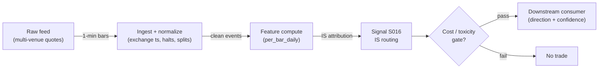

# S016 — Hasbrouck information share

Attributing price discovery across venues from the VECM permanent component - who moves first. Provenance **[D]**.

> Tag law: every numeric literal in prose carries one of `[documented]
> [default] [example] [unverified] [internal-est] [measured]` (legend: Appendix
> i v1.0.0). Constants inside cited formulas inherit the formula's tag
> (`[documented]` for cited literature). Bibliographic years, volumes, pages,
> arXiv IDs, section numbers, rule codes (C1–C11), fail-safe codes (F1–F5),
> module IDs, and machine-parsed §0 data fields are identifiers, not
> literals, and are exempt.

## §1 Five-minute reviewer card

| Row | Value |
|---|---|
| Module | S016 — Hasbrouck information share, v1.0.1 |
| Edge verdict | `PREDICTIVE-FEATURE-ONLY` — documented price-discovery attribution (Hasbrouck 1995): venue-routing input, never a directional trigger |
| After-cost | `BEFORE-COST` — a *venue-routing input* [documented]: the information share says which venue's quotes lead - consumed by smart order routing, not by directional strategies |
| Build cost | Tier L · `4–12` h [internal-est] · `$600–1,800` loaded [internal-est] |
| Data cost | Research `~$0`/mo [unverified] — Alpaca Basic free (IEX real-time; SIP 15-min delayed) or Stooq free; production `~$99–199`/mo [unverified] — Alpaca Algo Trader Plus `$99`/mo (full SIP consolidated) or Polygon Stocks Advanced `$199`/mo (real-time + quotes). Polygon rebranded Massive in 2026 [unverified]. Bands indicative — verify against vendor pricing pages before budgeting |
| latency_class | daily / end-of-day (re-estimated daily on rolling `60`-day [default] `1`-min [default] quote panels) |
| risk_class | low (signal-only; no order placement) |
| Capacity | `$10–100`M/day notional [example] — illustrative; calibrate per venue |
| Executability | Feasible: Python+polars; daily panel trivial per cost-model §2/§3 |
| Risk summary | Attribution risk: desynchronized venues misattribute leadership; dies on clock skew and single-venue panels |
| When it dies | Clock skew `>100` ms persistent (S10.1); single venue (unidentified); leadership flip-flop |
| Regime gates | Provisional: R001 elevated RV amplifies (leadership concentrates); venue outages veto |
| Emits | `signal_vector` (Appendix b v1.0.0) — never orders |

## §1.5 Cheapest / least-build path

1. **Prototype hour band:** `4–12` h [internal-est] — multi-venue quote panels + VECM estimator + information-share attribution + reference validation against the fixture
2. **Cheapest-source row:** min_tier = Alpaca Basic (free) for estimator research [unverified] — caveat: IEX-only real-time feed is a *single venue*, so IS attribution is unidentified on it; develop the estimator on Stooq/simulated `2`-venue panels, then validate on SIP. Production min_tier = Alpaca Algo Trader Plus (`$99`/mo, full SIP consolidated, `10,000` req/min [unverified]) or Polygon Stocks Advanced (`$199`/mo, real-time + quotes [unverified]); latency_class = SIP;
   required_fields = synchronized bid/ask quotes from `2`+ venues (`ts_event` int64 ns UTC, `venue_id`, `bid_px`, `ask_px`, `bid_sz`, `ask_sz`); `60`+ days of `1`-min bars [example]; price_band = `~$0–199`/mo [unverified] (indicative — verify against the vendor pricing page before budgeting); build_or_buy = ****build the VECM, buy the multi-venue feed** (the estimator is `~120` lines [internal-est]; the value is the synchronization discipline)**.
3. **Resource budget:** `1` core, `<1` GB RAM; per-symbol rolling panel `60` d [default] × `390` min [documented] (US regular session) × `2` venues [default] ≈ `46,800` quotes [example] ≈ `<5` MB [example]; full `3000`-symbol [example] daily refit ≈ `3000` × `~50` ms [internal-est] ≈ `150` s [internal-est] on one core; state is O(window) per symbol; compute pattern `per_bar`.
4. **Skip list:** intraday IS variants; Gonzalo-Granger alternatives as primary; single-venue IS fallback (unidentified — attribution needs `2`+ venues)
5. **DO-NOT-CUT list:** causality assertions (`assert fill_event >
   signal_event`, no-signal-bar-fills test); COST block + callable
   `expected_cost_bps`; F1–F5 fail-safes + module-state enum; decision-log
   audit records; bona-fide-intent + self-trade prevention; provenance tags on
   every numeric literal; fixtures + `test_cmd`; secrets via env only.
6. **Escalation gate:** venue leadership flips persistently [default]; live universe `>20` symbols [default]; need per-venue (not SIP-consolidated) attribution

## §S0 Module contract

### S0.1 Typed signature

```python
def signal(state: ModuleState, events: list[Event], cfg: Config) -> SignalVector:
```

`SignalVector` per Appendix b v1.0.0. `state` is the module-owned named state vector (`venue_panels`, `is_shares`, `module_state`); `events` are canonical Events (Appendix a v1.0.0), newest last. The function handles documented edge cases: empty events → `UNKNOWN`; crossed/locked quotes → `UNKNOWN` (F1, never interpolate); halt/auction events → freeze per the market-state table.

### S0.2 Config dataclass

| Parameter | Type | Default | Range | Status |
|---|---|---|---|---|
| `n_venues` | int | `2` | ``2`-`5`` | default |
| `window_days` | int | `60` | ``21`-`252`` | default |
| `lead_share` | float | `0.6` | ``0.5`-`0.8`` | default |
| `cost_gate_k` | float | `0.5` | ``0.1`-`2.0`` | default |
| `ecm_lags` | int | `5` | ``1`-`20`` | default |

All defaults tagged per the tag law (status `default` ⇒ `[default]`).

### S0.3 Canonical schema mapping

Vendor columns → canonical Event schema (Appendix a v1.0.0), stated once here:

| Vendor (Polygon.io Stocks Advanced) | Canonical |
|---|---|
| `ts_event` | `event_ts (int64 ns UTC, synchronized)` |
| `venue / bid / ask` | `venue_id / bid_px / ask_px` |
| `bid_size / ask_size` | `bid_sz / ask_sz (int)` |
| quote condition flags | `quote_cond (halt/auction/crossed markers)` |

Daily/intraday-bar vendors map `date`/`t` → bar open-time label; splits/dividends must be adjusted before use. The estimator consumes **venue quote events**, not OHLCV bars: one event per (venue, timestamp) with synchronized `event_ts`; crossed/locked quotes are passed through unmodified so the module can reject them (F1), never cleaned upstream.

### S0.4 Time contract

> Time contract: clock domain UTC, int64 ns; authoritative causality clock = `bar close (open-time labeled)`; max_skew = `1` s [default] (hard reject above this); operational DEGRADED threshold = `100` ms [default] persistent skew (S10.1); jitter budget = `250` ms [default]; bar-label = open time; estimator resamples synchronized quotes to `1`-min [default] midquote bars; staleness TTL = `3` days [default] (`3`× the daily reference cadence per F4); gap policy = mask, no interpolation; halt/auction → discard contributions across reopen.

**Timing box:** `signal@t (per_bar_daily, America/New_York) → earliest fill @open(t+1)`

### S0.5 Market-state table

| State | Module behavior |
|---|---|
| CONTINUOUS_TRADING | Compute normally; emit per cadence |
| HALTED | Freeze state; emit `UNKNOWN`; discard contributions across reopen |
| AUCTION | No new signals; hold last `SignalVector`; state `DEGRADED` |
| CLOSED | Emit nothing; state `OFF` |

### S0.6 Module-state enum + error taxonomy

States per Appendix k v1.0.0: `OK | DEGRADED | UNKNOWN | OFF`. Invalid input → `UNKNOWN`, never interpolate (Appendix f v1.0.0, F1–F5).

| Failure | State | Alert |
|---|---|---|
| Missing/stale input (TTL per §S0.4) | `UNKNOWN` | page |
| Crossed/locked quote reaching module | `UNKNOWN` | log |
| Feature out of mathematical bounds (F2) | `UNKNOWN` | page |
| Missing bars > `3` [default] | `DEGRADED` (restart windows) | log |
| Corporate action unadjusted in window | `UNKNOWN` | page |
| Halt/auction | `UNKNOWN` / `DEGRADED` (per table) | log |
| Kill/administrative disable | `OFF` | page |
| Anything unmapped | `UNKNOWN` | page |

### S0.7 Ops tail

- **Schedule:** once daily after `16:00` America/New_York close [documented]; owner: intraday-signals on-call.
- **Health checks:** fixture replay (`test_cmd`) green on deploy; live `bar-count` monitor; staleness watchdog at `3`× cadence [default].
- **Alert table:** page on `UNKNOWN` > `30` s [default] or bounds violation; notify on `DEGRADED`; log on single dropped events.
- **Resource budget:** `1` core, `<1` GB RAM; daily bars `3000` stocks × `10`y `~2–5` GB [internal-est]; state is O(window) per symbol.
- **Runbook stub:** `1.` confirm feed (Polygon status); `2.` replay fixture; `3.` if red → set `OFF`, page; `4.` reconcile decision log before re-arm.

### S0.8 Secrets (env-only)

`POLYGON_API_KEY` via environment only. No secrets in this file, fixtures, or logs (CI secrets-grep).

### S0.9 May / must-NOT

> **May:** emit `SignalVector` records per Appendix b v1.0.0. **Must-NOT:** emit orders, order intents, prices, share counts, or notionals; call a broker; mutate shared state outside `state`; interpolate across gaps.

## §S1 Legacy (subsumed by §1)

Legacy §S1 content is the §1 reviewer card above; this header is retained so section numbering stays frozen.

## §S2 Specification

### Universe

US common stocks traded on `2`+ venues with synchronized quotes.

### Entry rule (Boolean — no prose-only conditions)

```
leader_identified := (argmax(is_mid) == v) AND (is_lo[v] > 0.5) [default]
                     AND (is_mid[v] >= lead_share)   # 0.6 [default]
ENTER_LONG  := leader_identified AND (v == preferred_venue) -> routing screen PASSED (venue input, not a directional trigger)
ENTER_SHORT := leader_identified AND (v == preferred_venue) -> routing screen PASSED (venue input, not a directional trigger)
FLAT        := otherwise
```

The information share is a *venue-routing input*: it tells the router whose quotes to trust. It is never a directional trigger. Leadership counts only when the Cholesky lower bound clears `0.5` [default] — wide bounds mean unidentified leadership (S10.9), never a midpoint-only call.

### Exits (with post-exit cooldown)

```
EXIT := (leader flips for `5` days [default]) -> re-validate routing table; no directional exit
ON_EXIT: cooldown_until = now + cooldown_s   # 60 s [default]; C10
```

### Position sizing (fenced function)

```python
def size_shares(risk_budget_R, stop_distance, vol_estimate, ADV_cap, cost):
    # S-module requests capital fraction only; share math lives in the strategy.
    # Reference: capital = 0.5 * confidence  (confidence in [0,1])  [default]
    risk_notional = risk_budget_R * 0.5 * confidence          # [default] 0.5 factor
    shares = risk_notional / max(stop_distance, 1e-9)
    return int(min(shares, ADV_cap * adv_shares * 0.001))     # 0.1% ADV cap [default]
```

### Risk limits

| Limit | Value |
|---|---|
| Max capital fraction per signal | `0.5` [default] |
| Max adverse excursion before `UNKNOWN` review | `2.0`× stop [default] |
| Staleness kill | TTL per §S0.4 → `UNKNOWN` |

### COST block (single source of truth)

| Component | Value (bps) | Basis |
|---|---|---|
| Spread (half-spread, bar-close cross) | `0.50` | [example] — reference print |
| Fees (taker incl. regulatory) | `0.30` | [example] — reference print |
| Borrow | `0.0` | [default] — reference build long-biased; shorts add C7 locate cost |
| Borrow per day (`borrow_bps_per_day`) | `0.0` | [default] — no overnight carry in the reference routing-input build |
| Impact | `0.0` | [example] — flagged; calibrate per venue at scale-up |
| **Total reference** | `0.80` | [example] |

`fee_schedule_as_of`: `2026-09-10` [unverified] — Section 31 component documented below; exchange/rebate remainder is a placeholder; pin the real venue schedule before production. `side: taker` [default]; venue/tier/source: XNAS / SIP bars [example]. Re-stating cost numbers outside this block is a validation failure.

**Sourced components** (consumers add these per-side on real fills; the reference stack above excludes them):
- SEC Section 31 transaction fee, FY2026: `$20.60` per million = `2.06` bps on sell notional [documented] — SEC Fee Rate Advisory 2026-2, effective 2026-04-04 (sells only).
- FINRA Trading Activity Fee: `$0.000166`/share, capped at `$8.30`/trade [unverified] — verify against current FINRA By-Laws Schedule A before budgeting.
- Exchange taker fee (e.g. Nasdaq remove-liquidity): `~$0.0030`/share [unverified] — venue schedule required; maker rebates (e.g. `~$0.0020`/share [unverified]) flip the fee sign for passive fills.

```python
def expected_cost_bps(notional, adv_pct, venue, side, urgency) -> float:
    """Callable cost model — bar-signal reference stack (impact=0 flagged [example])."""
    spread_bps = 0.50   # [example] bar-close crossing assumption
    fee_bps = 0.30      # [example]
    borrow_bps = 0.0    # [default] long-biased reference; reason in table
    impact_bps = 0.0    # [example] flagged; calibrate per venue at scale-up
    if side == "maker":
        fee_bps = -0.20  # rebate [example]
    return spread_bps + fee_bps + borrow_bps + impact_bps
```

### Execution / fill model table

| Aspect | Assumption |
|---|---|
| Latency | Close → signal same evening [example]; fill at next open |
| Partial fills | N/A (signal-only; T-module policy: Appendix c v1.0.0) |
| Impact | `0.0` bps reference [example]; stress ×`2` [example] |
| Adverse fill | Open-auction slippage vs close [example] |

### Robustness

Lookback/winsorization choices must be validated out-of-sample; daily estimators are regime-sensitive and go stale — re-estimate on a rolling window [default].

### Compliance sub-block (C1–C10+)

| Code | Rule: trigger → check → action → log |
|---|---|
| C1 | Self-match prevention: signal module emits no orders; downstream T-modules must set self-trade-prevention flags — this module asserts the requirement in its `consumes` contract |
| C2 | Bona-fide intent: every emitted `SignalVector` with |direction|=`1` must pass the cost gate; sub-threshold prints emit direction `0`, never a tradeable hint |
| C3 | Message-rate: `<=100` emissions/symbol/s [default]; breach -> throttle to `1`/s [default] + alert |
| C4 | Fat-finger trio (applied by consumers; this module bounds its own outputs): confidence in [`0`,`1`], capital in [`0`,`0.5`], computed_at sane - out-of-bounds -> `UNKNOWN` (F2) |
| C5 | Decision log: every emission, veto, and state transition logged per Appendix g v1.0.0, hash-chained |
| C6 | Halt/auction: per the market-state table; contributions across reopen discarded |
| C7 | Locate check: SHORT direction requires `locate_ok` from the consumer; never emit SHORT without the consumer asserting locate (Reg-SHO threshold securities -> direction `0`) |
| C8 | Public dissemination: no signal values published externally without review gate |
| C9 | Data entitlements: per the Data rights row; entitlement-class change -> escalation gate |
| C10 | Post-exit cooldown: no re-entry for `cooldown_s` after any exit or compliance block |
| C11 | Corporate-action hygiene: total-return adjustment before estimation; unadjusted windows -> `UNKNOWN` |

### Parameter table

| Parameter | Symbol | Value | Tag | Sensitivity |
|---|---|---|---|---|
| Venues | `n_venues` | `2` | [default] | high |
| Window | `window_days` | `60 days` | [default] | high |
| Leadership threshold | `lead_share` | `0.6` | [default] | medium |
| Cost-gate k | `cost_gate_k` | `0.5` | [default] | low (routing-only; binds at the consumer) |
| VECM lags | `ecm_lags` | `5` | [default] | medium |

### Calibration procedures (per parameter)

- `n_venues` [default `2`, range `2`–`5`, sensitivity high]: fixed by feed entitlement, not fit. Add a venue only with a synchronized feed (skew check S10.1) **and** stable incremental attribution: the venue's IS rank must persist across `3`+ consecutive windows [example] before it joins the routing table.
- `window_days` [default `60`, range `21`–`252`, sensitivity high]: walk-forward rank-stability scan. For each candidate window, compute IS venue rankings on adjacent non-overlapping windows; pick the smallest window with Spearman rank correlation `>0.8` [example] across `10`+ window pairs [example]. Re-validate quarterly; shrink after venue-mix changes.
- `lead_share` [default `0.6`, range `0.5`–`0.8`, sensitivity medium]: calibrate on leadership persistence — `P(leader_{t+1} == leader_t | is_mid >= threshold)` estimated over `1`+ year [example]; choose the threshold maximizing persistence subject to `>=50`% [example] of sessions producing an identified leader. Never fit to downstream P&L (lookahead through the router).
- `cost_gate_k` [default `0.5`, range `0.1`–`2.0`, sensitivity low here]: binds at the consumer (this module emits direction `0`). Set from the pinned fee schedule: `k` must satisfy `k * edge_bps >= expected_cost_bps(...)` on the venue's reference print. Open item (proposal §6): `0.5` vs `2`-style alternatives — carry both in consumer config until measured.
- `ecm_lags` [default `5`, range `1`–`20`, sensitivity medium]: AIC/BIC on the Δp VAR per symbol-quarter; floor at `1` [default], cap at `20` [default]. If AIC/BIC disagree by `>2` lags [example], take the larger and widen IS bounds reporting (misspecification shows up as bound width).

### Timing box

`signal@t (per_bar_daily, America/New_York) → earliest fill @open(t+1)`

## §S3 Math + normative pseudocode

For venue midquotes $p_{j,t}$ in a VECM with common efficient price $m_t$:
$$\Delta p_t = \alpha \beta' p_{t-1} + \sum \Gamma_i \Delta p_{t-i} + u_t,\quad u_t \sim (0, \Omega),$$
venue $j$'s **information share**: $IS_j = ([\psi F]_j)^2 / (\psi \Omega \psi')$ with $\psi$ the common-row vector and $F F' = \Omega$ (Cholesky) [documented]. For same-security venues the cointegrating vector is known, $\beta' = [1, -1, 0, \dots]$ [documented]; the long-run multiplier's common row is $\psi = M\,\alpha_\perp'$ with $M = (\alpha_\perp' \Gamma \beta_\perp)^{-1}$ and $\Gamma = I - \sum_i \Gamma_i$ [documented]. IS bounds (min/max over Cholesky variable orderings) must be reported, not just the midpoint [documented]. Fixture (illustrative - *example*): `IS_A = 0.7`, `IS_B = 0.3` -> venue A leads.

**Normative pseudocode** (pseudocode is normative; prose is commentary):

```
function signal(state, events, cfg) -> SignalVector:
    # ---- F1: input validation (never interpolate) ----
    if events is empty: return UNKNOWN(log="empty events")                 # F1
    quotes = [(e.event_ts, e.venue_id, e.bid_px, e.ask_px) for e in events]
    if max(event_ts) - min(event_ts) over venues > 1_000_000_000 ns:       # max_skew 1 s [default]
        return UNKNOWN(log="venue desync")                                # S10.1
    if any crossed/locked quote (bid_px >= ask_px) in window:
        return UNKNOWN(log="crossed quote")                               # F1, never clean upstream
    panels = resample_to_1min_midquote_bars(quotes)                        # 1-min [default]; mask gaps
    if any(len(p) < 21 for p in panels):                                  # min_bars 21 [default]
        return FLAT(module_state=DEGRADED, log="short panel")
    # ---- cointegration pre-check (attribution needs cointegrated venues) ----
    spread = panels[0] - panels[1]                                        # beta'=[1,-1] [documented]
    if dickey_fuller(spread).pvalue >= 0.05:                              # [default]
        return UNKNOWN(log="spread non-stationary: IS unidentified")      # S10.10
    # ---- VECM estimation (Hasbrouck 1995 [documented]) ----
    dP = diff(panels, axis=0)
    # regressors per t: [1, beta'p_{t-1}, dP_{t-1}, ..., dP_{t-L}], L = cfg.ecm_lags
    B, U = ols(Y=dP[L:], X=[1, spread_lagged, *lags(dP, L)])
    Omega = (U' U) / N                                                    # residual covariance
    alpha = B[1]                            # (n,) error-correction loadings
    Gamma = I - sum(B[2+i*n : 2+(i+1)*n, :]' for i in 1..L)
    if not (alpha[0] <= 0 and alpha[1] >= 0):                              # tolerance 1e-12 [default]
        return FLAT(module_state=DEGRADED, log="wrong-sign alpha: VECM misspecified")  # S10.10
    a_perp = perp(alpha);  b_perp = perp([1,-1])                           # null-space vectors
    M = 1 / (a_perp' @ Gamma @ b_perp)                                     # scalar [documented]
    psi = M * a_perp'                       # 1 x n common-row vector [documented]
    denom = psi @ Omega @ psi'
    if denom <= 0: return UNKNOWN(log="singular long-run variance")       # F2
    # ---- Cholesky bounds over orderings [documented] ----
    for order in all_permutations(n_venues):                              # n=2: [A,B],[B,A] [default]
        P = permutation_matrix(order)
        F = cholesky(P @ Omega @ P')
        contrib = ((psi @ P') @ F)^2 / denom                              # elementwise square
        store per-venue share under this ordering
    is_mid[v] = mean over orderings; is_lo[v] = min; is_hi[v] = max
    if abs(sum(is_mid) - 1.0) >= 1e-9:                                    # [default]
        return UNKNOWN(log="IS does not sum to 1")                        # F2
    leader = argmax(is_mid)
    identified = (is_lo[leader] > 0.5) and (is_mid[leader] >= cfg.lead_share)  # [default]
    if not identified:
        return FLAT(module_state=DEGRADED, log="leadership unidentified: bounds too wide")  # S10.9
    # ---- executable cost-gate predicate (normative) ----
    # This module is routing-only and emits direction=0; the gate binds on the
    # |direction|=1 path and at downstream consumers. It MUST be evaluated
    # (not commented out) wherever a non-zero direction is emitted:
    direction = 0                                        # routing input only
    if direction != 0:
        edge_bps = <consumer-supplied edge in bps>
        if not cost_gate_passes(edge_bps, cfg.cost_gate_k,
                                notional, adv_pct, venue, side, urgency):
            direction = 0                                # C2 veto; log per C5
            log_decision("cost-gate veto", inputs_hash, params_hash)
    sig = SignalVector(symbol, direction=direction,
                       confidence=is_mid[leader], capital=0.0,
                       computed_at=events[-1].event_ts,
                       staleness=now() - events[-1].asof_ts,
                       module_state=state.module_state,
                       aux={"is_mid": is_mid, "is_lo": is_lo, "is_hi": is_hi,
                            "leader": leader, "alpha": alpha,
                            "identified": identified})
    log_decision(sig, inputs_hash, params_hash)                            # C5 / Appendix g
    assert fill_event > signal_event  # t->t+1 causality: trailing-window attribution only
    return sig

function cost_gate_passes(edge_bps, k, notional, adv_pct, venue, side, urgency) -> bool:
    """Executable predicate: expected_cost_bps(...) <= k * edge_bps."""
    return expected_cost_bps(notional, adv_pct, venue, side, urgency) <= k * edge_bps
```

Causality: trailing-window attribution across venues; leadership at `T` routes orders at `T+1` - never a directional signal. Mandatory unit test: no-signal-bar fills.

## §S4 Worked example (fixture-backed)

- Tapes: `modules/fixtures/S016_tape.csv` — `# TYPE: validation-run`; `2` venues with illustrative information shares (`IS_A = 0.7`, `IS_B = 0.3`), all numbers synthetic, seed `20260916` [example]. **Plus** `modules/fixtures/S016_quotes.csv` — `# TYPE: validation-run`; `500` synchronized `1`-min midquote bars [measured] for venues A/B generated with seed `20260916` [example] (PCG64): common efficient price random walk (`σ = 0.0005`/bar [example]), venue A quotes `m_t + noise` (leader), venue B quotes `m_{t-4} + noise` (`4`-bar lag [example]); all values synthetic.
- Expected outputs: `modules/fixtures/S016_expected.csv`; venue leadership call; `modules/fixtures/S016_quotes_expected.csv` — reference-estimator outputs (`ecm_lags = 5` [default]): `IS_A mid ≈ 0.9971, lo ≈ 0.9964, hi ≈ 0.9978`; `IS_B mid ≈ 0.0029, lo ≈ 0.0022, hi ≈ 0.0036` [measured]; leader A. Hand-checked below.
- Tolerance: `1e-9` [default] on floats; integer contributions exact.
- Acceptance tests (`modules/tests/test_S016.py`, `10` tests [measured]): `1.` threshold fixture recomputes to expected; `2.` reference VECM/IS estimator reproduces `S016_quotes_expected.csv` to `1e-9` and shares sum to `1`; `3.` known leadership identified (leader A, `is_lo[A] > 0.5`); `4.` Cholesky bounds bracket the midpoint and strictly widen under correlated residuals; `5.` cointegration pre-check rejects the fixture spread's unit root and does not reject independent walks; `6.` stub emits valid `SignalVector` (direction in {+1,-1,0}, confidence/capital in [0,1]); `7.` no-signal-bar fills (`fill_event_ts > computed_at`); `8.` executable cost-gate predicate `cost_gate_passes` passes on large edge, blocks on tiny edge (`k = 0.5` [default]); `9.` invalid input -> `UNKNOWN`; `10.` estimator deterministic across calls.
- `test_cmd`: `python -m pytest modules/tests/test_S016.py -q` → exits `0`.

**Hand-checked rows** (arithmetic verified by hand against the fixtures):

- `IS_A + IS_B = 0.7 + 0.3 = 1.0` ✓ (threshold fixture)
- `IS_A = 0.7 >= 0.6` -> venue A is the leader ✓
- Quote fixture: `0.997079900513 + 0.002920099487 = 1.000000000000` ✓ (sums to `1` within `1e-9` [default])
- Quote fixture: `is_lo[A] = 0.9964 > 0.5` -> leadership identified, not a midpoint-only call ✓
- Quote fixture: VECM loadings `α = [-0.1146, +0.8286]` [measured] — textbook error-correction signs (leader adjusts down weakly, laggard adjusts up strongly) ✓

**Where the example is optimistic:** no fees, no latency, no hidden liquidity; the synthetic tape has near-zero residual correlation so Cholesky bounds are tight (test `4` covers the wide-bounds case separately) — arithmetic illustration, not a backtest.

## §S5 Strategies that use this signal

Generated from `deps.yaml` (CI symmetry). Provisional consumer list (roles pinned at ingest):

| Strategy | Role |
|---|---|
| T-series execution consumers (see `deps.yaml`) | Downstream consumer of this signal family's direction/confidence outputs; exact strategy IDs pinned at ingest |

Information shares feed the smart order router's venue ranking; consumer roles pinned in `deps.yaml`.

## §S6 Data required

| Field | Type | Granularity | Source tier | Notes |
|---|---|---|---|---|
| `event_ts` (int64 ns UTC, synchronized) | event | per-quote | Tier 1/2 | authoritative timestamp; skew vs sibling venues `<=1` s [default] hard, `<=100` ms [default] operational |
| `venue_id` | enum | per-quote | Tier 1/2 | `2`–`5` venues [default]; single venue → unidentified (S10.11) |
| `bid_px / ask_px` | float | per-quote | Tier 1/2 | crossed/locked passed through for F1 rejection, never cleaned upstream |
| `bid_sz / ask_sz` | int | per-quote | Tier 1/2 | depth context for the router; optional for IS math |
| `quote_cond` (halt/auction/crossed flags) | enum | per-quote | Tier 1/2 | drives the market-state table |
| `1`-min midquote bars per venue | float | `1`-min [default] | derived | resampled from quote events; gaps masked, no interpolation |
| Corporate actions | reference | daily | Tier 0/1 | total-return adjustment before estimation; unadjusted windows → `UNKNOWN` |
| `asof_ts` (feed arrival, int64 ns UTC) | event | per-quote | Tier 1/2 | dual-timestamp contract; `asof_ts - event_ts <= 250` ms [default] jitter budget |

**Data rights row** (Appendix j v1.0.0): US equities quotes via Alpaca (Basic free: IEX-only; Algo Trader Plus `$99`/mo full SIP [unverified]) or Polygon.io Stocks Advanced (`$199`/mo [unverified]; rebranded Massive 2026 [unverified]), `rights: licensed-or-public`; fixtures are synthetic; no display use. Entitlement-class change → §1.5 escalation gate.

## §S7 Local build (M5 Max / 128 GB)

Feasible. Per-symbol rolling panel (`60` d [default] × `390` min [documented] × `2` venues [default] ≈ `46,800` quotes [example], `<5` MB [example]) fits trivially; a full `3000`-symbol [example] daily refit is `~150` s [internal-est] on one core. The bottleneck is **identification discipline, not compute**: VECM lag choice (`ecm_lags`), the cointegration pre-check, Cholesky bound width, and quote synchronization across venues. pandas/polars ample; the reference estimator is `~60` lines of numpy [internal-est] (see `modules/tests/test_S016.py`).

## §S8 Buy vs build

Build the estimator, buy (or pull free) the daily panel. Verdict: daily estimators are textbook math [documented]; the value is identification discipline and regime awareness. Tier 0 daily bars suffice (cost-model §6).

## §S9 Efficacy — documented evidence

Documented method facts (not performance claims): Hasbrouck (1995) estimates the VECM on quote midpoints across trading venues for the same security, imposes the known cointegrating vector `β' = [1, -1]`, and computes each venue's information share from the permanent (common-row) component of the long-run multiplier with Cholesky-factorized residual covariance, reporting upper/lower bounds over variable orderings [documented]. Hasbrouck (2002) surveys efficient-price specifications and the permanent-transitory decomposition framing [documented]. Neither paper is a trading rule; both are attribution specifications, hence `PREDICTIVE-FEATURE-ONLY` / `BEFORE-COST`.

| Study / source | Market & period | Metric | Before/after cost | Caveat |
|---|---|---|---|---|
| Hasbrouck (1995) [documented] | NYSE/regional venues | one security, many markets: price discovery attribution | `BEFORE-COST` | attribution, not a rule |
| Hasbrouck (2002) [documented] | US equities | Stalking the 'efficient price' in market microstructure specifications | `BEFORE-COST` | specification, not a rule |

Selection disclosure: the `2` papers surfaced by the chapter's research pass; Gonzalo-Granger alternatives kept in S12 leads [unverified].

## §S10 Failure modes & pitfalls

| # | Trigger → Detect → Action → Recovery | check: |
|---|---|---|
| 1 | Desynchronization: venue clocks drift and the VECM misattributes -> detect: quote timestamp skew > 100 ms [default] -> action: `DEGRADED`, re-sync -> recovery: synchronized panel or drop the venue | `check: max_clock_skew_ms <= 100 [default]` |
| 2 | Lookahead leakage: bar-close feature traded intra-bar → detect: causality audit flags `fill_event <= signal_event` → action: halt, fix bar finalization → recovery: re-run no-signal-bar-fills test | `check: all(fill_ts > computed_at)` |
| 3 | Staleness/latency: feed timestamps in a race → detect: jitter > budget → action: `DEGRADED`, label simulated-only → recovery: direct feed or stand down | `check: asof_ts - event_ts <= jitter_budget` |
| 4 | Stale bars: corporate actions or halts corrupt the window → detect: adjustment/ halt flags → action: `UNKNOWN`, mask bars → recovery: backfill and replay | `check: no unadjusted bars in window` |
| 5 | Cost blowup: spread+fees+impact on the round trip → detect: cost gate failing on `[measured]` costs → action: widen `k` gate or stand down → recovery: re-pin fee schedule | `check: expected_cost_bps(...) <= k * edge_bps` |
| 6 | Regime breaks: depth/volatility regime shifts → detect: feature distribution break → action: veto entries → recovery: resume when stable for `5` min [default] | `check: feature_z_within_3_sigma [default]` |
| 7 | Overfitting: parameters mined on `1` period → detect: OOS decay → action: purged/embargoed re-validation → recovery: shrink per-symbol | `check: oos_sharpe > 0.5 * is_sharpe [default]` |
| 8 | Data errors: bad ticks, splits, halts → detect: bounds/`seq`-gap monitors → action: `UNKNOWN`, mask bars → recovery: backfill and replay | `check: no crossed quotes in window` |
| 9 | Unidentified leadership: correlated residuals widen Cholesky bounds until orderings disagree on the leader → detect: `is_hi[leader] - is_lo[leader] > 0.5` [default] or `is_lo[leader] <= 0.5` [default] → action: `DEGRADED`, hold last routing table, never route on the midpoint alone → recovery: widen `window_days`, drop the noisiest venue, or stand down | `check: is_lo[leader] > 0.5 [default]` |
| 10 | Cointegration breakdown / misspecified VECM: venues diverge (corporate action, prolonged halt, tick-size regime) or α shows wrong signs (leader loading `> 0`, laggard `< 0`) → detect: Dickey-Fuller on the spread fails to reject at `0.05` [default], or `alpha[0] > 0` / `alpha[1] < 0` beyond `1e-12` [default] → action: `UNKNOWN` (breakdown) / `DEGRADED` (wrong-sign α), mask the window → recovery: backfill adjusted data, re-specify lags, replay | `check: df_pvalue(spread) < 0.05 [default] AND alpha[0] <= 0 AND alpha[1] >= 0` |
| 11 | Single-venue panel: only one synchronized venue available (e.g. free IEX-only feed) → detect: `n_venues < 2` [default] → action: `UNKNOWN` — IS attribution is unidentified with one venue, no fallback estimate → recovery: upgrade feed tier (§1.5 escalation gate) or restrict to estimator research on simulated panels | `check: n_venues >= 2 [default]` |

### Regime-gate machine records (provisional)

| regime_id | direction | mechanism | condition | action | min_lag | unknown_behavior |
|---|---|---|---|---|---|---|
| R001 | amplifies | elevated realized volatility widens spreads and deepens adverse selection | RV > `2`× trailing median [example] | widen_stops | `1` session [example] | hold last label |
| R002 | degrades | quote flicker / spoofing regimes inject noise into book features | fleeting-quote share > `0.3` [example] | halve | `30` min [example] | veto entries |
| R003 | degrades | halt/auction regimes break continuity assumptions | market_state != CONTINUOUS_TRADING | pause_entry | `0` | veto entries |
| R004 | degrades | venue outage / feed entitlement loss removes a venue from the panel | active_venues < n_venues OR venue heartbeat stale > `60` s [default] | veto entries | `0` | veto entries |

## §S11 Visuals

`../../images/S016_example.png` — synthetic `2`-venue IS panel (seed `20260916` [example]): information shares and leadership.



## §S12 Source log + unverified leads

**Sources** (citable facts only):

1. Hasbrouck, J. (1995) [documented]. "One Security, Many Markets: Determining the Contributions to Price Discovery." *Journal of Finance* 50(4), 1175-1199.
2. Hasbrouck, J. (2002) [documented]. "Stalking the 'efficient price' in market microstructure specifications: an overview." *Journal of Financial Markets* 5(3), 329-339.
3. U.S. Securities and Exchange Commission (2026) [documented]. "Section 31 Transaction Fee Rate Advisory for Fiscal Year 2026" (Fee Rate Advisory, Feb. 27, 2026): `$20.60` per million dollars effective 2026-04-04; `https://www.sec.gov/rules-regulations/fee-rate-advisories/2026-2`.

**Chatbot source log.** Chatbot answers pending (checked 2026-09-10) - grok-answers.md and cursor-answers.md were absent from batches/SB10/.

**Unverified leads** (chatbot-only — never in evidence tables):

- Gonzalo-Granger permanent-transitory decomposition as an alternative attribution; no checkable comparison spec found - treated as unverified.
- Vendor pricing used in §1/§1.5/§S6 [unverified]: Alpaca Basic free (IEX real-time; SIP 15-min delayed) / Algo Trader Plus `$99`/mo full SIP (`10,000` req/min) per Alpaca market-data docs summaries; Polygon Stocks Starter `$29`/mo / Developer `$79`/mo / Advanced `$199`/mo (real-time + quotes) per third-party plan summaries; Polygon rebranded Massive in 2026. None verified against the vendors' live pricing pages — re-check before budgeting.
- FINRA Trading Activity Fee `$0.000166`/share capped at `$8.30`/trade [unverified] — needs verification against current FINRA By-Laws Schedule A.
- Exchange taker fee `~$0.0030`/share and maker rebate `~$0.0020`/share [unverified] — venue fee schedule required.
- **GROK-NEEDED Q1:** For Hasbrouck-IS venue panels, what is the practitioner-standard treatment when Cholesky upper/lower bounds disagree on the leader (e.g. `IS_A ∈ [0.35, 0.75]` [example]) — midpoint, lower bound, or veto-and-hold? Cite any published routing/implementation study.
- **GROK-NEEDED Q2:** What lag order and cointegration pre-test (if any) do production venue-attribution systems use for `1`-min [example] multi-venue quote panels — fixed lags, AIC/BIC selection on the Δp VAR, or known-β error correction only with no pre-test?

---

## Appendix — AI build prompt (S016)

Copy-paste into any chat agent:

> Build module **S016 — Hasbrouck information share** per
> `notes/module-template.md` v1.0.0 and this file's §S0 contract.
> Cheapest path (§1.5): prototype 4–12 h [internal-est]; cheapest data
> candidate Alpaca Basic (free, IEX-only — single venue, estimator research only [unverified]) or Stooq/simulated panels; production Alpaca Algo Trader Plus `$99`/mo full SIP or Polygon Stocks Advanced `$199`/mo [unverified]; compute pattern `per_bar`; skip intraday-variants/single-venue.
> Implement `signal(state, events, cfg) -> SignalVector` (Appendix b v1.0.0)
> with the §S3 normative pseudocode: synchronized `1`-min [default] midquote panels, Dickey-Fuller cointegration pre-check, VECM OLS with known `β'=[1,-1]` and `ecm_lags=5` [default], `ψ = M α_⊥'` long-run vector, Cholesky IS bounds over all venue orderings (report lo/mid/hi, never midpoint-only), identified-leadership rule (`is_lo[leader] > 0.5` [default]).
> Include the executable cost-gate predicate `cost_gate_passes(edge_bps, k, ...) :=
> expected_cost_bps(...) <= k * edge_bps` and evaluate it on every `|direction|=1`
> emission path (C2). Wire F1–F5 (Appendix f v1.0.0): invalid input -> `UNKNOWN`,
> never interpolate. Log decisions per Appendix g v1.0.0. Secrets via env
> only. Run the fixtures `modules/fixtures/S016_tape.csv`
> (`# TYPE: validation-run`) against `modules/fixtures/S016_expected.csv` and
> `modules/fixtures/S016_quotes.csv` (`500` 1-min bars [measured], seed `20260916` [example])
> against `modules/fixtures/S016_quotes_expected.csv`
> (tolerance `1e-9` [default]).
> **Definition of done:** `python3 -m pytest modules/tests/test_S016.py -q`
> exits `0` (`10` tests [measured]). Tag every numeric literal you add with the unified enum
> (Appendix i v1.0.0); put anything unverifiable in §S12 unverified leads.
