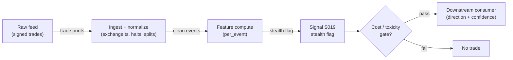

# S019 — Stealth trading (medium-size informed flow)

Detecting informed flow concentrated in medium-size trades (Barclay-Warner footprint). Provenance **[D]**.

> Tag law: every numeric literal in prose carries one of `[documented]
> [default] [example] [unverified] [internal-est] [measured]` (legend: Appendix
> i v1.0.0). Constants inside cited formulas inherit the formula's tag
> (`[documented]` for cited literature). Bibliographic years, volumes, pages,
> arXiv IDs, section numbers, rule codes (C1–C11), fail-safe codes (F1–F5),
> module IDs, and machine-parsed §0 data fields are identifiers, not
> literals, and are exempt.

## §1 Five-minute reviewer card

| Row | Value |
|---|---|
| Module | S019 — Stealth trading (medium-size informed flow), v1.1.0 |
| Edge verdict | `PREDICTIVE-FEATURE-ONLY` — documented empirical footprint (Barclay-Warner 1993): surveillance/risk flag, never a standalone trigger |
| After-cost | `BEFORE-COST` — a *surveillance flag* [documented]: medium-size trades carry the informed footprint - consumed by toxicity monitors and execution guards |
| Build cost | Tier M · `20–60` h [internal-est] · `$3,000–9,000` loaded [internal-est] |
| Data cost | Research `~$199`/mo (Polygon Stocks Advanced, real-time SIP L1 — vendor trading as Massive since 2026) [unverified]; production `~$200`/mo + usage (exchange-timestamped L1) [unverified] — bands indicative, verify before budgeting |
| latency_class | microstructure / sub-second |
| risk_class | low (signal-only; no order placement) |
| Capacity | `$1–10`M/day notional [example] — illustrative; calibrate per venue. Calibration sketch: `max_notional = participation_cap (0.001 [default]) × ADV × (1 / spread_regime_multiplier)` |
| Executability | Feasible: Python+polars prototype, `<=20` symbols live [internal-est]; Rust ingest beyond that |
| Risk summary | Flag risk: false stealth flags widen quotes unnecessarily; missed stealth costs adverse selection; dies on bucket drift; Z explodes if warmup sigma collapses (sigma floor fail-safe, §S10.10) |
| When it dies | Medium bucket `<10`% of flow [default] (S10.1); persistent false flags; cutoff miscalibration; warmup windows `<20` [default] (never flags) |
| Regime gates | Provisional: R001 elevated RV amplifies (stealth harder to isolate); R004 persistent informed-flow/toxicity amplifies (persistent stealth flag > `1` h [default] -> downstream toxicity regime) |
| Emits | `signal_vector` (Appendix b v1.0.0) — never orders |

## §1.5 Cheapest / least-build path

1. **Prototype hour band:** `20–60` h [internal-est] — S007-signed trade tape + size-bucket classifier + medium-bucket imbalance monitor + reference validation against the fixture
2. **Cheapest-source row:** min_tier = Polygon.io Stocks Advanced (SIP L1, real-time) — cheapest data source candidate [internal-est]; vendor trading as Massive since 2026 [unverified]; latency_class = SIP-delayed;
   required_fields = S007-signed trade price + size per print, trade condition codes (exclude auction/cross/odd-lot prints), exchange id; size-bucket cutoffs `500`/`10000` shares [documented] (Barclay-Warner 1993 boundaries); price_band = `~$199`/mo [unverified] (indicative — verify before budgeting; Starter/Developer tiers are 15-min delayed and unusable for live); build_or_buy = **build the monitor, buy the signed tape** (the monitor is `~50` lines [internal-est]; the value is the bucket calibration).
   Alternative cheapest buy for validation: Databento `trades` schema — `ts_event`, `ts_recv`, `price`, `size`, `action` (`'T'`), `side` (`A`=aggressor lifted ask, `B`=hit bid, `N`=unknown) [documented]; `$125` in free historical credits per team [documented].
3. **Resource budget:** `1` core, `<2` GB RAM for `<=20` symbols live [internal-est]; compute pattern `per_event`.
4. **Skip list:** order-level stealth attribution (phase `2`); cross-venue stealth aggregation
5. **DO-NOT-CUT list:** causality assertions (`assert fill_event >
   signal_event`, no-signal-bar-fills test); COST block + callable
   `expected_cost_bps`; F1–F5 fail-safes + module-state enum; decision-log
   audit records; bona-fide-intent + self-trade prevention; provenance tags on
   every numeric literal; fixtures + `test_cmd`; secrets via env only.
6. **Escalation gate:** stealth flag persistent (`>1` hour [default]) -> toxicity regime; live universe `>20` symbols [default]

## §S0 Module contract

### S0.1 Typed signature

```python
def signal(state: ModuleState, events: list[Event], cfg: Config) -> SignalVector:
```

`SignalVector` per Appendix b v1.0.0. `state` is the module-owned named state vector (`bucket_flow`, `stealth_flag`, `module_state`); `events` are canonical Events (Appendix a v1.0.0), newest last. The function handles documented edge cases: empty events → `UNKNOWN`; crossed/locked quotes → `UNKNOWN` (F1, never interpolate); halt/auction events → freeze per the market-state table.

### S0.2 Config dataclass

| Parameter | Type | Default | Range | Status |
|---|---|---|---|---|
| `small_cut` | int | `500` | `100`-`1000` | default |
| `large_cut` | int | `10000` | `5000`-`50000` | default |
| `stealth_z` | float | `2.0` | `1`-`3` | default |
| `cost_gate_k` | float | `0.5` | `0.1`-`2.0` | default |
| `window_s` | int | `300` | `60`-`1800` | default |
| `warmup_windows` | int | `78` | `20`-`390` | default |
| `min_warmup_windows` | int | `20` | `10`-`78` | default |
| `sigma_floor_frac` | float | `0.25` | `0.1`-`0.5` | default |

All defaults tagged per the tag law (status `default` ⇒ `[default]`).

**Parameter calibration procedures** (normative: follow these before production):

- `small_cut` / `large_cut` — `500` / `10000` shares [documented]: the Barclay-Warner (1993) boundaries (medium = `500`–`9999` shares [documented]; Chakravarty 2001 re-states this definition [documented]). These are the *research defaults*, not universal constants: modern fragmentation, odd lots, and retail wholesaling shift the size distribution. Calibration procedure: (a) on `60` trading days [default] of per-symbol tape, compute the empirical trade-size deciles; (b) grid-search cutoffs over `small_cut ∈ [100, 1000]` [default], `large_cut ∈ [5000, 50000]` [default]; (c) for each grid point, compute the medium-bucket share of signed volume and the Z-statistic hit rate against a toxicity benchmark (e.g. 5-min forward adverse selection); (d) choose the grid point maximizing hit rate with medium bucket in [`10`%, `60`%] of flow [default] — purged/embargoed OOS required. Sensitivity: **high** — ±`100` shares [example] at `small_cut` can move bucket share several points for liquid names [internal-est].
- `stealth_z` — `2.0` [default]: flag threshold on the warmup-normalized Z. Calibration: pick the z that maximizes precision on labeled adverse-selection windows in warmup data; `1.5`–`2.5` is the sane band [default]. Sensitivity: **medium** — false-flag rate grows roughly linearly as `stealth_z` drops below `1.5` [internal-est].
- `window_s` — `300` s [default]: aggregation window for the medium-bucket signed sum. Shorter windows raise event count but noisier Z; longer windows delay detection. Sensitivity: **medium**.
- `warmup_windows` — `78` [default] (≈ one session of 5-min windows): sample used to estimate `med_mu`/`med_sigma` via batch mean/std (Welford online update allowed). Re-estimate per session; drop windows overlapping halts/auctions. Sensitivity: **low** above `50` [default]; **high** below — see F-mode S10.9.
- `min_warmup_windows` — `20` [default]: hard gate; the module never flags before this many clean warmup windows (fail-safe, S10.9). Sensitivity: **high** (safety parameter, raise if false flags on thin names).
- `sigma_floor_frac` — `0.25` [default]: `sigma_floor = sigma_floor_frac × small_cut` shares (`125` shares at defaults [default]). If estimated sigma < floor → `DEGRADED`, never FLAG (fail-safe against zero-variance Z explosions, S10.10). Sensitivity: **medium**.
- `cost_gate_k` — `0.5` [default]: see the §S2 cost-gate predicate. Sensitivity: **medium**.

### S0.3 Canonical schema mapping

Vendor columns → canonical Event schema (Appendix a v1.0.0), stated once here:

| Vendor (Databento MBP-1) | Canonical |
|---|---|
| `ts_event` | `event_ts (int64 ns UTC)` |
| `price / size / sign` | `trade_px / trade_sz / d_i (S007)` |
| trade records (`action = 'T'`): `price`, `size` | `trade_px / trade_sz`; sign via S007 quote rule (preferred) |

**Databento `trades`-schema alternative (documented, cheaper than MBP-1 for research):** `ts_event` (matching-engine ns), `ts_recv` (capture-server ns — use as `asof_ts`), `price` (fixed-point ×`1e9` [documented]), `size`, `action` (always `'T'`), `side` ∈ {`A` (aggressor lifted ask → `d_i = +1`), `B` (hit bid → `d_i = -1`), `N` (unknown → fall back to S007 quote rule)} [documented]. The quote rule stays primary because `N` records and the SIP path provide no reliable side.

**Sentinels:** treat `UNDEF_PRICE` (`INT64_MAX` [documented]) as invalid → `UNKNOWN` (F1); never arithmetic on it.

**Halt/auction source:** Databento `status` schema (halt, pause, auction start) [documented] feeds the market-state table; absent status data → assume `CONTINUOUS_TRADING` only between `09:30`–`16:00` America/New_York and log the assumption.

Polygon.io mapping: `t` → `event_ts` (SIP time — label SIP work *simulated only — requires MBO/ITCH* for latency claims), `p` → `trade_px`, `s` → `trade_sz`, `x` → exchange id, `c` → trade condition codes (filter auction/cross/odd-lot prints out of the medium bucket [default]), `sip_timestamp`-style fields → `asof_ts` [unverified — verify field names against current Polygon/Massive docs before building].

### S0.4 Time contract

> Time contract: clock domain UTC, int64 ns; authoritative causality clock = `event_ts`; max_skew = `1` ms [default]; jitter budget = `500` µs [default]; bar-label = open time; staleness TTL = `3` s [default] (`3`× the `1`-s reference cadence per F4); gap policy = mask, no interpolation; halt/auction → discard contributions across reopen.

**Stealth-window sub-contract:** the Z statistic is computed per trailing window of `window_s` = `300` s [default]; normalization (`med_mu`, `med_sigma`) is estimated from the prior `warmup_windows` = `78` [default] clean windows (≈ one session of 5-min windows [default]); no flag before `min_warmup_windows` = `20` [default] clean windows (S10.9 fail-safe); windows overlapping halts/auctions are discarded from warmup, never interpolated; sigma floor = `sigma_floor_frac × small_cut` = `125` shares at defaults [default] (S10.10 fail-safe).

**Timing box:** `signal@t (per_event, America/New_York) → earliest fill @open(t+1)`

### S0.5 Market-state table

| State | Module behavior |
|---|---|
| CONTINUOUS_TRADING | Compute normally; emit per cadence |
| HALTED | Freeze state; emit `UNKNOWN`; discard contributions across reopen |
| AUCTION | No new signals; hold last `SignalVector`; state `DEGRADED` |
| CLOSED | Emit nothing; state `OFF` |

### S0.6 Module-state enum + error taxonomy

States per Appendix k v1.0.0: `OK | DEGRADED | UNKNOWN | OFF`. Invalid input → `UNKNOWN`, never interpolate (Appendix f v1.0.0, F1–F5).

| Failure | State | Alert |
|---|---|---|
| Missing/stale input (TTL per §S0.4) | `UNKNOWN` | page |
| Crossed/locked quote reaching module | `UNKNOWN` | log |
| Feature out of mathematical bounds (F2) | `UNKNOWN` | page |
| `seq` gap > `1,000` events [default] | `DEGRADED` (restart windows) | log |
| SIP jitter > budget persistently | `DEGRADED` | notify |
| Halt/auction | `UNKNOWN` / `DEGRADED` (per table) | log |
| Kill/administrative disable | `OFF` | page |
| Anything unmapped | `UNKNOWN` | page |

### S0.7 Ops tail

- **Schedule:** continuous during US equities regular session `09:30`–`16:00` America/New_York [documented]; owner: microstructure-signals on-call.
- **Health checks:** fixture replay (`test_cmd`) green on deploy; live `seq-gap` monitor; staleness watchdog at `3`× cadence [default].
- **Alert table:** page on `UNKNOWN` > `30` s [default] or bounds violation; notify on `DEGRADED`; log on single dropped events.
- **Resource budget:** `1` core, `<2` GB RAM for `<=20` symbols live [internal-est]; state is O(window) per symbol.
- **Runbook stub:** `1.` confirm feed (Databento status); `2.` replay fixture; `3.` if red → set `OFF`, page; `4.` reconcile decision log before re-arm.

### S0.8 Secrets (env-only)

`DATABENTO_API_KEY`, `POLYGON_API_KEY` via environment only. No secrets in this file, fixtures, or logs (CI secrets-grep).

### S0.9 May / must-NOT

> **May:** emit `SignalVector` records per Appendix b v1.0.0. **Must-NOT:** emit orders, order intents, prices, share counts, or notionals; call a broker; mutate shared state outside `state`; interpolate across gaps.

## §S1 Legacy (subsumed by §1)

Legacy §S1 content is the §1 reviewer card above; this header is retained so section numbering stays frozen.

## §S2 Specification

### Universe

US common stocks with signed trade feeds, screened: price ≥ `$5` [default], ADV ≥ `1`M shares/day [default], primary listing on NYSE/Nasdaq/ARCA [default]. Excluded from bucketing (but still counted for feed-health): odd-lot (sub-round-lot) prints, auction/open/close prints, cross prints — they pollute the medium bucket without carrying the documented footprint [default] (fail-mode S10.11).

### Entry rule (Boolean — no prose-only conditions)

```
ENTER_LONG  := (stealth_flag) -> toxicity flag: WIDEN quotes / CUT size (risk flag, not a directional trigger)
ENTER_SHORT := (stealth_flag) -> toxicity flag: WIDEN quotes / CUT size (risk flag, not a directional trigger)
FLAT        := otherwise
```

Stealth detection is a *risk flag*: it says informed flow may be present - widen quotes or cut size. Never a directional trigger. Flagging is gated on warmup (`min_warmup_windows` clean windows [default]) and the sigma floor (S10.10) — below either gate the module emits no flag.

### Exits (with post-exit cooldown)

```
EXIT := (stealth_flag for `>1` hour [default]) -> downstream toxicity regime; re-arm when flag clears for `30` min [default]
ON_EXIT: cooldown_until = now + cooldown_s   # 60 s [default]; C10
```

### Position sizing (fenced function)

```python
def size_shares(risk_budget_R, stop_distance, vol_estimate, ADV_cap, cost):
    # S-module requests capital fraction only; share math lives in the strategy.
    # Reference: capital = 0.5 * confidence  (confidence in [0,1])  [default]
    risk_notional = risk_budget_R * 0.5 * confidence          # [default] 0.5 factor
    shares = risk_notional / max(stop_distance, 1e-9)
    return int(min(shares, ADV_cap * adv_shares * 0.001))     # 0.1% ADV cap [default]
```

### Risk limits

| Limit | Value |
|---|---|
| Max capital fraction per signal | `0.5` [default] |
| Max adverse excursion before `UNKNOWN` review | `2.0`× stop [default] |
| Staleness kill | TTL per §S0.4 → `UNKNOWN` |

### COST block (single source of truth)

| Component | Value (bps) | Basis |
|---|---|---|
| Spread (half-spread, liquid large-cap) | `0.43` | [example] — reference print |
| Fees (taker incl. regulatory) | `0.806` | [documented] — Nasdaq taker `$0.0030`/share for shares ≥ `$1` [documented] → `0.60` bps at `$50` reference [documented]; SEC Section 31 FY2026 `$20.60`/M on covered sales, eff. 2026-04-04 [documented] → `0.206` bps |
| Borrow | `0.0` | [default] — reference build long-biased; shorts add C7 locate cost |
| Impact | `0.0` | [example] — flagged; calibrate per venue at scale-up |
| **Total reference** | `1.236` | [documented] — `0.43 + 0.806`; sell side |

`fee_schedule_as_of`: `2026-09-09` [measured] — Nasdaq price list (trading) and SEC FY2026 Section 31 advisory read on this date. `side: taker` [default]; venue/tier/source: XNAS / Databento MBP-1 [example]. SEC fee applies to sales only; buys carry `1.03` bps reference [documented]. Re-stating cost numbers outside this block is a validation failure.

```python
def expected_cost_bps(notional, adv_pct, venue, side, urgency) -> float:
    """Callable cost model — L2 constant stack (impact=0 flagged [example])."""
    spread_bps = 0.43                                    # [example]
    taker_per_share = 0.0030                            # [documented] Nasdaq, >=$1
    sec31_per_m = 20.60                                 # [documented] SEC FY2026, eff. 2026-04-04
    ref_px = 50.0                                       # [example] reference print
    fee_bps = taker_per_share / ref_px * 1e4            # 0.60 bps [documented]
    if side in ("taker", "sell"):
        fee_bps += sec31_per_m / 1e6 * 1e4              # +0.206 bps [documented]
    borrow_bps = 0.0    # [default] long-biased reference; reason in table
    impact_bps = 0.0    # [example] flagged; calibrate per venue at scale-up
    if side == "maker":
        fee_bps = -0.20  # rebate [example]
    return spread_bps + fee_bps + borrow_bps + impact_bps
```

### Execution / fill model table

| Aspect | Assumption |
|---|---|
| Latency | Signal→intent `≤1` ms colocated [example]; SIP path latency-simulated-only |
| Partial fills | N/A (signal-only; T-module policy: Appendix c v1.0.0) |
| Impact | `0.0` bps reference [example]; stress ×`5` [example] |
| Adverse fill | Toxic-flow haircut `0.2` bps per `1.0` |z| [example] |

### Robustness

Window/threshold sensitivity must be validated on purged/embargoed out-of-sample data; microstructure parameters mined on `1` month of tape overfit [internal-est]. Re-validate after any feed or venue change.

### Compliance sub-block (C1–C10+)

| Code | Rule: trigger → check → action → log |
|---|---|
| C1 | Self-match prevention: signal module emits no orders; downstream T-modules must set self-trade-prevention flags — this module asserts the requirement in its `consumes` contract |
| C2 | Bona-fide intent: every emitted `SignalVector` with |direction|=`1` must pass the cost gate; sub-threshold prints emit direction `0`, never a tradeable hint |
| C3 | Message-rate: `<=100` emissions/symbol/s [default]; breach -> throttle to `1`/s [default] + alert |
| C4 | Fat-finger trio (applied by consumers; this module bounds its own outputs): confidence in [`0`,`1`], capital in [`0`,`0.5`], computed_at sane - out-of-bounds -> `UNKNOWN` (F2) |
| C5 | Decision log: every emission, veto, and state transition logged per Appendix g v1.0.0, hash-chained |
| C6 | Halt/auction: per the market-state table; contributions across reopen discarded |
| C7 | Locate check: SHORT direction requires `locate_ok` from the consumer; never emit SHORT without the consumer asserting locate (Reg-SHO threshold securities -> direction `0`) |
| C8 | Public dissemination: no signal values published externally without review gate |
| C9 | Data entitlements: per the Data rights row; entitlement-class change -> escalation gate |
| C10 | Post-exit cooldown: no re-entry for `cooldown_s` after any exit or compliance block |
| C11 | Spoofing hygiene: down-weight quotes with lifetime `<50` ms [example]; never quote on them |

### Parameter table

| Parameter | Symbol | Value | Tag | Sensitivity |
|---|---|---|---|---|
| Small cutoff | `small_cut` | `500 shares` | [documented] | high |
| Large cutoff | `large_cut` | `10000 shares` | [documented] | high |
| Stealth z | `stealth_z` | `2.0` | [default] | medium |
| Cost-gate k | `cost_gate_k` | `0.5` | [default] | medium |
| Window | `window_s` | `300` s | [default] | medium |
| Warmup windows | `warmup_windows` | `78` | [default] | low above `50` |
| Min warmup | `min_warmup_windows` | `20` | [default] | high (safety) |
| Sigma floor frac | `sigma_floor_frac` | `0.25` | [default] | medium |

### Timing box

`signal@t (per_event, America/New_York) → earliest fill @open(t+1)`

## §S3 Math + normative pseudocode

Bucket signed volume into small / medium / large by size cutoffs. The cutoffs follow the Barclay-Warner (1993) definition: medium = `500`–`9999` shares [documented] (our `small_cut = 500`, `large_cut = 10000` [documented]); the module uses trade sizes in **shares**, not dollars [default] — do not silently convert to notional buckets. Aggregate over a trailing window of `window_s` = `300` s [default]; the **stealth statistic** is the medium bucket's signed imbalance normalized by warmup history:
$$Z^{med}_t = \frac{\sum_{i \in med,\,t-w}^{t} d_i v_i - \mu^{med}}{\sigma^{med}}.$$
Normalization: $\mu^{med}, \sigma^{med}$ are the batch mean/std of the window sums over the prior `warmup_windows` = `78` [default] clean windows (halt/auction-overlapping windows discarded, never interpolated); an online Welford update is acceptable if it matches the batch statistic to `1e-9` [default]. Flag when $Z^{med}_t \ge 2.0$ [default] **and** both fail-safes hold: at least `min_warmup_windows` = `20` [default] clean windows observed, and $\sigma^{med} \ge$ `sigma_floor` = `sigma_floor_frac × small_cut` = `125` shares [default] — otherwise emit `DEGRADED`, never a flag (S10.9, S10.10). Fixture (*example*): warmup gives `mu = 0`, `sigma = 300` from `78` windows [example]; medium-bucket signed volumes `[+300, -100, +500, +200]` -> sum `+900` -> `Z = 3.0` -> FLAG. The flag is a *surveillance output*: it describes suspected informed flow, never a trade trigger [documented].

**Normative pseudocode** (pseudocode is normative; prose is commentary):

```
function signal(state, events, cfg) -> SignalVector:
    assert events non-empty else return UNKNOWN                    # F1
    assert no UNDEF_PRICE sentinel else return UNKNOWN             # F1
    signed = signed_trades(events)                                # S007 (quote rule; Databento side A/B/N corroboration where present)
    med = [d*v for (d, v) in signed if cfg.small_cut <= v < cfg.large_cut
           and trade_condition_ok(v)]                             # odd-lot/auction/cross filtered, S2 universe
    window_sum = sum(med over trailing cfg.window_s seconds)
    assert window_sum is not None else return FLAT(DEGRADED)       # no medium flow
    clean = state.clean_windows_count                              # halt/auction windows excluded
    assert clean >= cfg.min_warmup_windows else return FLAT(DEGRADED)  # S10.9 warmup gate
    (mu, sigma) = state.med_mu, state.med_sigma                   # from cfg.warmup_windows batch stats
    floor = cfg.sigma_floor_frac * cfg.small_cut
    assert sigma >= floor else return FLAT(DEGRADED)               # S10.10 sigma floor
    z = (window_sum - mu) / sigma
    assert isfinite(z) else return UNKNOWN                        # F2
    edge_bps = 0.0                                                 # [example] flag-only
    # normative cost-gate predicate: expected_cost_bps(...) <= k * edge_bps
    flag = z >= cfg.stealth_z
    sig = SignalVector(symbol, direction=0, confidence=min(abs(z)/4.0, 1.0), capital=0.0,
                       computed_at=events[-1].event_ts, staleness=now()-events[-1].asof_ts,
                       module_state=state.module_state,
                       aux={"stealth_z": z, "stealth_flag": flag,
                            "window_sum": window_sum, "clean_windows": clean,
                            "med_mu": mu, "med_sigma": sigma})
    log_decision(sig, inputs_hash, params_hash)                    # C5 / Appendix g
    update_state: state.med_mu, state.med_sigma recomputed per session from clean windows (Welford or batch)
    assert fill_event > signal_event  # t->t+1 causality: flag at t guards execution after t
    return sig
```

Causality: the flag uses trades strictly up to `t`; it guards execution after `t` - it never re-labels the trades that raised it. Mandatory unit test: no-signal-bar fills.

## §S4 Worked example (fixture-backed)

- Tape: `modules/fixtures/S019_tape.csv` — `# TYPE: validation-run`; header comments pin the warmup: `# MED_MU: 0.0`, `# MED_SIGMA: 300.0`, `# WARMUP_WINDOWS: 78`, `# MIN_WARMUP_WINDOWS: 20`, `# STEALTH_Z: 2.0`, `# SIGMA_FLOOR_SHARES: 125.0` (all numbers synthetic [example], seed `20260919` [example]). `4` medium-bucket signed trades (`+300, -100, +500, +200` shares), all numbers synthetic, seed `20260919` [example].
- Expected outputs: `modules/fixtures/S019_expected.csv`; per-trade signed volume, cumulative sum, and `z = (cum_sum − mu)/sigma`: `1.0`, `0.6666…`, `2.3333…`, `3.0`; final `sum = +900`, `Z = 3.0` -> FLAG; hand-checked below.
- Tolerance: `1e-9` [default] on floats; integer contributions exact.
- Acceptance tests (`modules/tests/test_S019.py`, `8` tests): `1.` fixture recomputes to expected (incl. `z` column); `2.` stub emits valid `SignalVector` (direction in {+1,-1,0}, confidence/capital in [0,1]); `3.` no-signal-bar fills (`fill_event_ts > computed_at`); `4.` cost-gate predicate passes on large edge, blocks on tiny edge (`k = 0.5` [default]) and pins the documented fee stack total `1.236` bps; `5.` invalid input -> `UNKNOWN`; `6.` Z flag arithmetic (`3.0 >= 2.0`); `7.` warmup gate: `< min` clean windows -> `DEGRADED`, never flags; `8.` sigma floor: sigma collapse -> `DEGRADED`, never flags.
- `test_cmd`: `python -m pytest modules/tests/test_S019.py -q` → exits `0`.

**Hand-checked rows** (arithmetic verified by hand against the fixture):

- `+300 - 100 + 500 + 200 = +900` ✓
- `z_1 = 300/300 = 1.0`; `z_2 = 200/300 = 0.6666…`; `z_3 = 700/300 = 2.3333…`; `z_4 = (900 − 0)/300 = 3.0 >= 2.0` -> FLAG ✓
- sigma floor check: `300 >= 125` ✓ (would fail at `sigma < 125` → `DEGRADED`)

**Where the example is optimistic:** no fees, no latency, no hidden liquidity — arithmetic illustration, not a backtest.

## §S5 Strategies that use this signal

Generated from `deps.yaml` (CI symmetry). Provisional consumer list (roles pinned at ingest):

| Strategy | Role |
|---|---|
| T-series execution consumers (see `deps.yaml`) | Downstream consumer of this signal family's direction/confidence outputs; exact strategy IDs pinned at ingest |

The stealth flag feeds toxicity monitors and execution guards; consumer roles pinned in `deps.yaml`.

## §S6 Data required

| Field | Type | Granularity | Source tier | Notes |
|---|---|---|---|---|
| Best bid/ask price + displayed size | float / int | every quote event (L1) | Tier 2 | displayed size per price move |
| Trade price + size + condition codes | float / int / code | every trade print | Tier 2 | `c` (Polygon) / exchange conditions; filter auction/cross/odd-lot prints out of bucketing [default] |
| Exchange / venue id | code | per event | Tier 2 | `x` (Polygon) / `publisher_id` (Databento); needed for per-venue bucket calibration |
| Exchange timestamps + capture timestamps | int64 ns | per event | Tier 2 | `ts_event` (causality) + `ts_recv`/`asof_ts` (staleness); SIP adds 10s of µs jitter [documented] — label SIP work *simulated only — requires MBO/ITCH* |
| Trade side (aggressor) | enum {A,B,N} | per trade | Tier 2 | Databento `trades` schema `side` [documented]: A=lifted ask, B=hit bid, N=unknown → S007 quote rule fallback |
| Halt/auction status | enum | event-driven | Tier 2 | Databento `status` schema [documented]; drives the market-state table |
| Corporate actions / halts | reference | daily + intraday halt feed | Tier 1 | contributions garbage across splits/halt reopens |

**Data rights row** (Appendix j v1.0.0): US equities L1 via Databento MBP-1, `rights: licensed`; license scope = research + stated production symbol count; raw ticks never leave our systems — fixtures are synthetic; entitlement = professional/internal, no display; retention per vendor terms, purge path in runbook. Entitlement-class change → §1.5 escalation gate.

## §S7 Local build (M5 Max / 128 GB)

Feasible. O(`1`) [documented] per-event scan: Python loop `~100–500`k events/s [internal-est] vs `~50–500` L1 events/s average per liquid name, busy bursts `~1–5`k/s [internal-est] (cost-model §2). `50` symbols × `2`k events/s = `100`k/s → Python borderline, Rust (`5–50`M/s [internal-est]) comfortable; polars batch recompute each second trivial. Bottleneck is I/O and timestamp normalization. RAM: one symbol-day L1 `~0.5–4` GB [internal-est] — fine for a few symbols; `60` days does not fit — stream per-symbol daily parquet (cost-model §3).

## §S8 Buy vs build

Build the estimator (Python+polars), buy the feed. Verdict: the per-event math is `~40–100` lines [internal-est]; the value is normalization, windows, and calibration — none sold by vendors. Cheapest documented research buy: Databento `trades` schema (aggressor side included, `$125`/team in free historical credits [documented]); MBP-1 only if you also need quote updates for the S007 quote rule. Live: Tier-1 SIP for research, direct/MBO only after the signal survives realistic costs (cost-model §6).

## §S9 Efficacy — documented evidence

| Study / source | Market & period | Metric | Before/after cost | Caveat |
|---|---|---|---|---|
| Barclay & Warner (1993) [documented] | NYSE, `108` tender offers, 1981–1984 [documented] | Stealth trading: medium-size trades (`500`–`9999` shares [documented]) account for an estimated `92.8`% of cumulative price change during the pre-tender-offer announcement period [documented] | `BEFORE-COST` | event-selected sample (tender-offer targets with pre-announcement price rises); old market structure |
| Chakravarty (2001) [documented] | NYSE, TORQ data, Nov 1990–Jan 1991, `63` trading days [documented] | Medium-size trades associated with the highest cumulative stock price change across all size classes — about `79`% [documented]; almost all of it from institution-initiated medium-size trades, disproportionate to their share of trades/volume [documented] | `BEFORE-COST` | surveillance-only; not a tradable rule |

Measurement notes [documented] (Chakravarty 2001): per-trade price change = trade price minus previous trade price [documented]; TORQ audit-trail accuracy ≈ `98`% (Hasbrouck et al. 1993) [documented]; analysis conditions on stocks with significant price increases to detect one-sided stealth flow [documented]; institutions = account types P+A in the audit file [documented].

Selection disclosure: the `2` papers surfaced by the chapter's research pass; efficacy is statistical-footprint evidence only — neither paper gives a tradable rule or after-cost P&L, so this module stays `PREDICTIVE-FEATURE-ONLY`; modern-decay caveats kept in S12 leads [unverified].

## §S10 Failure modes & pitfalls

| # | Trigger → Detect → Action → Recovery | check: |
|---|---|---|
| 1 | Bucket drift: cutoffs miscalibrated for the name -> detect: medium bucket < 10% of flow [default] -> action: `DEGRADED`, recalibrate -> recovery: bucket shares back in band | `check: medium_share >= 0.10 [default]` |
| 2 | Lookahead leakage: bar-close feature traded intra-bar → detect: causality audit flags `fill_event <= signal_event` → action: halt, fix bar finalization → recovery: re-run no-signal-bar-fills test | `check: all(fill_ts > computed_at)` |
| 3 | Staleness/latency: feed timestamps in a race → detect: jitter > budget → action: `DEGRADED`, label simulated-only → recovery: direct feed or stand down | `check: asof_ts - event_ts <= jitter_budget` |
| 4 | Fleeting quotes/spoofing: displayed size cancels pre-execution → detect: quote lifetime `<50` ms [example] share rising → action: down-weight sub-`50` ms quotes → recovery: re-tune weights | `check: fleeting_share < 0.3 [default]` |
| 5 | Cost blowup: spread+fees+impact on the round trip → detect: cost gate failing on `[measured]` costs → action: widen `k` gate or stand down → recovery: re-pin fee schedule | `check: expected_cost_bps(...) <= k * edge_bps` |
| 6 | Regime breaks: depth/volatility regime shifts → detect: feature distribution break → action: veto entries → recovery: resume when stable for `5` min [default] | `check: feature_z_within_3_sigma [default]` |
| 7 | Overfitting: parameters mined on `1` period → detect: OOS decay → action: purged/embargoed re-validation → recovery: shrink per-symbol | `check: oos_sharpe > 0.5 * is_sharpe [default]` |
| 8 | Data errors: bad ticks, splits, halts → detect: bounds/`seq`-gap monitors → action: `UNKNOWN`, mask bars → recovery: backfill and replay | `check: no crossed quotes in window` |
| 9 | Warmup insufficiency: cold start or thin name → detect: clean windows < `min_warmup_windows` (`20` [default]) → action: `DEGRADED`, never flags (hard gate in §S3 pseudocode) → recovery: flagging resumes when window count crosses the gate | `check: clean_windows >= min_warmup_windows` |
| 10 | Sigma collapse: near-deterministic medium bucket (e.g. single repeated print size) → detect: estimated sigma < floor (`sigma_floor_frac × small_cut` = `125` shares [default]) → action: `DEGRADED`, never flags (prevents zero-variance Z explosion) → recovery: re-estimate next session; raise `sigma_floor_frac` if chronic | `check: med_sigma >= sigma_floor` |
| 11 | Condition-code pollution: odd-lot/auction/cross prints land in the medium bucket → detect: share of bucket volume from excluded condition codes > `5`% [default] → action: drop excluded prints from bucketing, alert → recovery: re-verify condition-code mapping after feed change | `check: excluded_condition_share <= 0.05 [default]` |

### Regime-gate machine records (provisional)

| regime_id | direction | mechanism | condition | action | min_lag | unknown_behavior |
|---|---|---|---|---|---|---|
| R001 | amplifies | elevated realized volatility widens spreads and deepens adverse selection | RV > `2`× trailing median [example] | widen_stops | `1` session [example] | hold last label |
| R002 | degrades | quote flicker / spoofing regimes inject noise into book features | fleeting-quote share > `0.3` [example] | halve | `30` min [example] | veto entries |
| R003 | degrades | halt/auction regimes break continuity assumptions | market_state != CONTINUOUS_TRADING | pause_entry | `0` | veto entries |
| R004 | amplifies | persistent informed-flow / toxicity regimes confirm the footprint | stealth flag persistent > `1` h [default] | widen_stops | `1` session [example] | hold last label |

## §S11 Visuals

`../../images/S019_example.png` — synthetic `4`-trade stealth panel (seed `20260919` [example]): medium-bucket signed volumes.



## §S12 Source log + unverified leads

**Sources** (citable facts only):

1. Barclay, M. J., Warner, J. B. (1993) [documented]. "Stealth trading and volatility: Which trades move prices?" *Journal of Financial Economics* 34(3), 281-305.
2. Chakravarty, S. (2001) [documented]. "Stealth-trading: Which traders' trades move stock prices?" *Journal of Financial Economics* 61(2), 289-307. Working-paper text with full findings (medium = 500–9,999 shares; 92.8% BW93 figure; ~79% figure; TORQ 63-day sample; ~98% audit accuracy) read from https://econwpa.ub.uni-muenchen.de/econ-wp/fin/papers/0201/0201003.pdf on 2026-09-10.
3. SEC (2026) [documented]. Section 31 Transaction Fee Rate Advisory for Fiscal Year 2026 (Feb. 27, 2026): $20.60 per $1M, effective April 4, 2026 — https://www.sec.gov/rules-regulations/fee-rate-advisories/2026-2. COST block SEC component.
4. Nasdaq Trader price list (Trading) [documented]: fee to remove liquidity `$0.0030`/share, shares ≥ `$1.00` — https://www.nasdaqtrader.com/trader.aspx?id=pricelisttrading2&l. COST block taker component.
5. Databento schema documentation (via third-party technical guides, unverified against vendor docs): `trades` schema fields (`ts_event`, `ts_recv`, `price` fixed-point ×1e9, `size`, `action='T'`, `side ∈ {A,B,N}`), `UNDEF_PRICE = INT64_MAX`, `status` schema for halts/auctions — https://www.linkedin.com/pulse/databento-opra-deep-dive-technical-guide-donald-nguyen-kd8cc. Treat as unverified until confirmed in Databento's own docs; filed under leads below.

**Chatbot source log.** Chatbot answers pending (checked 2026-09-10) - grok-answers.md and cursor-answers.md were absent from batches/SB10/.

**Unverified leads** (chatbot-only — never in evidence tables):

- Claims that the stealth footprint has decayed in modern markets circulate in practitioner notes; no checkable test found - treated as unverified.
- Medium-bucket recalibration for modern market structure (odd lots, retail wholesaling, fragmentation): the documented 500/9999 boundaries are 1990s NYSE; what the equivalent "medium" is on 2026 consolidated tape is an open calibration question - GROK-NEEDED: "In modern US consolidated tape (fragmented venues, odd lots, retail wholesaling), what trade-size band empirically corresponds to the Barclay-Warner 'medium' informed bucket, and which studies document it?"
- Polygon.io (now trading as Massive) pricing and trade-feed field names: Stocks Advanced at `~$199`/mo real-time (reported by a third-party integration doc, 2026-06-05) [unverified]; field names `p`/`s`/`t`/`x`/`c` [unverified] — verify at the vendor before building.
- Databento schema details in item 5 above are third-party-sourced; confirm `side` enum, `UNDEF_PRICE`, and `status` schema against Databento's own docs - GROK-NEEDED: "What are the exact field names and enum values of the Databento `trades` and `status` schemas for US equities (DBEQ), including side/aggressor encoding and halt indicators?"
- Nasdaq taker fee `$0.0030`/share read from a SEC-filing-derived price list snapshot; tiered fees for high-volume MPIDs may be lower — pin the exact tier for the production MPID.
- SEC Section 31 rate changes annually; the FY2026 `$20.60`/M figure is only valid while in effect — re-pin `fee_schedule_as_of` at least yearly.

---

## Appendix — AI build prompt (S019)

Copy-paste into any chat agent:

> Build module **S019 — Stealth trading (medium-size informed flow)** per
> `notes/module-template.md` v1.0.0 and this file's §S0 contract.
> Cheapest path (§1.5): prototype 20–60 h [internal-est]; cheapest data
> candidate Polygon.io Stocks Advanced (SIP L1, real-time; vendor now Massive) — `~$199`/mo [unverified], or Databento `trades` schema with `$125` free credits [documented]; compute pattern `per_event`; skip order-level/cross-venue.
> Bucket cutoffs `500`/`10000` shares [documented] (Barclay-Warner 500–9999).
> Implement `signal(state, events, cfg) -> SignalVector` (Appendix b v1.0.0)
> with the §S3 normative pseudocode: window the medium-bucket signed sum over
> `300` s [default], normalize by warmup (`78` windows [default]) mu/sigma,
> enforce the `20`-window warmup gate [default] and the `125`-share sigma
> floor [default] (both -> `DEGRADED`, never flag), filter odd-lot/auction/cross
> prints from the bucket [default]; include the cost-gate predicate
> `expected_cost_bps(...) <= k * edge_bps` (documented fee components:
> Nasdaq taker `$0.0030`/share [documented], SEC §31 FY2026 `$20.60`/M
> [documented]) and `assert fill_event > signal_event`. Wire F1–F5
> (Appendix f v1.0.0): invalid input -> `UNKNOWN`, never interpolate. Log
> decisions per Appendix g v1.0.0. Secrets via env only. Run the fixture
> `modules/fixtures/S019_tape.csv` (`# TYPE: validation-run`) against
> `modules/fixtures/S019_expected.csv` (tolerance `1e-9` [default]).
> **Definition of done:** `python3 -m pytest modules/tests/test_S019.py -q`
> exits `0`. Tag every numeric literal you add with the unified enum
> (Appendix i v1.0.0); put anything unverifiable in §S12 unverified leads.
