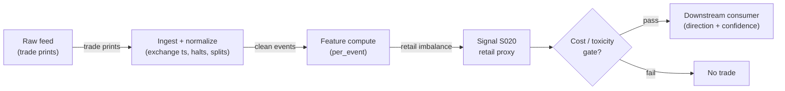

# S020 — Retail and odd-lot imbalance

Sub-penny and odd-lot prints as the retail-flow proxy - fading or following the crowd. Provenance **[D]**.

> Tag law: every numeric literal in prose carries one of `[documented]
> [default] [example] [unverified] [internal-est] [measured]` (legend: Appendix
> i v1.0.0). Constants inside cited formulas inherit the formula's tag
> (`[documented]` for cited literature). Bibliographic years, volumes, pages,
> arXiv IDs, section numbers, rule codes (C1–C11), fail-safe codes (F1–F5),
> module IDs, and machine-parsed §0 data fields are identifiers, not
> literals, and are exempt.

## §1 Five-minute reviewer card

| Row | Value |
|---|---|
| Module | S020 — Retail and odd-lot imbalance, v1.0.1 |
| Edge verdict | `PREDICTIVE-FEATURE-ONLY` — documented retail-flow proxy (Boehmer et al. 2021): sentiment input, never a standalone trigger |
| After-cost | `BEFORE-COST` — a *retail-sentiment input* [documented]: sub-penny/TRF imbalance proxies retail direction; odd-lot imbalance reported separately (contaminated proxy per O'Hara et al. 2014 [documented]) - consumed by sentiment composites, not by standalone rules |
| Build cost | Tier M · `20–60` h [internal-est] · `$3,000–9,000` loaded [internal-est] |
| Data cost | Research `~$29`/mo delayed SIP [unverified]; production `~$199`/mo real-time SIP [unverified]; alternative Databento Standard `~$199`/mo live + usage-based history [documented] — bands indicative, verify before budgeting |
| latency_class | microstructure / sub-second |
| risk_class | low (signal-only; no order placement) |
| Capacity | `$1–10`M/day notional [example] — illustrative; calibrate per venue |
| Executability | Feasible: Python+polars prototype, `<=20` symbols live [internal-est]; Rust ingest beyond that |
| Risk summary | Proxy risk: identification is approximate (Type I/II errors documented — Battalio et al. 2022); odd lots are NOT pure retail (informed/HFT clientele — O'Hara et al. 2014); regime changes break it; dies on retail-share collapse |
| When it dies | Retail share `<5`% [default] (S10.1); tick-size regime change (Rule 612 half-penny amendment currently STAYED — SEC Release 34-101899, `2024-12-12` [documented]); wholesaler internalization shifts |
| Regime gates | Machine records in §S10 (provisional): R001 elevated RV → `widen_stops`; R002 spoofing regimes → `halve`; R003 halt/auction → `pause_entry` |
| Emits | `signal_vector` (Appendix b v1.0.0) — never orders |

## §1.5 Cheapest / least-build path

1. **Prototype hour band:** `20–60` h [internal-est] — trade tape + retail-print filter (sub-penny/odd-lot, fuzzy-midpoint exclusion) + imbalance averager + reference validation against the fixture
2. **Cheapest-source row:** min_tier = Polygon.io Stocks Advanced (SIP L1, real-time) — cheapest data source candidate [internal-est]; Polygon rebranded "Massive" in `2026` [unverified]; latency_class = SIP-delayed;
   required_fields = trade price (full precision — sub-penny detection) + size per print; TRF/exchange code (`D` = FINRA TRF [documented]); NBBO bid/ask at trade time (fuzzy-midpoint exclusion); exchange timestamps; price_band = `~$199`/mo real-time, `~$29`/mo delayed Starter (research-only, `15`-min delayed) [unverified] (indicative — verify before budgeting); build_or_buy = ****build the filter, buy the trade feed** (the filter is `~60–120` lines [internal-est]; the value is the retail-identification discipline)**.
   Alternative cheapest-source row [documented]: Databento US Equities Standard `~$199`/mo live + usage-based historical (per `2025-01-13` pricing change); `~$2.00`/GB historical for DBEQ.BASIC MBP-1 class data [unverified — dated sheet, verify]. The feed MUST expose venue/TRF codes and full-precision prices — a quotes-only or penny-rounded feed cannot implement this module.
3. **Resource budget:** `1` core, `<2` GB RAM for `<=20` symbols live [internal-est]; compute pattern `per_event`.
4. **Skip list:** broker-identified retail feeds (phase `2`); wholesaler attribution; payment-for-order-flow analytics; best-odd-lot-order (BOLO) SIP fields until producers adopt them (compliance `May 2026` [documented])
5. **DO-NOT-CUT list:** causality assertions (`assert fill_event >
   signal_event`, no-signal-bar-fills test); COST block + callable
   `expected_cost_bps`; F1–F5 fail-safes + module-state enum; decision-log
   audit records; bona-fide-intent + self-trade prevention; provenance tags on
   every numeric literal; fixtures + `test_cmd`; secrets via env only.
6. **Escalation gate:** retail proxy degrades (tick-size regime change) [default]; live universe `>20` symbols [default]

## §S0 Module contract

### S0.1 Typed signature

```python
def signal(state: ModuleState, events: list[Event], cfg: Config) -> SignalVector:
```

`SignalVector` per Appendix b v1.0.0. `state` is the module-owned named state vector (`retail_flow`, `imb_series`, `ri_ewma`, `module_state`); `events` are canonical Events (Appendix a v1.0.0), newest last. The function handles documented edge cases: empty events → `UNKNOWN`; crossed/locked quotes → `UNKNOWN` (F1, never interpolate); halt/auction events → freeze per the market-state table; warm-up (fewer than `warmup_prints` retail prints) → `UNKNOWN` (F2).

### S0.2 Config dataclass

| Parameter | Type | Default | Range | Status |
|---|---|---|---|---|
| `window_min` | int | `30` | ``5`-`390`` | calibrate |
| `imb_z` | float | `2.0` | ``1`-`3`` | calibrate |
| `min_retail_share` | float | `0.05` | ``0.01`-`0.2`` | default |
| `cost_gate_k` | float | `0.5` | ``0.1`-`2.0`` | default |
| `warmup_prints` | int | `20` | ``5`-`390`` | default |
| `tick_size` | float | `0.01` | `{0.005, 0.01}` | default |
| `sign_method` | str | `"subpenny"` | `{"subpenny","midpoint"}` | default |

Status `calibrate` ⇒ parameter MUST be fitted per the §S2 calibration recipe before production; `default` statuses tagged `[default]` per the tag law.

### S0.3 Canonical schema mapping

Vendor columns → canonical Event schema (Appendix a v1.0.0), stated once here:

| Vendor (Databento MBP-1 / trades) | Canonical |
|---|---|
| `ts_event` | `event_ts (int64 ns UTC)` |
| `price / size` | `trade_px / trade_sz` |
| `exchange` / TRF code | `venue` (`"TRF"` iff FINRA TRF `"D"` [documented]) |
| `bid_px / ask_px` | `nbbo_bid / nbbo_ask` (at-trade quote for fuzzy-midpoint exclusion) |
| trade conditions | `trade_conditions` (filter odd-lot/cross conditions per tape spec) |
| `ts_in_delta` (participant ts) | `participant_ts` (SIP jitter audit) |

Polygon.io mapping: `t` → `event_ts` (SIP time — label SIP work *simulated only — requires MBO/ITCH* for latency claims), `p`/`s` bid/ask → `bid_px`/`bid_sz`, etc.; require the trade object fields carrying exchange/TRF code and full-precision price [unverified — confirm against current vendor docs before wiring].

### S0.4 Time contract

> Time contract: clock domain UTC, int64 ns; authoritative causality clock = `event_ts`; max_skew = `1` ms [default]; jitter budget = `500` µs [default]; bar-label = open time; staleness TTL = `3` s [default] (`3`× the `1`-s reference cadence per F4); gap policy = mask, no interpolation; halt/auction → discard contributions across reopen. Staleness is computed from `asof_ts - event_ts` (event-clock only — never wall clock).

**Timing box:** `signal@t (per_event, America/New_York) → earliest fill @open(t+1)`

### S0.5 Market-state table

| State | Module behavior |
|---|---|
| CONTINUOUS_TRADING | Compute normally; emit per cadence |
| HALTED | Freeze state; emit `UNKNOWN`; discard contributions across reopen |
| AUCTION | No new signals; hold last `SignalVector`; state `DEGRADED` |
| CLOSED | Emit nothing; state `OFF` |

### S0.6 Module-state enum + error taxonomy

States per Appendix k v1.0.0: `OK | DEGRADED | UNKNOWN | OFF`. Invalid input → `UNKNOWN`, never interpolate (Appendix f v1.0.0, F1–F5).

| Failure | State | Alert |
|---|---|---|
| Missing/stale input (TTL per §S0.4) | `UNKNOWN` | page |
| Crossed/locked quote reaching module | `UNKNOWN` | log |
| Feature out of mathematical bounds (F2) | `UNKNOWN` | page |
| Warm-up incomplete (< `warmup_prints`) | `UNKNOWN` | log |
| `seq` gap > `1,000` events [default] | `DEGRADED` (restart windows) | log |
| SIP jitter > budget persistently | `DEGRADED` | notify |
| Halt/auction | `UNKNOWN` / `DEGRADED` (per table) | log |
| Kill/administrative disable | `OFF` | page |
| Anything unmapped | `UNKNOWN` | page |

### S0.7 Ops tail

- **Schedule:** continuous during US equities regular session `09:30`–`16:00` America/New_York [documented]; owner: microstructure-signals on-call.
- **Health checks:** fixture replay (`test_cmd`) green on deploy; live `seq-gap` monitor; staleness watchdog at `3`× cadence [default].
- **Alert table:** page on `UNKNOWN` > `30` s [default] or bounds violation; notify on `DEGRADED`; log on single dropped events.
- **Resource budget:** `1` core, `<2` GB RAM for `<=20` symbols live [internal-est]; state is O(window) per symbol.
- **Runbook stub:** `1.` confirm feed (Databento status); `2.` replay fixture; `3.` if red → set `OFF`, page; `4.` reconcile decision log before re-arm.

### S0.8 Secrets (env-only)

`DATABENTO_API_KEY`, `POLYGON_API_KEY` via environment only. No secrets in this file, fixtures, or logs (CI secrets-grep).

### S0.9 May / must-NOT

> **May:** emit `SignalVector` records per Appendix b v1.0.0. **Must-NOT:** emit orders, order intents, prices, share counts, or notionals; call a broker; mutate shared state outside `state`; interpolate across gaps; fold odd-lot prints into the retail imbalance numerator (odd-lot imbalance is a separate `aux` metric — §S3).

## §S1 Legacy (subsumed by §1)

Legacy §S1 content is the §1 reviewer card above; this header is retained so section numbering stays frozen.

## §S2 Specification

### Universe

US NMS common stocks priced ≥ `$1.00` [documented] (Rule 612 sub-penny quotation ban floor — wholesaler sub-penny *executions* still occur [documented]); liquid, retail-active names with stable retail share ≥ `5`% [default]. Exclude sub-`$1.00` names (identification logic breaks). If the Rule 612 half-penny tick ever activates (currently STAYED — SEC Release 34-101899, `2024-12-12` [documented]), `tick_size` must be re-pinned per stock before use.

### Entry rule (Boolean — no prose-only conditions)

```
RETAIL_BULLISH := (retail_imb_z >= imb_z)    # [default] imb_z = 2.0
RETAIL_BEARISH := (retail_imb_z <= -imb_z)
ENTER_LONG  := RETAIL_BULLISH -> retail-bullish flag (sentiment input, not a standalone trigger)
ENTER_SHORT := RETAIL_BEARISH -> retail-bearish flag (sentiment input, not a standalone trigger)
FLAT        := otherwise
```

Retail imbalance is a *sentiment input*: it feeds a composite, optionally faded. `direction` stays `0` by doctrine; the flags ride in `aux`. It is never a standalone directional trigger.

### Exits (with post-exit cooldown)

```
EXIT := (retail proxy share < min_retail_share [default]) -> `DEGRADED`; no directional exit
ON_EXIT: cooldown_until = now + cooldown_s   # 60 s [default]; C10
```

### Position sizing (fenced function)

```python
def size_shares(risk_budget_R, stop_distance, vol_estimate, ADV_cap, cost):
    # S-module requests capital fraction only; share math lives in the strategy.
    # Reference: capital = 0.5 * confidence  (confidence in [0,1])  [default]
    risk_notional = risk_budget_R * 0.5 * confidence          # [default] 0.5 factor
    shares = risk_notional / max(stop_distance, 1e-9)
    return int(min(shares, ADV_cap * adv_shares * 0.001))     # 0.1% ADV cap [default]
```

### Risk limits

| Limit | Value |
|---|---|
| Max capital fraction per signal | `0.5` [default] |
| Max adverse excursion before `UNKNOWN` review | `2.0`× stop [default] |
| Staleness kill | TTL per §S0.4 → `UNKNOWN` |

### COST block (single source of truth)

| Component | Value (bps) | Basis |
|---|---|---|
| Spread (half-spread, liquid large-cap) | `0.43` | [example] — reference print |
| Fees (taker incl. regulatory) | `0.30` | [example] — reference print |
| Borrow | `0.0` | [default] — reference build long-biased; shorts add C7 locate cost |
| Impact | `0.0` | [example] — flagged; calibrate per venue at scale-up |
| **Total reference** | `0.73` | [example] |

`fee_schedule_as_of`: `2026-09-01` [unverified] — placeholder; pin the real venue schedule before production. Context: SEC cut the Rule 610 access-fee cap `$0.003` → `$0.001`/share (Release 34-101070, `2024-09-18` [documented]); implementation stayed/exempted pending DC Circuit litigation — do NOT assume current schedules [documented]. `side: taker` [default]; venue/tier/source: XNAS / Databento MBP-1 [example]. Re-stating cost numbers outside this block is a validation failure.

```python
def expected_cost_bps(notional, adv_pct, venue, side, urgency) -> float:
    """Callable cost model — L2 constant stack (impact=0 flagged [example])."""
    spread_bps = 0.43   # [example]
    fee_bps = 0.30      # [example]
    borrow_bps = 0.0    # [default] long-biased reference; reason in table
    impact_bps = 0.0    # [example] flagged; calibrate per venue at scale-up
    if side == "maker":
        fee_bps = -0.20  # rebate [example]
    return spread_bps + fee_bps + borrow_bps + impact_bps
```

### Execution / fill model table

| Aspect | Assumption |
|---|---|
| Latency | Signal→intent `≤1` ms colocated [example]; SIP path latency-simulated-only |
| Partial fills | N/A (signal-only; T-module policy: Appendix c v1.0.0) |
| Impact | `0.0` bps reference [example]; stress ×`5` [example] |
| Adverse fill | Toxic-flow haircut `0.2` bps per `1.0` |z| [example] |

### Robustness

Window/threshold sensitivity must be validated on purged/embargoed out-of-sample data; microstructure parameters mined on `1` month of tape overfit [internal-est]. Re-validate after any feed or venue change. Proxy error bounds: BJZZ identifies `<1/3` of true retail trades and mislabels institutional sub-penny prints as retail (Battalio et al. 2022 [documented]) — treat `RI` as a noisy proxy with both Type I and Type II error, not an identified flow.

### Compliance sub-block (C1–C10+)

| Code | Rule: trigger → check → action → log |
|---|---|
| C1 | Self-match prevention: signal module emits no orders; downstream T-modules must set self-trade-prevention flags — this module asserts the requirement in its `consumes` contract |
| C2 | Bona-fide intent: every emitted `SignalVector` with |direction|=`1` must pass the cost gate; this module emits direction `0` always — sub-threshold prints emit no tradeable hint |
| C3 | Message-rate: `<=100` emissions/symbol/s [default]; breach -> throttle to `1`/s [default] + alert |
| C4 | Fat-finger trio (applied by consumers; this module bounds its own outputs): confidence in [`0`,`1`], capital in [`0`,`0.5`], computed_at sane - out-of-bounds -> `UNKNOWN` (F2) |
| C5 | Decision log: every emission, veto, and state transition logged per Appendix g v1.0.0, hash-chained |
| C6 | Halt/auction: per the market-state table; contributions across reopen discarded |
| C7 | Locate check: SHORT direction requires `locate_ok` from the consumer; never emit SHORT without the consumer asserting locate (Reg-SHO threshold securities -> direction `0`) |
| C8 | Public dissemination: no signal values published externally without review gate |
| C9 | Data entitlements: per the Data rights row; entitlement-class change -> escalation gate |
| C10 | Post-exit cooldown: no re-entry for `cooldown_s` after any exit or compliance block |
| C11 | Spoofing hygiene: down-weight quotes with lifetime `<50` ms [example]; never quote on them |

### Parameter table

| Parameter | Symbol | Value | Tag | Sensitivity |
|---|---|---|---|---|
| Window | `window_min` | `30 min` | [default]→calibrate | high |
| Imbalance z | `imb_z` | `2.0` | [default]→calibrate | medium |
| Min retail share | `min_retail_share` | `0.05` | [default] | high |
| Cost-gate k | `cost_gate_k` | `0.5` | [default] | medium |
| Warm-up prints | `warmup_prints` | `20` | [default] | low |
| Tick size | `tick_size` | `0.01` | [default] | high |
| Sign method | `sign_method` | `"subpenny"` | [default] | medium |

### Calibration recipe (status `calibrate` parameters only)

Per the S0.2 contract, `calibrate` parameters MUST be fitted before production; `default` parameters ship with the stated values [internal-est procedure]:

- `window_min`: estimate the autocorrelation of `RI` on `≥20` sessions [internal-est] of tape per symbol; set the window to the lag where autocorrelation first falls below `0.1` [internal-est]; validate the flag-rate stability on purged/embargoed out-of-sample data. Thin names: pool by liquidity decile.
- `imb_z`: fit the empirical distribution of `retail_imb_z`; choose the threshold at the tail quantile matching the target flag rate (e.g. `±2.5`% tails [internal-est]); confirm the flagged imbalance predicts the composite's next-window return with the expected sign on OOS data.
- `min_retail_share` (default, not calibrated): universe screen — documented retail share of US equity volume ran `20–25`% through `2025` [unverified — third-party summaries citing SIFMA/Nasdaq]; the `5`% [default] floor is a death threshold, not a target.
- `cost_gate_k`: `0.5` [default]; open calibration item (proposal §6: `0.5` vs T002-style `2` pending calibration data).

### Timing box

`signal@t (per_event, America/New_York) → earliest fill @open(t+1)`

## §S3 Math + normative pseudocode

**Retail identification (Boehmer et al. 2021 [documented]).** Retail marketable orders are internalized or sold to wholesalers, printed off-exchange (TAQ exchange code `"D"` — FINRA TRF [documented]) with sub-penny price improvement (common improvement amounts `0.01`, `0.1`, `0.2` cents [documented]). Normative identification rule:

```
is_retail_proxy(t) := (t.venue == "TRF") AND subpenny(t.price, tick_size)
                      AND NOT fuzzy_midpoint(t.price, nbbo)          # [documented]
subpenny(p, tick)  := p is NOT on the symbol's minimum pricing increment grid
fuzzy_midpoint     := (p - bid)/(ask - bid) in [0.4, 0.6]            # [documented]
```

Fuzzy-midpoint exclusion: trades in the `[0.4, 0.6]` spread band around the midpoint are NOT retail [documented]. **Tick-awareness:** "sub-penny" is relative to the symbol's current minimum pricing increment (`tick_size`; `$0.01` today, `$0.005` if Rule 612 ever activates [documented]) — never hard-code the penny.

**Direction signing.** Sub-penny signing [documented]: buy if the price fraction sits above `0.6` of the spread, sell if below `0.4`. Documented refinement (`sign_method="midpoint"`): signing against the quote midpoint cuts mis-signing from `28`% to `5`% on `85,000` placed retail trades (Barber et al. 2024 [documented]); the default stays `"subpenny"` [default] for literature fidelity, with `"midpoint"` the recommended production fallback.

**Odd lots.** Odd lot = `< 100` shares [documented] (O'Hara, Yao & Ye 2014: median `24`% of trades, up to `60`%+ in some names; `35`% of price discovery [documented]). **Normative decision:** odd lots are NOT pure retail — algorithmic slicing and informed traders dominate odd-lot flow [documented]. The module therefore computes odd-lot imbalance as a SEPARATE `aux` metric (`oddlot_imb`), never folded into `RI`.

**Retail imbalance:**
$$RI_t = \frac{\sum_{i \in R_t} d_i v_i}{\sum_{i \in R_t} v_i},\quad Z^{RI}_t = \frac{RI_t - \bar{RI}}{s_{RI}},$$
with $\bar{RI}, s_{RI}$ from a burn-in EWMA over `warmup_prints` retail prints (`20` [default]). Flag when $|Z^{RI}_t| \ge 2.0$ [default]. Fixture (*example*): retail-proxy prints `[+80, +120, -50, +40]` -> net `+190`, total `290`, `RI = 0.6552`; with reference `(mean, std) = (0.10, 0.25)` [example], `z = 2.2207` -> retail-bullish flag.

**Normative pseudocode** (pseudocode is normative; prose is commentary):

```
function is_retail_proxy(t, cfg, nbbo) -> bool:
    assert t.price > 0 and t.size > 0 else return False            # F1
    on_grid = abs(t.price / cfg.tick_size - round(t.price / cfg.tick_size)) < 1e-9
    if on_grid or t.venue != "TRF": return False                 # sub-penny + off-exchange [documented]
    spread = nbbo.ask - nbbo.bid
    if spread > 0:
        f = (t.price - nbbo.bid) / spread
        if 0.4 <= f <= 0.6: return False                          # fuzzy-midpoint exclusion [documented]
    return True

function sign_print(t, nbbo, cfg) -> int:
    if cfg.sign_method == "midpoint":                            # [documented] refinement, 28%->5% mis-signing
        mid = (nbbo.bid + nbbo.ask) / 2
        return +1 if t.price > mid else (-1 if t.price < mid else 0)
    f = (t.price - nbbo.bid) / (nbbo.ask - nbbo.bid)             # sub-penny signing [documented]
    return +1 if f > 0.6 else (-1 if f < 0.4 else 0)

function signal(state, events, cfg) -> SignalVector:
    assert events non-empty else return UNKNOWN                    # F1
    nbbo = latest_nbbo(events); assert nbbo valid else return UNKNOWN   # F1
    prox = [t for t in trades(events) if is_retail_proxy(t, cfg, nbbo)]
    odd  = [t for t in trades(events) if t.size < 100]            # [documented]; aux only
    retail_vol = sum(t.size for t in prox); tot_vol = sum(t.size for t in trades(events))
    share = retail_vol / tot_vol if tot_vol > 0 else 0.0
    assert share >= cfg.min_retail_share else return FLAT(DEGRADED)  # [default]
    ri = sum(sign_print(t, nbbo, cfg) * t.size for t in prox) / retail_vol
    (mean, std, n) = state.ri_ewma.update(ri)
    assert n >= cfg.warmup_prints else return UNKNOWN             # F2 warm-up
    assert std > 0 else return UNKNOWN                            # F2 degenerate window
    z = (ri - mean) / std
    assert isfinite(z) else return UNKNOWN                        # F2
    bullish = z >= cfg.imb_z; bearish = z <= -cfg.imb_z          # sentiment flags; direction stays 0
    odd_imb = sum(sign_print(t, nbbo, cfg) * t.size for t in odd) / sum(t.size for t in odd) if odd else 0.0
    edge_bps = 0.0                                                # [example] sentiment input only: cost gate always binds
    # normative cost-gate predicate: expected_cost_bps(...) <= k * edge_bps
    sig = SignalVector(symbol, direction=0, confidence=min(abs(z)/4.0, 1.0), capital=0.0,
                       computed_at=events[-1].event_ts,
                       staleness=events[-1].asof_ts - events[-1].event_ts,   # event-clock, never wall clock
                       module_state=state.module_state,
                       aux={"retail_imb": ri, "retail_imb_z": z,
                            "retail_bullish": bullish, "retail_bearish": bearish,
                            "retail_share": share,
                            "oddlot_imb": odd_imb, "oddlot_note": "contaminated-proxy [documented]"})
    log_decision(sig, inputs_hash, params_hash)                    # C5 / Appendix g
    assert fill_event > signal_event  # t->t+1 causality: window closes before the flag is used
    return sig
```

Causality: the retail window closes before the flag is emitted; the flag informs the next window - never the prints that formed it. Mandatory unit test: no-signal-bar fills.

## §S4 Worked example (fixture-backed)

- Tape: `modules/fixtures/S020_tape.csv` — `# TYPE: validation-run`; `8` prints mixing TRF sub-penny (retail), fuzzy-midpoint excluded, exact-midpoint, exchange penny prints, and odd-lot prints (`80`, `50`, `90`, `40` shares); all numbers synthetic, seed `20260920` [example]. `bid=100.00`, `ask=100.02` fixed for the fixture [example].
- Expected outputs: `modules/fixtures/S020_expected.csv`; per-print `is_subpenny`, `spread_frac`, `is_retail_proxy`, `is_odd_lot`, signed volume; cumulative retail-only net/total over the `4` retail-proxy prints (`1`,`2`,`3`,`6`).
- Pinned reference moments (fixture header): `ri_mean_ref=0.10`, `ri_std_ref=0.25` [example]; `imb_z=2.0` [default].
- Tolerance: `1e-9` [default] on floats; integer contributions exact; test uses `1e-4` relative tolerance [example].
- Acceptance tests (`modules/tests/test_S020.py`, `10` tests): `1.` fixture recomputes to expected (identification flags + cum net/total); `2.` imbalance + z pinned (`RI=0.6552`, `z=2.2207` → bullish flag; retail share `290/1030=0.2816 ≥ 0.05` [default]); `3.` fuzzy-midpoint and exact-midpoint prints excluded from the proxy; `4.` odd-lot reported as separate aux metric, never folded into RI; `5.` stub emits valid `SignalVector` (direction `0` by doctrine, confidence/capital in [0,1], aux flags); `6.` no-signal-bar fills (`fill_event_ts > computed_at`); `7.` cost-gate predicate passes on large edge, blocks on tiny edge (`k = 0.5` [default]); `8.` invalid input → `UNKNOWN`; `9.` stub is deterministic across calls; `10.` tick-aware sub-penny (`tick=0.005` on-grid vs `tick=0.01` off-grid).
- `test_cmd`: `python -m pytest modules/tests/test_S020.py -q` → exits `0`.

**Hand-checked rows** (arithmetic verified by hand against the fixture):

- Retail-proxy prints: `1`,`2`,`3`,`6` (prints `4` fuzzy-midpoint-excluded, `5` midpoint, `7`,`8` exchange penny prints) ✓
- `+80 + 120 - 50 + 40 = +190` ✓
- `80 + 120 + 50 + 40 = 290` ✓
- `RI = 190/290 = 0.6552` ✓
- `z = (0.6552 - 0.10)/0.25 = 2.2207 ≥ 2.0` → `retail_bullish = True` ✓
- Retail share `= 290/1030 = 0.2816 ≥ 0.05` ✓
- Odd-lot: prints `1`,`3`,`4`,`6` (`<100` shares); net `+160`, total `260`, `oddlot_imb = 0.6154` (aux only) ✓

**Where the example is optimistic:** no fees, no latency, no hidden liquidity — arithmetic illustration, not a backtest. Fixed `100.00/100.02` NBBO [example] (real NBBO flickers — the fuzzy-midpoint band is re-evaluated per print live); TRF reporting lag and wholesaler sign noise are not modeled; retail identification is approximate (see §S10 rows 9–10).

## §S5 Strategies that use this signal

Generated from `deps.yaml` (CI symmetry). Provisional consumer list (roles pinned at ingest):

| Strategy | Role |
|---|---|
| T-series execution consumers (see `deps.yaml`) | Downstream consumer of this signal family's direction/confidence outputs; exact strategy IDs pinned at ingest |

Retail imbalance feeds sentiment composites; consumer roles pinned in `deps.yaml`. S007 (signed flow) is the confirmation consumer per §0 `consumes`.

## §S6 Data required

| Field | Type | Granularity | Source tier | Notes |
|---|---|---|---|---|
| Trade price (full precision) | float | per print | Tier 2 | sub-penny detection needs > `2` dp [documented] (the `$0.01` grid); penny-rounded feeds cannot implement this module |
| Trade size | int | per print | Tier 2 | odd-lot threshold `100` shares [documented]; retail-proxy volume weights |
| Venue / TRF code | enum | per print | Tier 2 | `"D"` = FINRA TRF [documented] — the off-exchange filter |
| Trade conditions | bitmask/list | per print | Tier 2 | filter odd-lot/cross conditions per tape spec |
| NBBO bid/ask at trade | float | per print (quote) | Tier 2 | fuzzy-midpoint exclusion [documented]; midpoint signing refinement |
| Best bid/ask price + displayed size | float / int | every quote event (L1) | Tier 2 | displayed size per price move |
| Exchange timestamps | int64 ns | per event | Tier 2 | SIP adds 10s of µs jitter [documented] — label SIP work *simulated only — requires MBO/ITCH* |
| Per-stock tick size | reference | biannual eval [documented] | Tier 1 | Rule 612 TWAQ-spread eval cadence; tick-aware sub-penny grid |
| Corporate actions / halts | reference | daily + intraday halt feed | Tier 1 | contributions garbage across splits/halt reopens |

**Data rights row** (Appendix j v1.0.0): US equities L1 via Databento MBP-1, `rights: licensed`; license scope = research + stated production symbol count; raw ticks never leave our systems — fixtures are synthetic; entitlement = professional/internal, no display; retention per vendor terms, purge path in runbook. Entitlement-class change → §1.5 escalation gate.

## §S7 Local build (M5 Max / 128 GB)

Feasible. O(`1`) [documented] per-event scan: Python loop `~100–500`k events/s [internal-est] vs `~50–500` L1 events/s average per liquid name, busy bursts `~1–5`k/s [internal-est] (cost-model §2). `50` symbols × `2`k events/s = `100`k/s → Python borderline, Rust (`5–50`M/s [internal-est]) comfortable; polars batch recompute each second trivial. Bottleneck is I/O and timestamp normalization. RAM: one symbol-day L1 `~0.5–4` GB [internal-est] — fine for a few symbols; `60` days does not fit — stream per-symbol daily parquet (cost-model §3).

## §S8 Buy vs build

Build the estimator (Python+polars), buy the feed. Verdict: the per-event math is `~40–120` lines [internal-est]; the value is normalization, windows, and calibration — none sold by vendors. Buy Databento MBP-1 history to validate, Tier-1 SIP for live research, direct/MBO only after the signal survives realistic costs (cost-model §6). For the cheapest tier, Polygon.io Stocks Advanced (SIP L1, `~$199`/mo [unverified]) exposes TRF-coded trades; confirm field availability in current docs before wiring.

## §S9 Efficacy — documented evidence

| Study / source | Market & period | Metric | Before/after cost | Caveat |
|---|---|---|---|---|
| Boehmer, Jones, Zhang & Zhang (2021) [documented] | US equities | tracking retail investor activity (sub-penny/TRF identification) | `BEFORE-COST` | proxy identification, not a rule |
| Barber, Odean & Zhu (2009) [documented] | US equities | retail trading behavior and attention | `BEFORE-COST` | behavioral evidence, not a rule |
| O'Hara, Yao & Ye (2014) [documented] | US equities, `2008–2011` | odd lots: median `24`% of trades (up to `60`%+), `35`% of price discovery; historically excluded from consolidated tape | `BEFORE-COST` | odd lots are NOT pure retail — informed/HFT clientele; this is why S020 reports odd-lot imbalance separately |
| Battalio, Jennings, Saglam & Wu (2022) [documented] | US equities, wholesaler proprietary data | BJZZ identifies `<1/3` of true retail trades; many institutional prints on non-midpoint sub-penny prices → Type I + Type II errors, low correlation with true retail imbalance | `BEFORE-COST` | working paper; both error directions — the proxy is noisy, not identified flow |
| Barber et al. (2024) "A (Sub)penny For Your Thoughts" [documented] | `85,000` placed retail trades, Dec `2021`–Jun `2022` | BJZZ identifies `35`% of trades; `28`% mis-signing → `5`% with quote-midpoint signing; `30`% of stocks get uninformative imbalance | `BEFORE-COST` | working paper; validates the `sign_method="midpoint"` fallback |

Selection disclosure: the `5` papers surfaced by the chapter's research pass plus the `2026-09-11` deep-review search; wholesaler-attribution claims kept in S12 leads [unverified].

## §S10 Failure modes & pitfalls

| # | Trigger → Detect → Action → Recovery | check: |
|---|---|---|
| 1 | Proxy decay: tick-size or wholesaler regime change breaks identification -> detect: retail share < 5% [default] -> action: `DEGRADED` -> recovery: re-validate identification or retire | `check: retail_share >= 0.05 [default]` |
| 2 | Lookahead leakage: bar-close feature traded intra-bar → detect: causality audit flags `fill_event <= signal_event` → action: halt, fix bar finalization → recovery: re-run no-signal-bar-fills test | `check: all(fill_ts > computed_at)` |
| 3 | Staleness/latency: feed timestamps in a race → detect: jitter > budget → action: `DEGRADED`, label simulated-only → recovery: direct feed or stand down | `check: asof_ts - event_ts <= jitter_budget` |
| 4 | Fleeting quotes/spoofing: displayed size cancels pre-execution → detect: quote lifetime `<50` ms [example] share rising → action: down-weight sub-`50` ms quotes → recovery: re-tune weights | `check: fleeting_share < 0.3 [default]` |
| 5 | Cost blowup: spread+fees+impact on the round trip → detect: cost gate failing on `[measured]` costs → action: widen `k` gate or stand down → recovery: re-pin fee schedule | `check: expected_cost_bps(...) <= k * edge_bps` |
| 6 | Regime breaks: depth/volatility regime shifts → detect: feature distribution break → action: veto entries → recovery: resume when stable for `5` min [default] | `check: feature_z_within_3_sigma [default]` |
| 7 | Overfitting: parameters mined on `1` period → detect: OOS decay → action: purged/embargoed re-validation → recovery: shrink per-symbol | `check: oos_sharpe > 0.5 * is_sharpe [default]` |
| 8 | Data errors: bad ticks, splits, halts → detect: bounds/`seq`-gap monitors → action: `UNKNOWN`, mask bars → recovery: backfill and replay | `check: no crossed quotes in window` |
| 9 | Proxy Type I/II contamination: institutional sub-penny non-midpoint prints mislabeled retail; `<1/3` of true retail captured (Battalio et al. 2022 [documented]) → detect: sign-error monitor on wholesaler reconciliation sample → action: switch `sign_method` to `"midpoint"` [default fallback], re-tune windows → recovery: re-validate on labeled sample | `check: estimated_sign_error < 0.10 [default]` |
| 10 | Odd-lot contamination: algo-sliced/informed odd lots dominate the `<100`-share tape (O'Hara et al. 2014 [documented]) → detect: odd-lot share >> retail share → action: keep `oddlot_imb` in `aux` only, never in RI (by design) → recovery: none (structural) | `check: oddlot_imb_reported_separately` |
| 11 | Tick-regime change: Rule 612 half-penny tick activates → sub-penny grid shifts; the `$0.01`-hardcoded identification breaks → detect: `tick_size` change per stock → action: `DEGRADED`, re-pin `tick_size` → recovery: re-validate identification on the new grid. Status: amendment STAYED (SEC Release 34-101899, `2024-12-12` [documented]) — this row is armed, not live | `check: tick_size == exchange_tick(symbol)` |
| 12 | Odd-lot SIP data expansion: best-odd-lot-order (BOLO) dissemination compliance from the first business day of May `2026` (Release 34-101070 [documented]) changes odd-lot data availability → detect: BOLO fields present in feed → action: none required (aux upgrade candidate) → recovery: n/a | `check: feed_schema_version >= bolo_schema` |

### Regime-gate machine records (provisional)

| regime_id | direction | mechanism | condition | action | min_lag | unknown_behavior |
|---|---|---|---|---|---|---|
| R001 | amplifies | elevated realized volatility widens spreads and deepens adverse selection | RV > `2`× trailing median [example] | widen_stops | `1` session [example] | hold last label |
| R002 | degrades | quote flicker / spoofing regimes inject noise into book features | fleeting-quote share > `0.3` [example] | halve | `30` min [example] | veto entries |
| R003 | degrades | halt/auction regimes break continuity assumptions | market_state != CONTINUOUS_TRADING | pause_entry | `0` | veto entries |

## §S11 Visuals

`../../images/S020_example.png` — synthetic `8`-print retail panel (seed `20260920` [example]): retail-proxy signed volumes with fuzzy-midpoint exclusions marked.



## §S12 Source log + unverified leads

**Sources** (citable facts only):

1. Boehmer, E., Jones, C. M., Zhang, X., Zhang, X. (2021) [documented]. "Tracking Retail Investor Activity." *Journal of Finance* 76(5), 2249-2305.
2. Barber, B. M., Odean, T., Zhu, N. (2009) [documented]. "Do Retail Trades Move Markets?" *Review of Financial Studies* 22(1), 151-186.
3. O'Hara, M., Yao, C., Ye, M. (2014) [documented]. "What's Not There: Odd Lots and Market Data." *Journal of Finance* 69(5), 2199-2236.
4. Battalio, R., Jennings, R., Saglam, M., Wu, J. (2022) [documented]. "Identifying Market Maker Trades as 'Retail' from TAQ: No Shortage of False Negatives and False Positives." Working paper (SSRN draft).
5. Barber, B. M. et al. (2024) [documented]. "A (Sub)penny For Your Thoughts: Tracking Retail Investor Activity in TAQ." Working paper — validation of the BJZZ method on `85,000` placed retail trades (Dec `2021`–Jun `2022`); quote-midpoint signing refinement.
6. SEC Release No. 34-101070 (Sep `2024`) [documented]. Regulation NMS amendments: Rule 612 second minimum pricing increment (`$0.005` for stocks with TWAQ spread ≤ `$0.015`); Rule 610 access-fee cap `$0.003` → `$0.001`/share; round-lot redefinition; best-odd-lot-order (BOLO) dissemination (compliance first business day of May `2026`).
7. SEC Release No. 34-101899 (Dec `2024`) [documented]. Order granting partial stay of the Final Rule, including the Rule 612 tick-size amendment, pending DC Circuit resolution.
8. Databento pricing change announcement (`2025-01-13`) [documented]. US Equities Standard plan `~$199`/mo live + usage-based historical.

**Chatbot source log.** Chatbot answers pending (checked 2026-09-10) - grok-answers.md and cursor-answers.md were absent from batches/SB10/.

**Unverified leads** (chatbot-only — never in evidence tables):

- Wholesaler-attributed retail identification (broker feeds) circulates in vendor marketing; no checkable specification found - treated as unverified.
- GROK-NEEDED: for a retail-sentiment input like S020 (direction `0` by doctrine, only bullish/bearish flags into a composite), what calibration objective is standard for `imb_z` — tail-quantile flag-rate matching, or maximizing the composite's next-window information coefficient on purged/embargoed OOS data? State the objective, the embargo/walk-forward design, and the minimum OOS sample you would require before trusting it.
- GROK-NEEDED: does the current best practice for the BJZZ fuzzy-midpoint exclusion use the fixed `[0.4, 0.6]` spread band, a spread-proportional band, or a wholesaler-specific lag-structure table — and what is the sign-error cost of each choice on names where the wholesaler mix is unknown?
- Final DC Circuit outcome for Rules 610/612 (the `2025-10-31` temporary exemptive relief order is the last checkable docket event found) — monitor before relying on half-penny ticks in production [unverified].

---

## Appendix — AI build prompt (S020)

Copy-paste into any chat agent:

> Build module **S020 — Retail and odd-lot imbalance** per
> `notes/module-template.md` v1.0.0 and this file's §S0 contract.
> Cheapest path (§1.5): prototype 20–60 h [internal-est]; cheapest data
> candidate Polygon.io Stocks Advanced (SIP L1, `~$199`/mo real-time) [unverified]; compute pattern `per_event`; skip broker-feeds/PFOF.
> Implement `signal(state, events, cfg) -> SignalVector` (Appendix b v1.0.0)
> with the §S3 normative pseudocode — including the BJZZ identification rule
> (TRF + sub-penny, tick-aware, fuzzy-midpoint `[0.4, 0.6]` exclusion)
> [documented], the cost-gate predicate
> `expected_cost_bps(...) <= k * edge_bps`, and `assert fill_event >
> signal_event`. Report odd-lot imbalance as a separate `aux` metric, never in
> the RI numerator (O'Hara et al. 2014 [documented]). Wire F1–F5 (Appendix f
> v1.0.0): invalid input -> `UNKNOWN`, never interpolate. Log decisions per
> Appendix g v1.0.0. Secrets via env only. Run the fixture `modules/fixtures/S020_tape.csv`
> (`# TYPE: validation-run`) against `modules/fixtures/S020_expected.csv`
> (tolerance `1e-9` [default]).
> **Definition of done:** `python3 -m pytest modules/tests/test_S020.py -q`
> exits `0`. Tag every numeric literal you add with the unified enum
> (Appendix i v1.0.0); put anything unverifiable in §S12 unverified leads.
