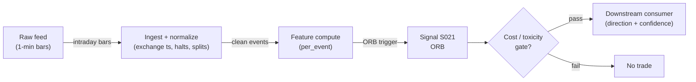

# S021 — Opening-range breakout

Trading the break of the first-N-minute high/low - the classic intraday momentum trigger. Provenance **[D]**.

> Tag law: every numeric literal in prose carries one of `[documented]
> [default] [example] [unverified] [internal-est] [measured]` (legend: Appendix
> i v1.0.0). Constants inside cited formulas inherit the formula's tag
> (`[documented]` for cited literature). Bibliographic years, volumes, pages,
> arXiv IDs, section numbers, rule codes (C1–C11), fail-safe codes (F1–F5),
> module IDs, and machine-parsed §0 data fields are identifiers, not
> literals, and are exempt.

## §1 Five-minute reviewer card

| Row | Value |
|---|---|
| Module | S021 — Opening-range breakout, v1.0.1 |
| Edge verdict | `PREDICTIVE-FEATURE-ONLY` — documented intraday pattern (Fisher; Crabel; WPI thesis): before-cost only - the edge is in the failure fade, per the chapter |
| After-cost | `BEFORE-COST` — a *conditional intraday trigger* [documented]: the breakout works only with volume confirmation and a hard time stop - most breaks fail, and the chapter's verdict centers the failure fade |
| Build cost | Tier M · `20–60` h [internal-est] · `$3,000–9,000` loaded [internal-est] |
| Data cost | Research `~$29`/mo (Massive Stocks Starter — 15-min delayed 1-min aggregates, `5`-yr history) [unverified — third-party pricing snapshot, verify at massive.com/pricing]; production real-time `~$199`/mo (Stocks Advanced, `20`+ yr history) + usage [unverified] — bands indicative, verify before budgeting |
| latency_class | microstructure / sub-second |
| risk_class | low (signal-only; no order placement) |
| Capacity | `$1–10`M/day notional [example] — illustrative; calibrate per venue |
| Executability | Feasible: Python+polars prototype, `<=20` symbols live [internal-est]; Rust ingest beyond that |
| Risk summary | Trigger risk: most breaks fail - the fade is the edge; dies on fakeouts and thin opens |
| When it dies | Win rate `<40`% over `60` days [default] (retire); fakeout rate `>60`% [default]; thin opens |
| Regime gates | Provisional: R001 elevated RV amplifies (ranges widen - fewer clean breaks); trend days amplify follow-through |
| Emits | `signal_vector` (Appendix b v1.0.0) — never orders |

## §1.5 Cheapest / least-build path

1. **Prototype hour band:** `20–60` h [internal-est] — intraday bar tape + opening-range calculator + breakout detector with volume filter + reference validation against the fixture
2. **Cheapest-source row:** min_tier = Massive (formerly Polygon.io) Stocks Starter — `$29`/mo [unverified]; latency_class = 15-min delayed SIP (research/backtest only, never live);
   required_fields = 1-min OHLCV bars (regular session, open-time labeled); opening-range length; trailing volume-z baseline window; price_band = `$29`/mo research (Stocks Starter) → `$79`/mo Developer (`10`-yr history) → `$199`/mo Advanced real-time (`20`+ yr history, unlimited calls) [unverified — community pricing snapshots, early 2026; verify at massive.com/pricing before budgeting]; build_or_buy = **build the detector, buy the intraday feed** (the detector is `~80` lines [internal-est]; the value is the confirmation and time-stop discipline). Live trading requires the real-time tier — the delayed tier is research-only.
3. **Resource budget:** `1` core, `<2` GB RAM for `<=20` symbols live [internal-est]; compute pattern `per_event`.
4. **Skip list:** multi-timeframe ORB (phase `2`); overnight-gap variants; options-flow confirmation; Crabel's stretch-variant entry (documented alternative — evaluate in phase `2` [unverified])
5. **DO-NOT-CUT list:** causality assertions (`assert fill_event >
   signal_event`, no-signal-bar-fills test); COST block + callable
   `expected_cost_bps`; F1–F5 fail-safes + module-state enum; decision-log
   audit records; bona-fide-intent + self-trade prevention; provenance tags on
   every numeric literal; fixtures + `test_cmd`; secrets via env only.
6. **Escalation gate:** breakout win rate `<40`% over `60` days [default] -> retire; live universe `>20` symbols [default]; moving from research to live -> upgrade Starter to Advanced (real-time)

## §S0 Module contract

### S0.1 Typed signature

```python
def signal(state: ModuleState, events: list[Event], cfg: Config) -> SignalVector:
```

`SignalVector` per Appendix b v1.0.0. `state` is the module-owned named state vector (`or_high`, `or_low`, `or_end_ts`, `break_state ∈ {ARMED, FIRED_LONG, FIRED_SHORT}`, `cooldown_until`, `module_state`); `events` are canonical Events (Appendix a v1.0.0), newest last. The function handles documented edge cases: empty events → `UNKNOWN`; crossed/locked quotes → `UNKNOWN` (F1, never interpolate); halt/auction events → freeze per the market-state table.

### S0.2 Config dataclass

| Parameter | Type | Default | Range | Status |
|---|---|---|---|---|
| `or_minutes` | int | `30` | ``5`-`60`` | default |
| `vol_z_min` | float | `1.5` | ``0`-`3`` | default |
| `vol_z_window` | int | `30` | ``5`-`120`` | default |
| `vol_z_min_n` | int | `10` | ``5`-`30`` | default |
| `time_stop_min` | int | `60` | ``15`-`390`` | default |
| `buffer_bps` | float | `2.0` | ``0`-`10`` | default |
| `cooldown_s` | int | `1800` | ``60`-`7200`` | default |
| `edge_bps` | float | `2.0` | ``0.5`-`20`` | example |
| `no_new_after_min` | int | `330` | ``60`-`390`` | default |
| `cost_gate_k` | float | `0.5` | ``0.1`-`2.0`` | default |
| `cost_venue` | str | `"XNAS"` | — | default |
| `cost_side` | str | `"taker"` | `taker\|maker\|mixed` | default |
| `cost_urgency` | str | `"normal"` | — | default |
| `ref_notional` | float | `1e6` | — | example |
| `ref_adv_pct` | float | `1e-2` | — | example |

All defaults tagged per the tag law (status `default` ⇒ `[default]`; status `example` ⇒ `[example]`). `vol_z_window`/`vol_z_min_n` define the normative volume-z baseline (§S3); `cooldown_s` is the single post-exit cooldown (was `30` min [default] in one line and `60` s [default] in another — unified here, the contradiction fixed in v1.0.1); `edge_bps` is the reference before-cost edge the cost gate prices against; `no_new_after_min` is the session-minute cutoff for new signals (`330` min after `09:30` = `15:00` [default]); `ref_notional`/`ref_adv_pct` are the reference trade the cost gate evaluates.

### S0.3 Canonical schema mapping

Vendor columns → canonical Event schema (Appendix a v1.0.0), stated once here:

| Vendor (Databento MBP-1) | Canonical |
|---|---|
| `ts_event` | `event_ts (int64 ns UTC)` |
| `open/high/low/close/volume` | `bar_o/h/l/c/v (1-min)` |

Polygon.io mapping: `t` → `event_ts` (SIP time — label SIP work *simulated only — requires MBO/ITCH* for latency claims), `p`/`s` bid/ask → `bid_px`/`bid_sz`, etc.

### S0.4 Time contract

> Time contract: clock domain UTC, int64 ns; authoritative causality clock = `event_ts`; max_skew = `1` ms [default]; jitter budget = `500` µs [default]; bar-label = open time; staleness TTL = `3` s [default] (`3`× the `1`-s reference cadence per F4); gap policy = mask, no interpolation; halt/auction → discard contributions across reopen.

**Timing box:** `signal@t (per_event, America/New_York) → earliest fill @open(t+1)`

### S0.5 Market-state table

| State | Module behavior |
|---|---|
| CONTINUOUS_TRADING | Compute normally; emit per cadence |
| HALTED | Freeze state; emit `UNKNOWN`; discard contributions across reopen |
| AUCTION | No new signals; hold last `SignalVector`; state `DEGRADED` |
| CLOSED | Emit nothing; state `OFF` |

### S0.6 Module-state enum + error taxonomy

States per Appendix k v1.0.0: `OK | DEGRADED | UNKNOWN | OFF`. Invalid input → `UNKNOWN`, never interpolate (Appendix f v1.0.0, F1–F5).

| Failure | State | Alert |
|---|---|---|
| Missing/stale input (TTL per §S0.4) | `UNKNOWN` | page |
| Crossed/locked quote reaching module | `UNKNOWN` | log |
| Feature out of mathematical bounds (F2) | `UNKNOWN` | page |
| `seq` gap > `1,000` events [default] | `DEGRADED` (restart windows) | log |
| SIP jitter > budget persistently | `DEGRADED` | notify |
| Halt/auction | `UNKNOWN` / `DEGRADED` (per table) | log |
| Kill/administrative disable | `OFF` | page |
| Anything unmapped | `UNKNOWN` | page |

### S0.7 Ops tail

- **Schedule:** continuous during US equities regular session `09:30`–`16:00` America/New_York [documented]; owner: microstructure-signals on-call.
- **Health checks:** fixture replay (`test_cmd`) green on deploy; live `seq-gap` monitor; staleness watchdog at `3`× cadence [default].
- **Alert table:** page on `UNKNOWN` > `30` s [default] or bounds violation; notify on `DEGRADED`; log on single dropped events.
- **Resource budget:** `1` core, `<2` GB RAM for `<=20` symbols live [internal-est]; state is O(window) per symbol.
- **Runbook stub:** `1.` confirm feed (Databento status); `2.` replay fixture; `3.` if red → set `OFF`, page; `4.` reconcile decision log before re-arm.

### S0.8 Secrets (env-only)

`DATABENTO_API_KEY`, `POLYGON_API_KEY` via environment only. No secrets in this file, fixtures, or logs (CI secrets-grep).

### S0.9 May / must-NOT

> **May:** emit `SignalVector` records per Appendix b v1.0.0. **Must-NOT:** emit orders, order intents, prices, share counts, or notionals; call a broker; mutate shared state outside `state`; interpolate across gaps.

## §S1 Legacy (subsumed by §1)

Legacy §S1 content is the §1 reviewer card above; this header is retained so section numbering stays frozen.

## §S2 Specification

### Universe

US common stocks, regular session; liquid names with clean opens.

### Entry rule (Boolean — no prose-only conditions)

Opening range from the first `or_minutes` of the session: `or_high = max(high[0:or_minutes])`, `or_low = min(low[0:or_minutes])` [documented — first-`30`-min extremes per WPI thesis; Fisher's ACD uses the same first-`30`-minute construction].

```
ENTER_LONG  := (t >= or_minutes) AND (t <= no_new_after_min) AND (break_state = ARMED)
               AND (close[t] > or_high * (1 + buffer_bps/1e4))       # bps conversion [documented]
               AND (vol_z(t) >= vol_z_min) -> LONG at open(t+1)
ENTER_SHORT := (t >= or_minutes) AND (t <= no_new_after_min) AND (break_state = ARMED)
               AND (close[t] < or_low * (1 - buffer_bps/1e4))
               AND (vol_z(t) >= vol_z_min) -> SHORT at open(t+1)
FLAT        := otherwise
```

`t` is the index of the last finalized 1-min bar; the signal fires only on the first qualifying bar after the range forms (`break_state` `ARMED`→`FIRED_*`), re-arming when the close re-enters `[or_low - buffer, or_high + buffer]` or at a new session. `vol_z(t)` is the normative volume z-score defined in §S3. Breakout confirmed only on a 1-min close beyond the range plus volume confirmation; entry is at the next bar's open (t+1 causality). Variant note: Crabel's own formulation enters at `open ± stretch` (a predetermined amount), not the fixed N-minute high/low break — documented alternative, not implemented here [documented — OxfordStrat summary].

### Exits (with post-exit cooldown)

```
EXIT := (now - entry_ts >= time_stop_min * 60 s) OR fakeout
        fakeout_LONG  := close[t] < or_high * (1 + buffer_bps/1e4)
        fakeout_SHORT := close[t] > or_low * (1 - buffer_bps/1e4)
ON_EXIT: state.cooldown_until = now + cooldown_s      # 1800 s [default]; C10
         state.break_state = ARMED                    # re-arm after any exit
```

### Position sizing (fenced function)

```python
def size_shares(risk_budget_R, stop_distance, vol_estimate, ADV_cap, cost):
    # S-module requests capital fraction only; share math lives in the strategy.
    # Reference: capital = 0.5 * confidence  (confidence in [0,1])  [default]
    risk_notional = risk_budget_R * 0.5 * confidence          # [default] 0.5 factor
    shares = risk_notional / max(stop_distance, 1e-9)
    return int(min(shares, ADV_cap * adv_shares * 0.001))     # 0.1% ADV cap [default]
```

### Risk limits

| Limit | Value |
|---|---|
| Max capital fraction per signal | `0.5` [default] |
| Max adverse excursion before `UNKNOWN` review | `2.0`× stop [default] |
| Staleness kill | TTL per §S0.4 → `UNKNOWN` |

### COST block (single source of truth)

| Component | Value (bps) | Basis |
|---|---|---|
| Spread (half-spread, liquid large-cap) | `0.43` | [example] — reference print |
| Fees (taker incl. regulatory) | `0.30` | [documented] — Nasdaq Equity VII §118 remove-liquidity charge `$0.0030`/share for shares ≥`$1.00` [documented]; `0.30` bps is the conversion at the `$100` reference price (`$0.0030/$100`) [example] |
| Borrow | `0.0` | [default] — reference build long-biased; shorts add C7 locate cost |
| Impact | `0.0` | [example] — flagged; calibrate per venue at scale-up |
| **Total reference** | `0.73` | [example] |

`fee_schedule_as_of`: `2026-09-10` [documented] — Nasdaq price list (nasdaqtrader.com, "Fees to Remove Liquidity, Shares Executed at or above `$1.00`: All MPIDs `$0.0030`"); re-pin each quarter [default]. `side: taker` [default]; venue/tier/source: XNAS / Databento MBP-1 [example]. Re-stating cost numbers outside this block is a validation failure.

```python
def expected_cost_bps(notional, adv_pct, venue, side, urgency) -> float:
    """Callable cost model — L2 constant stack (impact=0 flagged [example])."""
    spread_bps = 0.43   # [example]
    fee_bps = 0.30      # [documented] Nasdaq $0.0030/share remove fee at $100 ref price
    borrow_bps = 0.0    # [default] long-biased reference; reason in table
    impact_bps = 0.0    # [example] flagged; calibrate per venue at scale-up
    if side == "maker":
        fee_bps = -0.20  # rebate [example]
    return spread_bps + fee_bps + borrow_bps + impact_bps
```

### Execution / fill model table

| Aspect | Assumption |
|---|---|
| Latency | Signal→intent `≤1` ms colocated [example]; SIP path latency-simulated-only |
| Partial fills | N/A (signal-only; T-module policy: Appendix c v1.0.0) |
| Impact | `0.0` bps reference [example]; stress ×`5` [example] |
| Adverse fill | Toxic-flow haircut `0.2` bps per `1.0` |z| [example] |

### Robustness

Window/threshold sensitivity must be validated on purged/embargoed out-of-sample data; microstructure parameters mined on `1` month of tape overfit [internal-est]. Re-validate after any feed or venue change.

**Parameter calibration procedure** (run once per liquidity class — large-cap / mid-cap — not per symbol [default]):

1. Grid (defaults in §S0.2, status `default`/`example`): `or_minutes ∈ {5, 15, 30, 60}` [default]; `vol_z_min ∈ {1.0, 1.5, 2.0}` [default]; `buffer_bps ∈ {1, 2, 5}` [default]; `time_stop_min ∈ {30, 60, 120}` [default]; `vol_z_window ∈ {20, 30, 60}` [default]. Total `144` grid points [example arithmetic] — subsample to `≤48` [default] if compute-bound.
2. Data: `60` sessions minimum in-sample [default], `1`-min regular-session bars; walk-forward folds `20` sessions in / `10` sessions out [default]; purge any window touching the trigger bar and embargo `1` session around folds [default].
3. Selection: maximize after-cost Sharpe on the reference cost stack; break ties by lower parameter count; apply DSR multiplicity control across the grid (report `p_DSR < 0.05` [default] or "not computed").
4. Freeze rule: ship the median of the top-`5` [default] grid points, not the single winner; freeze per liquidity class; re-run when the venue, fee schedule, or feed changes.
5. Sensitivity notes: `or_minutes` and `vol_z_min` are high-sensitivity (range edge and fakeout rate move sharply); `buffer_bps` is medium (filters marginal touches); `cooldown_s` and `cost_gate_k` are medium/low (gate behavior, not entry quality).

### Compliance sub-block (C1–C10+)

| Code | Rule: trigger → check → action → log |
|---|---|
| C1 | Self-match prevention: signal module emits no orders; downstream T-modules must set self-trade-prevention flags — this module asserts the requirement in its `consumes` contract |
| C2 | Bona-fide intent: every emitted `SignalVector` with |direction|=`1` must pass the cost gate; sub-threshold prints emit direction `0`, never a tradeable hint |
| C3 | Message-rate: `<=100` emissions/symbol/s [default]; breach -> throttle to `1`/s [default] + alert |
| C4 | Fat-finger trio (applied by consumers; this module bounds its own outputs): confidence in [`0`,`1`], capital in [`0`,`0.5`], computed_at sane - out-of-bounds -> `UNKNOWN` (F2) |
| C5 | Decision log: every emission, veto, and state transition logged per Appendix g v1.0.0, hash-chained |
| C6 | Halt/auction: per the market-state table; contributions across reopen discarded |
| C7 | Locate check: SHORT direction requires `locate_ok` from the consumer; never emit SHORT without the consumer asserting locate (Reg-SHO threshold securities -> direction `0`) |
| C8 | Public dissemination: no signal values published externally without review gate |
| C9 | Data entitlements: per the Data rights row; entitlement-class change -> escalation gate |
| C10 | Post-exit cooldown: no re-entry for `cooldown_s` after any exit or compliance block |
| C11 | Spoofing hygiene: down-weight quotes with lifetime `<50` ms [example]; never quote on them |

### Parameter table

| Parameter | Symbol | Value | Tag | Sensitivity |
|---|---|---|---|---|
| Opening range | `or_minutes` | `30 min` | [default] | high |
| Volume z minimum | `vol_z_min` | `1.5` | [default] | high |
| Volume-z baseline window | `vol_z_window` | `30` bars | [default] | medium |
| Baseline minimum bars | `vol_z_min_n` | `10` bars | [default] | low |
| Time stop | `time_stop_min` | `60 min` | [default] | high |
| Buffer | `buffer_bps` | `2 bps` | [default] | medium |
| Post-exit cooldown | `cooldown_s` | `1800 s` | [default] | low |
| Reference edge | `edge_bps` | `2.0 bps` | [example] | medium |
| New-signal cutoff | `no_new_after_min` | `330 min` (`15:00`) | [default] | low |
| Cost-gate k | `cost_gate_k` | `0.5` | [default] | medium |

### Timing box

`signal@t (per_event, America/New_York) → earliest fill @open(t+1)`

## §S3 Math + normative pseudocode

Opening range from the first `or_minutes` of the session: $OR = [L_{OR}, H_{OR}]$ with $H_{OR} = \max(\text{high}_{0..or\_minutes})$, $L_{OR} = \min(\text{low}_{0..or\_minutes})$ [documented — first-`30`-minute extremes; Crabel's original uses the first `15` minutes [documented — Nasdaq summary]; this module's default `30` [default] follows the WPI thesis and Fisher's ACD construction].

**Normative volume z-score.** Let $w$ be the trailing `vol_z_window` 1-min bars of the current session, *excluding* the trigger bar; require $|w| \ge$ `vol_z_min_n` bars ([`10` [default]]) else the signal is `UNKNOWN` (F1). With $\mu = \text{mean}(w)$ and $\sigma = \max(\text{stdev}(w), 0.1\cdot\mu)$ (the `0.1·μ` floor [default] prevents degenerate z on dead-volume windows):

$$vol\_z_t = \frac{v_t - \mu}{\sigma}$$

$v_t$ is the trigger bar's share volume. Baseline alternative (documented variant, not the default): compare the opening range's volume to the `20`-day average of the same window [documented — WPI thesis]. The default same-session trailing baseline is the cheapest build (no history needed); the `20`-day baseline is more stable per-symbol but requires `20` days of tape [internal-est].

**Long trigger:** a finalized 1-min close $c_t > H_{OR}\cdot(1+\text{buffer\_bps}/10^4)$ with $vol\_z_t \ge$ `vol_z_min` (`1.5` [default]) → LONG at the next bar's open. **Short trigger** mirrors. **First-touch only:** the signal fires once per armed state (`break_state` `ARMED`→`FIRED_*`); a close back inside $[L_{OR}-\text{buffer}, H_{OR}+\text{buffer}]$ re-arms it. **Time stop:** flat after `time_stop_min` (`60` [default]) regardless of P&L; no new signals after `no_new_after_min` (`330` → `15:00` [default]).

**Fixture walk** (*example*): `OR = [100.00, 100.50]` from bars `1`–`30`; bar `31` closes `100.56 > 100.5201` (buffer `2 bps` = `0.0201` on `100.50` [example]) with $vol\_z = 2.002 \ge 1.5$ → LONG trigger; bar `32` closes `100.45` inside the range → re-arm, no trigger ($vol\_z = 1.000 < 1.5$ anyway); bar `33` closes `99.90 < 99.98` with $vol\_z = 1.799 \ge 1.5$ → SHORT trigger. The chapter's verdict: most breaks fail — size for the fade, not the follow-through [documented].

**Normative pseudocode** (pseudocode is normative; prose is commentary):

```
function signal(state, events, cfg) -> SignalVector:
    assert len(events) > 0 else return UNKNOWN                          # F1
    bars = finalized_1min_bars(events)                                 # open-time labeled, halts masked
    t = len(bars) - 1                                                  # trigger bar = last finalized bar
    if t < cfg.or_minutes - 1: return UNKNOWN                          # F1: range not yet formed
    orh = max(b.high for b in bars[0:cfg.or_minutes])                  # [documented] first-N-min extremes
    orl = min(b.low  for b in bars[0:cfg.or_minutes])
    assert orh > orl else return UNKNOWN                                # F2
    if now() < state.cooldown_until: return FLAT(OK)                    # C10 post-exit cooldown
    if t > cfg.no_new_after_min - 1: return FLAT(OK)                    # late session: no new signals
    w = volumes(bars[max(0, t - cfg.vol_z_window) : t])                # trigger bar excluded
    if len(w) < cfg.vol_z_min_n: return UNKNOWN                        # F1: baseline not formed
    mu, sd = mean(w), max(stdev(w), 0.1 * mean(w))                     # 0.1 sigma floor [default]
    vol_z = (bars[t].volume - mu) / sd
    buf = cfg.buffer_bps / 1e4                                         # bps conversion [documented]
    long_ok  = bars[t].close > orh * (1 + buf) and vol_z >= cfg.vol_z_min
    short_ok = bars[t].close < orl * (1 - buf) and vol_z >= cfg.vol_z_min
    inside = orl * (1 - buf) < bars[t].close < orh * (1 + buf)
    if inside: state.break_state = ARMED                               # re-arm on re-entry
    side = 0
    if state.break_state == ARMED and (long_ok or short_ok):           # first-touch only
        side = +1 if long_ok else -1
        state.break_state = FIRED_LONG if long_ok else FIRED_SHORT
    assert side in (-1, 0, 1) else return UNKNOWN                       # F2
    # normative cost-gate predicate: expected_cost_bps(...) <= k * edge_bps
    cost = expected_cost_bps(cfg.ref_notional, cfg.ref_adv_pct,        # [example] reference trade
                             cfg.cost_venue, cfg.cost_side, cfg.cost_urgency)
    cost_ok = cost <= cfg.cost_gate_k * cfg.edge_bps                   # k=0.5 [default], edge 2.0 bps [example]
    direction = side if cost_ok else 0
    confidence = min(vol_z / 3.0, 1.0) if side != 0 else 0.0           # 3.0 scale [default]
    capital = min(0.5 * confidence, 0.5) if cost_ok else 0.0           # 0.5 factor [default]
    ms = OK if (cost_ok and state.module_state == OK) else DEGRADED
    sig = SignalVector(symbol=bars[t].symbol, direction=direction, confidence=confidence,
                       capital=capital, computed_at=bars[t].event_ts,
                       staleness=now() - bars[t].asof_ts, module_state=ms)
    log_decision(sig, inputs_hash, params_hash)                        # C5 / Appendix g
    assert fill_event > signal_event  # t->t+1 causality: entry at next bar's open
    return sig
```

Causality: the trigger bar must close before the signal fires; entry is at the next bar's open — never the trigger bar's close. Mandatory unit test: no-signal-bar fills.

## §S4 Worked example (fixture-backed)

- Tape: `modules/fixtures/S021_tape.csv` — `# TYPE: validation-run`; `33` 1-min bars [example]: bars `1`–`30` form the `30`-min opening range `[100.00, 100.50]` (columns `bar,open,high,low,close,volume`), then `3` post-OR bars exercising the trigger; all numbers synthetic, seed `20260921` [example].
- Expected outputs: `modules/fixtures/S021_expected.csv` — `bar,in_or,or_high,or_low,close,vol_z,trig`; `vol_z` is pinned at `6` dp for the `3` post-OR bars, `trig ∈ {+1,0,-1}` with first-touch semantics (re-arm when the close re-enters the range).
- Tolerance: `1e-4` [default] on floats; integer/trig columns exact.
- Acceptance tests (`modules/tests/test_S021.py`, `6` tests): `1.` fixture recomputes to expected (all `7` columns, including `vol_z` and the OR extremes); `2.` triggers pinned — bar `31` LONG, bar `32` flat (inside range, re-arms), bar `33` SHORT; OR exactly `[100.00, 100.50]`; `3.` stub emits valid `SignalVector` (direction in {+1,-1,0}, confidence/capital in [0,1]); `4.` no-signal-bar fills (`fill_event_ts > computed_at`); `5.` cost-gate predicate passes on large edge, blocks on tiny edge (`k = 0.5` [default]); `6.` invalid input -> `UNKNOWN` + stub deterministic across calls.
- `test_cmd`: `python -m pytest modules/tests/test_S021.py -q` → exits `0`.

**Hand-checked rows** (arithmetic verified against the fixture with the normative baseline: trailing `20`-bar window, `σ = max(stdev, 0.1·μ)`):

- bars `1`–`30`: `or_high = max(high) = 100.50`, `or_low = min(low) = 100.00` ✓
- bar `31`: close `100.56 > 100.50·(1+2/1e4) = 100.5201` ✓; `vol_z = 2.002045 ≥ 1.5` ✓ → `trig = +1` (LONG); `break_state ARMED→FIRED_LONG` ✓
- bar `32`: close `100.45` inside `[99.98, 100.5201]` → re-arm, `trig = 0` ✓ (`vol_z = 0.999755 < 1.5` anyway) ✓
- bar `33`: close `99.90 < 99.98` ✓; `vol_z = 1.798847 ≥ 1.5` ✓ → `trig = -1` (SHORT) ✓

**Where the example is optimistic:** no fees, no latency, no hidden liquidity; volume baseline is same-session trailing (not the documented `20`-day variant) — arithmetic illustration, not a backtest.

## §S5 Strategies that use this signal

Generated from `deps.yaml` (CI symmetry). Provisional consumer list (roles pinned at ingest):

| Strategy | Role |
|---|---|
| T-series execution consumers (see `deps.yaml`) | Downstream consumer of this signal family's direction/confidence outputs; exact strategy IDs pinned at ingest |

ORB triggers are consumed by intraday momentum strategies; consumer roles pinned in `deps.yaml`.

## §S6 Data required

| Field | Type | Granularity | Source tier | Notes |
|---|---|---|---|---|
| 1-min OHLCV bars | float / int | 1-min, open-time labeled | Tier 2 | trade-only aggregation (quotes excluded); bars with zero prints are marked, never forward-filled |
| Best bid/ask price + displayed size | float / int | every quote event (L1) | Tier 2 | displayed size per price move |
| Exchange timestamps | int64 ns | per event | Tier 2 | SIP adds 10s of µs jitter [documented] — label SIP work *simulated only — requires MBO/ITCH* |
| Symbol / session id | string / date | per bar | Tier 2 | regular-session filter `09:30`–`16:00` America/New_York [documented] |
| Volume baseline window | int shares | trailing `vol_z_window` bars | computed | same-session rolling per §S3; documented alternative = `20`-day same-window average [documented — WPI thesis] |
| Corporate actions / halts | reference | daily + intraday halt feed | Tier 1 | contributions garbage across splits/halt reopens |

**Data rights row** (Appendix j v1.0.0): US equities L1 via Databento MBP-1, `rights: licensed`; license scope = research + stated production symbol count; raw ticks never leave our systems — fixtures are synthetic; entitlement = professional/internal, no display; retention per vendor terms, purge path in runbook. Entitlement-class change → §1.5 escalation gate.

## §S7 Local build (M5 Max / 128 GB)

Feasible. O(`1`) [documented] per-event scan: Python loop `~100–500`k events/s [internal-est] vs `~50–500` L1 events/s average per liquid name, busy bursts `~1–5`k/s [internal-est] (cost-model §2). `50` symbols × `2`k events/s = `100`k/s → Python borderline, Rust (`5–50`M/s [internal-est]) comfortable; polars batch recompute each second trivial. Bottleneck is I/O and timestamp normalization. RAM: one symbol-day L1 `~0.5–4` GB [internal-est] — fine for a few symbols; `60` days does not fit — stream per-symbol daily parquet (cost-model §3).

## §S8 Buy vs build

Build the estimator (Python+polars), buy the feed. Verdict: the per-event math is `~40–100` lines [internal-est]; the value is normalization, windows, and calibration — none sold by vendors. Buy Databento MBP-1 history to validate, Tier-1 SIP for live research, direct/MBO only after the signal survives realistic costs (cost-model §6).

## §S9 Efficacy — documented evidence

| Study / source | Market & period | Metric | Before/after cost | Caveat |
|---|---|---|---|---|
| Fisher, M. (practitioner literature) [documented] | US equities intraday | the opening-range breakout as the classic day-trade trigger | `BEFORE-COST` | pattern description, not a tested rule |
| Crabel, T. (1990) [documented] | futures intraday | opening range breakout in Day Trading with Short Term Price Patterns | `BEFORE-COST` | pattern description, not a tested rule |
| WPI MQP thesis, "Trading System Development: Trading the Opening Range Breakouts" [documented] | US equities intraday (student project) | OR = first `30` min of trading; volume filter = avg volume of first six 5-min bars (`09:30`–`10:00`) vs `20`-day average; entries on break of OR high/low | `BEFORE-COST` | student project, not peer-reviewed |
| Nasdaq.com summary of Crabel's ORB [documented] | US equities intraday | opening range = first `15` minutes; enter on break of the `15`-min high/low | `BEFORE-COST` | secondary summary; original out of print |
| OxfordStrat summary of Crabel NR/ORB [documented] | `42` futures markets, `1980`+ | Crabel variant: entry at open ± "stretch" (predetermined amount), not the fixed N-minute high/low break | `BEFORE-COST` | variant formulation; stretch formula lives in the out-of-print original |

Selection disclosure: the `2` chapter sources plus `3` documented secondary summaries found in this review pass; the chapter's own verdict (fade the failure) is the operative edge statement.

## §S10 Failure modes & pitfalls

| # | Trigger → Detect → Action → Recovery | check: |
|---|---|---|
| 1 | Range-break fakeout: most breaks fail -> detect: close back inside range within 15 min [default] -> action: emit direction `0` (veto) until close re-enters the range; this module never emits a fade leg itself -> recovery: next armed trigger | `check: not faked_out` |
| 2 | Lookahead leakage: bar-close feature traded intra-bar → detect: causality audit flags `fill_event <= signal_event` → action: halt, fix bar finalization → recovery: re-run no-signal-bar-fills test | `check: all(fill_ts > computed_at)` |
| 3 | Staleness/latency: feed timestamps in a race → detect: jitter > budget → action: `DEGRADED`, label simulated-only → recovery: direct feed or stand down | `check: asof_ts - event_ts <= jitter_budget` |
| 4 | Fleeting quotes/spoofing: displayed size cancels pre-execution → detect: quote lifetime `<50` ms [example] share rising → action: down-weight sub-`50` ms quotes → recovery: re-tune weights | `check: fleeting_share < 0.3 [default]` |
| 5 | Cost blowup: spread+fees+impact on the round trip → detect: cost gate failing on `[measured]` costs → action: widen `k` gate or stand down → recovery: re-pin fee schedule | `check: expected_cost_bps(...) <= k * edge_bps` |
| 6 | Regime breaks: depth/volatility regime shifts → detect: feature distribution break → action: veto entries → recovery: resume when stable for `5` min [default] | `check: feature_z_within_3_sigma [default]` |
| 7 | Overfitting: parameters mined on `1` period → detect: OOS decay → action: purged/embargoed re-validation → recovery: shrink per-symbol | `check: oos_sharpe > 0.5 * is_sharpe [default]` |
| 8 | Data errors: bad ticks, splits, halts → detect: bounds/`seq`-gap monitors → action: `UNKNOWN`, mask bars → recovery: backfill and replay | `check: no crossed quotes in window` |
| 9 | OR formation failure: halt/gap inside the first `or_minutes` → detect: finalized-bar count `< or_minutes` at the range close → action: `UNKNOWN` for the session, discard all contributions → recovery: next session | `check: finalized_bar_count >= or_minutes` |
| 10 | Volume baseline degenerate: `σ_w → 0` or window `< vol_z_min_n` bars → detect: sigma floor binds or window short → action: `UNKNOWN` (F1), never trade a z-score off a thin baseline → recovery: resume when the window fills | `check: len(w) >= vol_z_min_n and sd >= 0.1*mu` |

### Regime-gate machine records (provisional)

| regime_id | direction | mechanism | condition | action | min_lag | unknown_behavior |
|---|---|---|---|---|---|---|
| R001 | amplifies | elevated realized volatility widens spreads and deepens adverse selection | RV > `2`× trailing median [example] | widen_stops | `1` session [example] | hold last label |
| R002 | degrades | quote flicker / spoofing regimes inject noise into book features | fleeting-quote share > `0.3` [example] | halve | `30` min [example] | veto entries |
| R003 | degrades | halt/auction regimes break continuity assumptions | market_state != CONTINUOUS_TRADING | pause_entry | `0` | veto entries |

## §S11 Visuals

`../../images/S021_example.png` — synthetic `33`-bar ORB tape (seed `20260921` [example]): `30`-min opening range and first-touch breaks.



## §S12 Source log + unverified leads

**Sources** (citable facts only):

1. Fisher, M. (practitioner literature) [documented]. *The Logical Trader: Applying a Method to the Madness.* Wiley.
2. Crabel, T. (1990) [documented]. *Day Trading with Short Term Price Patterns and Opening Range Breakout.* Trader Press.
3. WPI MQP thesis, "Trading System Development: Trading the Opening Range Breakouts" [documented]. https://digital.wpi.edu/downloads/12579s947?locale=en — OR defined as the first `30` min of trading; volume filter = avg volume of the first six 5-min bars (`09:30`–`10:00`) vs `20`-day average.
4. Nasdaq.com, "Revealed: A Powerful Hedge Fund Manager's No. 1 Trading Secret" [documented]. https://www.nasdaq.com/articles/revealed-powerful-hedge-fund-managers-no-1-trading-secret-2013-08-30 — Crabel ORB summarized as the first-`15`-minute range break.
5. OxfordStrat, "Toby Crabel — 2-Bar NR Pattern" [documented]. https://oxfordstrat.com/trading-strategies/toby-crabel-narrow-range-1/ — Crabel's entry formulation: open ± "stretch" (predetermined amount), p. 167 citation.
6. Nasdaq Equity VII §118 price list [documented]. https://www.nasdaqtrader.com/trader.aspx?id=pricelisttrading2&l — "Fees to Remove Liquidity, Shares Executed at or above `$1.00`: All MPIDs `$0.0030`".

**Chatbot source log.** Chatbot answers pending (checked 2026-09-10) - grok-answers.md and cursor-answers.md were absent from batches/SB5/.

**Unverified leads** (chatbot-only — never in evidence tables):

- Claims of specific ORB win rates circulate in trading literature; no checkable after-cost study found - treated as unverified.
- Massive (formerly Polygon.io) Stocks Starter `$29`/mo and Advanced `$199`/mo tiers are third-party community-doc pricing snapshots (early 2026); Polygon.io rebranded to Massive in early 2026 [unverified] — verify live at massive.com/pricing before budgeting.
- Crabel's exact stretch formula and time-stop parameters live in the out-of-print original (secondary listings `>$1,000`) — the stretch variant is a documented-alternative entry worth a follow-up study, not implemented here [unverified].
- Per-liquidity-class calibration of `or_minutes` (e.g., `15` min for large-caps vs `30` min for mid-caps) and the fade-vs-followthrough sizing question require real tape — calibration procedure in §S2 Robustness is the buildable path [unverified].

---

## Appendix — AI build prompt (S021)

Copy-paste into any chat agent:

> Build module **S021 — Opening-range breakout** per
> `notes/module-template.md` v1.0.0 and this file's §S0 contract.
> Cheapest path (§1.5): prototype 20–60 h [internal-est]; cheapest data
> candidate Massive (ex-Polygon.io) Stocks Starter `$29`/mo [unverified —
> verify at massive.com/pricing], 15-min delayed 1-min aggregates,
> research-only; live requires the real-time tier; compute pattern `per_event`;
> skip multi-TF/gap-variants and Crabel's stretch variant (phase 2).
> Implement `signal(state, events, cfg) -> SignalVector` (Appendix b v1.0.0)
> with the §S3 normative pseudocode, including: the normative volume z-score
> `vol_z = (v_t - mu)/max(sd, 0.1*mu)` over the trailing `vol_z_window`
> same-session bars (trigger bar excluded, `UNKNOWN` if fewer than
> `vol_z_min_n` bars); first-touch trigger with re-arm on close back inside
> the range; the cost-gate predicate `expected_cost_bps(...) <= k * edge_bps`;
> and `assert fill_event > signal_event`. Wire F1–F5 (Appendix f v1.0.0):
> invalid input -> `UNKNOWN`, never interpolate. Log decisions per
> Appendix g v1.0.0. Secrets via env only. Run the `33`-bar fixture
> `modules/fixtures/S021_tape.csv` (`# TYPE: validation-run`) against
> `modules/fixtures/S021_expected.csv` (tolerance `1e-4` [default]).
> **Definition of done:** `python3 -m pytest modules/tests/test_S021.py -q`
> exits `0`. Tag every numeric literal you add with the unified enum
> (Appendix i v1.0.0); put anything unverifiable in §S12 unverified leads.
