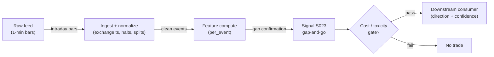

# S023 — Gap-and-go

Overnight gaps that hold and extend - momentum from the opening auction. Provenance **[D]**.

> Tag law: every numeric literal in prose carries one of `[documented]
> [default] [example] [unverified] [internal-est] [measured]` (legend: Appendix
> i v1.0.0). Constants inside cited formulas inherit the formula's tag
> (`[documented]` for cited literature). Bibliographic years, volumes, pages,
> arXiv IDs, section numbers, rule codes (C1–C11), fail-safe codes (F1–F5),
> module IDs, and machine-parsed §0 data fields are identifiers, not
> literals, and are exempt.

## §1 Five-minute reviewer card

| Row | Value |
|---|---|
| Module | S023 — Gap-and-go, v1.1.0 |
| Edge verdict | `PREDICTIVE-FEATURE-ONLY` — documented intraday pattern: before-cost only - the edge is gap confirmation, most gaps fill |
| After-cost | `BEFORE-COST` — a *conditional intraday trigger* [documented]: gap-and-go works only when the gap holds past the first 15 minutes - most gaps fill, and fading the fill is the documented complement (Berkman et al. 2012 [documented]) |
| Build cost | Tier M · `20–60` h [internal-est] · `$3,000–9,000` loaded [internal-est] |
| Data cost | Research: Polygon.io Stocks Starter `~$29`/mo (15-min delayed SIP aggregates) [documented]; production real-time: Stocks Advanced `~$199`/mo [documented] or Databento Standard `~$199`/mo [documented] (includes `1` yr L1) + usage — verify at the current pricing pages before budgeting |
| latency_class | microstructure / sub-second |
| risk_class | low (signal-only; no order placement) |
| Capacity | `$1–10`M/day notional [example] — illustrative; calibrate per venue |
| Executability | Feasible: Python+polars prototype, `<=20` symbols live [internal-est]; Rust ingest beyond that |
| Risk summary | Pattern risk: most gaps fill - confirmation is the edge; dies on gap fills and thin opens |
| When it dies | Gap-fill rate `>70`% [default] (pattern absent); confirmation failures; thin opens |
| Regime gates | Provisional: R001 elevated RV amplifies (gaps larger, fills faster); R002 earnings/attention regimes degrade (gaps reverse faster - Berkman et al. [documented]); halt/auction pauses entries |
| Emits | `signal_vector` (Appendix b v1.0.0) — never orders |

## §1.5 Cheapest / least-build path

1. **Prototype hour band:** `20–60` h [internal-est] — daily + intraday bar tape + gap measurer + confirmation detector + reference validation against the fixture
2. **Cheapest-source row:** min_tier = Polygon.io Stocks Starter (SIP aggregates, 15-min delayed) — cheapest data source candidate [documented] at `~$29`/mo [documented] (delayed feed suffices for gap measurement and confirmation logic on historical bars; any *live* claim requires real-time tier); latency_class = SIP-delayed;
   required_fields = prior session close (split/dividend-adjusted); opening auction/first-bar open; `1`-min bars for the confirmation window; price_band = `~$29`/mo [documented] (research/delayed); live escalation = Stocks Advanced `~$199`/mo real-time [documented] or Databento Standard `~$199`/mo [documented] (includes `1` yr of L1 + `13`+ yrs L0, per 2026 vendor docs [documented]); build_or_buy = ****build the detector, buy the intraday feed** (the detector is `~70` lines [internal-est]; the value is the confirmation discipline)**.
3. **Resource budget:** `1` core, `<2` GB RAM for `<=20` symbols live [internal-est]; compute pattern `per_event`.
4. **Skip list:** earnings-gap variants (phase `2`); news-sentiment overlays
5. **DO-NOT-CUT list:** causality assertions (`assert fill_event >
   signal_event`, no-signal-bar-fills test); COST block + callable
   `expected_cost_bps`; F1–F5 fail-safes + module-state enum; decision-log
   audit records; bona-fide-intent + self-trade prevention; provenance tags on
   every numeric literal; fixtures + `test_cmd`; secrets via env only.
6. **Escalation gate:** gap-fill rate `>70`% [default] -> pattern absent; live universe `>20` symbols [default]; any live (non-delayed) deployment -> real-time feed tier

## §S0 Module contract

### S0.1 Typed signature

```python
def signal(state: ModuleState, events: list[Event], cfg: Config) -> SignalVector:
```

`SignalVector` per Appendix b v1.0.0. `state` is the module-owned named state vector (`gap_pct`, `confirm_state`, `module_state`); `events` are canonical Events (Appendix a v1.0.0), newest last. The function handles documented edge cases: empty events → `UNKNOWN`; crossed/locked quotes → `UNKNOWN` (F1, never interpolate); halt/auction events → freeze per the market-state table.

### S0.2 Config dataclass

| Parameter | Type | Default | Range | Status |
|---|---|---|---|---|
| `gap_min_pct` | float | `1.0` | ``0.5`-`3.0`` | default |
| `confirm_min` | int | `15` | ``5`-`30`` | default |
| `time_stop_min` | int | `120` | ``60`-`390`` | default |
| `cost_gate_k` | float | `0.5` | ``0.1`-`2.0`` | default |
| `cont_frac` | float | `0.25` | ``0.05`-`0.6`` | default |
| `stop_mult` | float | `0.5` | ``0.25`-`1.0`` | default |
| `cooldown_s` | int | `1800` | ``60`-`3900`` | default |

All defaults tagged per the tag law (status `default` ⇒ `[default]`).

### S0.3 Canonical schema mapping

Vendor columns → canonical Event schema (Appendix a v1.0.0), stated once here:

| Canonical field | Type | Databento MBP-1 (schema v3) | Polygon.io aggregates (delayed OK for research) |
|---|---|---|---|
| `session_date` | date | derived from `ts_event` (America/New_York) | derived from `t` (ms epoch) |
| `prev_close` | float | prior session `close` from `ohlcv-1d`, adjusted via corporate-actions feed | previous day `c` (prev-day aggregate); adjust via splits/dividends reference |
| `open_px` | float | opening auction/cross trade print | `o` of the first `1`-min aggregate (approximation - not a true auction print [example]) |
| `bar_o/h/l/c` | float | `ohlcv-1m` bars | `o`/`h`/`l`/`c` aggregate fields [documented] |
| `bar_v` | int | `ohlcv-1m` volume | `v` aggregate field [documented] |
| `event_ts` | int64 ns | `ts_event` (exchange timestamp) | `t` × `1e6` (SIP time - label SIP work *simulated only — requires MBO/ITCH* for latency claims) |
| `halt_flag` | bool | `status` schema / trading-status messages | market-status / halt reference feed |

Polygon aggregate field names (`t`, `o`, `h`, `l`, `c`, `v`) are stable public API fields [documented] - verify against the current API docs before wiring. `prev_close` must be split- and dividend-adjusted: contributions are garbage across unadjusted corporate actions (see §S10 failure mode 10).

### S0.4 Time contract

> Time contract: clock domain UTC, int64 ns; authoritative causality clock = `event_ts`; max_skew = `1` ms [default]; jitter budget = `500` µs [default]; bar-label = open time; staleness TTL = `3` s [default] (`3`× the `1`-s reference cadence per F4); gap policy = mask, no interpolation; halt/auction → discard contributions across reopen.

**Timing box:** `signal@t (per_event, America/New_York) → earliest fill @open(t+1)`

### S0.5 Market-state table

| State | Module behavior |
|---|---|
| CONTINUOUS_TRADING | Compute normally; emit per cadence |
| HALTED | Freeze state; emit `UNKNOWN`; discard contributions across reopen |
| AUCTION | No new signals; hold last `SignalVector`; state `DEGRADED` |
| CLOSED | Emit nothing; state `OFF` |

### S0.6 Module-state enum + error taxonomy

States per Appendix k v1.0.0: `OK | DEGRADED | UNKNOWN | OFF`. Invalid input → `UNKNOWN`, never interpolate (Appendix f v1.0.0, F1–F5).

| Failure | State | Alert |
|---|---|---|
| Missing/stale input (TTL per §S0.4) | `UNKNOWN` | page |
| Crossed/locked quote reaching module | `UNKNOWN` | log |
| Feature out of mathematical bounds (F2) | `UNKNOWN` | page |
| `seq` gap > `1,000` events [default] | `DEGRADED` (restart windows) | log |
| SIP jitter > budget persistently | `DEGRADED` | notify |
| Halt/auction | `UNKNOWN` / `DEGRADED` (per table) | log |
| Kill/administrative disable | `OFF` | page |
| Anything unmapped | `UNKNOWN` | page |

### S0.7 Ops tail

- **Schedule:** continuous during US equities regular session `09:30`–`16:00` America/New_York [documented]; owner: microstructure-signals on-call.
- **Health checks:** fixture replay (`test_cmd`) green on deploy; live `seq-gap` monitor; staleness watchdog at `3`× cadence [default].
- **Alert table:** page on `UNKNOWN` > `30` s [default] or bounds violation; notify on `DEGRADED`; log on single dropped events.
- **Resource budget:** `1` core, `<2` GB RAM for `<=20` symbols live [internal-est]; state is O(window) per symbol.
- **Runbook stub:** `1.` confirm feed (Databento status); `2.` replay fixture; `3.` if red → set `OFF`, page; `4.` reconcile decision log before re-arm.

### S0.8 Secrets (env-only)

`DATABENTO_API_KEY`, `POLYGON_API_KEY` via environment only. No secrets in this file, fixtures, or logs (CI secrets-grep).

### S0.9 May / must-NOT

> **May:** emit `SignalVector` records per Appendix b v1.0.0. **Must-NOT:** emit orders, order intents, prices, share counts, or notionals; call a broker; mutate shared state outside `state`; interpolate across gaps.

## §S1 Legacy (subsumed by §1)

Legacy §S1 content is the §1 reviewer card above; this header is retained so section numbering stays frozen.

## §S2 Specification

### Universe

US common stocks with opening auctions; liquid names.

### Entry rule (Boolean — no prose-only conditions)

```
ENTER_LONG  := (gap_pct >= gap_min_pct) AND (confirm_window_low >= open_px) -> LONG at next open (t+1)
ENTER_SHORT := (gap_pct <= -gap_min_pct) AND (confirm_window_high <= open_px) -> SHORT at next open (t+1)
FLAT        := otherwise
```

Gap confirmed only when the first `confirm_min` (`15` [default]) `1`-min bars hold the gap extreme (`window_low >= open_px` for longs); entry at the next bar's open. Any bar crossing `prev_close` before confirmation vetoes the session (gap filled). The signal's `computed_at` is the confirmation window's close bar — never earlier (t→t+1 causality).

### Exits (with post-exit cooldown)

```
stop_px_long  = open_px - stop_mult * abs(open_px - prev_close)    # stop_mult 0.5 [default]
stop_px_short = open_px + stop_mult * abs(open_px - prev_close)
EXIT := (gap fills: price crosses prev_close) OR (price touches stop_px) OR (now_ns >= computed_at + time_stop_min*60e9)
ON_EXIT: cooldown_until = now_ns + cooldown_s*1e9    # cooldown_s = 1800 [default]; C10
```

### Position sizing (fenced function)

```python
def size_shares(risk_budget_R, stop_distance, vol_estimate, ADV_cap, cost):
    # S-module requests a capital FRACTION only; share math lives in the strategy.
    # Inputs: risk_budget_R = per-trade risk budget in currency; stop_distance = price
    #   distance to stop_px; vol_estimate, cost = consumed by the strategy layer
    #   (ignored here); ADV_cap = consumer-supplied average-daily-volume share estimate;
    #   confidence = this module's emitted confidence in [0,1] (0.6 on signal [default]).
    capital_fraction = 0.5 * confidence                 # [default] 0.5 max factor
    risk_notional = risk_budget_R * capital_fraction
    shares = risk_notional / max(stop_distance, 1e-9)
    return int(min(shares, ADV_cap * 0.001))            # 0.1% ADV cap [default]
```

### Risk limits

| Limit | Value |
|---|---|
| Max capital fraction per signal | `0.5` [default] |
| Max adverse excursion before `UNKNOWN` review | `2.0`× stop [default] |
| Staleness kill | TTL per §S0.4 → `UNKNOWN` |

### COST block (single source of truth)

| Component | Value (bps) | Basis |
|---|---|---|
| Spread (half-spread, liquid large-cap) | `0.43` | [example] — reference print |
| Fees (taker incl. regulatory) | `0.30` | [example] — reference print |
| Borrow (`borrow_bps_per_day`) | `0.0` | [default] — long-biased reference; SHORT legs add C7 locate cost |
| Impact | `0.0` | [example] — flagged; calibrate per venue at scale-up |
| **Total reference** | `0.73` | [example] |

`fee_schedule_as_of`: `2026-09-01` [unverified] — placeholder; pin the real venue schedule (exchange taker/regulatory fee tables) before production. `side: taker` [default]; venue/tier/source: XNAS / Databento MBP-1 [example]. Re-stating cost numbers outside this block is a validation failure.

```python
def expected_cost_bps(notional, adv_pct, venue, side, urgency) -> float:
    """Callable cost model — L2 constant stack (impact=0 flagged [example])."""
    spread_bps = 0.43   # [example]
    fee_bps = 0.30      # [example]
    borrow_bps = 0.0    # [default] long-biased reference; reason in table
    impact_bps = 0.0    # [example] flagged; calibrate per venue at scale-up
    if side == "maker":
        fee_bps = -0.20  # rebate [example]
    return spread_bps + fee_bps + borrow_bps + impact_bps
```

### Execution / fill model table

| Aspect | Assumption |
|---|---|
| Latency | Signal→intent `≤1` ms colocated [example]; SIP path latency-simulated-only |
| Gap measurement basis | Opening auction/cross print [documented]; fallback = first `1`-min bar open [example] |
| Entry reference | Next bar open after the confirmation window closes (t+1 open) |
| Partial fills | N/A (signal-only; T-module policy: Appendix c v1.0.0) |
| Impact | `0.0` bps reference [example]; stress ×`5` [example] |
| Adverse fill | Toxic-flow haircut `0.2` bps per `1.0` |z| [example] |

### Robustness

Window/threshold sensitivity must be validated on purged/embargoed out-of-sample data; microstructure parameters mined on `1` month of tape overfit [internal-est]. Re-validate after any feed or venue change.

### Compliance sub-block (C1–C10+)

| Code | Rule: trigger → check → action → log |
|---|---|
| C1 | Self-match prevention: signal module emits no orders; downstream T-modules must set self-trade-prevention flags — this module asserts the requirement in its `consumes` contract |
| C2 | Bona-fide intent: every emitted `SignalVector` with |direction|=`1` must pass the cost gate (`expected_cost_bps(...) <= cost_gate_k * edge_bps`); sub-threshold prints emit direction `0`, never a tradeable hint |
| C3 | Message-rate: `<=100` emissions/symbol/s [default]; breach -> throttle to `1`/s [default] + alert |
| C4 | Fat-finger trio (applied by consumers; this module bounds its own outputs): confidence in [`0`,`1`], capital in [`0`,`0.5`], computed_at sane - out-of-bounds -> `UNKNOWN` (F2) |
| C5 | Decision log: every emission, veto, and state transition logged per Appendix g v1.0.0, hash-chained |
| C6 | Halt/auction: per the market-state table; contributions across reopen discarded |
| C7 | Locate check: SHORT direction requires `locate_ok` from the consumer; never emit SHORT without the consumer asserting locate (Reg-SHO threshold securities -> direction `0`) |
| C8 | Public dissemination: no signal values published externally without review gate |
| C9 | Data entitlements: per the Data rights row; entitlement-class change -> escalation gate |
| C10 | Post-exit cooldown: no re-entry for `cooldown_s` after any exit or compliance block |
| C11 | Spoofing hygiene: down-weight quotes with lifetime `<50` ms [example]; never quote on them |

### Parameter table

| Parameter | Symbol | Value | Tag | Sensitivity |
|---|---|---|---|---|
| Min gap | `gap_min_pct` | `1.0%` | [default] | high |
| Confirmation window | `confirm_min` | `15` min | [default] | high |
| Time stop | `time_stop_min` | `120` min | [default] | high |
| Cost-gate k | `cost_gate_k` | `0.5` | [default] | medium |
| Continuation fraction | `cont_frac` | `0.25` | [default] | medium |
| Stop multiplier | `stop_mult` | `0.5` | [default] | low |
| Post-exit cooldown | `cooldown_s` | `1800` s | [default] | low |

### Calibration recipes (per parameter — walk-forward, purged/embargoed)

| Parameter | Procedure | Objective / note |
|---|---|---|
| `gap_min_pct` | Grid `0.5`–`3.0`% in `0.25`% steps [default]; purged walk-forward, embargo `5` sessions [default] | Maximize cost-gated confirmation hit rate; below `0.5`% the gap is noise vs the `0.73` bps reference cost [example] |
| `confirm_min` | Sweep `5`–`30` min in `5`-min steps [default] | Tradeoff: shorter window → earlier entry but more gap-fill vetoes; longer → cleaner holds but missed extension. Sensitivity high — re-validate per venue |
| `time_stop_min` | Sweep `60`–`390` min in `30`-min steps [default] | Objective: OOS net of reference cost; `120` [default] balances continuation capture vs overnight-adjacent decay |
| `cost_gate_k` | Sweep `0.1`–`2.0` in `0.1` steps [default] against `[measured]` cost quantiles once live | Higher `k` admits weaker edges; pin to the venue's measured cost distribution, not the reference stack |
| `cont_frac` | Estimate as the walk-forward confirmed-window continuation rate: mean(post-confirm `60`-min return / gap size) over confirmed sessions [default] | Default `0.25` [default] is a placeholder, not a measured rate - replace with the venue's measured value before sizing on it |
| `stop_mult` | Sweep `0.25`–`1.0` in `0.25` steps [default] | Objective: OOS cost-gated expectancy; stop too tight chops on normal pullbacks |
| `cooldown_s` | Fixed at `1800` [default] unless whipsaw analysis on live fills demands longer | Cooldown is a compliance control (C10), not an alpha parameter - do not optimize it for return |

### Timing box

`signal@t (per_event, America/New_York) → earliest fill @open(t+1)`

## §S3 Math + normative pseudocode

Gap: $g = (O_t - C_{t-1})/C_{t-1}$, with $O_t$ = opening auction/cross print (fallback: first `1`-min bar open [example]) and $C_{t-1}$ = prior session close, split/dividend-adjusted. **Long confirmation:** $g \ge 1.0\%$ [default] and the first-`15`-min window low $\ge O_t$ (gap holds) -> LONG at the next bar's open. **Short confirmation** mirrors. **Gap fill** (any bar crossing $C_{t-1}$ before confirmation) vetoes the session. Fixture (*example*): `C_{t-1} = 100.00`, `O_t = 101.50` (`g = 1.5%`); window lows hold at/above `101.50` on bars `1`–`4` -> LONG confirmed on bar `4`. Most gaps fill - the confirmation window is the edge [documented].

**Edge-estimation recipe (normative):** the cost gate needs an expected-move estimate. Reference recipe: `edge_bps = |g| * 10000 * cont_frac`, with `cont_frac = 0.25` [default] as a placeholder to be replaced by the walk-forward measured continuation rate (§S2 calibration). This is a *default*, never a measured claim.

**Normative pseudocode** (pseudocode is normative; prose is commentary):

```
function signal(state, events, cfg) -> SignalVector:
    if len(events) == 0: return UNKNOWN(state, "empty_events")        # F1
    sess = session_date(events)                                        # America/New_York
    prev_close = prev_session_close(events, symbol, sess)             # adjusted close
    if prev_close is None or not isfinite(prev_close) or prev_close <= 0:
        return UNKNOWN(state, "missing_prev_close")                   # F1/F2
    open_px = opening_auction_price(events, symbol, sess)             # cross print; fallback first-bar open
    if open_px is None or not isfinite(open_px):
        return UNKNOWN(state, "missing_open")                        # F1
    if market_state(events) != CONTINUOUS_TRADING:
        return freeze_per_table(state)                                # market-state table §S0.5
    g = (open_px - prev_close) / prev_close
    if not isfinite(g): return UNKNOWN(state, "gap_not_finite")       # F2
    bars = intraday_1min_bars(events, symbol, sess)                  # bar-label = open time; no interpolation
    win = bars[0 : cfg.confirm_min]
    if len(win) < cfg.confirm_min:
        return FLAT(state, "window_forming")                          # window not closed: not tradeable
    # --- gap-fill veto: checked BEFORE confirmation; takes precedence ---
    if g >= 0: filled = any(b.low  <= prev_close for b in win)
    else:      filled = any(b.high >= prev_close for b in win)
    # --- confirmation ---
    if g >= 0: holds = all(b.low  >= open_px for b in win)
    else:      holds = all(b.high <= open_px for b in win)
    if filled:                     side, reason = 0, "gap_filled_veto"
    elif g >=  cfg.gap_min_pct/100 and holds: side, reason = +1, "confirmed_long"
    elif g <= -cfg.gap_min_pct/100 and holds: side, reason = -1, "confirmed_short"
    else:                          side, reason = 0, "no_confirmation"
    # --- normative cost-gate predicate ---
    edge_bps = abs(g) * 10000.0 * cfg.cont_frac                       # edge recipe; cont_frac [default]
    cost_ok = expected_cost_bps(notional, adv_pct, venue, "taker", "normal") <= cfg.cost_gate_k * edge_bps
    if side != 0 and not cost_ok: side, reason = 0, "cost_gate"
    conf = 0.6 if side != 0 else 0.0                                   # [default] flat confidence
    sig = SignalVector(symbol, direction=side, confidence=conf, capital=0.5*conf,
                       computed_at=win[-1].event_ts,                   # signal fires at window CLOSE
                       staleness=now_ns() - win[-1].asof_ts,
                       module_state=state.module_state)
    log_decision(sig, inputs_hash, params_hash, reason)                # C5 / Appendix g
    assert win[-1].event_ts < earliest_fill_ts  # t->t+1 causality: confirmation window closes first
    return sig
```

Helper contracts: `session_date` = America/New_York calendar date of the newest event; `prev_session_close` = adjusted close of the prior session (None if corporate-action reference missing → `UNKNOWN`, never unadjusted); `opening_auction_price` = official opening cross print, fallback first `1`-min bar `open` with a logged flag; `intraday_1min_bars` = `1`-min bars strictly within the session, bar-label = open time, masked (not interpolated) across halts.

Causality: the `confirm_min` confirmation window must close before the signal fires (`computed_at = win[-1].event_ts`); entry is at the next bar's open. Mandatory unit test: no-signal-bar fills.

## §S4 Worked example (fixture-backed)

- Tape: `modules/fixtures/S023_tape.csv` — `# TYPE: validation-run`; `9` `1`-min bars across `2` sessions after `+1.5`% gaps, all numbers synthetic, seed `20260923` [example]. Session `2` is the gap-fill veto case.
- Expected outputs: `modules/fixtures/S023_expected.csv`; per-bar gap %, hold flag, confirmation flag, and fill-veto flag; hand-checked below. Fixture uses `confirm_bars = 4` (declared in the tape header) as an illustration of the `confirm_min = 15` [default] production window.
- Tolerance: `1e-9` [default] on floats; integer flags exact.
- Acceptance tests (`modules/tests/test_S023.py`, `8` tests): `1.` fixture recomputes to expected (tape is self-describing: open/prev_close parsed from tape, not hardcoded); `2.` stub emits valid `SignalVector` (direction in {+1,-1,0}, confidence/capital in [0,1]); `3.` no-signal-bar fills (`fill_event_ts > computed_at`); `4.` cost-gate predicate passes on large edge, blocks on tiny edge (edge recipe `edge_bps = |g_bps| * cont_frac`, `k = 0.5` [default]); `5.` invalid input -> `UNKNOWN`; `6.` gap confirmed on session-1 bar `4`, no hold on bar `5`; `7.` stub is deterministic across calls; `8.` gap-fill veto takes precedence over confirmation (session-2 bar `4`: window held on bars `1`–`3` but fill vetoes → `confirmed = 0`, `fill_veto = 1`).
- `test_cmd`: `python -m pytest modules/tests/test_S023.py -q` → exits `0`.

**Hand-checked rows** (arithmetic verified by hand against the fixture):

Session `1` (`prev_close = 100.00`, `open = 101.50`, `g = 1.5% >= 1.0%` ✓):
- bar `1`: low `101.50 >= 101.50` -> holds ✓ (window forming, no confirmation)
- bar `2`: low `101.55 >= 101.50` -> holds ✓
- bar `3`: low `101.60 >= 101.50` -> holds ✓
- bar `4`: low `101.70 >= 101.50` -> holds; window complete -> LONG confirmed ✓
- bar `5`: low `100.80 < 101.50` -> no hold; `100.80 > 100.00` -> no fill ✓

Session `2` (`prev_close = 200.00`, `open = 203.00`, `g = 1.5% >= 1.0%` ✓):
- bars `1`–`3`: lows `203.05`/`203.10`/`203.15 >= 203.00` -> hold ✓
- bar `4`: low `199.50 <= 200.00` -> gap filled -> `fill_veto = 1`, confirmation vetoed (`confirmed = 0`) ✓

**Where the example is optimistic:** no fees, no latency, no hidden liquidity — arithmetic illustration, not a backtest.

## §S5 Strategies that use this signal

Generated from `deps.yaml` (CI symmetry). Provisional consumer list (roles pinned at ingest):

| Strategy | Role |
|---|---|
| T-series execution consumers (see `deps.yaml`) | Downstream consumer of this signal family's direction/confidence outputs; exact strategy IDs pinned at ingest |

Gap-and-go signals are consumed by intraday momentum strategies; consumer roles pinned in `deps.yaml`.

## §S6 Data required

| Field | Type | Granularity | Source tier | Notes |
|---|---|---|---|---|
| Prior session close (adjusted) | float | daily | Tier 1 | split/dividend-adjusted; unadjusted closes are a hard failure (see §S10 #10) |
| Opening auction/cross print | float | per session | Tier 2 | exchange opening cross; SIP aggregates give first-bar `o` as fallback [example] |
| `1`-min bars o/h/l/c/v | float/int | `1` min | Tier 2 | confirmation window + fill detection; bar-label = open time |
| Best bid/ask price + displayed size | float / int | every quote event (L1) | Tier 2 | only needed if the venue scale-up moves to quote-level confirmation; not used in the reference build |
| Exchange timestamps | int64 ns | per event | Tier 2 | SIP adds 10s of µs jitter [documented] — label SIP work *simulated only — requires MBO/ITCH* |
| Corporate actions / halts | reference | daily + intraday halt feed | Tier 1 | contributions garbage across splits/halt reopens |

**Data rights row** (Appendix j v1.0.0): US equities L1 via Databento MBP-1, `rights: licensed`; license scope = research + stated production symbol count; raw ticks never leave our systems — fixtures are synthetic; entitlement = professional/internal, no display; retention per vendor terms, purge path in runbook. Entitlement-class change → §1.5 escalation gate. Historical (T+1) Databento pulls carry Databento usage fees only, no exchange licensing [documented].

## §S7 Local build (M5 Max / 128 GB)

Feasible. O(`1`) [documented] per-event scan: Python loop `~100–500`k events/s [internal-est] vs `~50–500` L1 events/s average per liquid name, busy bursts `~1–5`k/s [internal-est] (cost-model §2). `50` symbols × `2`k events/s = `100`k/s → Python borderline, Rust (`5–50`M/s [internal-est]) comfortable; polars batch recompute each second trivial. Bottleneck is I/O and timestamp normalization. RAM: one symbol-day L1 `~0.5–4` GB [internal-est] — fine for a few symbols; `60` days does not fit — stream per-symbol daily parquet (cost-model §3). The reference build consumes `1`-min bars only (`390` bars/session [example]), so the bar path fits trivially; L1 is needed only for the quote-level extension.

## §S8 Buy vs build

Build the estimator (Python+polars), buy the feed. Verdict: the per-event math is `~40–100` lines [internal-est]; the value is normalization, windows, and calibration — none sold by vendors. Buy Databento MBP-1 history to validate, Tier-1 SIP for live research, direct/MBO only after the signal survives realistic costs (cost-model §6). Historical Databento usage is pay-per-byte (DBEQ.BASIC MBP-1 `~$2.00`/GB historical [documented, 2024 unit pricing]) so small-window validation costs single dollars [internal-est].

## §S9 Efficacy — documented evidence

| Study / source | Market & period | Metric | Before/after cost | Caveat |
|---|---|---|---|---|
| Gao, Han, Li, Zhou — "Intraday Momentum: The First Half-Hour Return Predicts the Last Half-Hour Return" (SSRN 2015; JFE 2018) [documented] | S&P 500 ETF (SPY), `1993`–`2013` | First half-hour return (measured from the prior close, so it *includes* the overnight gap) positively predicts the last half-hour return: slope ×`100` = `6.94`, significant at `1`%, R² `1.6`% [documented]; stronger on volatile days, high-volume days, recession days, macro-news days; also holds for `10` other most-actively-traded domestic/international ETFs | `BEFORE-COST` | Market-level ETF result, not single-stock gaps; no cost model; continuation mechanism (daytrader/informed-trader behavior) is the authors' interpretation |
| Berkman, Koch, Tuttle, Zhang (2012), JFQA `47`(`4`):`715`–`741` [documented] | US stocks, `13` yrs intraday | Positive overnight returns tend to *reverse* during the trading day (opening price high relative to intraday prices); concentrated in retail-attention stocks; implicit costs of buying high-attention stocks near the open frequently exceed the effective half spread | `BEFORE-COST` | Counter-evidence: documents the gap-FILL leg this module's veto is designed to avoid; long gap-and-go is the minority continuation case |
| Lou, Polk, Skouras (2019), JFE `134`(`1`):`192`–`213` [documented] | US equities (CRSP/Compustat), `1993`–`2013` | Strong overnight *and* intraday firm-level return continuation with an offsetting cross-period reversal ("tug of war"); `14` strategies' profits are earned entirely overnight or entirely intraday, typically with opposite signs | `BEFORE-COST` | Decomposition result, not a trade rule; implies gap signals must condition on which clientele dominates the open |
| practitioner literature (gap trading) [documented] | US equities intraday | gap-and-go vs gap-fill as the canonical pair | `BEFORE-COST` | pattern description, not a tested rule |

Selection disclosure: the `4` sources above are the deep-review research pass (2026-09-10); the Berkman and Lou/Polk/Skouras papers are deliberately included as counter-evidence (gap reversal dominates - confirmation is the whole edge). No after-cost study of gap-and-go as a standalone rule was found.

## §S10 Failure modes & pitfalls

| # | Trigger → Detect → Action → Recovery | check: |
|---|---|---|
| 1 | Gap fill: price crosses prior close -> detect: fill -> action: exit immediately, veto re-entry -> recovery: next session | `check: not gap_filled` |
| 2 | Lookahead leakage: bar-close feature traded intra-bar → detect: causality audit flags `fill_event <= signal_event` → action: halt, fix bar finalization → recovery: re-run no-signal-bar-fills test | `check: all(fill_ts > computed_at)` |
| 3 | Staleness/latency: feed timestamps in a race → detect: jitter > budget → action: `DEGRADED`, label simulated-only → recovery: direct feed or stand down | `check: asof_ts - event_ts <= jitter_budget` |
| 4 | Fleeting quotes/spoofing: displayed size cancels pre-execution → detect: quote lifetime `<50` ms [example] share rising → action: down-weight sub-`50` ms quotes → recovery: re-tune weights | `check: fleeting_share < 0.3 [default]` |
| 5 | Cost blowup: spread+fees+impact on the round trip → detect: cost gate failing on `[measured]` costs → action: widen `k` gate or stand down → recovery: re-pin fee schedule | `check: expected_cost_bps(...) <= k * edge_bps` |
| 6 | Regime breaks: depth/volatility regime shifts → detect: feature distribution break → action: veto entries → recovery: resume when stable for `5` min [default] | `check: feature_z_within_3_sigma [default]` |
| 7 | Overfitting: parameters mined on `1` period → detect: OOS decay → action: purged/embargoed re-validation → recovery: shrink per-symbol | `check: oos_sharpe > 0.5 * is_sharpe [default]` |
| 8 | Data errors: bad ticks, splits, halts → detect: bounds/`seq`-gap monitors → action: `UNKNOWN`, mask bars → recovery: backfill and replay | `check: no crossed quotes in window` |
| 9 | Opening print missing/delayed: no auction print and no first bar by `09:31`+`60` s [default] → detect: `open_px is None` at window start → action: `UNKNOWN` for the session, mask it → recovery: next session | `check: open_px is not None before bar 1` |
| 10 | Corporate action contamination: split/dividend changes `prev_close` reference overnight → detect: reference-feed corporate-action flag or overnight price discontinuity vs adjusted close → action: `UNKNOWN`, mask session, never trade on unadjusted closes → recovery: re-arm next session after adjustment verified | `check: prev_close adjusted (corp-action feed clean)` |

### Regime-gate machine records (provisional)

| regime_id | direction | mechanism | condition | action | min_lag | unknown_behavior |
|---|---|---|---|---|---|---|
| R001 | amplifies | elevated realized volatility widens gaps and deepens adverse selection | RV > `2`× trailing median [example] | widen_stops | `1` session [example] | hold last label |
| R002 | degrades | earnings/attention-driven gaps reverse faster (Berkman et al. [documented]) | earnings announcement within ±`1` session [default] | halve | `1` session [default] | veto entries |
| R003 | degrades | halt/auction regimes break continuity assumptions | market_state != CONTINUOUS_TRADING | pause_entry | `0` | veto entries |

## §S11 Visuals

`../../images/S023_example.png` — synthetic `9`-bar two-session gap tape (seed `20260923` [example]): gap, hold, confirmation, and a fill-veto session.



## §S12 Source log + unverified leads

**Sources** (citable facts only):

1. practitioner literature (gap trading) [documented]. Gap-and-go / gap-fill pattern descriptions (no single canonical paper).
2. Gao, Han, Li, Zhou, "Intraday Momentum: The First Half-Hour Return Predicts the Last Half-Hour Return" (SSRN 2015; JFE 2018) [documented]. SPY `1993`–`2013`: first half-hour return (from prior close) predicts last half-hour return; slope ×`100` = `6.94`, `1`% significance, R² `1.6`%; stronger on volatile/high-volume/recession/macro-news days; also `10` other active ETFs. https://papers.ssrn.com/sol3/papers.cfm?abstract_id=2552752
3. Berkman, Koch, Tuttle, Zhang (2012), "Paying Attention: Overnight Returns and the Hidden Cost of Buying at the Open", Journal of Financial and Quantitative Analysis `47`(`4`):`715`–`741` [documented]. `13` years US intraday: positive overnight returns reverse intraday; attention-driven; implicit costs often exceed effective half spread. https://econpapers.repec.org/article/cupjfinqa/v_3a47_3ay_3a2012_3ai_3a04_3ap_3a715-741_5f00.htm
4. Lou, Polk, Skouras (2019), "A Tug of War: Overnight Versus Intraday Expected Returns", Journal of Financial Economics `134`(`1`):`192`–`213` [documented]. Overnight and intraday firm-level continuation with offsetting cross-period reversal; CRSP/Compustat US `1993`–`2013`. https://EconPapers.repec.org/article/eeejfinec/v_3a134_3ay_3a2019_3ai_3a1_3ap_3a192-213.htm
5. Polygon.io pricing: Stocks Starter `~$29`/mo (15-min delayed), Stocks Developer `~$79`/mo (delayed), Stocks Advanced `~$199`/mo (real-time) [documented] via third-party pricing docs citing polygon.io/pricing — verify at the current pricing page before budgeting (vendor rebranded tiers in 2026 per one source [unverified]).
6. Databento: DBEQ.BASIC MBP-1 `~$2.00`/GB historical, `~$2.40`/GB live (2024 unit-pricing sheet) [documented]; Databento Standard plan `~$199`/mo includes `13`+ yrs L0 and `1` yr L1 (2026 vendor-coverage writeup) [documented]; T+1 historical pulls carry no exchange licensing fees [documented].

**Chatbot source log.** Chatbot answers pending (checked 2026-09-10) - grok-answers.md and cursor-answers.md were absent from batches/SB5/.

**Unverified leads** (chatbot-only — never in evidence tables):

- Claims of specific gap-and-go win rates circulate in trading literature; no checkable after-cost study found - treated as unverified.
- GROK-NEEDED: Is there a citable after-cost (net of spread+fees+impact) study of single-stock opening-gap continuation with a `15`-minute confirmation rule, or is the published record limited to market-level intraday momentum (Gao et al.) and gap-reversal (Berkman et al.) results?

---

## Appendix — AI build prompt (S023)

Copy-paste into any chat agent:

> Build module **S023 — Gap-and-go** per
> `notes/module-template.md` v1.0.0 and this file's §S0 contract.
> Cheapest path (§1.5): prototype 20–60 h [internal-est]; cheapest data
> candidate Polygon.io Stocks Starter (SIP aggregates, 15-min delayed)
> `~$29`/mo [documented] for research; live needs a real-time tier
> (Stocks Advanced `~$199`/mo [documented]); compute pattern `per_event`;
> skip earnings/news-overlays.
> Implement `signal(state, events, cfg) -> SignalVector` (Appendix b v1.0.0)
> with the §S3 normative pseudocode (named helpers, gap-fill veto before
> confirmation, edge recipe `edge_bps = |g| * 10000 * cont_frac` with
> `cont_frac = 0.25` [default]), including the cost-gate predicate
> `expected_cost_bps(...) <= k * edge_bps` and `assert fill_event >
> signal_event` (`computed_at` = confirmation-window close). Wire F1–F5
> (Appendix f v1.0.0): invalid input -> `UNKNOWN`, never interpolate.
> Config: `gap_min_pct=1.0`, `confirm_min=15`, `time_stop_min=120`,
> `cost_gate_k=0.5`, `cont_frac=0.25`, `stop_mult=0.5`, `cooldown_s=1800`
> (all [default]; ranges in §S0.2). Log decisions per Appendix g v1.0.0.
> Secrets via env only. Run the fixture
> `modules/fixtures/S023_tape.csv` (`# TYPE: validation-run`, `9` bars /
> `2` sessions, session `2` = gap-fill veto) against
> `modules/fixtures/S023_expected.csv` (tolerance `1e-9` [default]).
> **Definition of done:** `python3 -m pytest modules/tests/test_S023.py -q`
> exits `0` (`8` tests). Tag every numeric literal you add with the unified enum
> (Appendix i v1.0.0); put anything unverifiable in §S12 unverified leads.
