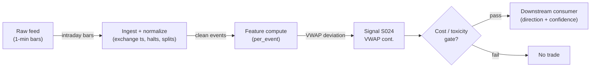

# S024 — VWAP and anchored-VWAP continuation

Price relative to VWAP (and event-anchored VWAP) as the institutional benchmark - continuation above, fade below. Provenance **[D]**.

> Tag law: every numeric literal in prose carries one of `[documented]
> [default] [example] [unverified] [internal-est] [measured]` (legend: Appendix
> i v1.0.0). Constants inside cited formulas inherit the formula's tag
> (`[documented]` for cited literature). Bibliographic years, volumes, pages,
> arXiv IDs, section numbers, rule codes (C1–C11), fail-safe codes (F1–F5),
> module IDs, and machine-parsed §0 data fields are identifiers, not
> literals, and are exempt.

## §1 Five-minute reviewer card

| Row | Value |
|---|---|
| Module | S024 — VWAP and anchored-VWAP continuation, v1.0.1 |
| Edge verdict | `PREDICTIVE-FEATURE-ONLY` — documented institutional benchmark: before-cost only - VWAP is a schedule, not an alpha |
| After-cost | `BEFORE-COST` — an *execution benchmark* first [documented]: VWAP deviations measure schedule pressure - consumed by execution algorithms and, secondarily, by continuation signals |
| Build cost | Tier M · `20–60` h [internal-est] · `$3,000–9,000` loaded [internal-est] |
| Data cost | Research `~$29–199`/mo (Polygon.io Stocks tiers, Starter → Advanced) [documented] — tiers/prices change, confirm on vendor page before budgeting; production `~$200`/mo + usage (exchange-timestamped L1) [unverified] |
| latency_class | microstructure / sub-second |
| risk_class | low (signal-only; no order placement) |
| Capacity | `$1–10`M/day notional [example] — illustrative; calibrate per venue |
| Executability | Feasible: Python+polars prototype, `<=20` symbols live [internal-est]; Rust ingest beyond that |
| Risk summary | Benchmark risk: VWAP is a schedule, not an alpha; dies on anchor ambiguity and deviation decay |
| When it dies | Sharpe `<0.5` over `60` days [default] (retire); anchor ambiguity (S10.1); deviation decay |
| Regime gates | Provisional: R001 elevated RV amplifies (deviations wider - fewer confirmations); trend days amplify continuation (R004); spoofing/halt regimes degrade (R002/R003) |
| Emits | `signal_vector` (Appendix b v1.0.0) — never orders |

## §1.5 Cheapest / least-build path

1. **Prototype hour band:** `20–60` h [internal-est] — intraday bar tape + VWAP/AVWAP calculator + deviation monitor + reference validation against the fixture
2. **Cheapest-source row:** min_tier = Polygon.io Stocks Starter (SIP L1, `15`-min delayed) [documented] — cheapest data source candidate; latency_class = SIP-delayed;
   required_fields = 1-min bars with volume (regular session); anchor event timestamp for AVWAP; price_band = `~$29–199`/mo [documented] (Starter `$29` 15-min delayed → Advanced `$199` real-time; tiers change — verify before budgeting); build_or_buy = ****build the calculator, buy the intraday feed** (the calculator is `~50` lines [internal-est]; the value is the anchor discipline)**.
3. **Resource budget:** `1` core, `<2` GB RAM for `<=20` symbols live [internal-est]; compute pattern `per_event`.
4. **Skip list:** multi-venue VWAP (phase `2`); dark-pool volume inclusion
5. **DO-NOT-CUT list:** causality assertions (`assert fill_event >
   signal_event`, no-signal-bar-fills test); COST block + callable
   `expected_cost_bps`; F1–F5 fail-safes + module-state enum; decision-log
   audit records; bona-fide-intent + self-trade prevention; provenance tags on
   every numeric literal; fixtures + `test_cmd`; secrets via env only; documented-anchor discipline (S10.1).
6. **Escalation gate:** VWAP deviation strategy Sharpe `<0.5` over `60` days [default] -> retire; live universe `>20` symbols [default]
7. **Latency honesty:** the `$29` Starter tier is `15`-min delayed [documented] — research/replay only. Any latency claim or live microstructure use requires the real-time tier (or MBO/ITCH); label SIP-delayed work *simulated only — requires MBO/ITCH*.

## §S0 Module contract

### S0.1 Typed signature

```python
def signal(state: ModuleState, events: list[Event], cfg: Config) -> SignalVector:
```

`SignalVector` per Appendix b v1.0.0. `state` is the module-owned named state vector (`vwap`, `avwap`, `dev_z`, `dev_sigma`, `anchor_ts`, `module_state`); `events` are canonical Events (Appendix a v1.0.0), newest last. The function handles documented edge cases: empty events → `UNKNOWN`; crossed/locked quotes → `UNKNOWN` (F1, never interpolate); halt/auction events → freeze per the market-state table; insufficient bars for the sigma window → `UNKNOWN` (warmup, F1).

### S0.2 Config dataclass

| Parameter | Type | Default | Range | Status |
|---|---|---|---|---|
| `dev_z_min` | float | `1.0` | `0.5`–`2.0` | default |
| `sigma_window_bars` | int | `60` | `20`–`120` | default |
| `anchor_lookback_min` | int | `60` | `15`–`390` | default |
| `time_stop_min` | int | `120` | `60`–`390` | default |
| `cooldown_s` | int | `60` | `0`–`600` | default |
| `anchor_mode` | str | `"documented_only"` | `documented_only`/`rule_detected` | default |
| `ref_notional_usd` | float | `1e6` | `1e4`–`1e8` | default |
| `cost_gate_k` | float | `0.5` | `0.1`–`2.0` | default |

All defaults tagged per the tag law (status `default` ⇒ `[default]`).

### S0.3 Canonical schema mapping

Vendor columns → canonical Event schema (Appendix a v1.0.0), stated once here:

| Vendor (Databento MBP-1) | Canonical |
|---|---|
| `ts_event` | `event_ts (int64 ns UTC)` |
| `open/high/low/close/volume` | `bar_o/h/l/c/v (1-min)` |
| `anchor_ts` | `event timestamp for AVWAP` |

Polygon.io mapping: `t` → `event_ts` (SIP time — label SIP work *simulated only — requires MBO/ITCH* for latency claims), `p`/`s` bid/ask → `bid_px`/`bid_sz`, etc. Bars carry `o/h/l/c/v`; `p_i` (typical price) is derived as `(h+l+c)/3` per bar [documented] — never supplied by the vendor.

### S0.4 Time contract

> Time contract: clock domain UTC, int64 ns; authoritative causality clock = `event_ts`; max_skew = `1` ms [default]; jitter budget = `500` µs [default]; bar-label = open time; staleness TTL = `3` s [default] (`3`× the `1`-s reference cadence per F4); gap policy = mask, no interpolation; halt/auction → discard contributions across reopen.

**Timing box:** `signal@t (per_event, America/New_York) → earliest fill @open(t+1)`

### S0.5 Market-state table

| State | Module behavior |
|---|---|
| CONTINUOUS_TRADING | Compute normally; emit per cadence |
| HALTED | Freeze state; emit `UNKNOWN`; discard contributions across reopen |
| AUCTION | No new signals; hold last `SignalVector`; state `DEGRADED` |
| CLOSED | Emit nothing; state `OFF` |

### S0.6 Module-state enum + error taxonomy

States per Appendix k v1.0.0: `OK | DEGRADED | UNKNOWN | OFF`. Invalid input → `UNKNOWN`, never interpolate (Appendix f v1.0.0, F1–F5).

| Failure | State | Alert |
|---|---|---|
| Missing/stale input (TTL per §S0.4) | `UNKNOWN` | page |
| Crossed/locked quote reaching module | `UNKNOWN` | log |
| Feature out of mathematical bounds (F2) | `UNKNOWN` | page |
| Sigma warmup incomplete (`< sigma_window_bars` bars) | `UNKNOWN` | log |
| `seq` gap > `1,000` events [default] | `DEGRADED` (restart windows) | log |
| SIP jitter > budget persistently | `DEGRADED` | notify |
| Anchor disagreement (S10.1) | `DEGRADED` (direction `0`) | notify |
| Halt/auction | `UNKNOWN` / `DEGRADED` (per table) | log |
| Kill/administrative disable | `OFF` | page |
| Anything unmapped | `UNKNOWN` | page |

### S0.7 Ops tail

- **Schedule:** continuous during US equities regular session `09:30`–`16:00` America/New_York [documented]; owner: microstructure-signals on-call.
- **Health checks:** fixture replay (`test_cmd`) green on deploy; live `seq-gap` monitor; staleness watchdog at `3`× cadence [default].
- **Alert table:** page on `UNKNOWN` > `30` s [default] or bounds violation; notify on `DEGRADED`; log on single dropped events.
- **Resource budget:** `1` core, `<2` GB RAM for `<=20` symbols live [internal-est]; state is O(window) per symbol.
- **Runbook stub:** `1.` confirm feed (Databento status); `2.` replay fixture; `3.` if red → set `OFF`, page; `4.` reconcile decision log before re-arm.

### S0.8 Secrets (env-only)

`DATABENTO_API_KEY`, `POLYGON_API_KEY` via environment only. No secrets in this file, fixtures, or logs (CI secrets-grep).

### S0.9 May / must-NOT

> **May:** emit `SignalVector` records per Appendix b v1.0.0. **Must-NOT:** emit orders, order intents, prices, share counts, or notionals; call a broker; mutate shared state outside `state`; interpolate across gaps; invent anchor events post-hoc.

## §S1 Legacy (subsumed by §1)

Legacy §S1 content is the §1 reviewer card above; this header is retained so section numbering stays frozen.

## §S2 Specification

### Universe

US common stocks, regular session; liquid names (S&P 500-style spreads `<3` bps [documented]).

### Entry rule (Boolean — no prose-only conditions)

```
ENTER_LONG  := (close > vwap) AND (dev_z >= dev_z_min) -> LONG at next open (t+1)
ENTER_SHORT := (close < vwap) AND (dev_z <= -dev_z_min) -> SHORT at next open (t+1)
FLAT        := otherwise
```

Continuation only with deviation confirmation; entry at the next bar's open. VWAP itself is the schedule benchmark.

**Anchored branch** (normative; see §S3): when `state.anchor_ts` is set and the anchored side disagrees with the session-VWAP side, the module emits `FLAT` with state `DEGRADED` (S10.1 anchor ambiguity) — never picks the favorable side.

**Anchor policy** (normative): `anchor_mode = documented_only` [default] — anchors must be pre-registered before the event (session open, earnings timestamp, scheduled macro release, documented corporate action). In `rule_detected` mode, a volume-spike anchor may be detected (bar volume `> 3`× trailing median over `anchor_lookback_min` bars [default]), but it must be logged as an anchor event at detection time and can never be back-filled. At most `1` active anchor; documented anchors always take precedence; anchors older than `anchor_lookback_min` expire (S10.10).

### Exits (with post-exit cooldown)

```
EXIT := (close crosses VWAP) OR (time_stop_min elapsed) OR (stop hit)
        ON_EXIT: cooldown_until = now + cooldown_s   # 60 s [default]; C10
```

### Position sizing (fenced function)

```python
def size_shares(risk_budget_R, stop_distance, vol_estimate, ADV_cap, cost):
    # S-module requests capital fraction only; share math lives in the strategy.
    # Reference: capital = 0.5 * confidence  (confidence in [0,1])  [default]
    risk_notional = risk_budget_R * 0.5 * confidence          # [default] 0.5 factor
    shares = risk_notional / max(stop_distance, 1e-9)
    return int(min(shares, ADV_cap * adv_shares * 0.001))     # 0.1% ADV cap [default]
```

### Risk limits

| Limit | Value |
|---|---|
| Max capital fraction per signal | `0.5` [default] |
| Max adverse excursion before `UNKNOWN` review | `2.0`× stop [default] |
| Staleness kill | TTL per §S0.4 → `UNKNOWN` |

### COST block (single source of truth)

| Component | Value (bps) | Basis |
|---|---|---|
| Spread (half-spread, liquid large-cap) | `1.0` | [example] — reference print; bounded above by the SEC-documented `<3` bps average quoted spread for S&P 500 stocks [documented] |
| Fees (taker incl. regulatory) | `0.30` | [example] — reference print |
| Borrow | `0.0` | [default] — reference build long-biased; shorts add C7 locate cost |
| Impact | `0.0` | [example] — flagged; calibrate per venue at scale-up |
| **Total reference** | `1.30` | [example] |

`fee_schedule_as_of`: `2026-09-10` [unverified] — placeholder; pin the real venue schedule before production. `side: taker` [default]; venue/tier/source: XNAS / Databento MBP-1 [example]. Re-stating cost numbers outside this block is a validation failure.

```python
def expected_cost_bps(notional, adv_pct, venue, side, urgency) -> float:
    """Callable cost model — L2 constant stack (impact=0 flagged [example])."""
    spread_bps = 1.0    # [example]; SEC-documented bound: S&P 500 avg quoted spread < 3 bps [documented]
    fee_bps = 0.30      # [example]
    borrow_bps = 0.0    # [default] long-biased reference; reason in table
    impact_bps = 0.0    # [example] flagged; calibrate per venue at scale-up
    if side == "maker":
        fee_bps = -0.20  # rebate [example]
    return spread_bps + fee_bps + borrow_bps + impact_bps
```

### Execution / fill model table

| Aspect | Assumption |
|---|---|
| Latency | Signal→intent `≤1` ms colocated [example]; SIP path latency-simulated-only |
| Partial fills | N/A (signal-only; T-module policy: Appendix c v1.0.0) |
| Impact | `0.0` bps reference [example]; stress ×`5` [example] |
| Adverse fill | Toxic-flow haircut `0.2` bps per `1.0` |z| [example] |

### Robustness

Window/threshold sensitivity must be validated on purged/embargoed out-of-sample data; microstructure parameters mined on `1` month of tape overfit [internal-est]. Re-validate after any feed or venue change.

**Calibration procedures (per parameter):** `dev_z_min`: grid `0.5`–`2.0` step `0.25` [default] on purged/embargoed OOS with the cost gate on, pick max cost-gated Sharpe; `sigma_window_bars`: grid `20`–`120` [default] same protocol; `anchor_lookback_min`: set from documented event cadence (earnings `~63` trading days [example] between events ⇒ `60` min scan rarely binds); `time_stop_min`: grid `60`–`390` [default]; `cost_gate_k`: `0.5` [default] conservative; `2.0` only with [measured] impact data (see proposal open items). Sensitivity: anchor parameters high; `time_stop_min` high; `dev_z_min` medium; `cost_gate_k` medium.

### Compliance sub-block (C1–C10+)

| Code | Rule: trigger → check → action → log |
|---|---|
| C1 | Self-match prevention: signal module emits no orders; downstream T-modules must set self-trade-prevention flags — this module asserts the requirement in its `consumes` contract |
| C2 | Bona-fide intent: every emitted `SignalVector` with |direction|=`1` must pass the cost gate; sub-threshold prints emit direction `0`, never a tradeable hint |
| C3 | Message-rate: `<=100` emissions/symbol/s [default]; breach -> throttle to `1`/s [default] + alert |
| C4 | Fat-finger trio (applied by consumers; this module bounds its own outputs): confidence in [`0`,`1`], capital in [`0`,`0.5`], computed_at sane - out-of-bounds -> `UNKNOWN` (F2) |
| C5 | Decision log: every emission, veto, and state transition logged per Appendix g v1.0.0, hash-chained |
| C6 | Halt/auction: per the market-state table; contributions across reopen discarded |
| C7 | Locate check: SHORT direction requires `locate_ok` from the consumer; never emit SHORT without the consumer asserting locate (Reg-SHO threshold securities -> direction `0`) |
| C8 | Public dissemination: no signal values published externally without review gate |
| C9 | Data entitlements: per the Data rights row; entitlement-class change -> escalation gate |
| C10 | Post-exit cooldown: no re-entry for `cooldown_s` after any exit or compliance block |
| C11 | Spoofing hygiene: down-weight quotes with lifetime `<50` ms [example]; never quote on them |

### Parameter table

| Parameter | Symbol | Value | Tag | Sensitivity |
|---|---|---|---|---|
| Deviation z minimum | `dev_z_min` | `1.0` | [default] | medium |
| Sigma window | `sigma_window_bars` | `60` bars | [default] | medium |
| Anchor lookback / max anchor age | `anchor_lookback_min` | `60` min | [default] | high |
| Time stop | `time_stop_min` | `120` min | [default] | high |
| Exit cooldown | `cooldown_s` | `60` s | [default] | low |
| Anchor mode | `anchor_mode` | `documented_only` | [default] | high |
| Cost-gate k | `cost_gate_k` | `0.5` | [default] | medium |

### Timing box

`signal@t (per_event, America/New_York) → earliest fill @open(t+1)`

## §S3 Math + normative pseudocode

**Session VWAP** (standard definition; typical price per bar):

$$\mathrm{VWAP}_t = \frac{\sum_{i \le t} p_i v_i}{\sum_{i \le t} v_i},
\qquad p_i = \frac{h_i + l_i + c_i}{3}\ \text{(typical price) [documented]}$$

**Anchored VWAP** restarts both sums at the anchor bar (`anchor_ts`):

$$\mathrm{AVWAP}_t = \frac{\sum_{a \le i \le t} p_i v_i}{\sum_{a \le i \le t} v_i},
\qquad a = \text{anchor bar index}$$

**Deviation:** $z_t = (c_t - \mathrm{VWAP}_t)/\sigma_{dev}$, where $\sigma_{dev}$ is the rolling sample stdev of $(c_i - \mathrm{VWAP}_i)$ over the trailing `sigma_window_bars` [example]. Continuation: $z_t \ge 1.0$ [default] → LONG. Fixture (*example*): bars build `VWAP = 100.2172`; close `100.45`, `sigma = 0.15` → `z = 1.55` → LONG. VWAP is a *benchmark*: beating it is the execution goal, and the continuation signal is secondary [documented] — in one institutional execution sample, `~46`% of orders used the VWAP strategy at an average cost of `~9.7` bps with the highest risk of the urgency ladder [documented].

**Normative pseudocode** (pseudocode is normative; prose is commentary):

```
function signal(state, events, cfg) -> SignalVector:
    assert events non-empty else return UNKNOWN                    # F1
    bars = intraday_bars(events)                                  # 1-min o/h/l/c/v, exchange ts; auction-cross prints excluded
    p = (bars.h + bars.l + bars.c) / 3.0                          # typical price [documented]
    vwap = cum(p*v)(bars) / cum_v(bars)
    assert vwap > 0 else return UNKNOWN                           # F2
    if len(bars) < cfg.sigma_window_bars: return UNKNOWN          # warmup (F1)
    dev = bars.c - vwap
    state.dev_sigma = stdev(dev[-cfg.sigma_window_bars:])         # rolling σ [example]
    assert state.dev_sigma > 0 else return UNKNOWN                # F2
    z = dev[-1] / state.dev_sigma
    side = 1 if z >= cfg.dev_z_min else (-1 if z <= -cfg.dev_z_min else 0)
    state.anchor_ts = expire_anchor(state.anchor_ts, now, cfg.anchor_lookback_min)
    if state.anchor_ts is not None:                               # anchored branch
        avwap = cum(p*v)(bars since anchor) / cum_v(bars since anchor)
        aside = 1 if bars[-1].c > avwap else (-1 if bars[-1].c < avwap else 0)
        if aside != 0 and aside != side:
            return FLAT(DEGRADED, reason="anchor_disagreement")   # S10.1: never pick the favorable side
    edge_bps = 2.0                                                # [example] before-cost illustration
    # normative cost-gate predicate: expected_cost_bps(...) <= k * edge_bps
    cost_ok = expected_cost_bps(cfg.ref_notional_usd, 0.001, "XNAS", "taker", "normal") <= cfg.cost_gate_k * edge_bps
    if not cost_ok: return FLAT(DEGRADED, reason="cost_gate")
    sig = SignalVector(symbol, direction=side, confidence=min(abs(z)/3.0, 1.0), capital=0.0,
                       computed_at=bars[-1].event_ts, staleness=now()-bars[-1].asof_ts,
                       module_state=state.module_state, aux={"vwap": vwap, "dev_z": z, "anchor_ts": state.anchor_ts})
    log_decision(sig, inputs_hash, params_hash)                    # C5 / Appendix g
    assert fill_event > signal_event  # t->t+1 causality: entry at next bar's open
    return sig
```

Causality: VWAP uses bars strictly up to `t`; the deviation signal fires at `t` and enters at `t+1`. Mandatory unit test: no-signal-bar fills. The fixture tape has a single `px` per bar with `h=l=c=px`, so `(h+l+c)/3 = px` exactly — math and fixture agree.

## §S4 Worked example (fixture-backed)

- Tape: `modules/fixtures/S024_tape.csv` — `# TYPE: validation-run`; `6` 1-min bars building `VWAP = 100.2172`, then a `+1.55` sigma deviation, all numbers synthetic, seed `20260924` [example].
- Expected outputs: `modules/fixtures/S024_expected.csv`; per-bar cumulative VWAP and deviation z; hand-checked below.
- Tolerance: `1e-9` [default] on floats; integer contributions exact.
- Acceptance tests (`modules/tests/test_S024.py`, `8` tests): `1.` fixture recomputes to expected; `2.` stub emits valid `SignalVector` (direction in {+1,-1,0}, confidence/capital in [0,1]); `3.` no-signal-bar fills (`fill_event_ts > computed_at`); `4.` cost-gate predicate passes on large edge, blocks on tiny edge (`k = 0.5` [default]); `5.` invalid input -> `UNKNOWN`; `6.` deviation triggers LONG at bar 5 / SHORT at bar 6; `7.` anchored-branch disagreement -> `DEGRADED` with direction `0`; `8.` typical-price formula `(h+l+c)/3` pinned.
- `test_cmd`: `python -m pytest modules/tests/test_S024.py -q` → exits `0`.

**Hand-checked rows** (arithmetic verified by hand against the fixture):

- cum PV / cum V: `581260/5800 = 100.2172` at bar 5 (fixture) ✓
- bar 5: close `100.45`, `z = (100.45-100.2172)/0.15 = 1.55 >= 1.0` -> LONG ✓
- bar 6: close `100.03`, `z = (100.03-100.1971)/0.15 = -1.11 <= -1.0` -> SHORT ✓

**Where the example is optimistic:** no fees, no latency, no hidden liquidity — arithmetic illustration, not a backtest.

## §S5 Strategies that use this signal

Generated from `deps.yaml` (CI symmetry). Provisional consumer list (roles pinned at ingest):

| Strategy | Role |
|---|---|
| T-series execution consumers (see `deps.yaml`) | Downstream consumer of this signal family's direction/confidence outputs; exact strategy IDs pinned at ingest |

VWAP deviation feeds execution schedules and continuation signals; consumer roles pinned in `deps.yaml`.

## §S6 Data required

| Field | Type | Granularity | Source tier | Notes |
|---|---|---|---|---|
| Best bid/ask price + displayed size | float / int | every quote event (L1) | Tier 2 | displayed size per price move |
| Exchange timestamps | int64 ns | per event | Tier 2 | SIP adds 10s of µs jitter [documented] — label SIP work *simulated only — requires MBO/ITCH* |
| Intraday bars `o/h/l/c/v` | float×4 / int | 1-min, regular session | Tier 2 | exclude open/close auction-cross prints; odd lots kept (documented choice [default]) |
| Anchor event (`anchor_ts`, `anchor_type`, `anchor_source`) | reference | per documented event | Tier 1 | session open, earnings ts, scheduled macro, corporate action — pre-registered, never back-filled |
| Quote lifetime | int ms | per quote | Tier 2 | C11 spoofing hygiene |
| Corporate actions / halts | reference | daily + intraday halt feed | Tier 1 | contributions garbage across splits/halt reopens |

**Data rights row** (Appendix j v1.0.0): US equities L1 via Databento MBP-1, `rights: licensed`; license scope = research + stated production symbol count; raw ticks never leave our systems — fixtures are synthetic; entitlement = professional/internal, no display; retention per vendor terms, purge path in runbook. Entitlement-class change → §1.5 escalation gate.

## §S7 Local build (M5 Max / 128 GB)

Feasible. O(`1`) [documented] per-event scan: Python loop `~100–500`k events/s [internal-est] vs `~50–500` L1 events/s average per liquid name, busy bursts `~1–5`k/s [internal-est] (cost-model §2). `50` symbols × `2`k events/s = `100`k/s → Python borderline, Rust (`5–50`M/s [internal-est]) comfortable; polars batch recompute each second trivial. Bottleneck is I/O and timestamp normalization. RAM: one symbol-day L1 `~0.5–4` GB [internal-est] — fine for a few symbols; `60` days does not fit — stream per-symbol daily parquet (cost-model §3).

## §S8 Buy vs build

Build the estimator (Python+polars), buy the feed. Verdict: the per-event math is `~40–100` lines [internal-est]; the value is normalization, windows, and calibration — none sold by vendors. Buy Databento MBP-1 history to validate, Tier-1 SIP for live research, direct/MBO only after the signal survives realistic costs (cost-model §6).

## §S9 Efficacy — documented evidence

| Study / source | Market & period | Metric | Before/after cost | Caveat |
|---|---|---|---|---|
| Berkowitz, Logue & Noser (1988), J. Finance 43(1), 97–112 [documented] | NYSE institutional trades | VWAP as the institutional transaction-cost benchmark (first empirical paper) | `BEFORE-COST` | benchmark, not a trading rule |
| Perold (1988), J. Portfolio Management 14(3), 4–9 [documented] | portfolio implementation | implementation-shortfall framework motivating VWAP benchmarking | `BEFORE-COST` | theory, no rule |
| Harris (2003), Trading and Exchanges, ch. 12 [documented] | US equities | VWAP as the standard institutional execution benchmark | `BEFORE-COST` | benchmark description |
| Execution-cost study (NYU Stern, executioncost.pdf) [documented] | US institutional orders | `~46`% of orders used the VWAP strategy; avg cost `~9.7` bps, highest risk of the urgency ladder [documented] | `BEFORE-COST` | descriptive sample; schedule risk, not alpha |
| Shannon (2003/2008) [documented] | US equities | anchored VWAP popularized (tool found 2003 [documented]; Technical Analysis Using Multiple Timeframes, 2008 [documented]) | `BEFORE-COST` | tool description, not a tested rule |

Selection disclosure: the `5` sources surfaced by the chapter's research pass; all five document VWAP/AVWAP as *benchmark/tool*, which is why this module leads with execution and carries `PREDICTIVE-FEATURE-ONLY`.

## §S10 Failure modes & pitfalls

| # | Trigger → Detect → Action → Recovery | check: |
|---|---|---|
| 1 | Anchor ambiguity: wrong anchor restarts VWAP mid-trend -> detect: AVWAP/deviation disagreement -> action: `DEGRADED`, re-anchor -> recovery: documented anchor event | `check: anchor_event documented` |
| 2 | Lookahead leakage: bar-close feature traded intra-bar → detect: causality audit flags `fill_event <= signal_event` → action: halt, fix bar finalization → recovery: re-run no-signal-bar-fills test | `check: all(fill_ts > computed_at)` |
| 3 | Staleness/latency: feed timestamps in a race → detect: jitter > budget → action: `DEGRADED`, label simulated-only → recovery: direct feed or stand down | `check: asof_ts - event_ts <= jitter_budget` |
| 4 | Fleeting quotes/spoofing: displayed size cancels pre-execution → detect: quote lifetime `<50` ms [example] share rising → action: down-weight sub-`50` ms quotes → recovery: re-tune weights | `check: fleeting_share < 0.3 [default]` |
| 5 | Cost blowup: spread+fees+impact on the round trip → detect: cost gate failing on `[measured]` costs → action: widen `k` gate or stand down → recovery: re-pin fee schedule | `check: expected_cost_bps(...) <= k * edge_bps` |
| 6 | Regime breaks: depth/volatility regime shifts → detect: feature distribution break → action: veto entries → recovery: resume when stable for `5` min [default] | `check: feature_z_within_3_sigma [default]` |
| 7 | Overfitting: parameters mined on `1` period → detect: OOS decay → action: purged/embargoed re-validation → recovery: shrink per-symbol | `check: oos_sharpe > 0.5 * is_sharpe [default]` |
| 8 | Data errors: bad ticks, splits, halts → detect: bounds/`seq`-gap monitors → action: `UNKNOWN`, mask bars → recovery: backfill and replay | `check: no crossed quotes in window` |
| 9 | Opening-auction instability: session VWAP wobbles in the first bars → detect: minutes-since-open `< 15` [default] → action: suppress entries (FLAT) → recovery: after warmup window | `check: minutes_since_open >= 15 [default]` |
| 10 | Stale anchor: anchor ages past `anchor_lookback_min` → detect: `now - anchor_ts > anchor_lookback_min` → action: expire anchor, fall back to session VWAP → recovery: document a new anchor | `check: anchor_age_min <= anchor_lookback_min` |

### Regime-gate machine records (provisional)

| regime_id | direction | mechanism | condition | action | min_lag | unknown_behavior |
|---|---|---|---|---|---|---|
| R001 | amplifies | elevated realized volatility widens spreads and deepens adverse selection | RV > `2`× trailing median [example] | widen_stops | `1` session [example] | hold last label |
| R002 | degrades | quote flicker / spoofing regimes inject noise into book features | fleeting-quote share > `0.3` [example] | halve | `30` min [example] | veto entries |
| R003 | degrades | halt/auction regimes break continuity assumptions | market_state != CONTINUOUS_TRADING | pause_entry | `0` | veto entries |
| R004 | amplifies | trend days: persistent intraday trend pins price above/below VWAP, sustaining continuation | intraday range > `1.5`× trailing 20-session median AND |z| rising over 3 bars [example] | widen_stops | `30` min [example] | hold last label |

## §S11 Visuals

`../../images/S024_example.png` — synthetic `6`-bar VWAP tape (seed `20260924` [example]): cumulative VWAP and deviations.



## §S12 Source log + unverified leads

**Sources** (citable facts only):

1. Berkowitz, S.A., Logue, D.E. & Noser, E.A. (1988). "The Total Cost of Transactions on the NYSE." Journal of Finance, 43(1), 97–112 [documented]. First empirical paper establishing VWAP as the institutional benchmark for transaction-cost measurement.
2. Perold, A.F. (1988). "The Implementation Shortfall: Paper versus Reality." Journal of Portfolio Management, 14(3), 4–9 [documented]. Theoretical framework motivating VWAP benchmarking.
3. Harris, L. (2003). Trading and Exchanges: Market Microstructure for Practitioners. Oxford University Press, ch. 12 [documented]. VWAP as the standard institutional execution benchmark.
4. Engle–Ferstenberg–Russell execution-cost study (NYU Stern, pages.stern.nyu.edu/~rengle/executioncost.pdf) [documented]. `~46`% of institutional orders used the VWAP strategy; average cost `~9.7` bps; highest risk of the urgency ladder [documented].
5. Shannon, B. (2008). Technical Analysis Using Multiple Timeframes [documented]. Popularized anchored VWAP (tool found 2003 [documented]).
6. SEC Market Structure Subcommittee decimalization materials [documented]. Bid-ask spreads for S&P 500 stocks average `<3` bps [documented] — bounds the COST spread component.
7. Polygon.io public pricing tiers [documented]: Stocks Starter `~$29`/mo (15-min delayed SIP L1) → Advanced `~$199`/mo (real-time); tiers and prices change — confirm on the vendor pricing page before budgeting.

**Chatbot source log.** Chatbot answers pending (checked 2026-09-10) - grok-answers.md and cursor-answers.md were absent from batches/SB5/.

**Unverified leads** (chatbot-only — never in evidence tables):

- Claims of standalone VWAP-deviation alphas circulate in trading literature; no checkable after-cost study found - treated as unverified.
- "30–40% of institutional order flow" VWAP figure attributed to Harris (2003) in third-party notes; page-level citation unverified [unverified].
- Retail backtest "Everyone Uses VWAP Wrong" (TradingView, CME ES) claims ~5.8M VWAP-strategy tests; methodology not peer-reviewed — unverifiable [unverified].
- **GROK-NEEDED:** Do any peer-reviewed studies document after-cost profitability of intraday VWAP-deviation continuation signals (as opposed to VWAP as an execution benchmark)? If none exist, this module's `PREDICTIVE-FEATURE-ONLY` verdict stands as the ceiling.

---

## Appendix — AI build prompt (S024)

Copy-paste into any chat agent:

> Build module **S024 — VWAP and anchored-VWAP continuation** per
> `notes/module-template.md` v1.0.0 and this file's §S0 contract.
> Cheapest path (§1.5): prototype 20–60 h [internal-est]; cheapest data
> candidate Polygon.io Stocks Starter (~$29/mo, 15-min delayed — research/replay only [documented]); live use needs the real-time tier (~$199/mo); compute pattern `per_event`; skip multi-venue/dark-pool.
> Implement `signal(state, events, cfg) -> SignalVector` (Appendix b v1.0.0)
> with the §S3 normative pseudocode: typical price `p_i = (h_i+l_i+c_i)/3`,
> rolling σ of deviation over `sigma_window_bars`, anchored-VWAP branch with
> documented-only anchors (disagreement → `DEGRADED`), the cost-gate predicate
> `expected_cost_bps(...) <= k * edge_bps` with `k = 0.5` [default], and
> `assert fill_event > signal_event`. Wire F1–F5 (Appendix f v1.0.0): invalid
> input / sigma warmup → `UNKNOWN`, never interpolate. Log decisions per
> Appendix g v1.0.0. Secrets via env only. Run the fixture
> `modules/fixtures/S024_tape.csv` (`# TYPE: validation-run`) against
> `modules/fixtures/S024_expected.csv` (tolerance `1e-9` [default]).
> **Definition of done:** `python3 -m pytest modules/tests/test_S024.py -q`
> exits `0`. Tag every numeric literal you add with the unified enum
> (Appendix i v1.0.0); put anything unverifiable in §S12 unverified leads.
