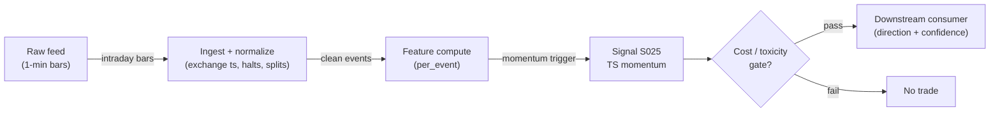

# S025 — Intraday time-series momentum

Own past return predicts the next interval - the intraday trend signature. Provenance **[D]**.

> Tag law: every numeric literal in prose carries one of `[documented]
> [default] [example] [unverified] [internal-est] [measured]` (legend: Appendix
> i v1.0.0). Constants inside cited formulas inherit the formula's tag
> (`[documented]` for cited literature). Bibliographic years, volumes, pages,
> arXiv IDs, section numbers, rule codes (C1–C11), fail-safe codes (F1–F5),
> module IDs, and machine-parsed §0 data fields are identifiers, not
> literals, and are exempt.

## §1 Five-minute reviewer card

| Row | Value |
|---|---|
| Module | S025 — Intraday time-series momentum, v1.0.1 |
| Edge verdict | `PREDICTIVE-FEATURE-ONLY` — Gao et al. (2018) JFE: SPY first-half-hour return predicts the last-half-hour, in-sample R² `1.6`% (robust t `4.08`) [documented]; Heston–Korajczyk–Sadka (2010) JF: continuation at half-hour multiples of a day lasting `≥40` days [documented], but the authors explicitly note strategies capturing it lose money after paying the bid/ask spread [documented] |
| After-cost | `BEFORE-COST` — a *conditional intraday trigger* [documented]: the pattern is strongest in the first/last half-hour and on high-volatility, high-volume, macro-news days [documented]; decays within minutes — size for the decay |
| Build cost | Tier M · `20–60` h [internal-est] · `$3,000–9,000` loaded [internal-est] |
| Data cost | Research: Databento Standard `$199`/mo + usage (DBEQ.BASIC OHLCV-1m `$35`/GB historical) [documented; verify before budgeting]; or Polygon/Massive Starter–Advanced `$29–199`/mo [documented secondary]. A `60`-day `20`-name 1-min research set is `<1` GB → `<$40` one-off usage [internal-est]. Production: `$199`/mo + usage [documented] |
| latency_class | microstructure / sub-second |
| risk_class | low (signal-only; no order placement) |
| Capacity | `$1–10`M/day notional [example] — illustrative; calibrate per venue |
| Executability | Feasible: Python+polars prototype, `<=20` symbols live [internal-est]; Rust ingest beyond that |
| Risk summary | Decay risk: the effect attenuates within minutes; dies on decay and over-holding; post-sample decay of the Gao pattern is an open question [documented caveat] |
| When it dies | Sharpe `<0.5` over `60` days [default] (retire); holding past decay; lookback miscalibration; quiet low-volume regimes (effect shrinks [documented]) |
| Regime gates | Provisional: R001 elevated RV amplifies (momentum stronger but noisier); R004 macro-news/high-vol days amplify [documented]; R005 quiet low-volume days degrade [documented]; R002–R003 degrade |
| Emits | `signal_vector` (Appendix b v1.0.0) — never orders |

## §1.5 Cheapest / least-build path

1. **Prototype hour band:** `20–60` h [internal-est] — intraday bar tape + lookback-return calculator + momentum trigger + reference validation against the fixture
2. **Cheapest-source row:** min_tier = Databento DBEQ.BASIC OHLCV-1m (SIP, usage `$35`/GB historical, `$42`/GB live) [documented] for backfill; live research candidate Polygon/Massive Starter `$29`/mo (15-min delayed) → Advanced `$199`/mo (real-time) [documented secondary, verify at polygon.io/pricing before budgeting]; latency_class = SIP-delayed; required_fields = 1-min bars (regular session, open-time labeled) + corporate-action/split flags + halt feed; lookback and holding horizons; price_band = `<$40` one-off research [internal-est], `$29–199`/mo streaming [documented secondary]; build_or_buy = ****build the trigger, buy the intraday feed** (the trigger is `~60` lines [internal-est]; the value is the horizon calibration)**.
3. **Resource budget:** `1` core, `<2` GB RAM for `<=20` symbols live [internal-est]; compute pattern `per_event`.
4. **Skip list:** cross-sectional intraday momentum (phase `2`); overnight-momentum variants; Gao-spec replication (first-half-hour-incl-overnight → last-half-hour — that is a separate module spec)
5. **DO-NOT-CUT list:** causality assertions (`assert fill_event >
   signal_event`, no-signal-bar-fills test); COST block + callable
   `expected_cost_bps`; F1–F5 fail-safes + module-state enum; decision-log
   audit records; bona-fide-intent + self-trade prevention; provenance tags on
   every numeric literal; fixtures + `test_cmd`; secrets via env only.
6. **Escalation gate:** momentum Sharpe `<0.5` over `60` days [default] -> retire; live universe `>20` symbols [default]

## §S0 Module contract

### S0.1 Typed signature

```python
def signal(state: ModuleState, events: list[Event], cfg: Config) -> SignalVector:
```

`SignalVector` per Appendix b v1.0.0. `state` is the module-owned named state vector (`lb_ret`, `mom_state`, `module_state`, `holding_until`, `cooldown_until`, `last_side`); `events` are canonical Events (Appendix a v1.0.0), newest last. The function handles documented edge cases: empty events → `UNKNOWN`; crossed/locked quotes → `UNKNOWN` (F1, never interpolate); halt/auction events → freeze per the market-state table; sub-threshold prints → direction `0` (C2); active cooldown → `FLAT` with `OK` state.

### S0.2 Config dataclass

| Parameter | Type | Default | Range | Status |
|---|---|---|---|---|
| `lookback_min` | int | `30` | `5`-`120` | default |
| `hold_min` | int | `30` | `5`-`120` | default |
| `ret_min_bps` | float | `10.0` | `5`-`50` | default |
| `cost_gate_k` | float | `0.5` | `0.1`-`2.0` | default |
| `cooldown_min` | int | `30` | `5`-`120` | default |

All defaults tagged per the tag law (status `default` ⇒ `[default]`). Calibration recipe per parameter: §S2 "Calibration procedure". `lookback_min` is a number of 1-min bars [default]; on a different bar cadence the implementer converts minutes → bars.

### S0.3 Canonical schema mapping

Vendor columns → canonical Event schema (Appendix a v1.0.0), stated once here:

| Vendor (Databento MBP-1) | Canonical |
|---|---|
| `ts_event` | `event_ts (int64 ns UTC)` |
| `ts_recv` | `asof_ts (int64 ns UTC)` — staleness anchor |
| 1-min aggregates over MBP-1 trades | `bar_o/h/l/c/v (1-min)` |

Polygon.io mapping: `t` → `event_ts` (SIP time — label SIP work *simulated only — requires MBO/ITCH* for latency claims), `p`/`s` bid/ask → `bid_px`/`bid_sz`, etc.

**Bar-build rules** (normative for this module): regular session only `09:30`–`16:00` America/New_York [documented]; bar label = bar open time [default]; all trade prints included, odd lots included [default]; bars with `c <= 0` or missing are masked, never interpolated [default]; corporate actions (splits, dividends) mask the bar at the action boundary and restart the lookback window [default]; halt/auction prints never enter a bar.

### S0.4 Time contract

> Time contract: clock domain UTC, int64 ns; authoritative causality clock = `event_ts`; max_skew = `1` ms [default]; jitter budget = `500` µs [default]; bar-label = open time; staleness TTL = `3` s [default] (`3`× the `1`-s reference cadence per F4); gap policy = mask, no interpolation; halt/auction → discard contributions across reopen.

**Timing box:** `signal@t (per_event, America/New_York) → earliest fill @open(t+1)`

### S0.5 Market-state table

| State | Module behavior |
|---|---|
| CONTINUOUS_TRADING | Compute normally; emit per cadence |
| HALTED | Freeze state; emit `UNKNOWN`; discard contributions across reopen |
| AUCTION | No new signals; hold last `SignalVector`; state `DEGRADED` |
| CLOSED | Emit nothing; state `OFF` |

### S0.6 Module-state enum + error taxonomy

States per Appendix k v1.0.0: `OK | DEGRADED | UNKNOWN | OFF`. Invalid input → `UNKNOWN`, never interpolate (Appendix f v1.0.0, F1–F5).

| Failure | State | Alert |
|---|---|---|
| Missing/stale input (TTL per §S0.4) | `UNKNOWN` | page |
| Crossed/locked quote reaching module | `UNKNOWN` | log |
| Feature out of mathematical bounds (F2) | `UNKNOWN` | page |
| `seq` gap > `1,000` events [default] | `DEGRADED` (restart windows) | log |
| SIP jitter > budget persistently | `DEGRADED` | notify |
| Halt/auction | `UNKNOWN` / `DEGRADED` (per table) | log |
| Active cooldown (C10) | `OK` (emit `FLAT`) | log |
| Kill/administrative disable | `OFF` | page |
| Anything unmapped | `UNKNOWN` | page |

### S0.7 Ops tail

- **Schedule:** continuous during US equities regular session `09:30`–`16:00` America/New_York [documented]; owner: microstructure-signals on-call.
- **Health checks:** fixture replay (`test_cmd`) green on deploy; live `seq-gap` monitor; staleness watchdog at `3`× cadence [default].
- **Alert table:** page on `UNKNOWN` > `30` s [default] or bounds violation; notify on `DEGRADED`; log on single dropped events.
- **Resource budget:** `1` core, `<2` GB RAM for `<=20` symbols live [internal-est]; state is O(window) per symbol.
- **Runbook stub:** `1.` confirm feed (Databento status); `2.` replay fixture; `3.` if red → set `OFF`, page; `4.` reconcile decision log before re-arm.

### S0.8 Secrets (env-only)

`DATABENTO_API_KEY`, `POLYGON_API_KEY` via environment only. No secrets in this file, fixtures, or logs (CI secrets-grep).

### S0.9 May / must-NOT

> **May:** emit `SignalVector` records per Appendix b v1.0.0. **Must-NOT:** emit orders, order intents, prices, share counts, or notionals; call a broker; mutate shared state outside `state`; interpolate across gaps.

## §S1 Legacy (subsumed by §1)

Legacy §S1 content is the §1 reviewer card above; this header is retained so section numbering stays frozen.

## §S2 Specification

### Universe

US common stocks, regular session; liquid names. Practical screens [default]: share price `>= $5.00` (per-share fees dominate below), ADV `>= 1,000,000` shares, quoted spread `<= 5` bps [default]. Index ETFs (SPY and peers) are the cleanest documented vehicle [documented: Gao et al. 2018]; single names add idiosyncratic noise.

### Entry rule (Boolean — no prose-only conditions)

```
ENTER_LONG  := (lb_ret >= ret_min_bps) -> LONG at next open (t+1)   # threshold inclusive [default]
ENTER_SHORT := (lb_ret <= -ret_min_bps) -> SHORT at next open (t+1)
FLAT        := otherwise OR (cost gate fails) OR (cooldown active)
```

Momentum confirmed on the lookback return; entry at the next bar's open; flat after the holding horizon. **Specification scope** [documented]: this module implements a *rolling* `30`-min [default] lookback trigger — an implementable simplification [internal-est] of the documented pattern. It is NOT Gao's specification. Gao, Han, Li & Zhou (2018) specify: first-half-hour return measured **from the prior close** (i.e. including the overnight gap) predicts the last-half-hour return [documented]. If the build's purpose is a Gao replication, the first-half-hour must include the overnight gap and the entry/hold clock is the day's last half-hour — that is a different module, not this one.

### Exits (with post-exit cooldown)

```
EXIT := (hold_min elapsed since entry) OR (stop hit)
        ON_EXIT: cooldown_until = now + cooldown_min   # 30 min [default]; C10
```

The time stop is the edge: Gao's continuation is a last-half-hour phenomenon and Baltussen et al. (2021) show the predictability reverts over the next days [documented] — over-holding converts continuation into reversal exposure.

### Position sizing (fenced function)

```python
def size_shares(risk_budget_R, stop_distance, vol_estimate, ADV_cap, cost):
    # S-module requests capital fraction only; share math lives in the strategy.
    # Reference: capital = 0.5 * confidence  (confidence in [0,1])  [default]
    risk_notional = risk_budget_R * 0.5 * confidence          # [default] 0.5 factor
    shares = risk_notional / max(stop_distance, 1e-9)
    return int(min(shares, ADV_cap * adv_shares * 0.001))     # 0.1% ADV cap [default]
```

### Risk limits

| Limit | Value |
|---|---|
| Max capital fraction per signal | `0.5` [default] |
| Max adverse excursion before `UNKNOWN` review | `2.0`× stop [default] |
| Staleness kill | TTL per §S0.4 → `UNKNOWN` |

### COST block (single source of truth)

| Component | Value (bps) | Basis |
|---|---|---|
| Spread (half-spread, liquid large-cap) | `0.43` | [example] — reference print; measure per venue |
| Exchange taker fee (`$0.0030`/share, Nasdaq price list → `0.30` bps at `$100` ref) | `0.30` | [documented] |
| SEC Section 31 (`$20.60`/M on sells, FY2026 rate eff. `2026-04-04`) | `0.206` | [documented] |
| FINRA TAF | not pinned | [unverified] — pin the current FINRA fee schedule before production |
| Borrow | `0.0` | [default] — reference build long-biased; shorts add C7 locate cost |
| Impact | `0.0` | [example] — flagged; calibrate per venue at scale-up |
| **Total reference (one-way sell leg, `$100` ref)** | `0.936` | [example] |

`fee_schedule_as_of`: `2026-09-10` [measured] — the date the schedules below were checked; re-check before production. `side: taker` [default]; venue/tier/source: XNAS / Databento MBP-1 [example]. Re-stating cost numbers outside this block is a validation failure.

Fee sources: Nasdaq Trader price list (fee to remove liquidity `$0.0030`/share) [documented]; SEC Fee Rate Advisory FY2026 (Feb 27, 2026) [documented]. Per-share → bps conversion uses `ref_px = $100` [example]; the callable exposes it so the gate's reference-price sensitivity is testable (see test_05: at `$5` ref a `10` bps edge fails the `0.5` gate).

```python
def expected_cost_bps(notional, adv_pct, venue, side, urgency, ref_px=100.0) -> float:
    """Callable cost model — L2 constant stack (impact=0 flagged [example])."""
    spread_bps = 0.43                      # [example]
    taker_bps = 30.0 / ref_px               # $0.0030/share [documented]
    sec31_bps = 20.60 / 100.0               # $20.60/M on the sell leg [documented]
    borrow_bps = 0.0                        # [default] long-biased reference; reason in table
    impact_bps = 0.0                        # [example] flagged; calibrate per venue at scale-up
    fee_bps = taker_bps + sec31_bps
    if side == "maker":
        fee_bps = -20.0 / ref_px            # -$0.0020/share displayed-add credit [documented]
    return spread_bps + fee_bps + borrow_bps + impact_bps
```

### Execution / fill model table

| Aspect | Assumption |
|---|---|
| Latency | Signal→intent `≤1` ms colocated [example]; SIP path latency-simulated-only |
| Partial fills | N/A (signal-only; T-module policy: Appendix c v1.0.0) |
| Impact | `0.0` bps reference [example]; stress ×`5` [example] |
| Adverse fill | Toxic-flow haircut `0.2` bps per `1.0` \|z\| [example] |

### Robustness

Window/threshold sensitivity must be validated on purged/embargoed out-of-sample data; microstructure parameters mined on `1` month of tape overfit [internal-est]. Re-validate after any feed or venue change. HKS (2010) show sub-hour reversal is dominated by bid–ask bounce [documented] — the lookback must stay comfortably above the bounce horizon; `lookback_min >= 5` [default] floor.

### Calibration procedure

1. **Grid** [example]: `lookback_min ∈ {5,10,15,20,30,45,60}`, `hold_min ∈ {15,30,45,60}`, `ret_min_bps ∈ {5,10,15,20}`, `cost_gate_k ∈ {0.25,0.5,1.0,2.0}`, `cooldown_min ∈ {15,30,60}`.
2. **Walk-forward** [default]: train on trailing `60` sessions, test on the next `20` sessions, roll weekly; embargo `1` session between train and test (no leakage across the boundary).
3. **Selection metric**: embargoed-test net-of-cost Sharpe of the gated trigger; veto the config if net Sharpe `<0.5` [default].
4. **Sensitivity gate** [default]: report the winner's ±1-grid-step neighbors; if the top-`3` configs disagree on trade direction on more than `25`% of test days, shrink `ret_min_bps` upward (demand a stronger print) and re-run.
5. **cost_gate_k calibration** [default]: choose the smallest `k` that admits at least `50`% of historically gross-positive signals while blocking sub-cost prints; `0.5` is the starting default, not a calibrated value.
6. **Re-calibrate** monthly [default] or after any fee-schedule, venue, or session change; record every calibration run (date, grid, winner, OOS net Sharpe) in the decision log.

### Compliance sub-block (C1–C10+)

| Code | Rule: trigger → check → action → log |
|---|---|
| C1 | Self-match prevention: signal module emits no orders; downstream T-modules must set self-trade-prevention flags — this module asserts the requirement in its `consumes` contract |
| C2 | Bona-fide intent: every emitted `SignalVector` with \|direction\|=`1` must pass the cost gate; sub-threshold prints emit direction `0`, never a tradeable hint |
| C3 | Message-rate: `<=100` emissions/symbol/s [default]; breach -> throttle to `1`/s [default] + alert |
| C4 | Fat-finger trio (applied by consumers; this module bounds its own outputs): confidence in [`0`,`1`], capital in [`0`,`0.5`], computed_at sane - out-of-bounds -> `UNKNOWN` (F2) |
| C5 | Decision log: every emission, veto, and state transition logged per Appendix g v1.0.0, hash-chained |
| C6 | Halt/auction: per the market-state table; contributions across reopen discarded |
| C7 | Locate check: SHORT direction requires `locate_ok` from the consumer; never emit SHORT without the consumer asserting locate (Reg-SHO threshold securities -> direction `0`) |
| C8 | Public dissemination: no signal values published externally without review gate |
| C9 | Data entitlements: per the Data rights row; entitlement-class change -> escalation gate |
| C10 | Post-exit cooldown: no re-entry for `cooldown_min` after any exit or compliance block |
| C11 | Spoofing hygiene: down-weight quotes with lifetime `<50` ms [example]; never quote on them |

### Parameter table

| Parameter | Symbol | Value | Tag | Sensitivity |
|---|---|---|---|---|
| Lookback | `lookback_min` | `30 min` | [default] | high |
| Holding | `hold_min` | `30 min` | [default] | high |
| Min return | `ret_min_bps` | `10 bps` | [default] | high |
| Cost-gate k | `cost_gate_k` | `0.5` | [default] | medium |
| Cooldown | `cooldown_min` | `30 min` | [default] | low |

### Timing box

`signal@t (per_event, America/New_York) → earliest fill @open(t+1)`

## §S3 Math + normative pseudocode

**Documented regression (Gao, Han, Li & Zhou 2018)** [documented]: $r_{L,t} = \alpha + \beta_1 r_{1,t} + \varepsilon_t$, where $r_{L,t}$ is the day's last-half-hour return and $r_{1,t}$ is the first-half-hour return measured from the prior close (including the overnight gap) [documented]. In-sample R² `1.6`% with robust t-statistic `4.08` on SPY 1993–2013 [documented]; adding the 12th half-hour raises R² to `2.6`% [documented, per SB5 research pass]. The effect is stronger on high-volatility, high-volume, recession, and macro-news days [documented], and the predictive power reverts over the next days [documented, Baltussen et al. 2021].

**Documented variant (Heston, Korajczyk & Sadka 2010)** [documented]: cross-sectional return continuation at half-hour intervals that are exact multiples of a trading day, lasting at least `40` days [documented]; stronger in the first and last half-hour [documented]; sub-hour reversal is driven by temporary liquidity imbalances and bid–ask bounce [documented]. Explicitly not a standalone arbitrage: strategies capturing the periodicity lose money after paying the bid/ask spread [documented].

**This module's rule** [internal-est]: rolling lookback return over `lb` minutes: $r_{t-lb,t} = p_t/p_{t-lb} - 1$. **Trigger:** $r_{t-lb,t} \ge 10$ bps [default] -> LONG at the next bar's open; mirror for SHORT; threshold crossing inclusive [default]. **Holding:** flat after `30` min [default]. Fixture (*example*): `p_{t-30} = 100.00`, `p_t = 100.15` -> `r = 15` bps `>= 10` -> LONG. The edge proxy for the cost gate is the triggering move's magnitude in bps [example] — a simplification, not an estimated continuation; calibrate against the walk-forward (§S2).

**Normative pseudocode** (pseudocode is normative; prose is commentary):

```
function signal(state, events, cfg) -> SignalVector:
    assert events non-empty else return UNKNOWN                     # F1
    bars = build_intraday_bars(events)  # §S0.3 rules: session-only, open-time labels, no interpolation
    if now_ns() < state.cooldown_until: return FLAT(OK, reason=cooldown)  # C10
    if len(bars) <= cfg.lookback_min: return FLAT(DEGRADED)         # insufficient history [default]
    r = bars[-1].c / bars[-1-cfg.lookback_min].c - 1
    assert isfinite(r) and bars[-1].c > 0 else return UNKNOWN       # F2
    staleness = now_ns() - bars[-1].asof_ts
    assert staleness <= cfg.staleness_ttl_s else return UNKNOWN     # F4; staleness_ttl_s = 3 [default]
    if now_ns() < state.holding_until:                              # still in the holding window
        side = state.last_side
    else:
        side = 1 if r >= cfg.ret_min_bps/1e4 else (-1 if r <= -cfg.ret_min_bps/1e4 else 0)
        if side != 0:
            state.holding_until = bars[-1].event_ts + cfg.hold_min * 60e9
            state.last_side = side
    edge_bps = abs(r) * 1e4                                        # gross edge proxy [example]
    # normative cost-gate predicate: expected_cost_bps(...) <= k * edge_bps
    cost_ok = expected_cost_bps(notional, adv_pct, venue, side, urgency, ref_px) <= cfg.cost_gate_k * edge_bps
    if side != 0 and not cost_ok:
        return FLAT(DEGRADED, reason=cost_gate)                     # C2 bona-fide intent
    sig = SignalVector(symbol, direction=side, confidence=min(abs(r)*1e4/30.0, 1.0), capital=0.5*confidence,
                       computed_at=bars[-1].event_ts, staleness=staleness,
                       module_state=state.module_state)
    if side != 0 and now_ns() >= state.holding_until:              # exit fired elsewhere -> cooldown
        state.cooldown_until = now_ns() + cfg.cooldown_min * 60e9  # C10
    log_decision(sig, inputs_hash, params_hash)                    # C5 / Appendix g
    assert fill_event > signal_event  # t->t+1 causality: entry at next bar's open
    return sig
```

Causality: the lookback window closes at `t`; entry is at the next bar's open - never inside the lookback. Mandatory unit test: no-signal-bar fills.

## §S4 Worked example (fixture-backed)

- Tape: `modules/fixtures/S025_tape.csv` — `# TYPE: validation-run`; `40` synthetic 1-min bars (session `2026-09-09`, open-time `ts_ns` labels) [example]; bars `1`–`20` flat at `100.00`, bars `21`–`30` ramp `+0.02`/bar to `100.20`, bars `31`–`40` fall `-0.03`/bar to `99.90`; seed `20260925` [example].
- Expected outputs: `modules/fixtures/S025_expected.csv`; per-bar lookback return vs the bar `30` back (`ret_bps`, `0.0` for the `1`–`30` warm-up) and trigger (`trig`: `1`/`-1`/`0`); hand-checked below.
- Tolerance: `1e-4` [default] on floats; integer contributions exact.
- Acceptance tests (`modules/tests/test_S025.py`, `7` tests): `1.` fixture recomputes to expected (`40` bars, `30`-bar lookback semantics); `2.` trigger map: bars `31`–`33` LONG, bar `40` SHORT, bar `34` flat, bars `1`–`30` flat (warm-up); `3.` stub emits valid `SignalVector` (direction in {+1,-1,0}, confidence in [`0`,`1`], capital in [`0`,`0.5`]; threshold inclusive; sub-threshold flat per C2); `4.` no-signal-bar fills (`fill_event_ts > computed_at`); `5.` cost-gate predicate: pins `0.936` bps one-way sell leg at `$100` ref, passes on `10`/`15` bps edge (`k = 0.5` [default]), blocks on `0.01` bps edge, blocks a `10` bps edge at `$5` ref (price sensitivity), maker leg `0.23` bps; `6.` invalid input -> `UNKNOWN`; `7.` deterministic across calls.
- `test_cmd`: `python -m pytest modules/tests/test_S025.py -q` → exits `0`.

**Hand-checked rows** (arithmetic verified by hand against the fixture):

- bar 31: `(100.17-100.00)/100.00 = 17.0` bps `>= 10` -> LONG ✓
- bar 34: `(100.08-100.00)/100.00 = 8.0` bps `< 10` -> flat ✓
- bar 40: `(99.90-100.00)/100.00 = -10.0` bps `<= -10` -> SHORT (boundary, inclusive) ✓

**Where the example is optimistic:** no fees, no latency, no hidden liquidity, smooth synthetic ramps with no bid–ask bounce — arithmetic illustration, not a backtest.

## §S5 Strategies that use this signal

Generated from `deps.yaml` (CI symmetry). Provisional consumer list (roles pinned at ingest):

| Strategy | Role |
|---|---|
| T-series execution consumers (see `deps.yaml`) | Downstream consumer of this signal family's direction/confidence outputs; exact strategy IDs pinned at ingest |

Intraday momentum triggers are consumed by short-horizon strategies; consumer roles pinned in `deps.yaml`.

## §S6 Data required

| Field | Type | Granularity | Source tier | Notes |
|---|---|---|---|---|
| 1-min OHLCV bars (regular session) | OHLCV | `1` min | Tier 2 | built from MBP-1 trades per §S0.3; open-time labeled |
| Best bid/ask price + displayed size | float / int | every quote event (L1) | Tier 2 | displayed size per price move; for spread calibration |
| Exchange timestamps | int64 ns | per event | Tier 2 | SIP adds 10s of µs jitter [documented] — label SIP work *simulated only — requires MBO/ITCH* |
| Corporate actions / halts | reference | daily + intraday halt feed | Tier 1 | contributions garbage across splits/halt reopens |

**Data rights row** (Appendix j v1.0.0): US equities L1 via Databento MBP-1, `rights: licensed`; license scope = research + stated production symbol count; raw ticks never leave our systems — fixtures are synthetic; entitlement = professional/internal, no display; retention per vendor terms, purge path in runbook. Entitlement-class change → §1.5 escalation gate.

## §S7 Local build (M5 Max / 128 GB)

Feasible. O(`1`) [documented] per-event scan: Python loop `~100–500`k events/s [internal-est] vs `~50–500` L1 events/s average per liquid name, busy bursts `~1–5`k/s [internal-est] (cost-model §2). `50` symbols × `2`k events/s = `100`k/s → Python borderline, Rust (`5–50`M/s [internal-est]) comfortable; polars batch recompute each second trivial. Bottleneck is I/O and timestamp normalization. RAM: one symbol-day L1 `~0.5–4` GB [internal-est] — fine for a few symbols; `60` days does not fit — stream per-symbol daily parquet (cost-model §3). Data sizing: one symbol-year of 1-min OHLCV is `~98`k rows (`390` min/day × `252` days [documented session geometry]) ≈ `<10` MB [internal-est] → a `60`-day `20`-name research set is `<1` GB, i.e. `<$40` Databento usage one-off [internal-est].

## §S8 Buy vs build

Build the estimator (Python+polars), buy the feed. Verdict: the per-event math is `~40–100` lines [internal-est]; the value is normalization, windows, and calibration — none sold by vendors. Buy Databento usage for history (DBEQ.BASIC OHLCV-1m `$35`/GB historical, MBP-1 `$2.00`/GB historical [documented: Databento unit pricing 2024-12-11]; Standard plan `$199`/mo incl. `12` months L1 [documented secondary]), Polygon/Massive for live research (`$29–199`/mo [documented secondary]); direct/MBO only after the signal survives realistic costs (cost-model §6).

## §S9 Efficacy — documented evidence

| Study / source | Market & period | Metric | Before/after cost | Caveat |
|---|---|---|---|---|
| Gao, Han, Li & Zhou (2018), "Market Intraday Momentum", JFE [documented] | SPY, 1993–2013 | First-half-hour (from prior close) predicts last-half-hour; in-sample R² `1.6`% (robust t `4.08`); `2.6`% with 12th half-hour | `BEFORE-COST` | first-half-hour must include the overnight gap — excluding it is a different specification |
| Heston, Korajczyk & Sadka (2010), "Intraday Patterns in the Cross-Section of Stock Returns", JF 65(4):1369–1407 [documented] | US equities, half-hour buckets | Continuation at half-hour multiples of a day, `≥40` days; stronger first/last half-hour; sub-hour reversal is bid–ask bounce | `BEFORE-COST` | authors state strategies capturing this lose money after the bid/ask spread — execution-timing use only |
| Baltussen, Da, Lammers & Martens (2021), "Hedging Demand and Market Intraday Momentum", JFE 142(1):377–403 [documented] | `60`+ futures, 1974–2020 | Last-`30`-min predicted by rest-of-day return (from prior close); gamma-hedging mechanism (option MMs, LETFs) | `BEFORE-COST` | futures, not single-name equities; predictability reverts over next days |

Selection disclosure: the `3` studies are the documented intraday-momentum core surfaced by the SB5 research pass and verified 2026-09-10 against the journals/abstracts. **No checkable after-cost study of a tradable intraday-momentum rule was found** — the edge verdict stays `PREDICTIVE-FEATURE-ONLY`. The module's rolling-`30`-min trigger is an implementable simplification [internal-est], not a replication of any row above.

## §S10 Failure modes & pitfalls

| # | Trigger → Detect → Action → Recovery | check: |
|---|---|---|
| 1 | Decay miss: holding past the decay window -> detect: P&L decay after hold_min -> action: enforce time stop -> recovery: recalibrate hold_min | `check: holding <= hold_min` |
| 2 | Lookahead leakage: bar-close feature traded intra-bar → detect: causality audit flags `fill_event <= signal_event` → action: halt, fix bar finalization → recovery: re-run no-signal-bar-fills test | `check: all(fill_ts > computed_at)` |
| 3 | Staleness/latency: feed timestamps in a race → detect: jitter > budget → action: `DEGRADED`, label simulated-only → recovery: direct feed or stand down | `check: asof_ts - event_ts <= jitter_budget` |
| 4 | Fleeting quotes/spoofing: displayed size cancels pre-execution → detect: quote lifetime `<50` ms [example] share rising → action: down-weight sub-`50` ms quotes → recovery: re-tune weights | `check: fleeting_share < 0.3 [default]` |
| 5 | Cost blowup: spread+fees+impact on the round trip → detect: cost gate failing on `[measured]` costs → action: widen `k` gate or stand down → recovery: re-pin fee schedule | `check: expected_cost_bps(...) <= k * edge_bps` |
| 6 | Regime breaks: depth/volatility regime shifts → detect: feature distribution break → action: veto entries → recovery: resume when stable for `5` min [default] | `check: feature_z_within_3_sigma [default]` |
| 7 | Overfitting: parameters mined on `1` period → detect: OOS decay → action: purged/embargoed re-validation → recovery: shrink per-symbol | `check: oos_sharpe > 0.5 * is_sharpe [default]` |
| 8 | Data errors: bad ticks, splits, halts → detect: bounds/`seq`-gap monitors → action: `UNKNOWN`, mask bars → recovery: backfill and replay | `check: no crossed quotes in window` |
| 9 | Specification mismatch: running this rolling trigger as if it were Gao's first→last half-hour spec → detect: code review / calibration log shows lookback ≠ day-open anchor → action: build the Gao-spec module separately → recovery: re-label this module's backtests as rolling-trigger only | `check: lookback_anchor == rolling [default]` |
| 10 | Post-sample decay: the documented pattern attenuates out of sample → detect: rolling `60`-day net Sharpe < `0.5` [default] → action: retire per §1 escalation gate → recovery: none; do not re-tune until a new documented regime | `check: rolling_60d_sharpe >= 0.5 [default]` |

### Regime-gate machine records (provisional)

| regime_id | direction | mechanism | condition | action | min_lag | unknown_behavior |
|---|---|---|---|---|---|---|
| R001 | amplifies | elevated realized volatility widens spreads and deepens adverse selection | RV > `2`× trailing median [example] | widen_stops | `1` session [example] | hold last label |
| R002 | degrades | quote flicker / spoofing regimes inject noise into book features | fleeting-quote share > `0.3` [example] | halve | `30` min [example] | veto entries |
| R003 | degrades | halt/auction regimes break continuity assumptions | market_state != CONTINUOUS_TRADING | pause_entry | `0` | veto entries |
| R004 | amplifies | macro-news / high-vol days concentrate the Gao continuation (stronger on high-vol, high-volume, recession, macro-news days [documented]) | scheduled macro release day OR RV > `2`× trailing median [example] | widen_stops | `1` session [example] | hold last label |
| R005 | degrades | quiet low-volume days shrink the Gao effect [documented] | session volume < `0.7`× trailing median [example] | halve | `1` session [example] | veto entries |

## §S11 Visuals

`../../images/S025_example.png` — synthetic `40`-bar momentum tape (seed `20260925` [example]): `30`-bar lookback returns and triggers (LONG bars `31`–`33`, flat `34`–`39`, SHORT bar `40`).



## §S12 Source log + unverified leads

**Sources** (citable facts only):

1. Gao, Han, Li & Zhou (2018), "Market Intraday Momentum", *Journal of Financial Economics* [documented]. First-half-hour return (measured from the prior close, i.e. including the overnight gap) predicts the last-half-hour return on SPY (1993–2013); in-sample R² `1.6`% with robust t-statistic `4.08`; `2.6`% adding the 12th half-hour; stronger on high-volatility, high-volume, recession, and macro-news days; also present in `10` other liquid ETFs (per SB5 research pass; journal abstract verified 2026-09-10).
2. Heston, Korajczyk & Sadka (2010), "Intraday Patterns in the Cross-Section of Stock Returns", *Journal of Finance* 65(4):1369–1407 [documented]. Return continuation at half-hour intervals that are exact multiples of a trading day, lasting at least `40` days; stronger in the first and last half-hour; sub-hour reversal driven by temporary liquidity imbalances and bid–ask bounce; timing trades can save about one effective spread, but strategies attempting to capture the periodicity lose money after paying the bid/ask spread (verified via Kellogg research page and working-paper abstract, 2026-09-10).
3. Baltussen, Da, Lammers & Martens (2021), "Hedging Demand and Market Intraday Momentum", *Journal of Financial Economics* 142(1):377–403, DOI 10.1016/j.jfineco.2021.04.029 [documented]. Last-`30`-min return on `60`+ futures (1974–2020) predicted by rest-of-day return from the prior close; mechanism = gamma-hedging demand from option market makers and leveraged ETFs; predictability reverts over the next days (verified via RePEc/Notre Dame working paper, 2026-09-10).
4. Nasdaq Trader price list: fee to remove liquidity `$0.0030`/share for shares `≥$1.00` [documented; nasdaqtrader.com, checked 2026-09-10]. NYSE Tapes B/C: `($0.0020)`/share displayed-add credit [documented; SEC Exhibit 5].
5. SEC Fee Rate Advisory FY2026 (Feb 27, 2026): Section 31 rate `$20.60` per million, effective `2026-04-04` [documented; sec.gov].
6. Databento unit pricing (2024-12-11 sheet): DBEQ.BASIC MBP-1 `$2.00`/GB historical, `$2.40`/GB live; OHLCV-1m `$35.00`/GB historical, `$42.00`/GB live [documented; databento-media pricing PDF].
7. Polygon/Massive price points: Free (15-min delayed, `5` calls/min), Starter `$29`/mo, Developer `$99`/mo, Advanced `$199`/mo, All-Access `$399`/mo [documented secondary: 2026 market-data API roundup — verify at polygon.io/pricing before budgeting].
8. Databento Standard plan `$199`/mo incl. `12` months L1 data [documented secondary: 2026 third-party comparison — verify before budgeting].

**Chatbot source log.** batches/SB5/grok-answers.md **present** (SB5 research pass, 2026-09-10; earlier draft wrongly said absent): verbatim Q&A covers Donchian/Keltner/Bollinger breakouts plus a dedicated intraday-momentum section — Gao first→last half-hour (SPY 1993–2013), HKS same-slot continuation, Baltussen gamma-hedging, replications (Li et al. 2021 `12`/`16` markets; China futures slopes `0.05`–`0.10`, R² `1.8`%; Zhang et al. 2019 China stocks), tradability and failure-regime notes. Treated as leads; journal facts above were independently verified via web 2026-09-10. duckai-answers.md present (`45` lines, no S025 content).

**Unverified leads** (chatbot-only — never in evidence tables):

- Gao timing-strategy magnitudes from the verbatim pass (`6.67`% p.a. on the sign of the first half-hour at `6.19`% vol) — no independent after-cost source found; treated as unverified.
- Replication details from the verbatim pass: Li et al. (2021) `12`/`16` developed markets; Zhang et al. (2019) China stocks (penultimate `30` min stronger than first); China futures slopes `0.05`–`0.10`, R² `1.8`%; KOSPI evidence; Elaut et al. (2018) FX; Wen et al. (2021) crude oil — all leads, none independently verified.
- Third-party post-sample SPY reconstructions through 2026 showing lower live CAGR than the paper's timing numbers — cautionary lead, not a citation of Gao.
- Claims of specific intraday-momentum Sharpe ratios circulating in trading literature — no checkable after-cost study found.
- FINRA TAF current rate — not verified 2026-09-10; pin the FINRA fee schedule before production.

---

## Appendix — AI build prompt (S025)

Copy-paste into any chat agent:

> Build module **S025 — Intraday time-series momentum** per
> `notes/module-template.md` v1.0.0 and this file's §S0 contract.
> Cheapest path (§1.5): prototype 20–60 h [internal-est]; cheapest data
> candidate Databento DBEQ.BASIC OHLCV-1m usage (`$35`/GB historical)
> [documented]; compute pattern `per_event`; skip cross-sectional/overnight
> and the Gao-spec replication (this module is the *rolling* `30`-min trigger).
> Implement `signal(state, events, cfg) -> SignalVector` (Appendix b v1.0.0)
> with the §S3 normative pseudocode, including the cost-gate predicate
> `expected_cost_bps(...) <= k * edge_bps` (sourced stack: `$0.0030`/share taker
> [documented], SEC-31 `$20.60`/M [documented], `ref_px = $100` [example]) and
> `assert fill_event > signal_event`. Wire F1–F5 (Appendix f v1.0.0): invalid
> input -> `UNKNOWN`, never interpolate; cooldown C10; holding-window state.
> Log decisions per Appendix g v1.0.0. Secrets via env only. Run the fixture
> `modules/fixtures/S025_tape.csv` (`# TYPE: validation-run`, `40` bars)
> against `modules/fixtures/S025_expected.csv` (tolerance `1e-4` [default]).
> **Definition of done:** `python3 -m pytest modules/tests/test_S025.py -q`
> exits `0`. Tag every numeric literal you add with the unified enum
> (Appendix i v1.0.0); put anything unverifiable in §S12 unverified leads.
