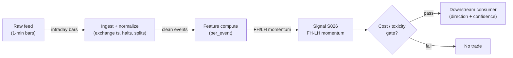

# S026 — First-half-hour to last-half-hour momentum

The first 30 minutes predict the last 30 - the intraday lead-lag signature. Provenance **[D]**.

> Tag law: every numeric literal in prose carries one of `[documented]
> [default] [example] [unverified] [internal-est] [measured]` (legend: Appendix
> i v1.0.0). Constants inside cited formulas inherit the formula's tag
> (`[documented]` for cited literature). Bibliographic years, volumes, pages,
> arXiv IDs, section numbers, rule codes (C1–C11), fail-safe codes (F1–F5),
> module IDs, and machine-parsed §0 data fields are identifiers, not
> literals, and are exempt.

## §1 Five-minute reviewer card

| Row | Value |
|---|---|
| Module | S026 — First-half-hour to last-half-hour momentum, v1.1.0 |
| Edge verdict | `PREDICTIVE-FEATURE-ONLY` — documented intraday pattern (Gao-Han-Li-Zhou 2018 / Heston-Korajczyk-Sadka 2010): before-cost only - the lead-lag is the edge |
| After-cost | `BEFORE-COST` — a *conditional intraday trigger* [documented]: first-half-hour return predicts last-half-hour return - enter in the afternoon, flat by the close |
| Build cost | Tier M · `20–60` h [internal-est] · `$3,000–9,000` loaded [internal-est] |
| Data cost | Research `~$0–30`/mo [unverified] (Polygon Free/Starter 1-min aggregates, or Databento pay-as-you-go historical); production `~$199`/mo [unverified] (Databento Standard or Polygon Advanced live) — bands indicative, verify before budgeting |
| latency_class | microstructure / sub-second |
| risk_class | low (signal-only; no order placement) |
| Capacity | `$1–10`M/day notional [example] — illustrative; calibrate per venue |
| Executability | Feasible: Python+polars prototype, `<=20` symbols live [internal-est]; Rust ingest beyond that |
| Risk summary | Lead-lag risk: correlation breaks; overnight holds are forbidden; dies on correlation collapse |
| When it dies | Lead-lag correlation `<0.1` over `60` days [default] (retire); overnight hold (S10.1); boundary miscalibration |
| Regime gates | Provisional: R001 elevated RV amplifies (FH moves larger - more triggers); trend regimes amplify the lead-lag |
| Emits | `signal_vector` (Appendix b v1.0.0) — never orders |

## §1.5 Cheapest / least-build path

1. **Prototype hour band:** `20–60` h [internal-est] — intraday bar tape + half-hour return calculator + lead-lag trigger + reference validation against the fixture
2. **Cheapest-source row (structured, research vs production):**

| Field | Research | Production |
|---|---|---|
| min_tier | Polygon.io Free (`$0`/mo [unverified]: EOD + `2`-yr history) or Starter (`~$29`/mo [unverified]: `15`-min delayed 1-min aggregates) | Databento Standard (`~$199`/mo [unverified]: unlimited live, `1`-yr L1 history) or Polygon.io Advanced (`~$199`/mo [unverified]: real-time) |
| latency_class | offline / delayed | SIP/colo-delayed |
| required_fields | 1-min OHLCV regular-session bars (`o,h,l,c,v,t` with `t` = bar open, int64 ns UTC); split/halt reference | same + live bar stream; L1 quotes (`bid_px,ask_px,bid_sz,ask_sz,ts_event`) only if C11 spoofing hygiene enabled |
| price_band | `$0–30`/mo [unverified] | `~$199`/mo [unverified] |
| build_or_buy | **build the trigger, buy the feed** — the trigger is `~60` lines [internal-est]; the value is the boundary discipline | same; add direct/MBO only after the signal survives realistic costs |

3. **Resource budget:** `1` core, `<2` GB RAM for `<=20` symbols live [internal-est]; compute pattern `per_event` (one FH computation per session per symbol; emissions only inside the entry window).
4. **Skip list:** overnight lead-lag variants (phase `2`); multi-day lead-lag; per-symbol calibration; C11 spoofing hygiene (needs L1)
5. **DO-NOT-CUT list:** causality assertions (`assert fill_event >
   signal_event`, no-signal-bar-fills test, entry-after-window rule); COST block + callable
   `expected_cost_bps`; F1–F5 fail-safes + module-state enum; decision-log
   audit records; bona-fide-intent + self-trade prevention; provenance tags on
   every numeric literal; fixtures + `test_cmd`; secrets via env only.
6. **Escalation gate (upgrade research → production when ANY fires):** live universe `>20` symbols [default]; OR C11 spoofing hygiene enabled (requires L1 — move to Databento Standard / Polygon Advanced); OR `30` consecutive sessions with zero triggers [default] (feed-boundary suspect — re-verify bar normalization before scaling). **Retire gate (separate):** lead-lag correlation `<0.1` over `60` days [default] -> retire, never upgrade.

## §S0 Module contract

### S0.1 Typed signature

```python
def signal(state: ModuleState, events: list[Event], cfg: Config) -> SignalVector:
```

`SignalVector` per Appendix b v1.0.0. `state` is the module-owned named state vector (`fh_ret`, `lh_state`, `module_state`, `cooldown_until`, `account_equity`, `adv_pct`); `events` are canonical Events (Appendix a v1.0.0), newest last. The function handles documented edge cases: empty events → `UNKNOWN`; crossed/locked quotes → `UNKNOWN` (F1, never interpolate); halt/auction events → freeze per the market-state table; FH window incomplete → direction `0` with state `OK` (valid input, no signal yet — not `UNKNOWN`).

### S0.2 Config dataclass

| Parameter | Type | Default | Range | Status |
|---|---|---|---|---|
| `ret_min_bps` | float | `20.0` | `10`–`50` | default |
| `entry_min` | int | `330` | `300`–`360` | default |
| `flat_min` | int | `390` | `375`–`390` | default |
| `cost_gate_k` | float | `0.5` | `0.1`–`2.0` | default |
| `cooldown_s` | int | `60` | `0`–`300` | default |
| `conf_scale_mult` | float | `2.0` | `1.5`–`3.0` | default |
| `carry_mult` | float | `1.0` | `0.5`–`1.5` | default |

All defaults tagged per the tag law (status `default` ⇒ `[default]`). `conf_scale_mult` sets confidence `= 1.0` at `conf_scale_mult × ret_min_bps` of FH move; `carry_mult` is the naive par-carry assumption converting the FH move into the cost-gate `edge_bps` (see §S3) — fixed at `1.0` [default] unless OOS validation says otherwise.

### S0.3 Canonical schema mapping

Vendor columns → canonical Event schema (Appendix a v1.0.0), stated once here:

| Vendor (Databento MBP-1) | Canonical |
|---|---|
| `ts_event` | `event_ts (int64 ns UTC)` |
| `open/high/low/close/volume` | `bar_o/h/l/c/v (1-min)` |

Polygon.io mapping: `t` → `event_ts` (SIP time — label SIP work *simulated only — requires MBO/ITCH* for latency claims), `p`/`s` bid/ask → `bid_px`/`bid_sz`, etc.

### S0.4 Time contract

> Time contract: clock domain UTC, int64 ns; authoritative causality clock = `event_ts`; max_skew = `1` ms [default]; jitter budget = `500` µs [default]; bar-label = open time; staleness TTL = `3` s [default] (`3`× the `1`-s reference cadence per F4); gap policy = mask, no interpolation; halt/auction → discard contributions across reopen.

**Timing box:** `signal@t (per_event, America/New_York) → earliest fill @open(t+1)`

### S0.5 Market-state table

| State | Module behavior |
|---|---|
| CONTINUOUS_TRADING | Compute normally; emit per cadence |
| HALTED | Freeze state; emit `UNKNOWN`; discard contributions across reopen |
| AUCTION | No new signals; hold last `SignalVector`; state `DEGRADED` |
| CLOSED | Emit nothing; state `OFF` |

### S0.6 Module-state enum + error taxonomy

States per Appendix k v1.0.0: `OK | DEGRADED | UNKNOWN | OFF`. Invalid input → `UNKNOWN`, never interpolate (Appendix f v1.0.0, F1–F5).

| Failure | State | Alert |
|---|---|---|
| Missing/stale input (TTL per §S0.4) | `UNKNOWN` | page |
| Crossed/locked quote reaching module | `UNKNOWN` | log |
| Feature out of mathematical bounds (F2) | `UNKNOWN` | page |
| `seq` gap > `1,000` events [default] | `DEGRADED` (restart windows) | log |
| SIP jitter > budget persistently | `DEGRADED` | notify |
| Halt/auction | `UNKNOWN` / `DEGRADED` (per table) | log |
| Kill/administrative disable | `OFF` | page |
| Anything unmapped | `UNKNOWN` | page |

### S0.7 Ops tail

- **Schedule:** continuous during US equities regular session `09:30`–`16:00` America/New_York [documented]; owner: microstructure-signals on-call.
- **Health checks:** fixture replay (`test_cmd`) green on deploy; live `seq-gap` monitor; staleness watchdog at `3`× cadence [default].
- **Alert table:** page on `UNKNOWN` > `30` s [default] or bounds violation; notify on `DEGRADED`; log on single dropped events.
- **Resource budget:** `1` core, `<2` GB RAM for `<=20` symbols live [internal-est]; state is O(window) per symbol.
- **Runbook stub:** `1.` confirm feed (Databento status); `2.` replay fixture; `3.` if red → set `OFF`, page; `4.` reconcile decision log before re-arm.

### S0.8 Secrets (env-only)

`DATABENTO_API_KEY`, `POLYGON_API_KEY` via environment only. No secrets in this file, fixtures, or logs (CI secrets-grep).

### S0.9 May / must-NOT

> **May:** emit `SignalVector` records per Appendix b v1.0.0. **Must-NOT:** emit orders, order intents, prices, share counts, or notionals; call a broker; mutate shared state outside `state`; interpolate across gaps.

## §S1 Legacy (subsumed by §1)

Legacy §S1 content is the §1 reviewer card above; this header is retained so section numbering stays frozen.

## §S2 Specification

### Universe

US common stocks, regular session; liquid names.

### Entry rule (Boolean — no prose-only conditions)

```
ENTER_LONG  := (rfh_bps >=  ret_min_bps) AND (entry_min <= session_min < flat_min) -> LONG
ENTER_SHORT := (rfh_bps <= -ret_min_bps) AND (entry_min <= session_min < flat_min) -> SHORT
FLAT        := otherwise  # incl. FH window incomplete (valid input, no signal yet) and session_min >= flat_min (forced)
```

First-half-hour return measured `9:30`–`10:00` ET; entry scheduled at minute `entry_min` of the same session (strictly after the measurement bars — the t→t+1 causality assertion is machine-checked in §S3); always flat into the close.

### Exits (with post-exit cooldown)

```
EXIT    := (session_min >= flat_min)            # always flat into the close [rule]
ON_EXIT := cooldown_until := now_ns + cooldown_s   # cooldown_s = 60 s [default]; C10
```

No price stop in the reference build — time-stop only; T-modules may add price stops.

### Position sizing (fenced function)

```python
def capital_fraction(confidence):
    # S-module requests capital fraction only; share math lives in the strategy.
    return 0.5 * confidence   # [default] max 0.5 capital fraction per signal
```

### Risk limits

| Limit | Value |
|---|---|
| Max capital fraction per signal | `0.5` [default] |
| Max adverse excursion before `UNKNOWN` review | `2.0`× stop [default] |
| Staleness kill | TTL per §S0.4 → `UNKNOWN` |

### COST block (single source of truth)

| Component | Value (bps) | Basis |
|---|---|---|
| Spread (half-spread, liquid large-cap) | `0.43` | [example] — reference print |
| Fees (taker incl. regulatory) | `0.30` | [example] — reference print |
| Borrow (`borrow_bps_per_day`) | `0.0` | [default] — long-biased intraday reference; module never holds overnight so `0` sessions accrue; SHORT legs accrue borrow consumer-side at the C7 locate |
| Impact | `0.0` | [example] — flagged; calibrate per venue at scale-up |
| **Total reference (one-way)** | `0.73` | [example] |
| **Round trip** | `1.46` | [example] — `2 ×` one-way; T-modules book the round trip |

`fee_schedule_as_of`: `2026-09-01` [unverified] — placeholder; pin the real venue schedule before production. `side: taker` [default]; venue/tier/source: XNAS / Databento MBP-1 [example]. Re-stating cost numbers outside this block is a validation failure.

```python
def expected_cost_bps(notional, adv_pct, venue, side, urgency) -> float:
    """Callable cost model — L2 constant-stack, one-way bps
    (impact=0 flagged [example] until venue calibration)."""
    spread_bps = 0.43   # [example]
    fee_bps = 0.30      # [example]
    borrow_bps_per_day = 0.0   # [default] long-biased intraday reference; reason in table
    impact_bps = 0.0    # [example] flagged; calibrate per venue at scale-up
    urgency_add = {"scheduled": 0.0, "normal": 0.25, "urgent": 0.50}[urgency]  # [example]
    if side == "maker":
        fee_bps = -0.20  # rebate [example]
    return spread_bps + fee_bps + borrow_bps_per_day + impact_bps + urgency_add
```

Normative call inside §S3: `expected_cost_bps(notional, adv_pct, venue="XNAS", side="taker", urgency="scheduled")` with `notional = account_equity × 0.5` [default] and `adv_pct` from state; gate predicate `cost_bps <= cost_gate_k × edge_bps`.

### Execution / fill model table

| Aspect | Assumption |
|---|---|
| Latency | Signal→intent `≤1` ms colocated [example]; SIP path latency-simulated-only |
| Partial fills | N/A (signal-only; T-module policy: Appendix c v1.0.0) |
| Impact | `0.0` bps reference [example]; stress ×`5` [example] |
| Adverse fill | Toxic-flow haircut `0.2` bps per `1.0` |z| [example] |

### Robustness

Window/threshold sensitivity must be validated on purged/embargoed out-of-sample data; microstructure parameters mined on `1` month of tape overfit [internal-est]. Re-validate after any feed or venue change.

### Compliance sub-block (C1–C10+)

| Code | Rule: trigger → check → action → log |
|---|---|
| C1 | Self-match prevention: signal module emits no orders; downstream T-modules must set self-trade-prevention flags — this module asserts the requirement in its `consumes` contract |
| C2 | Bona-fide intent: every emitted `SignalVector` with |direction|=`1` must pass the cost gate; sub-threshold prints emit direction `0`, never a tradeable hint |
| C3 | Message-rate: `<=100` emissions/symbol/s [default]; breach -> throttle to `1`/s [default] + alert |
| C4 | Fat-finger trio (applied by consumers; this module bounds its own outputs): confidence in [`0`,`1`], capital in [`0`,`0.5`], computed_at sane - out-of-bounds -> `UNKNOWN` (F2) |
| C5 | Decision log: every emission, veto, and state transition logged per Appendix g v1.0.0, hash-chained |
| C6 | Halt/auction: per the market-state table; contributions across reopen discarded |
| C7 | Locate check: SHORT direction requires `locate_ok` from the consumer; never emit SHORT without the consumer asserting locate (Reg-SHO threshold securities -> direction `0`) |
| C8 | Public dissemination: no signal values published externally without review gate |
| C9 | Data entitlements: per the Data rights row; entitlement-class change -> escalation gate |
| C10 | Post-exit cooldown: no re-entry for `cooldown_s` after any exit or compliance block |
| C11 | Spoofing hygiene: down-weight quotes with lifetime `<50` ms [example]; never quote on them |

### Parameter table

| Parameter | Symbol | Value | Tag | Sensitivity |
|---|---|---|---|---|
| Min first-half-hour return | `ret_min_bps` | `20 bps` | [default] | high |
| Entry minute | `entry_min` | `330` | [default] | high |
| Flat minute | `flat_min` | `390` | [default] | high - always flat into close |
| Cost-gate k | `cost_gate_k` | `0.5` | [default] | medium |
| Post-exit cooldown | `cooldown_s` | `60 s` | [default] | low |
| Confidence scale | `conf_scale_mult` | `2.0` | [default] | medium |
| FH→LH carry | `carry_mult` | `1.0` | [default] | low - fixed unless OOS-validated |

### Calibration recipes (per parameter)

General OOS protocol (applies to every recipe): purged walk-forward, `3` folds [default] (train `60` / validate `30` / test `30` sessions [default]), embargo `5` sessions [default] between folds; acceptance = test-fold Sharpe `> 0.5 ×` validation Sharpe [default] AND `≥100` test trades [default]; report variant count or "not computed"; re-calibrate quarterly [default] or when §S10 #7 fires. Do not tune in the MVB — ship the defaults, calibrate only after the fixture contract and cost gate are green.

| Parameter | Search grid | Selection recipe |
|---|---|---|
| `ret_min_bps` | `10, 15, 20, 25, 30, 40, 50` bps [default] | max OOS after-cost information ratio; tie-break → lowest threshold (more trades) |
| `entry_min` | `300, 315, 330, 345, 360` [default] | max after-cost edge/trade on validation; hard constraint `entry_min ≤ flat_min − 30` [rule] |
| `flat_min` | `375, 380, 385, 390` [default] | max after-cost edge net of exit slippage; hard constraint `flat_min ≤ 390` (session close) [rule] |
| `cost_gate_k` | `0.25, 0.5, 1.0, 1.5, 2.0` [default] | max OOS Sharpe of the cost-gated strategy; widen only on `[measured]` cost changes |
| `cooldown_s` | `0, 30, 60, 300` s [default] | re-tune only if churn cost `> 10%` of edge [default]; default `60` |
| `conf_scale_mult` | `1.5, 2.0, 3.0` [default] | min OOS calibration error (predicted vs realized direction) |
| `carry_mult` | `0.5, 1.0, 1.5` [default] | fixed at `1.0` [default]; change only under full OOS validation (it scales the cost gate) |

### Timing box

`signal@t (per_event, America/New_York) → earliest fill @open(t+1)`

## §S3 Math + normative pseudocode

First-half-hour return: $r_{FH} = p_{10:00}/p_{9:30} - 1$. **Trigger:** $r_{FH} \ge 20$ bps [default] -> LONG scheduled at minute `330` (3:00 PM ET); mirror for SHORT. **Flat:** always flat by minute `390` (close). Fixture (*example*): `p_{9:30} = 100.00`, `p_{10:00} = 100.30` -> `r_{FH} = 30` bps `>= 20` -> LONG at `330`, flat at `390`. The lead-lag is *intraday only*: never hold overnight on this signal [documented]. Documented caveat: the canonical Gao et al. (2018) predictor measures the first half-hour return from the *previous day's close* (including the overnight gap); the module's `9:30`–`10:00` window is a per-event research simplification [documented].

**Normative pseudocode** (pseudocode is normative; prose is commentary):

```
function signal(state, events, cfg) -> SignalVector:
    # --- F1: invalid input -> UNKNOWN, never interpolate ---
    if events is empty or state is None:
        return SignalVector(direction=0, confidence=0.0, capital=0.0,
                            computed_at=0, module_state=UNKNOWN)
    now = now_ns()
    if now - events[-1].asof_ts > STALENESS_TTL_NS:      # 3 s [default] per S0.4
        return flat_vector(events[-1].event_ts, UNKNOWN)
    if market_state != CONTINUOUS_TRADING:               # per S0.5 table
        return freeze_vector(state, market_state)        # HALTED->UNKNOWN, AUCTION->DEGRADED, CLOSED->OFF
    if now < state.cooldown_until:                       # C10 post-exit cooldown
        return flat_vector(now, state.module_state)

    # --- measurement: first-half-hour window, minutes since 09:30 ET ---
    fh_bars = bars_in_window(events, t_min=0, t_end=30)   # 09:30-10:00
    if fh_bars is incomplete:
        return flat_vector(now, OK)                      # valid input, no signal yet
    p_open, p_close = fh_bars[0].bar_o, fh_bars[-1].bar_c
    if not (isfinite(p_open) and isfinite(p_close) and p_open > 0):
        return flat_vector(now, UNKNOWN)                 # F2: feature out of bounds
    rfh_bps = (p_close / p_open - 1.0) * 1e4

    # --- direction + session schedule (Boolean, mirrors S2 entry rule) ---
    direction = 1  if rfh_bps >=  cfg.ret_min_bps else \
               -1  if rfh_bps <= -cfg.ret_min_bps else 0
    session_min = minutes_since_open(now)                # America/New_York
    if session_min >= cfg.flat_min:                      # always flat into the close [rule]
        state.cooldown_until = now + cfg.cooldown_s * 1e9
        log_decision(symbol=state.symbol, event="exit_flat", computed_at=now)  # C5
        return flat_vector(now, state.module_state)
    if session_min < cfg.entry_min or direction == 0:
        return flat_vector(now, state.module_state)

    # --- normative cost-gate predicate: expected_cost_bps(...) <= k * edge_bps ---
    edge_bps = abs(rfh_bps) * cfg.carry_mult            # 1.0 [default]: naive par-carry of the FH move
    notional = state.account_equity * 0.5               # [default] max capital fraction per S2
    cost_bps = expected_cost_bps(notional, state.adv_pct,
                                venue="XNAS", side="taker", urgency="scheduled")  # [default]s per S2 COST
    if not (cost_bps <= cfg.cost_gate_k * edge_bps):
        log_decision(symbol=state.symbol, event="veto", veto="cost_gate",
                     cost_bps=cost_bps, edge_bps=edge_bps,
                     cfg_hash=hash(cfg))                # C2: sub-threshold -> direction 0
        return flat_vector(now, DEGRADED)

    # --- emission ---
    confidence = min(abs(rfh_bps) / (cfg.conf_scale_mult * cfg.ret_min_bps), 1.0)
    capital = 0.5 * confidence                          # [default] per S2 sizing
    signal_ts = fh_bars[-1].event_ts                    # causality clock per S0.4
    fill_ts = bar_open_ts(cfg.entry_min)                # scheduled entry bar, same session
    assert cfg.entry_min > 30, "entry bar is outside the FH measurement window"   # [rule]
    assert fill_ts > signal_ts, "t->t+1 causality: entry bar strictly after measurement bars"  # [rule]
    sig = SignalVector(symbol=state.symbol, direction=direction, confidence=confidence,
                       capital=capital, computed_at=signal_ts,
                       staleness_ns=now - events[-1].asof_ts,
                       module_state=state.module_state, aux={"fh_ret_bps": rfh_bps})
    log_decision(symbol=state.symbol, event="emit", direction=direction,
                 confidence=confidence, capital=capital, computed_at=signal_ts,
                 fh_ret_bps=rfh_bps, cost_bps=cost_bps, edge_bps=edge_bps,
                 cfg_hash=hash(cfg),
                 inputs_hash=hash((p_open, p_close, signal_ts)))   # C5 / Appendix g
    state.fh_ret = rfh_bps
    return sig

# helpers (defined once, not prose):
# flat_vector(ts, ms) -> SignalVector(direction=0, confidence=0.0, capital=0.0,
#               computed_at=ts, staleness_ns=0, module_state=ms)
# freeze_vector(state, m) -> HALTED: flat UNKNOWN; AUCTION: hold last vector DEGRADED;
#               CLOSED: emit nothing, OFF   (per S0.5)
```

Causality: the first-half-hour window closes at 10:00; entry is hours later at minute 330 - never inside the measurement window. Mandatory unit tests: no-signal-bar fills (`fill_event_ts > computed_at`) and the entry-after-window rule (`entry_min > 30`).

## §S4 Worked example (fixture-backed)

- Tape: `modules/fixtures/S026_tape.csv` — `# TYPE: validation-run`; `4` sessions, all numbers synthetic, seed `20260926` [example]: `s1` LONG (`r_FH = 30` bps), `s2` SHORT (`r_FH = -25` bps), `s3` FLAT (`r_FH = 10` bps), `s4` boundary LONG (`r_FH = 20` bps, threshold inclusive).
- Expected outputs: `modules/fixtures/S026_expected.csv`; session rows with `fh_ret_bps` and `trig`; hand-checked below.
- Tolerance: `1e-9` [default] on floats; integer contributions exact.
- Acceptance tests (`modules/tests/test_S026.py`, `10` tests): `1.` fixture recomputes to expected (`4` rows); `2.` trigger matrix pins the §S2 entry rule (`1, -1, 0, 1`); `3.` stub emits valid `SignalVector` (direction in {+1,-1,0}, confidence in [`0`,`1`], capital = `0.5 ×` confidence); `4.` no-signal-bar fills (`fill_event_ts > computed_at`) + entry-after-window rule (`entry_min > 30`); `5.` cost-gate predicate passes on the fixture edge (`30` bps × `k = 0.5` [default]), blocks on a tiny edge; `6.` cost components: one-way `0.73` bps, round trip `1.46` bps, maker rebate and urgency branches; `7.` invalid input -> `UNKNOWN`; `8.` Config defaults pinned to §S0.2; `9.` determinism across calls + threshold inclusivity; `10.` TYPE header is `validation-run`, tolerance `1e-9` [default].
- `test_cmd`: `python3 -m pytest modules/tests/test_S026.py -q` → exits `0`.

**Hand-checked rows** (arithmetic verified by hand against the fixture):

- `s1`: `r_FH = (100.30 - 100.00)/100.00 × 1e4 = 30` bps `>= 20` -> LONG ✓
- `s2`: `r_FH = (99.75 - 100.00)/100.00 × 1e4 = -25` bps `<= -20` -> SHORT ✓
- `s3`: `r_FH = (100.10 - 100.00)/100.00 × 1e4 = 10` bps, `|10| < 20` -> FLAT ✓
- `s4`: `r_FH = (100.20 - 100.00)/100.00 × 1e4 = 20` bps `>= 20` (inclusive) -> LONG ✓
- entry at minute `330`, flat at `390` ✓

**Where the example is optimistic:** no fees, no latency, no hidden liquidity — arithmetic illustration, not a backtest.

## §S5 Strategies that use this signal

Generated from `deps.yaml` (CI symmetry). Provisional consumer list (roles pinned at ingest):

| Strategy | Role |
|---|---|
| T-series execution consumers (see `deps.yaml`) | Downstream consumer of this signal family's direction/confidence outputs; exact strategy IDs pinned at ingest |

FH/LH momentum signals are consumed by intraday strategies; consumer roles pinned in `deps.yaml`.

## §S6 Data required

| Field | Type | Granularity | Vendor / product (schema) | Required fields | Notes |
|---|---|---|---|---|---|
| 1-min OHLCV bars, regular session | float / int | 1-min, `09:30`–`16:00` ET | Databento `XNAS.OHLCV-1m` (schema `3`) or Polygon.io `/v2/aggs` 1-minute (API v2) | `o,h,l,c,v,t` with `t` = bar open, int64 ns UTC | core input; `r_FH` from `o[09:30]` and `c[10:00]`; FH trigger needs only these `2` prints |
| Exchange timestamps | int64 ns | per bar | same as above | `event_ts` (bar open), `asof_ts` (receipt) | SIP adds tens of µs jitter [documented] — label SIP-path latency claims *simulated only — requires MBO/ITCH* |
| Corporate actions / splits / halts | reference | daily + intraday halt feed | Databento `XNAS.definition` + `status`, or Polygon.io `/v3/reference/splits` + market status | split factor, ex-date; halt start/end | split-adjust before computing `r_FH`; contributions garbage across splits/halt reopens |
| L1 quotes (best bid/ask + displayed size) | float / int | per quote event | Databento `XNAS.MBP-1` (schema `3`) or Polygon.io quotes WebSocket | `bid_px,ask_px,bid_sz,ask_sz,ts_event` | optional; required only when C11 spoofing hygiene is enabled |
| Reg-SHO threshold list | reference | daily | exchange/FINRA lists via broker | threshold flag | C7: never emit SHORT on threshold names without a consumer locate |

Price bands (indicative, verify before budgeting): research `~$0–30`/mo [unverified] (Polygon.io Free/Starter aggregates or Databento pay-as-you-go historical); production `~$199`/mo [unverified] (Databento Standard or Polygon.io Advanced live). Research needs no L1 — the FH return is computable from 1-min bars alone; do not buy L1 until C11 is enabled.

**Data rights row** (Appendix j v1.0.0): US equities L1 via Databento MBP-1, `rights: licensed`; license scope = research + stated production symbol count; raw ticks never leave our systems — fixtures are synthetic; entitlement = professional/internal, no display; retention per vendor terms, purge path in runbook. Entitlement-class change → §1.5 escalation gate.

## §S7 Local build (M5 Max / 128 GB)

Feasible. O(`1`) [documented] per-event scan: Python loop `~100–500`k events/s [internal-est] vs `~50–500` L1 events/s average per liquid name, busy bursts `~1–5`k/s [internal-est] (cost-model §2). `50` symbols × `2`k events/s = `100`k/s → Python borderline, Rust (`5–50`M/s [internal-est]) comfortable; polars batch recompute each second trivial. Bottleneck is I/O and timestamp normalization. RAM: one symbol-day L1 `~0.5–4` GB [internal-est] — fine for a few symbols; `60` days does not fit — stream per-symbol daily parquet (cost-model §3).

## §S8 Buy vs build

Build the estimator (Python+polars), buy the feed. Verdict: the per-event math is `~40–100` lines [internal-est]; the value is normalization, windows, and calibration — none sold by vendors. Validate on Databento pay-as-you-go historical OHLCV-1m or Polygon.io Starter aggregates (`~$0–30`/mo [unverified]); go live on Databento Standard or Polygon.io Advanced (`~$199`/mo [unverified]) only after the signal survives realistic costs (cost-model §6). Direct/MBO only after the signal survives realistic costs *and* C11 spoofing hygiene is enabled.

## §S9 Efficacy — documented evidence

| Study / source | Market & period | Metric | Before/after cost | Caveat |
|---|---|---|---|---|
| Gao, Han, Li & Zhou (2018), "Market intraday momentum", J. Financial Economics 129(2), 394–414 [documented] | S&P 500 ETF + `10` other domestic/international ETFs, 1993–2013 | first-half-hour return predicts last-half-hour return; significant in- and out-of-sample; stronger on high-vol, high-volume, recession, and macro-news days [documented] | `BEFORE-COST` | canonical predictor measured from the *previous day's close* (includes overnight gap) — module's `9:30`–`10:00` window is a per-event research simplification; pattern evidence, not a tested rule |
| Heston, Korajczyk & Sadka (2010), "Intraday Patterns in the Cross-Section of Stock Returns", J. Finance 65(4), 1369–1407 (arXiv:1005.3535) [documented] | US equities, half-hour intervals, post-decimalization | return continuation at half-hour intervals that are exact daily multiples, lasting `≥40` trading days; first/last half-hour continuation pronounced; sub-`1`h reversal from bid-ask bounce [documented] | `BEFORE-COST` | continuation is at *daily multiples*, not same-day FH→LH — supporting pattern evidence only |

Selection disclosure: the `2` canonical citations surfaced by the chapter's research pass and verified 2026-09-11; the always-flat-into-close rule is the operative risk control.

## §S10 Failure modes & pitfalls

| # | Trigger → Detect → Action → Recovery | check: |
|---|---|---|
| 1 | Overnight hold: carrying the signal past the close -> detect: position at flat_min -> action: force FLAT, incident -> recovery: enforce flat_min | `check: flat by minute 390` |
| 2 | Lookahead leakage: bar-close feature traded intra-bar → detect: causality audit flags `fill_event <= signal_event` → action: halt, fix bar finalization → recovery: re-run no-signal-bar-fills test | `check: all(fill_ts > computed_at)` |
| 3 | Staleness/latency: feed timestamps in a race → detect: jitter > budget → action: `DEGRADED`, label simulated-only → recovery: direct feed or stand down | `check: asof_ts - event_ts <= jitter_budget` |
| 4 | Fleeting quotes/spoofing: displayed size cancels pre-execution → detect: quote lifetime `<50` ms [example] share rising → action: down-weight sub-`50` ms quotes → recovery: re-tune weights | `check: fleeting_share < 0.3 [default]` |
| 5 | Cost blowup: spread+fees+impact on the round trip → detect: cost gate failing on `[measured]` costs → action: widen `k` gate or stand down → recovery: re-pin fee schedule | `check: expected_cost_bps(...) <= k * edge_bps` |
| 6 | Regime breaks: depth/volatility regime shifts → detect: feature distribution break → action: veto entries → recovery: resume when stable for `5` min [default] | `check: feature_z_within_3_sigma [default]` |
| 7 | Overfitting: parameters mined on `1` period → detect: OOS decay → action: purged/embargoed re-validation → recovery: shrink per-symbol | `check: oos_sharpe > 0.5 * is_sharpe [default]` |
| 8 | Data errors: bad ticks, splits, halts → detect: bounds/`seq`-gap monitors → action: `UNKNOWN`, mask bars → recovery: backfill and replay | `check: no crossed quotes in window` |

### Regime-gate machine records (provisional)

| regime_id | direction | mechanism | condition | action | min_lag | unknown_behavior |
|---|---|---|---|---|---|---|
| R001 | amplifies | elevated realized volatility widens spreads and deepens adverse selection | RV > `2`× trailing median [example] | widen_stops | `1` session [example] | hold last label |
| R002 | degrades | quote flicker / spoofing regimes inject noise into book features | fleeting-quote share > `0.3` [example] | halve | `30` min [example] | veto entries |
| R003 | degrades | halt/auction regimes break continuity assumptions | market_state != CONTINUOUS_TRADING | pause_entry | `0` | veto entries |

## §S11 Visuals

`../../images/S026_example.png` — synthetic `1`-session FH/LH tape (seed `20260926` [example]): first-half-hour return and trigger.



## §S12 Source log + unverified leads

**Sources** (citable facts only):

1. Gao, Lei, Han, Yufeng, Li, Sophia Zhengzi & Zhou, Guofu (2018). "Market intraday momentum." *Journal of Financial Economics* 129(2), 394–414. DOI: `10.1016/j.jfineco.2018.05.009` [documented]. First-half-hour return (measured from previous day's market close) predicts the last-half-hour return; significant in- and out-of-sample; stronger on more volatile days, higher-volume days, recession days, and major macro-news-release days.
2. Heston, Steven L., Korajczyk, Robert A. & Sadka, Ronnie (2010). "Intraday Patterns in the Cross-Section of Stock Returns." *Journal of Finance* 65(4), 1369–1407. arXiv:1005.3535 [documented]. Return continuation at half-hour intervals that are exact multiples of a trading day (`≥40` trading days); more pronounced for the first and last half-hour periods; short-run (`<1`h) reversal driven by bid-ask bounce.

**Chatbot source log.** Chatbot answers pending (checked 2026-09-10) - grok-answers.md and cursor-answers.md were absent from batches/SB5/.

**Unverified leads** (chatbot-only — never in evidence tables):

- Claims of specific FH/LH Sharpe ratios circulate in trading literature; no checkable after-cost study found - treated as unverified.
- Comparative OOS test not yet run: canonical Gao et al. predictor (first half-hour measured from previous close, incl. overnight gap) vs the module's `9:30`–`10:00` window — run before any calibration pass.

---

## Appendix — AI build prompt (S026)

Copy-paste into any chat agent:

> Build module **S026 — First-half-hour to last-half-hour momentum** (v1.1.0) per
> `notes/module-template.md` v1.0.0 and this file's §S0 contract.
> Cheapest path (§1.5): prototype 20–60 h [internal-est]; research on Polygon.io Free/Starter (`$0–30`/mo [unverified]) — 1-min aggregates suffice, no L1 needed; production on Databento Standard or Polygon.io Advanced (`~$199`/mo [unverified]); compute pattern `per_event`; skip overnight/multi-day/per-symbol calibration.
> Implement `signal(state, events, cfg) -> SignalVector` (Appendix b v1.0.0)
> with the §S3 normative pseudocode, including the cost-gate predicate
> `expected_cost_bps(...) <= k * edge_bps` with the normative call signature
> (venue="XNAS", side="taker", urgency="scheduled") and the machine assertions
> `assert fill_ts > signal_ts` and `assert cfg.entry_min > 30`. Wire F1–F5 (Appendix f v1.0.0): invalid input -> `UNKNOWN`,
> never interpolate. Log decisions per Appendix g v1.0.0. Secrets via env
> only. Run the fixture `modules/fixtures/S026_tape.csv`
> (`# TYPE: validation-run`, `4` sessions: LONG/SHORT/FLAT/boundary)
> against `modules/fixtures/S026_expected.csv`
> (tolerance `1e-9` [default]).
> **Definition of done:** `python3 -m pytest modules/tests/test_S026.py -q`
> exits `0` (`10` tests). Tag every numeric literal you add with the unified enum
> (Appendix i v1.0.0); put anything unverifiable in §S12 unverified leads.
