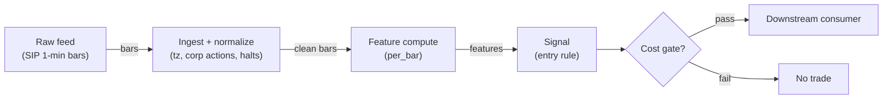

# S027 — End-of-day momentum / last-hour drift

The day's early return predicts the last `30`–`60` minutes [documented]: ride the drift into the close on information days, fade it on mechanical-flow days. Provenance **[D]**.

> Tag law: every numeric literal in prose carries one of `[documented]
> [default] [example] [unverified] [internal-est] [measured]` (legend: Appendix
> i v1.0.0). Bibliographic years, volumes, pages, arXiv IDs, section numbers,
> rule codes (C1–C10), fail-safe codes (F1–F5), module IDs, batch keys, family
> letters, and machine-parsed §0 data fields are identifiers, not literals,
> and are exempt.

## §1 Five-minute reviewer card

| Row | Value |
|---|---|
| Module | S027 — End-of-day momentum / last-hour drift, v1.1.0 |
| Edge verdict | `PREDICTIVE-FEATURE-ONLY` — documented predictive regression (Gao et al. 2018 [documented]), but Heston et al. show the spread consumes it at tradable horizons |
| After-cost | `BEFORE-COST` — Works on information-trend days (news, macro releases): morning winners keep drifting as slow money rebalances into the close; dies on mechanical-flow days (index rebalances, expiry, big MOC imbalances) where the pressure reverses overnight |
| Build cost | Tier L · `4–12` h [internal-est] · `$600–1,800` loaded [internal-est] |
| Data cost | Research `~$29`/mo (Massive Stocks Starter, 15-min-delayed 1-min SIP bars) [documented]; production `~$99–199`/mo (Developer/Advanced, real-time) [documented] — verify on massive.com before budgeting |
| latency_class | bar-level / minutes |
| risk_class | low (signal-only; no order placement) |
| Capacity | `$10–50`/day notional [example] — illustrative; calibrate per venue |
| Executability | Feasible: Python+polars prototype; trivial compute |
| Risk summary | Sign-ambiguity risk: continuation and auction-reversal share the same window; overnight gap risk if not flattened; crowded close signals |
| When it dies | Mechanical-flow days (rebalance/expiry); spread wider than the drift; macro whiplash; regime decay as auction share grows (`3.1`%→`7.5`%→`~10`% [documented]) |
| Regime gates | Provisional: pending R001–R050 annotation |
| Emits | `signal_vector` (Appendix b v1.0.0) — never orders |

## §1.5 Cheapest / least-build path

1. **Prototype hour band:** `4–12` h [internal-est] — bar features + timestamp/halt handling + reference validation against the fixture.
2. **Cheapest-source row:** min_tier = Massive (ex-Polygon.io) Stocks Starter — `$29`/mo [documented] gets 15-min-delayed 1-min SIP bars, sufficient for the research build and the 15:30-anchor prototype (the anchor is computed once daily, delay-tolerant at prototype scale); latency_class = bar-level / minutes; required_fields = 1-min OHLCV bars, corporate-action adjustments, session calendar; price_band = `$29`/mo research → `$99–199`/mo production (Developer real-time / Advanced) [documented]; build_or_buy = **build the estimator, buy the feed**. Verify current tiers on massive.com before budgeting — the rebrand changed names, not the 1-min-bar entitlements.
3. **Resource budget:** `1` core, `<2` GB RAM for `500` symbols [internal-est]; compute pattern `per_bar`.
4. **Skip list:** tick-level variants; multi-venue aggregation; Rust ingest; colocated deployment.
5. **DO-NOT-CUT list:** causality assertions (`assert fill_event > signal_event`, no-signal-bar-fills test); COST block + callable `expected_cost_bps`; F1–F5 fail-safes + module-state enum + kill/safe-mode (`OFF`); decision-log audit records; bona-fide-intent + self-trade prevention; provenance tags on every numeric literal; fixtures + `test_cmd`; secrets via env only.
6. **Escalation gate:** upgrade from cheapest when any holds — live universe beyond the cheapest band; jitter persistently over budget; cost gate failing on `[measured]` costs; entitlement class changes.

## §S0 Module contract

### S0.1 Typed signature

```python
def signal(state: ModuleState, events: list[Event], cfg: Config) -> SignalVector:
```

`SignalVector` per Appendix b v1.0.0. `state` is the module-owned named state
vector (`day_anchors`, `mechanism_flag`, `cooldown_until`, `module_state`); `events` are canonical Events (Appendix a v1.0.0),
newest last. The function handles documented edge cases: empty events →
`UNKNOWN`; invalid/missing prices → `UNKNOWN` (F1, never interpolate);
halt/auction events → freeze per the market-state table.

### S0.2 Config dataclass

| Parameter | Type | Default | Range | Status |
|---|---|---|---|---|
| `entry_anchor` | str | `"15:30"` | — | example |
| `min_adv_shares` | float | `1e6` | `1e5`–`1e8` | example |
| `cost_gate_k` | float | `0.5` | `0.1`–`2.0` | default |
| `cooldown_s` | float | `0.0` | `0`–`3,600` | default |

All defaults tagged per the tag law (status `default` ⇒ `[default]`).

### S0.3 Canonical schema mapping

Vendor columns → canonical Event schema (Appendix a v1.0.0), stated once here:

| Vendor | Canonical |
|---|---|
| `t` (ms, 15:30 bar) | `event_ts` (int64 ns UTC; ms→ns) |
| `c` at 09:30 / 15:30 / close | `p930` / `p1530` / `pclose` (session anchors); every anchor carries its bar open time `anchor_ts` for the causality assertion in §S3 |
| `v` | `volume` (conditioning variable) |
| `vwap` 09:30→15:30, 20-day median volume | `vol_ratio_0930_1530`, `vol_med_20d` (optional classifier inputs; missing → classifier falls back to calendar rule) |
| imbalance feed (NYSE/Nasdaq NOII) | `imbalance_usd` (optional; missing → classifier falls back to calendar rule) |
| corporate-action calendar | `split_adj_factor` applied to anchors before returns; missing → `UNKNOWN` (F1) |
| exchange/holiday calendar | `scheduled_catalyst_day`, `rebalance_day`, `expiry_day` booleans (missing → treated as `True`, conservative: assume mechanical) |

### S0.4 Time contract

> Time contract: clock domain UTC, int64 ns; authoritative causality clock =
> `event_ts`; max_skew = `1` s [default]; jitter budget = `500` ms
> [default]; bar-label = open time; staleness TTL = `300` s [default]; gap
> policy = mask, no interpolation; halt/auction → discard contributions across
> reopen.

**Timing box:** `signal@t (per_day, America/New_York) → earliest fill @open(t+1)`

### S0.5 Market-state table

| State | Module behavior |
|---|---|
| CONTINUOUS_TRADING | Compute normally; emit per cadence |
| HALTED | Freeze state; emit `UNKNOWN`; discard contributions across reopen |
| AUCTION | No new signals; hold last `SignalVector`; state `DEGRADED` |
| CLOSED | Emit nothing; state `OFF` |

### S0.6 Module-state enum + error taxonomy

States per Appendix k v1.0.0: `OK | DEGRADED | UNKNOWN | OFF`. Invalid input →
`UNKNOWN`, never interpolate (Appendix f v1.0.0, F1–F5). Kill/safe-mode: an
administrative kill or a bounds violation forces `OFF` until the runbook
re-arm checklist passes.

| Failure | State | Alert |
|---|---|---|
| Missing/stale input (TTL) | `UNKNOWN` | page |
| Bad bar (high<low, non-positive prices, crossed quotes) | `UNKNOWN` | log |
| Feature out of mathematical bounds (F2) | `UNKNOWN` | page |
| `seq` gap beyond tolerance | `DEGRADED` (restart windows) | log |
| Halt/auction | `UNKNOWN` / `DEGRADED` (per table) | log |
| Kill/administrative disable | `OFF` | page |
| Anything unmapped | `UNKNOWN` | page |

### S0.7 Ops tail

- **Schedule:** continuous during US equities regular session `09:30`–`16:00` America/New_York [documented]; owner: signals on-call.
- **Health checks:** fixture replay (`test_cmd`) green on deploy; `seq`-gap monitor; staleness watchdog at `300` [default].
- **Alert table:** page on `UNKNOWN` > `5` min [default] or bounds violation; notify on `DEGRADED`; log single dropped events.
- **Resource budget:** `1` vCPU, `2` GB RAM per `500` symbols [internal-est]; state is O(window) per symbol.
- **Runbook stub:** `1.` confirm feed; `2.` replay fixture; `3.` if red → set `OFF`, page; `4.` reconcile decision log before re-arm.

### S0.8 Secrets (env-only)

`POLYGON_API_KEY` via environment only. No secrets in this file, fixtures, or logs
(CI secrets-grep).

### S0.9 May / must-NOT

> **May:** emit `SignalVector` records per Appendix b v1.0.0. **Must-NOT:**
> emit orders, order intents, prices, share counts, or notionals; call a
> broker; mutate shared state outside `state`; interpolate across gaps.

## §S1 Legacy (subsumed by §1)

Legacy §S1 content is the §1 reviewer card above; this header is retained so
section numbering stays frozen.

## §S2 Specification

### Universe

US common stocks and liquid ETFs, regular session, price > `$5` [example], ADV > `1`M shares [example]; anchor bars must exist (a missing 15:30 bar from a halt invalidates the day).

### Entry rule (Boolean — no prose-only conditions)

```
ENTER_LONG  := (r_first > 0) AND (mechanism == INFORMATION) AND (adv >= min_adv_shares)
               AND (expected_cost_bps(...) <= cost_gate_k * edge_bps)
ENTER_SHORT := (r_first < 0) AND (mechanism == INFORMATION) AND (adv >= min_adv_shares)
               AND (locate_ok) AND (expected_cost_bps(...) <= cost_gate_k * edge_bps)
FLAT        := otherwise  # mechanical-flow days -> FLAT (T069's fade is the other sign)
```

`edge_bps` = `0.1 * |r_first| * 10,000` bps [example] — one-tenth of the formation move persisting into the close.

### Exits (with post-exit cooldown)

```
EXIT := (now >= close_auction_start) OR (module_state != OK)   # always flat by the print
       # no exceptions in the base spec: overnight gap risk is not taken
ON_EXIT: cooldown_until = now + cooldown_s   # C10
```

### Position sizing (fenced function)

```python
def size_shares(risk_budget_R, stop_distance, vol_estimate, ADV_cap, cost):
    # S-module requests capital fraction only; share math lives in the strategy.
    risk_notional = risk_budget_R * 0.5 * confidence          # 0.5 [default] factor
    shares = risk_notional / max(stop_distance, 1e-9)        # 1e-9 [default] guard
    return int(min(shares, ADV_cap * adv_shares * 0.001))     # 0.1% ADV cap [default]
```

### Risk limits

| Limit | Value |
|---|---|
| Max capital fraction per signal | `0.5` [default] |
| Max adverse excursion before `UNKNOWN` review | `2.0`× stop [default] |
| Staleness kill | TTL `300` [default] → `UNKNOWN` |

### COST block (single source of truth)

| Component | Value (bps) | Basis |
|---|---|---|
| Spread (half-spread ~0.5 bp/leg, SPY-class) | `0.50` | [example] |
| Fees (~$0.001/share per side) | `0.20` | [example] |
| Borrow (`borrow_bps_per_day`) | `0.0` | [default] — reason: reference build long-biased, flat by close; no overnight carry |
| Impact (entry leans into auction buildup) | `2.0` | [example] — flagged; calibrate per venue |
| **Total reference** | `2.70` | [example] |

`fee_schedule_as_of`: `2026-09-01` [unverified] — placeholder; pin the real
venue schedule before production. `side: taker` [default]; venue/tier/source:
XNAS / Polygon SIP 1-min bars [example]. Re-stating cost numbers outside this block is a validation failure.

```python
def expected_cost_bps(notional, adv_pct, venue, side, urgency) -> float:
    # Callable cost model - reference stack, components from the COST block.
    spread_bps = 0.50   # [example] ~1 bp round trip
    fee_bps = 0.20      # [example]
    borrow_bps = 0.0    # [default] flat by close; reason in table
    impact_bps = 2.0    # [example] flagged; calibrate per venue at scale-up
    return spread_bps + fee_bps + borrow_bps + impact_bps
```

### Execution / fill model table

| Aspect | Assumption |
|---|---|
| Latency | Signal known at 15:30; fill at first print after [documented] |
| Partial fills | N/A (signal-only; T-module policy: Appendix c v1.0.0) |
| Impact | `2.0` bps on the 15:30 leg [example]; auction-buildup concession |
| Adverse fill | Crowded-close haircut `0.5` bps [example] |

### Robustness

Formation window `30`–`210` min [example]: shorter is noisier, longer arrives too late. Sign rule is robust; magnitude/z-scored variants overfit outliers. The mechanism classifier (information vs mechanical) is the dominant robustness lever — misclassification flips the sign. Re-estimate the sign mix yearly as auction share grows.

### Compliance sub-block (C1–C10+)

| Code | Rule: trigger → check → action → log |
|---|---|
| C1 | Self-match prevention: this S-module emits no orders; downstream consumers must set self-trade-prevention flags — asserted in the `consumes` contract → check: consumer ticket schema (Appendix c v1.0.0) has STP flag → action: block non-compliant consumers → log: `stp_assert` record |
| C2 | Bona-fide intent: every emitted `SignalVector` with direction ≠ `0` must pass the cost gate; sub-threshold features emit direction `0`, never a tradeable hint → check: `expected_cost_bps(...) <= k * edge_bps` → action: zero the direction on failure → log: `gate_veto` record |
| C3 | Message-rate: emissions capped per symbol per second [default] → check: rate monitor → action: throttle + alert → log: `throttle` record |
| C4 | Fat-finger trio (applied by consumers; this module bounds its own outputs): confidence ∈ [`0`,`1`], capital ∈ [`0`,`0.5`], computed_at sane → check: bounds on every emission → action: out-of-bounds → `UNKNOWN` (F2) → log: `bounds_veto` record |
| C5 | Decision log: every emission, veto, and state transition logged per Appendix g v1.0.0, hash-chained → check: log write ack → action: halt on write failure → log: the record itself |
| C6 | Halt/auction: per §S0.5 market-state table; contributions across reopen discarded → check: state feed → action: freeze/`DEGRADED` → log: `state_freeze` record |
| C7 | Locate check: SHORT direction requires `locate_ok` from the consumer; no SHORT without asserted locate (Reg-SHO threshold securities → direction `0`) → check: locate flag → action: zero SHORT on missing locate → log: `locate_veto` record |
| C8 | Public dissemination: no signal values published externally without review gate → check: export channel → action: block unreviewed export → log: `export_block` record |
| C9 | Data entitlements: per §S6 Data rights row → check: entitlement class on startup → action: entitlement change → §1.5 escalation gate → log: `entitlement` record |
| C10 | Post-exit cooldown: `cooldown_s` after any exit or compliance block; no re-entry → check: `now >= cooldown_until` → action: suppress entries → log: `cooldown` record |
| C11 | Auction-rule hygiene: the signal never trades the auction print itself; MOC/LOC handling belongs to the consumer (T016/T070) → check: `computed_at` < auction freeze → action: suppress late signals → log: `auction_suppress` record |

### Parameter table

| Parameter | Symbol | Value | Tag | Sensitivity |
|---|---|---|---|---|
| Formation window | `r_first` span | `9:30→15:30` | [example] | high — noise vs lateness |
| Hold window | `r_last` span | `15:30→close` | [example] | medium |
| Entry anchor | `entry_anchor` | `15:30` ET | [example] | medium |
| Universe ADV filter | `min_adv_shares` | `1`M shares | [example] | medium |
| Cost-gate k | `cost_gate_k` | `0.5` | [default] | high |

### Parameter calibration recipe

Walk-forward protocol (shared by all rows): `5` folds [example], `252`-day
train / `63`-day test [example], `2`-day embargo between train and test
[example], refit yearly [default]. Selection criterion: argmax OOS net edge
after the §S2 cost gate; DSR/PBO computed when ≥`100` [example] OOS signals per fold,
otherwise mark "not computed" — never report tuned metrics as evidence. Freeze rule: a parameter stays at its §S0.2 default unless the OOS
argmax beats the default by ≥`20`% [default] relative on net edge in ≥`3` [default] of `5` [example] folds
[default]; yearly re-estimate of the sign mix is mandatory regardless.

| Parameter | Calibration grid | OOS selection recipe | Freeze / re-estimate |
|---|---|---|---|
| `entry_anchor` | {`14:30`, `15:00`, `15:30`} ET [example] | max OOS net edge; require ≥`50` [example] qualifying days per fold | freeze at `15:30` unless an earlier anchor wins on ≥`3` [default] folds |
| `min_adv_shares` | {`5e5`, `1e6`, `2e6`} shares [example] | smallest grid value with OOS median spread ≤ `0.5`× edge on ≥`90`% [example] of names | freeze `1e6` [default]; re-screen yearly with ADV re-estimate |
| `cost_gate_k` | {`0.25`, `0.5`, `1.0`, `2.0`} [example] | largest k with OOS after-cost edge > `0` on `[measured]` costs | freeze `0.5` [default]; re-pin when fee schedule changes (`fee_schedule_as_of` bump) |
| `cooldown_s` | {`0`, `900`, `1800`} s [example] | fixed at `0` [default] unless post-exit re-entry evidence appears (≥`5` [example] blocked-then-profitable days OOS) | freeze `0` [default] |

### Timing box

`signal@t (per_day, America/New_York) → earliest fill @open(t+1)`

## §S3 Math + normative pseudocode

Formation and hold returns on day $t$ ($P_{9:30,t}$, $P_{15:30,t}$, $P_{\mathrm{close},t}$ — report form, open→15:30 variant [example]):

$$r_{\mathrm{first},t} = \frac{P_{15:30,t}}{P_{9:30,t}} - 1, \qquad r_{\mathrm{last},t} = \frac{P_{\mathrm{close},t}}{P_{15:30,t}} - 1$$

Documented predictive regression (Gao et al. 2018 [documented], first-half-hour → last-half-hour window — window attribution: those statistics do **not** describe the open→15:30 variant):

$$r_{\mathrm{last},t} = \alpha + \beta\, r_{\mathrm{first},t} + \varepsilon_t, \qquad \hat\beta = 0.0694\ [\mathrm{documented}],\ R^2 = 1.6\%\ [\mathrm{documented}]$$

Tradable sign rule: $s_t = \mathrm{sign}(r_{\mathrm{first},t})$, hold $s_t$ from 15:30 to the close, flat by the print. Cross-sectional periodicity (Heston–Korajczyk–Sadka 2010 [documented]): returns continue at half-hour lags that are multiples of one trading day — strongest in the first and last half-hour.

**Normative pseudocode** (pseudocode is normative; prose is commentary):

```
function classify_mechanism(e, rf) -> {INFORMATION, MECHANICAL}:   # [example] heuristic, normative until replaced
    # Rule order is normative; thresholds are [example] and calibrate per the §S2 recipe.
    if e.scheduled_catalyst_day or e.rebalance_day or e.expiry_day:
        return MECHANICAL                                   # calendar flags win; conservative default True
    if e.imbalance_usd is not None and sign(e.imbalance_usd) != sign(rf):
        return MECHANICAL                                   # auction pressure leans against the morning move
    if e.vol_ratio_0930_1530 is not None and e.vol_ratio_0930_1530 > 2.0:
        return MECHANICAL                                   # 2.0 [example] abnormal-flow threshold
    return INFORMATION                                      # default path; fixture tape exercises this

function conviction(rf) -> float:                           # [example], normative
    return min(1.0, abs(rf) / 0.02)                         # 2% formation move = full conviction

function signal(state, events, cfg) -> SignalVector:
    assert events non-empty else return UNKNOWN                    # F1
    e = events[-1]
    assert valid(e) else return UNKNOWN                            # F1/F2: never interpolate
    assert e.anchor_ts_930 <= e.entry_ts and e.anchor_ts_1530 <= e.entry_ts  # no lookahead: anchors predate entry
    assert e.computed_at > e.p930_bar_ts and e.computed_at > e.p1530_bar_ts   # t→t+1 causality: signal after its inputs
    rf = e.p1530 / e.p930 - 1.0                                   # formation return, known at 15:30
    # NOTE: e.pclose is EX POST (the hold return target). It must never influence
    # direction/confidence/capital; test 6 pins this (perturbed pclose -> identical output).
    mech = classify_mechanism(e, rf)                              # INFORMATION vs MECHANICAL
    edge_bps = abs(rf) * 1e4 * 0.1                                # [example] one-tenth of the formation move persists
    cost_ok = expected_cost_bps(notional=1.0, adv_pct=0.001, venue="XNAS", side="taker", urgency="normal") <= cfg.cost_gate_k * edge_bps
    # ^^^ normative cost-gate predicate: expected_cost_bps(...) <= k * edge_bps
    direction = entry_rule(e, rf, mech, cost_ok, cfg)              # §S2 Boolean rule; MECHANICAL -> 0
    confidence = conviction(rf) if direction != 0 else 0.0
    capital = 0.5 * confidence                                     # 0.5 [default]
    sig = SignalVector(symbol=e.symbol, direction=direction, confidence=confidence, capital=capital,
                       computed_at=e.event_ts, staleness=now()-e.asof_ts,
                       module_state=state.module_state)
    log_decision(sig, inputs_hash, params_hash)                    # C5 / Appendix g
    assert fill_event > signal_event                               # t→t+1: no signal-bar fills
    return sig
```

`entry_rule` is the §S2 Boolean rule: `ENTER_LONG := (rf > 0) AND (mech ==
INFORMATION) AND (adv >= min_adv_shares) AND cost_ok`; `ENTER_SHORT := (rf <
0) AND (mech == INFORMATION) AND (adv >= min_adv_shares) AND locate_ok AND
cost_ok`; otherwise `FLAT`. A missing 15:30 anchor (halt) invalidates the day
(`valid(e)` is false → `UNKNOWN`).

Causality: features at event/bar `t` use only data `≤ t`; earliest reaction is
`t+1`. The close price `pclose` is the *target*, never a *feature*.
Mandatory unit tests: no-signal-bar fills; close-never-used-as-input.

## §S4 Worked example (fixture-backed)

- Tape: `modules/fixtures/S027_tape.csv` — `# TYPE: validation-run`;
  `6` synthetic session-anchor rows (`id,event_ts,p930,p1530,pclose`; the chapter's S4 six-day tape). All numbers synthetic, seed `27` [example]; timestamps int64 ns UTC.
- Expected outputs: `modules/fixtures/S027_expected.csv` — `r_first`, `r_last`, `s` per day; day-2 hand-check: `r_first=-0.79`% [documented-as-observation], `r_last=-0.50`% [documented-as-observation].
- Tolerance: `1e-9` on floats; integer counts exact.
- Acceptance tests (`modules/tests/test_S027.py`, `7` tests):
  `1.` fixture recomputes to expected (`r_first`/`r_last`/`s`; day-1/day-2 chapter hand-checks); `2.` stub emits valid `SignalVector`; `3.` no-signal-bar fills (`fill_event_ts > computed_at`); `4.` cost-gate predicate passes on large edge, blocks on tiny edge (`k = 0.5` [default]); `5.` invalid input (non-positive anchor, high<low bar, empty events) → `UNKNOWN`; `6.` lookahead pin: perturbing `pclose` (ex post target) leaves the emitted signal bit-identical; `7.` mechanical-flow day (`rebalance_day` / imbalance-against-move) → `FLAT` (direction `0`, state `OK`).
- `test_cmd`: `python3 -m pytest modules/tests/test_S027.py -q` → exits `0`.

**Hand-check:** day-1: `r_first = 101.40/100.00 − 1 = +1.40`% [example], `r_last = 101.90/101.40 − 1 = +0.49`% [example], `s=+1`; day-2: `r_first = 100.60/101.40 − 1 = −0.79`% [example], `r_last = 100.10/100.60 − 1 = −0.50`% [example], `s=−1` — all recomputed by hand from the tape and asserted in the test.

**Where the example is optimistic:** no fees, no latency, no partial fills, no corporate-action surprises — arithmetic illustration, not a backtest.

## §S5 Strategies that use this signal

Generated from `deps.yaml` (CI symmetry); hand-listed here:

| Strategy | Role |
|---|---|
| T016 — End-of-Day Drift Rider | Primary entry trigger: lean into last-hour drift (S033/S013 confirm) |
| T006 — Intraday Trend + Vol-Regime Allocator | Trend leg: into-the-close momentum, HMM-vol scaled |
| T069 — Late-Day Reversal into Close | Contrast/veto: fades last-30-min overextensions — the other sign |

## §S6 Data required

| Field | Type | Granularity | Source tier | Vendor / product | Schema / rights | Notes |
|---|---|---|---|---|---|---|
| O/H/L/C anchors | float | 1-min bars, RTH | Tier 0–1 | Massive (ex-Polygon) Stocks Starter+ | Aggs v3; licensed, no display | Only 9:30, 15:30, close strictly needed |
| Volume | int | 1-min bars | Tier 1 | Massive Stocks Starter+ | Aggs v3; licensed | Gao: effect stronger on high-volume days |
| Close-imbalance feed | imbalance $/shares | event, 15:30–16:00 | Tier 1–2 | NYSE imbalance / Nasdaq NOII | Exchange contracts; indicative | Optional classifier input; missing → calendar rule |
| Exchange calendar | date/bool | daily | Tier 0–1 | Massive reference data | — | Early closes move the window; missing → conservative mechanical |
| Corporate actions | ratio/date | event | Tier 1 | Massive Stocks Starter+ | Aggs `adjustment=split`; licensed | Adjusted closes or the return is fiction |

**Data rights row** (Appendix j v1.0.0): SIP 1-min bars via Polygon Stocks Advanced, `rights: licensed`; scope = research + stated production symbol count (`≤500` [default]); raw ticks never leave our systems — fixtures are synthetic; entitlement = professional/internal, no display; retention per vendor terms, purge path in runbook; derived features ours.

## §S7 Local build (M5 Max / 128 GB)

Feasible: trivial. Three anchor prices per symbol per day, one division, one sign. The full `500`-symbol 1-minute universe (195k bars/day) is a sub-second polars pass per `notes/cost-model.md` §2; anchors for `500` symbols × `60` days ≈ a few KB vs the ~`77` GB working budget (`notes/cost-model.md` §3 [internal-est]). The only engineering content is the optional imbalance-feed leg (Tier M, `20–60` h [internal-est]) — the return-based signal itself is Tier L (`4–12` h ≈ `$600–1,800` [internal-est] at `$150`/hr loaded).

## §S8 Buy vs build

| Tier-0 free (Stooq/Alpaca IEX) | Daily + coarse intraday bars | ~`$0` | `$0` prototype of the sign rule | No 15:30 anchor precision; no imbalance data |
| Tier-1 (Massive Stocks Starter / Alpaca SIP) | Full SIP 1-min bars, corporate actions | ~`$29–99`/mo (Massive Starter `$29` [documented]; Alpaca Algo Trader Plus SIP `$99` [documented]) | Correct anchors + consolidated volume | Starter is 15-min-delayed; real-time needs Massive Developer `$99`/Advanced `$199` [documented] |
| Tier-2 exchange imbalance feeds | Official closing-auction imbalance messages | exchange pricing (indicative) | Trade the actual auction pressure | Exchange contracts; only needed for the auction leg |

**Verdict:** build the return-based signal (it is `10` lines [internal-est]); **buy** the imbalance feed only if the auction leg is the actual trade.

## §S9 Efficacy — documented evidence

| Study / source | Market & period | Metric | Before/after cost | Caveat |
|---|---|---|---|---|
| Gao–Han–Li–Zhou (2018), *J. Financial Economics* | SPY + `10` active ETFs, 1993–2013 | First→last half-hour: β̂=`6.94` (×100) [documented], p<`1`% [documented], R²=`1.6`% [documented]; stronger on volatile/high-volume/recession/macro-news days | `BEFORE-COST` (predictive regression) | Market-level (ETF); R² tiny — edge is high-frequency repetition |
| Heston–Korajczyk–Sadka (2010), *J. Finance* | NYSE, half-hour intervals, 2001–2005 | Continuation at day-multiple half-hour lags, strongest first/last half hour; sub-hour reversals are liquidity/bounce | `BEFORE-COST` → authors' honest after-cost verdict: periodicity strategies "lose money after paying the bid/ask spread" | The continuation is a timing/cost phenomenon, not an arbitrage |
| Jegadeesh–Wu (2022), *J. Financial Economics* | NYSE+Nasdaq closing auctions | Auction volume ≈`10`% of total at 2019 peak [documented]; impact temporary, dissipates over `3`–`5` days [documented]; reversal strategies "significantly profitable" | `BEFORE-COST` | Auction-*reversal* — the opposite sign to the drift; mechanism matters |
| Bogousslavsky–Muravyev (2023) | US equities, auctions | Auctions = `7.5`% of daily volume in 2018 (vs `3.1`% in 2010) [documented]; close matches pre-close bid/ask `68`% [documented]; deviations revert overnight | Descriptive | Auction is cheap for liquidity demanders — being the pressure is costly |

**Selection disclosure:** the `4` sources surfaced by the chapter's research pass; the honest headline is Heston et al.'s: the documented continuation is largely consumed by the spread at tradable horizons. No published after-cost Sharpe for a standalone EOD-drift rule was found [documented-as-absence].

### Regime gates (machine records, provisional — pending R001–R050 annotation)

| regime_id | direction | mechanism | condition | action | min_lag | unknown_behavior |
|---|---|---|---|---|---|---|
| R001 | amplifies | elevated RV strengthens the drift on information days | rv > rv_median | none (size per §S2) | `1` day [default] | veto |
| R002 | inverts | mechanical-flow regime (rebalance/expiry) flips continuation to reversal | rebalance_day OR expiry_day | veto | `1` day [default] | veto |
| R003 | degrades | spread wider than expected drift | spread_bps > edge_bps | veto | `0` [default] | veto |

## §S10 Failure modes & pitfalls

| # | Trigger → Detect → Action → Recovery | check: |
|---|---|
| 1 | Sign ambiguity: continuation and auction-reversal share the window → detect: mechanism classifier disagreement → action: FLAT, defer to T069 → recovery: re-classify next day | `check: mechanism in {INFORMATION, MECHANICAL}` |
| 2 | Lookahead via the close: using the auction print in formation → detect: causality audit flags formation inputs > 15:30 → action: halt, fix anchors → recovery: re-run no-signal-bar-fills test | `check: all(anchor_ts <= entry_ts)` |
| 3 | Anchor staleness: illiquid names with no real 15:30 price → detect: ADV/spread screen → action: `UNKNOWN` for the day → recovery: symbol re-screened | `check: adv >= min_adv_shares` |
| 4 | Overnight gap risk: position held past the print → detect: exit-time monitor → action: forced flatten, alert → recovery: review why exit missed | `check: flat_by_close` |
| 5 | Crowded close: everyone leans the same way at 15:30 → detect: imbalance-feed divergence → action: halve size or stand down → recovery: resume when divergence clears | `check: imbalance_sign == signal_sign` |
| 6 | Cost blowup: spread+fees+impact vs a `30`-min drift → detect: cost gate failing on `[measured]` costs → action: stand down → recovery: re-pin fee schedule | `check: expected_cost_bps(...) <= k * edge_bps` |
| 7 | Regime decay: auction share grows, information leg competed away → detect: yearly sign-mix re-estimate → action: re-tune or retire → recovery: re-validate OOS | `check: oos_edge > 0` |
| 8 | Macro whiplash: 15:30 positioning ahead of overnight news reverses → detect: scheduled-catalyst calendar → action: skip catalyst days → recovery: resume next session | `check: no_overnight_catalyst` |

## §S11 Visuals

Figure: `batches figure (see §0 `plot_script`)` (synthetic, seed `27` [example]).



## §S12 Source log + unverified leads

**Sources** (citable facts only):

1. Lei Gao, Yufeng Han, Sophia Zhengzi Li, Guofu Zhou (2018). "Intraday Momentum: The First Half-Hour Return Predicts the Last Half-Hour Return." *Journal of Financial Economics.* https://papers.ssrn.com/sol3/papers.cfm?abstract_id=2552752 — first→last half-hour predictability, SPY 1993–2013 [documented].
2. Steven L. Heston, Robert A. Korajczyk, Ronnie Sadka (2010). "Intraday Patterns in the Cross-Section of Stock Returns." *Journal of Finance* 65(4):1369–1407 [documented].
3. Vincent Bogousslavsky, Dmitriy Muravyev (2023). "Who Trades at the Close? Implications for Price Discovery and Liquidity." SSRN. https://papers.ssrn.com/sol3/papers.cfm?abstract_id=3485840 [documented].
4. Narasimhan Jegadeesh, Yanbin Wu (2022). "Closing auctions: Nasdaq versus NYSE." *Journal of Financial Economics* 143:1120–1139 [documented].
5. Charlotte Haendler, Steven Heston, Robert Korajczyk, Ronnie Sadka (2025). "The intra-day stock return periodicity puzzle." SSRN [documented] — periodicity persists out-of-sample; close leg driven by MOC trading.

**Chatbot source log.** Duck.ai (GPT-5.6 Luna, anonymous) answered Q-SB2-1–Q-SB2-3 (`2026-09-10`); Grok/Cursor answers pending (checked `2026-09-10`).

**Data-pricing sources** (commercial facts, not evidence):
6. Massive/Polygon plan pricing (accessed `2026-09-11`): Stocks Starter `$29`/mo (15-min-delayed, includes intraday 1-min bars [documented]), Developer `$99`/mo (real-time), Advanced `$199`/mo — Polygon rebranded to Massive in late 2025 [documented]. https://medium.com/@kevinmenesesgonzalez/stock-price-api-best-free-vs-paid-options-2026-82370a377819 ; Starter intraday entitlement corroborated by https://forum.polygon.technology/t/does-the-aggs-ticker-with-stocks-basic-not-include-the-current-day/20666
7. Alpaca Market Data API: Algo Trader Plus `$99`/mo, all-US-exchange SIP coverage (free Basic = IEX only) [documented]. https://docs.alpaca.markets/us/docs/about-market-data-api

**Unverified leads** (chatbot-only — never in evidence tables):

- Duck.ai Q-SB2-3 auction micro-numbers: closing-auction volume `7.10`% of ADV (NYSE+Nasdaq 2012–2021), auction impact ≈`0.34`× daily average spread, drift to auction price ≈`0.6`–`1.7`× spread, overnight `1`%-of-ADV ≈`40`bp round-trip impact under a sqrt model [unverified] — directionally consistent with verified sources, exact figures not independently confirmed.
- "Timing Sharpe ≈`1.08` vs `0.29` buy-and-hold" for the Gao et al. strategy (independent replication write-up — not verified against the paper text) [unverified].
- Baltussen–Da–Lammers–Martens (2021) gamma-hedging mechanism for intraday momentum across `60`+ futures (mentioned in the same replication write-up; paper not independently pulled) [unverified].

---

## Appendix — AI build prompt (S027)

Copy-paste into any chat agent:

> Build module **S027 — End-of-day momentum / last-hour drift** per `notes/module-template.md` v1.0.0
> and this file's §S0 contract. Cheapest path (§1.5): prototype
> `4–12` h [internal-est]; cheapest data candidate
> Massive (ex-Polygon) Stocks Starter `$29`/mo [documented]; compute pattern `per_bar`.
> Implement `signal(state, events, cfg) -> SignalVector` (Appendix b v1.0.0)
> with the §S3 normative pseudocode, including the cost-gate predicate
> `expected_cost_bps(...) <= k * edge_bps` and `assert fill_event >
> signal_event`. Wire F1–F5 (Appendix f v1.0.0): invalid input → `UNKNOWN`,
> never interpolate. Log decisions per Appendix g v1.0.0. Secrets via env
> only. Run the fixture `modules/fixtures/S027_tape.csv`
> (`# TYPE: validation-run`) against `modules/fixtures/S027_expected.csv`
> (tolerance `1e-9`).
> **Definition of done:** `python3 -m pytest modules/tests/test_S027.py -q`
> exits `0` (`7` acceptance tests). Tag every numeric literal you add with the unified enum
> (Appendix i v1.0.0); put anything unverifiable in §S12 unverified leads.
