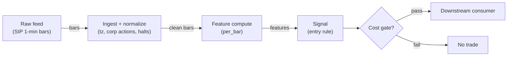

# S028 — Donchian breakout

Buy/sell when price *closes* beyond the highest high or lowest low of the prior `N` bars [documented] — a range-expansion timestamp; the strategy (not the channel) decides whether the expansion is trend or exhaustion. Provenance **[D]**.

> Tag law: every numeric literal in prose carries one of `[documented]
> [default] [example] [unverified] [internal-est] [measured]` (legend: Appendix
> i v1.0.0). Bibliographic years, volumes, pages, arXiv IDs, section numbers,
> rule codes (C1–C10), fail-safe codes (F1–F5), module IDs, batch keys, family
> letters, and machine-parsed §0 data fields are identifiers, not literals,
> and are exempt.

## §1 Five-minute reviewer card

| Row | Value |
|---|---|
| Module | S028 — Donchian breakout, v1.0.0 |
| Edge verdict | `PREDICTIVE-FEATURE-ONLY` — documented construction with academic examination (Faith 2007; Rayome & Jain 2008 [documented]); no documented after-cost Sharpe for a standalone intraday trigger |
| After-cost | `BEFORE-COST` — Works on persistent intraday trends: genuine range expansion with follow-through, rising volume, supportive higher-timeframe trend; dies in range-bound chop where repeated false breakouts bleed through spread, fees, and slippage |
| Build cost | Tier L · `4–12` h [internal-est] · `$600–1,800` loaded [internal-est] |
| Data cost | Research `~$30–200`/mo (SIP 1-min bars)` [unverified]; production `~$200`/mo + usage (SIP bars)` [unverified] — bands indicative, verify before budgeting |
| latency_class | bar-level / minutes |
| risk_class | low (signal-only; no order placement) |
| Capacity | `$5–25`/day notional [example] — illustrative; calibrate per venue |
| Executability | Feasible: Python+polars prototype; trivial compute |
| Risk summary | Whipsaw-dominated: convexity payoff (small frequent losses, occasional large wins) only works if costs and sizing are controlled; lookahead via forming-bar inclusion is the classic implementation bug |
| When it dies | Range-bound chop (principal documented failure mode); low-liquidity names where the channel is gamed by wide spreads; crowded breakout levels at round numbers; news spikes that reverse within the bar |
| Regime gates | Provisional: pending R001–R050 annotation |
| Emits | `signal_vector` (Appendix b v1.0.0) — never orders |

## §1.5 Cheapest / least-build path

1. **Prototype hour band:** `4–12` h [internal-est] — bar features + timestamp/halt handling + reference validation against the fixture.
2. **Cheapest-source row:** min_tier = Polygon.io Stocks Advanced — cheapest data source candidate [internal-est]; latency_class = bar-level / minutes; required_fields = 1-min OHLCV bars, corporate-action adjustments, session calendar; price_band = `~$30–200`/mo` [unverified] (indicative — verify before budgeting); build_or_buy = **build the estimator, buy the feed**.
3. **Resource budget:** `1` core, `<2` GB RAM for `500` symbols [internal-est]; compute pattern `per_bar`.
4. **Skip list:** tick-level variants; multi-venue aggregation; Rust ingest; colocated deployment.
5. **DO-NOT-CUT list:** causality assertions (`assert fill_event > signal_event`, no-signal-bar-fills test); COST block + callable `expected_cost_bps`; F1–F5 fail-safes + module-state enum + kill/safe-mode (`OFF`); decision-log audit records; bona-fide-intent + self-trade prevention; provenance tags on every numeric literal; fixtures + `test_cmd`; secrets via env only.
6. **Escalation gate:** upgrade from cheapest when any holds — live universe beyond the cheapest band; jitter persistently over budget; cost gate failing on `[measured]` costs; entitlement class changes.

## §S0 Module contract

### S0.1 Typed signature

```python
def signal(state: ModuleState, events: list[Event], cfg: Config) -> SignalVector:
```

`SignalVector` per Appendix b v1.0.0. `state` is the module-owned named state
vector (`bars`, `channel`, `cooldown_until`, `module_state`); `events` are canonical Events (Appendix a v1.0.0),
newest last. The function handles documented edge cases: empty events →
`UNKNOWN`; invalid/missing prices → `UNKNOWN` (F1, never interpolate);
halt/auction events → freeze per the market-state table.

### S0.2 Config dataclass

| Parameter | Type | Default | Range | Status |
|---|---|---|---|---|
| `lookback` | int | `20` | `10`–`55` | default |
| `entry_trigger` | str | `"close-through"` | — | example |
| `exit_mode` | str | `"midline-or-10bar"` | — | example |
| `cost_gate_k` | float | `0.5` | `0.1`–`2.0` | default |
| `cooldown_s` | float | `600.0` | `0`–`3,600` | default |

All defaults tagged per the tag law (status `default` ⇒ `[default]`).

### S0.3 Canonical schema mapping

Vendor columns → canonical Event schema (Appendix a v1.0.0), stated once here:

| Vendor | Canonical |
|---|---|
| `t` (ms) | `event_ts` (int64 ns UTC; ms→ns) |
| `o` / `h` / `l` / `c` | `open` / `high` / `low` / `close` |
| `v` | `volume` |
| `n` | `trade_count` |

### S0.4 Time contract

> Time contract: clock domain UTC, int64 ns; authoritative causality clock =
> `event_ts`; max_skew = `1` [default]; jitter budget = `500`
> [default]; bar-label = open time; staleness TTL = `180` [default]; gap
> policy = mask, no interpolation; halt/auction → discard contributions across
> reopen.

**Timing box:** `signal@t (per_bar, America/New_York) → earliest fill @open(t+1)`

### S0.5 Market-state table

| State | Module behavior |
|---|---|
| CONTINUOUS_TRADING | Compute normally; emit per cadence |
| HALTED | Freeze state; emit `UNKNOWN`; discard contributions across reopen |
| AUCTION | No new signals; hold last `SignalVector`; state `DEGRADED` |
| CLOSED | Emit nothing; state `OFF` |

### S0.6 Module-state enum + error taxonomy

States per Appendix k v1.0.0: `OK | DEGRADED | UNKNOWN | OFF`. Invalid input →
`UNKNOWN`, never interpolate (Appendix f v1.0.0, F1–F5). Kill/safe-mode: an
administrative kill or a bounds violation forces `OFF` until the runbook
re-arm checklist passes.

| Failure | State | Alert |
|---|---|---|
| Missing/stale input (TTL) | `UNKNOWN` | page |
| Bad bar (high<low, non-positive prices, crossed quotes) | `UNKNOWN` | log |
| Feature out of mathematical bounds (F2) | `UNKNOWN` | page |
| `seq` gap beyond tolerance | `DEGRADED` (restart windows) | log |
| Halt/auction | `UNKNOWN` / `DEGRADED` (per table) | log |
| Kill/administrative disable | `OFF` | page |
| Anything unmapped | `UNKNOWN` | page |

### S0.7 Ops tail

- **Schedule:** continuous during US equities regular session `09:30`–`16:00` America/New_York [documented]; owner: signals on-call.
- **Health checks:** fixture replay (`test_cmd`) green on deploy; `seq`-gap monitor; staleness watchdog at `180` [default].
- **Alert table:** page on `UNKNOWN` > `5` min [default] or bounds violation; notify on `DEGRADED`; log single dropped events.
- **Resource budget:** `1` vCPU, `2` GB RAM per `500` symbols [internal-est]; state is O(window) per symbol.
- **Runbook stub:** `1.` confirm feed; `2.` replay fixture; `3.` if red → set `OFF`, page; `4.` reconcile decision log before re-arm.

### S0.8 Secrets (env-only)

`POLYGON_API_KEY` via environment only. No secrets in this file, fixtures, or logs
(CI secrets-grep).

### S0.9 May / must-NOT

> **May:** emit `SignalVector` records per Appendix b v1.0.0. **Must-NOT:**
> emit orders, order intents, prices, share counts, or notionals; call a
> broker; mutate shared state outside `state`; interpolate across gaps.

## §S1 Legacy (subsumed by §1)

Legacy §S1 content is the §1 reviewer card above; this header is retained so
section numbering stays frozen.

## §S2 Specification

### Universe

US common stocks, regular session, top-`500` by trailing-`20`-day dollar volume [example]; spread `≤3` ticks [default]; corporate-action-adjusted series.

### Entry rule (Boolean — no prose-only conditions)

```
ENTER_LONG  := (close_t > donch_up_t) AND (spread_ticks <= 3) AND (now >= cooldown_until)
               AND (expected_cost_bps(...) <= cost_gate_k * edge_bps)
ENTER_SHORT := (close_t < donch_lo_t) AND (spread_ticks <= 3) AND (locate_ok)
               AND (now >= cooldown_until) AND (expected_cost_bps(...) <= cost_gate_k * edge_bps)
FLAT        := otherwise
```

`edge_bps` = rail distance `|close − midline| / close × 10,000` bps [example] — expected expansion beyond the rail.

### Exits (with post-exit cooldown)

```
EXIT := (close touches midline) OR (opposite-rail break) OR (bars_held >= 10) [example]
       OR (module_state != OK)
ON_EXIT: cooldown_until = now + cooldown_s   # C10
```

### Position sizing (fenced function)

```python
def size_shares(risk_budget_R, stop_distance, vol_estimate, ADV_cap, cost):
    # S-module requests capital fraction only; share math lives in the strategy.
    risk_notional = risk_budget_R * 0.5 * confidence          # 0.5 [default] factor
    shares = risk_notional / max(stop_distance, 1e-9)        # 1e-9 [default] guard
    return int(min(shares, ADV_cap * adv_shares * 0.001))     # 0.1% ADV cap [default]
```

### Risk limits

| Limit | Value |
|---|---|
| Max capital fraction per signal | `0.5` [default] |
| Max adverse excursion before `UNKNOWN` review | `2.0`× stop [default] |
| Staleness kill | TTL `180` [default] → `UNKNOWN` |

### COST block (single source of truth)

| Component | Value (bps) | Basis |
|---|---|---|
| Spread (half-spread, liquid large-cap) | `0.50` | [example] |
| Fees (taker incl. regulatory) | `0.30` | [example] |
| Borrow | `0.0` | [default] — reason: reference build long-biased; shorts add C7 locate cost |
| Impact | `1.0` | [example] — flagged; calibrate per venue at scale-up |
| **Total reference** | `1.80` | [example] |

`fee_schedule_as_of`: `2026-09-01` [unverified] — placeholder; pin the real
venue schedule before production. `side: taker` [default]; venue/tier/source:
XNAS / Polygon SIP 1-min bars [example]. Re-stating cost numbers outside this block is a validation failure.

```python
def expected_cost_bps(notional, adv_pct, venue, side, urgency) -> float:
    # Callable cost model - reference stack, components from the COST block.
    spread_bps = 0.50   # [example]
    fee_bps = 0.30      # [example]
    borrow_bps = 0.0    # [default] long-biased reference; reason in table
    impact_bps = 1.0    # [example] flagged; calibrate per venue at scale-up
    if side == "maker":
        fee_bps = -0.20  # rebate [example]
    return spread_bps + fee_bps + borrow_bps + impact_bps
```

### Execution / fill model table

| Aspect | Assumption |
|---|---|
| Latency | Signal→intent `≤1` bar [example]; SIP path latency-simulated-only |
| Partial fills | N/A (signal-only; T-module policy: Appendix c v1.0.0) |
| Impact | `1.0` bps reference [example]; stress ×`5` [example] |
| Adverse fill | Whipsaw haircut `0.2` bps per unit signal [example] |

### Robustness

`N` in `10`–`55` [example]: small `N` whipsaws, large `N` rarely fires. Close-through entry is later but cleaner than high/low-through (intrabar lookahead risk). Normalize channel position cross-sectionally as `(C − D^L)/(D^U − D^L)` or scale width by ATR. `N` must be fixed from first principles (session fraction) and validated out-of-sample with purged/embargoed splits — `N=20` vs `21` vs `55` always has an in-sample winner.

### Compliance sub-block (C1–C10+)

| Code | Rule: trigger → check → action → log |
|---|---|
| C1 | Self-match prevention: this S-module emits no orders; downstream consumers must set self-trade-prevention flags — asserted in the `consumes` contract → check: consumer ticket schema (Appendix c v1.0.0) has STP flag → action: block non-compliant consumers → log: `stp_assert` record |
| C2 | Bona-fide intent: every emitted `SignalVector` with direction ≠ `0` must pass the cost gate; sub-threshold features emit direction `0`, never a tradeable hint → check: `expected_cost_bps(...) <= k * edge_bps` → action: zero the direction on failure → log: `gate_veto` record |
| C3 | Message-rate: emissions capped per symbol per second [default] → check: rate monitor → action: throttle + alert → log: `throttle` record |
| C4 | Fat-finger trio (applied by consumers; this module bounds its own outputs): confidence ∈ [`0`,`1`], capital ∈ [`0`,`0.5`], computed_at sane → check: bounds on every emission → action: out-of-bounds → `UNKNOWN` (F2) → log: `bounds_veto` record |
| C5 | Decision log: every emission, veto, and state transition logged per Appendix g v1.0.0, hash-chained → check: log write ack → action: halt on write failure → log: the record itself |
| C6 | Halt/auction: per §S0.5 market-state table; contributions across reopen discarded → check: state feed → action: freeze/`DEGRADED` → log: `state_freeze` record |
| C7 | Locate check: SHORT direction requires `locate_ok` from the consumer; no SHORT without asserted locate (Reg-SHO threshold securities → direction `0`) → check: locate flag → action: zero SHORT on missing locate → log: `locate_veto` record |
| C8 | Public dissemination: no signal values published externally without review gate → check: export channel → action: block unreviewed export → log: `export_block` record |
| C9 | Data entitlements: per §S6 Data rights row → check: entitlement class on startup → action: entitlement change → §1.5 escalation gate → log: `entitlement` record |
| C10 | Post-exit cooldown: `cooldown_s` after any exit or compliance block; no re-entry → check: `now >= cooldown_until` → action: suppress entries → log: `cooldown` record |
| C11 | Stop-cascade awareness: breakout entries must not be placed as stop orders that could cascade with resting stops in a way that manipulates the print → check: order-type policy on consumers → action: prefer close-confirmed entries → log: `entry_policy` record |

### Parameter table

| Parameter | Symbol | Value | Tag | Sensitivity |
|---|---|---|---|---|
| Lookback | `N` | `20` bars | [default] | high — whipsaw vs rarity |
| Entry trigger | — | close-through | [example] | high — intrabar lookahead |
| Exit | — | midline / opposite break / `10`-bar stop | [example] | medium |
| Max spread | `max_spread_ticks` | `3` ticks | [default] | medium |
| Cost-gate k | `cost_gate_k` | `0.5` | [default] | high |

### Timing box

`signal@t (per_bar, America/New_York) → earliest fill @open(t+1)`

## §S3 Math + normative pseudocode

Let $H_t, L_t, C_t$ be the high, low, close of bar $t$, $N$ the lookback. The channel is computed on **completed bars only** — the triggering bar $t$ is excluded (StockCharts ChartSchool documents this convention [documented]):

$$D^U_t(N) = \max_{i \in [t-N,\, t-1]} H_i, \qquad D^L_t(N) = \min_{i \in [t-N,\, t-1]} L_i, \qquad M_t = \frac{D^U_t + D^L_t}{2}$$

Entry (example thresholds — not an institutional standard):

$$\mathrm{long}_t = \mathbf{1}\{C_t > D^U_t\}, \qquad \mathrm{short}_t = \mathbf{1}\{C_t < D^L_t\}$$

Causal timing: the signal is fully determined at the close of bar $t$ and tradable no earlier than the open of bar $t+1$ — without the one-bar shift a breakout is arithmetically impossible (the triggering bar would be compared against a channel including its own high).

**Normative pseudocode** (pseudocode is normative; prose is commentary):

```
function signal(state, events, cfg) -> SignalVector:
    assert events non-empty else return UNKNOWN                    # F1
    e = events[-1]
    assert valid(e) else return UNKNOWN                            # F1/F2: never interpolate
    win = events[t-N : t]                                        # completed-bar: bar t excluded
    up = max(high(win)); lo = min(low(win)); mid = (up + lo) / 2
    edge_bps = abs(e["close"] - (up + lo) / 2.0) / e["close"] * 1e4                                       # [example]
    cost_ok = expected_cost_bps(...) <= k * edge_bps
    # ^^^ normative cost-gate predicate: expected_cost_bps(...) <= k * edge_bps
    direction = entry_rule(e, features, cost_ok, cfg)              # §S2 Boolean rule
    confidence = min(1, conviction(features)) if direction != 0 else 0
    capital = 0.5 * confidence                                     # 0.5 [default]
    sig = SignalVector(symbol=e.symbol, direction, confidence, capital,
                       computed_at=e.event_ts, staleness=now()-e.asof_ts,
                       module_state=state.module_state)
    log_decision(sig, inputs_hash, params_hash)                    # C5 / Appendix g
    assert fill_event > signal_event                               # t→t+1: no signal-bar fills
    return sig
```

Causality: features at event/bar `t` use only data `≤ t`; earliest reaction is
`t+1`. Mandatory unit test: no-signal-bar fills.

## §S4 Worked example (fixture-backed)

- Tape: `modules/fixtures/S028_tape.csv` — `# TYPE: validation-run`;
  `8` synthetic 5-minute bars; bar `8` is the breakout bar (close `102.00` > rail `101.20`). All numbers synthetic, seed `28` [example]; timestamps int64 ns UTC.
- Expected outputs: `modules/fixtures/S028_expected.csv` — `donch_up`, `donch_lo`, `mid`, `brk` per bar (`N=5` fixture override of the `20`-bar default [example]); warmup rows carry empty features and `brk=0`.
- Tolerance: `1e-9` on floats; integer counts exact.
- Acceptance tests (`modules/tests/test_S028.py`, `5` tests):
  `1.` fixture recomputes to expected (bar-8 rail `101.20`/`100.00` hand-check); `2.` stub emits valid `SignalVector`; `3.` no-signal-bar fills (`fill_event_ts > computed_at`); `4.` cost-gate predicate passes on large edge, blocks on tiny edge (`k = 0.5` [default]); `5.` invalid input (high<low) → `UNKNOWN`.
- `test_cmd`: `python3 -m pytest modules/tests/test_S028.py -q` → exits `0`.

**Hand-check:** bar `8` (`N=5`, completed-bar window = bars `3`–`7`): `up = max(101.00, 101.10, 101.20, 101.00, 100.90) = 101.20` [example], `lo = min(100.00, 100.10, 100.20, 100.30, 100.00) = 100.00` [example], `mid = 100.60` [example]; close `102.00 > 101.20` → bullish close-breakout, asserted in the test.

**Where the example is optimistic:** no fees, no latency, no partial fills, no corporate-action surprises — arithmetic illustration, not a backtest.

## §S5 Strategies that use this signal

Generated from `deps.yaml` (CI symmetry); hand-listed here:

| Strategy | Role |
|---|---|
| T019 — Donchian/Keltner Breakout + Vol Sizing | Primary entry trigger (direction); sized by the vol-breakout regime (S076) |
| T003 — VPIN-Gated Breakout Trader | Conceptual-fit reference: breaks taken only when VPIN toxicity is low |

## §S6 Data required

| Field | Type | Granularity | Source tier | Notes |
|---|---|---|---|---|
| OHLCV bars | float/int | `1`–`15` min bars | Tier 1 | Consolidated or single-venue; venue choice documented |
| Corporate actions | events | as-occurring | Tier 1 | Splits/dividends must adjust the channel |
| Session calendar | reference | daily | Tier 0/1 | Half-days, halts, DST — spans skip non-trading gaps |

**Data rights row** (Appendix j v1.0.0): SIP 1-min bars via Polygon Stocks Advanced, `rights: licensed`; scope = research + stated production symbol count (`≤500` [default]); raw ticks never leave our systems — fixtures are synthetic; entitlement = professional/internal, no display; retention per vendor terms, purge path in runbook; derived features ours.

## §S7 Local build (M5 Max / 128 GB)

Feasible: trivial. Rolling max/min is O(`1`) amortized per bar; a `500`-symbol universe produces `500 × 390 = 195k` 1-min bars/day [internal-est]; recomputing the day's features takes milliseconds. RAM: `500` symbols × `60` days of 1-min bars ≈ `12` MB (`notes/cost-model.md` §3 [internal-est]) — three orders of magnitude under the ~`77` GB working budget. Tier L per `notes/cost-model.md` §5: `4–12` h ≈ `$600–1,800` [internal-est] at `$150`/hr loaded. The M5 Max is not the constraint; data rights, exchange timestamps, and point-in-time correctness are.

## §S8 Buy vs build

| Tier-0 (Stooq/Alpaca IEX) | Daily bars, delayed quotes | ~`$0` | Free prototyping | No real-time intraday; coarse timestamps |
| Tier-1 (Polygon Stocks Advanced / Alpaca SIP) | Real-time 1-min SIP bars, corporate actions | ~`$30–200`/mo | Clean normalized bars; multi-year history | SIP latency; no venue detail |
| Tier-2 (Databento Standard) | L1/L2, imbalance feeds | ~`$200`/mo + usage | Honest timestamps; venue granularity | Overkill for bar-level channels |

**Verdict:** build. The analytics are three lines; buy only the cheapest normalized bar feed that meets latency needs (hybrid: buy bars, build channels).

## §S9 Efficacy — documented evidence

| Study / source | Market & period | Metric | Before/after cost | Caveat |
|---|---|---|---|---|
| Faith (2007), *Way of the Turtle* — System 1 (`20`-day) / System 2 (`55`-day) Donchian entries, ATR unit sizing | Futures, 1983–88 cohort | Cohort track record described; rules fully documented | `BEFORE-COST` (gross practitioner account) | Daily futures trend-following, not intraday equities; 1980s regime; no portable Sharpe |
| Rayome & Jain (2008), "Do Turtles Have Fat Tails?", *J. of the Academy of Finance* | Soybeans; Donchian `20`/`55`-day systems | Academic examination of Turtle-style channels | `BEFORE-COST` | Single-commodity study; tests the construction, not an intraday strategy |
| Brock, Lakonishok & LeBaron (1992), *J. Finance* | DJIA 1897–1986 | Breakout rules (incl. channel breakouts) show forecast power | `BEFORE-COST` | The benchmark academic test of breakout-style rules |
| Sullivan, Timmermann & White (1999), *J. Finance* | `7,846` rules incl. channel breakouts | Best rule's profits do not survive data-snooping adjustment out-of-sample | `BEFORE-COST` | The caution behind the overfitting warnings |

**Selection disclosure:** the `4` breakout-rule sources from the chapter's research pass; the honest bottom line is the chapter's: as a standalone intraday trigger this is a weak, unproven edge — "reasonable hypothesis, not documented universal intraday alpha" [documented-as-assessment].

### Regime gates (machine records, provisional — pending R001–R050 annotation)

| regime_id | direction | mechanism | condition | action | min_lag | unknown_behavior |
|---|---|---|---|---|---|---|
| R001 | amplifies | trending regime: expansion has follow-through | adx_or_trend_filter_on | none | `1` day [default] | veto |
| R002 | degrades | range-bound chop manufactures false breaks | chop_flag | veto | `1` day [default] | veto |
| R003 | degrades | wide-spread / thin names: the "breakout" is the spread widening | spread_ticks > 3 | veto | `0` [default] | veto |

## §S10 Failure modes & pitfalls

| # | Trigger → Detect → Action → Recovery | check: |
|---|---|
| 1 | Lookahead via forming-bar inclusion → detect: causality audit flags `fill_event ≤ signal_event` → action: halt, fix bar finalization → recovery: re-run no-signal-bar-fills test | `check: all(fill_ts > computed_at)` |
| 2 | Whipsaw bleed: chop manufactures reversing breakouts → detect: `3`+ consecutive failed breaks [default] → action: stand down for the session → recovery: re-arm next session | `check: consec_failures < 3` |
| 3 | Cost blowup: several round-trips/day × spread+fees+impact → detect: cost gate failing on `[measured]` costs → action: require expected move > `2`–`3`× round-trip cost [default] → recovery: re-pin fee schedule | `check: expected_cost_bps(...) <= k * edge_bps` |
| 4 | Parameter mining: `N=20` vs `21` vs `55` always has an in-sample winner → detect: OOS decay → action: purged/embargoed re-validation → recovery: freeze `N` from first principles | `check: oos_sharpe > 0.5 * is_sharpe` [default] |
| 5 | Data errors: bad tick prints a false N-bar high; unadjusted split collapses the channel → detect: bad-tick/`seq` monitors → action: `UNKNOWN`, mask bars → recovery: backfill and replay | `check: no bad ticks in window` |
| 6 | Microstructure noise: on thin names the "breakout" is the spread → detect: spread/ADV screen → action: veto entries → recovery: re-screen universe | `check: spread_ticks <= 3` |
| 7 | Regime breaks: trending-tape breakouts fail at the range transition → detect: higher-timeframe trend-slope flip → action: veto → recovery: resume on trend re-confirmation | `check: htf_trend_aligned` |
| 8 | Stop-cascade chasing: entries placed as stops into resting-stop clusters → detect: order-type policy audit → action: close-confirmed entries only → recovery: policy review | `check: entry_policy == close_confirmed` |

## §S11 Visuals

Figure: `batches figure (see §0 `plot_script`)` (synthetic, seed `28` [example]).



## §S12 Source log + unverified leads

**Sources** (citable facts only):

1. StockCharts ChartSchool — "Price Channels" (Donchian channels): formula and the completed-bar convention ("the formula doesn't include the most recent period"). https://chartschool.stockcharts.com/table-of-contents/technical-indicators-and-overlays/technical-overlays/price-channels (accessed 2026-09-10) [documented].
2. Rayome, D. L. & Jain, A. (2008) — "Do Turtles Have Fat Tails? Donchian Channels and Turtle Trading: The Case of Soybeans," *Journal of the Academy of Finance* [documented].
3. Faith, Curtis M. (2007) — *Way of the Turtle*, McGraw-Hill [documented] — Turtle `20`-day/`55`-day Donchian systems and ATR-based sizing.
4. Brock, W., Lakonishok, J. & LeBaron, B. (1992) — "Simple technical trading rules and the stochastic properties of stock returns," *Journal of Finance* 47(5) [documented].
5. Sullivan, R., Timmermann, A. & White, H. (1999) — "Data-snooping, technical trading rule performance, and the bootstrap," *Journal of Finance* 54(5) [documented].
6. Fama, E. F. & Blume, M. E. (1966) — "Filter rules and stock-market trading," *Journal of Business* 39(1) [documented].

**Chatbot source log.** Duck.ai (GPT-5.6 Luna, anonymous) answered Q-SB5-1–Q-SB5-3 (`2026-09-10`); Grok/Cursor answers pending (checked `2026-09-10`).

**Unverified leads** (chatbot-only — never in evidence tables):

- Duck.ai Q-SB5-1–Q-SB5-3: the `30`-bar worked-example numbers (operator hand-checked, no arithmetic errors); engineering-hour columns for a session-pattern platform (prototype `185`–`385` h, research-grade `705`–`1,530` h — column totals verified) [unverified]; evidence framing for intraday Donchian ("reasonable hypothesis, not documented universal intraday alpha") [unverified].
- A chatbot-cited SSRN study of daily Donchian/ATR on BTC (URL not captured) [unverified]: reported positive but highly cost/parameter/regime-sensitive; not evidence of durable intraday US-equity edge.
- A chatbot-cited practitioner article (altrady.com, URL not captured) [unverified] identifying range-bound chop as the principal Donchian failure mode.

---

## Appendix — AI build prompt (S028)

Copy-paste into any chat agent:

> Build module **S028 — Donchian breakout** per `notes/module-template.md` v1.0.0
> and this file's §S0 contract. Cheapest path (§1.5): prototype
> `4–12` h [internal-est]; cheapest data candidate
> Polygon.io Stocks Advanced [internal-est]; compute pattern `per_bar`.
> Implement `signal(state, events, cfg) -> SignalVector` (Appendix b v1.0.0)
> with the §S3 normative pseudocode, including the cost-gate predicate
> `expected_cost_bps(...) <= k * edge_bps` and `assert fill_event >
> signal_event`. Wire F1–F5 (Appendix f v1.0.0): invalid input → `UNKNOWN`,
> never interpolate. Log decisions per Appendix g v1.0.0. Secrets via env
> only. Run the fixture `modules/fixtures/S028_tape.csv`
> (`# TYPE: validation-run`) against `modules/fixtures/S028_expected.csv`
> (tolerance `1e-9`).
> **Definition of done:** `python3 -m pytest modules/tests/test_S028.py -q`
> exits `0`. Tag every numeric literal you add with the unified enum
> (Appendix i v1.0.0); put anything unverifiable in §S12 unverified leads.
