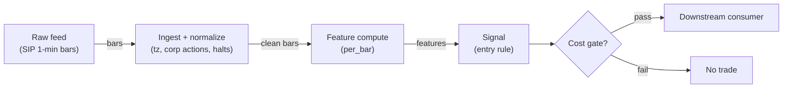

# S029 — Keltner / Bollinger breakouts

Volatility-scaled envelope breakouts: Keltner (EMA ± `m`·ATR [documented]) and Bollinger (SMA ± `k`·σ [documented]) close-breakouts — the same bar can break one envelope and not the other, because *the breakout is defined by your volatility lens*. Provenance **[D]**.

> Tag law: every numeric literal in prose carries one of `[documented]
> [default] [example] [unverified] [internal-est] [measured]` (legend: Appendix
> i v1.0.0). Bibliographic years, volumes, pages, arXiv IDs, section numbers,
> rule codes (C1–C10), fail-safe codes (F1–F5), module IDs, batch keys, family
> letters, and machine-parsed §0 data fields are identifiers, not literals,
> and are exempt.

## §1 Five-minute reviewer card

| Row | Value |
|---|---|
| Module | S029 — Keltner / Bollinger breakouts, v1.1.0 |
| Edge verdict | `PREDICTIVE-FEATURE-ONLY` — practitioner-standard constructions (Keltner 1960; Raschke 1980s rework [documented]); no documented after-cost Sharpe for a standalone intraday envelope-breakout rule |
| After-cost | `BEFORE-COST` — Works when a genuine volatility expansion has follow-through and rising volume; dies in low-volatility grinds where tags are faded, in volatility explosions where the lagging envelope reprices for several bars, and when every envelope trader sees the same tag at the same bar |
| Build cost | Tier L · `4–12` h [internal-est] · `$600–1,800` loaded [internal-est] |
| Data cost | Research `~$29–199`/mo [documented] (Polygon Stocks Starter, 15-min delayed → Stocks Advanced, real-time); production `~$199`/mo + usage (Stocks Advanced) [documented] — verify against the live schedule before budgeting |
| latency_class | bar-level / minutes |
| risk_class | low (signal-only; no order placement) |
| Capacity | `$5–25`/day notional [example] — illustrative; calibrate per venue |
| Executability | Feasible: Python+polars prototype; trivial compute |
| Risk summary | Variant-confusion risk: original (1960) vs modern Keltner differ materially (~`2.6`% median relative upper-band difference [documented]); mixed bar-inclusion conventions between Donchian and envelope windows are a lookahead trap |
| When it dies | Low-vol grinds (tags faded — the S041 mirror); vol explosions (lagging rails); correlated triggers at the same bar; close-only feeds (ATR needs high/low) |
| Regime gates | Provisional: pending R001–R050 annotation |
| Emits | `signal_vector` (Appendix b v1.0.0) — never orders |

## §1.5 Cheapest / least-build path

1. **Prototype hour band:** `4–12` h [internal-est] — bar features + timestamp/halt handling + reference validation against the fixture.
2. **Cheapest-source row:** min_tier = Polygon.io Stocks Advanced — cheapest data source candidate [internal-est]; latency_class = bar-level / minutes; required_fields = 1-min OHLCV bars (`t,o,h,l,c,v`; `n` optional), corporate-action adjustments, session calendar; price_band = `~$29`/mo (Stocks Starter, 15-min delayed, research-only) → `~$199`/mo (Stocks Advanced, real-time) [documented]; build_or_buy = **build the estimator, buy the feed**.
3. **Resource budget:** `1` core, `<2` GB RAM for `500` symbols [internal-est]; compute pattern `per_bar`.
4. **Skip list:** tick-level variants; multi-venue aggregation; Rust ingest; colocated deployment.
5. **DO-NOT-CUT list:** causality assertions (`assert fill_event > signal_event`, no-signal-bar-fills test); COST block + callable `expected_cost_bps`; F1–F5 fail-safes + module-state enum + kill/safe-mode (`OFF`); decision-log audit records; bona-fide-intent + self-trade prevention; provenance tags on every numeric literal; fixtures + `test_cmd`; secrets via env only.
6. **Escalation gate:** upgrade from cheapest when any holds — live universe beyond the cheapest band; jitter persistently over budget; cost gate failing on `[measured]` costs; entitlement class changes.

## §S0 Module contract

### S0.1 Typed signature

```python
def signal(state: ModuleState, events: list[Event], cfg: Config) -> SignalVector:
```

`SignalVector` per Appendix b v1.0.0. `state` is the module-owned named state
vector (`bars`, `ema`, `atr`, `cooldown_until`, `module_state`); `events` are canonical Events (Appendix a v1.0.0),
newest last. The function handles documented edge cases: empty events →
`UNKNOWN`; invalid/missing prices → `UNKNOWN` (F1, never interpolate);
halt/auction events → freeze per the market-state table.

### S0.2 Config dataclass

| Parameter | Type | Default | Range | Status |
|---|---|---|---|---|
| `lookback` | int | `20` | `10`–`30` | default |
| `atr_window` | int | `20` | `10`–`30` | default |
| `multiplier` | float | `2.0` | `1.5`–`2.5` | default |
| `cost_gate_k` | float | `0.5` | `0.1`–`2.0` | default |
| `cooldown_s` | float | `600.0` | `0`–`3,600` | default |

All defaults tagged per the tag law (status `default` ⇒ `[default]`).
Calibration grids + OOS selection: §S2 "Parameter calibration recipe" (normative
process); every calibrated value freezes with a `[measured]` or `[default]` tag
and a pinned fee schedule.

### S0.3 Canonical schema mapping

Vendor columns → canonical Event schema (Appendix a v1.0.0), stated once here:

| Vendor | Canonical |
|---|---|
| `t` (ms) | `event_ts` (int64 ns UTC; ms→ns) |
| `o` / `h` / `l` / `c` | `open` / `high` / `low` / `close` |
| `v` | `volume` |
| `n` | `trade_count` |

### S0.4 Time contract

> Time contract: clock domain UTC, int64 ns; authoritative causality clock =
> `event_ts`; max_skew = `1` [default]; jitter budget = `500`
> [default]; bar-label = open time; staleness TTL = `180` [default]; gap
> policy = mask, no interpolation; halt/auction → discard contributions across
> reopen.

**Timing box:** `signal@t (per_bar, America/New_York) → earliest fill @open(t+1)`

### S0.5 Market-state table

| State | Module behavior |
|---|---|
| CONTINUOUS_TRADING | Compute normally; emit per cadence |
| HALTED | Freeze state; emit `UNKNOWN`; discard contributions across reopen |
| AUCTION | No new signals; hold last `SignalVector`; state `DEGRADED` |
| CLOSED | Emit nothing; state `OFF` |

### S0.6 Module-state enum + error taxonomy

States per Appendix k v1.0.0: `OK | DEGRADED | UNKNOWN | OFF`. Invalid input →
`UNKNOWN`, never interpolate (Appendix f v1.0.0, F1–F5). Kill/safe-mode: an
administrative kill or a bounds violation forces `OFF` until the runbook
re-arm checklist passes.

| Failure | State | Alert |
|---|---|---|
| Missing/stale input (TTL) | `UNKNOWN` | page |
| Bad bar (high<low, non-positive prices, crossed quotes) | `UNKNOWN` | log |
| Feature out of mathematical bounds (F2) | `UNKNOWN` | page |
| `seq` gap beyond tolerance | `DEGRADED` (restart windows) | log |
| Halt/auction | `UNKNOWN` / `DEGRADED` (per table) | log |
| Kill/administrative disable | `OFF` | page |
| Anything unmapped | `UNKNOWN` | page |

### S0.7 Ops tail

- **Schedule:** continuous during US equities regular session `09:30`–`16:00` America/New_York [documented]; owner: signals on-call.
- **Health checks:** fixture replay (`test_cmd`) green on deploy; `seq`-gap monitor; staleness watchdog at `180` [default].
- **Alert table:** page on `UNKNOWN` > `5` min [default] or bounds violation; notify on `DEGRADED`; log single dropped events.
- **Resource budget:** `1` vCPU, `2` GB RAM per `500` symbols [internal-est]; state is O(window) per symbol.
- **Runbook stub:** `1.` confirm feed; `2.` replay fixture; `3.` if red → set `OFF`, page; `4.` reconcile decision log before re-arm.

### S0.8 Secrets (env-only)

`POLYGON_API_KEY` via environment only. No secrets in this file, fixtures, or logs
(CI secrets-grep).

### S0.9 May / must-NOT

> **May:** emit `SignalVector` records per Appendix b v1.0.0. **Must-NOT:**
> emit orders, order intents, prices, share counts, or notionals; call a
> broker; mutate shared state outside `state`; interpolate across gaps.

## §S1 Legacy (subsumed by §1)

Legacy §S1 content is the §1 reviewer card above; this header is retained so
section numbering stays frozen.

## §S2 Specification

### Universe

US common stocks, regular session, top-`500` by trailing-`20`-day dollar volume [example]; high/low required — close-only feeds are insufficient; corporate-action-adjusted series.

### Entry rule (Boolean — no prose-only conditions)

```
ENTER_LONG  := (close_t > kc_up_t) OR (close_t > bb_up_t)   # envelope close-breakout
               AND (spread_ticks <= 3) AND (now >= cooldown_until)
               AND (expected_cost_bps(...) <= cost_gate_k * edge_bps)
ENTER_SHORT := (close_t < kc_lo_t) OR (close_t < bb_lo_t)
               AND (spread_ticks <= 3) AND (locate_ok)
               AND (now >= cooldown_until) AND (expected_cost_bps(...) <= cost_gate_k * edge_bps)
FLAT        := otherwise
```

`edge_bps` = midline distance `|close − SMA| / close × 10,000` bps [example].

### Exits (with post-exit cooldown)

```
EXIT := (close reverts to midline) OR (bars_held >= 10) [example] OR (module_state != OK)
ON_EXIT: cooldown_until = now + cooldown_s   # C10
```

### Position sizing (fenced function)

```python
def size_shares(risk_budget_R, stop_distance, vol_estimate, ADV_cap, cost):
    # S-module requests capital fraction only; share math lives in the strategy.
    risk_notional = risk_budget_R * 0.5 * confidence          # 0.5 [default] factor
    shares = risk_notional / max(stop_distance, 1e-9)        # 1e-9 [default] guard
    return int(min(shares, ADV_cap * adv_shares * 0.001))     # 0.1% ADV cap [default]
```

### Risk limits

| Limit | Value |
|---|---|
| Max capital fraction per signal | `0.5` [default] |
| Max adverse excursion before `UNKNOWN` review | `2.0`× stop [default] |
| Staleness kill | TTL `180` [default] → `UNKNOWN` |

### COST block (single source of truth)

| Component | Value (bps) | Basis |
|---|---|---|
| Spread (half-spread, liquid large-cap) | `0.50` | [example] |
| Fees (taker incl. regulatory) | `0.30` | [example] |
| Borrow | `0.0` | [default] — reason: reference build long-biased; shorts add C7 locate cost |
| Impact | `1.0` | [example] — flagged; calibrate per venue at scale-up |
| **Total reference** | `1.80` | [example] |

`fee_schedule_as_of`: `2026-09-01` [unverified] — placeholder; pin the real
venue schedule before production. `side: taker` [default]; venue/tier/source:
XNAS / Polygon SIP 1-min bars [example]. Re-stating cost numbers outside this block is a validation failure.

```python
def expected_cost_bps(notional, adv_pct, venue, side, urgency) -> float:
    # Callable cost model - reference stack, components from the COST block.
    spread_bps = 0.50   # [example]
    fee_bps = 0.30      # [example]
    borrow_bps = 0.0    # [default] long-biased reference; reason in table
    impact_bps = 1.0    # [example] flagged; calibrate per venue at scale-up
    if side == "maker":
        fee_bps = -0.20  # rebate [example]
    return spread_bps + fee_bps + borrow_bps + impact_bps
```

### Execution / fill model table

| Aspect | Assumption |
|---|---|
| Latency | Signal→intent `≤1` bar [example]; SIP path latency-simulated-only |
| Partial fills | N/A (signal-only; T-module policy: Appendix c v1.0.0) |
| Impact | `1.0` bps reference [example]; stress ×`5` [example] |
| Adverse fill | Whipsaw haircut `0.2` bps per unit signal [example] |

### Robustness

Envelope lookback `10`–`30` [example]; multiplier `1.5`–`2.5` [example]. The dominant robustness choice is the *variant*: original Keltner (1960, SMA of typical price ± SMA of range) vs modern (EMA ± `m`·ATR) differ materially — standardize one. Simple vs Wilder ATR and close- vs high-through are second-order but must be pinned. Cross-sectional ranking via `(C − midline)/ATR` z-like score.

### Compliance sub-block (C1–C10+)

| Code | Rule: trigger → check → action → log |
|---|---|
| C1 | Self-match prevention: this S-module emits no orders; downstream consumers must set self-trade-prevention flags — asserted in the `consumes` contract → check: consumer ticket schema (Appendix c v1.0.0) has STP flag → action: block non-compliant consumers → log: `stp_assert` record |
| C2 | Bona-fide intent: every emitted `SignalVector` with direction ≠ `0` must pass the cost gate; sub-threshold features emit direction `0`, never a tradeable hint → check: `expected_cost_bps(...) <= k * edge_bps` → action: zero the direction on failure → log: `gate_veto` record |
| C3 | Message-rate: emissions capped per symbol per second [default] → check: rate monitor → action: throttle + alert → log: `throttle` record |
| C4 | Fat-finger trio (applied by consumers; this module bounds its own outputs): confidence ∈ [`0`,`1`], capital ∈ [`0`,`0.5`], computed_at sane → check: bounds on every emission → action: out-of-bounds → `UNKNOWN` (F2) → log: `bounds_veto` record |
| C5 | Decision log: every emission, veto, and state transition logged per Appendix g v1.0.0, hash-chained → check: log write ack → action: halt on write failure → log: the record itself |
| C6 | Halt/auction: per §S0.5 market-state table; contributions across reopen discarded → check: state feed → action: freeze/`DEGRADED` → log: `state_freeze` record |
| C7 | Locate check: SHORT direction requires `locate_ok` from the consumer; no SHORT without asserted locate (Reg-SHO threshold securities → direction `0`) → check: locate flag → action: zero SHORT on missing locate → log: `locate_veto` record |
| C8 | Public dissemination: no signal values published externally without review gate → check: export channel → action: block unreviewed export → log: `export_block` record |
| C9 | Data entitlements: per §S6 Data rights row → check: entitlement class on startup → action: entitlement change → §1.5 escalation gate → log: `entitlement` record |
| C10 | Post-exit cooldown: `cooldown_s` after any exit or compliance block; no re-entry → check: `now >= cooldown_until` → action: suppress entries → log: `cooldown` record |
| C11 | Variant disclosure: any published or shared signal value must name the envelope variant (original/modern, ATR form, seeding) → check: variant tag on outputs → action: block untagged dissemination → log: `variant_tag` record |

### Parameter table

| Parameter | Symbol | Value | Tag | Sensitivity |
|---|---|---|---|---|
| Envelope lookback | `N` | `20` bars | [default] | high — hug vs lag |
| ATR window | `A` | `20` bars | [default] | medium |
| Multiplier | `m` / `k` | `2.0` | [default] | high |
| Max spread | `max_spread_ticks` | `3` ticks | [default] | medium |
| Cost-gate k | `cost_gate_k` | `0.5` | [default] | high |

### Parameter calibration recipe (normative process)

Grid + OOS selection per parameter. All calibration uses walk-forward splits
with an embargo gap; selection is on **after-cost** OOS performance (costs at
`[measured]` or higher level), never in-sample.

| Parameter | Grid | OOS selection recipe |
|---|---|---|
| `lookback` N | `10, 15, 20, 25, 30` [example] | walk-forward `3` folds [example]; train `≥1` yr [default], OOS `≥1` quarter [default], embargo `≥1` day [default]; pick N maximizing median OOS after-cost Sharpe; if the best N sits on a grid edge, expand the grid and re-run |
| `atr_window` A | `10, 15, 20, 25, 30` [example] | joint grid with N; prefer `A = N` [default] unless an off-diagonal pair improves OOS Sharpe by `≥0.10` [default] |
| `multiplier` m/k | `1.5, 1.75, 2.0, 2.25, 2.5` [example] | reject m where OOS per-trade net is negative after `[measured]` costs; among survivors prefer the interior point (grid-edge optimum → expand grid) |
| `cost_gate_k` | `0.1`–`2.0` in `0.1` steps [example] | maximize OOS net P&L; keep the `0.5` [default] unless a calibrated k improves OOS net P&L by `≥10`% [default] |
| `cooldown_s` | `0, 300, 600, 1800, 3600` [example] | minimize OOS round-trips/day subject to net P&L not decreasing vs the next-shorter cooldown; `0` [example] disables the cooldown |

**Selection rules (all [default] unless a study says otherwise):** min `200` OOS
trades per parameter set (fewer → `INSUFFICIENT-EVIDENCE`, keep defaults);
multiplicity control via DSR, or report "not computed" with the variant count
per the v1.0.0 §S9 acceptance checklist; calibration runs use a fixture TYPE
header of `calibration-run`; freeze the winning values into the Config table
above and re-tag them `[measured]` (OOS-observed) or keep `[default]`. A
calibration that overturns a default is a **minor** version bump with a §0
changelog entry naming the dataset vintage.

### Timing box

`signal@t (per_bar, America/New_York) → earliest fill @open(t+1)`

## §S3 Math + normative pseudocode

Keltner (modern Raschke/StockCharts form [documented]):

$$\mathrm{KC}^U_t = \mathrm{EMA}_N(C_t) + m\cdot \mathrm{ATR}_A(t), \qquad \mathrm{KC}^L_t = \mathrm{EMA}_N(C_t) - m\cdot \mathrm{ATR}_A(t)$$

with true range $\mathrm{TR}_t = \max(H_t - L_t,\, |H_t - C_{t-1}|,\, |L_t - C_{t-1}|)$ (Wilder 1978 [documented]) and $\mathrm{ATR}_A$ its $A$-bar mean. Bollinger [documented]:

$$\mathrm{BB}^U_t = \mathrm{SMA}_N(C_t) + k\,\sigma_N(t), \qquad \mathrm{BB}^L_t = \mathrm{SMA}_N(C_t) - k\,\sigma_N(t)$$

Breakout rule (example — not an institutional standard): long when $C_t > \mathrm{upper}_t$; short when $C_t < \mathrm{lower}_t$; exit on reversion to the midline or a time stop. Causal timing: computed at bar $t$'s close from data $\le t$; tradable no earlier than bar $t+1$'s open. Note the methodology contrast with S028: these windows *include* bar $t$, unlike Donchian's completed-bar convention — pick one convention per system and state its fill-timing cost.

**Normative pseudocode** (pseudocode is normative; prose is commentary):

```
function signal(state, events, cfg) -> SignalVector:
    assert events non-empty else return UNKNOWN                    # F1
    e = events[-1]
    assert valid(e) else return UNKNOWN                            # F1/F2: never interpolate
    prev = events[-2]["close"] if len(events) >= 2 else None
    tr = (e["high"] - e["low"]) if prev is None \                  # first bar: no prior close
         else max(e["high"]-e["low"], |e["high"]-prev|, |e["low"]-prev|)   # TR [documented]
    atr = mean(tr over atr_window); sd = population_sd(close over N)
    kc_up = ema + m*atr; kc_lo = ema - m*atr                   # EMA seeded w/ SMA (example convenience)
    bb_up = sma + k*sd;  bb_lo = sma - k*sd
    edge_bps = abs(e["close"] - f["sma"]) / e["close"] * 1e4       # [example]
    spread_ticks = quote_spread_ticks(e)                            # venue quotes; 3 [default] max per §S2
    cooldown_ok  = now() >= state["cooldown_until"]                 # C10
    locate_ok    = state["locate_ok"]                              # C7; required for SHORT
    cost_ok = expected_cost_bps(...) <= cfg.cost_gate_k * edge_bps
    # ^^^ normative cost-gate predicate: expected_cost_bps(...) <= k * edge_bps
    bb_brk = sign of close vs bb_up/bb_lo; kc_brk = sign of close vs kc_up/kc_lo
    can_long  = (bb_brk == +1 or kc_brk == +1)                      # OR-leg entry [rule]
    can_short = (bb_brk == -1 or kc_brk == -1)
    direction = (+1 if can_long else (-1 if can_short and locate_ok else 0)) \
                if (spread_ticks <= 3 [default] and cooldown_ok and cost_ok) else 0
    #           ^^^ every prose guard from §S2 appears above; no prose-only conditions
    confidence = min(1, conviction(features)) if direction != 0 else 0
    capital = 0.5 * confidence                                     # 0.5 [default]
    sig = SignalVector(symbol=e.symbol, direction, confidence, capital,
                       computed_at=e.event_ts, staleness=now()-e.asof_ts,
                       module_state=state.module_state)
    log_decision(sig, inputs_hash, params_hash)                    # C5 / Appendix g
    assert fill_event > signal_event                               # t→t+1: no signal-bar fills
    return sig
```

Causality: features at event/bar `t` use only data `≤ t`; earliest reaction is
`t+1`. Mandatory unit test: no-signal-bar fills.

## §S4 Worked example (fixture-backed)

- Tape: `modules/fixtures/S029_tape.csv` — `# TYPE: validation-run`;
  `30` synthetic 5-minute bars (seed `29`): bars `1`–`10` seeded ramp, bars `11`–`29` flat compression, bar `30` the expansion bar — the chapter's S4 tape. All numbers synthetic, seed `29` [example]; timestamps int64 ns UTC.
- Expected outputs: `modules/fixtures/S029_expected.csv` — `sma`, `sd`, `bb_up`, `bb_lo`, `atr`, `kc_up`, `kc_lo`, `bb_brk`, `kc_brk` per bar (`N=20`); warmup rows carry NaN features and `0` breaks; bar-`30` row asserted against the chapter's operator-verified numbers.
- Tolerance: `1e-9` on floats; integer counts exact.
- Acceptance tests (`modules/tests/test_S029.py`, `10` tests):
  `1.` fixture recomputes to expected (bar-30: `sma=100.29`, `sd≈0.3923`, `bb_up≈101.0746`, `atr=1.075`, `kc_up=102.44` — chapter hand-checks); `2.` stub emits valid `SignalVector`; `3.` no-signal-bar fills (`fill_event_ts > computed_at`); `4.` cost-gate predicate passes on large edge, blocks on tiny edge (`k = 0.5` [default]); `5.` invalid input (high<low) → `UNKNOWN`; `6.` warmup bars (NaN features) emit direction `0` with state `OK`; `7.` Bollinger-leg-only break emits `+1` (pins the OR-leg entry); `8.` maker cost < taker cost (pins the §S2 rebate branch); `9.` fixture tape carries `# TYPE: validation-run` header; `10.` fixture bar count = `30` [example].
- `test_cmd`: `python3 -m pytest modules/tests/test_S029.py -q` → exits `0`.

**Hand-check:** bar `30` (chapter S4, operator-verified): `sma = (19×100.20 + 102.00)/20 = 100.29` [documented-as-observation]; `σ = 0.3923` [documented-as-observation] → `bb_up = 101.0746` [documented-as-observation]; `ATR = (19×1.00 + 2.50)/20 = 1.075` [documented-as-observation]; `kc_up = 100.29 + 2×1.075 = 102.44` [documented-as-observation]; `C_30 = 102.00` → Bollinger close-breakout, Keltner high-through only — asserted in the test.

**Where the example is optimistic:** no fees, no latency, no partial fills, no corporate-action surprises — arithmetic illustration, not a backtest.

## §S5 Strategies that use this signal

Generated from `deps.yaml` (CI symmetry); hand-listed here:

| Strategy | Role |
|---|---|
| T019 — Donchian/Keltner Breakout + Vol Sizing | Primary entry trigger alongside S028; Keltner breaks add the volatility-scaled confirmation leg |
| T003 — VPIN-Gated Breakout Trader | Conceptual-fit reference: close-breakouts taken only when VPIN toxicity is low |

## §S6 Data required

| Field | Type | Granularity | Source tier | Notes |
|---|---|---|---|---|
| OHLC bars (high/low required — ATR needs range) | float | `1`–`15` min bars | Tier 1 | Close-only feeds are insufficient |
| Bar timestamp | int64 ns UTC (`t` ms → ns) | per bar | Tier 1 | Canonical `event_ts`; ms→ns per §S0.3 |
| Corporate actions | events | as-occurring | Tier 1 | Unadjusted splits corrupt σ and ATR identically |
| Adjustment convention | flag | per query | Tier 1 | Request split/dividend-adjusted aggregates (`adjusted=true` on Polygon `/v2/aggs` [documented]) — unadjusted series are a veto condition |
| Session calendar | reference | daily | Tier 0/1 | Overnight gaps enter TR via `|H_t − C_{t-1}|` — handle half-days |

**Required fields (minimal ingest set):** `t, o, h, l, c, v` required; `n`
(trade count) optional [default]. Corporate-action adjustment is a hard
requirement, not a nicety: see failure mode §S10-8.

**Price:** Polygon Stocks Starter `~$29`/mo (15-min delayed, research/backtest)
→ Stocks Advanced `~$199`/mo (real-time) [documented]; verify against the live
schedule before production spend.

**Data rights row** (Appendix j v1.0.0): SIP 1-min bars via Polygon Stocks Advanced, `rights: licensed`; scope = research + stated production symbol count (`≤500` [default]); raw ticks never leave our systems — fixtures are synthetic; entitlement = professional/internal, no display; retention per vendor terms, purge path in runbook; derived features ours.

## §S7 Local build (M5 Max / 128 GB)

Feasible: trivial. EMA, SMA, rolling std, and ATR are all O(`1`)-per-bar streaming updates; a full `500`-symbol × `390`-bar day recomputes in milliseconds with numpy/polars vectorization (~`50`–`200`M elements/sec per `notes/cost-model.md` §2 [internal-est]). RAM: `500` symbols × `60` days of 1-min bars ≈ `12` MB (`notes/cost-model.md` §3) vs the ~`77` GB working budget. Tier L per `notes/cost-model.md` §5: `4–12` h ≈ `$600–1,800` [internal-est] at `$150`/hr loaded [internal-est].

## §S8 Buy vs build

| Tier-0 (Stooq/Alpaca IEX) | Daily bars, delayed quotes | ~`$0` | Free prototyping | No real-time intraday |
| Tier-1 (Polygon Stocks Advanced / Alpaca SIP) | Real-time 1–15 min SIP bars, corp actions | ~`$29–199`/mo [documented] | Normalized OHLCV; multi-year history | No venue granularity |
| Charting-platform overlays | Pre-built Keltner/Bollinger studies | ~`$15–60`/mo [unverified] | Instant visualization | Opaque variant definitions; weak reproducibility |

**Verdict:** build. Envelopes are five rolling statistics on cheap bars; the decision that matters — original vs modern Keltner, simple vs Wilder ATR, close vs high-through — is yours to standardize, and no vendor sells you that judgment.

## §S9 Efficacy — documented evidence

| Study / source | Market & period | Metric | Before/after cost | Caveat |
|---|---|---|---|---|
| Keltner (1960), *How to Make Money in Commodities* — "ten-day moving average trading rule": close beyond the band = trend signal | Commodities, 1960s practitioner rule | Rule description; no returns reported | `BEFORE-COST` (no P&L documented) | Practitioner convention, not a tested strategy |
| Raschke 1980s ATR rework (via TradingView/StockCharts documentation) | Practitioner standard since the 1980s | Widespread adoption as the default envelope | `BEFORE-COST` (no strategy returns documented) | Popularity ≠ edge; variant confusion is documented (original vs modern differ materially) |

**Selection disclosure:** the `2` construction sources from the chapter's research pass; no published after-cost strategy P&L for a standalone intraday envelope-breakout rule was found [documented-as-absence].

### Regime gates (machine records, provisional — pending R001–R050 annotation)

| regime_id | direction | mechanism | condition | action | min_lag | unknown_behavior |
|---|---|---|---|---|---|---|
| R001 | amplifies | trending/expansion regime: break has follow-through | vol_expansion_flag | none | `1` day [default] | veto |
| R002 | degrades | low-vol grind: tags are faded (the S041 mirror) | bandwidth_pctile < 20 | veto | `1` day [default] | veto |
| R003 | degrades | vol explosion: lagging rails reprice for several bars | atr_spike | veto | `1` day [default] | veto |

## §S10 Failure modes & pitfalls

| # | Trigger → Detect → Action → Recovery | check: |
|---|---|
| 1 | Mixed bar-inclusion conventions: envelope windows include bar `t` while Donchian excludes it → detect: convention audit per feature → action: one stated convention (features through `t−1`, signal on `t`, fill at `t+1`) → recovery: re-run causality tests | `check: convention_pinned` |
| 2 | Variant confusion: original vs modern Keltner silently swapped → detect: variant tag on outputs → action: standardize one, fail closed on mismatch → recovery: recompute history | `check: variant == pinned_variant` |
| 3 | EMA seeding: unwarmed EMA distorts early rails → detect: warmup-bar counter → action: no signal on partial windows → recovery: full warmup replay | `check: bars_seen >= N` |
| 4 | Cost blowup: envelope tags fire several times a day → detect: cost gate failing on `[measured]` costs → action: require expected move > `2`–`3`× round-trip cost [default] → recovery: re-pin fee schedule | `check: expected_cost_bps(...) <= k * edge_bps` |
| 5 | Correlated triggers: every envelope trader sees the same tag → detect: slippage at the break bar → action: expect slippage; consider retest entries → recovery: execution review | `check: realized_slippage <= budget` |
| 6 | Close-only feeds: ATR needs high/low → detect: schema check on ingest → action: `UNKNOWN` → recovery: switch feed | `check: has_high_low` |
| 7 | Lookahead: computing the break on the forming bar → detect: causality audit → action: halt, fix finalization → recovery: re-run no-signal-bar-fills test | `check: all(fill_ts > computed_at)` |
| 8 | Data errors: unadjusted splits corrupt σ and ATR identically → detect: corporate-action monitor → action: `UNKNOWN`, mask → recovery: backfill adjusted series | `check: split_adjusted` |

## §S11 Visuals

Figure: `batches figure (see §0 `plot_script`)` (synthetic, seed `29` [example]).



## §S12 Source log + unverified leads

**Sources** (citable facts only):

1. Keltner, Chester W. (1960) — *How to Make Money in Commodities* [documented]. Original "ten-day moving average trading rule": SMA of typical price ± SMA of daily range.
2. Wikipedia — "Keltner channel" [documented]: the original formula and Linda Raschke's 1980s ATR/EMA rework. https://en.wikipedia.org/wiki/Keltner_channel (accessed 2026-09-10).
3. TradingView — "Keltner Channels (KC)" support article [documented]: modern calculation (EMA ± 2×ATR). https://www.tradingview.com/support/solutions/43000502266-keltner-channels-kc/ (accessed 2026-09-10).
4. Wilder, J. Welles Jr. (1978) — *New Concepts in Technical Trading Systems* [documented]: True Range and Average True Range.
5. ta-lib proposal drafts, issue #41 — "(KC) Keltner Channels" [documented]: measured comparison showing the 1960 original, StockCharts/Raschke, and pandas-ta variants differ materially (~2.6% median relative upper-band difference). https://github.com/ta-lib/ta-lib-proposal-drafts/issues/41 (accessed 2026-09-10).
6. Bollinger, John (2001) — *Bollinger on Bollinger Bands*, McGraw-Hill [documented]: the canonical σ-based envelope (SMA ± kσ).
7. gamma-gex-scalper `POLYGON_VS_OTHER_PROVIDERS.md` [documented]: Polygon pricing table — Starter `$29`/mo, Developer `$99`/mo, Advanced `$199`/mo (real-time, full historical aggregates). https://github.com/thechuck88/gamma-gex-scalper/blob/HEAD/POLYGON_VS_OTHER_PROVIDERS.md (accessed 2026-09-11).
8. Medium (Kevin Meneses González, 2026-06) [documented]: stock price API comparison — Polygon (rebranded Massive, late 2025) Starter `$29`/mo, Developer `$99`/mo (real-time), Advanced `$199`/mo. https://medium.com/@kevinmenesesgonzalez/stock-price-api-best-free-vs-paid-options-2026-82370a377819 (accessed 2026-09-11).

**Chatbot source log.** Duck.ai (GPT-5.6 Luna, anonymous) answered Q-SB5-1–Q-SB5-3 (`2026-09-10`); Grok/Cursor answers pending (checked `2026-09-10`).

**Unverified leads** (chatbot-only — never in evidence tables):

- Duck.ai Q-SB5-1–Q-SB5-3: the `30`-bar worked-example numbers (operator hand-checked, no arithmetic errors; the mixed bar-inclusion convention flagged as a methodology caveat) [unverified]; evidence framing for intraday envelope breakouts [unverified].

---

## Appendix — AI build prompt (S029)

Copy-paste into any chat agent:

> Build module **S029 — Keltner / Bollinger breakouts** per `notes/module-template.md` v1.0.0
> and this file's §S0 contract. Cheapest path (§1.5): prototype
> `4–12` h [internal-est]; cheapest data candidate
> Polygon.io Stocks Advanced [internal-est]; compute pattern `per_bar`.
> Implement `signal(state, events, cfg) -> SignalVector` (Appendix b v1.0.0)
> with the §S3 normative pseudocode, including the cost-gate predicate
> `expected_cost_bps(...) <= k * edge_bps` and `assert fill_event >
> signal_event`. Wire F1–F5 (Appendix f v1.0.0): invalid input → `UNKNOWN`,
> never interpolate. Log decisions per Appendix g v1.0.0. Secrets via env
> only. Run the fixture `modules/fixtures/S029_tape.csv`
> (`# TYPE: validation-run`) against `modules/fixtures/S029_expected.csv`
> (tolerance `1e-9`).
> **Definition of done:** `python3 -m pytest modules/tests/test_S029.py -q`
> exits `0`. Tag every numeric literal you add with the unified enum
> (Appendix i v1.0.0); put anything unverifiable in §S12 unverified leads.
