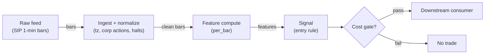

# S030 — Bollinger bandwidth squeeze → expansion

Bollinger bandwidth percentile: compression at its trailing-`R` lows (`squeeze`) arms the system; the *confirmed band break* (S029 leg) aims it. The squeeze is volatility-state timing — explicitly not a directional edge. Provenance **[I]**.

> Tag law: every numeric literal in prose carries one of `[documented]
> [default] [example] [unverified] [internal-est] [measured]` (legend: Appendix
> i v1.0.0). Bibliographic years, volumes, pages, arXiv IDs, section numbers,
> rule codes (C1–C10), fail-safe codes (F1–F5), module IDs, batch keys, family
> letters, and machine-parsed §0 data fields are identifiers, not literals,
> and are exempt.

## §1 Five-minute reviewer card

| Row | Value |
|---|---|
| Module | S030 — Bollinger bandwidth squeeze → expansion, v1.1.0 |
| Edge verdict | `PREDICTIVE-FEATURE-ONLY` — volatility clustering is real and compression-then-expansion is its visible signature (Andersen et al. 2003 [documented]); as a directional edge the squeeze is nothing |
| After-cost | `BEFORE-COST` — Works as a volatility-state timer: compression reliably precedes expansion; dies as a directional call — the squeeze resolves up or down with roughly the market's base rates, and dead low-liquidity names sit at "squeeze" bandwidth for months |
| Build cost | Tier L · `4–12` h [internal-est] · `$600–1,800` loaded [internal-est] |
| Data cost | Research `$29`/mo (Polygon Stocks Starter: 15-min delayed 1-min bars, `5`-yr history [documented]); production `$99–199`/mo (Developer/Advanced: real-time) [documented] — verify current vendor pricing before budgeting |
| latency_class | bar-level / minutes |
| risk_class | low (signal-only; no order placement) |
| Capacity | `$5–25`/day notional [example] — illustrative; calibrate per venue |
| Executability | Feasible: Python+polars prototype; trivial compute |
| Risk summary | Direction illusion: treating the squeeze itself as a buy/sell signal. Squeeze defined after the move: percentile needs `R` prior bars, so the system enters expansions, not compressions |
| When it dies | Dead names with permanent compression; news-spike fake expansions that reverse within the bar; breaks against the higher-timeframe trend; correlated triggers at the obvious break bar |
| Regime gates | Provisional: pending R001–R050 annotation |
| Emits | `signal_vector` (Appendix b v1.0.0) — never orders |

## §1.5 Cheapest / least-build path

1. **Prototype hour band:** `4–12` h [internal-est] — bar features + timestamp/halt handling + reference validation against the fixture.
2. **Cheapest-source row** (structured; one source per row):

| min_tier | latency_class | required_fields | price_band | build_or_buy |
|---|---|---|---|---|
| Polygon Stocks Starter (15-min delayed; upgrade to Developer/Advanced for production real-time) | bar-level / minutes | 1-min OHLCV (`t,o,h,l,c,v,n`), corporate-action adjustments, session calendar | `$29–199`/mo [documented] | **build the estimator, buy the feed** |
3. **Resource budget:** `1` core, `<2` GB RAM for `500` symbols [internal-est]; compute pattern `per_bar`.
4. **Skip list:** tick-level variants; multi-venue aggregation; Rust ingest; colocated deployment.
5. **DO-NOT-CUT list:** causality assertions (`assert fill_event > signal_event`, no-signal-bar-fills test); COST block + callable `expected_cost_bps`; F1–F5 fail-safes + module-state enum + kill/safe-mode (`OFF`); decision-log audit records; bona-fide-intent + self-trade prevention; provenance tags on every numeric literal; fixtures + `test_cmd`; secrets via env only.
6. **Escalation gate:** upgrade from cheapest when any holds — live universe beyond the cheapest band; jitter persistently over budget; cost gate failing on `[measured]` costs; entitlement class changes.

## §S0 Module contract

### S0.1 Typed signature

```python
def signal(state: ModuleState, events: list[Event], cfg: Config) -> SignalVector:
```

`SignalVector` per Appendix b v1.0.0. `state` is the module-owned named state
vector (`bars`, `bandwidth_hist`, `armed`, `cooldown_until`, `module_state`); `events` are canonical Events (Appendix a v1.0.0),
newest last. The function handles documented edge cases: empty events →
`UNKNOWN`; invalid/missing prices → `UNKNOWN` (F1, never interpolate);
halt/auction events → freeze per the market-state table.

### S0.2 Config dataclass

| Parameter | Type | Default | Range | Status |
|---|---|---|---|---|
| `bb_lookback` | int | `20` | `10`–`50` | default |
| `bb_mult` | float | `2.0` | `1.5`–`2.5` | default |
| `pct_window` | int | `125` | `50`–`250` | default |
| `squeeze_pct` | float | `20.0` | `5`–`20` | default |
| `cost_gate_k` | float | `0.5` | `0.1`–`2.0` | default |
| `cooldown_s` | float | `600.0` | `0`–`3,600` | default |
| `adv_pct_min` | float | `0.0005` | `0`–`0.01` | default |
| `side` | str | `"taker"` | `taker`\|`maker` | default |

All defaults tagged per the tag law (status `default` ⇒ `[default]`).

### S0.3 Canonical schema mapping

Vendor columns → canonical Event schema (Appendix a v1.0.0), stated once here:

| Vendor | Canonical |
|---|---|
| `t` (ms) | `event_ts` (int64 ns UTC; ms→ns) |
| `o` / `h` / `l` / `c` | `open` / `high` / `low` / `close` |
| `v` | `volume` |
| `n` | `trade_count` |
| S029 confirmed-break leg (same `event_ts`) | `bb_up`, `bb_lo` (Bollinger band levels at bar `t`) |
| derived: `adv_shares / ADV_20d` | `adv_pct` (bar participation vs trailing-`20`-day average) |

### S0.4 Time contract

> Time contract: clock domain UTC, int64 ns; authoritative causality clock =
> `event_ts`; max_skew = `1` [default]; jitter budget = `500`
> [default]; bar-label = open time; staleness TTL = `180` [default]; gap
> policy = mask, no interpolation; halt/auction → discard contributions across
> reopen.

**Timing box:** `signal@t (per_bar, America/New_York) → earliest fill @open(t+1)`

### S0.5 Market-state table

| State | Module behavior |
|---|---|
| CONTINUOUS_TRADING | Compute normally; emit per cadence |
| HALTED | Freeze state; emit `UNKNOWN`; discard contributions across reopen |
| AUCTION | No new signals; hold last `SignalVector`; state `DEGRADED` |
| CLOSED | Emit nothing; state `OFF` |

### S0.6 Module-state enum + error taxonomy

States per Appendix k v1.0.0: `OK | DEGRADED | UNKNOWN | OFF`. Invalid input →
`UNKNOWN`, never interpolate (Appendix f v1.0.0, F1–F5). Kill/safe-mode: an
administrative kill or a bounds violation forces `OFF` until the runbook
re-arm checklist passes.

| Failure | State | Alert |
|---|---|---|
| Missing/stale input (TTL) | `UNKNOWN` | page |
| Bad bar (high<low, non-positive prices, crossed quotes) | `UNKNOWN` | log |
| Feature out of mathematical bounds (F2) | `UNKNOWN` | page |
| `seq` gap beyond tolerance | `DEGRADED` (restart windows) | log |
| Halt/auction | `UNKNOWN` / `DEGRADED` (per table) | log |
| Kill/administrative disable | `OFF` | page |
| Anything unmapped | `UNKNOWN` | page |

### S0.7 Ops tail

- **Schedule:** continuous during US equities regular session `09:30`–`16:00` America/New_York [documented]; owner: signals on-call.
- **Health checks:** fixture replay (`test_cmd`) green on deploy; `seq`-gap monitor; staleness watchdog at `180` [default].
- **Alert table:** page on `UNKNOWN` > `5` min [default] or bounds violation; notify on `DEGRADED`; log single dropped events.
- **Resource budget:** `1` vCPU, `2` GB RAM per `500` symbols [internal-est]; state is O(window) per symbol.
- **Runbook stub:** `1.` confirm feed; `2.` replay fixture; `3.` if red → set `OFF`, page; `4.` reconcile decision log before re-arm.

### S0.8 Secrets (env-only)

`POLYGON_API_KEY` via environment only. No secrets in this file, fixtures, or logs
(CI secrets-grep).

### S0.9 May / must-NOT

> **May:** emit `SignalVector` records per Appendix b v1.0.0. **Must-NOT:**
> emit orders, order intents, prices, share counts, or notionals; call a
> broker; mutate shared state outside `state`; interpolate across gaps.

## §S1 Legacy (subsumed by §1)

Legacy §S1 content is the §1 reviewer card above; this header is retained so
section numbering stays frozen.

## §S2 Specification

### Universe

US common stocks, regular session, top-`500` by trailing-`20`-day dollar volume [example]; minimum ADV and spread screens (illiquid names show permanent "squeeze" bandwidth); corporate-action-adjusted series.

### Entry rule (Boolean — no prose-only conditions)

```
ARMED     := (bandwidth_percentile_R <= p)                    # squeeze ON: volatility-state timer
ENTER_LONG  := ARMED AND (close_t > bb_up_t)               # the confirmed break aims it
               AND (spread_ticks <= 3) [default] AND (adv_pct >= adv_pct_min) [default]
               AND (now >= cooldown_until)
               AND (expected_cost_bps(...) <= cost_gate_k * edge_bps)
ENTER_SHORT := ARMED AND (close_t < bb_lo_t)
               AND (spread_ticks <= 3) [default] AND (adv_pct >= adv_pct_min) [default]
               AND (locate_ok)
               AND (now >= cooldown_until) AND (expected_cost_bps(...) <= cost_gate_k * edge_bps)
FLAT        := otherwise   # squeeze alone NEVER emits direction
```

`edge_bps` = `8.0` bps [example] — expected post-squeeze expansion move net of the entry delay.

### Exits (with post-exit cooldown)

```
EXIT := (bandwidth percentile > 80) [example]   # expansion spent
       OR (opposite band tag) OR (bars_held >= 10) [example] OR (module_state != OK)
ON_EXIT: cooldown_until = now + cooldown_s   # C10
```

### Position sizing (fenced function)

```python
def size_shares(risk_budget_R, stop_distance, vol_estimate, ADV_cap, cost):
    # S-module requests capital fraction only; share math lives in the strategy.
    risk_notional = risk_budget_R * 0.5 * confidence          # 0.5 [default] factor
    shares = risk_notional / max(stop_distance, 1e-9)        # 1e-9 [default] guard
    return int(min(shares, ADV_cap * adv_shares * 0.001))     # 0.1% ADV cap [default]
```

### Risk limits

| Limit | Value |
|---|---|
| Max capital fraction per signal | `0.5` [default] |
| Max adverse excursion before `UNKNOWN` review | `2.0`× stop [default] |
| Staleness kill | TTL `180` [default] → `UNKNOWN` |

### COST block (single source of truth)

| Component | Value (bps) | Basis |
|---|---|---|
| Spread (half-spread, liquid large-cap) | `0.50` | [example] |
| Fees (taker incl. regulatory) | `0.30` | [example] |
| Borrow (per-trade stack) | `0.0` | [default] — reason: reference build long-biased; shorts add C7 locate cost |
| `borrow_bps_per_day` | `0.0` bps/day | [default] — reason: reference build is long-biased and holds `1`–`10` bars [example] intraday; no overnight carry, hence zero borrow accrual. Any SHORT or overnight leg must set a positive `borrow_bps_per_day` from the venue stock-loan rate (C7) |
| Impact | `1.0` | [example] — flagged; calibrate per venue at scale-up |
| **Total reference** | `1.80` | [example] |

`fee_schedule_as_of`: `2025-12-11` [documented] — Nasdaq Equity VII §118 as-of date cited in SEC filing 34-104783; the bps conversions in this block are [example], not the schedule itself — pin the live venue schedule before production. `side: taker` [default]; venue/tier/source: XNAS / Polygon SIP 1-min bars [example]. Re-stating cost numbers outside this block is a validation failure.

```python
def expected_cost_bps(notional, adv_pct, venue, side, urgency) -> float:
    # Callable cost model - reference stack, components from the COST block.
    # notional/adv_pct/venue/urgency are unused in the constant-stack reference [example];
    # a venue-calibrated build must wire them (impact = f(notional, adv_pct, urgency)).
    spread_bps = 0.50   # [example]
    fee_bps = 0.30      # [example]
    borrow_bps = 0.0    # [default] long-biased reference; reason in table
    impact_bps = 1.0    # [example] flagged; calibrate per venue at scale-up
    if side == "maker":
        fee_bps = -0.20  # rebate [example]
    return spread_bps + fee_bps + borrow_bps + impact_bps
```

### Execution / fill model table

| Aspect | Assumption |
|---|---|
| Latency | Signal→intent `≤1` bar [example]; SIP path latency-simulated-only |
| Partial fills | N/A (signal-only; T-module policy: Appendix c v1.0.0) |
| Impact | `1.0` bps reference [example]; stress ×`5` [example] |
| Adverse fill | Whipsaw haircut `0.2` bps per unit signal [example] |

### Robustness

Percentile window `R` in `50`–`250` [example]: small `R` flickers, large `R` pollutes with ancient regimes. Threshold `p` in `5`–`20` [example]. Fix `p, R` from the trading horizon's logic; validate out-of-sample with purged/embargoed splits. Require expansion persistence (`2`–`3` bars [example]) or volume confirmation before committing — a one-bar spike prints percentile `100`% with no follow-through. Backtest the squeeze leg and the direction leg separately.

### Compliance sub-block (C1–C10+)

| Code | Rule: trigger → check → action → log |
|---|---|
| C1 | Self-match prevention: this S-module emits no orders; downstream consumers must set self-trade-prevention flags — asserted in the `consumes` contract → check: consumer ticket schema (Appendix c v1.0.0) has STP flag → action: block non-compliant consumers → log: `stp_assert` record |
| C2 | Bona-fide intent: every emitted `SignalVector` with direction ≠ `0` must pass the cost gate; sub-threshold features emit direction `0`, never a tradeable hint → check: `expected_cost_bps(...) <= k * edge_bps` → action: zero the direction on failure → log: `gate_veto` record |
| C3 | Message-rate: emissions capped per symbol per second [default] → check: rate monitor → action: throttle + alert → log: `throttle` record |
| C4 | Fat-finger trio (applied by consumers; this module bounds its own outputs): confidence ∈ [`0`,`1`], capital ∈ [`0`,`0.5`], computed_at sane → check: bounds on every emission → action: out-of-bounds → `UNKNOWN` (F2) → log: `bounds_veto` record |
| C5 | Decision log: every emission, veto, and state transition logged per Appendix g v1.0.0, hash-chained → check: log write ack → action: halt on write failure → log: the record itself |
| C6 | Halt/auction: per §S0.5 market-state table; contributions across reopen discarded → check: state feed → action: freeze/`DEGRADED` → log: `state_freeze` record |
| C7 | Locate check: SHORT direction requires `locate_ok` from the consumer; no SHORT without asserted locate (Reg-SHO threshold securities → direction `0`) → check: locate flag → action: zero SHORT on missing locate → log: `locate_veto` record |
| C8 | Public dissemination: no signal values published externally without review gate → check: export channel → action: block unreviewed export → log: `export_block` record |
| C9 | Data entitlements: per §S6 Data rights row → check: entitlement class on startup → action: entitlement change → §1.5 escalation gate → log: `entitlement` record |
| C10 | Post-exit cooldown: `cooldown_s` after any exit or compliance block; no re-entry → check: `now >= cooldown_until` → action: suppress entries → log: `cooldown` record |
| C11 | No-direction representation: any downstream display of squeeze state must label it volatility-timing, never buy/sell → check: label on outputs → action: block mislabeled dissemination → log: `label_check` record |

### Parameter table

| Parameter | Symbol | Value | Tag | Sensitivity |
|---|---|---|---|---|
| Bollinger lookback | `N` | `20` bars | [default] | medium |
| Bollinger multiplier | `k` | `2.0` | [default] | medium |
| Percentile window | `R` | `125` bars | [default] | high — flicker vs staleness |
| Squeeze threshold | `p` | `20`% | [default] | high |
| Cost-gate k | `cost_gate_k` | `0.5` | [default] | high |
| Participation floor | `adv_pct_min` | `0.0005` | [default] | medium — screens dead names |
| Entry side | `side` | `"taker"` | [default] | medium — cost stack changes |

### Calibration recipes (per parameter)

Grids are defaults — freeze from horizon logic, promote only out-of-sample:

| Parameter | Calibration grid | Selection recipe |
|---|---|---|
| `bb_lookback` (`N`) | {`10`,`15`,`20`,`25`,`30`,`40`,`50`} [default] | nested walk-forward; freeze at the value maximizing OOS net-of-cost edge stability; `20` default anchored to Bollinger (2001) [documented] |
| `bb_mult` (`k`) | {`1.5`,`1.75`,`2.0`,`2.25`,`2.5`} [default] | same; `2.0` default per Bollinger [documented] |
| `pct_window` (`R`) | {`50`,`75`,`100`,`125`,`150`,`200`,`250`} [default] | same, with regime-purity constraint: the window must span ≤ ~`6` months of the trading cadence [default] (intraday: `125` 1-min bars ≈ `2` h [example]; daily: `125` days ≈ `6` months [documented]) |
| `squeeze_pct` (`p`) | {`5`,`7.5`,`10`,`12.5`,`15`,`20`} [default] | same; penalize `p < 10` for flicker unless the expansion-persistence filter (§S10-5) is on |
| `cost_gate_k` | {`0.1`,`0.25`,`0.5`,`1.0`,`2.0`} [default] | maximize OOS net P&L; publish the k-sensitivity report; default `0.5` |
| `cooldown_s` | {`0`,`300`,`600`,`1800`,`3600`} [default] | minimize re-entry churn at constant OOS profit; default `600` |
| `adv_pct_min` | {`0.0001`,`0.0005`,`0.001`} [default] | OOS net P&L; tightening screens dead-name squeezes (§S9-R002) at the cost of universe size |
| `side` | `taker` → `maker` [default] | re-run with the maker fee leg (rebate `−0.20` bps [example]); promote only if fill-rate-adjusted net improves |

**Global OOS selection recipe:** `1.` fix the grids above; `2.` purged walk-forward with embargo ≥ max(`R`, `bb_lookback`) bars [default]; `3.` require ≥ `50` OOS trades [default]; `4.` rank by OOS Sharpe net of the full COST stack (or Deflated Sharpe Ratio where the variant count is reported); `5.` if OOS Sharpe < `0.5`× IS Sharpe [default], keep defaults and do NOT promote; `6.` freeze; re-tune only on a documented regime change, logged in §S12.

### Timing box

`signal@t (per_bar, America/New_York) → earliest fill @open(t+1)`

## §S3 Math + normative pseudocode

Bollinger bandwidth ($k=2$ [example]):

$$BW_t = \frac{\mathrm{BB}^U_t - \mathrm{BB}^L_t}{\mathrm{SMA}_N(t)} = \frac{4\,\sigma_N(t)}{\mathrm{SMA}_N(t)}, \qquad P_t = 100\times\frac{\#\{BW_{t-R},\dots,BW_{t-1} \le BW_t\}}{R}$$

Squeeze state: $P_t \le p$ with $p = 20$ [example], $R = 125$ [example] (Bollinger's "simple" squeeze uses the 6-month bandwidth minimum [documented]). The entry is only ever on the *confirmed band break* — the squeeze arms, the break aims. Causal timing: $P_t$ uses values $\le t$; earliest fill at $t+1$; squeeze states are late by construction (the indicator confirms compression after it has persisted).

**Normative pseudocode** (pseudocode is normative; prose is commentary). Every
prose guard from §S2 appears here as an executable line:

```
function signal(state, events, cfg) -> SignalVector:
    # ---- inputs ----
    # state: module-owned named vector {bars (ring buffer of Events, newest last),
    #        bandwidth_hist (ring buffer of {event_ts, bw}, newest last),
    #        cooldown_until (int64 ns), last_sig (SignalVector), module_state}
    # cfg: Config dataclass §S0.2 (+ side="taker" [default], venue="XNAS" [example],
    #        ref_notional=1e6 [example], adv_pct_min=0.0005 [default])
    # events: canonical Events newest last (Appendix a). e.bw = bandwidth [documented];
    #        e.bb_up/e.bb_lo from the S029 confirmed-break leg at the same event_ts.

    # ---- F1/F2: validate, never interpolate ----
    if len(events) == 0:
        return UNKNOWN(state, reason="empty_events")                       # F1
    e = events[-1]
    assert e.asof_ts <= e.event_ts                                        # dual-timestamp causality [rule]
    if (not valid_event(e)) or (e.bw is None) or isnan(e.bw) or (e.bw <= 0.0):
        return UNKNOWN(state, reason="bad_event_or_bw")                   # F1/F2
    if state.module_state == OFF:
        return OFF(state)                                                 # kill/safe-mode latched (§S0.6)
    if market_state(e) == HALTED:
        freeze(state); return UNKNOWN(state, reason="halted")              # §S0.5
    if market_state(e) == AUCTION:
        return hold_last(state)                                           # §S0.5 → DEGRADED

    # ---- features: causal window strictly [t-R, t-1]; band levels at t allowed ----
    R, p, k_gate = cfg.pct_window, cfg.squeeze_pct, cfg.cost_gate_k
    hist = state.bandwidth_hist[-R:]                                      # newest R, all strictly before t
    assert all(h.event_ts < e.event_ts for h in hist)                     # no lookahead [rule]
    if len(hist) < R:
        return zero_signal(e, state)                                      # warmup: direction 0
    pct = 100.0 * mean([bw <= e.bw for (ts, bw) in hist])                 # trailing-R percentile [documented]
    armed = (pct <= p)                                                    # squeeze: direction-neutral

    # ---- entry rule (§S2, Boolean — no prose-only conditions) ----
    brk_up   = (e.close > e.bb_up)                                        # confirmed band break (S029 leg)
    brk_dn   = (e.close < e.bb_lo)
    cool_ok  = (now_ns() >= state.cooldown_until)                         # C10
    liq_ok   = (e.spread_ticks <= 3) and (e.adv_pct >= cfg.adv_pct_min)    # 3 [default], floor [default]
    cost_ok  = expected_cost_bps(notional=cfg.ref_notional,
                                adv_pct=e.adv_pct, venue=cfg.venue,
                                side=cfg.side, urgency="normal") \
               <= k_gate * edge_bps()                                    # NORMATIVE COST-GATE PREDICATE [rule]
    enter_long  = armed and brk_up and liq_ok and cool_ok and cost_ok
    enter_short = armed and brk_dn and liq_ok and cool_ok and cost_ok and locate_ok(e.symbol)
    direction = +1 if enter_long else (-1 if enter_short else 0)

    # ---- conviction: depth of compression (expansion persistence is a T-module confirm) ----
    if direction == 0:
        confidence, capital = 0.0, 0.0
    else:
        squeeze_depth = (p - pct) / p                                     # in [0,1] when armed
        confidence = clamp(0.3 + 0.7 * squeeze_depth, 0.0, 1.0)           # 0.3/0.7 [example]
        capital = 0.5 * confidence                                       # 0.5 [default]

    sig = SignalVector(symbol=e.symbol, direction=direction, confidence=confidence,
                       capital=capital, computed_at=e.event_ts,
                       staleness=now_ns() - e.asof_ts, module_state=state.module_state)
    log_decision(sig, inputs_hash=hash(e), params_hash=hash(cfg))          # C5 / Appendix g

    # ---- causality assertions (machine-checked) ----
    assert sig.computed_at == e.event_ts                                  # signal belongs to bar t [rule]
    # INVARIANT (t->t+1): for every downstream fill, fill_event > signal_event [rule]
    return sig


function edge_bps() -> float:
    return 8.0  # expected post-squeeze expansion move net of entry delay [example]


function zero_signal(e, state) -> SignalVector:
    return SignalVector(symbol=e.symbol, direction=0, confidence=0.0, capital=0.0,
                        computed_at=e.event_ts, staleness=now_ns() - e.asof_ts,
                        module_state=state.module_state)


function hold_last(state) -> SignalVector:
    return state.last_sig  # AUCTION: no new signals; last_sig carried, state DEGRADED (§S0.5)
```

Causality: features at event/bar `t` use only data `≤ t` (percentile window strictly `< t`); earliest reaction is `t+1`. Mandatory unit test: no-signal-bar fills.

## §S4 Worked example (fixture-backed)

- Tape: `modules/fixtures/S030_tape.csv` — `# TYPE: validation-run`;
  `26` synthetic bandwidth observations (seed `30`): compression `0.90`%→`1.45`%, re-compression to `0.79`%, then the expansion bar `1.564`% — isolating the percentile/squeeze computation (bandwidth itself comes from the S029 leg). All numbers synthetic, seed `30` [example]; timestamps int64 ns UTC.
- Expected outputs: `modules/fixtures/S030_expected.csv` — `pct` (trailing-`20` percentile) and `squeeze` (`1` iff `pct ≤ 20`) per observation (`R=20` fixture override of the `125`-bar default [example]); warmup rows carry NaN and `0`.
- Tolerance: `1e-9` on floats; integer counts exact.
- Acceptance tests (`modules/tests/test_S030.py`, `13` tests):
  `1.` fixture recomputes to expected (bar-23 `pct=0`% → squeeze ON; bar-26 `pct=100`% → expansion, NOT a squeeze — hand-checks); `2.` stub emits valid `SignalVector` (direction `0`: squeeze is direction-neutral); `3.` no-signal-bar fills (`fill_event_ts > computed_at`); `4.` cost-gate predicate passes on large edge, blocks on tiny edge (`k = 0.5` [default]); `5.` invalid input (negative bandwidth) → `UNKNOWN`; `6.` cost gate pinned at the module edge (`8.0` bps [example]): passes at edge `8.0` [example], blocks at edge `3.0` [example]; `7.` maker-side cost < taker-side cost (rebate leg exercised, `1.30` < `1.80` bps [example]); `8.` squeeze-threshold boundary (bar-22 `pct=30`% → `0`, bar-23 `pct=0`% → `1`); `9.` zero/NaN bandwidth → `UNKNOWN`; `10.` `computed_at == event_ts` for every signal (causality pin); `11.` fixture `# TYPE: validation-run` header present; `12.` squeeze-alone never directional (direction `0` [default] on every armed bar); `13.` Config defaults match §S0.2/§S2 spec.
- `test_cmd`: `python3 -m pytest modules/tests/test_S030.py -q` → exits `0`.

**Hand-check:** bar `23` (`bw=0.90`%): prior `20` = bars `3`–`22`, minimum `0.96`% → `0`/`20` → `pct = 0`% [example] → squeeze ON; bar `26` (`bw=1.564`%): all `20` priors `≤ 1.564`% → `pct = 100`% [example] → expansion, NOT a squeeze; bar `21` (`bw=1.30`%): `14`/`20` priors `≤ 1.30`% → `pct = 70`% [example] → no squeeze. Asserted in the test.

**Where the example is optimistic:** no fees, no latency, no partial fills, no corporate-action surprises — arithmetic illustration, not a backtest.

## §S5 Strategies that use this signal

Generated from `deps.yaml` (CI symmetry); hand-listed here:

| Strategy | Role |
|---|---|
| T094 — Squeeze Breakout (Options-Confirmed) | Primary trigger: squeeze breakouts confirmed by unusual options activity and vol expansion |
| T014 — Bollinger Reversal + Squeeze Exit | Timing/exit filter: covers reversal positions into squeeze expansions |
| T061 — Initial-Balance Expansion Trader | Confirmation filter: first-hour range breaks confirmed by squeeze state and relative volume |

## §S6 Data required

| Field | Type | Granularity | Vendor / product | Required fields | Price band | Notes |
|---|---|---|---|---|---|---|
| 1-min OHLCV bars | float/int | `1` min (resample to `15` min allowed) | Polygon Stocks (Starter for research; Developer/Advanced for production real-time) | `t,o,h,l,c,v,n` [documented]; corporate-action adjusted | `$29`/mo research; `$99–199`/mo production [documented] | Daily bars suffice for the 6-month-minimum variant |
| Corporate actions | events | as-occurring | Polygon reference data (same plan) | split/dividend factors | included | Splits corrupt σ and hence bandwidth — mandatory |
| Session calendar | reference | daily | Polygon reference / exchange calendar | regular-session open/close, halt flags | included | Percentile windows must span comparable regimes |

Polygon rebranded to Massive in late 2025; product and API reported unchanged [documented]. Vendor column mapping lives in §S0.3.

**Data rights row** (Appendix j v1.0.0): SIP bars via Polygon Stocks Advanced, `rights: licensed`; scope = research + stated production symbol count (`≤500` [default]); raw ticks never leave our systems — fixtures are synthetic; entitlement = professional/internal, no display; retention per vendor terms, purge path in runbook; derived features ours.

## §S7 Local build (M5 Max / 128 GB)

Feasible: trivial. Bandwidth is arithmetic on the S029 features; the rolling percentile is O(`R`) per bar naive or O(log `R`) with an order-statistic tree — at `R=125` [example] and `500` symbols × `390` bars/day, even the naive version is microseconds per bar. Same S029 story otherwise: milliseconds per full-universe recompute, ~`12` MB for `500` symbols × `60` days of 1-min bars. Tier L per `notes/cost-model.md` §5: `4–12` h ≈ `$600–1,800` [internal-est].

## §S8 Buy vs build

| Tier-0 (Stooq/Alpaca IEX) | Daily bars | ~`$0` | Enough for the 6-month-minimum variant | No intraday |
| Tier-1 (Polygon/Alpaca SIP) | Real-time 1–15 min bars | ~`$30–200`/mo | Clean intraday bandwidth series | Nothing material |
| Vendor overlay (TTM Squeeze study) | Pre-built squeeze dots + momentum | ~`$15–60`/mo platform fee | Instant visualization | Opaque parameters; weak audit trail |

**Verdict:** build. Bandwidth is one division; the percentile is one rolling rank. Build it yourself, because the squeeze threshold `p` and window `R` *are* the strategy, and a vendor will not let you audit theirs.

## §S9 Efficacy — documented evidence

| Study / source | Market & period | Metric | Before/after cost | Caveat |
|---|---|---|---|---|
| Bollinger (2001), *Bollinger on Bollinger Bands* — squeeze as lowest-volatility regime; "wait for a squeeze and go with the first breakout" | Practitioner framework, multi-market | Timing rule description; no strategy returns reported | `BEFORE-COST` (no P&L documented) | The rule is volatility-timing, explicitly not a directional edge |
| Reuters / LSEG market technicals (2026-09-10) — S&P 500 Bollinger Bandwidth compressed to lowest since June 2021 | US large-cap, Aug–Sep 2026 | Observed compression → subsequent swing; direction explicitly "unclear" beforehand | Observational (before-cost) | Single anecdote, not a backtest; illustrates exactly the direction-neutrality point |
| Andersen, Bollerslev, Diebold & Labys (2003), *Econometrica* | Multi-market | Realized-volatility long-memory framework: compression-then-expansion is the visible signature of clustered volatility | `BEFORE-COST` (mechanism, not a strategy) | Supports the timer, not any directional rule |

**Selection disclosure:** the `3` sources from the chapter's research pass; the honest headline is the chapter's: as a *volatility-state timer* the squeeze is the most defensible of the SB5 chapters, as a *directional edge* it is nothing.

### Regime gates (machine records, provisional — pending R001–R050 annotation)

| regime_id | direction | mechanism | condition | action | min_lag | unknown_behavior |
|---|---|---|---|---|---|---|
| R001 | amplifies | volatility-clustering regime: compression reliably precedes expansion | `clustered_vol_flag AND adv_pct >= adv_pct_min` | none | `1` day [default] | veto |
| R002 | degrades | dead low-liquidity names: permanent "squeeze" bandwidth | `adv_shares < adv_min OR spread_ticks > 3` | veto | `5` days [default] | veto |
| R003 | degrades | news-spike fake expansions | `news_spike_flag AND persistence_bars < 2` | veto | `1` day [default] | veto |

## §S10 Failure modes & pitfalls

| # | Trigger → Detect → Action → Recovery | check: |
|---|---|
| 1 | The direction illusion: treating the squeeze as a buy/sell signal → detect: output-label audit → action: entries only on the confirmed break → recovery: backtest squeeze leg and direction leg separately | `check: entries_require_break` |
| 2 | Squeeze defined after the move: percentile needs `R` priors + the break needs confirmation → detect: entry-delay measurement (bars from percentile trough to fill) → action: size for the *remaining* move → recovery: re-measure delay | `check: entry_delay_bars <= 5` [default] |
| 3 | Mixed bar-inclusion conventions: bandwidth windows including the forming bar vs completed-bar percentiles → detect: convention audit → action: one stated convention → recovery: re-run causality tests | `check: convention_pinned` |
| 4 | Permanent compression in dead names → detect: ADV/spread screens → action: veto; require the expansion to begin (band break) → recovery: re-screen | `check: adv >= adv_min` |
| 5 | News-spike fake expansions: one-bar spike prints percentile `100`% → detect: persistence check (`2`–`3` bars [example]) → action: require persistence or volume confirmation → recovery: re-tune | `check: expansion_persisted` |
| 6 | Threshold mining: `p ∈ {5,10,20}`, `R ∈ {50,…,250}` always yields an in-sample winner → detect: OOS decay → action: purged/embargoed validation → recovery: fix `p, R` from horizon logic | `check: oos_sharpe > 0.5 * is_sharpe` [default] |
| 7 | Correlated triggers: every squeeze trader arming the same bar → detect: slippage at the break bar → action: model the full round-trip stack; consider retest entries → recovery: execution review | `check: realized_slippage <= budget` |
| 8 | Cost blowup: expansion entries pay spread+fees+impact per trade → detect: cost gate failing on `[measured]` costs → action: require post-break expected move > `2`–`3`× round-trip cost [default] → recovery: re-pin fee schedule | `check: expected_cost_bps(...) <= k * edge_bps` |

## §S11 Visuals

Figure: `batches figure (see §0 `plot_script`)` (synthetic, seed `30` [example]).



## §S12 Source log + unverified leads

**Sources** (citable facts only):

1. Bollinger, John (2001) — *Bollinger on Bollinger Bands*, McGraw-Hill [documented]: the squeeze concept (simple: 6-month bandwidth minimum; complicated: 20-day σ vs 125-day 1.5-σ bands of σ, p.194) and the "wait for a squeeze and go with the first breakout" rule.
2. Barchart — "Bollinger BandWidth" [documented]: formula ((Upper − Lower) / Middle) × 100 and the direction-neutral squeeze theory. https://Www.Barchart.com/education/technical-indicators/bollinger_squeeze (accessed 2026-09-10).
3. StockCharts ChartSchool — "TTM Squeeze" [documented]: Carter's construction (Bollinger 20/2 inside Keltner 20/1.5, original 1960 Keltner formula) plus the momentum histogram. https://chartschool.stockcharts.com/table-of-contents/technical-indicators-and-overlays/technical-indicators/ttm-squeeze (accessed 2026-09-10).
4. Trading Technologies — "Bollinger Bandwidth" [documented]: formula and configuration reference. https://library.tradingtechnologies.com/trade/chrt-ti-bollinger-bandwidth.html (accessed 2026-09-10).
5. Andersen, T. G., Bollerslev, T., Diebold, F. X. & Labys, P. (2003) — "Modeling and forecasting realized volatility," *Econometrica* 71(2) [documented]: realized-volatility long-memory framework behind the volatility-clustering mechanism the squeeze exploits.
6. Medium (Kevin Meneses González, Jun 2026) — "Stock Price API: Best Free vs Paid Options (2026)" [documented]: Polygon (rebranded Massive, late 2025) plan prices — Starter `$29`/mo (15-min delayed), Developer `$99`/mo (real-time), Advanced `$199`/mo, All-Access `$399`/mo. https://medium.com/@kevinmenesesgonzalez/stock-price-api-best-free-vs-paid-options-2026-82370a377819 (accessed 2026-09-10).
7. Brokers-Exchange — "Polygon.io Review" [documented]: Starter `$29`/mo (15-min delayed + 5-yr history), Developer `$79`/mo (15-min delayed + 10-yr history), Advanced `$199`/mo (real-time + 15-yr history). https://brokers-exchange.com/polygon-io-review/ (accessed 2026-09-10).
8. SEC filing SR-IEX 34-104783 [documented]: cites "Nasdaq Equity VII, Section 118 (as of December 11, 2025)" — the as-of date pinned in the §S2 COST block. https://www.sec.gov/files/rules/sro/iex/2026/34-104783.pdf (accessed 2026-09-10).

**Chatbot source log.** Duck.ai (GPT-5.6 Luna, anonymous) answered Q-SB5-1–Q-SB5-3 (`2026-09-10`); Grok/Cursor answers pending (checked `2026-09-10`).

**Unverified leads** (chatbot-only — never in evidence tables):

- Duck.ai Q-SB5-1–Q-SB5-3: the `30`-bar worked-example numbers (operator hand-checked, no arithmetic errors; bar-`30` percentile `100`% = expansion after compression, NOT a squeeze) [unverified]; the mandatory framing that the squeeze is volatility-state timing and the testable question is risk-adjusted after-cost returns [unverified].

---

## Appendix — AI build prompt (S030)

Copy-paste into any chat agent:

> Build module **S030 — Bollinger bandwidth squeeze → expansion** per `notes/module-template.md` v1.0.0
> and this file's §S0 contract. Cheapest path (§1.5): prototype
> `4–12` h [internal-est]; cheapest data candidate
> Polygon.io Stocks Advanced [internal-est]; compute pattern `per_bar`.
> Implement `signal(state, events, cfg) -> SignalVector` (Appendix b v1.0.0)
> with the §S3 normative pseudocode, including the cost-gate predicate
> `expected_cost_bps(...) <= k * edge_bps` and `assert fill_event >
> signal_event`. Wire F1–F5 (Appendix f v1.0.0): invalid input → `UNKNOWN`,
> never interpolate. Log decisions per Appendix g v1.0.0. Secrets via env
> only. Run the fixture `modules/fixtures/S030_tape.csv`
> (`# TYPE: validation-run`) against `modules/fixtures/S030_expected.csv`
> (tolerance `1e-9`).
> **Definition of done:** `python3 -m pytest modules/tests/test_S030.py -q`
> exits `0`. Tag every numeric literal you add with the unified enum
> (Appendix i v1.0.0); put anything unverifiable in §S12 unverified leads.
