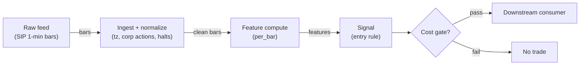

# S031 — Consecutive-bar streaks (runs)

Consecutive same-sign bars: ride the run while `|S| >= k1` (`3` [example]), fade the exhaustion when `|S| >= k2` (`6` [example]) — the continuation/fade duality in one counter. Provenance **[I]**.

> Tag law: every numeric literal in prose carries one of `[documented]
> [default] [example] [unverified] [internal-est] [measured]` (legend: Appendix
> i v1.0.0). Bibliographic years, volumes, pages, arXiv IDs, section numbers,
> rule codes (C1–C10), fail-safe codes (F1–F5), module IDs, batch keys, family
> letters, and machine-parsed §0 data fields are identifiers, not literals,
> and are exempt.

## §1 Five-minute reviewer card

| Row | Value |
|---|---|
| Module | S031 — Consecutive-bar streaks (runs), v1.0.0 |
| Edge verdict | `PREDICTIVE-FEATURE-ONLY` — statistical basis in short-horizon serial correlation (Lo & MacKinlay 1988 [documented]); the intraday streak-trading rule itself is a standard reconstruction [unverified] |
| After-cost | `BEFORE-COST` — Works when runs mark genuine participation (volume-confirmed trends); dies when streaks are microstructure noise — 2-bar wiggles, zero-return bars, and thin-name flicker manufacture phantom runs |
| Build cost | Tier L · `4–12` h [internal-est] · `$600–1,800` loaded [internal-est] |
| Data cost | Research `~$30–200`/mo (SIP 1-min bars)` [unverified]; production `~$200`/mo + usage (SIP bars)` [unverified] — bands indicative, verify before budgeting |
| latency_class | bar-level / minutes |
| risk_class | low (signal-only; no order placement) |
| Capacity | `$5–25`/day notional [example] — illustrative; calibrate per venue |
| Executability | Feasible: Python+polars prototype; trivial compute |
| Risk summary | Duality risk: the same counter emits opposite directions at k1 vs k2 — mis-set thresholds trade noise both ways; entering inside a forming bar is lookahead (the bar's sign isn't known until it closes) |
| When it dies | Choppy tapes (constant whipsaws at k1); healthy trends faded too early (k2 too small); once-a-month extremes only (k2 too large); zero-return handling mismatched between backtest and live |
| Regime gates | Provisional: pending R001–R050 annotation |
| Emits | `signal_vector` (Appendix b v1.0.0) — never orders |

## §1.5 Cheapest / least-build path

1. **Prototype hour band:** `4–12` h [internal-est] — bar features + timestamp/halt handling + reference validation against the fixture.
2. **Cheapest-source row:** min_tier = Polygon.io Stocks Advanced — cheapest data source candidate [internal-est]; latency_class = bar-level / minutes; required_fields = 1-min OHLCV bars, corporate-action adjustments, session calendar; price_band = `~$30–200`/mo` [unverified] (indicative — verify before budgeting); build_or_buy = **build the estimator, buy the feed**.
3. **Resource budget:** `1` core, `<2` GB RAM for `500` symbols [internal-est]; compute pattern `per_bar`.
4. **Skip list:** tick-level variants; multi-venue aggregation; Rust ingest; colocated deployment.
5. **DO-NOT-CUT list:** causality assertions (`assert fill_event > signal_event`, no-signal-bar-fills test); COST block + callable `expected_cost_bps`; F1–F5 fail-safes + module-state enum + kill/safe-mode (`OFF`); decision-log audit records; bona-fide-intent + self-trade prevention; provenance tags on every numeric literal; fixtures + `test_cmd`; secrets via env only.
6. **Escalation gate:** upgrade from cheapest when any holds — live universe beyond the cheapest band; jitter persistently over budget; cost gate failing on `[measured]` costs; entitlement class changes.

## §S0 Module contract

### S0.1 Typed signature

```python
def signal(state: ModuleState, events: list[Event], cfg: Config) -> SignalVector:
```

`SignalVector` per Appendix b v1.0.0. `state` is the module-owned named state
vector (`bars`, `streak`, `cooldown_until`, `module_state`); `events` are canonical Events (Appendix a v1.0.0),
newest last. The function handles documented edge cases: empty events →
`UNKNOWN`; invalid/missing prices → `UNKNOWN` (F1, never interpolate);
halt/auction events → freeze per the market-state table.

### S0.2 Config dataclass

| Parameter | Type | Default | Range | Status |
|---|---|---|---|---|
| `k_cont` | int | `3` | `2`–`5` | default |
| `k_exhaust` | int | `6` | `5`–`9` | default |
| `zero_return_rule` | str | `"break"` | — | example |
| `cost_gate_k` | float | `0.5` | `0.1`–`2.0` | default |
| `cooldown_s` | float | `600.0` | `0`–`3,600` | default |

All defaults tagged per the tag law (status `default` ⇒ `[default]`).

### S0.3 Canonical schema mapping

Vendor columns → canonical Event schema (Appendix a v1.0.0), stated once here:

| Vendor | Canonical |
|---|---|
| `t` (ms) | `event_ts` (int64 ns UTC; ms→ns) |
| `o` / `h` / `l` / `c` | `open` / `high` / `low` / `close` |
| `v` | `volume` |
| `n` | `trade_count` |

### S0.4 Time contract

> Time contract: clock domain UTC, int64 ns; authoritative causality clock =
> `event_ts`; max_skew = `1` [default]; jitter budget = `500`
> [default]; bar-label = open time; staleness TTL = `180` [default]; gap
> policy = mask, no interpolation; halt/auction → discard contributions across
> reopen.

**Timing box:** `signal@t (per_bar, America/New_York) → earliest fill @open(t+1)`

### S0.5 Market-state table

| State | Module behavior |
|---|---|
| CONTINUOUS_TRADING | Compute normally; emit per cadence |
| HALTED | Freeze state; emit `UNKNOWN`; discard contributions across reopen |
| AUCTION | No new signals; hold last `SignalVector`; state `DEGRADED` |
| CLOSED | Emit nothing; state `OFF` |

### S0.6 Module-state enum + error taxonomy

States per Appendix k v1.0.0: `OK | DEGRADED | UNKNOWN | OFF`. Invalid input →
`UNKNOWN`, never interpolate (Appendix f v1.0.0, F1–F5). Kill/safe-mode: an
administrative kill or a bounds violation forces `OFF` until the runbook
re-arm checklist passes.

| Failure | State | Alert |
|---|---|---|
| Missing/stale input (TTL) | `UNKNOWN` | page |
| Bad bar (high<low, non-positive prices, crossed quotes) | `UNKNOWN` | log |
| Feature out of mathematical bounds (F2) | `UNKNOWN` | page |
| `seq` gap beyond tolerance | `DEGRADED` (restart windows) | log |
| Halt/auction | `UNKNOWN` / `DEGRADED` (per table) | log |
| Kill/administrative disable | `OFF` | page |
| Anything unmapped | `UNKNOWN` | page |

### S0.7 Ops tail

- **Schedule:** continuous during US equities regular session `09:30`–`16:00` America/New_York [documented]; owner: signals on-call.
- **Health checks:** fixture replay (`test_cmd`) green on deploy; `seq`-gap monitor; staleness watchdog at `180` [default].
- **Alert table:** page on `UNKNOWN` > `5` min [default] or bounds violation; notify on `DEGRADED`; log single dropped events.
- **Resource budget:** `1` vCPU, `2` GB RAM per `500` symbols [internal-est]; state is O(window) per symbol.
- **Runbook stub:** `1.` confirm feed; `2.` replay fixture; `3.` if red → set `OFF`, page; `4.` reconcile decision log before re-arm.

### S0.8 Secrets (env-only)

`POLYGON_API_KEY` via environment only. No secrets in this file, fixtures, or logs
(CI secrets-grep).

### S0.9 May / must-NOT

> **May:** emit `SignalVector` records per Appendix b v1.0.0. **Must-NOT:**
> emit orders, order intents, prices, share counts, or notionals; call a
> broker; mutate shared state outside `state`; interpolate across gaps.

## §S1 Legacy (subsumed by §1)

Legacy §S1 content is the §1 reviewer card above; this header is retained so
section numbering stays frozen.

## §S2 Specification

### Universe

US common stocks, regular session, top-`500` by trailing-`20`-day dollar volume [example]; `5`-min bar grid [example]; spread `≤3` ticks [default].

### Entry rule (Boolean — no prose-only conditions)

```
S_t := signed consecutive-bar count (zero-return bars break the streak) [example]
ENTER_LONG  := ((S_t >= k1) AND (S_t < k2)) OR (S_t <= -k2)   # ride runs; fade exhaustion
               AND (now >= cooldown_until) AND (expected_cost_bps(...) <= cost_gate_k * edge_bps)
ENTER_SHORT := ((S_t <= -k1) AND (S_t > -k2)) OR (S_t >= k2)
               AND (locate_ok) AND (now >= cooldown_until)
               AND (expected_cost_bps(...) <= cost_gate_k * edge_bps)
FLAT        := otherwise
```

`edge_bps` = `6.0 × |S_t| / k1` bps [example] — expected follow-through scaling with run length.

### Exits (with post-exit cooldown)

```
EXIT := (streak breaks: sign(S_t) != sign(position)) OR (bars_held >= 10) [example]
       OR (module_state != OK)
ON_EXIT: cooldown_until = now + cooldown_s   # C10
```

### Position sizing (fenced function)

```python
def size_shares(risk_budget_R, stop_distance, vol_estimate, ADV_cap, cost):
    # S-module requests capital fraction only; share math lives in the strategy.
    risk_notional = risk_budget_R * 0.5 * confidence          # 0.5 [default] factor
    shares = risk_notional / max(stop_distance, 1e-9)        # 1e-9 [default] guard
    return int(min(shares, ADV_cap * adv_shares * 0.001))     # 0.1% ADV cap [default]
```

### Risk limits

| Limit | Value |
|---|---|
| Max capital fraction per signal | `0.5` [default] |
| Max adverse excursion before `UNKNOWN` review | `2.0`× stop [default] |
| Staleness kill | TTL `180` [default] → `UNKNOWN` |

### COST block (single source of truth)

| Component | Value (bps) | Basis |
|---|---|---|
| Spread (half-spread, liquid large-cap) | `0.50` | [example] |
| Fees (taker incl. regulatory) | `0.30` | [example] |
| Borrow | `0.0` | [default] — reason: reference build long-biased; shorts add C7 locate cost |
| Impact | `1.0` | [example] — flagged; calibrate per venue at scale-up |
| **Total reference** | `1.80` | [example] |

`fee_schedule_as_of`: `2026-09-01` [unverified] — placeholder; pin the real
venue schedule before production. `side: taker` [default]; venue/tier/source:
XNAS / Polygon SIP 1-min bars [example]. Re-stating cost numbers outside this block is a validation failure.

```python
def expected_cost_bps(notional, adv_pct, venue, side, urgency) -> float:
    # Callable cost model - reference stack, components from the COST block.
    spread_bps = 0.50   # [example]
    fee_bps = 0.30      # [example]
    borrow_bps = 0.0    # [default] long-biased reference; reason in table
    impact_bps = 1.0    # [example] flagged; calibrate per venue at scale-up
    if side == "maker":
        fee_bps = -0.20  # rebate [example]
    return spread_bps + fee_bps + borrow_bps + impact_bps
```

### Execution / fill model table

| Aspect | Assumption |
|---|---|
| Latency | Signal→intent `≤1` bar [example]; SIP path latency-simulated-only |
| Partial fills | N/A (signal-only; T-module policy: Appendix c v1.0.0) |
| Impact | `1.0` bps reference [example]; stress ×`5` [example] |
| Adverse fill | Whipsaw haircut `0.2` bps per unit signal [example] |

### Robustness

`k1` in `2`–`5` [example]: fires on noise if too small. `k2` in `5`–`9` [example]: fades healthy trends if too small, only catches monthly extremes if too large. Zero-return rule (break/carry/ignore) must match between backtest and live. Volume-streak confirmation (rising volume in the streak direction) filters noise runs; a volume climax at `|S| ≥ k2` confirms exhaustion.

### Compliance sub-block (C1–C10+)

| Code | Rule: trigger → check → action → log |
|---|---|
| C1 | Self-match prevention: this S-module emits no orders; downstream consumers must set self-trade-prevention flags — asserted in the `consumes` contract → check: consumer ticket schema (Appendix c v1.0.0) has STP flag → action: block non-compliant consumers → log: `stp_assert` record |
| C2 | Bona-fide intent: every emitted `SignalVector` with direction ≠ `0` must pass the cost gate; sub-threshold features emit direction `0`, never a tradeable hint → check: `expected_cost_bps(...) <= k * edge_bps` → action: zero the direction on failure → log: `gate_veto` record |
| C3 | Message-rate: emissions capped per symbol per second [default] → check: rate monitor → action: throttle + alert → log: `throttle` record |
| C4 | Fat-finger trio (applied by consumers; this module bounds its own outputs): confidence ∈ [`0`,`1`], capital ∈ [`0`,`0.5`], computed_at sane → check: bounds on every emission → action: out-of-bounds → `UNKNOWN` (F2) → log: `bounds_veto` record |
| C5 | Decision log: every emission, veto, and state transition logged per Appendix g v1.0.0, hash-chained → check: log write ack → action: halt on write failure → log: the record itself |
| C6 | Halt/auction: per §S0.5 market-state table; contributions across reopen discarded → check: state feed → action: freeze/`DEGRADED` → log: `state_freeze` record |
| C7 | Locate check: SHORT direction requires `locate_ok` from the consumer; no SHORT without asserted locate (Reg-SHO threshold securities → direction `0`) → check: locate flag → action: zero SHORT on missing locate → log: `locate_veto` record |
| C8 | Public dissemination: no signal values published externally without review gate → check: export channel → action: block unreviewed export → log: `export_block` record |
| C9 | Data entitlements: per §S6 Data rights row → check: entitlement class on startup → action: entitlement change → §1.5 escalation gate → log: `entitlement` record |
| C10 | Post-exit cooldown: `cooldown_s` after any exit or compliance block; no re-entry → check: `now >= cooldown_until` → action: suppress entries → log: `cooldown` record |
| C11 | Run-length honesty: streak counts must use the same bar grid and zero-return rule in research and production → check: config hash on deploy → action: block on mismatch → log: `config_hash` record |

### Parameter table

| Parameter | Symbol | Value | Tag | Sensitivity |
|---|---|---|---|---|
| Continuation threshold | `k1` | `3` bars | [default] | high |
| Exhaustion threshold | `k2` | `6` bars | [default] | high |
| Bar grid | — | `5`-min | [example] | medium |
| Zero-return rule | — | break streak | [example] | medium |
| Cost-gate k | `cost_gate_k` | `0.5` | [default] | high |

### Timing box

`signal@t (per_bar, America/New_York) → earliest fill @open(t+1)`

## §S3 Math + normative pseudocode

Signed streak $S_t$ = consecutive same-sign bars through bar $t$ (close-sign variant [example]; range-streak variant uses consecutive higher-highs/lower-lows). Calibration anchor: under iid signs with up-probability $p$, $P(S \ge k) = p^{k-1}$ — a `6`-bar up-streak with $p = 0.52$ [example] has probability $0.52^5 \approx 3.8\%$ [example], i.e. genuinely unusual.

$$\mathrm{direction}_t = \begin{cases} \mathrm{sign}(S_t), & k_1 \le |S_t| < k_2 \quad\text{(continuation)} \\ -\mathrm{sign}(S_t), & |S_t| \ge k_2 \quad\text{(exhaustion fade)} \\ 0, & \text{otherwise} \end{cases}$$

Causal timing: $S_t$ is computed at the close of bar $t$ using only data $\le t$; the earliest tradable fill is the open of bar $t+1$. Entering *inside* bar $t$ on a developing streak is a look-ahead violation.

**Normative pseudocode** (pseudocode is normative; prose is commentary):

```
function signal(state, events, cfg) -> SignalVector:
    assert events non-empty else return UNKNOWN                    # F1
    e = events[-1]
    assert valid(e) else return UNKNOWN                            # F1/F2: never interpolate
    s_t = sign(C_t - C_{t-1}); streak_t = streak_{t-1} + s_t if same sign else s_t
    # zero-return rule: break streak (example choice; backtest and live must match)
    edge_bps = 6.0 * abs(feats[-1]["s"]) / cfg.k_cont                                       # [example]
    cost_ok = expected_cost_bps(...) <= k * edge_bps
    # ^^^ normative cost-gate predicate: expected_cost_bps(...) <= k * edge_bps
    direction = entry_rule(e, features, cost_ok, cfg)              # §S2 Boolean rule
    confidence = min(1, conviction(features)) if direction != 0 else 0
    capital = 0.5 * confidence                                     # 0.5 [default]
    sig = SignalVector(symbol=e.symbol, direction, confidence, capital,
                       computed_at=e.event_ts, staleness=now()-e.asof_ts,
                       module_state=state.module_state)
    log_decision(sig, inputs_hash, params_hash)                    # C5 / Appendix g
    assert fill_event > signal_event                               # t→t+1: no signal-bar fills
    return sig
```

Causality: features at event/bar `t` use only data `≤ t`; earliest reaction is
`t+1`. Mandatory unit test: no-signal-bar fills.

## §S4 Worked example (fixture-backed)

- Tape: `modules/fixtures/S031_tape.csv` — `# TYPE: validation-run`;
  `14` synthetic 5-minute bars (seed `31`): sign pattern `+,+,-,+,+,+,-,-,-,-,-,-,-,+` — a `3`-bar up-run, a `7`-bar down-run, then a flip. All numbers synthetic, seed `31` [example]; timestamps int64 ns UTC.
- Expected outputs: `modules/fixtures/S031_expected.csv` — `s` (signed streak) and `direction` per bar (`k1=3`, `k2=6` [example]).
- Tolerance: `1e-9` on floats; integer counts exact.
- Acceptance tests (`modules/tests/test_S031.py`, `5` tests):
  `1.` fixture recomputes to expected (bar-6 `s=3`→`+1`; bar-9 `s=-3`→`-1`; bar-12 `s=-6`→`+1` exhaustion fade — hand-checks); `2.` stub emits valid `SignalVector`; `3.` no-signal-bar fills (`fill_event_ts > computed_at`); `4.` cost-gate predicate passes on large edge, blocks on tiny edge (`k = 0.5` [default]); `5.` invalid input (negative close) → `UNKNOWN`.
- `test_cmd`: `python3 -m pytest modules/tests/test_S031.py -q` → exits `0`.

**Hand-check:** signs `+,+,-,+,+,+,-,-,-,-,-,-,-,+`: bar `6` `s=+3` → continuation `+1`; bar `9` `s=−3` → continuation `−1`; bar `12` `s=−6` → exhaustion fade `+1`; bar `14` `s=+1` → `0`. All recomputed by hand and asserted in the test.

**Where the example is optimistic:** no fees, no latency, no partial fills, no corporate-action surprises — arithmetic illustration, not a backtest.

## §S5 Strategies that use this signal

Generated from `deps.yaml` (CI symmetry); hand-listed here:

| Strategy | Role |
|---|---|
| T062 — Streak Runner with Exhaustion Flip | Primary entry trigger (direction): rides `S_t ≥ k1`, reverses at `S_t ≥ k2` with range/volume confirmation — the signal's home strategy |

## §S6 Data required

| Field | Type | Granularity | Source tier | Notes |
|---|---|---|---|---|
| OHLC bars | float | `1`–`15` min bars | Tier 1 | Close-sign variant needs closes; range variant needs high/low |
| Corporate actions | events | as-occurring | Tier 1 | Splits break sign continuity |
| Session calendar | reference | daily | Tier 0/1 | Overnight gaps are not streak bars |

**Data rights row** (Appendix j v1.0.0): SIP bars via Polygon Stocks Advanced, `rights: licensed`; scope = research + stated production symbol count (`≤500` [default]); raw ticks never leave our systems — fixtures are synthetic; entitlement = professional/internal, no display; retention per vendor terms, purge path in runbook; derived features ours.

## §S7 Local build (M5 Max / 128 GB)

Feasible: trivial. One integer counter per symbol; O(`1`) per bar. `500` symbols × `390` bars/day is a sub-second pass. Tier L per `notes/cost-model.md` §5: `4–12` h ≈ `$600–1,800` [internal-est] at `$150`/hr loaded.

## §S8 Buy vs build

| Tier-0 (Stooq/Alpaca IEX) | Daily bars, delayed quotes | ~`$0` | Free prototyping | No real-time intraday |
| Tier-1 (Polygon Stocks Advanced / Alpaca SIP) | Real-time 1–15 min SIP bars | ~`$30–200`/mo | Clean normalized bars | Nothing material |

**Verdict:** build. A streak counter is ten lines; buy only the cheapest normalized bar feed.

## §S9 Efficacy — documented evidence

| Study / source | Market & period | Metric | Before/after cost | Caveat |
|---|---|---|---|---|
| Lo & MacKinlay (1988), *Review of Financial Studies* | US stocks | Variance-ratio rejection of the random walk with positive short-horizon serial correlation | `BEFORE-COST` (statistical) | The statistical basis for streak continuation at the bar level |
| Cowles & Jones (1937), *Econometrica* | US stocks | A posteriori probabilities of runs in stock market action | `BEFORE-COST` (statistical) | Founding runs literature, not a trading rule |
| Heston, Korajczyk & Sadka (2010), *J. Finance* | US stocks, half-hour bars | Intraday periodicity; sub-hour reversal = liquidity/bounce | `BEFORE-COST` → naive periodicity "loses money after paying the bid/ask spread" | Both the continuation and the fade have documented microstructure roots |
| Jegadeesh & Titman (1993), *J. Finance* | US stocks, `3`–`12` month horizons | Cross-sectional momentum: winners keep winning | `BEFORE-COST` | Longer-horizon counterpart to intraday run persistence |

**Selection disclosure:** the `4` runs/serial-correlation sources from the chapter's research pass; the intraday streak-trading rule itself is a standard reconstruction [unverified], not a documented strategy.

### Regime gates (machine records, provisional — pending R001–R050 annotation)

| regime_id | direction | mechanism | condition | action | min_lag | unknown_behavior |
|---|---|---|---|---|---|---|
| R001 | amplifies | participation-backed trends: runs have follow-through | volume_confirmed | none | `1` day [default] | veto |
| R002 | degrades | chop: constant whipsaws at k1 | chop_flag | veto | `1` day [default] | veto |
| R003 | inverts | exhaustion extremes: long runs mark capitulation, not continuation | volume_climax | flip leg | `1` day [default] | veto |

## §S10 Failure modes & pitfalls

| # | Trigger → Detect → Action → Recovery | check: |
|---|---|
| 1 | Lookahead: entering inside bar `t` on a developing streak → detect: causality audit flags `fill_event ≤ signal_event` → action: halt, enforce close-of-bar computation → recovery: re-run no-signal-bar-fills test | `check: all(fill_ts > computed_at)` |
| 2 | Whipsaw at k1: `2`-bar wiggles fire continuation → detect: win rate on short runs → action: raise k1 or add volume confirmation → recovery: re-validate | `check: k1 >= 3` [default] |
| 3 | Fading healthy trends: k2 too small reverses mid-run → detect: continuation-leg P&L vs fade-leg P&L → action: re-tune k2 → recovery: OOS check | `check: fade_leg_edge > 0` |
| 4 | Zero-return mismatch: backtest and live use different rules → detect: config-hash audit → action: block deploy on mismatch → recovery: align and replay | `check: config_hash_match` |
| 5 | Thin-name flicker: microstructure noise manufactures runs → detect: spread/ADV screen → action: veto → recovery: re-screen | `check: spread_ticks <= 3` |
| 6 | Cost blowup: streak entries chase every run → detect: cost gate failing on `[measured]` costs → action: stand down → recovery: re-pin fee schedule | `check: expected_cost_bps(...) <= k * edge_bps` |
| 7 | Regime breaks: trends become chops → detect: run-length distribution shift → action: veto continuation leg → recovery: re-estimate | `check: run_dist_stable` |
| 8 | Data errors: bad ticks flip bar signs → detect: bad-tick monitor → action: `UNKNOWN`, mask → recovery: backfill and replay | `check: no bad ticks in window` |

## §S11 Visuals

Figure: `batches figure (see §0 `plot_script`)` (synthetic, seed `31` [example]).



## §S12 Source log + unverified leads

**Sources** (citable facts only):

1. Cowles, A. & Jones, H.E. (1937). *Some a posteriori probabilities in stock market action.* Econometrica 5(4) [documented].
2. *The Cowles–Jones test with unspecified upward market probability.* Data Science in Finance and Economics, 3(4), 324–336 (2023) [documented].
3. Heston, S.L., Korajczyk, R.A. & Sadka, R. (2010). *Intraday patterns in the cross-section of stock returns.* Journal of Finance 65(4), 1369–1407 [documented].
4. Lo, A. W. & MacKinlay, A. C. (1988). *Stock market prices do not follow random walks: Evidence from a simple specification test.* Review of Financial Studies 1(1), 41–66 [documented] — variance-ratio rejection with positive short-horizon serial correlation.
5. Jegadeesh, N. & Titman, S. (1993). *Returns to buying winners and selling losers: Implications for stock market efficiency.* Journal of Finance 48(1), 65–91 [documented].

**Chatbot source log.** Duck.ai (GPT-5.6 Luna, anonymous) answered Q-SB5-1–Q-SB5-3 (`2026-09-10`); Grok/Cursor answers pending (checked `2026-09-10`).

**Unverified leads** (chatbot-only — never in evidence tables):

- Duck.ai (GPT-5.6 Luna, anonymous, 2026-09-10), Q-SB5-2: `1`-min bar engine build estimates — prototype `185`–`385` eng-hours, research-grade `705`–`1,530` eng-hours (column totals verified; per-row breakdown unverified) [unverified]. Logged in `batches/SB5/duckai-answers.md`; Grok/Cursor answers pending (checked 2026-09-10).

---

## Appendix — AI build prompt (S031)

Copy-paste into any chat agent:

> Build module **S031 — Consecutive-bar streaks (runs)** per `notes/module-template.md` v1.0.0
> and this file's §S0 contract. Cheapest path (§1.5): prototype
> `4–12` h [internal-est]; cheapest data candidate
> Polygon.io Stocks Advanced [internal-est]; compute pattern `per_bar`.
> Implement `signal(state, events, cfg) -> SignalVector` (Appendix b v1.0.0)
> with the §S3 normative pseudocode, including the cost-gate predicate
> `expected_cost_bps(...) <= k * edge_bps` and `assert fill_event >
> signal_event`. Wire F1–F5 (Appendix f v1.0.0): invalid input → `UNKNOWN`,
> never interpolate. Log decisions per Appendix g v1.0.0. Secrets via env
> only. Run the fixture `modules/fixtures/S031_tape.csv`
> (`# TYPE: validation-run`) against `modules/fixtures/S031_expected.csv`
> (tolerance `1e-9`).
> **Definition of done:** `python3 -m pytest modules/tests/test_S031.py -q`
> exits `0`. Tag every numeric literal you add with the unified enum
> (Appendix i v1.0.0); put anything unverifiable in §S12 unverified leads.
