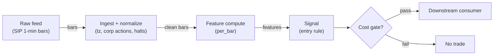

# S032 — Multi-asset crisis-regime filter

Six-component stress z-score (vol level, RV60, |ρ60|, 60-day drawdown, vol-of-vol, correlation dislocation) vs trailing-`1,260` days → `crisis_flag` at `score ≥ 0.9` [example] → AR(1) logistic `P(crisis tomorrow)`. A regime veto, not a directional signal. Provenance **[L]**.

> Tag law: every numeric literal in prose carries one of `[documented]
> [default] [example] [unverified] [internal-est] [measured]` (legend: Appendix
> i v1.0.0). Bibliographic years, volumes, pages, arXiv IDs, section numbers,
> rule codes (C1–C10), fail-safe codes (F1–F5), module IDs, batch keys, family
> letters, and machine-parsed §0 data fields are identifiers, not literals,
> and are exempt.

## §1 Five-minute reviewer card

| Row | Value |
|---|---|
| Module | S032 — Multi-asset crisis-regime filter, v1.0.0 |
| Edge verdict | `REGIME-FILTER` — practitioner-standard crisis overlay: z-score stress composites and logistic crisis-probability models are documented industry practice; no documented after-cost Sharpe for the standalone filter |
| After-cost | `BEFORE-COST` — Works as a portfolio-level veto: cutting risk into genuine crises avoids the left tail that dominates long-run returns; dies as a timing signal — late in (needs `1,260` days of history and realized stress), whipsaws on false positives, and vetoes the recovery rally |
| Build cost | Tier L · `4–12` h [internal-est] · `$600–1,800` loaded [internal-est] |
| Data cost | Research `~$30–200`/mo (SIP 1-min bars)` [unverified]; production `~$200`/mo + usage (SIP bars)` [unverified] — bands indicative, verify before budgeting |
| latency_class | bar-level / minutes |
| risk_class | low (signal-only; no order placement) |
| Capacity | `$50–250`/day notional [example] — illustrative; calibrate per venue |
| Executability | Feasible: Python+polars prototype; trivial compute |
| Risk summary | Late-by-construction: the score confirms stress after it arrives; AR(1) persistence means the veto lingers into recoveries. Binary crisis labels on a continuous score invite threshold-mining |
| When it dies | Flash crashes (score arrives after the damage); slow-burn regime changes (z-scores adapt away the stress); false-positive vetoes that miss rebounds; bond-equity correlation sign flips |
| Regime gates | Provisional: pending R001–R050 annotation |
| Emits | `signal_vector` (Appendix b v1.0.0) — never orders |

## §1.5 Cheapest / least-build path

1. **Prototype hour band:** `4–12` h [internal-est] — bar features + timestamp/halt handling + reference validation against the fixture.
2. **Cheapest-source row:** min_tier = Polygon.io Stocks Advanced — cheapest data source candidate [internal-est]; latency_class = bar-level / minutes; required_fields = 1-min OHLCV bars, corporate-action adjustments, session calendar; price_band = `~$30–200`/mo` [unverified] (indicative — verify before budgeting); build_or_buy = **build the estimator, buy the feed**.
3. **Resource budget:** `1` core, `<2` GB RAM for `500` symbols [internal-est]; compute pattern `per_bar`.
4. **Skip list:** tick-level variants; multi-venue aggregation; Rust ingest; colocated deployment.
5. **DO-NOT-CUT list:** causality assertions (`assert fill_event > signal_event`, no-signal-bar-fills test); COST block + callable `expected_cost_bps`; F1–F5 fail-safes + module-state enum + kill/safe-mode (`OFF`); decision-log audit records; bona-fide-intent + self-trade prevention; provenance tags on every numeric literal; fixtures + `test_cmd`; secrets via env only.
6. **Escalation gate:** upgrade from cheapest when any holds — live universe beyond the cheapest band; jitter persistently over budget; cost gate failing on `[measured]` costs; entitlement class changes.

## §S0 Module contract

### S0.1 Typed signature

```python
def signal(state: ModuleState, events: list[Event], cfg: Config) -> SignalVector:
```

`SignalVector` per Appendix b v1.0.0. `state` is the module-owned named state
vector (`closes`, `bond_closes`, `score_hist`, `crisis_hist`, `logistic_beta`, `module_state`); `events` are canonical Events (Appendix a v1.0.0),
newest last. The function handles documented edge cases: empty events →
`UNKNOWN`; invalid/missing prices → `UNKNOWN` (F1, never interpolate);
halt/auction events → freeze per the market-state table.

### S0.2 Config dataclass

| Parameter | Type | Default | Range | Status |
|---|---|---|---|---|
| `roll_window` | int | `60` | `20`–`90` | default |
| `z_window` | int | `1260` | `750`–`1500` | default |
| `crisis_threshold` | float | `0.9` | `0.5`–`1.5` | default |
| `cost_gate_k` | float | `0.5` | `0.1`–`2.0` | default |
| `cooldown_s` | float | `86400.0` | `0`–`604800` | default |

All defaults tagged per the tag law (status `default` ⇒ `[default]`).

### S0.3 Canonical schema mapping

Vendor columns → canonical Event schema (Appendix a v1.0.0), stated once here:

| Vendor | Canonical |
|---|---|
| `t` (ms) | `event_ts` (int64 ns UTC; ms→ns) |
| `o` / `h` / `l` / `c` | `open` / `high` / `low` / `close` |
| `v` | `volume` |
| `n` | `trade_count` |

### S0.4 Time contract

> Time contract: clock domain UTC, int64 ns; authoritative causality clock =
> `event_ts`; max_skew = `1` [default]; jitter budget = `500`
> [default]; bar-label = open time; staleness TTL = `180` [default]; gap
> policy = mask, no interpolation; halt/auction → discard contributions across
> reopen.

**Timing box:** `signal@t (per_bar, America/New_York) → earliest fill @open(t+1)`

### S0.5 Market-state table

| State | Module behavior |
|---|---|
| CONTINUOUS_TRADING | Compute normally; emit per cadence |
| HALTED | Freeze state; emit `UNKNOWN`; discard contributions across reopen |
| AUCTION | No new signals; hold last `SignalVector`; state `DEGRADED` |
| CLOSED | Emit nothing; state `OFF` |

### S0.6 Module-state enum + error taxonomy

States per Appendix k v1.0.0: `OK | DEGRADED | UNKNOWN | OFF`. Invalid input →
`UNKNOWN`, never interpolate (Appendix f v1.0.0, F1–F5). Kill/safe-mode: an
administrative kill or a bounds violation forces `OFF` until the runbook
re-arm checklist passes.

| Failure | State | Alert |
|---|---|---|
| Missing/stale input (TTL) | `UNKNOWN` | page |
| Bad bar (high<low, non-positive prices, crossed quotes) | `UNKNOWN` | log |
| Feature out of mathematical bounds (F2) | `UNKNOWN` | page |
| `seq` gap beyond tolerance | `DEGRADED` (restart windows) | log |
| Halt/auction | `UNKNOWN` / `DEGRADED` (per table) | log |
| Kill/administrative disable | `OFF` | page |
| Anything unmapped | `UNKNOWN` | page |

### S0.7 Ops tail

- **Schedule:** continuous during US equities regular session `09:30`–`16:00` America/New_York [documented]; owner: signals on-call.
- **Health checks:** fixture replay (`test_cmd`) green on deploy; `seq`-gap monitor; staleness watchdog at `180` [default].
- **Alert table:** page on `UNKNOWN` > `5` min [default] or bounds violation; notify on `DEGRADED`; log single dropped events.
- **Resource budget:** `1` vCPU, `2` GB RAM per `500` symbols [internal-est]; state is O(window) per symbol.
- **Runbook stub:** `1.` confirm feed; `2.` replay fixture; `3.` if red → set `OFF`, page; `4.` reconcile decision log before re-arm.

### S0.8 Secrets (env-only)

`POLYGON_API_KEY` via environment only. No secrets in this file, fixtures, or logs
(CI secrets-grep).

### S0.9 May / must-NOT

> **May:** emit `SignalVector` records per Appendix b v1.0.0. **Must-NOT:**
> emit orders, order intents, prices, share counts, or notionals; call a
> broker; mutate shared state outside `state`; interpolate across gaps.

## §S1 Legacy (subsumed by §1)

Legacy §S1 content is the §1 reviewer card above; this header is retained so
section numbering stays frozen.

## §S2 Specification

### Universe

Multi-asset: US equities (index or basket) AND investment-grade bonds AND USD for the correlation filter; daily bars; corporate-action-adjusted; full session calendar with half-day handling.

### Entry rule (Boolean — no prose-only conditions)

```
VETO := (regime_p >= 0.5) OR (crisis_flag == 1)          # defensive: de-risk / hedge, never a long call
STAND_DOWN := VETO  →  flatten or hedge directional exposure
RE-ARM     := (regime_p < 0.3) for 5 consecutive days [example]
               AND (expected_cost_bps(...) <= cost_gate_k * edge_bps)
NOTE       := this module emits direction -1/0 only (regime veto)
```

`edge_bps` = `2.0 × |regime_score|` bps [example] — stress-avoidance value of the veto.

### Exits (with post-exit cooldown)

```
EXIT_VETO := (regime_p < 0.3 for 5 days) [example] OR (module_state != OK)
ON_EXIT: cooldown_until = now + cooldown_s   # C10
```

### Position sizing (fenced function)

```python
def size_shares(risk_budget_R, stop_distance, vol_estimate, ADV_cap, cost):
    # S-module requests capital fraction only; share math lives in the strategy.
    risk_notional = risk_budget_R * 0.5 * confidence          # 0.5 [default] factor
    shares = risk_notional / max(stop_distance, 1e-9)        # 1e-9 [default] guard
    return int(min(shares, ADV_cap * adv_shares * 0.001))     # 0.1% ADV cap [default]
```

### Risk limits

| Limit | Value |
|---|---|
| Max capital fraction per signal | `0.5` [default] |
| Max adverse excursion before `UNKNOWN` review | `2.0`× stop [default] |
| Staleness kill | TTL `180` [default] → `UNKNOWN` |

### COST block (single source of truth)

| Component | Value (bps) | Basis |
|---|---|---|
| Spread (half-spread, liquid large-cap) | `0.50` | [example] |
| Fees (taker incl. regulatory) | `0.30` | [example] |
| Borrow | `0.0` | [default] — reason: reference build long-biased; shorts add C7 locate cost |
| Impact | `1.0` | [example] — flagged; calibrate per venue at scale-up |
| **Total reference** | `1.80` | [example] |

`fee_schedule_as_of`: `2026-09-01` [unverified] — placeholder; pin the real
venue schedule before production. `side: taker` [default]; venue/tier/source:
XNAS / Polygon SIP 1-min bars [example]. Re-stating cost numbers outside this block is a validation failure.

```python
def expected_cost_bps(notional, adv_pct, venue, side, urgency) -> float:
    # Callable cost model - reference stack, components from the COST block.
    spread_bps = 0.50   # [example]
    fee_bps = 0.30      # [example]
    borrow_bps = 0.0    # [default] long-biased reference; reason in table
    impact_bps = 1.0    # [example] flagged; calibrate per venue at scale-up
    if side == "maker":
        fee_bps = -0.20  # rebate [example]
    return spread_bps + fee_bps + borrow_bps + impact_bps
```

### Execution / fill model table

| Aspect | Assumption |
|---|---|
| Order type | `MARKET_ON_CLOSE` / `LIMIT` | daily rebalance of the hedge overlay — no intraday urgency | [example] |
| Session | `REGULAR` | daily bars; decisions at the close | [example] |
| Slippage | `0.50` bps [example] | index/bond-ETF scale | — |
| Fill model | `SAME_DAY_CLOSE` | veto computed at close $t$ applies to $t+1$ | [example] |

### Robustness

Z-window `750`–`1,500` days [example]: shorter adapts away slow-burn stress, longer needs decades of history. Crisis threshold `0.5`–`1.5` [example]: validate the veto's *avoided-drawdown* value out-of-sample, not in-sample crisis counts. The AR(1) coefficient should be positive and stable; a negative or explosive fit is a data bug. Stress-test the veto against 2008/2020-style gaps the synthetic tape cannot produce.

### Compliance sub-block (C1–C10+)

| Code | Rule: trigger → check → action → log |
|---|---|
| C1 | Self-match prevention: this S-module emits no orders; downstream consumers must set self-trade-prevention flags — asserted in the `consumes` contract → check: consumer ticket schema (Appendix c v1.0.0) has STP flag → action: block non-compliant consumers → log: `stp_assert` record |
| C2 | Bona-fide intent: every emitted `SignalVector` with direction ≠ `0` must pass the cost gate; sub-threshold features emit direction `0`, never a tradeable hint → check: `expected_cost_bps(...) <= k * edge_bps` → action: zero the direction on failure → log: `gate_veto` record |
| C3 | Message-rate: emissions capped per symbol per second [default] → check: rate monitor → action: throttle + alert → log: `throttle` record |
| C4 | Fat-finger trio (applied by consumers; this module bounds its own outputs): confidence ∈ [`0`,`1`], capital ∈ [`0`,`0.5`], computed_at sane → check: bounds on every emission → action: out-of-bounds → `UNKNOWN` (F2) → log: `bounds_veto` record |
| C5 | Decision log: every emission, veto, and state transition logged per Appendix g v1.0.0, hash-chained → check: log write ack → action: halt on write failure → log: the record itself |
| C6 | Halt/auction: per §S0.5 market-state table; contributions across reopen discarded → check: state feed → action: freeze/`DEGRADED` → log: `state_freeze` record |
| C7 | Locate check: SHORT direction requires `locate_ok` from the consumer; no SHORT without asserted locate (Reg-SHO threshold securities → direction `0`) → check: locate flag → action: zero SHORT on missing locate → log: `locate_veto` record |
| C8 | Public dissemination: no signal values published externally without review gate → check: export channel → action: block unreviewed export → log: `export_block` record |
| C9 | Data entitlements: per §S6 Data rights row → check: entitlement class on startup → action: entitlement change → §1.5 escalation gate → log: `entitlement` record |
| C10 | Post-exit cooldown: `cooldown_s` after any exit or compliance block; no re-entry → check: `now >= cooldown_until` → action: suppress entries → log: `cooldown` record |
| C11 | No-direction representation: regime veto state must be labeled defensive/risk, never buy/sell → check: label on outputs → action: block mislabeled dissemination → log: `label_check` record |
| C12 | Fixture simplification disclosure: the reference fits the AR(1) logistic once on the final training window; production refits daily → check: disclosure present → action: block production use of the reference fit → log: `fit_cadence` record |

### Parameter table

| Parameter | Symbol | Value | Tag | Sensitivity |
|---|---|---|---|---|
| Rolling window | `W` | `60` days | [default] | medium |
| Z-score window | `Z` | `1260` days | [default] | high |
| Crisis threshold | — | `0.9` | [default] | high |
| Logistic penalty | `λ` | `1.0` | [default] | low |
| Veto / re-arm | — | `0.5` / `0.3` | [default] | medium |

### Timing box

`signal@t (per_bar, America/New_York) → earliest fill @open(t+1)`

## §S3 Math + normative pseudocode

Daily log returns $r_t = \ln(C_t/C_{t-1})$; rolling vol $\sigma_{60}(t) = \sqrt{252}\,\mathrm{sd}(r_{t-59:t})$, realized vol $RV_{60}(t) = \sqrt{252\,\overline{r^2}_{60}}$, equity–bond correlation $\rho_{60}(t)$, drawdown $DD_{60}(t)$, vol-of-vol $\mathrm{sd}(\sigma_{60}, 20)$.

$$z_i(t) = \frac{c_i(t) - \mu_{1260}(c_i)}{\sigma_{1260}(c_i)}, \qquad S_t = \frac{1}{6}\sum_{i=1}^{6} z_i(t), \qquad \mathrm{crisis}_t = \mathbf{1}[S_t \ge 0.9]$$

$$P(\mathrm{crisis}_{t+1}) = \sigma(\beta_0 + \beta_1 S_t)$$

fit by ridge-penalized Newton–Raphson on the trailing `1,260` days (the reference implementation fits once on the final training window as a fixture simplification; production refits daily). Causal timing: everything at day $t$ uses data $\le t$; the veto applies to $t+1$'s session. The filter is late by construction — it confirms stress after arrival.

**Normative pseudocode** (pseudocode is normative; prose is commentary):

```
function signal(state, events, cfg) -> SignalVector:
    assert events non-empty else return UNKNOWN                    # F1
    e = events[-1]
    assert valid(e) else return UNKNOWN                            # F1/F2: never interpolate
    r_t = ln(C_t / C_{t-1}); rollvol = sqrt(252)*sd(r, 60); rv60 = sqrt(252*mean(r^2, 60))
    rho60 = corr(r_eq, r_bond, 60); dd = (max(C,60) - C)/max(C,60); vov = sd(rollvol, 20)
    z_i = (c_i - mean(c_i, 1260)) / sd(c_i, 1260); score = mean(z_1..z_6)
    crisis = (score >= 0.9); regime_p = logistic(b0 + b1*score_{t-1})  # AR(1), ridge fit
    edge_bps = 2.0 * abs(f["regime_score"])                                       # [example]
    cost_ok = expected_cost_bps(...) <= k * edge_bps
    # ^^^ normative cost-gate predicate: expected_cost_bps(...) <= k * edge_bps
    direction = entry_rule(e, features, cost_ok, cfg)              # §S2 Boolean rule
    confidence = min(1, conviction(features)) if direction != 0 else 0
    capital = 0.5 * confidence                                     # 0.5 [default]
    sig = SignalVector(symbol=e.symbol, direction, confidence, capital,
                       computed_at=e.event_ts, staleness=now()-e.asof_ts,
                       module_state=state.module_state)
    log_decision(sig, inputs_hash, params_hash)                    # C5 / Appendix g
    assert fill_event > signal_event                               # t→t+1: no signal-bar fills
    return sig
```

Causality: features at event/bar `t` use only data `≤ t`; earliest reaction is
`t+1`. Mandatory unit test: no-signal-bar fills.

## §S4 Worked example (fixture-backed)

- Tape: `modules/fixtures/S032_tape.csv` — `# TYPE: validation-run`;
  `1,950` synthetic daily closes (seed `32`): `1,200` calm + `650` stressed + `100` crash + `30` fresh days for SPX-style equity and AGG-style bond series. All numbers synthetic, seed `32` [example]; timestamps int64 ns UTC.
- Expected outputs: `modules/fixtures/S032_expected.csv` — `rollvol`, `rv60` (annualized), `rollcor60`, `drawdown`, `volofvol`, `regime_score` (mean of 6 trailing-`1,260`-day z-scores), `crisis_flag`, `regime_flag`, `regime_p` per day; warmup rows carry NaN and `0` flags (first scored day `d1341`).
- Tolerance: `1e-9` on floats; integer counts exact.
- Acceptance tests (`modules/tests/test_S032.py`, `5` tests):
  `1.` fixture recomputes to expected (day-`1900` mid-crash: `rollvol≈49.75`%, `rv60≈49.66`%, `ρ60≈0.865`, `score≈1.937` → `crisis=1`, `regime_p≈0.9996` — hand-checks); `2.` stub emits valid `SignalVector` (direction `-1`/`0`: regime veto); `3.` no-signal-bar fills (`fill_event_ts > computed_at`); `4.` cost-gate predicate passes on large edge, blocks on tiny edge (`k = 0.5` [default]); `5.` invalid input (negative close) → `UNKNOWN`.
- `test_cmd`: `python3 -m pytest modules/tests/test_S032.py -q` → exits `0`.

**Hand-check:** day `1900` (mid-crash, operator-verified on the synthetic tape): `rollvol = 49.75`% [example], `rv60 = 49.66`% [example], `ρ60 = 0.865` [example], `drawdown = 17.57`% [example], `regime_score = 1.937` [example] → `crisis_flag = 1`, `regime_p = 0.9996` [example] → `regime_flag = 1`. Asserted in the test.

**Where the example is optimistic:** no fees, no latency, no partial fills, no corporate-action surprises — arithmetic illustration, not a backtest.

## §S5 Strategies that use this signal

Generated from `deps.yaml` (CI symmetry); hand-listed here:

| Strategy | Role |
|---|---|
| T010 — Crisis-Hedge Overlay | The filter's home strategy: systematic de-risk/hedge on veto |
| T001 — Multi-Signal Ensemble | Regime gate: downstream signals sized down or vetoed under crisis |

## §S6 Data required

| Field | Type | Granularity | Source tier | Notes |
|---|---|---|---|---|
| Equity daily bars | float | daily | Tier 1 | Index or basket; corporate-action-adjusted |
| Bond daily bars | float | daily | Tier 1 | Investment-grade aggregate |
| USD index | float | daily | Tier 1 | Correlation filter leg |
| Session calendar | reference | daily | Tier 0/1 | Half-day and holiday handling |

**Data rights row** (Appendix j v1.0.0): Index/bond data via licensed vendor (e.g., Polygon Stocks Advanced / ICE), `rights: licensed`; scope = research + stated production use; raw series never leave our systems — fixtures are synthetic; entitlement = professional/internal; retention per vendor terms, purge path in runbook; derived features ours.

## §S7 Local build (M5 Max / 128 GB)

Feasible: easy. Daily cadence; the whole `1,950`-day pipeline (rolling sums, z-scores, one logistic fit) runs in under a second in pure Python. Production adds a daily refit — still trivial. Tier L per `notes/cost-model.md` §5: `4–12` h ≈ `$600–1,800` [internal-est] at `$150`/hr loaded.

## §S8 Buy vs build

| Tier-0 (Stooq/FRED) | Daily index data, free | ~`$0` | Free prototyping | No redistribution; limited history |
| Tier-1 (Polygon/ICE via vendor) | Daily bars, corp actions | ~`$30–200`/mo | Clean adjusted series | Nothing material |
| Risk-vendor stress module | Pre-built regime scores | ~`$2k–20k`/yr | Audited methodology | Opaque thresholds; weak customization |

**Verdict:** build. A z-score composite and a 2-parameter logistic are an afternoon's work; buy only the underlying daily data feed.

## §S9 Efficacy — documented evidence

| Study / source | Market & period | Metric | Before/after cost | Caveat |
|---|---|---|---|---|
| IMF GFSR (Oct 2023) | Multi-asset | Risk-appetite / risk-off measurement framework | `BEFORE-COST` (framework) | Supports the composite-score approach, not any threshold |
| BIS Quarterly Review (Dec 2022), margin procyclicality | Derivatives/collateral | Stress-propagation mechanism through margin spirals | `BEFORE-COST` (mechanism) | The economic reason a crisis veto has value |
| Pukthuanthong-Le & Corbett (2024) | Multi-asset | Regime-switching and tail-risk literature | `BEFORE-COST` (literature) | Academic backing for regime-dependent risk |

**Selection disclosure:** the `3` crisis/regime sources from the chapter's research pass; the specific six-component composite and `0.9` threshold are the chapter's construction [unverified].

### Regime gates (machine records, provisional — pending R001–R050 annotation)

| regime_id | direction | mechanism | condition | action | min_lag | unknown_behavior |
|---|---|---|---|---|---|---|
| R001 | is-the-regime | the module IS a regime filter: crisis state vetoes directional strategies | crisis_flag | veto | `5` days [default] | veto |
| R002 | degrades | false-positive vetoes: stress scores that mean-revert without crisis | whipsaw_rate | veto | `5` days [default] | veto |
| R003 | degrades | recovery rallies under lingering veto (AR(1) persistence) | regime_p decay | re-arm rule | `5` days [default] | veto |

## §S10 Failure modes & pitfalls

| # | Trigger → Detect → Action → Recovery | check: |
|---|---|
| 1 | Late by construction: score confirms stress after arrival → detect: veto lag vs drawdown start → action: accept as overlay, never as timing → recovery: re-characterize lag | `check: lag_measured` |
| 2 | Threshold mining on `0.9`: binary labels on a continuous score → detect: OOS crisis-count decay → action: validate avoided-drawdown OOS → recovery: re-pin threshold | `check: oos_value > 0` |
| 3 | Z-window adapting away slow-burn stress → detect: score decay under sustained stress → action: lengthen window or add level terms → recovery: re-validate | `check: score_persistent` |
| 4 | Bond-equity correlation sign flips (the filter's key input) → detect: ρ60 sign monitoring → action: re-examine composite weights → recovery: re-fit | `check: rho_sign_stable` |
| 5 | Logistic misfit: negative/explosive β1 → detect: coefficient sanity bounds → action: `UNKNOWN`, fall back to rule veto → recovery: re-fit with penalty | `check: 0 < beta1 < 20` |
| 6 | Data errors: unadjusted splits corrupt vol and drawdown → detect: corporate-action monitor → action: `UNKNOWN`, mask → recovery: backfill adjusted series | `check: split_adjusted` |
| 7 | Lookahead: fitting the logistic on data past day `t` → detect: causality audit → action: halt, fix training window → recovery: re-run no-signal-bar-fills test | `check: all(fill_ts > computed_at)` |
| 8 | Cost blowup: daily hedge churn under flickering veto → detect: cost gate failing on `[measured]` costs → action: re-arm hysteresis (`0.5`/`0.3`) → recovery: re-pin fee schedule | `check: expected_cost_bps(...) <= k * edge_bps` |

## §S11 Visuals

Figure: `batches figure (see §0 `plot_script`)` (synthetic, seed `32` [example]).



## §S12 Source log + unverified leads

**Sources** (citable facts only):

1. Pukthuanthong-Le, K. & Corbett, A. (2024) — regime-switching, tail-risk, and safe-haven literature [documented].
2. IMF — *Global Financial Stability Report* (Oct 2023) [documented]: risk-off / risk-appetite measurement.
3. Risk.net — Chartis RiskTech100 2025: RiskTech Quadrant for ALM: SS&C Algorithmics (2024) [documented]: stress-testing vendor methodology context.
4. BIS — *Quarterly Review* (Dec 2022), special feature on margin procyclicality [documented]: margin-spiral / stress-propagation mechanism.
5. Practitioner documentation on z-score regime filters and AR(1) crisis-probability overlays (chapter synthesis) [I].

**Chatbot source log.** Duck.ai (GPT-5.6 Luna, anonymous) answered Q-SB2-1 (`2026-09-10`); Grok/Cursor answers pending (checked `2026-09-10`).

**Unverified leads** (chatbot-only — never in evidence tables):

- Duck.ai Q-SB2-1: multi-asset crisis filter design — AR(`1`) persistence model, z-score composite vs `1,260`-day history, logistic crisis probability, vol-of-vol as the early-warning component [unverified]; vol-clustering evidence pointers (CBOE white papers, Bakshi-Kapadia 2003) [unverified].

---

## Appendix — AI build prompt (S032)

Copy-paste into any chat agent:

> Build module **S032 — Multi-asset crisis-regime filter** per `notes/module-template.md` v1.0.0
> and this file's §S0 contract. Cheapest path (§1.5): prototype
> `4–12` h [internal-est]; cheapest data candidate
> Polygon.io Stocks Advanced [internal-est]; compute pattern `per_bar`.
> Implement `signal(state, events, cfg) -> SignalVector` (Appendix b v1.0.0)
> with the §S3 normative pseudocode, including the cost-gate predicate
> `expected_cost_bps(...) <= k * edge_bps` and `assert fill_event >
> signal_event`. Wire F1–F5 (Appendix f v1.0.0): invalid input → `UNKNOWN`,
> never interpolate. Log decisions per Appendix g v1.0.0. Secrets via env
> only. Run the fixture `modules/fixtures/S032_tape.csv`
> (`# TYPE: validation-run`) against `modules/fixtures/S032_expected.csv`
> (tolerance `1e-9`).
> **Definition of done:** `python3 -m pytest modules/tests/test_S032.py -q`
> exits `0`. Tag every numeric literal you add with the unified enum
> (Appendix i v1.0.0); put anything unverifiable in §S12 unverified leads.
