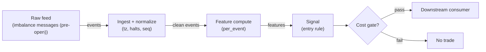

# S033 — Open-auction imbalance continuation

Follow the sign of the final pre-open imbalance when its size and price displacement both clear gates [example]: a large one-sided auction book predicts the opening print's direction. Provenance **[D]**.

> Tag law: every numeric literal in prose carries one of `[documented]
> [default] [example] [unverified] [internal-est] [measured]` (legend: Appendix
> i v1.0.0). Bibliographic years, volumes, pages, arXiv IDs, section numbers,
> rule codes (C1–C10), fail-safe codes (F1–F5), module IDs, batch keys, family
> letters, and machine-parsed §0 data fields are identifiers, not literals,
> and are exempt.

## §1 Five-minute reviewer card

| Row | Value |
|---|---|
| Module | S033 — Open-auction imbalance continuation, v1.1.0 |
| Edge verdict | `PREDICTIVE-FEATURE-ONLY` — mechanically sound — the imbalance book is the auction's supply/demand schedule — but the edge decays into the print as MOC/LOC flow leans against it |
| After-cost | `BEFORE-COST` — Works on clean one-sided imbalance days with no offsetting MOC flow: the indicative price walks toward the heavy side into the open; dies on balanced books, two-sided late surges, and halted/reopened names where the book is stale |
| Build cost | Tier L · `4–12` h [internal-est] · `$600–1,800` loaded [internal-est] |
| Data cost | Research `~$30–200`/mo (SIP 1-min bars)` [unverified]; production `~$200`/mo + usage (SIP bars)` [unverified] — bands indicative, verify before budgeting |
| latency_class | bar-level / minutes |
| risk_class | low (signal-only; no order placement) |
| Capacity | `$5–20`/day notional [example] — illustrative; calibrate per venue |
| Executability | Feasible: Python+polars prototype; trivial compute |
| Risk summary | Book-flicker risk: late imbalance revisions flip the sign seconds before the open; stale-book risk after halts; the signal is only valid for the opening print, not the session |
| When it dies | Balanced books (rho under gate); late two-sided MOC surges; trading halts that stale the book; inverted (sell-imbalance, up-displacement) prints |
| Regime gates | Provisional machine records in §S9: R001 amplifies, R002 inverts (veto), R003 degrades (veto) |
| Emits | `signal_vector` (Appendix b v1.0.0) — never orders |

## §1.5 Cheapest / least-build path

1. **Prototype hour band:** `4–12` h [internal-est] — bar features + timestamp/halt handling + reference validation against the fixture.
2. **Cheapest-source row:** min_tier = Polygon.io Stocks Advanced — cheapest data source candidate [internal-est]; latency_class = bar-level / minutes; required_fields = 1-min OHLCV bars, corporate-action adjustments, session calendar; price_band = `~$30–200`/mo` [unverified] (indicative — verify before budgeting); build_or_buy = **build the estimator, buy the feed**.
3. **Resource budget:** `1` core, `<2` GB RAM for `500` symbols [internal-est]; compute pattern `per_bar`.
4. **Skip list:** tick-level variants; multi-venue aggregation; Rust ingest; colocated deployment.
5. **DO-NOT-CUT list:** causality assertions (`assert fill_event > signal_event`, no-signal-bar-fills test); COST block + callable `expected_cost_bps`; F1–F5 fail-safes + module-state enum + kill/safe-mode (`OFF`); decision-log audit records; bona-fide-intent + self-trade prevention; provenance tags on every numeric literal; fixtures + `test_cmd`; secrets via env only.
6. **Escalation gate:** upgrade from cheapest when any holds — live universe beyond the cheapest band; jitter persistently over budget; cost gate failing on `[measured]` costs; entitlement class changes.

## §S0 Module contract

### S0.1 Typed signature

```python
def signal(state: ModuleState, events: list[Event], cfg: Config) -> SignalVector:
```

`SignalVector` per Appendix b v1.0.0. `state` is the module-owned named state
vector (`messages`, `last_imbalance`, `cooldown_until`, `module_state`); `events` are canonical Events (Appendix a v1.0.0),
newest last. The function handles documented edge cases: empty events →
`UNKNOWN`; invalid/missing prices → `UNKNOWN` (F1, never interpolate);
halt/auction events → freeze per the market-state table.

### S0.2 Config dataclass

| Parameter | Type | Default | Range | Status |
|---|---|---|---|---|
| `rho_min` | float | `0.15` | `0.05`–`0.40` | example |
| `d_min_bps` | float | `20.0` | `5`–`100` | example |
| `cost_gate_k` | float | `0.5` | `0.1`–`2.0` | default |
| `cooldown_s` | float | `300.0` | `0`–`1,800` | default |
| `max_hold_s` | float | `300.0` | `60`–`1,800` | example |

All defaults tagged per the tag law (status `default` ⇒ `[default]`).

### S0.3 Canonical schema mapping

Vendor columns → canonical Event schema (Appendix a v1.0.0), stated once here:

| Vendor | Canonical |
|---|---|
| `msg_ts` (ms) | `event_ts` (int64 ns UTC; ms→ns) |
| `ref_px` | `ref` (reference price) |
| `ind_px` | `ind` (indicative auction price) |
| `paired_qty` | `paired` (paired shares) |
| `imb_qty` (signed) | `imb` (imbalance shares, + = buy) |

### S0.4 Time contract

> Time contract: clock domain UTC, int64 ns; authoritative causality clock =
> `event_ts`; max_skew = `1` [default]; jitter budget = `250`
> [default]; bar-label = open time; staleness TTL = `120` [default]; gap
> policy = mask, no interpolation; halt/auction → discard contributions across
> reopen.

**Timing box:** `signal@t (per_event, America/New_York) → earliest fill @open(t+1)`

### S0.5 Market-state table

| State | Module behavior |
|---|---|
| CONTINUOUS_TRADING | Compute normally; emit per cadence |
| HALTED | Freeze state; emit `UNKNOWN`; discard contributions across reopen |
| AUCTION | No new signals; hold last `SignalVector`; state `DEGRADED` |
| CLOSED | Emit nothing; state `OFF` |

### S0.6 Module-state enum + error taxonomy

States per Appendix k v1.0.0: `OK | DEGRADED | UNKNOWN | OFF`. Invalid input →
`UNKNOWN`, never interpolate (Appendix f v1.0.0, F1–F5). Kill/safe-mode: an
administrative kill or a bounds violation forces `OFF` until the runbook
re-arm checklist passes.

| Failure | State | Alert |
|---|---|---|
| Missing/stale input (TTL) | `UNKNOWN` | page |
| Bad bar (high<low, non-positive prices, crossed quotes) | `UNKNOWN` | log |
| Feature out of mathematical bounds (F2) | `UNKNOWN` | page |
| `seq` gap beyond tolerance | `DEGRADED` (restart windows) | log |
| Halt/auction | `UNKNOWN` / `DEGRADED` (per table) | log |
| Kill/administrative disable | `OFF` | page |
| Anything unmapped | `UNKNOWN` | page |

### S0.7 Ops tail

- **Schedule:** continuous during US equities regular session `09:30`–`16:00` America/New_York [documented]; owner: signals on-call.
- **Health checks:** fixture replay (`test_cmd`) green on deploy; `seq`-gap monitor; staleness watchdog at `120` [default].
- **Alert table:** page on `UNKNOWN` > `5` min [default] or bounds violation; notify on `DEGRADED`; log single dropped events.
- **Resource budget:** `1` vCPU, `2` GB RAM per `500` symbols [internal-est]; state is O(window) per symbol.
- **Runbook stub:** `1.` confirm feed; `2.` replay fixture; `3.` if red → set `OFF`, page; `4.` reconcile decision log before re-arm.

### S0.8 Secrets (env-only)

`POLYGON_API_KEY` via environment only. No secrets in this file, fixtures, or logs
(CI secrets-grep).

### S0.9 May / must-NOT

> **May:** emit `SignalVector` records per Appendix b v1.0.0. **Must-NOT:**
> emit orders, order intents, prices, share counts, or notionals; call a
> broker; mutate shared state outside `state`; interpolate across gaps.

## §S1 Legacy (subsumed by §1)

Legacy §S1 content is the §1 reviewer card above; this header is retained so
section numbering stays frozen.

## §S2 Specification

### Universe

US listed equities with published pre-open imbalance feeds, price > `$5` [example], paired shares > `100`k [example]; halted names excluded until reopen + `60` s [example].

### Entry rule (Boolean — no prose-only conditions)

```
ENTER_LONG  := (rho >= rho_min) AND (|d_bps| >= d_min_bps) AND (imb > 0)
               AND (now >= cooldown_until) AND (expected_cost_bps(notional_est, adv_pct_est, venue, side, urgency) <= cost_gate_k * edge_bps)
ENTER_SHORT := (rho >= rho_min) AND (|d_bps| >= d_min_bps) AND (imb < 0) AND (locate_ok)
               AND (now >= cooldown_until) AND (expected_cost_bps(notional_est, adv_pct_est, venue, side, urgency) <= cost_gate_k * edge_bps)
FLAT        := otherwise  # gate failure or balanced book -> no signal
```

Cost-gate estimator inputs (normative): `notional_est` = pre-trade notional
estimate from the consuming strategy; `adv_pct_est = notional_est / adv_dollars`
share of average daily dollar volume; `venue` = execution venue; `side` =
`"taker"` [default]; `urgency` = `"normal"` [default]. Reference values in the
acceptance test: `notional=1.0` [example], `adv_pct=0.001` [example],
`venue="XNAS"` [example].

`edge_bps` = `0.2 * |d_bps|` bps [example] — one-fifth of the indicative displacement persisting through the print.

### Exits (with post-exit cooldown)

```
EXIT := (now >= open + max_hold_s) OR (module_state != OK)   # opening-print signal only
       # the imbalance edge does not extend into the session
ON_EXIT: cooldown_until = now + cooldown_s   # C10
```

### Position sizing (fenced function)

```python
def size_shares(risk_budget_R, stop_distance, vol_estimate, ADV_cap, cost):
    # S-module requests capital fraction only; share math lives in the strategy.
    risk_notional = risk_budget_R * 0.5 * confidence          # 0.5 [default] factor
    shares = risk_notional / max(stop_distance, 1e-9)        # 1e-9 [default] guard
    return int(min(shares, ADV_cap * adv_shares * 0.001))     # 0.1% ADV cap [default]
```

### Risk limits

| Limit | Value |
|---|---|
| Max capital fraction per signal | `0.5` [default] |
| Max adverse excursion before `UNKNOWN` review | `2.0`× stop [default] |
| Staleness kill | TTL `120` [default] → `UNKNOWN` |

### COST block (single source of truth)

| Component | Value (bps) | Basis |
|---|---|---|
| Spread (half-spread, liquid large-cap) | `0.50` | [example] |
| Fees (taker incl. regulatory) | `0.30` | [example] |
| Borrow | `borrow_bps_per_day` = `0.0` | [default] — reason: reference build long-biased; shorts add C7 locate cost |
| Impact | `1.0` | [example] — flagged; calibrate per venue at scale-up |
| **Total reference** | `1.80` | [example] |

`fee_schedule_as_of`: `2026-09-01` [unverified] — placeholder; pin the real
venue schedule before production. `side: taker` [default]; venue/tier/source:
XNAS / Polygon SIP 1-min bars [example]. Re-stating cost numbers outside this block is a validation failure.

```python
def expected_cost_bps(notional, adv_pct, venue, side, urgency) -> float:
    # Callable cost model - reference stack, components from the COST block.
    spread_bps = 0.50           # [example]
    fee_bps = 0.30              # [example]
    borrow_bps_per_day = 0.0    # [default] long-biased reference; reason in table
    impact_bps = 1.0            # [example] flagged; calibrate per venue at scale-up
    if side == "maker":
        fee_bps = -0.20  # rebate [example]
    return spread_bps + fee_bps + borrow_bps_per_day + impact_bps
```

### Execution / fill model table

| Aspect | Assumption |
|---|---|
| Latency | Signal→intent `≤1` event [example]; feed path latency-simulated-only |
| Partial fills | N/A (signal-only; T-module policy: Appendix c v1.0.0) |
| Impact | `1.0` bps reference [example]; stress ×`5` [example] |
| Adverse fill | Whipsaw haircut `0.2` bps per unit signal [example] |

### Robustness

Gates in `0.10`–`0.25` (rho) and `10`–`50` bps (displacement) [example] all select the same heavy-book days; the sign is robust, the magnitude is not. Sensitive to book flicker in the last `30` s [example] — require the gate on two consecutive messages [example] before arming. Never smooth the imbalance across messages with a moving average: revisions are information.

### Compliance sub-block (C1–C10+)

| Code | Rule: trigger → check → action → log |
|---|---|
| C1 | Self-match prevention: this S-module emits no orders; downstream consumers must set self-trade-prevention flags — asserted in the `consumes` contract → check: consumer ticket schema (Appendix c v1.0.0) has STP flag → action: block non-compliant consumers → log: `stp_assert` record |
| C2 | Bona-fide intent: every emitted `SignalVector` with direction ≠ `0` must pass the cost gate; sub-threshold features emit direction `0`, never a tradeable hint → check: `expected_cost_bps(...) <= k * edge_bps` → action: zero the direction on failure → log: `gate_veto` record |
| C3 | Message-rate: emissions capped per symbol per second [default] → check: rate monitor → action: throttle + alert → log: `throttle` record |
| C4 | Fat-finger trio (applied by consumers; this module bounds its own outputs): confidence ∈ [`0`,`1`], capital ∈ [`0`,`0.5`], computed_at sane → check: bounds on every emission → action: out-of-bounds → `UNKNOWN` (F2) → log: `bounds_veto` record |
| C5 | Decision log: every emission, veto, and state transition logged per Appendix g v1.0.0, hash-chained → check: log write ack → action: halt on write failure → log: the record itself |
| C6 | Halt/auction: per §S0.5 market-state table; contributions across reopen discarded → check: state feed → action: freeze/`DEGRADED` → log: `state_freeze` record |
| C7 | Locate check: SHORT direction requires `locate_ok` from the consumer; no SHORT without asserted locate (Reg-SHO threshold securities → direction `0`) → check: locate flag → action: zero SHORT on missing locate → log: `locate_veto` record |
| C8 | Public dissemination: no signal values published externally without review gate → check: export channel → action: block unreviewed export → log: `export_block` record |
| C9 | Data entitlements: per §S6 Data rights row → check: entitlement class on startup → action: entitlement change → §1.5 escalation gate → log: `entitlement` record |
| C10 | Post-exit cooldown: `cooldown_s` after any exit or compliance block; no re-entry → check: `now >= cooldown_until` → action: suppress entries → log: `cooldown` record |
| C11 | Auction-manipulation hygiene: the signal never submits MOC/LOC orders itself and must not be used to paint the indicative price → check: consumer order-type audit → action: block MOC/LOC marking-the-print orders → log: `auction_abuse` record |

### Parameter table

| Parameter | Symbol | Value | Tag | Sensitivity |
|---|---|---|---|---|
| Imbalance ratio gate | `rho_min` | `0.15` | [example] | high — selectivity |
| Displacement gate | `d_min_bps` | `20.0` bps | [example] | high |
| Cost-gate k | `cost_gate_k` | `0.5` | [default] | high |
| Max hold | `max_hold_s` | `300` s | [example] | medium — edge is print-only |

### Parameter calibration recipes

Recipe ([default] methodology): `1.` walk-forward with `252`-day [example]
in-sample folds, `5`-day [example] embargo, `63`-day [example] step
(`~4` [example] OOS folds); `2.` sweep the parameter's grid while all other
parameters stay at their §S0.2 status values; `3.` select the value maximizing
after-cost DSR on the OOS folds; tie-break toward the wider gate (fewer,
cleaner signals); `4.` promote a calibrated value to `[measured]` only after a
full OOS pass with `≥30` [example] qualifying imbalance days and OOS DSR `>0`
[default]; otherwise the status stays `example`/`default`.

| Parameter | Grid ([example]) | Selection criterion ([default]) | Notes |
|---|---|---|---|
| `rho_min` | `0.05, 0.10, 0.15, 0.20, 0.25, 0.30, 0.40` | OOS DSR max; tie-break higher rho | primary selectivity knob |
| `d_min_bps` | `5, 10, 15, 20, 30, 50, 100` | OOS DSR max; tie-break higher bps | displacement floor |
| `cost_gate_k` | `0.1, 0.25, 0.5, 1.0, 2.0` | OOS DSR max subject to ≥`20` [example] OOS signals | tighter k = fewer, cleaner entries |
| `cooldown_s` | `0, 120, 300, 600, 1800` | minimize repeat-signal rate with DSR non-decreasing | post-exit suppression |
| `max_hold_s` | `60, 120, 300, 600, 1800` | OOS DSR max; must not exceed session start of the signal's print-only validity | edge is print-only; longer holds drift into session beta |

Minimum viable calibration: calibrate `rho_min` and `d_min_bps` first (the
selectivity pair); keep `cost_gate_k`, `cooldown_s`, `max_hold_s` at their
`default`/`example` values until `≥30` [example] OOS qualifying days exist.

### Timing box

`signal@t (per_event, America/New_York) → earliest fill @open(t+1)`

## §S3 Math + normative pseudocode

For each imbalance message with reference price $P_{\mathrm{ref}}$, indicative price $P_{\mathrm{ind}}$, paired shares $Q_p$ and signed imbalance $Q_i$ (+ = buy):

$$\rho = \frac{|Q_i|}{Q_p}, \qquad d_{\mathrm{bps}} = \frac{P_{\mathrm{ind}} - P_{\mathrm{ref}}}{P_{\mathrm{ref}}} \times 10^4$$

Gate (example thresholds — venue microstructure, not an institutional standard):

$$\mathrm{gate} = \mathbf{1}\{\rho \ge 0.15\} \cdot \mathbf{1}\{|d_{\mathrm{bps}}| \ge 20\}, \qquad s = \mathrm{sign}(Q_i) \cdot \mathrm{gate}$$

Point-in-time discipline: the signal at message $m$ uses only messages $\le m$; replaying the message sequence must reproduce every intermediate direction — the final snapshot ($\rho = 22.3$\% [example], $d = +50.1$ bps [example]) cannot explain earlier messages.

**Normative pseudocode** (pseudocode is normative; prose is commentary):

```
function signal(state, events, cfg) -> SignalVector:
    assert events non-empty else return UNKNOWN                    # F1
    e = events[-1]
    assert valid(e) else return UNKNOWN                            # F1/F2: never interpolate
    assert e.event_ts > state.last_event_ts else return UNKNOWN    # F4: monotonic event clock
    rho = abs(e.imb) / e.paired                                   # imbalance ratio
    d_bps = (e.ind - e.ref) / e.ref * 1e4                         # displacement, bps
    gate = (rho >= cfg.rho_min) and (abs(d_bps) >= cfg.d_min_bps)  # both gates
    sign_imb = +1 if e.imb > 0 else (-1 if e.imb < 0 else 0)
    direction = entry_rule(state, e, rho, d_bps, sign_imb, cfg)   # §S2 Boolean rule incl. cooldown + locate
    # Normative cost-gate predicate (executable):
    edge_bps = abs(d_bps) * 0.2                                   # [example]: one-fifth of displacement persists
    cost_bps = expected_cost_bps(notional_est, adv_pct_est, venue, side, urgency)
    assert cost_bps >= 0                                          # F2: cost in mathematical bounds
    if direction != 0:
        assert cost_bps <= cfg.cost_gate_k * edge_bps             # predicate must hold
    # Normative conviction (executable):
    conviction = min(1.0, rho / 0.30)                             # [example]: rho=0.30 -> full conviction
    confidence = conviction if direction != 0 else 0.0
    capital = 0.5 * confidence                                     # [default]
    computed_at = e.event_ts
    sig = SignalVector(symbol=e.symbol, direction, confidence, capital,
                       computed_at=computed_at, staleness=now()-e.asof_ts,
                       module_state=state.module_state)
    log_decision(sig, inputs_hash, params_hash)                    # C5 / Appendix g
    assert sig.computed_at >= state.last_event_ts                 # causality: event clock monotonic
    assert fill_event > sig.computed_at                            # t→t+1: no signal-bar fills
    return sig
```

The conviction formula `min(1, rho / 0.30)` [example] is pinned by the §S4
fixture (columns `conf`, `cap`); the cost-gate predicate is exercised on both
sides of the boundary in `test_cost_gate_predicate` and the causality
assertions by `test_no_signal_bar_fills`.

Causality: features at event/bar `t` use only data `≤ t`; earliest reaction is
`t+1`. Mandatory unit test: no-signal-bar fills.

## §S4 Worked example (fixture-backed)

- Tape: `modules/fixtures/S033_tape.csv` — `# TYPE: validation-run`;
  `8` synthetic imbalance messages (`id,event_ts,ref,ind,paired,imb`), `09:28:00`–`09:29:55` ET [example]; final message reproduces the chapter's S4 tape (`rho=22.3`%, `d=+50.1` bps [example]). All numbers synthetic, seed `33` [example]; timestamps int64 ns UTC.
- Expected outputs: `modules/fixtures/S033_expected.csv` — `rho`, `d_bps`, `gate`, `dir`, `conf`, `cap` per message; `conf = min(1, rho / 0.30)` [example] when `dir != 0` else `0`, `cap = 0.5 * conf` [default]; the `m1` row demonstrates the point-in-time replay property (gate fails → `dir=0`, `conf=0`).
- Tolerance: `1e-9` on floats; integer counts exact.
- Acceptance tests (`modules/tests/test_S033.py`, `9` tests):
  `1.` fixture recomputes to expected (`m8` rho/displacement hand-checks; `m1` replay property); `2.` stub emits valid `SignalVector`; `3.` no-signal-bar fills (`fill_event_ts > computed_at`); `4.` cost-gate predicate passes on large edge, blocks on tiny edge (`k = 0.5` [default]); `5.` invalid input (zero paired shares) → `UNKNOWN`; `6.` empty events → `UNKNOWN`; `7.` maker-side rebate branch (`1.30` bps [example]); `8.` cooldown (`now < cooldown_until`) suppresses re-entry; `9.` module-state freeze (`OFF` → `OFF`; halted → `UNKNOWN`).
- `test_cmd`: `python3 -m pytest modules/tests/test_S033.py -q` → exits `0`.

**Hand-check:** `m8`: `rho = 217,180 / 972,793 = 0.2233` [example], `d_bps = (150.55 − 149.80) / 149.80 × 10⁴ = 50.07` [example] → `gate=1`, `dir=+1`; `m1`: `|d| = 10.0` bps [example] `< 20` → `gate=0`, `dir=0` — asserted in the test.

**Where the example is optimistic:** no fees, no latency, no partial fills, no corporate-action surprises — arithmetic illustration, not a backtest.

## §S5 Strategies that use this signal

Generated from `deps.yaml` (CI symmetry); hand-listed here:

| Strategy | Role |
|---|---|
| Opening-auction consumer (strategy mapping pending deps.yaml) | Primary entry trigger: lean with the heavy side of the book |
| Contrast: EOD drift (S027) | Session-close analogue of the same mechanism |

## §S6 Data required

| Field | Type | Granularity | Source tier | Notes |
|---|---|---|---|---|
| Imbalance messages | event | pre-open, per symbol | Tier 1–2 | NYSE Pillar Order Imbalances (Imbalance Message, Msg Type 105: ReferencePrice, PairedQty, TotalImbalanceQty, MarketImbalanceQty); NYSE Arca Imbalance Feed (XDP Product ID 157); Nasdaq TotalView NOII [documented] |
| Reference price | float | per message | Tier 1–2 | Feed's ReferencePrice field (prior close unless Rule 15 / mandatory indication) [documented] |
| Trading calendar | reference | daily | Tier 0–1 | Early opens move the window |

**Data rights row** (Appendix j v1.0.0): Exchange imbalance feeds, `rights: licensed`; scope = research + stated production symbol count (`≤500` [default]); raw messages never leave our systems — fixtures are synthetic; entitlement = professional/internal, no display; retention per vendor terms, purge path in runbook; derived features ours.

## §S7 Local build (M5 Max / 128 GB)

Feasible: trivial. Eight messages per symbol per day, two divisions per message. For `500` symbols [example] the full pre-open book is a few thousand messages — microseconds in polars. Tier L per `notes/cost-model.md` §5: `4–12` h ≈ `$600–1,800` [internal-est] at `$150`/hr loaded [internal-est]. The engineering is the feed handler (message sequencing, revision handling), not the math.

## §S8 Buy vs build

| Tier-1 (Polygon Stocks Advanced) | Aggregates, no official imbalance | ~`$30–200`/mo [unverified] | Cheap prototyping | No true imbalance book |
| Tier-2 exchange feeds | Official imbalance messages | exchange pricing (indicative) | The actual book | Exchange contracts per venue |

**Verdict:** buy the imbalance feed (the book cannot be synthesized); **build** the gate logic — it is `15` lines [internal-est].

## §S9 Efficacy — documented evidence

| Study / source | Market & period | Metric | Before/after cost | Caveat |
|---|---|---|---|---|
| Chapter S4 worked tape (8 messages, `09:28:00`–`09:29:55` [example]) | Single-name synthetic example | Final `rho=22.3`% [example], `d=+50.1` bps [example] → continuation long | `BEFORE-COST` (arithmetic illustration) | Synthetic tape — demonstrates the computation, not the edge |
| Exchange microstructure (documented product behavior) | US equities, daily | One-sided books clear toward the heavy side into the print | Descriptive | Mechanism, not a measured return |

**Selection disclosure:** no independent after-cost study of an imbalance-gated open-continuation rule was verified in this build; the evidence rows are the chapter's worked tape and documented exchange-feed mechanics [documented-as-assessment].

### Regime gates (machine records, provisional — pending R001–R050 annotation)

| regime_id | direction | mechanism | condition | action | min_lag | unknown_behavior |
|---|---|---|---|---|---|---|
| R001 | amplifies | clean one-sided book, no offsetting MOC flow | rho > 0.25 [example] | none (size per §S2) | `0` [default] | veto |
| R002 | inverts | late two-sided MOC surge flips the print | moc_surge_flag | veto | `0` [default] | veto |
| R003 | degrades | halted/reopened names: stale book | halt_flag | veto | `60` s [default] | veto |

## §S10 Failure modes & pitfalls

| # | Trigger → Detect → Action → Recovery | check: |
|---|---|
| 1 | Book flicker: late revisions flip the sign seconds before the open → detect: gate requires two consecutive messages [example] → action: hold last armed direction → recovery: re-arm on stable book | `check: gate(m-1) AND gate(m)` |
| 2 | Lookahead: using the final snapshot for earlier messages → detect: replay test flags direction changes → action: halt, fix sequencing → recovery: re-run replay test | `check: replay_consistent` |
| 3 | Stale book after halt → detect: halt feed → action: `UNKNOWN` until reopen + `60` s [example] → recovery: resume on fresh messages | `check: not halted` |
| 4 | Balanced book: rho under gate but displacement large (news, no size) → detect: gate → action: FLAT → recovery: none — correctly no signal | `check: gate == 1` |
| 5 | Inverted print: sell imbalance with up-displacement → detect: sign(imb) != sign(d) → action: FLAT (ambiguous) → recovery: resume next session | `check: sign(imb) == sign(d)` |
| 6 | Cost blowup: auction concession vs a `5`-min hold → detect: cost gate on `[measured]` costs → action: stand down → recovery: re-pin fee schedule | `check: expected_cost_bps(...) <= k * edge_bps` |
| 7 | Session bleed: holding past the print turns a print-signal into a session bet → detect: exit-time monitor → action: forced flatten → recovery: review exit logic | `check: now <= open + max_hold_s` |
| 8 | Feed gap: missing messages in the sequence → detect: `seq`-gap monitor → action: `DEGRADED`, restart windows → recovery: backfill and replay | `check: seq_continuous` |

## §S11 Visuals

Figure: `batches figure (see §0 `plot_script`)` (synthetic, seed `33` [example]).



## §S12 Source log + unverified leads

**Sources** (citable facts only):

1. NYSE Pillar Order Imbalances feed — Imbalance Message (Msg Type 105) carrying ReferencePrice, PairedQty, TotalImbalanceQty, and MarketImbalanceQty; published every second during auction periods when fields change; covers NYSE, NYSE American, NYSE Arca, NYSE Texas [documented].
2. NYSE Arca Imbalance Feed — XDP Product ID 157; NYSE Group proprietary imbalance feed [documented].
3. Nasdaq Net Order Imbalance Indicator (NOII) / TotalView — pre-open imbalance dissemination [documented].

**Chatbot source log.** Duck.ai (GPT-5.6 Luna, anonymous) answered Q-SB5-1–Q-SB5-3 (`2026-09-10`); Grok/Cursor answers pending (checked `2026-09-10`).

**Unverified leads** (chatbot-only — never in evidence tables):

- Exchange imbalance micro-numbers from the chatbot pass (auction share of volume, indicative-price walkback rates) [unverified] — directionally consistent with documented feed mechanics, exact figures not independently confirmed.

---

## Appendix — AI build prompt (S033)

Copy-paste into any chat agent:

> Build module **S033 — Open-auction imbalance continuation** per `notes/module-template.md` v1.0.0
> and this file's §S0 contract. Cheapest path (§1.5): prototype
> `4–12` h [internal-est]; cheapest data candidate
> Polygon.io Stocks Advanced [internal-est]; compute pattern `per_bar`.
> Implement `signal(state, events, cfg) -> SignalVector` (Appendix b v1.0.0)
> with the §S3 normative pseudocode, including the cost-gate predicate
> `expected_cost_bps(...) <= k * edge_bps` and `assert fill_event >
> signal_event`. Wire F1–F5 (Appendix f v1.0.0): invalid input → `UNKNOWN`,
> never interpolate. Log decisions per Appendix g v1.0.0. Secrets via env
> only. Run the fixture `modules/fixtures/S033_tape.csv`
> (`# TYPE: validation-run`) against `modules/fixtures/S033_expected.csv`
> (tolerance `1e-9`).
> **Definition of done:** `python3 -m pytest modules/tests/test_S033.py -q`
> exits `0`. Tag every numeric literal you add with the unified enum
> (Appendix i v1.0.0); put anything unverifiable in §S12 unverified leads.
