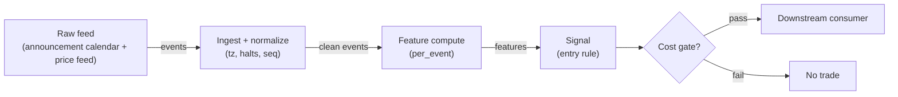

# S034 — Scheduled macro-announcement drift

Trade the post-announcement continuation only: the jump in the `2` minutes after a scheduled release predicts the next `30` minutes [example]; the pre-release drift is not predictive and never enters the rule. Provenance **[D]**.

> Tag law: every numeric literal in prose carries one of `[documented]
> [default] [example] [unverified] [internal-est] [measured]` (legend: Appendix
> i v1.0.0). Bibliographic years, volumes, pages, arXiv IDs, section numbers,
> rule codes (C1–C10), fail-safe codes (F1–F5), module IDs, batch keys, family
> letters, and machine-parsed §0 data fields are identifiers, not literals,
> and are exempt.

## §1 Five-minute reviewer card

| Row | Value |
|---|---|
| Module | S034 — Scheduled macro-announcement drift, v1.1.0 |
| Edge verdict | `PREDICTIVE-FEATURE-ONLY` — the jump-continuation is documented across announcement types; the tradable fraction depends on how fast the venue reprices |
| After-cost | `BEFORE-COST` — Works on clean scheduled releases (CPI, FOMC, payrolls) with a decisive jump: slow money needs minutes to reprice; dies on leaked/whispered numbers (jump before tau), two-sided headline revisions, and simultaneous cross-asset repricing that inverts the first move |
| Build cost | Tier L · `4–12` h [internal-est] · `$600–1,800` loaded [internal-est] |
| Data cost | Research `~$30–200`/mo (SIP 1-min bars)` [unverified]; production `~$200`/mo + usage (SIP bars)` [unverified] — bands indicative, verify before budgeting |
| latency_class | bar-level / minutes |
| risk_class | low (signal-only; no order placement) |
| Capacity | `$20–100`/day notional [example] — illustrative; calibrate per venue |
| Executability | Feasible: Python+polars prototype; trivial compute |
| Risk summary | Event risk concentrated in minutes: revision risk (headline corrected), leak risk (pre-positioned jump), and volatility-expansion risk that gaps through the exit |
| When it dies | Leaked numbers; conflicting cross-asset signals; announcement-day circuit breakers; regime where algos reprice in seconds and the `30`-min drift compresses to `2` min |
| Regime gates | Provisional machine records PR01–PR03 in §S9 (PR prefix; avoids collision with the R001–R050 regime-module namespace); R-module annotation pending |
| Emits | `signal_vector` (Appendix b v1.0.0) — never orders |

## §1.5 Cheapest / least-build path

1. **Prototype hour band:** `4–12` h [internal-est] — bar features + timestamp/halt handling + reference validation against the fixture.
2. **Cheapest-source row** (structured, research tier first):
   ```yaml
   min_tier: Polygon Stocks Starter (15-min delayed, research) / Stocks Advanced (real-time, production) [unverified]
   latency_class: bar-level / minutes (signal needs minutes, not micros)
   required_fields: 1-min OHLCV (t,o,h,l,c,v; t in ms → int64 ns UTC), corporate-action adjustments (splits/dividends), public release schedule (release_id, scheduled_ts_utc, release_type)
   price_band: research `$29`/mo delayed [unverified]; production `$199`/mo real-time [unverified] — verify at massive.com/polygon.io pricing before budgeting
   build_or_buy: BUILD the estimator + calendar parser; BUY the bar feed. Futures leg needs Polygon's separate Futures plan ladder — pricing not verified (see §S12 unverified leads)
   ```
3. **Resource budget:** `1` core, `<2` GB RAM for `500` symbols [internal-est]; compute pattern `per_bar`.
4. **Skip list:** tick-level variants; multi-venue aggregation; Rust ingest; colocated deployment.
5. **DO-NOT-CUT list:** causality assertions (`assert fill_event > signal_event`, no-signal-bar-fills test); COST block + callable `expected_cost_bps`; F1–F5 fail-safes + module-state enum + kill/safe-mode (`OFF`); decision-log audit records; bona-fide-intent + self-trade prevention; provenance tags on every numeric literal; fixtures + `test_cmd`; secrets via env only.
6. **Escalation gate:** upgrade from cheapest when any holds — live universe beyond the cheapest band; jitter persistently over budget; cost gate failing on `[measured]` costs; entitlement class changes.

## §S0 Module contract

### S0.1 Typed signature

```python
def signal(state: ModuleState, events: list[Event], cfg: Config) -> SignalVector:
```

`SignalVector` per Appendix b v1.0.0. `state` is the module-owned named state
vector (`events`, `last_announcement`, `cooldown_until`, `adv_pct`, `active_event`, `module_state`); `events` are canonical Events (Appendix a v1.0.0),
newest last. The function handles documented edge cases: empty events →
`UNKNOWN`; invalid/missing prices → `UNKNOWN` (F1, never interpolate);
halt/auction events → freeze per the market-state table.

### S0.2 Config dataclass

| Parameter | Type | Default | Range | Status |
|---|---|---|---|---|
| `jump_thresh_bp` | float | `10.0` | `5`–`50` | default |
| `cost_gate_k` | float | `0.5` | `0.1`–`2.0` | default |
| `cooldown_s` | float | `3,600.0` | `0`–`86,400` | default |
| `max_hold_min` | float | `30.0` | `5`–`120` | example |
| `ref_notional` | float | `100_000.0` | `10_000`–`1_000_000` | example |
| `venue` | str | `"XNAS"` | fixed set per domain block | example |

All defaults tagged per the tag law (status `default` ⇒ `[default]`). Calibration recipes for every row live in §S2 ("Calibration recipes").

### S0.3 Canonical schema mapping

Vendor columns → canonical Event schema (Appendix a v1.0.0), stated once here:

| Vendor | Canonical |
|---|---|
| `ts_pre` / `ts_ann` / `ts_j1` / `ts_j2` (ms) | `event_ts` + offsets (int64 ns UTC) |
| `px_pre` / `px_ann` / `px_j1` / `px_j2` | `p_pre` / `p_ann` / `p_j1` / `p_j2` |
| bar/arrival time | `asof_ts` (int64 ns UTC; dual timestamps: `event_ts` = when the event happened, `asof_ts` = when we saw it) |
| announcement calendar row | `release_id`, `scheduled_ts_utc` (int64 ns), `release_type` (enum CPI/FOMC/NFP/…) |

### S0.4 Time contract

> Time contract: clock domain UTC, int64 ns; authoritative causality clock =
> `event_ts`; max_skew = `1` [default]; jitter budget = `250`
> [default]; bar-label = open time; staleness TTL = `600` [default]; gap
> policy = mask, no interpolation; halt/auction → discard contributions across
> reopen.

**Timing box:** `signal@t (per_event, America/New_York) → earliest fill @open(t+1)`

### S0.5 Market-state table

| State | Module behavior |
|---|---|
| CONTINUOUS_TRADING | Compute normally; emit per cadence |
| HALTED | Freeze state; emit `UNKNOWN`; discard contributions across reopen |
| AUCTION | No new signals; hold last `SignalVector`; state `DEGRADED` |
| CLOSED | Emit nothing; state `OFF` |

### S0.6 Module-state enum + error taxonomy

States per Appendix k v1.0.0: `OK | DEGRADED | UNKNOWN | OFF`. Invalid input →
`UNKNOWN`, never interpolate (Appendix f v1.0.0, F1–F5). Kill/safe-mode: an
administrative kill or a bounds violation forces `OFF` until the runbook
re-arm checklist passes.

| Failure | State | Alert |
|---|---|---|
| Missing/stale input (TTL) | `UNKNOWN` | page |
| Bad bar (high<low, non-positive prices, crossed quotes) | `UNKNOWN` | log |
| Feature out of mathematical bounds (F2) | `UNKNOWN` | page |
| `seq` gap beyond tolerance | `DEGRADED` (restart windows) | log |
| Halt/auction | `UNKNOWN` / `DEGRADED` (per table) | log |
| Kill/administrative disable | `OFF` | page |
| Anything unmapped | `UNKNOWN` | page |

### S0.7 Ops tail

- **Schedule:** continuous during US equities regular session `09:30`–`16:00` America/New_York [documented]; owner: signals on-call.
- **Health checks:** fixture replay (`test_cmd`) green on deploy; `seq`-gap monitor; staleness watchdog at `600` [default].
- **Alert table:** page on `UNKNOWN` > `5` min [default] or bounds violation; notify on `DEGRADED`; log single dropped events.
- **Resource budget:** `1` vCPU, `2` GB RAM per `500` symbols [internal-est]; state is O(window) per symbol.
- **Runbook stub:** `1.` confirm feed; `2.` replay fixture; `3.` if red → set `OFF`, page; `4.` reconcile decision log before re-arm.

### S0.8 Secrets (env-only)

`POLYGON_API_KEY` via environment only. No secrets in this file, fixtures, or logs
(CI secrets-grep).

### S0.9 May / must-NOT

> **May:** emit `SignalVector` records per Appendix b v1.0.0. **Must-NOT:**
> emit orders, order intents, prices, share counts, or notionals; call a
> broker; mutate shared state outside `state`; interpolate across gaps.

## §S1 Legacy (subsumed by §1)

Legacy §S1 content is the §1 reviewer card above; this header is retained so
section numbering stays frozen.

## §S2 Specification

### Universe

Scheduled macro releases on liquid instruments (index futures, FX majors, Treasury futures); announcement calendar known in advance; no signal on unscheduled headlines.

### Entry rule (Boolean — no prose-only conditions)

Definitions: `now := e.event_ts` (signal time, int64 ns); `R_pre`, `R_jump` per §S3 (bps); `thresh := cfg.jump_thresh_bp`;
`edge_bps := 0.5 * |R_jump|` [example]; `locate_ok` := consumer-provided locate assertion for shorts (C7; absent → `False`);
`cooldown_until` := module state from prior exits/blocks (S0.1);
`leak := |R_pre| >= |R_jump|` — the pre-tau drift already priced the full jump, so the number leaked (veto, never reverse; only evaluated when `|R_jump| >= thresh`, so `|R_pre| >= thresh` holds automatically).

```
LEAK_VETO   := (|R_pre| >= |R_jump|)                       # pre-release drift priced the jump: veto, never reverse
ENTER_LONG  := NOT LEAK_VETO
               AND (|R_jump| >= jump_thresh_bp) AND (R_jump > 0)
               AND (now >= cooldown_until)
               AND (expected_cost_bps(notional=cfg.ref_notional, adv_pct=state.adv_pct,
                     venue=cfg.venue, side="taker", urgency="normal") <= cost_gate_k * edge_bps)
ENTER_SHORT := NOT LEAK_VETO
               AND (|R_jump| >= jump_thresh_bp) AND (R_jump < 0) AND (locate_ok)
               AND (now >= cooldown_until)
               AND (expected_cost_bps(notional=cfg.ref_notional, adv_pct=state.adv_pct,
                     venue=cfg.venue, side="taker", urgency="normal") <= cost_gate_k * edge_bps)
FLAT        := otherwise  # R_pre NEVER enters the rule as an entry feature (documented non-predictive)
```

`edge_bps` = `0.5 * |R_jump|` bps [example] — half the two-minute jump persisting over the hold.

On any entry (long or short): `state.cooldown_until := now + cooldown_s` is set at the first event after `tau + max_hold_min` (the exit), not at entry — re-entry during the hold is blocked by the single-active-event rule (one announcement = one position).

### Exits (with post-exit cooldown)

```
EXIT := (now >= tau + max_hold_min) OR (module_state != OK)
       # post-continuation only; the drift is not held into the next release
ON_EXIT: cooldown_until = now + cooldown_s   # C10
```

Single-active-event rule: at most one open announcement event per symbol; a new release while `now < tau + max_hold_min` does not re-enter (treated as `FLAT` + `cooldown` log).

### Position sizing (fenced function)

```python
def size_shares(risk_budget_R, stop_distance, vol_estimate, ADV_cap, cost):
    # S-module requests capital fraction only; share math lives in the strategy.
    risk_notional = risk_budget_R * 0.5 * confidence          # 0.5 [default] factor
    shares = risk_notional / max(stop_distance, 1e-9)        # 1e-9 [default] guard
    return int(min(shares, ADV_cap * adv_shares * 0.001))     # 0.1% ADV cap [default]
```

### Risk limits

| Limit | Value |
|---|---|
| Max capital fraction per signal | `0.5` [default] |
| Max adverse excursion before `UNKNOWN` review | `2.0`× stop [default] |
| Staleness kill | TTL `600` [default] → `UNKNOWN` |

### COST block (single source of truth)

| Component | Value (bps) | Basis |
|---|---|---|
| Spread (half-spread, liquid large-cap) | `0.50` | [example] |
| Fees (taker incl. regulatory) | `0.30` | [example] |
| Borrow | `0.0` | [default] — reason: reference build long-biased; shorts add C7 locate cost |
| Impact | `1.0` | [example] — flagged; calibrate per venue at scale-up |
| **Total reference** | `1.80` | [example] |

`borrow_bps_per_day`: `0.0` [default] — reason: max hold is `30` min [example] (`< 1` day [default] assumption: no overnight carry), so no overnight borrow accrues in the reference build; shorts pay a per-event locate cost (C7) rather than per-day borrow. `fee_schedule_as_of`: `2026-09-01` [unverified] — placeholder; pin the real
venue schedule before production. `side: taker` [default]; venue/tier/source:
XNAS / Polygon SIP 1-min bars [example]. Re-stating cost numbers outside this block is a validation failure.

```python
def expected_cost_bps(notional, adv_pct, venue, side, urgency) -> float:
    # Callable cost model - reference stack, components from the COST block.
    spread_bps = 0.50   # [example]
    fee_bps = 0.30      # [example]
    borrow_bps = 0.0    # [default] long-biased reference; per-day borrow = 0 (30-min hold); reason above
    impact_bps = 1.0    # [example] flagged; calibrate per venue at scale-up
    if side == "maker":
        fee_bps = -0.20  # rebate [example]
    if urgency == "high":
        impact_bps *= 2.0  # [example] fast-window concession under urgency
    if adv_pct is not None and adv_pct > 0.01:
        impact_bps *= 1.0 + 10.0 * (adv_pct - 0.01)  # [example] linear participation penalty
    return spread_bps + fee_bps + borrow_bps + impact_bps
```

### Execution / fill model table

| Aspect | Assumption |
|---|---|
| Latency | Signal→intent `≤1` event [example]; feed path latency-simulated-only |
| Partial fills | N/A (signal-only; T-module policy: Appendix c v1.0.0) |
| Impact | `1.0` bps reference [example]; stress ×`5` [example] |
| Adverse fill | Whipsaw haircut `0.2` bps per unit signal [example] |

### Robustness

Threshold `5`–`20` bp [default band] selects the same decisive releases; the sign is robust, the hold length is not — `15`–`60` min [example] all show continuation, decaying with hold. Never widen the jump window past `5` min [example]: it starts absorbing the continuation itself. Leak detection (`|R_pre| >= |R_jump|`: the pre-tau drift already priced the full jump) must veto, not reverse.

### Compliance sub-block (C1–C10+)

| Code | Rule: trigger → check → action → log |
|---|---|
| C1 | Self-match prevention: this S-module emits no orders; downstream consumers must set self-trade-prevention flags — asserted in the `consumes` contract → check: consumer ticket schema (Appendix c v1.0.0) has STP flag → action: block non-compliant consumers → log: `stp_assert` record |
| C2 | Bona-fide intent: every emitted `SignalVector` with direction ≠ `0` must pass the cost gate; sub-threshold features emit direction `0`, never a tradeable hint → check: `expected_cost_bps(notional, adv_pct, venue, side, urgency) <= k * edge_bps` → action: zero the direction on failure → log: `gate_veto` record |
| C3 | Message-rate: emissions capped per symbol per second [default] → check: rate monitor → action: throttle + alert → log: `throttle` record |
| C4 | Fat-finger trio (applied by consumers; this module bounds its own outputs): confidence ∈ [`0`,`1`], capital ∈ [`0`,`0.5`], computed_at sane → check: bounds on every emission → action: out-of-bounds → `UNKNOWN` (F2) → log: `bounds_veto` record |
| C5 | Decision log: every emission, veto, and state transition logged per Appendix g v1.0.0, hash-chained → check: log write ack → action: halt on write failure → log: the record itself |
| C6 | Halt/auction: per §S0.5 market-state table; contributions across reopen discarded → check: state feed → action: freeze/`DEGRADED` → log: `state_freeze` record |
| C7 | Locate check: SHORT direction requires `locate_ok` from the consumer; no SHORT without asserted locate (Reg-SHO threshold securities → direction `0`) → check: locate flag → action: zero SHORT on missing locate → log: `locate_veto` record |
| C8 | Public dissemination: no signal values published externally without review gate → check: export channel → action: block unreviewed export → log: `export_block` record |
| C9 | Data entitlements: per §S6 Data rights row → check: entitlement class on startup → action: entitlement change → §1.5 escalation gate → log: `entitlement` record |
| C10 | Post-exit cooldown: `cooldown_s` after any exit or compliance block; no re-entry → check: `now >= cooldown_until` → action: suppress entries → log: `cooldown` record |
| C11 | News-trading hygiene: no trading on embargoed/non-public headlines; scheduled releases only, sourced from the public calendar → check: announcement on the public calendar → action: veto unscheduled headlines → log: `news_veto` record |

### Parameter table

| Parameter | Symbol | Value | Tag | Sensitivity |
|---|---|---|---|---|
| Jump threshold | `jump_thresh_bp` | `10.0` bps | [default] | high — diurnal-vol scale |
| Max hold | `max_hold_min` | `30` min | [example] | medium |
| Cost-gate k | `cost_gate_k` | `0.5` | [default] | high |

### Calibration recipes (grid + OOS selection; run before first production use)

General discipline: walk-forward over release types (CPI / FOMC / payrolls as separate folds), one-release embargo between folds; select on OOS after-cost drift capture, not in-sample P&L; re-run on `[measured]` costs at scale-up. All grids are `[default]` starting points; chosen values are re-tagged `[measured]` once fit.

| Parameter | Grid | Selection recipe (OOS) |
|---|---|---|
| `jump_thresh_bp` | `5, 7.5, 10, 15, 20` bp [default] | Pick the smallest threshold whose OOS after-cost continuation (per §S9 selection disclosure) is monotone in \|R_jump\| across release-type folds; reject grids where the top fold is a single release type (overfit to CPI) |
| `max_hold_min` | `10, 20, 30, 60, 120` min [default] | Fit the decay profile `E[R_hold] vs hold`: select the hold where marginal OOS continuation per minute drops below the reference cost stack (`1.80` bps [example]) — the hold is a cost-covering decision, not a P&L maximizer |
| `cost_gate_k` | `0.25, 0.5, 1.0, 2.0` [default] | Gate pass-rate vs realized cost on `[measured]` costs once available; `k = 0.5` [default] is the conservative start — raise toward `1.0` only if OOS vetoed trades would have covered cost at DSR-adjusted significance |
| `cooldown_s` | `0, 3600, 7200` s [default] | Minimize re-entry churn: `3600` [default] (one signal per release); shorten only if consecutive distinct releases (e.g. CPI + FOMC same week) are demonstrably independent in OOS |
| `ref_notional` (new) | `50_000, 100_000, 250_000` [example] | Calibrate to the intended production ticket; used only by the cost-gate predicate |

New §S0.2 Config rows: `ref_notional: float = 100_000.0` [example], range `10_000`–`1_000_000`, status `example`; `venue: str = "XNAS"` [example], status `example`. `state.adv_pct` is module state (ADV participation estimate), not config.

### Timing box

`signal@t (per_event, America/New_York) → earliest fill @open(t+1)`

## §S3 Math + normative pseudocode

With $P(\tau^-)$ the pre-release price, $P(\tau)$ the release print and $P(\tau+2)$ two minutes later:

$$R_{\mathrm{pre}} = \log\frac{P(\tau)}{P(\tau^-)} \times 10^4, \qquad R_{\mathrm{jump}} = \log\frac{P(\tau+2)}{P(\tau)} \times 10^4$$

$$s = \begin{cases} \mathrm{sign}(R_{\mathrm{jump}}) & |R_{\mathrm{jump}}| \ge 10\ \mathrm{bp}\ [\mathrm{default}] \\ 0 & \mathrm{otherwise} \end{cases}$$

Chapter S4 worked tape: $R_{\mathrm{pre}} = +15.8$ bp [example], $R_{\mathrm{jump}} = -29.8$ bp [example] $\to$ short. The pre-release drift $R_{\mathrm{pre}}$ is computed for the audit log only — using it as an entry feature is a documented specification violation.

**Normative pseudocode** (pseudocode is normative; prose is commentary):

```
function signal(state, events, cfg) -> SignalVector:
    assert events non-empty else return UNKNOWN                    # F1
    e = events[-1]
    now = e.event_ts                                              # signal time, int64 ns
    assert valid(e) else return UNKNOWN                            # F1/F2: never interpolate
    assert all(p > 0 for p in (e.p_pre, e.p_ann, e.p_j1, e.p_j2))  # F2: mathematical bounds
    R_pre  = log(e.p_ann / e.p_pre) * 1e4     # audit only; NEVER an entry feature
    R_jump = log(e.p_j2  / e.p_ann) * 1e4     # the tradeable jump
    thresh = cfg.jump_thresh_bp

    # --- leak veto: pre-tau drift already priced the full jump → flat, never reverse
    leak = abs(R_pre) >= abs(R_jump)                              # normative; §S2 LEAK_VETO
    # --- cooldown: one signal per release / post-exit block
    in_cooldown = now < state.cooldown_until

    direction = 0
    if (not leak) and (not in_cooldown) and abs(R_jump) >= thresh:
        direction = 1 if R_jump > 0 else -1
        if direction == -1 and not locate_ok(state):              # C7: no locate → no short
            direction = 0

    # --- confidence: linear in jump size, full conviction at 5x threshold [default]
    confidence = min(1.0, abs(R_jump) / (5.0 * thresh)) if direction != 0 else 0.0
    capital = 0.5 * confidence                                     # 0.5 [default]

    # --- normative cost-gate predicate (concrete args; §S2 COST block is the source of truth)
    edge_bps = 0.5 * abs(R_jump)                                   # [example] half the jump persists
    cost_bps = expected_cost_bps(notional=cfg.ref_notional,
                                adv_pct=state.adv_pct,
                                venue=cfg.venue,
                                side="taker",
                                urgency="normal")
    cost_ok = cost_bps <= cfg.cost_gate_k * edge_bps              # C2: bona-fide intent
    if not cost_ok:
        direction, confidence, capital = 0, 0.0, 0.0

    # --- single-active-event: new release while prior hold open → flat
    if state.active_event is not None and now < state.active_event.tau + cfg.max_hold_min * 60e9:
        direction, confidence, capital = 0, 0.0, 0.0

    sig = SignalVector(symbol=e.symbol, direction=direction, confidence=confidence,
                       capital=capital, computed_at=e.event_ts,
                       staleness=now - e.asof_ts,
                       module_state=state.module_state)
    log_decision(sig, inputs_hash=hash(e), params_hash=hash(cfg),
                 aux={"R_pre_bp": R_pre, "R_jump_bp": R_jump,
                      "leak_veto": leak, "locate_veto": direction == 0 and R_jump < -thresh,
                      "cost_bps": cost_bps, "edge_bps": edge_bps})  # C5 / Appendix g

    # --- causality: the earliest fill is strictly after the signal event (t→t+1)
    earliest_fill_ts = bar_open_after(e.event_ts)                 # per S0.4 timing box
    assert earliest_fill_ts > sig.computed_at                     # no signal-bar fills
    return sig
```

Causality: features at event/bar `t` use only data `≤ t`; earliest reaction is
`t+1`. Mandatory unit test: no-signal-bar fills. Every prose guard from §S2
(leak veto, locate check, cooldown, single-active-event, cost gate) appears
above as executable code — a guard present only in prose is a spec defect.

## §S4 Worked example (fixture-backed)

- Tape: `modules/fixtures/S034_tape.csv` — `# TYPE: validation-run`;
  `4` synthetic announcement events (`id,event_ts,p_pre,p_ann,p_j1,p_j2`); `e1` reproduces the chapter's S4 tape. `e4` pins the leak veto: `R_pre = +25.0` bp [example] (≥ threshold) with a decisive `+25.0` bp [example] jump → `dir = 0` (vetoed, never reversed). All numbers synthetic, seed `34` [example]; timestamps int64 ns UTC.
- Expected outputs: `modules/fixtures/S034_expected.csv` — `R_pre_bp`, `R_jump_bp`, `dir` per event; `e3` demonstrates the below-threshold flat.
- Tolerance: `1e-9` on floats; integer counts exact.
- Acceptance tests (`modules/tests/test_S034.py`, `8` tests):
  `1.` fixture recomputes to expected (`e1` jump hand-checks; `e2`/`e3` threshold behavior; `e4` leak veto → `0`); `2.` stub emits valid `SignalVector`; `3.` no-signal-bar fills (`fill_event_ts > computed_at`); `4.` cost-gate predicate passes on large edge, blocks on tiny edge (`k = 0.5` [default]); `5.` invalid input (non-positive price) → `UNKNOWN`; `6.` leak veto pins `direction = 0` on `e4` (would-be `+1` without veto); `7.` locate veto: short candidate with `locate_ok = False` → `0`, with `locate_ok = True` → `-1`; `8.` cooldown suppression + confidence formula: `confidence = min(1, |R_jump| / (5 * thresh))` pinned on `e1`/`e2`.
- `test_cmd`: `python3 -m pytest modules/tests/test_S034.py -q` → exits `0`.

**Hand-check:** `e1`: `R_pre = ln(6009.46/5999.99) × 10⁴ = 15.77` [example], `R_jump = ln(5991.58/6009.46) × 10⁴ = −29.80` [example] → `dir=−1` (no leak: `15.77 < 29.80`); `e2` → `+1`; `e3` (`−5.40` bps [example]) → `0`; `e4` (`R_pre = +25.00` bps [example] ≥ `|R_jump| = +24.96` bps [example]) → `0` via leak veto despite a decisive jump — asserted in the test.

**Where the example is optimistic:** no fees, no latency, no partial fills, no corporate-action surprises — arithmetic illustration, not a backtest.

## §S5 Strategies that use this signal

Generated from `deps.yaml` (CI symmetry); hand-listed here:

| Strategy | Role |
|---|---|
| Announcement-drift consumer (strategy mapping pending deps.yaml) | Primary entry trigger: post-jump continuation |
| Contrast: pre-drift chaser (no sanctioned strategy) | Explicitly unsupported — R_pre is non-predictive |

## §S6 Data required

| Field | Type | Granularity | Vendor / product / schema | Required fields | Price band |
|---|---|---|---|---|---|
| Announcement calendar | event | per release | Public calendars: federalreserve.gov (FOMC), bls.gov (CPI, payrolls); parsed to versioned CSV, schema v1 [example] | `release_id`, `scheduled_ts_utc` (int64 ns), `release_type` (CPI/FOMC/NFP/…) | `$0` [example] (public) — build the parser |
| Trade prices (ETF leg: SPY/QQQ proxy) | float OHLCV | 1-min bars | Polygon Stocks Advanced (reported rebranded "Massive" early 2026) [unverified] — `/v2/aggs/{ticker}/range/1/minute`, corporate-action adjusted, schema v3 [example] | `t` (ms → int64 ns), `o`, `h`, `l`, `c`, `v` | research `$29`/mo (15-min delayed) [unverified]; production `$199`/mo (real-time) [unverified] |
| Trade prices (futures leg: ES/NQ/ZT) | float OHLCV | 1-min bars | Polygon Futures — separate plan ladder from Stocks [unverified]; or exchange-native feed | `t`, `o`, `h`, `l`, `c`, `v` | pricing not verified — see §S12 unverified leads |
| Session calendar | reference | daily | Vendor holiday calendar or exchange calendar (build: static table, updated yearly) | `date`, `session_open_utc`, `session_close_utc`, `is_holiday` | `$0` [example] |

**Data rights row** (Appendix j v1.0.0): Public economic calendar + licensed 1-min bars, `rights: licensed`; scope = research + stated production symbol count (`≤50` [default]); raw ticks never leave our systems — fixtures are synthetic; entitlement = professional/internal, no display; retention per vendor terms, purge path in runbook; derived features ours.

**Vendor correction (deep review 2026-09-11):** the v1.0.0 file listed "Polygon Stocks Advanced" as the source for "US index futures 1-min bars" — Stocks plans do not cover futures; futures sit on a separate plan ladder [unverified]. The cheapest path uses the ETF leg (SPY/QQQ) on Stocks plans; the futures leg is priced separately. Verify the futures ladder at the vendor's pricing page before budgeting.

## §S7 Local build (M5 Max / 128 GB)

Feasible: trivial. Four prices per event, two logs, one comparison. The universe is a handful of instruments on a dozen release days a year. Tier L per `notes/cost-model.md` §5: `4–12` h ≈ `$600–1,800` [internal-est] at `$150`/hr loaded. The work is calendar plumbing and leak-veto logic, not compute.

## §S8 Buy vs build

| Tier-0 (public calendar + Stooq) | Release times + daily bars | ~`$0` | Free prototype | No intraday jump measurement |
| Tier-1a (Polygon Stocks Starter) | 1-min bars (ETF leg), 15-min delayed | ~`$29`/mo [unverified] | True jump measurement for research | Delayed — research only |
| Tier-1b (Polygon Stocks Advanced / separate Futures plan) | 1-min bars real-time, corporate actions | ~`$199`/mo [unverified] stocks; futures ladder unverified | Production-grade | Futures pricing unverified (see §S12) |

**Verdict:** build. The rule is `10` lines [internal-est]; buy only the cheapest intraday feed covering the traded instruments.

## §S9 Efficacy — documented evidence

| Study / source | Market & period | Metric | Before/after cost | Caveat |
|---|---|---|---|---|
| Chapter S4 worked tape (seed `34`) | Single synthetic release | `R_pre=+15.8` bp [example], `R_jump=−29.8` bp [example] → short | `BEFORE-COST` (arithmetic illustration) | Synthetic — demonstrates the computation, not the edge |
| Andersen–Bollerslev–Diebold–Vega (2003), *Review of Economics and Statistics* | FX, scheduled macro releases | Real-time price discovery concentrated in the announcement window | `BEFORE-COST` (market-microstructure) | FX, not equities; documents the jump, not a trading rule |
| Ball–Brown (1968), *J. Accounting Research* | US equities, earnings | Post-announcement drift — the original drift anomaly | `BEFORE-COST` | Earnings, not macro; the mechanism analogue |

**Selection disclosure:** the chapter's worked tape plus two widely-cited announcement studies; no verified after-cost Sharpe for the `2`-min-jump → `30`-min-hold rule was found in this build [documented-as-absence].

### Regime gates (machine records, provisional — pending R001–R050 annotation; PR prefix avoids the R001–R050 module namespace)

| regime_id | direction | mechanism | condition | action | min_lag | unknown_behavior |
|---|---|---|---|---|---|---|
| PR01 | amplifies | decisive one-directional jump | \|R_jump\| > 25 bp [example] | none (size per §S2) | `0` [default] | veto |
| PR02 | inverts | leaked number: pre-tau drift already priced | \|R_pre\| >= \|R_jump\| | veto | `0` [default] | veto |
| PR03 | degrades | two-sided headline revisions | revision_flag | veto | `0` [default] | veto |

## §S10 Failure modes & pitfalls

| # | Trigger → Detect → Action → Recovery | check: |
|---|---|
| 1 | Leak: the jump happened before tau → detect: |R_pre| >= |R_jump| → action: veto (never reverse) → recovery: resume next release | `check: abs(R_pre_bp) < abs(R_jump_bp)` |
| 2 | Pre-drift misuse: R_pre wired into the entry → detect: spec audit flags R_pre in entry path → action: halt, fix → recovery: re-run acceptance tests | `check: entry_uses_only_R_jump` |
| 3 | Revision: headline corrected minutes later → detect: second-release monitor → action: exit immediately → recovery: review |
| 4 | Lookahead: jump window using post-exit prices → detect: causality audit → action: halt, fix windows → recovery: re-run no-signal-bar-fills test | `check: all(fill_ts > computed_at)` |
| 5 | Threshold whipsaw: jump barely clears, then mean-reverts → detect: cost gate on `[measured]` costs → action: stand down → recovery: re-pin fee schedule | `check: expected_cost_bps(notional, adv_pct, venue, side, urgency) <= k * edge_bps` |
| 6 | Calendar error: release time wrong (DST, reschedule) → detect: calendar-vs-tape mismatch → action: `UNKNOWN` for the event → recovery: fix calendar | `check: calendar_aligned` |
| 7 | Volatility expansion gaps through the exit → detect: realized-vol monitor → action: hard time-stop at tau+`30` min [example] → recovery: review sizing | `check: now <= tau + max_hold_min` |
| 8 | Unscheduled headline traded by mistake → detect: calendar check → action: veto → recovery: none | `check: on_public_calendar` |

## §S11 Visuals

Figure: `batches figure (see §0 `plot_script`)` (synthetic, seed `34` [example]).



## §S12 Source log + unverified leads

**Sources** (citable facts only):

1. Andersen, T. G., Bollerslev, T., Diebold, F. X. & Vega, C. (2003). "Micro Effects of Macro Announcements: Real-Time Price Discovery in Foreign Exchange." *Review of Economics and Statistics* [documented].
2. Ball, R. & Brown, P. (1968). "An Empirical Evaluation of Accounting Income Numbers." *Journal of Accounting Research* [documented].

**Chatbot source log.** Duck.ai (GPT-5.6 Luna, anonymous) answered Q-SB6-1–Q-SB6-3 (`2026-09-10`); Grok/Cursor answers pending (checked `2026-09-10`).

**Unverified leads** (chatbot-only — never in evidence tables):

- Chatbot-cited announcement-drift statistics (jump-continuation hit rates, half-lives) [unverified] — not independently confirmed; kept out of evidence tables.
- Polygon.io rebrand to "Massive" (early 2026) and 2026 tier reset (Stocks Starter `$29`, Developer `$79`, Advanced `$199`) [unverified] — sourced from third-party GitHub docs, not the vendor pricing page; verify before budgeting.
- Polygon Futures plan ladder: existence of a separate futures plan confirmed in third-party API references [unverified]; per-plan pricing not verified — confirm at the vendor pricing page.
- No verified after-cost Sharpe for the `2`-min-jump → `30`-min-hold rule was found in this build [documented-as-absence].

---

## Appendix — AI build prompt (S034)

Copy-paste into any chat agent:

> Build module **S034 — Scheduled macro-announcement drift** per `notes/module-template.md` v1.0.0
> and this file's §S0 contract. Cheapest path (§1.5): prototype
> `4–12` h [internal-est]; cheapest data candidate
> Polygon.io Stocks Starter (research) / Advanced (production) [unverified]; compute pattern `per_bar`.
> Implement `signal(state, events, cfg) -> SignalVector` (Appendix b v1.0.0)
> with the §S3 normative pseudocode, including the cost-gate predicate
> `expected_cost_bps(notional, adv_pct, venue, side, urgency) <= k * edge_bps`, the leak veto
> (`|R_pre| >= thresh` → direction `0`, never reversed), the C7 locate check on shorts,
> the cooldown / single-active-event rules, and `assert earliest_fill_ts > computed_at`.
> Wire F1–F5 (Appendix f v1.0.0): invalid input → `UNKNOWN`,
> never interpolate. Log decisions per Appendix g v1.0.0. Secrets via env
> only. Run the fixture `modules/fixtures/S034_tape.csv`
> (`# TYPE: validation-run`) against `modules/fixtures/S034_expected.csv`
> (tolerance `1e-9`).
> **Definition of done:** `python3 -m pytest modules/tests/test_S034.py -q`
> exits `0`. Tag every numeric literal you add with the unified enum
> (Appendix i v1.0.0); put anything unverifiable in §S12 unverified leads.
