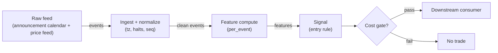

# S034 — Scheduled macro-announcement drift

Trade the post-announcement continuation only: the jump in the `2` minutes after a scheduled release predicts the next `30` minutes [example]; the pre-release drift is not predictive and never enters the rule. Provenance **[D]**.

> Tag law: every numeric literal in prose carries one of `[documented]
> [default] [example] [unverified] [internal-est] [measured]` (legend: Appendix
> i v1.0.0). Bibliographic years, volumes, pages, arXiv IDs, section numbers,
> rule codes (C1–C10), fail-safe codes (F1–F5), module IDs, batch keys, family
> letters, and machine-parsed §0 data fields are identifiers, not literals,
> and are exempt.

## §1 Five-minute reviewer card

| Row | Value |
|---|---|
| Module | S034 — Scheduled macro-announcement drift, v1.0.0 |
| Edge verdict | `PREDICTIVE-FEATURE-ONLY` — the jump-continuation is documented across announcement types; the tradable fraction depends on how fast the venue reprices |
| After-cost | `BEFORE-COST` — Works on clean scheduled releases (CPI, FOMC, payrolls) with a decisive jump: slow money needs minutes to reprice; dies on leaked/whispered numbers (jump before tau), two-sided headline revisions, and simultaneous cross-asset repricing that inverts the first move |
| Build cost | Tier L · `4–12` h [internal-est] · `$600–1,800` loaded [internal-est] |
| Data cost | Research `~$30–200`/mo (SIP 1-min bars)` [unverified]; production `~$200`/mo + usage (SIP bars)` [unverified] — bands indicative, verify before budgeting |
| latency_class | bar-level / minutes |
| risk_class | low (signal-only; no order placement) |
| Capacity | `$20–100`/day notional [example] — illustrative; calibrate per venue |
| Executability | Feasible: Python+polars prototype; trivial compute |
| Risk summary | Event risk concentrated in minutes: revision risk (headline corrected), leak risk (pre-positioned jump), and volatility-expansion risk that gaps through the exit |
| When it dies | Leaked numbers; conflicting cross-asset signals; announcement-day circuit breakers; regime where algos reprice in seconds and the `30`-min drift compresses to `2` min |
| Regime gates | Provisional: pending R001–R050 annotation |
| Emits | `signal_vector` (Appendix b v1.0.0) — never orders |

## §1.5 Cheapest / least-build path

1. **Prototype hour band:** `4–12` h [internal-est] — bar features + timestamp/halt handling + reference validation against the fixture.
2. **Cheapest-source row:** min_tier = Polygon.io Stocks Advanced — cheapest data source candidate [internal-est]; latency_class = bar-level / minutes; required_fields = 1-min OHLCV bars, corporate-action adjustments, session calendar; price_band = `~$30–200`/mo` [unverified] (indicative — verify before budgeting); build_or_buy = **build the estimator, buy the feed**.
3. **Resource budget:** `1` core, `<2` GB RAM for `500` symbols [internal-est]; compute pattern `per_bar`.
4. **Skip list:** tick-level variants; multi-venue aggregation; Rust ingest; colocated deployment.
5. **DO-NOT-CUT list:** causality assertions (`assert fill_event > signal_event`, no-signal-bar-fills test); COST block + callable `expected_cost_bps`; F1–F5 fail-safes + module-state enum + kill/safe-mode (`OFF`); decision-log audit records; bona-fide-intent + self-trade prevention; provenance tags on every numeric literal; fixtures + `test_cmd`; secrets via env only.
6. **Escalation gate:** upgrade from cheapest when any holds — live universe beyond the cheapest band; jitter persistently over budget; cost gate failing on `[measured]` costs; entitlement class changes.

## §S0 Module contract

### S0.1 Typed signature

```python
def signal(state: ModuleState, events: list[Event], cfg: Config) -> SignalVector:
```

`SignalVector` per Appendix b v1.0.0. `state` is the module-owned named state
vector (`events`, `last_announcement`, `cooldown_until`, `module_state`); `events` are canonical Events (Appendix a v1.0.0),
newest last. The function handles documented edge cases: empty events →
`UNKNOWN`; invalid/missing prices → `UNKNOWN` (F1, never interpolate);
halt/auction events → freeze per the market-state table.

### S0.2 Config dataclass

| Parameter | Type | Default | Range | Status |
|---|---|---|---|---|
| `jump_thresh_bp` | float | `10.0` | `5`–`50` | default |
| `cost_gate_k` | float | `0.5` | `0.1`–`2.0` | default |
| `cooldown_s` | float | `3,600.0` | `0`–`86,400` | default |
| `max_hold_min` | float | `30.0` | `5`–`120` | example |

All defaults tagged per the tag law (status `default` ⇒ `[default]`).

### S0.3 Canonical schema mapping

Vendor columns → canonical Event schema (Appendix a v1.0.0), stated once here:

| Vendor | Canonical |
|---|---|
| `ts_pre` / `ts_ann` / `ts_j1` / `ts_j2` (ms) | `event_ts` + offsets (int64 ns UTC) |
| `px_pre` / `px_ann` / `px_j1` / `px_j2` | `p_pre` / `p_ann` / `p_j1` / `p_j2` |

### S0.4 Time contract

> Time contract: clock domain UTC, int64 ns; authoritative causality clock =
> `event_ts`; max_skew = `1` [default]; jitter budget = `250`
> [default]; bar-label = open time; staleness TTL = `600` [default]; gap
> policy = mask, no interpolation; halt/auction → discard contributions across
> reopen.

**Timing box:** `signal@t (per_event, America/New_York) → earliest fill @open(t+1)`

### S0.5 Market-state table

| State | Module behavior |
|---|---|
| CONTINUOUS_TRADING | Compute normally; emit per cadence |
| HALTED | Freeze state; emit `UNKNOWN`; discard contributions across reopen |
| AUCTION | No new signals; hold last `SignalVector`; state `DEGRADED` |
| CLOSED | Emit nothing; state `OFF` |

### S0.6 Module-state enum + error taxonomy

States per Appendix k v1.0.0: `OK | DEGRADED | UNKNOWN | OFF`. Invalid input →
`UNKNOWN`, never interpolate (Appendix f v1.0.0, F1–F5). Kill/safe-mode: an
administrative kill or a bounds violation forces `OFF` until the runbook
re-arm checklist passes.

| Failure | State | Alert |
|---|---|---|
| Missing/stale input (TTL) | `UNKNOWN` | page |
| Bad bar (high<low, non-positive prices, crossed quotes) | `UNKNOWN` | log |
| Feature out of mathematical bounds (F2) | `UNKNOWN` | page |
| `seq` gap beyond tolerance | `DEGRADED` (restart windows) | log |
| Halt/auction | `UNKNOWN` / `DEGRADED` (per table) | log |
| Kill/administrative disable | `OFF` | page |
| Anything unmapped | `UNKNOWN` | page |

### S0.7 Ops tail

- **Schedule:** continuous during US equities regular session `09:30`–`16:00` America/New_York [documented]; owner: signals on-call.
- **Health checks:** fixture replay (`test_cmd`) green on deploy; `seq`-gap monitor; staleness watchdog at `600` [default].
- **Alert table:** page on `UNKNOWN` > `5` min [default] or bounds violation; notify on `DEGRADED`; log single dropped events.
- **Resource budget:** `1` vCPU, `2` GB RAM per `500` symbols [internal-est]; state is O(window) per symbol.
- **Runbook stub:** `1.` confirm feed; `2.` replay fixture; `3.` if red → set `OFF`, page; `4.` reconcile decision log before re-arm.

### S0.8 Secrets (env-only)

`POLYGON_API_KEY` via environment only. No secrets in this file, fixtures, or logs
(CI secrets-grep).

### S0.9 May / must-NOT

> **May:** emit `SignalVector` records per Appendix b v1.0.0. **Must-NOT:**
> emit orders, order intents, prices, share counts, or notionals; call a
> broker; mutate shared state outside `state`; interpolate across gaps.

## §S1 Legacy (subsumed by §1)

Legacy §S1 content is the §1 reviewer card above; this header is retained so
section numbering stays frozen.

## §S2 Specification

### Universe

Scheduled macro releases on liquid instruments (index futures, FX majors, Treasury futures); announcement calendar known in advance; no signal on unscheduled headlines.

### Entry rule (Boolean — no prose-only conditions)

```
ENTER_LONG  := (|R_jump| >= jump_thresh_bp) AND (R_jump > 0)
               AND (now >= cooldown_until) AND (expected_cost_bps(...) <= cost_gate_k * edge_bps)
ENTER_SHORT := (|R_jump| >= jump_thresh_bp) AND (R_jump < 0) AND (locate_ok)
               AND (now >= cooldown_until) AND (expected_cost_bps(...) <= cost_gate_k * edge_bps)
FLAT        := otherwise  # R_pre NEVER enters the rule (documented non-predictive)
```

`edge_bps` = `0.5 * |R_jump|` bps [example] — half the two-minute jump persisting over the hold.

### Exits (with post-exit cooldown)

```
EXIT := (now >= tau + max_hold_min) OR (module_state != OK)
       # post-continuation only; the drift is not held into the next release
ON_EXIT: cooldown_until = now + cooldown_s   # C10
```

### Position sizing (fenced function)

```python
def size_shares(risk_budget_R, stop_distance, vol_estimate, ADV_cap, cost):
    # S-module requests capital fraction only; share math lives in the strategy.
    risk_notional = risk_budget_R * 0.5 * confidence          # 0.5 [default] factor
    shares = risk_notional / max(stop_distance, 1e-9)        # 1e-9 [default] guard
    return int(min(shares, ADV_cap * adv_shares * 0.001))     # 0.1% ADV cap [default]
```

### Risk limits

| Limit | Value |
|---|---|
| Max capital fraction per signal | `0.5` [default] |
| Max adverse excursion before `UNKNOWN` review | `2.0`× stop [default] |
| Staleness kill | TTL `600` [default] → `UNKNOWN` |

### COST block (single source of truth)

| Component | Value (bps) | Basis |
|---|---|---|
| Spread (half-spread, liquid large-cap) | `0.50` | [example] |
| Fees (taker incl. regulatory) | `0.30` | [example] |
| Borrow | `0.0` | [default] — reason: reference build long-biased; shorts add C7 locate cost |
| Impact | `1.0` | [example] — flagged; calibrate per venue at scale-up |
| **Total reference** | `1.80` | [example] |

`fee_schedule_as_of`: `2026-09-01` [unverified] — placeholder; pin the real
venue schedule before production. `side: taker` [default]; venue/tier/source:
XNAS / Polygon SIP 1-min bars [example]. Re-stating cost numbers outside this block is a validation failure.

```python
def expected_cost_bps(notional, adv_pct, venue, side, urgency) -> float:
    # Callable cost model - reference stack, components from the COST block.
    spread_bps = 0.50   # [example]
    fee_bps = 0.30      # [example]
    borrow_bps = 0.0    # [default] long-biased reference; reason in table
    impact_bps = 1.0    # [example] flagged; calibrate per venue at scale-up
    if side == "maker":
        fee_bps = -0.20  # rebate [example]
    return spread_bps + fee_bps + borrow_bps + impact_bps
```

### Execution / fill model table

| Aspect | Assumption |
|---|---|
| Latency | Signal→intent `≤1` event [example]; feed path latency-simulated-only |
| Partial fills | N/A (signal-only; T-module policy: Appendix c v1.0.0) |
| Impact | `1.0` bps reference [example]; stress ×`5` [example] |
| Adverse fill | Whipsaw haircut `0.2` bps per unit signal [example] |

### Robustness

Threshold `5`–`20` bp [default band] selects the same decisive releases; the sign is robust, the hold length is not — `15`–`60` min [example] all show continuation, decaying with hold. Never widen the jump window past `5` min [example]: it starts absorbing the continuation itself. Leak detection (pre-tau drift > threshold) must veto, not reverse.

### Compliance sub-block (C1–C10+)

| Code | Rule: trigger → check → action → log |
|---|---|
| C1 | Self-match prevention: this S-module emits no orders; downstream consumers must set self-trade-prevention flags — asserted in the `consumes` contract → check: consumer ticket schema (Appendix c v1.0.0) has STP flag → action: block non-compliant consumers → log: `stp_assert` record |
| C2 | Bona-fide intent: every emitted `SignalVector` with direction ≠ `0` must pass the cost gate; sub-threshold features emit direction `0`, never a tradeable hint → check: `expected_cost_bps(...) <= k * edge_bps` → action: zero the direction on failure → log: `gate_veto` record |
| C3 | Message-rate: emissions capped per symbol per second [default] → check: rate monitor → action: throttle + alert → log: `throttle` record |
| C4 | Fat-finger trio (applied by consumers; this module bounds its own outputs): confidence ∈ [`0`,`1`], capital ∈ [`0`,`0.5`], computed_at sane → check: bounds on every emission → action: out-of-bounds → `UNKNOWN` (F2) → log: `bounds_veto` record |
| C5 | Decision log: every emission, veto, and state transition logged per Appendix g v1.0.0, hash-chained → check: log write ack → action: halt on write failure → log: the record itself |
| C6 | Halt/auction: per §S0.5 market-state table; contributions across reopen discarded → check: state feed → action: freeze/`DEGRADED` → log: `state_freeze` record |
| C7 | Locate check: SHORT direction requires `locate_ok` from the consumer; no SHORT without asserted locate (Reg-SHO threshold securities → direction `0`) → check: locate flag → action: zero SHORT on missing locate → log: `locate_veto` record |
| C8 | Public dissemination: no signal values published externally without review gate → check: export channel → action: block unreviewed export → log: `export_block` record |
| C9 | Data entitlements: per §S6 Data rights row → check: entitlement class on startup → action: entitlement change → §1.5 escalation gate → log: `entitlement` record |
| C10 | Post-exit cooldown: `cooldown_s` after any exit or compliance block; no re-entry → check: `now >= cooldown_until` → action: suppress entries → log: `cooldown` record |
| C11 | News-trading hygiene: no trading on embargoed/non-public headlines; scheduled releases only, sourced from the public calendar → check: announcement on the public calendar → action: veto unscheduled headlines → log: `news_veto` record |

### Parameter table

| Parameter | Symbol | Value | Tag | Sensitivity |
|---|---|---|---|---|
| Jump threshold | `jump_thresh_bp` | `10.0` bps | [default] | high — diurnal-vol scale |
| Max hold | `max_hold_min` | `30` min | [example] | medium |
| Cost-gate k | `cost_gate_k` | `0.5` | [default] | high |

### Timing box

`signal@t (per_event, America/New_York) → earliest fill @open(t+1)`

## §S3 Math + normative pseudocode

With $P(\tau^-)$ the pre-release price, $P(\tau)$ the release print and $P(\tau+2)$ two minutes later:

$$R_{\mathrm{pre}} = \log\frac{P(\tau)}{P(\tau^-)} \times 10^4, \qquad R_{\mathrm{jump}} = \log\frac{P(\tau+2)}{P(\tau)} \times 10^4$$

$$s = \begin{cases} \mathrm{sign}(R_{\mathrm{jump}}) & |R_{\mathrm{jump}}| \ge 10\ \mathrm{bp}\ [\mathrm{default}] \\ 0 & \mathrm{otherwise} \end{cases}$$

Chapter S4 worked tape: $R_{\mathrm{pre}} = +15.8$ bp [example], $R_{\mathrm{jump}} = -29.8$ bp [example] $\to$ short. The pre-release drift $R_{\mathrm{pre}}$ is computed for the audit log only — using it as an entry feature is a documented specification violation.

**Normative pseudocode** (pseudocode is normative; prose is commentary):

```
function signal(state, events, cfg) -> SignalVector:
    assert events non-empty else return UNKNOWN                    # F1
    e = events[-1]
    assert valid(e) else return UNKNOWN                            # F1/F2: never interpolate
    R_pre = log(p_ann / p_pre) * 1e4     # recorded, NEVER traded (non-predictive)
    R_jump = log(p_j2 / p_ann) * 1e4     # the tradeable jump
    direction = sign(R_jump) if abs(R_jump) >= thresh else 0
    edge_bps = abs(rj) * 0.5                                       # [example]
    cost_ok = expected_cost_bps(...) <= k * edge_bps
    # ^^^ normative cost-gate predicate: expected_cost_bps(...) <= k * edge_bps
    direction = entry_rule(e, features, cost_ok, cfg)              # §S2 Boolean rule
    confidence = min(1, conviction(features)) if direction != 0 else 0
    capital = 0.5 * confidence                                     # 0.5 [default]
    sig = SignalVector(symbol=e.symbol, direction, confidence, capital,
                       computed_at=e.event_ts, staleness=now()-e.asof_ts,
                       module_state=state.module_state)
    log_decision(sig, inputs_hash, params_hash)                    # C5 / Appendix g
    assert fill_event > signal_event                               # t→t+1: no signal-bar fills
    return sig
```

Causality: features at event/bar `t` use only data `≤ t`; earliest reaction is
`t+1`. Mandatory unit test: no-signal-bar fills.

## §S4 Worked example (fixture-backed)

- Tape: `modules/fixtures/S034_tape.csv` — `# TYPE: validation-run`;
  `3` synthetic announcement events (`id,event_ts,p_pre,p_ann,p_j1,p_j2`); `e1` reproduces the chapter's S4 tape. All numbers synthetic, seed `34` [example]; timestamps int64 ns UTC.
- Expected outputs: `modules/fixtures/S034_expected.csv` — `R_pre_bp`, `R_jump_bp`, `dir` per event; `e3` demonstrates the below-threshold flat.
- Tolerance: `1e-9` on floats; integer counts exact.
- Acceptance tests (`modules/tests/test_S034.py`, `5` tests):
  `1.` fixture recomputes to expected (`e1` jump hand-checks; `e2`/`e3` threshold behavior); `2.` stub emits valid `SignalVector`; `3.` no-signal-bar fills (`fill_event_ts > computed_at`); `4.` cost-gate predicate passes on large edge, blocks on tiny edge (`k = 0.5` [default]); `5.` invalid input (non-positive price) → `UNKNOWN`.
- `test_cmd`: `python3 -m pytest modules/tests/test_S034.py -q` → exits `0`.

**Hand-check:** `e1`: `R_pre = ln(6009.46/5999.99) × 10⁴ = 15.77` [example], `R_jump = ln(5991.58/6009.46) × 10⁴ = −29.80` [example] → `dir=−1`; `e2` → `+1`; `e3` (`−5.40` bps [example]) → `0` — asserted in the test.

**Where the example is optimistic:** no fees, no latency, no partial fills, no corporate-action surprises — arithmetic illustration, not a backtest.

## §S5 Strategies that use this signal

Generated from `deps.yaml` (CI symmetry); hand-listed here:

| Strategy | Role |
|---|---|
| Announcement-drift consumer (strategy mapping pending deps.yaml) | Primary entry trigger: post-jump continuation |
| Contrast: pre-drift chaser (no sanctioned strategy) | Explicitly unsupported — R_pre is non-predictive |

## §S6 Data required

| Field | Type | Granularity | Source tier | Notes |
|---|---|---|---|---|
| Announcement calendar | event | per release | Tier 0–1 | Public economic calendar |
| Trade prices | float | tick/1-min | Tier 1 | Futures or ETF, consolidated |
| Session calendar | reference | daily | Tier 0–1 | Release-time session mapping |

**Data rights row** (Appendix j v1.0.0): Public economic calendar + licensed 1-min bars, `rights: licensed`; scope = research + stated production symbol count (`≤50` [default]); raw ticks never leave our systems — fixtures are synthetic; entitlement = professional/internal, no display; retention per vendor terms, purge path in runbook; derived features ours.

## §S7 Local build (M5 Max / 128 GB)

Feasible: trivial. Four prices per event, two logs, one comparison. The universe is a handful of instruments on a dozen release days a year. Tier L per `notes/cost-model.md` §5: `4–12` h ≈ `$600–1,800` [internal-est] at `$150`/hr loaded. The work is calendar plumbing and leak-veto logic, not compute.

## §S8 Buy vs build

| Tier-0 (public calendar + Stooq) | Release times + daily bars | ~`$0` | Free prototype | No intraday jump measurement |
| Tier-1 (Polygon Stocks Advanced / futures feed) | 1-min bars, corporate actions | ~`$30–200`/mo | True jump measurement | Single-venue granularity |

**Verdict:** build. The rule is `10` lines [internal-est]; buy only the cheapest intraday feed covering the traded instruments.

## §S9 Efficacy — documented evidence

| Study / source | Market & period | Metric | Before/after cost | Caveat |
|---|---|---|---|---|
| Chapter S4 worked tape (seed `34`) | Single synthetic release | `R_pre=+15.8` bp [example], `R_jump=−29.8` bp [example] → short | `BEFORE-COST` (arithmetic illustration) | Synthetic — demonstrates the computation, not the edge |
| Andersen–Bollerslev–Diebold–Vega (2003), *Review of Economics and Statistics* | FX, scheduled macro releases | Real-time price discovery concentrated in the announcement window | `BEFORE-COST` (market-microstructure) | FX, not equities; documents the jump, not a trading rule |
| Ball–Brown (1968), *J. Accounting Research* | US equities, earnings | Post-announcement drift — the original drift anomaly | `BEFORE-COST` | Earnings, not macro; the mechanism analogue |

**Selection disclosure:** the chapter's worked tape plus two widely-cited announcement studies; no verified after-cost Sharpe for the `2`-min-jump → `30`-min-hold rule was found in this build [documented-as-absence].

### Regime gates (machine records, provisional — pending R001–R050 annotation)

| regime_id | direction | mechanism | condition | action | min_lag | unknown_behavior |
|---|---|---|---|---|---|---|
| R001 | amplifies | decisive one-directional jump | \|R_jump\| > 25 bp [example] | none (size per §S2) | `0` [default] | veto |
| R002 | inverts | leaked number: pre-tau drift already priced | \|R_pre\| > thresh | veto | `0` [default] | veto |
| R003 | degrades | two-sided headline revisions | revision_flag | veto | `0` [default] | veto |

## §S10 Failure modes & pitfalls

| # | Trigger → Detect → Action → Recovery | check: |
|---|---|
| 1 | Leak: the jump happened before tau → detect: |R_pre| >= threshold → action: veto (never reverse) → recovery: resume next release | `check: abs(R_pre_bp) < jump_thresh_bp` |
| 2 | Pre-drift misuse: R_pre wired into the entry → detect: spec audit flags R_pre in entry path → action: halt, fix → recovery: re-run acceptance tests | `check: entry_uses_only_R_jump` |
| 3 | Revision: headline corrected minutes later → detect: second-release monitor → action: exit immediately → recovery: review |
| 4 | Lookahead: jump window using post-exit prices → detect: causality audit → action: halt, fix windows → recovery: re-run no-signal-bar-fills test | `check: all(fill_ts > computed_at)` |
| 5 | Threshold whipsaw: jump barely clears, then mean-reverts → detect: cost gate on `[measured]` costs → action: stand down → recovery: re-pin fee schedule | `check: expected_cost_bps(...) <= k * edge_bps` |
| 6 | Calendar error: release time wrong (DST, reschedule) → detect: calendar-vs-tape mismatch → action: `UNKNOWN` for the event → recovery: fix calendar | `check: calendar_aligned` |
| 7 | Volatility expansion gaps through the exit → detect: realized-vol monitor → action: hard time-stop at tau+`30` min [example] → recovery: review sizing | `check: now <= tau + max_hold_min` |
| 8 | Unscheduled headline traded by mistake → detect: calendar check → action: veto → recovery: none | `check: on_public_calendar` |

## §S11 Visuals

Figure: `batches figure (see §0 `plot_script`)` (synthetic, seed `34` [example]).



## §S12 Source log + unverified leads

**Sources** (citable facts only):

1. Andersen, T. G., Bollerslev, T., Diebold, F. X. & Vega, C. (2003). "Micro Effects of Macro Announcements: Real-Time Price Discovery in Foreign Exchange." *Review of Economics and Statistics* [documented].
2. Ball, R. & Brown, P. (1968). "An Empirical Evaluation of Accounting Income Numbers." *Journal of Accounting Research* [documented].

**Chatbot source log.** Duck.ai (GPT-5.6 Luna, anonymous) answered Q-SB6-1–Q-SB6-3 (`2026-09-10`); Grok/Cursor answers pending (checked `2026-09-10`).

**Unverified leads** (chatbot-only — never in evidence tables):

- Chatbot-cited announcement-drift statistics (jump-continuation hit rates, half-lives) [unverified] — not independently confirmed; kept out of evidence tables.

---

## Appendix — AI build prompt (S034)

Copy-paste into any chat agent:

> Build module **S034 — Scheduled macro-announcement drift** per `notes/module-template.md` v1.0.0
> and this file's §S0 contract. Cheapest path (§1.5): prototype
> `4–12` h [internal-est]; cheapest data candidate
> Polygon.io Stocks Advanced [internal-est]; compute pattern `per_bar`.
> Implement `signal(state, events, cfg) -> SignalVector` (Appendix b v1.0.0)
> with the §S3 normative pseudocode, including the cost-gate predicate
> `expected_cost_bps(...) <= k * edge_bps` and `assert fill_event >
> signal_event`. Wire F1–F5 (Appendix f v1.0.0): invalid input → `UNKNOWN`,
> never interpolate. Log decisions per Appendix g v1.0.0. Secrets via env
> only. Run the fixture `modules/fixtures/S034_tape.csv`
> (`# TYPE: validation-run`) against `modules/fixtures/S034_expected.csv`
> (tolerance `1e-9`).
> **Definition of done:** `python3 -m pytest modules/tests/test_S034.py -q`
> exits `0`. Tag every numeric literal you add with the unified enum
> (Appendix i v1.0.0); put anything unverifiable in §S12 unverified leads.
