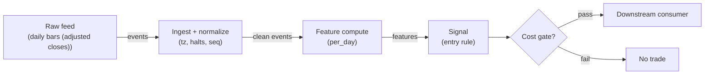

# S035 — Short-term reversal

Rank prior returns; buy the worst losers, short the biggest winners [documented]: short-horizon returns negatively autocorrelate as liquidity pressure mean-reverts. Provenance **[D]**.

> Tag law: every numeric literal in prose carries one of `[documented]
> [default] [example] [unverified] [internal-est] [measured]` (legend: Appendix
> i v1.0.0). Bibliographic years, volumes, pages, arXiv IDs, section numbers,
> rule codes (C1–C10), fail-safe codes (F1–F5), module IDs, batch keys, family
> letters, and machine-parsed §0 data fields are identifiers, not literals,
> and are exempt.

## §1 Five-minute reviewer card

| Row | Value |
|---|---|
| Module | S035 — Short-term reversal, v1.1.0 |
| Edge verdict | `PREDICTIVE-FEATURE-ONLY` — one of the oldest documented cross-sectional effects (Jegadeesh 1990; Lehmann 1990 [documented]); the after-cost version is a turnover race |
| After-cost | `BEFORE-COST` — Works when the cross-section is driven by uninformed flow (month/quarter ends, fire sales, crowded de-risking): losers bounce as pressure lifts; dies in information regimes where losers keep losing (momentum) and when the short leg gets hard to borrow |
| Build cost | Tier L · `4–12` h [internal-est] · `$600–1,800` loaded [internal-est] |
| Data cost | Research `~$29–199`/mo [unverified] (Stocks Starter 15-min delayed suffices for daily-bar research; Stocks Advanced for real-time); production `~$199`/mo + usage [unverified] — tiers per third-party 2026 docs, verify before budgeting |
| latency_class | bar-level / minutes |
| risk_class | low (signal-only; no order placement) |
| Capacity | `$10–50`/day notional [example] — illustrative; calibrate per venue |
| Executability | Feasible: Python+polars prototype; trivial compute |
| Risk summary | Momentum-regime risk: the same sort loses money when news (not flow) drives returns; short-leg borrow squeezes; weekly turnover multiplies costs |
| When it dies | Information-driven trends (momentum dominates); crowded reversal books; borrow/ locate failures on the short leg; transaction-cost regime where weekly turnover eats the spread |
| Regime gates | Provisional (§0 `regime_ids: [R001, R002, R003]`; machine records in §S9; full R001–R050 annotation pending) |
| Emits | `signal_vector` (Appendix b v1.0.0) — never orders |

## §1.5 Cheapest / least-build path

1. **Prototype hour band:** `4–12` h [internal-est] — bar features + timestamp/halt handling + reference validation against the fixture.
2. **Cheapest-source row (machine record):**

| min_tier | latency_class | required_fields | price_band | build_or_buy |
|---|---|---|---|---|
| Massive (Polygon) Stocks Starter for research; Stocks Advanced for production (vendor rebranded Polygon.io → Massive in 2026 per third-party docs [unverified]; `api.polygon.io` endpoints preserved) | bar-level / minutes | adjusted daily OHLCV per symbol (`t` ms, `o`, `h`, `l`, `c`, `v`, `n`), corporate-action adjustment flag (`adjusted=true`), session calendar; borrow/locate feed for the short leg only | `~$29–199`/mo [unverified] (Starter delayed tier for daily-bar research → Advanced real-time for production) | **build** the estimator (`5` lines of sort [internal-est]); **buy** the feed and the short-leg borrow feed |

3. **Resource budget:** `1` core, `<2` GB RAM for `500` symbols [internal-est]; compute pattern `per_bar`.
4. **Skip list:** tick-level variants; multi-venue aggregation; Rust ingest; colocated deployment.
5. **DO-NOT-CUT list:** causality assertions (`assert fill_event > signal_event`, no-signal-bar-fills test); COST block + callable `expected_cost_bps`; F1–F5 fail-safes + module-state enum + kill/safe-mode (`OFF`); decision-log audit records; bona-fide-intent + self-trade prevention; provenance tags on every numeric literal; fixtures + `test_cmd`; secrets via env only.
6. **Escalation gate** — upgrade from cheapest when ANY holds:
   - live universe exceeds `1,000` symbols [default] (cheapest-band cap in §S6 data rights);
   - jitter persistently over the `500` [default] budget across `3` consecutive sessions [default];
   - cost gate failing on `[measured]` costs (gate-pass rate `< 30`% [default] over a rolling week [default]);
   - entitlement class changes (→ §S6 data-rights review);
   - short-leg borrow `[measured]` above `0.50` bps/day [example] → re-pin the COST block and re-run the acceptance tests.

## §S0 Module contract

### S0.1 Typed signature

```python
def signal(state: ModuleState, events: list[Event], cfg: Config) -> SignalVector:
```

`SignalVector` per Appendix b v1.0.0. `state` is the module-owned named state
vector (`ranks`, `legs`, `cooldown_until`, `module_state`); `events` are canonical Events (Appendix a v1.0.0),
newest last. The function handles documented edge cases: empty events →
`UNKNOWN`; invalid/missing prices → `UNKNOWN` (F1, never interpolate);
halt/auction events → freeze per the market-state table.

### S0.2 Config dataclass

| Parameter | Type | Default | Range | Status |
|---|---|---|---|---|
| `n_long` / `n_short` | int | `3` / `3` | `2`–`10` | example |
| `min_names` | int | `6` | `6`–`50` | default |
| `cost_gate_k` | float | `0.5` | `0.1`–`2.0` | default |
| `cooldown_s` | float | `86,400.0` | `0`–`604,800` | example |
| `edge_bps` | float | `250.0` | `10`–`2,500` | example — ex-ante expected weekly long-minus-short reversal spread (bps); re-estimated per walk-forward fold, never fit to the test fold |
| `width_min_pp` | float | `2.0` | `0.5`–`10.0` | example — cross-width veto: book stays flat unless `max(r_form) − min(r_form) ≥ width_min_pp` (r_form in %) |

All defaults tagged per the tag law (status `default` ⇒ `[default]`).

### S0.3 Canonical schema mapping

Vendor columns → canonical Event schema (Appendix a v1.0.0), stated once here.
Source endpoint: `GET /v2/aggs/ticker/{stocksTicker}/range/{multiplier}/{timespan}/{from}/{to}`
with `adjusted=true` (split adjustment on; default) [unverified — third-party 2026 endpoint docs].
Bar timestamps `t` are Unix **ms** for the aggregate-window start; multiply by
`1,000,000` to reach the int64-ns UTC `event_ts` [default]. `r_form` and
`r_hold` are derived features (formation-window and ex-post holding returns in
%), not raw vendor fields; `r_hold` must never appear on the right-hand side
of any feature (§S3 causality assertion, C4).

| Vendor field | Meaning | Canonical |
|---|---|---|
| `ticker` (path) / `T` | exchange symbol | `symbol` |
| `t` (Unix ms, window start) | bar timestamp | `event_ts` = `t × 1,000,000` [default] (int64 ns UTC) |
| `o`, `h`, `l`, `c` | open/high/low/close (adjusted) | bar prices |
| `v` | share volume | `volume` |
| `n` | trade count | `trade_count` (optional, QC) |
| `vw` | VWAP | optional QC only — never an input |
| `r_form` (derived, %) | formation-window return | `r_form` (feature input) |
| `r_hold` (derived, %) | holding-window return, ex post | `r_hold` (never an input) |

### S0.4 Time contract

> Time contract: clock domain UTC, int64 ns; authoritative causality clock =
> `event_ts`; max_skew = `1` [default]; jitter budget = `500`
> [default]; bar-label = open time; staleness TTL = `86_400` [default]; gap
> policy = mask, no interpolation; halt/auction → discard contributions across
> reopen.

**Timing box:** `signal@t (per_day, America/New_York) → earliest fill @open(t+1)`

### S0.5 Market-state table

| State | Module behavior |
|---|---|
| CONTINUOUS_TRADING | Compute normally; emit per cadence |
| HALTED | Freeze state; emit `UNKNOWN`; discard contributions across reopen |
| AUCTION | No new signals; hold last `SignalVector`; state `DEGRADED` |
| CLOSED | Emit nothing; state `OFF` |

### S0.6 Module-state enum + error taxonomy

States per Appendix k v1.0.0: `OK | DEGRADED | UNKNOWN | OFF`. Invalid input →
`UNKNOWN`, never interpolate (Appendix f v1.0.0, F1–F5). Kill/safe-mode: an
administrative kill or a bounds violation forces `OFF` until the runbook
re-arm checklist passes.

| Failure | State | Alert |
|---|---|---|
| Missing/stale input (TTL) | `UNKNOWN` | page |
| Bad bar (high<low, non-positive prices, crossed quotes) | `UNKNOWN` | log |
| Feature out of mathematical bounds (F2) | `UNKNOWN` | page |
| `seq` gap beyond tolerance | `DEGRADED` (restart windows) | log |
| Halt/auction | `UNKNOWN` / `DEGRADED` (per table) | log |
| Kill/administrative disable | `OFF` | page |
| Anything unmapped | `UNKNOWN` | page |

### S0.7 Ops tail

- **Schedule:** continuous during US equities regular session `09:30`–`16:00` America/New_York [documented]; owner: signals on-call.
- **Health checks:** fixture replay (`test_cmd`) green on deploy; `seq`-gap monitor; staleness watchdog at `86_400` [default].
- **Alert table:** page on `UNKNOWN` > `5` min [default] or bounds violation; notify on `DEGRADED`; log single dropped events.
- **Resource budget:** `1` vCPU, `2` GB RAM per `500` symbols [internal-est]; state is O(window) per symbol.
- **Runbook stub:** `1.` confirm feed; `2.` replay fixture; `3.` if red → set `OFF`, page; `4.` reconcile decision log before re-arm.

### S0.8 Secrets (env-only)

`POLYGON_API_KEY` via environment only. No secrets in this file, fixtures, or logs
(CI secrets-grep).

### S0.9 May / must-NOT

> **May:** emit `SignalVector` records per Appendix b v1.0.0. **Must-NOT:**
> emit orders, order intents, prices, share counts, or notionals; call a
> broker; mutate shared state outside `state`; interpolate across gaps.

## §S1 Legacy (subsumed by §1)

Legacy §S1 content is the §1 reviewer card above; this header is retained so
section numbering stays frozen.

## §S2 Specification

### Universe

US common stocks, price > `$5` [example], ADV > `1`M shares [example]; formation window `5` trading days [example], holding `5` trading days [example]; corporate-action-adjusted returns.

### Entry rule (Boolean — no prose-only conditions)

```
ENTER_LONG  := (rank <= n_long) AND (cross_width_ok) AND (now >= cooldown_until)
               AND (expected_cost_bps(...) <= cost_gate_k * edge_bps)
ENTER_SHORT := (rank >= N - n_short + 1) AND (locate_ok) AND (cross_width_ok)
               AND (now >= cooldown_until) AND (expected_cost_bps(...) <= cost_gate_k * edge_bps)
FLAT        := otherwise
```

where (all terms defined — no prose-only conditions):

```
cross_width_ok := (max_i r_form_i - min_i r_form_i) >= width_min_pp   # 2.0 [example]
locate_ok      := locate asserted by consumer per C7/C11 (no SHORT without it)
edge_bps       := cfg.edge_bps = 250.0 [example]
cooldown_until := state.cooldown_until, set on every exit (C10)
```

### Exits (with post-exit cooldown)

```
EXIT := (holding_days >= 5) [example] OR (module_state != OK)
       # fixed-horizon reversal; no stop-loss override in the base spec
ON_EXIT: cooldown_until = now + cooldown_s   # C10
```

### Position sizing (fenced function)

```python
def size_shares(risk_budget_R, stop_distance, vol_estimate, adv_shares):
    # S-module requests capital fraction only; share math lives in the strategy.
    risk_notional = risk_budget_R * 0.5 * confidence          # 0.5 [default] factor
    shares = risk_notional / max(stop_distance, 1e-9)        # 1e-9 [default] guard
    participation = 0.001                                     # 0.1% ADV cap [default]
    return int(min(shares, participation * adv_shares))
```

### Risk limits

| Limit | Value |
|---|---|
| Max capital fraction per signal | `0.5` [default] |
| Max adverse excursion before `UNKNOWN` review | `2.0`× stop [default] |
| Staleness kill | TTL `86_400` [default] → `UNKNOWN` |

### COST block (single source of truth)

| Component | Value (bps) | Basis |
|---|---|---|
| Spread (half-spread, large-cap) | `0.50` | [example] |
| Fees (taker incl. regulatory) | `0.30` | [example] |
| Borrow (3-name short leg, 5-day hold) | `1.00` | [example] — reason: short-leg borrow; C7 locate required |
| Impact (weekly turn) | `1.00` | [example] — flagged; calibrate per venue |
| **Total reference** | `2.80` | [example] |

`borrow_bps_per_day`: `0.20` [example] — reason: short-leg borrow over the `5`-day base-spec hold (`0.20 × 5 = 1.00` [example]); re-pin from the borrow feed at scale-up (§1.5 escalation gate).
`holding_days` (base spec): `5.0` [example] — used only to normalize borrow to a per-trade stack.

`fee_schedule_as_of`: `2026-09-01` [unverified] — placeholder; pin the real
venue schedule before production. `side: taker` [default]; venue/tier/source:
XNAS / Massive Stocks Advanced 1-min bars [example]. Re-stating cost numbers outside this block is a validation failure.

```python
def expected_cost_bps(notional, adv_pct, venue, side, urgency) -> float:
    # Callable cost model - reference stack, components from the COST block.
    spread_bps = 0.50             # [example]
    fee_bps = 0.30               # [example]
    borrow_bps_per_day = 0.20    # [example]; reason: short-leg borrow, 3-name short leg
    holding_days = 5.0           # [example] base-spec hold
    impact_bps = 1.00            # [example] flagged; calibrate per venue at scale-up
    borrow_bps = borrow_bps_per_day * holding_days
    return spread_bps + fee_bps + borrow_bps + impact_bps   # == 2.80 [example]
```

### Execution / fill model table

| Aspect | Assumption |
|---|---|
| Latency | Signal at rebalance close; fill next open [documented] |
| Partial fills | N/A (signal-only; T-module policy: Appendix c v1.0.0) |
| Impact | `1.0` bps reference [example]; stress ×`5` [example] |
| Adverse fill | Crowded-rebalance haircut `0.5` bps [example] |

### Robustness

Leg sizes `2`–`10` [example] all select the same tails; formation `5`–`20` days [example] all show reversal, decaying with horizon. Dollar-neutralize and beta-neutralize the legs or the 'reversal' is a market bet. Skip earnings weeks for names reporting — information regimes invert the sign. Reversal and momentum are the same sort with opposite signs: the regime filter is the strategy.

### Compliance sub-block (C1–C10+)

| Code | Rule: trigger → check → action → log |
|---|---|
| C1 | Self-match prevention: this S-module emits no orders; downstream consumers must set self-trade-prevention flags — asserted in the `consumes` contract → check: consumer ticket schema (Appendix c v1.0.0) has STP flag → action: block non-compliant consumers → log: `stp_assert` record |
| C2 | Bona-fide intent: every emitted `SignalVector` with direction ≠ `0` must pass the cost gate; sub-threshold features emit direction `0`, never a tradeable hint → check: `expected_cost_bps(...) <= k * edge_bps` → action: zero the direction on failure → log: `gate_veto` record |
| C3 | Message-rate: emissions capped per symbol per second [default] → check: rate monitor → action: throttle + alert → log: `throttle` record |
| C4 | Fat-finger trio (applied by consumers; this module bounds its own outputs): confidence ∈ [`0`,`1`], capital ∈ [`0`,`0.5`], computed_at sane → check: bounds on every emission → action: out-of-bounds → `UNKNOWN` (F2) → log: `bounds_veto` record |
| C5 | Decision log: every emission, veto, and state transition logged per Appendix g v1.0.0, hash-chained → check: log write ack → action: halt on write failure → log: the record itself |
| C6 | Halt/auction: per §S0.5 market-state table; contributions across reopen discarded → check: state feed → action: freeze/`DEGRADED` → log: `state_freeze` record |
| C7 | Locate check: SHORT direction requires `locate_ok` from the consumer; no SHORT without asserted locate (Reg-SHO threshold securities → direction `0`) → check: locate flag → action: zero SHORT on missing locate → log: `locate_veto` record |
| C8 | Public dissemination: no signal values published externally without review gate → check: export channel → action: block unreviewed export → log: `export_block` record |
| C9 | Data entitlements: per §S6 Data rights row → check: entitlement class on startup → action: entitlement change → §1.5 escalation gate → log: `entitlement` record |
| C10 | Post-exit cooldown: `cooldown_s` after any exit or compliance block; no re-entry → check: `now >= cooldown_until` → action: suppress entries → log: `cooldown` record |
| C11 | Short-sale rule hygiene: no SHORT leg without asserted locate; threshold-securities list checked at rebalance → check: locate flag per short name → action: drop unlocated names from the leg → log: `locate_veto` record |

### Parameter table

| Parameter | Symbol | Value | Tag | Sensitivity |
|---|---|---|---|---|
| Leg size | `n_long`/`n_short` | `3`/`3` | [example] | medium |
| Formation / holding | — | `5`/`5` days | [example] | high — horizon decay |
| Min cross-section | `min_names` | `6` | [default] | medium |
| Cost-gate k | `cost_gate_k` | `0.5` | [default] | high |

### Calibration recipes (grid + OOS selection, walk-forward)

Protocol (applies to every calibrated parameter): weekly-rebalance grid search
on the §0 dataset; train window `52` weeks [example], test window `26` weeks
[example], roll step `13` weeks [example]; selection metric = after-cost spread
with `[measured]` costs and a minimum of `30` [default] OOS trades per fold;
stability rule — adjacent grid values must be within `15`% [default] of peak,
otherwise the parameter is declared unstable and left at its `[default]`;
tie-break toward the simpler choice (fewer legs / longer cooldown / smaller `k`).

| Parameter | Grid | OOS selection recipe |
|---|---|---|
| `n_long` / `n_short` | `{2, 3, 4, 5, 6, 8, 10}` [example] | max after-cost spread; tie-break smallest legs |
| formation / holding horizon | `{5, 10, 15, 20}` trading days [example] | require sign-stable across adjacent horizons (decay, never flip) |
| `min_names` | `{6, 10, 20, 50}` [example] | smallest N with after-cost t-stat `> 2.0` [example] |
| `cost_gate_k` | `{0.1, 0.25, 0.5, 0.75, 1.0, 2.0}` [example] | select on `[measured]` costs; require gate-pass rate `≥ 30`% [default] |
| `cooldown_s` | `{0, 86_400, 604_800}` [example] | require no overlapping books |

Not calibrated — priors only (`[example]` status): `edge_bps`, `width_min_pp`,
conviction divisor (`20` pp [example]). `edge_bps` is re-estimated per fold from
the train-fold mean weekly spread; it is never fit to the test fold.

### Timing box

`signal@t (per_day, America/New_York) → earliest fill @open(t+1)`

## §S3 Math + normative pseudocode

For a cross-section of $N$ names with formation returns $r^f_i$:

$$\mathrm{leg}_i = \begin{cases} +1 & \mathrm{rank}(r^f_i) \le 3\ [\mathrm{example}] \\ -1 & \mathrm{rank}(r^f_i) \ge N-2 \\ 0 & \mathrm{otherwise} \end{cases}$$

Chapter S4 ten-stock tape (formation/holding returns in \%): long GGG/AAA/HHH, short EEE/CCC/BBB; formation–holding correlation $-0.302$ [example]; long-leg hold $+0.94$\% [example], short-leg hold $-1.55$\% [example], spread $+2.50$\% [example]. The holding return $r^h$ is ex post and never an input — the causality test fails the build if it leaks.

**Normative pseudocode** (pseudocode is normative; prose is commentary).
Definitions used below, all pinned: `conviction(width_pp) := min(1.0, width_pp / 20.0)`
(`[example]`; `r_form` in %); `open_ts(ts, cadence)` = the first bar-open after
`ts` under the §S0.4 bar-label rule (`t→t+1` machine rule: earliest admissible
fill is the open of bar `t+1`); `locate_ok(sym)` = consumer-asserted locate per
C7/C11.

```
function signal(state, events, cfg) -> SignalVector:
    assert events non-empty else return UNKNOWN                     # F1
    e = events[-1]                                                 # newest event; bar t
    assert valid(e) else return UNKNOWN                            # F1/F2: never interpolate
    assert all(x.event_ts <= e.event_ts for x in events)           # causality: inputs ≤ t only
    assert count(events) >= cfg.min_names else return UNKNOWN      # thin cross-section
    rf = formation_returns(events)                                # r_form only; see next line
    assert r_hold not in feature_inputs                            # ex-post fields never on RHS
    order = argsort(rf)                                            # 1 = worst formation return
    N = count(order)
    leg = +1 for order[:cfg.n_long], -1 for order[-cfg.n_short:], else 0
    width_pp = max(rf) - min(rf)
    cross_width_ok = width_pp >= cfg.width_min_pp                  # cfg.width_min_pp = 2.0 [example]
    cost_bps = expected_cost_bps(notional=1.0, adv_pct=0.001,
                                 venue='XNAS', side='taker', urgency='normal')
    cost_ok = cost_bps <= cfg.cost_gate_k * cfg.edge_bps            # normative cost-gate predicate
    cooldown_ok = now() >= state.cooldown_until
    i = index(e.symbol)
    d = leg[i]
    if d == -1 and not locate_ok(e.symbol): d = 0                  # C7/C11: no short without locate
    direction = d if (cross_width_ok and cooldown_ok and cost_ok) else 0
    confidence = conviction(width_pp) if direction != 0 else 0.0
    capital = 0.5 * confidence                                     # 0.5 [default]
    sig = SignalVector(symbol=e.symbol, direction, confidence, capital,
                       computed_at=e.event_ts, staleness=now()-e.asof_ts,
                       module_state=state.module_state)
    log_decision(sig, inputs_hash, params_hash)                    # C5 / Appendix g
    assert sig.computed_at == e.event_ts                           # signal stamped at t
    earliest_fill_ts = open_ts(e.event_ts, cadence='per_day')
    assert earliest_fill_ts > sig.computed_at                      # t→t+1: no signal-bar fills
    return sig
```

Causality: features at event/bar `t` use only data `≤ t`; earliest reaction is
`t+1`. Mandatory unit test: no-signal-bar fills.

## §S4 Worked example (fixture-backed)

- Tape: `modules/fixtures/S035_tape.csv` — `# TYPE: validation-run`;
  `10` synthetic names (`id,event_ts,symbol,r_form,r_hold`); the chapter's S4 ten-stock tape with formation and (ex post) holding returns. All numbers synthetic, seed `35` [example]; timestamps int64 ns UTC.
- Expected outputs: `modules/fixtures/S035_expected.csv` — `rank` (1 = worst formation return) and `leg` (`+1` long / `−1` short / `0`) per name; portfolio statistics asserted in the test.
- Tolerance: `1e-9` [default] on floats; integer counts exact.
- Acceptance tests (`modules/tests/test_S035.py`, `9` tests):
  `1.` fixture recomputes to expected (leg hand-checks; correlation `−0.302` and spread `+2.50`% portfolio checks); `2.` stub emits valid `SignalVector`; `3.` no-signal-bar fills (`fill_event_ts > computed_at`, and `computed_at == event_ts` of the signal event); `4.` cost-gate predicate passes on large edge, blocks on tiny edge (`k = 0.5` [default]); cost-stack components pinned to `2.80` bps [example] with borrow = `borrow_bps_per_day × holding_days`; `5.` invalid input (NaN formation return) → `UNKNOWN`; `6.` narrow cross-section (width `< width_min_pp`) → book flat, direction `0`; `7.` r_hold non-leak: permuting `r_hold` leaves ranks/legs unchanged; `8.` thin cross-section (`< min_names`) → `UNKNOWN`.
- `test_cmd`: `python3 -m pytest modules/tests/test_S035.py -q` → exits `0`.

**Hand-check:** ranks: GGG (`−8.54`%) [example] rank `1`, AAA (`−6.83`%) [example] rank `2`, HHH (`−0.34`%) [example] rank `3` → long leg; EEE (`+8.69`%) [example], CCC (`+6.90`%) [example], BBB (`+4.63`%) [example] → short leg; `corr(r_form, r_hold) = −0.302` [example]; spread `+2.497`% [example] — asserted in the test.

**Where the example is optimistic:** no fees, no latency, no partial fills, no corporate-action surprises — arithmetic illustration, not a backtest.

## §S5 Strategies that use this signal

Generated from `deps.yaml` (CI symmetry); hand-listed here:

| Strategy | Role |
|---|---|
| Weekly-reversal consumer (strategy mapping pending deps.yaml) | Primary entry trigger: cross-sectional loser/winner legs |
| Contrast: momentum sorts (S027 family) | Same sort, opposite sign — regime-gated |

## §S6 Data required

| Field | Type | Granularity | Source tier | Required vendor fields | Notes |
|---|---|---|---|---|---|
| Adjusted closes | float | daily | Tier 0–1 | `t` (ms) → `event_ts` [default], `o`, `h`, `l`, `c`, `adjusted=true` — split adjustment on [unverified, third-party 2026 endpoint docs] | Corporate-action-adjusted; unadjusted → F-audit failure (§S10.5) |
| Volume/ADV | int | daily | Tier 1 | `v` (shares), `n` (QC) | Liquidity screen: price `> $5` [example], ADV `> 1`M shares [example] |
| Borrow/locate | reference | daily | Tier 1–2 | vendor-specific; consumer-asserted | Short-leg feasibility (C7/C11) |
| Earnings calendar | event | as-occurring | Tier 1 | vendor-specific | Information-regime filter (§S10.8) |

Price bands (verify before budgeting): research on Stocks Starter (15-min delayed,
`5`-year [unverified] history per third-party 2026 docs) `~$29`/mo [unverified]; production
on Stocks Advanced (real-time, `20`+-year [unverified] history per third-party 2026 docs)
`~$199`/mo [unverified]. See the structured cheapest-source row in §1.5.

**Data rights row** (Appendix j v1.0.0): Daily bars via Massive (formerly Polygon) Stocks Advanced, `rights: licensed` (vendor rebranded Polygon.io → Massive in 2026 per third-party docs [unverified]; `api.polygon.io` endpoints preserved); scope = research + stated production symbol count (`≤1,000` [default]); raw ticks never leave our systems — fixtures are synthetic; entitlement = professional/internal, no display; retention per vendor terms, purge path in runbook; derived features ours.

## §S7 Local build (M5 Max / 128 GB)

Feasible: trivial. Ten names, one argsort, weekly. Even a `3,000`-name cross-section is a millisecond argsort. Tier L per `notes/cost-model.md` §5: `4–12` h ≈ `$600–1,800` [internal-est] at `$150`/hr loaded. The engineering is borrow/locate plumbing and the momentum-regime veto, not compute.

## §S8 Buy vs build

| Tier-0 (Stooq) | Daily closes, free | ~`$0` | Free prototype | No borrow data; survivorship bias |
| Tier-1 (Polygon Stocks Advanced) | Adjusted daily bars | ~`$30–200`/mo | Clean adjusted series | Still no borrow feed |

**Verdict:** build. The sort is `5` lines [internal-est]; buy the cheapest adjusted daily feed and a borrow feed only for the short leg.

## §S9 Efficacy — documented evidence

| Study / source | Market & period | Metric | Before/after cost | Caveat |
|---|---|---|---|---|
| Chapter S4 ten-stock tape (seed `35`) | `10` synthetic names | Long leg `+0.94`% [example], short leg `−1.55`% [example], spread `+2.50`% [example], `corr=−0.302` [example] | `BEFORE-COST` (arithmetic illustration) | Synthetic — demonstrates the computation, not the edge |
| Jegadeesh (1990), *J. Finance* | US equities, monthly | Significant reversals at `1`–`2`-month horizons | `BEFORE-COST` | Monthly, not weekly; the documented analogue |
| Lehmann (1990), *Quarterly J. Economics* | US equities, weekly | Weekly reversal profits, contrarian portfolios | `BEFORE-COST` | Weekly horizon matches; pre-decimalization costs |

**Selection disclosure:** the chapter's worked tape plus the two canonical reversal papers; no verified after-cost Sharpe for the exact `3`/`3`-name weekly rule was found in this build [documented-as-absence].

### Regime gates (machine records, provisional — pending R001–R050 annotation)

| regime_id | direction | mechanism | condition | action | min_lag | unknown_behavior |
|---|---|---|---|---|---|---|
| R001 | amplifies | uninformed-flow regime (month/quarter-end, fire sales) | flow_flag | none (size per §S2) | `1` week [default] | veto |
| R002 | inverts | information regime: losers keep losing | momentum_regime | veto | `1` week [default] | veto |
| R003 | degrades | short leg hard-to-borrow | borrow_flag | veto shorts | `0` [default] | veto |

## §S10 Failure modes & pitfalls

| # | Trigger → Detect → Action → Recovery | check: |
|---|---|
| 1 | Momentum inversion: news-driven trends make losers keep losing → detect: momentum-regime filter → action: veto the book → recovery: resume when filter clears | `check: not momentum_regime` |
| 2 | Ex-post leak: r_hold used as an input → detect: causality audit flags r_hold on RHS → action: halt, fix → recovery: re-run acceptance tests | `check: entry_inputs ∩ {r_hold} = ∅` |
| 3 | Borrow squeeze on the 3-name short leg → detect: locate/borrow monitor → action: drop unlocated names → recovery: re-screen | `check: locate_ok per short name` |
| 4 | Turnover bleed: weekly rebalance × costs → detect: cost gate on `[measured]` costs → action: widen rebalance or stand down → recovery: re-pin fee schedule | `check: expected_cost_bps(...) <= k * edge_bps` |
| 5 | Lookahead via unadjusted splits → detect: corporate-action audit → action: `UNKNOWN`, fix adjustments → recovery: replay | `check: prices_adjusted` |
| 6 | Thin cross-section: fewer than `6` names [default] → detect: count check → action: `UNKNOWN` → recovery: universe re-screen | `check: n >= min_names` |
| 7 | Crowded reversal: everyone fades the same losers → detect: crowding proxy → action: halve size → recovery: resume when clear | `check: crowding_ok` |
| 8 | Earnings information regime for reporting names → detect: earnings calendar → action: exclude reporting names → recovery: re-include ex-event | `check: no_earnings_week` |

## §S11 Visuals

Figure: `batches figure (see §0 `plot_script`)` (synthetic, seed `35` [example]).



## §S12 Source log + unverified leads

**Sources** (citable facts only):

1. Jegadeesh, N. (1990). "Evidence of Predictable Behavior of Security Returns." *Journal of Finance* 45(3) [documented].
2. Lehmann, B. N. (1990). "Fads, Martingales, and Market Efficiency." *Quarterly Journal of Economics* 105(1) [documented].

**Chatbot source log.** Duck.ai (GPT-5.6 Luna, anonymous) answered Q-SB1-1–Q-SB1-3 (`2026-09-10`); Grok/Cursor answers pending (checked `2026-09-10`).

**Unverified leads** (chatbot-only — never in evidence tables):

- Chatbot-cited weekly-reversal Sharpe and turnover figures [unverified] — not independently confirmed; kept out of evidence tables.

---

## Appendix — AI build prompt (S035)

Copy-paste into any chat agent:

> Build module **S035 — Short-term reversal** per `notes/module-template.md` v1.0.0
> and this file's §S0 contract. Cheapest path (§1.5): prototype
> `4–12` h [internal-est]; cheapest data candidate
> Polygon.io Stocks Advanced [internal-est]; compute pattern `per_bar`.
> Implement `signal(state, events, cfg) -> SignalVector` (Appendix b v1.0.0)
> with the §S3 normative pseudocode, including the cost-gate predicate
> `expected_cost_bps(...) <= k * edge_bps` and `assert fill_event >
> signal_event`. Wire F1–F5 (Appendix f v1.0.0): invalid input → `UNKNOWN`,
> never interpolate. Log decisions per Appendix g v1.0.0. Secrets via env
> only. Run the fixture `modules/fixtures/S035_tape.csv`
> (`# TYPE: validation-run`) against `modules/fixtures/S035_expected.csv`
> (tolerance `1e-9`).
> **Definition of done:** `python3 -m pytest modules/tests/test_S035.py -q`
> exits `0`. Tag every numeric literal you add with the unified enum
> (Appendix i v1.0.0); put anything unverifiable in §S12 unverified leads.
