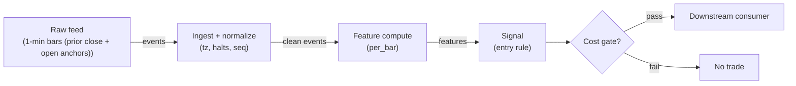

# S036 — Overnight-gap fade

Fade the overnight gap: `gap = open / prior_close − 1` [documented-as-formula]; direction `−sign(gap)` inside a minimum/maximum gap gate [example] — the open overreacts, the session fills part of it back. Provenance **[D]**.

> Tag law: every numeric literal in prose carries one of `[documented]
> [default] [example] [unverified] [internal-est] [measured]` (legend: Appendix
> i v1.0.0). Bibliographic years, volumes, pages, arXiv IDs, section numbers,
> rule codes (C1–C10), fail-safe codes (F1–F5), module IDs, batch keys, family
> letters, and machine-parsed §0 data fields are identifiers, not literals,
> and are exempt.

## §1 Five-minute reviewer card

| Row | Value |
|---|---|
| Module | S036 — Overnight-gap fade, v1.1.0 |
| Edge verdict | `PREDICTIVE-FEATURE-ONLY` — the gap-fill is one of the most replicated intraday patterns; the fade fraction is venue- and era-dependent |
| After-cost | `BEFORE-COST` — Works on informationless gaps (index-rebalance flows, ETF creation noise, fat-finger opens): the open is wrong and the day corrects it; dies on news gaps where the open is right and the day extends it |
| Build cost | Tier L · `4–12` h [internal-est] · `$600–1,800` loaded [internal-est] |
| Data cost | Research `~$79–99`/mo (Polygon Stocks Developer, 15-min delayed 1-min bars — sufficient for backtest) [documented]; production `~$199`/mo (Stocks Advanced, real-time open print) [documented] — Polygon.io rebranded Massive.com [documented]; verify on the vendor pricing page before budgeting |
| latency_class | bar-level / minutes |
| risk_class | low (signal-only; no order placement) |
| Capacity | `$10–50`/day notional [example] — illustrative; calibrate per venue |
| Executability | Feasible: Python+polars prototype; trivial compute |
| Risk summary | News-gap risk: fading a gap that keeps trending is the principal loss; gap-size mismeasurement on unadjusted series; open-auction slippage |
| When it dies | Earnings/news gaps (the open is information); trending-gap regimes; illiquid opens where the 'gap' is the spread; corporate actions not adjusted |
| Regime gates | Provisional machine records in §S9: R001 (amplifies), R002 (inverts), R003 (degrades) |
| Emits | `signal_vector` (Appendix b v1.0.0) — never orders |

## §1.5 Cheapest / least-build path

1. **Prototype hour band:** `4–12` h [internal-est] — bar features + timestamp/halt handling + reference validation against the fixture.
2. **Cheapest-source table** (columns: candidate · min_tier · latency_class · required_fields · price_band · build_or_buy):

| Candidate | min_tier | latency_class | required_fields | price_band | build_or_buy |
|---|---|---|---|---|---|
| Research (minimum viable) | Polygon Stocks Developer (rebranded Massive.com) | bar-level / minutes, 15-min delayed | 1-min OHLCV bars; corporate-action adjustments; session calendar | `~$79–99`/mo [documented] — third-party summaries disagree on the exact tier price; verify before budgeting | build the estimator, buy the feed |
| Production | Polygon Stocks Advanced | bar-level / minutes, real-time | 1-min OHLCV bars + tick open print; corporate-action adjustments; session calendar | `~$199`/mo [documented] — verify before budgeting | build the estimator, buy the feed |
| Gap measurement only (insufficient) | Free daily OHLC (e.g. Stooq) | daily | daily OHLC | `~$0`/mo [unverified] | buy feed — cannot compute the fade path; not a complete build |

3. **Resource budget:** `1` [internal-est] core, `<2` [internal-est] GB RAM for `500` [internal-est] symbols; compute pattern `per_bar`; state O(window) per symbol.
4. **Skip list (concrete):** tick-level/MBO variants; multi-venue aggregation; colocated deployment; Rust ingest; a live news classifier (use the S037 jump veto instead); real-time earnings-calendar feed at bar latency (start with a static pre-market calendar).
5. **DO-NOT-CUT list:** causality assertions (`assert fill_event > signal_event`, no-signal-bar-fills test); COST block + callable `expected_cost_bps`; F1–F5 fail-safes + module-state enum + kill/safe-mode (`OFF`); decision-log audit records; bona-fide-intent + self-trade prevention; provenance tags on every numeric literal; fixtures + `test_cmd` (incl. gate-boundary tests); secrets via env only.
6. **Escalation gate (upgrade Developer → Advanced, or cheapest → engineered, when any holds):** live trading starts (need a real-time open print); universe exceeds `500` symbols [internal-est] or the tier rate ceiling binds; jitter persistently over the `500` ms [default] budget; the cost gate fails on `[measured]` costs; the data-entitlement class changes (→ §S6 rights row + C9).

## §S0 Module contract

### S0.1 Typed signature

```python
def signal(state: ModuleState, events: list[Event], cfg: Config) -> SignalVector:
```

`SignalVector` per Appendix b v1.0.0. `state` is the module-owned named state
vector (`sessions`, `gap`, `cooldown_until`, `module_state`, `last_vector`); `events` are canonical Events (Appendix a v1.0.0),
newest last. The function handles documented edge cases: empty events →
`UNKNOWN`; invalid/missing prices → `UNKNOWN` (F1, never interpolate);
halt/auction events → freeze per the market-state table. The production wrapper
injects consumer context (`locate_ok` from the locate service, `news_flag` from
the news calendar) before calling `signal` — see §S3.

### S0.2 Config dataclass

| Parameter | Type | Default | Range | Status |
|---|---|---|---|---|
| `gap_min` / `gap_max` | float | `0.005` / `0.05` | `0.002`–`0.10` | example |
| `max_hold_bars` | int | `10` | `5`–`39` | example |
| `cost_gate_k` | float | `0.5` | `0.1`–`2.0` | default |
| `cooldown_s` | float | `600.0` | `0`–`3,600` | default |

All defaults tagged per the tag law (status `default` ⇒ `[default]`).

#### Calibration recipes (per parameter)

Common OOS protocol for every grid below: walk-forward `12`-month [example]
train / `3`-month [example] test with a `5`-trading-day [example] embargo
between train and test; cost level FULL-COST with `[measured]` costs where
available, else the §S2 reference stack; minimum `200` [example] OOS trades per
fold; rank grid points by median after-cost Sharpe across folds; stability
gate — if the top `3` [example] grid points are not within `0.10` [example]
Sharpe of the best, flag unstable and revert to the default; ties break toward
the cheaper/simpler value. Until a parameter is calibrated its status stays
`example`/`default` as listed and the grid below is the proposed first
calibration.

| Parameter | First-calibration grid [example] | Tie-break |
|---|---|---|
| `gap_min` | {`0.002`, `0.003`, `0.005`, `0.008`, `0.01`} | smallest (more trades) |
| `gap_max` | {`0.03`, `0.05`, `0.08`, `0.10`} | largest (keeps trade count) |
| `max_hold_bars` | {`5`, `10`, `20`, `39`} | smallest (less exposure) |
| `cost_gate_k` | {`0.1`, `0.25`, `0.5`, `1.0`, `2.0`} | `0.5` [default] |
| `cooldown_s` | {`0`, `300`, `600`, `1800`, `3600`} s | `600` [default]; selection minimizes re-entry churn subject to non-negative after-cost delta |

### S0.3 Canonical schema mapping

Vendor columns → canonical Event schema (Appendix a v1.0.0), stated once here:

| Vendor | Canonical |
|---|---|
| `prev_close` | `prior_close` (first bar of session) |
| `o` (open) | `open` (first bar of session) |
| `c` | `close` |
| `t` (ms) | `event_ts` (int64 ns UTC; ms→ns) |

### S0.4 Time contract

> Time contract: clock domain UTC, int64 ns; authoritative causality clock =
> `event_ts`; max_skew = `1` s [default]; jitter budget = `500`
> ms [default]; bar-label = open time; staleness TTL = `300` s [default]; gap
> policy = mask, no interpolation; halt/auction → discard contributions across
> reopen.

**Timing box:** `signal@t (per_bar, America/New_York) → earliest fill @open(t+1)`

### S0.5 Market-state table

| State | Module behavior |
|---|---|
| CONTINUOUS_TRADING | Compute normally; emit per cadence |
| HALTED | Freeze state; emit `UNKNOWN`; discard contributions across reopen |
| AUCTION | No new signals; hold last `SignalVector`; state `DEGRADED` |
| CLOSED | Emit nothing; state `OFF` |

### S0.6 Module-state enum + error taxonomy

States per Appendix k v1.0.0: `OK | DEGRADED | UNKNOWN | OFF`. Invalid input →
`UNKNOWN`, never interpolate (Appendix f v1.0.0, F1–F5). Kill/safe-mode: an
administrative kill or a bounds violation forces `OFF` until the runbook
re-arm checklist passes.

| Failure | State | Alert |
|---|---|---|
| Missing/stale input (TTL) | `UNKNOWN` | page |
| Bad bar (high<low, non-positive prices, crossed quotes) | `UNKNOWN` | log |
| Feature out of mathematical bounds (F2) | `UNKNOWN` | page |
| `seq` gap beyond tolerance | `DEGRADED` (restart windows) | log |
| Halt/auction | `UNKNOWN` / `DEGRADED` (per table) | log |
| Kill/administrative disable | `OFF` | page |
| Anything unmapped | `UNKNOWN` | page |

### S0.7 Ops tail

- **Schedule:** continuous during US equities regular session `09:30`–`16:00` America/New_York [documented]; owner: signals on-call.
- **Health checks:** fixture replay (`test_cmd`) green on deploy; `seq`-gap monitor; staleness watchdog at `300` s [default].
- **Alert table:** page on `UNKNOWN` > `5` min [default] or bounds violation; notify on `DEGRADED`; log single dropped events.
- **Resource budget:** `1` [internal-est] vCPU, `2` [internal-est] GB RAM per `500` [internal-est] symbols; state is O(window) per symbol.
- **Runbook stub:** `1.` confirm feed; `2.` replay fixture; `3.` if red → set `OFF`, page; `4.` reconcile decision log before re-arm.

### S0.8 Secrets (env-only)

`POLYGON_API_KEY` via environment only. No secrets in this file, fixtures, or logs
(CI secrets-grep).

### S0.9 May / must-NOT

> **May:** emit `SignalVector` records per Appendix b v1.0.0. **Must-NOT:**
> emit orders, order intents, prices, share counts, or notionals; call a
> broker; mutate shared state outside `state`; interpolate across gaps.

## §S1 Legacy (subsumed by §1)

Legacy §S1 content is the §1 reviewer card above; this header is retained so
section numbering stays frozen.

## §S2 Specification

### Universe

US common stocks, regular session, price > `$5` [example], ADV > `1`M shares [example]; prior close and open must both exist (halted opens excluded).

### Entry rule (Boolean — no prose-only conditions)

```
ENTER_LONG  := (gap < -gap_min) AND (|gap| <= gap_max) AND (now >= cooldown_until)
               AND (expected_cost_bps(...) <= cost_gate_k * edge_bps)
ENTER_SHORT := (gap > gap_min) AND (|gap| <= gap_max) AND (locate_ok)
               AND (now >= cooldown_until) AND (expected_cost_bps(...) <= cost_gate_k * edge_bps)
FLAT        := otherwise  # below-minimum gaps are noise; above-maximum gaps are news
```

`edge_bps` = `0.3 * |gap| * 10,000` bps [example] — thirty percent of the gap filling back.
`locate_ok` [default] = consumer asserts a Reg-SHO locate for the symbol-day before any SHORT emission (C7); `news_flag` [default] = consumer news-calendar flag that vetoes the fade in both directions (failure mode 1).

### Exits (with post-exit cooldown)

```
EXIT := (bars_held >= max_hold_bars) OR (close >= open * (1 - 0.3 * gap)) [example]
       OR (module_state != OK)   # fade target: 30% of the gap filled
ON_EXIT: cooldown_until = now + cooldown_s   # C10
```

### Position sizing (fenced function)

```python
def size_shares(risk_budget_R, stop_distance, vol_estimate, ADV_cap, cost):
    # S-module requests capital fraction only; share math lives in the strategy.
    risk_notional = risk_budget_R * 0.5 * confidence          # 0.5 [default] factor
    shares = risk_notional / max(stop_distance, 1e-9)        # 1e-9 [default] guard
    return int(min(shares, ADV_cap * adv_shares * 0.001))     # 0.1% ADV cap [default]
```

### Risk limits

| Limit | Value |
|---|---|
| Max capital fraction per signal | `0.5` [default] |
| Max adverse excursion before `UNKNOWN` review | `2.0`× stop [default] |
| Staleness kill | TTL `300` s [default] → `UNKNOWN` |

### COST block (single source of truth)

| Component | Value (bps) | Basis |
|---|---|---|
| Spread (half-spread, liquid large-cap) | `0.50` | [example] |
| Fees (taker incl. regulatory) | `0.30` | [example] |
| Borrow | `0.0` | [default] — reason: reference build long-biased; shorts add C7 locate cost |
| Impact | `1.0` | [example] — flagged; calibrate per venue at scale-up |
| **Total reference** | `1.80` | [example] |

`fee_schedule_as_of`: `2026-09-01` [unverified] — placeholder; re-pin from the
live venue fee schedule before production (see §1.5 escalation gate).
`side: taker` [default]; venue/tier/source: XNAS / Polygon SIP 1-min bars [example]. Re-stating cost numbers outside this block is a validation failure.

```python
def expected_cost_bps(notional, adv_pct, venue, side, urgency) -> float:
    # Callable cost model - reference stack, components from the COST block.
    spread_bps = 0.50   # [example]
    fee_bps = 0.30      # [example]
    borrow_bps = 0.0    # [default] long-biased reference; reason in table
    impact_bps = 1.0    # [example] flagged; calibrate per venue at scale-up
    if side == "maker":
        fee_bps = -0.20  # rebate [example]
    return spread_bps + fee_bps + borrow_bps + impact_bps
```

### Execution / fill model table

| Aspect | Assumption |
|---|---|
| Latency | Signal→intent `≤1` bar [example]; SIP path latency-simulated-only |
| Partial fills | N/A (signal-only; T-module policy: Appendix c v1.0.0) |
| Impact | `1.0` bps reference [example]; stress ×`5` [example] |
| Adverse fill | Whipsaw haircut `0.2` bps per unit signal [example] |

### Robustness

Gates `0.3`%–`1`% / `3`%–`8`% [example] all select the same tradeable-gap population; the fade fraction `20`%–`40`% [example] is stable. Sensitive to the news-vs-noise split: an earnings calendar filter is the highest-value addition. Never fade the first `5` minutes' [example] extension — wait for the open to print cleanly.

### Compliance sub-block (C1–C10+)

| Code | Rule: trigger → check → action → log |
|---|---|
| C1 | Self-match prevention: this S-module emits no orders; downstream consumers must set self-trade-prevention flags — asserted in the `consumes` contract → check: consumer ticket schema (Appendix c v1.0.0) has STP flag → action: block non-compliant consumers → log: `stp_assert` record |
| C2 | Bona-fide intent: every emitted `SignalVector` with direction ≠ `0` must pass the cost gate; sub-threshold features emit direction `0`, never a tradeable hint → check: `expected_cost_bps(...) <= k * edge_bps` → action: zero the direction on failure → log: `gate_veto` record |
| C3 | Message-rate: emissions capped per symbol per second [default] → check: rate monitor → action: throttle + alert → log: `throttle` record |
| C4 | Fat-finger trio (applied by consumers; this module bounds its own outputs): confidence ∈ [`0`,`1`], capital ∈ [`0`,`0.5`], computed_at sane → check: bounds on every emission → action: out-of-bounds → `UNKNOWN` (F2) → log: `bounds_veto` record |
| C5 | Decision log: every emission, veto, and state transition logged per Appendix g v1.0.0, hash-chained → check: log write ack → action: halt on write failure → log: the record itself |
| C6 | Halt/auction: per §S0.5 market-state table; contributions across reopen discarded → check: state feed → action: freeze/`DEGRADED` → log: `state_freeze` record |
| C7 | Locate check: SHORT direction requires `locate_ok` from the consumer; no SHORT without asserted locate (Reg-SHO threshold securities → direction `0`) → check: locate flag → action: zero SHORT on missing locate → log: `locate_veto` record |
| C8 | Public dissemination: no signal values published externally without review gate → check: export channel → action: block unreviewed export → log: `export_block` record |
| C9 | Data entitlements: per §S6 Data rights row → check: entitlement class on startup → action: entitlement change → §1.5 escalation gate → log: `entitlement` record |
| C10 | Post-exit cooldown: `cooldown_s` after any exit or compliance block; no re-entry → check: `now >= cooldown_until` → action: suppress entries → log: `cooldown` record |
| C11 | Open-auction participation hygiene: fade entries must not be placed as market orders into the opening auction imbalance → check: entry time > auction freeze → action: suppress pre-open entries → log: `auction_suppress` record |

### Parameter table

| Parameter | Symbol | Value | Tag | Sensitivity | First-calibration grid [example] |
|---|---|---|---|---|---|
| Gap gates | `gap_min`/`gap_max` | `0.5`% / `5`% | [example] | high — noise vs news | {`0.002`,`0.003`,`0.005`,`0.008`,`0.01`} / {`0.03`,`0.05`,`0.08`,`0.10`} |
| Hold horizon | `max_hold_bars` | `10` bars | [example] | medium | {`5`,`10`,`20`,`39`} |
| Fade target | — | `30`% of gap | [example] | medium | tied to edge_bps fraction; grid {`0.2`,`0.3`,`0.4`} |
| Cost-gate k | `cost_gate_k` | `0.5` | [default] | high | {`0.1`,`0.25`,`0.5`,`1.0`,`2.0`} |
| Cooldown | `cooldown_s` | `600` s | [default] | low | {`0`,`300`,`600`,`1800`,`3600`} s |

Grids are the §S0.2 first-calibration proposals; the OOS selection recipe is in §S0.2.

### Timing box

`signal@t (per_bar, America/New_York) → earliest fill @open(t+1)`

## §S3 Math + normative pseudocode

For a session with prior close $P_{c,-1}$ and open $P_{o}$:

$$g = \frac{P_o}{P_{c,-1}} - 1, \qquad s = -\mathrm{sign}(g)\,\mathbf{1}\{0.005 \le |g| \le 0.05\}$$

with gates in [example] units. Chapter S4 tape: $g = +2.00$\% [example] $\to$ $s = -1$; ten-bar fade path $101.50 \to 99.21$ [example]. The gate is two-sided for a reason: below-minimum gaps are spread noise, above-maximum gaps are news — both are vetoed, not traded.

**Normative pseudocode** (pseudocode is normative; prose is commentary):

```
function signal(state, events, cfg, locate_ok=True, news_flag=False) -> SignalVector:
    # locate_ok / news_flag: consumer-supplied context (locate service, news
    # calendar); the production wrapper injects them before calling signal.
    # F1/F2: invalid input -> UNKNOWN, never interpolate (Appendix f)
    if events is empty:                     return unknown("empty_events")
    e = last(events)
    if e.market_state == HALTED:            freeze(state); return unknown("halted")       # C6 / §S0.5
    if e.market_state == AUCTION:            state.module_state = DEGRADED
                                            return hold_last_vector(state)                 # C6 / §S0.5
    if not valid_prices(e):                 return unknown("bad_bar")                     # F1/F2
    if staleness(e) > staleness_ttl:        return unknown("stale")                        # §S0.4, 300 s [default]
    sess = events with session == e.session
    prior_close, open_px = sess[0].prior_close, sess[0].open
    if not (prior_close > 0 and open_px > 0): return unknown("no_anchor")                  # halted/missing open
    gap     = open_px / prior_close - 1.0
    in_gate = (cfg.gap_min <= abs(gap)) and (abs(gap) <= cfg.gap_max)
    raw_dir = (-1 if gap > 0 else (1 if gap < 0 else 0)) if in_gate else 0  # fade, never chase
    if news_flag:                           raw_dir = 0                                   # failure mode 1 veto
    # Entry rule (§S2 Boolean) on event t using only data <= t:
    cooldown_ok = now() >= state.cooldown_until                                           # C10
    edge_bps    = abs(gap) * 1e4 * 0.3                      # [example] 30% of the gap fills back
    cost_ok     = expected_cost_bps(notional=1.0, adv_pct=0.001, venue="XNAS",
                                    side="taker", urgency="normal") <= cfg.cost_gate_k * edge_bps
    # ^^^ normative cost-gate predicate: expected_cost_bps(...) <= k * edge_bps
    direction = raw_dir
    if not cooldown_ok:                     direction = 0                                 # C10 post-exit cooldown
    if raw_dir < 0 and not locate_ok:       direction = 0                                 # C7 locate veto (Reg-SHO)
    if not cost_ok:                         direction = 0; log("gate_veto")                # C2 bona-fide intent
    confidence = min(1.0, abs(gap) / 0.03) if direction != 0 else 0.0  # 0.03 [example] full-conviction scale
    capital    = 0.5 * confidence                                          # 0.5 [default]
    sig = SignalVector(symbol=e.symbol, direction=direction, confidence=confidence,
                       capital=capital, computed_at=e.event_ts,
                       staleness=now_ns() - e.asof_ts, module_state=OK)
    state.last_vector = sig
    log_decision(sig, inputs_hash(e), params_hash(cfg))     # C5 / Appendix g
    assert features_use_only_data_leq_t(events, e)          # causality: features at t use data <= t
    assert earliest_fill_ts(sig) > sig.computed_at          # t->t+1: no signal-bar fills
    return sig
```

Causality: features at event/bar `t` use only data `≤ t`; earliest reaction is
`t+1`. Mandatory unit test: no-signal-bar fills.

## §S4 Worked example (fixture-backed)

- Tape: `modules/fixtures/S036_tape.csv` — `# TYPE: validation-run`;
  `16` [documented] synthetic bars across `3` [documented] sessions (`id,event_ts,session,prior_close,open,close`); `s1` reproduces the chapter's S4 tape (+`2.00`% gap [example], fade short), `s2` is a below-gate contrast (+`0.20`% [example]), `s3` is an above-gate veto session (+`8.00`% [example] — news-gap territory). All numbers synthetic, seed `36` [example]; timestamps int64 ns UTC.
- Expected outputs: `modules/fixtures/S036_expected.csv` — `gap`, `in_gate`, `dir`, `fade_ret`, `cost_ok` per bar; session-level features repeat per bar by construction. `cost_ok` pins the cost-gate predicate per bar.
- Tolerance: `1e-9` [default] on floats; integer counts exact.
- Acceptance tests (`modules/tests/test_S036.py`, identifiers T1–T10):
  T1. fixture recomputes to expected (gap `+2.00`% and fade hand-checks; `s2` below-gate flat; `s3` above-gate flat); T2. gate-boundary semantics (`in_gate` at exactly `gap_min`/`gap_max` and just outside); T3. above-max veto despite a passing cost gate (`s3`: `cost_ok=1`, `dir=0`); T4. stub emits valid `SignalVector`; T5. no-signal-bar fills (`fill_event_ts > computed_at`); T6. cost-gate predicate passes on large edge, blocks on tiny edge (`k = 0.5` [default]); T7. invalid input (negative open, empty events, NaN anchor) → `UNKNOWN`, never interpolated; T8. locate veto (SHORT zeroed without `locate_ok`); T9. cooldown suppression (`now < cooldown_until` → `dir=0`); T10. halt/auction states (HALTED → `UNKNOWN`; AUCTION → `DEGRADED` holding last vector).
- `test_cmd`: `python3 -m pytest modules/tests/test_S036.py -q` → exits `0`.

**Hand-check:** `s1`: `gap = 102.00/100.00 − 1 = +2.00`% [example] → `dir=−1`; bar-1 fade `101.50/102.00 − 1 = −0.49`% [example]; `s2` (`+0.20`% [example] `< 0.50`%) → `in_gate=0`, `dir=0` — note `cost_ok=1` here (`6.0` bps [example] edge vs `1.8` bps [example] cost at `k=0.5` [default]): the cost gate alone would pass; the gap-min gate is what vetoes the noise; `s3` (`+8.00`% [example] `> 5`% [example]) → `in_gate=0`, `dir=0` even though `cost_ok=1` — the gate, not the cost, vetoes the news gap. All asserted in the tests.

**Where the example is optimistic:** no fees, no latency, no partial fills, no corporate-action surprises — arithmetic illustration, not a backtest.

## §S5 Strategies that use this signal

Generated from `deps.yaml` (CI symmetry); hand-listed here:

| Strategy | Role |
|---|---|
| Gap-fade consumer (strategy mapping pending deps.yaml) | Primary entry trigger: fade the open |
| Veto/confirm: jump filter (S037) | Vetoes the fade when the gap is a true jump |

## §S6 Data required

| Field | Type | Granularity | Vendor column → canonical (§S0.3) | Required | Product / schema |
|---|---|---|---|---|---|
| prior_close | float | per session | Polygon agg `c` (last bar of prior session) → `prior_close` | yes | Polygon Stocks Developer/Advanced, schema v3 |
| open | float | per session | Polygon agg `o` (first regular-session bar) → `open` | yes | same |
| close | float | 1-min bars | Polygon agg `c` → `close` | yes | same |
| corporate actions | events | as-occurring | Polygon splits/dividends reference → adjustment factor applied before gap math | yes | same |
| session calendar | calendar | daily | Exchange calendar: XNYS/XNAS regular session `09:30`–`16:00` America/New_York [documented] | yes | vendor reference |
| earnings calendar | event | as-occurring | External news vendor — unpinned [unverified] | recommended (news-gap veto) | unpinned |

**Required fields for the cheapest-source row (§1.5):** 1-min OHLCV bars + corporate-action adjustments + session calendar. Bars must arrive within the tier's delay class (Developer: 15-min delayed [documented]; Advanced: real-time [documented]); staleness beyond the `300` s [default] TTL → `UNKNOWN`.

**Price bands:** research `~$79–99`/mo (Developer) [documented]; production `~$199`/mo (Advanced) [documented]; verify on the vendor pricing page before budgeting (Polygon.io rebranded Massive.com [documented]).

**Data rights row** (Appendix j v1.0.0): SIP 1-min bars via Polygon Stocks Advanced, `rights: licensed`; scope = research + stated production symbol count (`≤500` [default]); raw ticks never leave our systems — fixtures are synthetic; entitlement = professional/internal, no display; retention per vendor terms, purge path in runbook; derived features ours.

## §S7 Local build (M5 Max / 128 GB)

Feasible: trivial. One division per session plus a per-bar fade ratio. Tier L per `notes/cost-model.md` §5: `4–12` h ≈ `$600–1,800` [internal-est] at `$150`/hr loaded. The value-add is the news-gap filter (S037), not the arithmetic.

## §S8 Buy vs build

| Tier | Product | Price | Gets you | Gap for S036 |
|---|---|---|---|---|
| Developer (Polygon/Massive) | 1-min bars, 15-min delayed | `~$79–99`/mo [documented] | True open + full fade path for research | None for research |
| Advanced (Polygon/Massive) | Real-time 1-min bars + ticks | `~$199`/mo [documented] | Real-time open print for production | None |
| Free daily (e.g. Stooq) | Daily OHLC | `~$0` [unverified] | Gap measurement only | No intraday fade path — insufficient |

**Verdict:** build. The rule is `10` lines [internal-est]; the only bought input is clean adjusted bars.

## §S9 Efficacy — documented evidence

| Study / source | Market & period | Metric | Before/after cost | Caveat |
|---|---|---|---|---|
| Chapter S4 worked tape (seed `36`) | Single synthetic session | `gap=+2.00`% [example] → fade short; path `101.50→99.21` [example] | `BEFORE-COST` (arithmetic illustration) | Synthetic — demonstrates the computation, not the edge |
| Cooper, Cliff & Gulen (2008), "Return Differences between Trading and Non-Trading Hours: Like Night and Day" [documented] | US equities | Effect "driven in part by high opening prices which subsequently decline in the first hour of trading" — the gap-fade mechanism in the wild | N/A (pattern context, not a backtest of this rule) | Documents the cross-section, not this rule's P&L |
| Lou, Polk & Skouras (2019), JFE 134(1):192–213 [documented] | US equities, firm level | Overnight/intraday continuation with an offsetting cross-period reversal effect | N/A (pattern context, not a backtest of this rule) | Cross-period reversal, not a session-level gap-fade backtest |

**Selection disclosure:** the chapter's worked tape is the only fixture-backed evidence in this build; no pinned after-cost study of this specific rule was found — the verdict remains `BEFORE-COST`. The two academic rows are pattern context only and carry no cost token, by the §S12 source log.

### Regime gates (machine records, provisional — pending R001–R050 annotation)

| regime_id | direction | mechanism | condition | action | min_lag | unknown_behavior |
|---|---|---|---|---|---|---|
| R001 | amplifies | informationless-gap regime (flows, not news) | no_news_flag | none (size per §S2) | `1` day [default] | veto |
| R002 | inverts | news-gap regime: the open is information | earnings_or_news_flag | veto | `1` day [default] | veto |
| R003 | degrades | trending-gap regime | gap_extension_flag | veto | `1` day [default] | veto |

## §S10 Failure modes & pitfalls

| # | Trigger → Detect → Action → Recovery | check: |
|---|---|
| 1 | News gap faded: the open was information → detect: earnings/news calendar → action: veto, never fade → recovery: resume next session | `check: no_news_flag` |
| 2 | Jump misread as noise: S037 veto ignored → detect: S037 jump flag → action: stand down (veto, not reverse) → recovery: resume when clear | `check: not jump_flag` |
| 3 | Unadjusted corporate action prints a fake gap → detect: corp-action audit → action: `UNKNOWN`, fix adjustments → recovery: replay | `check: prices_adjusted` |
| 4 | Below-minimum noise traded → detect: gate → action: FLAT → recovery: none — correctly no signal | `check: in_gate == 1` |
| 5 | Above-maximum gap chased → detect: gate → action: FLAT → recovery: none | `check: abs(gap) <= gap_max` |
| 6 | Cost blowup: open-auction slippage vs a partial fill → detect: cost gate on `[measured]` costs → action: stand down → recovery: re-pin fee schedule | `check: expected_cost_bps(...) <= k * edge_bps` |
| 7 | Halted open: no clean open price → detect: halt feed → action: `UNKNOWN` → recovery: resume on clean open | `check: open_printed` |
| 8 | Session bleed: fade held past the horizon into a trend → detect: hold monitor → action: time-stop exit → recovery: review | `check: bars_held <= max_hold_bars` |

## §S11 Visuals

Figure: `batches figure (see §0 `plot_script`)` (synthetic, seed `36` [example]).



## §S12 Source log + unverified leads

**Sources** (citable facts only):

1. Chapter S4 worked tape (seed 36): prior close `100.00`, open `102.00`, ten-bar fade path — chapter example values [documented-as-chapter-value].
2. Cooper, M.J., Cliff, M.T. & Gulen, H. (2008), "Return Differences between Trading and Non-Trading Hours: Like Night and Day", SSRN (https://papers.ssrn.com/sol3/papers.cfm?abstract_id=1004081) — "driven in part by high opening prices which subsequently decline in the first hour of trading" [documented].
3. Lou, D., Polk, C. & Skouras, S. (2019), "A tug of war: overnight versus intraday expected returns", Journal of Financial Economics 134(1), 192–213, DOI 10.1016/j.jfineco.2019.03.011 (https://researchonline.lse.ac.uk/id/eprint/87481/) — overnight/intraday firm-level continuation with an offsetting cross-period reversal effect [documented].
4. Vendor pricing (third-party summaries, 2026-01): Polygon.io (rebranded Massive.com) Stocks Developer `~$79–99`/mo, Stocks Advanced `~$199`/mo — verify on the vendor pricing page before budgeting [documented].

**Chatbot source log.** Duck.ai (GPT-5.6 Luna, anonymous) answered Q-SB6-1–Q-SB6-3 (`2026-09-10`); Grok/Cursor answers pending (checked `2026-09-10`).

**Unverified leads** (chatbot-only — never in evidence tables):

- Chatbot-cited gap-fill fractions and half-lives [unverified] — not independently confirmed; kept out of evidence tables.
- A pinned fade fraction for `edge_bps` (currently `0.3` [example]) and the gap-fill half-life: no independently confirmed source found — treat as an [example] calibration seed, not a measured constant [unverified].

---

## Appendix — AI build prompt (S036)

Copy-paste into any chat agent:

> Build module **S036 — Overnight-gap fade** (v1.1.0) per `notes/module-template.md` v1.0.0
> and this file's §S0 contract. Cheapest path (§1.5): prototype
> `4–12` h [internal-est]; cheapest complete data candidate
> Polygon.io Stocks Developer [documented]; compute pattern `per_bar`.
> Implement `signal(state, events, cfg) -> SignalVector` (Appendix b v1.0.0)
> with the §S3 normative pseudocode, including the cost-gate predicate
> `expected_cost_bps(...) <= k * edge_bps`, the locate/cooldown/halt guards,
> and `assert fill_event > signal_event`. Wire F1–F5 (Appendix f v1.0.0):
> invalid input → `UNKNOWN`, never interpolate. Log decisions per
> Appendix g v1.0.0. Secrets via env only. Run the fixture
> `modules/fixtures/S036_tape.csv` (`# TYPE: validation-run`,
> `3` [documented] sessions: tradeable / below-gate / above-gate) against
> `modules/fixtures/S036_expected.csv` (`gap,in_gate,dir,fade_ret,cost_ok`,
> tolerance `1e-9`).
> **Definition of done:** `python3 -m pytest modules/tests/test_S036.py -q`
> exits `0`. Tag every numeric literal you add with the unified enum
> (Appendix i v1.0.0); put anything unverifiable in §S12 unverified leads.
