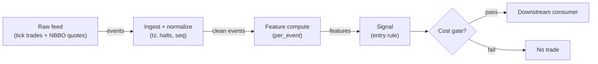

# S038 — Sub-hour microstructure reversal

Separate trade returns from midpoint returns at sub-hour horizons [documented-as-method]: generate the reversal on the midpoint move only — the trade move is contaminated by bid–ask bounce and overstates both the formation and the reversal. Provenance **[D]**.

> Tag law: every numeric literal in prose carries one of `[documented]
> [default] [example] [unverified] [internal-est] [measured]` (legend: Appendix
> i v1.0.0). Bibliographic years, volumes, pages, arXiv IDs, section numbers,
> rule codes (C1–C10), fail-safe codes (F1–F5), module IDs, batch keys, family
> letters, and machine-parsed §0 data fields are identifiers, not literals,
> and are exempt.

## §1 Five-minute reviewer card

| Row | Value |
|---|---|
| Module | S038 — Sub-hour microstructure reversal, v1.1.0 |
| Edge verdict | `PREDICTIVE-FEATURE-ONLY` — the midpoint/trade decomposition is textbook microstructure; the reversal itself is a weak, cost-sensitive effect |
| After-cost | `BEFORE-COST` — Works when the midpoint genuinely mean-reverts after uninformed order-flow pushes it (inventory effects): fade the midpoint displacement; dies when the move is information (adverse selection) or when the 'reversal' is just the bounce decaying |
| Build cost | Tier L · `4–12` h [internal-est] · `$600–1,800` loaded [internal-est] |
| Data cost | Research: Stocks Starter `$29`/mo (15-min delayed — offline research only) or yfinance `$0` [documented]; production: Stocks Advanced `$199`/mo real-time trades+quotes [documented] — bands indicative, verify before budgeting |
| latency_class | bar-level / minutes |
| risk_class | low (signal-only; no order placement) |
| Capacity | `$1–10`/day notional [example] — illustrative; calibrate per venue |
| Executability | Feasible: Python+polars prototype; trivial compute |
| Risk summary | Adverse-selection risk: fading an informed move; bounce-misattribution risk (the classic bug this module exists to prevent); sub-hour turnover multiplies costs |
| When it dies | Informed order flow (the midpoint keeps going); wide-spread names where the bounce dominates; latency regimes where the midpoint move is gone before the signal computes |
| Regime gates | Provisional: pending R001–R050 annotation |
| Emits | `signal_vector` (Appendix b v1.0.0) — never orders |

## §1.5 Cheapest / least-build path

1. **Prototype hour band:** `4–12` h [internal-est], broken down as: ingest + vendor column mapping + timestamp alignment `2–4` h [internal-est]; feature computation (mid/trade wedge) `1–2` h [internal-est]; cost-gate wiring + decision log `1–2` h [internal-est]; fixture replay + acceptance tests `1–2` h [internal-est]; halt/auction + cooldown edge cases `1–2` h [internal-est].
2. **Cheapest-source row:** min_tier = Massive (Polygon) Stocks Advanced [internal-est]; latency_class = bar-level / minutes; required_fields = 1-min OHLCV bars, tick trades, NBBO quotes, corporate-action adjustments, session calendar; price_band = `$199`/mo real-time (Advanced); `$29`/mo 15-min delayed (Starter — research only, insufficient for production) [documented]; build_or_buy = **build the estimator, buy the feed**. Note: Polygon.io rebranded to Massive (massive.com) in 2026 [unverified]; `api.polygon.io` endpoint and existing keys continue to work [unverified].
3. **Resource budget:** `1` core, `<2` GB RAM for `500` symbols [internal-est]; compute pattern `per_bar`.
4. **Skip list:** tick-level variants; multi-venue aggregation; Rust ingest; colocated deployment.
5. **DO-NOT-CUT list:** causality assertions (`assert fill_event > signal_event`, no-signal-bar-fills test); COST block + callable `expected_cost_bps`; F1–F5 fail-safes + module-state enum + kill/safe-mode (`OFF`); decision-log audit records; bona-fide-intent + self-trade prevention; provenance tags on every numeric literal; fixtures + `test_cmd`; secrets via env only.
6. **Escalation gate:** upgrade from cheapest when any holds — live universe beyond the cheapest band; jitter persistently over budget; cost gate failing on `[measured]` costs; entitlement class changes.

## §S0 Module contract

### S0.1 Typed signature

```python
def signal(state: ModuleState, events: list[Event], cfg: Config) -> SignalVector:
```

`SignalVector` per Appendix b v1.0.0. `state` is the module-owned named state
vector (`events`, `mid_series`, `cooldown_until`, `module_state`); `events` are canonical Events (Appendix a v1.0.0),
newest last. The function handles documented edge cases: empty events →
`UNKNOWN`; invalid/missing prices → `UNKNOWN` (F1, never interpolate);
halt/auction events → freeze per the market-state table.

### S0.2 Config dataclass

| Parameter | Type | Default | Range | Status |
|---|---|---|---|---|
| `form_bars` | int | `6` | `4`–`20` | calibrate |
| `mid_thresh` | float | `0.0003` | `0.0001`–`0.002` | calibrate |
| `cost_gate_k` | float | `0.5` | `0.1`–`2.0` | default |
| `cooldown_s` | float | `300.0` | `0`–`1,800` | default |

Status `calibrate` ⇒ shipped default is illustrative [example]; the final value is set by the calibration recipe in §S2. Status `default` ⇒ `[default]`.

### S0.3 Canonical schema mapping

Vendor columns → canonical Event schema (Appendix a v1.0.0), stated once here:

| Vendor | Canonical |
|---|---|
| `side` (bid/ask) | `side` |
| `px` (trade price) | `price` |
| `mid` | `mid` (quote midpoint) |
| `t` (ms) | `event_ts` (int64 ns UTC; ms→ns) |

### S0.4 Time contract

> Time contract: clock domain UTC, int64 ns; authoritative causality clock =
> `event_ts`; max_skew = `1` [default]; jitter budget = `100`
> [default]; bar-label = open time; staleness TTL = `60` [default]; gap
> policy = mask, no interpolation; halt/auction → discard contributions across
> reopen.

**Timing box:** `signal@t (per_event, America/New_York) → earliest fill @open(t+1)`

### S0.5 Market-state table

| State | Module behavior |
|---|---|
| CONTINUOUS_TRADING | Compute normally; emit per cadence |
| HALTED | Freeze state; emit `UNKNOWN`; discard contributions across reopen |
| AUCTION | No new signals; hold last `SignalVector`; state `DEGRADED` |
| CLOSED | Emit nothing; state `OFF` |

### S0.6 Module-state enum + error taxonomy

States per Appendix k v1.0.0: `OK | DEGRADED | UNKNOWN | OFF`. Invalid input →
`UNKNOWN`, never interpolate (Appendix f v1.0.0, F1–F5). Kill/safe-mode: an
administrative kill or a bounds violation forces `OFF` until the runbook
re-arm checklist passes.

| Failure | State | Alert |
|---|---|---|
| Missing/stale input (TTL) | `UNKNOWN` | page |
| Bad bar (high<low, non-positive prices, crossed quotes) | `UNKNOWN` | log |
| Feature out of mathematical bounds (F2) | `UNKNOWN` | page |
| `seq` gap beyond tolerance | `DEGRADED` (restart windows) | log |
| Halt/auction | `UNKNOWN` / `DEGRADED` (per table) | log |
| Kill/administrative disable | `OFF` | page |
| Anything unmapped | `UNKNOWN` | page |

### S0.7 Ops tail

- **Schedule:** continuous during US equities regular session `09:30`–`16:00` America/New_York [documented]; owner: signals on-call.
- **Health checks:** fixture replay (`test_cmd`) green on deploy; `seq`-gap monitor; staleness watchdog at `60` [default].
- **Alert table:** page on `UNKNOWN` > `5` min [default] or bounds violation; notify on `DEGRADED`; log single dropped events.
- **Resource budget:** `1` vCPU, `2` GB RAM per `500` symbols [internal-est]; state is O(window) per symbol.
- **Runbook stub:** `1.` confirm feed; `2.` replay fixture; `3.` if red → set `OFF`, page; `4.` reconcile decision log before re-arm.

### S0.8 Secrets (env-only)

`POLYGON_API_KEY` via environment only. No secrets in this file, fixtures, or logs
(CI secrets-grep).

### S0.9 May / must-NOT

> **May:** emit `SignalVector` records per Appendix b v1.0.0. **Must-NOT:**
> emit orders, order intents, prices, share counts, or notionals; call a
> broker; mutate shared state outside `state`; interpolate across gaps.

## §S1 Legacy (subsumed by §1)

Legacy §S1 content is the §1 reviewer card above; this header is retained so
section numbering stays frozen.

## §S2 Specification

### Universe

US common stocks with firm two-sided quotes, spread `<=5` bps [example], regular session; trade and quote feeds timestamp-aligned.

### Entry rule (Boolean — no prose-only conditions)

```
ENTER_LONG  := (|r_mid_form| >= mid_thresh) AND (r_mid_form < 0)
               AND (now >= cooldown_until) AND (expected_cost_bps(...) <= cost_gate_k * edge_bps)
ENTER_SHORT := (|r_mid_form| >= mid_thresh) AND (r_mid_form > 0) AND (locate_ok)
               AND (now >= cooldown_until) AND (expected_cost_bps(...) <= cost_gate_k * edge_bps)
FLAT        := otherwise  # r_trade NEVER enters the rule
```

`edge_bps` = `0.5 * |r_mid_form| * 10,000` bps [example] — half the midpoint displacement reverting.

### Exits (with post-exit cooldown)

```
EXIT := (midpoint retraces 50% of formation) [example] OR (events_held >= 12) [example]
       OR (module_state != OK)
ON_EXIT: cooldown_until = now + cooldown_s   # C10
```

### Position sizing (fenced function)

```python
def size_shares(risk_budget_R, stop_distance, vol_estimate, ADV_cap, cost,
                confidence, adv_shares):
    # S-module requests capital fraction only; share math lives in the strategy.
    risk_notional = risk_budget_R * 0.5 * confidence          # 0.5 [default] factor
    shares = risk_notional / max(stop_distance, 1e-9)        # 1e-9 [default] guard
    return int(min(shares, ADV_cap * adv_shares * 0.001))     # 0.1% ADV cap [default]
```

### Risk limits

| Limit | Value |
|---|---|
| Max capital fraction per signal | `0.5` [default] |
| Max adverse excursion before `UNKNOWN` review | `2.0`× stop [default] |
| Staleness kill | TTL `60` [default] → `UNKNOWN` |

### COST block (single source of truth)

| Component | Value (bps) | Basis |
|---|---|---|
| Spread (half-spread, liquid large-cap) | `0.50` | [example] |
| Fees (taker incl. regulatory) | `0.30` | [example] — cross-check: Nasdaq fee to remove liquidity `$0.0030`/share [documented] = `0.30` bps on a `$100` stock [example] |
| Borrow | `0.0` | [default] — reason: reference build long-biased; shorts add C7 locate cost |
| Borrow per day | `borrow_bps_per_day = 0.0` | [default] — reason: sub-hour hold, no overnight carry; set > 0 for multi-day shorts with documented locate/borrow rate |
| Impact | `1.0` | [example] — flagged; calibrate per venue at scale-up |
| **Total reference** | `1.80` | [example] |

`fee_schedule_as_of`: `2026-09-01` [unverified] — placeholder; pin the real
venue schedule before production. `side: taker` [default]; venue/tier/source:
XNAS / Massive Stocks Advanced [example]. Re-stating cost numbers outside this block is a validation failure.

```python
def expected_cost_bps(notional, adv_pct, venue, side, urgency) -> float:
    # Callable cost model - reference stack, components from the COST block.
    spread_bps = 0.50   # [example]
    fee_bps = 0.30      # [example]
    borrow_bps = 0.0    # [default] long-biased reference; reason in table
    impact_bps = 1.0    # [example] flagged; calibrate per venue at scale-up
    if side == "maker":
        fee_bps = -0.20  # rebate [example]
    return spread_bps + fee_bps + borrow_bps + impact_bps
```

### Execution / fill model table

| Aspect | Assumption |
|---|---|
| Latency | Signal→intent `≤1` event [example]; feed path latency-simulated-only |
| Partial fills | N/A (signal-only; T-module policy: Appendix c v1.0.0) |
| Impact | `1.0` bps reference [example]; stress ×`5` [example] |
| Adverse fill | Whipsaw haircut `0.2` bps per unit signal [example] |

### Robustness

Formation `4`–`12` events [example] all show the midpoint/trade wedge; the trigger `2`–`5` bps [example] is stable. The decomposition is the robust part; the reversal magnitude is not — halve the assumed reversion out-of-sample. Requires timestamp-aligned trade+quote feeds: a `100` ms [example] misalignment reintroduces the bounce.

### Compliance sub-block (C1–C10+)

| Code | Rule: trigger → check → action → log |
|---|---|
| C1 | Self-match prevention: this S-module emits no orders; downstream consumers must set self-trade-prevention flags — asserted in the `consumes` contract → check: consumer ticket schema (Appendix c v1.0.0) has STP flag → action: block non-compliant consumers → log: `stp_assert` record |
| C2 | Bona-fide intent: every emitted `SignalVector` with direction ≠ `0` must pass the cost gate; sub-threshold features emit direction `0`, never a tradeable hint → check: `expected_cost_bps(...) <= k * edge_bps` → action: zero the direction on failure → log: `gate_veto` record |
| C3 | Message-rate: emissions capped per symbol per second [default] → check: rate monitor → action: throttle + alert → log: `throttle` record |
| C4 | Fat-finger trio (applied by consumers; this module bounds its own outputs): confidence ∈ [`0`,`1`], capital ∈ [`0`,`0.5`], computed_at sane → check: bounds on every emission → action: out-of-bounds → `UNKNOWN` (F2) → log: `bounds_veto` record |
| C5 | Decision log: every emission, veto, and state transition logged per Appendix g v1.0.0, hash-chained → check: log write ack → action: halt on write failure → log: the record itself |
| C6 | Halt/auction: per §S0.5 market-state table; contributions across reopen discarded → check: state feed → action: freeze/`DEGRADED` → log: `state_freeze` record |
| C7 | Locate check: SHORT direction requires `locate_ok` from the consumer; no SHORT without asserted locate (Reg-SHO threshold securities → direction `0`) → check: locate flag → action: zero SHORT on missing locate → log: `locate_veto` record |
| C8 | Public dissemination: no signal values published externally without review gate → check: export channel → action: block unreviewed export → log: `export_block` record |
| C9 | Data entitlements: per §S6 Data rights row → check: entitlement class on startup → action: entitlement change → §1.5 escalation gate → log: `entitlement` record |
| C10 | Post-exit cooldown: `cooldown_s` after any exit or compliance block; no re-entry → check: `now >= cooldown_until` → action: suppress entries → log: `cooldown` record |
| C11 | Quote-stuffing hygiene: the signal must not be computed on flickering/non-firm quotes → check: quote firmness flag → action: mask non-firm quotes → log: `quote_mask` record |

### Parameter table

| Parameter | Symbol | Value | Tag | Status | Sensitivity |
|---|---|---|---|---|---|
| Formation window | `form_bars` | `6` events | [example] | calibrate | medium |
| Midpoint trigger | `mid_thresh` | `3` bps | [example] | calibrate | high |
| Cost-gate k | `cost_gate_k` | `0.5` | [default] | default | high |
| Post-exit cooldown | `cooldown_s` | `300` s | [default] | default | low |

### Calibration recipes (grid + OOS selection)

Shared protocol for every `calibrate` parameter: walk-forward with `3` [default] folds; embargo = one formation window after each train fold; OOS metric computed at cost level `FULL-COST` (measured stack once pinned); selection = max DSR-adjusted after-cost return per trigger; stability guard: winner's OOS metric within `20`% [default] of adjacent grid points (reject cliffs); final parameters frozen before the last OOS fold and never re-fit on it.

| Parameter | Grid | OOS selection recipe |
|---|---|---|
| `form_bars` | `{4, 6, 8, 12, 16, 20}` [example] | Require OOS trigger rate ≥ `50` [default] triggers/fold (sample-size floor); select max after-cost edge per trigger subject to the stability guard |
| `mid_thresh` | `{1, 2, 3, 5, 10, 20}` bps [example] | Maximize after-cost bps per trigger; reject thresholds where the cost gate passes < `10`% [default] of triggers (dead zone); prefer the smallest threshold that clears the gate reliably |
| `cost_gate_k` | `{0.25, 0.5, 1.0, 2.0}` [default] | Select the smallest `k` with OOS after-cost edge > `0` and ≥ `100` [default] gated triggers; shipped default `0.5` is the conservative start |
| `cooldown_s` | `{0, 60, 300, 900, 1800}` s [example] | Maximize after-cost edge per day subject to re-entry whipsaw (opposite-direction signal within `2×` [default] cooldown) < `5`% [default] of exits |

### Timing box

`signal@t (per_event, America/New_York) → earliest fill @open(t+1)`

## §S3 Math + normative pseudocode

With quote midpoints $m_t$ and trade prices $p_t$ over a $6$-event [example] formation window:

$$r^m_{\mathrm{form}} = \frac{m_5}{m_0} - 1, \qquad r^p_{\mathrm{form}} = \frac{p_5}{p_0} - 1$$

Chapter S4 tape (spread fixed at $0.02$ [example]): $r^p_{\mathrm{form}} = -0.0650$\% [example] vs $r^m_{\mathrm{form}} = -0.0450$\% [example]; reversal $r^p_{\mathrm{rev}} = +0.0330$\% [example] vs $r^m_{\mathrm{rev}} = +0.0130$\% [example]. The $2$bp [example] wedge is the bid–ask bounce: $|r^p| - |r^m| \approx$ spread. This is why the rule triggers on midpoints only: Roll (1984) shows trade-price changes carry bounce-induced negative serial dependence even when fundamentals do not move [documented] (see §S12 source 2), so trade returns overstate both the formation and the reversal. Trigger: $|r^m_{\mathrm{form}}| \ge 3$ bps [example] $\to$ fade $-\mathrm{sign}(r^m_{\mathrm{form}})$.

**Normative pseudocode** (pseudocode is normative; prose is commentary):

```
function signal(state, events, cfg) -> SignalVector:
    # --- F1/F2: validity first; invalid input -> UNKNOWN, never interpolate
    if events is empty: return SignalVector(direction=0, module_state=UNKNOWN)
    e = events[-1]                                       # newest last (canonical schema)
    if e.event_ts > now(): return UNKNOWN                # future-dated event
    if not valid(e): return UNKNOWN                      # non-positive px/mid, crossed quotes
    if market_state == HALTED: return UNKNOWN            # freeze; §S0.5
    if market_state == AUCTION: return SignalVector(direction=0, module_state=DEGRADED)
    staleness = now() - e.asof_ts
    if staleness > staleness_TTL: return UNKNOWN         # §S0.4 TTL

    # --- features: midpoint ONLY for the trigger; trade return is audit-only
    n = cfg.form_bars
    if len(events) < n: return SignalVector(direction=0, module_state=OK)  # warmup
    win = events[-n:]
    r_mid_form   = win[-1].mid   / win[0].mid   - 1.0     # trigger input
    r_trade_form = win[-1].price / win[0].price - 1.0     # audit only, NEVER traded (§S10.1)

    # --- entry rule (§S2 Boolean): fade the midpoint displacement
    direction = 0
    if abs(r_mid_form) >= cfg.mid_thresh:
        direction = -1 if r_mid_form > 0 else +1
    if now < state.cooldown_until: direction = 0          # C10 post-exit cooldown
    if direction == -1 and not locate_ok: direction = 0  # C7 locate gate for shorts

    # --- conviction: scales with displacement size, hard-bounded (C4)
    confidence = min(1.0, abs(r_mid_form) / 0.001) if direction != 0 else 0.0
    #              0.001 = 10 bps full-confidence scale [example]
    assert 0.0 <= confidence <= 1.0
    capital = 0.5 * confidence                            # 0.5 [default]
    assert 0.0 <= capital <= 0.5

    # --- normative cost gate (executable predicate): fee-covering entry
    edge_bps = 0.5 * abs(r_mid_form) * 1e4                # [example]: half the move reverts
    cost = expected_cost_bps(notional, adv_pct, venue, side, urgency)
    if not (cost <= cfg.cost_gate_k * edge_bps):
        direction, confidence, capital = 0, 0.0, 0.0     # C2: sub-threshold -> no tradeable hint

    sig = SignalVector(symbol=e.symbol, direction=direction, confidence=confidence,
                       capital=capital, computed_at=e.event_ts, staleness=staleness,
                       module_state=state.module_state)
    log_decision(sig, inputs_hash, params_hash)           # C5 / Appendix g
    assert fill_event_ts > sig.computed_at                # t->t+1: no signal-bar fills
    return sig
```

Causality: features at event/bar `t` use only data `≤ t`; earliest reaction is
`t+1`. Mandatory unit test: no-signal-bar fills.

## §S4 Worked example (fixture-backed)

- Tape: `modules/fixtures/S038_tape.csv` — `# TYPE: validation-run`;
  `12` synthetic trade events (`id,event_ts,side,price,mid`), fixed `0.02` spread [example]; the chapter's S4 tape. All numbers synthetic, seed `38` [example]; timestamps int64 ns UTC.
- Expected outputs: `modules/fixtures/S038_expected.csv` — `r_mid_0`, `r_trade_0` per event (returns since `e0`); formation/reversal statistics asserted in the test.
- Tolerance: `1e-9` on floats; integer counts exact.
- Acceptance tests (`modules/tests/test_S038.py`, `10` tests):
  `1.` fixture recomputes to expected (formation/reversal hand-checks; `2`bp bounce wedge; `e5` trigger met but cost-gate-blocked under default `k`); `2.` stub emits valid `SignalVector`; `3.` no-signal-bar fills (`fill_event_ts > computed_at`); `4.` cost-gate predicate passes on large edge, blocks on tiny edge (`k = 0.5` [default]); `5.` invalid input (negative mid) → `UNKNOWN`; `6.` cooldown suppresses re-entry (`now < cooldown_until` → `dir=0`); `7.` short without locate → vetoed (`dir=0`, C7); `8.` halted market → `UNKNOWN` (§S0.5); `9.` maker-side gate: rebate lowers cost, gate still gates; `10.` capital capped at `0.5` and confidence bounded (C4 fat-finger).
- `test_cmd`: `python3 -m pytest modules/tests/test_S038.py -q` → exits `0`.

**Hand-check:** formation `e0→e5`: trade `−0.0650`% [example], mid `−0.0450`% [example]; reversal `e5→e11`: trade `+0.0330`% [example], mid `+0.0130`% [example]; wedge `|r^p|−|r^m| = 2` bps [example]; stub at `e5`: trigger met (`|mid| = 4.5`bps `≥ 3`bps) but cost gate blocks (`1.8 > 0.5×2.25`) → `dir=0` under default `k=0.5` [default]; trigger logic confirmed with relaxed gate (`dir=+1`). Asserted in the test.

**Where the example is optimistic:** no fees, no latency, no partial fills, no corporate-action surprises — arithmetic illustration, not a backtest.

## §S5 Strategies that use this signal

Generated from `deps.yaml` (CI symmetry); hand-listed here:

| Strategy | Role |
|---|---|
| Microstructure-reversal consumer (strategy mapping pending deps.yaml) | Primary entry trigger: fade the midpoint move |
| Confirm: quote-feed health | Non-firm quotes veto entries |

## §S6 Data required

| Field | Type | Granularity | Vendor / product | Required columns | Price band | Notes |
|---|---|---|---|---|---|---|
| Trade prices + sides | float/str | tick | Massive (Polygon) Stocks Advanced | `price`, `size`, `side` (bid/ask), `event_ts` ns | `$199`/mo [documented] | Aligned with quotes; trades tape |
| Quote midpoints | float | tick | Massive (Polygon) Stocks Advanced | `bid`, `ask`, `mid`, firmness flag, `event_ts` ns | included above | Firm quotes only (C11) |
| 1-min OHLCV bars | float/int | 1-min | Massive (Polygon) Stocks Advanced | `o/h/l/c/v`, corporate-action adjustments | included above | Research/sanity layer |
| Timestamp alignment | ns | tick | feed + ingest code | `event_ts` vs `asof_ts` dual stamps | — | skew `<=100` ms [example] or mask |
| Session calendar | enum | day | vendor reference data | regular-session `09:30`–`16:00` ET, holidays | included above | No overnight formation windows |

Massive = rebranded Polygon.io (2026) [unverified]; existing `api.polygon.io` endpoints and keys continue to work [unverified]. Vendor schema version pinned in §0 `datasets` on ingest (`fingerprint: REPLACE_ON_INGEST`); verify the tick schema against current vendor docs before production wiring — the column names above are the canonical logical names (Appendix a v1.0.0), not vendor field names.

**Data rights row** (Appendix j v1.0.0): Tick trade+quote feed, `rights: licensed`; scope = research + stated production symbol count (`≤200` [default]); raw ticks never leave our systems — fixtures are synthetic; entitlement = professional/internal, no display; retention per vendor terms, purge path in runbook; derived features ours.

## §S7 Local build (M5 Max / 128 GB)

Feasible: light. Twelve events per signal, two divisions per event; the cost is the tick feed, not the math. Tier L per `notes/cost-model.md` §5: `4–12` h ≈ `$600–1,800` [internal-est] at `$150`/hr loaded. Timestamp alignment of trade/quote feeds is the engineering.

## §S8 Buy vs build

| Tier-1 (Massive/Polygon Stocks Advanced) | Trades + NBBO quotes | `$199`/mo [documented] | Aligned tick feeds | SIP latency |
| Tier-2 (Databento US Equities Mini, Standard) | L1 tick | `$199`/mo [documented] + usage [unverified] | Honest timestamps | Overkill for `12`-event windows |

**Verdict:** build the decomposition (`20` lines [internal-est]); buy the cheapest aligned trade+quote feed.

## §S9 Efficacy — documented evidence

| Study / source | Market & period | Metric | Before/after cost | Caveat |
|---|---|---|---|---|
| Chapter S4 worked tape (12 events) | Single synthetic episode | Mid/trade wedge `2` bps [example]; midpoint reversal `+0.0130`% [example] | `BEFORE-COST` (arithmetic illustration) | Synthetic — demonstrates the decomposition, not the edge |

**Selection disclosure:** the chapter's worked tape is the only fixture-backed evidence in this build; the midpoint/trade decomposition is textbook microstructure (Roll 1984 documents the bounce signature in trade-price changes — §S12 source 2), the reversal magnitude is the chapter's illustration [documented-as-assessment].

### Regime gates (machine records, provisional — pending R001–R050 annotation)

| regime_id | direction | mechanism | condition | action | min_lag | unknown_behavior |
|---|---|---|---|---|---|---|
| R001 | amplifies | uninformed-flow regime (inventory mean-reversion) | flow_flag | none (size per §S2) | `0` [default] | veto |
| R002 | inverts | informed-flow regime (adverse selection) | adverse_flag | veto | `0` [default] | veto |
| R003 | degrades | wide-spread names: bounce dominates | spread_filter | veto | `0` [default] | veto |

## §S10 Failure modes & pitfalls

| # | Trigger → Detect → Action → Recovery | check: |
|---|---|
| 1 | Bounce traded as signal: r_trade wired into the entry → detect: spec audit flags r_trade in entry path → action: halt, fix → recovery: re-run acceptance tests | `check: entry_uses_only_r_mid` |
| 2 | Adverse selection: fading an informed midpoint move → detect: trade-imbalance/adverse flag → action: veto → recovery: resume when clear | `check: not adverse_flag` |
| 3 | Misaligned timestamps reintroduce the bounce → detect: trade-quote skew monitor → action: mask, `DEGRADED` → recovery: re-align | `check: skew <= 100ms` |
| 4 | Non-firm/flickering quotes → detect: firmness flag → action: mask quotes → recovery: resume on firm book | `check: quotes_firm` |
| 5 | Lookahead: formation window includes future events → detect: causality audit → action: halt, fix → recovery: re-run no-signal-bar-fills test | `check: all(fill_ts > computed_at)` |
| 6 | Cost blowup: sub-hour turnover × spread → detect: cost gate on `[measured]` costs → action: stand down → recovery: re-pin fee schedule | `check: expected_cost_bps(...) <= k * edge_bps` |
| 7 | Threshold never clears on quiet names → detect: trigger-rate monitor → action: no signal (correct) → recovery: none | `check: trigger_rate_sane` |
| 8 | Session bleed: reversal held into a trend → detect: hold monitor → action: event-count stop → recovery: review | `check: events_held <= 12` |

## §S11 Visuals

Figure: `batches figure (see §0 `plot_script`)` (synthetic, seed `38` [example]).



## §S12 Source log + unverified leads

**Sources** (citable facts only):

1. Chapter S4 worked tape (12 events, fixed `0.02` spread): formation trade `−0.0650`% vs mid `−0.0450`%; reversal trade `+0.0330`% vs mid `+0.0130`% [documented-as-chapter-value].
2. Roll, R. (1984). "A Simple Implicit Measure of the Effective Bid-Ask Spread in an Efficient Market." *Journal of Finance* 39(4):1127–1139 [documented] — trading costs induce negative serial dependence in observed price changes; the effective spread is measurable from trade prices alone. Grounds the midpoint/trade wedge decomposition. (https://authors.library.caltech.edu/records/afwsc-6bb61)
3. Nasdaq Trader price list (current): fee to remove liquidity `$0.0030`/share, all MPIDs; fee to remove midpoint liquidity `$0.0030`/share [documented] (https://www.nasdaqtrader.com/trader.aspx?id=pricelisttrading2&l) — anchors the `0.30` bps taker-fee component on a `$100` stock [example].
4. 2026 third-party pricing surveys: Massive/Polygon Stocks Starter `$29`/mo (15-min delayed), Stocks Developer `$79`/mo, Stocks Advanced `$199`/mo; Databento US Equities Mini (Standard) `$199`/mo [documented] — verify against vendor pricing before budgeting.

**Chatbot source log.** Duck.ai (GPT-5.6 Luna, anonymous) answered Q-SB6-1–Q-SB6-3 (`2026-09-10`); Grok/Cursor answers pending (checked `2026-09-10`).

**Unverified leads** (chatbot-only — never in evidence tables):

- Chatbot-cited sub-hour reversal half-lives [unverified] — not independently confirmed; kept out of evidence tables.
- Polygon.io → Massive (massive.com) rebrand, 2026 [unverified] — reported in third-party 2026 pricing docs; existing keys/endpoints said to keep working; confirm on the vendor site before wiring.

---

## Appendix — AI build prompt (S038)

Copy-paste into any chat agent:

> Build module **S038 — Sub-hour microstructure reversal** per `notes/module-template.md` v1.0.0
> and this file's §S0 contract. Cheapest path (§1.5): prototype
> `4–12` h [internal-est]; cheapest data candidate
> Polygon.io Stocks Advanced [internal-est]; compute pattern `per_bar`.
> Implement `signal(state, events, cfg) -> SignalVector` (Appendix b v1.0.0)
> with the §S3 normative pseudocode, including the cost-gate predicate
> `expected_cost_bps(...) <= k * edge_bps` and `assert fill_event >
> signal_event`. Wire F1–F5 (Appendix f v1.0.0): invalid input → `UNKNOWN`,
> never interpolate. Log decisions per Appendix g v1.0.0. Secrets via env
> only. Run the fixture `modules/fixtures/S038_tape.csv`
> (`# TYPE: validation-run`) against `modules/fixtures/S038_expected.csv`
> (tolerance `1e-9`).
> **Definition of done:** `python3 -m pytest modules/tests/test_S038.py -q`
> exits `0` (`10` acceptance tests). Tag every numeric literal you add with the unified enum
> (Appendix i v1.0.0); put anything unverifiable in §S12 unverified leads.
