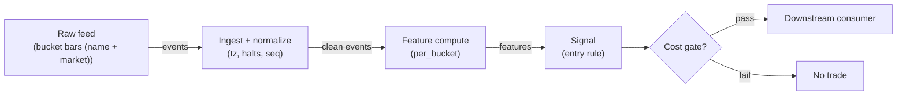

# S039 — Idiosyncratic residual reversal

Strip the market out of each name (`u = r − beta × r_m`) [documented-as-formula], cumulate the idiosyncratic residual, and fade the extreme: the residual is the only thing that can be idiosyncratic. Provenance **[I]**.

> Tag law: every numeric literal in prose carries one of `[documented]
> [default] [example] [unverified] [internal-est] [measured]` (legend: Appendix
> i v1.0.0). Bibliographic years, volumes, pages, arXiv IDs, section numbers,
> rule codes (C1–C10), fail-safe codes (F1–F5), module IDs, batch keys, family
> letters, and machine-parsed §0 data fields are identifiers, not literals,
> and are exempt.

## §1 Five-minute reviewer card

| Row | Value |
|---|---|
| Module | S039 — Idiosyncratic residual reversal, v1.0.0 |
| Edge verdict | `PREDICTIVE-FEATURE-ONLY` — residual reversal is the cross-sectional reversal (S035) with the market hedged; the edge is the same liquidity-pressure mean-reversion |
| After-cost | `BEFORE-COST` — Works when a name dislocates from its beta-implied path on uninformed flow: the residual snaps back; dies when the residual is information (the beta is wrong, or the name is repricing on news) |
| Build cost | Tier L · `4–12` h [internal-est] · `$600–1,800` loaded [internal-est] |
| Data cost | Research `~$30–200`/mo (SIP 1-min bars)` [unverified]; production `~$200`/mo + usage (SIP bars)` [unverified] — bands indicative, verify before budgeting |
| latency_class | bar-level / minutes |
| risk_class | low (signal-only; no order placement) |
| Capacity | `$10–50`/day notional [example] — illustrative; calibrate per venue |
| Executability | Feasible: Python+polars prototype; trivial compute |
| Risk summary | Beta-misspecification risk: a stale beta manufactures fake residuals; residual-vol misestimation mistimes the fade; single-name event risk on the faded name |
| When it dies | Beta breaks (corporate actions, regime changes); informed residuals (news on the name); crowded residual books; residual vol understated so the fade fires too early |
| Regime gates | Provisional: pending R001–R050 annotation |
| Emits | `signal_vector` (Appendix b v1.0.0) — never orders |

## §1.5 Cheapest / least-build path

1. **Prototype hour band:** `4–12` h [internal-est] — bar features + timestamp/halt handling + reference validation against the fixture.
2. **Cheapest-source row:** min_tier = Polygon.io Stocks Advanced — cheapest data source candidate [internal-est]; latency_class = bar-level / minutes; required_fields = 1-min OHLCV bars, corporate-action adjustments, session calendar; price_band = `~$30–200`/mo` [unverified] (indicative — verify before budgeting); build_or_buy = **build the estimator, buy the feed**.
3. **Resource budget:** `1` core, `<2` GB RAM for `500` symbols [internal-est]; compute pattern `per_bar`.
4. **Skip list:** tick-level variants; multi-venue aggregation; Rust ingest; colocated deployment.
5. **DO-NOT-CUT list:** causality assertions (`assert fill_event > signal_event`, no-signal-bar-fills test); COST block + callable `expected_cost_bps`; F1–F5 fail-safes + module-state enum + kill/safe-mode (`OFF`); decision-log audit records; bona-fide-intent + self-trade prevention; provenance tags on every numeric literal; fixtures + `test_cmd`; secrets via env only.
6. **Escalation gate:** upgrade from cheapest when any holds — live universe beyond the cheapest band; jitter persistently over budget; cost gate failing on `[measured]` costs; entitlement class changes.

## §S0 Module contract

### S0.1 Typed signature

```python
def signal(state: ModuleState, events: list[Event], cfg: Config) -> SignalVector:
```

`SignalVector` per Appendix b v1.0.0. `state` is the module-owned named state
vector (`residuals`, `cum_resid`, `cooldown_until`, `module_state`); `events` are canonical Events (Appendix a v1.0.0),
newest last. The function handles documented edge cases: empty events →
`UNKNOWN`; invalid/missing prices → `UNKNOWN` (F1, never interpolate);
halt/auction events → freeze per the market-state table.

### S0.2 Config dataclass

| Parameter | Type | Default | Range | Status |
|---|---|---|---|---|
| `beta_A` / `beta_B` | float | `1.0` / `0.9` | `0.3`–`2.0` | example |
| `z_thresh` | float | `2.0` | `1.5`–`3.0` | example |
| `cost_gate_k` | float | `0.5` | `0.1`–`2.0` | default |
| `cooldown_s` | float | `3,600.0` | `0`–`86,400` | default |

All defaults tagged per the tag law (status `default` ⇒ `[default]`).

### S0.3 Canonical schema mapping

Vendor columns → canonical Event schema (Appendix a v1.0.0), stated once here:

| Vendor | Canonical |
|---|---|
| `mkt_ret` | `mkt` (market bucket return) |
| `beta` | `beta` (name beta) |
| `ret` | `raw` (name bucket return) |
| `t` (ms) | `event_ts` (int64 ns UTC; ms→ns) |

### S0.4 Time contract

> Time contract: clock domain UTC, int64 ns; authoritative causality clock =
> `event_ts`; max_skew = `1` [default]; jitter budget = `500`
> [default]; bar-label = open time; staleness TTL = `3_600` [default]; gap
> policy = mask, no interpolation; halt/auction → discard contributions across
> reopen.

**Timing box:** `signal@t (per_bucket, America/New_York) → earliest fill @open(t+1)`

### S0.5 Market-state table

| State | Module behavior |
|---|---|
| CONTINUOUS_TRADING | Compute normally; emit per cadence |
| HALTED | Freeze state; emit `UNKNOWN`; discard contributions across reopen |
| AUCTION | No new signals; hold last `SignalVector`; state `DEGRADED` |
| CLOSED | Emit nothing; state `OFF` |

### S0.6 Module-state enum + error taxonomy

States per Appendix k v1.0.0: `OK | DEGRADED | UNKNOWN | OFF`. Invalid input →
`UNKNOWN`, never interpolate (Appendix f v1.0.0, F1–F5). Kill/safe-mode: an
administrative kill or a bounds violation forces `OFF` until the runbook
re-arm checklist passes.

| Failure | State | Alert |
|---|---|---|
| Missing/stale input (TTL) | `UNKNOWN` | page |
| Bad bar (high<low, non-positive prices, crossed quotes) | `UNKNOWN` | log |
| Feature out of mathematical bounds (F2) | `UNKNOWN` | page |
| `seq` gap beyond tolerance | `DEGRADED` (restart windows) | log |
| Halt/auction | `UNKNOWN` / `DEGRADED` (per table) | log |
| Kill/administrative disable | `OFF` | page |
| Anything unmapped | `UNKNOWN` | page |

### S0.7 Ops tail

- **Schedule:** continuous during US equities regular session `09:30`–`16:00` America/New_York [documented]; owner: signals on-call.
- **Health checks:** fixture replay (`test_cmd`) green on deploy; `seq`-gap monitor; staleness watchdog at `3_600` [default].
- **Alert table:** page on `UNKNOWN` > `5` min [default] or bounds violation; notify on `DEGRADED`; log single dropped events.
- **Resource budget:** `1` vCPU, `2` GB RAM per `500` symbols [internal-est]; state is O(window) per symbol.
- **Runbook stub:** `1.` confirm feed; `2.` replay fixture; `3.` if red → set `OFF`, page; `4.` reconcile decision log before re-arm.

### S0.8 Secrets (env-only)

`POLYGON_API_KEY` via environment only. No secrets in this file, fixtures, or logs
(CI secrets-grep).

### S0.9 May / must-NOT

> **May:** emit `SignalVector` records per Appendix b v1.0.0. **Must-NOT:**
> emit orders, order intents, prices, share counts, or notionals; call a
> broker; mutate shared state outside `state`; interpolate across gaps.

## §S1 Legacy (subsumed by §1)

Legacy §S1 content is the §1 reviewer card above; this header is retained so
section numbering stays frozen.

## §S2 Specification

### Universe

US common stocks with stable estimated betas, price > `$5` [example]; market return from a broad index future or ETF; buckets `5`–`60` min [example].

### Entry rule (Boolean — no prose-only conditions)

```
ENTER_LONG  := (z <= -z_thresh) AND (beta_fresh) AND (now >= cooldown_until)
               AND (expected_cost_bps(...) <= cost_gate_k * edge_bps)
ENTER_SHORT := (z >= z_thresh) AND (beta_fresh) AND (locate_ok)
               AND (now >= cooldown_until) AND (expected_cost_bps(...) <= cost_gate_k * edge_bps)
FLAT        := otherwise  # |z| < thresh -> no fade
```

`edge_bps` = `50 * |z|` bps [example] — fifty bps per unit of residual z-score.

### Exits (with post-exit cooldown)

```
EXIT := (|z| <= 0.5) [example] OR (beta_stale) OR (module_state != OK)
ON_EXIT: cooldown_until = now + cooldown_s   # C10
```

### Position sizing (fenced function)

```python
def size_shares(risk_budget_R, stop_distance, vol_estimate, ADV_cap, cost):
    # S-module requests capital fraction only; share math lives in the strategy.
    risk_notional = risk_budget_R * 0.5 * confidence          # 0.5 [default] factor
    shares = risk_notional / max(stop_distance, 1e-9)        # 1e-9 [default] guard
    return int(min(shares, ADV_cap * adv_shares * 0.001))     # 0.1% ADV cap [default]
```

### Risk limits

| Limit | Value |
|---|---|
| Max capital fraction per signal | `0.5` [default] |
| Max adverse excursion before `UNKNOWN` review | `2.0`× stop [default] |
| Staleness kill | TTL `3_600` [default] → `UNKNOWN` |

### COST block (single source of truth)

| Component | Value (bps) | Basis |
|---|---|---|
| Spread (half-spread, large-cap) | `0.50` | [example] |
| Fees (taker incl. regulatory) | `0.30` | [example] |
| Borrow (possible short residual) | `0.50` | [example] — reason: fade may short; C7 locate required |
| Impact | `1.00` | [example] — flagged; calibrate per venue |
| **Total reference** | `2.30` | [example] |

`fee_schedule_as_of`: `2026-09-01` [unverified] — placeholder; pin the real
venue schedule before production. `side: taker` [default]; venue/tier/source:
XNAS / Polygon SIP 1-min bars [example]. Re-stating cost numbers outside this block is a validation failure.

```python
def expected_cost_bps(notional, adv_pct, venue, side, urgency) -> float:
    # Callable cost model - reference stack, components from the COST block.
    spread_bps = 0.50   # [example]
    fee_bps = 0.30      # [example]
    borrow_bps = 0.50   # [example] fade may short; reason in table
    impact_bps = 1.00   # [example] flagged; calibrate per venue at scale-up
    return spread_bps + fee_bps + borrow_bps + impact_bps
```

### Execution / fill model table

| Aspect | Assumption |
|---|---|
| Latency | Signal→intent `≤1` event [example]; feed path latency-simulated-only |
| Partial fills | N/A (signal-only; T-module policy: Appendix c v1.0.0) |
| Impact | `1.0` bps reference [example]; stress ×`5` [example] |
| Adverse fill | Whipsaw haircut `0.2` bps per unit signal [example] |

### Robustness

Threshold `1.5`–`3.0` [example] selects the same extreme residuals; the sign is robust. The fragile inputs are beta and sigma_hat: re-estimate beta on a rolling `60`-day [example] window and sigma_hat on trailing residual vol; a stale beta manufactures fake residuals. Never fade a residual on a name with pending news — the residual is information then.

### Compliance sub-block (C1–C10+)

| Code | Rule: trigger → check → action → log |
|---|---|
| C1 | Self-match prevention: this S-module emits no orders; downstream consumers must set self-trade-prevention flags — asserted in the `consumes` contract → check: consumer ticket schema (Appendix c v1.0.0) has STP flag → action: block non-compliant consumers → log: `stp_assert` record |
| C2 | Bona-fide intent: every emitted `SignalVector` with direction ≠ `0` must pass the cost gate; sub-threshold features emit direction `0`, never a tradeable hint → check: `expected_cost_bps(...) <= k * edge_bps` → action: zero the direction on failure → log: `gate_veto` record |
| C3 | Message-rate: emissions capped per symbol per second [default] → check: rate monitor → action: throttle + alert → log: `throttle` record |
| C4 | Fat-finger trio (applied by consumers; this module bounds its own outputs): confidence ∈ [`0`,`1`], capital ∈ [`0`,`0.5`], computed_at sane → check: bounds on every emission → action: out-of-bounds → `UNKNOWN` (F2) → log: `bounds_veto` record |
| C5 | Decision log: every emission, veto, and state transition logged per Appendix g v1.0.0, hash-chained → check: log write ack → action: halt on write failure → log: the record itself |
| C6 | Halt/auction: per §S0.5 market-state table; contributions across reopen discarded → check: state feed → action: freeze/`DEGRADED` → log: `state_freeze` record |
| C7 | Locate check: SHORT direction requires `locate_ok` from the consumer; no SHORT without asserted locate (Reg-SHO threshold securities → direction `0`) → check: locate flag → action: zero SHORT on missing locate → log: `locate_veto` record |
| C8 | Public dissemination: no signal values published externally without review gate → check: export channel → action: block unreviewed export → log: `export_block` record |
| C9 | Data entitlements: per §S6 Data rights row → check: entitlement class on startup → action: entitlement change → §1.5 escalation gate → log: `entitlement` record |
| C10 | Post-exit cooldown: `cooldown_s` after any exit or compliance block; no re-entry → check: `now >= cooldown_until` → action: suppress entries → log: `cooldown` record |
| C11 | Beta-freshness hygiene: fades require a beta estimated within the trailing window; stale betas veto entries → check: beta_age <= window → action: veto → log: `beta_stale` record |

### Parameter table

| Parameter | Symbol | Value | Tag | Sensitivity |
|---|---|---|---|---|
| Betas | `beta_A`/`beta_B` | `1.0`/`0.9` | [example] | high — misspecification |
| Residual vol | `sigma_hat` | `0.1233`% / `0.22`% | [example] | high — timing |
| Fade trigger | `z_thresh` | `2.0` | [example] | medium |

### Timing box

`signal@t (per_bucket, America/New_York) → earliest fill @open(t+1)`

## §S3 Math + normative pseudocode

For name $i$ in bucket $t$ with market return $r_{m,t}$:

$$u_{i,t} = r_{i,t} - \beta_i\, r_{m,t}, \qquad C_{i,T} = \sum_{t=1}^{T} u_{i,t}, \qquad z_{i,T} = \frac{C_{i,T}}{\hat\sigma_i}$$

Chapter S4 (six buckets, $\beta_A = 1.0$ [example], $\beta_B = 0.9$ [example], $\hat\sigma_A = 0.1233$\% [example], $\hat\sigma_B = 0.22$\% [example]): $C_A = -0.09$\% [example], $z_A = -0.73$ [example] (no fade); $C_B = -0.47$\% [example], $z_B = -2.15$ [example] $\to$ fade B only (long B). The vol estimates are pinned example inputs — misestimating $\hat\sigma$ mistimes the fade.

**Normative pseudocode** (pseudocode is normative; prose is commentary):

```
function signal(state, events, cfg) -> SignalVector:
    assert events non-empty else return UNKNOWN                    # F1
    e = events[-1]
    assert valid(e) else return UNKNOWN                            # F1/F2: never interpolate
    u = r_raw - beta * r_mkt                              # idiosyncratic residual
    cum_u += u;  z = cum_u / sigma_hat                     # pinned vol estimate
    direction = -sign(z) if abs(z) >= z_thresh else 0       # fade the extreme
    edge_bps = abs(f["z"]) * 50.0                                       # [example]
    cost_ok = expected_cost_bps(...) <= k * edge_bps
    # ^^^ normative cost-gate predicate: expected_cost_bps(...) <= k * edge_bps
    direction = entry_rule(e, features, cost_ok, cfg)              # §S2 Boolean rule
    confidence = min(1, conviction(features)) if direction != 0 else 0
    capital = 0.5 * confidence                                     # 0.5 [default]
    sig = SignalVector(symbol=e.symbol, direction, confidence, capital,
                       computed_at=e.event_ts, staleness=now()-e.asof_ts,
                       module_state=state.module_state)
    log_decision(sig, inputs_hash, params_hash)                    # C5 / Appendix g
    assert fill_event > signal_event                               # t→t+1: no signal-bar fills
    return sig
```

Causality: features at event/bar `t` use only data `≤ t`; earliest reaction is
`t+1`. Mandatory unit test: no-signal-bar fills.

## §S4 Worked example (fixture-backed)

- Tape: `modules/fixtures/S039_tape.csv` — `# TYPE: validation-run`;
  `12` synthetic bucket/name rows (`id,event_ts,bucket,name,mkt,beta,raw`); the chapter's S4 six-bucket tape for names A and B. All numbers synthetic, seed `39` [example]; timestamps int64 ns UTC.
- Expected outputs: `modules/fixtures/S039_expected.csv` — `u`, `cum`, `z`, `fade`, `dir` per row (running cumulation per name); only B's final row triggers.
- Tolerance: `1e-9` on floats; integer counts exact.
- Acceptance tests (`modules/tests/test_S039.py`, `5` tests):
  `1.` fixture recomputes to expected (cum/z hand-checks; fade-B-only); `2.` stub emits valid `SignalVector`; `3.` no-signal-bar fills (`fill_event_ts > computed_at`); `4.` cost-gate predicate passes on large edge, blocks on tiny edge (`k = 0.5` [default]); `5.` invalid input (negative beta) → `UNKNOWN`.
- `test_cmd`: `python3 -m pytest modules/tests/test_S039.py -q` → exits `0`.

**Hand-check:** `b6A`: `cum = −0.09`% [example], `z = −0.73` [example] → `fade=0`; `b6B`: `cum = −0.473`% [example], `z = −2.15` [example] → `fade=1`, `dir=+1` (long B) — asserted in the test.

**Where the example is optimistic:** no fees, no latency, no partial fills, no corporate-action surprises — arithmetic illustration, not a backtest.

## §S5 Strategies that use this signal

Generated from `deps.yaml` (CI symmetry); hand-listed here:

| Strategy | Role |
|---|---|
| Residual-reversal consumer (strategy mapping pending deps.yaml) | Primary entry trigger: fade the extreme residual |
| Hedge: market leg | The beta hedge is held outside the signal |

## §S6 Data required

| Field | Type | Granularity | Source tier | Notes |
|---|---|---|---|---|
| Name returns | float | bucket bars | Tier 1 | Adjusted |
| Market returns | float | bucket bars | Tier 1 | Index future or ETF |
| Beta estimates | float | daily | Tier 1 | Rolling `60`-day [example] |
| News calendar | event | as-occurring | Tier 1 | Informed-residual filter |

**Data rights row** (Appendix j v1.0.0): SIP bars via Polygon Stocks Advanced, `rights: licensed`; scope = research + stated production symbol count (`≤500` [default]); raw ticks never leave our systems — fixtures are synthetic; entitlement = professional/internal, no display; retention per vendor terms, purge path in runbook; derived features ours.

## §S7 Local build (M5 Max / 128 GB)

Feasible: trivial. One multiply-subtract per name per bucket, one running sum. Tier L per `notes/cost-model.md` §5: `4–12` h ≈ `$600–1,800` [internal-est] at `$150`/hr loaded. The engineering is beta estimation and freshness, not the residual arithmetic.

## §S8 Buy vs build

| Tier-1 (Polygon Stocks Advanced) | Adjusted bars | ~`$30–200`/mo | Clean inputs | No beta service |
| Build: beta estimator | Rolling regression | `1`–`2` days [internal-est] | Fresh betas | Must maintain |

**Verdict:** build. The residual is `5` lines [internal-est]; the beta estimator is the only real work.

## §S9 Efficacy — documented evidence

| Study / source | Market & period | Metric | Before/after cost | Caveat |
|---|---|---|---|---|
| Chapter S4 worked tape (six buckets) | `2` synthetic names | `z_B=−2.15` [example] → fade B only | `BEFORE-COST` (arithmetic illustration) | Synthetic — demonstrates the computation |
| Jegadeesh (1990), *J. Finance* | US equities | Cross-sectional reversals — the unhedged analogue | `BEFORE-COST` | The chapter's stated lineage |

**Selection disclosure:** the chapter's worked tape plus the reversal literature it cites; the residual-vol estimates are pinned example inputs, not measured [documented-as-assessment].

### Regime gates (machine records, provisional — pending R001–R050 annotation)

| regime_id | direction | mechanism | condition | action | min_lag | unknown_behavior |
|---|---|---|---|---|---|---|
| R001 | amplifies | uninformed-flow dislocation | flow_flag | none (size per §S2) | `0` [default] | veto |
| R002 | inverts | informed residual (news on the name) | news_flag | veto | `0` [default] | veto |
| R003 | degrades | stale beta manufactures fake residuals | beta_stale | veto | `0` [default] | veto |

## §S10 Failure modes & pitfalls

| # | Trigger → Detect → Action → Recovery | check: |
|---|---|
| 1 | Stale beta manufactures fake residuals → detect: beta age > window → action: veto entries → recovery: re-estimate | `check: beta_fresh` |
| 2 | Informed residual faded (news on the name) → detect: news calendar → action: veto → recovery: resume ex-event | `check: no_news_flag` |
| 3 | Sigma_hat understated: fade fires too early → detect: trailing residual-vol monitor → action: widen trigger → recovery: re-pin | `check: sigma_fresh` |
| 4 | Market return mismeasured → detect: index-feed sanity → action: `UNKNOWN` → recovery: fix feed | `check: mkt_sane` |
| 5 | Lookahead: future buckets in the cumulation → detect: causality audit → action: halt, fix → recovery: re-run no-signal-bar-fills test | `check: all(fill_ts > computed_at)` |
| 6 | Cost blowup vs a slow residual snap-back → detect: cost gate on `[measured]` costs → action: stand down → recovery: re-pin fee schedule | `check: expected_cost_bps(...) <= k * edge_bps` |
| 7 | Single-name event risk on the faded name → detect: position-level news monitor (consumer) → action: exit → recovery: review | `check: no_name_news` |
| 8 | Residual never reaches the trigger → detect: trigger-rate monitor → action: no signal (correct) → recovery: none | `check: trigger_rate_sane` |

## §S11 Visuals

Figure: `batches figure (see §0 `plot_script`)` (synthetic, seed `39` [example]).



## §S12 Source log + unverified leads

**Sources** (citable facts only):

1. Chapter S4 worked values: six buckets, `beta_A=1.0`, `beta_B=0.9`, `cumA=−0.09`%, `z_A=−0.73`, `cumB=−0.47`%, `z_B=−2.15` [documented-as-chapter-value].

**Chatbot source log.** Duck.ai (GPT-5.6 Luna, anonymous) answered Q-SB6-1–Q-SB6-3 (`2026-09-10`); Grok/Cursor answers pending (checked `2026-09-10`).

**Unverified leads** (chatbot-only — never in evidence tables):

- Chatbot-cited residual-reversal Sharpe figures [unverified] — not independently confirmed; kept out of evidence tables.
- Provenance note: this chapter's source mix was documented/secondary-research (D/SR), so the module carries tier **I** with this explanatory note [internal-est].

---

## Appendix — AI build prompt (S039)

Copy-paste into any chat agent:

> Build module **S039 — Idiosyncratic residual reversal** per `notes/module-template.md` v1.0.0
> and this file's §S0 contract. Cheapest path (§1.5): prototype
> `4–12` h [internal-est]; cheapest data candidate
> Polygon.io Stocks Advanced [internal-est]; compute pattern `per_bar`.
> Implement `signal(state, events, cfg) -> SignalVector` (Appendix b v1.0.0)
> with the §S3 normative pseudocode, including the cost-gate predicate
> `expected_cost_bps(...) <= k * edge_bps` and `assert fill_event >
> signal_event`. Wire F1–F5 (Appendix f v1.0.0): invalid input → `UNKNOWN`,
> never interpolate. Log decisions per Appendix g v1.0.0. Secrets via env
> only. Run the fixture `modules/fixtures/S039_tape.csv`
> (`# TYPE: validation-run`) against `modules/fixtures/S039_expected.csv`
> (tolerance `1e-9`).
> **Definition of done:** `python3 -m pytest modules/tests/test_S039.py -q`
> exits `0`. Tag every numeric literal you add with the unified enum
> (Appendix i v1.0.0); put anything unverifiable in §S12 unverified leads.
