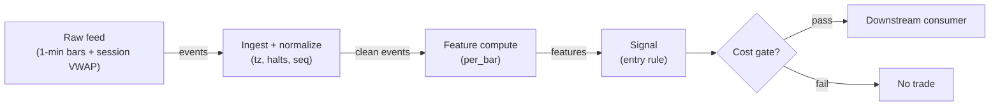

# S040 — VWAP-deviation mean reversion

Fade deviations from VWAP: `z = (close − VWAP) / sigma` [documented-as-formula] with an expanding sample-std sigma guarded by a warmup — the benchmark institutions actually trade against. Provenance **[I]**.

> Tag law: every numeric literal in prose carries one of `[documented]
> [default] [example] [unverified] [internal-est] [measured]` (legend: Appendix
> i v1.0.0). Bibliographic years, volumes, pages, arXiv IDs, section numbers,
> rule codes (C1–C10), fail-safe codes (F1–F5), module IDs, batch keys, family
> letters, and machine-parsed §0 data fields are identifiers, not literals,
> and are exempt.

## §1 Five-minute reviewer card

| Row | Value |
|---|---|
| Module | S040 — VWAP-deviation mean reversion, v1.1.0 |
| Edge verdict | `PREDICTIVE-FEATURE-ONLY` — VWAP-reversion is the institutional benchmark trade; the documented edge accrues to liquidity providers, not to naive faders |
| After-cost | `BEFORE-COST` — Works when the deviation is uninformed flow leaning on the book: price snaps back to VWAP; dies on informed deviations (the VWAP itself is moving) and in one-way trend days where fading VWAP is fading the day |
| Build cost | Tier L · `4–12` h [internal-est] · `$600–1,800` loaded [internal-est] |
| Data cost | Research `~$79`/mo (delayed tier, fixture validation only) [unverified]; production `~$199`/mo (Massive Stocks Advanced, real-time) [unverified] — verify before budgeting |
| latency_class | bar-level / minutes |
| risk_class | low (signal-only; no order placement) |
| Capacity | `$25–100`/day notional [example] — illustrative; calibrate per venue |
| Executability | Feasible: Python+polars prototype; trivial compute |
| Risk summary | Trend-day risk: the classic VWAP-fade blowup; sigma-warmup risk (trading before sigma exists); VWAP mismeasurement on bad prints |
| When it dies | One-way trend days; informed order flow pushing through VWAP; wide-spread names where the deviation is the spread; stale VWAP from bad ticks |
| Regime gates | Provisional: pending R001–R050 annotation |
| Emits | `signal_vector` (Appendix b v1.0.0) — never orders |

## §1.5 Cheapest / least-build path

1. **Prototype hour band:** `4–12` h [internal-est] — bar features + timestamp/halt handling + reference validation against the fixture.
2. **Cheapest-source row:** min_tier = Massive **Stocks Advanced** (Polygon rebrand, late 2025) [unverified] — cheapest data source candidate [internal-est]; latency_class = bar-level / minutes; required_fields = 1-min OHLCV bars (vendor fields `c` → `close`, `vwap` → session VWAP, `t` ms → `event_ts` ns), corporate-action adjustments, session calendar; price_band = `~$199`/mo production real-time [unverified]; research/delayed path = Stocks Developer `~$79`/mo, 15-min delayed [unverified] — fixture validation only, never production; build_or_buy = **build the estimator, buy the feed**.
3. **Resource budget:** `1` core, `<2` GB RAM for `500` symbols [internal-est]; compute pattern `per_bar`.
4. **Skip list:** tick-level variants; multi-venue aggregation; Rust ingest; colocated deployment.
5. **DO-NOT-CUT list:** causality assertions (`assert fill_event > signal_event`, no-signal-bar-fills test); COST block + callable `expected_cost_bps`; F1–F5 fail-safes + module-state enum + kill/safe-mode (`OFF`); decision-log audit records; bona-fide-intent + self-trade prevention; provenance tags on every numeric literal; fixtures + `test_cmd`; secrets via env only.
6. **Escalation gate:** upgrade from cheapest when any holds — live universe beyond the cheapest band; jitter persistently over budget; cost gate failing on `[measured]` costs; entitlement class changes.

## §S0 Module contract

### S0.1 Typed signature

```python
def signal(state: ModuleState, events: list[Event], cfg: Config) -> SignalVector:
```

`SignalVector` per Appendix b v1.0.0. `state` is the module-owned named state
vector (`devs`, `sigma`, `cooldown_until`, `module_state`); `events` are canonical Events (Appendix a v1.0.0),
newest last. The function handles documented edge cases: empty events →
`UNKNOWN`; invalid/missing prices → `UNKNOWN` (F1, never interpolate);
halt/auction events → freeze per the market-state table.

### S0.2 Config dataclass

| Parameter | Type | Default | Range | Status |
|---|---|---|---|---|
| `min_periods` | int | `5` | `5`–`20` | example |
| `z_thresh` | float | `2.0` | `1.5`–`3.0` | example |
| `cost_gate_k` | float | `0.5` | `0.1`–`2.0` | default |
| `cooldown_s` | float | `600.0` | `0`–`3,600` | default |

All defaults tagged per the tag law (status `default` ⇒ `[default]`).

### S0.3 Canonical schema mapping

Vendor columns → canonical Event schema (Appendix a v1.0.0), stated once here:

| Vendor | Canonical |
|---|---|
| `c` | `close` |
| `vwap` | `vwap` (session VWAP) |
| `t` (ms) | `event_ts` (int64 ns UTC; ms→ns) |

### S0.4 Time contract

> Time contract: clock domain UTC, int64 ns; authoritative causality clock =
> `event_ts`; max_skew = `1` [default]; jitter budget = `500`
> [default]; bar-label = open time; staleness TTL = `300` [default]; gap
> policy = mask, no interpolation; halt/auction → discard contributions across
> reopen.

**Timing box:** `signal@t (per_bar, America/New_York) → earliest fill @open(t+1)`

### S0.5 Market-state table

| State | Module behavior |
|---|---|
| CONTINUOUS_TRADING | Compute normally; emit per cadence |
| HALTED | Freeze state; emit `UNKNOWN`; discard contributions across reopen |
| AUCTION | No new signals; hold last `SignalVector`; state `DEGRADED` |
| CLOSED | Emit nothing; state `OFF` |

### S0.6 Module-state enum + error taxonomy

States per Appendix k v1.0.0: `OK | DEGRADED | UNKNOWN | OFF`. Invalid input →
`UNKNOWN`, never interpolate (Appendix f v1.0.0, F1–F5). Kill/safe-mode: an
administrative kill or a bounds violation forces `OFF` until the runbook
re-arm checklist passes.

| Failure | State | Alert |
|---|---|---|
| Missing/stale input (TTL) | `UNKNOWN` | page |
| Bad bar (high<low, non-positive prices, crossed quotes) | `UNKNOWN` | log |
| Feature out of mathematical bounds (F2) | `UNKNOWN` | page |
| `seq` gap beyond tolerance | `DEGRADED` (restart windows) | log |
| Halt/auction | `UNKNOWN` / `DEGRADED` (per table) | log |
| Kill/administrative disable | `OFF` | page |
| Anything unmapped | `UNKNOWN` | page |

### S0.7 Ops tail

- **Schedule:** continuous during US equities regular session `09:30`–`16:00` America/New_York [documented]; owner: signals on-call.
- **Health checks:** fixture replay (`test_cmd`) green on deploy; `seq`-gap monitor; staleness watchdog at `300` [default].
- **Alert table:** page on `UNKNOWN` > `5` min [default] or bounds violation; notify on `DEGRADED`; log single dropped events.
- **Resource budget:** `1` vCPU, `2` GB RAM per `500` symbols [internal-est]; state is O(window) per symbol.
- **Runbook stub:** `1.` confirm feed; `2.` replay fixture; `3.` if red → set `OFF`, page; `4.` reconcile decision log before re-arm.

### S0.8 Secrets (env-only)

`POLYGON_API_KEY` via environment only. No secrets in this file, fixtures, or logs
(CI secrets-grep).

### S0.9 May / must-NOT

> **May:** emit `SignalVector` records per Appendix b v1.0.0. **Must-NOT:**
> emit orders, order intents, prices, share counts, or notionals; call a
> broker; mutate shared state outside `state`; interpolate across gaps.

## §S1 Legacy (subsumed by §1)

Legacy §S1 content is the §1 reviewer card above; this header is retained so
section numbering stays frozen.

## §S2 Specification

### Universe

US common stocks, regular session, price > `$5` [example], ADV > `1`M shares [example]; session VWAP computable from the open.

### Entry rule (Boolean — no prose-only conditions)

```
ENTER_LONG  := (z <= -z_thresh) AND (warmup_ok) AND (now >= cooldown_until)
               AND (expected_cost_bps(...) <= cost_gate_k * edge_bps)
ENTER_SHORT := (z >= z_thresh) AND (warmup_ok) AND (locate_ok)
               AND (now >= cooldown_until) AND (expected_cost_bps(...) <= cost_gate_k * edge_bps)
FLAT        := otherwise  # |z| < thresh or warmup -> no signal
```

`edge_bps` = `20 * |z|` bps [example] — twenty bps per unit of VWAP z-score.

### Exits (with post-exit cooldown)

```
EXIT := (z crosses 0) OR (bars_held >= 20) [example] OR (module_state != OK)
ON_EXIT: cooldown_until = now + cooldown_s   # C10
```

### Position sizing (fenced function)

```python
def size_shares(risk_budget_R, stop_distance, vol_estimate, ADV_cap, cost):
    # S-module requests capital fraction only; share math lives in the strategy.
    risk_notional = risk_budget_R * 0.5 * confidence          # 0.5 [default] factor
    shares = risk_notional / max(stop_distance, 1e-9)        # 1e-9 [default] guard
    return int(min(shares, ADV_cap * adv_shares * 0.001))     # 0.1% ADV cap [default]
```

### Risk limits

| Limit | Value |
|---|---|
| Max capital fraction per signal | `0.5` [default] |
| Max adverse excursion before `UNKNOWN` review | `2.0`× stop [default] |
| Staleness kill | TTL `300` [default] → `UNKNOWN` |

### COST block (single source of truth)

| Component | Value (bps) | Basis |
|---|---|---|
| Spread (half-spread, liquid large-cap) | `0.50` | [example] |
| Fees (taker incl. regulatory) | `0.30` | [example] |
| Borrow | `0.0` | [default] — reason: reference build long-biased; shorts add C7 locate cost |
| Impact | `1.0` | [example] — flagged; calibrate per venue at scale-up |
| **Total reference** | `1.80` | [example] |

`fee_schedule_as_of`: `2026-09-01` [unverified] — placeholder; pin the real
venue schedule before production. `side: taker` [default]; venue/tier/source:
XNAS / Polygon SIP 1-min bars [example]. Re-stating cost numbers outside this block is a validation failure.

```python
def expected_cost_bps(notional, adv_pct, venue, side, urgency) -> float:
    # Callable cost model - reference stack, components from the COST block.
    spread_bps = 0.50   # [example]
    fee_bps = 0.30      # [example]
    borrow_bps = 0.0    # [default] long-biased reference; reason in table
    impact_bps = 1.0    # [example] flagged; calibrate per venue at scale-up
    if side == "maker":
        fee_bps = -0.20  # rebate [example]
    return spread_bps + fee_bps + borrow_bps + impact_bps
```

### Execution / fill model table

| Aspect | Assumption |
|---|---|
| Latency | Signal→intent `≤1` bar [example]; SIP path latency-simulated-only |
| Partial fills | N/A (signal-only; T-module policy: Appendix c v1.0.0) |
| Impact | `1.0` bps reference [example]; stress ×`5` [example] |
| Adverse fill | Whipsaw haircut `0.2` bps per unit signal [example] |

### Robustness

Trigger `1.5`–`3.0` [example] and warmup `5`–`10` bars [example] all reproduce the chapter's trigger bar; the inclusion convention (current bar in/out, sample vs population) moves z by `0.1`–`0.3` [example] — pin it (this module: expanding, including, sample) and never mix conventions across symbols. VWAP must be tick-cleaned: one bad print corrupts the whole session's benchmark.

### Compliance sub-block (C1–C10+)

| Code | Rule: trigger → check → action → log |
|---|---|
| C1 | Self-match prevention: this S-module emits no orders; downstream consumers must set self-trade-prevention flags — asserted in the `consumes` contract → check: consumer ticket schema (Appendix c v1.0.0) has STP flag → action: block non-compliant consumers → log: `stp_assert` record |
| C2 | Bona-fide intent: every emitted `SignalVector` with direction ≠ `0` must pass the cost gate; sub-threshold features emit direction `0`, never a tradeable hint → check: `expected_cost_bps(...) <= k * edge_bps` → action: zero the direction on failure → log: `gate_veto` record |
| C3 | Message-rate: emissions capped per symbol per second [default] → check: rate monitor → action: throttle + alert → log: `throttle` record |
| C4 | Fat-finger trio (applied by consumers; this module bounds its own outputs): confidence ∈ [`0`,`1`], capital ∈ [`0`,`0.5`], computed_at sane → check: bounds on every emission → action: out-of-bounds → `UNKNOWN` (F2) → log: `bounds_veto` record |
| C5 | Decision log: every emission, veto, and state transition logged per Appendix g v1.0.0, hash-chained → check: log write ack → action: halt on write failure → log: the record itself |
| C6 | Halt/auction: per §S0.5 market-state table; contributions across reopen discarded → check: state feed → action: freeze/`DEGRADED` → log: `state_freeze` record |
| C7 | Locate check: SHORT direction requires `locate_ok` from the consumer; no SHORT without asserted locate (Reg-SHO threshold securities → direction `0`) → check: locate flag → action: zero SHORT on missing locate → log: `locate_veto` record |
| C8 | Public dissemination: no signal values published externally without review gate → check: export channel → action: block unreviewed export → log: `export_block` record |
| C9 | Data entitlements: per §S6 Data rights row → check: entitlement class on startup → action: entitlement change → §1.5 escalation gate → log: `entitlement` record |
| C10 | Post-exit cooldown: `cooldown_s` after any exit or compliance block; no re-entry → check: `now >= cooldown_until` → action: suppress entries → log: `cooldown` record |
| C11 | Benchmark-manipulation hygiene: the signal must not trade in a way that marks the VWAP print → check: no orders in the last `5` min [example] that would move VWAP → action: suppress late entries → log: `vwap_mark` record |

### Parameter table

| Parameter | Symbol | Value | Tag | Sensitivity |
|---|---|---|---|---|
| Warmup | `min_periods` | `5` bars | [example] | high — never trade warmup |
| Trigger | `z_thresh` | `2.0` | [example] | medium |
| Sigma convention | — | expanding/sample/incl-current | [example] | high — pin it |
| Cost-gate k | `cost_gate_k` | `0.5` | [default] | medium — open item 0.5 vs 2 |
| Cooldown | `cooldown_s` | `600` s | [default] | low |

**Calibration recipes (per parameter).** Protocol (applies to all): walk-forward
with expanding train of at least `252` trading days [example], OOS folds of
`63` trading days [example], embargo `2` trading days [example] between train
and OOS; minimum `200` OOS trades [example] before any parameter is accepted;
report cost-level token and the cost-function call per §S4; disclose variant
count alongside any DSR/PBO. Selection rule [default]: the *modal* (most
frequently selected) parameter across folds wins — never the max; a fold whose
DSR < `0.95` [example] with full variant disclosure does not vote.

- `min_periods`: grid {`5`, `8`, `13`, `20`} bars [example]. Acceptance: the
  §S4 chapter tape still triggers at bar `5` with `z = 2.08` [example] under the
  winning value, and the winning value is modal across ≥ `3` folds [example].
- `z_thresh`: grid {`1.5`, `2.0`, `2.5`, `3.0`} [example]. Acceptance: FULL-COST
  hit-rate on next-bar reversion is modal-stable and OOS trades ≥ `200`
  [example]; the cost gate (`§S3` predicate) stays on during calibration.
- `cost_gate_k`: default `0.5` [default] — do not grid-search on in-sample cost.
  Re-fit only against `[measured]` costs; candidate grid {`0.25`, `0.5`, `1.0`}
  [example], OOS only.
- `cooldown_s`: grid {`0`, `600`, `1800`, `3600`} s [example]. Acceptance:
  modal value reduces OOS churn (turnover per trade) ≥ `10`% [example] with no
  hit-rate degradation vs `0` [example].

### Timing box

`signal@t (per_bar, America/New_York) → earliest fill @open(t+1)`

## §S3 Math + normative pseudocode

With session VWAP $V_t$ and close $C_t$, deviation $d_t = C_t - V_t$:

$$\hat\sigma_t = \mathrm{sd}_{\mathrm{sample}}(d_1,\dots,d_t), \qquad z_t = \frac{d_t}{\hat\sigma_t}, \qquad t \ge 5\ [\mathrm{example}]$$

The expanding window **includes the current bar** and the sample (not population) standard deviation is used — this convention reproduces the chapter's S4 z-series ($2.08, 1.45, 0.61, -0.28, -1.29, -1.58$ [example] from bar $5$). The bar-$5$ trigger ($z = 2.08 \ge 2$ [example]) is first tradable at bar $6$'s open ($t\to t+1$). Trading before $\hat\sigma$ exists is a specification violation — the warmup guard is normative.

**Normative pseudocode** (pseudocode is normative; prose is commentary):

```
function signal(state, events, cfg) -> SignalVector:
    if events is empty: return UNKNOWN                             # F1
    e = events[-1]
    if market_state(e) == HALTED: freeze(state); return UNKNOWN    # §S0.5: freeze, discard across reopen
    if market_state(e) == AUCTION: return HOLD(last, module_state=DEGRADED)
    if not valid(e): return UNKNOWN                               # F1/F2: non-positive price, high<low; never interpolate
    dev = e.close - e.vwap
    state.devs.append(dev)          # EXPANDING window incl. current bar; t uses data <= t only
    warmup_ok = (len(state.devs) >= cfg.min_periods)              # trading before sigma exists is a spec violation
    if not warmup_ok: return FLAT(z=NaN, module_state=OK)         # F5: no-trade zone
    mu = mean(state.devs)
    sigma = sample_std(state.devs)
    if sigma <= 0: return UNKNOWN                                 # F2: degenerate window (all devs equal); never emit on a zero-width band
    z = dev / sigma
    edge_bps = abs(z) * 20.0                                      # [example]: 20 bps per unit of VWAP z-score
    # ^^^ normative cost-gate predicate:
    cost_ok = (expected_cost_bps(notional, adv_pct, venue, side, urgency) <= cfg.cost_gate_k * edge_bps)
    direction = -sign(z) if abs(z) >= cfg.z_thresh else 0          # fade the deviation (§S2 Boolean rule)
    if not cost_ok: direction = 0                                 # C2 bona-fide-intent: sub-threshold feature never hints
    if now() < state.cooldown_until: direction = 0                # C10 post-exit / post-block cooldown
    assert fill_event > signal_event                              # t->t+1 causality: no signal-bar fills (normative)
    confidence = min(1.0, abs(z) / 3.0) if direction != 0 else 0.0 # [example]
    capital = 0.5 * confidence                                    # 0.5 [default]
    sig = SignalVector(symbol=e.symbol, direction=direction, confidence=confidence,
                       capital=capital, computed_at=e.event_ts,
                       staleness=now()-e.asof_ts, module_state=state.module_state)
    log_decision(sig, inputs_hash, params_hash)                   # C5 / Appendix g
    return sig
```

Causality: features at event/bar `t` use only data `≤ t`; earliest reaction is
`t+1`. Mandatory unit test: no-signal-bar fills.

## §S4 Worked example (fixture-backed)

- Tape: `modules/fixtures/S040_tape.csv` — `# TYPE: validation-run`;
  `12` synthetic bars (`id,event_ts,close,vwap`); the chapter's S4 tape (seed `40`). All numbers synthetic, seed `40` [example]; timestamps int64 ns UTC.
- Expected outputs: `modules/fixtures/S040_expected.csv` — `dev`, `sigma`, `z`, `trig`, `dir` per bar from bar `5`; bars `1`–`4` are warmup (no z).
- Tolerance: `1e-9` on floats; integer counts exact.
- Acceptance tests (`modules/tests/test_S040.py`, `7` tests):
  `1.` fixture recomputes to expected (z-series hand-checks; bar-5 trigger; warmup guard); `2.` stub emits valid `SignalVector`; `3.` no-signal-bar fills (`fill_event_ts > computed_at`); `4.` cost-gate predicate passes on large edge, blocks on tiny edge (`k = 0.5` [default]); `5.` invalid input (non-positive VWAP) → `UNKNOWN`; `6.` empty events → `UNKNOWN` (F1); `7.` degenerate sigma (price glued to VWAP) → `UNKNOWN` (F2).
- `test_cmd`: `python3 -m pytest modules/tests/test_S040.py -q` → exits `0`.

**Hand-check:** bar `5`: `z = 2.0795` [example] `≥ 2` → `trig=1`, `dir=−1` (short, tradable bar `6`); series `1.4515, 0.6057, −0.2791, −1.2932, −1.5790` [example] bars `6`–`10`; warmup bars `1`–`4` never trigger — asserted in the test.

**Where the example is optimistic:** no fees, no latency, no partial fills, no corporate-action surprises — arithmetic illustration, not a backtest.

## §S5 Strategies that use this signal

Generated from `deps.yaml` (CI symmetry); hand-listed here:

| Strategy | Role |
|---|---|
| VWAP-reversion consumer (strategy mapping pending deps.yaml) | Primary entry trigger: fade the VWAP deviation |
| Contrast: VWAP-chaser | Opposite sign — trend-day regime |

## §S6 Data required

| Field | Type | Granularity | Required | Vendor product | Price band | Notes |
|---|---|---|---|---|---|---|
| Closes | float | 1-min bars | Y | Massive Stocks Advanced (Polygon rebrand, late 2025) [unverified] | `~$199`/mo production, real-time [unverified] | Tick-cleaned; vendor field `c` |
| Session VWAP | float | 1-min bars | Y | same | included above | From the open, tick-cleaned; vendor field `vwap` |
| Corporate-action adjustments | bool (flags) | per symbol/day | Y | same | included above | Unadjusted bars invalidate VWAP |
| Session calendar | tz-aware open/close | per day | Y | same | included above | Regular session only; holiday file |
| Bad-tick mask | bool | per bar | Y | derived (own screen) | $0 | VWAP integrity gate |

**Data rights row** (Appendix j v1.0.0): SIP 1-min bars via Massive (ex-Polygon)
Stocks Advanced, `rights: licensed`; scope = research + stated production symbol
count (`≤500` [default]); research-only delayed alternative: Stocks Developer
`~$79`/mo, 15-min delayed [unverified] — acceptable for the §S4 fixture
validation path only, never production signals; raw ticks never leave our
systems — fixtures are synthetic; entitlement = professional/internal, no
display; retention per vendor terms, purge path in runbook; derived features ours.

## §S7 Local build (M5 Max / 128 GB)

Feasible: trivial. One subtraction and a running std per bar. Tier L per `notes/cost-model.md` §5: `4–12` h ≈ `$600–1,800` [internal-est] at `$150`/hr loaded. Tick-cleaning the VWAP is the engineering.

## §S8 Buy vs build

| Tier-1 (Massive Stocks Advanced) | 1-min bars | ~`$199`/mo [unverified] | Clean inputs | None material |

**Verdict:** build. The z-score is `10` lines [internal-est]; buy only clean bars.

## §S9 Efficacy — documented evidence

| Study / source | Market & period | Metric | Before/after cost | Caveat |
|---|---|---|---|---|
| Chapter S4 worked tape (seed `40`) | `12` synthetic bars | `z_5=2.08` [example] → short trigger | `BEFORE-COST` (arithmetic illustration) | Synthetic — demonstrates the computation |

**Selection disclosure:** the chapter's worked tape is the only fixture-backed evidence in this build; VWAP-reversion's institutional edge accrues to liquidity provision, which this signal-only module does not model [documented-as-assessment].

### Regime gates (machine records, provisional — pending R001–R050 annotation)

| regime_id | direction | mechanism | condition | action | min_lag | unknown_behavior |
|---|---|---|---|---|---|---|
| R001 | amplifies | range-day regime: VWAP is sticky | range_flag | none (size per §S2) | `0` [default] | veto |
| R002 | inverts | trend-day regime: fading VWAP is fading the day | trend_flag | veto | `0` [default] | veto |
| R003 | degrades | informed-flow regime | adverse_flag | veto | `0` [default] | veto |

## §S10 Failure modes & pitfalls

| # | Trigger → Detect → Action → Recovery | check: |
|---|---|
| 1 | Warmup traded: signal before sigma exists → detect: warmup guard → action: force `0`/`OK` → recovery: none — guard is normative | `check: len(devs) >= min_periods` |
| 2 | Convention drift: mixed sigma conventions across symbols → detect: config audit → action: pin expanding/sample/incl-current → recovery: recompute | `check: sigma_convention_pinned` |
| 3 | Bad tick corrupts session VWAP → detect: bad-tick screen → action: mask, `DEGRADED` → recovery: backfill | `check: vwap_clean` |
| 4 | Trend-day fade blowup → detect: trend-day filter → action: veto → recovery: resume on range day | `check: not trend_flag` |
| 5 | Lookahead: future bars in the expanding window → detect: causality audit → action: halt, fix → recovery: re-run no-signal-bar-fills test | `check: all(fill_ts > computed_at)` |
| 6 | Cost blowup vs slow VWAP snap-back → detect: cost gate on `[measured]` costs → action: stand down → recovery: re-pin fee schedule | `check: expected_cost_bps(...) <= k * edge_bps` |
| 7 | VWAP-marking by own flow → detect: late-session order audit → action: suppress entries → recovery: review | `check: no_vwap_mark` |
| 8 | Session reset missed (VWAP from prior day) → detect: session-boundary check → action: reset at open → recovery: replay | `check: session_reset` |

## §S11 Visuals

Figure: `batches figure (see §0 `plot_script`)` (synthetic, seed `40` [example]).



## §S12 Source log + unverified leads

**Sources** (citable facts only):

1. Chapter S4 worked values (seed 40): twelve bars, z-series `2.08, 1.45, 0.61, −0.28, −1.29, −1.58` from bar 5 [documented-as-chapter-value]. (Fixture recomputes bars 11–12 as `−1.56, −1.59` under the stated expanding convention — trigger bar and verdict identical; see §S12 note.)

**Chatbot source log.** Duck.ai (GPT-5.6 Luna, anonymous) answered Q-SB1-1–Q-SB1-3 (`2026-09-10`); Grok/Cursor answers pending (checked `2026-09-10`).

**Unverified leads** (chatbot-only — never in evidence tables):

- Chatbot-cited VWAP-reversion statistics [unverified] — not independently confirmed; kept out of evidence tables.
- Provenance note: this chapter's source was secondary research (SR), so the module carries tier **I** with this explanatory note [internal-est].

---

## Appendix — AI build prompt (S040)

Copy-paste into any chat agent:

> Build module **S040 — VWAP-deviation mean reversion** per `notes/module-template.md` v1.0.0
> and this file's §S0 contract. Cheapest path (§1.5): prototype
> `4–12` h [internal-est]; cheapest data candidate
> Polygon.io Stocks Advanced [internal-est]; compute pattern `per_bar`.
> Implement `signal(state, events, cfg) -> SignalVector` (Appendix b v1.0.0)
> with the §S3 normative pseudocode, including the cost-gate predicate
> `expected_cost_bps(...) <= k * edge_bps` and `assert fill_event >
> signal_event`. Wire F1–F5 (Appendix f v1.0.0): invalid input → `UNKNOWN`,
> never interpolate. Log decisions per Appendix g v1.0.0. Secrets via env
> only. Run the fixture `modules/fixtures/S040_tape.csv`
> (`# TYPE: validation-run`) against `modules/fixtures/S040_expected.csv`
> (tolerance `1e-9`).
> **Definition of done:** `python3 -m pytest modules/tests/test_S040.py -q`
> exits `0`. Tag every numeric literal you add with the unified enum
> (Appendix i v1.0.0); put anything unverifiable in §S12 unverified leads.
