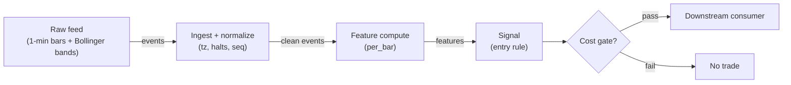

# S041 — Bollinger-band reversal

Trade the tag-then-re-entry: a close outside the band (the tag) followed by a close back inside (the re-entry) [documented] — the tag alone is never a signal; confirmation is normative. Provenance **[D]**.

> Tag law: every numeric literal in prose carries one of `[documented]
> [default] [example] [unverified] [internal-est] [measured]` (legend: Appendix
> i v1.0.0). Bibliographic years, volumes, pages, arXiv IDs, section numbers,
> rule codes (C1–C10), fail-safe codes (F1–F5), module IDs, batch keys, family
> letters, and machine-parsed §0 data fields are identifiers, not literals,
> and are exempt.

## §1 Five-minute reviewer card

| Row | Value |
|---|---|
| Module | S041 — Bollinger-band reversal, v1.1.0 |
| Edge verdict | `PREDICTIVE-FEATURE-ONLY` — tag-then-re-entry is the documented Bollinger reversal pattern; the standalone tag is a breakout, not a reversal |
| After-cost | `BEFORE-COST` — Works in range-bound regimes where band tags are exhaustion: the re-entry confirms the failure; dies in trending regimes where tags are the start of the trend (then the 'reversal' is catching a falling knife) |
| Build cost | Tier L · `4–12` h [internal-est] · `$600–1,800` loaded [internal-est] |
| Data cost | Research `~$29–99`/mo (Starter/Developer, delayed or real-time) [unverified]; production `~$199`/mo (Stocks Advanced) [unverified] — third-party 2026 comparison lists Starter $29, Developer $99, Advanced $199 (see §S12 unverified leads); verify on the vendor pricing page before budgeting |
| latency_class | bar-level / minutes |
| risk_class | low (signal-only; no order placement) |
| Capacity | `$5–25`/day notional [example] — illustrative; calibrate per venue |
| Executability | Feasible: Python+polars prototype; trivial compute |
| Risk summary | Trend-regime risk: tags that keep tagging; confirmation-lag risk (the re-entry gives back part of the move); band-mismeasurement on unadjusted series |
| When it dies | Trending markets (tags extend); news-driven tags; illiquid names where the tag is the spread; Bollinger parameters fit in-sample |
| Regime gates | Provisional: pending R001–R050 annotation |
| Emits | `signal_vector` (Appendix b v1.0.0) — never orders |

## §1.5 Cheapest / least-build path

1. **Prototype hour band:** `4–12` h [internal-est] — bar features + timestamp/halt handling + reference validation against the fixture.
2. **Cheapest-source row:** min_tier = Polygon.io Stocks Advanced [internal-est] — cheapest candidate with real-time SIP 1-min bars; latency_class = bar-level / minutes; required_fields = 1-min OHLCV bars (`t` ms, `o/h/l/c`, `v`, `n`), corporate-action-adjusted closes, XNAS session calendar; price_band = research `~$29–99`/mo, production `~$199`/mo [unverified] (third-party 2026 comparison — verify on vendor page before budgeting); build_or_buy = **build the estimator, buy the feed**.
3. **Resource budget:** `1` core, `<2` GB RAM for `500` symbols [internal-est]; compute pattern `per_bar`.
4. **Skip list:** tick-level variants; multi-venue aggregation; Rust ingest; colocated deployment.
5. **DO-NOT-CUT list:** causality assertions (`assert fill_event > signal_event`, no-signal-bar-fills test); COST block + callable `expected_cost_bps`; F1–F5 fail-safes + module-state enum + kill/safe-mode (`OFF`); decision-log audit records; bona-fide-intent + self-trade prevention; provenance tags on every numeric literal; fixtures + `test_cmd`; secrets via env only.
6. **Escalation gate:** upgrade from cheapest when any holds — live universe beyond the cheapest band; jitter persistently over budget; cost gate failing on `[measured]` costs; entitlement class changes.

## §S0 Module contract

### S0.1 Typed signature

```python
def signal(state: ModuleState, events: list[Event], cfg: Config) -> SignalVector:
```

`SignalVector` per Appendix b v1.0.0. `state` is the module-owned named state
vector (`prev_tag`, `bands`, `cooldown_until`, `module_state`); `events` are canonical Events (Appendix a v1.0.0),
newest last. The function handles documented edge cases: empty events →
`UNKNOWN`; invalid/missing prices → `UNKNOWN` (F1, never interpolate);
halt/auction events → freeze per the market-state table.

### S0.2 Config dataclass

| Parameter | Type | Default | Range | Status |
|---|---|---|---|---|
| `n` | int | `20` | `10`–`50` | example |
| `mult` | float | `2.0` | `1.5`–`3.0` | example |
| `conviction_scale` | float | `50.0` | `10`–`200` | example |
| `cost_gate_k` | float | `0.5` | `0.1`–`2.0` | default |
| `cooldown_s` | float | `600.0` | `0`–`3,600` | default |

All defaults tagged per the tag law (status `default` ⇒ `[default]`).
`staleness_ttl_ns` is fixed at `300e9` ns (`300` s [default]); it is not a
calibrated parameter.

### S0.3 Canonical schema mapping

Vendor columns → canonical Event schema (Appendix a v1.0.0), stated once here:

| Vendor | Canonical |
|---|---|
| `c` | `close` |
| `bb_m`, `bb_u`, `bb_l` | `bb_mid` / `bb_up` / `bb_lo` |
| `t` (ms) | `event_ts` (int64 ns UTC; ms→ns) |

### S0.4 Time contract

> Time contract: clock domain UTC, int64 ns; authoritative causality clock =
> `event_ts`; max_skew = `1` [default]; jitter budget = `500`
> [default]; bar-label = open time; staleness TTL = `300` [default]; gap
> policy = mask, no interpolation; halt/auction → discard contributions across
> reopen.

**Timing box:** `signal@t (per_bar, America/New_York) → earliest fill @open(t+1)`

### S0.5 Market-state table

| State | Module behavior |
|---|---|
| CONTINUOUS_TRADING | Compute normally; emit per cadence |
| HALTED | Freeze state; emit `UNKNOWN`; discard contributions across reopen |
| AUCTION | No new signals; hold last `SignalVector`; state `DEGRADED` |
| CLOSED | Emit nothing; state `OFF` |

### S0.6 Module-state enum + error taxonomy

States per Appendix k v1.0.0: `OK | DEGRADED | UNKNOWN | OFF`. Invalid input →
`UNKNOWN`, never interpolate (Appendix f v1.0.0, F1–F5). Kill/safe-mode: an
administrative kill or a bounds violation forces `OFF` until the runbook
re-arm checklist passes.

| Failure | State | Alert |
|---|---|---|
| Missing/stale input (TTL) | `UNKNOWN` | page |
| Bad bar (high<low, non-positive prices, crossed quotes) | `UNKNOWN` | log |
| Feature out of mathematical bounds (F2) | `UNKNOWN` | page |
| `seq` gap beyond tolerance | `DEGRADED` (restart windows) | log |
| Halt/auction | `UNKNOWN` / `DEGRADED` (per table) | log |
| Kill/administrative disable | `OFF` | page |
| Anything unmapped | `UNKNOWN` | page |

### S0.7 Ops tail

- **Schedule:** continuous during US equities regular session `09:30`–`16:00` America/New_York [documented]; owner: signals on-call.
- **Health checks:** fixture replay (`test_cmd`) green on deploy; `seq`-gap monitor; staleness watchdog at `300` [default].
- **Alert table:** page on `UNKNOWN` > `5` min [default] or bounds violation; notify on `DEGRADED`; log single dropped events.
- **Resource budget:** `1` vCPU, `2` GB RAM per `500` symbols [internal-est]; state is O(window) per symbol.
- **Runbook stub:** `1.` confirm feed; `2.` replay fixture; `3.` if red → set `OFF`, page; `4.` reconcile decision log before re-arm.

### S0.8 Secrets (env-only)

`POLYGON_API_KEY` via environment only. No secrets in this file, fixtures, or logs
(CI secrets-grep).

### S0.9 May / must-NOT

> **May:** emit `SignalVector` records per Appendix b v1.0.0. **Must-NOT:**
> emit orders, order intents, prices, share counts, or notionals; call a
> broker; mutate shared state outside `state`; interpolate across gaps.

## §S1 Legacy (subsumed by §1)

Legacy §S1 content is the §1 reviewer card above; this header is retained so
section numbering stays frozen.

## §S2 Specification

### Universe

US common stocks, regular session, price > `$5` [example]; bands from corporate-action-adjusted closes.

### Entry rule (Boolean — no prose-only conditions)

```
ENTER_LONG  := (tag_lo[t-1]) AND (close[t] >= bb_lo[t]) AND (now >= cooldown_until)
               AND (expected_cost_bps(...) <= cost_gate_k * edge_bps)
ENTER_SHORT := (tag_hi[t-1]) AND (close[t] <= bb_up[t]) AND (locate_ok)
               AND (now >= cooldown_until) AND (expected_cost_bps(...) <= cost_gate_k * edge_bps)
FLAT        := otherwise  # tag alone NEVER signals
```

`edge_bps` = `|close − bb_mid| / close × 10,000` bps [example] — midline distance at re-entry.

### Exits (with post-exit cooldown)

```
EXIT := (close crosses bb_mid) OR (opposite tag) OR (bars_held >= 10) [example]
       OR (module_state != OK)
ON_EXIT: cooldown_until = now + cooldown_s   # C10
```

### Position sizing (fenced function)

```python
def size_shares(risk_budget_R, stop_distance, vol_estimate, ADV_cap, cost):
    # S-module requests capital fraction only; share math lives in the strategy.
    risk_notional = risk_budget_R * 0.5 * confidence          # 0.5 [default] factor
    shares = risk_notional / max(stop_distance, 1e-9)        # 1e-9 [default] guard
    return int(min(shares, ADV_cap * adv_shares * 0.001))     # 0.1% ADV cap [default]
```

### Risk limits

| Limit | Value |
|---|---|
| Max capital fraction per signal | `0.5` [default] |
| Max adverse excursion before `UNKNOWN` review | `2.0`× stop [default] |
| Staleness kill | TTL `300` [default] → `UNKNOWN` |

### COST block (single source of truth)

| Component | Value (bps) | Basis |
|---|---|---|
| Spread (half-spread, liquid large-cap) | `0.50` | [example] |
| Fees (taker incl. regulatory) | `0.30` | [example] |
| Borrow — bps per day | `0.0` | [default] — reason: reference build long-biased; shorts are gated by C7 and accrue borrow in the strategy's cost ledger, not here |
| Impact | `1.0` | [example] — flagged; calibrate per venue at scale-up |
| **Total reference** | `1.80` | [example] |

`fee_schedule_as_of`: `2026-09-01` [unverified] — placeholder; pin the real
venue schedule before production. `side: taker` [default]; venue/tier/source:
XNAS / Polygon SIP 1-min bars [example]. Re-stating cost numbers outside this block is a validation failure.

```python
def expected_cost_bps(notional, adv_pct, venue, side, urgency) -> float:
    # Callable cost model - reference stack, components from the COST block.
    spread_bps = 0.50   # [example]
    fee_bps = 0.30      # [example]
    borrow_bps = 0.0    # [default] long-biased reference; reason in table
    impact_bps = 1.0    # [example] flagged; calibrate per venue at scale-up
    if side == "maker":
        fee_bps = -0.20  # rebate [example]
    return spread_bps + fee_bps + borrow_bps + impact_bps
```

### Execution / fill model table

| Aspect | Assumption |
|---|---|
| Latency | Signal→intent `≤1` bar [example]; SIP path latency-simulated-only |
| Partial fills | N/A (signal-only; T-module policy: Appendix c v1.0.0) |
| Impact | `1.0` bps reference [example]; stress ×`5` [example] |
| Adverse fill | Whipsaw haircut `0.2` bps per unit signal [example] |

### Robustness

`n` in `10`–`50` and multiplier `1.5`–`3.0` [example] all preserve the tag/re-entry event structure; the confirmation requirement is the robust part. Do not optimize `n`/multiplier on the event sample — `14` events cannot support parameter search. The failure mode is regime: tags in trends.

### Compliance sub-block (C1–C10+)

| Code | Rule: trigger → check → action → log |
|---|---|
| C1 | Self-match prevention: this S-module emits no orders; downstream consumers must set self-trade-prevention flags — asserted in the `consumes` contract → check: consumer ticket schema (Appendix c v1.0.0) has STP flag → action: block non-compliant consumers → log: `stp_assert` record |
| C2 | Bona-fide intent: every emitted `SignalVector` with direction ≠ `0` must pass the cost gate; sub-threshold features emit direction `0`, never a tradeable hint → check: `expected_cost_bps(...) <= k * edge_bps` → action: zero the direction on failure → log: `gate_veto` record |
| C3 | Message-rate: emissions capped per symbol per second [default] → check: rate monitor → action: throttle + alert → log: `throttle` record |
| C4 | Fat-finger trio (applied by consumers; this module bounds its own outputs): confidence ∈ [`0`,`1`], capital ∈ [`0`,`0.5`], computed_at sane → check: bounds on every emission → action: out-of-bounds → `UNKNOWN` (F2) → log: `bounds_veto` record |
| C5 | Decision log: every emission, veto, and state transition logged per Appendix g v1.0.0, hash-chained → check: log write ack → action: halt on write failure → log: the record itself |
| C6 | Halt/auction: per §S0.5 market-state table; contributions across reopen discarded → check: state feed → action: freeze/`DEGRADED` → log: `state_freeze` record |
| C7 | Locate check: SHORT direction requires `locate_ok` from the consumer; no SHORT without asserted locate (Reg-SHO threshold securities → direction `0`) → check: locate flag → action: zero SHORT on missing locate → log: `locate_veto` record |
| C8 | Public dissemination: no signal values published externally without review gate → check: export channel → action: block unreviewed export → log: `export_block` record |
| C9 | Data entitlements: per §S6 Data rights row → check: entitlement class on startup → action: entitlement change → §1.5 escalation gate → log: `entitlement` record |
| C10 | Post-exit cooldown: `cooldown_s` after any exit or compliance block; no re-entry → check: `now >= cooldown_until` → action: suppress entries → log: `cooldown` record |
| C11 | Breakout/reversal disambiguation: consumers must not invert this signal into a breakout system without re-validation → check: consumer strategy mapping → action: flag inverted mappings → log: `mapping` record |

### Parameter table

| Parameter | Symbol | Value | Tag | Sensitivity |
|---|---|---|---|---|
| Lookback | `n` | `20` | [example] | medium |
| Multiplier | `mult` | `2.0` | [example] | medium |
| Conviction scale | `conviction_scale` | `50.0` bps | [example] | low |
| Confirmation | — | tag-then-re-entry | [documented] | high — normative |

### Parameter calibration recipes (per parameter)

Recipes are normative procedure, not history. All OOS work runs on
production-scale data (`≥500` re-entry events [example]); the chapter's `14`
events cannot support parameter search (§S2 Robustness). Metric = walk-forward
OOS net-of-cost Sharpe; multiplicity control = deflated Sharpe over the full
grid (variant count reported); DSR "not computed" if the fold set is below
`1,000` OOS trades [default] — then selection is by Sharpe with the min-trade
floor only.

| Parameter | Grid | OOS selection recipe | Freeze / guard |
|---|---|---|---|
| `n` | `10, 15, 20, 25, 30, 40, 50` [example] | `5` walk-forward folds [default], embargo `5` trading days [default]; select the grid point maximizing mean OOS net Sharpe subject to `≥30` OOS trades [default] per fold; tie-break → nearest to the `20` [example] default | Freeze at selection; re-run only after a regime-gate annotation change; never re-fit on the fixture events |
| `mult` | `1.5, 1.75, 2.0, 2.25, 2.5, 3.0` [example] | Same folds/embargo; maximize mean OOS net Sharpe subject to `≥20` re-entry events [example] per fold (avoids degenerate ultra-wide bands) | Freeze at selection |
| `cost_gate_k` | `0.1, 0.25, 0.5, 1.0, 2.0` [default] | Same folds; maximize OOS net P&L subject to fill rate `≥25%` [example] (a `k` that never fires is vetoed, not selected); report the k–fill-rate frontier | Default `0.5` stands unless OOS evidence moves it; re-pin with the fee schedule |
| `cooldown_s` | `0, 300, 600, 900, 1800, 3600` [default] | Same folds; maximize OOS net Sharpe subject to max drawdown `≤1.5×` [default] of the no-cooldown baseline | Default `600` [default]; `0` requires a written whipsaw justification |

Selection disclosure travels with any re-fit: grid, fold boundaries, embargo,
variant count, and the before/after-cost column go in §S9 on update.

### Timing box

`signal@t (per_bar, America/New_York) → earliest fill @open(t+1)`

## §S3 Math + normative pseudocode

**Units and precision:** prices in USD; returns as decimals; costs and edges in
bps (`1e-4` of notional); volatility as decimal std of per-bar close-to-close
returns; borrow accrues ACT/365 [default]. Reference arithmetic in float64;
acceptance tolerance `1e-9` [default].

Band construction (consumed as inputs; computed by the data layer on
corporate-action-adjusted closes [documented]):

$$\mathrm{bb\_mid}_t = \mathrm{SMA}_n(C)_t, \qquad \sigma_t = \mathrm{std}(C_{t-n+1..t}), \qquad B^{U,L}_t = \mathrm{bb\_mid}_t \pm \mathrm{mult}\cdot\sigma_t$$

With bands $B^L_t < B^M_t < B^U_t$:

$$\mathrm{tag}^L_t = \mathbf{1}\{C_t < B^L_t\}, \qquad \mathrm{re}^L_t = \mathrm{tag}^L_{t-1}\,\mathbf{1}\{C_t \ge B^L_t\}$$

$$s_t = +1\cdot\mathrm{re}^L_t - 1\cdot\mathrm{re}^U_t, \qquad s_t = 0\ \text{on any tag bar}$$

Chapter S4: lower tag bar $32$ ($97.652 < 97.999$ [example]), re-entry bar $33$ ($98.736$ [example]) $\to$ long; upper tag bar $54$ ($102.132 > 101.947$ [example]), re-entry bar $55$ ($100.983$ [example]) $\to$ short. Signaling on the tag bar itself (no confirmation) is a specification violation — the tag alone is a breakout.

**Normative pseudocode** (pseudocode is normative; prose is commentary):

```
function valid(e):
    # F1/F2: the full predicate; nothing here is prose shorthand
    return (isfinite(e.close) and e.close > 0
            and isfinite(e.bb_mid) and isfinite(e.bb_up) and isfinite(e.bb_lo)
            and e.bb_up > e.bb_mid and e.bb_mid > e.bb_lo)

function conviction(e, direction, conviction_scale):
    # re-entry depth relative to band width, in bps; [example] mapping
    if direction == +1:
        depth_bps = (e.close - e.bb_lo) / e.close * 1e4
    elif direction == -1:
        depth_bps = (e.bb_up - e.close) / e.close * 1e4
    else:
        return 0.0
    return min(1.0, max(0.0, depth_bps) / conviction_scale)

function signal(state, events, cfg) -> SignalVector:
    if events is empty: return UNKNOWN                        # F1
    e = events[-1]
    if not valid(e): return UNKNOWN                           # F1/F2: never interpolate
    now = e.event_ts                                          # causality: event time only
    staleness = now - e.asof_ts
    if staleness > staleness_ttl_ns: return UNKNOWN           # staleness_ttl_ns = 300e9 [default]
    tag_lo = e.close < e.bb_lo
    tag_hi = e.close > e.bb_up
    p = events[-2] if len(events) >= 2 else none
    # confirmation: the tag bar itself NEVER signals
    re_lo = (p is not none) and (p.close < p.bb_lo) and (e.close >= e.bb_lo)
    re_hi = (p is not none) and (p.close > p.bb_up) and (e.close <= e.bb_up)
    direction = +1 if re_lo else (-1 if re_hi else 0)
    confidence = conviction(e, direction, cfg.conviction_scale)  # 50.0 bps [example]
    capital = 0.5 * confidence                                  # 0.5 [default]
    edge_bps = abs(e.close - e.bb_mid) / e.close * 1e4         # midline distance [example]
    cost = expected_cost_bps(notional=1.0, adv_pct=0.001, venue="XNAS",  # [example] reference call
                             side="taker" [default], urgency="normal" [default])
    cost_ok = cost <= cfg.cost_gate_k * edge_bps              # normative cost-gate predicate (C2)
    if not cost_ok:
        direction, confidence, capital = 0, 0.0, 0.0          # C2: zero on veto
    if now < state.cooldown_until:
        direction, confidence, capital = 0, 0.0, 0.0          # C10: post-exit cooldown
    if direction == -1 and not state.locate_ok:
        direction, confidence, capital = 0, 0.0, 0.0          # C7: no SHORT without locate
    sig = SignalVector(symbol=e.symbol, direction=direction, confidence=confidence,
                       capital=capital, computed_at=e.event_ts, staleness=staleness,
                       module_state=state.module_state)
    assert 0.0 <= confidence <= 1.0 and 0.0 <= capital <= 0.5  # C4 fat-finger bounds
    log_decision(sig, inputs_hash=hash(events), params_hash=hash(cfg))  # C5 / Appendix g
    assert fill_event > sig.computed_at                        # t→t+1: no signal-bar fills
    return sig
```

State defaults on first call: `state.cooldown_until = 0` (no cooldown),
`state.locate_ok = true` (long-biased reference), `state.module_state = OK`.

Causality: features at event/bar `t` use only data `≤ t`; earliest reaction is
`t+1`. Mandatory unit test: no-signal-bar fills.

## §S4 Worked example (fixture-backed)

- Tape: `modules/fixtures/S041_tape.csv` — `# TYPE: validation-run`;
  `14` synthetic bars across `2` events (`id,event_ts,close,bb_mid,bb_up,bb_lo`); chapter-pinned tag/re-entry bars, [example] bands elsewhere. All numbers synthetic, seed `41` [example]; timestamps int64 ns UTC.
- Expected outputs: `modules/fixtures/S041_expected.csv` — `tag_lo`, `tag_hi`, `re_lo`, `re_hi`, `dir` per bar; only the two re-entry bars signal.
- Tolerance: `1e-9` on floats; integer counts exact.
- Acceptance tests (`modules/tests/test_S041.py`, `12` tests):
  `1.` fixture recomputes to expected (tag/re-entry hand-checks; tag bars never signal); `2.` stub emits valid `SignalVector`; `3.` no-signal-bar fills (`fill_event_ts > computed_at`); `4.` cost-gate predicate passes on large edge, blocks on tiny edge (`k = 0.5` [default]); `5.` invalid input (crossed bands, non-positive close) → `UNKNOWN`; `6.` chapter event bars: `L33 → dir=+1`, `U55 → dir=−1` with the cost gate active; `7.` consecutive tags then re-entry → signal only on the re-entry bar; `8.` cooldown suppresses entries while `now < cooldown_until`; `9.` missing locate zeroes SHORTs (C7); `10.` stale input beyond TTL → `UNKNOWN`; `11.` fixture TYPE headers present (`# TYPE: validation-run`); `12.` deterministic replay of the fixture (seed `41` [example]) → identical vectors.
- `test_cmd`: `python3 -m pytest modules/tests/test_S041.py -q` → exits `0`.

**Hand-check:** `L32` tag (`97.652 < 97.999` [example]) → `dir=0`; `L33` re-entry → `dir=+1`; `U54` tag (`102.132 > 101.947` [example]) → `dir=0`; `U55` re-entry → `dir=−1`; all other bars quiet — asserted in the test.

**Where the example is optimistic:** no fees, no latency, no partial fills, no corporate-action surprises — arithmetic illustration, not a backtest.

## §S5 Strategies that use this signal

Generated from `deps.yaml` (CI symmetry); hand-listed here:

| Strategy | Role |
|---|---|
| Band-reversal consumer (strategy mapping pending deps.yaml) | Primary entry trigger: tag-then-re-entry |
| Contrast: band-breakout (S029) | Same bands, opposite interpretation — regime-gated |

## §S6 Data required

Vendor: **Polygon.io** · product: **Stocks Advanced** (SIP-consolidated US
equity bars; vendor rebranded to Massive — product contract unchanged)
[unverified against vendor page]. Schema version `3`; ingest fingerprint
pinned in §0 on first pull. All timestamps `t` arrive in ms and are promoted
to `event_ts` (int64 ns UTC) at ingest; bars are labeled by open time; no ticks
leave our systems.

| Field | Type | Granularity | Source tier | Notes |
|---|---|---|---|---|
| `t` → `event_ts` | int64 ns | 1-min bar | Tier 1 (SIP) | ms→ns at ingest; open-time label |
| `o`/`h`/`l`/`c` → `open/high/low/close` | float | 1-min bar | Tier 1 (SIP) | corporate-action-adjusted series |
| `v` → `volume`, `n` → `n_trades` | float/int | 1-min bar | Tier 1 (SIP) | volume sanity vs ADV cap |
| `bb_mid`/`bb_up`/`bb_lo` | float | per bar | derived | SMA/σ bands from adjusted closes (§S3) |
| session calendar | enum | daily | XNAS | regular session `09:30`–`16:00` America/New_York [documented]; halts from market-state feed |

**Data rights row** (Appendix j v1.0.0): SIP 1-min bars via Polygon Stocks Advanced, `rights: licensed`; scope = research + stated production symbol count (`≤500` [default]); raw ticks never leave our systems — fixtures are synthetic; entitlement = professional/internal, no display; retention per vendor terms, purge path in runbook; derived features ours.

## §S7 Local build (M5 Max / 128 GB)

Feasible: trivial. Band tags are comparisons; the bands are rolling means/stds. Tier L per `notes/cost-model.md` §5: `4–12` h ≈ `$600–1,800` [internal-est] at `$150`/hr loaded.

## §S8 Buy vs build

| Tier-1 (Polygon Stocks Advanced) | 1-min bars | ~`$30–200`/mo | Clean inputs | None material |

**Verdict:** build. The pattern is `15` lines [internal-est] on bought bars.

## §S9 Efficacy — documented evidence

| Study / source | Market & period | Metric | Before/after cost | Caveat |
|---|---|---|---|---|
| Chapter S4 event rows (seed `44`) | `14` synthetic bars, `2` events | Re-entry long + re-entry short | `BEFORE-COST` (arithmetic illustration) | Synthetic — demonstrates the pattern |
| Bollinger (2001) | — | Band construction; tags as information, not automatic signals | Descriptive | The documented pattern lineage |

**Selection disclosure:** the chapter's worked events plus the Bollinger text; no verified after-cost study of the tag-then-re-entry rule was pinned in this build [documented-as-absence].

### Regime gates (machine records, provisional — pending R001–R050 annotation)

| regime_id | direction | mechanism | condition | action | min_lag | unknown_behavior |
|---|---|---|---|---|---|---|
| R001 | amplifies | range-bound regime: tags are exhaustion | range_flag | none (size per §S2) | `0` [default] | veto |
| R002 | inverts | trending regime: tags are trend starts | trend_flag | veto | `0` [default] | veto |
| R003 | degrades | news-driven tags | news_flag | veto | `0` [default] | veto |

## §S10 Failure modes & pitfalls

| # | Trigger → Detect → Action → Recovery | check: |
|---|---|
| 1 | Tag traded without confirmation → detect: spec audit flags tag-bar signals → action: halt, fix → recovery: re-run acceptance tests | `check: dir == 0 on tag bars` |
| 2 | Trend-regime tags keep tagging → detect: trend filter → action: veto → recovery: resume on range | `check: not trend_flag` |
| 3 | Parameter mining on `14` events → detect: OOS decay → action: freeze `n=20`/`mult=2.0` [example] → recovery: re-validate | `check: params_frozen` |
| 4 | Band mismeasurement (unadjusted splits) → detect: corp-action audit → action: `UNKNOWN`, fix → recovery: replay | `check: prices_adjusted` |
| 5 | Lookahead: bands using future bars → detect: causality audit → action: halt, fix → recovery: re-run no-signal-bar-fills test | `check: all(fill_ts > computed_at)` |
| 6 | Cost blowup vs the confirmation lag → detect: cost gate on `[measured]` costs → action: stand down → recovery: re-pin fee schedule | `check: expected_cost_bps(...) <= k * edge_bps` |
| 7 | Inverted mapping (breakout traded as reversal) → detect: consumer mapping audit → action: flag → recovery: re-validate | `check: mapping_sane` |
| 8 | Stale bands after halts → detect: halt feed → action: `DEGRADED`, restart windows → recovery: backfill | `check: not halted` |

## §S11 Visuals

Figure: `batches figure (see §0 `plot_script`)` (synthetic, seed `41` [example]).



## §S12 Source log + unverified leads

**Sources** (citable facts only):

1. Bollinger, J. (2001). *Bollinger on Bollinger Bands.* McGraw-Hill [documented].
2. Chapter S4 event values: bar 32 `97.652 < 97.999`, bar 33 `98.736`; bar 54 `102.132 > 101.947`, bar 55 `100.983` [documented-as-chapter-value].

**Chatbot source log.** Duck.ai (GPT-5.6 Luna, anonymous) answered Q-SB6-1–Q-SB6-3 (`2026-09-10`); Grok/Cursor answers pending (checked `2026-09-10`).

**Unverified leads** (chatbot-only — never in evidence tables):

- Chatbot-cited band-reversal win rates [unverified] — not independently confirmed; kept out of evidence tables.
- Polygon (now Massive) pricing, from a 2026 third-party Medium comparison [unverified]: Starter $29/mo, Developer $99/mo, Advanced $199/mo — used for the §1/§1.5/§S6 price bands. Not verified against the vendor pricing page; re-pin from the vendor page before budgeting.

---

## Appendix — AI build prompt (S041)

Copy-paste into any chat agent:

> Build module **S041 — Bollinger-band reversal** per `notes/module-template.md` v1.0.0
> and this file's §S0 contract. Cheapest path (§1.5): prototype
> `4–12` h [internal-est]; cheapest data candidate
> Polygon.io Stocks Advanced [internal-est]; compute pattern `per_bar`.
> Implement `signal(state, events, cfg) -> SignalVector` (Appendix b v1.0.0)
> with the §S3 normative pseudocode, including the cost-gate predicate
> `expected_cost_bps(...) <= k * edge_bps` and `assert fill_event >
> signal_event`. Wire F1–F5 (Appendix f v1.0.0): invalid input → `UNKNOWN`,
> never interpolate. Log decisions per Appendix g v1.0.0. Secrets via env
> only. Run the fixture `modules/fixtures/S041_tape.csv`
> (`# TYPE: validation-run`) against `modules/fixtures/S041_expected.csv`
> (tolerance `1e-9`).
> **Definition of done:** `python3 -m pytest modules/tests/test_S041.py -q`
> exits `0`. Tag every numeric literal you add with the unified enum
> (Appendix i v1.0.0); put anything unverifiable in §S12 unverified leads.
