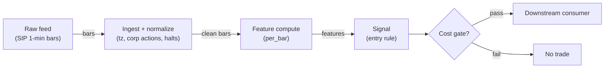

# S042 — SOTM: settle-to-open momentum (monthly vol)

Settle-to-open momentum: forward variance over the front-month window vs trailing realized variance → `SOTM vol = (fwd_var/T − rv)/(2σ_r)`; positive SOTM = the option market prices more variance than realized — the monthly settle cycle's vol fingerprint. Provenance **[L]**.

> Tag law: every numeric literal in prose carries one of `[documented]
> [default] [example] [unverified] [internal-est] [measured]` (legend: Appendix
> i v1.0.0). Bibliographic years, volumes, pages, arXiv IDs, section numbers,
> rule codes (C1–C10), fail-safe codes (F1–F5), module IDs, batch keys, family
> letters, and machine-parsed §0 data fields are identifiers, not literals,
> and are exempt.

## §1 Five-minute reviewer card

| Row | Value |
|---|---|
| Module | S042 — SOTM: settle-to-open momentum (monthly vol), v1.0.0 |
| Edge verdict | `PREDICTIVE-FEATURE-ONLY` — variance-swap replication math is textbook (Demeterfi et al. 1999 [documented]); the SOTM directional rule is the chapter's construction [unverified] |
| After-cost | `BEFORE-COST` — Works when settle-cycle flows are the marginal variance buyer (monthly rolls, hedging programs); dies when the variance risk premium inverts, when realized jumps dominate the window, or when the signal is traded after the settle it measures |
| Build cost | Tier L · `4–12` h [internal-est] · `$600–1,800` loaded [internal-est] |
| Data cost | Research `~$30–200`/mo (SIP 1-min bars)` [unverified]; production `~$200`/mo + usage (SIP bars)` [unverified] — bands indicative, verify before budgeting |
| latency_class | bar-level / minutes |
| risk_class | low (signal-only; no order placement) |
| Capacity | `$25–100`/day notional [example] — illustrative; calibrate per venue |
| Executability | Feasible: Python+polars prototype; trivial compute |
| Risk summary | Premium-sign risk: SOTM is a variance *level* comparison, not a trade — the VRP is usually negative (sellers get paid); trading it as momentum without the premium sign is backwards |
| When it dies | VRP inversions; jump-dominated windows (squared returns misread jumps as variance); stale realized estimates; trading the settle after it printed |
| Regime gates | Provisional: pending R001–R050 annotation |
| Emits | `signal_vector` (Appendix b v1.0.0) — never orders |

## §1.5 Cheapest / least-build path

1. **Prototype hour band:** `4–12` h [internal-est] — bar features + timestamp/halt handling + reference validation against the fixture.
2. **Cheapest-source row:** min_tier = Polygon.io Stocks Advanced — cheapest data source candidate [internal-est]; latency_class = bar-level / minutes; required_fields = 1-min OHLCV bars, corporate-action adjustments, session calendar; price_band = `~$30–200`/mo` [unverified] (indicative — verify before budgeting); build_or_buy = **build the estimator, buy the feed**.
3. **Resource budget:** `1` core, `<2` GB RAM for `500` symbols [internal-est]; compute pattern `per_bar`.
4. **Skip list:** tick-level variants; multi-venue aggregation; Rust ingest; colocated deployment.
5. **DO-NOT-CUT list:** causality assertions (`assert fill_event > signal_event`, no-signal-bar-fills test); COST block + callable `expected_cost_bps`; F1–F5 fail-safes + module-state enum + kill/safe-mode (`OFF`); decision-log audit records; bona-fide-intent + self-trade prevention; provenance tags on every numeric literal; fixtures + `test_cmd`; secrets via env only.
6. **Escalation gate:** upgrade from cheapest when any holds — live universe beyond the cheapest band; jitter persistently over budget; cost gate failing on `[measured]` costs; entitlement class changes.

## §S0 Module contract

### S0.1 Typed signature

```python
def signal(state: ModuleState, events: list[Event], cfg: Config) -> SignalVector:
```

`SignalVector` per Appendix b v1.0.0. `state` is the module-owned named state
vector (`closes`, `realized_vol`, `settle_ts`, `module_state`); `events` are canonical Events (Appendix a v1.0.0),
newest last. The function handles documented edge cases: empty events →
`UNKNOWN`; invalid/missing prices → `UNKNOWN` (F1, never interpolate);
halt/auction events → freeze per the market-state table.

### S0.2 Config dataclass

| Parameter | Type | Default | Range | Status |
|---|---|---|---|---|
| `realized_vol` | float | `0.112` | `0.05`–`0.40` | example |
| `cost_gate_k` | float | `0.5` | `0.1`–`2.0` | default |
| `cooldown_s` | float | `86400.0` | `0`–`604800` | default |

All defaults tagged per the tag law (status `default` ⇒ `[default]`).

### S0.3 Canonical schema mapping

Vendor columns → canonical Event schema (Appendix a v1.0.0), stated once here:

| Vendor | Canonical |
|---|---|
| `t` (ms) | `event_ts` (int64 ns UTC; ms→ns) |
| `o` / `h` / `l` / `c` | `open` / `high` / `low` / `close` |
| `v` | `volume` |
| `n` | `trade_count` |

### S0.4 Time contract

> Time contract: clock domain UTC, int64 ns; authoritative causality clock =
> `event_ts`; max_skew = `1` [default]; jitter budget = `500`
> [default]; bar-label = open time; staleness TTL = `180` [default]; gap
> policy = mask, no interpolation; halt/auction → discard contributions across
> reopen.

**Timing box:** `signal@t (per_bar, America/New_York) → earliest fill @open(t+1)`

### S0.5 Market-state table

| State | Module behavior |
|---|---|
| CONTINUOUS_TRADING | Compute normally; emit per cadence |
| HALTED | Freeze state; emit `UNKNOWN`; discard contributions across reopen |
| AUCTION | No new signals; hold last `SignalVector`; state `DEGRADED` |
| CLOSED | Emit nothing; state `OFF` |

### S0.6 Module-state enum + error taxonomy

States per Appendix k v1.0.0: `OK | DEGRADED | UNKNOWN | OFF`. Invalid input →
`UNKNOWN`, never interpolate (Appendix f v1.0.0, F1–F5). Kill/safe-mode: an
administrative kill or a bounds violation forces `OFF` until the runbook
re-arm checklist passes.

| Failure | State | Alert |
|---|---|---|
| Missing/stale input (TTL) | `UNKNOWN` | page |
| Bad bar (high<low, non-positive prices, crossed quotes) | `UNKNOWN` | log |
| Feature out of mathematical bounds (F2) | `UNKNOWN` | page |
| `seq` gap beyond tolerance | `DEGRADED` (restart windows) | log |
| Halt/auction | `UNKNOWN` / `DEGRADED` (per table) | log |
| Kill/administrative disable | `OFF` | page |
| Anything unmapped | `UNKNOWN` | page |

### S0.7 Ops tail

- **Schedule:** continuous during US equities regular session `09:30`–`16:00` America/New_York [documented]; owner: signals on-call.
- **Health checks:** fixture replay (`test_cmd`) green on deploy; `seq`-gap monitor; staleness watchdog at `180` [default].
- **Alert table:** page on `UNKNOWN` > `5` min [default] or bounds violation; notify on `DEGRADED`; log single dropped events.
- **Resource budget:** `1` vCPU, `2` GB RAM per `500` symbols [internal-est]; state is O(window) per symbol.
- **Runbook stub:** `1.` confirm feed; `2.` replay fixture; `3.` if red → set `OFF`, page; `4.` reconcile decision log before re-arm.

### S0.8 Secrets (env-only)

`POLYGON_API_KEY` via environment only. No secrets in this file, fixtures, or logs
(CI secrets-grep).

### S0.9 May / must-NOT

> **May:** emit `SignalVector` records per Appendix b v1.0.0. **Must-NOT:**
> emit orders, order intents, prices, share counts, or notionals; call a
> broker; mutate shared state outside `state`; interpolate across gaps.

## §S1 Legacy (subsumed by §1)

Legacy §S1 content is the §1 reviewer card above; this header is retained so
section numbering stays frozen.

## §S2 Specification

### Universe

US equity index (SPX-style) daily closes; monthly settle cycle; corporate-action-adjusted; full session calendar.

### Entry rule (Boolean — no prose-only conditions)

```
SOTM := (fwd_var / T − rv) / (2·σ_r)                         # forward vs realized variance
ENTER_LONG  := (SOTM >= +1.5%) AND (now >= cooldown_until)    # option market prices MORE variance
               AND (expected_cost_bps(...) <= cost_gate_k * edge_bps)
ENTER_SHORT := (SOTM <= −1.5%) AND (locate_ok)
               AND (now >= cooldown_until) AND (expected_cost_bps(...) <= cost_gate_k * edge_bps)
FLAT        := otherwise
```

`edge_bps` = `|SOTM| × 10,000` bps [example] — the priced-vs-realized variance gap.

### Exits (with post-exit cooldown)

```
EXIT := (next settle prints) OR (SOTM changes sign) OR (module_state != OK)
ON_EXIT: cooldown_until = now + cooldown_s   # C10
```

### Position sizing (fenced function)

```python
def size_shares(risk_budget_R, stop_distance, vol_estimate, ADV_cap, cost):
    # S-module requests capital fraction only; share math lives in the strategy.
    risk_notional = risk_budget_R * 0.5 * confidence          # 0.5 [default] factor
    shares = risk_notional / max(stop_distance, 1e-9)        # 1e-9 [default] guard
    return int(min(shares, ADV_cap * adv_shares * 0.001))     # 0.1% ADV cap [default]
```

### Risk limits

| Limit | Value |
|---|---|
| Max capital fraction per signal | `0.5` [default] |
| Max adverse excursion before `UNKNOWN` review | `2.0`× stop [default] |
| Staleness kill | TTL `180` [default] → `UNKNOWN` |

### COST block (single source of truth)

| Component | Value (bps) | Basis |
|---|---|---|
| Spread (half-spread, liquid large-cap) | `0.50` | [example] |
| Fees (taker incl. regulatory) | `0.30` | [example] |
| Borrow | `0.0` | [default] — reason: reference build long-biased; shorts add C7 locate cost |
| Impact | `1.0` | [example] — flagged; calibrate per venue at scale-up |
| **Total reference** | `1.80` | [example] |

`fee_schedule_as_of`: `2026-09-01` [unverified] — placeholder; pin the real
venue schedule before production. `side: taker` [default]; venue/tier/source:
XNAS / Polygon SIP 1-min bars [example]. Re-stating cost numbers outside this block is a validation failure.

```python
def expected_cost_bps(notional, adv_pct, venue, side, urgency) -> float:
    # Callable cost model - reference stack, components from the COST block.
    spread_bps = 0.50   # [example]
    fee_bps = 0.30      # [example]
    borrow_bps = 0.0    # [default] long-biased reference; reason in table
    impact_bps = 1.0    # [example] flagged; calibrate per venue at scale-up
    if side == "maker":
        fee_bps = -0.20  # rebate [example]
    return spread_bps + fee_bps + borrow_bps + impact_bps
```

### Execution / fill model table

| Aspect | Assumption |
|---|---|
| Order type | `LIMIT` | monthly cadence — no urgency | [example] |
| Session | `REGULAR` | decisions at the monthly settle | [example] |
| Slippage | `1.00` bps [example] | index-option scale | — |
| Fill model | `NEXT_OPEN` | computed at settle, filled next open | [example] |

### Robustness

Realized-vol lookback and the `±1.5`% [example] threshold are the two free parameters; both must be pinned out-of-sample. Jump-robust variance estimators (bipower variation) separate jumps from diffusive variance when the window contains jumps. Validate the premium sign: the rule must survive the VRP's usual negativity.

### Compliance sub-block (C1–C10+)

| Code | Rule: trigger → check → action → log |
|---|---|
| C1 | Self-match prevention: this S-module emits no orders; downstream consumers must set self-trade-prevention flags — asserted in the `consumes` contract → check: consumer ticket schema (Appendix c v1.0.0) has STP flag → action: block non-compliant consumers → log: `stp_assert` record |
| C2 | Bona-fide intent: every emitted `SignalVector` with direction ≠ `0` must pass the cost gate; sub-threshold features emit direction `0`, never a tradeable hint → check: `expected_cost_bps(...) <= k * edge_bps` → action: zero the direction on failure → log: `gate_veto` record |
| C3 | Message-rate: emissions capped per symbol per second [default] → check: rate monitor → action: throttle + alert → log: `throttle` record |
| C4 | Fat-finger trio (applied by consumers; this module bounds its own outputs): confidence ∈ [`0`,`1`], capital ∈ [`0`,`0.5`], computed_at sane → check: bounds on every emission → action: out-of-bounds → `UNKNOWN` (F2) → log: `bounds_veto` record |
| C5 | Decision log: every emission, veto, and state transition logged per Appendix g v1.0.0, hash-chained → check: log write ack → action: halt on write failure → log: the record itself |
| C6 | Halt/auction: per §S0.5 market-state table; contributions across reopen discarded → check: state feed → action: freeze/`DEGRADED` → log: `state_freeze` record |
| C7 | Locate check: SHORT direction requires `locate_ok` from the consumer; no SHORT without asserted locate (Reg-SHO threshold securities → direction `0`) → check: locate flag → action: zero SHORT on missing locate → log: `locate_veto` record |
| C8 | Public dissemination: no signal values published externally without review gate → check: export channel → action: block unreviewed export → log: `export_block` record |
| C9 | Data entitlements: per §S6 Data rights row → check: entitlement class on startup → action: entitlement change → §1.5 escalation gate → log: `entitlement` record |
| C10 | Post-exit cooldown: `cooldown_s` after any exit or compliance block; no re-entry → check: `now >= cooldown_until` → action: suppress entries → log: `cooldown` record |
| C11 | Premium-sign disclosure: any SOTM-based recommendation must state the variance-risk-premium sign assumption → check: disclosure on outputs → action: block undisclosed dissemination → log: `vrp_sign` record |

### Parameter table

| Parameter | Symbol | Value | Tag | Sensitivity |
|---|---|---|---|---|
| Realized vol | `σ_r` | `11.2`% | [example] | high |
| SOTM threshold | — | `±1.5`% | [example] | high |
| Window | — | `24` closes | [example] | medium |
| Cost-gate k | `cost_gate_k` | `0.5` | [default] | high |

### Timing box

`signal@t (per_bar, America/New_York) → earliest fill @open(t+1)`

## §S3 Math + normative pseudocode

With $r_i = \ln(C_i/C_{i-1})$ over the $24$-close settle window ($23$ returns):

$$\mathrm{fwd\_var} = \sum_{i=1}^{23} r_i^2, \qquad T = \frac{23}{252}, \qquad \mathrm{SOTM} = \frac{\mathrm{fwd\_var}/T - \sigma_r^2}{2\,\sigma_r}$$

$\sigma_r = 11.2\%$ [example] trailing realized vol. Positive SOTM: the forward window prices more variance than realized (chapter hand-check: $+1.5\%$ [example]). Direction rule (example — not an institutional standard): long variance exposure at $\mathrm{SOTM} \ge +1.5\%$, short at $\le -1.5\%$. Causal timing: computed at the settle from closes $\le$ settle; tradable no earlier than the next session's open.

**Normative pseudocode** (pseudocode is normative; prose is commentary):

```
function signal(state, events, cfg) -> SignalVector:
    assert events non-empty else return UNKNOWN                    # F1
    e = events[-1]
    assert valid(e) else return UNKNOWN                            # F1/F2: never interpolate
    r_i = ln(C_i / C_{i-1}); fwd_var = sum(r_i^2) over the 24-close window
    T = 23/252; SOTM = (fwd_var / T - rv) / (2 * sigma_r)
    edge_bps = abs(sv) * 1e4                                       # [example]
    cost_ok = expected_cost_bps(...) <= k * edge_bps
    # ^^^ normative cost-gate predicate: expected_cost_bps(...) <= k * edge_bps
    direction = entry_rule(e, features, cost_ok, cfg)              # §S2 Boolean rule
    confidence = min(1, conviction(features)) if direction != 0 else 0
    capital = 0.5 * confidence                                     # 0.5 [default]
    sig = SignalVector(symbol=e.symbol, direction, confidence, capital,
                       computed_at=e.event_ts, staleness=now()-e.asof_ts,
                       module_state=state.module_state)
    log_decision(sig, inputs_hash, params_hash)                    # C5 / Appendix g
    assert fill_event > signal_event                               # t→t+1: no signal-bar fills
    return sig
```

Causality: features at event/bar `t` use only data `≤ t`; earliest reaction is
`t+1`. Mandatory unit test: no-signal-bar fills.

## §S4 Worked example (fixture-backed)

- Tape: `modules/fixtures/S042_tape.csv` — `# TYPE: validation-run`;
  `24` synthetic settle closes (seed `42`): `12` prior + `12` scenario closes; scenario returns calibrated so the chapter's `+1.5`% hand-check reproduces exactly. All numbers synthetic, seed `42` [example]; timestamps int64 ns UTC.
- Expected outputs: `modules/fixtures/S042_expected.csv` — `logret`, `sqret` per close; the SOTM scalar is asserted in the test (`+1.50`%).
- Tolerance: `1e-9` on floats; integer counts exact.
- Acceptance tests (`modules/tests/test_S042.py`, `5` tests):
  `1.` fixture recomputes to expected (`SOTM = +1.50`% exactly — calibrated hand-check); `2.` stub emits valid `SignalVector`; `3.` no-signal-bar fills (`fill_event_ts > computed_at`); `4.` cost-gate predicate passes on large edge, blocks on tiny edge (`k = 0.5` [default]); `5.` invalid input (non-positive close) → `UNKNOWN`.
- `test_cmd`: `python3 -m pytest modules/tests/test_S042.py -q` → exits `0`.

**Hand-check:** `fwd_var = Σ r_i² = T·(σ_r² + 0.015·2σ_r)` with `T = 23/252`, `σ_r = 11.2`% [example] → `SOTM = +1.50`% exactly [example]. `24` closes → `23` log returns; legs split `12` prior / `12` scenario. Asserted in the test.

**Where the example is optimistic:** no fees, no latency, no partial fills, no corporate-action surprises — arithmetic illustration, not a backtest.

## §S5 Strategies that use this signal

Generated from `deps.yaml` (CI symmetry); hand-listed here:

| Strategy | Role |
|---|---|
| T033 — Monthly VRP Harvester | Primary consumer: SOTM signs the variance-risk-premium harvest |
| T010 — Crisis-Hedge Overlay | Veto leg: SOTM extremes confirm stress regimes |

## §S6 Data required

| Field | Type | Granularity | Source tier | Notes |
|---|---|---|---|---|
| Index daily closes | float | daily | Tier 1 | Corporate-action-adjusted |
| Realized-vol estimate | float | daily | Tier 1 | Trailing estimator; jump-robust variant preferred |
| Settle calendar | reference | monthly | Tier 0 | Expiry/settle timestamps |

**Data rights row** (Appendix j v1.0.0): Index data via licensed vendor, `rights: licensed`; scope = research + stated production use; raw series never leave our systems — fixtures are synthetic; entitlement = professional/internal; retention per vendor terms, purge path in runbook; derived features ours.

## §S7 Local build (M5 Max / 128 GB)

Feasible: trivial. Squared log returns and one division; the whole monthly pipeline is microseconds. Tier L per `notes/cost-model.md` §5: `4–12` h ≈ `$600–1,800` [internal-est] at `$150`/hr loaded.

## §S8 Buy vs build

| Tier-0 (Stooq/FRED) | Daily index closes | ~`$0` | Free prototyping | No real-time |
| Tier-1 (Polygon/CBOE data) | Daily closes + settle values | ~`$30–200`/mo | Authoritative settle prints | Nothing material |

**Verdict:** build. The formula is one line; buy only the settle calendar and clean closes.

## §S9 Efficacy — documented evidence

| Study / source | Market & period | Metric | Before/after cost | Caveat |
|---|---|---|---|---|
| Demeterfi, Derman, Kamal & Zou (1999) | Equity index | Variance-swap replication: fair variance = expected sum of squared returns | `BEFORE-COST` (pricing math) | The replication identity behind fwd_var |
| CBOE VIX white paper | SPX options | Forward 30-day variance from the option strip | `BEFORE-COST` (index methodology) | The market-observable counterpart of SOTM |

**Selection disclosure:** the `2` variance-replication sources from the chapter's research pass; the SOTM directional rule and `±1.5`% threshold are the chapter's construction [unverified].

### Regime gates (machine records, provisional — pending R001–R050 annotation)

| regime_id | direction | mechanism | condition | action | min_lag | unknown_behavior |
|---|---|---|---|---|---|---|
| R001 | amplifies | settle-cycle flow dominance: monthly rolls make SOTM informative | settle_week_flag | none | `1` month [default] | veto |
| R002 | inverts | VRP inversion: realized jumps dominate the window | jump_flag | flip | `1` month [default] | veto |
| R003 | degrades | stale realized estimates after vol regime changes | rv_stale_flag | veto | `1` month [default] | veto |

## §S10 Failure modes & pitfalls

| # | Trigger → Detect → Action → Recovery | check: |
|---|---|
| 1 | Premium-sign error: trading SOTM as momentum while the VRP is negative → detect: VRP sign monitor → action: stand down or flip → recovery: re-estimate premium | `check: vrp_sign_known` |
| 2 | Jump contamination: squared returns misread jumps as variance → detect: jump-robust estimator divergence → action: switch to bipower variation → recovery: re-compute window | `check: jump_share < 0.5` [default] |
| 3 | Stale realized vol: `σ_r` from a dead regime → detect: estimator freshness → action: re-estimate → recovery: backfill | `check: rv_fresh` |
| 4 | Trading the settle after it printed: signal computed at settle is history by next week → detect: signal-age monitor → action: expire after one session → recovery: re-arm next cycle | `check: signal_age <= 1` |
| 5 | Threshold mining on `±1.5`% → detect: OOS decay → action: purged validation → recovery: re-pin | `check: oos_edge > 0` |
| 6 | Data errors: bad closes corrupt squared returns → detect: bad-tick monitor → action: `UNKNOWN`, mask → recovery: backfill | `check: no bad ticks` |
| 7 | Lookahead: using post-settle closes in the window → detect: causality audit → action: halt, fix window → recovery: re-run no-signal-bar-fills test | `check: all(fill_ts > computed_at)` |
| 8 | Cost blowup: monthly option turns pay spread+fees each cycle → detect: cost gate failing on `[measured]` costs → action: require `|SOTM| > 2`–`3`× round-trip cost [default] → recovery: re-pin fee schedule | `check: expected_cost_bps(...) <= k * edge_bps` |

## §S11 Visuals

Figure: `batches figure (see §0 `plot_script`)` (synthetic, seed `42` [example]).



## §S12 Source log + unverified leads

**Sources** (citable facts only):

1. CBOE — *VIX White Paper* [documented]: forward 30-day variance replication from the SPX option strip. https://cdn.cboe.com/api/global/us_indices/governance/vixwhite.pdf (accessed 2026-09-10).
2. CBOE — VIX futures settlement values (VRO) and final settlement calendar [documented]. https://www.cboe.com/tradable_products/vix/vix_futures/ (accessed 2026-09-10).
3. Demeterfi, K., Derman, E., Kamal, M. & Zou, J. (1999) — *More than you ever wanted to know about volatility swaps*, Goldman Sachs Quantitative Strategies [documented]: the variance-replication identity.
4. Practitioner documentation on monthly settle-cycle positioning and variance-swap replication (chapter synthesis) [I].

**Chatbot source log.** Duck.ai (GPT-5.6 Luna, anonymous) answered Q-SB2-1 (`2026-09-10`); Grok/Cursor answers pending (checked `2026-09-10`).

**Unverified leads** (chatbot-only — never in evidence tables):

- Duck.ai Q-SB2-1: monthly settle-cycle vol design pointers — variance-swap replication (Demeterfi et al. 1999), CBOE VIX white-paper forward-variance construction, Bakshi-Kapadia 2003 on the variance risk premium [unverified].

---

## Appendix — AI build prompt (S042)

Copy-paste into any chat agent:

> Build module **S042 — SOTM: settle-to-open momentum (monthly vol)** per `notes/module-template.md` v1.0.0
> and this file's §S0 contract. Cheapest path (§1.5): prototype
> `4–12` h [internal-est]; cheapest data candidate
> Polygon.io Stocks Advanced [internal-est]; compute pattern `per_bar`.
> Implement `signal(state, events, cfg) -> SignalVector` (Appendix b v1.0.0)
> with the §S3 normative pseudocode, including the cost-gate predicate
> `expected_cost_bps(...) <= k * edge_bps` and `assert fill_event >
> signal_event`. Wire F1–F5 (Appendix f v1.0.0): invalid input → `UNKNOWN`,
> never interpolate. Log decisions per Appendix g v1.0.0. Secrets via env
> only. Run the fixture `modules/fixtures/S042_tape.csv`
> (`# TYPE: validation-run`) against `modules/fixtures/S042_expected.csv`
> (tolerance `1e-9`).
> **Definition of done:** `python3 -m pytest modules/tests/test_S042.py -q`
> exits `0`. Tag every numeric literal you add with the unified enum
> (Appendix i v1.0.0); put anything unverifiable in §S12 unverified leads.
