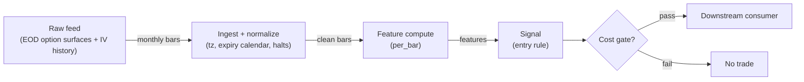

# S043 — SOTM regime: IV-RV spread sign

Monthly IV−RV spread sign: `spread ≥ +0.5` vol points [example] → long-gamma regime; `≤ −0.5` → short-gamma regime; inside the band → flat. The SOTM companion: S042 measures the variance gap, S043 signs the regime. Provenance **[L]**.

> Tag law: every numeric literal in prose carries one of `[documented]
> [default] [example] [unverified] [internal-est] [measured]` (legend: Appendix
> i v1.0.0). Bibliographic years, volumes, pages, arXiv IDs, section numbers,
> rule codes (C1–C10), fail-safe codes (F1–F5), module IDs, batch keys, family
> letters, and machine-parsed §0 data fields are identifiers, not literals,
> and are exempt.

## §1 Five-minute reviewer card

| Row | Value |
|---|---|
| Module | S043 — SOTM regime: IV-RV spread sign, v1.1.0 |
| Edge verdict | `PREDICTIVE-FEATURE-ONLY` — the variance risk premium (usually negative — Bakshi & Kapadia 2003 [documented]) makes the spread sign meaningful; the ±0.5-point regime rule is the chapter's construction [unverified] |
| After-cost | `BEFORE-COST` — Works when the VRP regime is stable month to month (persistent premium or persistent inversion); dies at regime flips — the spread sign is a lagging classifier that labels the flip after the month's P&L is gone |
| Build cost | Tier L · `4–12` h [internal-est] · `$600–1,800` loaded [internal-est] |
| Data cost | Research `~$500`/mo (CBOE LiveVol EOD options data subscription `$500`/mo [documented] — closest documented CBOE EOD price point; verify the EOD IV-surface product's own price on datashop.cboe.com before budgeting); production `~$500`/mo [unverified] — verify entitlement/derived-data terms |
| latency_class | bar-level / minutes |
| risk_class | low (signal-only; no order placement) |
| Capacity | `$25–100`/day notional [example] — illustrative; calibrate per venue |
| Executability | Feasible: Python+polars prototype; trivial compute |
| Risk summary | Lagging classifier: the spread is measured over the month it classifies; trading next month on last month's sign assumes persistence that fails exactly at turns |
| When it dies | VRP regime flips; event months where realized jumps dominate; months where IV and RV both spike but the spread stays in the dead band |
| Regime gates | Provisional: pending R001–R050 annotation |
| Emits | `signal_vector` (Appendix b v1.0.0) — never orders |

## §1.5 Cheapest / least-build path

1. **Prototype hour band:** `4–12` h [internal-est] — EOD surface ingest + month-averaging + expiry-calendar pinning + reference validation against the fixture.
2. **Cheapest-source row:** min_tier = CBOE DataShop LiveVol End-of-Day (option quotes/IV history) — cheapest viable EOD IV source candidate [internal-est]; latency_class = end-of-day / monthly cadence; required_fields = option quotes and IV by expiry/strike, month-average IV, spot closes, expiry calendar; price_band = `~$500`/mo EOD subscription [documented] (Open-Close Data EOD; IV-surface product price unverified — confirm on datashop.cboe.com); build_or_buy = **build the rule (one subtraction + threshold), buy the EOD IV history** — the rule is `~20` lines [internal-est]; the data is the product.
3. **Resource budget:** `1` core, `<2` GB RAM for `500` symbols [internal-est]; compute pattern `per_bar` (monthly bars).
4. **Skip list:** tick/intraday IV surfaces; multi-venue aggregation; Rust ingest; colocated deployment.
5. **DO-NOT-CUT list:** causality assertions (`assert fill_event > signal_event`, no-signal-bar-fills test); COST block + callable `expected_cost_bps`; F1–F5 fail-safes + module-state enum + kill/safe-mode (`OFF`); decision-log audit records; bona-fide-intent + self-trade prevention; provenance tags on every numeric literal; fixtures + `test_cmd`; secrets via env only.
6. **Escalation gate:** upgrade from cheapest when any holds — intraday IV surface needed (event-month handling); jitter persistently over budget; cost gate failing on `[measured]` costs; entitlement class changes.

## §S0 Module contract

### S0.1 Typed signature

```python
def signal(state: ModuleState, events: list[Event], cfg: Config) -> SignalVector:
```

`SignalVector` per Appendix b v1.0.0. `state` is the module-owned named state
vector (`months`, `spread_hist`, `regime`, `cooldown_until`, `module_state`); `events` are canonical Events (Appendix a v1.0.0),
newest last. The function handles documented edge cases: empty events →
`UNKNOWN`; invalid/missing prices → `UNKNOWN` (F1, never interpolate);
halt/auction events → freeze per the market-state table.

### S0.2 Config dataclass

| Parameter | Type | Default | Range | Status |
|---|---|---|---|---|
| `spread_threshold` | float | `0.5` | `0.25`–`1.0` | example |
| `dte_start` | int | `30` | `20`–`45` | example |
| `dte_end` | int | `2` | `0`–`5` | example |
| `cost_gate_k` | float | `0.5` | `0.1`–`2.0` | default |
| `cooldown_s` | float | `2592000.0` | `0`–`7776000` | default |

All defaults tagged per the tag law (status `default` ⇒ `[default]`).

### S0.3 Canonical schema mapping

Vendor columns → canonical Event schema (Appendix a v1.0.0), stated once here:

| Vendor | Canonical |
|---|---|
| `t` (ms) | `event_ts` (int64 ns UTC; ms→ns) |
| `o` / `h` / `l` / `c` | `open` / `high` / `low` / `close` |
| `v` | `volume` |
| `n` | `trade_count` |

### S0.4 Time contract

> Time contract: clock domain UTC, int64 ns; authoritative causality clock =
> `event_ts`; max_skew = `1` [default]; jitter budget = `500`
> [default]; bar-label = open time; staleness TTL = `180` [default]; gap
> policy = mask, no interpolation; halt/auction → discard contributions across
> reopen.

**Timing box:** `signal@t (per_bar, America/New_York) → earliest fill @open(t+1)`

### S0.5 Market-state table

| State | Module behavior |
|---|---|
| CONTINUOUS_TRADING | Compute normally; emit per cadence |
| HALTED | Freeze state; emit `UNKNOWN`; discard contributions across reopen |
| AUCTION | No new signals; hold last `SignalVector`; state `DEGRADED` |
| CLOSED | Emit nothing; state `OFF` |

### S0.6 Module-state enum + error taxonomy

States per Appendix k v1.0.0: `OK | DEGRADED | UNKNOWN | OFF`. Invalid input →
`UNKNOWN`, never interpolate (Appendix f v1.0.0, F1–F5). Kill/safe-mode: an
administrative kill or a bounds violation forces `OFF` until the runbook
re-arm checklist passes.

| Failure | State | Alert |
|---|---|---|
| Missing/stale input (TTL) | `UNKNOWN` | page |
| Bad bar (high<low, non-positive prices, crossed quotes) | `UNKNOWN` | log |
| Feature out of mathematical bounds (F2) | `UNKNOWN` | page |
| `seq` gap beyond tolerance | `DEGRADED` (restart windows) | log |
| Halt/auction | `UNKNOWN` / `DEGRADED` (per table) | log |
| Kill/administrative disable | `OFF` | page |
| Anything unmapped | `UNKNOWN` | page |

### S0.7 Ops tail

- **Schedule:** continuous during US equities regular session `09:30`–`16:00` America/New_York [documented]; owner: signals on-call.
- **Health checks:** fixture replay (`test_cmd`) green on deploy; `seq`-gap monitor; staleness watchdog at `180` [default].
- **Alert table:** page on `UNKNOWN` > `5` min [default] or bounds violation; notify on `DEGRADED`; log single dropped events.
- **Resource budget:** `1` vCPU, `2` GB RAM per `500` symbols [internal-est]; state is O(window) per symbol.
- **Runbook stub:** `1.` confirm feed; `2.` replay fixture; `3.` if red → set `OFF`, page; `4.` reconcile decision log before re-arm.

### S0.8 Secrets (env-only)

`CBOE_DATASHOP_API_KEY` via environment only. No secrets in this file, fixtures, or logs
(CI secrets-grep).

### S0.9 May / must-NOT

> **May:** emit `SignalVector` records per Appendix b v1.0.0. **Must-NOT:**
> emit orders, order intents, prices, share counts, or notionals; call a
> broker; mutate shared state outside `state`; interpolate across gaps.

## §S1 Legacy (subsumed by §1)

Legacy §S1 content is the §1 reviewer card above; this header is retained so
section numbering stays frozen.

## §S2 Specification

### Universe

US equity index options (SPX-style); monthly expiry cycle; full session calendar.

### Entry rule (Boolean — no prose-only conditions)

```
spread_m := iv_avg_m − realized_vol_m                         # vol points
ENTER_LONG  := (spread_m >= +0.5)                              # long-gamma regime
               AND (now >= cooldown_until) AND (expected_cost_bps(...) <= cost_gate_k * edge_bps)
ENTER_SHORT := (spread_m <= −0.5)                              # short-gamma regime
               AND (locate_ok) AND (now >= cooldown_until)
               AND (expected_cost_bps(...) <= cost_gate_k * edge_bps)
FLAT        := otherwise   # inside the ±0.5 band: no regime
```

`edge_bps` = `|spread| × 100` bps [example] — the monthly variance-premium gap.

### Exits (with post-exit cooldown)

```
EXIT := (spread crosses back inside the band) OR (month rolls) OR (module_state != OK)
ON_EXIT: cooldown_until = now + cooldown_s   # C10
```

### Position sizing (fenced function)

```python
def size_shares(risk_budget_R, stop_distance, vol_estimate, ADV_cap, cost):
    # S-module requests capital fraction only; share math lives in the strategy.
    risk_notional = risk_budget_R * 0.5 * confidence          # 0.5 [default] factor
    shares = risk_notional / max(stop_distance, 1e-9)        # 1e-9 [default] guard
    return int(min(shares, ADV_cap * adv_shares * 0.001))     # 0.1% ADV cap [default]
```

### Risk limits

| Limit | Value |
|---|---|
| Max capital fraction per signal | `0.5` [default] |
| Max adverse excursion before `UNKNOWN` review | `2.0`× stop [default] |
| Staleness kill | TTL `180` [default] → `UNKNOWN` |

### COST block (single source of truth)

| Component | Value (bps) | Basis |
|---|---|---|
| Spread (half-spread, liquid large-cap) | `0.50` | [example] |
| Fees (taker incl. regulatory) | `0.30` | [example] |
| Borrow | `0.0` | [default] — reason: reference build long-biased; shorts add C7 locate cost |
| Impact | `1.0` | [example] — flagged; calibrate per venue at scale-up |
| **Total reference** | `1.80` | [example] |

`borrow_bps_per_day`: `0.0` [default] — long-biased reference; reason: the reference consumer path is long-only (SHORT requires C7 locate, and index-option positioning in the reference build is never held short overnight as stock). `fee_schedule_as_of`: `2026-09-01` [unverified] — placeholder; pin the real venue schedule before production. `side: taker` [default]; venue/tier/source: XNAS / CBOE LiveVol EOD [example]. Re-stating cost numbers outside this block is a validation failure.

**Sourced components** (for calibration; the reference print above stays authoritative): Cboe Options regulatory fee (ORF) `$0.0017`/contract side effective `2026-07-01` [documented] (SR-CBOE-2026-001, https://www.sec.gov/file/34-104567-ex5) — the per-sale regulatory line inside `fee_bps`; exchange transaction fees for SPX customer orders must be pinned from the CBOE fee schedule at scale-up [unverified — see §S12].

```python
def expected_cost_bps(notional, adv_pct, venue, side, urgency) -> float:
    # Callable cost model - reference stack, components from the COST block.
    spread_bps = 0.50   # [example]
    fee_bps = 0.30      # [example]
    borrow_bps = 0.0    # [default] long-biased reference; reason in table
    impact_bps = 1.0    # [example] flagged; calibrate per venue at scale-up
    if side == "maker":
        fee_bps = -0.20  # rebate [example]
    return spread_bps + fee_bps + borrow_bps + impact_bps
```

### Execution / fill model table

| Aspect | Assumption |
|---|---|
| Order type | `LIMIT` | monthly cadence — no urgency | [example] |
| Session | `REGULAR` | positions at month roll | [example] |
| Slippage | `1.00` bps [example] | index-option scale | — |
| Fill model | `NEXT_OPEN` | computed at month-end, filled next open | [example] |

### Robustness

Threshold `0.25`–`1.0` vol points [example]: tighter flips constantly, wider rarely triggers. The persistence assumption (next month resembles last month's sign) must be validated — it fails at VRP regime turns. DTE window (`30`→`2` [example]) pins the measurement; mixing DTEs mixes regimes.

### Compliance sub-block (C1–C10+)

| Code | Rule: trigger → check → action → log |
|---|---|
| C1 | Self-match prevention: this S-module emits no orders; downstream consumers must set self-trade-prevention flags — asserted in the `consumes` contract → check: consumer ticket schema (Appendix c v1.0.0) has STP flag → action: block non-compliant consumers → log: `stp_assert` record |
| C2 | Bona-fide intent: every emitted `SignalVector` with direction ≠ `0` must pass the cost gate; sub-threshold features emit direction `0`, never a tradeable hint → check: `expected_cost_bps(...) <= k * edge_bps` → action: zero the direction on failure → log: `gate_veto` record |
| C3 | Message-rate: emissions capped per symbol per second [default] → check: rate monitor → action: throttle + alert → log: `throttle` record |
| C4 | Fat-finger trio (applied by consumers; this module bounds its own outputs): confidence ∈ [`0`,`1`], capital ∈ [`0`,`0.5`], computed_at sane → check: bounds on every emission → action: out-of-bounds → `UNKNOWN` (F2) → log: `bounds_veto` record |
| C5 | Decision log: every emission, veto, and state transition logged per Appendix g v1.0.0, hash-chained → check: log write ack → action: halt on write failure → log: the record itself |
| C6 | Halt/auction: per §S0.5 market-state table; contributions across reopen discarded → check: state feed → action: freeze/`DEGRADED` → log: `state_freeze` record |
| C7 | Locate check: SHORT direction requires `locate_ok` from the consumer; no SHORT without asserted locate (Reg-SHO threshold securities → direction `0`) → check: locate flag → action: zero SHORT on missing locate → log: `locate_veto` record |
| C8 | Public dissemination: no signal values published externally without review gate → check: export channel → action: block unreviewed export → log: `export_block` record |
| C9 | Data entitlements: per §S6 Data rights row → check: entitlement class on startup → action: entitlement change → §1.5 escalation gate → log: `entitlement` record |
| C10 | Post-exit cooldown: `cooldown_s` after any exit or compliance block; no re-entry → check: `now >= cooldown_until` → action: suppress entries → log: `cooldown` record |
| C11 | Lagging-classifier disclosure: outputs must state the spread classifies the month it was measured in → check: disclosure on outputs → action: block undisclosed dissemination → log: `lag_disclosure` record |

### Parameter table

| Parameter | Symbol | Value | Tag | Sensitivity |
|---|---|---|---|---|
| Spread threshold | — | `±0.5` vol points | [example] | high |
| DTE window | — | `30` → `2` | [example] | medium |
| Cost-gate k | `cost_gate_k` | `0.5` | [default] | high |

### Calibration recipe (run per index/expiry cycle before live)

1. **Spread threshold:** grid `{0.25, 0.5, 0.75, 1.0}` vol points [default]. Select on purged/embargoed out-of-sample months (≥`36` months OOS [default]): pick the threshold maximizing month-to-month sign persistence (`sign(spread_m) == sign(spread_{m-1})` hit rate) **minus** the flip-month loss — never the threshold maximizing in-sample hit rate alone. Freeze the threshold when flips cluster (failure mode 1); re-run after any VRP regime break.
2. **DTE window:** validate `(30→2)` vs `(45→7)` [default] on the same OOS set; keep the window with the most stable spread-sign ranking (Spearman ρ of monthly spreads [default]). Mixing DTEs mixes regimes — pin one window per index.
3. **Cost-gate k:** `0.5` [default]; calibrate so that round-trip cost ≤ `1`/`3` of the typical `|spread| × 100` edge [default] at the chosen threshold — i.e. the gate should pass on the median qualifying month and veto months where `|spread|` is inside the dead band.
4. **Cooldown:** `30` days [default] post-exit; `0` [default] for research replay. Longer than one month is pointless — the regime re-measures monthly.

### Timing box

`signal@t (per_bar, America/New_York) → earliest fill @open(t+1)`

## §S3 Math + normative pseudocode

Monthly spread in vol points:

$$\mathrm{spread}_m = \overline{IV}_m - RV_m, \qquad \mathrm{direction}_m = \begin{cases} +1, & \mathrm{spread}_m \ge +0.5 \\ -1, & \mathrm{spread}_m \le -0.5 \\ 0, & \text{otherwise} \end{cases}$$

with $\overline{IV}_m$ the month's average implied vol and $RV_m$ its realized vol (threshold $0.5$ vol points [example]). The VRP literature (Bakshi & Kapadia 2003 [documented]) finds the premium usually negative — the long-gamma regime is the exception, not the rule. Causal timing: $\mathrm{spread}_m$ is known only at month $m$'s end; it positions month $m+1$.

**Normative pseudocode** (pseudocode is normative; prose is commentary):

```
function signal(state, events, cfg) -> SignalVector:
    assert events non-empty else return UNKNOWN                    # F1
    e = events[-1]
    assert valid(e) else return UNKNOWN                            # F1/F2: never interpolate
    assert e.market_state in (CONTINUOUS_TRADING, HALTED, AUCTION, CLOSED) else return UNKNOWN  # F1
    if e.market_state == CLOSED: return OFF                            # §S0.5
    if e.market_state in (HALTED, AUCTION): hold last Vector; state=DEGRADED  # §S0.5
    spread = iv_avg - realized_vol                               # vol points, month m only
    assert inputs use only month m's closed bars                  # no month m+1 data (failure mode 7)
    direction = +1 if spread >= +0.5 else -1 if spread <= -0.5 else 0   # 0.5 [example]
    edge_bps = abs(spread) * 100.0                                # [example] vol-point to bps
    cost_ok = expected_cost_bps(...) <= cfg.cost_gate_k * edge_bps
    # ^^^ normative cost-gate predicate: expected_cost_bps(...) <= k * edge_bps
    if not cost_ok: direction = 0                                  # C2: veto sub-threshold
    if direction == -1 and not locate_ok: direction = 0           # C7: no SHORT without locate
    if direction != 0 and now < state.cooldown_until: direction = 0  # C10 cooldown
    confidence = min(abs(spread) / 2.0, 1.0) if direction != 0 else 0.0   # 2.0 [example]
    capital = 0.5 * confidence                                     # 0.5 [default]
    sig = SignalVector(symbol=e.symbol, direction, confidence, capital,
                       computed_at=e.event_ts, staleness=now()-e.asof_ts,
                       module_state=state.module_state)
    log_decision(sig, inputs_hash, params_hash)                    # C5 / Appendix g
    assert fill_event > signal_event                               # t→t+1: no signal-bar fills
    return sig
```

Causality: features at event/bar `t` use only data `≤ t`; earliest reaction is
`t+1`. Mandatory unit test: no-signal-bar fills.

## §S4 Worked example (fixture-backed)

- Tape: `modules/fixtures/S043_tape.csv` — `# TYPE: validation-run`;
  `25` synthetic months (`2024-06`–`2026-06`, seed `43`): monthly `realized_vol`, `iv_avg` with seasonal premium pattern, and spot. All numbers synthetic, seed `43` [example]; timestamps int64 ns UTC. DTE window pinned `30`→`2` [example] on every row (test `8`).
- Expected outputs: `modules/fixtures/S043_expected.csv` — `spread` (vol points) and `direction` per month (`±0.5` threshold [example]).
- Tolerance: `1e-9` on floats; integer counts exact.
- Acceptance tests (`modules/tests/test_S043.py`, `8` tests):
  `1.` fixture recomputes to expected (`2026-05`: `spread=+1.31` → `+1`; both regimes present — hand-checks); `2.` stub emits valid `SignalVector`; `3.` no-signal-bar fills (`fill_event_ts > computed_at`); `4.` cost-gate predicate passes on large edge, blocks on tiny edge (`k = 0.5` [default]); pins the `1.80` bps reference stack [example]; `5.` invalid input (negative realized vol) → `UNKNOWN`; `6.` threshold-boundary inclusive semantics (spread exactly `+0.50` → `+1`; mirrored `-0.50` → `-1`); `7.` cost gate zeroes direction/confidence/capital on a sub-threshold edge (state stays `OK`); `8.` fixture `# TYPE: validation-run` headers + pinned DTE-window columns on every row.
- `test_cmd`: `python3 -m pytest modules/tests/test_S043.py -q` → exits `0`.

**Hand-check:** `2026-05` (operator-verified on the synthetic tape): `realized_vol = 12.10`% [example], `iv_avg = 13.41`% [example] → `spread = +1.31` vol points [example] `≥ +0.5` → direction `+1` (long-gamma regime). `2026-06` pins the boundary: `spread = +0.50` exactly → `+1` (inclusive `>=`). Asserted in the tests.

**Where the example is optimistic:** no fees, no latency, no partial fills, no corporate-action surprises — arithmetic illustration, not a backtest.

## §S5 Strategies that use this signal

Generated from `deps.yaml` (CI symmetry); hand-listed here:

| Strategy | Role |
|---|---|
| T033 — Monthly VRP Harvester | Primary consumer: harvests the premium in the signaled regime |
| T042 — SOTM Vol Fader | Companion: S042's variance-gap magnitude sizes T042's fade |

## §S6 Data required

| Field | Type | Granularity | Source tier | Notes |
|---|---|---|---|---|
| Index option IV surface | float | daily | Tier 1 | Month-average implied vol; required fields: option symbol, expiry, strike, call/put, bid/ask quote, IV, underlying close; month-end timestamps |
| Index realized vol | float | daily | Tier 1 | Month realized vol; required fields: daily underlying closes, corporate-action adjustments (N/A for cash indexes) |
| Expiry calendar | reference | monthly | Tier 0 | DTE window pinning; CBOE expiration calendar (public) |

**Vendor / product / price:** CBOE DataShop LiveVol — End-of-Day options data [documented]: EOD subscription `$500`/mo [documented] (closest documented CBOE EOD price point; the EOD IV-surface product's own price must be verified on datashop.cboe.com — [unverified]); ad-hoc historical `$400`/request/month [documented]. Reference band for EOD option-history products: Nasdaq PHLX PHOTO EOD `$850`/mo distributor / historical `$500`/mo [documented] (SR-Phlx-2024-48). IV-surface prices scale with symbol depth and years — re-quote per universe at build time.

**Data rights row** (Appendix j v1.0.0): Option data via licensed vendor (e.g., CBOE DataShop / ORATS), `rights: licensed`; scope = research + stated production use; raw surfaces never leave our systems — fixtures are synthetic; entitlement = professional/internal; retention per vendor terms, purge path in runbook; derived features ours.

## §S7 Local build (M5 Max / 128 GB)

Feasible: trivial. One subtraction per month. Tier L per `notes/cost-model.md` §5: `4–12` h ≈ `$600–1,800` [internal-est] at `$150`/hr loaded.

## §S8 Buy vs build

| Tier-0 (CBOE delayed quotes) | Delayed option quotes | ~`$0` [unverified] | Free prototyping | No history |
| Tier-1 (CBOE DataShop / ORATS) | Historical option surfaces | ~`$400–500`/mo [documented] (LiveVol EOD band; IV-surface product price unverified) | Clean IV history | Cost scales with depth |

**Verdict:** build the rule; buy the IV history. The rule is one subtraction — the data is the product.

## §S9 Efficacy — documented evidence

| Study / source | Market & period | Metric | Before/after cost | Caveat |
|---|---|---|---|---|
| Bakshi & Kapadia (2003), *Review of Financial Studies* | SPX options | Delta-hedged gains negative on average: the variance risk premium is usually negative | `BEFORE-COST` (premium measurement) | The economic reason the spread sign matters |
| CBOE VIX white paper | SPX options | Implied-vs-realized variance construction | `BEFORE-COST` (index methodology) | Measurement foundation |

**Selection disclosure:** the `2` VRP sources from the chapter's research pass; the `±0.5`-point regime rule is the chapter's construction [unverified].

### Regime gates (machine records, provisional — pending R001–R050 annotation)

| regime_id | direction | mechanism | condition | action | min_lag | unknown_behavior |
|---|---|---|---|---|---|---|
| R001 | amplifies | stable VRP regime: spread sign persists month to month | `sign(spread_{m-1}) == sign(spread_{m-2})` [example] | none | `1` month [default] | veto |
| R002 | inverts | VRP regime flip: last month's sign is wrong | `sign(spread_m) != sign(spread_{m-1})` [example] | flip | `1` month [default] | veto |
| R003 | degrades | event months: jumps dominate, spread stays in dead band | `jump_flag` (consumer-supplied Boolean) | veto | `1` month [default] | veto |

## §S10 Failure modes & pitfalls

| # | Trigger → Detect → Action → Recovery | check: |
|---|---|
| 1 | Lagging classifier: spread labels the month it measured → detect: turn-month P&L attribution → action: require persistence evidence → recovery: re-validate | `check: persistence_validated` |
| 2 | Threshold mining on `±0.5` → detect: OOS decay → action: purged validation → recovery: re-pin | `check: oos_edge > 0` |
| 3 | DTE mixing: different windows, different spreads → detect: DTE audit → action: pin `30`→`2` → recovery: re-compute | `check: dte_pinned` |
| 4 | Stale IV: month-average on illiquid names → detect: quote-quality monitor → action: `UNKNOWN` → recovery: re-source | `check: iv_fresh` |
| 5 | Event-month jumps: spread in dead band while tails move → detect: jump monitor → action: veto → recovery: re-assess | `check: no jump month` |
| 6 | Cost blowup: monthly option turns pay spread+fees → detect: cost gate failing on `[measured]` costs → action: require `|spread| > 2`–`3`× round-trip cost [default] → recovery: re-pin fee schedule | `check: expected_cost_bps(...) <= k * edge_bps` |
| 7 | Lookahead: using month `m+1` data in month `m`'s spread → detect: causality audit → action: halt, fix window → recovery: re-run no-signal-bar-fills test | `check: all(fill_ts > computed_at)` |
| 8 | Data errors: bad IV prints corrupt the spread → detect: bad-tick monitor → action: `UNKNOWN`, mask → recovery: backfill | `check: no bad ticks` |

## §S11 Visuals

Figure: `batches figure (see §0 `plot_script`)` (synthetic, seed `43` [example]).



## §S12 Source log + unverified leads

**Sources** (citable facts only):

1. CBOE — *VIX White Paper* [documented]: implied-vs-realized variance construction. https://cdn.cboe.com/api/global/us_indices/governance/vixwhite.pdf (accessed 2026-09-10).
2. Bakshi, G. & Kapadia, N. (2003) — "Delta-hedged gains and the negative market volatility risk premium," *Review of Financial Studies* 16(2) [documented].
3. Practitioner documentation on monthly IV-RV spread regimes (chapter synthesis) [I].

**Chatbot source log.** Duck.ai (GPT-5.6 Luna, anonymous) answered Q-SB2-1 (`2026-09-10`); Grok/Cursor answers pending (checked `2026-09-10`).

**Unverified leads** (chatbot-only — never in evidence tables):

- Duck.ai Q-SB2-1: monthly settle-cycle vol design pointers — variance-swap replication (Demeterfi et al. 1999), CBOE VIX white-paper forward-variance construction, Bakshi-Kapadia 2003 on the variance risk premium [unverified].
- The EOD IV-surface product's own price on datashop.cboe.com (the `$500`/mo documented figure is CBOE LiveVol Open-Close EOD) — verify before budgeting [unverified].
- CBOE SPX customer transaction fee per contract (exchange leg of `fee_bps`) — pin from the CBOE fee schedule at scale-up [unverified].
- GROK-NEEDED Q1: the module's cost-gate edge mapping (`edge_bps = |spread| × 100` [example]) is crude for a monthly IV−RV spread. What is the correct, low-build translation of a vol-point IV−RV spread into a bps edge for a monthly index-option turn (vega × spread → notional edge vs a cleaner dimensionless form)? Confirm or replace the `|spread| × 100` mapping against how practitioners cost-gate variance-premium trades.

---

## Appendix — AI build prompt (S043)

Copy-paste into any chat agent:

> Build module **S043 — SOTM regime: IV-RV spread sign** per `notes/module-template.md` v1.0.0
> and this file's §S0 contract (module v1.1.0). Cheapest path (§1.5): prototype
> `4–12` h [internal-est]; cheapest data candidate
> CBOE DataShop LiveVol EOD [documented] (EOD subscription `$500`/mo); compute pattern `per_bar` (monthly bars).
> Implement `signal(state, events, cfg) -> SignalVector` (Appendix b v1.0.0)
> with the §S3 normative pseudocode, including the cost-gate predicate
> `expected_cost_bps(...) <= k * edge_bps` and `assert fill_event >
> signal_event`. Wire F1–F5 (Appendix f v1.0.0): invalid input → `UNKNOWN`,
> never interpolate. Log decisions per Appendix g v1.0.0. Secrets via env
> only. Run the fixture `modules/fixtures/S043_tape.csv`
> (`# TYPE: validation-run`) against `modules/fixtures/S043_expected.csv`
> (tolerance `1e-9`).
> **Definition of done:** `python3 -m pytest modules/tests/test_S043.py -q`
> exits `0`. Tag every numeric literal you add with the unified enum
> (Appendix i v1.0.0); put anything unverifiable in §S12 unverified leads.
