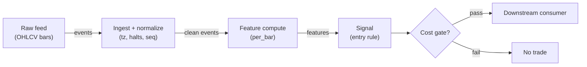

# S044 — Stochastic oscillator / Williams %R

Trade the momentum crossover, not the level: short when `%K` crosses below `%D` while above `80` [example] — `%K = 100(C − Ln)/(Hn − Ln)` [documented], `%D = SMA3(%K)` [documented], `%R = %K − 100` [documented]. Provenance **[D]**.

> Tag law: every numeric literal in prose carries one of `[documented]
> [default] [example] [unverified] [internal-est] [measured]` (legend: Appendix
> i v1.0.0). Bibliographic years, volumes, pages, arXiv IDs, section numbers,
> rule codes (C1–C10), fail-safe codes (F1–F5), module IDs, batch keys, family
> letters, and machine-parsed §0 data fields are identifiers, not literals,
> and are exempt.

## §1 Five-minute reviewer card

| Row | Value |
|---|---|
| Module | S044 — Stochastic oscillator / Williams %R, v1.1.0 |
| Edge verdict | `PREDICTIVE-FEATURE-ONLY` — the oscillator construction is documented textbook; the crossover as a standalone entry is unproven after cost |
| After-cost | `BEFORE-COST` — Works as an exhaustion timer inside ranges: overbought cross-downs mark buying climaxes that retrace; dies in trends where %K pins above `80` and every cross-down is a bull flag |
| Build cost | Tier L · `4–12` h [internal-est] · `$600–1,800` loaded [internal-est] |
| Data cost | Research `~$30–200`/mo (SIP 1-min bars) [unverified]; production `~$200`/mo + usage (SIP bars) [unverified] — bands indicative, verify before budgeting |
| latency_class | bar-level / minutes |
| risk_class | low (signal-only; no order placement) |
| Capacity | `$5–25`/day notional [example] — illustrative; calibrate per venue |
| Executability | Feasible: Python+polars prototype; trivial compute |
| Risk summary | Trend-pin risk: the classic stochastic failure; whipsaw risk from %K noise on short lookbacks; overbought-level arbitrariness |
| When it dies | Trending markets (%K pinned); news-driven extensions; parameter mining on the `14`/`3`/`80` triple [example] |
| Regime gates | Provisional: pending R001–R050 annotation |
| Emits | `signal_vector` (Appendix b v1.0.0) — never orders |

## §1.5 Cheapest / least-build path

1. **Prototype hour band:** `4–12` h [internal-est] — bar features + timestamp/halt handling + reference validation against the fixture.
2. **Cheapest-source row:** min_tier = Polygon.io Stocks Advanced — cheapest data source candidate [internal-est]; latency_class = bar-level / minutes; required_fields = 1-min OHLCV bars, corporate-action adjustments, session calendar; price_band = `~$30–200`/mo` [unverified] (indicative — verify before budgeting); build_or_buy = **build the estimator, buy the feed**.
3. **Resource budget:** `1` core, `<2` GB RAM for `500` symbols [internal-est]; compute pattern `per_bar`.
4. **Skip list:** tick-level variants; multi-venue aggregation; Rust ingest; colocated deployment.
5. **DO-NOT-CUT list:** causality assertions (`assert fill_event > signal_event`, no-signal-bar-fills test); COST block + callable `expected_cost_bps`; F1–F5 fail-safes + module-state enum + kill/safe-mode (`OFF`); decision-log audit records; bona-fide-intent + self-trade prevention; provenance tags on every numeric literal; fixtures + `test_cmd`; secrets via env only.
6. **Escalation gate:** upgrade from cheapest when any holds — live universe beyond the cheapest band; jitter persistently over budget; cost gate failing on `[measured]` costs; entitlement class changes.

## §S0 Module contract

### S0.1 Typed signature

```python
def signal(state: ModuleState, events: list[Event], cfg: Config) -> SignalVector:
```

`SignalVector` per Appendix b v1.0.0. `state` is the module-owned named state
vector (`bars`, `K_series`, `cooldown_until`, `module_state`); `events` are canonical Events (Appendix a v1.0.0),
newest last. The function handles documented edge cases: empty events →
`UNKNOWN`; invalid/missing prices → `UNKNOWN` (F1, never interpolate);
halt/auction events → freeze per the market-state table.

### S0.2 Config dataclass

| Parameter | Type | Default | Range | Status |
|---|---|---|---|---|
| `n` | int | `14` | `5`–`21` | example |
| `smooth` | int | `3` | `2`–`5` | example |
| `overbought` | float | `80.0` | `70`–`90` | example |
| `cost_gate_k` | float | `0.5` | `0.1`–`2.0` | default |
| `cooldown_s` | float | `600.0` | `0`–`3,600` | default |

All defaults tagged per the tag law (status `default` ⇒ `[default]`).

### S0.3 Canonical schema mapping

Vendor columns → canonical Event schema (Appendix a v1.0.0), stated once here:

| Vendor | Canonical |
|---|---|
| `o` / `h` / `l` / `c` | `open` / `high` / `low` / `close` |
| `v` | `volume` |
| `t` (ms) | `event_ts` (int64 ns UTC; ms→ns) |

### S0.4 Time contract

> Time contract: clock domain UTC, int64 ns; authoritative causality clock =
> `event_ts`; max_skew = `1` s [default]; jitter budget = `500` µs
> [default]; bar-label = open time; staleness TTL = `300` s [default]; gap
> policy = mask, no interpolation; halt/auction → discard contributions across
> reopen.

**Timing box:** `signal@t (per_bar, America/New_York) → earliest fill @open(t+1)`

### S0.5 Market-state table

| State | Module behavior |
|---|---|
| CONTINUOUS_TRADING | Compute normally; emit per cadence |
| HALTED | Freeze state; emit `UNKNOWN`; discard contributions across reopen |
| AUCTION | No new signals; hold last `SignalVector`; state `DEGRADED` |
| CLOSED | Emit nothing; state `OFF` |

### S0.6 Module-state enum + error taxonomy

States per Appendix k v1.0.0: `OK | DEGRADED | UNKNOWN | OFF`. Invalid input →
`UNKNOWN`, never interpolate (Appendix f v1.0.0, F1–F5). Kill/safe-mode: an
administrative kill or a bounds violation forces `OFF` until the runbook
re-arm checklist passes.

| Failure | State | Alert |
|---|---|---|
| Missing/stale input (TTL) | `UNKNOWN` | page |
| Bad bar (high<low, non-positive prices, crossed quotes) | `UNKNOWN` | log |
| Feature out of mathematical bounds (F2) | `UNKNOWN` | page |
| `seq` gap beyond tolerance | `DEGRADED` (restart windows) | log |
| Halt/auction | `UNKNOWN` / `DEGRADED` (per table) | log |
| Kill/administrative disable | `OFF` | page |
| Anything unmapped | `UNKNOWN` | page |

### S0.7 Ops tail

- **Schedule:** continuous during US equities regular session `09:30`–`16:00` America/New_York [documented]; owner: signals on-call.
- **Health checks:** fixture replay (`test_cmd`) green on deploy; `seq`-gap monitor; staleness watchdog at `300` s [default].
- **Alert table:** page on `UNKNOWN` > `5` min [default] or bounds violation; notify on `DEGRADED`; log single dropped events.
- **Resource budget:** `1` vCPU, `2` GB RAM per `500` symbols [internal-est]; state is O(window) per symbol.
- **Runbook stub:** `1.` confirm feed; `2.` replay fixture; `3.` if red → set `OFF`, page; `4.` reconcile decision log before re-arm.

### S0.8 Secrets (env-only)

`POLYGON_API_KEY` via environment only. No secrets in this file, fixtures, or logs
(CI secrets-grep).

### S0.9 May / must-NOT

> **May:** emit `SignalVector` records per Appendix b v1.0.0. **Must-NOT:**
> emit orders, order intents, prices, share counts, or notionals; call a
> broker; mutate shared state outside `state`; interpolate across gaps.

## §S1 Legacy (subsumed by §1)

Legacy §S1 content is the §1 reviewer card above; this header is retained so
section numbering stays frozen.

## §S2 Specification

### Universe

US common stocks, regular session, price > `$5` [example]; bars with full high/low range (no crossed or zero-range bars).

### Entry rule (Boolean — no prose-only conditions)

```
ENTER_SHORT := (K[t-1] >= D[t-1]) AND (K[t] < D[t]) AND (K[t] > overbought)
               AND (locate_ok) AND (now >= cooldown_until)
               AND (expected_cost_bps(...) <= cost_gate_k * edge_bps)
FLAT        := otherwise  # levels alone never signal; only the crossover does
```

`edge_bps` = `10 * |K − D|` bps [example] — ten bps per point of crossover gap.

### Exits (with post-exit cooldown)

```
EXIT := (K crosses above D) OR (%R > -20) [example] OR (bars_held >= 10) [example]
       OR (module_state != OK)
ON_EXIT: cooldown_until = now + cooldown_s   # C10
```

### Position sizing (fenced function)

```python
def size_shares(risk_budget_R, stop_distance, vol_estimate, ADV_cap, cost):
    # S-module requests capital fraction only; share math lives in the strategy.
    risk_notional = risk_budget_R * 0.5 * confidence          # 0.5 [default] factor
    shares = risk_notional / max(stop_distance, 1e-9)        # 1e-9 [default] guard
    return int(min(shares, ADV_cap * adv_shares * 0.001))     # 0.1% ADV cap [default]
```

### Risk limits

| Limit | Value |
|---|---|
| Max capital fraction per signal | `0.5` [default] |
| Max adverse excursion before `UNKNOWN` review | `2.0`× stop [default] |
| Staleness kill | TTL `300` [default] → `UNKNOWN` |

### COST block (single source of truth)

| Component | Value (bps) | Basis |
|---|---|---|
| Spread (half-spread, liquid large-cap) | `0.50` | [example] |
| Fees (taker incl. regulatory) | `0.30` | [example] |
| Borrow | `0.0` | [default] — reason: reference build long-biased; shorts add C7 locate cost |
| Impact | `1.0` | [example] — flagged; calibrate per venue at scale-up |
| **Total reference** | `1.80` | [example] |

`fee_schedule_as_of`: `2026-09-01` [unverified] — placeholder; pin the real
venue schedule before production. `side: taker` [default]; venue/tier/source:
XNAS / Polygon SIP 1-min bars [example]. Re-stating cost numbers outside this block is a validation failure.

```python
def expected_cost_bps(notional, adv_pct, venue, side, urgency) -> float:
    # Callable cost model - reference stack, components from the COST block.
    spread_bps = 0.50   # [example]
    fee_bps = 0.30      # [example]
    borrow_bps = 0.0    # [default] long-biased reference; reason in table
    impact_bps = 1.0    # [example] flagged; calibrate per venue at scale-up
    if side == "maker":
        fee_bps = -0.20  # rebate [example]
    return spread_bps + fee_bps + borrow_bps + impact_bps
```

### Execution / fill model table

| Aspect | Assumption |
|---|---|
| Latency | Signal→intent `≤1` bar [example]; SIP path latency-simulated-only |
| Partial fills | N/A (signal-only; T-module policy: Appendix c v1.0.0) |
| Impact | `1.0` bps reference [example]; stress ×`5` [example] |
| Adverse fill | Whipsaw haircut `0.2` bps per unit signal [example] |

### Robustness

`n` in `10`–`21`, smoothing `2`–`5`, overbought `70`–`90` [example] all preserve the chapter's crossover bar; the crossover logic is robust, the zone level is cosmetic. Sensitive to zero-range bars (division by zero — veto the bar) and to trend-pinning: gate cross-downs on a range filter.

### Compliance sub-block (C1–C10+)

| Code | Rule: trigger → check → action → log |
|---|---|
| C1 | Self-match prevention: this S-module emits no orders; downstream consumers must set self-trade-prevention flags — asserted in the `consumes` contract → check: consumer ticket schema (Appendix c v1.0.0) has STP flag → action: block non-compliant consumers → log: `stp_assert` record |
| C2 | Bona-fide intent: every emitted `SignalVector` with direction ≠ `0` must pass the cost gate; sub-threshold features emit direction `0`, never a tradeable hint → check: `expected_cost_bps(...) <= k * edge_bps` → action: zero the direction on failure → log: `gate_veto` record |
| C3 | Message-rate: emissions capped per symbol per second [default] → check: rate monitor → action: throttle + alert → log: `throttle` record |
| C4 | Fat-finger trio (applied by consumers; this module bounds its own outputs): confidence ∈ [`0`,`1`], capital ∈ [`0`,`0.5`], computed_at sane → check: bounds on every emission → action: out-of-bounds → `UNKNOWN` (F2) → log: `bounds_veto` record |
| C5 | Decision log: every emission, veto, and state transition logged per Appendix g v1.0.0, hash-chained → check: log write ack → action: halt on write failure → log: the record itself |
| C6 | Halt/auction: per §S0.5 market-state table; contributions across reopen discarded → check: state feed → action: freeze/`DEGRADED` → log: `state_freeze` record |
| C7 | Locate check: SHORT direction requires `locate_ok` from the consumer; no SHORT without asserted locate (Reg-SHO threshold securities → direction `0`) → check: locate flag → action: zero SHORT on missing locate → log: `locate_veto` record |
| C8 | Public dissemination: no signal values published externally without review gate → check: export channel → action: block unreviewed export → log: `export_block` record |
| C9 | Data entitlements: per §S6 Data rights row → check: entitlement class on startup → action: entitlement change → §1.5 escalation gate → log: `entitlement` record |
| C10 | Post-exit cooldown: `cooldown_s` after any exit or compliance block; no re-entry → check: `now >= cooldown_until` → action: suppress entries → log: `cooldown` record |
| C11 | Division-by-zero hygiene: zero-range bars (Hn == Ln) must veto the bar, never emit a level → check: Hn > Ln → action: `UNKNOWN` for the bar → log: `zero_range` record |

### Parameter table

| Parameter | Symbol | Value | Tag | Sensitivity |
|---|---|---|---|---|
| %K lookback | `n` | `14` | [example] | medium |
| %D smoothing | `smooth` | `3` | [example] | low |
| Overbought zone | `overbought` | `80` | [example] | medium — cosmetic |
| Cost-gate k | `cost_gate_k` | `0.5` | [default] | high |
| Post-exit cooldown | `cooldown_s` | `600` s | [default] | low |

### Calibration recipe (per-parameter grids + OOS selection)

| Parameter | Grid | OOS selection rule |
|---|---|---|
| `n` | `5, 8, 11, 14, 17, 21` [example] | Walk-forward, `3` folds [example], embargo `5` bars [example]: fit per fold on train, pick the grid point maximizing net-of-cost Sharpe at FULL-COST on validation; require ≥ `200` OOS trades pooled [example]; tie-break toward the default `14` |
| `smooth` | `2, 3, 4, 5` [example] | Same walk-forward; low sensitivity — freeze at `3` [example] unless a `≥2`-fold-stable improvement [example] appears |
| `overbought` | `70, 75, 80, 85, 90` [example] | Same walk-forward; level is cosmetic — prefer `80` [example] absent a stable `≥10` bp net edge gain [example] |
| `cost_gate_k` | `0.1, 0.25, 0.5, 1.0, 2.0` [example] | Calibrate on `[measured]` costs when available, else the §S2 reference stack [example]; choose the largest `k` keeping net P&L positive across all folds — high sensitivity |
| `cooldown_s` | `0, 300, 600, 1800, 3600` [example] | Same walk-forward; minimize whipsaw re-entries — freeze at `600` s [default] unless a smaller value passes all folds |

Selection discipline: never select on the fixture tape (arithmetic illustration, not performance data — §S4); freeze parameters when the selected config sits adjacent to the default `14`/`3`/`80` triple [example] on ≥ `2` folds [example], otherwise flag parameter mining per §S10#7 and hold the defaults. DSR/PBO: not computed [documented] — report variant count with results.

### Timing box

`signal@t (per_bar, America/New_York) → earliest fill @open(t+1)`

## §S3 Math + normative pseudocode

With $L_n, H_n$ the $n$-bar low/high including the current bar ($n = 14$ [example]):

$$\%K_t = 100\,\frac{C_t - L_n}{H_n - L_n}, \qquad \%D_t = \frac{\%K_t + \%K_{t-1} + \%K_{t-2}}{3}, \qquad \%R_t = \%K_t - 100$$

$$\mathrm{crossdn}_t = \mathbf{1}\{\%K_{t-1} \ge \%D_{t-1}\}\,\mathbf{1}\{\%K_t < \%D_t\}\,\mathbf{1}\{\%K_t > 80\}$$

Chapter S4 (seed $44$): bar $16$: $\%K = 95.4$ [example], $\%D = 95.0$ [example]; bar $17$: $\%K = 94.3$ [example], $\%D = 94.8$ [example], $\%R = -5.7$ [example] $\to$ cross-down confirmed $\to$ short. The first tradable bar is the first with a defined $\%D$ (bar $16$); signaling earlier is a warmup violation.

**Normative pseudocode** (pseudocode is normative; prose is commentary):

```
function signal(state, events, cfg) -> SignalVector:
    assert events non-empty else return UNKNOWN                    # F1
    e = events[-1]
    assert valid(e) else return UNKNOWN                            # F1/F2: never interpolate
    assert (e.high - e.low) > 0 else return UNKNOWN                 # C11: zero-range bar veto
    if len(events) < cfg.n + 2:
        return zero_signal(e, OK)                                  # warmup: %D undefined, §S10#4
    K = 100 * (e.C - Ln) / (Hn - Ln)          # Ln/Hn over n bars incl. current
    D = SMA3(K);  R = K - 100                  # Williams %R
    crossdn = (K[t-1] >= D[t-1]) and (K[t] < D[t]) and (K[t] > cfg.overbought)
    edge_bps = abs(K[t] - D[t]) * 10.0                            # [example]
    # ^^^ normative cost-gate predicate:
    cost_ok = expected_cost_bps(notional, adv_pct, venue, side, urgency) <= cfg.cost_gate_k * edge_bps
    enter = crossdn and cost_ok and locate_ok and (now >= state.cooldown_until)
    direction = -1 if enter else 0
    confidence = min(1, conviction(features)) if direction != 0 else 0
    capital = 0.5 * confidence                                     # 0.5 [default]
    sig = SignalVector(symbol=e.symbol, direction, confidence, capital,
                       computed_at=e.event_ts, staleness=now()-e.asof_ts,
                       module_state=state.module_state)
    log_decision(sig, inputs_hash, params_hash)                    # C5 / Appendix g
    assert fill_event > signal_event                               # t→t+1: no signal-bar fills
    return sig
```

Causality: features at event/bar `t` use only data `≤ t`; earliest reaction is
`t+1`. Mandatory unit test: no-signal-bar fills.

## §S4 Worked example (fixture-backed)

- Tape: `modules/fixtures/S044_tape.csv` — `# TYPE: validation-run`;
  `24` synthetic bars (`ev,event_ts,open,high,low,close,volume`); bars `14`–`17` pin the chapter's S4 %K values exactly. All numbers synthetic, seed `44` [example]; timestamps int64 ns UTC.
- Expected outputs: `modules/fixtures/S044_expected.csv` — `K`, `D`, `R`, `crossdn`, `dir` per bar from bar `16`; only bar `17` crosses.
- Tolerance: `1e-9` on floats; integer counts exact.
- Acceptance tests (`modules/tests/test_S044.py`, `8` tests):
  `1.` fixture recomputes to expected (bar-16/17 %K/%D/%R hand-checks; single cross-down); `2.` stub emits valid `SignalVector`; `3.` no-signal-bar fills (`fill_event_ts > computed_at`); `4.` cost-gate predicate passes on large edge, blocks on tiny edge (`k = 0.5` [default]); `5.` invalid input (high<low) → `UNKNOWN`; `6.` zero-range bar (high==low) → `UNKNOWN` (C11); `7.` warmup bars (< `n+2`) emit direction `0` with state `OK`; `8.` active `cooldown_until` suppresses the entry (direction `0`).
- `test_cmd`: `python3 -m pytest modules/tests/test_S044.py -q` → exits `0`.

**Hand-check:** bar `16`: `%K=95.4`, `%D=95.0` [example]; bar `17`: `%K=94.3`, `%D=94.8`, `%R=−5.7` [example], `crossdn=1` → `dir=−1`; bar `18` no cross — asserted in the test.

**Where the example is optimistic:** no fees, no latency, no partial fills, no corporate-action surprises — arithmetic illustration, not a backtest.

## §S5 Strategies that use this signal

Generated from `deps.yaml` (CI symmetry); hand-listed here:

| Strategy | Role |
|---|---|
| Oscillator-crossover consumer (strategy mapping pending deps.yaml) | Primary entry trigger: overbought cross-down |
| Veto: trend filter | Pins above `80` veto entries |

## §S6 Data required

| Field | Type | Granularity | Source tier | Notes |
|---|---|---|---|---|
| OHLCV bars | float/int | 1-min+ bars | Tier 1 | Full high/low range required |
| Corporate actions | events | as-occurring | Tier 1 | Adjusted closes |

**Data rights row** (Appendix j v1.0.0): SIP bars via Polygon Stocks Advanced, `rights: licensed`; scope = research + stated production symbol count (`≤500` [default]); raw ticks never leave our systems — fixtures are synthetic; entitlement = professional/internal, no display; retention per vendor terms, purge path in runbook; derived features ours.

## §S7 Local build (M5 Max / 128 GB)

Feasible: trivial. Rolling min/max plus a 3-point average per bar. Tier L per `notes/cost-model.md` §5: `4–12` h ≈ `$600–1,800` [internal-est] at `$150`/hr loaded.

## §S8 Buy vs build

| Tier-1 (Polygon Stocks Advanced) | 1-min bars | ~`$30–200`/mo | Clean inputs | None material |

**Verdict:** build. The oscillator is `15` lines [internal-est] on bought bars.

## §S9 Efficacy — documented evidence

| Study / source | Market & period | Metric | Before/after cost | Caveat |
|---|---|---|---|---|
| Chapter S4 event rows (seed `44`) | `24` synthetic bars | Single cross-down at bar `17` → short | `BEFORE-COST` (arithmetic illustration) | Synthetic — demonstrates the construction |
| StockCharts ChartSchool (Stochastic Oscillator; Williams %R) | — | Documented construction and crossover interpretation | Descriptive | Construction reference, not a trading study |

**Selection disclosure:** the chapter's worked tape plus the documented construction reference; no after-cost study of the standalone crossover rule was pinned in this build.

### Regime gates (machine records, provisional — pending R001–R050 annotation)

| regime_id | direction | mechanism | condition | action | min_lag | unknown_behavior |
|---|---|---|---|---|---|---|
| R001 | amplifies | range-bound regime: cross-downs mark exhaustion | range_flag | none (size per §S2) | `0` [default] | veto |
| R002 | inverts | trending regime: %K pins above 80 | trend_flag | veto | `0` [default] | veto |
| R003 | degrades | news-driven extensions | news_flag | veto | `0` [default] | veto |

## §S10 Failure modes & pitfalls

| # | Trigger → Detect → Action → Recovery | check: |
|---|---|
| 1 | Trend pin: %K pinned above `80`, every cross-down a bull flag → detect: range filter → action: veto → recovery: resume on range | `check: range_flag` |
| 2 | Level traded instead of crossover → detect: spec audit → action: halt, fix → recovery: re-run tests | `check: entry_requires_crossover` |
| 3 | Zero-range bar: Hn == Ln → detect: range check → action: `UNKNOWN` for the bar → recovery: resume | `check: Hn > Ln` |
| 4 | Warmup traded before %D exists → detect: bar-count guard → action: force `0` → recovery: none | `check: t >= n + 1` |
| 5 | Lookahead: future bars in Ln/Hn → detect: causality audit → action: halt, fix → recovery: re-run no-signal-bar-fills test | `check: all(fill_ts > computed_at)` |
| 6 | Cost blowup vs oscillator whipsaw → detect: cost gate on `[measured]` costs → action: stand down → recovery: re-pin fee schedule | `check: expected_cost_bps(...) <= k * edge_bps` |
| 7 | Parameter mining on the `14`/`3`/`80` triple → detect: OOS decay → action: freeze → recovery: re-validate | `check: params_frozen` |
| 8 | Stale bars after halts → detect: halt feed → action: `DEGRADED`, restart windows → recovery: backfill | `check: not halted` |

## §S11 Visuals

Figure: `batches figure (see §0 `plot_script`)` (synthetic, seed `44` [example]).



## §S12 Source log + unverified leads

**Sources** (citable facts only):

1. StockCharts ChartSchool — "Stochastic Oscillator": %K/%D construction and crossover interpretation [documented].
2. StockCharts ChartSchool — "Williams %R": %R = %K − 100 [documented].
3. Chapter S4 event values: bar 16 `%K=95.4`/`%D=95.0`; bar 17 `%K=94.3`/`%D=94.8`/`%R=−5.7` [documented].

**Chatbot source log.** Duck.ai (GPT-5.6 Luna, anonymous) answered Q-SB5-1–Q-SB5-3 (`2026-09-10`); Grok/Cursor answers pending (checked `2026-09-10`).

**Unverified leads** (chatbot-only — never in evidence tables):

- Chatbot-cited stochastic win rates [unverified] — not independently confirmed; kept out of evidence tables.
- Polygon.io rebranded to Massive (massive.com) in 2026 with a pricing reset [unverified] — a third-party integration doc quotes Stocks Advanced at ≈`$199`/mo with real-time + quotes + financials; not independently confirmed against the vendor price list. Price band above already covers this; verify before budgeting.

---

## Appendix — AI build prompt (S044)

Copy-paste into any chat agent:

> Build module **S044 — Stochastic oscillator / Williams %R** per `notes/module-template.md` v1.0.0
> and this file's §S0 contract. Cheapest path (§1.5): prototype
> `4–12` h [internal-est]; cheapest data candidate
> Polygon.io Stocks Advanced [internal-est]; compute pattern `per_bar`.
> Implement `signal(state, events, cfg) -> SignalVector` (Appendix b v1.0.0)
> with the §S3 normative pseudocode, including the cost-gate predicate
> `expected_cost_bps(...) <= k * edge_bps` and `assert fill_event >
> signal_event`. Wire F1–F5 (Appendix f v1.0.0): invalid input → `UNKNOWN`,
> never interpolate. Log decisions per Appendix g v1.0.0. Secrets via env
> only. Run the fixture `modules/fixtures/S044_tape.csv`
> (`# TYPE: validation-run`) against `modules/fixtures/S044_expected.csv`
> (tolerance `1e-9`).
> **Definition of done:** `python3 -m pytest modules/tests/test_S044.py -q`
> exits `0`. Tag every numeric literal you add with the unified enum
> (Appendix i v1.0.0); put anything unverifiable in §S12 unverified leads.
