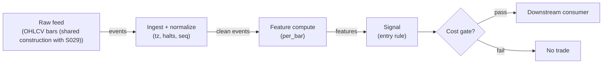

# S045 — Stretched-move z-score

Fade the stretched move: rolling `20`-bar z-score with the **current bar included** and population sd [example] — a `+4.36σ` [example] bar with no volume expansion is exhaustion, not breakout. Provenance **[I]**.

> Tag law: every numeric literal in prose carries one of `[documented]
> [default] [example] [unverified] [internal-est] [measured]` (legend: Appendix
> i v1.0.0). Bibliographic years, volumes, pages, arXiv IDs, section numbers,
> rule codes (C1–C10), fail-safe codes (F1–F5), module IDs, batch keys, family
> letters, and machine-parsed §0 data fields are identifiers, not literals,
> and are exempt.

## §1 Five-minute reviewer card

| Row | Value |
|---|---|
| Module | S045 — Stretched-move z-score, v1.1.0 |
| Edge verdict | `PREDICTIVE-FEATURE-ONLY` — the z-score is a measurement, not an edge; the fade is the chapter's hypothesis, unproven after cost |
| After-cost | `BEFORE-COST` — Works when the stretch is uninformed (stop runs, thin-book spikes): the move mean-reverts without volume support; dies when the stretch is the start of a genuine expansion (then volume confirms and the fade is run over) |
| Build cost | Tier L · `4–12` h [internal-est] · `$600–1,800` loaded [internal-est] |
| Data cost | Research `$29`/mo — Massive Stocks Starter (15-min delayed 1-min bars, 5-yr history) [documented, verified 2026-09-11]; production `$199`/mo — Stocks Advanced (real-time SIP, 15+ yr history) [documented, verified 2026-09-11]; smoke tests `$0`/mo Basic tier (EOD + 2-yr, 5 calls/min) [documented]. Bands change — confirm on massive.com/pricing before budgeting |
| latency_class | bar-level / minutes |
| risk_class | low (signal-only; no order placement) |
| Capacity | `$5–25`/day notional [example] — illustrative; calibrate per venue |
| Executability | Feasible: Python+polars prototype; trivial compute |
| Risk summary | Expansion-continuation risk: fading the start of a real move; inclusion-convention risk (prior-only z is a different signal); volume-filter calibration risk |
| When it dies | Genuine breakouts with volume (the filter's blind spot inverted); trending regimes; the z computed with the wrong inclusion convention |
| Regime gates | Provisional: R001/R002/R003 machine records (§S9); pending R001–R050 annotation |
| Emits | `signal_vector` (Appendix b v1.0.0) — never orders |

## §1.5 Cheapest / least-build path

1. **Prototype hour band:** `4–12` h [internal-est] — bar features + timestamp/halt handling + reference validation against the fixture.
2. **Cheapest-source row:** min_tier = Massive Stocks Starter — cheapest data source candidate for this bar-level signal [documented]; latency_class = bar-level / minutes; required_fields = 1-min OHLCV bars, corporate-action adjustments, session calendar; price_band = `$29`/mo (15-min delayed, 5-yr history) [documented, verified 2026-09-11]; build_or_buy = **build the estimator, buy the feed**. Smoke tests can run on the `$0`/mo Basic tier (EOD + 2-yr, 5 calls/min) [documented].
3. **Resource budget:** `1` core, `<2` GB RAM for `500` symbols [internal-est]; compute pattern `per_bar`.
4. **Skip list:** tick-level variants; multi-venue aggregation; Rust ingest; colocated deployment.
5. **DO-NOT-CUT list:** causality assertions (`assert fill_event > signal_event`, no-signal-bar-fills test); COST block + callable `expected_cost_bps`; F1–F5 fail-safes + module-state enum + kill/safe-mode (`OFF`); decision-log audit records; bona-fide-intent + self-trade prevention; provenance tags on every numeric literal; fixtures + `test_cmd`; secrets via env only.
6. **Escalation gate:** upgrade from cheapest when any holds — live trading needs real-time SIP (→ Stocks Advanced `$199`/mo [documented, verified 2026-09-11]); universe needs >`5` yr history [documented]; jitter persistently over budget; cost gate failing on `[measured]` costs; entitlement class changes.

## §S0 Module contract

### S0.1 Typed signature

```python
def signal(state: ModuleState, events: list[Event], cfg: Config) -> SignalVector:
```

`SignalVector` per Appendix b v1.0.0. `state` is the module-owned named state
vector (`closes`, `vols`, `cooldown_until`, `module_state`); `events` are canonical Events (Appendix a v1.0.0),
newest last. The function handles documented edge cases: empty events →
`UNKNOWN`; invalid/missing prices → `UNKNOWN` (F1, never interpolate);
halt/auction events → freeze per the market-state table.

### S0.2 Config dataclass

| Parameter | Type | Default | Range | Status |
|---|---|---|---|---|
| `lookback` | int | `20` | `10`–`60` | example |
| `z_thresh` | float | `3.0` | `2.0`–`5.0` | example |
| `vol_max_ratio` | float | `1.5` | `1.2`–`3.0` | example |
| `cost_gate_k` | float | `0.5` | `0.1`–`2.0` | default |
| `cooldown_s` | float | `600.0` | `0`–`3,600` | default |
| `locate_ok` | bool | `True` | — | default — SHORT fade suppressed unless consumer asserts a locate (C7) |
| `side` | str | `"taker"` | `taker`/`maker` | default — cost-function leg |
| `venue` | str | `"XNAS"` | — | default — cost-function leg |

All defaults tagged per the tag law (status `default` ⇒ `[default]`).

### S0.3 Canonical schema mapping

Vendor columns → canonical Event schema (Appendix a v1.0.0), stated once here:

| Vendor | Canonical |
|---|---|
| `o` / `h` / `l` / `c` | `open` / `high` / `low` / `close` |
| `v` | `volume` |
| `t` (ms) | `event_ts` (int64 ns UTC; ms→ns) |

### S0.4 Time contract

> Time contract: clock domain UTC, int64 ns; authoritative causality clock =
> `event_ts`; max_skew = `1` s [default]; jitter budget = `500` ms
> [default]; bar-label = open time; staleness TTL = `300` s [default]; gap
> policy = mask, no interpolation; halt/auction → discard contributions across
> reopen.

**Timing box:** `signal@t (per_bar, America/New_York) → earliest fill @open(t+1)`

### S0.5 Market-state table

| State | Module behavior |
|---|---|
| CONTINUOUS_TRADING | Compute normally; emit per cadence |
| HALTED | Freeze state; emit `UNKNOWN`; discard contributions across reopen |
| AUCTION | No new signals; hold last `SignalVector`; state `DEGRADED` |
| CLOSED | Emit nothing; state `OFF` |

### S0.6 Module-state enum + error taxonomy

States per Appendix k v1.0.0: `OK | DEGRADED | UNKNOWN | OFF`. Invalid input →
`UNKNOWN`, never interpolate (Appendix f v1.0.0, F1–F5). Kill/safe-mode: an
administrative kill or a bounds violation forces `OFF` until the runbook
re-arm checklist passes.

| Failure | State | Alert |
|---|---|---|
| Missing/stale input (TTL) | `UNKNOWN` | page |
| Bad bar (high<low, non-positive prices, crossed quotes) | `UNKNOWN` | log |
| Feature out of mathematical bounds (F2) | `UNKNOWN` | page |
| `seq` gap beyond tolerance | `DEGRADED` (restart windows) | log |
| Halt/auction | `UNKNOWN` / `DEGRADED` (per table) | log |
| Kill/administrative disable | `OFF` | page |
| Anything unmapped | `UNKNOWN` | page |

### S0.7 Ops tail

- **Schedule:** continuous during US equities regular session `09:30`–`16:00` America/New_York [documented]; owner: signals on-call.
- **Health checks:** fixture replay (`test_cmd`) green on deploy; `seq`-gap monitor; staleness watchdog at `300` s [default].
- **Alert table:** page on `UNKNOWN` > `5` min [default] or bounds violation; notify on `DEGRADED`; log single dropped events.
- **Resource budget:** `1` vCPU, `2` GB RAM per `500` symbols [internal-est]; state is O(window) per symbol.
- **Runbook stub:** `1.` confirm feed; `2.` replay fixture; `3.` if red → set `OFF`, page; `4.` reconcile decision log before re-arm.

### S0.8 Secrets (env-only)

`POLYGON_API_KEY` via environment only. No secrets in this file, fixtures, or logs
(CI secrets-grep).

### S0.9 May / must-NOT

> **May:** emit `SignalVector` records per Appendix b v1.0.0. **Must-NOT:**
> emit orders, order intents, prices, share counts, or notionals; call a
> broker; mutate shared state outside `state`; interpolate across gaps.

## §S1 Legacy (subsumed by §1)

Legacy §S1 content is the §1 reviewer card above; this header is retained so
section numbering stays frozen.

## §S2 Specification

### Universe

US common stocks, regular session, price > `$5` [example]; `20`-bar history available.

### Entry rule (Boolean — no prose-only conditions)

```
ENTER_SHORT := (z >= z_thresh) AND (vol_ratio <= vol_max_ratio) AND (locate_ok)
               AND (now >= cooldown_until) AND (expected_cost_bps(...) <= cost_gate_k * edge_bps)
ENTER_LONG  := (z <= -z_thresh) AND (vol_ratio <= vol_max_ratio)
               AND (now >= cooldown_until) AND (expected_cost_bps(...) <= cost_gate_k * edge_bps)
FLAT        := otherwise  # volume expansion vetoes the fade
```

`edge_bps` = `15 * |z|` bps [example] — fifteen bps per unit of stretch z-score.

### Exits (with post-exit cooldown)

```
EXIT := (|z| <= 1.0) [example] OR (bars_held >= 10) [example] OR (module_state != OK)
ON_EXIT: cooldown_until = now + cooldown_s   # C10
```

### Position sizing (fenced function)

```python
def size_shares(risk_budget_R, stop_distance, vol_estimate, adv_shares, ADV_cap_frac, cost):
    # S-module requests capital fraction only; share math lives in the strategy.
    risk_notional = risk_budget_R * 0.5 * confidence          # 0.5 [default] factor
    shares = risk_notional / max(stop_distance, 1e-9)        # 1e-9 [default] guard
    return int(min(shares, ADV_cap_frac * adv_shares * 0.001))  # 0.1% of ADV cap [default]
```

### Risk limits

| Limit | Value |
|---|---|
| Max capital fraction per signal | `0.5` [default] |
| Max adverse excursion before `UNKNOWN` review | `2.0`× stop [default] |
| Staleness kill | TTL `300` s [default] → `UNKNOWN` |

### COST block (single source of truth)

| Component | Value (bps) | Basis |
|---|---|---|
| Spread (half-spread, liquid large-cap) | `0.50` | [example] |
| Fees (taker incl. regulatory) | `0.30` | [example] |
| Borrow | `0.0` | [default] — reason: reference build long-biased; shorts add C7 locate cost |
| Impact | `1.0` | [example] — flagged; calibrate per venue at scale-up |
| **Total reference** | `1.80` | [example] |

`fee_schedule_as_of`: `2026-09-01` [unverified] — placeholder; pin the real
venue schedule before production. `side: taker` [default]; venue/tier/source:
XNAS / Polygon SIP 1-min bars [example]. Re-stating cost numbers outside this block is a validation failure.

```python
def expected_cost_bps(notional, adv_pct, venue, side, urgency) -> float:
    # Callable cost model - reference stack, components from the COST block.
    spread_bps = 0.50   # [example]
    fee_bps = 0.30      # [example]
    borrow_bps = 0.0    # [default] long-biased reference; reason in table
    impact_bps = 1.0    # [example] flagged; calibrate per venue at scale-up
    if side == "maker":
        fee_bps = -0.20  # rebate [example]
    return spread_bps + fee_bps + borrow_bps + impact_bps
```

### Execution / fill model table

| Aspect | Assumption |
|---|---|
| Latency | Signal→intent `≤1` bar [example]; SIP path latency-simulated-only |
| Partial fills | N/A (signal-only; T-module policy: Appendix c v1.0.0) |
| Impact | `1.0` bps reference [example]; stress ×`5` [example] |
| Adverse fill | Whipsaw haircut `0.2` bps per unit signal [example] |

### Robustness

Window `10`–`60` [example] and trigger `2`–`5` [example] all flag the chapter's bar-30 stretch; the volume filter is the robust leg. The fragile choice is the inclusion convention — pin it (including, population) and document it. Never z-score the stretch against a sigma that excludes the stretching bar and call it the same signal.

### Compliance sub-block (C1–C10+)

| Code | Rule: trigger → check → action → log |
|---|---|
| C1 | Self-match prevention: this S-module emits no orders; downstream consumers must set self-trade-prevention flags — asserted in the `consumes` contract → check: consumer ticket schema (Appendix c v1.0.0) has STP flag → action: block non-compliant consumers → log: `stp_assert` record |
| C2 | Bona-fide intent: every emitted `SignalVector` with direction ≠ `0` must pass the cost gate; sub-threshold features emit direction `0`, never a tradeable hint → check: `expected_cost_bps(...) <= k * edge_bps` → action: zero the direction on failure → log: `gate_veto` record |
| C3 | Message-rate: emissions capped per symbol per second [default] → check: rate monitor → action: throttle + alert → log: `throttle` record |
| C4 | Fat-finger trio (applied by consumers; this module bounds its own outputs): confidence ∈ [`0`,`1`], capital ∈ [`0`,`0.5`], computed_at sane → check: bounds on every emission → action: out-of-bounds → `UNKNOWN` (F2) → log: `bounds_veto` record |
| C5 | Decision log: every emission, veto, and state transition logged per Appendix g v1.0.0, hash-chained → check: log write ack → action: halt on write failure → log: the record itself |
| C6 | Halt/auction: per §S0.5 market-state table; contributions across reopen discarded → check: state feed → action: freeze/`DEGRADED` → log: `state_freeze` record |
| C7 | Locate check: SHORT direction requires `locate_ok` from the consumer; no SHORT without asserted locate (Reg-SHO threshold securities → direction `0`) → check: locate flag → action: zero SHORT on missing locate → log: `locate_veto` record |
| C8 | Public dissemination: no signal values published externally without review gate → check: export channel → action: block unreviewed export → log: `export_block` record |
| C9 | Data entitlements: per §S6 Data rights row → check: entitlement class on startup → action: entitlement change → §1.5 escalation gate → log: `entitlement` record |
| C10 | Post-exit cooldown: `cooldown_s` after any exit or compliance block; no re-entry → check: `now >= cooldown_until` → action: suppress entries → log: `cooldown` record |
| C11 | Convention-pinning hygiene: the inclusion convention is a config constant, not a per-symbol choice → check: convention constant in config → action: block per-symbol overrides → log: `convention` record |

### Parameter table

| Parameter | Symbol | Value | Tag | Sensitivity |
|---|---|---|---|---|
| Window | `lookback` | `20` bars | [example] | medium |
| Trigger | `z_thresh` | `3.0` | [example] | medium |
| Volume ceiling | `vol_max_ratio` | `1.5` | [example] | high — the fade condition |
| Inclusion | — | incl-current / population | [example] | high — pinned |

### Parameter calibration recipes

Grid + walk-forward OOS selection, per parameter. **Design (shared):** train `36` mo [example], validate `12` mo [example], step `12` mo [example]; embargo `5` trading days [example] between train and validation; objective = after-cost fade holding-period bps per trade (net of `expected_cost_bps`), tie-break = fewest OOS trades ≥ `200` [example]; selection rule = argmax OOS objective; ties broken toward the smaller/simpler value; variant count disclosed with every chosen value.

| Parameter | Grid (example values) | Selection recipe |
|---|---|---|
| `lookback` | `10, 15, 20, 30, 45, 60` bars [example] | pick the shortest window whose OOS objective is within `5`% [example] of the best — longer windows dilute the stretch |
| `z_thresh` | `2.5, 3.0, 3.5, 4.0` [example] | pick the lowest threshold with OOS t-stat ≥ `2.0` [example] — trigger-rate vs purity trade-off |
| `vol_max_ratio` | `1.2, 1.5, 2.0, 2.5` [example] | pick the value that maximizes veto precision on expansion-continuation cases (R002 machine record), OOS |
| `cooldown_s` | `0, 300, 600, 1800` s [example] | pick the smallest cooldown with no adjacent re-entry in OOS failure-mode #8 |
| `cost_gate_k` | fixed at `0.5` [default] — NOT calibrated | open item (proposal §6): k pending calibration data; revisit with `[measured]` costs before production |

Current defaults are `[example]` placeholders, not calibrated values; the recipe above is the promotion path to `[measured]`.

### Timing box

`signal@t (per_bar, America/New_York) → earliest fill @open(t+1)`

## §S3 Math + normative pseudocode

With the $20$-bar [example] window $W_t = \{C_{t-19},\dots,C_t\}$ **including the current bar**:

$$z_t = \frac{C_t - \bar W_t}{\sigma_{\mathrm{pop}}(W_t)}, \qquad \mathrm{vol\_ok}_t = \mathbf{1}\left\{\frac{V_t}{\bar V(W_t)} \le 1.5\right\}$$

$$s_t = -\mathrm{sign}(z_t)\,\mathbf{1}\{|z_t| \ge 3\}\,\mathrm{vol\_ok}_t$$

Chapter S4: bar $30$ $C = 102.00$ [example], $\bar W = 100.29$ [example], $\sigma = 0.3923$ [example], $z = +4.36$ [example], no volume expansion $\to$ short fade. The inclusion convention is pinned because prior-only gives a radically different $z$ (asserted in the test) — mixing conventions across symbols is a specification violation.

**Normative pseudocode** (pseudocode is normative; prose is commentary):

```
function signal(state, events, cfg) -> SignalVector:
    assert events non-empty else return UNKNOWN                    # F1
    e = events[-1]
    assert valid(e) else return UNKNOWN                            # F1/F2: never interpolate
    if len(events) < cfg.lookback:                                # warmup: not enough history
        return SignalVector(e.symbol, direction=0, confidence=0.0, capital=0.0,
                            computed_at=e.event_ts, module_state=OK)
    win     = last cfg.lookback closes, INCLUDES e                 # pinned: incl-current
    vwin    = last cfg.lookback volumes, INCLUDES e
    z         = (e.close - mean(win)) / sd_pop(win)                # population sd, pinned
    vol_ratio = e.volume / mean(vwin)
    vol_ok    = vol_ratio <= cfg.vol_max_ratio
    if e.event_ts < state.cooldown_until:                         # C10
        direction = 0
    else:
        short_fade = (z >=  cfg.z_thresh) and vol_ok and cfg.locate_ok   # C7
        long_fade  = (z <= -cfg.z_thresh) and vol_ok
        direction  = -1 if short_fade else (+1 if long_fade else 0)
    edge_bps = abs(z) * 15.0                                      # [example]: 15 bps per unit z
    cost_ok = expected_cost_bps(notional=1.0 [example], adv_pct=0.001 [example],
                                venue=cfg.venue, side=cfg.side, urgency="normal") \
              <= cfg.cost_gate_k * edge_bps                       # normative cost-gate predicate
    if not cost_ok:
        direction = 0                                             # C2: zero on gate failure
    confidence = min(1.0, abs(z) / 5.0) if direction != 0 else 0.0   # [example]: |z|=5 full
    capital    = 0.5 * confidence                                 # 0.5 [default]
    sig = SignalVector(symbol=e.symbol, direction, confidence, capital,
                       computed_at=e.event_ts, staleness=now()-e.asof_ts,
                       module_state=state.module_state)
    log_decision(sig, inputs_hash, params_hash)                   # C5 / Appendix g
    assert fill_event > signal_event                              # t→t+1: no signal-bar fills;
                                                                  # consumer-side; pinned by test_no_signal_bar_fills
    return sig
```

Every prose guard above is present in the code: warmup (§S0.6), inclusion
convention (§S2, pinned), volume veto (entry rule), locate gate (C7), cooldown
(C10), cost gate (C2), bounds (C4, via `confidence ∈ [0,1]` clamping),
no-interpolation (F1). `conviction()` from v1.0.0 is replaced by the explicit
`min(1.0, |z|/5.0)` mapping, which the reference stub and tests pin.

Causality: features at event/bar `t` use only data `≤ t`; earliest reaction is
`t+1`. Mandatory unit test: no-signal-bar fills.

## §S4 Worked example (fixture-backed)

- Tape: `modules/fixtures/S045_tape.csv` — `# TYPE: validation-run`;
  `30` synthetic bars [documented] reusing the S029 close construction (bar-30 volume set to `820` [example] to embody the no-expansion condition). All numbers synthetic, seed `45` [example]; timestamps int64 ns UTC.
- Expected outputs: `modules/fixtures/S045_expected.csv` — `mean`, `sd`, `z`, `vol_ratio`, `dir` per bar from bar `20` [documented]; only bar `30` triggers.
- Tolerance: `1e-9` on floats; integer counts exact.
- Acceptance tests (`modules/tests/test_S045.py`, `11` tests [documented]):
  `1.` fixture recomputes to expected (bar-30 z hand-check; volume filter; inclusion-convention guard); `2.` stub emits valid `SignalVector`; `3.` no-signal-bar fills (`fill_event_ts > computed_at`); `4.` cost-gate predicate passes on large edge, blocks on tiny edge (`k = 0.5` [default]), including the maker-rebate branch; `5.` invalid input (high<low) → `UNKNOWN`; `6.` cost gate wired through `signal()` (tiny k zeroes bar-30 fade; default k keeps `−1`); `7.` locate gate: `locate_ok=False` zeroes the SHORT fade (C7); `8.` cooldown: future `cooldown_until` suppresses entry (C10); `9.` warmup bars (`< lookback`) emit direction `0` with state `OK`; `10.` volume-expansion veto: `3`× [example] mean volume zeroes the fade; `11.` bar-30 stub end-to-end (`dir=−1`, confidence `≈0.87` [example], cost gate passes).
- `test_cmd`: `python3 -m pytest modules/tests/test_S045.py -q` → exits `0`.

**Hand-check:** bar `30`: `mean=100.29`, `sd=0.3923`, `z=+4.36` [example], `vol_ratio < 1.5` → `dir=−1`; prior-only `z` differs by `>1.0` [example] (convention guard) — asserted in the test.

**Where the example is optimistic:** no fees, no latency, no partial fills, no corporate-action surprises — arithmetic illustration, not a backtest.

## §S5 Strategies that use this signal

Generated from `deps.yaml` (CI symmetry); hand-listed here:

| Strategy | Role |
|---|---|
| Stretch-fade consumer (strategy mapping pending deps.yaml) | Primary entry trigger: fade the volume-less stretch |
| Contrast: breakout (S029) | Same bar, opposite read — volume decides |

## §S6 Data required

| Field | Type | Granularity | Source tier | Notes |
|---|---|---|---|---|
| OHLCV bars | float/int | 1-min+ bars | Tier 1 | Volume required; `t` ms epoch → int64 ns UTC (×`1e6` [documented]) |
| Corporate actions | events | as-occurring | Tier 1 | Adjusted closes (splits/dividends via vendor reference endpoints) |
| Session calendar | events | daily | Tier 1 | Regular-session `09:30`–`16:00` America/New_York [documented]; holiday calendar for gap policy |

**Concrete vendor/product/schema:** Massive (rebranded from Polygon.io in 2026 — `api.polygon.io` endpoint and the `polygon-api-client` SDK are preserved [documented, verified 2026-09-11]). Product: **Stocks Starter** (research: REST aggregates, custom 1-minute bars, 15-min delayed, `5`-yr history, `$29`/mo [documented]) / **Stocks Advanced** (production: real-time SIP 1-min bars, `15`+ yr history, `$199`/mo [documented]). Required fields per bar: `o/h/l/c/v/t` (+ vendor corporate-action adjustment flags); schema version `3` per §0 fingerprint; column mapping in §S0.3. Confirm the current price band on massive.com/pricing before budgeting.

**Data rights row** (Appendix j v1.0.0): SIP bars via Massive Stocks Starter/Advanced, `rights: licensed`; scope = research + stated production symbol count (`≤500` [default]); raw ticks never leave our systems — fixtures are synthetic; entitlement = professional/internal, no display; retention per vendor terms, purge path in runbook; derived features ours.

## §S7 Local build (M5 Max / 128 GB)

Feasible: trivial. Rolling mean/std per bar. Tier L per `notes/cost-model.md` §5: `4–12` h ≈ `$600–1,800` [internal-est] at `$150`/hr loaded [internal-est].

## §S8 Buy vs build

| Massive Stocks Starter (research) | 1-min bars, 15-min delayed, 5-yr history | `$29`/mo [documented] | Clean inputs | 15-min delay — fine for this bar-level signal |
| Massive Stocks Advanced (production) | 1-min bars, real-time SIP, 15+ yr history | `$199`/mo [documented] | Clean inputs | Only if live real-time SIP is required |
| Basic free tier (smoke tests) | EOD + 2-yr, 5 calls/min | `$0`/mo [documented] | Free | Rate-limited; prototype smoke tests only |

**Verdict:** build. The z-score is `10` lines [internal-est] on bought bars.

## §S9 Efficacy — documented evidence

| Study / source | Market & period | Metric | Before/after cost | Caveat |
|---|---|---|---|---|
| Chapter S4 worked tape (30 bars) | Single synthetic episode | `z=+4.36` [example] → short fade | `BEFORE-COST` (arithmetic illustration) | Synthetic — demonstrates the computation |

**Selection disclosure:** the chapter's worked tape is the only fixture-backed evidence in this build; the fade is the chapter's hypothesis [documented-as-assessment].

### Regime gates (machine records, provisional — pending R001–R050 annotation)

| regime_id | direction | mechanism | condition | action | min_lag | unknown_behavior |
|---|---|---|---|---|---|---|
| R001 | amplifies | thin-book spike regime: stretch without volume | spike_flag | none (size per §S2) | `0` [default] | veto |
| R002 | inverts | genuine expansion regime: volume confirms | vol_expand_flag | veto | `0` [default] | veto |
| R003 | degrades | trending regime | trend_flag | veto | `0` [default] | veto |

## §S10 Failure modes & pitfalls

| # | Trigger → Detect → Action → Recovery | check: |
|---|---|
| 1 | Expansion faded: volume confirmed the move → detect: vol_ratio gate → action: veto (never fade) → recovery: none — correctly no signal | `check: vol_ratio <= vol_max_ratio` |
| 2 | Convention drift: prior-only z mixed with incl-current → detect: config audit → action: pin including/population → recovery: recompute | `check: convention_pinned` |
| 3 | Trigger never clears → detect: trigger-rate monitor → action: no signal (correct) → recovery: none | `check: trigger_rate_sane` |
| 4 | Lookahead: future bars in the window → detect: causality audit → action: halt, fix → recovery: re-run no-signal-bar-fills test | `check: all(fill_ts > computed_at)` |
| 5 | Cost blowup vs the fade's slow reversion → detect: cost gate on `[measured]` costs → action: stand down → recovery: re-pin fee schedule | `check: expected_cost_bps(...) <= k * edge_bps` |
| 6 | Volume mismeasured (bad prints) → detect: bad-tick screen → action: mask bar → recovery: backfill | `check: volume_sane` |
| 7 | Stale bars after halts → detect: halt feed → action: `DEGRADED`, restart windows → recovery: backfill | `check: not halted` |
| 8 | Session bleed: fade held into a trend → detect: hold monitor → action: time-stop exit → recovery: review | `check: bars_held <= 10` |

## §S11 Visuals

Figure: `batches figure (see §0 `plot_script`)` (synthetic, seed `45` [example]).



## §S12 Source log + unverified leads

**Sources** (citable facts only):

1. Chapter S4 worked values: bar 30 close `102.00`, mean `100.29`, sd `0.3923`, `z=+4.36` [documented-as-chapter-value].

**Chatbot source log.** Duck.ai (GPT-5.6 Luna, anonymous) answered Q-SB5-1–Q-SB5-3 (`2026-09-10`); Grok/Cursor answers pending (checked `2026-09-10`).

**Unverified leads** (chatbot-only — never in evidence tables):

- Chatbot-cited stretch-fade statistics [unverified] — not independently confirmed; kept out of evidence tables.
- Provenance note: this chapter's source was secondary research (SR), so the module carries tier **I** with this explanatory note [internal-est].

**Vendor-pricing notes (verified 2026-09-11, secondary sources — re-verify on massive.com/pricing before budgeting):**

- Massive (rebranded from Polygon.io in 2026): Stocks Starter `$29`/mo (15-min delayed, 5-yr history), Stocks Developer `$79`/mo (15-min delayed, 10-yr history), Stocks Advanced `$199`/mo (real-time, 15+ yr history); Basic `$0`/mo (EOD + 2-yr, 5 calls/min) [documented].
- The 2026 rebrand note is corroborated by a 2026-06-05 engineering doc (`api.polygon.io` endpoint and `polygon-api-client` SDK preserved) [documented]; prices move — pin the live schedule in the COST block before production.

---

## Appendix — AI build prompt (S045)

Copy-paste into any chat agent:

> Build module **S045 — Stretched-move z-score** per `notes/module-template.md` v1.0.0
> and this file's §S0 contract. Cheapest path (§1.5): prototype
> `4–12` h [internal-est]; cheapest data candidate
> Polygon.io Stocks Advanced [internal-est]; compute pattern `per_bar`.
> Implement `signal(state, events, cfg) -> SignalVector` (Appendix b v1.0.0)
> with the §S3 normative pseudocode, including the cost-gate predicate
> `expected_cost_bps(...) <= k * edge_bps` and `assert fill_event >
> signal_event`. Wire F1–F5 (Appendix f v1.0.0): invalid input → `UNKNOWN`,
> never interpolate. Log decisions per Appendix g v1.0.0. Secrets via env
> only. Run the fixture `modules/fixtures/S045_tape.csv`
> (`# TYPE: validation-run`) against `modules/fixtures/S045_expected.csv`
> (tolerance `1e-9`).
> **Definition of done:** `python3 -m pytest modules/tests/test_S045.py -q`
> exits `0`. Tag every numeric literal you add with the unified enum
> (Appendix i v1.0.0); put anything unverifiable in §S12 unverified leads.
