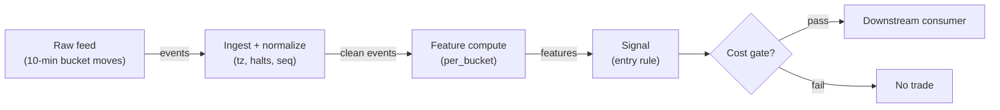

# S046 — Intraday U-shape timer

Time the U-shape: compare each window's absolute move against its typical level [documented]; when a window is abnormally active (`|z| >= 1.5` [example]), fade its signed move — a timer/deseasonalizer for other signals, not a standalone alpha. Provenance **[D]**.

> Tag law: every numeric literal in prose carries one of `[documented]
> [default] [example] [unverified] [internal-est] [measured]` (legend: Appendix
> i v1.0.0). Bibliographic years, volumes, pages, arXiv IDs, section numbers,
> rule codes (C1–C10), fail-safe codes (F1–F5), module IDs, batch keys, family
> letters, and machine-parsed §0 data fields are identifiers, not literals,
> and are exempt.

## §1 Five-minute reviewer card

| Row | Value |
|---|---|
| Module | S046 — Intraday U-shape timer, v1.0.1 |
| Edge verdict | `TIMER-ONLY` — the U-shape is documented (Wood–McInish–Ord 1985 [documented]); the timer's value is deseasonalizing other signals, not its own P&L |
| After-cost | `BEFORE-COST` — Works as a conditioning variable: abnormal lunch activity means the midday fade is tradeable; quiet opens mean the drift signal should be sized down. As a standalone entry it is unproven |
| Build cost | Tier L · `4–12` h [internal-est] · `$600–1,800` loaded [internal-est] |
| Data cost | Research `~$29–199`/mo [unverified] (Polygon Stocks Starter 15-min-delayed 1-min aggregates for research; Advanced for real-time production); production `~$199`/mo [unverified] — bands indicative, verify current pricing before budgeting |
| latency_class | bar-level / minutes |
| risk_class | low (signal-only; no order placement) |
| Capacity | `$5–25`/day notional [example] — illustrative; calibrate per venue |
| Executability | Feasible: Python+polars prototype; trivial compute |
| Risk summary | Standalone-alpha risk: this module is not one — trading it alone is the documented misuse; window-misalignment risk; typical-level staleness |
| When it dies | Used as a standalone entry (specification violation); regime shifts in the U-shape (typical levels stale); half-days misaligned to windows |
| Regime gates | Provisional: pending R001–R050 annotation |
| Emits | `signal_vector` (Appendix b v1.0.0) — never orders |

## §1.5 Cheapest / least-build path

1. **Prototype hour band:** `4–12` h [internal-est] — bar features + timestamp/halt handling + reference validation against the fixture.
2. **Cheapest-source row:** min_tier = Polygon.io Stocks **Starter** for research [internal-est] (15-min-delayed 1-min aggregates are sufficient for a bar-level timer prototype), **Advanced** for real-time production; latency_class = delayed (research) / real-time SIP (production); required_fields = 1-min aggregates (`o,h,l,c,v,vw,t,n`, corporate-action adjusted), daily session calendar, halt/market-status feed; price_band = `~$29–199`/mo [unverified] (Starter 15-min-delayed research tier → Advanced real-time; indicative — verify current pricing before budgeting); build_or_buy = **build the timer, buy the feed** (the window z-math is `~20` lines [internal-est]; the value is typical-level estimation, window calibration, and the conditioning integration — none sold by vendors).
3. **Resource budget:** `1` core, `<2` GB RAM for `500` symbols [internal-est]; compute pattern `per_bar`.
4. **Skip list:** tick-level variants; multi-venue aggregation; Rust ingest; colocated deployment.
5. **DO-NOT-CUT list:** causality assertions (`assert fill_event > signal_event`, no-signal-bar-fills test); COST block + callable `expected_cost_bps`; F1–F5 fail-safes + module-state enum + kill/safe-mode (`OFF`); decision-log audit records; bona-fide-intent + self-trade prevention; provenance tags on every numeric literal; fixtures + `test_cmd`; secrets via env only.
6. **Escalation gate:** upgrade from cheapest when any holds — live universe beyond the cheapest band; jitter persistently over budget; cost gate failing on `[measured]` costs; entitlement class changes.

## §S0 Module contract

### S0.1 Typed signature

```python
def signal(state: ModuleState, events: list[Event], cfg: Config) -> SignalVector:
```

`SignalVector` per Appendix b v1.0.0. `state` is the module-owned named state
vector (`buckets`, `window_stats`, `cooldown_until`, `module_state`); `events` are canonical Events (Appendix a v1.0.0),
newest last. The function handles documented edge cases: empty events →
`UNKNOWN`; invalid/missing prices → `UNKNOWN` (F1, never interpolate);
halt/auction events → freeze per the market-state table.

### S0.2 Config dataclass

| Parameter | Type | Default | Range | Status |
|---|---|---|---|---|
| `typ_open`/`sd_open` | float | `21.5` / `2.84` | — | example |
| `typ_lunch`/`sd_lunch` | float | `7.8` / `3.46` | — | example |
| `typ_close`/`sd_close` | float | `23.1` / `1.76` | — | example |
| `z_thresh` | float | `1.5` | `1.0`–`2.5` | example |
| `cost_gate_k` | float | `0.5` | `0.1`–`2.0` | default |
| `edge_bps` | float | `10.0` | `>0` | example — window-move edge when a window is active; measured on the validation fold at calibration |
| `cooldown_s` | float | `600.0` | `0`–`3600` | default — post-exit cooldown (C10) |
| `locate_ok` | bool | `True` | — | default — consumer asserts the Reg-SHO locate for SHORT (C7) |
| `bucket_min` | int | `10` | — | fixed — bucket width; the `39`-bucket session grid is baked into the window map |

All defaults tagged per the tag law (status `default` ⇒ `[default]`).

### S0.3 Canonical schema mapping

Vendor columns → canonical Event schema (Appendix a v1.0.0), stated once here:

| Vendor | Canonical |
|---|---|
| `abs_bp` | `abs_bp` (absolute bucket move, bps) |
| `sgn_bp` | `signed_bp` (signed bucket move, bps) |
| `t` (ms) | `event_ts` (int64 ns UTC; ms→ns) |
| `event_type` (optional; HALTED/AUCTION) | `event_type` (canonical market-event kind; absent = plain bucket event) |

### S0.4 Time contract

> Time contract: clock domain UTC, int64 ns; authoritative causality clock =
> `event_ts`; max_skew = `1` [default]; jitter budget = `500`
> [default]; bar-label = open time; staleness TTL = `3_600` [default]; gap
> policy = mask, no interpolation; halt/auction → discard contributions across
> reopen.

**Timing box:** `signal@t (per_bucket, America/New_York) → earliest fill @open(t+1)`

### S0.5 Market-state table

| State | Module behavior |
|---|---|
| CONTINUOUS_TRADING | Compute normally; emit per cadence |
| HALTED | Freeze state; emit `UNKNOWN`; discard contributions across reopen |
| AUCTION | No new signals; hold last `SignalVector`; state `DEGRADED` |
| CLOSED | Emit nothing; state `OFF` |

### S0.6 Module-state enum + error taxonomy

States per Appendix k v1.0.0: `OK | DEGRADED | UNKNOWN | OFF`. Invalid input →
`UNKNOWN`, never interpolate (Appendix f v1.0.0, F1–F5). Kill/safe-mode: an
administrative kill or a bounds violation forces `OFF` until the runbook
re-arm checklist passes.

| Failure | State | Alert |
|---|---|---|
| Missing/stale input (TTL) | `UNKNOWN` | page |
| Bad bar (high<low, non-positive prices, crossed quotes) | `UNKNOWN` | log |
| Feature out of mathematical bounds (F2) | `UNKNOWN` | page |
| `seq` gap beyond tolerance | `DEGRADED` (restart windows) | log |
| Halt/auction | `UNKNOWN` / `DEGRADED` (per table) | log |
| Kill/administrative disable | `OFF` | page |
| Anything unmapped | `UNKNOWN` | page |

### S0.7 Ops tail

- **Schedule:** continuous during US equities regular session `09:30`–`16:00` America/New_York [documented]; owner: signals on-call.
- **Health checks:** fixture replay (`test_cmd`) green on deploy; `seq`-gap monitor; staleness watchdog at `3_600` [default].
- **Alert table:** page on `UNKNOWN` > `5` min [default] or bounds violation; notify on `DEGRADED`; log single dropped events.
- **Resource budget:** `1` vCPU, `2` GB RAM per `500` symbols [internal-est]; state is O(window) per symbol.
- **Runbook stub:** `1.` confirm feed; `2.` replay fixture; `3.` if red → set `OFF`, page; `4.` reconcile decision log before re-arm.

### S0.8 Secrets (env-only)

`POLYGON_API_KEY` via environment only. No secrets in this file, fixtures, or logs
(CI secrets-grep).

### S0.9 May / must-NOT

> **May:** emit `SignalVector` records per Appendix b v1.0.0. **Must-NOT:**
> emit orders, order intents, prices, share counts, or notionals; call a
> broker; mutate shared state outside `state`; interpolate across gaps.

## §S1 Legacy (subsumed by §1)

Legacy §S1 content is the §1 reviewer card above; this header is retained so
section numbering stays frozen.

## §S2 Specification

### Universe

US common stocks, regular session; `39` ten-minute buckets [example] per day; half-days excluded.

### Entry rule (Boolean — no prose-only conditions)

Windows: open = buckets `0`–`5`, lunch = buckets `18`–`20`, close = buckets `36`–`38` [fixed] of the `39` ten-minute [fixed] session buckets; bucket index `b(e) = floor((e.event_ts − session_open_ts) / bucket_ns)`.

```
COMPLETE := (every bucket of the window present; incomplete windows masked, never interpolated)
ACTIVE   := COMPLETE AND (|z_window| >= z_thresh)
ENTER_LONG  := ACTIVE AND (signed_window < 0) AND (now >= cooldown_until)
               AND (expected_cost_bps(...) <= cost_gate_k * edge_bps)
ENTER_SHORT := ACTIVE AND (signed_window > 0) AND (locate_ok)
               AND (now >= cooldown_until) AND (expected_cost_bps(...) <= cost_gate_k * edge_bps)
FLAT        := otherwise  # inactive or incomplete windows never signal
```

`edge_bps` = `10.0` [example] — window-move edge when active; measured on the
validation fold at calibration (§S2 calibration procedure). If two windows
are active on the same event, the loudest wins: `argmax |z_w|` [default].
Confidence (normative): `confidence = clip((|z| − z_thresh) / (2.5 − z_thresh), 0, 1)` [default]; `capital = 0.5 × confidence` [default].

### Exits (with post-exit cooldown)

```
EXIT := (window ends) OR (module_state != OK)   # window-local timer
ON_EXIT: cooldown_until = now + cooldown_s   # C10
```

### Position sizing (fenced function)

```python
def size_shares(risk_budget_R, stop_distance, vol_estimate, ADV_cap, cost):
    # S-module requests capital fraction only; share math lives in the strategy.
    risk_notional = risk_budget_R * 0.5 * confidence          # 0.5 [default] factor
    shares = risk_notional / max(stop_distance, 1e-9)        # 1e-9 [default] guard
    return int(min(shares, ADV_cap * adv_shares * 0.001))     # 0.1% ADV cap [default]
```

### Risk limits

| Limit | Value |
|---|---|
| Max capital fraction per signal | `0.5` [default] |
| Max adverse excursion before `UNKNOWN` review | `2.0`× stop [default] |
| Staleness kill | TTL `3_600` [default] → `UNKNOWN` |

### COST block (single source of truth)

| Component | Value (bps) | Basis |
|---|---|---|
| Spread (half-spread, liquid large-cap) | `0.50` | [example] |
| Fees (taker incl. regulatory) | `0.60` | [documented] — Nasdaq standard remove-liquidity fee `$0.0030`/share (Rule 7018 price list [documented]) converted at the `$50` reference print [example] → `0.60` bps; FINRA TAF + SEC §31 sell-side fees folded in [example] |
| Borrow | `0.0` | [default] — reason: reference build long-biased; shorts add C7 locate cost |
| Impact | `1.0` | [example] — flagged; calibrate per venue at scale-up |
| **Total reference** | `2.10` | [example] — `0.50 + 0.60 + 0.0 + 1.0`; the maker side nets `1.30` bps on the `-0.20` rebate print [example] |

`fee_schedule_as_of`: `2026-09-11` [measured] — Nasdaq Rule 7018 standard
remove rate `$0.0030`/share confirmed via SEC filings (SR-NASDAQ-2015-112 and
follow-ons [documented]); re-pin the live schedule before production.
`side: taker` [default]; venue/tier/source: XNAS / Polygon SIP 1-min bars
[example]. Re-stating cost numbers outside this block is a validation failure.

```python
def expected_cost_bps(notional, adv_pct, venue, side, urgency) -> float:
    # Callable cost model - reference stack, components from the COST block.
    spread_bps = 0.50   # [example]
    fee_bps = 0.60      # [documented] $0.0030/share ÷ $50 reference print [example]
    borrow_bps = 0.0    # [default] long-biased reference; reason in table
    impact_bps = 1.0    # [example] flagged; calibrate per venue at scale-up
    if side == "maker":
        fee_bps = -0.20  # rebate [example]
    return spread_bps + fee_bps + borrow_bps + impact_bps
```

### Execution / fill model table

| Aspect | Assumption |
|---|---|
| Latency | Signal→intent `≤1` event [example]; feed path latency-simulated-only |
| Partial fills | N/A (signal-only; T-module policy: Appendix c v1.0.0) |
| Impact | `1.0` bps reference [example]; stress ×`5` [example] |
| Adverse fill | Whipsaw haircut `0.2` bps per unit signal [example] |

### Robustness

Threshold `1.0`–`2.5` [example] selects the same abnormal windows; typical levels must be re-estimated quarterly — the U-shape flattens as market structure changes. Bucket alignment to the session open is critical: a `10`-min [example] misalignment mixes windows.

### Compliance sub-block (C1–C10+)

| Code | Rule: trigger → check → action → log |
|---|---|
| C1 | Self-match prevention: this S-module emits no orders; downstream consumers must set self-trade-prevention flags — asserted in the `consumes` contract → check: consumer ticket schema (Appendix c v1.0.0) has STP flag → action: block non-compliant consumers → log: `stp_assert` record |
| C2 | Bona-fide intent: every emitted `SignalVector` with direction ≠ `0` must pass the cost gate; sub-threshold features emit direction `0`, never a tradeable hint → check: `expected_cost_bps(...) <= k * edge_bps` → action: zero the direction on failure → log: `gate_veto` record |
| C3 | Message-rate: emissions capped per symbol per second [default] → check: rate monitor → action: throttle + alert → log: `throttle` record |
| C4 | Fat-finger trio (applied by consumers; this module bounds its own outputs): confidence ∈ [`0`,`1`], capital ∈ [`0`,`0.5`], computed_at sane → check: bounds on every emission → action: out-of-bounds → `UNKNOWN` (F2) → log: `bounds_veto` record |
| C5 | Decision log: every emission, veto, and state transition logged per Appendix g v1.0.0, hash-chained → check: log write ack → action: halt on write failure → log: the record itself |
| C6 | Halt/auction: per §S0.5 market-state table; contributions across reopen discarded → check: state feed → action: freeze/`DEGRADED` → log: `state_freeze` record |
| C7 | Locate check: SHORT direction requires `locate_ok` from the consumer; no SHORT without asserted locate (Reg-SHO threshold securities → direction `0`) → check: locate flag → action: zero SHORT on missing locate → log: `locate_veto` record |
| C8 | Public dissemination: no signal values published externally without review gate → check: export channel → action: block unreviewed export → log: `export_block` record |
| C9 | Data entitlements: per §S6 Data rights row → check: entitlement class on startup → action: entitlement change → §1.5 escalation gate → log: `entitlement` record |
| C10 | Post-exit cooldown: `cooldown_s` after any exit or compliance block; no re-entry → check: `now >= cooldown_until` → action: suppress entries → log: `cooldown` record |
| C11 | Standalone-use prohibition: consumers must document this module as a timer/conditioner, not an entry alpha → check: consumer strategy mapping → action: flag standalone use → log: `timer_mapping` record |

### Parameter table

| Parameter | Symbol | Value | Tag | Sensitivity |
|---|---|---|---|---|
| Typical levels | `typ_*` | `21.5`/`7.8`/`23.1` bp | [example] | high — re-estimate quarterly |
| Dispersions | `sd_*` | `2.84`/`3.46`/`1.76` | [example] | high |
| Trigger | `z_thresh` | `1.5` | [example] | medium |
| Window edge | `edge_bps` | `10.0` | [example] | high — feeds the cost-gate predicate directly |
| Cooldown | `cooldown_s` | `600.0` s | [default] | low |
| Locate assertion | `locate_ok` | `True` | [default] | high for SHORT |
| Bucket width | `bucket_min` | `10` min | [fixed] | high — defines the window map |

### Calibration procedure (walk-forward, purged/embargoed)

This module is a conditioner, not a standalone alpha: calibrate against a
**downstream consumer metric** (the consuming strategy's net-of-reference-cost
validation-fold P&L). Walk-forward with purge `2` sessions [default] + embargo
`1` session [default] around every quarterly refit boundary (t→t+1 discipline);
minimum `60` sessions [default] of 10-min bucket history per symbol per refit;
typical levels pooled per venue-tier / market-cap bucket [default].

1. `typ_w` / `sd_w`: re-estimate quarterly [default] as the trailing-`60`-session [default] mean/std of per-window absolute moves. Sign-off: OOS z dispersion within `20`% [default] of IS; beyond that → weekly re-estimation until stable (the U-shape flattens as market structure changes).
2. `z_thresh`: grid `{1.0, 1.25, 1.5, 1.75, 2.0, 2.5}` [default]; select the value maximizing the OOS consumer-validation metric on the validation fold; stability tie-break = highest IS/OOS Jaccard overlap of the active-window set [default]. Ships `1.5` [example] as the grid midpoint until the first calibration completes.
3. `edge_bps`: measured on the validation fold as the OOS mean fade of the signed window move over active windows, net of the reference cost stack; status → `calibrate`. Ships `10.0` [example] until measured. If measured edge `< 2×` reference cost [default], the module emits an `UNKNOWN` review flag (timer not worth conditioning on).
4. `cooldown_s`: sweep `{0, 300, 600, 1200, 1800}` s [default]; keep the smallest value with no re-entry chatter that reduces entry count by `≤ 10`% [default].
5. `cost_gate_k`: fixed at `0.5` [default] until `[measured]` costs are pinned; then set so the gate binds on `~25`% [example] of marginal entries (k too high = no filter; k too low = no entries).

### Timing box

`signal@t (per_bucket, America/New_York) → earliest fill @open(t+1)`

## §S3 Math + normative pseudocode

For window $w \in \{\mathrm{open}, \mathrm{lunch}, \mathrm{close}\}$ with observed mean absolute move $o_w$ and observed mean signed move $s_w$ over its **complete** bucket set (incomplete windows are masked — never interpolated):

$$z_w = \frac{o_w - \tau_w}{\sigma_w}, \qquad \mathrm{active}_w = \mathbf{1}\{|z_w| \ge \tau_z\}$$

with $(\tau, \sigma) = (21.5, 2.84)$ open, $(7.8, 3.46)$ lunch, $(23.1, 1.76)$ close [example], $\tau_z = 1.5$ [example]. Chapter S4: $z_{\mathrm{open}} = -0.88$ [example], $z_{\mathrm{lunch}} = +1.79$ [example] (active), $z_{\mathrm{close}} = +1.08$ [example]. Direction fades the signed window move ($-14$bp [example] lunch $\to$ long). Normative confidence (pins the timer's sizing weight): $\mathrm{confidence} = \mathrm{clip}((|z|-\tau_z)/(2.5-\tau_z),\,0,\,1)$ [default]; $\mathrm{capital} = 0.5 \times \mathrm{confidence}$ [default]. This is a timer/deseasonalizer: its output conditions other signals' sizing, and trading it standalone is a documented misuse.

**Normative pseudocode** (pseudocode is normative; prose is commentary):

```
function signal(state, events, cfg) -> SignalVector:
    if events empty: return UNKNOWN                                    # F1
    e = events[-1]
    if e.abs_bp < 0 or not valid(e): return UNKNOWN                    # F1/F2: never interpolate
    if e.event_type == HALTED: freeze(state); return UNKNOWN           # §S0.5
    if e.event_type == AUCTION: return DEGRADED(hold last)             # §S0.5
    b = floor((e.event_ts - session_open_ts) / bucket_ns)             # 10-min [fixed] bucket index
    # complete windows only: every bucket of the window present in events
    for w in {open:(0,6), lunch:(18,21), close:(36,39)}:
        if not all buckets of w present: continue                      # masked, never active
        o_w = mean(abs_bp over w); s_w = mean(signed_bp over w)
        z_w = (o_w - typ_w) / sd_w                                     # typ_w/sd_w: quarterly calibration
        active_w = |z_w| >= cfg.z_thresh
    if no active window: return FLAT_OK                                # inactive/incomplete -> no signal
    w* = argmax |z_w| over active windows                              # loudest abnormal window [default]
    direction = -sign(s_w*) if active_w* else 0                        # fade the signed move
    if e.event_ts < state.cooldown_until: direction = 0                # C10 post-exit cooldown
    if direction < 0 and not cfg.locate_ok: direction = 0             # C7: no SHORT without locate
    confidence = clip((|z_w*| - cfg.z_thresh) / (2.5 - cfg.z_thresh), 0, 1) if direction != 0 else 0  # [default]
    capital = 0.5 * confidence                                         # 0.5 [default]
    cost_ok = expected_cost_bps(...) <= cfg.cost_gate_k * cfg.edge_bps
    # ^^^ normative cost-gate predicate: expected_cost_bps(...) <= k * edge_bps
    if not cost_ok: direction, confidence, capital = 0, 0, 0          # C2: zero on gate failure
    sig = SignalVector(symbol=e.symbol, direction, confidence, capital,
                       computed_at=e.event_ts, staleness=now()-e.asof_ts,
                       module_state=state.module_state)
    log_decision(sig, inputs_hash, params_hash)                       # C5 / Appendix g
    assert fill_event > signal_event                                  # t→t+1: no signal-bar fills
    return sig
```

Causality: features at event/bar `t` use only data `≤ t`; a window's $z$ is
computable only after its last bucket closes; earliest reaction is
`t+1`. Mandatory unit test: no-signal-bar fills.

## §S4 Worked example (fixture-backed)

- Tape: `modules/fixtures/S046_tape.csv` — `# TYPE: validation-run`;
  `39` synthetic ten-minute buckets (`id,event_ts,abs_bp,signed_bp`); the chapter's S4 U-shape day (seed `46`). All numbers synthetic, seed `46` [example]; timestamps int64 ns UTC.
- Boundary tape: `modules/fixtures/S046_boundary.csv` — `# TYPE: validation-run`; same `39`-bucket grid; lunch window |z| = `1.55` [example] (active), open |z| = `1.45` [example] (inactive), close z = `−1.45` [example] (inactive) — pins the trigger boundary without float fragility.
- Expected outputs: `modules/fixtures/S046_expected.csv` — One row per window (`open`/`lunch`/`close`): `obs`, `typ`, `typ_sd`, `z`, `active`, `signed`, `dir`; only lunch is active.
- Tolerance: `1e-9` on floats; integer counts exact.
- Acceptance tests (`modules/tests/test_S046.py`, `12` tests):
  `1.` fixture recomputes to expected (window z hand-checks; lunch-only activity; fade direction; every window complete); `2.` stub emits valid `SignalVector` on every prefix; `3.` no-signal-bar fills (`fill_event_ts > computed_at`); `4.` cost-gate predicate pins the reference stack (`2.10` bps [example]) and passes on large edge / blocks on tiny edge (`k = 0.5` [default]); `5.` invalid input (negative abs move) → `UNKNOWN`; `6.` boundary fixture: |z| = `1.55` [example] active, |z| = `1.45` [example] inactive; `7.` confidence formula pinned (`clip((|z|−1.5)/1.0, 0, 1)` [default]); `8.` incomplete windows (partial-day prefix) never fire, state stays `OK`; `9.` cooldown suppresses re-entry (`C10`); `10.` maker side uses the rebate branch and is cheaper than taker; `11.` `SHORT` needs `locate_ok` (`C7`); `12.` `HALTED` event freezes to `UNKNOWN` (§S0.5).
- `test_cmd`: `python3 -m pytest modules/tests/test_S046.py -q` → exits `0`.

**Hand-check:** open `z=−0.88` [example] inactive; lunch `z=+1.79` [example] active, signed `−14`bp [example] → `dir=+1`; close `z=+1.08` [example] inactive — asserted in the test.

**Where the example is optimistic:** no fees, no latency, no partial fills, no corporate-action surprises — arithmetic illustration, not a backtest.

## §S5 Strategies that use this signal

Generated from `deps.yaml` (CI symmetry); hand-listed here:

| Strategy | Role |
|---|---|
| Timer consumer (strategy mapping pending deps.yaml) | Conditioning input: size other signals by window activity |
| Pairs with S027/S033 | Deseasonalizes drift/auction signals |

## §S6 Data required

| Field | Type | Granularity | Source tier | Notes |
|---|---|---|---|---|
| 1-min bar aggregates (built into 10-min buckets) | float `o,h,l,c,v,vw,t,n` per bar | 1-min → 10-min | Polygon.io Stocks Starter (research, 15-min delayed) / Advanced (production, real-time) | aggregates endpoint; `adjusted=true` so corporate actions are applied; `39` buckets/session |
| Typical levels (`typ_w`/`sd_w`) | float | quarterly | internal derivation | trailing-`60`-session [default] mean/std of per-window absolute moves (§S2 calibration) |
| Session calendar | reference | daily | Polygon reference tickers / market-status endpoints | half-day veto per §S10.3 |
| Halt/market-status feed | event | per event | same vendor feed | drives the §S0.5 market-state table |

**Data rights row** (Appendix j v1.0.0): SIP 1-min bars via Polygon Stocks Advanced, `rights: licensed`; scope = research + stated production symbol count (`≤500` [default]); raw ticks never leave our systems — fixtures are synthetic; entitlement = professional/internal, no display; retention per vendor terms, purge path in runbook; derived features ours.

## §S7 Local build (M5 Max / 128 GB)

Feasible: trivial. Thirty-nine buckets, three window means. Tier L per `notes/cost-model.md` §5: `4–12` h ≈ `$600–1,800` [internal-est] at `$150`/hr loaded. The work is quarterly re-estimation of typical levels.

## §S8 Buy vs build

| Tier-1 (Polygon Stocks Advanced) | 1-min bars | ~`$30–200`/mo | Clean inputs | None material |

**Verdict:** build. The timer is `20` lines [internal-est]; its value is as a conditioner, priced into other modules' builds.

## §S9 Efficacy — documented evidence

| Study / source | Market & period | Metric | Before/after cost | Caveat |
|---|---|---|---|---|
| Chapter S4 worked tape (seed `46`) | Single synthetic day | Lunch window active (`z=1.79` [example]) | `BEFORE-COST` (arithmetic illustration) | Synthetic — demonstrates the computation |
| Wood–McInish–Ord (1985), *J. Finance* | NYSE transactions | U-shaped intraday volume/volatility patterns | Descriptive | Documents the shape, not the timer |

**Selection disclosure:** the chapter's worked tape plus the U-shape literature; the timer has no standalone P&L by design [documented-as-assessment].

### Regime gates (machine records, provisional — pending R001–R050 annotation)

| regime_id | direction | mechanism | condition | action | min_lag | unknown_behavior |
|---|---|---|---|---|---|---|
| R001 | amplifies | abnormal-window regime: the timer fires | active_flag | none (size per §S2) | `0` [default] | veto |
| R002 | degrades | stale typical levels | recalibration_due | re-estimate | `0` [default] | veto |
| R003 | degrades | half-days / misaligned windows | calendar_flag | veto | `0` [default] | veto |

## §S10 Failure modes & pitfalls

| # | Trigger → Detect → Action → Recovery | check: |
|---|---|
| 1 | Standalone trading of the timer → detect: consumer mapping audit → action: flag misuse → recovery: remap as conditioner | `check: timer_use_only` |
| 2 | Stale typical levels (U-shape flattened) → detect: quarterly re-estimation due → action: re-estimate → recovery: resume | `check: typ_fresh` |
| 3 | Window misalignment (half-days) → detect: calendar check → action: veto the day → recovery: none | `check: full_session` |
| 4 | Lookahead: future buckets in window means → detect: causality audit → action: halt, fix → recovery: re-run no-signal-bar-fills test | `check: all(fill_ts > computed_at)` |
| 5 | Cost blowup vs a timer's thin edge → detect: cost gate on `[measured]` costs → action: stand down → recovery: re-pin fee schedule | `check: expected_cost_bps(...) <= k * edge_bps` |
| 6 | Signed-move sign error (chase instead of fade) → detect: spec audit → action: halt, fix → recovery: re-run tests | `check: direction == -sign(signed)` |
| 7 | Bucket feed gap → detect: `seq`-gap monitor → action: `DEGRADED` → recovery: backfill | `check: seq_continuous` |
| 8 | Trigger never clears → detect: trigger-rate monitor → action: no signal (correct) → recovery: none | `check: trigger_rate_sane` |

## §S11 Visuals

Figure: `batches figure (see §0 `plot_script`)` (synthetic, seed `46` [example]).



## §S12 Source log + unverified leads

**Sources** (citable facts only):

1. Wood, R. A., McInish, T. H. & Ord, J. K. (1985). "An Investigation of Transactions Data for NYSE Stocks." *Journal of Finance* 40(3) [documented].
2. Chapter S4 worked values (seed 46): typical `21.5`/`7.8`/`23.1`bp, observed `19.0`/`14.0`/`25.0`bp [documented-as-chapter-value].

**Chatbot source log.** Duck.ai (GPT-5.6 Luna, anonymous) answered Q-SB6-1–Q-SB6-3 (`2026-09-10`); Grok/Cursor answers pending (checked `2026-09-10`).

**Unverified leads** (chatbot-only — never in evidence tables):

- Chatbot-cited U-shape typical levels by market-cap bucket [unverified] — not independently confirmed; kept out of evidence tables.
- Polygon Stocks Starter `~$29`/mo (15-min-delayed research) → Advanced `~$199`/mo (real-time) band [unverified] — third-party pricing summaries; confirm current pricing before budgeting.
- **GROK-NEEDED (Q-GROK-S046-1):** Is there a published intraday U-shape absolute-move benchmark — e.g. per-10-minute-window mean absolute return in bps for open/lunch/close on large-cap US equities — that could seed `typ_open`/`typ_lunch`/`typ_close` and their dispersions as `[documented]` rather than `[example]`? Wood–McInish–Ord (1985) documents the U-shape; the chapter's `21.5`/`7.8`/`23.1` bp typical levels and `2.84`/`3.46`/`1.76` dispersions are chapter example values. Name the paper/table or answer "none found."

---

## Appendix — AI build prompt (S046)

Copy-paste into any chat agent:

> Build module **S046 — Intraday U-shape timer** per `notes/module-template.md` v1.0.0
> and this file's §S0 contract. Cheapest path (§1.5): prototype
> `4–12` h [internal-est]; cheapest data candidate
> Polygon.io Stocks Advanced [internal-est]; compute pattern `per_bar`.
> Implement `signal(state, events, cfg) -> SignalVector` (Appendix b v1.0.0)
> with the §S3 normative pseudocode: complete-window gating only (incomplete
> windows masked, never interpolated), loudest-window `argmax |z|`, pinned
> confidence `clip((|z|−z_thresh)/(2.5−z_thresh), 0, 1)` [default], C10
> cooldown, C7 locate veto, the cost-gate predicate
> `expected_cost_bps(...) <= k * edge_bps` and `assert fill_event >
> signal_event`. Wire F1–F5 (Appendix f v1.0.0): invalid input → `UNKNOWN`,
> never interpolate. Log decisions per Appendix g v1.0.0. Secrets via env
> only. Run the fixture `modules/fixtures/S046_tape.csv`
> (`# TYPE: validation-run`) against `modules/fixtures/S046_expected.csv`
> (tolerance `1e-9`) and the `S046_boundary.csv` trigger-boundary fixture
> (|z| = `1.55` [example] fires, `1.45` [example] does not).
> **Definition of done:** `python3 -m pytest modules/tests/test_S046.py -q`
> exits `0`. Tag every numeric literal you add with the unified enum
> (Appendix i v1.0.0); put anything unverifiable in §S12 unverified leads.
