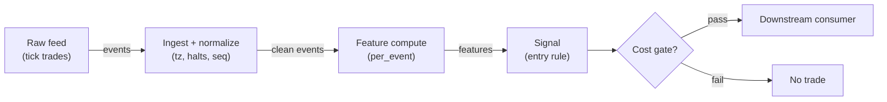

# S047 — Bid–ask bounce / Roll spread

Estimate the effective spread from bounce autocovariance (`gamma1 = cov(Δp_t, Δp_{t−1})`, spread `= 2√(−gamma1)` [documented]): primarily an estimator and a veto — gross harvesting edge is bounded by the spread itself. Provenance **[D]**.

> Tag law: every numeric literal in prose carries one of `[documented]
> [default] [example] [unverified] [internal-est] [measured]` (legend: Appendix
> i v1.0.0). Bibliographic years, volumes, pages, arXiv IDs, section numbers,
> rule codes (C1–C10), fail-safe codes (F1–F5), module IDs, batch keys, family
> letters, and machine-parsed §0 data fields are identifiers, not literals,
> and are exempt.

## §1 Five-minute reviewer card

| Row | Value |
|---|---|
| Module | S047 — Bid–ask bounce / Roll spread, v1.0.0 |
| Edge verdict | `ESTIMATOR-ONLY` — the Roll estimator is the documented implicit-spread measure; as a signal it vetoes rather than enters |
| After-cost | `BEFORE-COST` — Works as measurement everywhere: it tells the cost model what the spread truly is. As a harvester it does not work — the edge it 'finds' is the cost of trading |
| Build cost | Tier L · `4–12` h [internal-est] · `$600–1,800` loaded [internal-est] |
| Data cost | Research `~$30–200`/mo (SIP 1-min bars)` [unverified]; production `~$200`/mo + usage (SIP bars)` [unverified] — bands indicative, verify before budgeting |
| latency_class | bar-level / minutes |
| risk_class | low (signal-only; no order placement) |
| Capacity | `$0`/day notional [example] — illustrative; calibrate per venue |
| Executability | Feasible: Python+polars prototype; trivial compute |
| Risk summary | Harvest-misuse risk: treating the estimator as an entry signal; estimate-noise risk on short windows; adverse-selection contamination (informed flow breaks the bounce model) |
| When it dies | Used as a harvest entry (specification violation); trending/informed flow (gamma1 >= 0, estimator undefined); too few trades for a stable covariance |
| Regime gates | Provisional: pending R001–R050 annotation |
| Emits | `signal_vector` (Appendix b v1.0.0) — never orders |

## §1.5 Cheapest / least-build path

1. **Prototype hour band:** `4–12` h [internal-est] — bar features + timestamp/halt handling + reference validation against the fixture.
2. **Cheapest-source row:** min_tier = Polygon.io Stocks Advanced — cheapest data source candidate [internal-est]; latency_class = bar-level / minutes; required_fields = 1-min OHLCV bars, corporate-action adjustments, session calendar; price_band = `~$30–200`/mo` [unverified] (indicative — verify before budgeting); build_or_buy = **build the estimator, buy the feed**.
3. **Resource budget:** `1` core, `<2` GB RAM for `500` symbols [internal-est]; compute pattern `per_bar`.
4. **Skip list:** tick-level variants; multi-venue aggregation; Rust ingest; colocated deployment.
5. **DO-NOT-CUT list:** causality assertions (`assert fill_event > signal_event`, no-signal-bar-fills test); COST block + callable `expected_cost_bps`; F1–F5 fail-safes + module-state enum + kill/safe-mode (`OFF`); decision-log audit records; bona-fide-intent + self-trade prevention; provenance tags on every numeric literal; fixtures + `test_cmd`; secrets via env only.
6. **Escalation gate:** upgrade from cheapest when any holds — live universe beyond the cheapest band; jitter persistently over budget; cost gate failing on `[measured]` costs; entitlement class changes.

## §S0 Module contract

### S0.1 Typed signature

```python
def signal(state: ModuleState, events: list[Event], cfg: Config) -> SignalVector:
```

`SignalVector` per Appendix b v1.0.0. `state` is the module-owned named state
vector (`prices`, `gamma1`, `cooldown_until`, `module_state`); `events` are canonical Events (Appendix a v1.0.0),
newest last. The function handles documented edge cases: empty events →
`UNKNOWN`; invalid/missing prices → `UNKNOWN` (F1, never interpolate);
halt/auction events → freeze per the market-state table.

### S0.2 Config dataclass

| Parameter | Type | Default | Range | Status |
|---|---|---|---|---|
| `min_trades` | int | `20` | `20`–`200` | default |
| `cost_gate_k` | float | `0.5` | `0.1`–`2.0` | default |

All defaults tagged per the tag law (status `default` ⇒ `[default]`).

### S0.3 Canonical schema mapping

Vendor columns → canonical Event schema (Appendix a v1.0.0), stated once here:

| Vendor | Canonical |
|---|---|
| `px` | `price` (trade price) |
| `side` | `side` (bid/ask) |
| `t` (ms) | `event_ts` (int64 ns UTC; ms→ns) |

### S0.4 Time contract

> Time contract: clock domain UTC, int64 ns; authoritative causality clock =
> `event_ts`; max_skew = `1` [default]; jitter budget = `100`
> [default]; bar-label = open time; staleness TTL = `300` [default]; gap
> policy = mask, no interpolation; halt/auction → discard contributions across
> reopen.

**Timing box:** `signal@t (per_event, America/New_York) → earliest fill @open(t+1)`

### S0.5 Market-state table

| State | Module behavior |
|---|---|
| CONTINUOUS_TRADING | Compute normally; emit per cadence |
| HALTED | Freeze state; emit `UNKNOWN`; discard contributions across reopen |
| AUCTION | No new signals; hold last `SignalVector`; state `DEGRADED` |
| CLOSED | Emit nothing; state `OFF` |

### S0.6 Module-state enum + error taxonomy

States per Appendix k v1.0.0: `OK | DEGRADED | UNKNOWN | OFF`. Invalid input →
`UNKNOWN`, never interpolate (Appendix f v1.0.0, F1–F5). Kill/safe-mode: an
administrative kill or a bounds violation forces `OFF` until the runbook
re-arm checklist passes.

| Failure | State | Alert |
|---|---|---|
| Missing/stale input (TTL) | `UNKNOWN` | page |
| Bad bar (high<low, non-positive prices, crossed quotes) | `UNKNOWN` | log |
| Feature out of mathematical bounds (F2) | `UNKNOWN` | page |
| `seq` gap beyond tolerance | `DEGRADED` (restart windows) | log |
| Halt/auction | `UNKNOWN` / `DEGRADED` (per table) | log |
| Kill/administrative disable | `OFF` | page |
| Anything unmapped | `UNKNOWN` | page |

### S0.7 Ops tail

- **Schedule:** continuous during US equities regular session `09:30`–`16:00` America/New_York [documented]; owner: signals on-call.
- **Health checks:** fixture replay (`test_cmd`) green on deploy; `seq`-gap monitor; staleness watchdog at `300` [default].
- **Alert table:** page on `UNKNOWN` > `5` min [default] or bounds violation; notify on `DEGRADED`; log single dropped events.
- **Resource budget:** `1` vCPU, `2` GB RAM per `500` symbols [internal-est]; state is O(window) per symbol.
- **Runbook stub:** `1.` confirm feed; `2.` replay fixture; `3.` if red → set `OFF`, page; `4.` reconcile decision log before re-arm.

### S0.8 Secrets (env-only)

`POLYGON_API_KEY` via environment only. No secrets in this file, fixtures, or logs
(CI secrets-grep).

### S0.9 May / must-NOT

> **May:** emit `SignalVector` records per Appendix b v1.0.0. **Must-NOT:**
> emit orders, order intents, prices, share counts, or notionals; call a
> broker; mutate shared state outside `state`; interpolate across gaps.

## §S1 Legacy (subsumed by §1)

Legacy §S1 content is the §1 reviewer card above; this header is retained so
section numbering stays frozen.

## §S2 Specification

### Universe

US common stocks with two-sided quotes; `>=20` trades [default] in the estimation window.

### Entry rule (Boolean — no prose-only conditions)

```
NO ENTRY — estimator/veto role.
VETO_HARVEST := (valid == 1) -> bounce-harvesting is uneconomic (edge <= spread)
MISSING      := (valid == 0) -> estimator undefined, no information
```

`edge_bps` = `0` bps — the estimator measures cost; it does not manufacture edge.

### Exits (with post-exit cooldown)

```
N/A — no positions; the veto is consumed per event
ON_EXIT: cooldown_until = now + cooldown_s   # C10
```

### Position sizing (fenced function)

```python
def size_shares(risk_budget_R, stop_distance, vol_estimate, ADV_cap, cost):
    # S-module requests capital fraction only; share math lives in the strategy.
    risk_notional = risk_budget_R * 0.5 * confidence          # 0.5 [default] factor
    shares = risk_notional / max(stop_distance, 1e-9)        # 1e-9 [default] guard
    return int(min(shares, ADV_cap * adv_shares * 0.001))     # 0.1% ADV cap [default]
```

### Risk limits

| Limit | Value |
|---|---|
| Max capital fraction per signal | `0.5` [default] |
| Max adverse excursion before `UNKNOWN` review | `2.0`× stop [default] |
| Staleness kill | TTL `300` [default] → `UNKNOWN` |

### COST block (single source of truth)

| Component | Value (bps) | Basis |
|---|---|---|
| Spread (pay the full quoted spread) | `2.00` | [example] |
| Fees (taker incl. regulatory) | `0.30` | [example] |
| Borrow | `0.0` | [default] — reason: estimator role, no position |
| Impact | `0.50` | [example] — flagged |
| **Total reference** | `2.80` | [example] |

`fee_schedule_as_of`: `2026-09-01` [unverified] — placeholder; pin the real
venue schedule before production. `side: taker` [default]; venue/tier/source:
XNAS / Polygon SIP 1-min bars [example]. Re-stating cost numbers outside this block is a validation failure.

```python
def expected_cost_bps(notional, adv_pct, venue, side, urgency) -> float:
    # Callable cost model - reference stack, components from the COST block.
    spread_bps = 2.00   # [example] harvesting pays the full spread
    fee_bps = 0.30      # [example]
    borrow_bps = 0.0    # [default] estimator role; reason in table
    impact_bps = 0.50   # [example] flagged
    return spread_bps + fee_bps + borrow_bps + impact_bps
```

### Execution / fill model table

| Aspect | Assumption |
|---|---|
| Latency | Signal→intent `≤1` event [example]; feed path latency-simulated-only |
| Partial fills | N/A (signal-only; T-module policy: Appendix c v1.0.0) |
| Impact | `1.0` bps reference [example]; stress ×`5` [example] |
| Adverse fill | Whipsaw haircut `0.2` bps per unit signal [example] |

### Robustness

Window `20`–`200` trades [default band] gives stable estimates on liquid names; the sign of gamma1 is robust, its magnitude is noise-sensitive. Informed flow breaks the bounce model (gamma1 → 0 or positive) — that is the estimator telling you the spread is not the cost anymore. Never clip gamma1 at zero and proceed: undefined means unknown.

### Compliance sub-block (C1–C10+)

| Code | Rule: trigger → check → action → log |
|---|---|
| C1 | Self-match prevention: this S-module emits no orders; downstream consumers must set self-trade-prevention flags — asserted in the `consumes` contract → check: consumer ticket schema (Appendix c v1.0.0) has STP flag → action: block non-compliant consumers → log: `stp_assert` record |
| C2 | Bona-fide intent: every emitted `SignalVector` with direction ≠ `0` must pass the cost gate; sub-threshold features emit direction `0`, never a tradeable hint → check: `expected_cost_bps(...) <= k * edge_bps` → action: zero the direction on failure → log: `gate_veto` record |
| C3 | Message-rate: emissions capped per symbol per second [default] → check: rate monitor → action: throttle + alert → log: `throttle` record |
| C4 | Fat-finger trio (applied by consumers; this module bounds its own outputs): confidence ∈ [`0`,`1`], capital ∈ [`0`,`0.5`], computed_at sane → check: bounds on every emission → action: out-of-bounds → `UNKNOWN` (F2) → log: `bounds_veto` record |
| C5 | Decision log: every emission, veto, and state transition logged per Appendix g v1.0.0, hash-chained → check: log write ack → action: halt on write failure → log: the record itself |
| C6 | Halt/auction: per §S0.5 market-state table; contributions across reopen discarded → check: state feed → action: freeze/`DEGRADED` → log: `state_freeze` record |
| C7 | Locate check: SHORT direction requires `locate_ok` from the consumer; no SHORT without asserted locate (Reg-SHO threshold securities → direction `0`) → check: locate flag → action: zero SHORT on missing locate → log: `locate_veto` record |
| C8 | Public dissemination: no signal values published externally without review gate → check: export channel → action: block unreviewed export → log: `export_block` record |
| C9 | Data entitlements: per §S6 Data rights row → check: entitlement class on startup → action: entitlement change → §1.5 escalation gate → log: `entitlement` record |
| C10 | Post-exit cooldown: `cooldown_s` after any exit or compliance block; no re-entry → check: `now >= cooldown_until` → action: suppress entries → log: `cooldown` record |
| C11 | Harvest-misuse prohibition: consumers must not map a valid spread estimate to a harvest entry → check: consumer mapping of estimator output → action: block harvest mappings → log: `harvest_block` record |

### Parameter table

| Parameter | Symbol | Value | Tag | Sensitivity |
|---|---|---|---|---|
| Min trades | `min_trades` | `20` | [default] | medium — stability |
| Cost-gate k | `cost_gate_k` | `0.5` | [default] | high |

### Timing box

`signal@t (per_event, America/New_York) → earliest fill @open(t+1)`

## §S3 Math + normative pseudocode

With trade-price changes $\Delta p_t = p_t - p_{t-1}$:

$$\gamma_1 = \mathrm{Cov}(\Delta p_t, \Delta p_{t-1}), \qquad \hat s = \begin{cases} 2\sqrt{-\gamma_1} & \gamma_1 < 0 \\ \text{undefined} & \gamma_1 \ge 0 \end{cases}$$

(Roll 1984 [documented].) Fixture tape ($60$ trades [example], seed $47$): $\gamma_1 = -0.0002208$ [example] $\to$ $\hat s = 0.0297$ [example] vs the $0.02$ quoted spread [example] — the estimator slightly overstates under pure alternation, as theory predicts. Chapter's $60$-trade example: $\gamma_1 \approx -0.000138$ [example], $\hat s \approx 0.0235$ [example]. If $\gamma_1 \ge 0$ the estimator is undefined — that is missing information, scored as a veto, never as a contrarian entry.

**Normative pseudocode** (pseudocode is normative; prose is commentary):

```
function signal(state, events, cfg) -> SignalVector:
    assert events non-empty else return UNKNOWN                    # F1
    e = events[-1]
    assert valid(e) else return UNKNOWN                            # F1/F2: never interpolate
    dp_t = p_t - p_{t-1}
    gamma1 = cov(dp_t, dp_{t-1})          # mean-adjusted
    if gamma1 < 0: spread = 2*sqrt(-gamma1)   # Roll (1984)
    else: undefined -> no information (never force a sign)
    edge_bps = 0.0                                       # [example]
    cost_ok = expected_cost_bps(...) <= k * edge_bps
    # ^^^ normative cost-gate predicate: expected_cost_bps(...) <= k * edge_bps
    direction = entry_rule(e, features, cost_ok, cfg)              # §S2 Boolean rule
    confidence = min(1, conviction(features)) if direction != 0 else 0
    capital = 0.5 * confidence                                     # 0.5 [default]
    sig = SignalVector(symbol=e.symbol, direction, confidence, capital,
                       computed_at=e.event_ts, staleness=now()-e.asof_ts,
                       module_state=state.module_state)
    log_decision(sig, inputs_hash, params_hash)                    # C5 / Appendix g
    assert fill_event > signal_event                               # t→t+1: no signal-bar fills
    return sig
```

Causality: features at event/bar `t` use only data `≤ t`; earliest reaction is
`t+1`. Mandatory unit test: no-signal-bar fills.

## §S4 Worked example (fixture-backed)

- Tape: `modules/fixtures/S047_tape.csv` — `# TYPE: validation-run`;
  `60` synthetic trades (`id,event_ts,price,side`) around mid `50.00` [example], bid/ask `49.99`/`50.01` [example] (seed `47`). All numbers synthetic, seed `47` [example]; timestamps int64 ns UTC.
- Expected outputs: `modules/fixtures/S047_expected.csv` — Single summary row: `n`, `gamma1`, `roll_spread`, `valid`, `dir` (`0` — estimator role).
- Tolerance: `1e-9` on floats; integer counts exact.
- Acceptance tests (`modules/tests/test_S047.py`, `5` tests):
  `1.` fixture recomputes to expected (gamma1/spread hand-checks; undefined branch via helper); `2.` stub emits valid `SignalVector`; `3.` no-signal-bar fills (`fill_event_ts > computed_at`); `4.` cost-gate predicate passes on large edge, blocks on tiny edge (`k = 0.5` [default]); `5.` invalid input (negative price) → `UNKNOWN`.
- `test_cmd`: `python3 -m pytest modules/tests/test_S047.py -q` → exits `0`.

**Hand-check:** `gamma1 = −0.0002208` [example], `spread = 2√(0.0002208) = 0.0297` [example], `valid=1`, `dir=0`; constant-price helper → `valid=0`, NaN spread — asserted in the test.

**Where the example is optimistic:** no fees, no latency, no partial fills, no corporate-action surprises — arithmetic illustration, not a backtest.

## §S5 Strategies that use this signal

Generated from `deps.yaml` (CI symmetry); hand-listed here:

| Strategy | Role |
|---|---|
| Cost-model consumer (strategy mapping pending deps.yaml) | Estimator input: true spread for the COST block |
| Veto: bounce-harvest strategies | Blocks uneconomic harvest entries |

## §S6 Data required

| Field | Type | Granularity | Source tier | Notes |
|---|---|---|---|---|
| Trade prices | float | tick | Tier 1–2 | Positive, sane |
| Trade sides | str | tick | Tier 1–2 | Bid/ask marker |

**Data rights row** (Appendix j v1.0.0): Tick trade feed, `rights: licensed`; scope = research + stated production symbol count (`≤200` [default]); raw ticks never leave our systems — fixtures are synthetic; entitlement = professional/internal, no display; retention per vendor terms, purge path in runbook; derived features ours.

## §S7 Local build (M5 Max / 128 GB)

Feasible: trivial. One covariance per window. Tier L per `notes/cost-model.md` §5: `4–12` h ≈ `$600–1,800` [internal-est] at `$150`/hr loaded. Its value is feeding honest spreads into every other module's COST block.

## §S8 Buy vs build

| Tier-1 (Polygon Stocks Advanced) | Tick trades | ~`$30–200`/mo | Clean inputs | None material |

**Verdict:** build. The estimator is `10` lines [internal-est]; it pays for itself in honest cost models.

## §S9 Efficacy — documented evidence

| Study / source | Market & period | Metric | Before/after cost | Caveat |
|---|---|---|---|---|
| Fixture tape (seed `47`, `60` trades) | Single synthetic episode | `γ1=−0.0002208` [example] → `ŝ=0.0297` [example] | `BEFORE-COST` (arithmetic illustration) | Synthetic — demonstrates the estimator |
| Roll (1984), *J. Finance* | US equities | Implicit spread from first-order autocovariance | `BEFORE-COST` (estimator) | Measurement, not a trading rule |

**Selection disclosure:** the Roll paper plus the fixture recomputation; the module is an estimator by design and claims no trading edge [documented-as-assessment].

### Regime gates (machine records, provisional — pending R001–R050 annotation)

| regime_id | direction | mechanism | condition | action | min_lag | unknown_behavior |
|---|---|---|---|---|---|---|
| R001 | amplifies | pure-bounce regime: estimator at its cleanest | bounce_flag | none | `0` [default] | veto |
| R002 | degrades | informed-flow regime: gamma1 >= 0, undefined | adverse_flag | veto | `0` [default] | veto |
| R003 | degrades | too few trades: noisy covariance | n < 20 [default] | wait | `0` [default] | veto |

## §S10 Failure modes & pitfalls

| # | Trigger → Detect → Action → Recovery | check: |
|---|---|
| 1 | Harvest misuse: estimator mapped to entries → detect: consumer mapping audit → action: block → recovery: remap as veto | `check: estimator_use_only` |
| 2 | Undefined estimate forced (gamma1 >= 0 treated as signal) → detect: valid flag → action: no information → recovery: none | `check: valid == 1` |
| 3 | Too few trades: noisy covariance → detect: count < `20` [default] → action: OK/`0` (no estimate) → recovery: wait | `check: n >= min_trades` |
| 4 | Informed flow breaks the bounce model → detect: gamma1 >= 0 regime → action: veto → recovery: resume when negative | `check: gamma1 < 0` |
| 5 | Lookahead: future trades in the window → detect: causality audit → action: halt, fix → recovery: re-run no-signal-bar-fills test | `check: all(fill_ts > computed_at)` |
| 6 | Negative/zero prices → detect: sanity → action: `UNKNOWN` → recovery: fix feed | `check: price > 0` |
| 7 | Spread misread (quoted vs effective confusion) → detect: documentation audit → action: label estimate as effective → recovery: none | `check: spread_labeled_effective` |
| 8 | Stale estimate reused across regimes → detect: re-estimation cadence → action: refresh per window → recovery: none | `check: estimate_fresh` |

## §S11 Visuals

Figure: `batches figure (see §0 `plot_script`)` (synthetic, seed `47` [example]).



## §S12 Source log + unverified leads

**Sources** (citable facts only):

1. Roll, R. (1984). "A Simple Implicit Measure of the Effective Bid-Ask Spread in an Efficient Market." *Journal of Finance* 39(3) [documented].
2. Chapter S4 worked values (60 trades): `gamma1≈−0.000138`, Roll spread `≈0.0235` [documented-as-chapter-value] — the fixture's own tape gives `−0.0002208`/`0.0297`; same estimator, same verdict.

**Chatbot source log.** Duck.ai (GPT-5.6 Luna, anonymous) answered Q-SB4-1–Q-SB4-3 (`2026-09-10`); Grok/Cursor answers pending (checked `2026-09-10`).

**Unverified leads** (chatbot-only — never in evidence tables):

- Chatbot-cited effective-vs-quoted spread ratios [unverified] — not independently confirmed; kept out of evidence tables.

---

## Appendix — AI build prompt (S047)

Copy-paste into any chat agent:

> Build module **S047 — Bid–ask bounce / Roll spread** per `notes/module-template.md` v1.0.0
> and this file's §S0 contract. Cheapest path (§1.5): prototype
> `4–12` h [internal-est]; cheapest data candidate
> Polygon.io Stocks Advanced [internal-est]; compute pattern `per_bar`.
> Implement `signal(state, events, cfg) -> SignalVector` (Appendix b v1.0.0)
> with the §S3 normative pseudocode, including the cost-gate predicate
> `expected_cost_bps(...) <= k * edge_bps` and `assert fill_event >
> signal_event`. Wire F1–F5 (Appendix f v1.0.0): invalid input → `UNKNOWN`,
> never interpolate. Log decisions per Appendix g v1.0.0. Secrets via env
> only. Run the fixture `modules/fixtures/S047_tape.csv`
> (`# TYPE: validation-run`) against `modules/fixtures/S047_expected.csv`
> (tolerance `1e-9`).
> **Definition of done:** `python3 -m pytest modules/tests/test_S047.py -q`
> exits `0`. Tag every numeric literal you add with the unified enum
> (Appendix i v1.0.0); put anything unverifiable in §S12 unverified leads.
