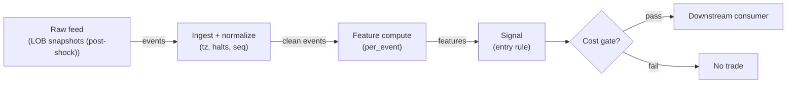

# S048 — LOB resiliency / temporary-impact reversion

Fit the decay of temporary impact (`log|impact| = intercept − kappa × t`) [documented] and fade the signed shock only while the estimated half-life is valid — resiliency is the reversion. Provenance **[D]**.

> Tag law: every numeric literal in prose carries one of `[documented]
> [default] [example] [unverified] [internal-est] [measured]` (legend: Appendix
> i v1.0.0). Bibliographic years, volumes, pages, arXiv IDs, section numbers,
> rule codes (C1–C10), fail-safe codes (F1–F5), module IDs, batch keys, family
> letters, and machine-parsed §0 data fields are identifiers, not literals,
> and are exempt.

## §1 Five-minute reviewer card

| Row | Value |
|---|---|
| Module | S048 — LOB resiliency / temporary-impact reversion, v1.1.0 |
| Edge verdict | `PREDICTIVE-FEATURE-ONLY` — transient-impact decay is the documented microstructure mechanism; the fixture uses exact decay to keep the regression unambiguous |
| After-cost | `BEFORE-COST` — Works when the shock is uninformed and the book refills: impact decays exponentially and the fade harvests the refill; dies when the shock is informed (permanent impact — no decay) or the book does not refill |
| Build cost | Tier L · `4–12` h [internal-est] · `$600–1,800` loaded [internal-est] |
| Data cost | Research: Databento historical usage-based (`$0.70`/GB MBP-10 per unit-pricing sheet dated `2024-12-11` [unverified] — verify current before budgeting) [unverified]; production: Databento Standard plan `$199`/mo [unverified] (per Databento pricing-change blog, effective `2025-01-13` [unverified] — verify current) + exchange license fees [unverified] |
| latency_class | bar-level / minutes |
| risk_class | low (signal-only; no order placement) |
| Capacity | `$5–25`/day notional [example] — illustrative; calibrate per venue |
| Executability | Feasible: Python+polars prototype; trivial compute |
| Risk summary | Permanent-impact risk: fading a shock that does not decay; decay-misestimation risk (noisy fits); shock-sign risk |
| When it dies | Informed shocks (no reversion); one-sided books that do not refill; noisy impact measurement that corrupts kappa |
| Regime gates | Provisional: pending R001–R050 annotation |
| Emits | `signal_vector` (Appendix b v1.0.0) — never orders |

## §1.5 Cheapest / least-build path

1. **Prototype hour band:** `4–12` h [internal-est] — bar features + timestamp/halt handling + reference validation against the fixture.
2. **Cheapest-source row:** min_tier = Databento XNAS.ITCH (MBP-10 L2 snapshots + Trades schema) — cheapest LOB-capable source [internal-est]; latency_class = bar-level / minutes (post-shock window analysis, not colocated); required_fields = LOB snapshot top-10 levels (bid/ask price + size), trade prints (price, size, conditions), session/halt calendar; price_band = Standard plan `$199`/mo live [unverified] (per Databento pricing-change blog effective `2025-01-13` [unverified] — verify current) + exchange license fees; build_or_buy = **build the decay estimator + shock-identification rule; buy the feed**. Degraded fallback: Polygon.io (now Massive) Stocks Advanced trades without depth — impact measured from trade-price drift only, no refill measurement; reduced fidelity, document as fallback.
3. **Resource budget:** `1` core, `<2` GB RAM for `500` symbols [internal-est]; compute pattern `per_bar`.
4. **Skip list:** tick-level MBO variants; multi-venue aggregation; Rust ingest; colocated deployment.
5. **DO-NOT-CUT list:** causality assertions (`assert fill_event > signal_event`, no-signal-bar-fills test); COST block + callable `expected_cost_bps`; F1–F5 fail-safes + module-state enum + kill/safe-mode (`OFF`); decision-log audit records; bona-fide-intent + self-trade prevention; shock-identification rule (C11, no cherry-picked shocks); provenance tags on every numeric literal; fixtures + `test_cmd`; secrets via env only.
6. **Escalation gate:** upgrade from cheapest when any holds — live universe beyond the cheapest band; jitter persistently over budget; cost gate failing on `[measured]` costs; entitlement class changes; fallback (no-depth) feed shows refill mismeasurement vs Databento L2 (kappa disagreement) on `[measured]` comparison.

## §S0 Module contract

### S0.1 Typed signature

```python
def signal(state: ModuleState, events: list[Event], cfg: Config) -> SignalVector:
```

`SignalVector` per Appendix b v1.0.0. `state` is the module-owned named state
vector (`snapshots`, `decay_fit`, `cooldown_until`, `module_state`); `events` are canonical Events (Appendix a v1.0.0),
newest last. The function handles documented edge cases: empty events →
`UNKNOWN`; invalid/missing prices → `UNKNOWN` (F1, never interpolate);
halt/auction events → freeze per the market-state table.

### S0.2 Config dataclass

| Parameter | Type | Default | Range | Status |
|---|---|---|---|---|
| `shock_sign` | int | `1` | `+1`/`−1` | fixed — derived from the shock-identification rule, never calibrated |
| `min_snapshots` | int | `10` | `3`–`30` | calibrate |
| `r2_min` | float | `0.5` | `0.1`–`0.9` | calibrate |
| `hl_min_s` / `hl_max_s` | float | `1.0` / `120.0` | — | calibrate |
| `cost_gate_k` | float | `0.5` | `0.1`–`2.0` | calibrate |
| `cooldown_s` | float | `300.0` | `0`–`1,800` | default — C10 hygiene, not fitted |
| `seq_tol` | int | `1` | `0`–`5` | default — max tolerated `seq` gap before `DEGRADED` |

All defaults tagged per the tag law (`default`/`calibrate` status ⇒ value tagged `[default]` where stated; `[example]` where illustrative).

### S0.3 Canonical schema mapping

Vendor columns → canonical Event schema (Appendix a v1.0.0), stated once here:

| Vendor | Canonical |
|---|---|
| `t_sec` | `t_sec` (seconds since shock) |
| `impact_bps` | `impact_bps` (signed impact, bps) |
| `t` (ms) | `event_ts` (int64 ns UTC; ms→ns) |
| trade `timestamp` | `asof_ts` (int64 ns UTC; data arrival — staleness denominator) |
| trade/quote `seq` | `seq` (per-symbol sequence; gap > `seq_tol` → `DEGRADED`) |
| ticker | `symbol` (e.g. `AAPL:XNAS`) |
| venue status feed | `market_state` (CONTINUOUS_TRADING / HALTED / AUCTION / CLOSED) |
| shock-rule output | `registered_shock {t0, sign, size_bps}` (state; absent → `UNKNOWN` per C11) |

### S0.4 Time contract

> Time contract: clock domain UTC, int64 ns; authoritative causality clock =
> `event_ts`; max_skew = `1` [default]; jitter budget = `100`
> [default]; bar-label = open time; staleness TTL = `300` [default]; gap
> policy = mask, no interpolation; halt/auction → discard contributions across
> reopen.

**Timing box:** `signal@t (per_event, America/New_York) → earliest fill @open(t+1)`

### S0.5 Market-state table

| State | Module behavior |
|---|---|
| CONTINUOUS_TRADING | Compute normally; emit per cadence |
| HALTED | Freeze state; emit `UNKNOWN`; discard contributions across reopen |
| AUCTION | No new signals; hold last `SignalVector`; state `DEGRADED` |
| CLOSED | Emit nothing; state `OFF` |

### S0.6 Module-state enum + error taxonomy

States per Appendix k v1.0.0: `OK | DEGRADED | UNKNOWN | OFF`. Invalid input →
`UNKNOWN`, never interpolate (Appendix f v1.0.0, F1–F5). Kill/safe-mode: an
administrative kill or a bounds violation forces `OFF` until the runbook
re-arm checklist passes.

| Failure | State | Alert |
|---|---|---|
| Missing/stale input (TTL) | `UNKNOWN` | page |
| Bad bar (high<low, non-positive prices, crossed quotes) | `UNKNOWN` | log |
| Feature out of mathematical bounds (F2) | `UNKNOWN` | page |
| `seq` gap beyond tolerance | `DEGRADED` (restart windows) | log |
| Halt/auction | `UNKNOWN` / `DEGRADED` (per table) | log |
| Kill/administrative disable | `OFF` | page |
| Anything unmapped | `UNKNOWN` | page |

### S0.7 Ops tail

- **Schedule:** continuous during US equities regular session `09:30`–`16:00` America/New_York [documented]; owner: signals on-call.
- **Health checks:** fixture replay (`test_cmd`) green on deploy; `seq`-gap monitor; staleness watchdog at `300` [default].
- **Alert table:** page on `UNKNOWN` > `5` min [default] or bounds violation; notify on `DEGRADED`; log single dropped events.
- **Resource budget:** `1` vCPU, `2` GB RAM per `500` symbols [internal-est]; state is O(window) per symbol.
- **Runbook stub:** `1.` confirm feed; `2.` replay fixture; `3.` if red → set `OFF`, page; `4.` reconcile decision log before re-arm.

### S0.8 Secrets (env-only)

`DATABENTO_API_KEY` via environment only (`POLYGON_API_KEY` too, only if the degraded fallback feed is wired). No secrets in this file, fixtures, or logs
(CI secrets-grep).

### S0.9 May / must-NOT

> **May:** emit `SignalVector` records per Appendix b v1.0.0. **Must-NOT:**
> emit orders, order intents, prices, share counts, or notionals; call a
> broker; mutate shared state outside `state`; interpolate across gaps.

## §S1 Legacy (subsumed by §1)

Legacy §S1 content is the §1 reviewer card above; this header is retained so
section numbering stays frozen.

## §S2 Specification

### Universe

US common stocks with visible LOB snapshots; identified liquidity shocks (large prints); regular session.

### Entry rule (Boolean — no prose-only conditions)

```
SHOCK_IDENTIFIED := (registered_shock is not None) AND (event_ts >= shock.t0)  # C11
IN_WARMUP        := (n_snapshots < min_snapshots)                               # hold flat, OK
DECAY_VALID      := (kappa > 0) AND (r2 >= r2_min) AND (hl_min_s <= hl <= hl_max_s)
ENTER_SHORT := SHOCK_IDENTIFIED AND NOT IN_WARMUP AND (shock_sign > 0)
               AND DECAY_VALID AND (locate_ok) AND (now >= cooldown_until)
               AND (expected_cost_bps(...) <= cost_gate_k * edge_bps)
ENTER_LONG  := SHOCK_IDENTIFIED AND NOT IN_WARMUP AND (shock_sign < 0)
               AND DECAY_VALID AND (now >= cooldown_until)
               AND (expected_cost_bps(...) <= cost_gate_k * edge_bps)
FLAT        := otherwise  # invalid decay -> no fade
```

`edge_bps` = `|shock.size_bps| / 2` [default] — half the shock decays back (fixture: `10/2 = 5.0` bps [example]).

### Shock identification (normative)

A shock event **fires** iff all hold (all thresholds `[example]`):

```
size >= 5 × median(trailing 20 1-min volumes)        # large print
AND |print_price − mid| >= 3 × median(trailing spread) # moved the quote
AND regular session                                   # 09:30–16:00 America/New_York
```

On fire: register `shock {t0 = print.event_ts, sign = sign(print_price − mid), size_bps = |print_price − mid_pre| / mid_pre × 1e4}`; the decay window opens at `t0`; `impact(t)` is measured against the pre-shock mid. No registered shock → no fade (`UNKNOWN`, C11) — cherry-picked shocks are the failure mode §S10 #4.

### Exits (with post-exit cooldown)

```
EXIT := (impact <= 10% of shock) [example] OR (t_sec >= 120) [example]
       OR (module_state != OK)
ON_EXIT: cooldown_until = now + cooldown_s   # C10
```

### Position sizing (fenced function)

```python
def size_shares(risk_budget_R, stop_distance, vol_estimate, ADV_cap, cost):
    # S-module requests capital fraction only; share math lives in the strategy.
    risk_notional = risk_budget_R * 0.5 * confidence          # 0.5 [default] factor
    shares = risk_notional / max(stop_distance, 1e-9)        # 1e-9 [default] guard
    return int(min(shares, ADV_cap * adv_shares * 0.001))     # 0.1% ADV cap [default]
```

### Risk limits

| Limit | Value |
|---|---|
| Max capital fraction per signal | `0.5` [default] |
| Max adverse excursion before `UNKNOWN` review | `2.0`× stop [default] |
| Staleness kill | TTL `300` [default] → `UNKNOWN` |

### COST block (single source of truth)

| Component | Value (bps) | Basis |
|---|---|---|
| Spread (half-spread, liquid large-cap) | `0.50` | [example] |
| Fees (taker incl. regulatory) | `0.30` | [example] |
| Borrow (per day) | `0.0` bps/day | [default] — reason: reference build is long-biased and the fade window is seconds-to-`120` s [example], so borrow accrues ~`0`; SHORTs are routed through the C7 locate check and priced separately |
| Impact | `1.0` | [example] — flagged; calibrate per venue at scale-up |
| **Total reference** | `1.80` | [example] |

`fee_schedule_as_of`: `2026-09-11` [unverified] — re-pinned at deep review; pin the real venue schedule before production. `side: taker` [default]; venue/tier/source: XNAS / Databento XNAS.ITCH MBP-10 [example]. Re-stating cost numbers outside this block is a validation failure.

```python
def expected_cost_bps(notional, adv_pct, venue, side, urgency) -> float:
    # Callable cost model - reference stack, components from the COST block.
    spread_bps = 0.50        # [example] half-spread, liquid large-cap
    fee_bps = 0.30            # [example] taker incl. regulatory
    borrow_bps_per_day = 0.0 # [default] long-biased reference; reason in table
    impact_bps = 1.0          # [example] flagged; calibrate per venue at scale-up
    if side == "maker":
        fee_bps = -0.20       # rebate [example]
    return spread_bps + fee_bps + borrow_bps_per_day + impact_bps
```

### Execution / fill model table

| Aspect | Assumption |
|---|---|
| Latency | Signal→intent `≤1` event [example]; feed path latency-simulated-only |
| Partial fills | N/A (signal-only; T-module policy: Appendix c v1.0.0) |
| Impact | `1.0` bps reference [example]; stress ×`5` [example] |
| Adverse fill | Whipsaw haircut `0.2` bps per unit signal [example] |

### Robustness

The decay fit needs `>= min_snapshots` snapshots (`10` [default]) spanning `>=2` half-lives [example]; fewer points and kappa is noise — the warmup hold (direction `0`, state `OK`) is normative, not advisory. Log-fit on exact decay is exact; on noisy impact, use robust regression and require the log-fit R² ≥ `r2_min` (`0.5` [default]) — the acceptance test pins an R² `0.22` [example] fit to direction `0`. Never fade when kappa <= 0 (impact growing) — that is the opposite regime.

### Compliance sub-block (C1–C10+)

| Code | Rule: trigger → check → action → log |
|---|---|
| C1 | Self-match prevention: this S-module emits no orders; downstream consumers must set self-trade-prevention flags — asserted in the `consumes` contract → check: consumer ticket schema (Appendix c v1.0.0) has STP flag → action: block non-compliant consumers → log: `stp_assert` record |
| C2 | Bona-fide intent: every emitted `SignalVector` with direction ≠ `0` must pass the cost gate; sub-threshold features emit direction `0`, never a tradeable hint → check: `expected_cost_bps(...) <= k * edge_bps` → action: zero the direction on failure → log: `gate_veto` record |
| C3 | Message-rate: emissions capped per symbol per second [default] → check: rate monitor → action: throttle + alert → log: `throttle` record |
| C4 | Fat-finger trio (applied by consumers; this module bounds its own outputs): confidence ∈ [`0`,`1`], capital ∈ [`0`,`0.5`], computed_at sane → check: bounds on every emission → action: out-of-bounds → `UNKNOWN` (F2) → log: `bounds_veto` record |
| C5 | Decision log: every emission, veto, and state transition logged per Appendix g v1.0.0, hash-chained → check: log write ack → action: halt on write failure → log: the record itself |
| C6 | Halt/auction: per §S0.5 market-state table; contributions across reopen discarded → check: state feed → action: freeze/`DEGRADED` → log: `state_freeze` record |
| C7 | Locate check: SHORT direction requires `locate_ok` from the consumer; no SHORT without asserted locate (Reg-SHO threshold securities → direction `0`) → check: locate flag → action: zero SHORT on missing locate → log: `locate_veto` record |
| C8 | Public dissemination: no signal values published externally without review gate → check: export channel → action: block unreviewed export → log: `export_block` record |
| C9 | Data entitlements: per §S6 Data rights row → check: entitlement class on startup → action: entitlement change → §1.5 escalation gate → log: `entitlement` record |
| C10 | Post-exit cooldown: `cooldown_s` after any exit or compliance block; no re-entry → check: `now >= cooldown_until` → action: suppress entries → log: `cooldown` record |
| C11 | Shock-identification hygiene: the shock must be an identified liquidity event, not cherry-picked noise → check: shock-identification rule fired → action: no fade without identified shock → log: `shock_id` record |

### Parameter table

| Parameter | Symbol | Value | Tag | Sensitivity |
|---|---|---|---|---|
| Shock sign | `shock_sign` | `+1` | [example] | high — direction; fixed by shock-ID rule, not calibrated |
| Min snapshots | `min_snapshots` | `10` | [default] | medium — warmup length |
| Log-fit R² floor | `r2_min` | `0.5` | [default] | high — noisy-fit veto |
| Half-life band | `hl_min_s`/`hl_max_s` | `1`/`120` s | [default] | medium |
| Cost-gate k | `cost_gate_k` | `0.5` | [default] | high |
| Post-exit cooldown | `cooldown_s` | `300` s | [default] | low — hygiene |
| Seq-gap tolerance | `seq_tol` | `1` | [default] | low |

### Parameter calibration procedure

Defaults are starting points, not fitted values. Calibrate per symbol bucket
(spread/ADV decile), never pooled across buckets [default]:

1. **Objective (normative):** maximize after-cost net bps captured per
   identified shock on purged/embargoed walk-forward folds — for each
   candidate parameter set, fade shocks passing the §S2 entry rule, hold
   until the §S2 EXIT, and score
   `Σ_shock (captured_bps − expected_cost_bps(...))` where `captured_bps`
   is the signed mid-price reversion over the fade window. Objective is
   after-cost by construction.
2. **Grid + OOS selection rule per parameter:**
   - `shock_sign`: **no grid** — fixed by the shock-identification rule
     (C11); the sign must come from the rule, never be fitted [rule].
     Anti-overfit guard: audit `direction == −shock_sign` on every emission.
   - `min_snapshots ∈ {5, 10, 20}` [example] — select by kappa stability
     [default]: median `|κ̂_window − κ̂_full|` across shocks `< 10`%
     [default] on the OOS fold; keep `10` [default] unless a noisy bucket
     demands `20`.
   - `r2_min ∈ {0.3, 0.5, 0.7}` [example] — select by fade precision vs
     missed-fade recall on OOS folds [default]; higher `r2_min` = fewer,
     cleaner fades.
   - `hl_min_s ∈ {0.5, 1, 2}` [example] × `hl_max_s ∈ {60, 120, 300}`
     [example] — joint grid; select by net after-cost captured bps per
     shock on OOS [default].
   - `cost_gate_k ∈ {0.25, 0.5, 1.0}` [example] — per the proposal's open
     item (`0.5` vs T002-style `2`): select by maximizing cost-aware OOS
     utility subject to a minimum OOS shock count of `200` [default];
     keep `0.5` [default] until `[measured]` cost stacks justify
     otherwise. Never set `cost_gate_k` above `2.0` [default] without
     documented impact accounting — the gate is the only barrier to fading
     informed flow.
   - `cooldown_s` stays `300` s [default] — C10 hygiene, not fitted; leave
     fixed. `seq_tol` stays `1` [default] — data contract, not fitted.
3. **Walk-forward:** train `60` d [default], embargo `1` d [default], test
   `20` d [default]; roll monthly. Never calibrate the band on `< 3`
   months [default]; re-calibrate monthly [default].
4. **`edge_bps` mapping:** `edge_bps = |shock.size_bps| / 2` [default]
   (half the shock decays back); reference `5.0` [example] = the fixture's
   `10`-bps [example] shock halved — replace with the measured shock size
   per event before live use; the cost gate's bite depends on it linearly.
5. **Sensitivity freeze rule:** perturb each parameter ±`1`σ [default]
   around the chosen point; freeze any parameter whose fade-count or
   hit-rate moves `< 10`% [default], re-grid the rest.
6. **Anti-overfit:** require OOS Sharpe `> 0.5`× IS Sharpe [default] before
   accepting a re-fit.

### Timing box

`signal@t (per_event, America/New_York) → earliest fill @open(t+1)`

## §S3 Math + normative pseudocode

With impact snapshots $I(t)$ bps after the shock:

$$\log|I(t)| = a - \kappa t + \varepsilon_t, \qquad \hat\kappa = -\hat\beta_{OLS}, \qquad t_{1/2} = \frac{\ln 2}{\hat\kappa}, \qquad R^2 = 1 - \frac{\sum_t (\log|I(t)| - \hat a + \hat\kappa t)^2}{\sum_t (\log|I(t)| - \overline{\log|I|})^2}$$

$$s = -\mathrm{sign}(\mathrm{shock})\,\mathbf{1}\{\hat\kappa > 0\}\,\mathbf{1}\{R^2 \ge r^2_{\min}\}\,\mathbf{1}\{hl_{\min} \le t_{1/2} \le hl_{\max}\}$$

with the half-life band in `[default]` units. Fixture (exact deterministic decay $I(t) = 10e^{-0.05t}$ [example], snapshots every $2$ s [example], $0$–$60$ s [example]): $\hat\kappa = 0.0500$/s [example], $t_{1/2} = 13.8629$ s [example], $R^2 = 1.0$ [example] $\to$ fade the $+$ shock (short). The chapter's noisy example fits $\hat\kappa = 0.0548$/s [example], $t_{1/2} = 12.66$ s [example] — same fade verdict; the fixture uses exact decay so the regression is unambiguous.

**Normative pseudocode** (pseudocode is normative; prose is commentary):

```
function signal(state, events, cfg) -> SignalVector:
    assert events non-empty else return UNKNOWN                        # F1
    e = events[-1]
    # market-state freeze (§S0.5 market-state table)
    if state.market_state == HALTED:  return UNKNOWN (freeze; discard across reopen)
    if state.market_state == AUCTION: return hold last, DEGRADED
    if state.market_state == CLOSED:  return nothing, OFF
    assert valid(e) else return UNKNOWN                                # F1/F2: never interpolate
    # seq-gap beyond tolerance -> DEGRADED (restart windows)
    if max_seq_gap(events) > cfg.seq_tol: return (dir=0, DEGRADED)
    # shock-identification gate (C11): no fade without an identified shock
    shock = state.registered_shock
    assert shock is not None and e.event_ts >= shock.t0 else return UNKNOWN
    # warmup: too few snapshots -> hold flat, OK (not an input failure)
    snaps = [x in events where x.event_ts >= shock.t0]
    n = len(snaps)
    if n < cfg.min_snapshots: return (dir=0, conf=0, capital=0, OK)
    # post-exit cooldown (C10)
    if e.event_ts < state.cooldown_until: return (dir=0, conf=0, capital=0, OK)
    # decay fit: OLS on log|impact| = a - kappa*t  (exact math above)
    (kappa, intercept, r2) = ols_log_fit(snaps)
    halflife = ln(2)/kappa if kappa > 0 else +inf
    # decay-validity gates: every §S2 Robustness guard, normative here
    valid = (kappa > 0) and (r2 >= cfg.r2_min) \
            and (cfg.hl_min_s <= halflife <= cfg.hl_max_s)
    direction = -shock.sign if valid else 0        # fade only on valid decay
    conviction = r2 * min(1.0, n / 30.0)           # [example] defined, not hand-waved
    confidence = min(1.0, conviction) if direction != 0 else 0.0
    capital = 0.5 * confidence                     # 0.5 [default]
    # normative edge + cost-gate predicate (C2 bona-fide intent)
    edge_bps = abs(shock.size_bps) / 2.0           # [default] half the shock decays back
    cost_ok = expected_cost_bps(notional, adv_pct, venue, side, urgency) \
              <= cfg.cost_gate_k * edge_bps
    # ^^^ normative cost-gate predicate: expected_cost_bps(...) <= k * edge_bps
    if not cost_ok: direction, confidence, capital = 0, 0.0, 0.0
    # locate check (C7): SHORT without asserted locate -> direction 0
    if direction == -1 and not locate_ok: direction, confidence, capital = 0, 0.0, 0.0
    sig = SignalVector(symbol=e.symbol, direction=direction, confidence=confidence,
                       capital=capital, computed_at=e.event_ts,
                       staleness=now()-e.asof_ts, module_state=state.module_state)
    log_decision(sig, inputs_hash, params_hash)    # C5 / Appendix g
    assert fill_event > signal_event               # t→t+1: no signal-bar fills
    return sig
```

Causality: features at event/bar `t` use only data `≤ t`; earliest reaction is
`t+1`. Mandatory unit test: no-signal-bar fills.

## §S4 Worked example (fixture-backed)

- Tape: `modules/fixtures/S048_tape.csv` — `# TYPE: validation-run`;
  `31` synthetic impact snapshots (`id,event_ts,t_sec,impact_bps,seq`), every `2` s [example] from `0`–`60` s [example]; exact exponential decay. All numbers synthetic, seed `48` [example]; timestamps int64 ns UTC. `seq` is the per-symbol sequence (`0`–`30` [example]); a dropped row triggers the `DEGRADED` seq-gap path.
- Expected outputs: `modules/fixtures/S048_expected.csv` — `kappa`, `halflife`, `dir` per snapshot from `s2`; the running fit is exact on every row; blank cells = warmup NaN.
- Tolerance: `1e-9` on floats; integer counts exact.
- Acceptance tests (`modules/tests/test_S048.py`, `14` tests):
  `1.` fixture recomputes to expected (kappa/half-life/R² hand-checks; running-fit exactness; fade direction; warmup NaNs); `2.` stub emits valid `SignalVector` with warmup hold then live fade; `3.` no-signal-bar fills (`fill_event_ts > computed_at`); `4.` cost-gate predicate passes on large edge, blocks on tiny edge (`k = 0.5` [default]); `5.` side variants (maker rebate lowers the stack); `6.` invalid input (negative impact) → `UNKNOWN`; `7.` unregistered shock → `UNKNOWN` (C11); `8.` R²-gate veto (κ>0, half-life in band, R² `0.22` [example] → direction `0`, `OK`); `9.` negative kappa (growing impact) → no fade; `10.` cost-gate veto inside the signal path (`k ≈ 0` → direction `0`, C2); `11.` cooldown suppresses entries (C10); `12.` locate veto blocks SHORT without locate (C7); `13.` seq gap → `DEGRADED`; `14.` conviction formula (`confidence = min(1, r2·n/30)` [example], `capital = 0.5·confidence` [default]).
- `test_cmd`: `python3 -m pytest modules/tests/test_S048.py -q` → exits `0`.

**Hand-check:** `kappa = 0.0500`/s [example], `intercept = ln(10)` [example], `half-life = 13.8629` s [example], `R² = 1.0` [example]; `s30.dir = −1` (fade the `+` shock); `confidence = 1.0` [example] (`31/30` capped), `capital = 0.5` [default]; every defined row's half-life `= 13.8629` — asserted in the test.

**Where the example is optimistic:** no fees, no latency, no partial fills, no corporate-action surprises — arithmetic illustration, not a backtest.

## §S5 Strategies that use this signal

Generated from `deps.yaml` (CI symmetry); hand-listed here:

| Strategy | Role |
|---|---|
| Impact-reversion consumer (strategy mapping pending deps.yaml) | Primary entry trigger: fade the decaying shock |
| Veto: permanent-impact filter | kappa <= 0 vetoes |

## §S6 Data required

### Canonical logical fields

| Field | Type | Granularity | Source tier | Notes |
|---|---|---|---|---|
| LOB snapshots | float bid/ask size | `2`-s cadence, post-shock window | Tier 1–2 | Refill measurement |
| Shock identifier | event | as-occurring | Tier 1–2 | Large-print rule (§S2 normative) |
| Trade prices | float | tick | Tier 1 | Impact measurement |
| Session/halt calendar | state | daily | Tier 1–2 | Halt/auction handling |

### Vendor mapping (cheapest reference feed)

| Logical field | Vendor | Product / schema | Required vendor fields | Price band |
|---|---|---|---|---|
| LOB snapshots | Databento | XNAS.ITCH · MBP-10 (10-level L2) | bid/ask price+size levels `0`–`9`, `ts_event` | live: Standard plan `$199`/mo [unverified]; historical: `$0.70`/GB [unverified] (2024-12-11 sheet — verify current) + exchange license fees [unverified] |
| Shock identifier | Databento | XNAS.ITCH · Trades schema | price, size, conditions, `ts_event` | included in plan [unverified] |
| Trade prices | Databento | XNAS.ITCH · Trades schema | price, size, `ts_event` | included in plan [unverified] |
| Session/halt calendar | Databento | Status schema / reference | venue status, halt flags | included in plan [unverified] |
| Degraded fallback | Polygon.io (now Massive) | Stocks Advanced · trades (no depth) | price, size, conditions | [unverified] — verify before budgeting; no LOB, impact from trade-price drift only |

**Data rights row** (Appendix j v1.0.0): LOB snapshot feed, `rights: licensed`; scope = research + stated production symbol count (`≤200` [default]); raw snapshots never leave our systems — fixtures are synthetic; entitlement = professional/internal, no display; retention per vendor terms, purge path in runbook; derived features ours.

## §S7 Local build (M5 Max / 128 GB)

Feasible: light. Thirty-one log-points, one OLS per snapshot. Tier L: `4–12` h [internal-est] at `$150`/hr loaded [internal-est] ≈ `$600–1,800` [internal-est]. Shock identification is the engineering.

## §S8 Buy vs build

| Tier-1 (Databento XNAS.ITCH) | MBP-10 L2 snapshots + Trades | Standard `$199`/mo live [unverified] (2025-01-13 blog); historical `$0.70`/GB [unverified] (2024-12-11 sheet) | True refill measurement | Exchange license fees |
| Tier-2 (Polygon Stocks Advanced) | Trades + quotes (no depth) | [unverified] — verify before budgeting | Impact measurement | No LOB depth — degraded fallback only |

**Verdict:** build the decay fit (`20` lines [internal-est]); buy the Databento XNAS.ITCH feed for the refill regression — SIP/trade-only data cannot measure a `2`-s [example] decay. Re-measure kappa on the fallback feed before trusting it.

## §S9 Efficacy — documented evidence

| Study / source | Market & period | Metric | Before/after cost | Caveat |
|---|---|---|---|---|
| Fixture (exact decay, `31` snapshots) | Single synthetic shock | `κ=0.05`/s [example], `t½=13.86` s [example] → fade | `BEFORE-COST` (arithmetic illustration) | Synthetic — demonstrates the regression |
| Chapter S4 noisy example (seed `48`) | Single synthetic shock + noise | `κ̂=0.0548`/s [example], `t½=12.66` s [example] | `BEFORE-COST` | Same fade verdict as the fixture |

**Selection disclosure:** the fixture recomputation plus the chapter's noisy example; transient-impact decay is the documented mechanism, the fade rule is the chapter's application [documented].

### Regime gates (machine records, provisional — pending R001–R050 annotation)

| regime_id | direction | mechanism | condition | action | min_lag | unknown_behavior |
|---|---|---|---|---|---|---|
| R001 | amplifies | refill regime: book rebuilds after uninformed shock | refill_flag | none (size per §S2) | `0` [default] | veto |
| R002 | inverts | informed-shock regime: permanent impact | informed_flag | veto | `0` [default] | veto |
| R003 | degrades | no-refill regime | no_refill_flag | veto | `0` [default] | veto |

## §S10 Failure modes & pitfalls

| # | Trigger → Detect → Action → Recovery | check: |
|---|---|
| 1 | Permanent impact faded: the shock does not decay → detect: kappa <= 0 or hl outside band or R² < `r2_min` → action: no fade → recovery: none — correctly flat | `check: valid == 1` |
| 2 | Noisy kappa: too few snapshots or poor log-fit → detect: count < `min_snapshots` (`10` [default]) or R² < `r2_min` (`0.5` [default]) → action: wait / no fade → recovery: resume | `check: n_snapshots >= 10 and r2 >= 0.5` |
| 3 | Shock-sign error → detect: spec audit → action: halt, fix → recovery: re-run tests | `check: direction == -shock_sign` |
| 4 | Cherry-picked shock (no identification rule) → detect: shock-id check (C11) → action: no fade → recovery: none | `check: shock_identified` |
| 5 | Lookahead: future snapshots in the fit → detect: causality audit → action: halt, fix → recovery: re-run no-signal-bar-fills test | `check: all(fill_ts > computed_at)` |
| 6 | Cost blowup vs a `14`-s half-life → detect: cost gate on `[measured]` costs → action: stand down → recovery: re-pin fee schedule | `check: expected_cost_bps(...) <= k * edge_bps` |
| 7 | Impact mismeasured (bad prints) → detect: bad-tick screen → action: mask snapshot → recovery: backfill | `check: impact_sane` |
| 8 | Snapshot feed gap → detect: `seq`-gap monitor → action: `DEGRADED`, restart fit → recovery: backfill | `check: seq_continuous` |

## §S11 Visuals

Figure: `batches figure (see §0 `plot_script`)` (synthetic, seed `48` [example]).



## §S12 Source log + unverified leads

**Sources** (citable facts only):

1. Chapter S4 worked values (seed 48): `I(t)=10·exp(−0.05t)` bps plus noise, snapshots every `2` s; noisy fit `κ̂=0.0548`/s, half-life `12.66` s [documented] — the fixture uses exact decay (`κ=0.05`/s, `13.8629` s); same fade verdict.
2. Databento pricing change blog (effective 2025-01-13 [documented]): live US-equities data requires a subscription plan; Standard plan `$199`/month [unverified] with unlimited live data; historical data remains usage-based. URL: https://databento.com/blog/upcoming-changes-to-pricing-plans-in-january-2025/ — verify current pricing before budgeting.
3. Databento unit-pricing sheet dated 2024-12-11 [documented]: XNAS.ITCH MBP-10 historical `$0.70`/GB, live `$0.84`/GB [unverified] — verify current. URL: http://databento-media.s3-website-us-east-1.amazonaws.com/media/unit-pricing-2024-12-11.pdf

**Chatbot source log.** Duck.ai (GPT-5.6 Luna, anonymous) answered Q-SB6-1–Q-SB6-3 (`2026-09-10`); Grok/Cursor answers pending (checked `2026-09-10`).

**Unverified leads** (chatbot-only — never in evidence tables):

- Chatbot-cited resiliency half-lives by market-cap bucket [unverified] — not independently confirmed; kept out of evidence tables.
- Polygon.io (now Massive) Stocks Advanced current pricing [unverified] — dated third-party sources conflict (`$199`–`$500`/mo); verify on the vendor site before budgeting.

---

## Appendix — AI build prompt (S048)

Copy-paste into any chat agent:

> Build module **S048 — LOB resiliency / temporary-impact reversion** per `notes/module-template.md` v1.0.0
> and this file's §S0 contract. Cheapest path (§1.5): prototype
> `4–12` h [internal-est]; reference feed Databento XNAS.ITCH MBP-10 + Trades
> (Standard plan `$199`/mo [unverified]); compute pattern `per_bar`.
> Implement `signal(state, events, cfg) -> SignalVector` (Appendix b v1.0.0)
> with the §S3 normative pseudocode, including the shock-identification gate
> (C11), the decay-validity gates (`min_snapshots`, `kappa > 0`,
> `R² >= r2_min`, half-life band), the cost-gate predicate
> `expected_cost_bps(...) <= k * edge_bps` with `edge_bps = |shock|/2`,
> the conviction formula `confidence = min(1, r2·n/30)`, the cooldown (C10)
> and locate veto (C7), and `assert fill_event >
> signal_event`. Wire F1–F5 (Appendix f v1.0.0): invalid input → `UNKNOWN`,
> never interpolate. Log decisions per Appendix g v1.0.0. Secrets via env
> only. Run the fixture `modules/fixtures/S048_tape.csv`
> (`# TYPE: validation-run`) against `modules/fixtures/S048_expected.csv`
> (tolerance `1e-9`).
> **Definition of done:** `python3 -m pytest modules/tests/test_S048.py -q`
> exits `0`. Tag every numeric literal you add with the unified enum
> (Appendix i v1.0.0); put anything unverifiable in §S12 unverified leads.
