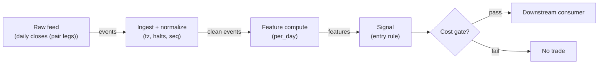

# S049 — Distance-method pair

Trade the distance: when the pair spread stretches beyond `2.0` formation sigmas [example], fade it — short the expensive leg, long the cheap one; exit when the spread reverts inside `0.5σ` [example]. Provenance **[D]**.

> Tag law: every numeric literal in prose carries one of `[documented]
> [default] [example] [unverified] [internal-est] [measured]` (legend: Appendix
> i v1.0.0). Bibliographic years, volumes, pages, arXiv IDs, section numbers,
> rule codes (C1–C10), fail-safe codes (F1–F5), module IDs, batch keys, family
> letters, and machine-parsed §0 data fields are identifiers, not literals,
> and are exempt.

## §1 Five-minute reviewer card

| Row | Value |
|---|---|
| Module | S049 — Distance-method pair, v1.0.0 |
| Edge verdict | `PREDICTIVE-FEATURE-ONLY` — the distance method is the documented pairs construction (Gatev–Goetzmann–Rouwenhorst 2006 [documented]); the fixture's formation/entry/exit arithmetic is exact, the after-cost edge unproven |
| After-cost | `BEFORE-COST` — Works when the pair is genuinely cointegrated and the divergence is noise: the spread reverts inside the formation sigma; dies when the divergence is a broken pair (takeover, regime shift, one leg halted) — then the 'reversion' never comes |
| Build cost | Tier M · `20–60` h [internal-est] · `$3,000–9,000` loaded [internal-est] |
| Data cost | Research `~$30–200`/mo (SIP 1-min bars)` [unverified]; production `~$200`/mo + usage (SIP bars)` [unverified] — bands indicative, verify before budgeting |
| latency_class | bar-level / minutes |
| risk_class | low (signal-only; no order placement) |
| Capacity | `$5–25`/day notional [example] — illustrative; calibrate per venue |
| Executability | Feasible: Python+polars prototype; trivial compute |
| Risk summary | Broken-pair risk: the classic pairs killer — fading a permanent divergence; leg-risk (one leg hard-to-borrow or halted); formation-staleness risk |
| When it dies | Corporate actions on one leg; broken cointegration; borrow recalls; the formation window no longer describes the pair |
| Regime gates | Provisional: pending R001–R050 annotation |
| Emits | `signal_vector` (Appendix b v1.0.0) — never orders |

## §1.5 Cheapest / least-build path

1. **Prototype hour band:** `20–60` h [internal-est] — bar features + timestamp/halt handling + reference validation against the fixture.
2. **Cheapest-source row:** min_tier = Polygon.io Stocks Advanced — cheapest data source candidate [internal-est]; latency_class = bar-level / minutes; required_fields = 1-min OHLCV bars, corporate-action adjustments, session calendar; price_band = `~$30–200`/mo` [unverified] (indicative — verify before budgeting); build_or_buy = **build the estimator, buy the feed**.
3. **Resource budget:** `1` core, `<2` GB RAM for `500` symbols [internal-est]; compute pattern `per_bar`.
4. **Skip list:** tick-level variants; multi-venue aggregation; Rust ingest; colocated deployment.
5. **DO-NOT-CUT list:** causality assertions (`assert fill_event > signal_event`, no-signal-bar-fills test); COST block + callable `expected_cost_bps`; F1–F5 fail-safes + module-state enum + kill/safe-mode (`OFF`); decision-log audit records; bona-fide-intent + self-trade prevention; provenance tags on every numeric literal; fixtures + `test_cmd`; secrets via env only.
6. **Escalation gate:** upgrade from cheapest when any holds — live universe beyond the cheapest band; jitter persistently over budget; cost gate failing on `[measured]` costs; entitlement class changes.

## §S0 Module contract

### S0.1 Typed signature

```python
def signal(state: ModuleState, events: list[Event], cfg: Config) -> SignalVector:
```

`SignalVector` per Appendix b v1.0.0. `state` is the module-owned named state
vector (`closes_A`, `closes_B`, `position`, `cooldown_until`, `module_state`); `events` are canonical Events (Appendix a v1.0.0),
newest last. The function handles documented edge cases: empty events →
`UNKNOWN`; invalid/missing prices → `UNKNOWN` (F1, never interpolate);
halt/auction events → freeze per the market-state table.

### S0.2 Config dataclass

| Parameter | Type | Default | Range | Status |
|---|---|---|---|---|
| `entry_z` | float | `2.0` | `1.5`–`3.0` | example |
| `exit_z` | float | `0.5` | `0.25`–`1.0` | example |
| `cost_gate_k` | float | `0.5` | `0.1`–`2.0` | default |
| `cooldown_s` | float | `86,400.0` | `0`–`604,800` | default |

All defaults tagged per the tag law (status `default` ⇒ `[default]`).

### S0.3 Canonical schema mapping

Vendor columns → canonical Event schema (Appendix a v1.0.0), stated once here:

| Vendor | Canonical |
|---|---|
| `sym` | `sym` (pair leg `A`/`B`) |
| `c` | `close` (daily close) |
| `t` (ms) | `event_ts` (int64 ns UTC; ms→ns) |

### S0.4 Time contract

> Time contract: clock domain UTC, int64 ns; authoritative causality clock =
> `event_ts`; max_skew = `1` [default]; jitter budget = `500`
> [default]; bar-label = open time; staleness TTL = `86_400` [default]; gap
> policy = mask, no interpolation; halt/auction → discard contributions across
> reopen.

**Timing box:** `signal@t (per_day, America/New_York) → earliest fill @open(t+1)`

### S0.5 Market-state table

| State | Module behavior |
|---|---|
| CONTINUOUS_TRADING | Compute normally; emit per cadence |
| HALTED | Freeze state; emit `UNKNOWN`; discard contributions across reopen |
| AUCTION | No new signals; hold last `SignalVector`; state `DEGRADED` |
| CLOSED | Emit nothing; state `OFF` |

### S0.6 Module-state enum + error taxonomy

States per Appendix k v1.0.0: `OK | DEGRADED | UNKNOWN | OFF`. Invalid input →
`UNKNOWN`, never interpolate (Appendix f v1.0.0, F1–F5). Kill/safe-mode: an
administrative kill or a bounds violation forces `OFF` until the runbook
re-arm checklist passes.

| Failure | State | Alert |
|---|---|---|
| Missing/stale input (TTL) | `UNKNOWN` | page |
| Bad bar (high<low, non-positive prices, crossed quotes) | `UNKNOWN` | log |
| Feature out of mathematical bounds (F2) | `UNKNOWN` | page |
| `seq` gap beyond tolerance | `DEGRADED` (restart windows) | log |
| Halt/auction | `UNKNOWN` / `DEGRADED` (per table) | log |
| Kill/administrative disable | `OFF` | page |
| Anything unmapped | `UNKNOWN` | page |

### S0.7 Ops tail

- **Schedule:** continuous during US equities regular session `09:30`–`16:00` America/New_York [documented]; owner: signals on-call.
- **Health checks:** fixture replay (`test_cmd`) green on deploy; `seq`-gap monitor; staleness watchdog at `86_400` [default].
- **Alert table:** page on `UNKNOWN` > `5` min [default] or bounds violation; notify on `DEGRADED`; log single dropped events.
- **Resource budget:** `1` vCPU, `2` GB RAM per `500` symbols [internal-est]; state is O(window) per symbol.
- **Runbook stub:** `1.` confirm feed; `2.` replay fixture; `3.` if red → set `OFF`, page; `4.` reconcile decision log before re-arm.

### S0.8 Secrets (env-only)

`POLYGON_API_KEY` via environment only. No secrets in this file, fixtures, or logs
(CI secrets-grep).

### S0.9 May / must-NOT

> **May:** emit `SignalVector` records per Appendix b v1.0.0. **Must-NOT:**
> emit orders, order intents, prices, share counts, or notionals; call a
> broker; mutate shared state outside `state`; interpolate across gaps.

## §S1 Legacy (subsumed by §1)

Legacy §S1 content is the §1 reviewer card above; this header is retained so
section numbering stays frozen.

## §S2 Specification

### Universe

US common-stock pairs with a documented economic link; both legs price > `$5` [example]; short leg locatable.

### Entry rule (Boolean — no prose-only conditions)

```
ENTER_SHORT := (z >= entry_z) AND (pair_cointegrated) AND (locate_ok on short leg)
               AND (now >= cooldown_until) AND (expected_cost_bps(...) <= cost_gate_k * edge_bps)
ENTER_LONG  := (z <= -entry_z) AND (pair_cointegrated)
               AND (now >= cooldown_until) AND (expected_cost_bps(...) <= cost_gate_k * edge_bps)
FLAT        := otherwise
```

`edge_bps` = `20 * |z|` bps [example] — twenty bps per unit of spread z-score.

### Exits (with post-exit cooldown)

```
EXIT := (|z| <= exit_z) OR (pair_broken) OR (module_state != OK)
ON_EXIT: cooldown_until = now + cooldown_s   # C10
```

### Position sizing (fenced function)

```python
def size_shares(risk_budget_R, stop_distance, vol_estimate, ADV_cap, cost):
    # S-module requests capital fraction only; share math lives in the strategy.
    risk_notional = risk_budget_R * 0.5 * confidence          # 0.5 [default] factor
    shares = risk_notional / max(stop_distance, 1e-9)        # 1e-9 [default] guard
    return int(min(shares, ADV_cap * adv_shares * 0.001))     # 0.1% ADV cap [default]
```

### Risk limits

| Limit | Value |
|---|---|
| Max capital fraction per signal | `0.5` [default] |
| Max adverse excursion before `UNKNOWN` review | `2.0`× stop [default] |
| Staleness kill | TTL `86_400` [default] → `UNKNOWN` |

### COST block (single source of truth)

| Component | Value (bps) | Basis |
|---|---|---|
| Spread (half-spread, liquid large-cap) | `0.50` | [example] |
| Fees (taker incl. regulatory) | `0.30` | [example] |
| Borrow (short leg) | `2.00` | [example] — flagged; C7 locate on the short name |
| Impact | `1.00` | [example] — flagged; calibrate per venue at scale-up |
| **Total reference** | `3.80` | [example] |

`fee_schedule_as_of`: `2026-09-01` [unverified] — placeholder; pin the real
venue schedule before production. `side: taker` [default]; venue/tier/source:
XNAS / Polygon SIP 1-min bars [example]. Re-stating cost numbers outside this block is a validation failure.

```python
def expected_cost_bps(notional, adv_pct, venue, side, urgency) -> float:
    # Callable cost model - reference stack, components from the COST block.
    spread_bps = 0.50   # [example]
    fee_bps = 0.30      # [example]
    borrow_bps = 2.00   # [example] short leg; flagged, C7 locate
    impact_bps = 1.00   # [example] flagged; calibrate per venue at scale-up
    if side == "maker":
        fee_bps = -0.20  # rebate [example]
    return spread_bps + fee_bps + borrow_bps + impact_bps
```

### Execution / fill model table

| Aspect | Assumption |
|---|---|
| Latency | Signal→intent `≤1` event [example]; feed path latency-simulated-only |
| Partial fills | N/A (signal-only; T-module policy: Appendix c v1.0.0) |
| Impact | `1.0` bps reference [example]; stress ×`5` [example] |
| Adverse fill | Whipsaw haircut `0.2` bps per unit signal [example] |

### Robustness

Entry `1.5`–`3.0`σ [example] and exit `0.25`–`1.0`σ [example] all capture the chapter's day-13/day-15 episode; the formation window is the fragile choice — `60`–`250` days [example] in production, `12` here only to fit the fixture. The robust leg is the broken-pair veto: no entry without a cointegration check.

### Compliance sub-block (C1–C10+)

| Code | Rule: trigger → check → action → log |
|---|---|
| C1 | Self-match prevention: this S-module emits no orders; downstream consumers must set self-trade-prevention flags — asserted in the `consumes` contract → check: consumer ticket schema (Appendix c v1.0.0) has STP flag → action: block non-compliant consumers → log: `stp_assert` record |
| C2 | Bona-fide intent: every emitted `SignalVector` with direction ≠ `0` must pass the cost gate; sub-threshold features emit direction `0`, never a tradeable hint → check: `expected_cost_bps(...) <= k * edge_bps` → action: zero the direction on failure → log: `gate_veto` record |
| C3 | Message-rate: emissions capped per symbol per second [default] → check: rate monitor → action: throttle + alert → log: `throttle` record |
| C4 | Fat-finger trio (applied by consumers; this module bounds its own outputs): confidence ∈ [`0`,`1`], capital ∈ [`0`,`0.5`], computed_at sane → check: bounds on every emission → action: out-of-bounds → `UNKNOWN` (F2) → log: `bounds_veto` record |
| C5 | Decision log: every emission, veto, and state transition logged per Appendix g v1.0.0, hash-chained → check: log write ack → action: halt on write failure → log: the record itself |
| C6 | Halt/auction: per §S0.5 market-state table; contributions across reopen discarded → check: state feed → action: freeze/`DEGRADED` → log: `state_freeze` record |
| C7 | Locate check: SHORT direction requires `locate_ok` from the consumer; no SHORT without asserted locate (Reg-SHO threshold securities → direction `0`) → check: locate flag → action: zero SHORT on missing locate → log: `locate_veto` record |
| C8 | Public dissemination: no signal values published externally without review gate → check: export channel → action: block unreviewed export → log: `export_block` record |
| C9 | Data entitlements: per §S6 Data rights row → check: entitlement class on startup → action: entitlement change → §1.5 escalation gate → log: `entitlement` record |
| C10 | Post-exit cooldown: `cooldown_s` after any exit or compliance block; no re-entry → check: `now >= cooldown_until` → action: suppress entries → log: `cooldown` record |
| C11 | Broken-pair hygiene: a corporate action or halt on either leg invalidates the formation → check: pair health (both legs trading, no pending actions) → action: force FLAT, invalidate formation → log: `pair_break` record |

### Parameter table

| Parameter | Symbol | Value | Tag | Sensitivity |
|---|---|---|---|---|
| Entry trigger | `entry_z` | `2.0`σ | [example] | medium |
| Exit trigger | `exit_z` | `0.5`σ | [example] | medium |
| Formation | — | `12` days (fixture) | [example] | high — stale in production |
| Cost-gate k | `cost_gate_k` | `0.5` | [default] | high |

### Timing box

`signal@t (per_day, America/New_York) → earliest fill @open(t+1)`

## §S3 Math + normative pseudocode

With the stipulated pair $(A, B)$ and formation days $1$–$12$:

$$s_t = \frac{P_{A,t}}{P_{B,t}} - 1, \qquad z_t = \frac{s_t - \mu_{\mathrm{form}}}{\sigma_{\mathrm{form}}}$$

$$\mathrm{enter\_short}_t = \mathbf{1}\{z_t \ge 2.0\}, \qquad \mathrm{exit}_t = \mathbf{1}\{|z_t| \le 0.5\}$$

with $2.0$/$0.5$ [example] thresholds. Chapter S4 (seed $49$): $\mu_{\mathrm{form}} = 0.000417$ [example], $\sigma_{\mathrm{form}} = 0.010326$ [example]; day $13$: $z = +2.3807$ [example] $\to$ short the spread; day $15$: $z = +0.4438$ [example] $\to$ exit. The spread is a pure function of the two closes — no estimated hedge ratio enters (that distinction is S050).

**Normative pseudocode** (pseudocode is normative; prose is commentary):

```
function signal(state, events, cfg) -> SignalVector:
    assert events non-empty else return UNKNOWN                    # F1
    e = events[-1]
    assert valid(e) else return UNKNOWN                            # F1/F2: never interpolate
    spread_t = P_A,t / P_B,t - 1
    z_t = (spread_t - mu_form) / sd_form      # formation: days 1..12
    enter short if z >= 2.0; exit if |z| <= 0.5
    edge_bps = abs(z) * 20.0                                       # [example]
    cost_ok = expected_cost_bps(...) <= k * edge_bps
    # ^^^ normative cost-gate predicate: expected_cost_bps(...) <= k * edge_bps
    direction = entry_rule(e, features, cost_ok, cfg)              # §S2 Boolean rule
    confidence = min(1, conviction(features)) if direction != 0 else 0
    capital = 0.5 * confidence                                     # 0.5 [default]
    sig = SignalVector(symbol=e.symbol, direction, confidence, capital,
                       computed_at=e.event_ts, staleness=now()-e.asof_ts,
                       module_state=state.module_state)
    log_decision(sig, inputs_hash, params_hash)                    # C5 / Appendix g
    assert fill_event > signal_event                               # t→t+1: no signal-bar fills
    return sig
```

Causality: features at event/bar `t` use only data `≤ t`; earliest reaction is
`t+1`. Mandatory unit test: no-signal-bar fills.

## §S4 Worked example (fixture-backed)

- Tape: `modules/fixtures/S049_tape.csv` — `# TYPE: validation-run`;
  `16` days × `2` legs (`id,event_ts,sym,close`); formation days `1`–`12`, entry episode days `13`–`16`. All numbers synthetic, seed `49` [example]; timestamps int64 ns UTC.
- Expected outputs: `modules/fixtures/S049_expected.csv` — One row per day: `spread`, `form_mean`, `form_sd`, `z`, `dir`; formation stats on every row; `z` blank and `dir = 0` during the 12-day formation window.
- Tolerance: `1e-9` on floats; integer counts exact.
- Acceptance tests (`modules/tests/test_S049.py`, `5` tests):
  `1.` fixture recomputes to expected (formation/z hand-checks; entry/hold/exit state machine); `2.` stub emits valid `SignalVector`; `3.` no-signal-bar fills (`fill_event_ts > computed_at`); `4.` cost-gate predicate passes on large edge, blocks on tiny edge (`k = 0.5` [default]); `5.` invalid input (non-positive close) → `UNKNOWN`.
- `test_cmd`: `python3 -m pytest modules/tests/test_S049.py -q` → exits `0`.

**Hand-check:** formation `μ=0.000417`, `σ=0.010326` [example]; day `13` `z=+2.3807` [example] → `dir=−1`; day `14` hold; day `15` `z=+0.4438` [example] → `dir=0`; stub flat after exit — asserted in the test.

**Where the example is optimistic:** no fees, no latency, no partial fills, no corporate-action surprises — arithmetic illustration, not a backtest.

## §S5 Strategies that use this signal

Generated from `deps.yaml` (CI symmetry); hand-listed here:

| Strategy | Role |
|---|---|
| Pairs-distance consumer (strategy mapping pending deps.yaml) | Primary entry trigger: fade the stretched spread |
| Contrast: S050 (cointegration) | S049 needs no hedge-ratio estimate |

## §S6 Data required

| Field | Type | Granularity | Source tier | Notes |
|---|---|---|---|---|
| Daily closes (both legs) | float | daily | Tier 1 | Positive, adjusted |
| Corporate actions | events | as-occurring | Tier 1 | Pair-break detection |
| Borrow/locate | reference | daily | Tier 1–2 | Short-leg feasibility |

**Data rights row** (Appendix j v1.0.0): Daily bars via Polygon Stocks Advanced, `rights: licensed`; scope = research + stated production symbol count (`≤500` [default]); raw bars never leave our systems — fixtures are synthetic; entitlement = professional/internal, no display; retention per vendor terms, purge path in runbook; derived features ours.

## §S7 Local build (M5 Max / 128 GB)

Feasible: light per pair; the work is pair discovery and formation maintenance, not the arithmetic. Tier M per `notes/cost-model.md` §5: `20–60` h ≈ `$3,000–9,000` [internal-est] at `$150`/hr loaded — pair screening, cointegration testing, and borrow plumbing dominate.

## §S8 Buy vs build

| Tier-1 (Polygon Stocks Advanced) | Daily bars + corporate actions | ~`$30–200`/mo | Clean pair inputs | No borrow data |
| Borrow/locate feed | Stock-loan availability | vendor pricing | Short-leg feasibility | Needed for any short spread |

**Verdict:** build the distance arithmetic (`20` lines [internal-est]); buy bars and borrow data.

## §S9 Efficacy — documented evidence

| Study / source | Market & period | Metric | Before/after cost | Caveat |
|---|---|---|---|---|
| Fixture (seed `49`, `16` days) | Single synthetic episode | Entry/exit arithmetic exact | `BEFORE-COST` (arithmetic illustration) | Synthetic — demonstrates the rule |
| Gatev–Goetzmann–Rouwenhorst (2006), *Rev. Financial Studies* | US equities 1962–2002 | Distance-method pairs: `11`% annualized excess [documented] | `BEFORE-COST` (gross of shorting costs) | Pre-decay sample; the construction reference, not a live edge |

**Selection disclosure:** the Gatev et al. paper plus the fixture recomputation; the `11`% figure is the paper's pre-cost headline and is not claimed as a live edge [documented-as-assessment].

### Regime gates (machine records, provisional — pending R001–R050 annotation)

| regime_id | direction | mechanism | condition | action | min_lag | unknown_behavior |
|---|---|---|---|---|---|---|
| R001 | amplifies | cointegrated regime: spread reverts inside formation sigma | coint_flag | none (size per §S2) | `0` [default] | veto |
| R002 | inverts | broken-pair regime: divergence is permanent | pair_break_flag | force FLAT | `0` [default] | veto |
| R003 | degrades | borrow-recall regime | recall_flag | force FLAT | `0` [default] | veto |

## §S10 Failure modes & pitfalls

| # | Trigger → Detect → Action → Recovery | check: |
|---|---|
| 1 | Broken pair faded: divergence is permanent → detect: cointegration-break monitor → action: force FLAT, invalidate formation → recovery: re-form on a new pair | `check: pair_healthy` |
| 2 | Corporate action on one leg → detect: action feed → action: force FLAT → recovery: re-form post-action | `check: no_pending_actions` |
| 3 | Short leg unlocatable/recalled → detect: locate check → action: no entry / force FLAT → recovery: re-locate | `check: locate_ok` |
| 4 | Formation staleness: `12`-day fixture window misused in production → detect: config audit → action: require `60`–`250` days [example] → recovery: re-form | `check: formation_len >= 60` |
| 5 | Lookahead: future closes in formation → detect: causality audit → action: halt, fix → recovery: re-run no-signal-bar-fills test | `check: all(fill_ts > computed_at)` |
| 6 | Cost blowup: borrow + two-leg spread vs the reversion → detect: cost gate on `[measured]` costs → action: stand down → recovery: re-pin fee schedule | `check: expected_cost_bps(...) <= k * edge_bps` |
| 7 | Leg data error: bad close prints a false spread → detect: bad-tick screen → action: mask day → recovery: backfill | `check: closes_sane` |
| 8 | Both-legs-down market stress: correlation → 1, spreads gap → detect: stress monitor → action: halve size or stand down → recovery: resume | `check: not stressed` |

## §S11 Visuals

Figure: `batches figure (see §0 `plot_script`)` (synthetic, seed `49` [example]).



## §S12 Source log + unverified leads

**Sources** (citable facts only):

1. Gatev, E., Goetzmann, W. N. & Rouwenhorst, K. G. (2006). "Pairs Trading: Performance of a Relative-Value Arbitrage Rule." *Review of Financial Studies* 19(3) [documented].
2. Chapter S4 worked values (seed 49): formation mean `0.000417`, sd `0.010326`; day-13 `z=+2.3807`, day-15 `z=+0.4438` [documented-as-chapter-value].

**Chatbot source log.** Duck.ai (GPT-5.6 Luna, anonymous) answered Q-SB3-1–Q-SB3-3 (`2026-09-10`); Grok/Cursor answers pending (checked `2026-09-10`).

**Unverified leads** (chatbot-only — never in evidence tables):

- Chatbot-cited distance-method parameter grids (formation `20`–`250` days, entry `1`–`3`σ) [unverified] — not independently confirmed; kept out of evidence tables.

---

## Appendix — AI build prompt (S049)

Copy-paste into any chat agent:

> Build module **S049 — Distance-method pair** per `notes/module-template.md` v1.0.0
> and this file's §S0 contract. Cheapest path (§1.5): prototype
> `20–60` h [internal-est]; cheapest data candidate
> Polygon.io Stocks Advanced [internal-est]; compute pattern `per_bar`.
> Implement `signal(state, events, cfg) -> SignalVector` (Appendix b v1.0.0)
> with the §S3 normative pseudocode, including the cost-gate predicate
> `expected_cost_bps(...) <= k * edge_bps` and `assert fill_event >
> signal_event`. Wire F1–F5 (Appendix f v1.0.0): invalid input → `UNKNOWN`,
> never interpolate. Log decisions per Appendix g v1.0.0. Secrets via env
> only. Run the fixture `modules/fixtures/S049_tape.csv`
> (`# TYPE: validation-run`) against `modules/fixtures/S049_expected.csv`
> (tolerance `1e-9`).
> **Definition of done:** `python3 -m pytest modules/tests/test_S049.py -q`
> exits `0`. Tag every numeric literal you add with the unified enum
> (Appendix i v1.0.0); put anything unverifiable in §S12 unverified leads.
