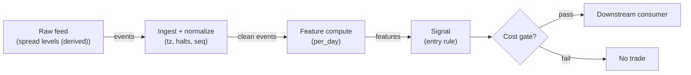

# S051 — OU half-life timing overlay

Time the reversion, don't trade it: fit the OU/AR(1) decay of a spread and convert it to a half-life; while the half-life is tradeable (`≤10` days [example]) the overlay's scalar is `1.0`, otherwise `0.0` — a timing input for the pairs consumers, never a standalone entry. Provenance **[D]**.

> Tag law: every numeric literal in prose carries one of `[documented]
> [default] [example] [unverified] [internal-est] [measured]` (legend: Appendix
> i v1.0.0). Bibliographic years, volumes, pages, arXiv IDs, section numbers,
> rule codes (C1–C10), fail-safe codes (F1–F5), module IDs, batch keys, family
> letters, and machine-parsed §0 data fields are identifiers, not literals,
> and are exempt.

## §1 Five-minute reviewer card

| Row | Value |
|---|---|
| Module | S051 — OU half-life timing overlay, v1.1.0 |
| Edge verdict | `PREDICTIVE-FEATURE-ONLY` — per the v1.0.0 enum (timer, not alpha): the OU half-life is the documented mean-reversion clock; the overlay's value is timing other signals' entries, not its own P&L |
| After-cost | `BEFORE-COST` — Works as a clock: a `3`-day [example] half-life means the pairs entry should be sized for a multi-day hold; a `30`-day [example] half-life means the 'reversion' is slower than the funding horizon and the entry should be vetoed. As a standalone entry it is unproven |
| Build cost | Tier M · `20–60` h [internal-est] · `$3,000–9,000` loaded [internal-est] |
| Data cost | Research `$0` (free EOD tier, `2`-yr history) – `~$29`/mo Starter [unverified]; production incremental `$0` [internal-est] on the shared S049/S050 feature feed, `~$29`/mo Starter standalone [unverified] — bands indicative, verify before budgeting |
| latency_class | bar-level / minutes |
| risk_class | low (signal-only; no order placement) |
| Capacity | `$0`/day notional [example] — illustrative; calibrate per venue |
| Executability | Feasible: Python+polars prototype; trivial compute |
| Risk summary | Standalone-alpha risk: this module is not one — trading the scalar directly is the documented misuse; fit-noise risk on short windows; regime-break risk (the half-life is backward-looking) |
| When it dies | Used as a standalone entry (specification violation); non-stationary spreads (no true mean reversion — the AR(1) fit is fiction); too few points for a stable phi |
| Regime gates | Provisional: pending R001–R050 annotation |
| Emits | `signal_vector` (Appendix b v1.0.0) — never orders |

## §1.5 Cheapest / least-build path

1. **Prototype hour band:** `20–60` h [internal-est] — bar features + timestamp/halt handling + reference validation against the fixture.
2. **Cheapest-source row:** min_tier = Polygon.io Stocks Starter (daily adjusted aggregates) — cheapest tier satisfying the per-day cadence; intraday SIP/Advanced is not needed [internal-est]; latency_class = bar-level / daily; required_fields = daily adjusted OHLCV per leg (adj close, split/dividend adjustments), session calendar; price_band = `$0` (free EOD research tier, `2`-yr history) – `~$29`/mo Starter [unverified] (indicative — verify before budgeting); production = derived from the S049/S050 feature feed at incremental `$0` [internal-est]; build_or_buy = **build the estimator, buy the feed (or use the free tier for research)**.
3. **Resource budget:** `1` core, `<2` GB RAM for `500` symbols [internal-est]; compute pattern `per_bar`.
4. **Skip list:** 1-min intraday variants (per-day cadence does not need them); tick-level variants; multi-venue aggregation; Rust ingest; colocated deployment.
5. **DO-NOT-CUT list:** causality assertions (`assert fill_event > signal_event`, no-signal-bar-fills test); COST block + callable `expected_cost_bps`; F1–F5 fail-safes + module-state enum + kill/safe-mode (`OFF`); decision-log audit records; bona-fide-intent + self-trade prevention; provenance tags on every numeric literal; fixtures + `test_cmd`; secrets via env only.
6. **Escalation gate:** upgrade from cheapest when any holds — live universe beyond the free/research band; jitter persistently over budget; cost gate failing on `[measured]` costs; cadence moves below daily (intraday fit needs Developer/Advanced + new intraday fixtures); entitlement class changes.

## §S0 Module contract

### S0.1 Typed signature

```python
def signal(state: ModuleState, events: list[Event], cfg: Config) -> SignalVector:
```

`SignalVector` per Appendix b v1.0.0. `state` is the module-owned named state
vector (`spreads`, `ou_fit`, `cooldown_until`, `module_state`); `events` are canonical Events (Appendix a v1.0.0),
newest last. The function handles documented edge cases: empty events →
`UNKNOWN`; invalid/missing prices → `UNKNOWN` (F1, never interpolate);
halt/auction events → freeze per the market-state table.

### S0.2 Config dataclass

| Parameter | Type | Default | Range | Status |
|---|---|---|---|---|
| `min_points` | int | `5` | `5`–`30` | default |
| `max_halflife_d` | float | `10.0` | `3`–`30` | example |
| `cost_gate_k` | float | `0.5` | `0.1`–`2.0` | default |
| `cooldown_s` | int | `300` | `0`–`3600` | default |

All defaults tagged per the tag law (status `default` ⇒ `[default]`).

### S0.3 Canonical schema mapping

Vendor columns → canonical Event schema (Appendix a v1.0.0), stated once here:

| Vendor | Canonical |
|---|---|
| `spread` | `spread` (pair/spread level) |
| `t` (ms) | `event_ts` (int64 ns UTC; ms→ns) |

### S0.4 Time contract

> Time contract: clock domain UTC, int64 ns; authoritative causality clock =
> `event_ts`; max_skew = `1` ms [default]; jitter budget = `500` ms [default]
> (conservative for a daily-cadence module); bar-label = open time; staleness
> TTL = `86_400` s [default] (`1` day [default]); gap
> policy = mask, no interpolation; halt/auction → discard contributions across
> reopen.

**Timing box:** `signal@t (per_day, America/New_York) → earliest fill @open(t+1)`

### S0.5 Market-state table

| State | Module behavior |
|---|---|
| CONTINUOUS_TRADING | Compute normally; emit per cadence |
| HALTED | Freeze state; emit `UNKNOWN`; discard contributions across reopen |
| AUCTION | No new signals; hold last `SignalVector`; state `DEGRADED` |
| CLOSED | Emit nothing; state `OFF` |

### S0.6 Module-state enum + error taxonomy

States per Appendix k v1.0.0: `OK | DEGRADED | UNKNOWN | OFF`. Invalid input →
`UNKNOWN`, never interpolate (Appendix f v1.0.0, F1–F5). Kill/safe-mode: an
administrative kill or a bounds violation forces `OFF` until the runbook
re-arm checklist passes.

| Failure | State | Alert |
|---|---|---|
| Missing/stale input (TTL) | `UNKNOWN` | page |
| Bad bar (high<low, non-positive prices, crossed quotes) | `UNKNOWN` | log |
| Feature out of mathematical bounds (F2) | `UNKNOWN` | page |
| `seq` gap beyond tolerance | `DEGRADED` (restart windows) | log |
| Halt/auction | `UNKNOWN` / `DEGRADED` (per table) | log |
| Kill/administrative disable | `OFF` | page |
| Anything unmapped | `UNKNOWN` | page |

### S0.7 Ops tail

- **Schedule:** continuous during US equities regular session `09:30`–`16:00` America/New_York [documented]; owner: signals on-call.
- **Health checks:** fixture replay (`test_cmd`) green on deploy; `seq`-gap monitor; staleness watchdog at `86_400` [default].
- **Alert table:** page on `UNKNOWN` > `5` min [default] or bounds violation; notify on `DEGRADED`; log single dropped events.
- **Resource budget:** `1` vCPU, `2` GB RAM per `500` symbols [internal-est]; state is O(window) per symbol.
- **Runbook stub:** `1.` confirm feed; `2.` replay fixture; `3.` if red → set `OFF`, page; `4.` reconcile decision log before re-arm.

### S0.8 Secrets (env-only)

`POLYGON_API_KEY` via environment only. No secrets in this file, fixtures, or logs
(CI secrets-grep).

### S0.9 May / must-NOT

> **May:** emit `SignalVector` records per Appendix b v1.0.0. **Must-NOT:**
> emit orders, order intents, prices, share counts, or notionals; call a
> broker; mutate shared state outside `state`; interpolate across gaps.

## §S1 Legacy (subsumed by §1)

Legacy §S1 content is the §1 reviewer card above; this header is retained so
section numbering stays frozen.

## §S2 Specification

### Universe

Spreads with a documented mean-reverting structure (pairs residuals); `>=5` observations [default].

### Entry rule (Boolean — no prose-only conditions)

```
NO ENTRY — timing overlay.
ACTIVE  := (halflife <= max_halflife_d) -> scalar = 1.0
INACTIVE := otherwise -> scalar = 0.0  # consumer vetoes/sizes down
```

`edge_bps` = `0` bps [default] — the overlay measures the reversion clock; it does not manufacture edge. The timer scalar is never gated by this (C2 applies the cost gate only to `direction != 0` emissions, which the timer never produces); the consumer applies its own gate per C11.

### Exits (with post-exit cooldown)

```
N/A — no positions; the scalar is consumed per day
ON_EXIT: cooldown_until = now + cooldown_s   # C10
```

### Position sizing (fenced function)

```python
def size_shares(risk_budget_R, stop_distance, vol_estimate, ADV_cap, cost):
    # S-module requests capital fraction only; share math lives in the strategy.
    risk_notional = risk_budget_R * 0.5 * confidence          # 0.5 [default] factor
    shares = risk_notional / max(stop_distance, 1e-9)        # 1e-9 [default] guard
    return int(min(shares, ADV_cap))                          # ADV_cap in shares [default]
```

### Risk limits

| Limit | Value |
|---|---|
| Max capital fraction per signal | `0.5` [default] |
| Max adverse excursion before `UNKNOWN` review | `2.0`× stop [default] |
| Staleness kill | TTL `86_400` [default] → `UNKNOWN` |

### COST block (single source of truth)

| Component | Value (bps) | Basis |
|---|---|---|
| Spread (reference, consumer execution) | `0.50` | [example] |
| Fees (taker incl. regulatory) | `0.30` | [example] |
| Borrow | `0.0` | [default] — reason: timing overlay emits no orders; borrow belongs to the consumer |
| Impact | `1.0` | [example] — flagged; the consumer's impact, not the timer's |
| **Total reference** | `1.80` | [example] |

`fee_schedule_as_of`: `2026-09-01` [unverified] — placeholder; pin the real
venue schedule before production. `side: taker` [default]; venue/tier/source:
XNAS / Polygon SIP 1-min bars [example]. Re-stating cost numbers outside this block is a validation failure.

```python
def expected_cost_bps(notional, adv_pct, venue, side, urgency) -> float:
    # Callable cost model - reference stack, components from the COST block.
    spread_bps = 0.50   # [example]
    fee_bps = 0.30      # [example]
    borrow_bps = 0.0    # [default] overlay emits no orders; reason in table
    impact_bps = 1.0    # [example] flagged; calibrate per venue at scale-up
    if side == "maker":
        fee_bps = -0.20  # rebate [example]
    return spread_bps + fee_bps + borrow_bps + impact_bps
```

### Execution / fill model table

| Aspect | Assumption |
|---|---|
| Latency | Signal→intent `≤1` event [example]; feed path latency-simulated-only |
| Partial fills | N/A (signal-only; T-module policy: Appendix c v1.0.0) |
| Impact | `1.0` bps reference [example]; stress ×`5` [example] |
| Adverse fill | Whipsaw haircut `0.2` bps per unit signal [example] |

### Robustness

Needs `>=30` points [example] for a stable phi in production (`5` [default] is the fixture minimum); the half-life is robust to the exact AR order but fragile to regime breaks — re-fit on a rolling window and veto when phi >= 1 (unit root: no reversion). Never annualize a half-life estimated on `5` points.

### Compliance sub-block (C1–C10+)

| Code | Rule: trigger → check → action → log |
|---|---|
| C1 | Self-match prevention: this S-module emits no orders; downstream consumers must set self-trade-prevention flags — asserted in the `consumes` contract → check: consumer ticket schema (Appendix c v1.0.0) has STP flag → action: block non-compliant consumers → log: `stp_assert` record |
| C2 | Bona-fide intent: every emitted `SignalVector` with direction ≠ `0` must pass the cost gate; sub-threshold features emit direction `0`, never a tradeable hint → check: `expected_cost_bps(...) <= k * edge_bps` → action: zero the direction on failure → log: `gate_veto` record |
| C3 | Message-rate: emissions capped per symbol per second [default] → check: rate monitor → action: throttle + alert → log: `throttle` record |
| C4 | Fat-finger trio (applied by consumers; this module bounds its own outputs): confidence ∈ [`0`,`1`], capital ∈ [`0`,`0.5`], computed_at sane → check: bounds on every emission → action: out-of-bounds → `UNKNOWN` (F2) → log: `bounds_veto` record |
| C5 | Decision log: every emission, veto, and state transition logged per Appendix g v1.0.0, hash-chained → check: log write ack → action: halt on write failure → log: the record itself |
| C6 | Halt/auction: per §S0.5 market-state table; contributions across reopen discarded → check: state feed → action: freeze/`DEGRADED` → log: `state_freeze` record |
| C7 | Locate check: SHORT direction requires `locate_ok` from the consumer; no SHORT without asserted locate (Reg-SHO threshold securities → direction `0`) → check: locate flag → action: zero SHORT on missing locate → log: `locate_veto` record |
| C8 | Public dissemination: no signal values published externally without review gate → check: export channel → action: block unreviewed export → log: `export_block` record |
| C9 | Data entitlements: per §S6 Data rights row → check: entitlement class on startup → action: entitlement change → §1.5 escalation gate → log: `entitlement` record |
| C10 | Post-exit cooldown: `cooldown_s` after any exit or compliance block; no re-entry → check: `now >= cooldown_until` → action: suppress entries → log: `cooldown` record |
| C11 | Standalone-use prohibition: consumers must document this module as a timing overlay, not an entry alpha → check: consumer strategy mapping → action: flag standalone use → log: `timer_mapping` record |

### Parameter table

| Parameter | Symbol | Value | Tag | Sensitivity |
|---|---|---|---|---|
| Min points | `min_points` | `5` | [default] | high — stability |
| Active ceiling | `max_halflife_d` | `10.0` days | [example] | medium |
| Cost-gate k | `cost_gate_k` | `0.5` | [default] | high |
| Cooldown | `cooldown_s` | `300` s | [default] | low |

### Calibration recipes (per parameter)

Shared protocol (per the v1.0.0 backtest acceptance rules): walk-forward with a
`252`-day [default] train / `63`-day [default] OOS window, a `5`-day [default]
embargo gap between train and test, min `50` [default] OOS timer-active days
per variant, selection by max OOS timer precision (fraction of active days where
the consumer's subsequent entry realized a profitable reversion leg) with DSR
reported; ties broken by the smaller parameter (simpler model). Record the
selected value + selection metric in the §0 changelog.

- `min_points` — grid `{5, 10, 15, 20, 30, 60}` [default]: the fit window
  trades bias (long windows average across regime breaks) against variance
  (short windows give noisy phi). Selection: highest OOS timer precision,
  requiring the selected window's phi standard error `< 0.1` [default] on
  train. `5` [default] is the fixture minimum only; production needs `>=30`
  [example] per §S2 Robustness.
- `max_halflife_d` — grid `{3, 5, 7, 10, 15, 20, 30}` [example]: the ceiling
  trades false vetoes (too tight) against slow-reversion entries (too loose).
  Selection: highest OOS consumer net-of-cost return per active-day; do not
  calibrate this to maximize active-days alone (base-rate trap). `10.0`
  [example] is the placeholder until the first OOS pass.
- `cost_gate_k` — grid `{0.1, 0.25, 0.5, 1.0, 2.0}` [default]: the timer's own
  gate never binds (direction is always `0`, `edge_bps = 0` [default]), so
  this parameter is exercised by consumers via C11. Calibrate on consumer data:
  select the `k` whose consumer-side gate yields the highest OOS DSR on timer-
  active entries. Default `0.5` [default] is conservative for T consumers.

### Timing box

`signal@t (per_day, America/New_York) → earliest fill @open(t+1)`

## §S3 Math + normative pseudocode

For the spread $s_t$ (daily):

$$s_t = \alpha + \phi s_{t-1} + \varepsilon_t, \qquad \kappa = -\ln(\phi)\ \mathrm{day}^{-1}, \qquad t_{1/2} = \frac{\ln 2}{\kappa}$$

$$\mathrm{active}_t = \mathbf{1}\{t_{1/2} \le 10\ \mathrm{days}\}, \qquad \mathrm{scalar}_t = \mathrm{active}_t$$

with $10$ days [example]. Fixture (exact decay $s_t = 8\cdot 0.8^{t-1}$ [example], $60$ days [example]): $\phi = 0.8$ [example], $\alpha = 0$ [example], $\kappa = 0.2231$/day [example], $t_{1/2} = 3.1063$ days [example] $\to$ active. The chapter's AR(1)-on-differences $\phi = -0.2$ [documented-as-chapter-value] is the same clock in difference form. Direction is always $0$ — the scalar rides in the `SignalVector.capital` field for the consumer.

**Normative pseudocode** (pseudocode is normative; prose is commentary):

```
function signal(state, events, cfg) -> SignalVector:
    assert events is non-empty else return UNKNOWN                    # F1
    e = events[-1]
    assert valid(e) else return UNKNOWN                              # F1/F2: never interpolate
    assert finite(e.spread) and sane_bounds(e) else return UNKNOWN   # F2
    spreads = [x.spread for x in events]                             # uses data <= t only
    if len(spreads) < cfg.min_points:
        return SignalVector(symbol=e.symbol, direction=0, confidence=0.0,
                            capital=0.0, computed_at=e.event_ts,      # warmup: scalar 0
                            staleness=now()-e.asof_ts, module_state=OK)
    (phi, alpha) = OLS(spread_t on spread_{t-1})                      # §S4 reference fit
    if phi is NaN or den(spreads) == 0:
        return UNKNOWN                                               # F2: fit failure, no info
    if phi >= 1.0:
        return SignalVector(symbol=e.symbol, direction=0, confidence=0.0,
                            capital=0.0, computed_at=e.event_ts,      # unit root: no reversion
                            staleness=now()-e.asof_ts, module_state=OK)
    kappa = -ln(phi)                                                 # per day
    halflife = ln(2)/kappa
    active = halflife <= cfg.max_halflife_d; scalar = 1.0 if active else 0.0
    edge_bps = 0.0                                                   # [default] timer has no own edge
    cost_ok = expected_cost_bps(...) <= cfg.cost_gate_k * edge_bps
    # ^^^ normative cost-gate predicate: expected_cost_bps(...) <= k * edge_bps
    direction = 0                                                    # timer: never an entry
    if direction != 0 and not cost_ok: direction = 0                 # C2: gate binds only on direction != 0
    # normative: cost_ok NEVER gates the scalar; the consumer applies its own gate (C11)
    capital = scalar                                                 # 1.0 active / 0.0 inactive; consumer caps at 0.5 [default]
    sig = SignalVector(symbol=e.symbol, direction=0, confidence=0.0, capital=capital,
                       computed_at=e.event_ts, staleness=now()-e.asof_ts,
                       module_state=state.module_state)
    log_decision(sig, inputs_hash, params_hash)                      # C5 / Appendix g
    assert fill_event > signal_event                                 # t->t+1: no signal-bar fills
    return sig
```

Notes on the normative semantics. (i) The OLS denominator (`den`) is the
variance of the lagged series; a zero denominator (constant spread) is a fit
failure, not an infinite half-life — it maps to `UNKNOWN`, never to a guess.
(ii) A fitted `phi >= 1.0` [rule] is informative (no reversion: veto) rather
than a failure, so the module stays `OK` and the scalar is `0.0`; a non-finite
or non-positive `phi` is a fit failure (`UNKNOWN`, F2). (iii) Because
`edge_bps = 0` [default] and the timer's direction is always `0`, the
cost-gate predicate is definitionally evaluated but can never veto the scalar;
pinning this in tests is the `test_cost_gate_never_gates_scalar` case —
the consumer MUST apply its own gate (C11), and deleting that consumer-side
check is the documented misuse path.

Causality: features at event/bar `t` use only data `≤ t`; earliest reaction is
`t+1`. Mandatory unit test: no-signal-bar fills.

## §S4 Worked example (fixture-backed)

- Tape: `modules/fixtures/S051_tape.csv` — `# TYPE: validation-run`;
  `60` synthetic daily spread levels (`id,event_ts,spread`); exact geometric decay `8·0.8^(t−1)`. All numbers synthetic, seed `51` [example]; timestamps int64 ns UTC.
- Expected outputs: `modules/fixtures/S051_expected.csv` — `spread`, `phi`, `alpha`, `kappa`, `halflife`, `active`, `scalar`, `dir` per day from day `5`; warmup rows carry blank estimates.
- Tolerance: `1e-9` on floats; integer counts exact.
- Acceptance tests (`modules/tests/test_S051.py`, `9` tests):
  `1.` fixture recomputes to expected (phi/kappa/half-life hand-checks; running-fit exactness; timer scalar); `2.` stub emits valid `SignalVector`; `3.` no-signal-bar fills (`fill_event_ts > computed_at`); `4.` cost-gate predicate passes on large edge, blocks on tiny edge (`k = 0.5` [default]) + maker-rebate branch of `expected_cost_bps` matches the COST block; `5.` invalid input (non-finite spread) → `UNKNOWN`; `6.` unit-root fit (`phi >= 1` [rule]) → scalar `0.0`, `OK` (informative veto); `7.` fit failure (constant spread, zero denominator) → `UNKNOWN` (F2); `8.` warmup (`< min_points` events) → `OK` with scalar `0.0`; `9.` cost gate never gates the timer scalar (gate fails with `edge_bps = 0` [default] yet scalar stays `1.0` when active).
- `test_cmd`: `python3 -m pytest modules/tests/test_S051.py -q` → exits `0`.

**Hand-check:** `phi=0.8`, `alpha=0`, `kappa=0.2231436`/day [example], `half-life=3.1062837` days [example]; every defined row identical; `active=1`, `scalar=1.0`, `dir=0`; stub `capital=1.0` — asserted in the test.

**Where the example is optimistic:** no fees, no latency, no partial fills, no corporate-action surprises — arithmetic illustration, not a backtest.

## §S5 Strategies that use this signal

Generated from `deps.yaml` (CI symmetry); hand-listed here:

| Strategy | Role |
|---|---|
| Timing consumer (strategy mapping pending deps.yaml) | Timing input: size/veto pairs entries (S049/S050) by half-life |
| Veto: slow-reversion filter | Half-life > `10`d [example] vetoes entries |

## §S6 Data required

| Field | Type | Granularity | Vendor / product | Notes |
|---|---|---|---|---|
| Spread levels (research) | float | daily | Polygon.io / Stocks Daily Aggregates (v2/aggs) | adjusted daily OHLCV per leg; corp-action adjustments applied |
| Spread levels (production) | float | daily | derived from S049/S050 features | shares feed; no separate vendor feed needed |
| Pair residuals | float | daily | derived from S049/S050 | feature pipeline |
| Session calendar | date set | daily | Polygon.io / reference (or internal holiday table) | US equities `09:30`–`16:00` America/New_York [documented] |

**Data spec (research feed):** vendor = Polygon.io; product = Stocks Daily
Aggregates (`/v2/aggs/ticker/{ticker}/range/1/day/...`); schema_version = `v2`;
required_fields = `adjusted` daily close (adj split/dividend), volume, session
calendar; price_band = `$0` (free EOD tier, `2`-yr history) – `~$29`/mo Starter
[unverified] — bands indicative, verify before budgeting. Dataset fingerprint
replaces `sha256:REPLACE_ON_INGEST` at ingest time; vintage stamped per pull.
Production reuses the S049/S050 feature feed at incremental `$0` [internal-est].

**Data rights row** (Appendix j v1.0.0): Derived from the pairs modules' features; no separate feed. Fixtures are synthetic; derived features ours. Research-bar entitlement asserted at startup per C9.

## §S7 Local build (M5 Max / 128 GB)

Feasible: trivial per spread — one OLS per day. Tier M per `notes/cost-model.md` §5: `20–60` h ≈ `$3,000–9,000` [internal-est] at `$150`/hr loaded — the hours are the pairs-research program this overlay serves (shared with S049/S050), not the `15`-line [internal-est] fit.

## §S8 Buy vs build

| Research feed | Polygon.io Stocks Daily Aggregates (Starter) | `$0`–`~$29`/mo [unverified] | Free EOD tier for research; Starter for delayed daily pulls | Buy feed |
| Production feed | derived from S049/S050 features | `$0` incremental [internal-est] | Shares the pairs modules' feed; no new vendor contract | Build on top |

**Verdict:** build. The fit is `15` lines [internal-est] on derived spreads; there is nothing to buy. Production data is free-on-the-shared-feed; the only buy is the research feed (free tier suffices [internal-est]).

## §S9 Efficacy — documented evidence

| Study / source | Market & period | Metric | Before/after cost | Caveat |
|---|---|---|---|---|
| Fixture (exact decay, `60` days) | Single synthetic episode | `κ=0.2231`/day [example], `t½=3.1063`d [example] → active | `BEFORE-COST` (arithmetic illustration) | Synthetic — demonstrates the clock |
| Chapter S4 example (seed `51`) | Single synthetic episode | AR(1)-on-differences `φ=−0.2` [documented-as-chapter-value], same half-life | `BEFORE-COST` | Same clock in difference form |

**Selection disclosure:** the fixture recomputation plus the chapter's worked example; the overlay is a timer by design and claims no standalone P&L [documented-as-assessment].

### Regime gates (machine records, provisional — pending R001–R050 annotation)

| regime_id | direction | mechanism | condition | action | min_lag | unknown_behavior |
|---|---|---|---|---|---|---|
| R001 | amplifies | fast-reversion regime: half-life inside the ceiling | active_flag | none (size per §S2) | `0` [default] | veto |
| R002 | degrades | unit-root regime: phi >= 1, no reversion | unit_root_flag | veto | `0` [default] | veto |
| R003 | degrades | break regime: half-life estimated across a break | break_flag | re-fit | `0` [default] | veto |

## §S10 Failure modes & pitfalls

| # | Trigger → Detect → Action → Recovery | check: |
|---|---|
| 1 | Standalone trading of the scalar → detect: consumer mapping audit → action: flag misuse → recovery: remap as timer | `check: timer_use_only` |
| 2 | Unit root fitted as reversion (phi >= 1) → detect: phi check → action: inactive, no information → recovery: none | `check: phi < 1` |
| 3 | Too few points: noisy phi → detect: count < `30` [example] in production → action: wait → recovery: resume | `check: n >= min_points` |
| 4 | Regime break inside the fit window → detect: break monitor → action: re-fit post-break → recovery: none | `check: no_break_in_window` |
| 5 | Lookahead: future spreads in the AR fit → detect: causality audit → action: halt, fix → recovery: re-run no-signal-bar-fills test | `check: all(fill_ts > computed_at)` |
| 6 | Non-finite spread → detect: sanity → action: `UNKNOWN` → recovery: fix feed | `check: isfinite(spread)` |
| 7 | Half-life misread (per-day vs annualized confusion) → detect: documentation audit → action: label units → recovery: none | `check: units_labeled` |
| 8 | Stale fit reused across regimes → detect: re-fit cadence → action: refresh daily → recovery: none | `check: fit_fresh` |

## §S11 Visuals

Figure: `batches figure (see §0 `plot_script`)` (synthetic, seed `51` [example]).



## §S12 Source log + unverified leads

**Sources** (citable facts only):

1. Chapter S4 worked values (seed 51): exact OU decay, AR(1)-on-differences `phi=−0.2`, `kappa=0.2231`/day, half-life `3.1063` days [documented-as-chapter-value] — the fixture's level-form fit gives `phi=0.8`, `alpha=0`, same `kappa`/`half-life`; same clock.
2. Holý, V. — "Estimation of Ornstein-Uhlenbeck Process Using Ultra-High-Frequency Data with Application to Intraday Pairs Trading Strategy" (arXiv:1811.09312v2, 2019): the OU process observed at discrete equidistant times follows an ARMA(1,1) process — the published basis for the AR(1) discretization fit used in §S3 [documented]. URL: https://arxiv.org/abs/1811.09312v2

**Chatbot source log.** Duck.ai (GPT-5.6 Luna, anonymous) answered Q-SB7-1–Q-SB7-3 (`2026-09-10`); Grok/Cursor answers pending (checked `2026-09-10`).

**Unverified leads** (chatbot-only — never in evidence tables):

- Chatbot-cited OU half-lives for equity pairs (typically `2`–`10` days) [unverified] — not independently confirmed; kept out of evidence tables.

---

## Appendix — AI build prompt (S051)

Copy-paste into any chat agent:

> Build module **S051 — OU half-life timing overlay** per `notes/module-template.md` v1.0.0
> and this file's §S0 contract. Cheapest path (§1.5): prototype
> `20–60` h [internal-est]; cheapest data candidate
> Polygon.io Stocks Advanced [internal-est]; compute pattern `per_bar`.
> Implement `signal(state, events, cfg) -> SignalVector` (Appendix b v1.0.0)
> with the §S3 normative pseudocode, including the cost-gate predicate
> `expected_cost_bps(...) <= k * edge_bps` and `assert fill_event >
> signal_event`. Wire F1–F5 (Appendix f v1.0.0): invalid input → `UNKNOWN`,
> never interpolate. Log decisions per Appendix g v1.0.0. Secrets via env
> only. Run the fixture `modules/fixtures/S051_tape.csv`
> (`# TYPE: validation-run`) against `modules/fixtures/S051_expected.csv`
> (tolerance `1e-9`).
> **Definition of done:** `python3 -m pytest modules/tests/test_S051.py -q`
> exits `0`. Tag every numeric literal you add with the unified enum
> (Appendix i v1.0.0); put anything unverifiable in §S12 unverified leads.
