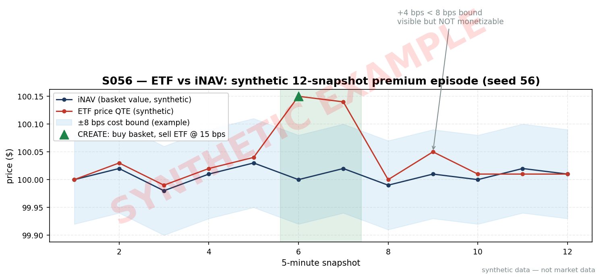
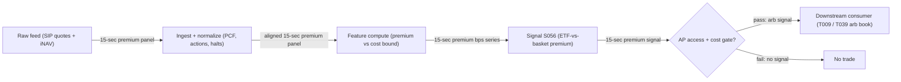

# S056 — ETF vs basket / iNAV arbitrage

An ETF must track its basket; when its market price deviates from intraday NAV (iNAV) beyond creation/redemption costs, authorized participants arbitrage it back — everyone else trades the statistical leftovers. The signal is the premium in basis points: (ETF − iNAV)/iNAV. The economics are a bound, not a forecast: trade only clean deviations that clear a conservative cost bound, because most visible iNAV deviations are not monetizable after costs — stale prices, closed foreign markets, wide-spread components, and creation restrictions all inject phantom deviations, and the cleanest dislocations go to APs and low-latency prop firms first. Provenance **[D]**.

> Tag law: every numeric literal in prose carries one of `[documented]
> [default] [example] [unverified] [internal-est] [measured]` (legend: Appendix
> i v1.0.0). Constants inside cited formulas inherit the formula's tag.
> Bibliographic years, volumes, pages, arXiv IDs, section numbers, rule codes
> (C1–C10), fail-safe codes (F1–F5), module IDs, and machine-parsed §0 data
> fields are identifiers, not literals, and are exempt.

## §1 Five-minute reviewer card

| Row | Value |
|---|---|
| Module | S056 — ETF vs basket / iNAV arbitrage, v1.1.0 |
| Edge verdict | `PREDICTIVE-FEATURE-ONLY` — real, measurable, economically grounded quantity as a signal; standalone after-cost P&L for a non-AP desk is a thin basis trade |
| After-cost | `BEFORE-COST` — As a signal, ETF-vs-basket premium is a real, measurable, economically grounded quantity. As a standalone P&L source for a non-AP desk, it is a thin basis trade: underwrite small, trade only clean deviations that clear a conservative bound. |
| Build cost | Tier M · 20–60 h [internal-est] · $3,000–9,000 loaded [internal-est] (monitor + cost-bound engine + paper-trading harness; AP connectivity not included) |
| Data cost | Tier-1 ~$30–200/mo (real-time SIP quotes, 1-min bars) [unverified]; Tier-2 ~$200/mo + usage [unverified] — verify before budgeting |
| latency_class | `15`-sec [documented] iNAV cadence / real-time monitor |
| risk_class | low (signal-only; no order placement) |
| Capacity | $0.5–2M/day notional [example] — capacity-limited; illustrative |
| Executability | Feasible: a premium monitor is a streaming join plus arithmetic — computationally trivial; Tier M because of real-time plumbing (multi-symbol quote ingestion, PCF management, 15-sec decision loop) |
| Risk summary | no AP access (basis trade wearing someone else's convergence); stale iNAV; creation restrictions; basket-assembly drift; cost-bound optimism |
| When it dies | without AP status you harvest only crumbs; stress makes iNAV stale and the arb a mirage; HFT competition arbs away persistence |
| Regime gates | Provisional: R001 stress — iNAV staleness; widen the bound or stand down. Machine records below. |
| Emits | `signal_vector` (Appendix b v1.0.0) — never orders |

**Regime gates — machine records (provisional; R-IDs unassigned pending the R001–R050 annotation pass):**

```yaml
regime_gates:
  - regime_id: R001              # stress / market dislocation (provisional)
    direction: degrades
    mechanism: constituent staleness and halt-driven iNAV fiction inflates |premium_bps|
    condition: stale_constituent_frac > 0.20 [default] OR etf_halt_flagged
    action: widen_stops           # bound_bps *= 2.0 [example] until fresh
    min_lag: 900                  # seconds [default] before re-tightening
    unknown_behavior: veto        # restrictive default: no entries while gate state unknown
  - regime_id: R001
    direction: inverts
    mechanism: during dislocations the AP channel breaks and premium persistence becomes a distress signal, not an arb
    condition: creation_restricted == True [default]
    action: veto
    min_lag: 3600                 # seconds [default]
    unknown_behavior: veto
```

## §1.5 Cheapest / least-build path

1. **Prototype hour band:** 20–60 h [internal-est] — monitor + cost-bound engine + paper-trading harness; AP connectivity and prime-brokerage setup are a separate institutional project, not included.
2. **Cheapest-source row:** min_tier = exchange delayed quotes + issuer PCFs — free, mechanics only [unverified]; latency_class = 15-min delayed — useless for live signals; live needs Tier-1+;
   required_fields = real-time ETF quotes; iNAV (15-sec cadence); PCF basket recipe; constituent quotes; price_band = ~$0/mo delayed [unverified]; live ~$30–200/mo [unverified] (indicative — verify before budgeting); build_or_buy = **buy the iNAV + basket feed; build the monitor; do not kid yourself that watching a premium on screen equals a tradable arbitrage**.
3. **Resource budget:** 1 core, <4 GB RAM [internal-est]; compute pattern `streaming`.
4. **Skip list:** direct-feed MBO/ITCH; cross-venue smart routing; AP creation flow modeling.
5. **DO-NOT-CUT list:** causality assertions (`assert fill_event >
   signal_event`, no-signal-bar-fills test); COST block + callable
   `expected_cost_bps`; F1–F5 fail-safes + module-state enum; decision-log
   audit records; bona-fide-intent + self-trade prevention; provenance tags on
   every numeric literal; fixtures + `test_cmd`; secrets via env only.
6. **Escalation gate:** watchlist >200 ETFs [default]; sub-15-sec decision loop; production PCF management.

## §S0 Module contract

### S0.1 Typed signature

```python
def signal(state: ModuleState, events: list[Event], cfg: Config) -> SignalVector:
```

`SignalVector` per Appendix b v1.0.0. `state` is the module-owned named state
vector (`premium_bps`, `bound_bps`, `cooldown_until`, `module_state`); `events` are canonical Events
(Appendix a v1.0.0), newest last. The function handles documented edge cases:
empty events → `UNKNOWN`; iNAV ≤ 0 or non-finite ETF price → `UNKNOWN` (F1/F2); stale iNAV flag → `UNKNOWN`.

### S0.2 Config dataclass

| Parameter | Type | Default | Range | Status |
|---|---|---|---|---|
| `cost_bound_bps` | float | `8.0` | `2–25` | calibrate |
| `cost_gate_k` | float | `0.5` | `0.1–2.0` | calibrate |

Statuses are `calibrate`: the `8.0` [example] / `0.5` [default] are starting
defaults, and the §S2 calibration recipe selects the production values.
All defaults tagged per the tag law.

### S0.3 Canonical schema mapping

Vendor columns → canonical Event schema (Appendix a v1.0.0), stated once here:

| Vendor | Canonical |
|---|---|
| `ETF quote timestamp` | ``event_ts` (int64 ns UTC)` |
| `ETF last/mid` | ``etf_px`` |
| `iNAV (`15`-sec [documented])` | ``inav`` |
| `PCF` | `basket recipe for the bound` |

### S0.4 Time contract

> Time contract: clock domain UTC, int64 ns; authoritative causality clock =
> `event_ts`; max_skew = 1 ms [default]; jitter budget = 500 µs [default]
> bar-label = open time; staleness TTL = 3 s [default]; gap policy = mask, no interpolation; halt/auction
> → discard contributions across reopen.

**Timing box:** `signal@t (streaming, America/New_York) → earliest fill @open(t+1)`

### S0.5 Market-state table

| State | Module behavior |
|---|---|
| CONTINUOUS_TRADING | Compute normally; emit per cadence |
| HALTED | Freeze state; emit `UNKNOWN`; discard contributions across reopen |
| AUCTION | No new signals; hold last `SignalVector`; state `DEGRADED` |
| CLOSED | Emit nothing; state `OFF` |

### S0.6 Module-state enum + error taxonomy

States per Appendix k v1.0.0: `OK | DEGRADED | UNKNOWN | OFF`. Invalid input →
`UNKNOWN`, never interpolate (Appendix f v1.0.0, F1–F5).

| Failure | State | Alert |
|---|---|---|
| Missing/stale input (TTL 3 s [default]) | `UNKNOWN` | page |
| Inputs out of mathematical bounds (F2) | `UNKNOWN` | page |
| `seq` gap > `1,000` events [default] | `DEGRADED` (restart windows) | log |
| Feed jitter > budget persistently | `DEGRADED` | notify |
| Halt/auction | `UNKNOWN` / `DEGRADED` (per table) | log |
| Kill/administrative disable | `OFF` | page |
| Anything unmapped | `UNKNOWN` | page |

### S0.7 Ops tail

- **Schedule:** continuous during US equities regular session 09:30–16:00 America/New_York [documented], 15-sec iNAV cadence; owner: etf-arb on-call.
- **Health checks:** fixture replay (`test_cmd`) green on deploy; live
  `seq`-gap monitor; staleness watchdog at `3`× cadence.
- **Alert table:** page on `UNKNOWN` > `30` s [default] or bounds violation;
  notify on `DEGRADED`; log on single dropped events.
- **Resource budget:** 1 core, <4 GB RAM [internal-est]; state is O(window) per symbol.
- **Runbook stub:** `1.` confirm feed (vendor status); `2.` replay fixture;
  `3.` if red → set `OFF`, page; `4.` reconcile decision log before re-arm.

### S0.8 Secrets (env-only)

`POLYGON_API_KEY`, `DATABENTO_API_KEY` via environment only. No secrets in
this file, fixtures, or logs (CI secrets-grep).

### S0.9 May / must-NOT

> **May:** emit `SignalVector` records per Appendix b v1.0.0. **Must-NOT:**
> emit orders, order intents, prices, share counts, or notionals; call a
> broker; mutate shared state outside `state`; interpolate across gaps.

## §S1 Legacy (subsumed by §1)

Legacy §S1 content is the §1 reviewer card above; this header is retained so
section numbering stays frozen.

## §S2 Specification

### Universe

US-listed ETFs with clean baskets and live iNAV; liquid large-cap equity ETFs first; exclude funds with closed foreign underlyings or creation restrictions.

### Entry rule (Boolean — no prose-only conditions)

```
ENTER_SHORT_ETF := (premium_bps > cost_bound_bps) AND (expected_cost_bps(...) <= cost_gate_k * edge_bps)
ENTER_LONG_ETF  := (premium_bps < -cost_bound_bps) AND (expected_cost_bps(...) <= cost_gate_k * edge_bps)
FLAT            := otherwise

`premium_bps = (etf_px − inav)/inav × 10,000`; bound ±8 bps [example]; `edge_bps = |premium_bps|` [example] modeled per-trade edge = the premium itself.
```

### Exits (with post-exit cooldown)

```
EXIT := |premium_bps| < 0.5 × cost_bound_bps [example] (premium back inside the bound)
        OR (stale-iNAV flag) OR (module_state != OK)
ON_EXIT: cooldown_until = now + cooldown_s   # 60 s [default]; C10
```

### Position sizing (fenced function)

```python
def size_shares(risk_budget_R, stop_distance, vol_estimate, ADV_cap, cost):
    # S-module requests capital fraction only; share math lives in the strategy.
    # Reference: capital = 0.5 * confidence  (confidence in [0,1])  [default]
    risk_notional = risk_budget_R * 0.5 * confidence          # [default] 0.5 factor
    shares = risk_notional / max(stop_distance, 1e-9)
    return int(min(shares, ADV_cap * adv_shares * 0.001))     # 0.1% ADV cap [default]
```

### Risk limits

| Limit | Value |
|---|---|
| Max capital fraction per signal | 0.5 [default] |
| Max ETFs on watchlist | 200 [default] |
| Staleness kill | TTL 3 s [default] → `UNKNOWN`; iNAV staleness flag → `UNKNOWN` |

### COST block (single source of truth)

| Component | Value (bps) | Basis |
|---|---|---|
| Spread (ETF + basket-leg half-spreads) | `2.00` | [example] — reference stack |
| Fees (two-sided taker) | `0.60` | [example] — reference stack |
| Borrow (long-only reference) | `0.00` | [default] — no short leg |
| Impact (basket-leg async fill slippage) | `1.50` | [example] — reference stack |
| **Total reference** | `4.10` | [example] |

`fee_schedule_as_of`: `2026-09-01 [unverified]` — placeholder; pin the real
venue schedule before production. Re-stating cost numbers outside this block is a validation failure.

```yaml
cost_terms:   # machine-readable terms; the table above is the single human source of truth
  side: taker                                   # [default]
  venue: XNAS                                    # [example]
  fee_schedule_as_of: 2026-09-01                # [unverified] — pin real venue schedule before production
  borrow_bps_per_day: 0.0                       # [default] — reason: long-only reference, no short leg
  cost_level: BEFORE-COST                       # signal emits pre-cost; downstream T applies FULL-COST
```

```python
def expected_cost_bps(notional, adv_pct, venue, side, urgency) -> float:
    """Callable cost model — reference stack for S056."""
    spread_bps = 2.00   # ETF + basket-leg half-spreads [example]
    fee_bps = 0.60      # two-sided taker fees [example]
    borrow_bps = 0.00   # long-only reference; reason: no short leg [default]
    impact_bps = 1.50   # basket-leg async fill slippage [example]
    return spread_bps + fee_bps + borrow_bps + impact_bps
```

### Execution / fill model table

| Aspect | Assumption |
|---|---|
| Latency | 15-sec iNAV cadence; SIP-vs-direct lag — the print you see is not the market you get [example] |
| Partial fills | Basket-leg async — assembly drift captured in impact [example] |
| Impact | 1.50 bps reference [example]; stress ×3 [example]; 500-name baskets worse |
| Adverse fill | Assembly-drift haircut: model basket-assembly cost explicitly [example] |

### Robustness

The bound comes from your actual fee schedule, not from optimization — overfitting the 8 bps [example] threshold on history is the documented failure. Stress the bound at 2× [example] before sizing. iNAV ≠ a free arbitrage price: widen the bound when constituent staleness is high; skip affected funds.

### Compliance sub-block (C1–C10+)

| Code | Rule: trigger → check → action → log |
|---|---|
| C1 | Self-match prevention: signal module emits no orders; downstream T-modules must set self-trade-prevention flags — S056 asserts the requirement in its `consumes` contract |
| C2 | Bona-fide intent: every emitted `SignalVector` with |direction|=`1` must pass the cost gate; sub-threshold readings emit direction `0`, never a tradeable hint |
| C3 | Message-rate: `≤100` emissions/symbol/s [default]; breach → throttle to `1`/s [default] + alert |
| C4 | Fat-finger trio (applied by consumers; S056 bounds its own outputs): confidence ∈ [`0`,`1`], capital ∈ [`0`,`0.5`], computed_at sane — out-of-bounds → `UNKNOWN` (F2) |
| C5 | Decision log: every emission, veto, and state transition logged per Appendix g v1.0.0, hash-chained |
| C6 | Halt/auction: per §S0.5 market-state table; contributions across reopen discarded |
| C7 | Locate check: SHORT direction requires `locate_ok` from the consumer; S056 never emits SHORT without the consumer asserting locate (Reg-SHO threshold securities → direction `0`) |
| C8 | Public dissemination: no signal values published externally without review gate |
| C9 | Data entitlements: per §S6 Data rights row; entitlement-class change → §1.5 escalation gate |
| C10 | Post-exit cooldown: `60 s` [default] after any exit or compliance block; no re-entry |
| C11 | n/a long-only reference — if a short ETF leg is used, the borrow-fee gate applies; trigger → check fee panel → veto + log |
| C12 | Point-in-time PCFs only: using the published end-of-day NAV or a revised PCF as if known intraday is lookahead; trigger → check → veto + log |

### Parameter table

| Parameter | Symbol | Value | Tag | Sensitivity |
|---|---|---|---|---|
| Cost bound (bps) | `cost_bound_bps` | `8.0` | [example] | high |
| Cost-gate k | `cost_gate_k` | `0.5` | [default] | high |

### Calibration recipe (per parameter)

The cost components themselves are **not tuned**: the stack comes from your
venue fee schedule + measured slippage, and the recipe only selects the
safety margin and gate strictness. Production bound: `bound_bps =
round_up(measured_stack_bps × margin)`; default `8.0` [example] ≈ `4.1` [example] stack × `2.0` [example] margin.

| Parameter | Grid | Walk-forward OOS selection rule | Freeze rule |
|---|---|---|---|
| `cost_bound_bps` | safety margin ∈ {`1.25`, `1.5`, `2.0`} [example] applied to the fee-schedule stack | anchored folds, `252` trading days [default] train / `63` [default] validation, `1`-day [default] embargo; pick the margin maximizing validation net edge per trade subject to ≥ `200` trades [example] on the fold | freeze the selected margin for `60` trading days [example]; re-run only when the fee schedule or venue changes |
| `cost_gate_k` | {`0.25`, `0.5`, `0.75`, `1.0`} [example] | same folds/embargo; prefer the largest k whose validation after-cost edge ≥ `2`× [default] realized slippage | freeze with the bound; `0.5` [default] stays until a full validation cycle passes |

**Selection disclosure (mandatory):** grid search runs on the training fold
only; selection happens on the embargoed validation fold; never re-tune on
the production stream. If validation cannot clear `200` trades [example] on
any grid point, the module ships at defaults and the signal is declared
`PREDICTIVE-FEATURE-ONLY` (§1 verdict).

### Timing box

`signal@t (streaming, America/New_York) → earliest fill @open(t+1)`

## §S3 Math + normative pseudocode

Premium and the arbitrage bound:

$$\text{premium}_{bps} = \frac{P_{ETF} - iNAV}{iNAV} \times 10{,}000, \qquad \text{trade iff } |\text{premium}_{bps}| > \text{bound}_{bps},$$
$$\text{bound}_{bps} \approx \text{spread} + \text{fees} + \text{impact} + \text{assembly drift} \quad (\text{from your fee schedule, not optimized}).$$

**Normative pseudocode** (pseudocode is normative; prose is commentary):

```
function signal(state, bars, cfg) -> SignalVector:
    assert bars non-empty else return UNKNOWN                        # F1
    b = bars[-1]
    assert b.inav > 0 and isfinite(b.etf_px) else return UNKNOWN     # F1/F2
    prem = (b.etf_px - b.inav) / b.inav * 10000.0
    assert isfinite(prem) else return UNKNOWN                       # F2
    edge_bps = abs(prem)                                             # [example] edge = the premium itself
    # cost-gate inputs are bound here (all [example] for the reference stack):
    notional = 1_000_000.0; adv_pct = 0.001; venue = "XNAS"; side = "taker"; urgency = "normal"
    cost_ok = expected_cost_bps(notional, adv_pct, venue, side, urgency) <= cfg.cost_gate_k * edge_bps
    # ^^^ normative cost-gate predicate: expected_cost_bps(...) <= k * edge_bps
    direction = -1 if (prem > cfg.cost_bound_bps and cost_ok) else (1 if (prem < -cfg.cost_bound_bps and cost_ok) else 0)
    # cost_bound_bps=8.0 [example]
    confidence = min(1, abs(prem)/cfg.cost_bound_bps - 1.0) if direction != 0 else 0
    capital = 0.5 * confidence                                        # [default]
    sig = SignalVector(symbol, direction, confidence, capital,
                       computed_at=b.event_ts, staleness=now()-b.asof_ts,
                       module_state=state.module_state)
    log_decision(sig, inputs_hash, params_hash)                      # C5 / Appendix g
    assert fill_event > signal_event                                # t→t+1 causality: no fill on the signal bar
    return sig
```

Causality: The premium is computed on the `15`-sec [documented] snapshot; the earliest fill is the next snapshot's market. Any latency-sensitive claim is simulated only — requires MBO/ITCH. Mandatory unit test: no-signal-bar fills.

## §S4 Worked example (fixture-backed)

- Tape: `modules/fixtures/S056_tape.csv` — `# TYPE: validation-run`;
  `8` rows (8-snapshot synthetic ETF price vs iNAV tape (snapshots 3–4 carry ±12 bps deviations [example])), all numbers synthetic,
  seed `56` [example]; `event_ts`/`asof_ts` int64 ns UTC.
- Expected outputs: `modules/fixtures/S056_expected.csv` — per-snapshot `premium_bps`, `direction`.
- Tolerance: `1e-9 [default]` on floats; integers exact.
- Hand-checks: snapshots 3–4 breach the ±8 bps bound [example] at ±12 bps [example] → directions −1/+1.
- Acceptance tests (`modules/tests/test_S056.py`, `9` tests):
  `1.` fixture recomputes to expected (snapshots 3–4 breach hand-checks)
  `2.` stub emits valid `SignalVector` (direction ∈ {+1,−1,0}, confidence/capital ∈ [0,1])
  `3.` no-signal-bar fills (`fill_event_ts > computed_at`)
  `4.` cost-gate predicate: `expected_cost_bps(...) <= k * edge_bps` with k = 0.5 [default]
  `5.` invalid input (iNAV ≤ 0) → `UNKNOWN`
  `6.` `Config` defaults pinned to the chapter (`8.0` [example], `0.5` [default])
  `7.` thin edge (8.05 bps [example], inside the gate-blocked band) → direction `0` via the cost gate
  `8.` clean edge (12 bps [example]) → direction `−1`, confidence `0.5`, capital `0.25`
  `9.` non-finite ETF price → `UNKNOWN`
- `test_cmd`: `python3 -m pytest modules/tests/test_S056.py -q` → exits `0`.

**Where the example is optimistic:** `8` synthetic snapshots [example], zero assembly drift, no staleness — demonstrates the bound trigger, not an edge; production faces SIP lag, stale iNAV, and AP competition.

## §S5 Strategies that use this signal

| Strategy | Role |
|---|---|
| T009 — ETF arbitrage book | Downstream consumer of the premium signal [example] |
| T039 — AP flow tracking | Track AP creation/redemption flow instead of pretending to be an AP |

## §S6 Data required

| Field | Type | Granularity | Source tier | Notes |
|---|---|---|---|---|
| ETF quotes | float | real-time L1 | Tier 1–2 | SIP latency vs direct feeds |
| iNAV | float | `15`-sec [documented] cadence | Tier 1–2 | freshness flags per constituent |
| PCF basket recipe | holdings | daily | issuer | point-in-time only — revised PCFs are lookahead |
| Constituent quotes | float | real-time L1 | Tier 1–2 | stale components inject phantom deviations |

**Data rights row** (Appendix j v1.0.0): ETF/iNAV feeds via Polygon SIP / Databento, `rights: licensed`; license scope = research + stated production symbol count; raw ticks never leave our systems — fixtures are synthetic; entitlement-class change → §1.5 escalation gate.

## §S7 Local build (M5 Max / 128 GB)

Feasible (Tier M). A premium monitor is a streaming join plus arithmetic — computationally trivial. It is Tier M rather than Tier L because of the real-time plumbing: synchronized multi-symbol quote ingestion, PCF management, and a decision loop on `15`-second [documented] iNAV cadence. Python event loops handle ~100–500k events/sec [internal-est] — plenty for an ETF watchlist on L1.

## §S8 Buy vs build

Buy the iNAV + basket feed; build the monitor. Indicative: Tier-0 delayed ~$0 [unverified]; Tier-1 ~$30–200/mo [unverified]; Tier-2 ~$200/mo + usage [unverified] — verify before budgeting.

## §S9 Efficacy — documented evidence

| Study / source | Market & period | Metric | Before/after cost | Caveat |
|---|---|---|---|---|
| Petajisto (2017) [documented] | US ETFs, multi-asset sample | ETFs with identical portfolios: average price deviation ~`100` bps [documented]; larger in international/non-Treasury bond funds | Before-cost research measurement (deviations, not net P&L) | deviations ≠ profits |
| Petajisto (2017), trading-strategy result [documented] | high-deviation ETF asset classes | up to ~`16`% [documented] annual Carhart four-factor alpha from a strategy exploiting pricing inefficiencies | Before-cost backtest (gross alpha) | requires actually capturing the deviations; APs/MMs capture the cleanest ones first |
| "Active Trading in ETFs" (2021), Financial Analysts Journal v77n2 [documented] | large ETF sample over time | high-frequency algorithmic trading activity reduces the persistence of ETF mispricing | Research finding (not a P&L number) | secondary summary; the easy deviations get arbed away faster over time |
| BIS Quarterly Review (Mar 2018) [documented] | structural | AP creation/redemption + secondary-market arbitrage keep ETF prices near NAV | Mechanism description | confirms the bound logic; not a return figure |

**Honest bottom line.** iNAV ≠ a free arbitrage price: stale prices, closed foreign markets, wide-spread components, futures/swaps inside the fund, corporate actions, creation restrictions, and different trading hours all inject phantom deviations. Most visible iNAV deviations are not monetizable after costs — the cleanest dislocations go to APs, ETF market makers, and low-latency prop firms.

## §S10 Failure modes & pitfalls

| # | Trigger → Detect → Action → Recovery | check: |
|---|---|---|
| 1 | No AP access → the "arbitrage" is a basis trade wearing someone else's convergence → detect: — → action: size as a statistical trade; demand wider bounds; track AP flow (T039) → recovery: — | `ap_access == False → widen bound` |
| 2 | Stale iNAV → closed foreign markets / halted components make the premium fiction → detect: freshness flags → action: widen the bound; skip affected funds → recovery: resume when fresh | `inav_fresh` |
| 3 | Lookahead leakage → using end-of-day NAV or revised PCF as if known intraday → detect: PCF vintage audit → action: point-in-time PCFs only → recovery: rebuild | `pcf_vintage <= snapshot_ts` |
| 4 | Creation restrictions / halts → the tether snaps when needed → detect: issuer notices → action: hard position caps around events → recovery: resume on all-clear | `no_restriction` |
| 5 | Basket-assembly drift → prices move while assembling; tracking error vs PCF → detect: assembly-cost model → action: model explicitly; prefer liquid large-cap ETFs → recovery: re-tune | `assembly_cost_modeled` |
| 6 | Cost-bound optimism → underestimating impact on `500` names [example] → detect: stress test → action: the S4 stack is a floor; stress the bound at 2× → recovery: re-size | `bound_stressed_2x` |
| 7 | Latency → SIP-vs-direct and 15-sec cadence; the print is not the market → detect: — → action: any latency-sensitive claim is simulated only — requires MBO/ITCH → recovery: — | `simulated_only_without_direct_feed` |
| 8 | Overfitting the bound → tuning `8` bps [example] on history until it "works" → detect: — → action: bound comes from your fee schedule, not optimization; the recipe tunes only the safety margin → recovery: re-derive | `bound_from_fee_schedule` |

## §S11 Visuals





## §S12 Source log + unverified leads

**Sources** (citable facts only):

['1. VanEck. "ETF 101/102: The Inner Workings of ETF Creations and Redemptions." https://vaneck.com/us/en/blogs/thematic-investing/etf-102-the-inner-workings-of-etf-creations-and-redemptions (issuer documentation: AP creation/redemption loop, 50,000-share creation blocks).', '2. ETF.com. "ETF Univ: What Is The Creation/Redemption Mechanism?" https://www.etf.com/sections/etf-report-features/etf-univ-what-creationredemption-mechanism (the premium/discount arbitrage loop; 50,000-share redemption example).', '3. Bank for International Settlements. "Trading mechanisms of ETFs compared with other fund types." *BIS Quarterly Review*, March 2018 (extract). https://www.bis.org/publ/qtrpdf/r_qt1803z.htm (APs transacting in primary and secondary markets keep ETF prices near NAV).', '4. Jain, A., Jain, C. & Jiang, C. X. (2021). "Active Trading in ETFs: The Role of High-Frequency Algorithmic Trading." *Financial Analysts Journal*, 77(2), 66–82. https://ideas.repec.org/a/taf/ufajxx/v77y2021i2p66-82.html (higher algorithmic trading reduces ETF price-deviation magnitude and persistence).', '5. Petajisto, A. (2017). "Inefficiencies in the Pricing of Exchange-Traded Funds." *Financial Analysts Journal*, 73(1), 24–54 — via CFA Institute coverage: https://www.cfainstitute.org/about/press-room/2018/cfa-institute-financial-analysts-journal-announces-2017-winners and https://www.financialplanningassociation.org/article/journal/SEP17-new-research-wealth-management-and-behavioral-finance-deserves-your-attention (~100 bps average deviation for identical-portfolio ETFs; ~16% gross Carhart four-factor alpha; 15-second IIV/iNAV cadence).', '6. Lettau, M. & Madhavan, A. (2018). "Exchange-Traded Funds 101 for Economists." *Journal of Economic Perspectives*, 32(1), 135–154. https://doi.org/10.1257/jep.32.1.135 (ETF architecture survey: creation/redemption mechanics, AP incentives).', '7. Ben-David, I., Franzoni, F. & Moussawi, R. (2018). "Do ETFs Increase Volatility?" *Journal of Finance*, 73(6), 2471–2535. https://doi.org/10.1111/jofi.12727 (the arbitrage channel\'s flip side: ETF ownership raises underlying-stock volatility).']

**Chatbot source log.** Duck.ai (GPT-5.6 Luna, anonymous, web-search assisted, 2026-09-10) answered Q-SB3-1–Q-SB3-3. Grok/Cursor answers pending (checked 2026-09-10). Chatbot output is leads, never facts.

**Unverified leads** (chatbot-only — never in evidence tables):

['- *Unverified chatbot claim* (Duck.ai, GPT-5.6 Luna, 2026-09-10, Q-SB3-3): creation-unit economics illustration "50,000 × $100 = $5M notional; 5 bps = $2,500 gross/creation" — the arithmetic is independently verified and VanEck confirms 50,000-share blocks, so it is used in S4 as labeled verified arithmetic, not as a third-party statistic [unverified].']

---

## Appendix — AI build prompt (S056)

Copy-paste into any chat agent:

> Build module **S056 — ETF vs basket / iNAV arbitrage** per
> `notes/module-template.md` v1.0.0 and this file's §S0 contract.
> Cheapest path (§1.5): prototype 20–60 h [internal-est]; cheapest data
> candidate exchange delayed quotes + issuer PCFs — free, mechanics only [unverified]; compute pattern
> `streaming`; skip direct feeds, smart routing, AP flow modeling for now.
> Implement `signal(state, events, cfg) -> SignalVector` (Appendix b v1.0.0)
> with the §S3 normative pseudocode, including the cost-gate predicate
> `expected_cost_bps(...) <= k * edge_bps` and `assert fill_event >
> signal_event`. Wire F1–F5 (Appendix f v1.0.0): invalid input → `UNKNOWN`,
> never interpolate. Log decisions per Appendix g v1.0.0. Secrets via env
> only. Run the fixture `modules/fixtures/S056_tape.csv`
> (`# TYPE: validation-run`) against `modules/fixtures/S056_expected.csv`
> (tolerance `1e-9 [default]`).
> **Definition of done:** `python3 -m pytest modules/tests/test_S056.py -q`
> exits `0`. Tag every numeric literal you add with the unified enum
> (Appendix i v1.0.0); put anything unverifiable in §S12 unverified leads.
