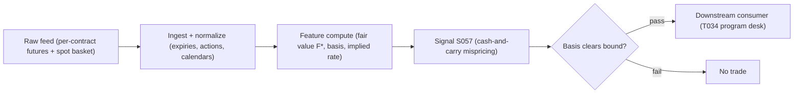

# S057 — Index futures cash-and-carry arbitrage

An index future is a contract to buy the whole index later; its fair price is nailed down by arithmetic: buy all `500` [example] stocks today, finance until expiry, subtract the dividends you collect --- the *cost of carry*. The *basis* (futures minus fair value) is the market's price for carrying the basket. When the basis exceeds the all-in cost stack, buy the basket and sell the future (or the reverse) and hold to expiry to lock it. The edge accrues to whoever funds cheapest and trades the basket cheapest, not to whoever spots the deviation first. Provenance **[D]**.

> Tag law: every numeric literal in prose carries one of `[documented]
> [default] [example] [unverified] [internal-est] [measured]` (legend: Appendix
> i v1.0.0). Constants inside cited formulas inherit the formula's tag.
> Bibliographic years, volumes, pages, arXiv IDs, section numbers, rule codes
> (C1–C10), fail-safe codes (F1–F5), module IDs, and machine-parsed §0 data
> fields are identifiers, not literals, and are exempt.

## §1 Five-minute reviewer card

| Row | Value |
|---|---|
| Module | S057 — Index futures cash-and-carry arbitrage, v1.0.0 |
| Edge verdict | `PREDICTIVE-FEATURE-ONLY` — documented cost-of-carry identity and basis mean-reversion; no published after-cost Sharpe for a standalone retail cash-and-carry rule |
| After-cost | `BEFORE-COST` — A real, textbook edge that is almost entirely competed away without institutional funding and basket-trading scale --- moderate for a balance-sheet desk, approximately zero for a small account. |
| Build cost | Tier M · `20`–`60` h [internal-est] · `$3,000`–`$9,000` loaded [internal-est] |
| Data cost | Research `~$30`–`200`/mo (clean bars) [unverified]; contract-level futures panels higher [unverified] --- bands indicative, verify before budgeting |
| latency_class | daily / expiry-hold; signal at close, earliest fill next open |
| risk_class | medium (two-leg, funded; no order placement) |
| Capacity | `$1`–`10`M/day notional [example] --- illustrative; calibrate per venue |
| Executability | Feasible: closed-form arithmetic on a handful of series; Tier M analytics. The *trade* needs prime-broker infrastructure --- no M5 Max replicates a funding desk. |
| Risk summary | Dividend-forecast error is the #1 fake-signal source; basis can widen violently before converging (variation margin must be funded daily); reverse trade needs shorting `500` [example] names |
| When it dies | Small accounts (irreplicable basket, worse financing); stress (basis widens before converging); mismeasured dividends (wrong q → phantom basis) |
| Regime gates | Provisional: R001 stress --- basis blowouts; stand down when funding spreads spike or the basis exceeds `3`× [example] the bound |
| Emits | `signal_vector` (Appendix b v1.0.0) — never orders |

## §1.5 Cheapest / least-build path

1. **Prototype hour band:** `20`–`60` h [internal-est] — fair-value + basis monitor, dividend-vintage handling, fixture validation against the tape.
2. **Cheapest-source row:** min_tier = Delayed futures + spot quotes --- cheapest data source candidate [unverified]; latency_class = daily, point-in-time adjusted;
   required_fields = per-contract futures quotes + expiries, index spot, funding rate, point-in-time dividend forecasts; price_band = `~$0`/mo [unverified] (indicative --- verify before budgeting); build_or_buy = **build the analytics, buy contract-level data, rent the balance sheet from a prime broker**.
3. **Resource budget:** `1` core, `<4` GB RAM [internal-est]; compute pattern `per_bar`.
4. **Skip list:** multi-expiry curve fitting; borrow-book optimization; basket-execution algos; live funding-desk integration.
5. **DO-NOT-CUT list:** causality assertions (`assert fill_event >
   signal_event`, no-signal-bar-fills test); COST block + callable
   `expected_cost_bps`; F1–F5 fail-safes + module-state enum; decision-log
   audit records; bona-fide-intent + self-trade prevention; provenance tags on
   every numeric literal; fixtures + `test_cmd`; secrets via env only.
6. **Escalation gate:** universe >`1` index [default]; move to intraday bars; live basket execution enters scope.

## §S0 Module contract

### S0.1 Typed signature

```python
def signal(state: ModuleState, events: list[Event], cfg: Config) -> SignalVector:
```

`SignalVector` per Appendix b v1.0.0. `state` is the module-owned named state
vector (`m` (mispricing), `bound` (cost bound), `cooldown_until`, `module_state`); `events` are canonical Events
(Appendix a v1.0.0), newest last. The function handles documented edge cases:
empty events → `UNKNOWN`; non-finite spot/futures → `UNKNOWN` (F1/F2, never interpolate); missing dividend forecast → `UNKNOWN`; halt/auction → freeze per the market-state table.

### S0.2 Config dataclass

| Parameter | Type | Default | Range | Status |
|---|---|---|---|---|
| `r` | float | `0.05` | `0.02–0.08` | example |
| `q` | float | `0.018` | `0.01–0.03` | example |
| `T` | float | `90.0 / 365.0` | `days-months` | example |
| `cost_bound_bps` | float | `15.0` | `5–50` | example |
| `cost_gate_k` | float | `0.5` | `0.1–2.0` | default |

All defaults tagged per the tag law.

### S0.3 Canonical schema mapping

Vendor columns → canonical Event schema (Appendix a v1.0.0), stated once here:

| Vendor | Canonical |
|---|---|
| ``day` (tape)` | ``bar_id` (int)` |
| ``event_ts` (tape)` | ``event_ts` (int64 ns UTC)` |
| ``asof_ts` (tape)` | ``asof_ts` (int64 ns UTC)` |
| ``spot` (tape)` | ``S` (float, index level)` |
| ``futures` (tape)` | ``F` (float, per-contract futures price)` |

### S0.4 Time contract

> Time contract: clock domain UTC, int64 ns; authoritative causality clock =
> `event_ts`; max_skew = `1` ms [default]; jitter budget = `500` µs [default]
> bar-label = open time; staleness TTL = `3` s [default]; gap policy = mask, no interpolation; halt/auction
> → discard contributions across reopen.

**Timing box:** `signal@t (per_bar, America/New_York) → earliest fill @open(t+1)`

### S0.5 Market-state table

| State | Module behavior |
|---|---|
| CONTINUOUS_TRADING | Compute normally; emit per cadence |
| HALTED | Freeze state; emit `UNKNOWN`; discard contributions across reopen |
| AUCTION | No new signals; hold last `SignalVector`; state `DEGRADED` |
| CLOSED | Emit nothing; state `OFF` |

### S0.6 Module-state enum + error taxonomy

States per Appendix k v1.0.0: `OK | DEGRADED | UNKNOWN | OFF`. Invalid input →
`UNKNOWN`, never interpolate (Appendix f v1.0.0, F1–F5).

| Failure | State | Alert |
|---|---|---|
| Missing/stale input (TTL `3` s [default]) | `UNKNOWN` | page |
| Inputs out of mathematical bounds (F2) | `UNKNOWN` | page |
| `seq` gap > `1,000` events [default] | `DEGRADED` (restart windows) | log |
| Feed jitter > budget persistently | `DEGRADED` | notify |
| Halt/auction | `UNKNOWN` / `DEGRADED` (per table) | log |
| Kill/administrative disable | `OFF` | page |
| Anything unmapped | `UNKNOWN` | page |

### S0.7 Ops tail

- **Schedule:** daily after close plus per bar during the US equities regular session `09:30`–`16:00` America/New_York [documented]; owner: futures-arb on-call.
- **Health checks:** fixture replay (`test_cmd`) green on deploy; live
  `seq`-gap monitor; staleness watchdog at `3`× cadence.
- **Alert table:** page on `UNKNOWN` > `30` s [default] or bounds violation;
  notify on `DEGRADED`; log on single dropped events.
- **Resource budget:** `1` core, `<4` GB RAM [internal-est]; state is O(window) per symbol.
- **Runbook stub:** `1.` confirm feed (vendor status); `2.` replay fixture;
  `3.` if red → set `OFF`, page; `4.` reconcile decision log before re-arm.

### S0.8 Secrets (env-only)

`DATABENTO_API_KEY`, `POLYGON_API_KEY` via environment only. No secrets in
this file, fixtures, or logs (CI secrets-grep).

### S0.9 May / must-NOT

> **May:** emit `SignalVector` records per Appendix b v1.0.0. **Must-NOT:**
> emit orders, order intents, prices, share counts, or notionals; call a
> broker; mutate shared state outside `state`; interpolate across gaps.

## §S1 Legacy (subsumed by §1)

Legacy §S1 content is the §1 reviewer card above; this header is retained so
section numbering stays frozen.

## §S2 Specification

### Universe

US equity index futures + replicating basket; front quarterly contract; liquid, borrowable basket constituents (C7); per-contract quotes only --- rolled continuous series forbidden.

### Entry rule (Boolean — no prose-only conditions)

```
ENTER_SHORT_BASIS := (m > +bound) AND (expected_cost_bps(...) <= cost_gate_k * edge_bps)   # futures rich: buy basket, sell futures
ENTER_LONG_BASIS  := (m < -bound) AND (expected_cost_bps(...) <= cost_gate_k * edge_bps)   # futures cheap: short basket, buy futures
FLAT              := otherwise

`m = F - F*`, `F* = S·exp((r-q)·T)`; `edge_bps = |m| / S · 10000` [example] modeled per-trade edge.
```

### Exits (with post-exit cooldown)

```
EXIT := (direction == -1 AND m < 0) OR (direction == +1 AND m > 0)   # [example] basis crossed fair value
        OR (T < 5/365) OR (module_state != OK)                                  # [example] expiry-approach veto
ON_EXIT: cooldown_until = now + cooldown_s   # 60 s [default]; C10
```

### Position sizing (fenced function)

```python
def size_shares(risk_budget_R, stop_distance, vol_estimate, ADV_cap, cost):
    # S-module requests capital fraction only; share math lives in the strategy.
    # Reference: capital = 0.5 * confidence  (confidence in [0,1])  [default]
    risk_notional = risk_budget_R * 0.5 * confidence          # [default] 0.5 factor
    shares = risk_notional / max(stop_distance, 1e-9)
    return int(min(shares, ADV_cap * adv_shares * 0.001))     # 0.1% ADV cap [default]
```

### Risk limits

| Limit | Value |
|---|---|
| Max capital fraction per signal | `0.5` [default] |
| Max contracts per expiry | `20` [example] |
| Margin buffer | pre-funded for `3`× [example] bound widening |
| Staleness kill | TTL `3` s [default] → `UNKNOWN` |

### COST block (single source of truth)

| Component | Value (bps) | Basis |
|---|---|---|
| Spread (basket + futures half-spreads) | `1.50` | [example] — reference stack |
| Fees (basket commissions + futures fees) | `0.80` | [example] — reference stack |
| Borrow/financing spread over r, amortized | `4.00` | [example] — reference stack |
| Impact (500-line basket async fill slippage) | `2.00` | [example] — reference stack |
| **Total reference** | `8.30` | [example] |

`fee_schedule_as_of`: `2026-09-01 [unverified]` — placeholder; pin the real
venue schedule before production. `side: taker` [default]; venue/tier/source:
CME / XNAS basket [example]. Re-stating cost numbers outside this block is a validation failure.

```python
def expected_cost_bps(notional, adv_pct, venue, side, urgency) -> float:
    """Callable cost model — reference stack for S057."""
    spread_bps = 1.50   # basket + futures half-spreads [example]
    fee_bps = 0.80      # basket commissions + futures fees [example]
    borrow_bps = 4.00   # financing spread over r, amortized [example]
    impact_bps = 2.00   # 500-line basket async fill slippage [example]
    return spread_bps + fee_bps + borrow_bps + impact_bps
```

### Execution / fill model table

| Aspect | Assumption |
|---|---|
| Latency | Signal computed at bar close; intent next bar [example] |
| Partial fills | Basket legs async --- leg slippage captured in impact [example] |
| Impact | `2.00` bps reference [example]; stress ×`3` [example] |
| Adverse fill | Basis-widening haircut on event bars [example] |

### Robustness

Dividend forecasts are the #1 fake-signal source: use futures-implied dividends as a cross-check and haircut the bound by historical forecast error. Never backtest on a pre-rolled continuous futures series --- it manufactures fake basis jumps at rolls; use contract-level quotes only. Stress the basis `2`–`3`× [example] the bound before sizing; pre-fund the variation-margin buffer.

### Compliance sub-block (C1–C10+)

| Code | Rule: trigger → check → action → log |
|---|---|
| C1 | Self-match prevention: signal module emits no orders; downstream T-modules must set self-trade-prevention flags — S057 asserts the requirement in its `consumes` contract |
| C2 | Bona-fide intent: every emitted `SignalVector` with |direction|=`1` must pass the cost gate; sub-threshold readings emit direction `0`, never a tradeable hint |
| C3 | Message-rate: `≤100` emissions/symbol/s [default]; breach → throttle to `1`/s [default] + alert |
| C4 | Fat-finger trio (applied by consumers; S057 bounds its own outputs): confidence ∈ [`0`,`1`], capital ∈ [`0`,`0.5`], computed_at sane — out-of-bounds → `UNKNOWN` (F2) |
| C5 | Decision log: every emission, veto, and state transition logged per Appendix g v1.0.0, hash-chained |
| C6 | Halt/auction: per §S0.5 market-state table; contributions across reopen discarded |
| C7 | Locate check: SHORT direction requires `locate_ok` from the consumer; S057 never emits SHORT without the consumer asserting locate (Reg-SHO threshold securities → direction `0`) |
| C8 | Public dissemination: no signal values published externally without review gate |
| C9 | Data entitlements: per §S6 Data rights row; entitlement-class change → §1.5 escalation gate |
| C10 | Post-exit cooldown: `60 s` [default] after any exit or compliance block; no re-entry |
| C11 | Dividend vintage: forecasts must be point-in-time (as known then); never use revised dividend histories. --- trigger → check → action → log: prevents phantom basis from lookahead dividends |
| C12 | Continuous-series ban: contract-level futures quotes only; rolled continuous series forbidden in research and production. --- trigger → check → action → log: prevents fake basis jumps at roll dates |

### Parameter table

| Parameter | Symbol | Value | Tag | Sensitivity |
|---|---|---|---|---|
| Financing rate | `r` | `0.05` | [example] | high |
| Dividend yield | `q` | `0.018` | [example] | high |
| Time to expiry (yr) | `T` | `90/365` | [example] | medium |
| Cost bound (bps) | `cost_bound_bps` | `15.0` | [example] | high |
| Cost-gate k | `cost_gate_k` | `0.5` | [default] | medium |

### Timing box

`signal@t (per_bar, America/New_York) → earliest fill @open(t+1)`

## §S3 Math + normative pseudocode

Cost of carry = financing minus dividends. Fair value is a financing identity; everything else is friction. Continuous fair value with dividend yield q, rate r, time T:

$$F^* = S\cdot e^{(r-q)\cdot T}, \qquad m = F - F^*, \qquad r_{impl} = \tfrac{1}{T}\ln(F/S) + q.$$

Trade rule: if $m > +bound$: buy the cash basket, sell futures, hold to expiry. If $m < -bound$: short the basket, buy futures. $bound$ = round-trip all-in cost (financing + basket spreads/commissions + borrow + ops + margin funding).

**Normative pseudocode** (pseudocode is normative; prose is commentary):

```
function signal(state, bars, cfg) -> SignalVector:
    assert bars non-empty else return UNKNOWN
    b = bars[-1]
    if not finite(b.spot, b.futures) or b.spot <= 0: return UNKNOWN
    F* = b.spot * exp((cfg.r - cfg.q) * cfg.T)
    m = b.futures - F*
    edge_bps = abs(m) / b.spot * 10000
    if m > cfg.cost_bound_bps: dir = -1
    elif m < -cfg.cost_bound_bps: dir = +1
    else: dir = 0
    assert expected_cost_bps(...) <= cfg.cost_gate_k * edge_bps  # cost gate
    assert fill_event > signal_event  # causality: no signal-bar fills
    conf = min(1.0, abs(edge_bps) / cfg.cost_bound_bps - 1.0) if dir else 0.0
    return SignalVector(dir, conf, 0.5 * conf, event_ts=b.event_ts, state=OK)
```

Causality: Fair value and mispricing are computed at bar $t$'s close on data $\le t$; the earliest fill is bar $t+1$'s open. Convergence is guaranteed only if both legs are actually held to settlement. Mandatory unit test: no-signal-bar fills.

## §S4 Worked example (fixture-backed)

- Tape: `modules/fixtures/S057_tape.csv` — `# TYPE: validation-run`;
  `5` rows (`5`-day [example] synthetic index/futures tape (S=`5000`, r=`5.0`% [example], q=`1.8`% [example], T=`90`/`365` yr [example]; cost bound `15` bps [example])), all numbers synthetic,
  seed `57` [example]; `event_ts`/`asof_ts` int64 ns UTC.
- Expected outputs: `modules/fixtures/S057_expected.csv` — per-bar `fstar`, `dev_bps`, `direction`.
- Tolerance: `1e-9 [default]` on floats; integers exact.
- Hand-checks: day-`0` fair value F* = `5039.6081114376` [measured] (= `5000`×exp(`0.032`×`90`/`365`)); day-`3` deviation `+20.78` bps [measured] > `15` bps bound → direction `-1`; day-`4` deviation `-19.22` bps [measured] → direction `+1`.
- Acceptance tests (`modules/tests/test_S057.py`, `5` tests):
  `1.` fixture recomputes to expected (day-`0` F* hand-check; day-`3`/day-`4` direction checks)
  `2.` stub emits valid `SignalVector` (direction ∈ {+1,-1,0}, confidence/capital ∈ [0,1])
  `3.` no-signal-bar fills (`fill_event_ts > computed_at`)
  `4.` cost-gate predicate passes on large edge, blocks on tiny edge (`k = 0.5` [default])
  `5.` invalid input (non-finite futures) → `UNKNOWN`
- `test_cmd`: `python3 -m pytest modules/tests/test_S057.py -q` → exits `0`.

**Where the example is optimistic:** `5` synthetic days [example], zero borrow frictions, known dividends --- demonstrates the fair-value-vs-bound computation, not a tradable quote.

## §S5 Strategies that use this signal

| Strategy | Role |
|---|---|
| T034 — Index Futures Cash-and-Carry | Primary entry trigger (direction): the S057 basis-vs-bound rule drives the program-trading implementation with borrow-fee and spread-cost checks |
| T077 — Crypto Basis Cash-and-Carry | Primary trigger in a second market: same cost-of-carry math on crypto spot-vs-futures basis, funding rates replacing dividends |

## §S6 Data required

| Field | Type | Granularity | Source tier | Notes |
|---|---|---|---|---|
| Index spot / basket constituents | float | real-time quotes | Tier 1–2 | replicating basket needs all constituents; ETF substitute is coarser |
| Futures quotes, per contract | float | tick / 1-min | Tier 2 | contract-level settlement + bid/ask --- not a continuous series |
| Expiry calendar, multipliers, tick specs | reference | per contract | Tier 1–2 | first-notice, last-trade, settlement conventions |
| Risk-free / funding curve | float | daily | Tier 0–1 | your *actual* funding rate for the bound |
| Dividend forecasts | float/date | per constituent | Tier 1–2 | the #1 source of fake signals |
| Borrow availability/fees (reverse) | snapshot | daily | Tier 2 | short-basket leg feasibility |

**Data rights row** (Appendix j v1.0.0): Index + futures data via Databento CME / Polygon, `rights: licensed`; license scope = research + stated production symbol count; raw ticks never leave our systems --- fixtures are synthetic; entitlement-class change → §1.5 escalation gate.

## §S7 Local build (M5 Max / 128 GB)

Feasible. Each bar is one exponential and a subtraction --- microseconds of compute [internal-est]; the working set is a handful of series (<`100` MB [internal-est]). What breaks first is data licensing (contract-level futures history), the borrow book, and execution plumbing --- not CPU or RAM. Stack: Python + polars.

## §S8 Buy vs build

Build the fair-value analytics (your dividend vintage and your cost stack are the strategy); buy contract-level futures data and rent the balance sheet from a prime broker. Indicative bands: Tier-`0` free delayed quotes `~$0` [unverified] --- learn the math, useless live; Tier-`1` retail (Polygon) real-time equities + futures snapshots `~$30`–`200`/mo [unverified] --- basket pricing in real time, no contract-level depth; Tier-`2` professional (Databento CME) contract-level futures, expiries, specs `~$200`/mo + usage [unverified] --- the actual data the trade needs, but you still need basket execution + financing. Crossover verdict: the crossover to *trading* it is a capital decision, not a data decision.

## §S9 Efficacy — documented evidence

| Study / source | Market & period | Metric | Before/after cost | Caveat |
|---|---|---|---|---|
| MacKinlay & Ramaswamy (1988) [documented] | US index futures, `1980`–`1989` | basis mean-reverts within transaction-cost bands | `BEFORE-COST` bands | classic; markets far more efficient now |
| Roll (UCLA working paper) [documented] | S&P 500 futures vs cash/SPDR | basis mean-reversion speed tied to liquidity; |basis| predicts future liquidity | empirical, cost-aware | working paper |
| Zhuo et al. (2012) [documented] | CSI 300 futures-spot, 1-min | arbitrage opportunities exist; mispricing mean-reverts, strongest effect ~`14` min [documented] after signal | `BEFORE-COST` | single market/period; retail frictions not modeled |

**Honest bottom line.** The documented evidence shows the basis mean-reverts within transaction-cost bands (MacKinlay & Ramaswamy 1988; Roll) and that `1`-minute [documented] mispricings exist (Zhuo et al. 2012), all **before-cost**. Net capture accrues to the cheapest funder with the cheapest basket execution --- the apparent premium compensates funding/balance-sheet usage, inventory, crash risk, dividend uncertainty, and margin liquidity, not a free lunch. Report net-of-all-costs carry capture with dividend-forecast error bands --- never gross mispricing frequency.

## §S10 Failure modes & pitfalls

| # | Trigger → Detect → Action → Recovery | check: |
|---|---|---|
| 1 | Dividend forecast error → wrong q, wrong F*, phantom basis → detect: implied-dividend cross-check → action: haircut bound by forecast error → recovery: re-estimate q | ``q_vintage == point_in_time`` |
| 2 | Continuous-series artifacts → fake basis jumps at rolls → detect: series provenance audit → action: contract-level data only → recovery: rebuild research | ``series_provenance == contract_level`` |
| 3 | Basis widening before convergence → margin breach before expiry → detect: basis vs `2`–`3`× [example] bound stress → action: size for widening; pre-funded margin → recovery: hold or unwind per plan | ``margin_buffer >= 3x_bound_widening`` |
| 4 | Financing shock → funding above implied rate mid-trade → detect: r_impl vs own rate daily → action: term out financing; unwind trigger → recovery: refinance | ``funding_spread <= 50 bps/day` [example]` |
| 5 | ETF-substitute tracking error → diverges from index → detect: tracking-error measurement → action: charge to bound or use full basket → recovery: switch vehicle | ``tracking_error <= 5 bps/day` [example]` |
| 6 | Reverse-trade borrow failure → buy-ins, HTB fees → detect: pre-locate; borrow-cost model → action: skip if borrow > bound → recovery: unwind short leg | ``borrow_available == True`` |
| 7 | Expiry/delivery traps → first-notice/settlement quirks → detect: settlement checklist → action: hard unwind before first notice → recovery: roll per plan | ``days_to_first_notice >= 5` [example]` |
| 8 | Small-account cost stack → commissions + worse financing flip the sign → detect: honest personal cost model → action: paper-trade instead → recovery: micro contracts if stack clears | ``personal_net_edge > 0`` |

## §S11 Visuals




## §S12 Source log + unverified leads

**Sources** (citable facts only):

['1. MacKinlay, A. C. & Ramaswamy, K. (1988) [documented]. "Index-Futures Arbitrage and the Behavior of Stock Index Futures Prices." *Review of Financial Studies* 1(2): 137-158. https://doi.org/10.1093/rfs/1.2.137 --- basis behavior and arbitrage bounds; basis mean-reverts within transaction-cost bands.', '2. Roll, R. [documented]. "What is the relation between the S&P 500 futures/cash basis and liquidity?" UCLA working paper. http://www.anderson.ucla.edu/documents/areas/fac/finance/one_price.pdf --- basis mean-reversion speed tied to liquidity; trading costs drive it.', '3. Kakushadze, Z. & Serur, J. A. (2018) [documented]. *151 Trading Strategies*, §6.2 --- index cash-and-carry math; retail infeasibility note.', '4. McDonald, R. L. [documented]. *Derivatives Markets* (3e), Ch. 6 --- cash-and-carry / reverse cash-and-carry worked examples. http://bpb-us-w2.wpmucdn.com/sites.udel.edu/dist/e/1233/files/2014/12/McDonald_ISM3e_Chapter-6-2iojrzd.pdf', '5. Cornell, B. & French, K. R. (1983) [documented]. "Taxes and the pricing of stock index futures." *Journal of Finance* 38(3), 675-694 --- tax effects on the cost of carry.', '6. Modest, D. M. & Sundaresan, M. (1983) [documented]. "The relationship between spot and futures prices in stock index futures markets." *Journal of Futures Markets* 3(1), 15-41 --- early empirical index-futures mispricing and arbitrage bounds.']

**Chatbot source log.** Duck.ai (GPT-5.6 Luna, anonymous, web-search assisted, 2026-09-10) answered Q-SB7-1–Q-SB7-3. Grok/Cursor answers pending (checked 2026-09-10). Chatbot output is leads, never facts.

**Unverified leads** (chatbot-only — never in evidence tables):

['- Duck.ai Q-SB7-3: cash-and-carry arithmetic lead --- walk-forward of the F*-vs-futures rule reported net +`3.01`% [unverified] (corrected 2026-09-10 from a +`0.10`% [unverified] misread); study itself unverified, quarantined here.', '- Duck.ai Q-SB7-2: continuous futures series INSUFFICIENT for calendar-spread research; contract-level data requirements [unverified]; carry-model eng-hour bands approximate [unverified].']

---

## Appendix — AI build prompt (S057)

Copy-paste into any chat agent:

> Build module **S057 — Index futures cash-and-carry arbitrage** per
> `notes/module-template.md` v1.0.0 and this file's §S0 contract.
> Cheapest path (§1.5): prototype `20`–`60` h [internal-est]; cheapest data
> candidate Delayed futures + spot quotes --- cheapest data source candidate [unverified]; compute pattern
> `per_bar`; skip multi-expiry curves, basket algos, funding integration for now.
> Implement `signal(state, events, cfg) -> SignalVector` (Appendix b v1.0.0)
> with the §S3 normative pseudocode, including the cost-gate predicate
> `expected_cost_bps(...) <= k * edge_bps` and `assert fill_event >
> signal_event`. Wire F1–F5 (Appendix f v1.0.0): invalid input → `UNKNOWN`,
> never interpolate. Log decisions per Appendix g v1.0.0. Secrets via env
> only. Run the fixture `modules/fixtures/S057_tape.csv`
> (`# TYPE: validation-run`) against `modules/fixtures/S057_expected.csv`
> (tolerance `1e-9 [default]`).
> **Definition of done:** `python3 -m pytest modules/tests/test_S057.py -q`
> exits `0`. Tag every numeric literal you add with the unified enum
> (Appendix i v1.0.0); put anything unverifiable in §S12 unverified leads.
