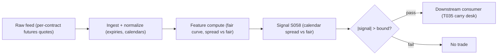

# S058 — Futures calendar spread (term-structure carry)

Every futures contract on the same underlying has its own price; together they form the *term structure*. In calm markets the curve's shape is dictated by carry: F*(T) = S·e^{(r−q−y)·T}, with y the *convenience yield* (zero for equities, the whole story for oil). A *calendar spread* (long one expiry, short another) owns the *slope* between two expiries, immune to the outright price. The signal compares the observed spread to the fair spread; fade the steepening when the market charges more for carry than financing justifies. Distinct from S060: this is fair-value term-structure trading, not predictive lead-lag. Provenance **[D]**.

> Tag law: every numeric literal in prose carries one of `[documented]
> [default] [example] [unverified] [internal-est] [measured]` (legend: Appendix
> i v1.0.0). Constants inside cited formulas inherit the formula's tag.
> Bibliographic years, volumes, pages, arXiv IDs, section numbers, rule codes
> (C1–C10), fail-safe codes (F1–F5), module IDs, and machine-parsed §0 data
> fields are identifiers, not literals, and are exempt.

## §1 Five-minute reviewer card

| Row | Value |
|---|---|
| Module | S058 — Futures calendar spread (term-structure carry), v1.1.0 |
| Edge verdict | `PREDICTIVE-FEATURE-ONLY` — documented carry math and roll-yield decomposition; no published after-cost Sharpe for the standalone spread-vs-fair rule |
| After-cost | `BEFORE-COST` — A capital-efficient, market-neutral curve-shape trade --- compensated warehousing of term structure, not a risk-free convergence. |
| Build cost | Tier M · `50`–`100` h [unverified] research / `125`–`250` h [unverified] production (chatbot lead; cost-model Tier M takes precedence) |
| Data cost | Tier-2 professional (Databento GLBX.MDP3, usage-based) `~$200`/mo + usage [unverified] --- GLBX.MDP3 historical OHLCV-1m `$70`/GB on the 2024-12-11 unit sheet [documented]; bands indicative, verify before budgeting |
| latency_class | daily; signal at close, earliest fill next open |
| risk_class | medium (two-leg, expiry mechanics; no order placement) |
| Capacity | `$1`–`10`M/day notional [example] --- illustrative; calibrate per venue |
| Executability | Feasible: closed-form fair-curve arithmetic; Tier M. The risk is curve-shape and expiry mechanics, not compute. |
| Risk summary | Curve-shape risk (can stay irrational); expiry pinches; margin expansion; illiquid deferred legs; roll cost on the near leg |
| When it dies | Fundamental curve-shape shifts (rate regime change, convenience-yield shock); expiry pinch; illiquid deferred contracts |
| Regime gates | Provisional machine records (full YAML in §S2 Robustness): `{regime_id: R001, direction: degrades, mechanism: stress reprices fair curve faster than r/q/y refresh, condition: rate-regime shift OR margin-expansion event, action: pause_entry, min_lag: 0 [default], unknown_behavior: flat}` |
| Emits | `signal_vector` (Appendix b v1.0.0) — never orders |

## §1.5 Cheapest / least-build path

1. **Prototype hour band:** `50`–`100` h [unverified] research — fair-curve + spread-vs-fair monitor, expiry/roll plumbing, fixture validation against the tape.
2. **Cheapest-source row:** min_tier = Tier-1 retail futures snapshots --- candidate: Barchart OnDemand per-contract APIs (getQuoteEod by combined exchange+symbol; getHistory tick/minute/EOD; getFuturesSpecifications for contract size/tick/hours) [documented]; latency_class = daily, point-in-time adjusted;
   required_fields = per-contract futures quotes across expiries, expiry calendar, rate curve; price_band = `~$30`–`200`/mo [unverified] (indicative --- verify before budgeting); build_or_buy = **build the fair-curve analytics; buy contract-level futures data --- a continuous series will hide exactly what you need to see**. Retail tier is EOD/minute snapshots only: no contract-level depth for the deferred leg.
3. **Resource budget:** `1` core, `<4` GB RAM [internal-est]; compute pattern `per_bar`.
4. **Skip list:** full multi-commodity curves; stochastic convenience-yield models; live spread-execution algos.
5. **DO-NOT-CUT list:** causality assertions (`assert fill_event >
   signal_event`, no-signal-bar-fills test); COST block + callable
   `expected_cost_bps`; F1–F5 fail-safes + module-state enum; decision-log
   audit records; bona-fide-intent + self-trade prevention; provenance tags on
   every numeric literal; fixtures + `test_cmd`; secrets via env only.
6. **Escalation gate:** universe >`1` curve [default]; OR any contract whose deferred-leg spread >`3` ticks [example] (needs depth data → Tier-2); OR move to intraday bars (latency_class becomes intraday; staleness TTL tightens); OR live spread execution (enters T-module scope: add leg-synchronization + adverse-fill accounting).

## §S0 Module contract

### S0.1 Typed signature

```python
def signal(state: ModuleState, events: list[Event], cfg: Config) -> SignalVector:
```

`SignalVector` per Appendix b v1.0.0. `state` is the module-owned named state
vector (`signal` (spread deviation), `bound`, `cooldown_until`, `module_state`); `events` are canonical Events
(Appendix a v1.0.0), newest last. The function handles documented edge cases:
empty events → `UNKNOWN`; non-finite leg prices → `UNKNOWN` (F1/F2, never interpolate); missing rate inputs → `UNKNOWN`; halt/auction → freeze per the market-state table.

### S0.2 Config dataclass

| Parameter | Type | Default | Range | Status |
|---|---|---|---|---|
| `entry_bound_pts` | float | `0.10` | `0.02–1.0` | example |
| `cost_gate_k` | float | `0.5` | `0.1–2.0` | default |
| `carry_rate_r` | float | `0.05` | `0.0–0.25` | example |
| `carry_div_q` | float | `0.018` | `0.0–0.08` | example |
| `carry_conv_y` | float | `0.0` | `-0.1–0.5` | example |
| `dt_days` | float | `90` | `30–180` | fixed |
| `exit_tol_frac` | float | `0.25` | `0.1–0.5` | example |
| `time_stop_days` | float | `10` | `3–30` | example |
| `cooldown_s` | float | `60` | `0–900` | default |

All defaults tagged per the tag law. `r`/`q`/`y` are the fair-curve carry
inputs: `r` from the rate-curve vintage, `q` from the index dividend-forecast
vintage, `y` = `0` [default] for equity index futures and estimated for
physicals (see §S2 calibration recipes). `dt_days` is read from the expiry
calendar, not calibrated.

### S0.3 Canonical schema mapping

Vendor columns → canonical Event schema (Appendix a v1.0.0), stated once here:

| Vendor | Canonical |
|---|---|
| ``day` (tape)` | ``bar_id` (int)` |
| ``event_ts` (tape)` | ``event_ts` (int64 ns UTC)` |
| ``asof_ts` (tape)` | ``asof_ts` (int64 ns UTC)` |
| ``front` (tape)` | ``F_1` (float, near-leg futures price)` |
| ``back` (tape)` | ``F_2` (float, deferred-leg futures price)` |

### S0.4 Time contract

> Time contract: clock domain UTC, int64 ns; authoritative causality clock =
> `event_ts`; max_skew = `1` ms [default]; jitter budget = `500` µs [default]
> bar-label = open time; staleness TTL = `3` s [default]; gap policy = mask, no interpolation; halt/auction
> → discard contributions across reopen.

**Timing box:** `signal@t (per_bar, America/Chicago) → earliest fill @open(t+1)`

### S0.5 Market-state table

| State | Module behavior |
|---|---|
| CONTINUOUS_TRADING | Compute normally; emit per cadence |
| HALTED | Freeze state; emit `UNKNOWN`; discard contributions across reopen |
| AUCTION | No new signals; hold last `SignalVector`; state `DEGRADED` |
| CLOSED | Emit nothing; state `OFF` |

### S0.6 Module-state enum + error taxonomy

States per Appendix k v1.0.0: `OK | DEGRADED | UNKNOWN | OFF`. Invalid input →
`UNKNOWN`, never interpolate (Appendix f v1.0.0, F1–F5).

| Failure | State | Alert |
|---|---|---|
| Missing/stale input (TTL `3` s [default]) | `UNKNOWN` | page |
| Inputs out of mathematical bounds (F2) | `UNKNOWN` | page |
| `seq` gap > `1,000` events [default] | `DEGRADED` (restart windows) | log |
| Feed jitter > budget persistently | `DEGRADED` | notify |
| Halt/auction | `UNKNOWN` / `DEGRADED` (per table) | log |
| Kill/administrative disable | `OFF` | page |
| Anything unmapped | `UNKNOWN` | page |

### S0.7 Ops tail

- **Schedule:** daily after close plus per bar during CME equity-index hours [documented]; owner: futures-arb on-call.
- **Health checks:** fixture replay (`test_cmd`) green on deploy; live
  `seq`-gap monitor; staleness watchdog at `3`× cadence.
- **Alert table:** page on `UNKNOWN` > `30` s [default] or bounds violation;
  notify on `DEGRADED`; log on single dropped events.
- **Resource budget:** `1` core, `<4` GB RAM [internal-est]; state is O(window) per symbol.
- **Runbook stub:** `1.` confirm feed (vendor status); `2.` replay fixture;
  `3.` if red → set `OFF`, page; `4.` reconcile decision log before re-arm.

### S0.8 Secrets (env-only)

`DATABENTO_API_KEY` via environment only. No secrets in
this file, fixtures, or logs (CI secrets-grep).

### S0.9 May / must-NOT

> **May:** emit `SignalVector` records per Appendix b v1.0.0. **Must-NOT:**
> emit orders, order intents, prices, share counts, or notionals; call a
> broker; mutate shared state outside `state`; interpolate across gaps.

## §S1 Legacy (subsumed by §1)

Legacy §S1 content is the §1 reviewer card above; this header is retained so
section numbering stays frozen.

## §S2 Specification

### Universe

US equity index futures, adjacent quarterly expiries; both legs liquid (deferred-leg spread screen, C7); per-contract quotes only --- continuous series forbidden.

### Entry rule (Boolean — no prose-only conditions)

```
ENTER_STEEP_FADE := (signal > +bound) AND (expected_cost_bps(...) <= cost_gate_k * edge_bps)   # observed too steep: sell F_2, buy F_1
ENTER_FLAT_FADE   := (signal < -bound) AND (expected_cost_bps(...) <= cost_gate_k * edge_bps)   # observed too flat: buy F_2, sell F_1
FLAT              := otherwise

`signal = (F_2 - F_1) - (fair_2 - fair_1)`; `edge_bps = |signal| / F_1 · 10000` [example] modeled per-trade edge.
Working form of the fair spread (front leg assumed fairly priced; only the
slope between expiries is priced): `fair_spread = F_1·(exp((r−q−y)·dt)−1)`
with `dt = dt_days/365` and convenience yield `y` ([documented] cost-of-carry;
`y = 0` [default] for equity index futures, estimated for physicals).
```

### Exits (with post-exit cooldown)

```
EXIT := (|signal| < exit_tol_frac * entry_bound_pts)   # [example] spread converged to exit_tol_frac of entry
        OR (days_to_front_expiry < time_stop_days)             # [example] hard pre-expiry time stop
        OR (module_state != OK)
ON_EXIT: cooldown_until = now + cooldown_s   # 60 s [default]; C10; enforced in §S3 pseudocode
```

### Position sizing (fenced function)

```python
def size_shares(risk_budget_R, stop_distance, vol_estimate, ADV_cap, cost):
    # S-module requests capital fraction only; share math lives in the strategy.
    # Reference: capital = 0.5 * confidence  (confidence in [0,1])  [default]
    risk_notional = risk_budget_R * 0.5 * confidence          # [default] 0.5 factor
    shares = risk_notional / max(stop_distance, 1e-9)
    return int(min(shares, ADV_cap * adv_shares * 0.001))     # 0.1% ADV cap [default]
```

### Risk limits

| Limit | Value |
|---|---|
| Max capital fraction per signal | `0.3` [default] |
| Max spread positions per curve | `10` [example] |
| Pre-expiry time stop | `10` days [example] before front expiry |
| Staleness kill | TTL `3` s [default] → `UNKNOWN` |

### COST block (single source of truth)

| Component | Value (bps) | Basis |
|---|---|---|
| Spread (two futures legs half-spread sum) | `0.80` | [example] — reference stack |
| Fees (futures round-trip fees) | `0.20` | [example] — reference stack |
| Borrow (no stock borrow in futures calendar) | `0.00` | [default] — reason: no stock borrow in futures calendar |
| Impact (deferred-leg fill slippage) | `0.50` | [example] — reference stack |
| **Total reference** | `1.50` | [example] |

`fee_schedule_as_of`: `2026-09-01 [unverified]` — placeholder; pin the real
venue schedule before production. `side: taker` [default]; venue/tier/source:
CME [example]. Re-stating cost numbers outside this block is a validation failure.

```python
def expected_cost_bps(notional, adv_pct, venue, side, urgency) -> float:
    """Callable cost model — reference stack for S058."""
    spread_bps = 0.80   # two futures legs half-spread sum [example]
    fee_bps = 0.20      # futures round-trip fees [example]
    borrow_bps = 0.00   # reason: no stock borrow in futures calendar [default]
    impact_bps = 0.50   # deferred-leg fill slippage [example]
    return spread_bps + fee_bps + borrow_bps + impact_bps
```

### Execution / fill model table

| Aspect | Assumption |
|---|---|
| Latency | Signal computed at bar close; intent next bar [example] |
| Partial fills | Two futures legs async --- leg slippage captured in impact [example] |
| Impact | `0.50` bps reference [example]; stress ×`3` [example] |
| Adverse fill | Curve-shape shock haircut on event bars [example] |

### Robustness

Recompute the fair curve as r, q, y move --- a static fair curve is a stale signal. Rolling the near leg across front expiry is part of the P&L, not an afterthought. Express the signal in index points for sizing and as a fraction of the fair spread for cross-expiry comparability.

**Regime gates (machine records):**

```yaml
regime_gates:
  - regime_id: R001
    direction: degrades
    mechanism: stress reprices the fair curve faster than the r/q/y refresh cadence; observed-vs-fair deviations become stale-model artifacts
    condition: rate-regime shift OR margin-expansion event
    action: pause_entry        # restrictive default: flat only, no new entries
    min_lag: 0                 # [default] gate applies from the next bar
    unknown_behavior: flat     # UNKNOWN regime state -> no new entries
```

### Compliance sub-block (C1–C10+)

| Code | Rule: trigger → check → action → log |
|---|---|
| C1 | Self-match prevention: signal module emits no orders; downstream T-modules must set self-trade-prevention flags — S058 asserts the requirement in its `consumes` contract |
| C2 | Bona-fide intent: every emitted `SignalVector` with |direction|=`1` must pass the cost gate; sub-threshold readings emit direction `0`, never a tradeable hint |
| C3 | Message-rate: `≤100` emissions/symbol/s [default]; breach → throttle to `1`/s [default] + alert |
| C4 | Fat-finger trio (applied by consumers; S058 bounds its own outputs): confidence ∈ [`0`,`1`], capital ∈ [`0`,`0.5`], computed_at sane — out-of-bounds → `UNKNOWN` (F2) |
| C5 | Decision log: every emission, veto, and state transition logged per Appendix g v1.0.0, hash-chained |
| C6 | Halt/auction: per §S0.5 market-state table; contributions across reopen discarded |
| C7 | Locate check: SHORT direction requires `locate_ok` from the consumer; S058 never emits SHORT without the consumer asserting locate (Reg-SHO threshold securities → direction `0`) |
| C8 | Public dissemination: no signal values published externally without review gate |
| C9 | Data entitlements: per §S6 Data rights row; entitlement-class change → §1.5 escalation gate |
| C10 | Post-exit cooldown: `60 s` [default] after any exit or compliance block; no re-entry |
| C11 | Continuous-series ban: contract-level futures quotes only; never a pre-rolled continuous series. --- trigger → check → action → log: prevents fake spread jumps at roll dates |
| C12 | Expiry approach: hard time stop before front-month expiry; pin-risk checklist per contract. --- trigger → check → action → log: prevents adverse settlement mechanics |

### Parameter table

| Parameter | Symbol | Value | Tag | Sensitivity |
|---|---|---|---|---|
| Financing rate | `r` | `0.05` | [example] | high |
| Dividend yield | `q` | `0.018` | [example] | medium |
| Convenience yield | `y` | `0.0` | [example] | high (physicals) |
| Expiry pair | `expiry_pair` | `(M1, M2)` | [example] | low |
| Entry bound (index pts) | `entry_bound_pts` | `0.10` | [example] | high |
| Exit tolerance | `exit_tol_frac` | `25% of entry` | [example] | medium |
| Pre-expiry time stop | `time_stop_days` | `10 days` | [example] | medium |
| Expiry spacing | `dt_days` | `90` | [example] | low |
| Post-exit cooldown | `cooldown_s` | `60 s` | [default] | low |
| Cost-gate k | `cost_gate_k` | `0.5` | [default] | medium |

### Calibration recipes (grid + OOS selection)

Protocol for every calibrated parameter: walk-forward with embargo — train on
`252` trading days [default], embargo `21` days [default], validate on the next
`63` days [default]; roll quarterly. Selection metric = net-of-cost spread
capture per trade (FULL-COST level, §S2 COST block); minimum `200` OOS trades [default]
before a value is promoted. Re-estimate quarterly [default]; freeze
on regime break (R001 machine record → `pause_entry`).

| Parameter | Grid | Selection rule |
|---|---|---|
| `entry_bound_pts` | {`0.5`, `1`, `2`, `4`} [example] × round-trip reference cost in index pts (reference `1.5` bps [example] → pts = `1.5`/10000 × F_1) | max OOS net-of-cost Sharpe; break ties toward the wider bound [example] |
| `cost_gate_k` | {`0.25`, `0.5`, `1.0`, `2.0`} [example] | smallest k with OOS fee-cover rate ≥ `95`% [example] |
| `carry_conv_y` (physicals only) | {`0`, `25`, `50`, `100`} bps/yr [example] | min OOS fair-value tracking error on the deferred leg [example] |
| `exit_tol_frac` | {`0.15`, `0.25`, `0.4`} [example] | min median time-in-trade at ≥ `90`% [example] of max capture |
| `time_stop_days` | {`5`, `10`, `15`} [example] | min OOS roll-cost bleed within `10` days [example] of expiry |
| `cooldown_s` | {`30`, `60`, `300`} [example] | min re-entry churn on validation; default wins ties [default] |

Not grid-searched (feed-sourced, status `fixed`/`example`): `carry_rate_r`
(rate-curve vintage, refreshed daily [default]), `carry_div_q` (index
dividend-forecast vintage, refreshed daily [default]), `dt_days` (read from the
expiry calendar — status `fixed`).

### Timing box

`signal@t (per_bar, America/Chicago) → earliest fill @open(t+1)`

## §S3 Math + normative pseudocode

Fair price generalizes S057 with convenience yield y: the cost-of-carry fair
value is F\*(T) = S·e^{(r−q−y)·T} [documented] (CME; Hagerty). The module's
working form prices the *spread* off the observed front leg — i.e. it assumes
the front leg is fairly priced and prices only the *slope* between the two
expiries:

$$fair = F_1\cdot(e^{(r-q-y)\cdot dt}-1), \qquad dt = dt\_days/365, \qquad signal = (F_2 - F_1) - fair.$$

For equity index futures `y = 0` [default]; for physicals `y` is estimated
from inventory/storage proxies per the §S2 calibration recipe (physicals
carry the high sensitivity on `y` — §S10 row 8).

Trade rule: if $signal > +bound$: observed curve too steep → sell $F_2$, buy $F_1$. If $signal < -bound$: buy $F_2$, sell $F_1$. $bound$ = `2`× [example] round-trip leg costs (spreads + commissions + impact + margin financing).

**Normative pseudocode** (pseudocode is normative; prose is commentary):

```
function signal(state, events, cfg) -> SignalVector:
    bars = [e for e in events if e is Bar]   # newest last; vendor mapping per S0.3
    assert bars non-empty else return UNKNOWN (direction 0)
    b = bars[-1]
    ms = b.market_state or "CONTINUOUS_TRADING"
    if ms == "HALTED":  return UNKNOWN, direction 0     # freeze; discard contributions (S0.5, F1)
    if ms == "AUCTION": return last SignalVector, DEGRADED  # hold; no new signals (S0.5)
    if not finite(b.front, b.back) or b.front <= 0: return UNKNOWN, direction 0  # F1/F2
    if not finite(cfg.carry_rate_r, cfg.carry_div_q, cfg.carry_conv_y): return UNKNOWN, direction 0  # missing rate inputs
    now = b.event_ts
    if now < state.cooldown_until: return flat SignalVector, OK   # C10 post-exit cooldown
    dt = cfg.dt_days / 365.0
    fair = b.front * (exp((cfg.carry_rate_r - cfg.carry_div_q - cfg.carry_conv_y) * dt) - 1)  # [example] net-carry working form; y [documented]
    dev = (b.back - b.front) - fair
    edge_bps = abs(dev) / b.front * 10000   # modeled per-trade edge [example]
    if dev > cfg.entry_bound_pts: dir = +1      # observed too steep: sell back, buy front
    elif dev < -cfg.entry_bound_pts: dir = -1   # observed too flat: buy back, sell front
    else: dir = 0
    cost = expected_cost_bps(1e6, 0.001, "CME", "taker", "normal")  # [example] inputs; §S2 COST block
    if dir != 0 and cost > cfg.cost_gate_k * edge_bps: dir = 0      # cost-gate veto (C2 bona-fide intent)
    assert (dir == 0) or (cost <= cfg.cost_gate_k * edge_bps)       # cost gate as executable predicate
    assert fill_event > signal_event   # causality: no signal-bar fills
    if abs(dev) < cfg.exit_tol_frac * cfg.entry_bound_pts:   # convergence exit
        state.cooldown_until = now + int(cfg.cooldown_s * 1e9)     # C10: 60 s [default] no re-entry
        dir = 0
    conf = min(1.0, abs(dev) / cfg.entry_bound_pts - 1.0) if dir != 0 else 0.0
    return SignalVector(dir, conf, 0.5 * conf, event_ts=now, state=OK)
```

Causality: The spread-vs-fair signal is computed at bar $t$'s close on data $\le t$; the earliest fill is bar $t+1$'s open. Mandatory unit test: no-signal-bar fills.

## §S4 Worked example (fixture-backed)

- Tape: `modules/fixtures/S058_tape.csv` — `# TYPE: validation-run`;
  `5` rows (`5`-day [example] synthetic front/back futures tape (front=`100` flat [example]; fair spread = F1*(exp((r-q)*dt)-1), r-q=`3.2`% [example], dt=`90`/`365` [example]; entry bound `0.10` index pts [example])), all numbers synthetic,
  seed `58058` [example]; `event_ts`/`asof_ts` int64 ns UTC.
- Expected outputs: `modules/fixtures/S058_expected.csv` — per-bar `fair_spread`, `dev_pts`, `direction`.
- Tolerance: `1e-9 [default]` on floats; integers exact.
- Hand-checks: day-`0` fair spread = `0.7921622288` [measured] (= `100`×(exp(`0.032`×`90`/`365`)-`1`)); day-`1` deviation `+0.2078` pts [measured] > `0.10` → direction `+1`; day-`2` deviation negative beyond bound → direction `-1`.
- Acceptance tests (`modules/tests/test_S058.py`, `8` tests):
  `1.` fixture recomputes to expected (day-`0` fair-spread hand-check; day-`1`/day-`2` direction checks; expected pins `y`=`0.0` [example], `r−q`=`0.032` [example])
  `2.` stub emits valid `SignalVector` (direction ∈ {+1,-1,0}, confidence/capital ∈ [0,1], capital = `0.5`×confidence)
  `3.` no-signal-bar fills (`fill_event_ts > computed_at`)
  `4.` cost-gate predicate passes on large edge, blocks on tiny edge (`k = 0.5` [default])
  `5.` invalid input (non-finite back price; non-positive front) → `UNKNOWN`
  `6.` convenience-yield sensitivity: `y`=`0.01` [example] moves the fair spread; recomputed fair matches the closed form `F_1·(exp((r−q−y)·dt)−1)`
  `7.` post-exit cooldown (C10): convergence bar sets `cooldown_until`; next bar within `60` s [default] stays flat even with |dev| > bound; bar after cooldown can enter
  `8.` input guards → `UNKNOWN`: missing/stale rate inputs (non-finite `r`) and `HALTED` market state
- `test_cmd`: `python3 -m pytest modules/tests/test_S058.py -q` → exits `0`.

**Where the example is optimistic:** `5` synthetic days [example], flat front leg, frozen rates --- demonstrates the spread-vs-fair computation and direction logic, not a tradable opportunity.

## §S5 Strategies that use this signal

| Strategy | Role |
|---|---|
| T035 — Futures Calendar-Spread Carry | Primary entry trigger (direction): harvests term-structure roll yield with the S058 spread-vs-fair rule, timed by vol forecasts |

## §S6 Data required

| Field | Vendor / product | Schema | Required fields | Price band | Notes |
|---|---|---|---|---|---|
| Futures quotes, all expiries | Databento / GLBX.MDP3 (CME Globex) | OHLCV-1m or TBBO, historical | instrument_id, ts_event, open/high/low/close, volume — per contract | usage-based: GLBX.MDP3 historical OHLCV-1m `$70`/GB on the 2024-12-11 unit sheet [documented]; Standard plan `$199`/mo [unverified, third-party comparison] | contract-level only --- never a continuous series; a few contracts daily is MB-scale [internal-est] |
| Futures quotes, retail tier | Barchart OnDemand / getHistory + getQuoteEod | tick/minute/EOD per combined exchange+symbol | symbol, timestamp, open/high/low/close, volume | `~$30`–`200`/mo [unverified] | per-contract symbols give curve shape; no contract-level depth for the deferred leg |
| Contract specs | CME / Product slate (public) | — | multiplier, tick size, first-notice/last-trade dates, trading hours | `$0` (public) [unverified] | drives `dt_days`, `time_stop_days`, expiry calendar |
| Rates / funding curve | FRED / SOFR series (public) | daily | date, rate | `$0` (public) [unverified] | daily refresh feeds `carry_rate_r` |
| Dividend / convenience-yield proxies | index dividend forecast (vendor); physicals: storage/insurance/financing proxies | daily | date, q estimate / y proxies | Tier-1 data budget [unverified] | feeds `carry_div_q` and `carry_conv_y`; equities pin `y`=`0` [default] |

**Data rights row** (Appendix j v1.0.0): Futures data via Databento CME, `rights: licensed`; license scope = research + stated production symbol count; raw ticks never leave our systems --- fixtures are synthetic; entitlement-class change → §1.5 escalation gate.

## §S7 Local build (M5 Max / 128 GB)

Feasible. The fair curve is a handful of exponentials per bar --- microseconds [internal-est]; the working set is megabytes (<`500` MB [internal-est]). What breaks first is contract-level data licensing and expiry/roll plumbing, not compute. Stack: Python + polars.

## §S8 Buy vs build

Build the fair-curve analytics (your r/q/y vintage is the strategy); buy contract-level futures data --- a continuous series will hide exactly what you need to see. Indicative bands: Tier-`1` retail futures snapshots `~$30`–`200`/mo [unverified] --- curve shape visible, no contract-level depth; Tier-`2` professional (Databento CME) contract-level futures + expiries `~$200`/mo + usage [unverified] --- the actual data the trade needs, but you still need execution + margin.

## §S9 Efficacy — documented evidence

| Study / source | Market & period | Metric | Before/after cost | Caveat |
|---|---|---|---|---|
| CME Group [documented] | futures markets | spot/basis/roll-yield decomposition of futures returns | educational | exchange research, not a trading study |
| Gorton, Hayashi & Rouwenhorst (2013) [documented] | commodity futures | futures returns decomposed against spot/term-structure; basis and inventory effects on curve shape | empirical | commodities, not equity index |
| Erb & Harvey (2006) [documented] | commodity futures | roll yield as the term-structure component of futures returns | empirical | strategic allocation framing |
| Miffre & Rallis (2007) [documented] | commodity futures | term-structure momentum --- curve shape carries predictive content | empirical | adjacent evidence, not the spread-vs-fair rule |

**Honest bottom line.** The documented evidence supports curve-shape predictability and roll-yield decomposition (Gorton et al. 2013; Miffre & Rallis 2007), all **before-cost**. The spread-vs-fair trading rule itself is a practitioner construction on documented carry math (CME; Hagerty) --- report net-of-roll-costs spread capture with expiry-proximity breakdowns, never gross spread-convergence counts.

## §S10 Failure modes & pitfalls

| # | Trigger → Detect → Action → Recovery | check: |
|---|---|---|
| 1 | Fundamental curve-shape shift → rate regime change reprices fair → detect: r/q/y move audit → action: recompute fair; stand down on regime break → recovery: re-estimate inputs | ``fair_inputs_fresh == True`` |
| 2 | Expiry pinch → pin risk near front expiry → detect: days-to-expiry monitor → action: hard time stop `10` days [example] out → recovery: roll per plan | ``days_to_front_expiry >= 10` [example]` |
| 3 | Margin expansion → spread margin rises into stress → detect: margin-requirement feed → action: pre-funded buffer; smaller size → recovery: reduce on expansion | ``margin_buffer >= 2x` [example]` |
| 4 | Illiquid deferred leg → wide spreads on far expiry → detect: leg liquidity screen → action: restrict to liquid pairs → recovery: drop illiquid expiries | ``deferred_spread <= 3 ticks` [example]` |
| 5 | Roll cost surprise → near-leg roll across expiry eats P&L → detect: roll-cost accounting → action: include roll in bound ex ante → recovery: adjust bound | ``roll_cost_in_bound == True`` |
| 6 | Stale fair inputs → frozen r/q/y → detect: input freshness TTL → action: `UNKNOWN` on stale inputs → recovery: refresh feeds | ``inputs_age <= 1 day` [example]` |
| 7 | Continuous-series backtest → fake spread jumps at rolls → detect: series provenance audit → action: contract-level only (C11) → recovery: rebuild research | ``series_provenance == contract_level`` |
| 8 | Convenience-yield shock (physicals) → y jumps, fair reprices → detect: y proxy monitor → action: widen bound or stand down → recovery: re-estimate y | ``y_move <= 100 bps/day` [example]` |

## §S11 Visuals




## §S12 Source log + unverified leads

**Sources** (citable facts only):

['1. CME Group [documented]. "Deconstructing futures returns: the role of roll yield." https://www.cmegroup.com/content/dam/cmegroup//education/files/deconstructing-futures-returns-the-role-of-roll-yield.pdf --- spot/basis/roll decomposition.', '2. Hagerty, K. (Northwestern Kellogg) [documented]. Commodity futures lecture notes --- calendar-spread formula, full/non-full carry, convenience yield. https://www.kellogg.northwestern.edu/faculty/hagerty/ftp/D65/lecture/Fall2006/commodity%20futures_Fall2006.pdf', '3. Pedersen, L. H. [documented]. "Carry" (Jacobs Levy Center presentation) --- carry definition and cross-market term-structure carry. https://jacobslevycenter.wharton.upenn.edu/wp-content/uploads/2014/06/Pedersen_Jacobs_Levy_Conf_2013.pdf', '4. Gorton, G. B., Hayashi, F. & Rouwenhorst, K. G. (2013) [documented]. "The Fundamentals of Commodity Futures Returns." *Review of Finance* 17(1), 35-105 --- basis and inventory effects on curve shape.', '5. Erb, C. B. & Harvey, C. R. (2006) [documented]. "The Strategic and Tactical Value of Commodity Futures." *Financial Analysts Journal* 62(2), 69-97 --- roll yield as the term-structure component of futures returns.', '6. Miffre, J. & Rallis, G. (2007) [documented]. "Momentum strategies in commodity futures markets." *Journal of Banking & Finance* 31(6), 1863-1886 --- term-structure momentum; curve shape carries predictive content.', '7. Barchart [documented]. Barchart OnDemand API docs --- getHistory (tick/minute/EOD futures history), getQuoteEod (end-of-day by combined exchange+symbol), getFuturesSpecifications (contract size/tick/hours/margins). https://www.barchart.com/ondemand/api', '8. Databento [documented]. Unit pricing (2024-12-11) --- GLBX.MDP3 historical OHLCV-1m $70/GB; usage-based model. http://databento-media.s3-website-us-east-1.amazonaws.com/media/unit-pricing-2024-12-11.pdf']

**Chatbot source log.** Duck.ai (GPT-5.6 Luna, anonymous, web-search assisted, 2026-09-10) answered Q-SB7-1–Q-SB7-3. Grok/Cursor answers pending (checked 2026-09-10). Chatbot output is leads, never facts.

**Unverified leads** (chatbot-only — never in evidence tables):

['- Duck.ai Q-SB7-3: calendar-spread risk list (margin offsets; curve-shape/roll/margin-expansion/liquidity/expiry risks); continuous-series INSUFFICIENT [unverified] --- quarantined here.', '- Duck.ai Q-SB7-2: futures curves + rolls eng-hour bands `50`–`100` h [unverified] research / `125`–`250` h [unverified] production (approximate; cost-model Tier M takes precedence).', '- Web search 2026-09-11: Databento Standard plan `$199`/mo cited in a third-party Databento-vs-Cboe comparison [unverified]; retail real-time CME data via Tradovate/CME-ILA route `$290`–`500`/mo [unverified] --- quarantined here, not budgeting facts.']

---

## Appendix — AI build prompt (S058)

Copy-paste into any chat agent:

> Build module **S058 — Futures calendar spread (term-structure carry)** per
> `notes/module-template.md` v1.0.0 and this file's §S0 contract.
> Cheapest path (§1.5): prototype `50`–`100` h [unverified] research; cheapest data
> candidate Retail futures snapshots --- cheapest data source candidate [unverified]; compute pattern
> `per_bar`; skip multi-commodity curves, stochastic-y models, spread algos for now.
> Implement `signal(state, events, cfg) -> SignalVector` (Appendix b v1.0.0)
> with the §S3 normative pseudocode: net-carry fair spread
> `F_1·(exp((r−q−y)·dt)−1)` (y=`0` [default] equity index), the cost-gate
> predicate `expected_cost_bps(...) <= k * edge_bps`, C10 post-exit cooldown,
> market-state branches, and `assert fill_event > signal_event`. Wire F1–F5 (Appendix f v1.0.0): invalid input → `UNKNOWN`,
> never interpolate. Log decisions per Appendix g v1.0.0. Secrets via env
> only. Run the fixture `modules/fixtures/S058_tape.csv`
> (`# TYPE: validation-run`) against `modules/fixtures/S058_expected.csv`
> (tolerance `1e-9 [default]`).
> **Definition of done:** `python3 -m pytest modules/tests/test_S058.py -q`
> exits `0`. Tag every numeric literal you add with the unified enum
> (Appendix i v1.0.0); put anything unverifiable in §S12 unverified leads.
