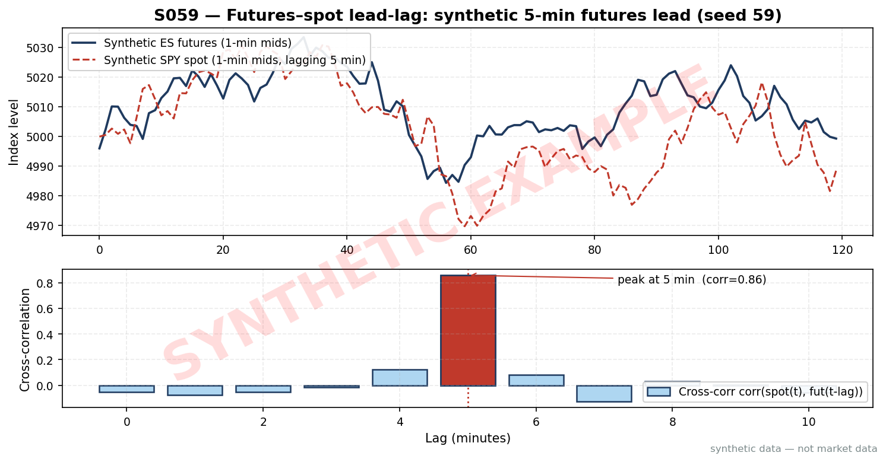
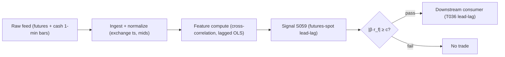

# S059 — Futures-spot lead-lag prediction

A macro headline hits; E-mini futures tick up in milliseconds while the cash index --- a weighted average of `500` [example] quotes, many stale --- lags by minutes. As constituent quotes refresh, the cash index drifts toward where futures already are. The signal: observe the futures move, predict the cash catch-up, take the laggard side. Futures lead because expressing a market view there is cheapest (Abhyankar's transaction-cost argument; Chan 1992 shows the lead survives nonsynchronous-trading correction). Mandatory: do NOT read the maximizing lag as causal; stress-test ±`50`–`100` ms [unverified] timestamp shifts. Provenance **[D]**.

> Tag law: every numeric literal in prose carries one of `[documented]
> [default] [example] [unverified] [internal-est] [measured]` (legend: Appendix
> i v1.0.0). Constants inside cited formulas inherit the formula's tag.
> Bibliographic years, volumes, pages, arXiv IDs, section numbers, rule codes
> (C1–C10), fail-safe codes (F1–F5), module IDs, and machine-parsed §0 data
> fields are identifiers, not literals, and are exempt.

## §1 Five-minute reviewer card

| Row | Value |
|---|---|
| Module | S059 — Futures-spot lead-lag prediction, v1.1.0 |
| Edge verdict | `PREDICTIVE-FEATURE-ONLY` — documented price-discovery lead; no published after-cost Sharpe for a standalone lagged-regression rule |
| After-cost | `BEFORE-COST` — A documented price-discovery fact that becomes a trade only when the predicted catch-up clears round-trip costs --- futures lead = price discovery, not an executable signal. |
| Build cost | Tier S-M · `100`–`220` h [unverified] engine envelope (chatbot lead, Q-SB6-2) |
| Data cost | Databento CME + equity feeds, Tier 2 [unverified] --- bands indicative, verify before budgeting |
| latency_class | 1-min bars; signal at bar t, earliest fill t+1 |
| risk_class | medium (directional cash leg; no order placement) |
| Capacity | `$1`–`5`M/day notional [example] --- illustrative; calibrate per venue |
| Executability | Feasible: lagged OLS on 1-min bars; Tier S-M. Sub-second needs colocation + exchange timestamps. |
| Risk summary | Timestamp artifacts (lead vanishes under ±`50`–`100` ms [unverified] shifts); stale-quote pseudo-leads; a significant regression coefficient ≠ residual > costs |
| When it dies | Sub-second horizons without colocation; macro-announcement volatility; futures rolls; the 'lead' being nothing but stale cash-index quotes |
| Regime gates | Provisional: R001 stress --- lead unstable in macro bursts; veto around scheduled prints (machine records: §S10) |
| Emits | `signal_vector` (Appendix b v1.0.0) — never orders |

## §1.5 Cheapest / least-build path

1. **Prototype hour band:** `100`–`220` h [unverified] engine envelope — lagged cross-correlation + OLS engine, timestamp/halt handling, fixture validation against the tape.
2. **Cheapest-source row** (machine-readable; cheapest data source candidate [unverified]):

```
min_tier:        "SIP-derived 1-min bars (Polygon/Alpaca) [unverified]"
latency_class:   "1-min, point-in-time adjusted"
required_fields: ["futures 1-min mid bars (exchange timestamps)", "cash index 1-min values", "futures roll calendar"]
price_band:      "Tier-1 retail [unverified] (indicative — verify before budgeting)"
build_or_buy:    "build the lagged-regression engine yourself; buy clean futures + equity bars — never buy a black-box lead-lag signal"
```

   The Tier-1 path is exploratory minute-level only; it is insufficient below `1` s [example] (see C11). Honest asynchronicity needs exchange timestamps (Tier-2, Databento GLBX.MDP3 + Cboe Global Indices Feed [documented]).
3. **Resource budget:** `1` core, `<4` GB RAM [internal-est]; compute pattern `per_bar`.
4. **Skip list:** sub-second tick engine; multi-asset lead-lag graph; Hasbrouck information-share decomposition; live colocation.
5. **DO-NOT-CUT list:** causality assertions (`assert fill_event >
   signal_event`, no-signal-bar-fills test); COST block + callable
   `expected_cost_bps`; F1–F5 fail-safes + module-state enum; decision-log
   audit records; bona-fide-intent + self-trade prevention; provenance tags on
   every numeric literal; fixtures + `test_cmd`; secrets via env only.
6. **Escalation gate** (upgrade from cheapest when ANY fires): universe >`1` index pair [default]; move to sub-minute bars; exchange timestamps become mandatory; data-entitlement-class change (§S6 data rights row); measured lead at sub-minute horizons (C11/C12). Escalation means: re-run §S2 calibration on Tier-2 exchange-timestamped data before any capital.

## §S0 Module contract

### S0.1 Typed signature

```python
def signal(state: ModuleState, events: list[Event], cfg: Config) -> SignalVector:
```

`SignalVector` per Appendix b v1.0.0. `state` is the module-owned named state
vector (`beta_hat`, `lag_hat`, `cooldown_until`, `module_state`); `events` are canonical Events
(Appendix a v1.0.0), newest last. The function handles documented edge cases:
empty events → `UNKNOWN`; non-finite returns → `UNKNOWN` (F1/F2, never interpolate); estimation window < `20` sessions [example] → `UNKNOWN` (the fixture tape exercises a `4`-bar [example] warmup floor instead — see §S4); halt/auction → freeze per the market-state table; `asof_ts − event_ts` > staleness TTL `3` s [default] → `UNKNOWN`.

### S0.2 Config dataclass

| Parameter | Type | Default | Range | Status |
|---|---|---|---|---|
| `lag_min` | int | `5` | `—` | example |
| `min_edge_bps` | float | `1.0` | `2–10` | example |
| `cost_gate_k` | float | `0.5` | `0.1–2.0` | default |

All defaults tagged per the tag law. Calibration grids + OOS selection recipes per parameter: §S2 "Calibration recipes".

### S0.3 Canonical schema mapping

Vendor columns → canonical Event schema (Appendix a v1.0.0), stated once here:

| Vendor | Canonical |
|---|---|
| ``bar` (tape)` | ``bar_id` (int)` |
| ``event_ts` (tape)` | ``event_ts` (int64 ns UTC)` |
| ``asof_ts` (tape)` | ``asof_ts` (int64 ns UTC)` |
| ``x_lag5` (tape)` | ``r_f(t-5)` (float, lagged futures return, 1e-4 units)` |
| ``y` (tape)` | ``r_s(t)` (float, cash return, 1e-4 units)` |

### S0.4 Time contract

> Time contract: clock domain UTC, int64 ns; authoritative causality clock =
> `event_ts`; max_skew = `1` ms [default]; jitter budget = `500` µs [default]
> bar-label = open time; staleness TTL = `3` s [default]; gap policy = mask, no interpolation; halt/auction
> → discard contributions across reopen.

**Timing box:** `signal@t (per_bar, America/New_York) → earliest fill @open(t+1)`

### S0.5 Market-state table

| State | Module behavior |
|---|---|
| CONTINUOUS_TRADING | Compute normally; emit per cadence |
| HALTED | Freeze state; emit `UNKNOWN`; discard contributions across reopen |
| AUCTION | No new signals; hold last `SignalVector`; state `DEGRADED` |
| CLOSED | Emit nothing; state `OFF` |

### S0.6 Module-state enum + error taxonomy

States per Appendix k v1.0.0: `OK | DEGRADED | UNKNOWN | OFF`. Invalid input →
`UNKNOWN`, never interpolate (Appendix f v1.0.0, F1–F5).

| Failure | State | Alert |
|---|---|---|
| Missing/stale input (TTL `3` s [default]) | `UNKNOWN` | page |
| Inputs out of mathematical bounds (F2) | `UNKNOWN` | page |
| `seq` gap > `1,000` events [default] | `DEGRADED` (restart windows) | log |
| Feed jitter > budget persistently | `DEGRADED` | notify |
| Halt/auction | `UNKNOWN` / `DEGRADED` (per table) | log |
| Kill/administrative disable | `OFF` | page |
| Anything unmapped | `UNKNOWN` | page |

### S0.7 Ops tail

- **Schedule:** per 1-min bar during the US equities regular session `09:30`–`16:00` America/New_York [documented]; owner: lead-lag on-call.
- **Health checks:** fixture replay (`test_cmd`) green on deploy; live
  `seq`-gap monitor; staleness watchdog at `3`× cadence.
- **Alert table:** page on `UNKNOWN` > `30` s [default] or bounds violation;
  notify on `DEGRADED`; log on single dropped events.
- **Resource budget:** `1` core, `<4` GB RAM [internal-est]; state is O(window) per symbol.
- **Runbook stub:** `1.` confirm feed (vendor status); `2.` replay fixture;
  `3.` if red → set `OFF`, page; `4.` reconcile decision log before re-arm.

### S0.8 Secrets (env-only)

`DATABENTO_API_KEY`, `POLYGON_API_KEY` via environment only. No secrets in
this file, fixtures, or logs (CI secrets-grep).

### S0.9 May / must-NOT

> **May:** emit `SignalVector` records per Appendix b v1.0.0. **Must-NOT:**
> emit orders, order intents, prices, share counts, or notionals; call a
> broker; mutate shared state outside `state`; interpolate across gaps.

## §S1 Legacy (subsumed by §1)

Legacy §S1 content is the §1 reviewer card above; this header is retained so
section numbering stays frozen.

## §S2 Specification

### Universe

US equity index futures (front month) + cash index (or liquid ETF proxy); `1`-min mids; estimation never across a futures roll.

### Entry rule (Boolean — no prose-only conditions)

```
ENTER_LONG_CASH  := (y_hat > 0 AND edge_bps > min_edge_bps) AND (expected_cost_bps(...) <= cost_gate_k * edge_bps)
ENTER_SHORT_CASH := (y_hat < 0 AND edge_bps > min_edge_bps) AND (expected_cost_bps(...) <= cost_gate_k * edge_bps)
FLAT              := otherwise

`y_hat = beta_hat * r_f(t - lag_hat)`; `edge_bps = |y_hat| · 10000` [example] modeled per-trade edge (`1e-4` return unit × `10000` = bps; the ×`100` in v1.0.0 was wrong and made the cost gate unsatisfiable on the fixture tape).
```

### Exits (with post-exit cooldown)

```
EXIT := (direction == +1 AND y_hat < 0) OR (direction == -1 AND y_hat > 0)   # [example] prediction flipped
        OR (bars_held >= max_hold) OR (module_state != OK)                               # [example] 30-min time stop; flat by close
ON_EXIT: cooldown_until = now + cooldown_s   # 60 s [default]; C10
```

### Position sizing (fenced function)

```python
def size_shares(risk_budget_R, stop_distance, vol_estimate, ADV_cap, cost):
    # S-module requests capital fraction only; share math lives in the strategy.
    # Reference: capital = 0.5 * confidence  (confidence in [0,1])  [default]
    risk_notional = risk_budget_R * 0.5 * confidence          # [default] 0.5 factor
    shares = risk_notional / max(stop_distance, 1e-9)
    return int(min(shares, ADV_cap * adv_shares * 0.001))     # 0.1% ADV cap [default]
```

### Risk limits

| Limit | Value |
|---|---|
| Max capital fraction per signal | `0.3` [default] |
| Max hold | `30` min [example]; flat by close |
| Cost filter | `edge_bps >= min_edge_bps` before cost gate |
| Staleness kill | TTL `3` s [default] → `UNKNOWN` |

### COST block (single source of truth)

| Component | Value (bps) | Basis |
|---|---|---|
| Spread (cash-leg half-spread) | `0.50` | [example] — reference stack |
| Fees (taker fee incl. regulatory) | `0.30` | [example] — reference stack |
| Borrow (long-only reference) | `0.00` | [default] — reason: long-only reference |
| Impact (cash-leg fill slippage) | `0.50` | [example] — reference stack |
| **Total reference** | `1.30` | [example] |

`fee_schedule_as_of`: `2026-09-01 [unverified]` — placeholder; pin the real
venue schedule before production. `side: taker` [default]; venue/tier/source:
XNAS [example]. Re-stating cost numbers outside this block is a validation failure.

```python
def expected_cost_bps(notional, adv_pct, venue, side, urgency) -> float:
    """Callable cost model — reference stack for S059."""
    spread_bps = 0.50   # cash-leg half-spread [example]
    fee_bps = 0.30      # taker fee incl. regulatory [example]
    borrow_bps = 0.00   # reason: long-only reference [default]
    impact_bps = 0.50   # cash-leg fill slippage [example]
    return spread_bps + fee_bps + borrow_bps + impact_bps
```

### Execution / fill model table

| Aspect | Assumption |
|---|---|
| Latency | Signal computed at bar t close; intent at t+1 [example] |
| Partial fills | Cash-basket legs async --- leg slippage captured in impact [example] |
| Impact | `0.50` bps reference [example]; stress ×`3` [example] |
| Adverse fill | News-burst haircut on event bars [example] |

### Robustness

Use midquote returns so the measured lead is not the futures bid-ask bounce. Never estimate ℓ across a futures roll. Hedge the cash leg in beta-equivalent units. If the lead vanishes under ±`50`–`100` ms [unverified] timestamp shifts, it is a timestamp artifact, not a monetizable non-colocated edge.

### Compliance sub-block (C1–C10+)

| Code | Rule: trigger → check → action → log |
|---|---|
| C1 | Self-match prevention: signal module emits no orders; downstream T-modules must set self-trade-prevention flags — S059 asserts the requirement in its `consumes` contract |
| C2 | Bona-fide intent: every emitted `SignalVector` with |direction|=`1` must pass the cost gate; sub-threshold readings emit direction `0`, never a tradeable hint |
| C3 | Message-rate: `≤100` emissions/symbol/s [default]; breach → throttle to `1`/s [default] + alert |
| C4 | Fat-finger trio (applied by consumers; S059 bounds its own outputs): confidence ∈ [`0`,`1`], capital ∈ [`0`,`0.5`], computed_at sane — out-of-bounds → `UNKNOWN` (F2) |
| C5 | Decision log: every emission, veto, and state transition logged per Appendix g v1.0.0, hash-chained |
| C6 | Halt/auction: per §S0.5 market-state table; contributions across reopen discarded |
| C7 | Locate check: SHORT direction requires `locate_ok` from the consumer; S059 never emits SHORT without the consumer asserting locate (Reg-SHO threshold securities → direction `0`) |
| C8 | Public dissemination: no signal values published externally without review gate |
| C9 | Data entitlements: per §S6 Data rights row; entitlement-class change → §1.5 escalation gate |
| C10 | Post-exit cooldown: `60 s` [default] after any exit or compliance block; no re-entry |
| C11 | Timestamp provenance: exchange timestamps required for sub-minute leads; SIP timestamps flagged as insufficient below `1` s [example]. --- trigger → check → action → log: prevents timestamp-artifact pseudo-leads |
| C12 | Causality certification: the maximizing lag must survive ±`50`–`100` ms [unverified] timestamp-shift stress before any capital. --- trigger → check → action → log: prevents monetizing feed-latency artifacts |

### Parameter table

| Parameter | Symbol | Value | Tag | Sensitivity |
|---|---|---|---|---|
| Lead-lag (min) | `lag_min` | `5` | [example] | high |
| Sampling | `sampling` | `1-min mids` | [example] | medium |
| Estimation window | `window` | `20 sessions` | [example] | medium |
| Cost filter (bps) | `min_edge_bps` | `1.0` | [example] | high |
| Max hold | `max_hold` | `30 min` | [example] | low |
| Cost-gate k | `cost_gate_k` | `0.5` | [default] | medium |

### Calibration recipes (per parameter — grid + OOS selection)

Calibration is offline; calibrated values keep status `example` until locked in production config, then `fixed`. All grids below are [example] starting points.

- **`lag_min`** (minutes). Grid: {`1`, `2`, `3`, `5`, `8`, `13`, `20`} [example]. Procedure: for each grid value, fit through-origin OLS on rolling `20`-session [example] estimation windows stepped `1` session [example]; score on the next `5` sessions [example] with a `5`-session [example] embargo between fit and score windows (no shared bars). Metric: mean OOS net-of-cost edge per trade = mean(`edge_bps` − `expected_cost_bps(...)`) over bars passing the cost filter. Selection: argmax of the metric; require ≥`100` [example] OOS trades; tie-break: smaller lag (fewer microstructure artifacts). If the argmax is unstable under the ±`50`–`100` ms [unverified] timestamp-shift stress (C12), fall back to the next-ranked stable lag.
- **`min_edge_bps`** (cost filter). Grid: {`0.5`, `1.0`, `2.0`, `3.0`, `5.0`} [example]. Procedure: walk-forward over `6`-month [example] folds (train `12` months [example], test `6` months [example], `1`-month [example] embargo). Metric: after-cost Sharpe of gated trades per fold, computed at FULL-COST level. Selection: argmax of mean fold Sharpe; require ≥`100` [example] trades per fold; stability check: must be top-quartile in ≥`3` of `4` [example] folds, else pick the most stable runner-up.
- **`cost_gate_k`** (fee-covering multiplier). Grid: {`0.25`, `0.5`, `1.0`} [default]. Procedure: same walk-forward as `min_edge_bps`. Metric: after-cost net PnL. Selection: start at `0.5` [default] (session-05 open item: `0.5` [default] vs `2` [example] unresolved — `2` is rejected here because no OOS evidence supports it yet); escalate only if OOS shows systematic edge leakage (profitable trades blocked by the gate in ≥`3` consecutive folds [example]); never below `0.25` [default] without re-measuring the cost stack (Session 02: cheapest build = constant stack + callable wrapper from day one, impact=`0` flagged `[example]`).

### Timing box

`signal@t (per_bar, America/New_York) → earliest fill @open(t+1)`

## §S3 Math + normative pseudocode

Lead-lag cross-correlation at lag ℓ (ℓ > 0 means futures lead), then the lagged predictive regression in tradable form:

$$\rho(\ell) = Corr(r_s(t), r_f(t-\ell)), \qquad \hat\ell = argmax_\ell\,\rho(\ell).$$

$$r_s(t) = \alpha + \beta\cdot r_f(t-\hat\ell) + \varepsilon(t).$$

Trade rule: enter long the cash leg if $|\hat\beta\cdot r_f(t-\hat\ell)| \ge c$ (cost filter); flatten by close. Hasbrouck (1995) information share confirms the futures venue is the price-discovery venue before trading the lag.

**Normative pseudocode** (pseudocode is normative; prose is commentary). The
cost gate is a **veto predicate** (blocks the entry, never raises); causality
is an **executable assertion** (`earliest_fill_ts > signal_ts`); timestamp
honesty (C11/C12) is a **calibration-time gate**, not a per-bar check.

```
function signal(state, bars, cfg) -> SignalVector:
    require len(bars) >= 1 else return UNKNOWN                          # F1
    b = bars[-1]
    if b.market_state == HALTED: return UNKNOWN                        # §S0.5: freeze, discard across reopen
    if (b.asof_ts - b.event_ts) > 3_000_000_000: return UNKNOWN         # staleness TTL 3 s [default]
    require no non-finite returns in window else return UNKNOWN        # F2, never interpolate
    require window >= 20 sessions [example] else return UNKNOWN        # fixture: 4-bar [example] floor (§S4)
    lag_hat = argmax_{l in {1..20} min [example]} rho(l)               # midquote returns; never across a roll
    # C12 (calibration gate): argmax lag must survive ±50–100 ms [unverified]
    # timestamp shifts at calibration time; per-bar uses the pinned lag_hat.
    sx2 = SUM(x_i^2); sxy = SUM(x_i * y_i)
    beta_hat = sxy / sx2 if sx2 > 0 else 0.0                          # [default] degenerate-window fallback
    y_hat = beta_hat * r_f(t - lag_hat)
    edge_bps = |y_hat| * 10000                                         # [example] 1e-4 units → bps
    dir = +1 if (y_hat > 0 and edge_bps > cfg.min_edge_bps) \
          else -1 if (y_hat < 0 and edge_bps > cfg.min_edge_bps) else 0
    cost_ok = expected_cost_bps(notional=1.0 [example], adv_pct=0.001 [example],
                                venue="XNAS" [example], side="taker" [default],
                                urgency="normal" [example]) \
              <= cfg.cost_gate_k * edge_bps
    if dir != 0 and not cost_ok: dir = 0                               # cost gate vetoes, never raises
    signal_ts = b.event_ts
    earliest_fill_ts = signal_ts + 60_000_000_000                      # t+1 open; 60 s [example] cadence
    assert earliest_fill_ts > signal_ts                                # causality: no signal-bar fills
    conf = min(1.0, edge_bps / cfg.min_edge_bps - 1.0) if dir != 0 else 0.0
    return SignalVector(dir, conf, 0.5 * conf, event_ts=signal_ts, state=OK)
```

Causality: The regression uses $r_f(t-\hat\ell)$ known at $t$; the earliest executable cash trade is at $t+1$ (first post-signal quote). Mandatory unit test: no-signal-bar fills. Calibration-time gates (not per-bar): C12 timestamp-shift stress on the argmax lag; ℓ re-estimated on `20`-session [example] rolling windows (§S2 calibration recipes).

## §S4 Worked example (fixture-backed)

- Tape: `modules/fixtures/S059_tape.csv` — `# TYPE: validation-run`;
  `8` rows (`8`-bar [example] synthetic tape (1e-4 return units); x = r_f(t-`5`), y = r_s(t); through-origin OLS), all numbers synthetic,
  seed `59` [example]; `event_ts`/`asof_ts` int64 ns UTC.
- Expected outputs: `modules/fixtures/S059_expected.csv` — per-bar `beta`, `y_hat`, `resid`.
- Tolerance: `1e-9 [default]` on floats; integers exact.
- Hand-checks: through-origin β̂ = `0.7594339623` [measured] (= `322`/424, Sxy=`322`e-8 [measured], Sxx=`424`e-8 [measured]); x′ε = `0` (through-origin orthogonality, not zero residual sum).
- Acceptance tests (`modules/tests/test_S059.py`, `11` tests):
  `1.` fixture recomputes to expected (through-origin β̂ hand-check; x′ε=0)
  `2.` stub emits valid `SignalVector` (direction ∈ {+1,-1,0}, confidence/capital ∈ [0,1]; warmup floor: first `3` prefixes → `UNKNOWN`)
  `3.` no-signal-bar fills (`fill_event_ts > computed_at`; `computed_at` == signal bar's `event_ts`, no lookahead)
  `4.` cost-gate predicate passes on large edge, blocks on tiny edge (`k = 0.5` [default])
  `5.` invalid input (non-finite return) → `UNKNOWN`
  `6.` cost-gate veto on the tape: full-tape β̂, bar-`3` edge ≈ `2.2783` bps [measured] < gate → direction `0` (pins the ×`10000` conversion)
  `7.` full-tape direction/confidence vector pinned: [`+1`,`-1`,`+1`,`0`,`+1`,`-1`,`+1`,`+1`], confidence `1.0` on entries
  `8.` halted input → `UNKNOWN`
  `9.` stale input (`asof_ts − event_ts` > `3` s [default]) → `UNKNOWN`
  `10.` empty events → `UNKNOWN`
  `11.` causality: earliest fill at t+1 open (`+60` s [example]) is strictly after `computed_at`
- `test_cmd`: `python3 -m pytest modules/tests/test_S059.py -q` → exits `0`.

**Where the example is optimistic:** `8` synthetic bars [example], synchronous grid, no bid-ask bounce --- demonstrates the lagged-regression arithmetic, not a backtest. The stub applies a `4`-bar [example] warmup floor because the `8`-bar tape cannot satisfy the `20`-session production window rule (§S3) --- the floor is fixture-scoped, not production behavior.

## §S5 Strategies that use this signal

| Strategy | Role |
|---|---|
| T036 — Cross-Asset Lead-Lag (Hayashi-Yoshida) | Primary trigger: trades the laggard from the leader's move with futures-spot confirmation (consumes S060, S059, S083) |
| T009 — ETF-vs-Basket Arbitrage | Confirmation/cost gate: creation/redemption dislocations confirmed by futures-spot lead-lag before execution |
| T065 — Open-Auction Imbalance Continuation | Confirmation: opening-auction imbalance pressure confirmed by futures-spot lead-lag |

## §S6 Data required

| Field | Type | Granularity | Source tier | Required fields | Price band | Notes |
|---|---|---|---|---|---|---|
| Index futures trades/quotes | float/int | ticks or 1-s/1-min bars | Tier 2 (CME) | Databento `GLBX.MDP3`, schema `ohlcv-1m` [documented]: `ts_event` (exchange ts), open/high/low/close, volume | Tier-2 [unverified] | exchange timestamps; front-month contract; never estimate ℓ across a roll |
| Cash index values | float | 1-s/1-min | Tier 1–2 | Cboe Global Indices Feed (CGIF) [documented]: index symbol, value, dissemination timestamp | Tier-1/2 [unverified] | dissemination frequency is index-dependent (once per second to once per day) [documented]; know the vendor's staleness/rounding rules |
| Constituent quotes (basket hedge) | float/int | 1-min bars | Tier 1 | Polygon Stocks v3 aggregates [unverified]: symbol, open/high/low/close, volume, `t` (exchange ts) | Tier-1 retail [unverified] | only if executing the cash leg as a basket |
| Corporate actions / index membership | reference | daily | Tier 0–1 | action type, effective date, symbol | Tier-0/1 [unverified] | rebalances change the cash leg |
| Futures roll calendar | reference | per expiry | Tier 0 | contract, first-notice / last-trade dates | Tier-0 [unverified] | never estimate ℓ across a roll |

Price bands are indicative — verify against the vendor fee schedule before budgeting (§1.5 escalation gate).

**Data rights row** (Appendix j v1.0.0): Futures + equity data via Databento / Polygon, `rights: licensed`; license scope = research + stated production symbol count; raw ticks never leave our systems --- fixtures are synthetic; entitlement-class change → §1.5 escalation gate.

## §S7 Local build (M5 Max / 128 GB)

Feasible. Lagged OLS on 1-min bars is trivial compute --- milliseconds per window [internal-est]; the working set is megabytes. The difficulty is timestamp honesty, not compute. Stack: Python + polars.

## §S8 Buy vs build

Build the lagged-regression engine yourself; buy clean futures + equity bars --- never buy a black-box lead-lag signal. Indicative bands: SIP-derived `1`-min bars (Polygon/Alpaca) Tier-`1` retail [unverified] --- cheap, exploratory minute-level, insufficient below `1` s; Databento CME + equity feeds, exchange-timestamped, Tier-`2` [unverified] --- honest asynchronicity, cost; still need basket execution.

## §S9 Efficacy — documented evidence

| Study / source | Market & period | Metric | Before/after cost | Caveat |
|---|---|---|---|---|
| Kawaller, Koch & Koch (1987) [documented] | S&P 500 futures vs cash | futures lead the cash index by minutes | empirical | 1980s market structure |
| Chan (1992) [documented] | US index futures/cash | lead survives nonsynchronous-trading correction --- not just stale quotes | empirical | statistical lead, not a trading rule |
| Hasbrouck (1995) [documented] | multi-venue | information-share attribution: price discovery concentrates in the low-cost venue | methodology | attribution tool, not a signal |
| Fleming, Ostdiek & Whaley (1996) [documented] | stock/futures/options | price discovery concentrates where trading costs are lowest | empirical | cross-venue, not intraday timing |

**Honest bottom line.** The documented evidence establishes the lead-lag as a price-discovery fact (Kawaller et al. 1987; Chan 1992), not an after-cost trading rule. A significant `5`-minute [example] coefficient does not imply a residual larger than costs --- report the predicted-catch-up distribution net of two half-spreads + fees, the fraction of bars clearing the cost filter, and timestamp-shift stress results, never regression t-stats alone.

## §S10 Failure modes & pitfalls

| # | Trigger → Detect → Action → Recovery | check: |
|---|---|---|
| 1 | Timestamp artifacts → SIP/latency masquerading as lead → detect: ±`50`–`100` ms [unverified] shift stress → action: require exchange timestamps (C11) → recovery: colocate or drop sub-second | ``timestamp_source == exchange`` |
| 2 | Stale-quote pseudo-lead → cash staleness, not prediction → detect: quote-age audit on cash leg → action: midquote returns; freshness gate → recovery: use fresher cash proxy | ``cash_quote_age <= 1 s` [example]` |
| 3 | Coefficient ≠ profit → significant β, residual < costs → detect: cost filter c on expected move → action: trade only |β·r_f| ≥ c → recovery: widen c or stand down | ``edge_bps >= min_edge_bps`` |
| 4 | Futures roll contamination → ℓ estimated across roll → detect: roll-calendar audit → action: never estimate across rolls → recovery: split estimation windows | ``window_crosses_roll == False`` |
| 5 | Macro-announcement volatility → lead unstable in news bursts → detect: event-calendar flag → action: veto or widen c around prints → recovery: resume post-print | ``news_veto_window == clear`` |
| 6 | Regime-dependent lead → ℓ drifts with market structure → detect: rolling ℓ̂ stability → action: re-estimate on `20`-session [example] rolling window → recovery: adapt or pause | ``lag_hat_stable == True`` |
| 7 | Bid-ask bounce lead → futures bounce misread as information → detect: midquote vs trade-price comparison → action: midquote returns only → recovery: rebuild features | ``returns_basis == midquote`` |
| 8 | Overnight gap → holding past close adds basis risk → detect: session clock → action: flatten by close (example session rule) → recovery: intraday only | ``flat_by_close == True`` |

### Regime gates — machine records (provisional; R-chapter annotation pass pending)

`§0 regime_ids: [R001]` provisional. Restrictive default: unknown regime state → veto/pause_entry.

| regime_id | direction | mechanism | condition | action | min_lag | unknown_behavior |
|---|---|---|---|---|---|---|
| R001 | degrades | macro-burst volatility destabilizes the argmax lag ℓ̂ | scheduled macro print ±`30` min [example] | veto | `0` min [example] | veto |
| R001 | degrades | stale-quote pseudo-lead inflates \|ρ(ℓ)\| in fast markets | cash-leg quote-age p99 > `1` s [example] | pause_entry | `5` min [example] | pause_entry |

## §S11 Visuals





## §S12 Source log + unverified leads

**Sources** (citable facts only):

['1. Kawaller, I. G., Koch, P. D. & Koch, T. W. (1987) [documented]. "The temporal price relationship between S&P 500 futures and the S&P 500 index." *Journal of Finance* 42(5), 1309-1329 --- futures lead cash index by minutes.', '2. Chan, K. (1992) [documented]. "A further analysis of the lead-lag relationship between the cash market and stock index futures market." *Review of Financial Studies* 5(1), 123-152 --- lead survives nonsynchronous-trading correction.', '3. Hasbrouck, J. (1995) [documented]. "One security, many markets: determining the contributions to price discovery." *Journal of Finance* 50(4), 1175-1199 --- information-share attribution across venues.', '4. Fleming, J., Ostdiek, B. & Whaley, R. E. (1996) [documented]. "Trading costs and the relative rates of price discovery in stock, futures, and option markets." *Journal of Futures Markets* --- price discovery concentrates where trading costs are lowest.', '5. Databento [documented]: CME Globex MDP 3.0 dataset (GLBX.MDP3); ohlcv-1m schema available on full history; exchange timestamps in ts_event. Verified via databento.com docs, 2026-09-11.', '6. Cboe [documented]: Cboe Global Indices Feed (CGIF) streams real-time index values incl. SPX; historical tick data via Cboe DataShop; dissemination frequency index-dependent. Verified via cboe.com, 2026-09-11.']

**Chatbot source log.** Duck.ai (GPT-5.6 Luna, anonymous, web-search assisted, 2026-09-10) answered Q-SB6-1–Q-SB6-3. Grok/Cursor answers pending (checked 2026-09-10). Chatbot output is leads, never facts.

**Unverified leads** (chatbot-only — never in evidence tables):

['- Duck.ai Q-SB6-3: lead-time monetization hierarchy; ±`50`–`100` ms [unverified] timestamp stress test (the 5-min-regression claim is a chatbot lead, not a confirmed fact).', '- Duck.ai Q-SB6-2: SIP-vs-exchange timestamp hierarchy; `100`–`220` h [unverified] engine envelope.', '- arXiv 2501.03171 (chatbot-cited, not independently verified): calendar-spread lead-lag variant.']

---

## Appendix — AI build prompt (S059)

Copy-paste into any chat agent:

> Build module **S059 — Futures-spot lead-lag prediction** per
> `notes/module-template.md` v1.0.0 and this file's §S0 contract.
> Cheapest path (§1.5): prototype `100`–`220` h [unverified] engine envelope; cheapest data
> candidate SIP-derived 1-min bars (Polygon/Alpaca) --- cheapest data source candidate [unverified]; compute pattern
> `per_bar`; skip tick engine, multi-asset graph, colocation for now.
> Implement `signal(state, events, cfg) -> SignalVector` (Appendix b v1.0.0)
> with the §S3 normative pseudocode: the cost-gate predicate
> `expected_cost_bps(...) <= k * edge_bps` is a **veto** (blocks the entry,
> never raises); `edge_bps = |y_hat| * 10000` (`1e-4` units → bps);
> executable causality assertion `earliest_fill_ts > signal_ts` (t+1 open);
> halt → `UNKNOWN`; stale (`asof_ts − event_ts` > `3` s [default]) → `UNKNOWN`;
> non-finite → `UNKNOWN`, never interpolate. Wire F1–F5 (Appendix f v1.0.0). Log decisions per Appendix g v1.0.0. Secrets via env
> only. Run the fixture `modules/fixtures/S059_tape.csv`
> (`# TYPE: validation-run`) against `modules/fixtures/S059_expected.csv`
> (tolerance `1e-9 [default]`).
> **Definition of done:** `python3 -m pytest modules/tests/test_S059.py -q`
> exits `0`. Tag every numeric literal you add with the unified enum
> (Appendix i v1.0.0); put anything unverifiable in §S12 unverified leads.
