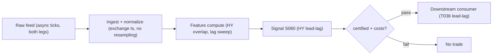

# S060 — Cross-asset lead-lag via Hayashi–Yoshida

Two assets trade at different times; forcing them onto a `1`-second [example] grid biases measured covariance toward zero (the *Epps effect*), and interpolating fabricates data. The Hayashi–Yoshida estimator sidesteps synchronization: it multiplies each X return by each Y return *only when their time intervals overlap* and sums the products --- an unbiased estimate of integrated covariance. Shift one series by lag ℓ, recompute, maximize: the maximizing lag is the measured lead-lag; trade the laggard in the leader's direction. Same mandatory framing as S059: the maximizing lag is not causal. Provenance **[D]**.

> Tag law: every numeric literal in prose carries one of `[documented]
> [default] [example] [unverified] [internal-est] [measured]` (legend: Appendix
> i v1.0.0). Constants inside cited formulas inherit the formula's tag.
> Bibliographic years, volumes, pages, arXiv IDs, section numbers, rule codes
> (C1–C10), fail-safe codes (F1–F5), module IDs, and machine-parsed §0 data
> fields are identifiers, not literals, and are exempt.

## §1 Five-minute reviewer card

| Row | Value |
|---|---|
| Module | S060 — Cross-asset lead-lag via Hayashi–Yoshida, v1.0.0 |
| Edge verdict | `PREDICTIVE-FEATURE-ONLY` — documented unbiased estimator under asynchronicity; no published after-cost Sharpe for a standalone HY-timed rule |
| After-cost | `BEFORE-COST` — A measuring tape that works on crooked clocks --- unbiased co-movement without synchronization, then S059's honesty filters before trading a millisecond of it. |
| Build cost | Tier S-M · chatbot lead Q-SB6-2 throughput envelope (labeled); cost-model Tier S-M takes precedence |
| Data cost | Exchange-timestamped ticks both legs, Tier 2 [unverified] --- bands indicative, verify before budgeting |
| latency_class | tick-level; leader move on intervals ending ≤ t, laggard entry ≥ t+1 |
| risk_class | medium (directional laggard leg; no order placement) |
| Capacity | `$1`–`5`M/day notional [example] --- illustrative; calibrate per venue |
| Executability | Feasible: two-pointer O(n+m) sweep per lag; Tier S-M. The binding constraint is timestamp honesty, not compute. |
| Risk summary | The Epps effect punishes naive fine-grid covariance; interpolation fabricates data; sub-second lead-lag is not monetizable without colocated infrastructure |
| When it dies | Microstructure-noise-dominated ticks; SIP timestamps at sub-second horizons; feed-latency pseudo-leads; illiquid legs with stale quotes |
| Regime gates | Provisional: R001 stress --- asynchronicity spikes; widen tolerance or pause sub-second estimation |
| Emits | `signal_vector` (Appendix b v1.0.0) — never orders |

## §1.5 Cheapest / least-build path

1. **Prototype hour band:** Tier S engine [internal-est] — HY overlap sweep + lag selection, tick ingestion, fixture validation against the tape.
2. **Cheapest-source row:** min_tier = Exchange-timestamped ticks, both legs --- cheapest data source candidate [unverified]; latency_class = tick, point-in-time adjusted;
   required_fields = tick trades with exchange timestamps for both legs; venue/sequence numbers; corporate-action history; price_band = Tier-2 licensing [unverified] (indicative --- verify before budgeting); build_or_buy = **build the estimator (the math is simple) on bought exchange-timestamped ticks; never buy a black-box lead-lag signal**.
3. **Resource budget:** `1` core, `<4` GB RAM [internal-est]; compute pattern `per_bar`.
4. **Skip list:** multi-asset lead-lag graph; bias-corrected inference (Hoffmann et al.); live colocated execution.
5. **DO-NOT-CUT list:** causality assertions (`assert fill_event >
   signal_event`, no-signal-bar-fills test); COST block + callable
   `expected_cost_bps`; F1–F5 fail-safes + module-state enum; decision-log
   audit records; bona-fide-intent + self-trade prevention; provenance tags on
   every numeric literal; fixtures + `test_cmd`; secrets via env only.
6. **Escalation gate:** universe >`1` pair [default]; move to tick-level live; exchange timestamps become mandatory.

## §S0 Module contract

### S0.1 Typed signature

```python
def signal(state: ModuleState, events: list[Event], cfg: Config) -> SignalVector:
```

`SignalVector` per Appendix b v1.0.0. `state` is the module-owned named state
vector (`lag_hat`, `rho_hat`, `cooldown_until`, `module_state`); `events` are canonical Events
(Appendix a v1.0.0), newest last. The function handles documented edge cases:
empty events → `UNKNOWN`; non-finite ticks → `UNKNOWN` (F1/F2, never interpolate); fewer than `2` overlapping intervals → `UNKNOWN`; halt/auction → freeze per the market-state table.

### S0.2 Config dataclass

| Parameter | Type | Default | Range | Status |
|---|---|---|---|---|
| `min_abs_hy` | float | `5.0` | `—` | example |
| `cost_gate_k` | float | `0.5` | `0.1–2.0` | default |

All defaults tagged per the tag law.

### S0.3 Canonical schema mapping

Vendor columns → canonical Event schema (Appendix a v1.0.0), stated once here:

| Vendor | Canonical |
|---|---|
| ``i` (tape)` | ``interval_id` (int)` |
| ``event_ts` (tape)` | ``event_ts` (int64 ns UTC)` |
| ``asof_ts` (tape)` | ``asof_ts` (int64 ns UTC)` |
| ``dx` (tape)` | ``ΔX` (float, X interval return)` |
| ``dy` (tape)` | ``ΔY` (float, Y interval return)` |

### S0.4 Time contract

> Time contract: clock domain UTC, int64 ns; authoritative causality clock =
> `event_ts`; max_skew = `1` ms [default]; jitter budget = `500` µs [default]
> bar-label = open time; staleness TTL = `3` s [default]; gap policy = mask, no interpolation; halt/auction
> → discard contributions across reopen.

**Timing box:** `signal@t (per_bar, America/New_York) → earliest fill @open(t+1)`

### S0.5 Market-state table

| State | Module behavior |
|---|---|
| CONTINUOUS_TRADING | Compute normally; emit per cadence |
| HALTED | Freeze state; emit `UNKNOWN`; discard contributions across reopen |
| AUCTION | No new signals; hold last `SignalVector`; state `DEGRADED` |
| CLOSED | Emit nothing; state `OFF` |

### S0.6 Module-state enum + error taxonomy

States per Appendix k v1.0.0: `OK | DEGRADED | UNKNOWN | OFF`. Invalid input →
`UNKNOWN`, never interpolate (Appendix f v1.0.0, F1–F5).

| Failure | State | Alert |
|---|---|---|
| Missing/stale input (TTL `3` s [default]) | `UNKNOWN` | page |
| Inputs out of mathematical bounds (F2) | `UNKNOWN` | page |
| `seq` gap > `1,000` events [default] | `DEGRADED` (restart windows) | log |
| Feed jitter > budget persistently | `DEGRADED` | notify |
| Halt/auction | `UNKNOWN` / `DEGRADED` (per table) | log |
| Kill/administrative disable | `OFF` | page |
| Anything unmapped | `UNKNOWN` | page |

### S0.7 Ops tail

- **Schedule:** per estimation window during the US equities regular session `09:30`–`16:00` America/New_York [documented]; owner: lead-lag on-call.
- **Health checks:** fixture replay (`test_cmd`) green on deploy; live
  `seq`-gap monitor; staleness watchdog at `3`× cadence.
- **Alert table:** page on `UNKNOWN` > `30` s [default] or bounds violation;
  notify on `DEGRADED`; log on single dropped events.
- **Resource budget:** `1` core, `<4` GB RAM [internal-est]; state is O(window) per symbol.
- **Runbook stub:** `1.` confirm feed (vendor status); `2.` replay fixture;
  `3.` if red → set `OFF`, page; `4.` reconcile decision log before re-arm.

### S0.8 Secrets (env-only)

`DATABENTO_API_KEY` via environment only. No secrets in
this file, fixtures, or logs (CI secrets-grep).

### S0.9 May / must-NOT

> **May:** emit `SignalVector` records per Appendix b v1.0.0. **Must-NOT:**
> emit orders, order intents, prices, share counts, or notionals; call a
> broker; mutate shared state outside `state`; interpolate across gaps.

## §S1 Legacy (subsumed by §1)

Legacy §S1 content is the §1 reviewer card above; this header is retained so
section numbering stays frozen.

## §S2 Specification

### Universe

Liquid pairs with genuine economic linkage (ETF-futures, ADR-ordinary); both legs liquid and exchange-timestamped; no resampling of either leg.

### Entry rule (Boolean — no prose-only conditions)

```
ENTER_LAGGARD_LONG  := (lag_hat > 0 AND leader_move > 0 AND |rho_hat| >= rho_min) AND (expected_cost_bps(...) <= cost_gate_k * edge_bps)
ENTER_LAGGARD_SHORT := (lag_hat > 0 AND leader_move < 0 AND |rho_hat| >= rho_min) AND (expected_cost_bps(...) <= cost_gate_k * edge_bps)
FLAT                := otherwise

`lag_hat = argmax rho_hat(ℓ)` over the grid; `leader_move` = X move on intervals ending ≤ t [example]; `edge_bps` modeled per-trade edge [example].
```

### Exits (with post-exit cooldown)

```
EXIT := (sign(leader_move) flipped) OR (|rho_hat| < rho_min)   # [example] lead dissolved
        OR (module_state != OK)
ON_EXIT: cooldown_until = now + cooldown_s   # 60 s [default]; C10
```

### Position sizing (fenced function)

```python
def size_shares(risk_budget_R, stop_distance, vol_estimate, ADV_cap, cost):
    # S-module requests capital fraction only; share math lives in the strategy.
    # Reference: capital = 0.5 * confidence  (confidence in [0,1])  [default]
    risk_notional = risk_budget_R * 0.5 * confidence          # [default] 0.5 factor
    shares = risk_notional / max(stop_distance, 1e-9)
    return int(min(shares, ADV_cap * adv_shares * 0.001))     # 0.1% ADV cap [default]
```

### Risk limits

| Limit | Value |
|---|---|
| Max capital fraction per signal | `0.3` [default] |
| Min |ρ̂| to trade | `0.35` [example] |
| Min overlapping intervals | `2` [example] |
| Staleness kill | TTL `3` s [default] → `UNKNOWN` |

### COST block (single source of truth)

| Component | Value (bps) | Basis |
|---|---|---|
| Spread (laggard-leg half-spread) | `0.50` | [example] — reference stack |
| Fees (taker fee) | `0.30` | [example] — reference stack |
| Borrow (long-laggard reference) | `0.00` | [default] — reason: long-laggard reference |
| Impact (laggard fill slippage) | `0.50` | [example] — reference stack |
| **Total reference** | `1.30` | [example] |

`fee_schedule_as_of`: `2026-09-01 [unverified]` — placeholder; pin the real
venue schedule before production. `side: taker` [default]; venue/tier/source:
XNAS [example]. Re-stating cost numbers outside this block is a validation failure.

```python
def expected_cost_bps(notional, adv_pct, venue, side, urgency) -> float:
    """Callable cost model — reference stack for S060."""
    spread_bps = 0.50   # laggard-leg half-spread [example]
    fee_bps = 0.30      # taker fee [example]
    borrow_bps = 0.00   # reason: long-laggard reference [default]
    impact_bps = 0.50   # laggard fill slippage [example]
    return spread_bps + fee_bps + borrow_bps + impact_bps
```

### Execution / fill model table

| Aspect | Assumption |
|---|---|
| Latency | Leader move measured on intervals ending ≤ t; laggard entry ≥ t+1 [example] |
| Partial fills | Laggard-leg async --- leg slippage captured in impact [example] |
| Impact | `0.50` bps reference [example]; stress ×`3` [example] |
| Adverse fill | Noise-regime haircut on wide-spread ticks [example] |

### Robustness

Use HY correlation (not raw covariance) so ℓ̂ is comparable across volatility regimes. Pre-average or sparse-sample under microstructure noise (Voev & Lunde 2007). On synchronous 1-minute data the procedure collapses to the S059 cross-correlation.

### Compliance sub-block (C1–C10+)

| Code | Rule: trigger → check → action → log |
|---|---|
| C1 | Self-match prevention: signal module emits no orders; downstream T-modules must set self-trade-prevention flags — S060 asserts the requirement in its `consumes` contract |
| C2 | Bona-fide intent: every emitted `SignalVector` with |direction|=`1` must pass the cost gate; sub-threshold readings emit direction `0`, never a tradeable hint |
| C3 | Message-rate: `≤100` emissions/symbol/s [default]; breach → throttle to `1`/s [default] + alert |
| C4 | Fat-finger trio (applied by consumers; S060 bounds its own outputs): confidence ∈ [`0`,`1`], capital ∈ [`0`,`0.5`], computed_at sane — out-of-bounds → `UNKNOWN` (F2) |
| C5 | Decision log: every emission, veto, and state transition logged per Appendix g v1.0.0, hash-chained |
| C6 | Halt/auction: per §S0.5 market-state table; contributions across reopen discarded |
| C7 | Locate check: SHORT direction requires `locate_ok` from the consumer; S060 never emits SHORT without the consumer asserting locate (Reg-SHO threshold securities → direction `0`) |
| C8 | Public dissemination: no signal values published externally without review gate |
| C9 | Data entitlements: per §S6 Data rights row; entitlement-class change → §1.5 escalation gate |
| C10 | Post-exit cooldown: `60 s` [default] after any exit or compliance block; no re-entry |
| C11 | Exchange timestamps required; interpolation of either leg onto a common grid is forbidden. --- trigger → check → action → log: prevents fabricated-tick bias |
| C12 | Lead certification: ℓ̂ must survive ±`50`–`100` ms [unverified] timestamp-shift stress before capital. --- trigger → check → action → log: prevents monetizing latency artifacts |

### Parameter table

| Parameter | Symbol | Value | Tag | Sensitivity |
|---|---|---|---|---|
| Lag grid | `lag_grid` | `±30 s, 100 ms steps` | [example] | high |
| Overlap tolerance | `tolerance` | `10 ms` | [example] | medium |
| Noise handling | `noise` | `pre-averaged 1-s` | [example] | medium |
| Estimation window | `window` | `1 session` | [example] | medium |
| Min |ρ̂| | `rho_min` | `0.35` | [example] | high |
| Cost-gate k | `cost_gate_k` | `0.5` | [default] | medium |

### Timing box

`signal@t (per_bar, America/New_York) → earliest fill @open(t+1)`

## §S3 Math + normative pseudocode

X observed at t_i^X with returns ΔX_i on intervals I_i^X; Y likewise. The overlap indicator is 1{I_i^X ∩ I_j^Y ≠ ∅}:

$$[X,Y]\hat{}(T,HY) = \Sigma_i\Sigma_j \Delta X_i\cdot\Delta Y_j\cdot 1\{I_i^X\cap I_j^Y\neq\emptyset\}.$$

$$\hat C_{XY}(\ell) = \Sigma_i\Sigma_j \Delta X_i\cdot\Delta Y_j\cdot 1\{I_i^X\cap (I_j^Y+\ell)\neq\emptyset\}, \qquad \hat\rho(\ell)=\hat C_{XY}(\ell)/\sqrt{\hat C_{XX}\cdot\hat C_{YY}}, \qquad \hat\ell=argmax_\ell\,\hat\rho(\ell).$$

Trading rule: if $\hat\ell>0$ (X leads), signal on Y = sign(leader move), sized by $|\hat\rho(\hat\ell)|$ and gated by costs. Two-pointer sweep: O(n+m) per lag, no O(nm) double loop.

**Normative pseudocode** (pseudocode is normative; prose is commentary):

```
function signal(state, bars, cfg) -> SignalVector:
    assert tick arrays non-empty else return UNKNOWN
    require >= 2 overlapping intervals else return UNKNOWN
    for lag in grid:                       # two-pointer O(n+m) sweep per lag
        C[lag] = sum(dx_i * dy_j for overlapping intervals i,j at shift lag)
    rho[lag] = C[lag] / sqrt(C_XX * C_YY)
    lag_hat = argmax_lag rho[lag]; rho_hat = rho[lag_hat]
    dir = sign(leader_move) if (lag_hat != 0 and |rho_hat| >= cfg.min_abs_hy) else 0
    assert expected_cost_bps(...) <= cfg.cost_gate_k * edge_bps  # cost gate
    assert fill_event > signal_event  # causality: no signal-bar fills
    conf = min(1.0, |rho_hat| / cfg.min_abs_hy - 1.0) if dir else 0.0
    return SignalVector(dir, conf, 0.5 * conf, event_ts=last_ts, state=OK)
```

Causality: The leader's move is measured on intervals ending $\le t$; the laggard entry is tradable no earlier than $t+1$. Mandatory unit test: no-signal-bar fills.

## §S4 Worked example (fixture-backed)

- Tape: `modules/fixtures/S060_tape.csv` — `# TYPE: validation-run`;
  `11` rows (`11` [example] hand-verified interval returns (X on [i,i+`1`], Y on [j+`0.5`,j+`1.5`]); lags `-1`,`0`,`+1`; positive lag = X leads), all numbers synthetic,
  seed `60` [example]; `event_ts`/`asof_ts` int64 ns UTC.
- Expected outputs: `modules/fixtures/S060_expected.csv` — per-lag `hy_m1`, `hy_0`, `hy_p1`, `chosen_lag`.
- Tolerance: `1e-9 [default]` on floats; integers exact.
- Hand-checks: HY(`0`) = `17` exact [measured] (row sums `4`+`3`+`0`-`1`+`4`+`0`+`0`+`6`+`0`-`1`+`2`); HY(`-1`) = `-7` [measured], HY(`+1`) = `15` [measured]; chosen lag `0` [measured]; the omitted [`0`,`0.5`] Y stub is treated as zero (mandatory caveat).
- Acceptance tests (`modules/tests/test_S060.py`, `5` tests):
  `1.` fixture recomputes to expected (HY(0)=17 hand-check; lag-`0` selection)
  `2.` stub emits valid `SignalVector` (direction ∈ {+1,-1,0}, confidence/capital ∈ [0,1])
  `3.` no-signal-bar fills (`fill_event_ts > computed_at`)
  `4.` cost-gate predicate passes on large edge, blocks on tiny edge (`k = 0.5` [default])
  `5.` invalid input (empty tick arrays) → `UNKNOWN`
- `test_cmd`: `python3 -m pytest modules/tests/test_S060.py -q` → exits `0`.

**Where the example is optimistic:** `11` toy integer returns [example], no microstructure noise, no timestamp error --- verifies the estimator's arithmetic, not its tradability.

## §S5 Strategies that use this signal

| Strategy | Role |
|---|---|
| T036 — Cross-Asset Lead-Lag (Hayashi-Yoshida) | Primary trigger: trades the laggard from the leader's move with futures-spot confirmation (consumes S060, S059, S083) |
| T037 — ADR / Dual-Listed Premium Convergence | Timing: fades FX-adjusted ADR premiums with HY lead-lag timing across time zones |
| T093 — Options-to-Equity Lead Trader | Filter/gate: equity entries gated on the HY lead-lag direction agreeing |

## §S6 Data required

| Field | Type | Granularity | Source tier | Notes |
|---|---|---|---|---|
| Trade prices, both legs | float | tick trades | Tier 2 | exchange timestamps --- the estimator's whole point is honest asynchronicity |
| Quote mids (noise checks) | float | ticks | Tier 2 | pre-averaging input; detects noise-dominated regimes |
| Venue / sequence numbers | int | per tick | Tier 2 | event ordering across venues |
| Corporate actions / splits | reference | daily | Tier 0–1 | unadjusted ticks corrupt returns |
| FX rates (ADR variant) | float | tick/1-min | Tier 1–2 | dual-listed premium needs FX sync |

**Data rights row** (Appendix j v1.0.0): Tick data via Databento, `rights: licensed`; license scope = research + stated production symbol count; raw ticks never leave our systems --- fixtures are synthetic; entitlement-class change → §1.5 escalation gate.

## §S7 Local build (M5 Max / 128 GB)

Feasible. The two-pointer sweep is linear per lag --- trivial compute on a laptop [internal-est]; the working set is megabytes. The binding constraint is exchange-timestamped tick licensing, not compute. Stack: Python + numpy.

## §S8 Buy vs build

Build the estimator on bought exchange-timestamped ticks; never buy a black-box lead-lag signal --- the math is simple; the data is the product. Indicative bands: Databento / exchange ticks, both legs, exchange ts, Tier-`2` [unverified] --- honest asynchronicity, licensing cost.

## §S9 Efficacy — documented evidence

| Study / source | Market & period | Metric | Before/after cost | Caveat |
|---|---|---|---|---|
| Hayashi & Yoshida (2005) [documented] | diffusion processes | the HY overlap estimator: unbiased integrated covariance under asynchronicity | methodology | estimation, not trading |
| Voev & Lunde (2007) [documented] | high-frequency data | noise-robust HY variants via pre-averaging | methodology | estimation refinement |

**Honest bottom line.** The documented evidence is the estimator's statistical validity (Hayashi & Yoshida 2005; Voev & Lunde 2007), not a trading edge. The lead-lag trading step is a practitioner construction --- sub-second lead-lag is not monetizable without colocated infrastructure. Report certified-lead hit rates with timestamp-shift stress results, never raw ρ̂ maxima alone.

## §S10 Failure modes & pitfalls

| # | Trigger → Detect → Action → Recovery | check: |
|---|---|---|
| 1 | Epps-effect naivety → fine-grid covariance underestimates co-movement → detect: compare naive vs HY → action: HY only (C11) → recovery: rebuild estimator | ``estimator == hayashi_yoshida`` |
| 2 | Interpolation fabrication → invented ticks inject bias → detect: code audit for resampling → action: forbidden (C11) → recovery: rewind to raw ticks | ``resampling == none`` |
| 3 | Microstructure-noise dominance → noise bias swamps signal → detect: noise-ratio diagnostics → action: pre-average / sparse-sample → recovery: coarsen grid | ``noise_ratio <= 0.5` [example]` |
| 4 | SIP-timestamp pseudo-leads → sub-second leads are latency → detect: ±`50`–`100` ms [unverified] stress (C12) → action: exchange ts or drop → recovery: colocate or widen horizon | ``timestamp_source == exchange`` |
| 5 | Stale-leg quotes → illiquid leg never trades → detect: quote-age monitor → action: `UNKNOWN` on stale legs → recovery: restrict to liquid pairs | ``leg_quote_age <= 1 s` [example]` |
| 6 | Causal over-reading → maximizing lag read as prediction → detect: framing review → action: label as price discovery, not signal → recovery: re-certify | ``framing == price_discovery`` |
| 7 | Multiple-testing mush → wide lag grid finds spurious maxima → detect: grid-width audit → action: restrict grid; require ρ_min → recovery: narrow grid | ``grid_width <= 60 s` [example]` |
| 8 | Async-reporting artifacts → common-news timing misread as lead → detect: news-time alignment → action: veto around prints → recovery: event-aware estimation | ``news_veto_window == clear`` |

## §S11 Visuals




## §S12 Source log + unverified leads

**Sources** (citable facts only):

['1. Hayashi, T. & Yoshida, N. (2005) [documented]. "On covariance estimation of non-synchronously observed diffusion processes." *Bernoulli* 11(2), 359-379 --- the HY overlap estimator.', '2. Voev, V. & Lunde, A. (2007) [documented]. "Integrated covariance estimation using high-frequency data." --- noise-robust HY variants (pre-averaging).', '3. Hoffmann, M., Rosenbaum, M. & Yoshida, N. [documented]. Lead-lag estimation for non-synchronous data (report citation; bias-corrected lead-lag inference).']

**Chatbot source log.** Duck.ai (GPT-5.6 Luna, anonymous, web-search assisted, 2026-09-10) answered Q-SB6-1–Q-SB6-3. Grok/Cursor answers pending (checked 2026-09-10). Chatbot output is leads, never facts.

**Unverified leads** (chatbot-only — never in evidence tables):

['- Duck.ai Q-SB6-1: HY overlap formula, lead-lag C(ℓ)/ρ̂(ℓ) construction, operator-verified 11-row worked example (grand sum 17 exact) [unverified] --- quarantined here.', '- Duck.ai Q-SB6-2: two-pointer O(n+m) throughput leads; SIP-vs-exchange timestamp hierarchy [unverified].', '- Duck.ai Q-SB6-3: lead-time monetization hierarchy; timestamp stress test [unverified].', '- arXiv 2501.03171 (chatbot-cited, not independently verified): calendar-spread near-month-leads-deferred variant.']

---

## Appendix — AI build prompt (S060)

Copy-paste into any chat agent:

> Build module **S060 — Cross-asset lead-lag via Hayashi–Yoshida** per
> `notes/module-template.md` v1.0.0 and this file's §S0 contract.
> Cheapest path (§1.5): prototype Tier S engine [internal-est]; cheapest data
> candidate Exchange-timestamped ticks, both legs --- cheapest data source candidate [unverified]; compute pattern
> `per_bar`; skip multi-asset graph, bias-corrected inference, colocation for now.
> Implement `signal(state, events, cfg) -> SignalVector` (Appendix b v1.0.0)
> with the §S3 normative pseudocode, including the cost-gate predicate
> `expected_cost_bps(...) <= k * edge_bps` and `assert fill_event >
> signal_event`. Wire F1–F5 (Appendix f v1.0.0): invalid input → `UNKNOWN`,
> never interpolate. Log decisions per Appendix g v1.0.0. Secrets via env
> only. Run the fixture `modules/fixtures/S060_tape.csv`
> (`# TYPE: validation-run`) against `modules/fixtures/S060_expected.csv`
> (tolerance `1e-9 [default]`).
> **Definition of done:** `python3 -m pytest modules/tests/test_S060.py -q`
> exits `0`. Tag every numeric literal you add with the unified enum
> (Appendix i v1.0.0); put anything unverifiable in §S12 unverified leads.
