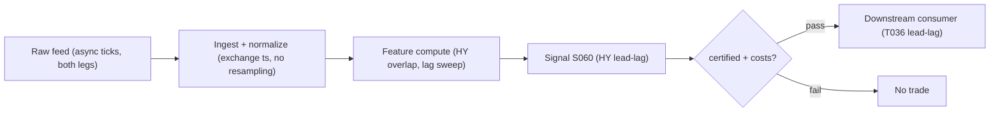

# S060 — Cross-asset lead-lag via Hayashi–Yoshida

Two assets trade at different times; forcing them onto a `1`-second [example] grid biases measured covariance toward zero (the *Epps effect*), and interpolating fabricates data. The Hayashi–Yoshida estimator sidesteps synchronization: it multiplies each X return by each Y return *only when their time intervals overlap* and sums the products --- an unbiased estimate of integrated covariance. Shift one series by lag ℓ, recompute, maximize: the maximizing lag is the measured lead-lag; trade the laggard in the leader's direction. Same mandatory framing as S059: the maximizing lag is not causal. Provenance **[D]**.

> Tag law: every numeric literal in prose carries one of `[documented]
> [default] [example] [unverified] [internal-est] [measured]` (legend: Appendix
> i v1.0.0). Constants inside cited formulas inherit the formula's tag.
> Bibliographic years, volumes, pages, arXiv IDs, section numbers, rule codes
> (C1–C10), fail-safe codes (F1–F5), module IDs, and machine-parsed §0 data
> fields are identifiers, not literals, and are exempt.

## §1 Five-minute reviewer card

| Row | Value |
|---|---|
| Module | S060 — Cross-asset lead-lag via Hayashi–Yoshida, v1.1.0 |
| Edge verdict | `PREDICTIVE-FEATURE-ONLY` — documented unbiased estimator under asynchronicity; no published after-cost Sharpe for a standalone HY-timed rule |
| After-cost | `BEFORE-COST` — A measuring tape that works on crooked clocks --- unbiased co-movement without synchronization, then S059's honesty filters before trading a millisecond of it. |
| Build cost | Tier S-M · `20`–`40` h [internal-est] · $3k–$6k loaded [internal-est] |
| Data cost | Research: Databento usage-based historical — GLBX.MDP3 `trades` `$28.00`/GB, DBEQ.BASIC `trades` `$16.00`/GB [documented 2024-12-11]; live: CME Standard `$179`/mo [documented 2025-04-16] — verify current pricing before budgeting |
| latency_class | tick-level; leader move on intervals ending ≤ t, laggard entry ≥ t+1 |
| risk_class | medium (directional laggard leg; no order placement) |
| Capacity | `$1`–`5`M/day notional [example] --- illustrative; calibrate per venue |
| Executability | Feasible: two-pointer O(n+m) sweep per lag; Tier S-M. The binding constraint is timestamp honesty, not compute. |
| Risk summary | The Epps effect punishes naive fine-grid covariance; interpolation fabricates data; sub-second lead-lag is not monetizable without colocated infrastructure |
| When it dies | Microstructure-noise-dominated ticks; SIP timestamps at sub-second horizons; feed-latency pseudo-leads; illiquid legs with stale quotes |
| Regime gates | Provisional: R001 stress — asynchronicity spikes; widen tolerance or pause sub-second estimation (machine records in §S2) |
| Emits | `signal_vector` (Appendix b v1.0.0) — never orders |

## §1.5 Cheapest / least-build path

1. **Prototype hour band:** `20`–`40` h [internal-est] — HY overlap sweep + lag selection, tick ingestion, fixture validation against the tape; Tier S-M per §1.
2. **Cheapest-source row:** min_tier = Tier 2 (Databento usage-based historical; no live subscription needed for calibration); latency_class = tick, point-in-time adjusted;
   required_fields = tick trades with **exchange** timestamps for both legs (`ts_event` int64 ns, price, size, instrument_id/symbology) + venue/sequence numbers + corporate-action history; price_band = research `$16.00`–`28.00`/GB historical usage-based [documented 2024-12-11], live CME Standard `$179`/mo [documented 2025-04-16] (indicative — verify before budgeting); build_or_buy = **build the estimator (the math is simple) on bought exchange-timestamped ticks; never buy a black-box lead-lag signal**.
3. **Resource budget:** `1` core, `<4` GB RAM [internal-est]; compute pattern `per_bar`.
4. **Skip list:** multi-asset lead-lag graph; bias-corrected inference (Hoffmann et al. 2013); live colocated execution.
5. **DO-NOT-CUT list:** causality assertions (`assert fill_event >
   signal_event`, no-signal-bar-fills test); COST block + callable
   `expected_cost_bps`; F1–F5 fail-safes + module-state enum; decision-log
   audit records; bona-fide-intent + self-trade prevention; provenance tags on
   every numeric literal; fixtures + `test_cmd`; secrets via env only.
6. **Escalation gate:** universe >`1` pair [default]; move to tick-level live; exchange timestamps become mandatory; fee-schedule or entitlement-class change → re-pin `fee_schedule_as_of` and re-run the cost-gate calibration.

## §S0 Module contract

### S0.1 Typed signature

```python
def signal(state: ModuleState, events: list[Event], cfg: Config) -> SignalVector:
```

`SignalVector` per Appendix b v1.0.0. `state` is the module-owned named state
vector (`lag_hat`, `rho_hat`, `cooldown_until`, `module_state`); `events` are canonical Events
(Appendix a v1.0.0), newest last, each carrying `ts_source` ∈ {`exchange`, `sip`, ...}.
The function handles documented edge cases:
empty events → `UNKNOWN`; `ts_source != exchange` → `UNKNOWN` (C11); non-finite ticks → `UNKNOWN` (F1/F2, never interpolate); fewer than `2` overlapping intervals → `UNKNOWN`; halt/auction → freeze per the market-state table.

### S0.2 Config dataclass

| Parameter | Type | Default | Range | Status |
|---|---|---|---|---|
| `rho_min` | float | `0.35` | `0.10–0.90` | calibrate |
| `cost_gate_k` | float | `0.5` | `0.1–2.0` | default |
| `lag_grid_max_s` | float | `30.0` | `1.0–300.0` | calibrate |
| `lag_grid_step_ms` | float | `100.0` | `1.0–1000.0` | calibrate |
| `tolerance_ms` | float | `10.0` | `0.0–100.0` | calibrate |
| `noise_mode` | str | `preaverage` | {`raw`, `preaverage`, `sparse`} | calibrate |
| `window` | str | `1_session` | {`1_session`, `5_day`, `21_day`} | calibrate |
| `cooldown_s` | float | `60.0` | `0–600` | default |

All defaults tagged per the tag law. **Fix note (v1.1.0):** the v1.0.0 `min_abs_hy = 5.0`
[example] was in HY-covariance units while the decision layer compares |ρ̂| ∈
[`-1`,`1`]; it is removed and the gate is unified on `rho_min` (correlation
scale). See the 1.1.0 changelog entry.

### S0.3 Canonical schema mapping

Vendor columns → canonical Event schema (Appendix a v1.0.0), stated once here:

| Vendor | Canonical |
|---|---|
| ``i` (tape)` | ``interval_id` (int)` |
| ``event_ts` (tape)` | ``event_ts` (int64 ns UTC)` |
| ``asof_ts` (tape)` | ``asof_ts` (int64 ns UTC)` |
| ``dx` (tape)` | ``ΔX` (float, X interval return)` |
| ``dy` (tape)` | ``ΔY` (float, Y interval return)` |
| ``ts_source` (tape)` | ``ts_source` (str: `exchange`\|`sip`\|...) — `exchange` required by C11; value `exchange` on every fixture row [example] |

### S0.4 Time contract

> Time contract: clock domain UTC, int64 ns; authoritative causality clock =
> `event_ts`; max_skew = `1` ms [default]; jitter budget = `500` µs [default]
> bar-label = open time; staleness TTL = `3` s [default]; gap policy = mask, no interpolation; halt/auction
> → discard contributions across reopen.

**Timing box:** `signal@t (per_bar, America/New_York) → earliest fill @open(t+1)`

### S0.5 Market-state table

| State | Module behavior |
|---|---|
| CONTINUOUS_TRADING | Compute normally; emit per cadence |
| HALTED | Freeze state; emit `UNKNOWN`; discard contributions across reopen |
| AUCTION | No new signals; hold last `SignalVector`; state `DEGRADED` |
| CLOSED | Emit nothing; state `OFF` |

### S0.6 Module-state enum + error taxonomy

States per Appendix k v1.0.0: `OK | DEGRADED | UNKNOWN | OFF`. Invalid input →
`UNKNOWN`, never interpolate (Appendix f v1.0.0, F1–F5).

| Failure | State | Alert |
|---|---|---|
| Missing/stale input (TTL `3` s [default]) | `UNKNOWN` | page |
| Inputs out of mathematical bounds (F2) | `UNKNOWN` | page |
| `ts_source != exchange` (C11) | `UNKNOWN` | page |
| Overlapping intervals < `2` | `UNKNOWN` | page |
| `seq` gap > `1,000` events [default] | `DEGRADED` (restart windows) | log |
| Feed jitter > budget persistently | `DEGRADED` | notify |
| Halt/auction | `UNKNOWN` / `DEGRADED` (per table) | log |
| Kill/administrative disable | `OFF` | page |
| Anything unmapped | `UNKNOWN` | page |

### S0.7 Ops tail

- **Schedule:** per estimation window during the US equities regular session `09:30`–`16:00` America/New_York [documented]; owner: lead-lag on-call.
- **Health checks:** fixture replay (`test_cmd`) green on deploy; live
  `seq`-gap monitor; staleness watchdog at `3`× cadence.
- **Alert table:** page on `UNKNOWN` > `30` s [default] or bounds violation;
  notify on `DEGRADED`; log on single dropped events.
- **Resource budget:** `1` core, `<4` GB RAM [internal-est]; state is O(window) per symbol.
- **Runbook stub:** `1.` confirm feed (vendor status); `2.` replay fixture;
  `3.` if red → set `OFF`, page; `4.` reconcile decision log before re-arm.

### S0.8 Secrets (env-only)

`DATABENTO_API_KEY` via environment only. No secrets in
this file, fixtures, or logs (CI secrets-grep).

### S0.9 May / must-NOT

> **May:** emit `SignalVector` records per Appendix b v1.0.0. **Must-NOT:**
> emit orders, order intents, prices, share counts, or notionals; call a
> broker; mutate shared state outside `state`; interpolate across gaps.

## §S1 Legacy (subsumed by §1)

Legacy §S1 content is the §1 reviewer card above; this header is retained so
section numbering stays frozen.

## §S2 Specification

### Universe

Liquid pairs with genuine economic linkage (ETF-futures, ADR-ordinary); both legs liquid and exchange-timestamped; no resampling of either leg.

### Entry rule (Boolean — no prose-only conditions)

```
ENTER_LAGGARD_LONG  := (lag_hat > 0 AND leader_move > 0 AND |rho_hat| >= cfg.rho_min) AND (expected_cost_bps(notional, adv_pct, venue, side, urgency) <= cfg.cost_gate_k * edge_bps)
ENTER_LAGGARD_SHORT := (lag_hat > 0 AND leader_move < 0 AND |rho_hat| >= cfg.rho_min) AND (expected_cost_bps(notional, adv_pct, venue, side, urgency) <= cfg.cost_gate_k * edge_bps)
FLAT                := otherwise

`lag_hat = argmax_ℓ ρ̂(ℓ)` over the grid `±cfg.lag_grid_max_s` s at `cfg.lag_grid_step_ms` ms steps (deterministic tie-break: smallest |ℓ|, then ℓ>0); `leader_move` = last X interval return on intervals ending ≤ t; `edge_bps = 100·max(0, |ρ̂| − cfg.rho_min)` modeled per-trade edge [example]; `notional`/`adv_pct`/`venue`/`side`/`urgency` taken from the trade context [example].
```

### Exits (with post-exit cooldown)

```
EXIT := (sign(leader_move) flipped) OR (|rho_hat| < cfg.rho_min)   # [example] lead dissolved
        OR (module_state != OK)
ON_EXIT: cooldown_until = now + cfg.cooldown_s   # 60 s [default]; C10
```

### Position sizing (fenced function)

```python
def size_shares(risk_budget_R, stop_distance, vol_estimate, ADV_cap, cost):
    # S-module requests capital fraction only; share math lives in the strategy.
    # Reference: capital = 0.5 * confidence  (confidence in [0,1])  [default]
    risk_notional = risk_budget_R * 0.5 * confidence          # [default] 0.5 factor
    shares = risk_notional / max(stop_distance, 1e-9)
    return int(min(shares, ADV_cap * adv_shares * 0.001))     # 0.1% ADV cap [default]
```

### Risk limits

| Limit | Value |
|---|---|
| Max capital fraction per signal | `0.3` [default] |
| Min |ρ̂| to trade | `0.35` [example] |
| Min overlapping intervals | `2` [example] |
| Staleness kill | TTL `3` s [default] → `UNKNOWN` |

### COST block (single source of truth)

| Component | Value (bps) | Basis |
|---|---|---|
| Spread (laggard-leg half-spread) | `0.50` | [example] — reference stack |
| Fees (taker fee) | `0.30` | [example] — reference stack |
| Borrow (long-laggard reference) | `0.00` | [default] — reason: reference leg is long-only; borrow applies only if the consumer shorts the laggard (then re-pin this row) |
| Impact (laggard fill slippage) | `0.50` | [example] — reference stack |
| **Total reference** | `1.30` | [example] |

`fee_schedule_as_of`: `2026-09-01 [unverified]` — placeholder; pin the real
venue schedule before production. `side: taker` [default]; venue/tier/source:
XNAS [example]. Cost-level token: this module is a signal; the stack is the
reference for the §S2 entry-rule gate only (BEFORE-COST signal per §1) — the
consumer's strategy module owns the full cost model. The constant stack is the
Session-02 L2 cheapest build: pinned to `adv_pct ≤ 0.1`% [example]; beyond that
the consumer's impact model governs. Re-stating cost numbers outside this block is a validation failure.

```python
def expected_cost_bps(notional, adv_pct, venue, side, urgency) -> float:
    """Callable cost model — reference stack for S060."""
    spread_bps = 0.50   # laggard-leg half-spread [example]
    fee_bps = 0.30      # taker fee [example]
    borrow_bps = 0.00   # reason: long-laggard reference [default]
    impact_bps = 0.50   # laggard fill slippage [example]
    return spread_bps + fee_bps + borrow_bps + impact_bps
```

### Execution / fill model table

| Aspect | Assumption |
|---|---|
| Latency | Leader move measured on intervals ending ≤ t; laggard entry ≥ t+1 [example] |
| Partial fills | Laggard-leg async --- leg slippage captured in impact [example] |
| Impact | `0.50` bps reference [example]; stress ×`3` [example] |
| Adverse fill | Noise-regime haircut on wide-spread ticks [example] |

### Robustness

Use HY correlation (not raw covariance) so ℓ̂ is comparable across volatility regimes. Pre-average or sparse-sample under microstructure noise (Voev & Lunde 2007). On synchronous 1-minute data the procedure collapses to the S059 cross-correlation.

### Regime gates (machine records)

| regime_id | direction | mechanism | condition | action | min_lag | unknown_behavior |
|---|---|---|---|---|---|---|
| R001 (provisional) | degrades | stress → asynchronicity spikes, wide spreads, stale quotes | `spread_regime == wide` OR `overlap_count < 10` [example] | pause_entry | `1` session [example] | veto |
| R001 (provisional) | degrades | stress → SIP/consolidated timestamps dominate at sub-second horizons | `ts_source_mix < 0.9` exchange [example] | widen_stops | `1` session [example] | veto |
| (unmapped) | — | any regime not listed above | — | veto | — | veto |

Restrictive default: unmapped regimes → `veto`; `unknown_behavior = veto` on every row. Machine records are the contract; §1 carries the one-line summary only.

### Compliance sub-block (C1–C10+)

| Code | Rule: trigger → check → action → log |
|---|---|
| C1 | Self-match prevention: signal module emits no orders; downstream T-modules must set self-trade-prevention flags — S060 asserts the requirement in its `consumes` contract |
| C2 | Bona-fide intent: every emitted `SignalVector` with |direction|=`1` must pass the cost gate; sub-threshold readings emit direction `0`, never a tradeable hint |
| C3 | Message-rate: `≤100` emissions/symbol/s [default]; breach → throttle to `1`/s [default] + alert |
| C4 | Fat-finger trio (applied by consumers; S060 bounds its own outputs): confidence ∈ [`0`,`1`], capital ∈ [`0`,`0.5`], computed_at sane — out-of-bounds → `UNKNOWN` (F2) |
| C5 | Decision log: every emission, veto, and state transition logged per Appendix g v1.0.0, hash-chained |
| C6 | Halt/auction: per §S0.5 market-state table; contributions across reopen discarded |
| C7 | Locate check: SHORT direction requires `locate_ok` from the consumer; S060 never emits SHORT without the consumer asserting locate (Reg-SHO threshold securities → direction `0`) |
| C8 | Public dissemination: no signal values published externally without review gate |
| C9 | Data entitlements: per §S6 Data rights row; entitlement-class change → §1.5 escalation gate |
| C10 | Post-exit cooldown: `60 s` [default] after any exit or compliance block; no re-entry |
| C11 | Exchange timestamps required; interpolation of either leg onto a common grid is forbidden. --- trigger → check → action → log: prevents fabricated-tick bias |
| C12 | Lead certification: ℓ̂ must survive ±`50`–`100` ms [unverified] timestamp-shift stress before capital. --- trigger → check → action → log: prevents monetizing latency artifacts |

### Parameter table

| Parameter | Symbol | Value | Tag | Sensitivity |
|---|---|---|---|---|
| Lag grid half-width | `lag_grid_max_s` | `±30.0` s | [example] | high |
| Lag grid step | `lag_grid_step_ms` | `100.0` ms | [example] | medium |
| Overlap tolerance | `tolerance_ms` | `10.0` ms | [example] | medium |
| Noise handling | `noise_mode` | `preaverage` (`1`-s pre-averaging) | [example] | medium |
| Estimation window | `window` | `1_session` | [example] | medium |
| Min |ρ̂| | `rho_min` | `0.35` | [example] | high |
| Cost-gate k | `cost_gate_k` | `0.5` | [default] | medium |
| Post-exit cooldown | `cooldown_s` | `60.0` s | [default] | low |

### Calibration recipes (per parameter)

Walk-forward protocol [default]: `3`-month [example] calibration / `1`-month [example]
validation / `1`-month [example] confirmation, embargo = `2` × `lag_grid_max_s`
[default]. Freeze selected values with vintage + seed; re-certify quarterly or
on feed change. Selection uses DSR over the grid's multiplicity (or "not
computed" + variant count per the backtest checklist).

| Parameter | Calibration grid | OOS selection recipe | Selection metric |
|---|---|---|---|
| `rho_min` | `0.10, 0.20, …, 0.90` (`9` points [example]) | walk-forward; reject values where the ±`50`–`100` ms [unverified] timestamp-shift stress flips sign(ℓ̂) | validation certified-lead hit rate net of the §S2 cost stack |
| `lag_grid_max_s` | `1, 5, 10, 30, 60, 300` [example] s | walk-forward | smallest max with stable sign(ℓ̂) across folds |
| `lag_grid_step_ms` | `1, 10, 100, 1000` [example] ms | walk-forward | coarsest step with ℓ̂ displacement ≤ `1` step [example] |
| `tolerance_ms` | `0, 1, 10, 50, 100` [example] ms | walk-forward | max |Δρ̂(ℓ)| across adjacent tolerance values < `0.05` [example] |
| `noise_mode` | {`raw`, `preaverage`, `sparse`} | walk-forward under noise-ratio regimes (≤`0.5` [example] vs >`0.5` [example]) | OOS |ρ̂| at chosen ℓ̂ |
| `window` | {`1_session`, `5_day`, `21_day`} | walk-forward | certified hit rate; shorter wins ties (fresher ℓ̂) |
| `cost_gate_k` | `0.1, 0.25, 0.5, 1.0, 2.0` [default] | stays `0.5` [default] unless calibration data exists | fee-covering: `expected_cost_bps ≤ k · edge_bps` pass rate |

### Timing box

`signal@t (per_bar, America/New_York) → earliest fill @open(t+1)`

## §S3 Math + normative pseudocode

X observed at t_i^X with returns ΔX_i on intervals I_i^X; Y likewise. The overlap indicator is 1{I_i^X ∩ I_j^Y ≠ ∅}:

$$[X,Y]\hat{}(T,HY) = \Sigma_i\Sigma_j \Delta X_i\cdot\Delta Y_j\cdot 1\{I_i^X\cap I_j^Y\neq\emptyset\}.$$

$$\hat C_{XY}(\ell) = \Sigma_i\Sigma_j \Delta X_i\cdot\Delta Y_j\cdot 1\{I_i^X\cap (I_j^Y+\ell)\neq\emptyset\}, \qquad \hat\rho(\ell)=\hat C_{XY}(\ell)/\sqrt{\hat C_{XX}\cdot\hat C_{YY}}, \qquad \hat\ell=argmax_\ell\,\hat\rho(\ell).$$

Trading rule: if $\hat\ell>0$ (X leads), signal on Y = sign(leader move), sized by $|\hat\rho(\hat\ell)|$ and gated by costs. Two-pointer sweep: O(n+m) per lag, no O(nm) double loop.

**Normative pseudocode** (pseudocode is normative; prose is commentary):

```
function hy_sweep(X, Y, lag, tolerance_ms) -> (C, n_overlaps):
    # X: [(a_i, b_i, dx_i)] X intervals; Y: [(c_j, d_j, dy_j)] Y intervals
    #     shifted by lag: (c_j + lag, d_j + lag). Two-pointer O(n+m) per lag.
    i, j = 0, 0; C = 0.0; n_overlaps = 0
    while i < len(X) and j < len(Y):
        lo = max(X[i].a, Y[j].c + lag); hi = min(X[i].b, Y[j].d + lag)
        if hi - lo > tolerance_ms / 1000:          # overlap indicator
            C += X[i].dx * Y[j].dy; n_overlaps += 1
        if X[i].b < Y[j].d + lag: i += 1 else: j += 1
    return (C, n_overlaps)

function signal(state, events, cfg) -> SignalVector:
    t = last event_ts
    # --- input honesty (C11, F1/F2): never interpolate, never resample
    if events empty: return UNKNOWN
    if any(e.ts_source != "exchange"): return UNKNOWN            # C11
    if any(not finite(e.price)): return UNKNOWN                  # F1/F2
    X, Y = interval_returns(events)          # raw intervals, no resampling
    if cfg.noise_mode == "preaverage": X, Y = preaverage(X, Y, 1 s)   # [example]; Voev & Lunde 2007
    if cfg.noise_mode == "sparse":     X, Y = sparse_sample(X, Y, 1 s) # [example]
    if count_overlaps(X, Y, lag=0) < 2: return UNKNOWN
    # --- HY correlation per lag
    C_XX, _ = hy_sweep(X, X, 0, cfg.tolerance_ms)
    C_YY, _ = hy_sweep(Y, Y, 0, cfg.tolerance_ms)
    if C_XX <= 0 or C_YY <= 0: return UNKNOWN
    for lag in lag_grid(-cfg.lag_grid_max_s, +cfg.lag_grid_max_s, cfg.lag_grid_step_ms / 1000.0):   # seconds
        C[lag], n[lag] = hy_sweep(X, Y, lag, cfg.tolerance_ms)
        rho[lag] = C[lag] / sqrt(C_XX * C_YY)
    lag_hat = argmax_lag rho[lag]            # ties -> smallest |lag|, then lag > 0
    rho_hat = rho[lag_hat]
    if n[lag_hat] < 2: return UNKNOWN
    # --- decision: rho gate, then cost gate as VETO (not an assert)
    dir = 0
    if lag_hat > 0 and abs(rho_hat) >= cfg.rho_min:
        leader_move = last X return on intervals ending <= t
        dir = sign(leader_move)              # +1 | -1 | 0
    edge_bps = 100.0 * max(0.0, abs(rho_hat) - cfg.rho_min)   # modeled edge [example]
    cost = expected_cost_bps(notional, adv_pct, venue, side, urgency)
    if dir != 0 and not (cost <= cfg.cost_gate_k * edge_bps):
        dir = 0                              # cost veto: hint suppressed, state stays OK
    conf = min(1.0, max(0.0, abs(rho_hat) - cfg.rho_min) / (1.0 - cfg.rho_min)) if dir != 0 else 0.0
    fill_event = open(t+1)
    assert fill_event > signal_event         # causality: no signal-bar fills
    return SignalVector(dir, conf, 0.5 * conf, event_ts=t, state=OK)
```

Causality: The leader's move is measured on intervals ending $\le t$; the laggard entry is tradable no earlier than $t+1$. Mandatory unit test: no-signal-bar fills (`test_no_signal_bar_fills` pins `earliest_fill = open(t+1) > computed_at` on every fixture bar).

## §S4 Worked example (fixture-backed)

- Tape: `modules/fixtures/S060_tape.csv` — `# TYPE: validation-run`, `# seed: 60`;
  `11` rows [measured] (`11` hand-verified interval returns (X on [i,i+`1`], Y on [j+`0.5`,j+`1.5`]); lags `-1`,`0`,`+1` [example] fixture grid; positive lag = X leads), all numbers synthetic,
  `event_ts`/`asof_ts` int64 ns UTC, `ts_source = exchange` on every row (pins the C11 input contract).
- Expected outputs: `modules/fixtures/S060_expected.csv` — per-lag `hy_m1`, `hy_0`, `hy_p1`, `chosen_lag` (`# TYPE: validation-run`, `# seed: 60`).
- Tolerance: `1e-9 [default]` on floats; integers exact.
- Hand-checks: HY(`0`) = `17` exact [measured] (row sums `4`+`3`+`0`-`1`+`4`+`0`+`0`+`6`+`0`-`1`+`2` [measured]); HY(`-1`) = `-7` [measured], HY(`+1`) = `15` [measured]; chosen lag `0` [measured]; the omitted [`0`,`0.5`] Y stub is treated as zero (mandatory caveat).
- End-to-end pin: the reference `signal()` on the full tape returns direction `0`, state `OK` — the argmax sits at lag `0`, so the ρ-gate correctly yields FLAT (no lead-lag edge).
- Acceptance tests (`modules/tests/test_S060.py`, `9` tests [measured]):
  `1.` fixture headers + C11 contract (`# TYPE: validation-run`, `# seed: 60`, `ts_source == exchange`, dual timestamps)
  `2.` fixture recomputes to expected (HY(0)=17, HY(-1)=-7, HY(+1)=15 hand-checks; chosen lag `0`)
  `3.` fixture end-to-end signal is FLAT (direction `0`, state `OK`, valid `SignalVector`)
  `4.` ρ-gate pass pins direction ±`1` and the confidence formula `( |ρ̂|−rho_min)/(1−rho_min)` [example]
  `5.` ρ-gate fail (`|ρ̂| < rho_min`) blocks direction
  `6.` cost-gate veto zeroes direction but keeps state `OK` (veto ≠ error; tiny edge `1.0` bps [measured] vs cost `1.30` bps [example])
  `7.` reference cost stack sums to `1.30` bps [example]; predicate passes on huge edge, blocks on tiny edge (`k = 0.5` [default])
  `8.` no-signal-bar fills (`earliest_fill = open(t+1) > computed_at` on every fixture bar)
  `9.` invalid inputs (empty, non-finite, `ts_source = sip`, single row) → `UNKNOWN`
- `test_cmd`: `python3 -m pytest modules/tests/test_S060.py -q` → exits `0`.

**Where the example is optimistic:** `11` toy integer returns [example], no microstructure noise, no timestamp error --- verifies the estimator's arithmetic, not its tradability.

## §S5 Strategies that use this signal

| Strategy | Role |
|---|---|
| T036 — Cross-Asset Lead-Lag (Hayashi-Yoshida) | Primary trigger: trades the laggard from the leader's move with futures-spot confirmation (consumes S060, S059, S083) |
| T037 — ADR / Dual-Listed Premium Convergence | Timing: fades FX-adjusted ADR premiums with HY lead-lag timing across time zones |
| T093 — Options-to-Equity Lead Trader | Filter/gate: equity entries gated on the HY lead-lag direction agreeing |

## §S6 Data required

| Field | Type | Granularity | Source tier | Vendor schema | Notes |
|---|---|---|---|---|---|
| Trade prices, leg X (CME futures) | float | tick trades | Tier 2 | Databento GLBX.MDP3 `trades` [documented] | exchange timestamps (`ts_event`) — the estimator's whole point is honest asynchronicity |
| Trade prices, leg Y (US equities) | float | tick trades | Tier 2 | Databento DBEQ.BASIC `trades` [documented] | exchange timestamps (`ts_event`) |
| Quote mids (noise checks) | float | ticks | Tier 2 | Databento `tbbo` [documented] | pre-averaging input; detects noise-dominated regimes |
| Venue / sequence numbers | int | per tick | Tier 2 | in-schema fields | event ordering across venues |
| Corporate actions / splits | reference | daily | Tier 0–1 | Polygon Reference | unadjusted ticks corrupt returns |
| FX rates (ADR variant) | float | tick/1-min | Tier 1–2 | vendor FX feed | dual-listed premium needs FX sync |

**Price bands (research tier):** DBEQ.BASIC `trades` `$16.00`/GB, GLBX.MDP3 `trades`
`$28.00`/GB historical usage-based [documented 2024-12-11]; live usage-based
`20`% uplift [documented 2024-12-11]; CME Standard subscription `$179`/mo
[documented 2025-04-16]. Production live feed → re-pin in §1.5 before budgeting.

**Data rights row** (Appendix j v1.0.0): Tick data via Databento, `rights: licensed`; license scope = research + stated production symbol count; raw ticks never leave our systems --- fixtures are synthetic; entitlement-class change → §1.5 escalation gate.

## §S7 Local build (M5 Max / 128 GB)

Feasible. The two-pointer sweep is linear per lag --- trivial compute on a laptop [internal-est]; the working set is megabytes. The binding constraint is exchange-timestamped tick licensing, not compute. Stack: Python + numpy.

## §S8 Buy vs build

Build the estimator on bought exchange-timestamped ticks; never buy a black-box lead-lag signal --- the math is simple; the data is the product. Indicative bands: DBEQ.BASIC `trades` `$16.00`/GB historical, GLBX.MDP3 `trades` `$28.00`/GB historical (usage-based) [documented 2024-12-11]; CME Standard `$179`/mo [documented 2025-04-16] — verify current pricing before budgeting. A GB-scale calibration pull is tens of dollars [internal-est]; the live subscription dominates the production data bill.

## §S9 Efficacy — documented evidence

| Study / source | Market & period | Metric | Before/after cost | Caveat |
|---|---|---|---|---|
| Hayashi & Yoshida (2005) [documented] | diffusion processes | the HY overlap estimator: unbiased integrated covariance under asynchronicity | methodology | estimation, not trading |
| Voev & Lunde (2007) [documented] | high-frequency data | noise-robust HY variants via pre-averaging | methodology | estimation refinement |
| Hoffmann, Rosenbaum & Yoshida (2013) [documented] | non-synchronous sampling designs | lead-lag parameter estimated by contrast optimization on a modified HY; consistent estimator with explicit rate governed by sampling sparsity | methodology | estimation, not trading; certified-ℓ̂ inference, not the argmax heuristic |

**Honest bottom line.** The documented evidence is the estimator's statistical validity (Hayashi & Yoshida 2005; Voev & Lunde 2007), not a trading edge. The lead-lag trading step is a practitioner construction --- sub-second lead-lag is not monetizable without colocated infrastructure. Report certified-lead hit rates with timestamp-shift stress results, never raw ρ̂ maxima alone.

## §S10 Failure modes & pitfalls

| # | Trigger → Detect → Action → Recovery | check: |
|---|---|---|
| 1 | Epps-effect naivety → fine-grid covariance underestimates co-movement → detect: compare naive vs HY → action: HY only (C11) → recovery: rebuild estimator | ``estimator == hayashi_yoshida`` |
| 2 | Interpolation fabrication → invented ticks inject bias → detect: code audit for resampling → action: forbidden (C11) → recovery: rewind to raw ticks | ``resampling == none`` |
| 3 | Microstructure-noise dominance → noise bias swamps signal → detect: noise-ratio diagnostics → action: pre-average / sparse-sample → recovery: coarsen grid | ``noise_ratio <= 0.5` [example]` |
| 4 | SIP-timestamp pseudo-leads → sub-second leads are latency → detect: ±`50`–`100` ms [unverified] stress (C12) → action: exchange ts or drop → recovery: colocate or widen horizon | ``timestamp_source == exchange`` |
| 5 | Stale-leg quotes → illiquid leg never trades → detect: quote-age monitor → action: `UNKNOWN` on stale legs → recovery: restrict to liquid pairs | ``leg_quote_age <= 1 s` [example]` |
| 6 | Causal over-reading → maximizing lag read as prediction → detect: framing review → action: label as price discovery, not signal → recovery: re-certify | ``framing == price_discovery`` |
| 7 | Multiple-testing mush → wide lag grid finds spurious maxima → detect: grid-width audit → action: restrict grid; require ρ_min → recovery: narrow grid | ``grid_width <= 60 s` [example]` |
| 8 | Async-reporting artifacts → common-news timing misread as lead → detect: news-time alignment → action: veto around prints → recovery: event-aware estimation | ``news_veto_window == clear`` |

## §S11 Visuals

![S060 worked example --- synthetic HY overlap grid: 11 [measured] X intervals vs 11 [measured] Y intervals with row contributions summing to 17 [measured]](../../images/S060_example.png)



## §S12 Source log + unverified leads

**Sources** (citable facts only):

['1. Hayashi, T. & Yoshida, N. (2005) [documented]. "On covariance estimation of non-synchronously observed diffusion processes." *Bernoulli* 11(2), 359-379 --- the HY overlap estimator.', '2. Voev, V. & Lunde, A. (2007) [documented]. "Integrated covariance estimation using high-frequency data." --- noise-robust HY variants (pre-averaging).', '3. Hoffmann, M., Rosenbaum, M. & Yoshida, N. [documented]. "Estimation of the lead-lag parameter from non-synchronous data." arXiv:1303.4871 (2013), published *Bernoulli* 19(2), 2013, 426-461 --- contrast estimator for the lead-lag parameter on a modified HY; consistency with explicit rate governed by sampling sparsity.']

**Chatbot source log.** Duck.ai (GPT-5.6 Luna, anonymous, web-search assisted, 2026-09-10) answered Q-SB6-1–Q-SB6-3. Grok/Cursor answers pending (checked 2026-09-10). Chatbot output is leads, never facts.

**Unverified leads** (chatbot-only — never in evidence tables):

['- Duck.ai Q-SB6-1: HY overlap formula, lead-lag C(ℓ)/ρ̂(ℓ) construction, operator-verified 11-row worked example (grand sum 17 exact) [unverified] --- quarantined here.', '- Duck.ai Q-SB6-2: two-pointer O(n+m) throughput leads; SIP-vs-exchange timestamp hierarchy [unverified].', '- Duck.ai Q-SB6-3: lead-time monetization hierarchy; timestamp stress test [unverified].', '- arXiv 2501.03171 (chatbot-cited, not independently verified): title confirmed via web search 2026-09-10 as "High-frequency lead-lag relationships in the Chinese stock index futures market: tick-by-tick dynamics of calendar spreads" [unverified] --- chatbot claim of a calendar-spread near-month-leads-deferred variant stays quarantined until the paper itself is read.']

---

## Appendix — AI build prompt (S060)

Copy-paste into any chat agent:

> Build module **S060 — Cross-asset lead-lag via Hayashi–Yoshida** (v1.1.0) per
> `notes/module-template.md` v1.0.0 and this file's §S0 contract.
> Cheapest path (§1.5): `20`–`40` h prototype [internal-est]; cheapest data
> candidate Databento usage-based historical (DBEQ.BASIC `trades` `$16.00`/GB, GLBX.MDP3 `trades` `$28.00`/GB [documented 2024-12-11]); compute pattern
> `per_bar`; skip multi-asset graph, bias-corrected inference, colocation for now.
> Implement `signal(state, events, cfg) -> SignalVector` (Appendix b v1.0.0)
> with the §S3 normative pseudocode: two-pointer O(n+m) per-lag sweep, ρ-gate
> `|ρ̂| >= cfg.rho_min`, cost-gate **veto** `expected_cost_bps(...) <= k * edge_bps`
> (direction → `0`, state stays `OK` — never an assert), `ts_source == exchange`
> input contract (C11), and `assert fill_event > signal_event`. Wire F1–F5 (Appendix f v1.0.0): invalid input → `UNKNOWN`,
> never interpolate. Log decisions per Appendix g v1.0.0. Secrets via env
> only. Run the fixture `modules/fixtures/S060_tape.csv`
> (`# TYPE: validation-run`, `# seed: 60`) against `modules/fixtures/S060_expected.csv`
> (tolerance `1e-9 [default]`).
> **Definition of done:** `python3 -m pytest modules/tests/test_S060.py -q`
> exits `0` (`9` acceptance tests [measured]). Tag every numeric literal you add with the unified enum
> (Appendix i v1.0.0); put anything unverifiable in §S12 unverified leads.
